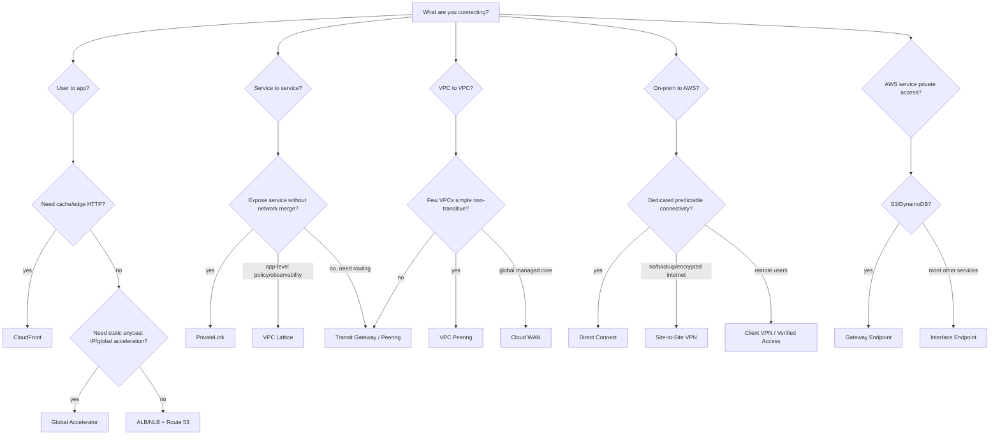
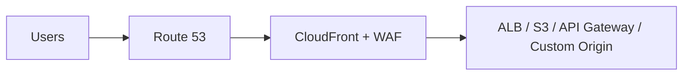
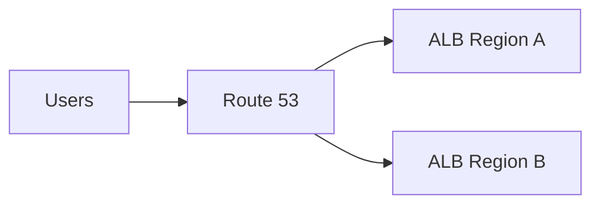
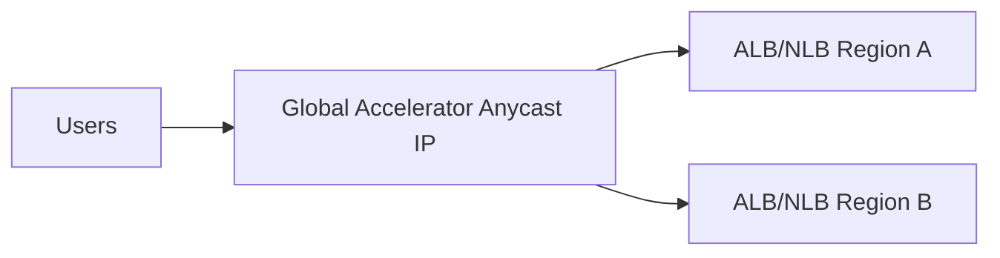
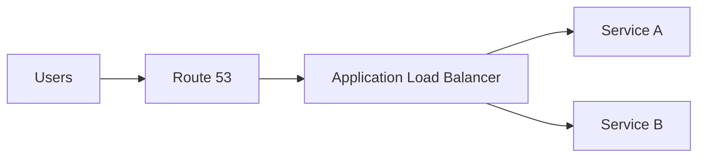
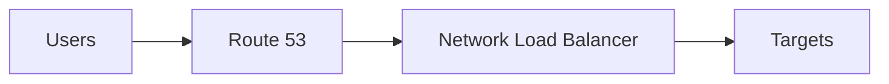
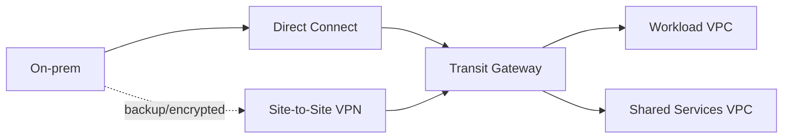

# Part 006 — Networking Decision Framework

Sekarang kita punya mental model packet path, boundary, dan control plane vs data plane.

Masalah berikutnya: **bagaimana memilih layanan yang tepat?**

AWS punya banyak pilihan:

- VPC Peering
- Transit Gateway
- Cloud WAN
- PrivateLink
- VPC Lattice
- Route 53
- Global Accelerator
- CloudFront
- ALB/NLB/GWLB
- Direct Connect
- Site-to-Site VPN
- Client VPN
- Verified Access
- VPC Endpoint
- NAT Gateway
- Network Firewall
- WAF
- Shield
- Firewall Manager

Engineer pemula bertanya:

> “Service mana yang paling bagus?”

Engineer matang bertanya:

> “Apa intent network-nya, traffic-nya layer berapa, siapa owner boundary-nya, apakah routing harus transitive, apakah CIDR overlap, failure semantics-nya apa, dan operasi apa yang harus aman saat incident?”

Part ini adalah decision framework. Tujuannya bukan menghafal jawaban, tetapi membangun cara berpikir yang bisa dipakai untuk arsitektur produksi.

---

## 1. Prinsip Utama: Jangan Pilih Layanan dari Nama

Nama layanan sering menipu.

Contoh:

- **VPC Peering** terdengar mudah, tetapi tidak transitive dan bisa meledak menjadi mesh yang sulit dikelola.
- **Transit Gateway** terdengar seperti default untuk semua multi-VPC, tetapi tidak selalu cocok untuk service exposure antar account dengan least privilege.
- **PrivateLink** terdengar seperti connectivity, tetapi sebenarnya lebih dekat ke private service publishing/consumption, bukan network merge.
- **CloudFront** terdengar seperti cache static asset, tetapi sering menjadi security, TLS, routing, bot defense, dan global edge control layer.
- **Route 53** terdengar seperti DNS, tetapi sering menjadi traffic steering dan failover control.
- **Global Accelerator** terdengar seperti CDN, padahal bukan cache; ia memberi static anycast IP dan routing lewat AWS global network ke endpoint regional.
- **VPC Lattice** terdengar seperti service mesh, tetapi ia adalah application networking layer terkelola lintas VPC/account.

Jadi mulai dari intent.

---

## 2. Decision Framework Ringkas

Gunakan pertanyaan berurutan ini:

Framework ini belum cukup detail, tetapi memberi arah awal.

---

## 3. Axis 1 — Apa yang Sedang Dihubungkan?

Pertanyaan pertama selalu:

> Endpoint mana bicara ke endpoint mana?

| Koneksi | Biasanya Kandidat |
|---|---|
| Internet user → web/app/API | Route 53, CloudFront, Global Accelerator, ALB, NLB, API Gateway, WAF, Shield |
| Browser/mobile → static/dynamic global content | CloudFront + origin + WAF |
| Internet user → regional low-latency app non-cache | Global Accelerator + ALB/NLB, atau Route 53 latency routing |
| VPC workload → AWS public service secara private | VPC Gateway Endpoint atau Interface Endpoint |
| VPC A → VPC B full private routing | VPC Peering, Transit Gateway, Cloud WAN |
| VPC consumer → provider service saja | PrivateLink, VPC Lattice |
| Banyak VPC/account/region → shared services | Transit Gateway, Cloud WAN, PrivateLink, VPC Lattice tergantung intent |
| On-prem datacenter → AWS | Direct Connect, Site-to-Site VPN, Transit Gateway, Cloud WAN |
| Remote employee → private app | Client VPN, Verified Access, identity-aware access, bastion pattern terbatas |
| Traffic harus melewati firewall appliance | Gateway Load Balancer, Network Firewall, TGW inspection VPC |

Kalau kamu belum bisa menjawab “siapa bicara ke siapa”, kamu belum siap memilih layanan.

---

## 4. Axis 2 — Network Merge atau Service Exposure?

Ini salah satu keputusan paling penting.

### Network Merge

Network merge berarti dua network diperlakukan seolah bisa saling route secara private.

Contoh:

- VPC Peering
- Transit Gateway
- Cloud WAN
- Direct Connect/VPN into VPC/TGW

Karakter:

- Route table penting.
- CIDR overlap biasanya masalah besar.
- Blast radius lebih luas.
- Security harus dijaga dengan SG/NACL/firewall/route segmentation.
- Cocok untuk shared infrastructure, domain internal, platform network.

### Service Exposure

Service exposure berarti consumer hanya mengakses service tertentu, bukan seluruh network provider.

Contoh:

- PrivateLink
- VPC Lattice
- API Gateway private API dengan VPC endpoint
- CloudFront/ALB sebagai controlled entry point

Karakter:

- Consumer tidak perlu route ke seluruh CIDR provider.
- CIDR overlap lebih mudah dihindari.
- Boundary lebih jelas.
- Cocok untuk SaaS, platform services, shared APIs, multi-account domain access.

Decision rule:

> Kalau consumer hanya butuh satu service, jangan buru-buru merge network.

---

## 5. VPC Peering vs Transit Gateway vs PrivateLink vs VPC Lattice

Ini decision point paling sering.

| Kriteria | VPC Peering | Transit Gateway | PrivateLink | VPC Lattice |
|---|---|---|---|---|
| Intent utama | Private routing antar VPC sederhana | Hub-and-spoke multi-network routing | Private service exposure | Application networking antar service/resource |
| Transitive routing | Tidak | Ya, melalui TGW route tables | Tidak dalam arti routing CIDR | Tidak sebagai L3 routing mesh |
| CIDR overlap | Tidak cocok | Tidak cocok untuk route overlap umum | Cocok untuk menghindari overlap | Cocok untuk service-level access |
| Banyak VPC | Sulit jika mesh besar | Cocok | Cocok untuk provider-consumer service | Cocok untuk service networks |
| Consumer melihat network provider | Ya, melalui route | Ya, sesuai route | Tidak, hanya endpoint service | Tidak sebagai full network merge |
| Policy model | Route + SG/NACL | Route domain + SG/NACL/firewall | Endpoint policy + service permission + SG | Auth policy + service network + target policy |
| Operational complexity | Rendah di skala kecil, tinggi di mesh | Menengah/tinggi, kuat untuk skala | Menengah, service-oriented | Menengah, app-networking-oriented |
| Best fit | 2-5 VPC simple | Enterprise multi-VPC/hybrid | SaaS/shared private service | Multi-account service-to-service access |

### Rule of Thumb

Gunakan **VPC Peering** jika:

- Jumlah VPC sedikit.
- Hubungan sederhana.
- Tidak butuh transitive routing.
- CIDR tidak overlap.
- Kamu ingin latency/path sederhana.

Gunakan **Transit Gateway** jika:

- Banyak VPC/account.
- Butuh hub-spoke routing.
- Butuh hybrid connectivity aggregation.
- Butuh segmentation via route tables.
- Butuh centralized inspection/egress pattern.

Gunakan **PrivateLink** jika:

- Consumer hanya perlu akses service tertentu.
- Provider tidak ingin membuka network penuh.
- Cross-account/private SaaS pattern.
- CIDR overlap harus dihindari.
- Exposure harus least-privilege.

Gunakan **VPC Lattice** jika:

- Fokusnya service-to-service application networking.
- Butuh auth, observability, dan service network lintas VPC/account.
- Ingin mengurangi beban route table/TGW untuk komunikasi aplikasi tertentu.
- Target bisa berada di beberapa compute/resource model dan ingin access policy di layer aplikasi.

---

## 6. Decision: Route 53 vs CloudFront vs Global Accelerator vs ELB

Semua bisa berada di jalur user-facing, tetapi perannya berbeda.

| Service | Pertanyaan yang Dijawab |
|---|---|
| Route 53 | Nama ini harus resolve ke endpoint mana? Bagaimana DNS-level routing/failover? |
| CloudFront | Bagaimana request HTTP(S) dilayani dari edge, dicache, diamankan, dan diteruskan ke origin? |
| Global Accelerator | Bagaimana client mendapat static anycast IP dan path global AWS ke endpoint regional sehat? |
| ALB | Bagaimana HTTP(S)/gRPC/WebSocket diroute ke target aplikasi regional? |
| NLB | Bagaimana TCP/UDP/TLS connection low-latency diarahkan ke target regional dengan L4 semantics? |

### Pattern Umum

#### Static/dynamic web app global

Pilih ini jika:

- HTTP(S) global.
- Butuh cache.
- Butuh WAF di edge.
- Butuh TLS edge termination.
- Butuh origin protection.

#### Regional app dengan DNS routing

Pilih ini jika:

- Routing/failover DNS cukup.
- Tidak butuh CDN cache.
- TTL/cache semantics dapat diterima.

#### Low-latency global app non-cache dengan static IP

Pilih ini jika:

- Butuh static IP global.
- Tidak ingin bergantung pada DNS TTL client untuk steering cepat.
- Traffic bukan cacheable content delivery.
- Endpoint regional bisa ALB/NLB/EC2/EIP sesuai dukungan layanan.

#### Regional L7 app

Pilih ALB jika:

- Butuh host/path/header routing.
- HTTP(S), gRPC, WebSocket.
- TLS termination di LB.
- Target group berbasis aplikasi.

#### Regional L4 app

Pilih NLB jika:

- TCP/UDP/TLS.
- Butuh source IP preservation.
- Butuh static IP per AZ/EIP.
- Butuh PrivateLink provider endpoint service.
- Butuh L4 latency/throughput characteristics.

---

## 7. Decision: NAT Gateway vs VPC Endpoint vs Public Access

Pertanyaan:

> Workload private subnet perlu akses apa?

| Need | Kandidat | Catatan |
|---|---|---|
| Akses internet umum outbound | NAT Gateway | Managed, AZ-specific, biaya per hour/data processing |
| Akses S3/DynamoDB private | Gateway Endpoint | Tidak lewat internet/NAT untuk route yang sesuai |
| Akses AWS services lain private | Interface Endpoint | Powered by PrivateLink, ENI private di subnet |
| Akses partner/private SaaS | Interface Endpoint/PrivateLink | Provider-consumer model |
| Akses package repository publik | NAT Gateway atau private mirror | Pertimbangkan cost, security, reproducibility |
| Tidak butuh outbound | Isolated subnet | Lebih aman, tetapi butuh deployment/ops path alternatif |

Rule:

> Jangan kirim traffic ke AWS service lewat NAT kalau endpoint private memenuhi kebutuhan security, cost, dan operasional.

Tapi jangan juga membuat interface endpoint secara membabi buta. Interface endpoint punya biaya, SG, DNS, policy, dan lifecycle sendiri.

---

## 8. Decision: Centralized Egress vs Distributed Egress

### Distributed Egress

Setiap VPC punya NAT/egress sendiri.

Kelebihan:

- Blast radius kecil.
- Route sederhana.
- Ownership jelas per workload.
- Tidak semua outbound bergantung pada hub.

Kekurangan:

- Biaya bisa tersebar/lebih tinggi.
- Policy egress sulit distandardisasi.
- Logging dan inspection terfragmentasi.

### Centralized Egress

Traffic outbound dari banyak VPC diarahkan ke egress/inspection VPC.

Kelebihan:

- Policy terpusat.
- Logging terpusat.
- Inspection lebih konsisten.
- Cocok untuk regulated enterprise.

Kekurangan:

- Routing lebih kompleks.
- Bisa menciptakan bottleneck/blast radius.
- Stateful inspection butuh symmetry.
- Cross-AZ/data processing cost perlu dihitung.

Decision rule:

> Centralize policy ketika governance lebih penting daripada simplicity, tetapi jangan lupa desain route symmetry, AZ locality, capacity, dan failure isolation.

---

## 9. Decision: Network Firewall vs WAF vs Security Group vs NACL

Ini sering salah kaprah.

| Tool | Layer/Scope | Cocok Untuk | Tidak Cocok Untuk |
|---|---|---|---|
| Security Group | ENI/resource-level, stateful | Least privilege antar workload/resource | Subnet-wide ordered deny rule |
| NACL | Subnet-level, stateless | Guardrail kasar, explicit deny, subnet boundary | Fine-grained app policy |
| AWS WAF | L7 HTTP(S) | Web exploit, managed rules, rate limiting, bot-oriented controls | TCP/UDP non-HTTP filtering |
| AWS Network Firewall | Network inspection L3-L7-ish stateful/stateless | Centralized egress/ingress inspection, Suricata-compatible rules | Per-resource identity policy |
| Route 53 DNS Firewall | DNS query control | Domain blocking/allowing, exfiltration guardrail | Packet/session inspection |
| AWS Shield | DDoS protection | Infrastructure/application DDoS resilience | General firewalling |

Rule:

> Security Group adalah default least-privilege primitive. WAF melindungi HTTP apps. Network Firewall menginspeksi network path. NACL adalah subnet guardrail, bukan pengganti SG.

---

## 10. Decision: Direct Connect vs Site-to-Site VPN

| Kriteria | Site-to-Site VPN | Direct Connect |
|---|---|---|
| Medium | Internet dengan IPSec | Dedicated/private connectivity path ke AWS location/partner |
| Provisioning | Lebih cepat | Lebih berat secara network/telco/partner |
| Bandwidth/predictability | Lebih terbatas dan internet-dependent | Lebih predictable untuk enterprise throughput |
| Encryption | IPSec built-in | Private connectivity; encryption perlu desain tambahan jika required |
| Best use | Backup, quick hybrid, encrypted tunnel | Primary enterprise hybrid connectivity |
| HA design | Dual tunnels, multi-CGW/VPN/TGW pattern | Multiple connections/locations/devices, DXGW/TGW pattern |

Pattern matang sering menggabungkan keduanya:

Rule:

> VPN cocok untuk cepat dan terenkripsi lewat internet. Direct Connect cocok untuk enterprise connectivity yang lebih predictable. Hybrid critical biasanya butuh redundant path, bukan satu koneksi heroik.

---

## 11. Decision: Client VPN vs Verified Access vs Bastion

| Need | Kandidat | Catatan |
|---|---|---|
| User remote butuh network-level access ke VPC | Client VPN | Memberi akses network, perlu route/authz/split tunnel design |
| User remote butuh app-level private access berbasis identity/device posture | Verified Access | Zero-trust style access tanpa full network VPN untuk app yang didukung |
| Admin butuh akses server | Session Manager lebih disukai; bastion jika benar-benar perlu | Bastion memperluas attack surface jika tidak disiplin |

Rule:

> Jangan memberi network-level access kalau kebutuhan sebenarnya hanya app-level access.

VPN membuka route. Verified/app-level access membuka aplikasi tertentu dengan policy lebih sempit.

---

## 12. Axis 3 — Layer Traffic: L3, L4, atau L7?

Sebelum memilih layanan, tentukan layer utamanya.

| Layer | Yang Dilihat | AWS Primitive |
|---|---|---|
| L3 | IP destination/source | VPC route table, TGW route table, peering, VPN, DX, Cloud WAN |
| L4 | TCP/UDP/TLS connection | NLB, NAT Gateway, security group, NACL, Network Firewall |
| L7 | HTTP host/path/header/method, auth context | ALB, CloudFront, WAF, API Gateway, VPC Lattice |
| Naming | DNS name/record | Route 53, Resolver, Cloud Map |
| Service exposure | Private endpoint/service contract | PrivateLink, VPC Lattice, endpoint services |

Kesalahan umum:

- Memakai route table untuk menyelesaikan masalah authorization aplikasi.
- Memakai WAF untuk masalah TCP non-HTTP.
- Memakai VPC Peering untuk expose satu API kecil.
- Memakai DNS sebagai mekanisme hard realtime failover.
- Memakai NAT Gateway untuk akses AWS service yang bisa lewat endpoint private.

---

## 13. Axis 4 — Routing Semantics

Tanyakan:

1. Apakah traffic harus transitive?
2. Apakah route perlu disegmentasi per domain?
3. Apakah ada route propagation?
4. Apakah static route lebih aman daripada propagated route?
5. Apakah ada overlapping CIDR?
6. Apakah return path simetris?
7. Apakah ada stateful middlebox?
8. Apakah route harus global/multi-region?

### Non-Transitive Simplicity

VPC Peering cocok ketika dua VPC perlu bicara langsung tanpa transit.

### Transitive Hub

Transit Gateway cocok ketika banyak network perlu hub routing dengan route tables.

### Global Policy Core

Cloud WAN cocok ketika organisasi ingin global network policy/segments yang dikelola lebih terpusat.

### No Route Merge

PrivateLink/VPC Lattice cocok ketika akses service tidak membutuhkan route ke seluruh CIDR.

---

## 14. Axis 5 — Security Boundary

Tentukan boundary yang benar:

| Boundary | Contoh Kontrol |
|---|---|
| Account | IAM, Organizations, RAM sharing, SCP |
| VPC | Route tables, CIDR, endpoints, DNS settings |
| Subnet | NACL, route table association, placement |
| ENI/resource | Security Group |
| Service | PrivateLink endpoint service, VPC Lattice service, API Gateway |
| HTTP edge | CloudFront, WAF, Shield, TLS policy |
| DNS | Route 53 Resolver, DNS Firewall, private hosted zone |
| Organization-wide | Firewall Manager, centralized logging, Network Manager |

Rule:

> Letakkan policy sedekat mungkin dengan intent-nya.

Jika intent-nya “service A boleh memanggil service B”, jangan hanya mengandalkan subnet route. Gunakan SG/service identity/app policy sesuai arsitektur.

Jika intent-nya “semua outbound domain berbahaya diblokir”, DNS Firewall/Network Firewall/egress proxy lebih sesuai daripada SG individual.

---

## 15. Axis 6 — Failure Semantics

Setiap pilihan layanan membawa cara gagal yang berbeda.

| Layanan | Failure Mode yang Harus Dipikirkan |
|---|---|
| Route 53 | TTL/cache, health check false positive/negative, resolver behavior |
| CloudFront | Edge propagation, origin failure, cache poisoning/mis-key, invalidation delay |
| Global Accelerator | Endpoint health, traffic dial, regional endpoint failure |
| ALB | Target health, listener/rule mistake, L7 timeout, 502/503/504 |
| NLB | Target health, TCP timeout, source IP/path, TLS passthrough complexity |
| TGW | Route table association/propagation mistake, route leak, inspection symmetry |
| PrivateLink | Endpoint acceptance, private DNS, endpoint SG, provider NLB health |
| NAT Gateway | AZ dependency, port exhaustion, cost spike, route misplacement |
| Direct Connect | Physical link/provider/router/BGP failure, redundant location design |
| VPN | Tunnel down, BGP convergence, internet path instability |

Decision rule:

> Pilih layanan bukan hanya karena success path-nya bagus, tetapi karena failure path-nya bisa kamu operasikan.

---

## 16. Axis 7 — Ownership Model

Network design gagal bukan hanya karena teknologi. Sering gagal karena ownership kabur.

Pertanyaan:

1. Siapa owner CIDR?
2. Siapa boleh membuat route?
3. Siapa approve PrivateLink consumer?
4. Siapa punya hosted zone?
5. Siapa mengelola certificate?
6. Siapa mengelola WAF rules?
7. Siapa membaca Flow Logs?
8. Siapa membayar data processing/egress cost?
9. Siapa on-call ketika traffic antar account gagal?

### Platform-Owned Network

Cocok untuk:

- Regulated enterprise.
- Banyak workload/account.
- Butuh standard inspection/logging.
- Butuh CIDR/IPAM governance.

Risiko:

- Bottleneck platform team.
- App team kehilangan konteks traffic.
- Change management lambat.

### App-Team-Owned Network

Cocok untuk:

- Startup/small teams.
- Bounded systems.
- High autonomy.

Risiko:

- Inconsistent security.
- CIDR overlap.
- Cost surprise.
- Hard-to-debug mesh.

Pattern matang biasanya hybrid:

- Platform owns shared network primitives, IPAM, TGW/Cloud WAN, DNS baseline, firewall baseline.
- App team owns service exposure, LB rules, SG least privilege, app-specific DNS records, observability.

---

## 17. Decision Framework by Scenario

### Scenario A — Dua VPC dalam satu account perlu komunikasi private sederhana

Gunakan:

- VPC Peering jika tidak butuh transit dan CIDR tidak overlap.
- SG referencing kalau sesuai dukungan dan arah komunikasi jelas.
- Route table update dua arah.

Jangan gunakan TGW hanya karena “enterprise-ish” jika topology kecil dan stabil.

---

### Scenario B — 80 workload VPC lintas account perlu akses shared services dan on-prem

Gunakan:

- Transit Gateway atau Cloud WAN sebagai routing core.
- RAM sharing untuk attachment/account model.
- Route table segmentation.
- Shared services VPC.
- Inspection/egress VPC jika governance butuh.
- Route 53 Resolver untuk hybrid DNS.
- IPAM untuk CIDR governance.

Jangan membuat full mesh VPC Peering.

---

### Scenario C — Tim platform menyediakan internal API untuk banyak account consumer

Kandidat utama:

- PrivateLink jika expose service tertentu dan ingin provider/consumer boundary kuat.
- VPC Lattice jika butuh service network, auth policy, dan observability app networking.
- API Gateway private API jika API management concern kuat.

Jangan memberi TGW route ke seluruh provider VPC hanya untuk satu API.

---

### Scenario D — Aplikasi publik global dengan banyak static asset dan API origin

Gunakan:

- Route 53 untuk domain.
- CloudFront sebagai edge layer.
- WAF di CloudFront.
- S3/ALB/API Gateway/custom origin sesuai kebutuhan.
- Origin Access Control untuk S3 origin.
- Cache policy/origin request policy yang eksplisit.

Jangan langsung expose ALB publik global tanpa edge/security/cache reasoning.

---

### Scenario E — API regional butuh L7 routing dan auth integration

Gunakan:

- ALB untuk host/path/header routing ke service target.
- WAF jika HTTP threat filtering dibutuhkan.
- Route 53 alias record.
- CloudFront di depan jika global edge/cache/WAF-at-edge/TLS edge/origin protection dibutuhkan.

---

### Scenario F — TCP service butuh source IP preservation dan static IP

Gunakan:

- NLB.
- Route 53 alias atau Global Accelerator jika global anycast/static IP dibutuhkan.
- Security group/NACL/target firewall sesuai source IP behavior.

Jangan pakai ALB untuk non-HTTP TCP service.

---

### Scenario G — Semua private subnet butuh akses S3 besar-besaran

Gunakan:

- Gateway VPC Endpoint untuk S3.
- Endpoint policy dan bucket policy yang konsisten.
- Jangan route S3 traffic lewat NAT jika endpoint memenuhi requirement.

Manfaat:

- Mengurangi NAT dependency.
- Mengurangi biaya NAT data processing.
- Memperjelas private access path.

---

### Scenario H — Branch/on-prem perlu akses banyak VPC

Gunakan:

- Direct Connect untuk primary predictable connectivity jika enterprise-grade.
- Site-to-Site VPN untuk encrypted/backup/quick path.
- Transit Gateway untuk hub ke banyak VPC.
- Route 53 Resolver inbound/outbound endpoint untuk DNS hybrid.
- Redundant connections/devices/locations.

Jangan terminate VPN satu-satu ke banyak VPC jika jumlahnya besar dan governance penting.

---

### Scenario I — Butuh outbound traffic inspection untuk regulated environment

Gunakan kombinasi:

- TGW route segmentation.
- Egress/inspection VPC.
- AWS Network Firewall atau third-party firewall via GWLB.
- Route 53 DNS Firewall untuk DNS-level control.
- Centralized logging.

Pastikan:

- Return path simetris.
- Per-AZ path tidak menciptakan cross-AZ hairpin berlebihan.
- Failure mode firewall jelas: fail-open atau fail-closed sesuai risiko.

---

## 18. Cost as Architecture Constraint

Networking cost bukan detail billing belakangan. Ia memengaruhi desain.

Perhatikan kategori:

| Cost Driver | Contoh |
|---|---|
| Hourly resource | NAT Gateway, interface endpoint, load balancer, firewall endpoint, VPN, DX port |
| Data processing | NAT Gateway, TGW, PrivateLink, CloudFront, GWLB, Network Firewall |
| Inter-AZ transfer | Traffic lintas AZ karena LB/NAT/firewall/topology |
| Inter-region transfer | Cross-region peering, replication, global active-active |
| Internet egress | Outbound ke internet/user |
| Logging volume | Flow Logs, ALB logs, CloudFront real-time logs, DNS query logs |

Decision rule:

> Desain network yang “benar” tetapi membuat semua traffic hairpin lintas AZ/region bisa menjadi salah secara ekonomi dan reliability.

Optimasi cost yang matang:

- Gunakan endpoint private untuk AWS service traffic yang besar.
- Hindari cross-AZ NAT path jika tidak perlu.
- Tempatkan NAT Gateway per AZ untuk AZ locality jika workload besar.
- Jangan centralize semua traffic tanpa menghitung TGW + firewall + cross-AZ + data processing.
- Gunakan CloudFront untuk offload origin dan mengurangi origin egress jika sesuai pattern.
- Jangan enable high-volume logs tanpa retention/sampling/partition strategy.

---

## 19. Observability Decision

Setiap pilihan harus punya observability pair.

| Layanan/Area | Observability Minimal |
|---|---|
| VPC routing/security | VPC Flow Logs, Reachability Analyzer, Network Access Analyzer |
| ALB | Access logs, target health reason, CloudWatch metrics |
| NLB | Flow logs, target health, connection metrics |
| CloudFront | Standard logs/real-time logs, cache metrics, origin latency, status codes |
| Route 53 | Query logs, health check status, resolver query logs |
| TGW | Route tables, Flow Logs where applicable, Network Manager |
| NAT Gateway | CloudWatch metrics, Flow Logs, port allocation/errors |
| PrivateLink | Endpoint ENI, CloudWatch metrics, provider NLB logs/health |
| Network Firewall | Flow/alert logs, policy versioning |
| WAF | Sampled requests, logs, rule labels/count/block metrics |

Rule:

> Jangan deploy network primitive yang tidak bisa kamu lihat saat gagal.

---

## 20. Anti-Patterns

### Anti-Pattern 1 — “Just Peer Everything”

Full mesh peering tampak sederhana di awal.

Masalah:

- Route table explosion.
- No transitive routing.
- Hard to segment.
- Difficult ownership.
- CIDR governance rapuh.

Gunakan peering untuk hubungan sederhana, bukan enterprise routing fabric.

---

### Anti-Pattern 2 — “One Giant Shared VPC for Everything”

Masalah:

- Blast radius besar.
- Ownership kabur.
- Subnet/SG/NACL jadi medan perang.
- Sulit memisahkan lifecycle environment/domain.

Shared VPC berguna, tetapi harus punya boundary dan ownership jelas.

---

### Anti-Pattern 3 — “Private Subnet Means Secure”

Private subnet hanya berarti tidak punya route langsung ke IGW untuk inbound publik.

Ia belum menjamin:

- Outbound aman.
- East-west traffic aman.
- IAM/resource policy aman.
- DNS exfiltration dicegah.
- Endpoint policy benar.

Security tetap butuh policy layer yang sesuai.

---

### Anti-Pattern 4 — “DNS Failover Solves DR”

DNS failover membantu, tetapi bukan seluruh DR.

Kamu masih butuh:

- Secondary region siap.
- Data replication.
- Certificates.
- LB/target sehat.
- App config.
- Auth/session strategy.
- TTL/cache expectation.
- Runbook.

---

### Anti-Pattern 5 — “Centralized Inspection Without Symmetry”

Stateful firewall butuh melihat flow dua arah.

Jika request lewat firewall A tetapi response balik lewat jalur lain, koneksi bisa gagal.

Cek:

- TGW route table.
- Appliance mode jika relevan.
- Per-AZ routing.
- Return route.
- NAT behavior.

---

### Anti-Pattern 6 — “Use NAT for Everything”

NAT Gateway sering dipakai sebagai default outbound untuk semua.

Masalah:

- Biaya data processing.
- Port exhaustion untuk high-scale destination tertentu.
- Kurang granular untuk AWS service private access.
- Semua traffic terlihat sebagai NAT IP ke destination.

Gunakan VPC endpoint, private mirror, egress proxy, atau explicit outbound architecture jika lebih cocok.

---

## 21. Decision Table Cepat

| Kebutuhan | Pilihan Awal yang Masuk Akal |
|---|---|
| Public global static/dynamic web | CloudFront + Route 53 + WAF + origin |
| Public regional HTTP app | Route 53 + ALB + optional WAF |
| Public TCP/UDP service | Route 53/Global Accelerator + NLB |
| Static anycast IP global | Global Accelerator |
| DNS routing/failover | Route 53 routing policy + health checks |
| Simple VPC-to-VPC private routing | VPC Peering |
| Many VPC/account routing hub | Transit Gateway |
| Global enterprise network policy core | Cloud WAN |
| Private service exposure cross-account | PrivateLink |
| Service-to-service app networking | VPC Lattice |
| Private AWS service access | Gateway/Interface VPC Endpoint |
| Hybrid dedicated connection | Direct Connect |
| Hybrid encrypted internet connection | Site-to-Site VPN |
| Remote user network access | Client VPN |
| Remote app-level zero-trust access | Verified Access |
| L7 web protection | WAF |
| DDoS resilience | Shield + edge architecture |
| Central network inspection | Network Firewall or GWLB appliance pattern |
| DNS exfiltration/domain control | Route 53 Resolver DNS Firewall |

---

## 22. Architecture Review Checklist

Saat review desain AWS networking, gunakan checklist ini.

### Intent

- Apa user/workload/source dan destination?
- Apakah butuh network merge atau service exposure?
- Apakah traffic L3, L4, L7, DNS, atau service-level?

### Addressing and Routing

- CIDR overlap?
- Route transitive dibutuhkan?
- Route table mana yang authoritative?
- Longest prefix match memengaruhi path?
- Ada propagated routes?
- Return path simetris?

### Security

- Boundary security ada di mana: SG, NACL, WAF, endpoint policy, IAM, service policy, firewall?
- Apakah least privilege diterapkan dekat dengan resource/service?
- Apakah egress dikontrol?
- Apakah DNS dikontrol?

### Resilience

- Apa failure domain: AZ, Region, edge, route domain, control plane, data plane?
- Apa failover mechanism?
- Apakah failover butuh control-plane heavy change?
- Bagaimana health check didefinisikan?

### Operations

- Siapa owner resource?
- Bagaimana deployment/cutover/rollback?
- Apa propagation delay?
- Apa observability signal?
- Apa runbook untuk failure utama?

### Cost

- Ada NAT/TGW/PrivateLink/Firewall/CloudFront data processing cost?
- Ada cross-AZ atau cross-region transfer?
- Ada logging volume besar?
- Apakah centralized pattern menciptakan hidden cost?

---

## 23. Contoh Review: Internal Payment API

Requirement:

- Payment API di account `payments-prod`.
- Dipakai oleh 20 workload account.
- Tidak boleh terekspos internet.
- Consumer tidak boleh route ke seluruh VPC payment.
- CIDR beberapa consumer mungkin overlap.
- Butuh audit siapa consumer.

Pilihan buruk:

- TGW route semua consumer ke VPC payment.
- Buka SG dari banyak CIDR.
- Mengandalkan path-level isolation manual.

Pilihan lebih tepat:

- PrivateLink endpoint service atau VPC Lattice.
- Provider expose hanya API/payment service.
- Consumer membuat endpoint/service association.
- Policy per principal/account/service.
- Observability provider dan consumer.

Kenapa?

Karena intent-nya bukan network merge. Intent-nya private service consumption dengan boundary kuat.

---

## 24. Contoh Review: Shared Database Administration Network

Requirement:

- DBA/admin service perlu akses private ke database di banyak VPC.
- Jumlah VPC besar.
- Akses bersifat internal operational.
- CIDR dikelola pusat.
- Ada inspection/logging requirement.

Pilihan masuk akal:

- Transit Gateway sebagai hub.
- Route table segmentation.
- Shared services/admin VPC.
- Security Group least privilege ke database ports.
- Network Firewall/GWLB jika traffic inspection wajib.
- Resolver rules untuk private DNS.

Kenapa bukan PrivateLink?

Bisa saja untuk service tertentu, tetapi jika kebutuhan operasionalnya memang private routing ke banyak resource dengan governance pusat, TGW lebih natural.

---

## 25. Contoh Review: Public News Portal Global

Requirement:

- User global.
- Banyak static assets.
- Dynamic API.
- DDoS/web exploit risk.
- Origin ingin dilindungi.

Pilihan masuk akal:

- Route 53 public hosted zone.
- CloudFront distribution.
- WAF attached at CloudFront.
- S3 origin dengan OAC untuk static.
- ALB/API Gateway origin untuk dynamic.
- Cache policy eksplisit.
- Origin request policy minimal.
- Shield consideration sesuai risk profile.

Kenapa bukan Global Accelerator saja?

Karena kebutuhan utama adalah HTTP(S) edge delivery, cache, dan web security. Global Accelerator tidak melakukan caching content seperti CDN.

---

## 26. Contoh Review: Real-Time Game TCP Service

Requirement:

- TCP/UDP low latency.
- Tidak cacheable.
- Butuh static IP global.
- Regional endpoints di beberapa region.

Pilihan masuk akal:

- Global Accelerator.
- Endpoint group per region.
- NLB/EC2 endpoints sesuai arsitektur.
- Health checks dan traffic dial.
- Route 53 untuk nama ke accelerator.

Kenapa bukan CloudFront?

Karena traffic bukan HTTP content delivery/cache pattern utama.

---

## 27. Heuristik Final

Gunakan heuristik ini saat bingung:

1. **Butuh cache/edge HTTP?** CloudFront.
2. **Butuh DNS routing?** Route 53.
3. **Butuh static anycast global non-cache?** Global Accelerator.
4. **Butuh L7 regional routing?** ALB.
5. **Butuh L4 regional routing/source IP/static IP?** NLB.
6. **Butuh private AWS service access?** VPC Endpoint.
7. **Butuh expose satu service private?** PrivateLink atau VPC Lattice.
8. **Butuh full routing antar banyak VPC?** Transit Gateway atau Cloud WAN.
9. **Butuh simple two-VPC route?** VPC Peering.
10. **Butuh hybrid predictable?** Direct Connect.
11. **Butuh hybrid encrypted quick/backup?** Site-to-Site VPN.
12. **Butuh user-to-network?** Client VPN.
13. **Butuh user-to-app zero-trust?** Verified Access.
14. **Butuh HTTP protection?** WAF.
15. **Butuh network inspection?** Network Firewall/GWLB.
16. **Butuh org-wide firewall policy?** Firewall Manager.

---

## 28. Kaitan dengan Part Berikutnya

Mulai Part 007 kita masuk ke Amazon VPC dari first principles.

Part 006 ini menjadi peta keputusan. Part 007+ akan membedah primitive yang paling dasar:

- VPC internal model.
- CIDR dan subnet design.
- Route table.
- Internet gateway.
- NAT.
- Security Group.
- NACL.
- ENI.
- DNS resolver.
- VPC endpoint.
- Flow Logs dan traffic mirroring.

Kita akan kembali ke framework ini berkali-kali. Setiap layanan AWS networking akan dibaca bukan sebagai fitur, tetapi sebagai jawaban terhadap decision axis tertentu.

---

## 29. Ringkasan

Networking Decision Framework membantu kamu tidak terjebak pada hafalan layanan.

Intinya:

- Mulai dari intent: siapa bicara ke siapa.
- Bedakan network merge vs service exposure.
- Tentukan layer: L3, L4, L7, DNS, atau service-level.
- Pahami routing semantics: transitive, propagation, overlap, symmetry.
- Letakkan security policy di boundary yang tepat.
- Evaluasi failure semantics dan control-plane dependency.
- Hitung ownership dan cost sejak awal.
- Jangan deploy primitive tanpa observability.

Pertanyaan terbaik bukan:

> “Pakai layanan AWS apa?”

Pertanyaan terbaik adalah:

> “Boundary, traffic semantics, failure behavior, dan ownership seperti apa yang kita butuhkan?”

Jika pertanyaan itu jelas, pilihan layanan biasanya menjadi jauh lebih sederhana.

---

## References

- AWS Networking and Content Delivery decision guide: https://docs.aws.amazon.com/decision-guides/latest/networking-on-aws-how-to-choose/choosing-networking-and-content-delivery-service.html
- Amazon VPC route tables: https://docs.aws.amazon.com/vpc/latest/userguide/VPC_Route_Tables.html
- Amazon VPC route priority: https://docs.aws.amazon.com/vpc/latest/userguide/route-tables-priority.html
- AWS PrivateLink multi-VPC whitepaper: https://docs.aws.amazon.com/whitepapers/latest/building-scalable-secure-multi-vpc-network-infrastructure/aws-privatelink.html
- AWS Transit Gateway route tables: https://docs.aws.amazon.com/vpc/latest/tgw/tgw-route-tables.html
- Amazon VPC Lattice user guide: https://docs.aws.amazon.com/vpc-lattice/latest/ug/what-is-vpc-lattice.html
- AWS VPC connectivity options whitepaper: https://docs.aws.amazon.com/whitepapers/latest/aws-vpc-connectivity-options/introduction.html
