# Part 007 — Amazon VPC Internal Model

Kita mulai fase baru: **Amazon VPC from first principles**.

Kalau kamu hanya menghafal VPC sebagai “network virtual di AWS”, kamu akan cepat mentok ketika menghadapi kasus nyata:

- instance di private subnet tidak bisa akses internet;
- ALB bisa menerima traffic, tetapi target selalu unhealthy;
- service A tidak bisa akses RDS walau security group sudah dibuka;
- subnet terlihat benar, tetapi route table ternyata salah association;
- traffic dari on-prem masuk, tetapi response tidak balik lewat jalur yang sama;
- NAT Gateway ada, tetapi biaya membengkak;
- VPC Endpoint dibuat, tetapi DNS masih resolve ke public endpoint;
- multi-account network terlihat rapi di diagram, tetapi sulit dioperasikan saat incident.

Masalah-masalah itu tidak bisa diselesaikan dengan hafalan nama layanan. Kamu perlu model internal.

Part ini membangun cara membaca Amazon VPC sebagai **graph of packet decisions**.

Bukan sekadar:

> VPC punya subnet, route table, security group.

Tetapi:

> Setiap packet masuk ke sebuah network boundary, mengalami keputusan routing, filtering, address selection, name resolution, gateway forwarding, dan service-specific handling. VPC adalah tempat semua keputusan itu dikomposisikan.

---

## 1. Definisi Operasional VPC

Secara operasional, VPC adalah **network boundary terisolasi secara logis** tempat kamu menaruh resource AWS dan menentukan bagaimana resource itu berkomunikasi.

Namun untuk engineer produksi, definisi itu masih terlalu lunak.

Definisi yang lebih berguna:

> VPC adalah graph regional yang menggabungkan address space, subnet placement per Availability Zone, routing intent, interface attachment, firewall policy, DNS behavior, dan gateway/endpoint attachment.

Jadi VPC bukan satu benda. VPC adalah komposisi primitive.

Primitive utama:

| Primitive | Fungsi Mental Model |
|---|---|
| VPC CIDR | Address universe untuk network tersebut. |
| Subnet | Slice CIDR di satu Availability Zone. |
| Route table | Decision table untuk next hop. |
| ENI | Attachment point resource ke network. |
| Security Group | Stateful firewall di level resource/ENI. |
| Network ACL | Stateless firewall di level subnet. |
| Internet Gateway | Boundary VPC ke internet. |
| NAT Gateway | Outbound IPv4 translation untuk private subnet. |
| Egress-only IGW | Outbound-only IPv6 internet path. |
| VPC Endpoint | Private path ke AWS service atau endpoint service. |
| DHCP option set | Parameter DNS/domain untuk resource VPC. |
| Route 53 Resolver | DNS resolver internal VPC. |
| Flow Logs | Metadata observability untuk traffic. |

VPC yang matang bukan yang “punya banyak subnet”. VPC yang matang adalah VPC yang setiap primitive-nya punya intent.

---

## 2. Cara Paling Salah Membaca VPC

Cara salah:

```text
VPC
 ├─ Public subnet
 ├─ Private subnet
 ├─ Internet Gateway
 └─ NAT Gateway
```

Ini terlalu visual dan terlalu dangkal. Diagram seperti ini membuat kamu lupa bahwa subnet tidak otomatis public/private. Subnet menjadi public/private karena **route table**.

Lebih benar:

```text
Subnet = CIDR slice + AZ placement + route table association + NACL association
```

Public subnet bukan subnet dengan nama `public-a`.

Public subnet adalah subnet yang route table-nya punya route ke Internet Gateway, biasanya:

```text
0.0.0.0/0 -> igw-xxxxx
::/0      -> igw-xxxxx   # untuk IPv6 public path
```

Private subnet bukan subnet dengan nama `private-a`.

Private subnet adalah subnet yang tidak punya direct route ke Internet Gateway. Untuk outbound IPv4 internet, biasanya memakai:

```text
0.0.0.0/0 -> nat-xxxxx
```

Isolated subnet adalah subnet yang tidak punya route ke internet, baik langsung via IGW maupun tidak langsung via NAT.

```text
10.0.0.0/16 -> local
# mungkin route ke TGW / endpoint / internal networks
# tidak ada default route ke IGW/NAT
```

Jadi mental model pertama:

> Nama subnet tidak berarti apa-apa. Route table adalah sumber kebenaran.

---

## 3. VPC sebagai Graph, Bukan Kotak

Bayangkan VPC seperti graph.

Node:

- subnet;
- route table;
- ENI;
- gateway;
- endpoint;
- load balancer;
- NAT;
- firewall appliance;
- resolver;
- external network.

Edge:

- route association;
- target attachment;
- DNS resolution path;
- security group reference;
- endpoint policy;
- propagated route;
- peering/TGW attachment;
- gateway attachment.

Graph sederhana:

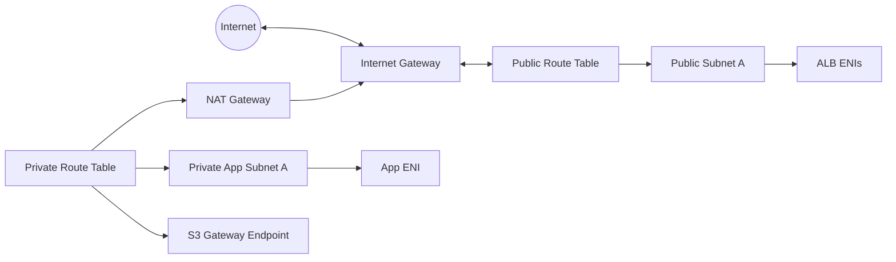

Tapi graph di atas masih menyembunyikan detail penting: security group, NACL, DNS, dan stateful connection tracking.

Graph yang lebih realistis:

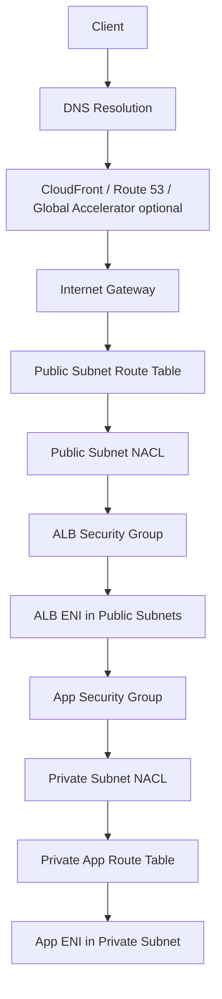

Saat incident, kamu perlu bertanya:

1. DNS resolve ke mana?
2. Packet masuk dari boundary mana?
3. ENI mana yang menerima?
4. Route table mana yang berlaku?
5. NACL mana yang berlaku?
6. Security group mana yang berlaku?
7. Response route-nya simetris atau tidak?
8. Ada NAT/translation di path?
9. Ada endpoint/private DNS yang mengubah destination?
10. Ada managed service yang membuat ENI diam-diam?

---

## 4. Region Scope: VPC Bersifat Regional

VPC berada pada scope **Region**, bukan global dan bukan AZ.

Artinya:

- satu VPC bisa punya subnet di banyak AZ dalam Region yang sama;
- subnet hanya berada di satu AZ;
- route table adalah resource regional, tetapi association-nya ke subnet;
- Internet Gateway attach ke VPC regional;
- NAT Gateway berada di subnet tertentu, sehingga punya implikasi AZ;
- Availability Zone failure tidak berarti seluruh VPC mati, tetapi subnet di AZ itu terdampak;
- service-managed ENI biasanya dibuat pada subnet/AZ yang kamu pilih.

Mental model:

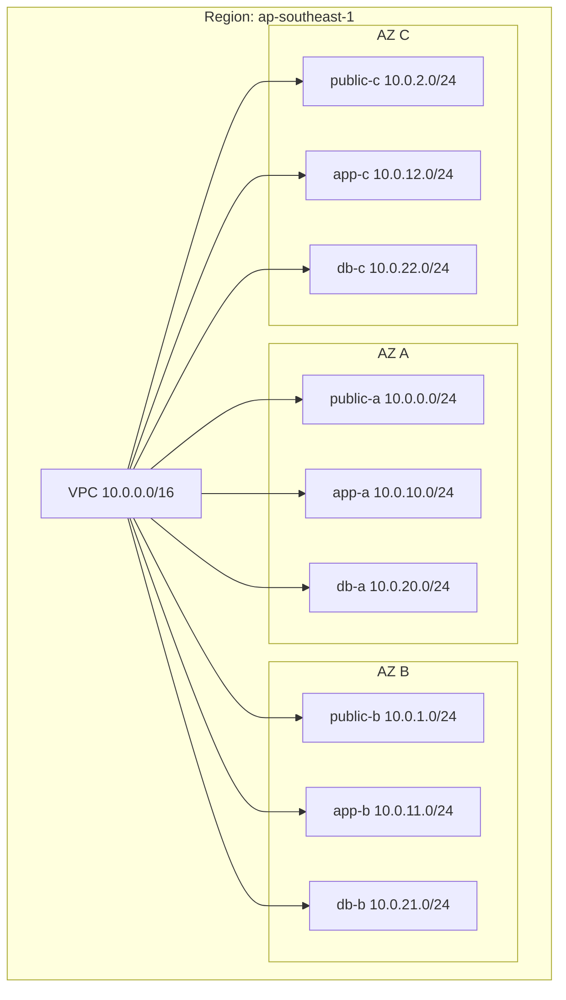

Ini terlihat sederhana, tapi konsekuensinya besar:

- desain HA membutuhkan subnet per tier di minimal dua AZ;
- NAT Gateway yang hanya ada di satu AZ bisa menjadi cross-AZ dependency;
- load balancer perlu subnet di beberapa AZ;
- route ke appliance/firewall harus memperhatikan AZ locality;
- IP planning harus menyisakan ruang per AZ dan per tier;
- subnet yang terlalu kecil bisa menghambat autoscaling.

---

## 5. CIDR: Address Universe VPC

Saat membuat VPC, kamu menentukan IPv4 CIDR.

Contoh:

```text
10.0.0.0/16
```

Itu berarti VPC memiliki address universe sekitar 65 ribu alamat IPv4 sebelum dikurangi reserved address dan pembagian subnet.

Namun CIDR bukan hanya angka kapasitas. CIDR adalah **kontrak routing jangka panjang**.

CIDR menentukan:

- apakah VPC bisa dihubungkan ke VPC lain;
- apakah VPC bisa dihubungkan ke on-prem;
- apakah route summarization mudah;
- apakah ada overlap dengan partner/SaaS/hybrid;
- apakah migrasi nanti mahal;
- apakah subnet bisa tumbuh tanpa renumbering;
- apakah desain multi-region bisa konsisten.

Kesalahan CIDR biasanya tidak terasa di hari pertama. Terasa setelah:

- perusahaan membuka region baru;
- account bertambah banyak;
- VPC peering/TGW mulai dipakai;
- on-prem network harus connect;
- akuisisi perusahaan membawa CIDR overlap;
- Kubernetes pod IP membutuhkan ruang besar;
- serverless/service-managed ENI memakan IP subnet.

Rule penting:

> CIDR adalah keputusan arsitektur, bukan sekadar parameter Terraform.

---

## 6. Subnet: AZ-Scoped Slice dari VPC

Subnet adalah range IP dalam VPC yang berada di satu AZ.

Subnet membawa beberapa keputusan sekaligus:

```text
subnet = CIDR range + Availability Zone + route table association + NACL association + resource placement boundary
```

Contoh:

```text
VPC: 10.0.0.0/16

public-a: 10.0.0.0/24   in AZ A
public-b: 10.0.1.0/24   in AZ B
public-c: 10.0.2.0/24   in AZ C

app-a:    10.0.10.0/24  in AZ A
app-b:    10.0.11.0/24  in AZ B
app-c:    10.0.12.0/24  in AZ C

db-a:     10.0.20.0/24  in AZ A
db-b:     10.0.21.0/24  in AZ B
db-c:     10.0.22.0/24  in AZ C
```

Jangan memikirkan subnet hanya sebagai “folder resource”. Subnet adalah domain untuk:

- route behavior;
- NACL behavior;
- AZ placement;
- IP capacity;
- blast radius;
- service integration;
- load balancer placement;
- endpoint placement;
- failure isolation.

---

## 7. Subnet Tidak Sama dengan Security Boundary Mutlak

Banyak engineer memperlakukan subnet seperti security boundary mutlak.

Misalnya:

```text
web subnet  -> less secure
app subnet  -> secure
db subnet   -> very secure
```

Ini kurang tepat.

Subnet memberi kamu dua security control utama:

1. route table;
2. NACL.

Tetapi banyak enforcement yang lebih dekat ke resource dilakukan oleh Security Group.

Contoh:

- dua EC2 di subnet yang sama tetap bisa dibatasi dengan SG;
- resource di subnet berbeda tetap bisa bebas komunikasi kalau route dan SG mengizinkan;
- subnet isolated tidak otomatis aman jika SG membuka traffic dari semua internal CIDR;
- NACL terlalu kasar untuk micro-segmentation yang dinamis.

Mental model lebih benar:

| Boundary | Cocok Untuk | Tidak Cocok Untuk |
|---|---|---|
| Subnet | Routing intent, AZ placement, coarse segmentation | Fine-grained per-service policy |
| NACL | Guardrail subnet-level, deny/allow stateless | Dynamic service identity |
| Security Group | Resource-level stateful allow rules | Explicit deny, packet inspection |
| Network Firewall | Central inspection, L3-L7 rule engine | Per-instance identity policy |
| WAF | HTTP application protection | Non-HTTP network control |
| IAM/Resource Policy | API/service authorization | Packet path filtering |

Subnet adalah **routing and placement boundary**. Security boundary-nya muncul dari kombinasi beberapa control.

---

## 8. Route Table: Decision Table VPC

Route table adalah komponen yang paling sering menjadi akar masalah.

Route table berisi route:

```text
destination CIDR -> target
```

Contoh:

```text
10.0.0.0/16 -> local
0.0.0.0/0   -> nat-abc123
```

Interpretasi:

- traffic ke CIDR VPC sendiri dikirim secara local;
- selain itu, default IPv4 route dikirim ke NAT Gateway.

Route table bukan firewall. Route table tidak memutuskan “boleh atau tidak”. Route table memutuskan “ke mana”.

Jika tidak ada route cocok, packet tidak punya next hop.

Prinsip:

> Routing chooses path. Security decides permission.

Namun dalam praktik, routing dan security sering terlihat seperti gejala yang sama: “tidak bisa connect”. Bedanya:

- routing salah → packet tidak menemukan path atau response tidak balik;
- security salah → packet sampai boundary tapi ditolak/drop;
- DNS salah → packet menuju alamat yang salah;
- listener/app salah → packet sampai host tapi aplikasi tidak merespons benar.

---

## 9. Local Route: Fondasi Komunikasi Internal VPC

Setiap VPC punya route `local` untuk CIDR VPC.

Contoh:

```text
10.0.0.0/16 -> local
```

Artinya resource di VPC bisa saling reach secara routing sepanjang:

- destination IP berada dalam CIDR VPC;
- NACL mengizinkan;
- Security Group mengizinkan;
- OS firewall/app listener mengizinkan;
- tidak ada route lebih spesifik yang mengubah path.

`local` route sering disalahpahami sebagai “semua resource bisa saling bicara”. Yang benar:

> local route memberi kemungkinan path internal. Ia tidak otomatis memberi izin security.

Contoh:

```text
EC2 A: 10.0.10.15
EC2 B: 10.0.20.20
VPC:   10.0.0.0/16
```

Routing A ke B cocok dengan:

```text
10.0.0.0/16 -> local
```

Tetapi komunikasi tetap bisa gagal jika:

- SG B tidak allow source SG A;
- NACL subnet B tidak allow inbound port;
- NACL subnet A tidak allow ephemeral return;
- app di B bind ke localhost;
- B tidak listen di port tersebut;
- OS firewall drop;
- traffic diarahkan ke route lebih spesifik misalnya inspection appliance.

---

## 10. Internet Gateway: Boundary ke Internet, Bukan NAT untuk Private Subnet

Internet Gateway adalah komponen VPC untuk komunikasi ke internet.

Namun tidak cukup hanya attach IGW ke VPC.

Agar resource menerima/keluar internet secara langsung untuk IPv4, biasanya perlu:

1. VPC punya Internet Gateway attached;
2. subnet route table punya route `0.0.0.0/0 -> igw`;
3. instance/resource punya public IPv4 atau Elastic IP;
4. Security Group mengizinkan;
5. NACL mengizinkan;
6. OS/app listen benar.

Jika salah satu tidak ada, public connectivity bisa gagal.

Diagram:

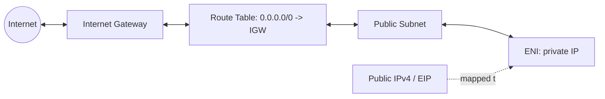

Public IPv4 bukan IP yang benar-benar melekat sebagai primary private address di OS seperti alamat lokal. Ia dipetakan ke private IP resource. Itulah sebabnya instance tetap melihat private IP di interface, sementara dari luar terlihat public IP.

---

## 11. NAT Gateway: Outbound IPv4 untuk Private Subnet

NAT Gateway memungkinkan resource di private subnet melakukan outbound IPv4 ke internet tanpa menerima inbound connection langsung dari internet.

Pattern umum:

```text
private subnet route table:
0.0.0.0/0 -> nat-gateway-in-public-subnet

public subnet route table:
0.0.0.0/0 -> internet-gateway
```

Flow:

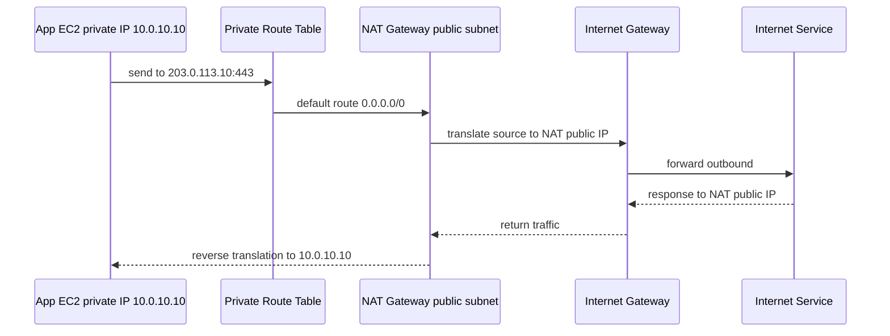

Important:

- NAT Gateway bukan untuk inbound internet ke private instance;
- NAT Gateway adalah AZ-scoped resource karena ditempatkan di subnet tertentu;
- private subnet di AZ A sebaiknya memakai NAT Gateway di AZ A untuk menghindari cross-AZ dependency/cost;
- NAT Gateway bisa menjadi sumber biaya besar karena hourly charge dan data processing;
- NAT Gateway tidak dibutuhkan untuk akses S3/DynamoDB jika Gateway Endpoint dipakai;
- NAT Gateway tidak dibutuhkan untuk banyak AWS API jika Interface Endpoint dipakai;
- NAT Gateway hanya relevan untuk IPv4 NAT; IPv6 outbound-only memakai egress-only Internet Gateway.

---

## 12. ENI: Tempat Resource Menyentuh Network

Elastic Network Interface atau ENI adalah attachment point resource ke VPC.

Mental model:

> Resource tidak “hidup di VPC” secara abstrak. Resource berkomunikasi lewat satu atau lebih ENI.

ENI memiliki:

- private IPv4;
- optional secondary private IPv4;
- optional IPv6;
- subnet placement;
- security group association;
- MAC address;
- source/destination check behavior untuk beberapa use case;
- attachment ke instance/service.

Resource yang memakai ENI:

- EC2;
- Lambda in VPC;
- RDS;
- EFS mount target;
- VPC endpoint interface;
- NAT Gateway;
- Load Balancer nodes;
- EKS nodes/pods via VPC CNI;
- AWS service-managed integrations.

Saat troubleshooting, jangan hanya tanya “service-nya di subnet mana”. Tanyakan:

> ENI mana yang menerima traffic, IP-nya apa, SG-nya apa, subnet-nya apa, dan route table subnet itu apa?

Contoh service-managed ENI sering membuat kejutan:

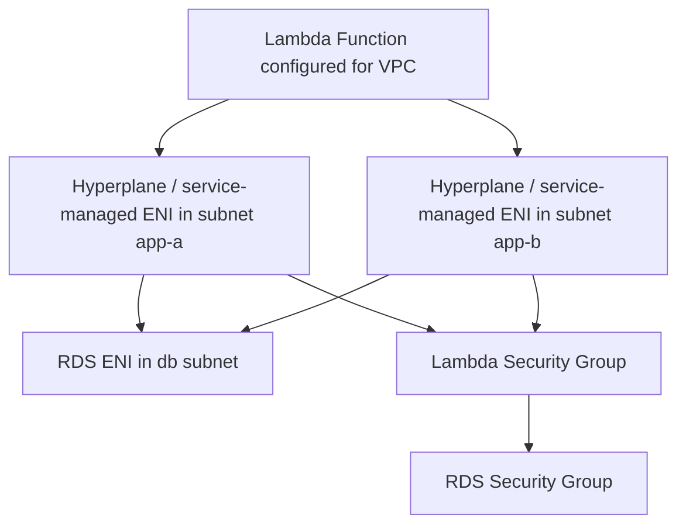

Masalah yang sering muncul:

- subnet terlalu kecil karena service-managed ENI memakan IP;
- SG salah dipasang ke ENI service;
- private DNS endpoint tidak resolve sesuai ekspektasi;
- route table subnet Lambda tidak punya path ke dependency;
- NACL stateless drop ephemeral return traffic;
- dependency ada di AZ/subnet berbeda dengan failure semantics yang tidak dipikirkan.

---

## 13. Security Group: Stateful Resource Firewall

Security Group adalah firewall stateful di level resource/ENI.

Karakter:

- default deny inbound;
- allow rules only;
- stateful return traffic;
- bisa reference security group lain;
- dievaluasi pada ENI/resource;
- tidak cocok untuk explicit deny;
- sangat cocok untuk service-to-service allow-list.

Contoh lebih baik:

```text
ALB SG:
  inbound 443 from 0.0.0.0/0
  outbound 8080 to App SG

App SG:
  inbound 8080 from ALB SG
  outbound 5432 to DB SG

DB SG:
  inbound 5432 from App SG
```

Lebih buruk:

```text
DB SG:
  inbound 5432 from 10.0.0.0/16
```

Kenapa buruk?

Karena kamu menyatakan semua resource dalam VPC boleh mencoba akses DB, bukan hanya app yang butuh.

Security Group referencing memberi model identity-ish dalam VPC:

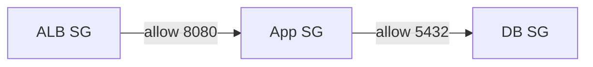

Ini lebih stabil daripada IP jika instance autoscale.

---

## 14. Network ACL: Stateless Subnet Firewall

Network ACL berada di level subnet.

Karakter:

- stateless;
- rules inbound dan outbound terpisah;
- allow dan deny;
- dievaluasi berdasarkan rule number;
- berlaku untuk semua resource di subnet;
- cocok untuk coarse guardrail;
- bisa menjadi sumber bug ephemeral port.

NACL cocok untuk:

- subnet-level deny blocklist;
- guardrail environment;
- membatasi subnet khusus;
- defense-in-depth sederhana;
- emergency containment.

NACL kurang cocok untuk:

- dynamic microservice policy;
- allow-list berbasis service identity;
- granular rule yang sering berubah;
- dependency kompleks dengan ephemeral ports.

Perbedaan mental model:

```text
Security Group: "Resource ini boleh menerima traffic dari siapa?"
NACL:           "Subnet ini secara kasar boleh dilewati traffic apa?"
```

---

## 15. Gateway dan Endpoint: Jalan Keluar Masuk VPC

VPC bisa punya beberapa tipe boundary keluar/masuk:

| Boundary | Purpose |
|---|---|
| Internet Gateway | Public internet connectivity untuk resource public. |
| NAT Gateway | Outbound IPv4 dari private subnet ke internet. |
| Egress-only IGW | Outbound-only IPv6 dari subnet ke internet. |
| Virtual Private Gateway | Legacy/on-prem VPN/DX target untuk VPC. |
| Transit Gateway Attachment | Hub routing ke banyak VPC/on-prem. |
| VPC Peering | Non-transitive route antar dua VPC. |
| Gateway Endpoint | Private route ke S3/DynamoDB. |
| Interface Endpoint | Private ENI ke AWS service/PrivateLink service. |
| GWLB Endpoint | Appliance insertion via Gateway Load Balancer. |

Satu kesalahan desain umum adalah menganggap semua dependency harus keluar lewat NAT Gateway.

Padahal untuk banyak AWS service, private endpoint bisa mengurangi:

- exposure public internet;
- NAT data processing cost;
- latency variability;
- policy ambiguity;
- centralized egress bottleneck.

Contoh:

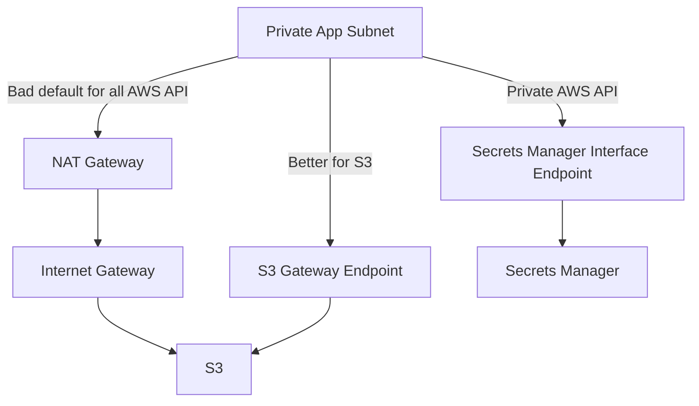

---

## 16. DNS dalam VPC: Sering Jadi Root Cause yang Disamarkan

Banyak masalah networking sebenarnya masalah DNS.

Contoh:

- app resolve database ke public endpoint, bukan private endpoint;
- PrivateLink endpoint dibuat, tetapi private DNS belum aktif;
- Route 53 private hosted zone tidak associated ke VPC yang benar;
- hybrid resolver forwarding salah arah;
- split-horizon DNS membuat dev/prod resolve berbeda;
- TTL terlalu tinggi untuk failover expectation;
- service discovery mengembalikan IP stale.

VPC punya resolver internal. Umumnya resource memakai AmazonProvidedDNS melalui konfigurasi DHCP option set.

Mental model DNS path:

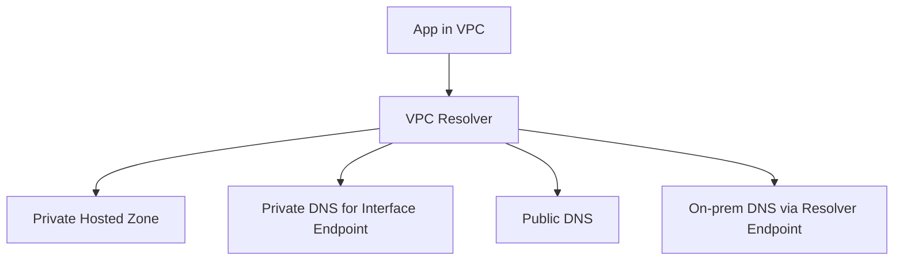

Saat debugging, jangan langsung ping IP. Mulai dari:

```bash
nslookup service.example.internal
nslookup s3.ap-southeast-1.amazonaws.com
curl -v https://dependency
```

Lihat destination IP. Destination IP menentukan route path yang akan dipakai.

---

## 17. VPC Endpoint: Private Access Bukan Sekadar “No Internet”

VPC Endpoint adalah private connectivity ke supported service.

Dua keluarga utama:

1. Gateway Endpoint;
2. Interface Endpoint.

Gateway Endpoint:

- untuk S3 dan DynamoDB;
- route-table based;
- tidak memakai ENI di subnet;
- tidak ada hourly charge seperti interface endpoint;
- endpoint policy bisa membatasi akses.

Interface Endpoint:

- powered by AWS PrivateLink;
- membuat ENI di subnet pilihan;
- punya private IP;
- bisa private DNS;
- cocok untuk AWS APIs, SaaS/private services, cross-account service exposure;
- ada hourly dan data processing charge.

Mental model:

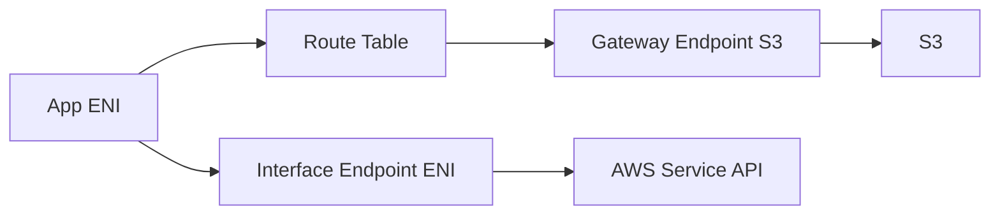

Private endpoint tidak otomatis berarti aman. Kamu masih perlu:

- IAM policy;
- endpoint policy;
- resource policy;
- security group interface endpoint;
- DNS correctness;
- route correctness untuk gateway endpoint;
- logging/monitoring.

---

## 18. Managed Service ENI: Invisible Infrastructure yang Harus Dihitung

Banyak layanan AWS membuat ENI di VPC kamu.

Contoh:

- RDS creates network interfaces for database access;
- EFS mount target per AZ;
- Interface Endpoint creates ENI per selected subnet;
- NAT Gateway has network interface;
- ALB/NLB nodes use subnet IP capacity;
- Lambda VPC networking uses service-managed ENI behavior;
- EKS VPC CNI consumes VPC IPs for pods;
- ECS awsvpc mode attaches ENI/task networking.

Konsekuensi:

- subnet kecil bisa penuh meskipun EC2 sedikit;
- deletion gagal karena ENI masih attached;
- SG dependency tersembunyi;
- per-AZ placement penting;
- IP capacity menjadi scaling limit.

Anti-pattern:

```text
Buat private subnet /28 untuk app karena app cuma dua instance.
```

Masalah:

- AWS reserve 5 IP per subnet;
- load balancer/endpoint/service ENI butuh IP;
- autoscaling butuh burst capacity;
- blue/green deployment butuh double capacity;
- future services butuh alamat;
- remediation saat incident butuh headroom.

---

## 19. Public, Private, Isolated: Bukan Tiga Jenis Resource, Tapi Tiga Intent Route

Kita sering menyebut:

- public subnet;
- private subnet;
- isolated subnet.

Namun AWS tidak menyimpan atribut subnet bernama “public/private/isolated” sebagai security class universal. Itu label desain.

Klasifikasi berdasarkan route:

| Tipe | Route Characteristic | Typical Resource |
|---|---|---|
| Public | Default route ke IGW | ALB public, NAT Gateway, bastion legacy, public NLB. |
| Private | Default route ke NAT/TGW/firewall, tidak langsung ke IGW | App servers, ECS/EKS nodes, Lambda ENI, internal services. |
| Isolated | Tidak ada default route ke internet | Database, internal control plane, sensitive workloads. |

Namun hati-hati:

- private subnet bisa tetap punya route ke on-prem via TGW;
- isolated subnet bisa punya VPC endpoint ke AWS services;
- public subnet resource tanpa public IP tidak otomatis reachable dari internet;
- public IP resource tanpa route ke IGW tidak bisa public internet;
- SG/NACL tetap menentukan izin.

---

## 20. Default VPC: Berguna untuk Belajar, Berbahaya sebagai Kebiasaan

Default VPC biasanya memudahkan awal:

- CIDR otomatis;
- subnet per AZ;
- Internet Gateway;
- route ke internet;
- default security group;
- DNS enabled.

Untuk belajar cepat, ini nyaman. Untuk sistem produksi, default VPC sering menjadi jebakan:

- terlalu permissive;
- IP plan tidak intentional;
- public subnet by default;
- sulit dipakai sebagai foundation multi-account;
- cenderung membuat engineer lupa route/security design;
- tidak mencerminkan compliance boundary;
- mendorong resource dibuat manual tanpa governance.

Production-grade VPC harus explicit:

- CIDR planned;
- subnet per tier/AZ;
- route table per intent;
- SG per service;
- endpoint/NAT strategy;
- DNS strategy;
- logging enabled;
- tags/naming enforced;
- IaC managed;
- deletion/ownership model jelas.

---

## 21. Reading a VPC Like a Debugger

Saat melihat VPC baru, baca dengan urutan ini.

### Step 1 — VPC CIDR

Tanyakan:

- CIDR apa?
- Ada secondary CIDR?
- IPv6 enabled?
- Overlap dengan network lain?
- Cukup untuk 3 AZ dan future growth?

### Step 2 — Subnet Matrix

Buat matrix:

| Tier | AZ A | AZ B | AZ C |
|---|---|---|---|
| public | ? | ? | ? |
| app | ? | ? | ? |
| db | ? | ? | ? |
| endpoints | ? | ? | ? |
| inspection | ? | ? | ? |

Tanyakan:

- semua tier penting multi-AZ?
- subnet size cukup?
- subnet mana yang dipakai service-managed ENI?
- ada subnet orphan tanpa route table intentional?

### Step 3 — Route Tables

Untuk setiap subnet:

```text
subnet -> associated route table -> route entries -> targets
```

Tanyakan:

- default route ke mana?
- route ke VPC CIDR local?
- ada route lebih spesifik?
- route ke endpoint/TGW/peering?
- ada blackhole route?
- ada route cross-AZ appliance?

### Step 4 — Gateways and Attachments

Tanyakan:

- IGW attached?
- NAT per AZ?
- TGW attachment?
- VPC peering?
- endpoints?
- resolver endpoints?
- VPN/DX path?

### Step 5 — Security Layers

Tanyakan:

- SG per service atau per environment?
- SG references dipakai?
- NACL custom?
- firewall appliance?
- WAF for HTTP?
- endpoint policy?
- IAM/resource policy?

### Step 6 — DNS Behavior

Tanyakan:

- enable DNS hostnames/resolution?
- private hosted zone associated?
- private DNS endpoint enabled?
- conditional forwarding?
- query logging?

### Step 7 — Observability

Tanyakan:

- Flow Logs enabled?
- LB access logs enabled?
- Route 53 query logs?
- Network Firewall logs?
- CloudWatch metrics/alarms?
- Reachability Analyzer path exists?

---

## 22. Example: Minimal Production VPC Baseline

Baseline sederhana 3 AZ:

```text
VPC: 10.20.0.0/16

AZ A:
  public-a    10.20.0.0/24
  app-a       10.20.10.0/24
  db-a        10.20.20.0/24
  endpoint-a  10.20.30.0/24

AZ B:
  public-b    10.20.1.0/24
  app-b       10.20.11.0/24
  db-b        10.20.21.0/24
  endpoint-b  10.20.31.0/24

AZ C:
  public-c    10.20.2.0/24
  app-c       10.20.12.0/24
  db-c        10.20.22.0/24
  endpoint-c  10.20.32.0/24
```

Route intent:

```text
public route table:
  10.20.0.0/16 -> local
  0.0.0.0/0    -> igw

app route table per AZ:
  10.20.0.0/16 -> local
  0.0.0.0/0    -> nat gateway same AZ
  S3 prefix    -> s3 gateway endpoint

db route table:
  10.20.0.0/16 -> local
  # no internet default route

endpoint route table:
  10.20.0.0/16 -> local
  # endpoints expose private AWS API access
```

Diagram:

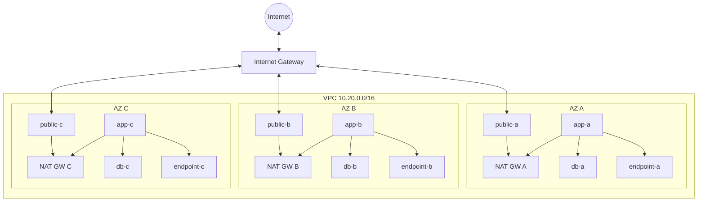

Catatan: diagram ini baseline, bukan jawaban universal. Nanti kita akan ubah untuk centralized inspection, TGW, PrivateLink, hybrid, IPv6, dan multi-account.

---

## 23. Anti-Pattern VPC yang Sering Terjadi

### Anti-Pattern 1 — One Route Table for Everything

Semua subnet memakai main route table.

Akibat:

- public/private boundary tidak jelas;
- perubahan route untuk satu tier berdampak ke semua;
- sulit audit;
- sulit incident containment;
- Terraform drift lebih berbahaya.

Lebih baik:

- route table per subnet intent;
- minimal public/app/db/endpoint route table;
- per-AZ route table jika target AZ-specific seperti NAT/firewall.

### Anti-Pattern 2 — One Big Security Group

Semua resource memakai SG `app-prod`.

Akibat:

- least privilege hilang;
- dependency tidak terlihat;
- audit sulit;
- perubahan kecil berisiko besar;
- lateral movement mudah.

Lebih baik:

- SG per service boundary;
- allow by SG reference;
- egress rule intentional;
- DB only from app SG;
- admin access via controlled path.

### Anti-Pattern 3 — Private Subnet Still Depends on Public Internet for AWS APIs

App di private subnet akses Secrets Manager, SSM, ECR, CloudWatch lewat NAT.

Akibat:

- NAT cost besar;
- public internet dependency tidak perlu;
- egress policy sulit;
- incident NAT berdampak besar.

Lebih baik:

- Interface Endpoint untuk AWS APIs kritikal;
- Gateway Endpoint untuk S3/DynamoDB;
- endpoint policy;
- private DNS;
- flow/logging.

### Anti-Pattern 4 — Subnet Terlalu Kecil

Subnet `/28` untuk workload production.

Akibat:

- usable IP sangat sedikit;
- autoscaling gagal;
- endpoint/load balancer ENI gagal dibuat;
- deployment biru/hijau terganggu;
- operasi emergency tidak punya ruang.

Lebih baik:

- rancang subnet berdasarkan peak + burst + replacement + service ENI;
- sisakan headroom;
- hindari terlalu banyak tiny subnet tanpa alasan kuat.

### Anti-Pattern 5 — NAT Gateway Single-AZ untuk Multi-AZ App

Private subnet di AZ B dan C route ke NAT Gateway AZ A.

Akibat:

- cross-AZ cost;
- AZ A failure bisa memutus outbound AZ lain;
- dependency tersembunyi;
- sulit dibaca saat incident.

Lebih baik:

- NAT Gateway per AZ;
- route table private per AZ;
- endpoint untuk AWS service agar tidak semua lewat NAT.

---

## 24. Invariant VPC yang Harus Kamu Jaga

Gunakan invariant ini sebagai checklist desain.

### Invariant 1 — Every subnet has an explicit intent

Tidak boleh ada subnet “misc”.

Setiap subnet harus bisa dijelaskan:

```text
Subnet ini untuk apa?
Kenapa di AZ ini?
Kenapa CIDR sebesar ini?
Route table-nya mengarah ke mana?
Resource apa yang boleh tinggal di sini?
```

### Invariant 2 — Route tables encode traffic intent

Route table harus mencerminkan domain:

- public;
- private app;
- database/isolated;
- endpoint;
- inspection;
- TGW attachment;
- hybrid.

### Invariant 3 — Security groups model service relationships

SG harus menjawab:

```text
Siapa boleh bicara ke service ini, di port apa, dan kenapa?
```

Bukan:

```text
Semua internal boleh.
```

### Invariant 4 — AZ-local dependencies are explicit

Jika resource di AZ A bergantung pada NAT/firewall/endpoint, prefer target AZ A atau pahami konsekuensi cross-AZ.

### Invariant 5 — DNS path is designed, not accidental

Private DNS, hosted zone, endpoint DNS, resolver forwarding, dan split-horizon harus disengaja.

### Invariant 6 — Observability exists before incident

Flow Logs dan access logs bukan dekorasi. Mereka adalah alat rekonstruksi packet path saat incident.

---

## 25. VPC Design as Code

VPC harus dikelola dengan IaC.

Bukan karena Terraform/CloudFormation/CDK keren, tetapi karena VPC adalah sistem yang penuh relasi:

- subnet association;
- route table association;
- gateway attachment;
- endpoint policy;
- SG references;
- tagging;
- RAM sharing;
- logging;
- NACL rules;
- DHCP options;
- resolver rules.

Manual console changes membuat topology sulit dipercaya.

Minimum output module VPC yang sehat:

```text
vpc_id
vpc_cidr
public_subnet_ids_by_az
private_app_subnet_ids_by_az
private_db_subnet_ids_by_az
endpoint_subnet_ids_by_az
route_table_ids_by_intent
security_group_ids_by_service
nat_gateway_ids_by_az
vpc_endpoint_ids
flow_log_id
```

Output harus memudahkan application stack memilih subnet yang benar, bukan hardcode manual.

---

## 26. Naming dan Tagging: Bukan Cosmetic

Nama dan tag adalah bagian dari operability.

Contoh buruk:

```text
subnet-123
subnet-456
rtb-main
sg-app
```

Contoh lebih baik:

```text
prod-payments-vpc
prod-payments-public-ap-southeast-1a
prod-payments-app-ap-southeast-1a
prod-payments-db-ap-southeast-1a
prod-payments-rt-public
prod-payments-rt-app-a
prod-payments-sg-alb-public
prod-payments-sg-api
prod-payments-sg-rds-postgres
```

Tag minimum:

```yaml
Environment: prod
System: payments
Owner: platform-networking
CostCenter: finance-platform
DataClassification: confidential
ManagedBy: terraform
NetworkIntent: app-private
AZ: ap-southeast-1a
```

Saat incident jam 03:00, nama dan tag yang baik menghemat menit yang mahal.

---

## 27. Mini Lab: Membaca VPC dengan AWS CLI

Commands di bawah bukan untuk dihafal, tetapi untuk membentuk kebiasaan membaca graph.

### Lihat VPC

```bash
aws ec2 describe-vpcs \
  --query 'Vpcs[].{VpcId:VpcId,Cidr:CidrBlock,State:State,IsDefault:IsDefault}'
```

### Lihat subnet dan AZ

```bash
aws ec2 describe-subnets \
  --filters Name=vpc-id,Values=vpc-xxxx \
  --query 'Subnets[].{SubnetId:SubnetId,Cidr:CidrBlock,AZ:AvailabilityZone,Available:AvailableIpAddressCount,MapPublicIp:MapPublicIpOnLaunch}'
```

### Lihat route table association

```bash
aws ec2 describe-route-tables \
  --filters Name=vpc-id,Values=vpc-xxxx \
  --query 'RouteTables[].{RouteTableId:RouteTableId,Associations:Associations[].SubnetId,Routes:Routes[]}'
```

### Lihat security group relationship

```bash
aws ec2 describe-security-groups \
  --filters Name=vpc-id,Values=vpc-xxxx \
  --query 'SecurityGroups[].{GroupId:GroupId,GroupName:GroupName,Ingress:IpPermissions,Egress:IpPermissionsEgress}'
```

### Lihat ENI

```bash
aws ec2 describe-network-interfaces \
  --filters Name=vpc-id,Values=vpc-xxxx \
  --query 'NetworkInterfaces[].{Id:NetworkInterfaceId,Desc:Description,Subnet:SubnetId,PrivateIp:PrivateIpAddress,Groups:Groups[].GroupId,Status:Status}'
```

Dari output itu, kamu bisa mulai menggambar packet path tanpa membuka console.

---

## 28. Debugging Exercise: “Private EC2 Tidak Bisa Akses Internet”

Gejala:

```text
EC2 di private subnet tidak bisa curl https://example.com
```

Jangan langsung ubah security group. Ikuti path.

Checklist:

1. Apakah DNS resolve?

```bash
nslookup example.com
```

2. Apakah route table subnet punya default route?

```text
0.0.0.0/0 -> nat-xxxxx
```

3. Apakah NAT Gateway berada di public subnet?

Public subnet NAT harus punya route:

```text
0.0.0.0/0 -> igw-xxxxx
```

4. Apakah NAT Gateway punya Elastic IP dan status available?

5. Apakah subnet NACL allow outbound 443 dan return ephemeral inbound?

6. Apakah SG instance allow outbound 443?

7. Apakah destination diblok oleh proxy/firewall/Network Firewall?

8. Apakah route mengarah cross-AZ ke NAT Gateway yang sedang bermasalah?

9. Apakah traffic sebenarnya menuju AWS service yang seharusnya lewat endpoint?

10. Apakah Flow Logs menunjukkan ACCEPT atau REJECT?

Decision tree:

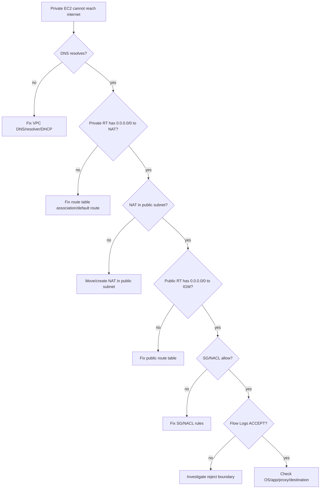

---

## 29. Production Design Questions

Sebelum membuat VPC, jawab ini:

1. Apakah VPC dedicated per application, per domain, atau shared platform?
2. Berapa AZ yang dipakai?
3. Apakah workload butuh internet ingress?
4. Apakah workload butuh outbound internet?
5. Dependency AWS API apa yang harus private endpoint?
6. Apakah ada hybrid/on-prem route?
7. Apakah ada future TGW/Cloud WAN attachment?
8. Apakah CIDR overlap dengan enterprise network?
9. Apakah IPv6 perlu dari awal?
10. Apakah ada workload EKS yang butuh banyak IP?
11. Apakah subnet size mendukung blue/green dan autoscaling?
12. Apakah route table per AZ dibutuhkan untuk NAT/firewall locality?
13. Apakah traffic harus melewati inspection appliance?
14. Apakah DNS split-horizon dibutuhkan?
15. Apakah logs cukup untuk audit dan forensics?

Jika jawaban-jawaban ini belum jelas, membuat VPC sekarang hanya memindahkan problem ke masa depan.

---

## 30. Ringkasan

Amazon VPC bukan sekadar “network virtual”. Ia adalah komposisi primitive yang bekerja bersama:

- CIDR menentukan address universe dan future connectivity.
- Subnet adalah AZ-scoped slice dengan route/NACL/placement intent.
- Route table menentukan next hop.
- Local route memberi internal reachability, bukan security permission.
- Internet Gateway memberi public boundary jika route dan public IP benar.
- NAT Gateway memberi outbound IPv4 untuk private subnet, bukan inbound.
- ENI adalah attachment point nyata resource ke network.
- Security Group adalah stateful resource firewall.
- NACL adalah stateless subnet firewall.
- VPC Endpoint memberi private path ke service, tetapi tetap perlu policy dan DNS correctness.
- DNS sering menentukan destination dan packet path sebelum routing terjadi.
- Observability harus ada sebelum incident.

Kalimat yang perlu diingat:

> VPC adalah graph of packet decisions. Untuk menguasainya, baca graph itu dari DNS, address, subnet, route, gateway, firewall, ENI, sampai response path.

Part berikutnya akan membedah hal yang paling sering salah sejak hari pertama: **IP addressing, CIDR, dan subnet design**.

---

## References

- Amazon VPC user guide — What is Amazon VPC: https://docs.aws.amazon.com/vpc/latest/userguide/what-is-amazon-vpc.html
- Amazon VPC route tables: https://docs.aws.amazon.com/vpc/latest/userguide/VPC_Route_Tables.html
- Subnets for your VPC: https://docs.aws.amazon.com/vpc/latest/userguide/configure-subnets.html
- Internet gateway basics: https://docs.aws.amazon.com/vpc/latest/userguide/VPC_Internet_Gateway.html
- NAT gateways: https://docs.aws.amazon.com/vpc/latest/userguide/vpc-nat-gateway.html
- Security groups for your VPC: https://docs.aws.amazon.com/vpc/latest/userguide/vpc-security-groups.html
- Network ACLs: https://docs.aws.amazon.com/vpc/latest/userguide/vpc-network-acls.html
- IP addressing for VPCs and subnets: https://docs.aws.amazon.com/vpc/latest/userguide/vpc-ip-addressing.html
