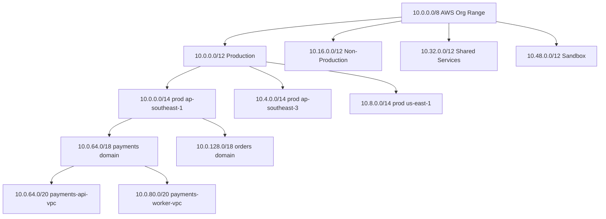
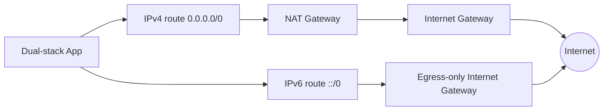
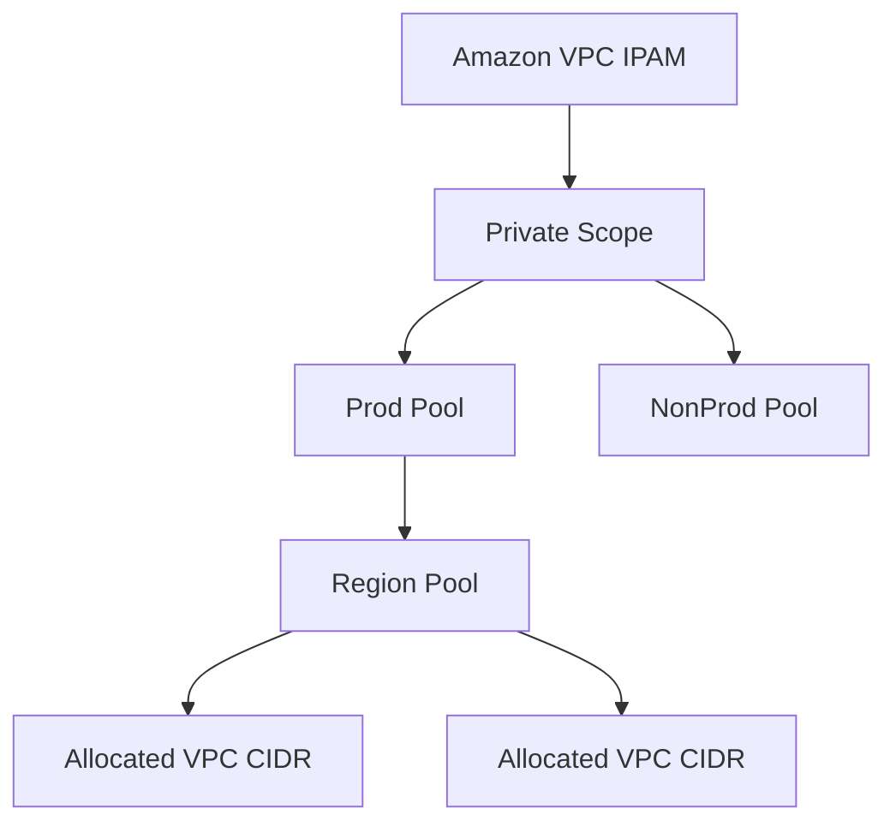
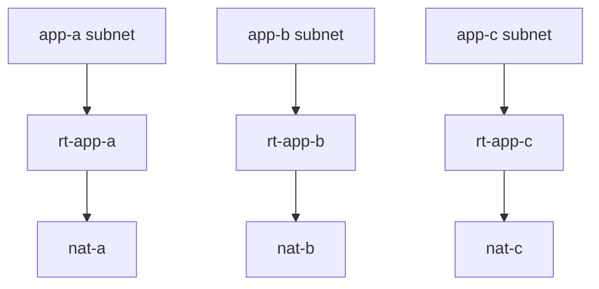

# Part 008 — IP Addressing, CIDR, and Subnet Design

CIDR adalah bagian VPC yang paling mudah terlihat sederhana dan paling mahal kalau salah.

Di console, membuat VPC terlihat seperti mengisi field:

```text
IPv4 CIDR block: 10.0.0.0/16
```

Tapi di produksi, field itu adalah keputusan jangka panjang.

Ia menentukan:

- apakah VPC bisa dihubungkan ke VPC lain;
- apakah network bisa di-route ke on-prem;
- apakah multi-region bisa konsisten;
- apakah subnet bisa tumbuh;
- apakah EKS/Lambda/endpoint/load balancer punya cukup IP;
- apakah centralized networking bisa memakai summarization;
- apakah akuisisi/partner/SaaS menyebabkan overlap;
- apakah migrasi butuh renumbering yang menyakitkan.

Part ini membahas IP addressing dan subnet design seperti engineer platform/networking, bukan seperti tutorial “buat VPC 10.0.0.0/16”.

---

## 1. Mental Model: IP Address Adalah Resource, Route Contract, dan Capacity Constraint

IP address di cloud bukan cuma alamat.

Ia punya tiga fungsi.

### 1.1 IP sebagai resource

Setiap ENI, endpoint, load balancer node, NAT Gateway, RDS, EFS mount target, Lambda VPC integration, ECS task, atau EKS pod bisa mengonsumsi IP.

Jadi IP adalah kapasitas.

Jika subnet kehabisan IP, masalahnya bukan teori networking. Deployment bisa gagal.

### 1.2 IP sebagai route contract

CIDR menentukan bagaimana network lain mengenali VPC kamu.

Misalnya:

```text
prod-payments-vpc = 10.20.0.0/16
prod-orders-vpc   = 10.21.0.0/16
prod-risk-vpc     = 10.22.0.0/16
```

TGW/on-prem bisa melihatnya sebagai route berbeda atau disummarize sebagai:

```text
10.20.0.0/14  # contoh jika plan disusun rapi
```

Jika CIDR acak, route table enterprise akan membengkak.

### 1.3 IP sebagai boundary

IP range sering dipakai dalam:

- route table;
- NACL;
- firewall rule;
- SIEM query;
- logs analysis;
- incident isolation;
- partner allowlist;
- compliance segmentation.

CIDR yang tidak intentional membuat boundary kabur.

---

## 2. CIDR Cepat: Yang Perlu Kamu Ingat

CIDR notation:

```text
10.0.0.0/16
```

`/16` berarti 16 bit pertama adalah network prefix. Semakin kecil angka prefix, semakin besar network.

Contoh IPv4 umum:

| CIDR | Total IP | Catatan |
|---|---:|---|
| /16 | 65,536 | Ukuran maksimum umum untuk VPC IPv4 primary CIDR. |
| /20 | 4,096 | Cukup besar untuk VPC kecil-menengah. |
| /22 | 1,024 | Bisa untuk satu tier/AZ besar. |
| /24 | 256 | Umum untuk subnet per tier/AZ. |
| /26 | 64 | Kecil, masih bisa untuk subnet khusus. |
| /28 | 16 | Minimum subnet IPv4 AWS, biasanya terlalu kecil untuk production umum. |

Namun AWS mereserve 5 IPv4 address per subnet. Jadi usable IP bukan total IP.

| Subnet | Total IP | AWS Reserved | Usable Approx |
|---|---:|---:|---:|
| /28 | 16 | 5 | 11 |
| /27 | 32 | 5 | 27 |
| /26 | 64 | 5 | 59 |
| /25 | 128 | 5 | 123 |
| /24 | 256 | 5 | 251 |
| /23 | 512 | 5 | 507 |
| /22 | 1,024 | 5 | 1,019 |

Untuk production, `/28` sering terlihat hemat tapi cepat menjadi jebakan.

---

## 3. AWS Reserved IP di Setiap Subnet

Di setiap subnet IPv4, AWS mereserve:

- alamat pertama: network address;
- alamat kedua: VPC router;
- alamat ketiga: DNS;
- alamat keempat: reserved future use;
- alamat terakhir: broadcast address, walau VPC tidak mendukung broadcast seperti LAN tradisional.

Contoh subnet:

```text
10.0.1.0/24
```

Reserved:

```text
10.0.1.0    network address
10.0.1.1    VPC router
10.0.1.2    DNS
10.0.1.3    reserved
10.0.1.255  broadcast/reserved
```

Usable:

```text
10.0.1.4 - 10.0.1.254
```

Konsekuensi:

- subnet kecil jauh lebih boros secara persentase;
- `/28` hanya punya 11 usable IP;
- service-managed ENI bisa menghabiskan subnet kecil dengan cepat;
- jangan sizing subnet hanya berdasarkan jumlah EC2 hari ini.

---

## 4. Private IPv4 Range: Pilihan Umum dan Risikonya

Private IPv4 range RFC1918 umum:

```text
10.0.0.0/8
172.16.0.0/12
192.168.0.0/16
```

Di AWS, `10.0.0.0/8` sering paling nyaman karena besar. Tapi justru karena populer, overlap dengan on-prem/partner juga sering terjadi.

Heuristik:

| Range | Kelebihan | Risiko |
|---|---|---|
| 10.0.0.0/8 | Sangat besar, fleksibel | Sering overlap enterprise/on-prem. |
| 172.16.0.0/12 | Lebih jarang dipakai daripada 10/8 | Banyak orang lupa boundary /12. |
| 192.168.0.0/16 | Familiar untuk lab | Terlalu kecil untuk enterprise AWS besar, sering overlap home/VPN. |

Jangan pilih CIDR hanya karena “umum”. Pilih berdasarkan enterprise IP plan.

---

## 5. VPC CIDR Size: Jangan Default Tanpa Reasoning

AWS mengizinkan ukuran VPC IPv4 CIDR dalam rentang tertentu. Secara praktik, banyak tim memakai `/16` karena fleksibel.

Namun `/16` untuk setiap VPC bisa boros jika kamu punya ratusan VPC.

Trade-off:

| VPC CIDR | Cocok Untuk | Risiko |
|---|---|---|
| /16 | Large workload, EKS-heavy, future growth | Boros address space jika setiap app diberi /16. |
| /18 | Medium-large domain VPC | Masih cukup besar, perlu planning subnet rapi. |
| /20 | Small-medium app VPC | Bisa sempit untuk EKS/service ENI besar. |
| /22 | Small isolated workload | Growth terbatas. |
| /24 | Tiny/special purpose | Hampir selalu terlalu kecil untuk general VPC. |

Rule praktis:

> Ukuran VPC harus mengikuti expected network role, bukan mengikuti template tunggal.

Contoh:

- shared services VPC: mungkin `/16` atau `/18`;
- workload app biasa: mungkin `/20` atau `/19`;
- inspection VPC: tergantung appliance scaling, mungkin `/22` sampai `/20`;
- endpoint VPC: tergantung jumlah endpoint/AZ, bisa lebih kecil;
- EKS-heavy VPC: butuh sizing khusus karena pod IP.

---

## 6. CIDR Planning sebagai Hierarki

Jangan mulai dari satu VPC. Mulai dari organisasi.

Contoh high-level:

```text
10.0.0.0/8              Organization private AWS range

10.0.0.0/12             Production
10.16.0.0/12            Non-production
10.32.0.0/12            Shared services
10.48.0.0/12            Sandbox / labs
10.64.0.0/12            Reserved future
```

Lalu per region:

```text
10.0.0.0/14             prod ap-southeast-1
10.4.0.0/14             prod ap-southeast-3
10.8.0.0/14             prod us-east-1
10.12.0.0/14            prod eu-west-1
```

Lalu per domain/account:

```text
10.0.0.0/18             prod shared network
10.0.64.0/18            prod payments
10.0.128.0/18           prod orders
10.0.192.0/18           prod risk
```

Lalu per VPC:

```text
10.0.64.0/20            payments-api-vpc
10.0.80.0/20            payments-worker-vpc
10.0.96.0/20            payments-data-vpc
10.0.112.0/20           reserved payments future
```

Struktur ini memungkinkan:

- route summarization;
- audit lebih mudah;
- delegated ownership;
- future expansion;
- lower cognitive load;
- less overlap risk.

Diagram:



---

## 7. Route Summarization: Kenapa IP Plan Harus Rapi

Route summarization berarti beberapa CIDR kecil bisa diwakili oleh prefix lebih besar.

Contoh rapi:

```text
payments-vpc-a 10.20.0.0/20
payments-vpc-b 10.20.16.0/20
payments-vpc-c 10.20.32.0/20
payments-vpc-d 10.20.48.0/20
```

Bisa disummarize:

```text
10.20.0.0/18
```

Contoh acak:

```text
payments-vpc-a 10.20.0.0/20
payments-vpc-b 10.77.16.0/20
payments-vpc-c 172.23.8.0/21
payments-vpc-d 10.201.0.0/22
```

Sulit disummarize. Setiap route harus eksplisit.

Kenapa penting?

- Transit Gateway route table lebih mudah dibaca;
- on-prem routing lebih sederhana;
- firewall rule lebih bersih;
- DNS forwarding/security analysis lebih mudah;
- incident containment bisa berbasis block domain;
- governance IPAM lebih kuat.

---

## 8. Subnet Matrix: Desain dari AZ x Tier

Jangan mendesain subnet sebagai list. Desain sebagai matrix.

Contoh untuk 3 AZ:

| Tier | AZ A | AZ B | AZ C |
|---|---|---|---|
| public | public-a | public-b | public-c |
| app | app-a | app-b | app-c |
| db | db-a | db-b | db-c |
| endpoint | endpoint-a | endpoint-b | endpoint-c |
| inspection | inspection-a | inspection-b | inspection-c |

Matrix membantu kamu melihat:

- apakah setiap tier HA?
- apakah ada tier yang single-AZ?
- apakah route table per AZ dibutuhkan?
- apakah subnet size konsisten?
- apakah future expansion punya slot?

Contoh allocation dalam `/16`:

```text
VPC 10.20.0.0/16

10.20.0.0/20     public tier block
10.20.16.0/20    app tier block
10.20.32.0/20    db tier block
10.20.48.0/20    endpoint tier block
10.20.64.0/20    inspection tier block
10.20.80.0/20    reserved tier block
```

Lalu slice per AZ:

```text
public:
  10.20.0.0/24    public-a
  10.20.1.0/24    public-b
  10.20.2.0/24    public-c

app:
  10.20.16.0/22   app-a
  10.20.20.0/22   app-b
  10.20.24.0/22   app-c

db:
  10.20.32.0/24   db-a
  10.20.33.0/24   db-b
  10.20.34.0/24   db-c

endpoint:
  10.20.48.0/24   endpoint-a
  10.20.49.0/24   endpoint-b
  10.20.50.0/24   endpoint-c
```

Kenapa app lebih besar? Karena app tier sering punya:

- EC2 autoscaling;
- ECS tasks;
- EKS nodes/pods;
- Lambda VPC ENI behavior;
- blue/green deployment;
- canary;
- emergency headroom.

---

## 9. Public Subnet Sizing

Public subnet sering dipakai untuk:

- ALB/NLB nodes;
- NAT Gateway;
- bastion legacy jika masih ada;
- public-facing appliances;
- public IP resources yang sangat terbatas.

Banyak tim membuat public subnet terlalu besar karena mengira “public berarti web server”. Dalam desain modern, compute sering tetap di private subnet, sementara public subnet hanya entry/egress infrastructure.

Sizing heuristic:

| Public Use Case | Suggested Starting Point |
|---|---|
| NAT Gateway + ALB only | /27 sampai /24 tergantung skala. |
| Banyak public NLB/ALB | /24 atau lebih. |
| Appliance/public ingress heavy | /24 atau lebih. |
| Tiny lab | /28 bisa, tapi jangan jadikan default production. |

Jangan lupa ALB/NLB juga membutuhkan IP di subnet yang dipilih.

---

## 10. App Subnet Sizing

App subnet biasanya paling rawan penuh.

Konsumen IP:

- EC2 instances;
- ECS tasks with `awsvpc` mode;
- EKS nodes dan pod IP jika VPC CNI;
- Lambda VPC networking;
- app-side interface endpoints jika dicampur;
- replacement capacity during deployment;
- surge autoscaling;
- debugging instances;
- future services.

Sizing harus berdasarkan formula, bukan feeling.

Contoh formula kasar:

```text
required_ips_per_az =
  steady_state_compute_ips
+ peak_autoscale_ips
+ blue_green_extra_ips
+ managed_service_eni_ips
+ emergency_headroom
+ aws_reserved_ips
```

Misal:

```text
steady state app EC2:     40
peak autoscale:           40
blue/green overlap:       40
Lambda/service ENI:       20
debug/emergency:          10
AWS reserved:              5
-----------------------------
total:                   155
```

Maka `/24` dengan sekitar 251 usable IP masih masuk. `/25` sekitar 123 usable IP tidak cukup.

---

## 11. Database Subnet Sizing

Database subnet sering tidak butuh banyak IP, tetapi butuh stabilitas dan isolation.

Konsumen IP:

- RDS primary/standby ENI;
- Aurora cluster instances;
- ElastiCache nodes;
- DocumentDB/OpenSearch jika dipakai;
- DMS/replication appliances;
- database proxy;
- future read replicas;
- maintenance/replacement.

Sizing heuristic:

| DB Tier | Starting Point |
|---|---|
| Small RDS/Aurora | /27 atau /26 per AZ minimal practical. |
| Banyak cluster/read replica/cache | /24 per AZ lebih nyaman. |
| Shared data services VPC | /23 atau lebih per AZ tergantung jumlah service. |

Jangan terlalu kecil. Database migration dan replacement sering butuh resource sementara.

---

## 12. Endpoint Subnet Sizing

Interface Endpoint membuat ENI di subnet yang kamu pilih.

Jika kamu membuat banyak endpoint per AZ:

- Secrets Manager;
- SSM;
- CloudWatch Logs;
- ECR API;
- ECR DKR;
- STS;
- KMS;
- SQS;
- SNS;
- EventBridge;
- Step Functions;
- internal endpoint services;
- third-party SaaS PrivateLink;

maka endpoint subnet perlu cukup IP.

Heuristic:

```text
endpoint_ips_per_az = number_of_interface_endpoints_in_az + growth + reserved
```

Untuk platform besar, endpoint subnet `/24` per AZ adalah awal yang nyaman. Untuk kecil, `/27` atau `/26` bisa cukup, tapi jangan lupa growth.

Pisahkan endpoint subnet jika ingin:

- route/security lebih jelas;
- dedicated SG for endpoints;
- easier audit;
- reduce app subnet IP pressure.

---

## 13. Inspection Subnet Sizing

Jika memakai centralized inspection, Gateway Load Balancer, firewall appliance, atau Network Firewall, subnet khusus inspection sering diperlukan.

Konsumen IP:

- firewall endpoints;
- GWLB endpoints;
- appliance ENIs;
- autoscaling firewall nodes;
- management interfaces;
- failover replacement.

Inspection subnet harus memperhatikan:

- AZ locality;
- symmetric routing;
- throughput scaling;
- HA pair behavior;
- route table complexity;
- future growth.

Jangan gabungkan inspection subnet dengan public/app subnet tanpa alasan kuat. Inspection path adalah bagian dari security architecture.

---

## 14. IPv6: Jangan Anggap Sekadar “Nanti”

IPv4 private space sering terasa cukup, sampai tidak cukup.

IPv6 di VPC membawa model berbeda:

- alamat IPv6 bersifat global unicast;
- tidak ada NAT Gateway IPv6 seperti NAT IPv4 pattern umum;
- outbound-only bisa memakai egress-only Internet Gateway;
- route table, SG, dan NACL harus punya rule IPv6 eksplisit;
- dual-stack berarti workload punya IPv4 dan IPv6;
- semua dependency harus dicek readiness IPv6.

Mental model dual-stack:



IPv6 bukan “IPv4 dengan angka lebih panjang”. Karena tidak bergantung pada NAT untuk private outbound model yang sama, security posture harus lebih eksplisit:

- SG inbound IPv6 harus ketat;
- route `::/0` harus dipahami;
- egress-only IGW untuk private outbound;
- public IPv6 exposure harus dikontrol;
- logging harus mencakup IPv6.

---

## 15. IPv4 Exhaustion dan Cost Reality

IPv4 makin mahal dan terbatas. Di AWS, public IPv4 juga memiliki implikasi biaya dan governance modern.

Dari sisi desain:

- jangan beri public IP ke resource yang tidak perlu;
- letakkan compute di private subnet;
- gunakan ALB/NLB/CloudFront/Global Accelerator sebagai ingress boundary;
- gunakan VPC Endpoint untuk AWS APIs;
- gunakan NAT hanya untuk kebutuhan outbound internet yang memang perlu;
- pertimbangkan IPv6 untuk workload yang cocok;
- inventory public IPv4 secara rutin.

Public IPv4 harus diperlakukan seperti resource mahal dan sensitif, bukan default.

---

## 16. Overlapping CIDR: Masalah yang Tidak Bisa Diabaikan

CIDR overlap terjadi saat dua network memakai address range yang sama atau saling tumpang tindih.

Contoh:

```text
VPC A:     10.0.0.0/16
VPC B:     10.0.10.0/24
On-prem:   10.0.0.0/8
```

Ini bermasalah karena routing tidak bisa membedakan destination dengan benar.

Dampak:

- VPC peering/TGW route tidak bisa dibuat seperti yang diinginkan;
- hybrid connectivity sulit;
- DNS resolve ke IP yang ambiguous;
- service migration sulit;
- partner connection butuh NAT/translation;
- troubleshooting membingungkan.

Solusi tergantung konteks:

| Strategy | Kapan Dipakai | Trade-off |
|---|---|---|
| Renumbering | Jika masih awal / bisa migrasi | Mahal tapi bersih. |
| Secondary CIDR | Jika butuh ruang baru non-overlap | Tidak selalu menyelesaikan semua route lama. |
| NAT/translation | Partner/legacy overlap | Kompleks, observability lebih sulit. |
| PrivateLink | Service exposure tanpa full route merge | Cocok untuk service, bukan general network. |
| VPC Lattice | App-level connectivity lintas VPC/account | Butuh model service/network baru. |
| Proxy/API gateway | Application-level abstraction | Tidak cocok untuk semua protocol. |

Pencegahan jauh lebih murah daripada koreksi.

---

## 17. Secondary CIDR: Escape Hatch, Bukan Alasan untuk Ceroboh

VPC bisa memiliki additional CIDR blocks dalam batas/quota tertentu.

Secondary CIDR berguna untuk:

- menambah IP capacity;
- memisahkan EKS pod/node range;
- migrasi bertahap dari range lama;
- menambah subnet baru tanpa mengganti VPC;
- memperluas app tier.

Tapi secondary CIDR bukan sihir.

Masalah yang tetap perlu dipikirkan:

- route table update;
- SG/NACL CIDR allowlist;
- firewall rule;
- on-prem route advertisement;
- monitoring/logging expectation;
- DNS records;
- service dependencies;
- IPAM governance.

Jika seluruh security policy hardcode `10.0.0.0/16`, menambah `10.1.0.0/16` bisa membuat resource baru tidak bisa connect atau malah terlalu terbuka jika rule diperluas sembarangan.

---

## 18. Subnet Growth: Blue/Green dan Failure Scenario

Subnet sizing harus memperhitungkan operasi, bukan hanya steady state.

### Blue/Green Deployment

Jika app normal memakai 80 IP per AZ, blue/green bisa butuh hampir 160 IP per AZ sementara.

### AZ Failure

Jika satu AZ mati, workload dua AZ lain mungkin menanggung traffic lebih besar.

Jika autoscaling menambah kapasitas di AZ sehat, subnet AZ sehat butuh headroom.

### Rolling Replacement

Instance/task lama dan baru bisa hidup bersamaan.

### Emergency Debugging

Saat incident, kamu mungkin perlu:

- temporary EC2;
- packet capture appliance;
- test endpoint;
- replacement load balancer;
- canary service.

Kalau subnet penuh, remediation bisa tertahan.

Rule:

> Subnet capacity is incident capacity.

---

## 19. EKS and High-IP Workloads

EKS dengan AWS VPC CNI bisa mengonsumsi IP VPC untuk pod.

Konsekuensi:

- app subnet bisa penuh jauh lebih cepat daripada jumlah node;
- pod density tergantung instance type/IP allocation behavior;
- cluster upgrade/rollout butuh extra IP;
- multi-tenant cluster perlu IP capacity plan;
- custom networking/prefix delegation bisa mengubah perhitungan;
- IPv6/EKS patterns bisa menjadi pilihan untuk scale tertentu.

Untuk seri ini, detail EKS networking akan dibahas di Part 065. Tapi sejak CIDR planning, kamu harus menandai VPC/subnet yang akan dipakai EKS.

Jangan campur workload EKS besar ke VPC `/24` lalu berharap autoscaling sehat.

---

## 20. Lambda VPC dan Serverless ENI Considerations

Lambda yang dikonfigurasi ke VPC membutuhkan connectivity melalui VPC networking AWS.

Dampak desain:

- subnet harus punya route ke dependency;
- SG Lambda harus diizinkan oleh dependency;
- private AWS API access bisa butuh endpoints;
- NAT dependency bisa muncul jika Lambda butuh internet;
- subnet IP capacity tetap perlu diperhatikan untuk service-managed networking behavior dan integrasi lain.

Serverless bukan berarti networking hilang. Networking hanya dipindahkan ke managed integration.

---

## 21. CIDR Allocation Pattern: Tier-First vs AZ-First

Ada dua cara umum membagi subnet.

### 21.1 Tier-First Allocation

Kamu blok per tier dulu:

```text
10.20.0.0/20   public tier
10.20.16.0/20  app tier
10.20.32.0/20  db tier
```

Lalu bagi per AZ.

Kelebihan:

- mudah melihat tier capacity;
- route/security summarization per tier;
- audit lebih jelas.

Kekurangan:

- AZ-level summarization kurang rapi;
- jika satu tier butuh tumbuh besar, perlu reserved block.

### 21.2 AZ-First Allocation

Kamu blok per AZ dulu:

```text
10.20.0.0/18    AZ A
10.20.64.0/18   AZ B
10.20.128.0/18  AZ C
```

Lalu bagi tier di dalam AZ.

Kelebihan:

- AZ failure domain jelas;
- AZ-local route/firewall planning rapi;
- bisa summarize per AZ.

Kekurangan:

- tier-level summarization lebih sulit;
- kurang intuitif bagi sebagian app teams.

Mana yang lebih baik?

Untuk banyak platform AWS, **tier-first** lebih mudah untuk app VPC biasa. Untuk network appliance/inspection heavy atau desain yang sangat AZ-aware, AZ-first bisa lebih masuk akal.

Yang penting: pilih pattern dan konsisten.

---

## 22. Worked Example: Desain VPC `/20` untuk App Production

Misal kita punya VPC:

```text
10.40.0.0/20
```

Total IP:

```text
4096 addresses
```

Target:

- 3 AZ;
- public ingress via ALB;
- app compute private;
- DB private isolated;
- interface endpoints;
- NAT per AZ;
- future growth.

Allocation:

```text
10.40.0.0/24    public-a
10.40.1.0/24    public-b
10.40.2.0/24    public-c

10.40.4.0/23    app-a
10.40.6.0/23    app-b
10.40.8.0/23    app-c

10.40.10.0/25   db-a
10.40.10.128/25 db-b
10.40.11.0/25   db-c

10.40.12.0/26   endpoint-a
10.40.12.64/26  endpoint-b
10.40.12.128/26 endpoint-c

10.40.13.0/24   reserved
10.40.14.0/23   reserved future
```

Capacity approx:

| Subnet | Usable Approx | Purpose |
|---|---:|---|
| public /24 | 251 each | ALB/NAT/public infra. |
| app /23 | 507 each | Compute-heavy app. |
| db /25 | 123 each | DB/cache. |
| endpoint /26 | 59 each | Interface endpoints. |

Apakah ini perfect? Tidak. Tapi ini lebih intentional daripada membagi semua menjadi `/24` tanpa melihat growth.

---

## 23. Worked Example: Desain VPC `/16` untuk Shared Platform

Shared platform VPC:

```text
10.50.0.0/16
```

Tujuan:

- shared ingress;
- shared endpoint services;
- observability collectors;
- CI/CD runners;
- internal tools;
- possible PrivateLink providers;
- 3 AZ;
- future expansion.

Allocation high-level:

```text
10.50.0.0/18      platform core
10.50.64.0/18     shared services
10.50.128.0/18    endpoints/private services
10.50.192.0/18    reserved
```

Detail example:

```text
Core:
  10.50.0.0/24      public-a
  10.50.1.0/24      public-b
  10.50.2.0/24      public-c

  10.50.8.0/22      compute-a
  10.50.12.0/22     compute-b
  10.50.16.0/22     compute-c

Shared services:
  10.50.64.0/23     tools-a
  10.50.66.0/23     tools-b
  10.50.68.0/23     tools-c

Endpoints:
  10.50.128.0/23    endpoints-a
  10.50.130.0/23    endpoints-b
  10.50.132.0/23    endpoints-c

Reserved:
  10.50.192.0/18    future
```

Kenapa banyak reserved?

Karena shared platform hampir selalu bertambah fungsi. VPC yang terlihat longgar di tahun pertama bisa padat di tahun ketiga.

---

## 24. IPAM: Jangan Kelola CIDR di Spreadsheet Selamanya

Untuk organisasi besar, gunakan IPAM.

Amazon VPC IP Address Manager membantu:

- allocate CIDR dari pool;
- track usage;
- detect overlap;
- enforce allocation rules;
- manage multi-account/multi-region IP plan;
- audit compliance;
- reduce spreadsheet drift.

Mental model IPAM:



Spreadsheet bisa menjadi awal. Tapi semakin banyak account/VPC/region, IPAM menjadi control plane governance.

---

## 25. Naming Convention untuk CIDR dan Subnet

Gunakan nama yang memuat intent.

Pattern:

```text
<env>-<system>-<tier>-<region-az>
```

Contoh:

```text
prod-payments-vpc-ap-southeast-1
prod-payments-public-apse1-az1
prod-payments-app-apse1-az1
prod-payments-db-apse1-az1
prod-payments-endpoint-apse1-az1
```

Tag CIDR/subnet:

```yaml
Environment: prod
System: payments
NetworkTier: app
ConnectivityIntent: private-egress-via-nat-and-endpoints
AZGroup: az1
CIDR: 10.40.4.0/23
ManagedBy: terraform
Owner: platform-networking
```

Naming bukan kosmetik. Naming adalah index mental saat incident.

---

## 26. Subnet Selection for Managed Services

Saat membuat service AWS, kamu sering diminta memilih subnet.

Jangan pilih sembarang private subnet.

### ALB

- internet-facing ALB: public subnets di minimal 2 AZ;
- internal ALB: private subnets;
- pastikan IP capacity cukup.

### NAT Gateway

- public subnet;
- per AZ untuk AZ-local egress;
- route private subnet AZ yang sama ke NAT AZ yang sama.

### RDS/Aurora

- DB subnet group dari private/isolated db subnets;
- minimal multi-AZ support;
- no public access kecuali alasan sangat kuat.

### Interface Endpoint

- endpoint subnet atau private subnet;
- satu subnet per AZ yang ingin dilayani;
- SG endpoint allow dari consumer SG/CIDR.

### Lambda VPC

- private subnets dengan route ke dependency;
- SG dedicated;
- jangan pilih public subnet dan berharap public internet otomatis.

### EKS

- subnet cukup besar;
- bedakan node subnet, pod networking strategy, LB subnet tags;
- capacity planning wajib.

---

## 27. Route Table Implication of Subnet Design

Subnet design dan route table design tidak terpisah.

Jika app subnet tiap AZ route ke NAT Gateway lokal, kamu butuh route table per AZ:

```text
rt-app-a:
  10.40.0.0/20 -> local
  0.0.0.0/0    -> nat-a

rt-app-b:
  10.40.0.0/20 -> local
  0.0.0.0/0    -> nat-b

rt-app-c:
  10.40.0.0/20 -> local
  0.0.0.0/0    -> nat-c
```

Jika memakai one private route table:

```text
0.0.0.0/0 -> nat-a
```

maka app-b dan app-c bergantung ke NAT-A.

Jadi subnet matrix harus diikuti route matrix.



---

## 28. CIDR and Security Policy Coupling

CIDR sering muncul di security rules.

Contoh:

```text
allow 10.40.0.0/16 to database
```

Ini mudah tapi kasar.

Lebih baik untuk service internal:

```text
allow source security group sg-app-api to sg-db-postgres:5432
```

CIDR masih berguna untuk:

- on-prem ranges;
- partner ranges;
- network firewall rules;
- NACL coarse guardrails;
- centralized proxy/egress ranges;
- admin VPN ranges.

Namun untuk workload di VPC, SG reference sering lebih maintainable daripada CIDR.

Jika kamu terlalu banyak mengikat policy ke CIDR, renumbering/secondary CIDR akan menyakitkan.

---

## 29. Avoiding Future Renumbering

Renumbering adalah salah satu operasi paling mahal dalam network engineering.

Ia menyentuh:

- route table;
- firewall rules;
- DNS records;
- app config;
- allowlists;
- certificates sometimes via SAN assumptions;
- monitoring dashboards;
- SIEM rules;
- partner integrations;
- documentation;
- runbooks;
- Terraform state/resources.

Cara menghindari:

1. Buat org-level IP plan.
2. Reserve per environment/region/domain.
3. Gunakan IPAM.
4. Hindari overlap dengan on-prem/partner.
5. Jangan assign `/16` sembarang ke semua VPC.
6. Sisakan reserved blocks.
7. Gunakan service exposure patterns seperti PrivateLink jika full routing tidak perlu.
8. Hindari CIDR hardcode di app config.
9. Gunakan DNS/service discovery untuk dependency.
10. Audit IP usage rutin.

---

## 30. CIDR Design Review Checklist

Sebelum approve VPC baru, tanyakan:

### Organization Fit

- Dari IPAM pool mana CIDR ini berasal?
- Apakah overlap dengan AWS/on-prem/partner?
- Apakah ada reserved adjacent range untuk growth?
- Apakah environment/region/domain hierarchy jelas?

### VPC Fit

- Ukuran VPC sesuai workload?
- Apakah secondary CIDR mungkin dibutuhkan?
- Apakah IPv6 perlu diaktifkan dari awal?
- Apakah EKS/serverless/high-IP workloads ada?

### Subnet Fit

- Subnet matrix lengkap per AZ/tier?
- Public/app/db/endpoint/inspection dipisah sesuai intent?
- Subnet size berdasarkan formula kapasitas?
- Ada headroom untuk blue/green, AZ failure, dan emergency?
- AWS reserved IP sudah dihitung?

### Routing Fit

- Route table per intent?
- Route table per AZ jika NAT/firewall AZ-local?
- No accidental cross-AZ egress?
- No internet route di db/isolated subnet?
- Endpoint routes/private DNS planned?

### Security Fit

- SG per service?
- CIDR rules minimal?
- NACL custom memang perlu?
- Endpoint SG/policy planned?
- Flow Logs enabled?

---

## 31. Practical CIDR Calculator Mental Shortcut

Kamu tidak perlu kalkulator setiap saat, tapi perlu shortcut.

```text
/16 = 65k
/17 = 32k
/18 = 16k
/19 = 8k
/20 = 4k
/21 = 2k
/22 = 1k
/23 = 512
/24 = 256
/25 = 128
/26 = 64
/27 = 32
/28 = 16
```

Kurangi 5 IP per subnet untuk usable AWS IPv4.

Rule of thumb:

- `/28`: special tiny subnet only;
- `/27`: small endpoint/db/admin subnet;
- `/26`: small but workable special subnet;
- `/24`: general comfortable subnet;
- `/23` or `/22`: compute-heavy subnet;
- `/20`: small-medium VPC;
- `/16`: large VPC / domain / EKS-heavy / platform.

Jangan jadikan ini aturan buta. Jadikan starting heuristic.

---

## 32. Common Mistakes

### Mistake 1 — Membagi `/16` menjadi hanya tiga `/24`

Kamu punya 65k IP tapi hanya memakai 3 subnet kecil dan sisanya tidak terstruktur.

Lebih baik buat block planning:

```text
public block
app block
db block
endpoint block
reserved block
```

### Mistake 2 — Membuat terlalu banyak subnet kecil

Subnet terlalu granular membuat:

- route table association banyak;
- NACL kompleks;
- IP waste karena 5 reserved per subnet;
- capacity fragmented;
- sulit dipakai managed services.

### Mistake 3 — Tidak menyiapkan endpoint subnet

Akhirnya interface endpoint dibuat di app subnet, memakan IP app dan mencampur boundary.

### Mistake 4 — CIDR sama di semua environment

Dev/prod sama-sama `10.0.0.0/16` lalu suatu hari perlu connect untuk migration/test. Overlap.

### Mistake 5 — On-prem tidak diajak sejak awal

Cloud team memilih range yang ternyata dipakai on-prem. Hybrid project menjadi mahal.

### Mistake 6 — Mengabaikan IPv6 sampai terlambat

Saat IPv4 pressure meningkat, semua SG/NACL/app/dependency belum siap IPv6.

---

## 33. Mini Lab: Menghitung Subnet Capacity

Misal kamu mau app subnet per AZ.

Input:

```text
steady EC2: 30
max scale: 90
blue/green extra: 90
service ENI: 20
emergency: 10
AWS reserved: 5
```

Total:

```text
30 + 90 + 90 + 20 + 10 + 5 = 245
```

Subnet `/24` usable sekitar 251. Secara matematika cukup, tetapi terlalu mepet. Pilihan lebih aman:

```text
/23 usable around 507
```

Kenapa?

Karena asumsi sering salah. Autoscaling, replacement, dan managed ENI bisa meningkat.

---

## 34. Mini Lab: Detect Overlap Mentally

CIDR:

```text
A = 10.20.0.0/16
B = 10.20.32.0/20
C = 10.21.0.0/16
```

B overlap dengan A karena B berada di dalam 10.20.0.0/16.

C tidak overlap dengan A karena second octet berbeda pada /16.

CIDR:

```text
A = 172.16.0.0/12
B = 172.20.10.0/24
C = 172.32.0.0/16
```

B overlap dengan A karena 172.16.0.0/12 mencakup 172.16.0.0 sampai 172.31.255.255.

C tidak termasuk RFC1918 172.16/12 private range.

Ini penting karena banyak engineer mengira semua 172.x.x.x private. Tidak.

---

## 35. Production Pattern: Allocate, Then Delegate

Untuk platform team:

1. Buat org-level pool.
2. Buat environment pool.
3. Buat region pool.
4. Buat domain/account pool.
5. Delegasikan VPC allocation.
6. Enforce via IPAM/pipeline.
7. Reject manual CIDR random.

Pipeline guardrail:

```text
request_vpc_cidr(system, env, region, size)
  -> validate owner
  -> allocate from IPAM pool
  -> reserve adjacent growth block if needed
  -> create VPC
  -> create subnet matrix
  -> tag allocation
  -> publish outputs
```

Ini mengubah CIDR dari keputusan manual menjadi lifecycle managed resource.

---

## 36. Ringkasan

IP addressing dan subnet design adalah fondasi semua networking AWS.

Poin utama:

- CIDR adalah resource, route contract, dan boundary.
- AWS mereserve 5 IPv4 address per subnet.
- Subnet kecil sering menjadi bottleneck produksi.
- VPC CIDR harus mengikuti org/region/domain plan, bukan template acak.
- Route summarization membutuhkan alokasi rapi.
- Subnet harus didesain sebagai matrix AZ x tier.
- App subnet biasanya butuh kapasitas terbesar.
- Endpoint, database, inspection subnet punya kebutuhan terpisah.
- IPv6 harus dipikirkan dari awal, terutama untuk future scale.
- Overlapping CIDR adalah masalah mahal; cegah dengan IPAM dan planning.
- Secondary CIDR membantu, tapi tidak mengganti desain yang baik.
- Subnet capacity harus menghitung blue/green, autoscaling, AZ failure, dan emergency.

Kalimat yang perlu diingat:

> CIDR yang baik membuat network masa depan mudah. CIDR yang buruk membuat setiap integrasi menjadi negosiasi dengan masa lalu.

Part berikutnya akan membahas **subnet taxonomy**: public, private, isolated, endpoint, inspection, data, management, dan bagaimana tiap subnet intent diterjemahkan menjadi route/security design.

---

## References

- Amazon VPC — IP addressing for VPCs and subnets: https://docs.aws.amazon.com/vpc/latest/userguide/vpc-ip-addressing.html
- Amazon VPC — VPC CIDR blocks: https://docs.aws.amazon.com/vpc/latest/userguide/vpc-cidr-blocks.html
- Amazon VPC — Subnet CIDR blocks and reserved IPs: https://docs.aws.amazon.com/vpc/latest/userguide/subnet-sizing.html
- Amazon VPC — Subnets for your VPC: https://docs.aws.amazon.com/vpc/latest/userguide/configure-subnets.html
- Amazon VPC — Add or remove a CIDR block from your VPC: https://docs.aws.amazon.com/vpc/latest/userguide/add-ipv4-cidr.html
- Amazon VPC — Subnet CIDR reservations: https://docs.aws.amazon.com/vpc/latest/userguide/subnet-cidr-reservation.html
- Amazon VPC — Add IPv6 support for your VPC: https://docs.aws.amazon.com/vpc/latest/userguide/vpc-migrate-ipv6-add.html
- Amazon VPC IPAM documentation: https://docs.aws.amazon.com/vpc/latest/ipam/what-is-it-ipam.html
