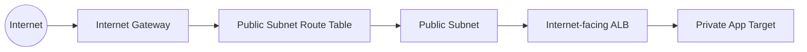
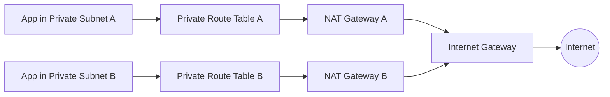
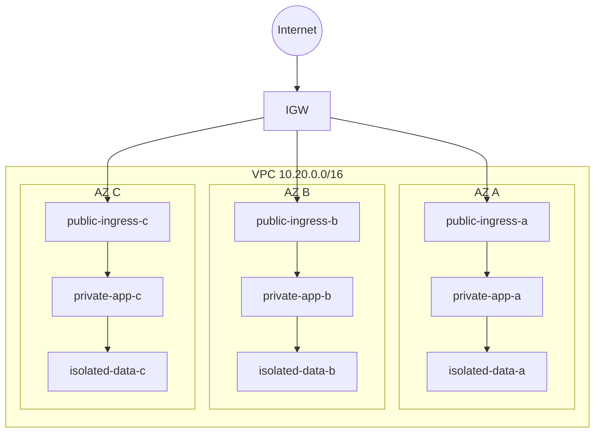
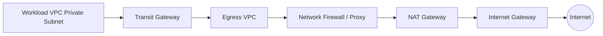
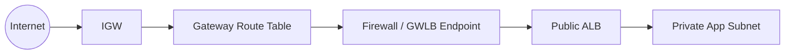
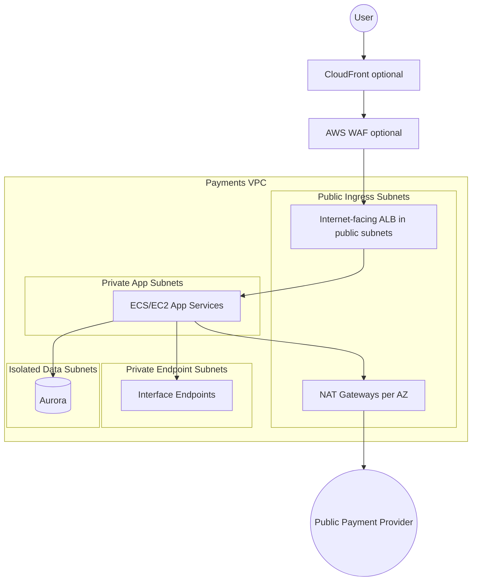

# Part 009 — Subnet Taxonomy: Public, Private, and Isolated

Banyak engineer mengira subnet AWS punya tipe bawaan seperti ini:

```text
subnet.type = public | private | isolated
```

Itu cara berpikir yang berbahaya.

Di Amazon VPC, subnet adalah **range IP di satu Availability Zone**. Ia menjadi public, private, isolated, inspection, endpoint, data, atau app bukan karena label magis, tapi karena **route table association**, **gateway/endpoint target**, dan **placement workload**.

Jadi taxonomy subnet bukan sekadar naming convention. Taxonomy adalah kontrak desain:

- traffic boleh keluar ke mana;
- traffic boleh masuk dari mana;
- dependency mana yang boleh dilalui;
- resource apa yang boleh ditempatkan di subnet itu;
- fault domain mana yang terkena jika subnet/AZ/path gagal;
- siapa yang boleh mengubah route table dan security policy;
- bagaimana desain ini bisa di-debug saat incident.

Part ini membahas subnet seperti engineer produksi, bukan seperti tutorial “buat public subnet dan private subnet”.

---

## 1. Mental Model: Subnet Adalah Placement Boundary + Routing Intent

Subnet AWS punya dua sisi.

Pertama, subnet adalah **placement boundary**.

```text
VPC CIDR: 10.20.0.0/16

AZ-a subnet: 10.20.10.0/24
AZ-b subnet: 10.20.20.0/24
AZ-c subnet: 10.20.30.0/24
```

Setiap subnet berada di **satu AZ**. Kalau workload kamu tersebar di tiga AZ, biasanya kamu butuh minimal satu subnet per AZ untuk tier yang sama.

Kedua, subnet adalah **routing intent**.

```text
private-app-a route table:
10.20.0.0/16 -> local
0.0.0.0/0    -> nat-gateway-a

isolated-db-a route table:
10.20.0.0/16 -> local
```

Dua subnet bisa sama-sama berada di AZ yang sama, tapi punya karakter berbeda karena route table berbeda.

Inilah invariant pertama:

> Subnet type is not what you name it. Subnet type is what its route table makes possible.

Kalau subnet bernama `private-subnet-a` punya route `0.0.0.0/0 -> igw`, subnet itu secara fungsional adalah public subnet, tidak peduli tag-nya apa.

---

## 2. Taxonomy Utama: Public, Private, Isolated

Secara praktis, mayoritas desain VPC dimulai dari tiga jenis subnet.

| Taxonomy | Internet Inbound | Internet Outbound | Typical Route | Workload Umum |
|---|---:|---:|---|---|
| Public subnet | Bisa, jika resource punya public IP dan SG mengizinkan | Bisa | `0.0.0.0/0 -> igw` | ALB internet-facing, NAT Gateway, bastion legacy, public NLB |
| Private subnet | Tidak langsung dari internet | Bisa via NAT atau endpoint | `0.0.0.0/0 -> nat-gateway` | App service, ECS tasks, EC2 app, internal ALB, Lambda ENI |
| Isolated subnet | Tidak | Tidak ke internet default | hanya `local` dan/atau private routes spesifik | Database, cache, internal-only services, control-plane-like dependency |

AWS mendeskripsikan public subnet sebagai subnet yang route table-nya punya direct route ke internet gateway. Private subnet tidak punya direct route ke internet gateway dan resource di dalamnya biasanya membutuhkan NAT device untuk akses internet keluar. Artinya istilah public/private bergantung pada routing, bukan label.

---

## 3. Public Subnet: Bukan “Subnet yang Tidak Aman”

Public subnet sering disalahpahami sebagai subnet yang otomatis terbuka ke internet.

Lebih akurat:

> Public subnet adalah subnet yang punya route langsung ke Internet Gateway untuk traffic internet-bound.

Agar resource benar-benar bisa menerima traffic dari internet, perlu beberapa kondisi sekaligus:

1. subnet route table punya route ke IGW;
2. VPC punya IGW attached;
3. resource punya public IPv4 atau Elastic IP, atau reachable lewat public-facing AWS managed endpoint;
4. security group mengizinkan inbound;
5. NACL tidak memblokir inbound/outbound;
6. OS/app listener menerima traffic;
7. return path valid.

Diagram minimal:



Route table public biasanya terlihat seperti:

```text
Destination      Target
10.20.0.0/16     local
0.0.0.0/0        igw-xxxxxxxx
::/0             eigw/igw, depending IPv6 design
```

### 3.1 Resource yang wajar ditempatkan di public subnet

Public subnet ideal untuk resource yang memang harus menjadi entry/egress boundary:

- internet-facing Application Load Balancer;
- internet-facing Network Load Balancer;
- NAT Gateway;
- bastion host jika organisasi belum memakai SSM Session Manager atau Verified Access;
- public-facing network appliance tertentu;
- edge integration tertentu yang secara eksplisit butuh public subnet.

Resource aplikasi biasa sebaiknya tidak langsung ditempatkan di public subnet kecuali ada alasan kuat dan kontrolnya matang.

Contoh buruk:

```text
user -> internet -> EC2 app with public IP -> database
```

Contoh lebih baik:

```text
user -> CloudFront/WAF -> ALB public subnet -> app private subnet -> db isolated subnet
```

### 3.2 Public subnet bukan pengganti security boundary

Public subnet hanya memberi **path**. Ia bukan keputusan authorization.

Authorization tetap berada di:

- security group;
- NACL jika digunakan sebagai subnet guardrail;
- WAF jika HTTP(S);
- IAM/resource policy untuk AWS API;
- app-level auth;
- mTLS/token/session layer.

Subnet adalah layer reachability, bukan layer permission lengkap.

---

## 4. Private Subnet: Outbound Bisa, Inbound Internet Tidak Langsung

Private subnet biasanya dipakai untuk aplikasi.

Ia tidak punya direct route ke IGW. Tapi ia bisa punya route outbound ke NAT Gateway atau private endpoint.

Contoh route table private:

```text
Destination      Target
10.20.0.0/16     local
0.0.0.0/0        nat-aaa111
```

Dengan route ini:

- instance/app di private subnet bisa memulai koneksi ke internet;
- internet tidak bisa memulai koneksi langsung ke instance private;
- return traffic dari koneksi yang dimulai instance bisa kembali lewat NAT;
- NAT Gateway harus berada di public subnet;
- setiap AZ idealnya punya NAT Gateway sendiri untuk menghindari cross-AZ dependency.

Diagram:



### 4.1 Private subnet bukan berarti “tidak bisa diakses”

Private subnet tetap bisa diakses dari:

- ALB internal/public yang target-nya private IP;
- VPC lain lewat Transit Gateway/VPC Peering/PrivateLink/VPC Lattice;
- on-prem lewat Direct Connect/VPN;
- same VPC local route;
- Lambda/ECS/EKS/RDS integration;
- SSM Session Manager untuk management plane.

Jadi jangan gunakan istilah “private” untuk berarti “aman”. Private hanya berarti tidak ada direct internet ingress path.

### 4.2 Private subnet dan egress dependency

Private subnet sering bergantung pada egress untuk:

- patch package repository;
- container image pull;
- license server;
- external API;
- SaaS webhook polling;
- OS update;
- artifact repository;
- telemetry export.

Kalau semua outbound dipaksa via NAT, kamu akan membayar NAT hourly + data processing dan punya dependency terpusat.

Alternatifnya:

```text
S3/DynamoDB        -> Gateway VPC Endpoint
AWS APIs           -> Interface VPC Endpoint
Internal service   -> PrivateLink / VPC Lattice / TGW / Peering
Internet API       -> NAT / proxy / egress firewall
```

Private subnet yang baik bukan sekadar punya NAT. Ia punya **egress design**.

---

## 5. Isolated Subnet: Tidak Ada Default Egress Internet

Isolated subnet biasanya hanya punya local route dan private routes eksplisit.

Contoh:

```text
Destination      Target
10.20.0.0/16     local
10.40.0.0/16     tgw-xxxx      # optional, if needed
pl-aws-s3        vpce-gw-s3    # optional, via gateway endpoint route
```

Tidak ada:

```text
0.0.0.0/0 -> igw
0.0.0.0/0 -> nat
::/0      -> igw/eigw
```

Isolated subnet dipakai ketika workload seharusnya tidak punya outbound internet default.

Resource umum:

- RDS;
- Aurora;
- ElastiCache;
- internal stateful service;
- search cluster internal;
- private CA/HSM integration tertentu;
- workload regulated yang hanya boleh bicara ke service tertentu;
- internal-only data processing node.

### 5.1 Isolated bukan berarti tidak bisa akses AWS API

Isolated subnet bisa tetap mengakses AWS API via VPC endpoint.

Contoh pola:

```text
Isolated app -> Interface Endpoint for Secrets Manager
Isolated app -> Interface Endpoint for STS
Isolated app -> Gateway Endpoint for S3
Isolated app -> Interface Endpoint for CloudWatch Logs
```

Ini membuat subnet tetap private tanpa membuka default route ke internet.

### 5.2 Isolated subnet dan operational trap

Isolated subnet sering gagal di operasi karena dependency terlupakan.

Contoh app di isolated subnet butuh:

- pull image dari ECR;
- ambil secret dari Secrets Manager;
- publish log ke CloudWatch Logs;
- decrypt via KMS;
- assume role via STS;
- read config dari SSM Parameter Store;
- akses S3 artifact;
- resolve DNS.

Tanpa VPC endpoint dan DNS yang benar, app terlihat “network timeout”, padahal desain memang memutus semua egress.

Checklist minimal untuk isolated app:

```text
[ ] App tidak butuh internet public.
[ ] Semua AWS API dependency sudah diidentifikasi.
[ ] Interface endpoint dibuat per AZ yang relevan.
[ ] Endpoint security group mengizinkan source subnet/app SG.
[ ] Private DNS endpoint aktif jika ingin memakai hostname default AWS.
[ ] Route table punya gateway endpoint route untuk S3/DynamoDB jika dipakai.
[ ] DNS resolver path valid.
[ ] Logging path tersedia.
[ ] Break-glass management path tersedia.
```

---

## 6. Jangan Campur Taxonomy dengan Tier Aplikasi Secara Buta

Banyak diagram klasik:

```text
public subnet  = web tier
private subnet = app tier
isolated subnet = db tier
```

Ini berguna sebagai awal, tapi tidak selalu benar.

Di desain modern:

- web tier bisa berupa CloudFront + ALB, bukan EC2 di public subnet;
- app tier bisa berjalan di ECS/EKS private subnet;
- database bisa tetap perlu private endpoint ke KMS/Secrets/CloudWatch;
- internal API bisa berada di private subnet dengan internal ALB;
- service-to-service bisa lewat VPC Lattice atau PrivateLink, bukan direct route;
- ingestion endpoint bisa public-facing tapi target processing-nya private;
- edge security bisa dikerjakan CloudFront/WAF sebelum traffic menyentuh VPC.

Lebih tepat gunakan dua dimensi:

```text
Subnet taxonomy  = reachability intent
Application tier = business/runtime responsibility
```

Contoh matrix:

| Workload | Tier | Subnet Taxonomy | Entry Path | Egress Path |
|---|---|---|---|---|
| Internet-facing ALB | ingress | public | IGW/CloudFront | target private IP |
| API service | app | private | ALB/VPC Lattice | NAT/endpoints |
| Worker | compute | private/isolated | queue/internal | endpoints/NAT limited |
| Aurora | data | isolated | app SG/private route | no default internet |
| NAT Gateway | egress infra | public | private subnet route | IGW |
| Interface endpoint | private service access | endpoint/private | app subnet | AWS service private path |

---

## 7. Multi-AZ Subnet Matrix

Production VPC jarang hanya punya satu public dan satu private subnet.

Minimum pattern untuk three-tier app di tiga AZ:

```text
VPC 10.20.0.0/16

AZ-a:
  public-ingress-a   10.20.0.0/24
  private-app-a      10.20.10.0/24
  isolated-data-a    10.20.20.0/24

AZ-b:
  public-ingress-b   10.20.1.0/24
  private-app-b      10.20.11.0/24
  isolated-data-b    10.20.21.0/24

AZ-c:
  public-ingress-c   10.20.2.0/24
  private-app-c      10.20.12.0/24
  isolated-data-c    10.20.22.0/24
```

Visual:



### 7.1 Mengapa subnet per AZ penting?

Karena AWS service yang bekerja multi-AZ sering meminta subnet di banyak AZ.

Contoh:

- ALB butuh subnet di minimal dua AZ untuk high availability;
- RDS subnet group menggunakan subnet di beberapa AZ;
- EKS node group/pod placement menggunakan subnet per AZ;
- NAT Gateway bersifat AZ-scoped dalam praktik routing resiliency;
- VPC endpoint sering dibuat per AZ agar path tidak bergantung AZ lain.

Jika kamu hanya punya satu private subnet, kamu membuat architecture yang secara fisik condong ke satu AZ.

### 7.2 Jangan hanya “spread compute”, spread juga network dependency

Kesalahan umum:

```text
App runs in AZ-a and AZ-b.
NAT Gateway only in AZ-a.
```

Saat AZ-a terganggu:

- app di AZ-b mungkin masih hidup;
- tapi outbound internet app di AZ-b putus karena route-nya ke NAT AZ-a;
- atau traffic cross-AZ menyebabkan cost dan latency tidak perlu.

Pattern lebih baik:

```text
private-app-a -> NAT Gateway A
private-app-b -> NAT Gateway B
private-app-c -> NAT Gateway C
```

Route table private dibuat per AZ.

---

## 8. Route Intent per Subnet

Subnet taxonomy harus diterjemahkan menjadi route table yang eksplisit.

### 8.1 Public ingress subnet

```text
Route table: rt-public-ingress

Destination      Target
10.20.0.0/16     local
0.0.0.0/0        igw-xxxx
::/0             igw-xxxx       # jika IPv6 internet ingress/egress diizinkan
```

Purpose:

- menerima ALB/NLB internet-facing;
- menampung NAT Gateway;
- menampung public network appliance jika perlu.

Do not place by default:

- app server biasa;
- database;
- queue worker;
- secret-bearing internal admin service.

### 8.2 Private app subnet

```text
Route table: rt-private-app-a

Destination      Target
10.20.0.0/16     local
0.0.0.0/0        nat-a
pl-s3            vpce-s3-gateway
```

Purpose:

- app compute;
- ECS/EKS worker;
- private EC2;
- internal service;
- Lambda VPC ENI subnet.

Design question:

- Butuh internet penuh atau hanya AWS API tertentu?
- Bisa ganti NAT dengan endpoint/proxy?
- Perlu route ke TGW?
- Perlu egress inspection?

### 8.3 Isolated data subnet

```text
Route table: rt-isolated-data-a

Destination      Target
10.20.0.0/16     local
```

Optional:

```text
10.30.0.0/16     tgw-xxxx        # only if data plane explicitly needs it
pl-s3            vpce-s3-gateway # if backup/export to S3 is needed
```

Purpose:

- database;
- cache;
- internal stateful systems.

Rule:

> Isolated subnet should not have default egress unless there is an explicit threat-model-approved reason.

### 8.4 Endpoint subnet

Beberapa organisasi membuat subnet khusus untuk interface endpoints.

```text
private-endpoint-a 10.20.40.0/24
private-endpoint-b 10.20.41.0/24
private-endpoint-c 10.20.42.0/24
```

Kelebihan:

- endpoint ENI terpusat;
- easier security group policy;
- easier flow log filtering;
- clean ownership by platform/network team.

Kekurangan:

- route/DNS/SG dependency makin perlu didokumentasikan;
- latency path tetap intra-VPC tapi mungkin melewati AZ jika endpoint per AZ tidak lengkap;
- subnet IP harus cukup untuk jumlah endpoint.

---

## 9. Subnet Naming: Nama Harus Mengungkap Intent, Bukan Hiasan

Nama subnet harus menjawab minimal empat pertanyaan:

1. environment apa;
2. VPC/domain apa;
3. taxonomy/fungsi apa;
4. AZ mana.

Contoh:

```text
prod-payments-public-ingress-ap-southeast-3a
prod-payments-private-app-ap-southeast-3a
prod-payments-isolated-data-ap-southeast-3a
prod-payments-private-endpoint-ap-southeast-3a
```

Jika terlalu panjang, gunakan format ringkas tapi tetap konsisten:

```text
prd-pay-pub-ing-a
prd-pay-prv-app-a
prd-pay-iso-data-a
prd-pay-prv-ep-a
```

Jangan hanya:

```text
subnet-1
private-a
app
backend
```

Saat incident, nama buruk memperlambat debugging.

---

## 10. Subnet Tagging untuk Automation

Banyak controller/tooling bergantung pada tag subnet.

Contoh kategori tag:

```yaml
Name: prod-payments-private-app-a
Environment: prod
NetworkDomain: payments
SubnetTier: private-app
RouteIntent: outbound-via-nat-a
AzRole: a
OwnerTeam: platform-network
DataClassification: internal
InternetRoutable: "false"
DefaultEgress: "nat"
```

Untuk Kubernetes/EKS, tag subnet sering dipakai agar load balancer controller tahu subnet mana yang cocok untuk public/internal load balancer. Detailnya akan dibahas di Part 065, tapi prinsipnya sama: subnet taxonomy harus machine-readable.

---

## 11. Public vs Private vs Isolated: Decision Table

Gunakan pertanyaan ini sebelum membuat subnet baru.

| Pertanyaan | Jawaban | Taxonomy Awal |
|---|---|---|
| Apakah resource perlu menerima traffic langsung dari internet? | Ya | Public, tapi biasanya hanya LB/gateway, bukan app langsung |
| Apakah resource perlu outbound internet arbitrary? | Ya | Private + NAT/proxy/egress firewall |
| Apakah resource hanya perlu AWS API tertentu? | Ya | Private/isolated + VPC endpoints |
| Apakah resource data/stateful tidak boleh punya default internet egress? | Ya | Isolated |
| Apakah subnet hanya untuk NAT/ALB/public appliance? | Ya | Public infra subnet |
| Apakah subnet hanya untuk endpoint ENI? | Ya | Private endpoint subnet |
| Apakah traffic perlu inspection sebelum keluar/masuk? | Ya | Inspection/egress subnet pattern |

Prinsipnya:

```text
Default to least reachability.
Add routes when a dependency is real.
Do not add 0.0.0.0/0 because debugging is easier.
```

---

## 12. Common Anti-Patterns

### 12.1 “Private subnet” dengan route ke IGW

```text
Name: private-app-a
Route: 0.0.0.0/0 -> igw
```

Ini bukan private subnet secara fungsional.

Kalau instance mendapat public IP dan SG membuka inbound, ia bisa reachable dari internet.

### 12.2 Semua subnet memakai main route table

Main route table memang ada, tapi produksi sebaiknya explicit.

Anti-pattern:

```text
all subnets -> main route table
main route table -> 0.0.0.0/0 NAT
```

Dampak:

- public/private/isolated intent tidak jelas;
- perubahan main route table berdampak luas;
- review keamanan sulit;
- incident blast radius besar.

Pattern lebih baik:

```text
public-ingress-* -> rt-public-ingress
private-app-a    -> rt-private-app-a
private-app-b    -> rt-private-app-b
isolated-data-*  -> rt-isolated-data
```

### 12.3 Satu NAT untuk semua AZ tanpa sadar risiko

Kadang dipilih demi cost.

Itu valid untuk non-prod atau workload rendah, tapi harus eksplisit:

```text
Trade-off accepted:
- lower cost
- cross-AZ dependency
- possible cross-AZ data processing cost
- AZ-a NAT failure affects private egress from other AZs
```

Jangan biarkan ini terjadi karena template default.

### 12.4 Database subnet punya default route ke NAT

Banyak desain memasukkan database ke private subnet biasa yang punya NAT.

Pertanyaan yang harus dijawab:

- Apakah database benar-benar perlu outbound internet arbitrary?
- Untuk backup/export, cukup S3 gateway endpoint?
- Untuk monitoring/logging, cukup interface endpoint?
- Untuk patching managed service, apakah AWS membutuhkan route dari subnet pelanggan atau dikelola service?

Untuk stateful regulated workload, default route ke NAT sering terlalu longgar.

### 12.5 Subnet terlalu kecil untuk managed ENI

Subnet `/28` terlihat hemat, tapi AWS mereserve 5 IPv4 address per subnet dan banyak managed service membuat ENI.

Masalah yang muncul:

- ALB/NLB scaling terganggu;
- Lambda VPC integration butuh IP;
- EKS pod/node IP habis;
- interface endpoint tidak cukup;
- RDS failover/maintenance terganggu;
- deployment gagal karena insufficient free addresses.

Sizing sudah dibahas di Part 008. Di part ini, ingat prinsipnya:

> Subnet taxonomy without capacity model is just naming.

---

## 13. Subnet Taxonomy untuk Centralized Egress

Enterprise sering memakai centralized egress VPC.

Pattern umum:



Dalam pattern ini, private app subnet mungkin tidak route langsung ke NAT lokal.

Contoh:

```text
Workload private route table:
10.20.0.0/16 -> local
0.0.0.0/0    -> tgw-xxxx
```

Secara taxonomy, subnet itu tetap private. Tapi egress path-nya adalah centralized inspection, bukan local NAT.

Jadi taxonomy perlu lebih spesifik:

```text
private-app-local-nat
private-app-central-egress
private-app-no-default-egress
```

---

## 14. Subnet Taxonomy untuk Ingress Inspection

Untuk workload regulated, internet ingress bisa dipaksa melewati inspection.

Pattern sederhana:



Subnet taxonomy yang muncul:

- public-ingress subnet;
- inspection subnet;
- private-app subnet;
- isolated-data subnet.

Ini akan dibahas lebih dalam di Gateway Load Balancer, Network Firewall, dan gateway route table parts. Untuk sekarang, pahami bahwa public/private/isolated adalah baseline, bukan seluruh taxonomy enterprise.

---

## 15. Subnet Taxonomy untuk Private Service Exposure

Tidak semua private connectivity berarti “route semua CIDR ke semua CIDR”.

Untuk service exposure lintas account/VPC, opsi bisa berupa:

- VPC Peering;
- Transit Gateway;
- PrivateLink;
- VPC Lattice;
- Cloud Map/internal DNS.

Subnet taxonomy ikut berubah.

Contoh PrivateLink provider:

```text
provider-vpc:
  private-service-subnet-a -> NLB target
  private-service-subnet-b -> NLB target
  endpoint-service         -> exposed to consumers
```

Consumer tidak perlu route ke CIDR provider. Consumer membuat interface endpoint di subnet-nya sendiri.

Ini mengurangi masalah overlap dan blast radius dibanding full network mesh.

---

## 16. Route Table Association sebagai Source of Truth

Untuk menentukan taxonomy subnet, baca route table association, bukan nama.

Pseudo-algorithm:

```text
for subnet in vpc.subnets:
    rt = associated_route_table(subnet)

    if rt.has_default_route_to_igw():
        type = "public"
    elif rt.has_default_route_to_nat_or_egress_or_tgw():
        type = "private-with-egress"
    elif rt.has_only_local_and_explicit_private_routes():
        type = "isolated-or-private-internal"
    else:
        type = "custom-review-required"
```

AWS CLI starting point:

```bash
aws ec2 describe-route-tables \
  --filters "Name=vpc-id,Values=vpc-xxxxxxxx" \
  --query 'RouteTables[].{RouteTableId:RouteTableId,Associations:Associations[].SubnetId,Routes:Routes}'
```

Cari route:

```text
GatewayId starts with igw-       -> public internet path
NatGatewayId starts with nat-    -> outbound NAT path
TransitGatewayId starts with tgw- -> routed to network hub
VpcEndpointId starts with vpce-  -> endpoint path
EgressOnlyInternetGatewayId      -> IPv6 outbound-only internet path
```

---

## 17. Design Exercise: Membuat Subnet Matrix untuk Production Payments VPC

Requirement:

```text
- Region: ap-southeast-3
- 3 AZ
- Internet-facing API
- App service di ECS/EC2 private subnet
- Aurora database
- Outbound ke public payment provider
- S3 artifact/log export
- Secrets Manager, KMS, STS, CloudWatch Logs
- Future TGW integration
```

Subnet proposal:

```text
public-ingress-a       10.30.0.0/24
public-ingress-b       10.30.1.0/24
public-ingress-c       10.30.2.0/24

private-app-a          10.30.10.0/23
private-app-b          10.30.12.0/23
private-app-c          10.30.14.0/23

isolated-data-a        10.30.30.0/24
isolated-data-b        10.30.31.0/24
isolated-data-c        10.30.32.0/24

private-endpoint-a     10.30.40.0/24
private-endpoint-b     10.30.41.0/24
private-endpoint-c     10.30.42.0/24
```

Route intent:

```text
rt-public-ingress:
  10.30.0.0/16 -> local
  0.0.0.0/0    -> igw

rt-private-app-a:
  10.30.0.0/16 -> local
  0.0.0.0/0    -> nat-a
  pl-s3        -> s3-gateway-endpoint

rt-private-app-b:
  10.30.0.0/16 -> local
  0.0.0.0/0    -> nat-b
  pl-s3        -> s3-gateway-endpoint

rt-isolated-data:
  10.30.0.0/16 -> local
  pl-s3        -> s3-gateway-endpoint, only if DB export/backup path requires it
```

Endpoint needs:

```text
Secrets Manager -> interface endpoint
KMS             -> interface endpoint
STS             -> interface endpoint
CloudWatch Logs -> interface endpoint
ECR API/DKR     -> interface endpoint if container image pull happens privately
S3              -> gateway endpoint
```

Architecture:



---

## 18. Debugging Subnet Taxonomy

Saat ada problem “tidak bisa connect”, jangan mulai dari Security Group. Mulai dari path.

### 18.1 Pertanyaan debugging inbound internet

```text
[ ] Apakah DNS resolve ke target yang benar?
[ ] Apakah target adalah CloudFront/ALB/NLB/public IP yang diharapkan?
[ ] Jika target instance langsung, apakah instance punya public IP/EIP?
[ ] Apakah subnet target punya route ke IGW?
[ ] Apakah return path lewat route table valid?
[ ] Apakah SG inbound mengizinkan source/port?
[ ] Apakah SG outbound mengizinkan response?
[ ] Apakah NACL inbound/outbound mengizinkan port + ephemeral response?
[ ] Apakah listener berjalan?
```

### 18.2 Pertanyaan debugging outbound private subnet

```text
[ ] Apakah subnet punya route 0.0.0.0/0 ke NAT/proxy/TGW?
[ ] Apakah NAT berada di public subnet?
[ ] Apakah NAT route table punya route ke IGW?
[ ] Apakah source SG outbound mengizinkan?
[ ] Apakah NACL mengizinkan outbound dan ephemeral return?
[ ] Apakah DNS resolve?
[ ] Apakah target memblokir source public IP NAT?
[ ] Apakah NAT port exhaustion mungkin terjadi?
```

### 18.3 Pertanyaan debugging isolated subnet

```text
[ ] Apakah dependency seharusnya reachable dari isolated subnet?
[ ] Apakah butuh VPC endpoint?
[ ] Apakah Private DNS endpoint aktif?
[ ] Apakah endpoint SG mengizinkan source?
[ ] Apakah route table punya gateway endpoint route jika S3/DynamoDB?
[ ] Apakah DNS resolver path benar?
[ ] Apakah app timeout karena mencoba public AWS endpoint?
```

---

## 19. Invariants untuk Production Subnet Design

Pegang invariant ini.

1. **Subnet type ditentukan oleh route table, bukan nama.**
2. **Subnet berada di satu AZ, jadi high availability butuh subnet matrix.**
3. **Public subnet sebaiknya untuk ingress/egress infrastructure, bukan app biasa.**
4. **Private subnet harus punya egress strategy, bukan otomatis NAT.**
5. **Isolated subnet harus punya dependency map, bukan sekadar route kosong.**
6. **Route table per AZ sering diperlukan untuk NAT lokal dan failure isolation.**
7. **Tagging subnet harus cukup kaya untuk automation dan audit.**
8. **Jangan campur taxonomy subnet dengan application tier secara buta.**
9. **Egress path adalah bagian dari security posture.**
10. **Subnet capacity harus dirancang berdasarkan ENI/service consumption.**

---

## 20. Practical Lab

Tujuan lab: membuktikan bahwa subnet type adalah hasil routing.

### 20.1 Buat tiga route table konseptual

```bash
# Public route table
aws ec2 create-route-table --vpc-id vpc-xxxx
aws ec2 create-route \
  --route-table-id rtb-public \
  --destination-cidr-block 0.0.0.0/0 \
  --gateway-id igw-xxxx

# Private route table
aws ec2 create-route-table --vpc-id vpc-xxxx
aws ec2 create-route \
  --route-table-id rtb-private-a \
  --destination-cidr-block 0.0.0.0/0 \
  --nat-gateway-id nat-xxxx

# Isolated route table: no default route
aws ec2 create-route-table --vpc-id vpc-xxxx
```

### 20.2 Associate subnet

```bash
aws ec2 associate-route-table \
  --subnet-id subnet-public-a \
  --route-table-id rtb-public

aws ec2 associate-route-table \
  --subnet-id subnet-private-a \
  --route-table-id rtb-private-a

aws ec2 associate-route-table \
  --subnet-id subnet-isolated-a \
  --route-table-id rtb-isolated
```

### 20.3 Validate taxonomy

```bash
aws ec2 describe-route-tables \
  --filters "Name=association.subnet-id,Values=subnet-public-a,subnet-private-a,subnet-isolated-a" \
  --query 'RouteTables[].{Id:RouteTableId,Associations:Associations[].SubnetId,Routes:Routes}'
```

Expected reasoning:

```text
subnet-public-a:
  has 0.0.0.0/0 -> igw
  taxonomy = public

subnet-private-a:
  has 0.0.0.0/0 -> nat
  taxonomy = private with outbound internet

subnet-isolated-a:
  only local route
  taxonomy = isolated/internal-only
```

---

## 21. Summary

Subnet taxonomy adalah bahasa desain untuk reachability.

Public, private, dan isolated bukan label estetis. Mereka adalah konsekuensi dari route table, gateway, endpoint, DNS, security policy, dan workload placement.

Cara berpikir yang benar:

```text
Workload needs -> required paths -> route intent -> subnet taxonomy -> route table -> security controls -> observability
```

Bukan:

```text
Create public/private subnet -> put things there -> hope it works
```

Di part berikutnya, kita masuk ke mekanisme yang membuat taxonomy ini nyata: **route tables, local routes, dan routing precedence**. Di sana kita akan membedah bagaimana AWS memilih route ketika ada beberapa route yang cocok, kenapa longest prefix match penting, bagaimana local route bekerja, dan bagaimana kesalahan kecil di route table bisa mengubah seluruh posture VPC.

---

## References

- AWS Documentation — Subnets for your VPC: https://docs.aws.amazon.com/vpc/latest/userguide/configure-subnets.html
- AWS Documentation — What is Amazon VPC?: https://docs.aws.amazon.com/vpc/latest/userguide/what-is-amazon-vpc.html
- AWS Documentation — Configure route tables: https://docs.aws.amazon.com/vpc/latest/userguide/VPC_Route_Tables.html
- AWS Documentation — NAT gateways: https://docs.aws.amazon.com/vpc/latest/userguide/vpc-nat-gateway.html
- AWS Documentation — Enable internet access using an internet gateway: https://docs.aws.amazon.com/vpc/latest/userguide/VPC_Internet_Gateway.html
