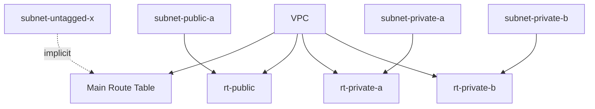
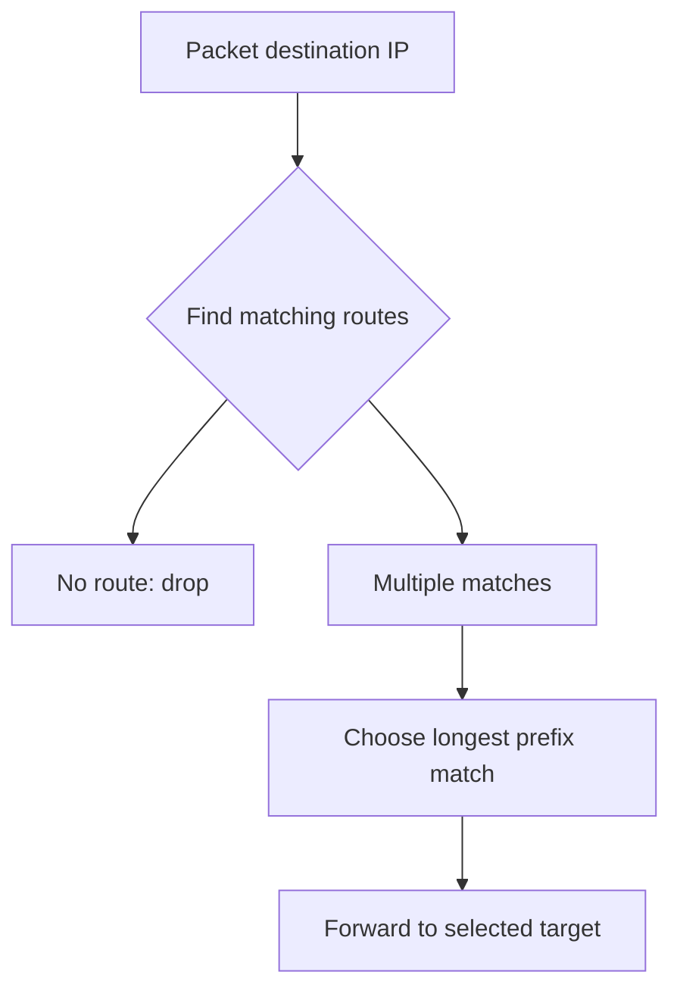
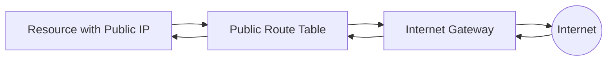
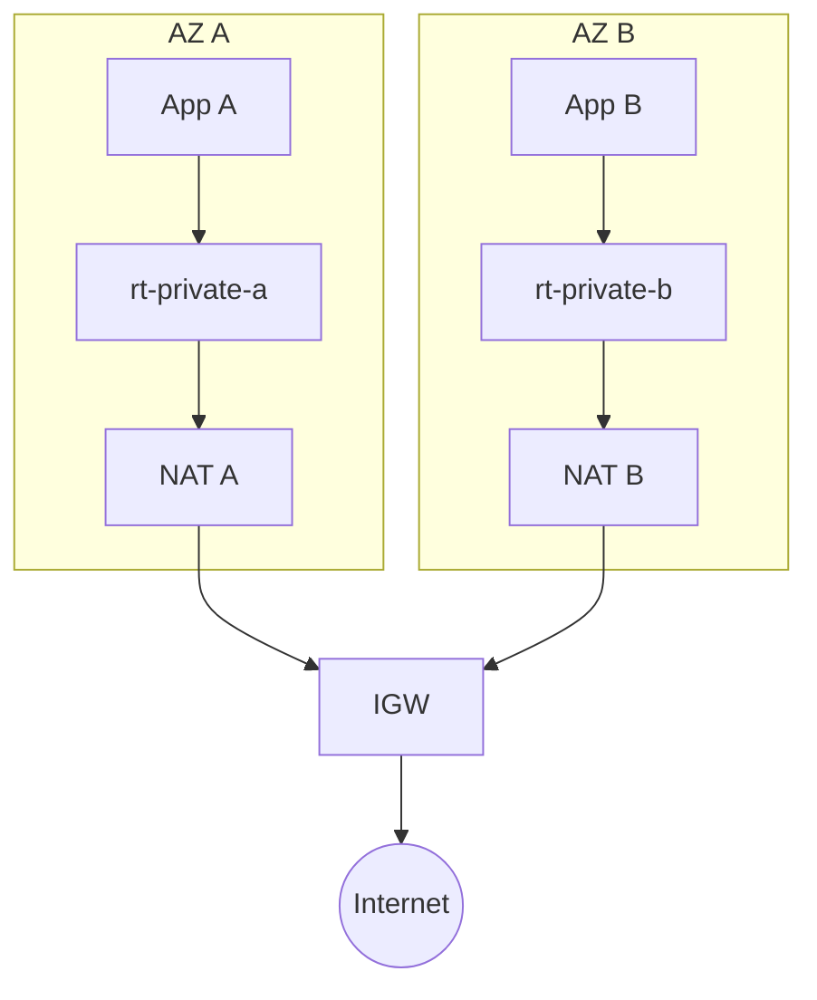
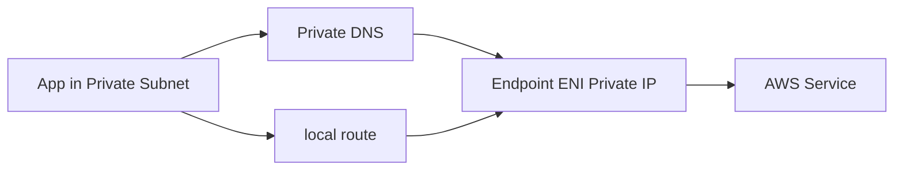
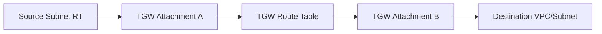
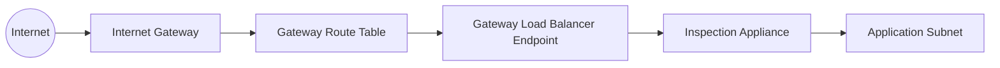
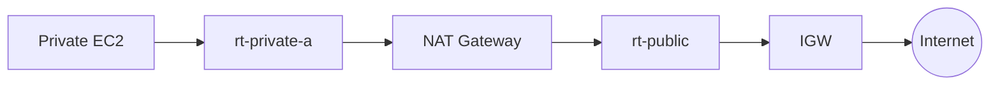

# Part 010 — Route Tables, Local Routes, and Routing Precedence

Route table adalah salah satu komponen paling sederhana di Amazon VPC.

Ia juga salah satu penyebab incident paling sering.

Bukan karena konsepnya rumit, tapi karena efeknya luas:

- satu route `0.0.0.0/0 -> igw` bisa mengubah subnet menjadi public;
- satu route `0.0.0.0/0 -> tgw` bisa memindahkan semua egress ke centralized firewall;
- satu propagated route bisa membuat traffic on-prem mengambil jalur berbeda;
- satu blackhole route bisa memutus service lintas VPC;
- satu association salah bisa membuat database punya egress yang tidak pernah disetujui;
- satu route yang lebih spesifik bisa mengalahkan default route;
- satu prefix list bisa menyederhanakan ratusan CIDR tapi juga menyembunyikan blast radius.

Part ini membahas route table dari first principles sampai cara debugging produksi.

---

## 1. Mental Model: Route Table Adalah Decision Table untuk Destination IP

Ketika packet keluar dari subnet, VPC perlu menjawab satu pertanyaan:

```text
Untuk destination IP ini, target berikutnya apa?
```

Route table menjawab pertanyaan itu.

Bentuk dasarnya:

```text
Destination       Target
10.20.0.0/16      local
0.0.0.0/0         nat-aaa111
172.16.0.0/12     tgw-bbb222
pl-63a5400a       vpce-s3-gateway
```

Setiap route punya:

| Field | Arti |
|---|---|
| Destination | CIDR IPv4, CIDR IPv6, atau prefix list |
| Target | Local, IGW, NAT, TGW, peering, endpoint, ENI, GWLB endpoint, VGW, egress-only IGW, dan lain-lain |
| State | Active atau blackhole |
| Origin | CreateRouteTable, CreateRoute, EnableVgwRoutePropagation, dan sejenisnya |

Route table bukan firewall. Route table tidak bertanya:

- siapa user-nya;
- apa role IAM-nya;
- HTTP path apa yang diakses;
- apakah request valid secara bisnis;
- apakah port diizinkan.

Route table hanya menentukan **next hop** berdasarkan destination.

---

## 2. Route Table Scope: Subnet Association

Dalam VPC, subnet menggunakan satu route table untuk menentukan routing keluar dari subnet itu.

Ada dua model association:

1. explicit association;
2. implicit association via main route table.



### 2.1 Main route table

Setiap VPC punya main route table. Subnet yang tidak secara eksplisit diasosiasikan ke route table lain akan memakai main route table.

Di production, jangan biarkan main route table menjadi tempat “semua route penting”.

Gunakan main route table sebagai baseline aman:

```text
main route table:
10.20.0.0/16 -> local
# no default route
```

Lalu buat custom route table untuk subnet yang punya intent jelas:

```text
rt-public-ingress
rt-private-app-a
rt-private-app-b
rt-private-app-c
rt-isolated-data
rt-endpoint
rt-inspection
```

Prinsip:

> In production, implicit association should be boring and safe.

Kalau subnet baru lupa diasosiasikan, ia sebaiknya jatuh ke route table yang minim reachability, bukan otomatis punya internet egress.

---

## 3. Local Route: Jantung Komunikasi Intra-VPC

Setiap route table VPC memiliki route `local` untuk CIDR VPC.

Contoh:

```text
Destination      Target
10.20.0.0/16     local
```

Artinya resources di VPC yang sama bisa saling route menggunakan private IP, selama security group/NACL mengizinkan.

Local route menjawab:

```text
Destination 10.20.12.34 masih dalam VPC ini.
Kirim melalui fabric lokal VPC.
```

### 3.1 Local route bukan allow-all firewall

Local route hanya mengatakan traffic bisa diarahkan secara network-level.

Traffic tetap bisa ditolak oleh:

- security group source/target;
- NACL subnet source/target;
- OS firewall;
- app listener;
- service policy;
- endpoint policy;
- identity layer.

Jadi kalau dua EC2 dalam VPC yang sama tidak bisa connect, jangan langsung menyalahkan route table. Local route mungkin sudah benar, tapi SG/NACL/listener bisa salah.

### 3.2 Multi-CIDR VPC dan local route

VPC bisa punya primary CIDR dan secondary CIDR.

Maka route table punya local route untuk CIDR VPC tersebut.

Contoh:

```text
Destination      Target
10.20.0.0/16     local
100.64.0.0/16    local
```

Ini penting untuk EKS, expansion, migration, dan overlapping strategy.

### 3.3 More-specific route than local

AWS mendukung beberapa skenario route yang lebih spesifik daripada local route untuk subnet CIDR tertentu, dengan target tertentu seperti NAT Gateway, network interface, atau Gateway Load Balancer endpoint. Ini biasanya dipakai untuk traffic inspection/middlebox pattern.

Contoh konseptual:

```text
Destination       Target
10.20.0.0/16      local
10.20.30.0/24     gwlbe-xxxx
```

Interpretasi:

```text
Traffic ke mayoritas VPC tetap local.
Traffic ke subnet 10.20.30.0/24 diarahkan dulu ke inspection endpoint.
```

Ini advanced pattern. Jangan gunakan hanya karena terlihat menarik. Ia mengubah asumsi dasar intra-VPC routing dan harus diuji ketat untuk return path, appliance mode, fail-open/fail-closed, dan observability.

---

## 4. Default Route: `0.0.0.0/0` dan `::/0`

Default route menangkap destination yang tidak cocok dengan route lain yang lebih spesifik.

IPv4 default:

```text
0.0.0.0/0 -> target
```

IPv6 default:

```text
::/0 -> target
```

Target default route menentukan karakter subnet.

| Default Route | Meaning |
|---|---|
| `0.0.0.0/0 -> igw` | Public IPv4 internet route |
| `0.0.0.0/0 -> nat` | Private outbound internet via NAT |
| `0.0.0.0/0 -> tgw` | All unmatched traffic to network hub/egress VPC |
| `0.0.0.0/0 -> eni` | Appliance/proxy path |
| `::/0 -> egress-only-igw` | IPv6 outbound-only internet path |
| no default route | Isolated/internal-only unless specific routes exist |

Default route is powerful because it is broad.

Ia juga berbahaya karena broad.

---

## 5. Longest Prefix Match

Jika ada beberapa route yang cocok, VPC memilih route paling spesifik.

Ini disebut **longest prefix match**.

Contoh:

```text
Destination       Target
0.0.0.0/0         nat-aaa
10.0.0.0/8        tgw-bbb
10.20.0.0/16      local
10.20.30.0/24     gwlbe-ccc
```

Untuk destination:

```text
8.8.8.8       -> 0.0.0.0/0      -> nat-aaa
10.50.1.10    -> 10.0.0.0/8     -> tgw-bbb
10.20.9.15    -> 10.20.0.0/16   -> local
10.20.30.44   -> 10.20.30.0/24  -> gwlbe-ccc
```

Pseudo-code:

```text
matching_routes = routes where destination contains packet.destination_ip
selected_route = matching_route with longest prefix length
send packet to selected_route.target
```

Mermaid:



### 5.1 Why this matters

Misconfiguration sering terjadi ketika engineer menganggap default route selalu dipakai.

Padahal route lebih spesifik akan menang.

Contoh:

```text
0.0.0.0/0      -> nat
52.216.0.0/15  -> vpce/s3 path or prefix list path
```

Traffic ke S3 range tertentu bisa mengambil path endpoint/prefix list, bukan NAT.

Atau:

```text
0.0.0.0/0      -> tgw-central-egress
203.0.113.0/24 -> nat-local
```

Traffic ke partner tertentu keluar lokal, sementara sisanya via central egress.

Ini mungkin disengaja. Bisa juga menjadi silent policy bypass.

---

## 6. Static Routes, Prefix Lists, and Propagated Routes

Tidak semua route berasal dari sumber yang sama.

### 6.1 Static route

Route yang kamu buat eksplisit.

Contoh:

```text
0.0.0.0/0 -> nat-aaa
10.40.0.0/16 -> tgw-bbb
```

Kelebihan:

- jelas;
- bisa direview;
- predictable;
- cocok untuk guardrail.

Kekurangan:

- perlu maintenance;
- rawan stale route;
- scaling sulit jika banyak CIDR.

### 6.2 Prefix list route

Prefix list menyimpan sekumpulan CIDR dan bisa direferensikan di route table.

Contoh:

```text
pl-aws-s3 -> vpce-s3-gateway
pl-partner-apis -> tgw-egress
```

Kelebihan:

- abstraksi CIDR;
- update prefix list bisa mempengaruhi banyak route/security group;
- bagus untuk AWS-managed service range atau central managed CIDR.

Risiko:

- perubahan prefix list punya blast radius;
- review route table saja tidak cukup, harus review isi prefix list;
- quota dan weight prefix list perlu diperhatikan.

### 6.3 Propagated route

Route yang muncul dari route propagation, misalnya VPN/Direct Connect/Virtual Private Gateway/TGW context tertentu.

Kelebihan:

- otomatis mengikuti advertised routes;
- cocok untuk hybrid connectivity;
- mengurangi manual route maintenance.

Risiko:

- route bisa berubah karena pihak lain advertise/withdraw prefix;
- debugging membutuhkan pemahaman BGP/propagation;
- route leak bisa berdampak luas;
- conflict dengan static/local/prefix routes harus dipahami.

---

## 7. Route Priority: Cara Berpikir Aman

AWS route priority punya detail yang perlu dirujuk ke dokumentasi resmi saat desain final, terutama ketika static route, prefix list, dan propagated route punya destination sama/overlap.

Untuk mental model produksi, gunakan urutan praktis berikut:

1. **Most specific route wins.**
2. **Untuk prefix yang sama, pahami origin route. Static route umumnya lebih eksplisit daripada propagated route.**
3. **Prefix list route punya aturan prioritas khusus ketika berinteraksi dengan propagated route.**
4. **Local route punya perilaku khusus dan tidak boleh diasumsikan sama seperti route biasa.**
5. **Jangan desain arsitektur yang bergantung pada ambiguity. Buat route intent eksplisit.**

Contoh aman:

```text
# Clear intent, no ambiguous same-prefix competition
10.20.0.0/16    -> local
10.40.0.0/16    -> tgw-prod
0.0.0.0/0       -> nat-a
```

Contoh rawan:

```text
10.40.0.0/16    -> tgw-prod         # static
10.40.0.0/16    -> propagated-vgw   # propagated
```

Walaupun route priority menentukan pemenang, desain seperti ini membuat operator bertanya:

```text
Kenapa ada dua authority untuk prefix yang sama?
Mana source of truth-nya?
Apa failure behavior saat propagated route hilang?
```

Prinsip:

> Do not use route priority as a policy language. Use it as a deterministic forwarding rule.

---

## 8. Blackhole Routes

Route state bisa menjadi `blackhole` jika target route tidak tersedia.

Contoh penyebab:

- NAT Gateway dihapus;
- VPC peering connection dihapus/tidak aktif;
- Transit Gateway attachment tidak tersedia;
- internet gateway detached;
- endpoint target hilang;
- network interface target dihapus.

Route table mungkin masih punya entry:

```text
Destination      Target        State
10.40.0.0/16     pcx-xxxx      blackhole
```

Efek:

- route masih match;
- traffic ke destination tersebut drop;
- operator bisa terkecoh karena “route ada”.

Debugging invariant:

> Route existence is not enough. Route target state matters.

CLI:

```bash
aws ec2 describe-route-tables \
  --filters "Name=vpc-id,Values=vpc-xxxxxxxx" \
  --query 'RouteTables[].Routes[?State==`blackhole`]'
```

---

## 9. Common Route Targets

| Target | Dipakai Untuk | Catatan |
|---|---|---|
| `local` | Intra-VPC routing | Dibuat untuk VPC CIDR; bukan firewall allow rule |
| `igw-*` | Public internet route | Resource masih butuh public IP/EIP untuk direct internet IPv4 |
| `nat-*` | Outbound internet IPv4 dari private subnet | NAT harus punya path ke IGW jika public NAT |
| `eigw-*` | IPv6 outbound-only internet | Untuk IPv6 tanpa inbound initiation dari internet |
| `tgw-*` | Hub routing ke VPC/on-prem/egress | Route domain dan attachment association penting |
| `pcx-*` | VPC peering | Non-transitive; kedua sisi butuh route |
| `vgw-*` | VPN/DX legacy via VGW | Hybrid routing |
| `vpce-*` | VPC endpoint/GWLB endpoint | Tergantung endpoint type |
| `eni-*` | Appliance route | Perlu high availability strategy sendiri |
| prefix list | Abstraksi destination | Bisa AWS-managed atau customer-managed |

---

## 10. Public Subnet Route Table

Minimal:

```text
Destination      Target
10.20.0.0/16     local
0.0.0.0/0        igw-xxxx
```

Optional IPv6:

```text
::/0             igw-xxxx
```

Traffic model:



Important nuance:

- route ke IGW membuat subnet internet-routable;
- instance tetap butuh public IPv4/EIP untuk direct IPv4 internet communication;
- ALB/NLB public-facing dikelola oleh AWS dan ditempatkan di public subnets;
- SG/NACL tetap mengontrol filtering.

---

## 11. Private Subnet Route Table with NAT

Per-AZ pattern:

```text
rt-private-app-a:
10.20.0.0/16     local
0.0.0.0/0        nat-a

rt-private-app-b:
10.20.0.0/16     local
0.0.0.0/0        nat-b

rt-private-app-c:
10.20.0.0/16     local
0.0.0.0/0        nat-c
```

Diagram:



Failure reasoning:

```text
If NAT A fails:
  app in AZ A loses outbound internet
  app in AZ B still uses NAT B
```

Centralized cost-saving version:

```text
rt-private-app-a:
0.0.0.0/0 -> nat-a

rt-private-app-b:
0.0.0.0/0 -> nat-a
```

Trade-off:

```text
lower cost
higher blast radius
cross-AZ dependency
possible cross-AZ data cost
```

---

## 12. Isolated Subnet Route Table

Minimal:

```text
Destination      Target
10.20.0.0/16     local
```

With private dependency:

```text
Destination      Target
10.20.0.0/16     local
10.40.0.0/16     tgw-xxxx
pl-s3            vpce-s3-gateway
```

Do not casually add:

```text
0.0.0.0/0 -> nat
```

Once you add default egress, isolated becomes private-with-egress.

---

## 13. Route Tables and Gateway Endpoints

Gateway endpoints, such as S3/DynamoDB gateway endpoints, integrate with route tables.

Conceptual route:

```text
Destination      Target
pl-aws-s3        vpce-s3-gateway
```

Meaning:

```text
Traffic to S3 prefix list goes to gateway endpoint,
not to NAT/default internet route.
```

This matters for:

- cost reduction;
- private AWS service access;
- keeping S3 traffic off NAT;
- endpoint policy enforcement;
- regulated egress design.

Example with NAT + S3 endpoint:

```text
Destination      Target
10.20.0.0/16     local
pl-aws-s3        vpce-s3
0.0.0.0/0        nat-a
```

For S3 IP ranges, longest prefix/prefix list route wins over default route.
For other internet destinations, NAT route applies.

---

## 14. Route Tables and Interface Endpoints

Interface endpoints do not usually require route table entries the same way gateway endpoints do.

They create ENIs with private IPs in selected subnets.

Access works through DNS:

```text
app -> secretsmanager.<region>.amazonaws.com
DNS -> private IP of endpoint ENI
route -> local route because endpoint ENI is inside VPC CIDR
```

So the path is:



Troubleshooting implication:

- route table may look fine because local route exists;
- failure could be DNS not resolving to private endpoint;
- endpoint security group may block source;
- Private DNS may be disabled;
- wrong region endpoint may be used;
- application may hardcode public endpoint.

---

## 15. Route Tables and Transit Gateway

A subnet route table can send traffic to Transit Gateway:

```text
Destination      Target
10.40.0.0/16     tgw-xxxx
172.16.0.0/12    tgw-xxxx
0.0.0.0/0        tgw-xxxx   # centralized egress pattern
```

But this is only one side of the story.

Transit Gateway has its own route tables:

```text
VPC subnet route table -> TGW attachment -> TGW route table -> next attachment
```

So debugging must inspect both:

```text
[ ] source subnet route table
[ ] TGW attachment association
[ ] TGW route table route
[ ] destination VPC subnet route table return path
[ ] security controls on both sides
```

Mermaid:



Route table in source VPC alone cannot guarantee end-to-end reachability.

---

## 16. Route Tables and VPC Peering

For VPC peering, both sides need routes.

```text
VPC A route table:
10.40.0.0/16 -> pcx-xxxx

VPC B route table:
10.20.0.0/16 -> pcx-xxxx
```

VPC Peering is non-transitive.

If:

```text
VPC A peered with VPC B
VPC B peered with VPC C
```

A cannot reach C through B via VPC Peering.

Do not design route tables as if peering were a router mesh.

---

## 17. Gateway Route Tables

Subnet route tables control traffic leaving subnets.

Gateway route tables can be associated with internet gateway or virtual private gateway for certain ingress routing use cases.

Use case:

```text
Internet -> IGW -> gateway route table -> security appliance -> workload
```

Conceptual route:

```text
Destination      Target
10.20.10.0/24    gwlbe-xxxx
```

This enables ingress traffic inspection before reaching workload subnet.

Diagram:



This is advanced because routing becomes asymmetric if return path is not designed correctly.

Questions before using gateway route tables:

```text
[ ] Is inspection inline or out-of-band?
[ ] What happens if appliance fails?
[ ] Is return traffic inspected too?
[ ] Does appliance preserve source/destination as expected?
[ ] Are routes more-specific than local involved?
[ ] Is there a fail-open or fail-closed decision?
```

---

## 18. Route Table Design Patterns

### 18.1 Simple three-tier VPC

```text
rt-public:
10.20.0.0/16 -> local
0.0.0.0/0    -> igw

rt-private-a:
10.20.0.0/16 -> local
0.0.0.0/0    -> nat-a

rt-private-b:
10.20.0.0/16 -> local
0.0.0.0/0    -> nat-b

rt-isolated:
10.20.0.0/16 -> local
```

### 18.2 Private subnet with AWS service endpoints

```text
rt-private-a:
10.20.0.0/16 -> local
pl-s3        -> vpce-s3
pl-dynamodb  -> vpce-dynamodb
0.0.0.0/0    -> nat-a
```

### 18.3 Centralized egress via TGW

```text
rt-private-app:
10.20.0.0/16 -> local
0.0.0.0/0    -> tgw-egress
```

In egress VPC:

```text
rt-inspection:
10.0.0.0/8   -> tgw
0.0.0.0/0    -> nat/igw via firewall path
```

### 18.4 Partner-specific route

```text
rt-private-app:
10.20.0.0/16     -> local
203.0.113.0/24   -> tgw-partner
0.0.0.0/0        -> nat-a
```

Meaning:

```text
Only partner prefix uses private/hybrid path.
Other internet goes NAT.
```

### 18.5 Inspection route for subnet CIDR

```text
rt-source:
10.20.0.0/16     -> local
10.20.30.0/24    -> gwlbe-inspection
```

Use only with careful testing.

---

## 19. Routing Decision Algorithm for Debugging

When packet fails, trace like this:

```text
input:
  source ENI/subnet
  destination IP
  protocol/port

step 1: find source subnet
step 2: find associated route table
step 3: list all routes matching destination IP
step 4: choose longest prefix match
step 5: check selected target exists and state is active
step 6: inspect next-hop system route table if applicable
step 7: validate return path from destination to source
step 8: validate SG/NACL/firewall/listener
step 9: validate DNS if destination was hostname
step 10: validate logs/metrics/flow logs
```

Pseudo-code:

```python
route_table = find_route_table(source_subnet)
matching = [r for r in route_table.routes if r.destination.contains(dst_ip)]

if not matching:
    return "DROP: no route"

selected = max(matching, key=lambda r: r.prefix_length)

if selected.state == "blackhole":
    return f"DROP: selected route target unavailable: {selected.target}"

return f"FORWARD: {selected.target}"
```

---

## 20. Debugging Example 1: Private Instance Cannot Reach Internet

Symptom:

```text
curl https://example.com times out
```

Investigation:

```text
source subnet: subnet-private-a
route table: rt-private-a
routes:
10.20.0.0/16 -> local
0.0.0.0/0    -> nat-a
```

Check next:

```text
[ ] nat-a exists and active?
[ ] nat-a is in public subnet?
[ ] public subnet route table has 0.0.0.0/0 -> igw?
[ ] IGW attached to VPC?
[ ] source SG outbound allows 443?
[ ] NACL allows outbound 443 and inbound ephemeral?
[ ] DNS resolves example.com?
[ ] destination blocks NAT public IP?
[ ] NAT metrics show port allocation errors?
```

Mermaid path:



Most missed issue:

```text
NAT Gateway exists, but its subnet route table does not route to IGW.
```

---

## 21. Debugging Example 2: Subnet Accidentally Became Public

Symptom:

Security review finds EC2 app has public IP.

Route table:

```text
10.20.0.0/16 -> local
0.0.0.0/0    -> igw
```

Conclusion:

```text
This is a public subnet by routing behavior.
```

Fix:

```text
[ ] Create/identify private route table.
[ ] Associate app subnet to private route table.
[ ] Remove public IP assignment from instances/launch templates.
[ ] Ensure app is reached via ALB/NLB/internal service path.
[ ] Validate SG inbound from LB/service only.
[ ] Use AWS Config/network access analysis for guardrail.
```

---

## 22. Debugging Example 3: S3 Traffic Still Goes Through NAT

Expected:

```text
Private subnet should use S3 gateway endpoint.
```

Route table:

```text
10.20.0.0/16 -> local
0.0.0.0/0    -> nat-a
```

Problem:

```text
No S3 prefix list route to gateway endpoint.
```

Expected route:

```text
pl-aws-s3 -> vpce-s3-gateway
```

Also check:

```text
[ ] Gateway endpoint associated with correct route tables?
[ ] Endpoint policy allows bucket/action?
[ ] Bucket policy does not deny based on source VPCE/VPC?
[ ] App uses regional S3 endpoint as expected?
```

---

## 23. Debugging Example 4: TGW Route Exists But Cross-VPC Fails

Source subnet route:

```text
10.40.0.0/16 -> tgw-xxxx
```

Still fails.

Possible missing pieces:

```text
[ ] TGW attachment for source VPC associated with right TGW route table?
[ ] TGW route table has route to destination attachment?
[ ] Destination VPC subnet route table has return route to source CIDR?
[ ] Security group allows source CIDR/SG?
[ ] NACL allows both directions?
[ ] CIDR overlap exists?
[ ] DNS resolves to private destination IP?
```

Route table is necessary, not sufficient.

---

## 24. Guardrails and Review Rules

Production route tables need review rules.

### 24.1 Public route guardrail

Flag if app/data subnet has:

```text
0.0.0.0/0 -> igw
::/0      -> igw
```

Allowed only for:

- public ingress subnet;
- NAT subnet;
- explicitly approved public appliance subnet.

### 24.2 Default egress guardrail

Flag if isolated/data subnet has:

```text
0.0.0.0/0 -> nat/tgw/eni
::/0      -> eigw/igw
```

Require approval and dependency justification.

### 24.3 Blackhole route guardrail

Alert on:

```text
State = blackhole
```

### 24.4 Broad TGW route guardrail

Flag:

```text
0.0.0.0/0 -> tgw
```

Not because it is always wrong, but because it changes egress authority to central network.

Need evidence:

- inspection VPC exists;
- return route exists;
- firewall policy exists;
- logging exists;
- failover model exists.

### 24.5 More-specific local override guardrail

Flag any route more specific than VPC local CIDR targeting:

- ENI;
- GWLB endpoint;
- NAT Gateway.

Require architecture review.

---

## 25. Route Table Documentation Template

Every route table should be documented like this:

```yaml
routeTableName: rt-prod-payments-private-app-a
vpc: prod-payments-vpc
associatedSubnets:
  - prod-payments-private-app-a
azAffinity: ap-southeast-3a
intent: private app subnet outbound via AZ-local NAT and S3 endpoint
routes:
  - destination: 10.30.0.0/16
    target: local
    reason: intra-vpc routing
  - destination: pl-aws-s3
    target: vpce-s3-gateway
    reason: private/cost-optimized S3 access
  - destination: 0.0.0.0/0
    target: nat-prod-payments-a
    reason: outbound internet for approved external APIs
risk:
  - NAT failure affects AZ-a outbound internet
  - external API allowlist depends on NAT EIP
owner: platform-network
reviewCadence: quarterly
```

This format prevents route tables from becoming tribal knowledge.

---

## 26. Invariants for Route Table Design

1. **Route table chooses next hop by destination, not by identity.**
2. **Subnet taxonomy is route table behavior.**
3. **Explicit subnet association is safer than implicit main association.**
4. **Main route table should be boring and safe.**
5. **Longest prefix match beats broad intent.**
6. **Route existence is not enough; target state matters.**
7. **Local route enables intra-VPC reachability but does not authorize traffic.**
8. **Gateway endpoints affect route tables; interface endpoints mostly affect DNS + ENI + SG.**
9. **TGW routing requires both VPC route table and TGW route table reasoning.**
10. **Any `0.0.0.0/0` route is a policy-level decision, not a casual default.**

---

## 27. Practical Lab

Goal: observe longest prefix match and route intent.

### 27.1 Inspect subnet route table

```bash
SUBNET_ID=subnet-xxxxxxxx

aws ec2 describe-route-tables \
  --filters "Name=association.subnet-id,Values=$SUBNET_ID" \
  --query 'RouteTables[].{RouteTableId:RouteTableId,Routes:Routes}'
```

If no explicit association appears, find main route table:

```bash
VPC_ID=vpc-xxxxxxxx

aws ec2 describe-route-tables \
  --filters "Name=vpc-id,Values=$VPC_ID" "Name=association.main,Values=true" \
  --query 'RouteTables[].{RouteTableId:RouteTableId,Routes:Routes}'
```

### 27.2 Classify subnet by route

```text
has route 0.0.0.0/0 -> igw?
  public

has route 0.0.0.0/0 -> nat/eigw/tgw/proxy?
  private-with-egress or private-central-egress

only local + explicit private/service routes?
  isolated/internal-only
```

### 27.3 Check blackhole routes

```bash
aws ec2 describe-route-tables \
  --filters "Name=vpc-id,Values=$VPC_ID" \
  --query 'RouteTables[].{RouteTableId:RouteTableId,BlackholeRoutes:Routes[?State==`blackhole`]}'
```

### 27.4 Reason about destination

Given route table:

```text
10.20.0.0/16      local
10.20.30.0/24     gwlbe-aaa
10.40.0.0/16      tgw-bbb
0.0.0.0/0         nat-ccc
```

Classify:

```text
10.20.5.10    -> local
10.20.30.50   -> gwlbe-aaa
10.40.8.8     -> tgw-bbb
8.8.8.8       -> nat-ccc
```

If your answer differs from production behavior, check route priority and target state.

---

## 28. Summary

Route table adalah mesin keputusan sederhana:

```text
destination IP -> best matching route -> target
```

Tapi desain route table adalah arsitektur.

Ia menentukan:

- subnet taxonomy;
- internet exposure;
- egress path;
- hybrid path;
- service endpoint path;
- inspection path;
- blast radius;
- cost;
- debuggability.

Cara berpikir production-grade:

```text
Do not ask: "Which route makes it work?"
Ask: "Which path should exist, why, for whom, under what failure, and how do we prove it?"
```

Di part berikutnya, kita akan masuk ke **Internet Gateway and Public Connectivity**: apa yang benar-benar terjadi saat subnet punya route ke IGW, bagaimana public IP/EIP/NAT behavior bekerja, dan kenapa public connectivity bukan hanya soal menambahkan `0.0.0.0/0 -> igw`.

---

## References

- AWS Documentation — Configure route tables: https://docs.aws.amazon.com/vpc/latest/userguide/VPC_Route_Tables.html
- AWS Documentation — Subnet route tables: https://docs.aws.amazon.com/vpc/latest/userguide/subnet-route-tables.html
- AWS Documentation — Route priority: https://docs.aws.amazon.com/vpc/latest/userguide/route-tables-priority.html
- AWS Documentation — Gateway route tables: https://docs.aws.amazon.com/vpc/latest/userguide/gateway-route-tables.html
- AWS Documentation — Example routing options: https://docs.aws.amazon.com/vpc/latest/userguide/route-table-options.html
- AWS Documentation — VPC internet gateway: https://docs.aws.amazon.com/vpc/latest/userguide/VPC_Internet_Gateway.html
