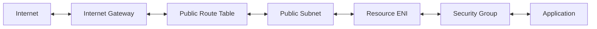
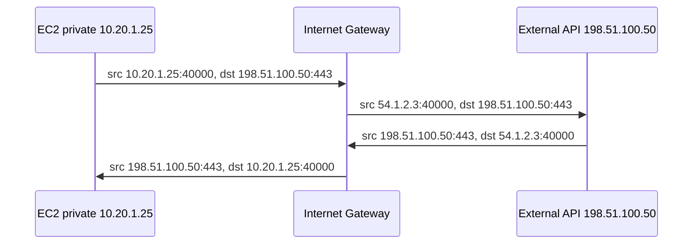
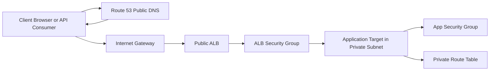
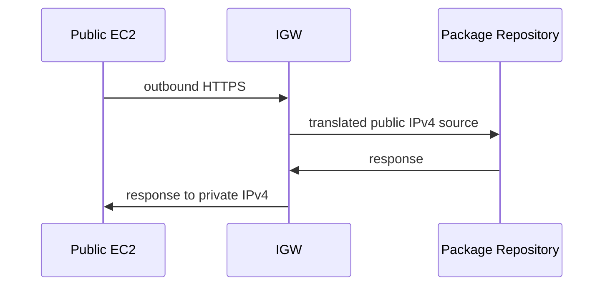
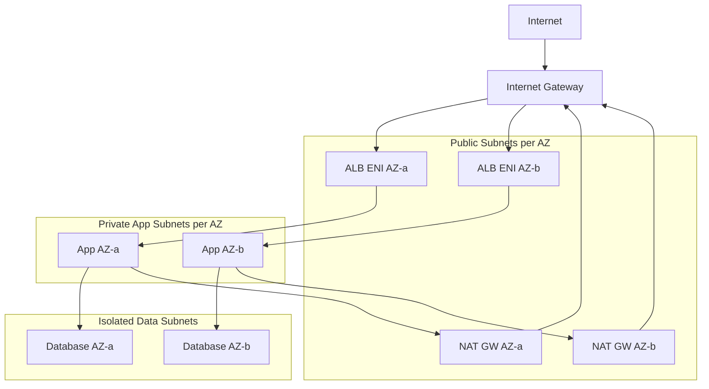
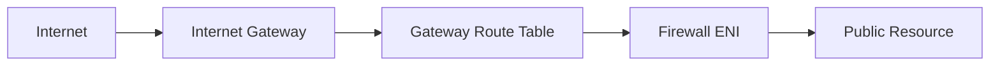
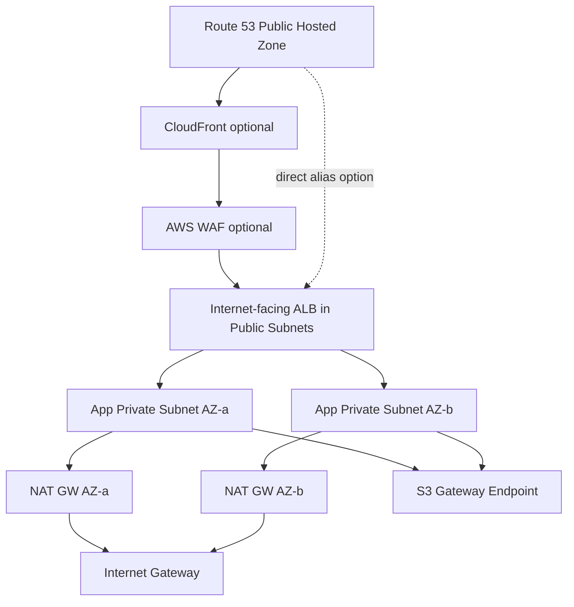

# Part 011 — Internet Gateway and Public Connectivity

Internet Gateway sering terlihat seperti komponen sederhana:

```text
0.0.0.0/0 -> igw-xxxx
```

Lalu subnet dianggap public.

Itu benar, tetapi belum cukup.

Di production, public connectivity bukan hanya soal ada route ke Internet Gateway. Public connectivity adalah hasil dari beberapa kondisi yang harus benar secara bersamaan:

1. VPC punya Internet Gateway yang attached;
2. subnet memakai route table yang mengarah ke Internet Gateway untuk destination internet;
3. resource punya alamat public yang bisa diroute dari internet, atau IPv6 global address;
4. security group mengizinkan traffic yang relevan;
5. NACL mengizinkan request dan response path;
6. workload benar-benar listening di port yang diinginkan;
7. return path tidak dibuat asymmetric oleh route lain;
8. DNS menunjuk ke entry point yang benar;
9. public exposure memang disengaja, bukan efek samping.

Part ini membahas Internet Gateway sebagai primitive public networking di Amazon VPC, bukan sebagai checkbox di console.

---

## 1. Mental Model: Internet Gateway Adalah Pintu, Bukan Firewall

Internet Gateway, atau IGW, adalah komponen VPC yang membuat traffic antara VPC dan internet menjadi mungkin.

Namun IGW bukan firewall.

IGW tidak bertanya:

- user ini siapa;
- HTTP path ini aman atau tidak;
- request ini bot atau manusia;
- payload ini mengandung SQL injection atau tidak;
- service ini memang boleh exposed atau tidak.

IGW hanya menyediakan target routing untuk traffic internet-routable.



Ada kalimat penting:

> Internet Gateway membuat jalan mungkin. Security policy menentukan apakah jalan itu boleh dilewati.

Implikasinya:

- memasang IGW ke VPC tidak otomatis membuka semua resource;
- route ke IGW tidak otomatis membuat instance reachable;
- public IP tanpa security group allow tetap tidak bisa diakses;
- security group allow tanpa public IP tidak membuat IPv4 instance reachable dari internet;
- NACL deny bisa mematahkan traffic meskipun route dan security group benar.

---

## 2. Public Subnet Bukan Tipe, Melainkan Konsekuensi Route Table

Dalam percakapan sehari-hari kita berkata:

```text
subnet public
subnet private
subnet isolated
```

Tetapi di VPC, subnet tidak menyimpan flag bernama `public: true`.

Subnet menjadi public karena route table yang diasosiasikan dengannya punya route ke Internet Gateway untuk destination internet.

Contoh public subnet IPv4:

```text
Route table: rt-public-a

Destination       Target
10.20.0.0/16      local
0.0.0.0/0         igw-aaa111
```

Contoh public subnet dual-stack:

```text
Route table: rt-public-a

Destination       Target
10.20.0.0/16      local
2001:db8:1234::/56 local
0.0.0.0/0         igw-aaa111
::/0              igw-aaa111
```

Contoh private subnet IPv4 dengan NAT:

```text
Route table: rt-private-a

Destination       Target
10.20.0.0/16      local
0.0.0.0/0         nat-aaa111
```

Contoh isolated subnet:

```text
Route table: rt-isolated-a

Destination       Target
10.20.0.0/16      local
```

Jadi klasifikasi subnet adalah hasil evaluasi route.

Pertanyaan yang benar bukan:

```text
Apakah subnet ini public?
```

Pertanyaan yang lebih presisi:

```text
Route table subnet ini mengirim traffic internet ke mana?
```

---

## 3. Syarat Resource IPv4 Bisa Diakses dari Internet

Untuk IPv4, resource di subnet public tidak otomatis accessible.

Minimal harus ada empat kondisi:

| Kondisi | Penjelasan |
|---|---|
| IGW attached ke VPC | Tanpa IGW, route ke internet tidak punya gateway VPC |
| Route table subnet punya route ke IGW | Biasanya `0.0.0.0/0 -> igw` |
| Resource punya public IPv4 atau Elastic IP | Private IPv4 tidak routable dari internet |
| SG/NACL/OS/app mengizinkan | Route tidak menggantikan firewall dan listener |

### 3.1 Contoh EC2 yang public secara IPv4

```text
VPC CIDR: 10.20.0.0/16
Subnet: 10.20.1.0/24
Instance private IPv4: 10.20.1.25
Instance public IPv4: 54.1.2.3
Route table: 0.0.0.0/0 -> igw-aaa111
Security group inbound: tcp/443 from 0.0.0.0/0
Application: listening on 0.0.0.0:443
```

Packet inbound:

```text
Client 203.0.113.10:51544
  -> 54.1.2.3:443
  -> Internet Gateway
  -> instance private IP 10.20.1.25:443
```

Response:

```text
10.20.1.25:443
  -> Internet Gateway
  -> 203.0.113.10:51544
```

Instance biasanya hanya melihat private IP di OS network interface. Mapping public IPv4 ke private IPv4 ditangani oleh AWS pada boundary IGW.

Itu salah satu hal yang sering membingungkan engineer baru di AWS:

```bash
ip addr
# yang terlihat: 10.20.1.25
# bukan: 54.1.2.3
```

Namun dari internet, client mengakses public IPv4.

### 3.2 Public IP sementara vs Elastic IP

Ada dua pola umum:

| Jenis | Karakter |
|---|---|
| Auto-assigned public IPv4 | Bisa berubah ketika instance stop/start, cocok untuk ephemeral/non-critical |
| Elastic IP | Static public IPv4 yang dialokasikan ke account dan bisa diasosiasikan ulang |

Elastic IP berguna untuk:

- allowlist vendor legacy;
- disaster recovery manual;
- public endpoint yang tidak berada di balik load balancer;
- NAT Gateway public address;
- Network Load Balancer static public IP pattern.

Namun EIP bukan desain modern untuk semua hal. Untuk application endpoint, biasanya lebih baik memakai:

- DNS;
- ALB/NLB;
- CloudFront;
- Global Accelerator;
- Route 53 health checks/routing policy.

Static IP adalah constraint, bukan selalu goal.

---

## 4. IGW dan NAT 1:1 untuk IPv4 Public Instance

Untuk IPv4, resource di VPC tetap menggunakan private IPv4 pada ENI.

Ketika instance dengan public IPv4 berkomunikasi ke internet melalui IGW, IGW melakukan translasi 1:1 antara public IPv4 dan private IPv4.

Modelnya:



Karena translasi ini 1:1, ini berbeda dari NAT Gateway:

| Aspek | IGW public IPv4 | NAT Gateway |
|---|---|---|
| Target resource | Resource yang punya public IPv4/EIP | Banyak private resources |
| Inbound unsolicited | Bisa, jika security policy allow | Tidak untuk public NAT gateway use case biasa |
| Mapping | 1 public IPv4 ke 1 private IPv4 | Banyak private source ke public/private NAT address |
| Umum untuk | Public ALB/NLB/bastion/edge EC2 | Private subnet outbound egress |

Jangan menyamakan IGW dengan NAT Gateway.

IGW memungkinkan public reachability.

NAT Gateway memungkinkan private resource keluar tanpa menerima inbound connection dari internet.

---

## 5. Inbound Internet Path: Dari Client ke Workload

Kita mulai dengan request sederhana:

```text
curl https://api.example.com/orders/123
```

Arsitektur:



Flow logical:

1. client resolve `api.example.com`;
2. DNS mengembalikan ALB DNS name atau alias record;
3. client connect ke public ALB IP;
4. traffic masuk VPC melalui IGW;
5. ALB menerima request di public subnet;
6. ALB memilih target sehat;
7. ALB membuka connection ke target private IP;
8. target app response ke ALB;
9. ALB response ke client.

Desain ini umum karena hanya load balancer yang public.

Application target tetap private.

```text
Internet -> IGW -> Public ALB -> Private App
```

Bukan:

```text
Internet -> IGW -> Public EC2 App
```

### 5.1 Kenapa ALB harus ada di public subnet untuk internet-facing ALB?

Internet-facing ALB perlu menerima traffic dari internet.

Karena itu subnet tempat ALB dipasang harus bisa route ke IGW.

Namun target ALB tidak harus public.

Target bisa berada di private subnet, selama:

- ALB security group boleh egress ke target port;
- target security group allow inbound dari ALB security group;
- route lokal VPC memungkinkan ALB mencapai target;
- NACL tidak memblokir ephemeral traffic.

Contoh target SG:

```text
Inbound:
  tcp/8080 from sg-alb

Outbound:
  ephemeral or required destinations
```

Ini lebih kuat daripada allow dari CIDR public.

Security group reference menjaga dependency pada identity network object, bukan daftar IP yang mudah salah.

---

## 6. Outbound Internet Path dari Public Subnet

Resource di public subnet yang punya public IPv4 bisa memulai outbound connection ke internet melalui IGW.

Contoh:

```text
EC2 public subnet -> download package dari internet
```

Route table:

```text
10.20.0.0/16 -> local
0.0.0.0/0    -> igw-aaa111
```

Security group outbound:

```text
tcp/443 -> 0.0.0.0/0
```

NACL:

```text
outbound tcp/443 allowed
inbound ephemeral response allowed
```

Flow:



Inilah mengapa instance public subnet sering bisa melakukan `yum update`, `apt update`, atau call external API tanpa NAT Gateway.

Tetapi desain production biasanya menghindari compute business logic di public subnet.

Kenapa?

Karena public subnet memperbesar attack surface.

---

## 7. IPv6: Public by Default, Tetapi Tetap Butuh Route dan Policy

IPv6 berbeda.

IPv6 Global Unicast Address adalah alamat global yang routable. Tidak ada kebutuhan NAT seperti IPv4 public address mapping.

Untuk inbound/outbound IPv6 lewat IGW:

```text
::/0 -> igw-aaa111
```

Namun jangan salah memahami:

```text
IPv6 global address != semua boleh masuk
```

Security group tetap berlaku.

NACL tetap berlaku.

Application tetap harus listening.

DNS AAAA record tetap harus menunjuk ke alamat yang benar.

Untuk outbound-only IPv6, gunakan egress-only Internet Gateway.

Route private IPv6 outbound-only:

```text
Destination      Target
2001:db8:1234::/56 local
::/0             eigw-aaa111
```

Mental model:

| Pattern | IPv4 | IPv6 |
|---|---|---|
| Public inbound/outbound | IGW + public IPv4/EIP | IGW + IPv6 GUA |
| Outbound-only private | NAT Gateway | Egress-only IGW |
| NAT needed? | Ya untuk private IPv4 outbound internet | Tidak untuk normal IPv6 egress-only pattern |

IPv6 membuat addressability lebih langsung, tetapi policy tetap harus ketat.

---

## 8. Public Subnet Design: Jangan Campur Edge dan Workload Sembarangan

Di desain sederhana, public subnet sering dipakai untuk:

- ALB internet-facing;
- NLB internet-facing;
- NAT Gateway;
- bastion host;
- public EC2;
- public ECS task;
- managed appliances.

Di desain produksi, sebaiknya public subnet punya fungsi sempit:

```text
public subnet = edge attachment zone
```

Bukan tempat default untuk semua compute.

Pola umum:



Public subnet berisi resource yang memang harus berada di edge:

- load balancer public;
- NAT Gateway;
- controlled ingress appliance;
- temporary bastion jika belum memakai Session Manager/Verified Access.

Private app subnet berisi:

- EC2 application;
- ECS service;
- EKS node/pod resources;
- internal ALB/NLB;
- worker;
- batch jobs.

Isolated subnet berisi:

- database;
- cache;
- internal control plane dependency;
- workload yang tidak membutuhkan internet egress langsung.

---

## 9. Direct Public EC2: Kapan Masih Masuk Akal?

Menaruh EC2 langsung di public subnet bukan selalu salah.

Tetapi itu harus menjadi keputusan sadar.

Masuk akal untuk:

- disposable lab;
- temporary diagnostic host;
- hardened bastion dengan kontrol kuat;
- network appliance tertentu;
- legacy workload yang belum bisa berada di balik LB;
- small internal prototype yang tidak menyimpan data sensitif.

Tidak ideal untuk:

- application server utama;
- database;
- admin console;
- internal API;
- batch worker;
- service yang punya credential kuat;
- workload yang bisa diletakkan di belakang ALB/NLB/API Gateway/CloudFront.

Kriteria minimum jika harus public:

```text
[ ] inbound SG dibatasi ke source tertentu
[ ] SSH/RDP tidak terbuka ke 0.0.0.0/0
[ ] IMDSv2 enforced
[ ] patching aktif
[ ] EDR/logging/SSM tersedia
[ ] no long-lived static secrets on host
[ ] NACL tidak overly permissive tanpa alasan
[ ] VPC Flow Logs aktif
[ ] CloudTrail aktif
[ ] public IP inventory diaudit
```

Security posture yang matang biasanya menghapus kebutuhan SSH public dengan:

- AWS Systems Manager Session Manager;
- AWS Verified Access;
- Client VPN;
- bastion private melalui VPN/DX;
- ephemeral break-glass access.

---

## 10. Public Load Balancer Pattern

Public ALB/NLB adalah entry point paling umum untuk aplikasi.

### 10.1 Internet-facing ALB

Gunakan ALB ketika butuh L7:

- host-based routing;
- path-based routing;
- HTTP headers;
- redirects;
- TLS termination;
- WebSocket;
- gRPC tertentu;
- integration dengan AWS WAF;
- auth integration tertentu.

Route path:

```text
Client -> DNS -> IGW -> ALB public subnet -> target private subnet
```

Security group pattern:

```text
sg-alb inbound:
  tcp/443 from 0.0.0.0/0

sg-alb outbound:
  tcp/8080 to sg-app

sg-app inbound:
  tcp/8080 from sg-alb
```

Jangan allow app dari internet CIDR jika app hanya menerima dari ALB.

### 10.2 Internet-facing NLB

Gunakan NLB ketika butuh L4:

- TCP/UDP/TLS pass-through;
- static IP per AZ;
- low latency;
- source IP preservation;
- non-HTTP protocol;
- PrivateLink provider architecture;
- high connection scale.

Route path:

```text
Client -> DNS/static IP -> IGW -> NLB -> target
```

NLB tidak selalu punya security group tergantung konfigurasi dan generasi fitur yang digunakan. Karena itu target security policy dan NACL menjadi sangat penting.

### 10.3 CloudFront di depan ALB

Untuk public web/API global, sering lebih kuat:

```text
Client -> CloudFront -> WAF -> ALB -> App
```

Manfaat:

- edge caching;
- TLS closer to user;
- AWS edge network;
- WAF at edge;
- origin protection;
- DDoS posture lebih baik;
- header normalization/redirects dengan CloudFront Functions atau Lambda@Edge.

Namun jangan asal menambahkan CloudFront. Untuk low-latency TCP non-HTTP, Global Accelerator atau NLB bisa lebih tepat.

---

## 11. DNS: Public Connectivity Biasanya Berawal dari Nama

User jarang mengakses IP langsung.

Mereka mengakses nama:

```text
api.example.com
www.example.com
admin.example.com
```

Public DNS record bisa menunjuk ke:

- CloudFront distribution;
- Global Accelerator DNS name/static IP;
- ALB DNS name via Route 53 alias;
- NLB DNS name via alias;
- Elastic IP;
- EC2 public DNS/public IPv4;
- third-party CDN/WAF.

Ingat chain:

```text
DNS name -> public endpoint -> IGW/edge -> VPC resource -> target
```

Debugging public connectivity harus memeriksa DNS juga.

Checklist DNS:

```bash
# Resolve A record
 dig api.example.com A

# Resolve AAAA record
 dig api.example.com AAAA

# Trace delegation
 dig +trace api.example.com

# Test exact resolved IP
 curl -v --resolve api.example.com:443:198.51.100.10 https://api.example.com/
```

Common problem:

| Symptom | Kemungkinan |
|---|---|
| DNS resolve ke IP lama | TTL/cache/deployment belum sinkron |
| A record ada, AAAA salah | IPv6 path rusak |
| Alias ke ALB salah region/account | DNS menunjuk endpoint salah |
| Public hosted zone salah | Delegation NS tidak benar |
| Internal user dapat private IP | Split-horizon DNS salah atau memang intended |

DNS bukan hanya naming. DNS adalah bagian dari routing control plane.

---

## 12. NACL dan Ephemeral Port pada Public Subnet

Security group stateful.

NACL stateless.

Ini penting untuk public traffic.

Contoh inbound HTTPS ke ALB atau EC2:

```text
Client ephemeral port 51544 -> Server port 443
Server port 443 -> Client ephemeral port 51544
```

Jika NACL stateless terlalu ketat, ia harus mengizinkan dua arah.

Simplified NACL inbound untuk public subnet:

```text
Inbound:
  allow tcp/443 from 0.0.0.0/0
  allow tcp/1024-65535 from 0.0.0.0/0  # for return traffic, depending direction/use case
```

Simplified outbound:

```text
Outbound:
  allow tcp/443 to 0.0.0.0/0
  allow tcp/1024-65535 to 0.0.0.0/0
```

Tetapi jangan copy-paste tanpa memahami flow.

Untuk public ALB:

- inbound client ke ALB port 443;
- outbound ALB ke target app port 8080;
- return traffic dari target ke ALB ephemeral/client connection handling;
- health check traffic ALB ke target.

SG biasanya lebih mudah dan aman untuk workload-level policy. NACL lebih cocok sebagai subnet-level guardrail kasar.

---

## 13. Asymmetric Routing: Musuh Sunyi Public Connectivity

Asymmetric routing terjadi ketika request masuk lewat satu path tetapi response keluar lewat path lain yang tidak cocok dengan state/policy.

Contoh salah:

```text
Inbound:
Internet -> IGW -> Public ALB -> App

Outbound response dari App:
App -> TGW -> centralized firewall -> internet
```

Jika response tidak kembali ke ALB atau jalur stateful yang benar, connection bisa timeout.

Contoh lain:

```text
Inbound ke EC2 public IP lewat IGW
Response route table EC2 subnet punya 0.0.0.0/0 -> TGW
```

Result:

- request masuk via IGW;
- instance menerima packet;
- response mengikuti route table default ke TGW;
- client tidak pernah menerima response valid;
- flow log bisa terlihat aneh karena inbound accept tapi client timeout.

Invariant:

```text
Public inbound ke public IP harus punya return path yang kompatibel dengan public IP mapping-nya.
```

Jika resource harus reachable dari internet, hati-hati dengan default route ke TGW/firewall/NAT.

---

## 14. Source/Destination Check: Kapan Relevan?

EC2 memiliki source/destination check. Default-nya instance hanya memproses traffic yang source atau destination-nya adalah dirinya.

Untuk normal EC2 public app, biarkan enabled.

Disable hanya untuk instance yang bertindak sebagai router/appliance/NAT/firewall/bastion forwarding tertentu.

Contoh butuh disable:

- NAT instance;
- custom router;
- firewall appliance;
- IDS/IPS inline;
- VPN appliance.

Jangan disable source/destination check sebagai ritual troubleshooting tanpa alasan. Itu bisa menyembunyikan desain routing yang salah.

---

## 15. Ingress Routing via IGW Route Table

Route table biasanya diasosiasikan ke subnet. Tetapi ada juga gateway route table untuk edge association, termasuk Internet Gateway, dalam pattern ingress routing.

Use case:

```text
Internet -> IGW -> firewall appliance -> protected subnet/resource
```

Simplified model:



Ini bukan pattern dasar untuk semua aplikasi. Ini biasanya dipakai untuk appliance insertion atau inspection pattern.

Untuk sebagian besar web application modern, pattern yang lebih umum:

```text
CloudFront/WAF -> ALB -> private targets
```

atau:

```text
IGW -> ALB/NLB -> private targets
```

Gateway route table berguna, tetapi menambah kompleksitas stateful path. Pastikan appliance mode, symmetric routing, health check, failover, dan observability matang.

---

## 16. Public IPv4 Cost Awareness

Public IPv4 makin mahal secara operasional karena IPv4 address scarcity.

Prinsip desain:

- jangan memberi public IPv4 ke resource yang tidak butuh direct reachability;
- prefer ALB/NLB/CloudFront/Global Accelerator sebagai entry point;
- gunakan private subnet + NAT/VPC endpoints untuk outbound dependency;
- audit semua public IPv4;
- gunakan IPv6 jika organisasi siap;
- hapus EIP idle;
- hindari public EC2 untuk admin access.

Cost bukan hanya harga IP.

Cost juga datang dari:

- data transfer out;
- NAT Gateway hourly + processing jika salah path;
- cross-AZ data transfer karena public entry point tidak AZ-aware;
- traffic yang harusnya private tapi keluar lewat internet;
- logging volume;
- DDoS/abuse exposure.

Public connectivity harus diperlakukan sebagai capability mahal dan berisiko, bukan default.

---

## 17. Common Failure Modes

### 17.1 Route ke IGW tidak ada

Symptom:

```text
Instance punya public IP, SG allow, tetapi tidak bisa diakses.
```

Check:

```bash
aws ec2 describe-route-tables \
  --filters Name=association.subnet-id,Values=subnet-xxx
```

Expected:

```text
0.0.0.0/0 -> igw-xxx
```

Untuk IPv6:

```text
::/0 -> igw-xxx
```

### 17.2 Public IP tidak ada

Symptom:

```text
Subnet public, tetapi EC2 tidak reachable dari internet.
```

Check:

```bash
aws ec2 describe-instances \
  --instance-ids i-xxx \
  --query 'Reservations[].Instances[].PublicIpAddress'
```

Jika kosong, instance tidak punya public IPv4.

### 17.3 Security group hanya allow internal CIDR

Symptom:

```text
Dari bastion bisa, dari internet tidak bisa.
```

Check inbound SG:

```text
tcp/443 from 10.20.0.0/16   # hanya internal
```

Untuk public endpoint mungkin perlu:

```text
tcp/443 from 0.0.0.0/0
```

Tetapi untuk admin port jangan buka global.

### 17.4 NACL memblokir ephemeral port

Symptom:

```text
SYN terlihat, tetapi connection timeout.
```

NACL stateless harus mengizinkan return path.

Check:

- inbound rules;
- outbound rules;
- rule number order;
- explicit deny;
- ephemeral port range.

### 17.5 Application tidak listening

Route dan SG benar, tetapi app tidak listen.

Check di host/container:

```bash
ss -lntp
curl -v localhost:8080/health
```

Di target ALB, lihat target health reason.

### 17.6 DNS menunjuk ke endpoint salah

Symptom:

```text
curl public IP berhasil, curl hostname gagal.
```

Check:

```bash
dig api.example.com A
curl -v https://api.example.com
```

Pastikan record menunjuk ke ALB/CloudFront/GA/EIP yang intended.

### 17.7 Return path asymmetric

Symptom:

```text
Flow logs accept inbound, tetapi client timeout.
```

Check:

- route table subnet resource;
- default route;
- TGW route;
- firewall state;
- source/destination check;
- appliance path.

---

## 18. Debugging Runbook: Public EC2 Tidak Bisa Diakses

Gunakan urutan ini. Jangan lompat langsung ke security group.

### Step 1 — DNS resolve ke mana?

```bash
dig app.example.com A +short
dig app.example.com AAAA +short
```

Jika DNS salah, perbaiki DNS dulu.

### Step 2 — Public IP ada?

```bash
aws ec2 describe-instances \
  --instance-ids i-xxx \
  --query 'Reservations[].Instances[].{Private:PrivateIpAddress,Public:PublicIpAddress,Subnet:SubnetId,Vpc:VpcId}'
```

Jika tidak ada public IPv4, IGW tidak cukup.

### Step 3 — Subnet route table benar?

```bash
aws ec2 describe-route-tables \
  --filters Name=association.subnet-id,Values=subnet-xxx \
  --query 'RouteTables[].Routes[]'
```

Cari:

```text
0.0.0.0/0 -> igw-xxx
```

### Step 4 — IGW attached?

```bash
aws ec2 describe-internet-gateways \
  --filters Name=attachment.vpc-id,Values=vpc-xxx
```

### Step 5 — Security group inbound allow?

```bash
aws ec2 describe-security-groups \
  --group-ids sg-xxx
```

Cek port dan source.

### Step 6 — NACL allow dua arah?

```bash
aws ec2 describe-network-acls \
  --filters Name=association.subnet-id,Values=subnet-xxx
```

### Step 7 — OS firewall dan app listener?

```bash
sudo iptables -S
sudo nft list ruleset
ss -lntp
curl -v localhost:PORT
```

### Step 8 — VPC Flow Logs

Cari tuple:

```text
srcaddr=<client-ip>
dstaddr=<private-ip>
dstport=<port>
action=ACCEPT|REJECT
```

Interpretasi:

| Flow log | Arti awal |
|---|---|
| Tidak ada entry | Traffic tidak sampai ENI/subnet logging scope |
| REJECT | SG/NACL atau policy network menolak |
| ACCEPT tapi timeout | App/listener/return path/asymmetric issue |

---

## 19. Debugging Runbook: Public ALB Tidak Bisa Diakses

### Step 1 — ALB scheme

Pastikan ALB `internet-facing`, bukan `internal`.

```bash
aws elbv2 describe-load-balancers \
  --names my-alb \
  --query 'LoadBalancers[].{DNS:DNSName,Scheme:Scheme,VpcId:VpcId}'
```

Expected:

```text
Scheme = internet-facing
```

### Step 2 — ALB subnet route

Subnet ALB harus punya route ke IGW.

```text
0.0.0.0/0 -> igw-xxx
```

### Step 3 — ALB security group

Inbound:

```text
tcp/443 from client range
```

Outbound:

```text
tcp/app-port to target SG
```

### Step 4 — Target group health

```bash
aws elbv2 describe-target-health \
  --target-group-arn arn:aws:elasticloadbalancing:...
```

Jika target unhealthy, public connectivity ke ALB mungkin benar, tetapi ALB tidak punya backend sehat.

### Step 5 — Target SG

Target harus allow dari ALB SG:

```text
tcp/8080 from sg-alb
```

Bukan dari client IP.

### Step 6 — Access logs / metrics

Cek:

- HTTPCode_ELB_4XX_Count;
- HTTPCode_ELB_5XX_Count;
- TargetResponseTime;
- TargetConnectionErrorCount;
- access log status code;
- WAF block jika WAF attached.

---

## 20. Design Pattern: Minimal Public Edge VPC

Untuk aplikasi web sederhana tetapi production-minded:



Subnet matrix:

| Subnet | AZ | Route default | Isi |
|---|---|---|---|
| public-a | a | IGW | ALB ENI, NAT GW |
| public-b | b | IGW | ALB ENI, NAT GW |
| app-a | a | NAT GW a | app targets |
| app-b | b | NAT GW b | app targets |
| data-a | a | none or controlled | database/cache |
| data-b | b | none or controlled | database/cache |

Key invariant:

```text
Only the edge is public. The application is reachable only from the edge.
```

---

## 21. Anti-Patterns

### Anti-pattern 1 — Semua subnet diberi route IGW

```text
Every subnet:
0.0.0.0/0 -> igw
```

Dampak:

- database subnet bisa public jika resource diberi public IP;
- audit public exposure sulit;
- boundary desain tidak jelas;
- human error makin mahal.

### Anti-pattern 2 — Public IP untuk semua EC2 supaya gampang debug

Ini biasanya muncul ketika akses admin belum dirancang.

Solusi lebih baik:

- SSM Session Manager;
- private bastion;
- VPN/Verified Access;
- centralized access workflow;
- ephemeral break-glass.

### Anti-pattern 3 — ALB public dan target juga public

Tidak selalu salah, tetapi sering tidak perlu.

Jika target hanya menerima traffic dari ALB, target tidak butuh public IP.

### Anti-pattern 4 — DNS langsung ke EC2 public IP

Masalah:

- instance replacement mematahkan DNS;
- failover buruk;
- health check manual;
- TLS/certificate lifecycle sulit;
- scaling tidak natural.

Gunakan ALB/NLB/CloudFront/GA jika endpoint penting.

### Anti-pattern 5 — Public subnet dipakai sebagai default compute subnet

Public subnet harus diperlakukan seperti DMZ, bukan tempat parkir semua resource.

---

## 22. Production Checklist

Untuk public endpoint:

```text
[ ] Ada alasan bisnis mengapa endpoint public
[ ] Entry point jelas: CloudFront/GA/ALB/NLB/EIP
[ ] Direct public EC2 dihindari atau diberi exception tertulis
[ ] Public subnet hanya berisi edge components
[ ] Route table public eksplisit dan terpisah per intent
[ ] Private app subnet tidak punya direct route ke IGW
[ ] Security group app hanya allow dari edge SG
[ ] NACL tidak mematahkan ephemeral return path
[ ] DNS public hosted zone benar
[ ] TLS managed dengan ACM atau proses rotasi jelas
[ ] WAF/Shield posture dipertimbangkan
[ ] VPC Flow Logs aktif pada scope relevan
[ ] ALB/NLB/CloudFront logs aktif jika perlu forensic
[ ] Public IPv4 inventory diaudit
[ ] Unused EIP/public IP dibersihkan
[ ] IPv6 route dan SG diperiksa eksplisit jika dual-stack
[ ] Failure runbook tersedia
```

---

## 23. Terraform Sketch: Public Edge Subnets

Ini bukan modul production lengkap, hanya bentuk konseptual.

```hcl
resource "aws_internet_gateway" "main" {
  vpc_id = aws_vpc.main.id

  tags = {
    Name = "prod-main-igw"
  }
}

resource "aws_route_table" "public_a" {
  vpc_id = aws_vpc.main.id

  route {
    cidr_block = "0.0.0.0/0"
    gateway_id = aws_internet_gateway.main.id
  }

  tags = {
    Name = "prod-public-a"
    Intent = "public-edge"
  }
}

resource "aws_route_table_association" "public_a" {
  subnet_id      = aws_subnet.public_a.id
  route_table_id = aws_route_table.public_a.id
}
```

Design note:

- route table dinamai berdasarkan intent;
- subnet public tidak otomatis berarti semua compute boleh public;
- policy tagging membantu audit.

---

## 24. CloudFormation Sketch

```yaml
InternetGateway:
  Type: AWS::EC2::InternetGateway
  Properties:
    Tags:
      - Key: Name
        Value: prod-main-igw

AttachInternetGateway:
  Type: AWS::EC2::VPCGatewayAttachment
  Properties:
    VpcId: !Ref Vpc
    InternetGatewayId: !Ref InternetGateway

PublicRouteTableA:
  Type: AWS::EC2::RouteTable
  Properties:
    VpcId: !Ref Vpc
    Tags:
      - Key: Name
        Value: prod-public-a
      - Key: Intent
        Value: public-edge

DefaultIpv4RouteToInternetA:
  Type: AWS::EC2::Route
  DependsOn: AttachInternetGateway
  Properties:
    RouteTableId: !Ref PublicRouteTableA
    DestinationCidrBlock: 0.0.0.0/0
    GatewayId: !Ref InternetGateway
```

Important:

```text
DependsOn attachment matters during provisioning.
```

Tanpa attachment selesai, route ke IGW bisa gagal dibuat.

---

## 25. Latihan Berpikir

### Scenario 1

Subnet punya:

```text
0.0.0.0/0 -> igw
```

Instance tidak punya public IPv4.

Apakah instance reachable dari internet IPv4?

Jawaban: tidak.

Route subnet public tidak cukup. Resource harus punya public IPv4/EIP untuk IPv4 internet reachability.

### Scenario 2

Instance punya public IPv4 dan SG allow `tcp/443 from 0.0.0.0/0`, tetapi route table punya:

```text
0.0.0.0/0 -> tgw
```

Apakah inbound public IPv4 via IGW akan sehat?

Kemungkinan besar tidak. Subnet tidak punya default route ke IGW untuk return path, dan traffic bisa asymmetric.

### Scenario 3

ALB internet-facing berada di public subnet. Target EC2 private subnet tidak punya public IP.

Apakah target bisa melayani request public?

Ya, jika ALB bisa reach target via local VPC route dan SG/NACL/app benar. Target tidak harus public.

### Scenario 4

Subnet IPv6 punya `::/0 -> igw` dan instance punya IPv6 GUA. SG inbound deny semua.

Apakah internet bisa initiate connection?

Tidak. IPv6 address routable, tetapi SG tetap memblokir.

---

## 26. Invariant yang Harus Dibawa

Simpan invariant ini untuk part berikutnya:

```text
Public connectivity = route + addressability + policy + listener + return path.
```

Lebih spesifik:

```text
Public IPv4 inbound needs:
IGW attached
+ subnet route to IGW
+ public IPv4/EIP on entry point
+ SG allow
+ NACL allow
+ app/listener healthy
+ symmetric return path
+ correct DNS
```

Dan:

```text
Public subnet is a routing outcome, not a subnet attribute.
```

Part berikutnya membahas kebalikannya: bagaimana private subnet bisa keluar ke internet tanpa menjadi reachable dari internet.

Itulah domain NAT Gateway, NAT instance, dan egress architecture.

---

## Referensi Resmi

- AWS VPC Internet Gateway: https://docs.aws.amazon.com/vpc/latest/userguide/VPC_Internet_Gateway.html
- AWS VPC Route Tables: https://docs.aws.amazon.com/vpc/latest/userguide/VPC_Route_Tables.html
- AWS VPC Subnets: https://docs.aws.amazon.com/vpc/latest/userguide/configure-subnets.html
- AWS Egress-only Internet Gateway: https://docs.aws.amazon.com/vpc/latest/userguide/egress-only-internet-gateway.html
- AWS Elastic Load Balancing: https://docs.aws.amazon.com/elasticloadbalancing/
