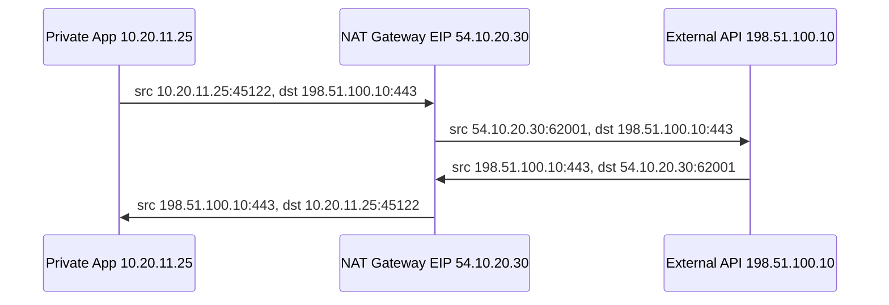
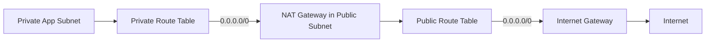
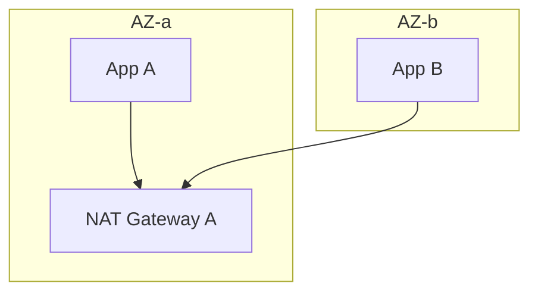
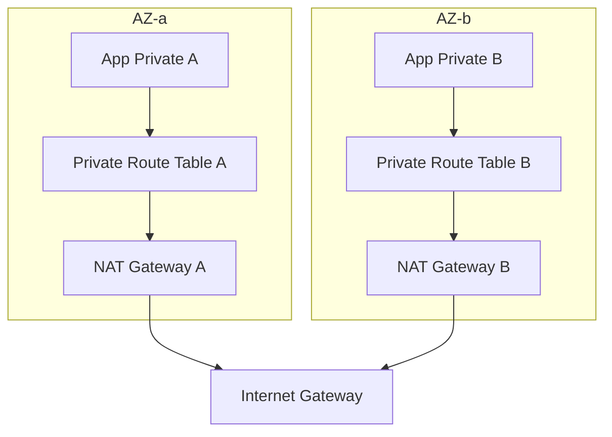
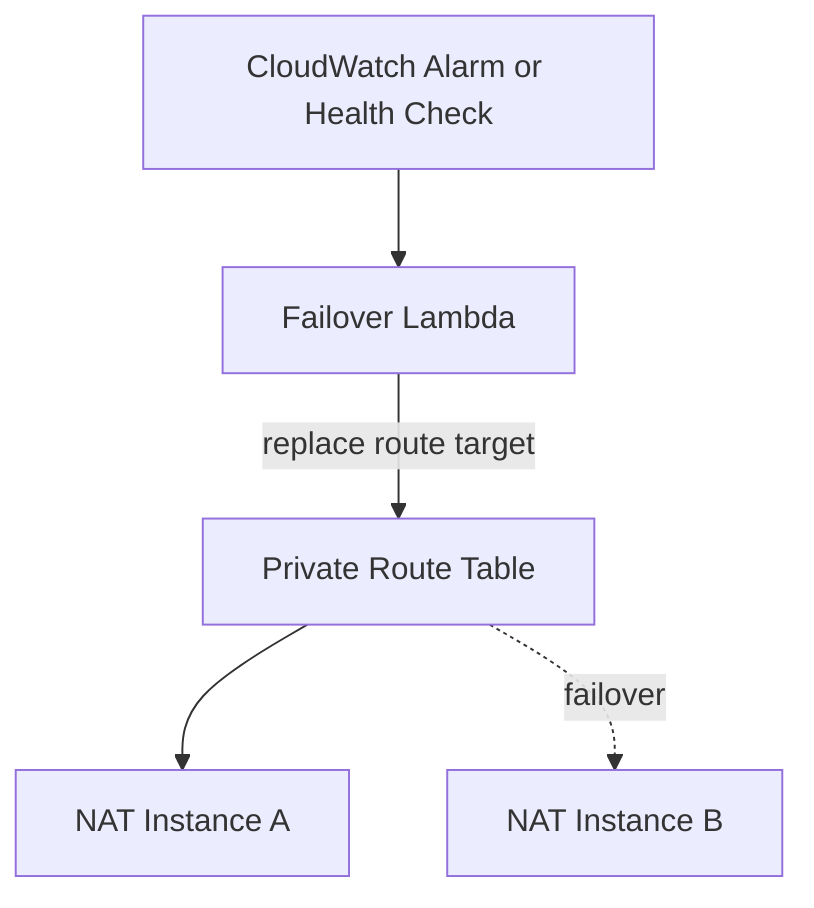
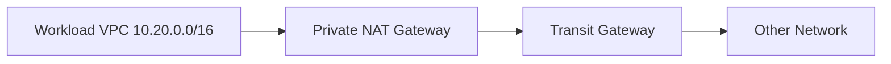
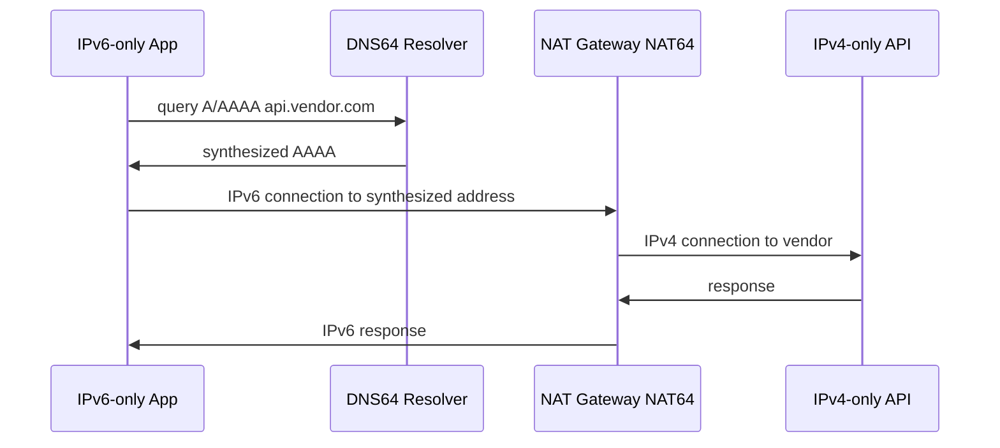
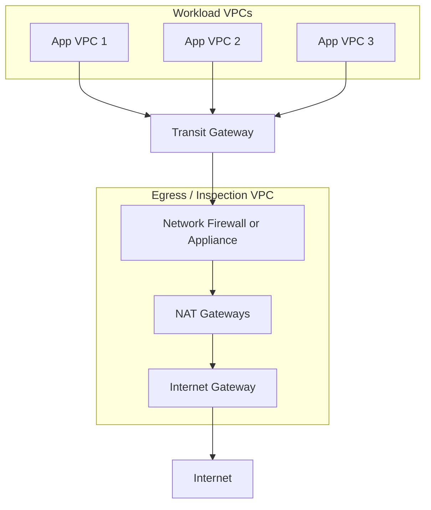

# Part 012 — NAT Gateway, NAT Instance, and Egress Design

Private subnet punya masalah praktis:

```text
Resource tidak boleh reachable dari internet, tetapi tetap perlu keluar ke internet.
```

Contoh kebutuhan:

- pull package dari repository public;
- call external API;
- download OS updates;
- push telemetry ke SaaS;
- access third-party payment provider;
- call public AWS service endpoint ketika VPC endpoint belum tersedia;
- container image pull dari registry external.

Solusi IPv4 klasik di AWS adalah NAT.

Namun NAT sering menjadi tempat incident dan cost leak:

- semua private subnet diarahkan ke satu NAT Gateway di satu AZ;
- NAT Gateway menjadi single-AZ dependency;
- cross-AZ data transfer tidak disadari;
- port exhaustion muncul saat banyak connection ke destination yang sama;
- S3/DynamoDB traffic lewat NAT padahal bisa lewat gateway endpoint;
- centralized egress dibuat tanpa memahami asymmetric routing;
- NAT instance dipakai tanpa HA dan patching;
- security team mengira NAT sama dengan firewall.

Part ini membahas NAT sebagai komponen egress architecture, bukan sekadar resource bernama `nat-xxxx`.

---

## 1. Mental Model: NAT Mengubah Source Address

NAT adalah network address translation.

Untuk outbound IPv4 dari private subnet, NAT Gateway biasanya mengubah source private IP menjadi public Elastic IP milik NAT Gateway.

Contoh:

```text
Before NAT:
  src = 10.20.11.25:45122
  dst = 198.51.100.10:443

After NAT:
  src = 54.10.20.30:62001
  dst = 198.51.100.10:443
```

Response dari internet kembali ke NAT Gateway:

```text
src = 198.51.100.10:443
 dst = 54.10.20.30:62001
```

NAT Gateway punya state table yang tahu bahwa port `62001` dipetakan ke `10.20.11.25:45122`.

Lalu NAT Gateway meneruskan response ke private instance.



NAT bukan proxy HTTP.

NAT tidak membaca business request.

NAT tidak tahu `GET /orders/123`.

NAT tidak tahu user identity.

NAT hanya mengelola translation tuple.

---

## 2. Public NAT Gateway: Komponen Default untuk Private IPv4 Egress

Public NAT Gateway dipasang di public subnet dan memakai Elastic IP.

Private subnet mengarah ke NAT Gateway untuk internet-bound IPv4 traffic.

NAT Gateway lalu mengirim traffic ke IGW.



Route table private subnet:

```text
Destination       Target
10.20.0.0/16      local
0.0.0.0/0         nat-aaa111
```

Route table public subnet tempat NAT Gateway berada:

```text
Destination       Target
10.20.0.0/16      local
0.0.0.0/0         igw-aaa111
```

Ingat dua route table berbeda:

1. private subnet route ke NAT;
2. public subnet route dari NAT ke IGW.

Jika NAT Gateway diletakkan di subnet yang tidak punya route ke IGW, public NAT Gateway tidak bisa menjadi egress internet yang benar.

---

## 3. NAT Gateway Tidak Mengizinkan Inbound Unsolicited Connection

Private resource di belakang NAT Gateway bisa memulai koneksi keluar.

Internet tidak bisa memulai koneksi masuk langsung ke private resource itu melalui NAT Gateway.

Model stateful:

```text
Allowed:
Private -> NAT -> Internet
Internet -> NAT -> Private  # hanya response dari flow yang sudah dibuat

Not allowed:
Internet -> NAT -> Private  # unsolicited inbound
```

Ini bukan firewall lengkap, tetapi properti NAT stateful.

Jangan menjual NAT sebagai security boundary utama.

Security tetap perlu:

- security group;
- NACL;
- endpoint policy;
- IAM/resource policy;
- Network Firewall untuk inspection/filtering;
- DNS Firewall untuk domain control;
- egress proxy jika butuh L7 policy.

NAT Gateway hanya menyelesaikan address translation dan outbound reachability.

---

## 4. Per-AZ NAT: Default Production Pattern

NAT Gateway adalah zonal resource pada pola klasik.

Jika private subnet di beberapa AZ semuanya menggunakan satu NAT Gateway di AZ-a, maka AZ-b dan AZ-c bergantung pada AZ-a untuk egress.

Buruk:



Dampak:

- jika AZ-a bermasalah, AZ-b kehilangan egress;
- traffic AZ-b ke NAT AZ-a bisa kena cross-AZ cost;
- blast radius egress melebar;
- debugging menjadi membingungkan.

Lebih baik:



Route table private-a:

```text
10.20.0.0/16 -> local
0.0.0.0/0    -> nat-a
```

Route table private-b:

```text
10.20.0.0/16 -> local
0.0.0.0/0    -> nat-b
```

Invariant:

```text
A private subnet should prefer the NAT Gateway in the same AZ unless there is a deliberate centralized egress design.
```

---

## 5. Regional NAT Gateway: Ketahui Opsi Baru, Jangan Campur Mental Model

AWS juga memiliki model regional NAT Gateway untuk automatic multi-AZ expansion.

Mental modelnya berbeda dari NAT Gateway zonal tradisional:

- resource NAT bersifat regional;
- AWS mengelola expansion lintas AZ;
- resource punya route table sendiri;
- capacity/IP handling lebih besar;
- tujuan utamanya menyederhanakan NAT multi-AZ dan meningkatkan kapasitas.

Namun jangan menggunakan istilah “regional NAT” tanpa membaca constraint layanan terbaru di region/account Anda.

Untuk banyak organisasi, desain existing masih memakai NAT Gateway zonal per AZ karena:

- lebih eksplisit;
- lebih umum dipahami;
- mudah disejajarkan dengan route table per AZ;
- banyak reference architecture lama memakai pola ini;
- operational ownership lebih jelas.

Decision point:

| Opsi | Cocok ketika |
|---|---|
| NAT Gateway per AZ | Anda ingin AZ-local egress eksplisit dan pattern yang sangat umum |
| Regional NAT Gateway | Anda ingin simplifikasi multi-AZ NAT dengan fitur regional terbaru dan sudah memvalidasi limit/region/cost |
| Centralized egress VPC | Anda butuh inspection/governance lintas banyak VPC/account |
| VPC endpoints | Traffic ke AWS service tidak perlu lewat NAT |
| No NAT | Workload isolated atau semua dependency private |

Materi berikut tetap menekankan prinsip desain, bukan sekadar tipe resource.

---

## 6. NAT Gateway vs NAT Instance

Sebelum NAT Gateway managed matang, banyak arsitektur memakai NAT instance: EC2 instance yang dikonfigurasi sebagai NAT router.

Perbandingan:

| Aspek | NAT Gateway | NAT Instance |
|---|---|---|
| Operasi | Managed by AWS | Anda patch, scale, monitor |
| HA | Managed dalam scope resource | Harus desain sendiri |
| Scaling | Otomatis dalam batas layanan | Tergantung instance type/kernel/tuning |
| Security group | Tidak seperti EC2 instance biasa | Bisa pakai SG pada ENI instance |
| Custom filtering | Terbatas | Bisa iptables/nftables/proxy/custom agent |
| Cost | Hourly + data processing | EC2 + data + ops cost |
| Failure mode | Managed service metrics | Instance failure, kernel, disk, CPU, conntrack |
| Best default | Ya untuk kebanyakan private egress | Hanya untuk kebutuhan khusus |

Gunakan NAT Gateway sebagai default.

Gunakan NAT instance hanya jika ada kebutuhan yang NAT Gateway tidak penuhi, misalnya:

- custom packet manipulation;
- ultra-specific allowlist/filtering;
- lab/testing;
- cost optimization pada traffic kecil dengan ops maturity tinggi;
- appliance/proxy pattern yang memang butuh EC2;
- environment lama yang belum dimigrasi.

Jika memilih NAT instance, Anda sedang menjalankan network appliance sendiri.

Itu berarti Anda bertanggung jawab atas:

- AMI hardening;
- patching;
- Auto Scaling/failover;
- source/destination check disabled;
- iptables/nftables;
- conntrack tuning;
- CloudWatch alarms;
- instance recovery;
- route table failover;
- capacity testing;
- security posture.

---

## 7. NAT Instance Minimal Model

NAT instance membutuhkan:

1. EC2 di public subnet;
2. public IPv4/EIP;
3. route public subnet ke IGW;
4. source/destination check disabled;
5. kernel forwarding enabled;
6. NAT masquerade rule;
7. private subnet route `0.0.0.0/0 -> eni-or-instance-id`;
8. security group/NACL allow;
9. HA/failover mechanism.

Linux sketch:

```bash
# Enable IP forwarding
sudo sysctl -w net.ipv4.ip_forward=1

# Persist
cat <<EOF | sudo tee /etc/sysctl.d/99-nat.conf
net.ipv4.ip_forward=1
EOF

# NAT masquerade example
sudo iptables -t nat -A POSTROUTING -o eth0 -j MASQUERADE
```

Route table private subnet:

```text
Destination       Target
10.20.0.0/16      local
0.0.0.0/0         eni-nat-instance
```

Disable source/destination check:

```bash
aws ec2 modify-instance-attribute \
  --instance-id i-nat \
  --no-source-dest-check
```

HA sketch:



This is not trivial.

It is easy to create a NAT instance.

It is harder to operate it safely.

---

## 8. Port Exhaustion: NAT Gateway Bukan Infinite Magic

NAT menggunakan source port untuk membedakan banyak flow dari banyak private clients ke destination yang sama.

Masalah muncul ketika banyak connection menuju unique destination yang sama:

```text
destination IP + destination port + protocol
```

Contoh:

```text
10,000 containers -> api.vendor.com:443
```

Jika `api.vendor.com` resolve ke sedikit IP dan semua traffic keluar lewat satu NAT IP, NAT perlu banyak ephemeral source port.

AWS NAT Gateway punya limit connection per assigned IPv4 address per unique destination. Jika limit ini habis, muncul port allocation error.

CloudWatch metric penting:

```text
ErrorPortAllocation
```

Jika metric ini lebih dari nol, NAT Gateway tidak bisa mengalokasikan source port untuk connection baru.

### 8.1 Gejala port exhaustion

Application melihat:

- intermittent timeout;
- connection reset;
- failed external API calls;
- spikes pada retry;
- latency meningkat;
- error hanya ke vendor tertentu;
- tidak semua destination bermasalah.

Network metrics melihat:

- `ErrorPortAllocation > 0`;
- `ConnectionAttemptCount` tinggi;
- `ConnectionEstablishedCount` tidak sebanding;
- `IdleTimeoutCount` meningkat;
- `PacketsDropCount` meningkat.

### 8.2 Mitigasi port exhaustion

Beberapa opsi:

| Mitigasi | Kapan |
|---|---|
| Tambah secondary IPv4 ke NAT Gateway | Banyak connection ke destination yang sama |
| Per-AZ NAT | Distribusi source NAT per AZ |
| Kurangi connection churn | Gunakan keep-alive/pooling dengan benar |
| Batasi retry storm | Exponential backoff + jitter |
| Gunakan VPC endpoint | Untuk AWS services, hindari NAT |
| Split traffic | Route destination tertentu ke path berbeda jika memungkinkan |
| Vendor endpoint scaling | Minta vendor menyediakan multi-IP/multi-endpoint |
| Egress proxy | Untuk L7 pooling/control tertentu |

Jangan hanya menaikkan timeout aplikasi.

Jika NAT tidak bisa allocate port, timeout lebih panjang hanya memperpanjang antrean gagal.

---

## 9. NAT Idle Timeout dan Connection Reuse

NAT Gateway punya idle timeout untuk connection yang tidak aktif. Jika client menggunakan stale connection, request berikutnya bisa gagal.

Gejala:

- request pertama setelah idle lama gagal;
- retry langsung berhasil;
- error terjadi pada connection pool;
- `IdleTimeoutCount` meningkat.

Mitigasi di aplikasi:

- connection pool max idle time lebih pendek dari NAT idle timeout;
- health check connection sebelum reuse;
- TCP keepalive dengan nilai masuk akal;
- retry idempotent dengan backoff;
- circuit breaker untuk dependency eksternal;
- jangan mempertahankan idle connection terlalu lama tanpa alasan.

Di Java, ini sering terkait HTTP client pool:

- Apache HttpClient idle eviction;
- OkHttp connection pool;
- Netty channel pool;
- Reactor Netty connection provider;
- database driver ke external endpoint;
- gRPC keepalive.

Network design dan client behavior saling mempengaruhi.

---

## 10. NAT Gateway Metrics yang Wajib Dimonitor

Minimal dashboard NAT Gateway:

| Metric | Makna |
|---|---|
| `BytesInFromSource` | Bytes dari private clients ke NAT |
| `BytesOutToDestination` | Bytes dari NAT ke external destination |
| `BytesInFromDestination` | Bytes response dari destination ke NAT |
| `BytesOutToSource` | Bytes response dari NAT ke private clients |
| `ConnectionAttemptCount` | Attempt koneksi baru |
| `ConnectionEstablishedCount` | Connection established |
| `ErrorPortAllocation` | NAT gagal allocate source port |
| `IdleTimeoutCount` | Connection idle timeout |
| `PacketsDropCount` | Packet dropped |

Alarm baseline:

```text
ErrorPortAllocation > 0 for 3 datapoints
PacketsDropCount abnormal compared to baseline
IdleTimeoutCount sudden spike
Bytes processed sudden cost anomaly
ConnectionAttemptCount spike without matching established count
```

Metric tanpa context bisa menyesatkan.

Gabungkan dengan:

- VPC Flow Logs;
- application metrics;
- dependency error rate;
- retry count;
- DNS resolution logs;
- cost explorer/CUR;
- deployment timeline.

---

## 11. NAT Cost Model

NAT Gateway biasanya punya dua cost component utama:

1. hourly charge ketika NAT Gateway tersedia;
2. data processing per GB.

Selain itu, desain buruk bisa menambah:

- cross-AZ data transfer;
- internet data transfer out;
- duplicated inspection cost;
- NAT cost untuk traffic AWS service yang seharusnya lewat VPC endpoint;
- centralized egress cost melalui TGW + NAT + firewall.

### 11.1 Cost trap: S3 traffic lewat NAT

Buruk:

```text
Private subnet -> NAT Gateway -> IGW -> S3 public endpoint
```

Lebih baik untuk banyak use case:

```text
Private subnet -> S3 Gateway Endpoint -> S3
```

Gateway endpoint untuk S3/DynamoDB dapat mengurangi NAT dependency dan menjaga traffic private dalam AWS path.

Route table dengan S3 prefix list:

```text
Destination       Target
10.20.0.0/16      local
pl-s3             vpce-s3-gateway
0.0.0.0/0         nat-aaa111
```

Longest prefix/prefix-list route membuat traffic S3 masuk endpoint, bukan default route NAT.

### 11.2 Cost trap: Single NAT untuk semua AZ

```text
App AZ-b -> NAT AZ-a -> IGW
```

Muncul:

- NAT processing;
- possible cross-AZ data transfer;
- dependency ke AZ-a.

Solusi default:

```text
App AZ-b -> NAT AZ-b -> IGW
```

### 11.3 Cost trap: Centralized egress tanpa traffic model

Centralized egress berguna untuk governance, tetapi tidak gratis.

Path bisa menjadi:

```text
Workload VPC -> TGW -> Inspection VPC -> Firewall -> NAT -> IGW
```

Cost stack:

- TGW processing;
- firewall endpoint processing;
- NAT processing;
- cross-AZ jika routing tidak AZ-aware;
- logging;
- internet transfer.

Centralization harus didukung oleh alasan:

- compliance inspection;
- consistent egress IP;
- centralized firewall policy;
- centralized audit;
- reduced operational duplication.

Bukan karena “semua harus lewat satu tempat” tanpa traffic analysis.

---

## 12. Private NAT Gateway

Public NAT Gateway dipakai untuk private subnet keluar ke internet.

Private NAT Gateway dipakai untuk private address translation ke jaringan private lain, seperti VPC lain atau on-premises, tanpa Elastic IP.

Contoh use case:

- overlapping CIDR antar VPC;
- on-prem tidak boleh melihat CIDR asli workload;
- translation sebelum traffic masuk TGW/VGW;
- private egress ke network partner;
- controlled address abstraction.

Simplified:



Jangan arahkan private NAT Gateway ke IGW untuk internet egress. Untuk internet-bound IPv4, gunakan public NAT Gateway.

Private NAT Gateway adalah alat private network translation, bukan pengganti public NAT Gateway untuk internet.

---

## 13. NAT64 dan DNS64 untuk IPv6 Workload Mengakses IPv4 Destination

Jika workload IPv6-only perlu mengakses destination IPv4, ada pattern NAT64 + DNS64.

Mental model:

1. workload IPv6 resolve hostname;
2. DNS64 menghasilkan synthesized IPv6 address untuk IPv4 destination;
3. NAT64 menerjemahkan IPv6 traffic ke IPv4;
4. response diterjemahkan balik.



Use case:

- IPv6-first subnet;
- reduce IPv4 pressure;
- external dependency belum support IPv6;
- modernization bertahap.

Risiko:

- debugging DNS lebih kompleks;
- vendor allowlist mungkin melihat NAT public IPv4;
- observability harus memahami synthesized addresses;
- app/library harus kompatibel IPv6.

Jangan migrasi ke IPv6-only tanpa inventory dependency.

---

## 14. Centralized Egress VPC

Dalam multi-account/multi-VPC enterprise, setiap VPC punya NAT sendiri bisa mahal dan sulit diaudit.

Centralized egress menaruh firewall/NAT di shared inspection/egress VPC.

Pattern:



Manfaat:

- single egress control point;
- centralized inspection;
- consistent public egress IP;
- policy ownership oleh network/security platform team;
- better audit trail;
- easier partner allowlisting.

Trade-off:

- routing lebih kompleks;
- TGW route table segmentation harus benar;
- stateful firewall butuh symmetric path;
- cost TGW/firewall/NAT/logging bisa besar;
- blast radius egress lebih luas jika salah desain;
- deployment dependency lintas account;
- latency tambahan.

Centralized egress bukan otomatis lebih baik. Ia lebih baik jika governance lebih penting daripada simplicity lokal.

---

## 15. AZ-Aware Centralized Egress

Centralized egress yang matang harus menjaga AZ affinity sejauh mungkin.

Buruk:

```text
App AZ-b -> TGW attachment AZ-b -> Firewall AZ-a -> NAT AZ-a -> IGW
```

Lebih baik:

```text
App AZ-a -> TGW path AZ-a -> Firewall endpoint AZ-a -> NAT AZ-a
App AZ-b -> TGW path AZ-b -> Firewall endpoint AZ-b -> NAT AZ-b
```

Kenapa?

- mengurangi cross-AZ cost;
- mengurangi failure coupling;
- menjaga stateful flow simetris;
- memperbaiki latency;
- memudahkan blast-radius reasoning.

Namun TGW dan appliance routing punya detail tersendiri yang akan dibahas pada part Transit Gateway dan Gateway Load Balancer/Network Firewall.

Untuk sekarang, simpan invariant:

```text
Stateful egress inspection requires symmetric routing.
```

---

## 16. Egress Policy: NAT Bukan Allowlist yang Cukup

Banyak organisasi ingin aturan:

```text
Service A hanya boleh call domain X dan Y.
```

NAT Gateway tidak cukup untuk ini.

NAT Gateway tidak melakukan L7 domain allowlist.

Alternatif:

| Requirement | Kandidat |
|---|---|
| Block domain tertentu | Route 53 Resolver DNS Firewall |
| L3/L4 inspection | AWS Network Firewall stateless/stateful rules |
| Domain/FQDN-aware egress | Network Firewall domain list / proxy / third-party appliance |
| HTTP policy detail | Explicit proxy / service mesh egress gateway |
| AWS service private access | VPC endpoints + endpoint policy |
| Partner fixed egress IP | NAT Gateway EIP / Global Accelerator / NLB depending path |
| SaaS identity policy | SaaS token/OAuth/IAM equivalent, not NAT |

NAT menjawab “bagaimana keluar”.

Egress policy menjawab “keluar ke mana, dengan protokol apa, dan siapa yang boleh”.

Jangan gabungkan keduanya secara kabur.

---

## 17. Route Design untuk Egress

Private route table sederhana:

```text
10.20.0.0/16 -> local
0.0.0.0/0    -> nat-a
```

Lebih matang:

```text
10.20.0.0/16 -> local
pl-s3         -> s3-gateway-endpoint
pl-dynamodb   -> dynamodb-gateway-endpoint
10.100.0.0/16 -> tgw
172.16.0.0/12 -> tgw
0.0.0.0/0     -> nat-a
```

Interpretasi:

- VPC local tetap local;
- S3/DynamoDB lewat endpoint;
- corporate network lewat TGW;
- internet umum lewat NAT.

Longest prefix match membuat route spesifik mengalahkan default route.

Jangan jadikan NAT sebagai jalur semua traffic.

NAT adalah fallback untuk internet IPv4 dependency, bukan default untuk seluruh dunia.

---

## 18. Security Group untuk Workload Private Egress

Security group outbound sering dibiarkan:

```text
All traffic to 0.0.0.0/0
```

Itu sederhana, tetapi besar blast radius-nya.

Alternatif lebih ketat:

```text
tcp/443 to prefix list or known CIDR
udp/53 to resolver only
specific ports to internal SGs
```

Namun ada trade-off:

- banyak SaaS tidak punya stable IP range;
- AWS service ranges berubah;
- egress via domain tidak cocok dengan SG karena SG bekerja di IP/port;
- terlalu banyak CIDR manual menciptakan operational risk.

Pattern realistis:

```text
Layer 1: SG outbound restrict broad protocol/port where feasible
Layer 2: Route 53 DNS Firewall for domain governance
Layer 3: Network Firewall/proxy for inspected egress
Layer 4: Application-level dependency allowlist/config
Layer 5: IAM/resource policy for AWS services
```

Defense in depth.

Bukan satu rule ajaib.

---

## 19. Debugging Runbook: Private Instance Tidak Bisa Akses Internet

Gunakan urutan ini.

### Step 1 — Instance ada di subnet mana?

```bash
aws ec2 describe-instances \
  --instance-ids i-xxx \
  --query 'Reservations[].Instances[].{Subnet:SubnetId,Private:PrivateIpAddress,Public:PublicIpAddress,Vpc:VpcId}'
```

### Step 2 — Route table subnet mengarah ke NAT?

```bash
aws ec2 describe-route-tables \
  --filters Name=association.subnet-id,Values=subnet-xxx \
  --query 'RouteTables[].Routes[]'
```

Expected:

```text
0.0.0.0/0 -> nat-xxx
```

### Step 3 — NAT Gateway status available?

```bash
aws ec2 describe-nat-gateways \
  --nat-gateway-ids nat-xxx \
  --query 'NatGateways[].{State:State,Subnet:SubnetId,Vpc:VpcId}'
```

Expected:

```text
State = available
```

### Step 4 — NAT berada di public subnet?

Check route table subnet NAT:

```text
0.0.0.0/0 -> igw-xxx
```

### Step 5 — IGW attached?

```bash
aws ec2 describe-internet-gateways \
  --filters Name=attachment.vpc-id,Values=vpc-xxx
```

### Step 6 — Security group outbound allow?

```text
tcp/443 to destination
```

### Step 7 — NACL allow request/response?

NACL stateless harus allow:

- outbound ke destination port;
- inbound ephemeral response;
- traffic ke/dari NAT subnet as applicable.

### Step 8 — DNS works?

```bash
nslookup api.vendor.com
curl -v https://api.vendor.com/health
```

Jika DNS gagal, problem mungkin DHCP option/resolver/DNS Firewall, bukan NAT.

### Step 9 — NAT metrics

Cek CloudWatch:

```text
ErrorPortAllocation
PacketsDropCount
ConnectionAttemptCount
ConnectionEstablishedCount
IdleTimeoutCount
BytesOutToDestination
```

### Step 10 — VPC Flow Logs

Cari flow dari instance ke destination.

Interpretasi awal:

| Flow | Makna |
|---|---|
| REJECT pada instance ENI | SG/NACL |
| ACCEPT instance ke NAT tapi tidak ada response | NAT path/destination/external/DNS/firewall |
| ACCEPT ke NAT, ErrorPortAllocation naik | port exhaustion |
| Tidak ada flow | Route/app tidak mengirim traffic atau logging scope salah |

---

## 20. Debugging Runbook: NAT Cost Tiba-Tiba Naik

### Step 1 — Identifikasi NAT Gateway mahal

Gunakan Cost Explorer/CUR berdasarkan resource ID/tag.

Pastikan NAT Gateway punya tag:

```text
Name
Environment
Owner
VpcId
Az
Purpose
CostCenter
```

### Step 2 — Lihat bytes processed

CloudWatch:

```text
BytesInFromSource
BytesOutToDestination
BytesInFromDestination
BytesOutToSource
```

### Step 3 — VPC Flow Logs aggregation

Query top source/destination:

```sql
SELECT srcaddr, dstaddr, dstport, protocol, SUM(bytes) AS total_bytes
FROM vpc_flow_logs
WHERE action = 'ACCEPT'
GROUP BY srcaddr, dstaddr, dstport, protocol
ORDER BY total_bytes DESC
LIMIT 50;
```

### Step 4 — Cek AWS service traffic

Jika top destination adalah AWS public service, pertimbangkan VPC endpoint.

Candidate:

- S3 gateway endpoint;
- DynamoDB gateway endpoint;
- ECR interface endpoints;
- CloudWatch Logs endpoint;
- STS endpoint;
- Secrets Manager endpoint;
- SSM endpoints;
- KMS endpoint;
- SQS/SNS endpoints.

### Step 5 — Cek cross-AZ path

Apakah private subnet AZ-b route ke NAT AZ-a?

Jika ya, redesign route per AZ.

### Step 6 — Cek deployment/event

Cost spike sering berasal dari:

- retry storm;
- logging agent stuck;
- batch job baru;
- image pull besar;
- data export ke SaaS;
- misconfigured backup;
- service loop;
- CDN/origin misroute;
- accidental public endpoint dependency.

---

## 21. NAT and VPC Endpoints: Jangan Pakai NAT untuk Semua AWS Service

Untuk private subnet yang sering akses AWS service, NAT bukan selalu path terbaik.

Contoh tanpa endpoint:

```text
App -> NAT Gateway -> IGW -> public S3 endpoint
```

Dengan endpoint:

```text
App -> VPC Endpoint -> S3
```

Endpoint benefits:

- mengurangi NAT cost;
- private connectivity;
- endpoint policy;
- route lebih eksplisit;
- mengurangi dependency ke IGW/NAT untuk AWS services tertentu.

Namun endpoint juga punya trade-off:

- interface endpoint punya hourly + data processing cost;
- DNS private behavior harus dipahami;
- endpoint policy bisa memblokir secara tak terduga;
- tiap AZ/subnet perlu planning;
- tidak semua service/use case sama.

Decision rule:

```text
High-volume or security-sensitive AWS service traffic should be evaluated for VPC endpoint before going through NAT.
```

Part 018 dan 019 akan membahas endpoint secara penuh.

---

## 22. NAT Egress and Application Resilience

Network design tidak bisa menutupi client yang buruk.

Jika aplikasi melakukan:

```text
while true:
  call external API without timeout
```

NAT yang bagus tetap bisa kewalahan.

Minimum client discipline:

- connect timeout;
- read timeout;
- total deadline;
- bounded connection pool;
- retry hanya untuk safe/idempotent operations;
- exponential backoff;
- jitter;
- circuit breaker;
- bulkhead per dependency;
- rate limit;
- observability per external dependency;
- DNS cache TTL awareness.

NAT egress adalah shared resource.

Retry storm dari satu service bisa mengganggu service lain yang berbagi NAT.

Karena itu, dalam platform matang, egress design harus dikaitkan dengan:

- dependency inventory;
- service ownership;
- SLO;
- traffic shaping;
- isolation;
- quota/capacity planning.

---

## 23. Production Egress Architecture Patterns

### Pattern A — Simple per-AZ NAT

Cocok untuk single VPC atau beberapa VPC kecil.

```text
Private subnet AZ-a -> NAT AZ-a -> IGW
Private subnet AZ-b -> NAT AZ-b -> IGW
```

Pros:

- sederhana;
- AZ-local;
- mudah debug;
- blast radius kecil per VPC.

Cons:

- NAT duplication per VPC;
- governance tersebar;
- egress IP banyak;
- sulit enforce policy lintas account.

### Pattern B — Per-account shared egress VPC

Cocok untuk organisasi multi-VPC dalam satu account/domain.

```text
Workload VPCs -> TGW -> Egress VPC -> NAT/Firewall -> IGW
```

Pros:

- governance lebih sentral;
- egress IP lebih sedikit;
- inspection lebih mudah.

Cons:

- routing kompleks;
- TGW cost;
- failure domain lebih besar;
- butuh platform team matang.

### Pattern C — Organization-wide centralized inspection

Cocok untuk regulated enterprise.

```text
All workload accounts -> TGW/Cloud WAN -> security account -> inspection -> egress
```

Pros:

- policy consistency;
- audit/compliance;
- centralized logging;
- security ownership jelas.

Cons:

- kompleksitas tinggi;
- bottleneck governance;
- deployment dependency;
- sophisticated failure modelling required.

### Pattern D — Endpoint-first private egress

Cocok untuk workload yang mayoritas berinteraksi dengan AWS services.

```text
App -> VPC endpoints
NAT hanya untuk small external dependency
```

Pros:

- NAT cost rendah;
- private path;
- policy resource/endpoint;
- better security posture.

Cons:

- endpoint sprawl;
- per-service DNS/policy management;
- interface endpoint cost.

---

## 24. Egress Decision Table

| Kebutuhan | Pilihan Awal | Alasan |
|---|---|---|
| Private subnet akses internet umum IPv4 | NAT Gateway per AZ | Simple, managed, AZ-local |
| Private subnet akses S3 besar | S3 Gateway Endpoint | Hindari NAT, private path |
| Private subnet akses DynamoDB | DynamoDB Gateway Endpoint | Hindari NAT, endpoint policy |
| Private subnet akses AWS APIs | Interface Endpoint | PrivateLink-based private access |
| Semua VPC harus inspected | Centralized egress + Network Firewall/GWLB | Governance/security |
| External vendor butuh fixed IP | NAT Gateway EIP or centralized egress EIP | Allowlist stable IP |
| IPv6-only workload ke IPv4 API | NAT64/DNS64 | Protocol translation |
| Overlapping private CIDR | Private NAT Gateway | Private address translation |
| Custom packet filtering low-level | NAT instance/appliance | Butuh kontrol OS/appliance |
| Admin access ke private host | SSM/Verified Access/VPN | NAT bukan solusi inbound admin |

---

## 25. Terraform Sketch: Per-AZ NAT Gateway

```hcl
resource "aws_eip" "nat_a" {
  domain = "vpc"

  tags = {
    Name = "prod-nat-a"
  }
}

resource "aws_nat_gateway" "a" {
  allocation_id = aws_eip.nat_a.id
  subnet_id     = aws_subnet.public_a.id

  tags = {
    Name = "prod-nat-a"
    Az   = "a"
  }

  depends_on = [aws_internet_gateway.main]
}

resource "aws_route_table" "private_a" {
  vpc_id = aws_vpc.main.id

  route {
    cidr_block     = "0.0.0.0/0"
    nat_gateway_id = aws_nat_gateway.a.id
  }

  tags = {
    Name   = "prod-private-a"
    Intent = "private-egress-via-nat-a"
  }
}

resource "aws_route_table_association" "private_a" {
  subnet_id      = aws_subnet.private_a.id
  route_table_id = aws_route_table.private_a.id
}
```

Repeat per AZ.

Do not route every private subnet to the same NAT unless intentional.

---

## 26. CloudFormation Sketch: NAT Gateway

```yaml
NatEipA:
  Type: AWS::EC2::EIP
  Properties:
    Domain: vpc
    Tags:
      - Key: Name
        Value: prod-nat-a

NatGatewayA:
  Type: AWS::EC2::NatGateway
  DependsOn: AttachInternetGateway
  Properties:
    AllocationId: !GetAtt NatEipA.AllocationId
    SubnetId: !Ref PublicSubnetA
    Tags:
      - Key: Name
        Value: prod-nat-a
      - Key: Az
        Value: a

PrivateRouteTableA:
  Type: AWS::EC2::RouteTable
  Properties:
    VpcId: !Ref Vpc
    Tags:
      - Key: Name
        Value: prod-private-a

PrivateDefaultRouteA:
  Type: AWS::EC2::Route
  Properties:
    RouteTableId: !Ref PrivateRouteTableA
    DestinationCidrBlock: 0.0.0.0/0
    NatGatewayId: !Ref NatGatewayA
```

Important:

- NAT Gateway must be in subnet with IGW route for public internet egress;
- private route points to NAT Gateway;
- public route points to IGW;
- `DependsOn` prevents provisioning race.

---

## 27. Production Checklist

```text
[ ] Private subnet route table uses same-AZ NAT where appropriate
[ ] NAT Gateway subnet has route to IGW
[ ] NAT Gateway state is available
[ ] NAT Gateway has clear tags: owner, env, AZ, purpose
[ ] ErrorPortAllocation alarm configured
[ ] PacketsDropCount anomaly monitored
[ ] IdleTimeoutCount monitored and correlated with app errors
[ ] NAT bytes processed monitored for cost anomaly
[ ] S3/DynamoDB gateway endpoints evaluated
[ ] Interface endpoints evaluated for high-volume AWS APIs
[ ] Cross-AZ NAT usage avoided unless intentional
[ ] Centralized egress has symmetric routing design
[ ] Firewall/inspection path tested for failover
[ ] External dependency inventory exists
[ ] Vendor allowlist IPs documented
[ ] Retry/backoff/circuit breaker policies exist in applications
[ ] DNS behavior tested from private subnet
[ ] VPC Flow Logs enabled for relevant subnets/ENIs
[ ] Runbook for NAT outage and cost spike exists
```

---

## 28. Latihan Berpikir

### Scenario 1

Private subnet route table:

```text
0.0.0.0/0 -> nat-a
```

NAT-a berada di public subnet, tetapi public subnet route table tidak punya route ke IGW.

Apakah private instance bisa akses internet?

Jawaban: tidak secara benar. Private subnet bisa mengirim ke NAT, tetapi NAT tidak punya path ke internet.

### Scenario 2

App AZ-b route ke NAT AZ-a.

Apakah ini bisa bekerja?

Ya.

Apakah ini desain production default yang baik?

Tidak. Ini membuat dependency cross-AZ dan bisa menambah cost serta blast radius.

### Scenario 3

Private app sering akses S3 dalam volume besar lewat NAT Gateway.

Apa perbaikan pertama yang harus dievaluasi?

S3 Gateway Endpoint.

### Scenario 4

`ErrorPortAllocation` naik hanya saat traffic ke satu vendor API meningkat.

Apa kemungkinan kuatnya?

Banyak concurrent connections ke unique destination yang sama, sehingga NAT kehabisan source port untuk destination tersebut.

Mitigasi bisa berupa secondary IPv4 NAT, connection pooling, retry control, atau vendor endpoint scaling.

### Scenario 5

Security team ingin allowlist domain egress per service.

Apakah NAT Gateway cukup?

Tidak. NAT Gateway bukan L7 domain policy engine. Evaluasi DNS Firewall, Network Firewall, egress proxy, atau service-level controls.

---

## 29. Invariant yang Harus Dibawa

```text
NAT Gateway solves outbound IPv4 address translation, not full egress governance.
```

```text
Private subnet internet egress requires:
private subnet route to NAT
+ NAT path to IGW
+ SG/NACL allow
+ DNS works
+ NAT capacity available
+ external destination reachable
```

```text
Per-AZ egress preserves failure-domain reasoning.
```

```text
High-volume AWS service traffic should not blindly use NAT.
```

```text
Centralized egress is a governance trade-off, not a free simplification.
```

Part berikutnya masuk ke security groups secara mendalam. Setelah memahami route, IGW, dan NAT, kita bisa membaca security group bukan sebagai “firewall rule list”, tetapi sebagai stateful identity boundary untuk ENI/service.

---

## Referensi Resmi

- AWS NAT Gateway: https://docs.aws.amazon.com/vpc/latest/userguide/vpc-nat-gateway.html
- AWS NAT Gateway basics: https://docs.aws.amazon.com/vpc/latest/userguide/nat-gateway-basics.html
- AWS NAT Gateway scenarios: https://docs.aws.amazon.com/vpc/latest/userguide/nat-gateway-scenarios.html
- AWS NAT Gateway metrics: https://docs.aws.amazon.com/vpc/latest/userguide/metrics-dimensions-nat-gateway.html
- AWS NAT Gateway pricing notes: https://docs.aws.amazon.com/vpc/latest/userguide/nat-gateway-pricing.html
- AWS DNS64 and NAT64: https://docs.aws.amazon.com/vpc/latest/userguide/nat-gateway-nat64-dns64.html
- AWS Regional NAT Gateways: https://docs.aws.amazon.com/vpc/latest/userguide/nat-gateways-regional.html
- AWS VPC endpoints: https://docs.aws.amazon.com/vpc/latest/privatelink/vpc-endpoints.html
