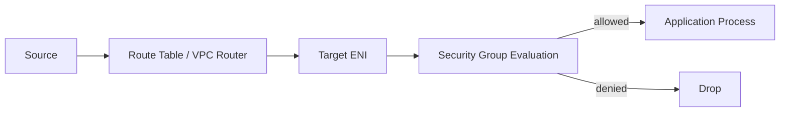
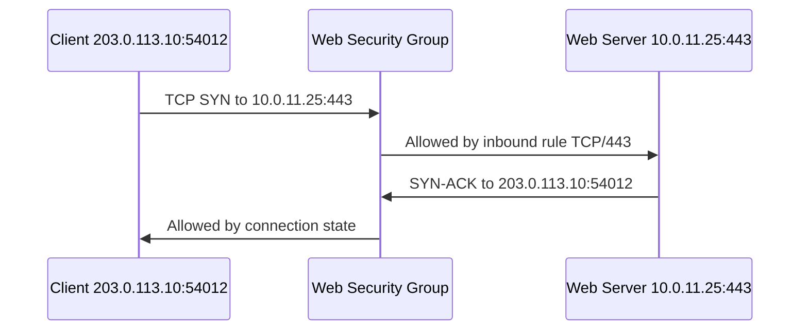
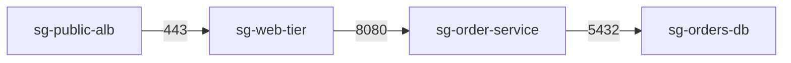
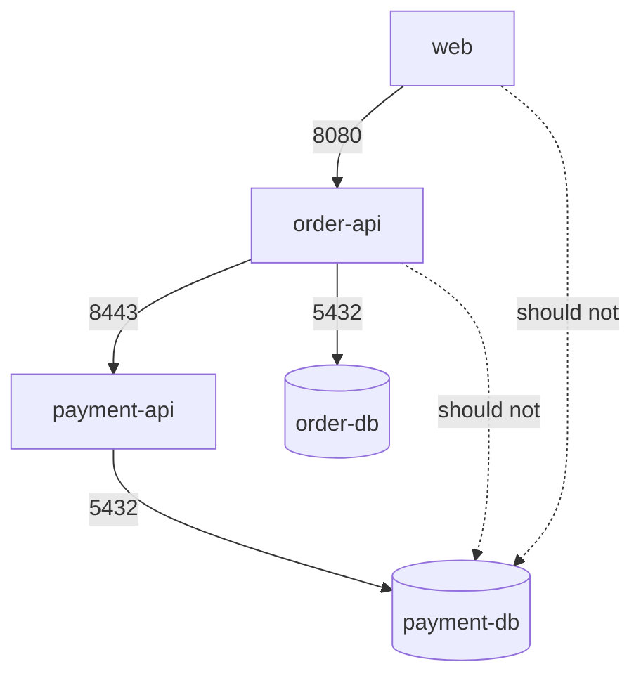
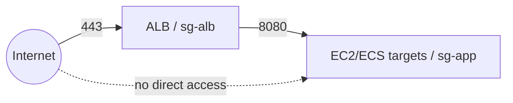
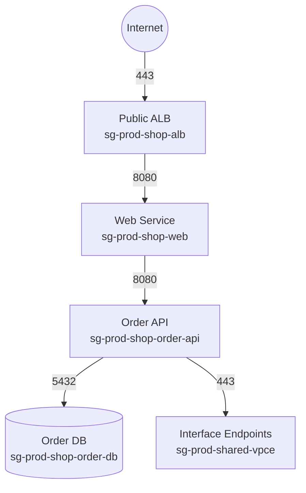
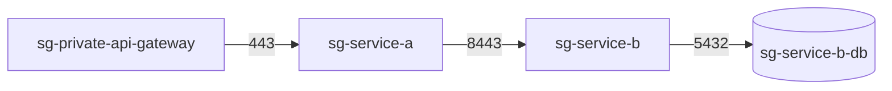
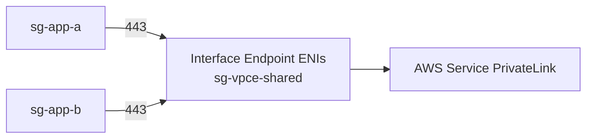

# Part 013 — Security Groups Deep Dive

Security Group adalah salah satu primitive paling sering dipakai di AWS, tetapi juga salah satu yang paling sering disalahpahami.

Banyak engineer memperlakukannya seperti firewall tradisional:

```text
Buka port 443.
Tutup port 22.
Allow IP kantor.
Selesai.
```

Mental model itu terlalu dangkal.

Di production, Security Group adalah **policy boundary di sekitar elastic network interface/resource**, bukan sekadar daftar port.

Security Group menentukan:

- siapa boleh memulai koneksi ke resource;
- resource boleh memulai koneksi ke mana;
- bagaimana return traffic diperlakukan;
- apakah policy mengikuti resource identity, bukan IP statis;
- bagaimana service-to-service access berubah saat autoscaling;
- bagaimana blast radius dibatasi ketika satu tier compromise;
- bagaimana perubahan rule berdampak ke semua resource yang memakai SG tersebut.

Jika route table menjawab:

```text
Ke mana packet dikirim?
```

Security Group menjawab:

```text
Apakah resource ini boleh menerima/mengirim packet tersebut?
```

Jangan campur kedua pertanyaan itu.

Routing problem diselesaikan dengan route table, gateway, attachment, dan target.

Authorization problem di network boundary diselesaikan dengan Security Group, NACL, firewall, endpoint policy, IAM/resource policy, dan layer-7 controls.

Part ini membahas Security Group sebagai building block jaringan produksi.

---

## 1. Security Group dalam Packet Path

Security Group bukan subnet-level control.

Security Group menempel pada resource yang punya network interface.

Untuk EC2, Security Group berasosiasi dengan ENI.

Untuk managed service seperti ALB, NLB tertentu, RDS, Lambda VPC ENI, ECS task dengan `awsvpc`, dan interface endpoint, Security Group diterapkan pada network interface/service attachment yang relevan.

Model sederhananya:



Tetapi secara mental, jangan bayangkan SG sebagai proses aplikasi.

SG dievaluasi di network virtualization layer AWS.

Aplikasi di instance tidak pernah melihat packet yang ditolak oleh SG.

Akibatnya:

- log aplikasi tidak menunjukkan request yang diblok SG;
- web server access log tidak muncul;
- tcpdump di instance tidak melihat packet inbound yang sudah diblok sebelum sampai host;
- VPC Flow Logs menjadi lebih berguna untuk melihat accepted/rejected traffic;
- Reachability Analyzer bisa membantu memvalidasi path.

Security Group adalah gate sebelum packet benar-benar berguna bagi workload.

---

## 2. Stateful, Allow-Only, dan Default Behavior

Security Group punya tiga karakter utama:

1. **stateful**;
2. **allow-only**;
3. **aggregate rules** saat banyak SG menempel ke resource.

Stateful berarti return traffic untuk flow yang sudah diizinkan tidak perlu rule eksplisit arah balik.

Contoh inbound HTTPS ke web server:

```text
Client ephemeral port 54012 -> Web server 443
Web server 443 -> Client ephemeral port 54012
```

Inbound rule di web SG:

```text
Protocol   Port   Source
TCP        443    0.0.0.0/0
```

Outbound return traffic dari web server ke client ephemeral port akan otomatis diizinkan karena bagian dari connection state.

Diagram:



Jika SG bersifat stateless, kita harus membuka outbound ephemeral port. Tetapi SG bukan NACL.

Security Group hanya punya allow rule.

Tidak ada deny rule.

Jika ingin explicit deny, gunakan layer lain:

- NACL untuk subnet-level deny;
- AWS Network Firewall untuk inspection/filtering lebih kaya;
- Route 53 Resolver DNS Firewall untuk domain-level DNS control;
- AWS WAF untuk HTTP/S layer;
- IAM/resource policy untuk identity/resource authorization;
- endpoint policy untuk private service access boundary.

Default behavior untuk security group baru:

```text
Inbound: no rule -> deny all inbound
Outbound: default allow all outbound
```

Ini membuat resource tidak reachable dari luar secara default, tetapi masih bisa melakukan outbound jika subnet/routing mengizinkan.

---

## 3. Security Group Bukan Route Table

Ini sumber bug klasik.

Engineer membuka SG tetapi traffic tetap gagal.

Contoh:

```text
Inbound SG ALLOW TCP/443 from 0.0.0.0/0
```

Namun instance berada di private subnet tanpa public IP dan tidak ada ALB public di depan.

Hasil:

```text
Tidak reachable dari internet.
```

Kenapa?

Karena SG hanya menjawab apakah traffic yang sudah mencapai resource boleh masuk.

SG tidak membuat route.

SG tidak membuat public IP.

SG tidak menghubungkan VPC ke internet.

SG tidak membuat DNS resolve ke resource.

Untuk public inbound IPv4 ke EC2 langsung, perlu setidaknya:

```text
DNS/public IP -> IGW route -> public subnet route -> NACL allow -> SG allow -> host listening
```

Jika salah satu hilang, traffic gagal.

Checklist cepat:

```text
1. Apakah source resolve ke IP yang benar?
2. Apakah target punya address yang reachable dari source?
3. Apakah route source ke target benar?
4. Apakah return route benar?
5. Apakah NACL dua arah allow?
6. Apakah SG target allow inbound?
7. Apakah SG source allow outbound?
8. Apakah OS firewall allow?
9. Apakah process listen pada IP/port yang benar?
```

Security Group adalah satu gate, bukan keseluruhan path.

---

## 4. Security Group Bukan NACL

Security Group dan Network ACL sama-sama terlihat seperti firewall.

Tetapi posisinya berbeda.

| Aspek | Security Group | Network ACL |
|---|---|---|
| Scope | Resource/ENI | Subnet |
| State | Stateful | Stateless |
| Rule type | Allow only | Allow dan deny |
| Evaluation | Semua matching allow digabung | Rule number terendah yang match menang |
| Default custom behavior | Inbound deny, outbound allow saat dibuat | Custom NACL deny all sampai rule dibuat |
| Typical use | Workload policy | Subnet guardrail/coarse deny |
| Identity-ish reference | Bisa reference SG | Tidak bisa reference SG |
| Return traffic | Otomatis jika flow valid | Harus eksplisit allow |

Kesalahan umum:

```text
Saya sudah allow inbound 443 di SG, kenapa request timeout?
```

Kemungkinan:

- NACL inbound deny 443;
- NACL outbound tidak allow ephemeral port response;
- route table salah;
- target health check gagal;
- application tidak listen;
- response path asymmetric;
- DNS mengarah ke endpoint salah.

Di AWS, traffic sukses adalah hasil komposisi beberapa control, bukan satu rule.

---

## 5. Rule Anatomy

Security Group rule biasanya terdiri dari:

```text
Direction: inbound atau outbound
Protocol: TCP, UDP, ICMP, all, atau protocol number
Port range: single port atau range
Source/Destination: CIDR, IPv6 CIDR, prefix list, atau security group
Description: konteks manusia
```

Inbound rule memakai **source**.

Outbound rule memakai **destination**.

Contoh web tier:

```text
Inbound:
TCP 443 from sg-alb

Outbound:
TCP 8080 to sg-app
TCP 443 to pl-s3 / interface endpoints / specific CIDR
```

Contoh app tier:

```text
Inbound:
TCP 8080 from sg-web

Outbound:
TCP 5432 to sg-db
TCP 443 to vpce-* service endpoints
```

Contoh DB tier:

```text
Inbound:
TCP 5432 from sg-app

Outbound:
minimal, only what DB engine/backup/monitoring requires
```

Rule description jangan dianggap kosmetik.

Di sistem besar, description adalah dokumentasi change intent:

```text
allow checkout-service -> payment-adapter PostgreSQL 5432; owner=payments; ticket=SEC-1942; review=2026-Q4
```

Tanpa metadata, SG berubah menjadi tumpukan exception historis.

---

## 6. Security Group Referencing: Policy Berdasarkan Kelompok Resource

Fitur paling kuat SG bukan allow CIDR.

Fitur paling kuat SG adalah **security group referencing**.

Daripada menulis:

```text
Allow TCP 5432 from 10.20.31.0/24
```

lebih baik menulis:

```text
Allow TCP 5432 from sg-order-service
```

Artinya:

```text
Resource dengan sg-order-service boleh connect ke DB pada port 5432.
```

Ini lebih dekat ke intensi arsitektur.

CIDR menjawab lokasi.

Security group reference menjawab role komunikasi.



Rule:

```text
sg-web-tier inbound:
  TCP 443 from sg-public-alb

sg-order-service inbound:
  TCP 8080 from sg-web-tier

sg-orders-db inbound:
  TCP 5432 from sg-order-service
```

Manfaat:

- autoscaling tidak perlu update rule saat IP berubah;
- rolling deployment tidak perlu menambah CIDR;
- resource replacement tetap mengikuti policy jika SG sama;
- policy lebih sesuai dependency graph;
- audit lebih mudah karena rule berbicara dalam istilah service.

Namun SG reference bukan transitive trust.

Jika A boleh ke B dan B boleh ke C, bukan berarti A boleh ke C.

```text
A -> B allowed
B -> C allowed
A -> C not automatically allowed
```

Jangan mendesain jaringan dengan asumsi transitif semacam itu.

---

## 7. Security Group Reference Tidak Menyalin Rule

Saat `sg-db` mengizinkan source `sg-app`, AWS tidak menyalin semua rule dari `sg-app` ke `sg-db`.

Yang terjadi adalah:

```text
Traffic dari ENI yang berasosiasi dengan sg-app boleh masuk ke sg-db pada protocol/port yang ditentukan.
```

Misalnya:

```text
sg-app inbound: TCP 8080 from sg-web
sg-db inbound:  TCP 5432 from sg-app
```

`sg-web` tidak otomatis boleh connect ke DB karena `sg-app` boleh connect ke DB.

Rule source `sg-app` berarti membership source, bukan inheritance.

Ini penting untuk audit.

Security Group reference adalah graph edge:

```text
source group --protocol/port--> destination group
```

Bukan class inheritance.

---

## 8. Security Group dan Middlebox: Reference Bisa Mengecewakan

Ada edge case penting.

Jika traffic antara dua instance diarahkan melalui middlebox appliance, SG reference antar kedua instance belum tentu bekerja seperti yang dibayangkan.

Contoh:

```text
A -> firewall appliance -> B
```

Jika `sg-b` inbound hanya allow source `sg-a`, tetapi packet yang sampai ke B terlihat melalui path middlebox tertentu, evaluasi bisa tidak sama seperti direct path yang kamu bayangkan.

Untuk pola routed-through-appliance, sering kali lebih aman mengevaluasi policy dengan:

- CIDR source/destination yang eksplisit;
- appliance mode jika memakai Transit Gateway dengan inspection appliance;
- route symmetry;
- Network Firewall/GWLB pattern;
- Reachability Analyzer;
- Flow Logs;
- vendor appliance packet log.

Prinsipnya:

```text
SG reference paling natural untuk direct workload-to-workload traffic.
Untuk traffic yang disisipkan appliance, validasi packet path nyata.
```

Jangan menganggap SG reference sebagai abstraksi service mesh.

---

## 9. East-West Traffic: SG sebagai Service Dependency Graph

North-south traffic adalah traffic masuk/keluar boundary environment.

East-west traffic adalah traffic antar workload di dalam private network.

Di microservice environment, east-west sering lebih berbahaya daripada north-south karena jumlah dependency lebih besar dan sering kurang diaudit.

Contoh buruk:

```text
All app subnet CIDR -> all app subnet CIDR all ports
```

Atau:

```text
10.0.0.0/8 all traffic allowed internally
```

Ini membuat compromise satu service melebar ke banyak service lain.

Desain lebih baik:

```text
web -> order-api: TCP 8080
order-api -> payment-api: TCP 8443
order-api -> order-db: TCP 5432
payment-api -> payment-db: TCP 5432
```

Graph:



Security Group sebaiknya mengekspresikan dependency graph itu.

Jika dependency tidak ada di architecture diagram, rule tidak boleh ada.

---

## 10. Inbound-First Design vs Bidirectional Reality

Banyak tim mendesain SG hanya dari inbound rule.

```text
DB allow inbound from app.
```

Lalu outbound dibiarkan default allow all.

Ini sering berjalan, tetapi posture-nya lemah.

Untuk production-sensitive environment, desain dua arah lebih baik:

```text
App outbound TCP 5432 to DB SG
DB inbound TCP 5432 from App SG
```

Dengan begitu, baik source maupun destination menyatakan intensi yang sama.

Kelebihan:

- mengurangi lateral movement dari app ke destination tidak sah;
- audit outbound dependency lebih jelas;
- egress policy bisa dibangun bertahap;
- error konfigurasi lebih cepat terlihat;
- memaksa tim mendokumentasikan external/internal calls.

Kekurangan:

- rule lebih banyak;
- service discovery/dynamic endpoint perlu desain matang;
- beberapa managed service membutuhkan prefix list/interface endpoint;
- troubleshooting lebih sulit jika tim belum disiplin.

Praktik realistis:

```text
Tier rendah risiko: inbound restricted, outbound broad sementara.
Tier sensitif: inbound restricted + outbound restricted.
Regulated boundary: outbound restricted + endpoint policy + DNS Firewall/Network Firewall.
```

Tidak semua workload harus mulai dari outbound deny all, tetapi workload yang memegang data sensitif seharusnya tidak punya outbound bebas tanpa alasan.

---

## 11. Ephemeral Ports: Kenapa SG Lebih Mudah daripada NACL

TCP client biasanya memakai ephemeral source port.

Contoh client memanggil API:

```text
src = 10.0.21.10:49152
 dst = 10.0.31.20:443
```

Server membalas:

```text
src = 10.0.31.20:443
 dst = 10.0.21.10:49152
```

Pada Security Group, return traffic otomatis allowed jika flow awal allowed.

Pada NACL, dua arah harus eksplisit.

Itu sebabnya SG tidak perlu rule inbound ephemeral port untuk response outbound.

Contoh outbound dari private instance ke HTTPS external:

SG instance:

```text
Outbound TCP 443 to 0.0.0.0/0 or specific prefix/list/endpoint
```

Return traffic dari external server ke ephemeral port instance otomatis allowed.

Jangan menambahkan inbound ephemeral port ke SG hanya karena membaca contoh NACL.

Itu tanda mental model bercampur.

---

## 12. Security Group untuk ALB, NLB, dan Target

### 12.1 ALB

ALB biasanya punya Security Group.

Pattern umum:

```text
Internet -> ALB SG -> Target SG
```

ALB SG:

```text
Inbound TCP 443 from 0.0.0.0/0 and ::/0
Outbound TCP 8080 to sg-app-targets
```

Target SG:

```text
Inbound TCP 8080 from sg-alb
Outbound whatever app needs
```

Jangan allow target dari `0.0.0.0/0` hanya karena ALB public.

Target seharusnya percaya ALB SG, bukan internet.



### 12.2 NLB

NLB punya perilaku berbeda tergantung fitur dan target type.

Dalam banyak desain, NLB historically tidak menjadi L7 security boundary seperti ALB. Source IP preservation juga memengaruhi rule target.

Ketika target menerima source IP client asli, target SG mungkin perlu allow source dari client CIDR, bukan dari NLB SG.

Pattern NLB harus divalidasi berdasarkan:

- target type: instance, IP, ALB;
- internal vs internet-facing;
- preserve client IP behavior;
- whether NLB security group feature digunakan;
- PrivateLink provider model;
- health check source behavior.

Jangan copy-paste ALB SG pattern ke NLB tanpa membaca packet source yang benar.

### 12.3 Interface Endpoint

Interface endpoint punya ENI dan Security Group.

Consumer workload mengakses service via private endpoint ENI.

Endpoint SG perlu allow inbound dari workload source.

Pattern:

```text
sg-vpce inbound TCP 443 from sg-app
sg-app outbound TCP 443 to sg-vpce
```

Ini penting untuk private AWS service access tanpa NAT.

---

## 13. Security Group untuk Database

Database SG adalah tempat di mana banyak breach menjadi mudah jika rule terlalu longgar.

Anti-pattern:

```text
PostgreSQL 5432 from 10.0.0.0/16
MySQL 3306 from 10.0.0.0/16
SQL Server 1433 from 10.0.0.0/16
```

Ini berarti semua workload di VPC bisa mencoba connect ke DB.

Lebih baik:

```text
PostgreSQL 5432 from sg-order-api
```

Jika ada migration runner:

```text
PostgreSQL 5432 from sg-order-api
PostgreSQL 5432 from sg-db-migration-runner
```

Jika ada read-only analytics job:

```text
PostgreSQL 5432 from sg-analytics-reader
```

Setiap source merepresentasikan role.

Jangan jadikan database subnet sebagai boundary tunggal.

Subnet private hanya mengurangi reachability dari internet.

Security Group menentukan service mana yang boleh bicara ke database.

---

## 14. Security Group untuk Bastion dan Administrative Access

Bastion pattern klasik:

```text
Admin IP -> Bastion -> Private Instances
```

Rule:

```text
sg-bastion inbound:
  TCP 22 from corporate-ip/32

sg-private-instance inbound:
  TCP 22 from sg-bastion
```

Masalah:

- corporate IP berubah;
- port 22 menjadi attack surface;
- SSH key lifecycle lemah;
- semua admin lewat host yang perlu hardening;
- session audit sering tidak lengkap.

Alternatif modern:

- AWS Systems Manager Session Manager;
- EC2 Instance Connect Endpoint;
- AWS Verified Access untuk private web apps;
- Client VPN untuk use case tertentu;
- Zero Trust access dengan identity/device posture.

Jika tetap memakai bastion:

- restrict source IP;
- disable password auth;
- rotate keys;
- log session;
- patch OS;
- jangan letakkan bastion SG sebagai source ke semua port semua private host;
- gunakan SG reference spesifik per admin function.

Rule buruk:

```text
sg-private inbound all ports from sg-bastion
```

Rule lebih baik:

```text
sg-linux-admin inbound TCP 22 from sg-bastion
sg-windows-admin inbound TCP 3389 from sg-bastion
sg-db-admin inbound TCP 5432 from sg-db-admin-runner
```

---

## 15. Prefix Lists dan Managed Prefix Lists

CIDR di SG bisa menjadi sulit dikelola ketika source/destination berupa banyak network.

Prefix list membantu mengelompokkan CIDR.

Contoh:

```text
pl-corporate-egress = 203.0.113.0/24, 198.51.100.0/24
pl-partner-network  = 192.0.2.0/24
```

SG:

```text
Inbound TCP 443 from pl-corporate-egress
```

Manfaat:

- update CIDR di satu tempat;
- rule lebih stabil;
- governance lebih mudah;
- mengurangi copy-paste CIDR di banyak SG.

AWS-managed prefix list juga berguna untuk beberapa layanan AWS.

Namun perhatikan quota/rule weight.

Prefix list tidak gratis secara rule-count mental model: satu rule bisa menghitung sesuai size/weight prefix list.

Jangan membuat prefix list raksasa lalu kaget quota SG habis.

---

## 16. Security Group Quota dan Rule Explosion

SG punya quota.

Limit bisa berubah, dan beberapa bisa dinaikkan, tetapi desain tetap perlu hemat.

Rule explosion biasanya muncul karena:

- satu SG dipakai untuk terlalu banyak fungsi;
- semua dependency ditulis sebagai CIDR individual;
- setiap team menambah exception manual;
- environment dev/staging/prod dicampur;
- outbound restriction diterapkan tanpa service discovery strategy;
- prefix list besar dipakai sembarangan;
- generated infrastructure tidak melakukan deduplication.

Strategi menghindari rule explosion:

```text
1. Buat SG berdasarkan role workload, bukan instance individual.
2. Gunakan SG reference untuk internal dependency.
3. Gunakan prefix list untuk shared external CIDR.
4. Pisahkan north-south, east-west, admin, data access SG.
5. Buat rule description wajib.
6. Review stale rule secara berkala.
7. Jangan campur temporary exception dengan baseline SG.
```

Pattern yang baik:

```text
sg-alb-public
sg-web-tier
sg-order-api
sg-payment-api
sg-orders-db
sg-shared-vpce
sg-migration-runner
```

Pattern yang buruk:

```text
sg-prod
sg-private
sg-common
sg-open-internal
sg-temporary-do-not-delete
```

Nama SG harus menjelaskan role, bukan lokasi kabur.

---

## 17. Multiple Security Groups: Union, Bukan Intersection

Resource bisa punya beberapa Security Group.

Rules digabung sebagai union.

Jika salah satu SG allow, traffic allowed.

Contoh:

```text
sg-app-base inbound: TCP 8080 from sg-alb
sg-debug-temp inbound: TCP 22 from 0.0.0.0/0
```

Jika instance memiliki kedua SG, port 22 terbuka ke internet.

Tidak ada konsep:

```text
Traffic harus match semua SG.
```

Yang benar:

```text
Traffic cukup match salah satu allow rule dari aggregated rules.
```

Ini penting untuk policy composition.

Jangan memakai multiple SG seperti layered firewall yang makin ketat.

Multiple SG membuat policy makin longgar jika tidak dikelola.

Pattern aman:

- satu SG utama per workload role;
- SG tambahan hanya untuk capability yang jelas;
- temporary SG harus punya TTL/owner/ticket;
- automated drift detection;
- no wildcard debug SG di production.

---

## 18. Default Security Group: Jangan Dipakai untuk Production

Default Security Group di VPC sering punya rule self-reference yang mengizinkan resource dengan default SG saling bicara.

Itu nyaman untuk demo.

Itu buruk untuk production.

Masalah:

- terlalu banyak resource accidental attach;
- dependency graph tidak terlihat;
- lateral movement mudah;
- audit tidak tahu rule dibuat untuk aplikasi mana;
- cleanup sulit karena banyak resource bergantung.

Praktik production:

```text
1. Jangan gunakan default SG untuk workload.
2. Buat SG eksplisit per role.
3. Alert jika resource baru memakai default SG.
4. Hapus/ketatkan outbound/inbound default SG sesuai guardrail organisasi jika memungkinkan.
```

Default SG harus dianggap seperti `default password`: ada karena platform butuh baseline, bukan karena desain kita selesai.

---

## 19. Outbound Egress: Jangan Biarkan Semua Keluar Tanpa Kesadaran

Default outbound allow all sering membuat aplikasi bekerja cepat.

Namun dari perspektif security dan compliance, ini membuka risiko:

- data exfiltration ke internet;
- malware callback;
- dependency external tidak terdokumentasi;
- traffic AWS public endpoint lewat NAT tanpa endpoint policy;
- biaya NAT tidak terlihat;
- deny-by-exception sulit dilakukan belakangan.

Level maturity outbound SG:

| Level | Model | Cocok untuk |
|---|---|---|
| 0 | allow all outbound | sandbox/dev awal |
| 1 | allow known internal SG + HTTPS external broad | workload umum awal |
| 2 | allow internal SG + VPC endpoints + prefix lists | production regulated moderate |
| 3 | allow only approved destinations + Network Firewall/DNS Firewall/proxy | high assurance / regulated |

Contoh level 2:

```text
sg-app outbound:
  TCP 5432 to sg-db
  TCP 443 to sg-vpce-s3-interface-or-prefix-list
  TCP 443 to sg-vpce-secretsmanager
  TCP 443 to sg-vpce-cloudwatch-logs
```

Jika harus call third-party API:

```text
TCP 443 to pl-approved-partner-apis
```

Jika partner IP berubah-ubah atau memakai CDN, SG saja tidak cukup.

Gunakan egress proxy, Network Firewall, DNS Firewall, atau partner private connectivity pattern.

---

## 20. SG dan DNS: Limitasi Penting

Security Group tidak bisa menjadi kontrol penuh untuk semua DNS behavior di VPC.

Traffic ke AmazonProvidedDNS/Route 53 Resolver memiliki special handling.

Jika ingin mengontrol domain apa yang boleh di-resolve, gunakan:

- Route 53 Resolver DNS Firewall;
- resolver query logging;
- outbound resolver rule governance;
- egress proxy/firewall untuk layer tambahan.

Jangan mengira:

```text
Block UDP/53 outbound di SG = semua DNS pasti blocked.
```

Di AWS, beberapa reserved service path tidak difilter oleh SG sebagaimana traffic normal.

Untuk DNS security, gunakan DNS control yang memang didesain untuk DNS.

---

## 21. Security Group dan IPv6

IPv6 bukan sekadar IPv4 address lebih panjang.

Pada IPv6, resource bisa punya globally routable address.

Private-vs-public mental model berubah.

SG menjadi makin penting karena IPv6 subnet tidak memakai NAT Gateway klasik untuk menyembunyikan address seperti IPv4 private egress.

Contoh dual-stack ALB:

```text
Inbound TCP 443 from 0.0.0.0/0
Inbound TCP 443 from ::/0
```

Jika kamu menambahkan IPv6 ke workload tetapi hanya mengaudit IPv4 SG rules, kamu bisa membuka surface yang tidak disadari.

Checklist IPv6 SG:

```text
1. Setiap rule IPv4 public punya pasangan IPv6 yang disengaja, bukan otomatis.
2. Jangan tambah ::/0 tanpa review setara 0.0.0.0/0.
3. Pastikan egress-only IGW behavior dipahami.
4. Audit NACL IPv6 separately.
5. Pastikan logging/monitoring bisa membaca IPv6 fields.
```

IPv6 mengurangi kebutuhan NAT untuk address conservation, tetapi tidak mengurangi kebutuhan policy.

---

## 22. Change Management: Security Group adalah Production Lever

Mengubah SG bisa langsung memengaruhi semua resource attached.

Dampaknya bisa instan:

- target ALB menjadi unhealthy;
- database connection putus atau timeout;
- deployment gagal pull dependency;
- metrics/logs berhenti terkirim;
- partner integration gagal;
- health check Route 53/ELB gagal;
- incident membesar karena change kecil dianggap aman.

Security Group change harus diperlakukan seperti code change.

Minimal guardrail:

```text
1. Semua SG didefinisikan di IaC.
2. Tidak ada manual console change tanpa break-glass process.
3. Rule description wajib.
4. Rule punya owner/service context.
5. Temporary rule punya expiry date.
6. CI memblok 0.0.0.0/0 ke admin ports.
7. Drift detection aktif.
8. Change dikaitkan ke architecture dependency.
```

Contoh policy-as-code check:

```text
Reject if:
- inbound 0.0.0.0/0 TCP 22
- inbound 0.0.0.0/0 TCP 3389
- inbound 0.0.0.0/0 database ports
- outbound 0.0.0.0/0 all ports on sensitive SG
- no description
- name contains temp and no expiry tag
```

Security Group bukan dokumen statis.

Ia adalah executable network policy.

---

## 23. Naming Convention yang Bisa Diaudit

Nama SG yang baik harus menjawab:

```text
Environment? System? Role? Direction? Scope?
```

Contoh:

```text
prod-checkout-public-alb-sg
prod-checkout-web-sg
prod-checkout-order-api-sg
prod-checkout-order-db-sg
prod-shared-vpce-secretsmanager-sg
prod-admin-ssm-endpoint-sg
```

Tag:

```yaml
Owner: checkout-platform
Service: order-api
Environment: prod
DataClass: restricted
ManagedBy: terraform
ReviewCadence: quarterly
Criticality: high
```

Rule description:

```text
allow prod checkout web -> order-api HTTP; owner=checkout-platform; adr=ADR-013
```

Jangan pakai nama:

```text
allow-all
private-sg
test-sg
new-sg
sg-prod-2
temporary
```

Nama buruk membuat incident response lambat.

---

## 24. Debugging Security Group Issue

Gejala umum:

```text
Connection timeout
Connection refused
TLS handshake timeout
Health check failed
502/503 from ALB
Database connection timeout
```

Bedakan error:

| Gejala | Kemungkinan |
|---|---|
| Timeout | route/NACL/SG/drop/no return path |
| Connection refused | target reachable tetapi process tidak listening/port closed |
| TLS error | network path ada, TLS/cert/protocol issue |
| ALB 502 | target closed/reset/invalid response |
| ALB 504 | target timeout/SG/NACL/app slow |
| DNS NXDOMAIN | DNS issue, bukan SG |

Runbook:

```text
1. Confirm source IP/SG.
2. Confirm destination IP/SG.
3. Confirm destination port and protocol.
4. Confirm process is listening.
5. Check source outbound SG.
6. Check destination inbound SG.
7. Check NACL both directions.
8. Check route tables both directions.
9. Check VPC Flow Logs accept/reject.
10. Use Reachability Analyzer for static path validation.
11. Check service-specific health check logs.
```

Contoh query mental:

```text
Can sg-web send TCP 8080 to sg-order-api?
Can sg-order-api receive TCP 8080 from sg-web?
Can return traffic flow? SG yes, NACL maybe not.
Is DNS resolving to private IP, public IP, or stale IP?
```

Jangan langsung membuka `0.0.0.0/0` untuk “test”.

Itu sering menjadi permanent exception.

Lebih aman:

- clone SG rule spesifik;
- test dari known source SG;
- gunakan temporary rule dengan expiry;
- rollback via IaC;
- inspect Flow Logs.

---

## 25. Flow Logs dan SG Debugging

VPC Flow Logs dapat menunjukkan apakah traffic accepted atau rejected di level ENI/subnet/VPC tergantung konfigurasi.

Namun Flow Logs bukan packet capture penuh.

Batasan mental:

- tidak menunjukkan payload;
- agregasi time window;
- tidak selalu cukup untuk melihat handshake detail;
- rejected bisa berasal dari SG atau NACL tergantung path;
- accepted tidak berarti aplikasi sukses;
- tidak menggantikan ALB logs, app logs, tcpdump, atau packet mirroring.

Contoh interpretasi:

```text
REJECT TCP src=10.0.21.10 dst=10.0.31.20 dstport=5432
```

Kemungkinan:

- DB SG tidak allow source;
- source outbound SG tidak allow destination;
- NACL deny;
- wrong target IP.

Jika Flow Logs `ACCEPT` tetapi app gagal:

- process tidak listen;
- TLS mismatch;
- protocol mismatch;
- DB auth gagal;
- connection pool exhausted;
- server closed connection;
- application-level firewall.

Network accepted bukan business success.

---

## 26. Common Anti-Patterns

### 26.1 One SG for Everything

```text
sg-prod-common attached to ALB, EC2, DB, Redis, migration job
```

Dampak:

- rule makin longgar;
- tidak bisa tahu siapa butuh apa;
- perubahan untuk satu service memengaruhi semua;
- audit dependency mustahil.

### 26.2 CIDR Internal All-Allow

```text
10.0.0.0/16 all traffic
```

Dampak:

- lateral movement;
- service boundary hilang;
- compromise satu host menjadi compromise network.

### 26.3 Public Admin Port

```text
0.0.0.0/0 TCP 22
0.0.0.0/0 TCP 3389
```

Dampak:

- internet-wide brute force;
- compliance finding;
- noisy logs;
- real breach risk.

### 26.4 Temporary Rule Permanen

```text
temporary allow all from vendor until migration complete
```

Tanpa expiry, temporary menjadi legacy.

### 26.5 Default Outbound Forever

```text
All protocols to 0.0.0.0/0
```

Bisa diterima untuk awal, tetapi harus menjadi conscious decision, bukan warisan default.

### 26.6 Mixing Environment

```text
prod DB allows staging app SG
```

Ini sering terjadi saat cross-account/shared VPC tidak punya naming/tagging ketat.

Environment isolation harus tercermin di SG.

---

## 27. Production Design Pattern: Three-Tier App

Architecture:



SG rules:

```text
sg-prod-shop-alb
Inbound:
  TCP 443 from 0.0.0.0/0
  TCP 443 from ::/0
Outbound:
  TCP 8080 to sg-prod-shop-web

sg-prod-shop-web
Inbound:
  TCP 8080 from sg-prod-shop-alb
Outbound:
  TCP 8080 to sg-prod-shop-order-api

sg-prod-shop-order-api
Inbound:
  TCP 8080 from sg-prod-shop-web
Outbound:
  TCP 5432 to sg-prod-shop-order-db
  TCP 443 to sg-prod-shared-vpce

sg-prod-shop-order-db
Inbound:
  TCP 5432 from sg-prod-shop-order-api
Outbound:
  minimal engine-required traffic

sg-prod-shared-vpce
Inbound:
  TCP 443 from sg-prod-shop-order-api
Outbound:
  normally not relevant as endpoint service response is stateful, validate service behavior
```

Policy invariant:

```text
Only ALB receives internet traffic.
Only Web receives ALB traffic.
Only Order API receives Web traffic.
Only DB receives Order API traffic.
Only approved endpoints receive app egress.
```

Jika ada incident, invariants ini mempersempit blast radius.

---

## 28. Production Design Pattern: Private Service-to-Service

Untuk internal platform:

```text
api-gateway-private -> service-a -> service-b -> db-b
```

SG graph:



Rules:

```text
sg-service-a inbound TCP 443 from sg-private-api-gateway
sg-service-b inbound TCP 8443 from sg-service-a
sg-service-b-db inbound TCP 5432 from sg-service-b
```

This is not service mesh.

Security Group tidak memberi:

- mTLS identity;
- request-level auth;
- retry policy;
- circuit breaking;
- per-method authorization;
- rate limiting.

SG hanya mencegah network path yang tidak diizinkan.

Aplikasi tetap butuh authN/authZ di layer aplikasi.

---

## 29. Production Design Pattern: Shared VPC Endpoint Access

Banyak private workload perlu akses ke AWS services:

- Secrets Manager;
- SSM;
- CloudWatch Logs;
- ECR API/DKR;
- STS;
- KMS;
- SQS/SNS;
- S3 via gateway/interface depending design.

Pattern:



Endpoint SG:

```text
Inbound TCP 443 from sg-app-a
Inbound TCP 443 from sg-app-b
```

App SG outbound:

```text
Outbound TCP 443 to sg-vpce-shared
```

Endpoint policy/IAM policy tetap diperlukan.

SG hanya menjawab:

```text
Boleh mencapai endpoint ENI?
```

Endpoint policy menjawab:

```text
Boleh melakukan action AWS service tertentu ke resource tertentu?
```

Jangan mengganti IAM/resource policy dengan SG.

---

## 30. Security Group Review Checklist

Gunakan checklist ini untuk design review.

### 30.1 Scope

```text
[ ] SG merepresentasikan satu role workload yang jelas.
[ ] Tidak ada SG generic untuk banyak tier sensitif.
[ ] Default SG tidak dipakai workload production.
[ ] Nama dan tag menjelaskan owner/service/environment.
```

### 30.2 Inbound

```text
[ ] Tidak ada admin port dari 0.0.0.0/0 atau ::/0.
[ ] Database hanya menerima dari SG aplikasi yang benar.
[ ] Internal service memakai SG reference, bukan CIDR besar.
[ ] Public exposure hanya pada ALB/CloudFront/API entrypoint yang disengaja.
[ ] IPv6 exposure direview setara IPv4.
```

### 30.3 Outbound

```text
[ ] Outbound allow all adalah keputusan sadar, bukan default terlupakan.
[ ] Workload sensitif punya outbound restricted.
[ ] AWS service access lebih banyak memakai VPC endpoint daripada NAT jika cocok.
[ ] External API dependency terdokumentasi.
[ ] DNS/egress controls tersedia jika perlu compliance.
```

### 30.4 Operations

```text
[ ] Semua SG dikelola IaC.
[ ] Rule description wajib.
[ ] Temporary rule punya expiry.
[ ] Drift detection aktif.
[ ] Flow Logs/Reachability Analyzer tersedia untuk debugging.
[ ] Security review berkala menemukan stale rules.
```

---

## 31. Small Lab: Build a Minimal Secure Three-Tier SG Model

Tujuan: melatih dependency graph, bukan membuat aplikasi lengkap.

### 31.1 Buat SG

```bash
# pseudo commands, sesuaikan VPC ID
aws ec2 create-security-group \
  --group-name prod-demo-alb-sg \
  --description "Public ALB SG" \
  --vpc-id vpc-xxxx

aws ec2 create-security-group \
  --group-name prod-demo-app-sg \
  --description "Private app SG" \
  --vpc-id vpc-xxxx

aws ec2 create-security-group \
  --group-name prod-demo-db-sg \
  --description "Private DB SG" \
  --vpc-id vpc-xxxx
```

### 31.2 Tambah Rule

```bash
# ALB receives public HTTPS
aws ec2 authorize-security-group-ingress \
  --group-id sg-alb \
  --ip-permissions 'IpProtocol=tcp,FromPort=443,ToPort=443,IpRanges=[{CidrIp=0.0.0.0/0,Description="public HTTPS to ALB"}]'

# App receives only from ALB
aws ec2 authorize-security-group-ingress \
  --group-id sg-app \
  --ip-permissions 'IpProtocol=tcp,FromPort=8080,ToPort=8080,UserIdGroupPairs=[{GroupId=sg-alb,Description="ALB to app HTTP"}]'

# DB receives only from App
aws ec2 authorize-security-group-ingress \
  --group-id sg-db \
  --ip-permissions 'IpProtocol=tcp,FromPort=5432,ToPort=5432,UserIdGroupPairs=[{GroupId=sg-app,Description="app to postgres"}]'
```

### 31.3 Validate Invariant

```text
Internet cannot directly reach app.
Internet cannot directly reach DB.
ALB can reach app.
App can reach DB.
Web tier cannot reach DB unless explicitly allowed.
```

Use Reachability Analyzer or controlled tests to validate.

---

## 32. Final Mental Model

Security Group adalah **stateful allow-list di sekitar resource network boundary**.

Ia bagus untuk:

- workload-level network policy;
- service dependency graph;
- least privilege between tiers;
- autoscaling-friendly access;
- internal segmentation;
- simple L3/L4 allow-listing.

Ia tidak cukup untuk:

- explicit deny;
- packet inspection;
- L7 authorization;
- DNS domain governance;
- complete egress control;
- service mesh semantics;
- application identity;
- replacing IAM/resource policy.

Kalimat pegangan:

```text
Route table decides where traffic can go.
Security Group decides whether this resource accepts or emits that traffic.
NACL decides subnet-level stateless guardrails.
Firewall/WAF/DNS Firewall decide deeper inspection and explicit controls.
IAM/resource policy decides identity/resource authorization.
```

Engineer top-tier tidak hanya bertanya:

```text
Port apa yang harus dibuka?
```

Mereka bertanya:

```text
Dependency apa yang sah?
Siapa source yang benar?
Apakah rule mengikuti service role atau lokasi IP?
Apa blast radius jika service ini compromise?
Bagaimana rule berubah saat autoscaling/deployment?
Bagaimana saya membuktikan rule ini masih diperlukan enam bulan lagi?
```

Itulah cara memakai Security Group sebagai desain, bukan tambalan.

---

## Referensi Resmi

- AWS VPC Security Groups: https://docs.aws.amazon.com/vpc/latest/userguide/vpc-security-groups.html
- AWS Security Group Rules: https://docs.aws.amazon.com/vpc/latest/userguide/security-group-rules.html
- Amazon EC2 Security Groups and Connection Tracking: https://docs.aws.amazon.com/AWSEC2/latest/UserGuide/ec2-security-groups.html
- AWS Compare Security Groups and Network ACLs: https://docs.aws.amazon.com/vpc/latest/userguide/infrastructure-security.html
- AWS VPC Flow Logs: https://docs.aws.amazon.com/vpc/latest/userguide/flow-logs.html
- AWS Reachability Analyzer: https://docs.aws.amazon.com/vpc/latest/reachability/what-is-reachability-analyzer.html
- Route 53 Resolver DNS Firewall: https://docs.aws.amazon.com/Route53/latest/DeveloperGuide/resolver-dns-firewall.html
