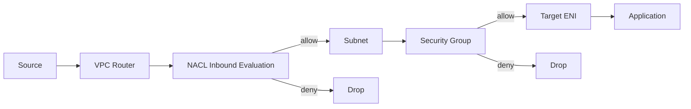
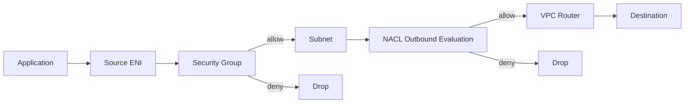
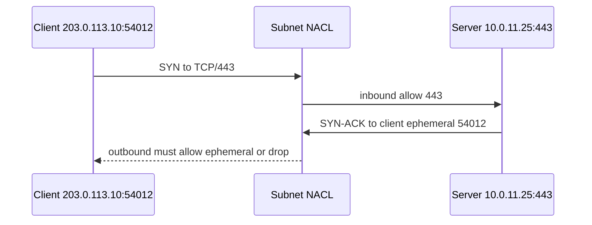
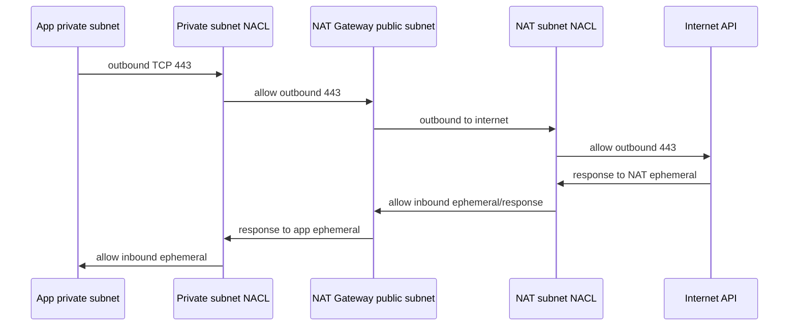

# Part 014 — Network ACLs Deep Dive

Network ACL atau NACL adalah subnet-level stateless filter di Amazon VPC.

Ia terlihat sederhana:

```text
Inbound rules.
Outbound rules.
Allow atau deny.
Rule number.
```

Tetapi banyak outage VPC terjadi karena engineer lupa satu hal:

```text
NACL tidak menyimpan state koneksi.
```

Jika inbound request diizinkan, outbound response belum tentu diizinkan.

Jika outbound request diizinkan, inbound response belum tentu diizinkan.

Security Group menyimpan connection state.

NACL tidak.

Karena itu, NACL bukan sekadar “Security Group level subnet”. Ia primitive yang berbeda.

Part ini membahas NACL sebagai **coarse subnet guardrail**, bukan sebagai tempat utama mendefinisikan semua service dependency.

---

## 1. Mental Model: NACL adalah Gate di Boundary Subnet

Security Group menempel ke resource/ENI.

NACL berasosiasi dengan subnet.

Setiap subnet harus punya satu NACL yang aktif.

Satu NACL bisa diasosiasikan ke banyak subnet.

Satu subnet hanya bisa berasosiasi dengan satu NACL pada satu waktu.

Model:



For outbound leaving subnet:



NACL evaluation terjadi saat traffic masuk dan keluar subnet.

Bukan saat traffic bergerak antar host di subnet yang sama dengan cara yang tidak melintasi subnet boundary.

Karena posisinya subnet-level, NACL bagus untuk coarse guardrail:

- blok CIDR berbahaya;
- blok port administratif dari internet;
- enforce subnet class policy;
- emergency deny saat incident;
- membatasi subnet tertentu dari destination tertentu;
- guardrail defense-in-depth di atas Security Group.

NACL buruk untuk service dependency detail:

```text
service-a boleh ke service-b port 8443
service-c tidak boleh ke service-b
```

Gunakan Security Group untuk dependency graph semacam itu.

---

## 2. Stateless: Konsekuensi Paling Penting

Stateless berarti NACL tidak mengingat flow.

Contoh inbound web request:

```text
Client 203.0.113.10:54012 -> Server 10.0.11.25:443
Server 10.0.11.25:443 -> Client 203.0.113.10:54012
```

NACL public subnet server perlu:

```text
Inbound allow TCP 443 from 203.0.113.10/32 or 0.0.0.0/0
Outbound allow TCP ephemeral range to 203.0.113.10/32 or 0.0.0.0/0
```

Jika outbound ephemeral response tidak allowed, client timeout.

Diagram:



Ini kebalikan dari Security Group stateful yang otomatis allow return traffic.

Stateless design menghasilkan prinsip:

```text
Every allowed conversation needs two NACL paths:
1. request direction
2. response direction
```

---

## 3. Rule Number: First Match Wins

NACL rule punya nomor `1` sampai `32766`.

AWS mengevaluasi rule dari nomor terkecil ke terbesar.

Begitu packet match satu rule, evaluasi berhenti.

Artinya rule ordering adalah policy.

Contoh:

```text
100 DENY  TCP 22 from 0.0.0.0/0
110 ALLOW TCP 22 from 203.0.113.10/32
```

Hasil:

```text
203.0.113.10 tetap denied untuk TCP 22
```

Karena rule 100 match lebih dulu.

Urutan benar:

```text
100 ALLOW TCP 22 from 203.0.113.10/32
110 DENY  TCP 22 from 0.0.0.0/0
```

Tetapi untuk admin access, sebaiknya jangan bergantung pada NACL saja.

Gunakan SSM/Verified Access/VPN/bastion dengan SG ketat.

NACL rule number best practice:

```text
100 baseline allow/deny penting
200 subnet class rules
300 temporary controlled exceptions
400 partner network rules
900 broad allow if required
*   implicit deny
```

Tinggalkan gap angka agar bisa insert rule.

Jangan membuat rule berurutan `100,101,102` tanpa ruang untuk perubahan.

---

## 4. Explicit Deny dan Implicit Deny

NACL mendukung `ALLOW` dan `DENY`.

Jika packet tidak match rule manapun, rule `*` implicit deny berlaku.

Contoh custom NACL baru sering tampak “mati” karena belum ada allow rule.

```text
Inbound:
* DENY ALL

Outbound:
* DENY ALL
```

Default NACL VPC biasanya allow all inbound/outbound.

Custom NACL default deny sampai kamu menambahkan rule.

Ini membuat custom NACL berguna sebagai strict subnet boundary, tetapi juga berbahaya jika diasosiasikan prematur.

Praktik aman:

```text
1. Buat NACL baru.
2. Tambahkan inbound/outbound rules lengkap.
3. Validasi di non-prod.
4. Associate ke subnet kecil dulu.
5. Monitor Flow Logs dan health check.
6. Baru rollout ke subnet lain.
```

Jangan associate custom NACL kosong ke subnet production.

---

## 5. NACL dan Ephemeral Ports

Ephemeral port adalah port sementara yang dipakai client side connection.

Server port biasanya well-known:

```text
HTTPS server: 443
PostgreSQL server: 5432
Redis server: 6379
```

Client port biasanya ephemeral:

```text
49152
53044
61000
```

Range ephemeral bisa berbeda tergantung OS dan konfigurasi.

Contoh Linux modern sering memakai range seperti `32768-60999`, tetapi jangan mengandalkan satu angka universal tanpa memeriksa OS/workload.

Dalam NACL, kamu sering melihat allow ephemeral broad:

```text
TCP 1024-65535
```

Itu bukan karena aplikasi listen di semua port.

Itu karena response traffic perlu kembali ke client ephemeral port.

### 5.1 Public Web Server NACL

Inbound:

```text
ALLOW TCP 443 from 0.0.0.0/0
ALLOW TCP 80  from 0.0.0.0/0 if needed for redirect
```

Outbound:

```text
ALLOW TCP 1024-65535 to 0.0.0.0/0
```

Karena server membalas ke ephemeral port client.

### 5.2 Private App Calling External HTTPS via NAT

Private app subnet outbound:

```text
ALLOW TCP 443 to 0.0.0.0/0 or NAT path destination model
```

Private app subnet inbound:

```text
ALLOW TCP 1024-65535 from NAT/public path response source
```

NAT subnet NACL juga perlu allow traffic yang sesuai.

Jika salah satu arah lupa, app timeout.

### 5.3 App Calling Database

App subnet outbound:

```text
ALLOW TCP 5432 to DB subnet CIDR
```

App subnet inbound:

```text
ALLOW TCP ephemeral from DB subnet CIDR
```

DB subnet inbound:

```text
ALLOW TCP 5432 from App subnet CIDR
```

DB subnet outbound:

```text
ALLOW TCP ephemeral to App subnet CIDR
```

Dengan Security Group, kita cukup bicara `app SG -> db SG TCP/5432`.

Dengan NACL, kita harus bicara subnet CIDR dan dua arah.

Itulah kenapa NACL tidak nyaman untuk fine-grained service access.

---

## 6. Public Subnet NACL Pattern

Public subnet biasanya menampung:

- ALB public;
- NAT Gateway;
- bastion legacy;
- public NLB;
- public-facing reverse proxy;
- edge appliances.

NACL public subnet harus mendukung:

- inbound client traffic ke public entrypoint;
- outbound response ephemeral;
- health checks jika relevan;
- NAT traffic jika NAT Gateway berada di subnet tersebut;
- admin access hanya jika memang ada resource admin.

Contoh untuk public ALB-only subnet:

Inbound:

```text
100 ALLOW TCP 443 from 0.0.0.0/0
110 ALLOW TCP 80  from 0.0.0.0/0    # optional redirect only
120 ALLOW TCP 1024-65535 from app/private CIDR if needed for responses/checks depending path
*   DENY ALL
```

Outbound:

```text
100 ALLOW TCP 1024-65535 to 0.0.0.0/0  # response to internet clients
110 ALLOW TCP 8080 to app subnet CIDR   # ALB to targets if targets private
*   DENY ALL
```

Tetapi hati-hati: ALB health checks, client behavior, target port, and response path harus disesuaikan.

NACL terlalu ketat tanpa observability sering menyebabkan health check failure.

Untuk public subnet dengan NAT Gateway, rule bisa lebih broad karena NAT harus melayani banyak outbound private workloads.

Jika kamu ingin egress filtering detail, jangan berharap NACL public NAT subnet cukup.

Gunakan Network Firewall/egress proxy/DNS Firewall/PrivateLink pattern.

---

## 7. Private App Subnet NACL Pattern

Private app subnet biasanya menerima traffic dari ALB/internal service dan keluar ke DB/endpoints/NAT.

Baseline app subnet:

Inbound:

```text
100 ALLOW TCP app-port from ALB subnet CIDR or upstream subnet CIDR
110 ALLOW TCP ephemeral from DB subnet CIDR / NAT response / endpoint response as needed
*   DENY ALL
```

Outbound:

```text
100 ALLOW TCP db-port to DB subnet CIDR
110 ALLOW TCP 443 to endpoint subnet CIDR or NAT path
120 ALLOW TCP ephemeral to upstream subnet CIDR if app is server responding
*   DENY ALL
```

NACL berbasis CIDR, bukan SG.

Karena itu, jika app subnet menampung banyak service, NACL tidak bisa membedakan service A dan B di subnet yang sama.

Jika service A dan B butuh policy sangat berbeda, pertimbangkan:

- pisah subnet;
- pisah SG;
- VPC Lattice/service mesh untuk higher-level policy;
- Network Firewall jika perlu inspection;
- account/VPC segmentation.

Subnet adalah security grouping kasar.

Jangan isi satu subnet dengan workload yang butuh boundary sangat berbeda lalu berharap NACL menyelesaikannya.

---

## 8. Isolated Database Subnet NACL Pattern

Database subnet biasanya tidak butuh inbound dari internet.

DB subnet menerima dari app subnet dan mengirim response.

Contoh PostgreSQL:

Inbound:

```text
100 ALLOW TCP 5432 from app subnet CIDR
*   DENY ALL
```

Outbound:

```text
100 ALLOW TCP 1024-65535 to app subnet CIDR
110 ALLOW TCP 443 to backup/monitoring endpoint path if required
*   DENY ALL
```

Namun jangan lupa managed database behavior.

RDS, Aurora, managed backup, monitoring, replication, DNS, control plane integration punya behavior yang tidak selalu identik dengan EC2 manual database.

NACL terlalu ketat di subnet database bisa merusak:

- DB connectivity;
- replication;
- backup/restore path;
- monitoring;
- patching operations;
- managed service health.

Untuk managed services, baca service-specific networking guidance.

Security Group biasanya menjadi primary control untuk DB inbound.

NACL menjadi subnet-level guardrail:

```text
No internet-originated traffic.
Only app subnet CIDR can reach DB port.
Only expected return/management traffic leaves.
```

---

## 9. NACL untuk Deny Guardrail

Karena NACL mendukung explicit deny, ia berguna untuk guardrail yang harus berlaku meskipun SG salah.

Contoh:

```text
Deny TCP 22 from 0.0.0.0/0 on public subnets.
Deny TCP 3389 from 0.0.0.0/0 on public subnets.
Deny known malicious CIDR.
Deny outbound to forbidden partner/network.
Deny all internet-originated traffic to database subnet.
```

Namun deny harus dipakai hati-hati.

Deny broad yang salah urutan bisa memutus traffic sah.

Contoh incident:

```text
100 DENY TCP 1024-65535 to 0.0.0.0/0
110 ALLOW TCP 443 to partner-api
```

Jika response dari partner memakai source 443 ke client ephemeral, apakah rule ini memblok arah yang benar? Tergantung inbound/outbound dan packet direction.

NACL deny rule harus ditulis dengan packet direction aktual, bukan bahasa manusia “block partner”.

Untuk deny kompleks, sering lebih tepat memakai Network Firewall atau proxy.

---

## 10. NACL dan NAT Gateway

NAT Gateway sering berada di public subnet.

Private subnet route:

```text
0.0.0.0/0 -> NAT Gateway
```

Public NAT subnet route:

```text
0.0.0.0/0 -> Internet Gateway
```

NACL yang terlalu ketat di private subnet atau NAT public subnet bisa memutus egress.

Mental model outbound private app ke internet:



Jika private app NACL outbound allow 443 tetapi inbound tidak allow ephemeral response, app timeout.

Jika NAT subnet NACL outbound allow 443 tetapi inbound response ephemeral tidak allowed, app timeout.

Jika kamu ingin hemat energi debugging, jangan mulai dengan NACL terlalu strict di subnet NAT.

Mulai dari SG/route correctness, lalu tambah NACL guardrail bertahap dengan Flow Logs.

---

## 11. NACL dan Load Balancer

### 11.1 ALB Public Subnet

ALB menerima client traffic dan mengirim ke targets.

Packet directions:

```text
Client -> ALB listener port
ALB -> Client ephemeral response
ALB -> Target target-port
Target -> ALB ephemeral response
```

NACL public subnet ALB harus mengizinkan:

- inbound listener ports dari client;
- outbound ephemeral ke client;
- outbound target port ke target subnet;
- inbound ephemeral response dari target subnet.

Jika target health check gagal padahal SG benar, periksa NACL di kedua subnet.

### 11.2 Target Private Subnet

Target menerima dari ALB dan membalas.

Private target subnet NACL:

```text
Inbound allow target-port from ALB subnet CIDR
Outbound allow ephemeral to ALB subnet CIDR
```

Namun jika application melakukan outbound dependencies, tambahkan rule sesuai kebutuhan.

### 11.3 NLB

NLB behavior bisa berbeda terutama source IP preservation.

Jika target melihat client source IP asli, NACL target subnet harus allow dari client CIDR, bukan hanya NLB subnet CIDR.

Jangan asumsikan ALB pattern berlaku untuk NLB.

Selalu validasi:

- source IP di target;
- target type;
- client IP preservation;
- health check source;
- internal vs public NLB;
- SG support/behavior untuk NLB yang digunakan.

---

## 12. NACL dan VPC Peering/TGW/Hybrid

NACL mengevaluasi source/destination CIDR.

Untuk traffic dari VPC peering, Transit Gateway, VPN, Direct Connect, atau Cloud WAN, NACL tidak peduli “attachment identity”.

Ia melihat packet address.

Contoh:

```text
On-prem 172.16.20.0/24 -> App subnet 10.20.11.0/24 TCP 443
```

App subnet NACL inbound:

```text
ALLOW TCP 443 from 172.16.20.0/24
```

Outbound:

```text
ALLOW TCP 1024-65535 to 172.16.20.0/24
```

Jika on-prem client ephemeral range terbatas, kamu bisa lebih ketat.

Jika tidak tahu, broad ephemeral range sering diperlukan.

NACL tidak bisa berkata:

```text
allow from this Transit Gateway attachment only
```

Ia berkata:

```text
allow from this CIDR/protocol/port/direction
```

Untuk segmentation berbasis attachment/domain, gunakan Transit Gateway route table, AWS Network Firewall, Cloud WAN segment policy, atau service-level controls.

---

## 13. NACL Tidak Memfilter Beberapa Reserved Service Path

Ada traffic tertentu di VPC yang tidak difilter oleh NACL seperti traffic normal, misalnya beberapa reserved VPC services seperti AmazonProvidedDNS/Route 53 Resolver, DHCP, instance metadata, time sync, dan reserved VPC router addresses.

Konsekuensi:

```text
NACL bukan alat utama untuk memblok DNS ke Route 53 Resolver.
NACL bukan alat utama untuk mengontrol IMDS.
```

Gunakan control yang sesuai:

- Route 53 Resolver DNS Firewall untuk DNS domain control;
- IMDSv2 dan instance metadata options untuk metadata access;
- IAM role scoping untuk credential blast radius;
- host firewall/agent jika butuh host-level enforcement;
- Network Firewall/proxy untuk traffic inspection.

Jangan membuat compliance claim yang salah:

```text
Kami memblok semua DNS via NACL.
```

Itu tidak akurat untuk Route 53 Resolver special path.

---

## 14. Path MTU Discovery dan ICMP

NACL yang terlalu ketat sering memblok ICMP sepenuhnya.

Ini bisa mengganggu Path MTU Discovery.

Gejala:

- koneksi kecil berhasil;
- transfer besar hang;
- TLS handshake kadang gagal;
- gRPC stream bermasalah;
- VPN/hybrid path mengalami fragmentation issue.

Jangan otomatis blok semua ICMP tanpa memahami dampaknya.

Untuk IPv6, ICMPv6 jauh lebih fundamental untuk neighbor discovery dan path behavior.

Security posture yang matang bukan berarti “deny semua ICMP”.

Ia berarti allow ICMP type/code yang diperlukan dan monitor abuse.

---

## 15. NACL vs Host Firewall

NACL bekerja di subnet boundary.

Host firewall bekerja di OS.

Security Group bekerja di ENI/resource boundary.

Ketiganya bisa overlap.

Jika connection gagal:

```text
NACL allow
SG allow
OS firewall deny
```

Hasil tetap gagal.

Jika:

```text
NACL deny
SG allow
OS firewall allow
```

Hasil tetap gagal.

Debugging harus mengevaluasi semua layer.

Host firewall berguna untuk:

- defense-in-depth pada instance;
- process-level/local policy;
- eBPF/agent-based enforcement;
- non-AWS portability;
- emergency block inside host.

Tetapi jangan menjadikan host firewall satu-satunya kontrol di AWS ketika SG/NACL/IAM bisa dikelola secara cloud-native dan terpusat.

---

## 16. NACL sebagai Emergency Brake

Karena NACL punya explicit deny dan bisa berlaku di seluruh subnet, ia bisa menjadi emergency brake saat incident.

Contoh:

```text
Block outbound from compromised subnet to 198.51.100.0/24
Block inbound from malicious CIDR to public subnet
Block database subnet access except from known app CIDR
```

Tetapi emergency brake punya risiko:

- salah subnet berdampak luas;
- rule ordering salah;
- response traffic ikut terblok;
- health checks gagal;
- rollback manual lambat;
- rule temporary menjadi permanen.

Incident playbook harus punya:

```text
1. Pre-approved emergency NACL templates.
2. Break-glass IAM role.
3. Change log/ticket linkage.
4. Fast rollback command.
5. Flow Logs dashboard.
6. Owner notification.
7. Post-incident cleanup.
```

NACL emergency deny harus seperti circuit breaker: cepat, jelas, reversible.

Bukan patch permanen tanpa desain.

---

## 17. Common Anti-Patterns

### 17.1 Menggunakan NACL untuk Semua Microservice Policy

```text
service-a subnet allow service-b subnet port 8443
service-c subnet deny service-b subnet
```

Jika banyak service berbagi subnet, NACL tidak bisa membedakan per service.

Gunakan SG reference.

### 17.2 Lupa Ephemeral Return

Inbound allow 443, outbound deny ephemeral.

Hasil: client timeout.

### 17.3 Custom NACL Kosong di Production

Custom NACL default deny all.

Associate tanpa rules = subnet outage.

### 17.4 Rule Order Salah

Deny broad sebelum allow specific.

Hasil: traffic sah terblok.

### 17.5 Public Subnet NACL Terlalu Broad Tanpa Alasan

```text
ALLOW ALL inbound 0.0.0.0/0
ALLOW ALL outbound 0.0.0.0/0
```

Jika hanya ingin default behavior, mungkin default NACL sudah cukup.

Jika ingin guardrail, tulis guardrail yang bermakna.

### 17.6 Mengira NACL Bisa Reference SG

NACL rule memakai CIDR/protocol/port, bukan SG identity.

Jika workload autoscaling berubah IP dalam subnet, NACL tetap subnet-level.

### 17.7 Mengabaikan IPv6

Menambahkan IPv6 route tetapi NACL hanya diaudit IPv4.

IPv6 rules harus direview separately.

---

## 18. Debugging NACL Issue

Gejala NACL issue biasanya timeout/drop.

Runbook:

```text
1. Tentukan source IP dan port.
2. Tentukan destination IP dan port.
3. Tentukan arah request.
4. Tentukan arah response.
5. Identifikasi subnet source dan subnet destination.
6. Check outbound NACL source subnet untuk request.
7. Check inbound NACL destination subnet untuk request.
8. Check outbound NACL destination subnet untuk response.
9. Check inbound NACL source subnet untuk response.
10. Check SG source outbound dan destination inbound.
11. Check route table dua arah.
12. Check Flow Logs REJECT.
```

Format worksheet:

```text
Conversation: client 10.0.21.10:53044 -> db 10.0.31.20:5432

Request path:
- source subnet outbound: allow TCP 5432 to 10.0.31.20/32 or DB subnet CIDR?
- destination subnet inbound: allow TCP 5432 from 10.0.21.10/32 or app subnet CIDR?

Response path:
- destination subnet outbound: allow TCP 53044 to app subnet CIDR?
- source subnet inbound: allow TCP 53044 from DB subnet CIDR?
```

If unknown client ephemeral:

```text
Use ephemeral range required by source OS/client population.
```

Do not debug NACL with vague language like:

```text
DB allows app.
```

Translate into packet tuple:

```text
src IP, src port, dst IP, dst port, protocol, direction, subnet boundary.
```

---

## 19. Flow Logs untuk NACL

VPC Flow Logs bisa membantu melihat `ACCEPT` dan `REJECT`.

Contoh:

```text
REJECT TCP 10.0.21.10 10.0.31.20 53044 5432
```

Interpretasi awal:

- request dari app ke DB ditolak;
- cek source outbound NACL;
- cek destination inbound NACL;
- cek SG outbound/inbound;
- cek route.

Contoh response drop:

```text
REJECT TCP 10.0.31.20 10.0.21.10 5432 53044
```

Interpretasi:

- DB mencoba membalas ke ephemeral port app;
- cek DB subnet outbound NACL;
- cek app subnet inbound NACL.

Flow Logs tidak selalu langsung memberi “NACL rule 120 yang salah”.

Ia memberi evidence packet tuple.

Kamu tetap harus memetakan tuple ke rule.

---

## 20. Production NACL Governance

NACL harus dikelola seperti policy artifact.

Minimal:

```text
[ ] NACL didefinisikan di IaC.
[ ] Rule number punya convention.
[ ] Description/tag menjelaskan intent.
[ ] No manual console change kecuali break-glass.
[ ] Pre-prod validation untuk subnet class baru.
[ ] Flow Logs enabled pada subnet kritikal.
[ ] Rule review berkala.
[ ] IPv4 dan IPv6 rules diaudit.
[ ] Emergency deny punya TTL dan rollback.
```

NACL naming:

```text
prod-public-edge-nacl
prod-private-app-nacl
prod-private-data-nacl
prod-inspection-nacl
prod-shared-endpoint-nacl
```

Jangan:

```text
nacl-1
custom-nacl
test-new
prod-allow
```

NACL adalah bagian dari network contract.

Namanya harus mencerminkan subnet class.

---

## 21. Design Decision: Kapan NACL Dibuat Ketat?

Tidak semua environment butuh NACL super ketat dari hari pertama.

Strategi bertahap:

### Level 0 — Default NACL

```text
Default allow all, rely on SG.
```

Cocok untuk:

- learning environment;
- early dev;
- fast prototyping.

Risiko:

- tidak ada subnet-level guardrail.

### Level 1 — Guardrail Deny

```text
Allow broad, deny known dangerous ports/sources.
```

Cocok untuk:

- general production awal;
- tim kecil;
- SG sudah disiplin.

### Level 2 — Subnet-Class Policy

```text
Public subnet, app subnet, data subnet punya NACL berbeda.
```

Cocok untuk:

- mature production;
- regulated systems;
- multi-team platform.

### Level 3 — Strict Egress/Ingress Matrix

```text
Explicit allow per subnet class and known dependency path.
```

Cocok untuk:

- high assurance;
- strict compliance;
- limited, stable dependencies.

Risiko:

- high operational overhead;
- false outages saat dependency berubah;
- sulit untuk dynamic workload.

Top-tier engineer tidak otomatis memilih paling strict.

Mereka memilih level yang sesuai risiko, kemampuan operasi, dan perubahan sistem.

---

## 22. NACL dengan Terraform/IaC: Prinsip Praktis

NACL manual rentan drift.

Di Terraform/CloudFormation/CDK, prinsipnya:

```text
1. Define NACL per subnet class.
2. Keep rule numbers deterministic.
3. Keep comments/descriptions close to rule definitions.
4. Avoid generated random rule order.
5. Separate emergency overlay carefully.
6. Test plan diff before apply.
```

Pseudo Terraform style:

```hcl
resource "aws_network_acl" "private_app" {
  vpc_id = aws_vpc.main.id

  tags = {
    Name        = "prod-private-app-nacl"
    Environment = "prod"
    ManagedBy   = "terraform"
  }
}

resource "aws_network_acl_rule" "private_app_inbound_from_alb" {
  network_acl_id = aws_network_acl.private_app.id
  rule_number    = 100
  egress         = false
  protocol       = "tcp"
  rule_action    = "allow"
  cidr_block     = var.public_alb_subnet_cidr
  from_port      = 8080
  to_port        = 8080
}
```

Tetapi jangan percaya IaC saja.

IaC bisa membuat policy salah dengan sangat konsisten.

Butuh review packet tuple.

---

## 23. Worked Example: ALB to App to DB

Subnets:

```text
public-alb-a: 10.0.1.0/24
private-app-a: 10.0.11.0/24
private-db-a: 10.0.21.0/24
```

Traffic:

```text
Internet client -> ALB TCP 443
ALB -> App TCP 8080
App -> DB TCP 5432
```

### 23.1 Public ALB NACL

Inbound:

```text
100 ALLOW TCP 443 from 0.0.0.0/0
110 ALLOW TCP 1024-65535 from 10.0.11.0/24  # app response to ALB-originated target calls if applicable
*   DENY ALL
```

Outbound:

```text
100 ALLOW TCP 1024-65535 to 0.0.0.0/0       # response to internet clients
110 ALLOW TCP 8080 to 10.0.11.0/24          # ALB to app target
*   DENY ALL
```

### 23.2 Private App NACL

Inbound:

```text
100 ALLOW TCP 8080 from 10.0.1.0/24         # ALB to app
110 ALLOW TCP 1024-65535 from 10.0.21.0/24  # DB response to app
*   DENY ALL
```

Outbound:

```text
100 ALLOW TCP 1024-65535 to 10.0.1.0/24     # app response to ALB
110 ALLOW TCP 5432 to 10.0.21.0/24          # app to DB
*   DENY ALL
```

### 23.3 Private DB NACL

Inbound:

```text
100 ALLOW TCP 5432 from 10.0.11.0/24        # app to DB
*   DENY ALL
```

Outbound:

```text
100 ALLOW TCP 1024-65535 to 10.0.11.0/24    # DB response to app
*   DENY ALL
```

This example is intentionally simplified.

Real systems may need:

- health check source handling;
- monitoring/logging egress;
- backup paths;
- SSM endpoints;
- OS package update paths;
- DNS behavior;
- IPv6 rules;
- multi-AZ CIDR duplicates;
- managed service-specific requirements.

Do not copy blindly.

Use it as packet reasoning template.

---

## 24. Small Lab: Break and Fix NACL Ephemeral Response

Tujuan: melihat stateless behavior secara nyata.

Setup:

```text
client EC2 in subnet A
server EC2 in subnet B
server listens on TCP 8080
SG allows client -> server TCP 8080
routes are correct
```

NACL subnet B inbound:

```text
ALLOW TCP 8080 from subnet A CIDR
```

NACL subnet B outbound:

```text
DENY ALL
```

Test:

```bash
curl http://server-private-ip:8080
```

Expected:

```text
timeout
```

Because request reaches server, but response cannot leave subnet B.

Fix:

```text
NACL subnet B outbound:
ALLOW TCP 1024-65535 to subnet A CIDR
```

Retest.

Then check Flow Logs to see rejected response before fix.

Lesson:

```text
NACL requires request and response paths.
```

---

## 25. Final Mental Model

NACL adalah **stateless subnet-level allow/deny guardrail**.

Ia bagus untuk:

- coarse subnet boundary;
- explicit deny;
- emergency block;
- defense-in-depth;
- public/private/data subnet class policy;
- reducing blast radius when SG is misconfigured.

Ia tidak bagus untuk:

- service-level dependency graph;
- dynamic autoscaling identity;
- fine-grained workload policy in same subnet;
- layer-7 filtering;
- DNS domain control;
- replacing Security Groups;
- replacing Network Firewall/WAF/IAM.

Kalimat pegangan:

```text
Security Group asks: may this resource talk?
NACL asks: may this packet enter or leave this subnet?
Route table asks: where should this packet go?
```

Jika kamu debug NACL, jangan mulai dari service name.

Mulai dari packet tuple:

```text
protocol, source IP, source port, destination IP, destination port, direction, subnet boundary.
```

Setelah itu baru cocokkan ke rule number.

Engineer yang matang tidak membuat NACL ketat hanya agar terlihat secure.

Mereka membuat NACL yang sesuai risiko, bisa dijelaskan, bisa dioperasikan, dan bisa dibuktikan dengan observability.

---

## Referensi Resmi

- AWS Network ACLs: https://docs.aws.amazon.com/vpc/latest/userguide/vpc-network-acls.html
- AWS Network ACL Rules: https://docs.aws.amazon.com/vpc/latest/userguide/nacl-rules.html
- AWS Custom Network ACLs: https://docs.aws.amazon.com/vpc/latest/userguide/custom-network-acl.html
- AWS Example Network ACLs: https://docs.aws.amazon.com/vpc/latest/userguide/vpc-network-acls.html#nacl-rules
- AWS Compare Security Groups and Network ACLs: https://docs.aws.amazon.com/vpc/latest/userguide/infrastructure-security.html
- AWS VPC Flow Logs: https://docs.aws.amazon.com/vpc/latest/userguide/flow-logs.html
- AWS Path MTU Discovery and NACLs: https://docs.aws.amazon.com/vpc/latest/userguide/nacl-rules.html
- Route 53 Resolver DNS Firewall: https://docs.aws.amazon.com/Route53/latest/DeveloperGuide/resolver-dns-firewall.html
