# Part 015 — Elastic Network Interface

Elastic Network Interface, atau ENI, adalah salah satu primitive paling penting di Amazon VPC.

Banyak engineer belajar VPC dari subnet, route table, Security Group, atau Load Balancer. Itu tidak salah. Tetapi saat debugging produksi, pertanyaan yang paling konkret sering turun ke satu objek:

```text
Traffic ini sebenarnya masuk atau keluar lewat network interface yang mana?
```

ENI adalah tempat banyak konsep jaringan AWS bertemu:

- private IPv4 address
- IPv6 address
- MAC address
- subnet
- Availability Zone
- Security Group
- source/destination check
- attachment ke instance
- requester-managed interface dari layanan AWS
- public IPv4 / Elastic IP association
- Flow Logs
- packet ownership

Jika VPC adalah virtual data center, ENI adalah kartu jaringan virtual yang menempel ke workload atau managed service.

Jika route table menjawab “ke mana packet dikirim?”, ENI menjawab “packet itu masuk/keluar dari interface siapa?”.

---

## 1. Mental Model: ENI adalah NIC, Bukan Sekadar Metadata EC2

Di data center tradisional, server punya NIC.

NIC punya:

- MAC address
- IP address
- VLAN/subnet membership
- firewall/policy attachment
- traffic counters
- link state

Di AWS, ENI memainkan peran serupa, tetapi dengan tambahan cloud abstraction:

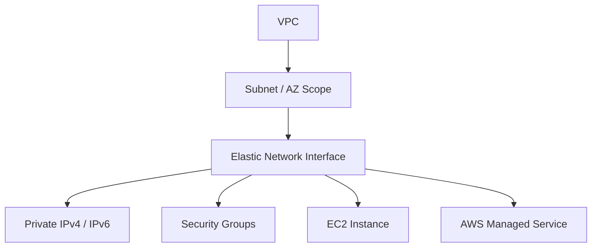

Yang penting:

```text
Security Group tidak benar-benar “menempel ke subnet”.
Security Group berlaku pada ENI/resource boundary.
```

```text
Private IP tidak benar-benar “milik instance” secara abstrak.
Ia hidup pada network interface.
```

```text
Subnet membership ENI menentukan di AZ dan CIDR subnet mana interface itu hidup.
```

Karena itu, saat membaca diagram AWS, jangan hanya menggambar EC2 di subnet. Gambar juga interface-nya secara mental.

---

## 2. Kenapa ENI Penting untuk Engineer Produksi

ENI sering tidak terlihat sampai terjadi masalah.

Contoh masalah nyata:

- EC2 tidak bisa menerima request padahal route table benar.
- NAT instance tidak forwarding traffic karena source/destination check belum dimatikan.
- PrivateLink endpoint gagal diakses karena endpoint ENI Security Group salah.
- Lambda in VPC membuat banyak ENI dan IP subnet habis.
- EKS pod tidak terjadwal karena warm IP / ENI capacity habis.
- RDS tidak bisa diakses karena SG di managed ENI tidak sesuai.
- Secondary private IP failover tidak bekerja karena OS belum dikonfigurasi.
- Appliance dual-homed salah route karena return path keluar interface berbeda.

Semua ini bukan sekadar “VPC issue”. Banyak berakhir di ENI.

Mental model yang benar:

```text
Connectivity problem = route + policy + interface + DNS + workload listener.
```

ENI adalah bagian “interface”.

---

## 3. Anatomy of an ENI

Sebuah ENI memiliki beberapa atribut kunci.

| Atribut | Fungsi | Dampak Produksi |
|---|---|---|
| Network interface ID | Identifier ENI | Digunakan untuk troubleshooting, Flow Logs, attachment, audit. |
| Subnet ID | Subnet tempat ENI dibuat | Menentukan AZ, route table association via subnet, CIDR pool. |
| Availability Zone | AZ ENI | ENI tidak bisa dipindahkan lintas AZ. |
| VPC ID | VPC pemilik | Menentukan isolation boundary dan DNS/security context. |
| MAC address | L2 identity virtual | Terlihat di OS, dipakai DHCP/client identity. |
| Primary private IPv4 | IP utama | Tetap pada ENI sepanjang lifecycle. |
| Secondary private IPv4 | IP tambahan | Bisa dipakai failover, multi-service binding, appliance. |
| IPv6 addresses | IPv6 interface addresses | Untuk dual-stack atau IPv6-native workloads. |
| Security Groups | Stateful allow policy | Kontrol ingress/egress di ENI/resource boundary. |
| Source/destination check | Anti-routing-appliance guardrail | Harus disabled untuk NAT/routing appliance. |
| Attachment | Hubungan ke EC2/service | Menunjukkan ENI attached ke resource apa. |
| Description/tags | Operability metadata | Penting untuk mencari ENI requester-managed/service-owned. |
| Requester-managed flag | Dibuat oleh AWS service | Tidak boleh dianggap disposable secara manual. |

ENI adalah objek VPC. EC2 hanya salah satu consumer-nya.

---

## 4. ENI Scope: Subnet dan Availability Zone

ENI dibuat di satu subnet.

Karena subnet selalu berada di satu Availability Zone, ENI juga secara efektif berada di satu AZ.

Konsekuensinya:

```text
ENI tidak bisa dipindahkan ke subnet lain setelah dibuat.
```

```text
Secondary ENI hanya bisa di-attach ke instance yang berada di AZ yang sama.
```

```text
ENI bukan primitive high availability lintas AZ.
```

Ini sering disalahpahami.

Jika Anda membuat static private IP failover dengan secondary ENI, failover-nya hanya realistis dalam AZ yang sama. Untuk multi-AZ HA, gunakan primitive lain:

- Load Balancer
- Route 53 failover
- Global Accelerator
- application-level replication
- database multi-AZ mechanism
- DNS/service discovery
- shared-nothing design

ENI failover bukan pengganti multi-AZ architecture.

---

## 5. Primary ENI vs Secondary ENI

EC2 instance memiliki primary network interface, biasanya `eth0`.

Primary ENI:

- dibuat saat instance launch
- tidak bisa dilepas selama instance hidup
- membawa primary private IP
- menjadi default management/data path jika tidak ada konfigurasi khusus

Secondary ENI:

- bisa dibuat terpisah
- bisa di-attach ke instance yang kompatibel dan berada di AZ yang sama
- bisa dilepas dan dipindah ke instance lain di AZ yang sama
- sering digunakan untuk failover, appliance, atau traffic separation

Model:

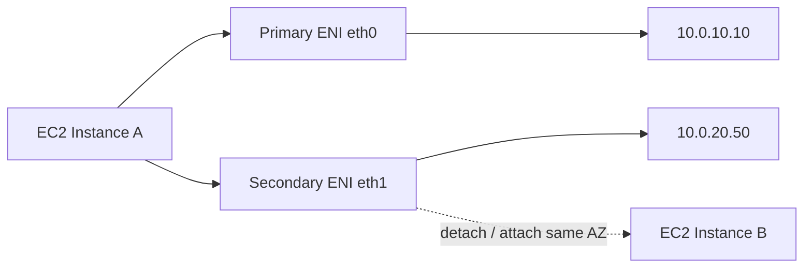

Gunakan secondary ENI hanya jika Anda butuh interface-level abstraction. Untuk sebagian besar aplikasi stateless, Load Balancer lebih tepat.

---

## 6. Private IP Address Ownership

Private IP di AWS sering dibaca sebagai “IP instance”. Lebih tepat:

```text
Private IP melekat pada network interface.
```

Pada EC2 sederhana, ini tampak sama karena instance hanya punya satu primary ENI.

Tetapi ketika ada secondary ENI atau secondary IP, perbedaannya penting.

Contoh:

```text
Instance A
  eth0 / eni-aaa
    primary private IP: 10.0.1.10
    secondary private IP: 10.0.1.11

Instance B
  eth0 / eni-bbb
    primary private IP: 10.0.1.20
```

Secondary private IP `10.0.1.11` dapat dipindah dari satu ENI ke ENI lain, tergantung operasi dan batasan. Ini bisa dipakai untuk active/passive failover di dalam subnet/AZ.

Namun ada jebakan:

```text
AWS control plane mungkin memindahkan IP, tetapi OS harus dikonfigurasi agar benar-benar bind/listen pada IP tersebut.
```

Cloud networking tidak menghapus kebutuhan OS networking.

---

## 7. Public IPv4 dan Elastic IP pada ENI

Public IPv4 address dan Elastic IP tidak mengganti private IP.

Internet Gateway melakukan NAT 1:1 antara public IPv4 dan private IPv4 pada resource yang sesuai.

Model sederhana:

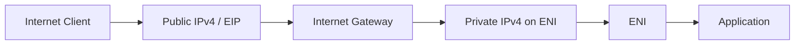

Konsekuensi:

- Aplikasi di EC2 biasanya melihat private IP sebagai local address.
- Security Group rule tetap diterapkan pada ENI.
- Route table tetap harus punya route ke Internet Gateway untuk public subnet behavior.
- Public IP/EIP association tidak membuat subnet otomatis public jika route tidak ada.

Public reachability selalu kombinasi:

```text
public address + IGW route + SG/NACL allow + workload listener
```

---

## 8. ENI dan Security Group

Security Group dievaluasi pada ENI/resource boundary.

Jika instance punya beberapa ENI, masing-masing ENI bisa memiliki Security Group berbeda.

Contoh appliance:

```text
eth0 management ENI
  SG: allow SSH only from admin CIDR

eth1 data ENI
  SG: allow app traffic from internal CIDR
```

Diagram:

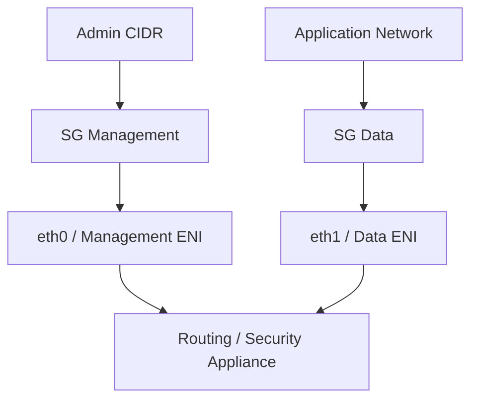

Ini kuat, tetapi menambah kompleksitas OS routing.

Jika policy butuh “traffic management dan data traffic dipisah”, multiple ENI masuk akal.

Jika hanya butuh allow rule sederhana, satu ENI + beberapa SG biasanya cukup.

---

## 9. ENI dan NACL

NACL tidak menempel pada ENI. NACL menempel pada subnet.

Tetapi karena ENI berada di subnet, traffic ke/dari ENI akan melewati NACL subnet.

Path konseptual inbound:

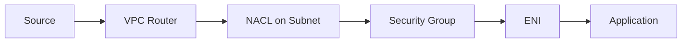

Dalam debugging, urutan berpikir praktis:

```text
1. Apakah packet punya route ke subnet/ENI?
2. Apakah subnet NACL allow inbound dan return path?
3. Apakah Security Group allow?
4. Apakah OS firewall/listener allow?
5. Apakah response keluar lewat path yang benar?
```

ENI menjadi anchor untuk mengecek SG dan Flow Logs.

---

## 10. Source/Destination Check

Secara default, EC2 instance di AWS diasumsikan bukan router.

AWS melakukan source/destination check untuk memastikan instance hanya menerima traffic yang source atau destination-nya adalah instance itu sendiri.

Untuk workload biasa, ini guardrail bagus.

Untuk routing appliance, NAT instance, firewall, proxy transparan, atau router virtual, ini harus dimatikan.

Contoh NAT instance:

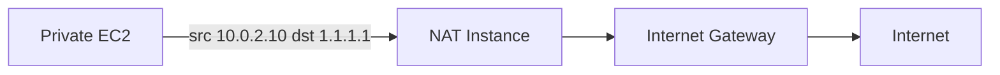

NAT instance menerima packet yang destination aslinya bukan NAT instance. Jadi source/destination check dapat menjatuhkan traffic jika tidak disabled.

Rule praktis:

```text
Jika instance harus forward traffic untuk resource lain, evaluasi source/destination check.
```

Jangan disable source/destination check pada semua instance. Itu menghapus guardrail tanpa alasan.

---

## 11. Requester-Managed ENI

Banyak layanan AWS membuat ENI di VPC Anda.

Contoh umum:

- Interface VPC Endpoint
- NAT Gateway
- Load Balancer node
- RDS/Aurora network interface
- Lambda configured in VPC
- EFS mount target
- Directory Service
- EKS-related networking
- VPC Lattice / service networking components
- AWS Network Firewall endpoint
- Gateway Load Balancer endpoint

Beberapa ENI ini disebut requester-managed.

Artinya:

```text
ENI dibuat dan dikelola oleh service, bukan oleh Anda secara langsung.
```

Jangan langsung menghapus ENI yang terlihat “misterius”. Cek:

```bash
aws ec2 describe-network-interfaces \
  --filters Name=vpc-id,Values=vpc-xxxx \
  --query 'NetworkInterfaces[*].{Id:NetworkInterfaceId,Status:Status,Description:Description,RequesterManaged:RequesterManaged,Type:InterfaceType,Subnet:SubnetId,Groups:Groups[*].GroupId}'
```

Requester-managed ENI sering menjadi clue bahwa ada service dependency tersembunyi.

---

## 12. Service-Managed ENI sebagai Hidden Capacity Consumer

ENI bukan hanya masalah connectivity. ENI juga masalah capacity.

Subnet punya jumlah IP terbatas.

Setiap ENI mengonsumsi private IP.

Jika banyak managed service membuat ENI di subnet kecil, subnet bisa kehabisan IP walaupun EC2 sedikit.

Contoh:

```text
Subnet /28
  total IPv4: 16
  AWS reserved: 5
  usable: 11

Resources:
  2 NAT/LB/service ENIs
  4 interface endpoints across services
  Lambda/EKS/RDS ENIs

Sisa IP cepat habis.
```

Anti-pattern:

```text
Membuat subnet kecil untuk “isolated endpoint subnet” tanpa menghitung jumlah interface endpoint per AZ.
```

Aturan produksi:

```text
Setiap subnet design harus menghitung ENI/IP consumer, bukan hanya EC2 instance count.
```

---

## 13. ENI dan Flow Logs

VPC Flow Logs bisa dibuat di level VPC, subnet, atau ENI.

Untuk troubleshooting presisi, ENI-level Flow Logs sangat berguna.

Contoh skenario:

```text
Aplikasi tidak bisa connect ke database.
```

Pertanyaan:

- Apakah packet sampai ENI database?
- Apakah ditolak oleh SG/NACL?
- Apakah response keluar?
- Apakah traffic menuju IP yang benar?

Flow Log di ENI database dapat menunjukkan `ACCEPT` atau `REJECT` untuk tuple tertentu.

Contoh field konseptual:

```text
srcaddr=10.0.10.25
dstaddr=10.0.30.10
srcport=52144
dstport=5432
action=REJECT
```

Jika `REJECT`, cek SG/NACL.

Jika tidak ada record sama sekali, kemungkinan:

- DNS resolve ke IP lain
- route tidak sampai subnet
- traffic tidak pernah dikirim aplikasi
- Flow Log tidak mencakup interface yang benar
- sampling/aggregation delay

ENI ID adalah anchor penting dalam observability.

---

## 14. ENI dan OS Networking

AWS control plane mengatur ENI, IP, attachment, dan policy. Tetapi guest OS masih harus mengerti interface.

Pada Linux, Anda akan melihat interface seperti:

```bash
ip addr
ip route
ip rule
ethtool -i eth0
```

Untuk multi-ENI, OS routing menjadi sangat penting.

Contoh masalah:

```text
Request masuk lewat eth1.
Response keluar lewat default route eth0.
```

Hasilnya bisa terlihat seperti:

- connection timeout
- asymmetric routing
- SG/NACL tampak benar tapi traffic tetap gagal
- appliance tidak bekerja konsisten

Untuk multi-homed instance, pertimbangkan:

- policy-based routing
- per-interface route table OS
- source-based routing
- rp_filter behavior di Linux
- application binding ke specific IP
- health check pada interface yang benar

Cloud tidak otomatis menyelesaikan semua masalah multi-homing.

---

## 15. Multi-ENI Pattern: Management dan Data Plane Separation

Pattern klasik:

```text
eth0: management interface
eth1: data-plane interface
```

Digunakan untuk:

- firewall appliance
- IDS/IPS
- proxy
- NAT instance
- packet processor
- service appliance yang butuh traffic isolation

Design:

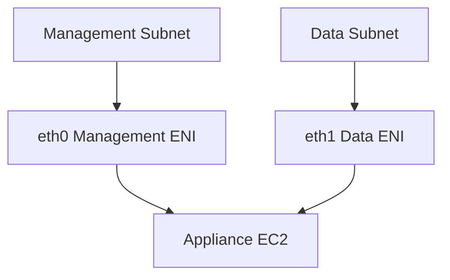

Kelebihan:

- security policy lebih eksplisit
- blast radius lebih jelas
- audit management access lebih mudah
- data traffic tidak bercampur dengan admin traffic

Kekurangan:

- OS route lebih sulit
- failover lebih sulit
- instance type ENI limits harus diperhatikan
- AZ/subnet coupling kuat
- troubleshooting lebih kompleks

Gunakan hanya jika ada kebutuhan nyata.

---

## 16. Secondary Private IP Pattern

Secondary private IP berguna ketika Anda ingin satu ENI memiliki beberapa IP.

Use case:

- beberapa service listen di IP berbeda pada instance sama
- active/passive failover dalam subnet
- virtual appliance yang butuh floating IP
- legacy software license binding
- migration dari on-prem model

Model:

```text
eni-123
  primary:   10.0.1.10
  secondary: 10.0.1.11
  secondary: 10.0.1.12
```

Tetapi ada batasan penting:

```text
AWS assign IP ke ENI; OS harus mengonfigurasi IP itu agar aplikasi bisa bind/listen.
```

Contoh Linux konseptual:

```bash
sudo ip addr add 10.0.1.11/24 dev eth0
sudo ip addr show dev eth0
```

Dalam produksi, jangan mengandalkan command manual. Gunakan:

- cloud-init
- systemd-networkd
- NetworkManager profile
- userdata bootstrap
- automation agent
- health-check-driven failover script

---

## 17. Static Private IP Failover dengan Secondary IP

Pattern ini kadang dipakai untuk active/passive appliance.

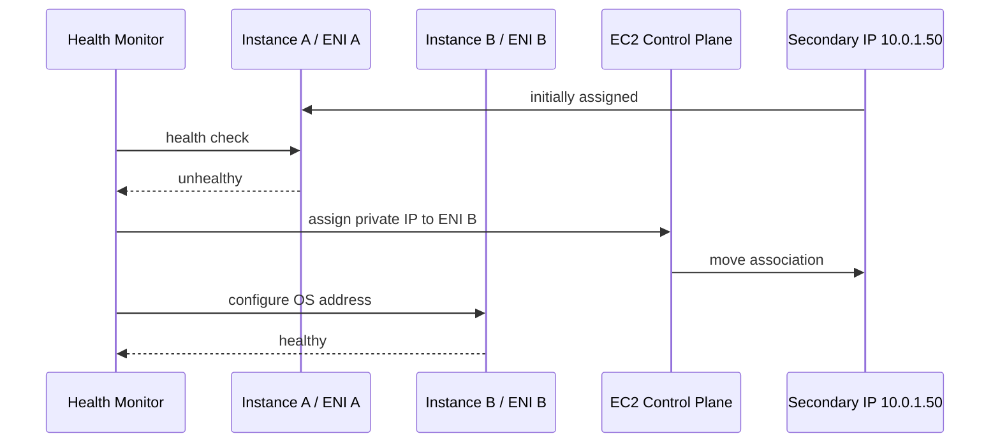

Kritik desain:

- bergantung pada EC2 control plane saat failover
- failover biasanya intra-AZ/subnet
- OS reconfiguration harus reliable
- ARP/cache behavior tidak sama dengan on-prem L2 failover, walaupun AWS mengabstraksi L2
- aplikasi harus siap menerima traffic di IP baru

Untuk aplikasi user-facing, Load Balancer biasanya lebih resilient.

Gunakan floating private IP pattern untuk appliance/internal case yang memang membutuhkannya.

---

## 18. ENI dan Load Balancer

Load Balancer adalah managed entry point. Di baliknya, AWS juga memakai network interfaces di subnet Anda.

Konsekuensi praktis:

- Load Balancer membutuhkan subnet dan IP capacity.
- Security Group pada ALB berlaku di LB boundary.
- Target instance/container memiliki ENI atau IP target sendiri.
- NLB behavior berbeda dari ALB, terutama source IP preservation dan security control path.

Model ALB:

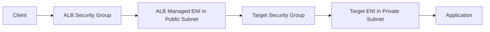

Rule bagus:

```text
Target SG allow dari ALB SG, bukan dari 0.0.0.0/0.
```

Di sini SG referencing bekerja karena policy diekspresikan pada ENI/resource identity, bukan sekadar CIDR.

---

## 19. ENI dan Interface VPC Endpoint

Interface VPC Endpoint membuat ENI di subnet yang Anda pilih.

Setiap endpoint ENI memiliki private IP dan Security Group.

Pattern:

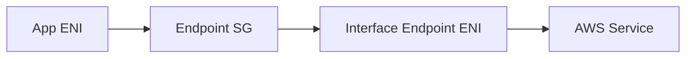

Implikasi:

- Endpoint subnet harus punya IP cukup.
- Endpoint SG harus allow traffic dari consumer.
- Private DNS menentukan apakah hostname service resolve ke endpoint IP.
- Flow Logs endpoint ENI bisa membantu debugging.

Kesalahan umum:

```text
Membuat endpoint tetapi lupa endpoint SG hanya allow default SG tertentu.
```

Hasilnya DNS benar, route benar, tapi TCP timeout.

---

## 20. ENI dan Lambda in VPC

Lambda yang dikonfigurasi masuk VPC membutuhkan network connectivity ke subnet dan Security Group yang dipilih.

Secara praktis, ini berarti Lambda punya path melalui service-managed networking yang menggunakan VPC networking primitives.

Hal yang perlu diperhatikan:

- subnet IP capacity
- outbound route dari subnet Lambda
- SG egress Lambda
- target SG inbound dari Lambda SG
- DNS resolution
- cold start/network initialization behavior historis dan service improvements
- access ke AWS services via NAT atau VPC endpoint

Anti-pattern:

```text
Menaruh Lambda in VPC hanya untuk memanggil public AWS API, lalu membayar NAT dan menambah failure path.
```

Lebih baik:

```text
Gunakan VPC endpoint untuk AWS services yang didukung jika workload harus tetap private.
```

---

## 21. ENI dan ECS/EKS Secara Ringkas

Detail ECS/EKS akan dibahas terpisah. Di sini cukup mental model.

ECS `awsvpc` networking memberi task network interface-like identity di VPC.

EKS dengan VPC CNI memakai VPC IP addressing untuk pod networking.

Dampaknya:

```text
Container scheduling bisa dibatasi oleh IP/ENI capacity, bukan CPU/memory saja.
```

Jika engineer hanya melihat node capacity, ia bisa bingung ketika pod tidak bisa dijadwalkan padahal CPU masih kosong.

Di AWS, network identity container sering turun ke ENI/IP primitive.

---

## 22. ENI Limits dan Instance Type

Setiap instance type memiliki batas jumlah ENI dan jumlah IP per ENI.

Ini memengaruhi:

- high-density container workloads
- multi-homed appliances
- secondary IP pattern
- packet processing nodes
- EKS pod density
- service consolidation

Aturan desain:

```text
Jangan pilih instance type hanya dari CPU/memory.
Untuk network-heavy workload, cek ENI/IP/bandwidth/PPS limits.
```

Contoh failure:

```text
EKS node masih punya CPU 40%, memory 50%, tetapi tidak bisa menerima pod baru karena ENI/IP capacity habis.
```

Capacity planning network adalah bagian dari compute planning.

---

## 23. ENI State dan Lifecycle

ENI biasanya berada pada state seperti:

- `available`
- `in-use`

Lifecycle sederhana:

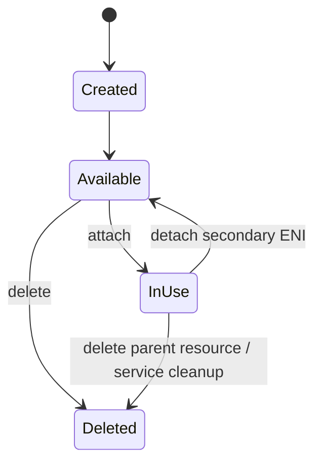

Dalam operasi, perhatikan:

```text
ENI available yang tidak digunakan bisa menjadi orphan resource.
```

Tetapi jangan hapus sembarang.

Cek dulu:

- description
- requester-managed
- tags
- attachment history
- related service
- CloudTrail event

---

## 24. Debugging: Instance Tidak Bisa Diakses

Skenario:

```text
EC2 private subnet tidak bisa di-SSH dari bastion.
```

Checklist berbasis ENI:

```bash
# 1. Cari ENI instance
aws ec2 describe-instances \
  --instance-ids i-xxxx \
  --query 'Reservations[*].Instances[*].NetworkInterfaces[*].{Eni:NetworkInterfaceId,Subnet:SubnetId,PrivateIp:PrivateIpAddress,Groups:Groups[*].GroupId,Status:Status}'

# 2. Detail ENI
aws ec2 describe-network-interfaces \
  --network-interface-ids eni-xxxx

# 3. Cek route table subnet target
aws ec2 describe-route-tables \
  --filters Name=association.subnet-id,Values=subnet-xxxx

# 4. Cek SG rules
aws ec2 describe-security-groups \
  --group-ids sg-xxxx

# 5. Cek NACL subnet
aws ec2 describe-network-acls \
  --filters Name=association.subnet-id,Values=subnet-xxxx
```

Interpretasi:

| Gejala | Dugaan |
|---|---|
| ENI tidak ada / wrong subnet | instance salah deploy atau resource lifecycle issue |
| SG tidak allow source | policy ENI salah |
| NACL reject ephemeral return | stateless subnet issue |
| Route missing | subnet route table issue |
| Flow Log REJECT | SG/NACL drop |
| Flow Log tidak ada | packet tidak sampai ENI atau log scope salah |
| TCP SYN sampai, app no response | OS firewall/listener/app issue |

---

## 25. Debugging: Interface Endpoint Timeout

Skenario:

```text
Private EC2 mencoba akses service AWS via interface endpoint, tetapi timeout.
```

Path:

```text
App ENI -> subnet route/local -> Endpoint ENI -> AWS service
```

Checklist:

1. Apakah DNS resolve ke private IP endpoint?
2. Apakah endpoint ENI ada di AZ/subnet yang diharapkan?
3. Apakah endpoint SG allow inbound dari app SG/CIDR?
4. Apakah app SG allow outbound ke endpoint?
5. Apakah NACL allow both directions?
6. Apakah endpoint policy/resource policy allow?
7. Apakah service endpoint mendukung region/action yang dipakai?

Command:

```bash
aws ec2 describe-vpc-endpoints \
  --vpc-endpoint-ids vpce-xxxx \
  --query 'VpcEndpoints[*].{DnsEntries:DnsEntries,NetworkInterfaceIds:NetworkInterfaceIds,PolicyDocument:PolicyDocument}'

aws ec2 describe-network-interfaces \
  --network-interface-ids eni-endpointxxxx
```

Endpoint connectivity sering gagal bukan karena route table, tetapi karena endpoint ENI Security Group.

---

## 26. Debugging: Asymmetric Multi-ENI Path

Skenario:

```text
Request masuk eth1, response keluar eth0.
```

Diagnosa di instance:

```bash
ip addr
ip route
ip rule
ss -lntup
sudo tcpdump -ni eth1 host <client-ip>
sudo tcpdump -ni eth0 host <client-ip>
```

Jika SYN masuk eth1 tapi SYN-ACK keluar eth0, Anda punya routing problem di OS.

Solusi biasanya bukan di AWS route table, melainkan:

- source-based routing
- policy routing
- app binding ke interface/IP tertentu
- default route review
- rp_filter tuning

AWS VPC membawa packet ke ENI. Setelah masuk guest OS, OS tetap harus benar.

---

## 27. IaC Example: Explicit ENI untuk Appliance

Terraform konseptual:

```hcl
resource "aws_network_interface" "mgmt" {
  subnet_id       = aws_subnet.management_a.id
  private_ips     = ["10.0.10.10"]
  security_groups = [aws_security_group.appliance_mgmt.id]

  tags = {
    Name = "fw-a-mgmt-eni"
    Role = "management"
  }
}

resource "aws_network_interface" "data" {
  subnet_id         = aws_subnet.data_a.id
  private_ips       = ["10.0.20.10"]
  source_dest_check = false
  security_groups   = [aws_security_group.appliance_data.id]

  tags = {
    Name = "fw-a-data-eni"
    Role = "data-plane"
  }
}

resource "aws_instance" "appliance" {
  ami           = var.appliance_ami
  instance_type = "c7i.large"

  network_interface {
    network_interface_id = aws_network_interface.mgmt.id
    device_index         = 0
  }

  network_interface {
    network_interface_id = aws_network_interface.data.id
    device_index         = 1
  }
}
```

Catatan:

- source/destination check dimatikan hanya pada interface/data path yang melakukan forwarding.
- OS route harus dikonfigurasi.
- Health check harus memverifikasi fungsi forwarding, bukan hanya instance alive.

---

## 28. Anti-Patterns

### Anti-pattern 1 — Menganggap IP Milik Instance, Bukan ENI

Akibat:

- salah debug secondary IP
- salah rancang failover
- salah memahami EIP association

Model benar:

```text
IP lives on interface.
Instance consumes interface.
```

### Anti-pattern 2 — Menghapus Requester-Managed ENI

Akibat:

- endpoint rusak
- managed service error
- resource stuck deleting
- outage tidak jelas

Cek description dan requester-managed flag.

### Anti-pattern 3 — Multi-ENI Tanpa OS Routing Design

Akibat:

- asymmetric routing
- intermittent failure
- traffic leak antar plane
- debugging sulit

Multiple ENI adalah desain advanced, bukan default.

### Anti-pattern 4 — Subnet Kecil untuk Banyak Managed ENI

Akibat:

- endpoint gagal dibuat
- Lambda/EKS capacity habis
- deployment gagal di production

Hitung IP consumer.

### Anti-pattern 5 — Disable Source/Dest Check Global

Akibat:

- guardrail hilang
- routing behavior sulit diaudit
- potensi abuse path lebih besar

Disable hanya pada routing appliance yang memerlukan.

---

## 29. ENI Design Checklist

Untuk setiap ENI penting, tanyakan:

```text
1. ENI ini ada di subnet dan AZ mana?
2. Siapa pemilik ENI: user-created atau requester-managed?
3. IP apa saja yang melekat?
4. SG apa yang menempel?
5. Apakah ENI butuh public IP/EIP?
6. Apakah source/destination check harus default atau disabled?
7. Apakah subnet punya IP capacity cukup?
8. Apakah route table subnet sesuai intent?
9. Apakah NACL allow return path?
10. Apakah Flow Logs mencakup ENI ini?
11. Apakah OS mengenali IP/interface yang dikonfigurasi?
12. Apakah ENI lifecycle dikelola IaC?
```

---

## 30. Production Lab: ENI-Level Debugging

Tujuan lab:

```text
Membuktikan bahwa private IP, Security Group, dan Flow Logs dapat dianalisis dari ENI.
```

Setup:

- VPC dengan 2 subnet private di AZ yang sama
- EC2 A sebagai client
- EC2 B sebagai server
- enable VPC Flow Logs ke CloudWatch Logs/S3

Langkah:

1. Ambil ENI EC2 B.
2. Buka port 8080 hanya dari SG EC2 A.
3. Jalankan simple HTTP server di EC2 B.
4. Test dari EC2 A.
5. Hapus inbound rule SG EC2 B.
6. Test lagi.
7. Baca Flow Logs untuk ENI EC2 B.
8. Bedakan kondisi `ACCEPT`, `REJECT`, dan “no record”.

Command sample di server:

```bash
python3 -m http.server 8080
```

Command sample di client:

```bash
curl -v http://10.0.20.10:8080/
```

Query konseptual CloudWatch Logs Insights:

```sql
fields @timestamp, interfaceId, srcAddr, dstAddr, srcPort, dstPort, action
| filter interfaceId = "eni-xxxxxxxx"
| filter dstPort = 8080 or srcPort = 8080
| sort @timestamp desc
| limit 50
```

Expected learning:

```text
Connectivity bukan binary “VPC bisa/tidak”.
Anda harus bisa menunjuk interface tempat packet diterima/ditolak.
```

---

## 31. Mental Compression

Simpan model ini:

```text
VPC = isolated network boundary.
Subnet = AZ-scoped IP range + route table association.
Route table = next-hop decision.
ENI = concrete network attachment point.
Security Group = stateful policy on ENI/resource boundary.
NACL = stateless subnet guardrail.
```

Jika terjadi network failure, jangan mulai dari dashboard service. Mulai dari packet:

```text
source ENI -> source SG/NACL -> route -> destination subnet -> destination NACL/SG -> destination ENI -> OS/app
```

ENI membuat debugging menjadi konkret.

---

## 32. Ringkasan

ENI adalah primitive utama yang sering tersembunyi.

Yang harus dikuasai:

- ENI berada di satu subnet/AZ.
- Primary ENI tidak sama dengan secondary ENI.
- Private IP hidup di ENI.
- Security Group berlaku di ENI/resource boundary.
- Source/destination check penting untuk routing appliance.
- Banyak AWS managed services membuat ENI di VPC Anda.
- ENI mengonsumsi IP capacity subnet.
- Multi-ENI berarti OS routing menjadi bagian desain.
- Flow Logs ENI adalah alat debugging presisi.

Setelah memahami ENI, VPC tidak lagi terlihat sebagai diagram kotak. Ia terlihat sebagai kumpulan interface, route, policy, dan packet path yang bisa diuji.

Di part berikutnya, kita masuk ke DHCP, DNS, dan Resolver: mekanisme yang membuat instance tahu siapa DNS server-nya, bagaimana private hostname bekerja, dan kenapa banyak outage AWS sebenarnya adalah DNS path issue, bukan network path issue.
