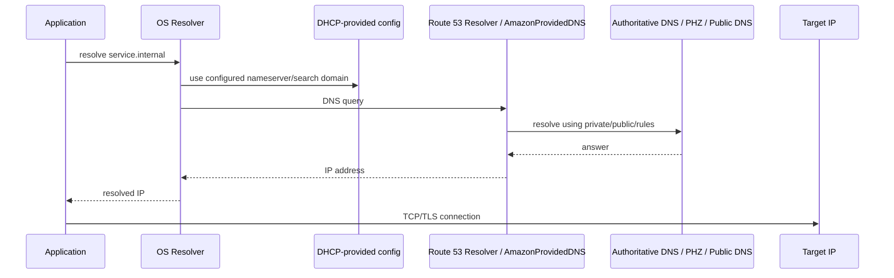
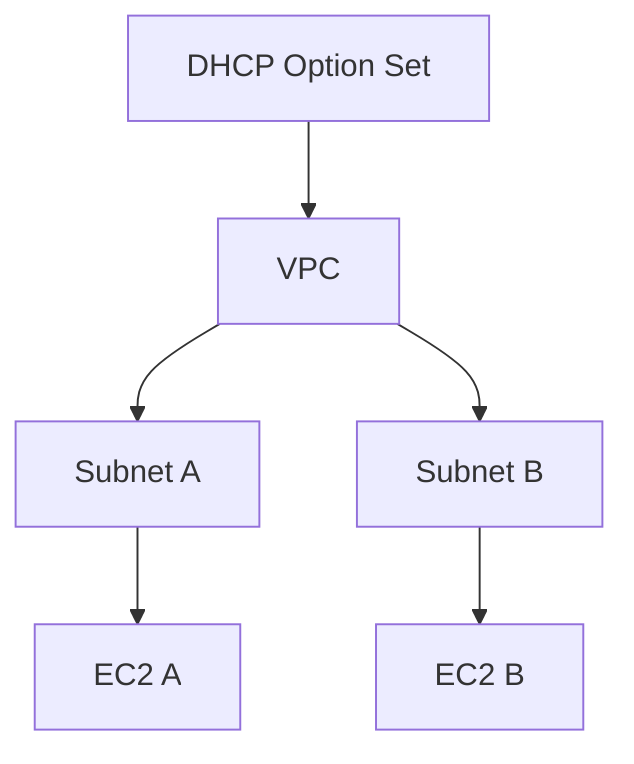
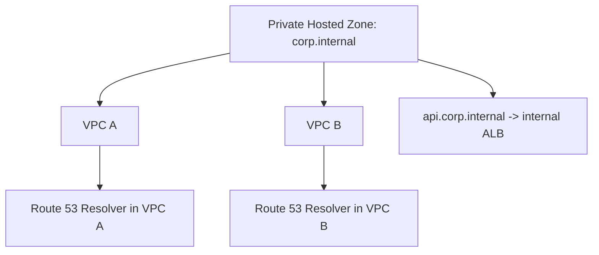
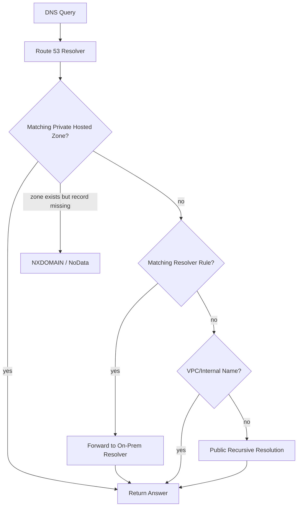
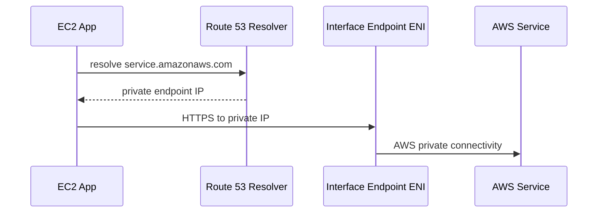
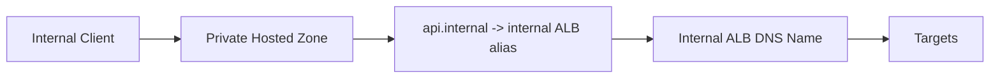
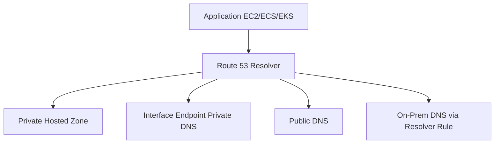

# Part 016 — VPC DHCP, DNS, and Resolver Basics

Banyak engineer menganggap DNS sebagai lapisan “di luar networking”. Itu kesalahan besar.

Dalam sistem produksi, DNS adalah bagian dari data path.

Request yang gagal sering terlihat seperti:

```text
connection timeout
TLS handshake error
service unavailable
endpoint unreachable
```

Tetapi root cause-nya bisa saja:

```text
hostname resolve ke IP yang salah
private hosted zone tidak associated
DHCP option set salah
AmazonProvidedDNS tidak digunakan
Resolver rule mengirim query ke on-prem yang unreachable
TTL membuat failover lambat
DNS query rate limit tercapai
```

Part ini membahas fondasi DHCP, DNS attributes, hostnames, AmazonProvidedDNS, dan Route 53 Resolver di VPC.

Kita belum masuk deep hybrid DNS; itu nanti di Part 038. Di sini tujuannya adalah membuat Anda bisa menjawab pertanyaan dasar:

```text
Ketika EC2 di VPC menjalankan `curl https://service.internal`, siapa yang menjawab DNS query, lewat path apa, dan kenapa hasilnya seperti itu?
```

---

## 1. Mental Model: DNS adalah Dependency Sebelum Network Connection

Sebelum TCP connection terbentuk, aplikasi biasanya melakukan DNS resolution.

Path konseptual:



Jika DNS salah, packet berikutnya bisa menuju tempat yang salah atau tidak pernah dikirim.

Jadi debugging connectivity harus memisahkan dua fase:

```text
1. Name resolution: hostname -> IP
2. Network connection: IP:port -> reachable service
```

Jangan mencampur keduanya.

---

## 2. DHCP di VPC: Bagaimana Instance Mendapat Network Configuration

DHCP adalah mekanisme yang memberi network configuration ke resource seperti EC2.

Di VPC, DHCP option set dapat mengatur hal seperti:

- domain name servers
- domain name
- NTP servers
- NetBIOS-related options untuk environment tertentu

Untuk sebagian besar workload Linux modern, yang paling sering penting adalah:

```text
domain-name-servers
domain-name
```

Default-nya biasanya menggunakan Amazon-provided DNS.

Secara praktis, instance akan memiliki resolver config seperti:

```bash
cat /etc/resolv.conf
```

Contoh konseptual:

```text
nameserver 10.0.0.2
search ap-southeast-1.compute.internal
```

atau pada Nitro/IPv6-aware environment, Anda dapat melihat resolver address yang berbeda seperti link-local resolver address.

Yang penting bukan menghafal satu file, karena distro dan systemd-resolved bisa berbeda. Yang penting adalah paham:

```text
OS resolver memakai DNS server yang diberikan oleh DHCP/VPC configuration.
```

---

## 3. DHCP Option Set adalah VPC-Level Configuration

DHCP option set diasosiasikan ke VPC.

Satu VPC hanya menggunakan satu DHCP option set pada satu waktu.

Satu DHCP option set dapat dipakai oleh beberapa VPC.

Jika ingin mengubah option, biasanya Anda membuat DHCP option set baru lalu mengasosiasikannya ke VPC.

Model:



Konsekuensi:

```text
DHCP option set bukan per subnet.
```

Jika Anda butuh DNS behavior berbeda per workload, jangan langsung mengubah DHCP option set global. Pertimbangkan:

- per-application resolver config
- private hosted zone association
- Route 53 Resolver rules
- split VPC
- endpoint-specific DNS
- service mesh/application config

Mengubah DHCP option set untuk seluruh VPC bisa berdampak luas.

---

## 4. AmazonProvidedDNS dan Route 53 Resolver

AmazonProvidedDNS adalah nama konfigurasi yang mengarah ke resolver DNS bawaan VPC.

Dalam dokumentasi modern, resolver ini biasanya dibahas sebagai Amazon Route 53 Resolver untuk VPC.

Resolver ini dapat menjawab query untuk:

- public DNS records
- private DNS names untuk resource di VPC
- Route 53 private hosted zones yang associated dengan VPC
- DNS forwarding rules jika menggunakan Resolver rules
- beberapa nama internal AWS/VPC-specific

Alamat resolver sering muncul sebagai:

```text
VPC base address + 2
```

Contoh:

```text
VPC CIDR: 10.0.0.0/16
Resolver: 10.0.0.2
```

Ada juga resolver address link-local seperti:

```text
169.254.169.253
```

Untuk IPv6/Nitro environment, ada juga IPv6 resolver address khusus.

Jangan hard-code terlalu agresif kecuali Anda paham runtime-nya. Pakai konfigurasi OS/DHCP yang benar.

---

## 5. Resolver Bukan “Internet DNS Biasa”

Route 53 Resolver dalam VPC bukan hanya forwarder ke internet.

Ia punya konteks VPC.

Ia tahu:

- private hosted zones associated dengan VPC
- VPC-specific hostnames
- Resolver rules
- Amazon-provided internal names

Karena itu hasil query dari dalam VPC bisa berbeda dari laptop Anda.

Contoh:

```bash
# dari laptop publik
nslookup api.example.com
# hasil: public IP / CloudFront / public ALB

# dari EC2 dalam VPC
nslookup api.example.com
# hasil: private IP / internal ALB / VPC endpoint, tergantung DNS design
```

Ini disebut split-horizon DNS ketika nama yang sama memberikan jawaban berbeda berdasarkan lokasi resolver/query context.

---

## 6. DNS Attributes pada VPC

Ada dua atribut VPC yang sering muncul:

```text
enableDnsSupport
enableDnsHostnames
```

Secara mental:

| Attribute | Makna Praktis |
|---|---|
| `enableDnsSupport` | Apakah Amazon-provided DNS resolution didukung untuk VPC. |
| `enableDnsHostnames` | Apakah instance yang memenuhi syarat mendapat DNS hostnames. |

Untuk environment umum, keduanya sering diaktifkan.

Tetapi jangan menganggap otomatis benar di semua VPC, terutama VPC custom lama atau VPC yang dibuat manual/script berbeda.

Check:

```bash
aws ec2 describe-vpc-attribute \
  --vpc-id vpc-xxxx \
  --attribute enableDnsSupport

aws ec2 describe-vpc-attribute \
  --vpc-id vpc-xxxx \
  --attribute enableDnsHostnames
```

Mengubah:

```bash
aws ec2 modify-vpc-attribute \
  --vpc-id vpc-xxxx \
  --enable-dns-support '{"Value":true}'

aws ec2 modify-vpc-attribute \
  --vpc-id vpc-xxxx \
  --enable-dns-hostnames '{"Value":true}'
```

Jangan ubah tanpa memahami workload dependency.

---

## 7. Private DNS Hostnames untuk EC2

EC2 instance dalam VPC dapat memiliki private DNS hostname.

Contoh konseptual:

```text
ip-10-0-12-34.ap-southeast-1.compute.internal
```

Hostname ini resolve ke private IPv4 instance di dalam VPC/context yang sesuai.

Ini berguna untuk:

- internal debugging
- service bootstrap sederhana
- inventory
- temporary references

Tetapi jangan membangun production service discovery serius di atas hostname EC2 ephemeral kecuali Anda sengaja merancang lifecycle-nya.

Lebih baik gunakan:

- Route 53 private hosted zone
- Cloud Map
- Load Balancer DNS name
- VPC Lattice service name
- service registry internal

EC2 hostname adalah identity instance, bukan identity service.

---

## 8. Public DNS Hostname dan Public IP

Jika instance memiliki public IPv4 dan VPC/subnet setting mendukung, instance dapat memiliki public DNS hostname.

Tetapi public DNS hostname bukan berarti service aman atau siap produksi.

Untuk production ingress, gunakan:

- ALB/NLB
- CloudFront
- Global Accelerator
- Route 53 custom domain
- WAF/Shield jika relevan

Public DNS hostname instance lebih cocok untuk eksperimen, bootstrap, atau debugging sementara.

Anti-pattern:

```text
Memberikan user production URL langsung ke public DNS hostname EC2.
```

Masalah:

- instance replacement mengubah endpoint
- TLS/certificate buruk
- no layer-7 routing
- no managed health check/load balancing
- security boundary terlalu rendah level

---

## 9. Private Hosted Zone Basics

Route 53 Private Hosted Zone atau PHZ memungkinkan Anda membuat DNS zone yang hanya terlihat dari VPC yang diasosiasikan.

Contoh:

```text
corp.internal
service-a.corp.internal -> internal ALB
postgres.corp.internal -> RDS endpoint / CNAME
```

Model:



Jika VPC tidak associated ke PHZ, query dari VPC tersebut tidak akan melihat record private itu.

Jangan lupa:

```text
DNS visibility adalah association problem, bukan route table problem.
```

---

## 10. Split-Horizon DNS

Split-horizon DNS terjadi ketika nama yang sama punya jawaban berbeda tergantung dari mana query dilakukan.

Contoh:

```text
api.example.com
  public internet -> CloudFront distribution
  internal VPC     -> internal ALB
```

Kelebihan:

- nama konsisten untuk client
- internal traffic tetap private
- migration lebih halus
- hybrid environment lebih fleksibel

Risiko:

- debugging membingungkan
- cache berbeda antar resolver
- certificate/SAN harus cocok
- traffic bisa menuju target berbeda tanpa terlihat dari application config
- private zone yang shadow public zone bisa memutus record tertentu jika tidak lengkap

Aturan penting:

```text
Jika membuat private hosted zone dengan nama sama seperti public zone, pastikan semua record yang dibutuhkan internal client tersedia atau resolvable dengan benar.
```

---

## 11. Resolver Decision Path

Simplifikasi path Route 53 Resolver:



Detail precedence bisa lebih kompleks tergantung konfigurasi, tetapi model ini cukup untuk debugging awal.

Pertanyaan pertama selalu:

```text
Query ini seharusnya dijawab oleh private zone, resolver rule, internal AWS name, atau public DNS?
```

---

## 12. DNS untuk Interface VPC Endpoint

Interface endpoint sering menggunakan Private DNS.

Jika Private DNS aktif, nama public service AWS dapat resolve ke private endpoint IP dari dalam VPC.

Contoh konseptual:

```text
secretsmanager.ap-southeast-1.amazonaws.com
  outside VPC -> public AWS endpoint IP
  inside VPC with endpoint private DNS -> private IP endpoint ENI
```

Path:



Jika DNS resolve masih ke public IP, kemungkinan:

- Private DNS endpoint tidak aktif
- VPC tidak memenuhi syarat endpoint DNS
- query menggunakan regional/dualstack/FIPS hostname yang berbeda
- custom DNS server tidak meneruskan query dengan benar
- resolver path tidak menggunakan AmazonProvidedDNS

VPC endpoint debugging sering dimulai dari `dig`, bukan dari route table.

---

## 13. Custom DNS Server di VPC

Anda bisa menggunakan DNS server sendiri melalui DHCP option set.

Contoh:

- Active Directory DNS
- Infoblox
- BIND resolver internal
- appliance DNS/security resolver
- hybrid corporate DNS

Tetapi hati-hati:

```text
Jika instance tidak bertanya ke Route 53 Resolver, ia mungkin tidak otomatis tahu private hosted zone, endpoint private DNS, atau VPC-specific records.
```

Solusi biasanya:

- custom DNS forward query tertentu ke Route 53 Resolver
- Route 53 Resolver inbound/outbound endpoints
- conditional forwarding
- avoid overriding DNS globally kecuali perlu

Ini akan dibahas lebih dalam di hybrid DNS part.

Untuk sekarang, pahami trade-off:

| Pilihan | Kelebihan | Risiko |
|---|---|---|
| AmazonProvidedDNS | Integrasi VPC native | Butuh forwarding untuk on-prem private domains |
| Custom DNS via DHCP | Integrasi corporate DNS | Bisa kehilangan VPC-native resolution jika forwarding salah |
| Per-app resolver config | Granular | Operasional lebih kompleks |

---

## 14. DHCP Change Propagation

Mengasosiasikan DHCP option set baru tidak selalu berarti semua instance langsung memakai config baru detik itu juga.

Instance biasanya mengambil update saat DHCP lease renew, atau ketika network service/OS resolver direstart/renew manual.

Dalam operasi produksi, jangan mengubah DNS server VPC lalu langsung berasumsi semua workload memakai konfigurasi baru.

Plan perubahan:

```text
1. Buat DHCP option set baru.
2. Uji di VPC/subnet/test instance terpisah jika memungkinkan.
3. Associate ke VPC target pada window aman.
4. Verifikasi dari beberapa instance/distro.
5. Renew DHCP atau restart network service jika perlu.
6. Monitor DNS error, resolver logs, app error rate.
```

Command Linux bervariasi:

```bash
# tergantung distro/network manager
sudo dhclient -r && sudo dhclient
sudo systemctl restart systemd-resolved
sudo resolvectl status
nmcli dev show
```

Jangan copy-paste tanpa paham OS yang dipakai.

---

## 15. Resolver Query Rate dan Local Caching

DNS terlihat kecil, tetapi bisa menjadi bottleneck.

Setiap query DNS adalah request ke resolver.

Aplikasi dengan pola buruk dapat membuat query berlebihan:

- resolve hostname setiap request
- tidak reuse connection
- TTL diabaikan
- no local cache
- high-cardinality generated hostnames
- service discovery polling agresif

Mitigasi:

- connection pooling
- respect DNS TTL
- local caching resolver jika sesuai
- JVM DNS cache tuning dengan hati-hati
- reduce per-request lookup
- instrument DNS latency/error

Untuk Java, hati-hati dengan DNS caching behavior JVM dan security property seperti:

```text
networkaddress.cache.ttl
networkaddress.cache.negative.ttl
```

Nilai yang terlalu lama bisa membuat failover lambat. Nilai terlalu pendek bisa membuat query rate tinggi.

Production tuning harus menyeimbangkan:

```text
freshness vs resolver load vs failover speed
```

---

## 16. DNS TTL dan Failure Semantics

TTL bukan sekadar angka cache.

TTL menentukan seberapa lama client/resolver boleh menyimpan jawaban.

Jika Anda memakai DNS untuk failover:

```text
lower TTL -> failover lebih cepat secara teori, tetapi query load lebih tinggi
higher TTL -> query load lebih rendah, tetapi failover lebih lambat
```

Tetapi jangan terlalu percaya TTL sebagai jaminan absolut.

Client, resolver, library, JVM, OS, dan intermediate cache bisa memperlakukan DNS caching berbeda.

Untuk failover kritikal, pertimbangkan primitive yang lebih kuat:

- Load Balancer health checks
- Global Accelerator
- CloudFront origin failover
- Route 53 health checks dengan awareness TTL/client caching
- application retry ke multiple endpoints

DNS failover berguna, tetapi bukan instantaneous failover.

---

## 17. Debugging DNS dari EC2

Gunakan tool yang memisahkan resolution dan connection.

### Lihat resolver config

```bash
cat /etc/resolv.conf
resolvectl status || true
nmcli dev show || true
```

### Query record

```bash
dig service.internal
nslookup service.internal
getent hosts service.internal
```

`dig` bertanya DNS. `getent hosts` menggunakan NSS stack OS, bisa mencakup `/etc/hosts` dan mekanisme lain.

### Query nameserver eksplisit

```bash
dig @10.0.0.2 service.internal

dig @169.254.169.253 service.internal
```

### Lihat CNAME chain

```bash
dig service.internal +trace
```

`+trace` tidak selalu representatif untuk private/internal DNS, tetapi berguna untuk public delegation debugging.

### Test connection setelah resolve

```bash
IP=$(dig +short service.internal | tail -n1)
echo $IP
curl -v --connect-timeout 3 http://$IP:8080/
```

Atau pertahankan Host header:

```bash
curl -v --resolve service.internal:443:10.0.20.50 https://service.internal/
```

Ini penting untuk HTTPS/SNI dan virtual host.

---

## 18. Debugging: DNS Resolve ke Public IP Padahal Harus Private

Skenario:

```text
EC2 private subnet akses secretsmanager regional endpoint, tetapi traffic keluar NAT.
```

Harusnya lewat interface endpoint.

Langkah:

```bash
dig secretsmanager.ap-southeast-1.amazonaws.com
```

Jika hasilnya public IP, cek:

1. Apakah interface endpoint untuk service/region dibuat?
2. Apakah Private DNS enabled?
3. Apakah VPC DNS support/hostnames sesuai?
4. Apakah instance memakai AmazonProvidedDNS atau custom DNS?
5. Jika custom DNS, apakah forward ke Route 53 Resolver untuk AWS service domain?
6. Apakah hostname yang dipakai sesuai endpoint private DNS yang didukung?
7. Apakah endpoint ada di subnet/AZ yang diharapkan?

Jangan mulai dari NAT route dulu. Mulai dari DNS result.

---

## 19. Debugging: Private Hosted Zone Tidak Resolve

Skenario:

```text
app.internal tidak resolve dari EC2 di VPC B.
```

Checklist:

```text
1. Apakah PHZ ada?
2. Apakah record app.internal ada?
3. Apakah VPC B associated dengan PHZ?
4. Apakah query memakai resolver VPC B?
5. Apakah ada private zone lain yang shadow domain sama?
6. Apakah custom DNS meneruskan query ke Route 53 Resolver?
7. Apakah negative cache masih menyimpan NXDOMAIN?
```

Command AWS:

```bash
aws route53 list-hosted-zones-by-name \
  --dns-name internal.example.com

aws route53 get-hosted-zone \
  --id ZXXXXXXXXXXXX

aws route53 list-resource-record-sets \
  --hosted-zone-id ZXXXXXXXXXXXX
```

Dari instance:

```bash
dig app.internal.example.com
```

Jika `NXDOMAIN`, jangan langsung menyimpulkan route salah. DNS visibility mungkin salah.

---

## 20. Debugging: Custom DNS Membuat AWS Names Rusak

Skenario:

```text
Setelah DHCP option set diganti ke corporate DNS, private endpoint DNS tidak lagi resolve.
```

Penyebab umum:

- corporate DNS tidak forward AWS private domains ke Route 53 Resolver
- resolver endpoint belum dibuat
- firewall/NACL/security group memblokir DNS UDP/TCP 53
- conditional forwarder salah domain
- DNS server hanya punya public view

Immediate test:

```bash
# Query DNS server OS default
nslookup vpce-service-name

# Query AmazonProvidedDNS directly, jika reachable/valid dari environment
nslookup vpce-service-name 10.0.0.2
```

Jika AmazonProvidedDNS menjawab benar tetapi corporate DNS tidak, masalah ada di forwarding/custom resolver design.

---

## 21. DNS dan Security Group/NACL

DNS traffic juga traffic jaringan.

Jika Anda memakai AmazonProvidedDNS di VPC, query ke resolver VPC memiliki treatment khusus dalam AWS environment, tetapi jika Anda memakai custom DNS server, maka security path biasa berlaku:

```text
client ENI -> SG egress -> NACL -> route -> DNS server ENI/IP -> DNS SG/NACL -> response path
```

Untuk custom DNS server, allow:

- UDP 53
- TCP 53 untuk response besar/zone transfer/edge cases
- ephemeral response path jika NACL ketat

Jangan hanya allow UDP 53 lalu bingung ketika beberapa query gagal.

DNS over TCP adalah bagian normal DNS.

---

## 22. DNS, TLS, dan Host Header

DNS hanya menghasilkan IP. Tetapi modern HTTP/TLS butuh nama.

Jika Anda test langsung ke IP:

```bash
curl https://10.0.20.50
```

Anda bisa mendapat certificate mismatch atau wrong virtual host.

Gunakan:

```bash
curl -v --resolve api.internal.example.com:443:10.0.20.50 \
  https://api.internal.example.com/
```

Ini memaksa DNS result sambil tetap menjaga:

- Host header
- TLS SNI
- certificate validation path

Ini skill kecil tetapi sangat berguna untuk debugging ALB/CloudFront/internal services.

---

## 23. DNS dan Load Balancer

ALB/NLB memiliki DNS name managed oleh AWS.

Jangan hard-code IP Load Balancer.

LB IP bisa berubah, terutama ALB.

Gunakan:

- alias record Route 53 ke ALB/NLB
- CNAME jika bukan zone apex
- health check/routing policy jika diperlukan

Pattern:



Service identity sebaiknya nama stabil milik Anda:

```text
api.internal.example.com
```

Bukan nama AWS-generated langsung:

```text
internal-abc-123.ap-southeast-1.elb.amazonaws.com
```

Nama AWS-generated adalah implementation detail.

---

## 24. DNS dan Database Endpoint

RDS/Aurora endpoint adalah DNS abstraction.

Contoh:

```text
mydb.cluster-xxxxx.ap-southeast-1.rds.amazonaws.com
```

Failover database sering dimediasi lewat endpoint DNS.

Implikasi:

- aplikasi harus respect DNS changes
- connection pool harus reconnect saat failover
- JVM DNS cache terlalu lama bisa memperpanjang outage
- jangan resolve database endpoint sekali saat startup lalu cache selamanya di application layer

Untuk database, DNS bukan hanya bootstrap. Ia bagian dari failover contract.

---

## 25. DNS dan Service Discovery

Ada beberapa level service discovery di AWS:

| Mechanism | Cocok Untuk | Catatan |
|---|---|---|
| EC2 private hostname | Instance-level debugging | Tidak ideal sebagai service identity. |
| Route 53 PHZ | Stable internal names | Simple dan kuat untuk banyak use case. |
| Load Balancer DNS + alias | Service entry point | Production default untuk HTTP/TCP services. |
| AWS Cloud Map | Dynamic service registry | Cocok untuk service discovery yang berubah dinamis. |
| VPC Lattice | Application networking service identity | Cocok lintas VPC/account dengan auth/policy. |
| Kubernetes DNS | Pod/service internal cluster | Scope cluster, integrasi EKS tergantung desain. |

Pilih berdasarkan lifecycle identity:

```text
Instance changes often.
Service identity should be stable.
```

---

## 26. Common Failure Matrix

| Symptom | DNS Layer Clue | Possible Root Cause |
|---|---|---|
| `Name or service not known` | no answer | wrong zone, no PHZ association, resolver wrong |
| `NXDOMAIN` | authoritative negative | record missing or private zone shadowing |
| resolve public IP from private subnet | wrong DNS view | Private DNS endpoint off or custom DNS bypassing Resolver |
| intermittent wrong target | mixed resolver/cache | split-horizon + stale cache + inconsistent config |
| failover slow | old IP cached | TTL/client/JVM cache too long |
| high latency before connect | DNS timeout/retry | custom DNS unreachable or forwarding broken |
| some queries fail only | UDP works, TCP blocked | DNS over TCP blocked |
| EC2 hostname not resolving | VPC DNS attribute | `enableDnsSupport`/hostnames/DHCP issue |

---

## 27. Implementation Pattern: Baseline VPC DNS

For most internal application VPCs:

```text
VPC DNS support: enabled
VPC DNS hostnames: enabled
DHCP option set: AmazonProvidedDNS unless strong reason otherwise
Service names: Route 53 PHZ aliases to stable endpoints
AWS service access: VPC endpoints with Private DNS where appropriate
Hybrid domains: Route 53 Resolver rules/endpoints, not ad-hoc /etc/resolv.conf hacks
```

Diagram:



This baseline keeps VPC-native behavior intact.

---

## 28. Terraform Example: VPC DNS Attributes and DHCP Option Set

VPC DNS attributes:

```hcl
resource "aws_vpc" "main" {
  cidr_block           = "10.40.0.0/16"
  enable_dns_support   = true
  enable_dns_hostnames = true

  tags = {
    Name = "prod-network-main"
  }
}
```

Custom DHCP option set example:

```hcl
resource "aws_vpc_dhcp_options" "corp_dns" {
  domain_name         = "corp.example.com"
  domain_name_servers = ["10.10.10.10", "10.10.10.11"]

  tags = {
    Name = "corp-dns-options"
  }
}

resource "aws_vpc_dhcp_options_association" "main" {
  vpc_id          = aws_vpc.main.id
  dhcp_options_id = aws_vpc_dhcp_options.corp_dns.id
}
```

Warning:

```text
Jangan mengganti AmazonProvidedDNS dengan corporate DNS tanpa conditional forwarding design kembali ke Route 53 Resolver.
```

---

## 29. Terraform Example: Private Hosted Zone

```hcl
resource "aws_route53_zone" "internal" {
  name = "internal.example.com"

  vpc {
    vpc_id = aws_vpc.main.id
  }
}

resource "aws_route53_record" "api" {
  zone_id = aws_route53_zone.internal.zone_id
  name    = "api.internal.example.com"
  type    = "A"

  alias {
    name                   = aws_lb.internal_alb.dns_name
    zone_id                = aws_lb.internal_alb.zone_id
    evaluate_target_health = true
  }
}
```

Ini menjadikan `api.internal.example.com` service identity stabil, sementara ALB tetap implementation detail.

---

## 30. Production Lab: DNS Path Debugging

Tujuan:

```text
Membedakan DNS failure, route failure, SG failure, dan application failure.
```

Setup:

- VPC dengan DNS support/hostnames enabled
- private subnet
- EC2 client
- internal ALB atau EC2 server
- Route 53 private hosted zone `lab.internal`
- record `app.lab.internal`

Langkah:

1. Query record dari EC2 client:

```bash
dig app.lab.internal
```

2. Test connection:

```bash
curl -v http://app.lab.internal:8080/
```

3. Hapus PHZ association atau record.

4. Ulangi `dig` dan `curl`.

5. Restore DNS, lalu blokir SG target.

6. Bandingkan error DNS vs error network.

Expected observation:

```text
DNS failure terjadi sebelum TCP SYN.
SG/network failure terjadi setelah hostname sudah resolve.
```

Gunakan tcpdump:

```bash
sudo tcpdump -ni any port 53
sudo tcpdump -ni any host <resolved-ip>
```

---

## 31. DNS Runbook Template

Ketika ada laporan “service tidak bisa diakses”, jalankan urutan ini:

```text
1. Dari client yang gagal, resolve hostname.
2. Catat IP hasil resolve.
3. Query nameserver eksplisit.
4. Bandingkan dari client yang berhasil.
5. Cek VPC DNS attributes.
6. Cek DHCP option set.
7. Cek PHZ association dan records.
8. Cek Resolver rules/custom DNS path.
9. Cek TTL/cache/JVM behavior.
10. Baru lanjut ke route table, SG, NACL, listener.
```

Command core:

```bash
hostname -f
cat /etc/resolv.conf
resolvectl status || true
dig +short <name>
dig <name>
dig @<resolver-ip> <name>
getent hosts <name>
curl -v --resolve <name>:443:<ip> https://<name>/
```

---

## 32. Anti-Patterns

### Anti-pattern 1 — Menganggap DNS Bukan Bagian Network Design

Akibat:

- service discovery rapuh
- failover lambat
- private endpoint tidak efektif
- hybrid connectivity tampak rusak padahal DNS salah

### Anti-pattern 2 — Custom DHCP DNS Tanpa Forwarding ke Resolver

Akibat:

- private hosted zone hilang
- VPC endpoint private DNS tidak resolve
- EC2 internal hostname rusak
- service AWS private path bypassed

### Anti-pattern 3 — Hard-Code IP Load Balancer atau RDS

Akibat:

- failover rusak
- scaling event menyebabkan outage
- DNS abstraction hilang

### Anti-pattern 4 — JVM DNS Cache Tidak Ditinjau

Akibat:

- database failover lambat
- blue/green switch lambat
- endpoint migration tidak efektif

### Anti-pattern 5 — Private Zone Shadowing Public Zone Tanpa Record Lengkap

Akibat:

- internal client gagal resolve record public yang tidak disalin
- NXDOMAIN membingungkan
- split-horizon menjadi trap

---

## 33. Design Checklist

Untuk setiap VPC production:

```text
1. enableDnsSupport aktif?
2. enableDnsHostnames aktif jika dibutuhkan?
3. DHCP option set memakai AmazonProvidedDNS atau custom DNS?
4. Jika custom DNS, forwarding ke Route 53 Resolver sudah jelas?
5. PHZ associated ke VPC yang benar?
6. Apakah ada zone shadowing public domain?
7. Apakah VPC endpoint Private DNS aktif dan diuji?
8. Apakah DNS query logging dibutuhkan?
9. Apakah TTL sesuai failover model?
10. Apakah Java/JVM/app DNS cache policy sesuai?
11. Apakah DNS over TCP tidak diblokir untuk custom DNS?
12. Apakah runbook membedakan DNS failure dan TCP failure?
```

---

## 34. Mental Compression

Simpan model ini:

```text
DHCP option set tells the instance which resolver to use.
Route 53 Resolver answers with VPC context.
Private hosted zone controls private name visibility.
VPC endpoint Private DNS can remap AWS service names to private ENIs.
DNS result determines the next network path.
```

Jika hostname salah resolve, semua route table dan Security Group yang benar tetap tidak menyelamatkan aplikasi.

---

## 35. Ringkasan

Di part ini kita membahas:

- DHCP option set sebagai konfigurasi network VPC-level.
- AmazonProvidedDNS dan Route 53 Resolver sebagai resolver bawaan VPC.
- DNS attributes `enableDnsSupport` dan `enableDnsHostnames`.
- Private/public hostnames EC2.
- Private Hosted Zone dan split-horizon DNS.
- Interface endpoint Private DNS.
- Custom DNS risks.
- TTL, caching, JVM behavior, dan failure semantics.
- DNS debugging runbook.

Fondasi ini penting sebelum masuk IPv6 dan VPC endpoints.

Di part berikutnya, kita membahas IPv6 di VPC: dual-stack, egress-only internet gateway, IPv6 routing, security model, dan migration strategy.
