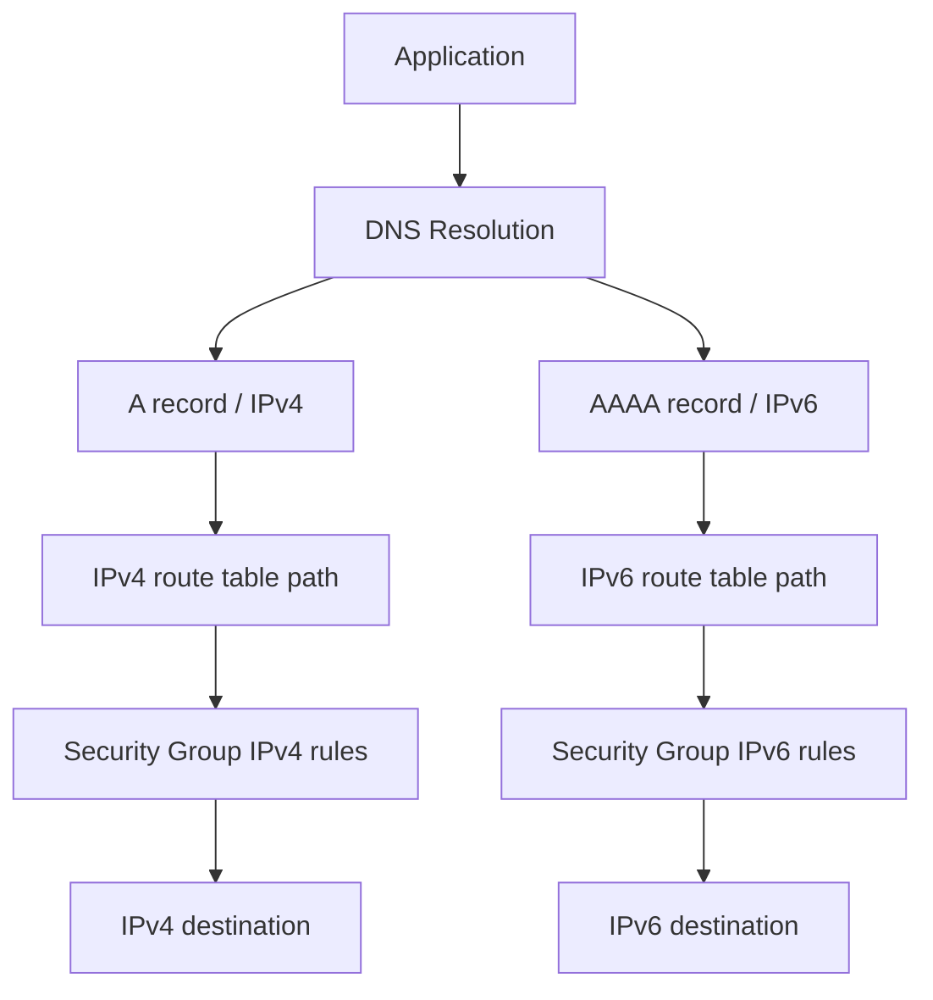
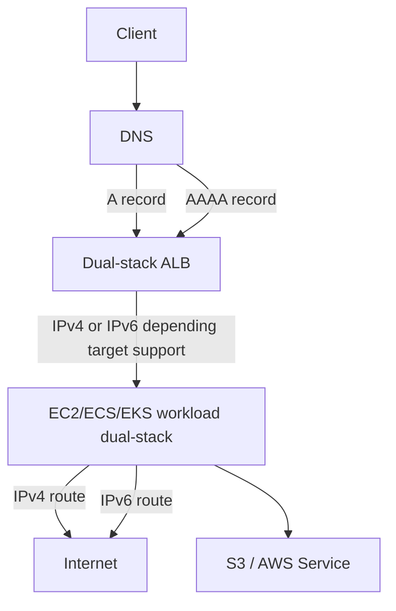
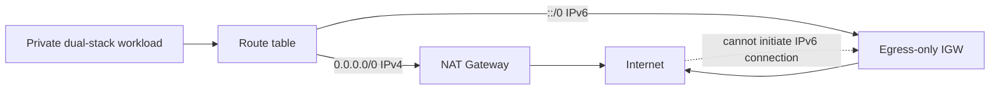
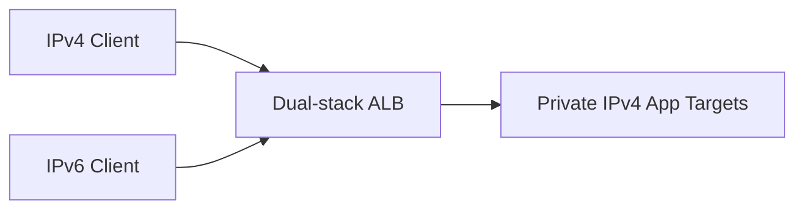
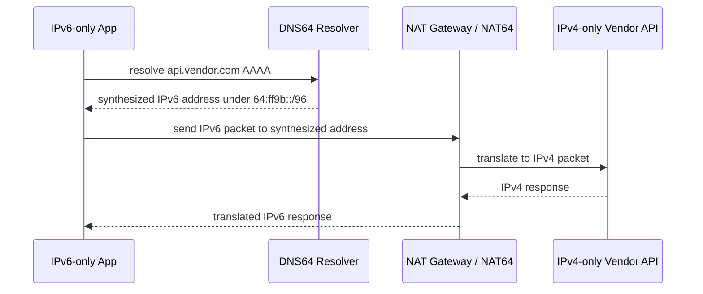
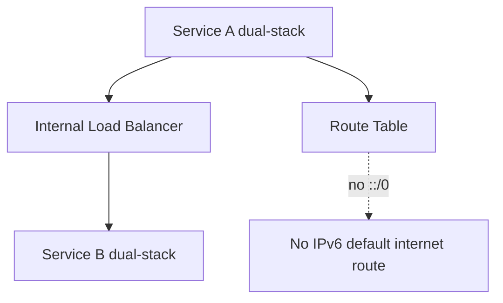
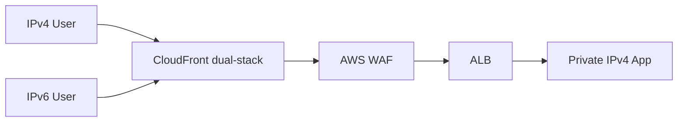
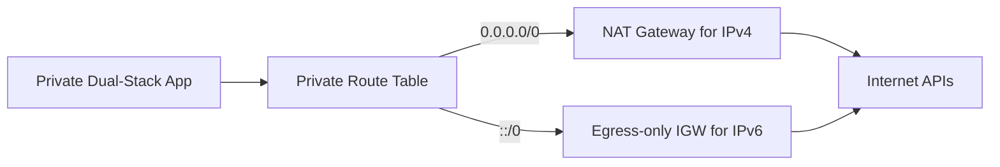
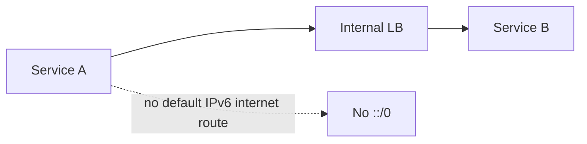
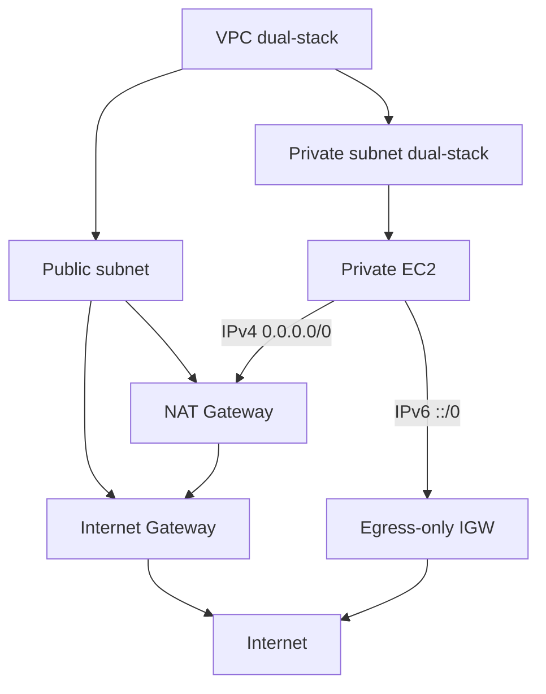

# Part 017 — IPv6 in Amazon VPC

IPv6 di AWS sering disalahpahami sebagai “IPv4 dengan alamat lebih panjang”. Itu mental model yang salah.

IPv6 mengubah beberapa asumsi produksi:

```text
IPv4 private subnet:
workload punya private IPv4
internet egress biasanya via NAT Gateway
inbound dari internet tidak bisa terjadi kecuali ada public IPv4, LB, atau forwarding path

IPv6 dual-stack subnet:
workload bisa punya global IPv6 address
traffic IPv6 tidak memakai NAT Gateway biasa
outbound-only harus dikontrol dengan egress-only internet gateway, security group, NACL, dan route table
```

Perubahan terbesar bukan sintaks alamat. Perubahan terbesar adalah **hilangnya asumsi bahwa private subnet otomatis berarti tidak punya alamat globally routable**.

Di IPv4 AWS, “private” sering terasa aman karena workload tidak punya public IPv4. Di IPv6, alamat IPv6 yang diberikan ke resource bisa public/global. Tetapi apakah bisa diakses dari internet tetap ditentukan oleh kombinasi:

```text
route table
internet gateway / egress-only internet gateway
security group
network ACL
load balancer / edge layer
OS firewall
application listener
```

Jadi IPv6 bukan hanya addressing topic. IPv6 adalah routing, exposure, security, DNS, observability, dan migration topic.

---

## 1. Mental Model: IPv4 dan IPv6 adalah Dua Network Stack yang Berjalan Berdampingan

Dual-stack berarti resource bisa berkomunikasi lewat IPv4 dan IPv6. Namun dua stack itu **independen**.



Konsekuensi praktis:

```text
IPv4 route 0.0.0.0/0 tidak memengaruhi IPv6.
IPv6 route ::/0 tidak memengaruhi IPv4.
Security Group rule 10.0.0.0/8 tidak mengizinkan IPv6.
Security Group rule ::/0 tidak mengizinkan IPv4.
NACL IPv4 rule tidak otomatis berlaku untuk IPv6.
DNS A record tidak sama dengan DNS AAAA record.
```

Jika aplikasi “kadang berhasil, kadang timeout”, jangan hanya melihat satu stack. Resolver client modern bisa mencoba IPv6 lebih dulu, IPv4 lebih dulu, atau paralel tergantung implementasi dan algoritma seperti Happy Eyeballs.

Debugging harus bertanya:

```text
Hostname resolve ke A, AAAA, atau keduanya?
Client memilih alamat yang mana?
Route table untuk stack itu benar?
Security Group untuk stack itu benar?
NACL return path untuk stack itu benar?
Target listening di address family itu?
```

---

## 2. Istilah Minimum yang Harus Jelas

| Istilah | Arti Praktis |
|---|---|
| IPv4-only VPC/subnet | Resource memakai IPv4 saja. Ini default mental model banyak environment lama. |
| Dual-stack VPC/subnet | VPC/subnet punya IPv4 CIDR dan IPv6 CIDR. Resource dapat memakai IPv4 dan IPv6. |
| IPv6-only subnet/resource | Workload memakai IPv6 untuk primary network path tertentu. Tidak semua service/pattern cocok. |
| Public IPv6 | IPv6 yang dapat dirutekan secara global jika route/security mengizinkan. |
| Private IPv6 | IPv6 address space privat yang dikelola melalui IPAM untuk private connectivity use case tertentu. |
| Egress-only internet gateway | Gateway untuk outbound IPv6 dari VPC ke internet, tanpa mengizinkan connection yang diinisiasi dari internet ke resource. |
| NAT64 | Translasi dari IPv6 workload ke IPv4 destination. |
| DNS64 | DNS synthesis yang menghasilkan IPv6 address sintetis untuk hostname yang hanya punya IPv4. |
| AAAA record | DNS record untuk IPv6 address. |
| `::/0` | Default route IPv6, analog konseptual dari `0.0.0.0/0` di IPv4. |

Jangan menyamakan “IPv6 address ada” dengan “internet exposure ada”. Exposure tetap perlu route + gateway + security policy + listener.

---

## 3. IPv6 Addressing di Amazon VPC

Pada level VPC, Anda bisa menambahkan IPv6 CIDR block ke VPC. Pada level subnet, Anda mengasosiasikan IPv6 CIDR block dari range VPC itu.

Skema konseptual:

```text
VPC
  IPv4 CIDR: 10.20.0.0/16
  IPv6 CIDR: 2600:1f18:abcd:1200::/56

Subnet app-a
  IPv4 CIDR: 10.20.10.0/24
  IPv6 CIDR: 2600:1f18:abcd:120a::/64

Subnet app-b
  IPv4 CIDR: 10.20.11.0/24
  IPv6 CIDR: 2600:1f18:abcd:120b::/64
```

Di banyak deployment, subnet IPv6 menggunakan `/64`. Jangan mendesain IPv6 subnet seperti IPv4 dengan pola “hemat address”. IPv6 address space sengaja besar. Yang Anda hemat bukan jumlah alamat, melainkan **jumlah subnet, route, dan domain operasional**.

Mental model sizing:

```text
IPv4 subnet sizing = kapasitas alamat sering menjadi constraint.
IPv6 subnet sizing = boundary operasional, AZ, route table, policy, dan blast radius menjadi constraint.
```

AWS tetap mereserve beberapa IPv6 address di setiap subnet, mirip konsep reserved address pada IPv4. Tetapi di IPv6, kapasitas alamat hampir tidak pernah menjadi masalah praktis untuk workload biasa.

---

## 4. Dual-Stack VPC: Pattern Paling Aman untuk Migrasi

Untuk mayoritas organisasi, langkah awal yang masuk akal bukan “langsung IPv6-only”. Langkah awal yang sehat adalah **dual-stack**.

Dual-stack memberi ruang migrasi:

```text
existing IPv4 traffic tetap berjalan
IPv6 bisa diuji per subnet / per workload / per endpoint
DNS bisa diubah bertahap
client compatibility bisa diamati
rollback lebih mudah
```

Diagram sederhana:



Tetapi dual-stack juga membuka kelas bug baru:

```text
IPv4 path sehat, IPv6 path rusak.
DNS memberi AAAA record, client memilih IPv6, lalu timeout.
Security Group hanya diupdate IPv4.
NACL return traffic IPv6 tidak dibuka.
Monitoring hanya melihat IPv4 target.
WAF/edge layer melihat client IP dalam IPv6 format dan rule tidak siap.
Allowlist vendor hanya IPv4.
```

Rule produksi:

> Jangan enable AAAA record untuk traffic produksi sebelum IPv6 path observability dan rollback siap.

---

## 5. IPv6 Route Table: Route Terpisah dari IPv4

Ketika IPv6 CIDR ditambahkan ke VPC/subnet, route lokal IPv6 memungkinkan komunikasi internal dalam VPC untuk CIDR tersebut. Untuk internet-bound IPv6, Anda perlu route eksplisit.

Contoh public dual-stack subnet:

```text
Destination                 Target
10.20.0.0/16                local
2600:1f18:abcd:1200::/56    local
0.0.0.0/0                   igw-xxxx
::/0                        igw-xxxx
```

Contoh private dual-stack subnet dengan outbound IPv4 via NAT dan outbound IPv6 via egress-only IGW:

```text
Destination                 Target
10.20.0.0/16                local
2600:1f18:abcd:1200::/56    local
0.0.0.0/0                   nat-xxxx
::/0                        eigw-xxxx
```

Ini penting: NAT Gateway biasa bukan default path untuk IPv6 internet-bound traffic. Untuk outbound-only IPv6, gunakan egress-only internet gateway.

---

## 6. Internet Gateway vs Egress-Only Internet Gateway

### 6.1 Internet Gateway untuk IPv6

Jika subnet punya route:

```text
::/0 -> igw-xxxx
```

maka resource dengan IPv6 address dapat punya jalur IPv6 ke internet, tergantung security controls.

Ini cocok untuk:

```text
public-facing ALB/NLB
public web server pattern tertentu
bastion-like endpoint yang sangat dibatasi
edge-facing managed service integration
```

Namun untuk workload private, route `::/0 -> igw` bisa membuat asumsi lama rusak. Workload yang sebelumnya “private karena tidak punya public IPv4” sekarang mungkin punya IPv6 global dan route ke internet gateway.

Security Group mungkin tetap memblokir inbound, tetapi arsitektur sebaiknya tidak bergantung pada satu kontrol saja.

### 6.2 Egress-Only Internet Gateway

Egress-only internet gateway dipakai untuk IPv6 outbound-only. Ia memungkinkan resource di VPC menginisiasi koneksi IPv6 ke internet, tetapi tidak mengizinkan koneksi yang diinisiasi dari internet ke resource.

Contoh:

```text
private app subnet
  IPv4 outbound: 0.0.0.0/0 -> NAT Gateway
  IPv6 outbound: ::/0 -> Egress-only IGW
```

Diagram:



Egress-only IGW adalah jawaban untuk pertanyaan:

```text
Bagaimana workload bisa call API IPv6 internet tanpa menjadi inbound-reachable dari internet?
```

Tetapi jangan berhenti di gateway. Tetap butuh:

```text
Security Group outbound policy
NACL outbound/inbound return path
DNS control
egress monitoring
application-level allowlist
```

---

## 7. “Private Subnet” di IPv6 Harus Didefinisikan Ulang

Dalam materi sebelumnya, kita definisikan public/private/isolated berdasarkan route intent. Itu makin penting di IPv6.

| Subnet Intent | IPv4 Default Route | IPv6 Default Route | Makna |
|---|---:|---:|---|
| Public dual-stack | `0.0.0.0/0 -> IGW` | `::/0 -> IGW` | Ingress/egress internet memungkinkan jika security mengizinkan. |
| Private dual-stack egress | `0.0.0.0/0 -> NAT GW` | `::/0 -> EIGW` | Outbound internet, inbound internet tidak diinisiasi langsung. |
| IPv4 private, IPv6 isolated | `0.0.0.0/0 -> NAT GW` | no `::/0` | IPv4 outbound ada, IPv6 internet tidak ada. |
| Isolated dual-stack | no default internet route | no default internet route | Internal/private connectivity only. |

Dengan IPv6, “private” tidak berarti “address-nya pasti privat”. Private berarti **route dan policy tidak memberi internet-initiated inbound path**.

---

## 8. Security Group untuk IPv6

Security Group rule IPv4 dan IPv6 berbeda.

Contoh kesalahan umum:

```text
Inbound:
  TCP 443 from 0.0.0.0/0

Ekspektasi engineer:
  semua internet client bisa akses HTTPS

Realitas:
  hanya IPv4 client yang cocok
  IPv6 client butuh ::/0 rule
```

Jika ingin ALB public dual-stack menerima IPv4 dan IPv6 HTTPS:

```text
Inbound ALB SG:
  TCP 443 from 0.0.0.0/0
  TCP 443 from ::/0
```

Jika ingin app hanya menerima dari ALB:

```text
Inbound App SG:
  TCP 8080 from sg-alb
```

Security Group referencing lebih aman daripada CIDR allowlist untuk east-west di dalam AWS karena tidak perlu menduplikasi IPv4/IPv6 range.

Namun ingat:

```text
SG reference bekerja dalam constraint VPC/peering/TGW tertentu sesuai dukungan service dan topology.
Untuk traffic dari internet atau on-prem, Anda tetap perlu CIDR/prefix-list/policy lain.
```

Production heuristic:

```text
Use CIDR for external trust boundary.
Use SG reference for internal AWS resource-to-resource trust boundary when supported.
Use managed prefix list when target is AWS-managed prefix set and supported by the control.
```

---

## 9. NACL untuk IPv6

NACL stateless. Jika Anda menambahkan IPv6 inbound tanpa return rule, traffic bisa gagal dengan gejala aneh.

Public subnet ALB dual-stack minimal konseptual:

```text
Inbound:
  allow TCP 443 from 0.0.0.0/0
  allow TCP 443 from ::/0
  allow ephemeral return as needed

Outbound:
  allow ephemeral to 0.0.0.0/0
  allow ephemeral to ::/0
  allow target ports to app subnets
```

Private app subnet dual-stack:

```text
Inbound:
  allow app port from ALB subnet IPv4 CIDR
  allow app port from ALB subnet IPv6 CIDR
  allow ephemeral response from internet path if direct outbound exists

Outbound:
  allow response to ALB subnet IPv4/IPv6
  allow required egress IPv4/IPv6 destinations
```

Banyak organisasi akhirnya memakai NACL sebagai broad subnet guardrail dan Security Group sebagai primary workload firewall. Itu masuk akal selama NACL tidak menjadi policy detail yang sulit dipahami.

---

## 10. DNS: A, AAAA, Dual-Stack, dan Rollout Risk

IPv6 biasanya aktif secara nyata ketika DNS mulai memberi AAAA record kepada client.

Untuk public endpoint:

```text
A    api.example.com -> IPv4 endpoint
AAAA api.example.com -> IPv6 endpoint
```

Untuk internal endpoint:

```text
A    service.internal -> private IPv4
AAAA service.internal -> IPv6 address
```

Masalah produksi umum:

```text
AAAA record dibuat karena load balancer dual-stack.
Sebagian client memilih IPv6.
IPv6 route/security belum siap.
Error rate naik hanya untuk client/network tertentu.
IPv4 dashboards terlihat sehat.
```

Rollout sehat:

```text
1. Aktifkan IPv6 pada VPC/subnet non-prod.
2. Aktifkan route IPv6 tapi batasi exposure.
3. Pastikan SG/NACL/observability dual-stack.
4. Uji endpoint dengan explicit IPv6 client.
5. Aktifkan dual-stack endpoint.
6. Tambahkan AAAA record dengan TTL rendah.
7. Monitor per address family.
8. Naikkan traffic bertahap.
```

Command debugging:

```bash
# Lihat A record
 dig +short A api.example.com

# Lihat AAAA record
 dig +short AAAA api.example.com

# Paksa IPv4
 curl -4 -v https://api.example.com/health

# Paksa IPv6
 curl -6 -v https://api.example.com/health

# Trace route IPv6, jika environment mendukung
 traceroute6 api.example.com
```

---

## 11. Load Balancer dan IPv6

Application Load Balancer dan Network Load Balancer dapat dipakai dalam desain dual-stack, tetapi detail dukungan bergantung pada tipe LB, scheme, target type, dan konfigurasi. Yang penting secara mental model:

```text
client-facing address family != selalu target-facing address family
```

Contoh pattern:



Ini berguna saat Anda ingin memberi IPv6 ke external clients tanpa langsung memigrasi seluruh backend menjadi IPv6.

Namun jangan berasumsi semua kombinasi target/service mendukung IPv6 secara sama. Periksa dokumentasi service yang digunakan, terutama untuk:

```text
ALB target type
NLB target type
EKS ingress/controller behavior
API Gateway private integration
VPC endpoint IP address type
CloudFront origin behavior
Global Accelerator endpoint type
```

Dalam handbook produksi, tulis eksplisit:

```text
This service is dual-stack at the edge, IPv4-only to backend.
```

atau:

```text
This service is dual-stack end-to-end.
```

Kedua arsitektur itu punya failure mode yang berbeda.

---

## 12. IPv6 dan AWS Service Access

Untuk service AWS, pertanyaannya bukan hanya “apakah workload punya IPv6?” tetapi:

```text
Apakah service endpoint mendukung IPv6?
Apakah SDK resolve ke endpoint dual-stack?
Apakah VPC endpoint mendukung address family yang dipilih?
Apakah private DNS mengembalikan record sesuai harapan?
Apakah route table mengirim traffic via private endpoint atau internet path?
```

Pattern umum:

```text
Private app calls S3:
  Prefer Gateway Endpoint atau Interface Endpoint sesuai kebutuhan.

Private app calls AWS service with PrivateLink support:
  Prefer Interface VPC Endpoint.

IPv6-only workload calls IPv4-only external service:
  Need DNS64 + NAT64 pattern.
```

Jangan mengandalkan NAT Gateway untuk semua IPv6 egress. NAT Gateway berperan dalam NAT64 untuk IPv6-only ke IPv4 destination dengan konfigurasi DNS64/route tertentu, tetapi bukan general IPv6 NAT seperti NAT44 di IPv4.

---

## 13. DNS64 dan NAT64: Jembatan ke Dunia IPv4

IPv6-only workload kadang perlu memanggil service yang hanya punya IPv4 address.

Masalah:

```text
IPv6-only client resolve api.vendor.com
Vendor hanya punya A record, tidak punya AAAA record
Client butuh IPv6 destination address untuk mengirim packet
```

DNS64/NAT64 menyelesaikan ini:



Route table concept:

```text
64:ff9b::/96 -> NAT Gateway
::/0         -> egress-only IGW or IGW depending intended IPv6 behavior
```

Gunakan NAT64 secara sadar. Ia adalah compatibility bridge, bukan alasan untuk menunda migration planning selamanya.

Observability yang perlu dicatat:

```text
mana dependency yang masih IPv4-only
berapa volume traffic via NAT64
apakah timeout hanya terjadi untuk synthesized destinations
apakah vendor allowlist mengenali source IPv4 NAT Gateway
```

---

## 14. IPv6 dan Egress Control

Di IPv4, banyak tim mengontrol egress dengan NAT Gateway EIP allowlist di vendor.

Dengan IPv6, model berubah:

```text
Outbound source bisa IPv6 workload/edge range.
Vendor allowlist mungkin belum siap IPv6.
Security appliance mungkin belum enforce IPv6 sama kuatnya.
Logging pipeline mungkin belum normalize IPv6.
Cost attribution mungkin terpisah.
```

Pertanyaan sebelum enable IPv6 egress:

```text
Apakah vendor support IPv6 allowlist?
Apakah SIEM parsing IPv6 benar?
Apakah WAF/rate limiter memahami IPv6 prefix semantics?
Apakah firewall rules punya IPv6 equivalent?
Apakah data loss prevention melihat IPv6 path?
Apakah incident response bisa search IPv6 address?
```

IPv6 bukan hanya network engineer concern. Ia memengaruhi security operations.

---

## 15. Public IPv6 Exposure: Checkpoint Produksi

Sebelum memberi `::/0 -> IGW` pada subnet yang memuat workload, cek ini:

```text
[ ] Apakah subnet memang public by intent?
[ ] Apakah resource butuh direct IPv6 internet access?
[ ] Apakah inbound SG hanya membuka port yang diperlukan?
[ ] Apakah NACL IPv6 rule minimal dan jelas?
[ ] Apakah OS firewall/listener aman?
[ ] Apakah observability bisa membedakan IPv4 dan IPv6?
[ ] Apakah CloudFront/ALB/WAF lebih cocok daripada direct EC2 exposure?
[ ] Apakah DNS AAAA rollout punya rollback plan?
```

Untuk mayoritas aplikasi web production, direct EC2 IPv6 exposure bukan pattern pertama. Pattern yang lebih baik:

```text
Internet -> CloudFront/WAF -> ALB -> private targets
```

atau:

```text
Internet -> Global Accelerator/ALB/NLB -> private targets
```

Direct public host sebaiknya pengecualian yang dijustifikasi.

---

## 16. IPv6 Internal-Only Pattern

Tidak semua IPv6 harus public-facing. IPv6 juga bisa dipakai untuk internal addressing scale dan mengurangi tekanan IPv4.

Pattern:

```text
VPC dual-stack
subnet dual-stack
no ::/0 route to IGW/EIGW for isolated subnets
internal LB/service discovery supports required family
SG reference or internal IPv6 CIDR rules
PrivateLink/VPC Lattice/TGW support evaluated separately
```

Diagram:



Use case:

```text
large-scale container/pod addressing
internal service mesh/service network
future-proofing for IPv4 scarcity
controlled dual-stack migration
```

Caveat: service compatibility harus dicek satu per satu.

---

## 17. IPv6 in EKS/ECS/Containers: Hanya Mental Model Awal

Detail EKS networking akan dibahas di Part 065. Namun IPv6 memengaruhi container platform sejak desain VPC.

Pertanyaan desain:

```text
Apakah pod/task mendapat IPv4, IPv6, atau dual-stack?
Apakah load balancer ingress dual-stack?
Apakah service discovery memberi A/AAAA?
Apakah egress policy enforce IPv6?
Apakah CNI/security group model mendukung address family yang dipakai?
Apakah observability melihat pod IPv6?
```

Kesalahan umum:

```text
Platform team enable IPv6 untuk mengatasi IP exhaustion.
Application team tidak tahu dependency external belum support IPv6.
DNS mulai mengembalikan AAAA.
Sebagian request gagal hanya dari workload tertentu.
```

Jadi migrasi IPv6 di container bukan hanya network platform task. Ia perlu contract dengan application team.

---

## 18. Migration Strategy: Dari IPv4-only ke Dual-Stack

Migration yang sehat biasanya bertahap.

### Stage 1 — Inventory

Kumpulkan:

```text
VPC/subnet/route table topology
internet-facing endpoint
internal endpoint
AWS service dependencies
third-party API dependencies
allowlist dependency
firewall/security group/NACL rules
DNS zones and records
monitoring/log pipeline support
```

### Stage 2 — Non-Prod Dual-Stack Foundation

Tambahkan IPv6 ke VPC/subnet non-prod.

```text
VPC IPv6 CIDR
subnet IPv6 CIDR
local IPv6 route
SG/NACL IPv6 baseline
Flow Logs validation
```

### Stage 3 — Controlled Egress

Untuk private subnet:

```text
::/0 -> egress-only IGW
or no ::/0 until specific need exists
```

Untuk workload yang butuh IPv4-only destination:

```text
DNS64 + NAT64 route for 64:ff9b::/96
```

### Stage 4 — Edge Dual-Stack

Mulai dari edge managed services:

```text
CloudFront dual-stack
ALB dual-stack
Route 53 AAAA records
WAF validation
```

### Stage 5 — Backend Dual-Stack

Baru migrasi internal backend jika benar-benar diperlukan:

```text
app listener
service discovery
internal LB
database connectivity
cross-VPC/hybrid connectivity
```

### Stage 6 — Production Rollout

Gunakan rollout bertahap:

```text
low TTL
canary domain
per-client monitoring
error budget guardrail
rollback DNS/route/config
```

---

## 19. Decision Matrix: Kapan Menggunakan Apa?

| Kebutuhan | Pattern Awal yang Masuk Akal |
|---|---|
| Public website/API ingin support IPv6 client | CloudFront/ALB dual-stack + AAAA rollout bertahap. |
| Private workload butuh outbound IPv6 internet | Dual-stack subnet + `::/0 -> egress-only IGW`. |
| IPv6-only workload butuh call IPv4-only dependency | DNS64 + NAT64 + route `64:ff9b::/96 -> NAT Gateway`. |
| Internal scale karena IPv4 exhaustion | Dual-stack/IPv6 internal design, cek service compatibility. |
| Vendor only allowlists IPv4 | Tetap egress via IPv4 NAT path untuk dependency itu. |
| Security org belum siap IPv6 logs/rules | Jangan expose IPv6 public; siapkan control plane dan observability dulu. |
| Multi-account enterprise | IPAM-led IPv6 allocation, documented subnet policy, central governance. |

---

## 20. Debugging IPv6: Runbook Praktis

### 20.1 Pastikan Resource Punya IPv6

```bash
ip -6 addr
```

Cek apakah interface punya address IPv6 yang diharapkan.

### 20.2 Pastikan DNS Menghasilkan AAAA

```bash
dig +short AAAA example.com
```

Jika kosong, masalahnya mungkin bukan routing IPv6, tetapi DNS.

### 20.3 Paksa Curl IPv6

```bash
curl -6 -v https://example.com/health
```

Jika `curl -4` berhasil dan `curl -6` gagal, fokus ke IPv6 path.

### 20.4 Cek Route OS

```bash
ip -6 route
```

Pastikan default route OS masuk akal.

### 20.5 Cek Route Table AWS

Untuk subnet workload:

```text
Apakah ada local route IPv6?
Apakah ada ::/0?
Target-nya IGW, EIGW, atau tidak ada?
```

### 20.6 Cek Security Group

```text
Inbound IPv6 rule ada?
Outbound IPv6 rule ada?
SG reference lebih baik daripada CIDR untuk internal path?
```

### 20.7 Cek NACL

```text
Inbound request IPv6 allowed?
Outbound response IPv6 allowed?
Ephemeral return path benar?
```

### 20.8 Cek Target Listener

```bash
ss -lntp
```

Apakah aplikasi listen di IPv6 address atau hanya IPv4?

Contoh jebakan:

```text
Service listen di 127.0.0.1 atau 0.0.0.0 tetapi tidak di ::.
Load balancer health check IPv6 gagal.
```

### 20.9 Cek Flow Logs

VPC Flow Logs bisa membantu melihat ACCEPT/REJECT dan address family. Pastikan pipeline parsing IPv6 tidak rusak.

---

## 21. Failure Modes yang Sering Muncul

### Failure 1 — AAAA Record Terbit Terlalu Cepat

```text
Symptom:
  Sebagian client timeout.
  IPv4 monitoring hijau.

Root cause:
  DNS mengembalikan AAAA, tetapi IPv6 route/security tidak lengkap.

Fix:
  rollback AAAA, validasi IPv6 route/SG/NACL/listener, rollout ulang dengan canary.
```

### Failure 2 — Private Subnet Tiba-tiba Terasa Public

```text
Symptom:
  Security review menemukan EC2 punya IPv6 global dan ::/0 -> IGW.

Root cause:
  Tim menyalin public subnet route ke subnet app.

Fix:
  ubah ::/0 ke egress-only IGW atau hapus default IPv6 route.
```

### Failure 3 — SG Only IPv4

```text
Symptom:
  IPv4 client bisa akses, IPv6 client gagal.

Root cause:
  SG inbound hanya 0.0.0.0/0, tidak ada ::/0.

Fix:
  tambahkan IPv6 rule sesuai intent.
```

### Failure 4 — NACL Stateless Return Path Lupa

```text
Symptom:
  Flow Logs menunjukkan REJECT untuk return traffic.

Root cause:
  NACL outbound/inbound ephemeral IPv6 tidak lengkap.

Fix:
  perbaiki NACL dengan rule IPv6 symmetric enough untuk stateful flow.
```

### Failure 5 — NAT64 Source Allowlist Tidak Dipahami

```text
Symptom:
  IPv6-only workload call IPv4 vendor mendapat 403/timeout.

Root cause:
  Vendor melihat source IPv4 dari NAT path, bukan IPv6 workload.

Fix:
  allowlist NAT egress IPv4 atau migrasi vendor path ke native IPv6.
```

---

## 22. Production Design Patterns

### Pattern A — Edge Dual-Stack, Backend IPv4



Kelebihan:

```text
IPv6 client support cepat
backend migration minimal
edge protection kuat
rollback via DNS/distribution config
```

Kekurangan:

```text
bukan dual-stack end-to-end
real client IP handling harus benar
origin path tetap IPv4-bound
```

### Pattern B — Private Dual-Stack Egress



Kelebihan:

```text
outbound IPv4 dan IPv6 didukung
inbound IPv6 internet-initiated diblokir oleh EIGW
migration bertahap
```

Kekurangan:

```text
egress policy menjadi dua stack
vendor allowlist bisa kompleks
monitoring harus dual-stack
```

### Pattern C — IPv6 Internal Scale, No Internet IPv6



Kelebihan:

```text
membantu scale internal addressing
mengurangi exposure internet
bagus untuk controlled platform migration
```

Kekurangan:

```text
service compatibility harus dicek
DNS/service discovery lebih kompleks
hybrid connectivity mungkin belum siap
```

---

## 23. Checklist Desain IPv6 VPC

```text
Addressing
[ ] VPC IPv6 CIDR strategy jelas
[ ] Subnet IPv6 CIDR konsisten per AZ/tier
[ ] IPAM digunakan untuk enterprise scale

Routing
[ ] Public subnet: ::/0 -> IGW hanya jika public intent
[ ] Private egress subnet: ::/0 -> EIGW jika outbound IPv6 diperlukan
[ ] Isolated subnet: no ::/0
[ ] NAT64 route 64:ff9b::/96 hanya jika diperlukan

Security
[ ] SG punya IPv6 equivalent rules
[ ] NACL punya IPv6 equivalent rules
[ ] WAF/rate limit/IP reputation siap IPv6
[ ] Incident response bisa handle IPv6 indicators

DNS
[ ] A/AAAA rollout controlled
[ ] TTL disesuaikan saat migration
[ ] Split-horizon behavior diuji
[ ] Resolver path untuk IPv6 dependency jelas

Operations
[ ] Flow Logs parsing IPv6 benar
[ ] Dashboard memisahkan IPv4 vs IPv6
[ ] Synthetic checks pakai curl -4 dan curl -6
[ ] Runbook rollback tersedia
```

---

## 24. Anti-Patterns

### Anti-Pattern 1 — Enable IPv6 karena “Gratis Address” tanpa Security Model

IPv6 memang mengurangi tekanan address exhaustion, tetapi membuka address family baru. Tanpa SG/NACL/monitoring yang siap, Anda menciptakan blind spot.

### Anti-Pattern 2 — Menganggap Private Subnet Otomatis Aman

Private subnet adalah route intent, bukan label. Jika IPv6 route menuju IGW, evaluasi ulang exposure.

### Anti-Pattern 3 — Hanya Test `curl` Default

Default `curl` bisa memilih IPv4 atau IPv6 tergantung resolver/client behavior. Selalu test:

```bash
curl -4 ...
curl -6 ...
```

### Anti-Pattern 4 — Menyalin IPv4 Rule ke IPv6 Tanpa Semantik

`0.0.0.0/0` dan `::/0` sama-sama berarti “any”, tetapi risk-nya harus dievaluasi. Jangan otomatis menambahkan `::/0` hanya agar test hijau.

### Anti-Pattern 5 — Tidak Mengupdate Vendor/SIEM/Firewall Allowlist

IPv6 migration gagal bukan karena VPC saja. Sering gagal karena ekosistem sekitar belum siap.

---

## 25. Lab: Membuat Private Dual-Stack Egress Pattern

Tujuan lab:

```text
Private EC2 bisa outbound IPv4 via NAT Gateway.
Private EC2 bisa outbound IPv6 via egress-only IGW.
Inbound dari internet ke EC2 tidak terbuka.
```

### 25.1 Topology



### 25.2 Route Table Public

```text
Destination                 Target
10.20.0.0/16                local
2600:...::/56               local
0.0.0.0/0                   igw-xxxx
::/0                        igw-xxxx
```

### 25.3 Route Table Private

```text
Destination                 Target
10.20.0.0/16                local
2600:...::/56               local
0.0.0.0/0                   nat-xxxx
::/0                        eigw-xxxx
```

### 25.4 Security Group EC2

```text
Inbound:
  none from internet
  optional SSH/SSM only via controlled admin path

Outbound:
  HTTPS 443 to 0.0.0.0/0
  HTTPS 443 to ::/0
```

Untuk production, jangan biarkan outbound any jika organisasi punya egress policy lebih ketat.

### 25.5 Validation

```bash
# IPv4 public egress
curl -4 https://checkip.amazonaws.com

# IPv6 public egress, if endpoint supports it
curl -6 https://ifconfig.co

# DNS records
 dig +short A example.com
 dig +short AAAA example.com
```

Pastikan tidak ada inbound direct path dari internet ke EC2.

---

## 26. Lab: AAAA Canary Rollout

Tujuan:

```text
Expose endpoint secara dual-stack tanpa langsung mengubah main production hostname.
```

Pattern:

```text
api.example.com          -> existing production A record
api-ipv6-canary.example.com -> AAAA to dual-stack endpoint
```

Validation:

```bash
curl -6 -v https://api-ipv6-canary.example.com/health
curl -4 -v https://api.example.com/health
```

Monitor:

```text
5xx rate by address family
latency by address family
WAF blocks by IP version
origin errors
client geographies affected
resolver behavior
```

Setelah confidence cukup, tambahkan AAAA ke hostname utama dengan TTL yang memungkinkan rollback.

---

## 27. Review Questions

1. Kenapa private subnet di IPv6 tidak boleh didefinisikan hanya dari “punya public IP atau tidak”?
2. Apa perbedaan route `::/0 -> IGW` dan `::/0 -> EIGW`?
3. Kenapa Security Group rule `0.0.0.0/0` tidak cukup untuk dual-stack public ALB?
4. Apa failure mode paling umum ketika AAAA record diterbitkan sebelum network path siap?
5. Kapan DNS64/NAT64 diperlukan?
6. Kenapa dual-stack migration lebih aman daripada langsung IPv6-only untuk kebanyakan enterprise?
7. Bagaimana Anda membuktikan bahwa error hanya terjadi di IPv6 path?
8. Apa yang harus diubah pada observability pipeline sebelum IPv6 production rollout?

---

## 28. Key Takeaways

```text
IPv6 di AWS adalah address family, routing path, security model, DNS behavior, dan operational capability.
```

Hal paling penting:

```text
1. IPv4 dan IPv6 path independen.
2. Dual-stack adalah strategi migrasi paling praktis untuk mayoritas organisasi.
3. Private subnet harus didefinisikan dari route intent, bukan asumsi IPv4 lama.
4. Egress-only IGW adalah primitive penting untuk outbound-only IPv6.
5. Security Group, NACL, DNS, WAF, logs, dan vendor allowlist harus siap IPv6.
6. AAAA record adalah activation point yang bisa mengubah traffic nyata.
7. Debugging harus memaksa IPv4 dan IPv6 secara eksplisit.
```

Jika Anda mengingat satu kalimat:

> IPv6 bukan sekadar menambah alamat; IPv6 menambah data path baru yang harus dirancang, diamankan, dimonitor, dan dioperasikan.

---

## 29. Source Anchors

Materi ini disusun berdasarkan dokumentasi resmi AWS tentang:

- IPv6 support for Amazon VPC.
- Dual-stack behavior di VPC.
- VPC/subnet IPv6 CIDR association.
- IPv6 route table update untuk public/private subnet.
- Egress-only internet gateway.
- DNS64 dan NAT64 di Amazon VPC.
- Security Group/NACL behavior yang harus mencakup IPv6 rules.

Referensi utama:

```text
https://docs.aws.amazon.com/vpc/latest/userguide/vpc-migrate-ipv6.html
https://docs.aws.amazon.com/vpc/latest/userguide/vpc-migrate-ipv6-add.html
https://docs.aws.amazon.com/vpc/latest/userguide/egress-only-internet-gateway.html
https://docs.aws.amazon.com/vpc/latest/userguide/nat-gateway-nat64-dns64.html
https://docs.aws.amazon.com/vpc/latest/userguide/subnet-sizing.html
https://docs.aws.amazon.com/vpc/latest/userguide/vpc-cidr-blocks.html
```
