# Part 018 — VPC Endpoints: Gateway and Interface

VPC endpoint adalah salah satu primitive paling penting untuk membuat arsitektur AWS yang production-grade.

Tanpa endpoint, private subnet sering terlihat seperti ini:

```text
Private workload -> NAT Gateway -> Internet path -> AWS public service endpoint
```

Dengan endpoint, path bisa menjadi:

```text
Private workload -> VPC Endpoint -> AWS service over private AWS network path
```

Perbedaannya bukan kosmetik. Ia memengaruhi:

```text
security posture
NAT cost
blast radius
route intent
data exfiltration controls
DNS behavior
hybrid access
cross-account service exposure
observability
```

Part ini membahas dua jenis utama yang sering Anda pakai:

```text
Gateway endpoint   -> route-table based endpoint untuk S3/DynamoDB use case klasik
Interface endpoint -> ENI + PrivateLink based endpoint untuk banyak AWS services dan private services
```

Gateway endpoint dan interface endpoint sama-sama bernama “VPC endpoint”, tetapi internal model-nya sangat berbeda. Banyak bug produksi muncul karena engineer menganggap keduanya sama.

---

## 1. Mental Model: Endpoint adalah Alternatif Path, Bukan Sekadar Fitur Security

Pertanyaan inti:

```text
Ketika EC2 private subnet memanggil s3.amazonaws.com, packet pergi ke mana?
```

Tanpa endpoint:

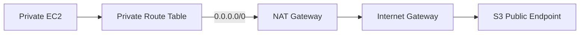

Dengan gateway endpoint S3:

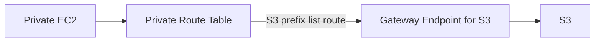

Dengan interface endpoint:

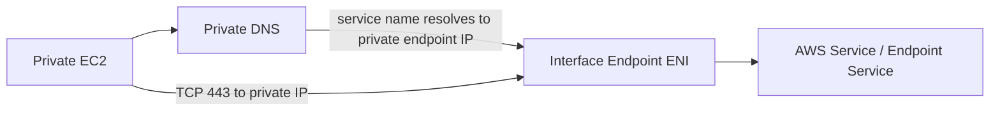

Endpoint mengubah **data path**.

Karena data path berubah, maka yang ikut berubah:

```text
routing decision
DNS answer
source/destination IP visible to security controls
NAT dependency
cost path
policy evaluation
failure mode
```

---

## 2. Endpoint Taxonomy

| Endpoint Type | Mechanism | Common Use | Route Table? | ENI? | Security Group? | Private DNS? |
|---|---|---|---|---|---|---|
| Gateway Endpoint | Route-table target using AWS prefix list | S3, DynamoDB | Yes | No workload-visible endpoint ENI | No endpoint SG | No same way as interface endpoint; service DNS still resolves to AWS ranges/prefix path |
| Interface Endpoint | AWS PrivateLink, endpoint ENI in subnet | Most AWS services, private SaaS, custom endpoint service | Usually DNS-driven, route via local VPC path | Yes | Yes | Usually yes for AWS services |
| Gateway Load Balancer Endpoint | Appliance insertion with GWLB | Inspection/firewall appliances | Yes | Service-managed | Different model | Not normal Private DNS model |
| Resource/Service Network Endpoint variants | Newer PrivateLink/VPC Lattice style access | Resource/service network access | Depends | Depends | Depends | Depends |

Part ini fokus pada gateway endpoint dan interface endpoint. Gateway Load Balancer endpoint akan dibahas di Part 051.

---

## 3. Gateway Endpoint: Route-Table Based Private Access

Gateway endpoint adalah target route table untuk service tertentu, terutama S3 dan DynamoDB dalam pattern klasik.

Konsep:

```text
Destination: AWS-managed prefix list for S3/DynamoDB
Target: Gateway VPC Endpoint
```

Route table sebelum gateway endpoint:

```text
Destination        Target
10.20.0.0/16       local
0.0.0.0/0          nat-xxxx
```

Route table setelah S3 gateway endpoint:

```text
Destination                  Target
10.20.0.0/16                 local
pl-aws-s3-prefix-list        vpce-s3-gateway
0.0.0.0/0                    nat-xxxx
```

Longest prefix match membuat traffic ke S3 prefix mengambil endpoint route, bukan default route ke NAT.

Diagram:

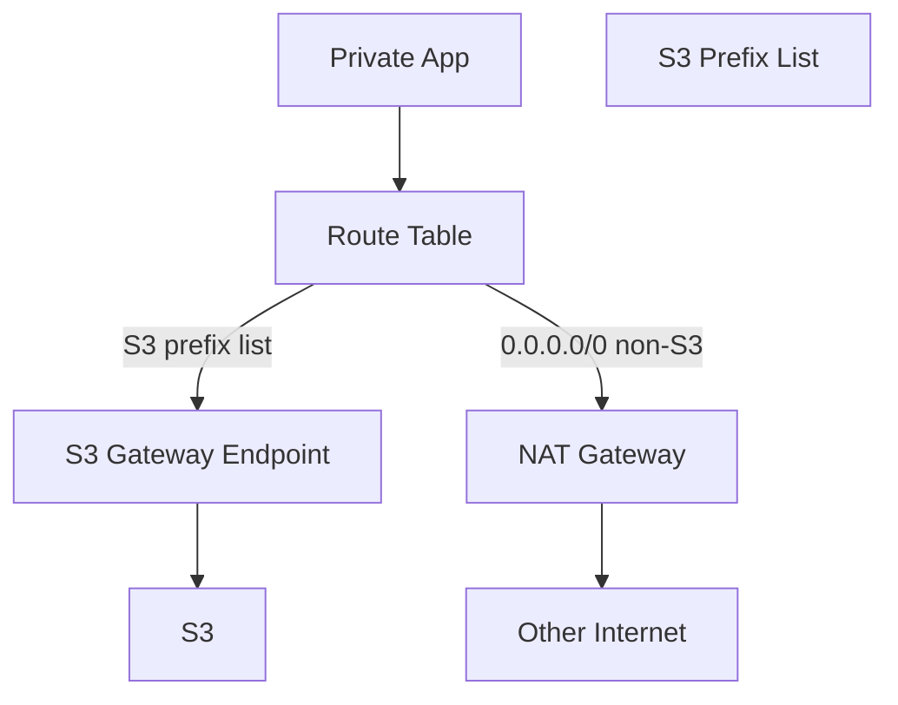

Mental model:

```text
Gateway endpoint is routing-based.
If subnet route table is not associated with the endpoint route, workload does not use it.
```

---

## 4. Gateway Endpoint Use Cases

Gateway endpoint cocok untuk:

```text
private subnet access to S3
private subnet access to DynamoDB
reducing NAT Gateway data processing cost for heavy S3/DynamoDB traffic
keeping service traffic off general internet egress path
using endpoint policies as additional guardrail
using S3 bucket policies with aws:sourceVpce / aws:sourceVpc conditions
```

Contoh high-volume data path:

```text
ETL workers -> S3
backup agents -> S3
application uploads -> S3
DynamoDB-heavy application -> DynamoDB
container image/layer access pattern where S3 is involved indirectly through service-specific endpoints
```

Jika workload private subnet intensif membaca/menulis S3 tetapi semua traffic lewat NAT Gateway, Anda mungkin sedang membayar dan mengoperasikan path yang tidak perlu.

---

## 5. Gateway Endpoint Limitasi

Gateway endpoint bukan universal private connectivity.

Limitasi penting:

```text
hanya untuk service tertentu seperti S3/DynamoDB
regional
route-table scoped
bukan endpoint ENI yang bisa diakses dari on-prem via private IP biasa
tidak memakai Security Group pada endpoint
tidak cocok sebagai provider-consumer model custom service
DNS behavior berbeda dari interface endpoint
```

Contoh kesalahan:

```text
On-prem -> Direct Connect -> VPC -> S3 gateway endpoint
```

Engineer berharap on-prem bisa memakai gateway endpoint. Tetapi gateway endpoint route-table pattern umumnya untuk traffic dari subnet dalam VPC yang route table-nya memakai endpoint. Untuk on-prem/hybrid private S3 path, interface endpoint S3 dan Route 53 Resolver pattern bisa lebih relevan.

---

## 6. Interface Endpoint: AWS PrivateLink via ENI

Interface endpoint dibuat sebagai satu atau beberapa ENI di subnet yang Anda pilih. Workload mengakses service melalui private IP ENI tersebut.

Konsep:

```text
VPC subnet contains endpoint ENI
Endpoint ENI has private IP
Endpoint ENI has Security Group
DNS resolves service name to endpoint private IP when private DNS enabled
Traffic goes from workload to endpoint ENI using VPC local routing
Endpoint connects to AWS service / endpoint service through AWS PrivateLink
```

Diagram:

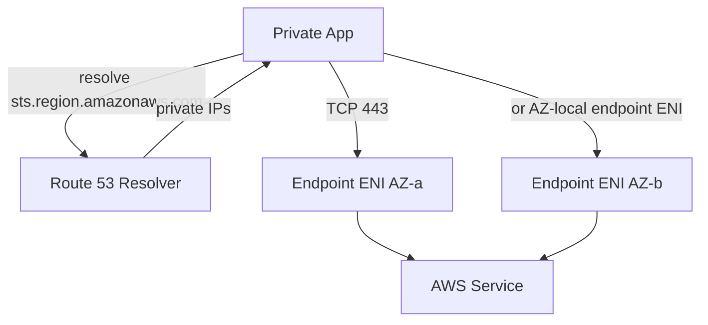

Interface endpoint cocok untuk:

```text
AWS API calls from private subnet without NAT/IGW
Secrets Manager, STS, KMS, CloudWatch Logs, ECR, SSM, EC2 API, EventBridge, etc.
private SaaS exposure
cross-account private service exposure
custom service provider-consumer model using NLB endpoint service
hybrid access when combined with DNS/Resolver design
```

---

## 7. Private DNS: Bagian yang Paling Sering Bikin Bingung

Interface endpoint biasanya memiliki DNS names seperti:

```text
vpce-abc123-xyz.service.region.vpce.amazonaws.com
vpce-abc123-az1-xyz.service.region.vpce.amazonaws.com
```

Jika Private DNS enabled untuk AWS service endpoint, aplikasi tetap bisa memakai hostname publik standar:

```text
secretsmanager.ap-southeast-1.amazonaws.com
```

Tetapi di dalam VPC, DNS resolve ke private IP interface endpoint.

Diagram:

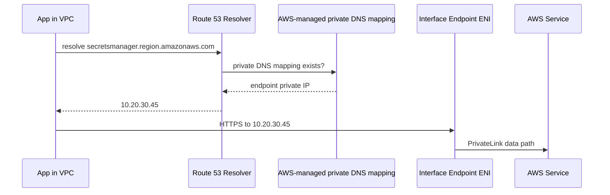

Syarat penting:

```text
VPC DNS resolution enabled
VPC DNS hostnames enabled
Private DNS enabled on endpoint
service supports private DNS
no conflicting private hosted zone/rule overriding name unexpectedly
```

Private DNS adalah alasan aplikasi tidak perlu mengganti endpoint URL. Tetapi Private DNS juga bisa menyembunyikan perubahan data path. Debugging harus membuktikan DNS answer.

Command:

```bash
dig +short secretsmanager.ap-southeast-1.amazonaws.com
```

Jika dari dalam VPC hasilnya private IP endpoint, private DNS aktif. Jika hasilnya public IP AWS service, endpoint mungkin tidak digunakan oleh aplikasi.

---

## 8. Gateway Endpoint vs Interface Endpoint: Perbedaan Fundamental

| Pertanyaan | Gateway Endpoint | Interface Endpoint |
|---|---|---|
| Bagaimana traffic diarahkan? | Route table ke prefix list service. | DNS resolves ke endpoint ENI private IP. |
| Apakah ada ENI endpoint? | Tidak dalam model konsumsi biasa. | Ya, di subnet yang dipilih. |
| Apakah endpoint punya Security Group? | Tidak. | Ya. |
| Apakah ada hourly/data processing cost? | Umumnya tidak ada additional charge untuk S3/DDB gateway endpoint; cek pricing terbaru. | Ada hourly per AZ dan data processing. |
| Apakah bisa untuk banyak AWS services? | Tidak, hanya service tertentu. | Ya, banyak AWS services dan endpoint services. |
| Apakah cocok untuk on-prem via Direct Connect/VPN? | Biasanya tidak sebagai private IP endpoint langsung. | Ya, dengan DNS/Resolver/routing yang benar. |
| Apakah path dikontrol route table? | Ya. | Local VPC routing ke endpoint ENI; selection mostly DNS. |
| Apakah endpoint policy ada? | Ya. | Ya untuk service yang mendukung. |

Rule praktis:

```text
Use gateway endpoint for in-VPC S3/DynamoDB heavy traffic when supported.
Use interface endpoint for AWS APIs, PrivateLink services, hybrid/private DNS use cases, and services not covered by gateway endpoints.
```

---

## 9. Endpoint Policy: Guardrail, Bukan Pengganti IAM

Endpoint policy adalah resource-based policy yang melekat pada VPC endpoint. Ia mengontrol principal/action/resource apa yang boleh memakai endpoint untuk mengakses service.

Tetapi endpoint policy tidak menggantikan:

```text
IAM identity policy
resource policy seperti S3 bucket policy atau KMS key policy
service-specific authorization
SCP/permission boundary
```

Authorization efektif adalah irisan dari beberapa policy layers.

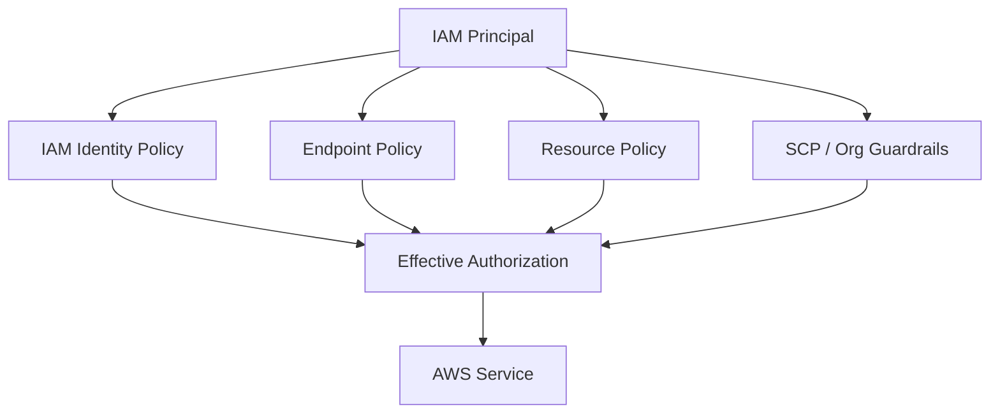

Contoh policy intent:

```text
Only allow this endpoint to access specific S3 bucket.
Only allow PutObject to specific prefix.
Only allow DynamoDB access to specific table.
Only allow specific principals to use endpoint path.
```

Jangan menaruh semua security intent hanya pada endpoint policy. Untuk S3, gabungkan dengan bucket policy condition seperti:

```text
aws:sourceVpce
aws:sourceVpc
aws:PrincipalArn
aws:PrincipalOrgID
```

Tergantung kebutuhan dan service support.

---

## 10. S3 Access Pattern: Gateway Endpoint vs Interface Endpoint

S3 adalah kasus spesial karena bisa melibatkan gateway endpoint dan interface endpoint.

### 10.1 Gateway Endpoint untuk Workload di VPC

Pattern paling umum:

```text
Private EC2/ECS/EKS in VPC -> S3 Gateway Endpoint -> S3
```

Kelebihan:

```text
simple
route-table based
bagus untuk high-volume in-VPC S3 access
mengurangi NAT path
no endpoint security group complexity
```

Kekurangan:

```text
tidak cocok untuk semua hybrid/private DNS scenario
hanya bekerja sesuai route table subnet
policy/debugging berbeda dari interface endpoint
```

### 10.2 Interface Endpoint untuk S3

Interface endpoint S3 berguna untuk skenario seperti:

```text
on-premises access to S3 over private connectivity
centralized endpoint access pattern
PrivateLink-like access behavior
specific DNS routing scenario
```

Tetapi interface endpoint punya cost model berbeda. Jika semua traffic dari VPC internal yang bisa memakai gateway endpoint, menggunakan interface endpoint S3 untuk traffic besar bisa meningkatkan biaya.

AWS memiliki opsi Private DNS khusus untuk S3 interface endpoint agar on-premises dapat resolve ke interface endpoint sementara workload di VPC tetap memakai gateway endpoint untuk optimasi biaya. Ini advanced dan akan dikaitkan lagi di Part 038 Hybrid DNS.

---

## 11. DynamoDB Access Pattern

DynamoDB juga mendukung gateway endpoint dalam pattern klasik.

Pattern:

```text
Application private subnet -> DynamoDB gateway endpoint -> DynamoDB
```

Keuntungan:

```text
tidak perlu NAT untuk DynamoDB calls
route-table scoped
endpoint policy bisa membatasi table/action tertentu
prefix list bisa dipakai pada security controls tertentu
```

Tetapi jika akses datang dari on-prem, peered VPC, atau topology yang tidak cocok dengan gateway endpoint, interface endpoint bisa menjadi opsi, tergantung dukungan dan requirement.

---

## 12. Interface Endpoint Security Group Design

Interface endpoint ENI punya Security Group. Ini sering dilupakan.

Jika app ingin call Secrets Manager endpoint via HTTPS:

```text
Endpoint SG inbound:
  TCP 443 from app security group

App SG outbound:
  TCP 443 to endpoint security group
```

Diagram:

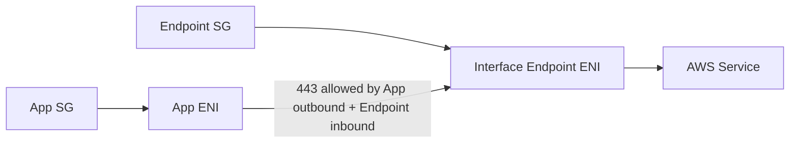

Common failure:

```text
DNS resolves to private endpoint IP.
Route is local.
But connection times out.
Root cause: endpoint SG inbound does not allow app source.
```

Runbook:

```text
1. Resolve DNS; confirm private IP.
2. Identify endpoint ENI private IP and SG.
3. Check endpoint SG inbound 443 from app source/SG.
4. Check app SG outbound 443.
5. Check NACL both subnets.
6. Check endpoint policy and IAM if TCP succeeds but API returns AccessDenied.
```

---

## 13. AZ Placement and Resilience

Interface endpoint is deployed into selected subnets/AZs. Untuk production, buat endpoint di beberapa AZ yang dipakai workload.

Bad pattern:

```text
App in AZ-a, AZ-b, AZ-c
Interface endpoint only in AZ-a
```

Risiko:

```text
cross-AZ dependency
extra data transfer cost potential
AZ-a impairment impacts all service calls
latency/path asymmetry
```

Better pattern:

```text
App subnets: AZ-a, AZ-b, AZ-c
Endpoint subnets: AZ-a, AZ-b, AZ-c
DNS returns appropriate endpoint addresses
```

Diagram:

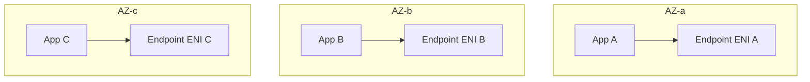

Untuk critical dependencies seperti STS, KMS, Secrets Manager, CloudWatch Logs, ECR, dan SSM, endpoint resilience sering menjadi hidden availability dependency.

---

## 14. Endpoint Inventory untuk Private Workload

Workload private subnet sering butuh banyak AWS API.

Contoh ECS/ECR private deployment bisa membutuhkan endpoint untuk:

```text
ecr.api
ecr.dkr
s3 gateway endpoint for image layers depending path
logs
secretsmanager
kms
ssm / ssmmessages / ec2messages if using SSM
sts if app assumes role dynamically
xray if tracing
cloudwatch / monitoring APIs depending agent
```

Contoh aplikasi Java private subnet:

```text
secretsmanager for secrets
kms for decrypt
dynamodb or rds data path
s3 for object storage
sqs/sns/eventbridge for async messaging
sts for assume role
cloudwatch logs/metrics
```

Kesalahan umum:

```text
Tim membuat endpoint untuk service utama, tetapi lupa dependency sekunder.
Aplikasi tetap butuh NAT Gateway untuk STS/KMS/CloudWatch Logs.
NAT dianggap sudah tidak dipakai, lalu dihapus.
Deployment gagal karena ECR pull tidak lengkap.
```

Rule:

> Jangan mendesain endpoint per “aplikasi utama”; desain endpoint per **runtime dependency graph**.

---

## 15. Dependency Graph untuk Endpoint Design

Sebelum membuat endpoint, buat graph:

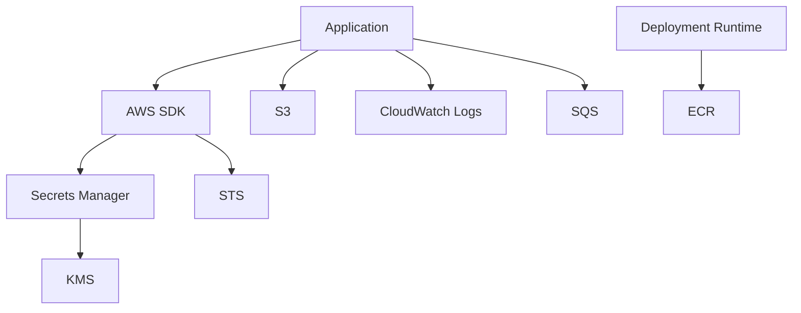

Lalu klasifikasikan:

```text
Gateway endpoint possible?
Interface endpoint needed?
No endpoint support, needs NAT/egress?
Regional endpoint or global endpoint?
Private DNS support?
Endpoint policy supported?
```

Output yang Anda mau:

```text
Aplikasi X tidak butuh NAT untuk normal runtime.
Aplikasi X masih butuh NAT untuk dependency Y karena service/vendor tidak mendukung endpoint.
```

Pernyataan eksplisit seperti ini jauh lebih baik daripada “kita punya endpoint kok”.

---

## 16. Cost Model: Endpoint vs NAT Gateway

Endpoint bukan otomatis lebih murah dalam semua kasus.

High-level model:

```text
Gateway endpoint S3/DynamoDB:
  sering sangat menarik untuk heavy in-VPC traffic karena menghindari NAT data path.

Interface endpoint:
  ada hourly cost per endpoint per AZ dan data processing.
  bisa lebih murah daripada NAT untuk AWS API traffic tertentu.
  bisa lebih mahal jika dibuat terlalu banyak per VPC/account tanpa sharing strategy.

NAT Gateway:
  hourly + data processing.
  sederhana untuk broad internet/API egress.
  bisa mahal untuk high-volume S3 traffic jika tidak memakai gateway endpoint.
```

Decision bukan “endpoint selalu menang”. Decision-nya:

```text
traffic volume
number of AZs
number of endpoints
number of VPCs/accounts
centralized vs decentralized endpoint architecture
security requirement
availability requirement
operational clarity
```

Cost trap:

```text
50 VPCs x 3 AZs x 15 interface endpoints = banyak endpoint-hours.
```

Tetapi centralized endpoint pattern juga tidak gratis karena menambah:

```text
Transit Gateway/peering complexity
DNS complexity
blast radius
cross-AZ/cross-VPC data path
policy coupling
```

Jangan hanya optimize bill. Optimize bill + failure domain + clarity.

---

## 17. Centralized vs Distributed Endpoints

### 17.1 Distributed Endpoint per VPC

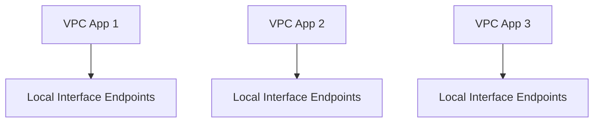

Kelebihan:

```text
simple mental model
local failure domain
local DNS/private DNS works naturally
less shared blast radius
application team autonomy
```

Kekurangan:

```text
more endpoint count
higher endpoint-hour cost
policy duplication
harder centralized governance
```

### 17.2 Centralized Endpoint VPC

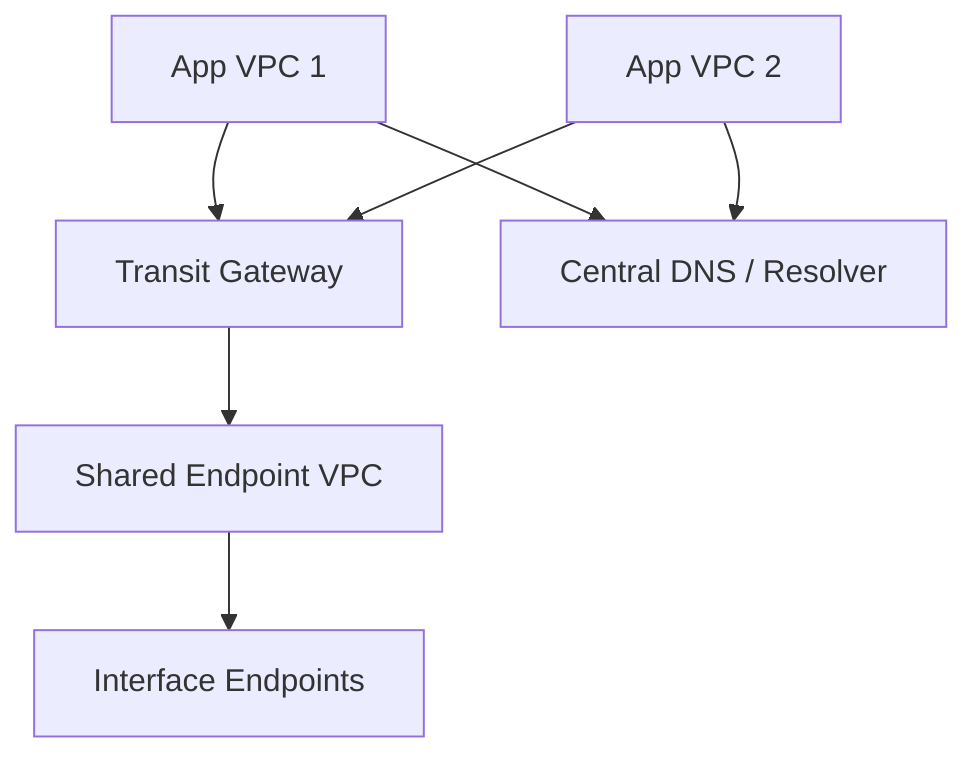

Kelebihan:

```text
centralized control
fewer endpoint objects
central policy management
useful for enterprise shared services
```

Kekurangan:

```text
private DNS does not automatically work across all VPCs the same way
requires Route 53 Resolver/private hosted zone design
creates shared dependency
traffic inspection/routing becomes more complex
possible cross-AZ/cross-VPC cost
```

Decision rule:

```text
Use distributed endpoints by default for critical runtime dependencies unless endpoint sprawl/cost/governance pressure justifies centralization.
Centralize only with explicit DNS, routing, cost, and blast-radius design.
```

---

## 18. Endpoint and DNS in Multi-VPC

Private DNS for interface endpoint is easy in the VPC where endpoint exists. It is not automatically a global magic DNS for all VPCs.

Problem:

```text
Endpoint exists in Shared Services VPC.
App VPC resolves secretsmanager.region.amazonaws.com.
App VPC still gets public service IP or different answer.
```

To centralize endpoints, you need a DNS design, commonly involving:

```text
Route 53 private hosted zones
Route 53 Resolver inbound/outbound endpoints
Resolver forwarding rules
conditional forwarding from on-prem
careful handling of AWS-managed private DNS limitations
```

This gets deep, so we revisit in Part 038. For now, remember:

> Interface endpoint centralization is mostly a DNS architecture problem after it is a networking architecture problem.

---

## 19. Endpoint and Data Exfiltration Control

Endpoints help reduce public internet egress, but they do not automatically prevent data exfiltration.

Example risk:

```text
App has S3 gateway endpoint.
Endpoint policy allows all S3.
IAM role has broad s3:PutObject.
Attacker writes data to attacker-controlled bucket through endpoint.
```

Better controls:

```text
endpoint policy restricts buckets/actions
S3 bucket policy requires aws:sourceVpce for sensitive bucket
IAM policy restricts allowed resources
SCP denies S3 access outside approved conditions
CloudTrail monitors unexpected bucket/API usage
VPC Flow Logs and S3 data events where appropriate
```

For interface endpoints:

```text
endpoint SG restricts who can connect
endpoint policy restricts API use where supported
IAM/resource policies still enforce authorization
CloudTrail captures API calls
```

Security model harus layered.

---

## 20. Endpoint Policy Examples: Conceptual Patterns

### 20.1 Restrict S3 Gateway Endpoint to One Bucket

Conceptual intent:

```json
{
  "Statement": [
    {
      "Effect": "Allow",
      "Principal": "*",
      "Action": ["s3:GetObject", "s3:PutObject", "s3:ListBucket"],
      "Resource": [
        "arn:aws:s3:::company-prod-data",
        "arn:aws:s3:::company-prod-data/*"
      ]
    }
  ]
}
```

In real production, refine:

```text
specific principals
specific actions
specific prefixes
explicit deny where needed
bucket policy with aws:sourceVpce
CloudTrail validation
```

### 20.2 Restrict DynamoDB Endpoint to One Table

Conceptual intent:

```json
{
  "Statement": [
    {
      "Effect": "Allow",
      "Principal": "*",
      "Action": [
        "dynamodb:GetItem",
        "dynamodb:PutItem",
        "dynamodb:Query",
        "dynamodb:UpdateItem"
      ],
      "Resource": "arn:aws:dynamodb:ap-southeast-1:123456789012:table/Orders"
    }
  ]
}
```

Endpoint policy should usually be narrower than “all actions/all resources”, but not so clever that no one can debug it.

---

## 21. Route Table Debugging for Gateway Endpoint

Question:

```text
Why is private subnet still sending S3 traffic through NAT?
```

Checklist:

```text
[ ] Does the VPC have S3 gateway endpoint?
[ ] Is the endpoint associated with the route table used by this subnet?
[ ] Does route table contain prefix list route to vpce target?
[ ] Is application using regional S3 endpoint compatible with endpoint path?
[ ] Is custom DNS resolving S3 to expected AWS IP ranges?
[ ] Is endpoint policy allowing access?
[ ] Is bucket policy denying because sourceVpce/sourceVpc condition mismatch?
```

Important: Gateway endpoint route appears in route table. If subnet uses a different route table, endpoint is irrelevant for that subnet.

---

## 22. DNS Debugging for Interface Endpoint

Question:

```text
Why is private subnet still using public AWS service endpoint?
```

Checklist:

```text
[ ] Interface endpoint exists for the correct service and region.
[ ] Endpoint is in Available state.
[ ] Private DNS is enabled if application uses public service hostname.
[ ] VPC DNS hostnames and DNS resolution are enabled.
[ ] Application uses regional hostname, not hardcoded global/legacy endpoint.
[ ] Custom DNS forwards AWS service query to Route 53 Resolver correctly.
[ ] No private hosted zone overrides the name incorrectly.
[ ] dig/nslookup from the actual workload returns private IP.
```

Commands:

```bash
# Resolve service hostname from inside workload subnet
dig +short secretsmanager.ap-southeast-1.amazonaws.com

# Compare with public resolver if useful
dig @8.8.8.8 +short secretsmanager.ap-southeast-1.amazonaws.com

# Test TCP path
nc -vz secretsmanager.ap-southeast-1.amazonaws.com 443

# Test AWS API with debug if using CLI
aws secretsmanager list-secrets --debug
```

Expected with Private DNS:

```text
inside VPC -> private IP of endpoint ENI
outside VPC -> public AWS service IP/name behavior
```

---

## 23. TCP vs Authorization Failure

Endpoint failures split into two categories:

```text
Network path failure:
  timeout
  connection refused
  TLS cannot connect
  DNS does not resolve

Authorization/policy failure:
  AccessDenied
  explicit deny
  endpoint policy deny
  resource policy deny
  KMS deny
```

Do not debug `AccessDenied` by changing route tables.

Use this sequence:

```text
1. DNS resolves to expected endpoint/private route?
2. TCP 443 reachable?
3. TLS handshake works?
4. AWS API returns identity/auth error or success?
5. CloudTrail shows which principal/action/resource/condition failed?
6. Endpoint policy/resource policy/IAM evaluated?
```

This ordering prevents random changes.

---

## 24. Common Production Failures

### Failure 1 — Endpoint Created in Wrong Region

```text
Symptom:
  App in ap-southeast-1 still exits via NAT for service calls.

Root cause:
  Endpoint exists in different region or app uses endpoint hostname for another region.

Fix:
  Create endpoint for exact regional service endpoint used by SDK/app.
```

### Failure 2 — Private DNS Disabled

```text
Symptom:
  Interface endpoint exists, but app resolves public AWS service IP.

Root cause:
  Private DNS not enabled or VPC DNS attributes disabled.

Fix:
  Enable private DNS and required VPC DNS attributes; validate with dig from workload.
```

### Failure 3 — Endpoint SG Blocks App

```text
Symptom:
  DNS returns private IP, TCP timeout.

Root cause:
  Interface endpoint Security Group inbound lacks 443 from app SG/CIDR.

Fix:
  Add inbound rule from app SG or subnet CIDR as appropriate.
```

### Failure 4 — Gateway Endpoint Not Associated with Subnet Route Table

```text
Symptom:
  S3 traffic still charged through NAT.

Root cause:
  Endpoint route added to route table A, workload subnet uses route table B.

Fix:
  Associate endpoint with correct route table(s).
```

### Failure 5 — Bucket Policy Requires Wrong `aws:sourceVpce`

```text
Symptom:
  TCP path fine, S3 returns AccessDenied.

Root cause:
  Bucket policy requires specific endpoint ID, app uses another endpoint/path.

Fix:
  Align bucket policy condition with actual endpoint/source path.
```

### Failure 6 — STS/KMS Missing in Private Runtime

```text
Symptom:
  App can reach S3 but fails decrypt/assume-role/secret retrieval without NAT.

Root cause:
  Endpoint set incomplete; hidden SDK/runtime dependencies not included.

Fix:
  Build dependency graph and add required endpoints or keep controlled NAT path.
```

### Failure 7 — Centralized Endpoint DNS Broken

```text
Symptom:
  App VPC cannot resolve AWS service hostname to endpoint IP in shared endpoint VPC.

Root cause:
  Private DNS is local to endpoint VPC behavior; cross-VPC DNS design missing.

Fix:
  Implement Route 53 Resolver/private hosted zone design deliberately.
```

---

## 25. Production Endpoint Design Template

For each endpoint, document:

```text
Endpoint Name:
Service:
Endpoint Type: Gateway / Interface
Region:
VPC:
Subnets/AZs:
Route Tables:
Private DNS: enabled/disabled/N/A
Security Group:
Endpoint Policy:
Dependent Applications:
Expected DNS Names:
Expected Source Path:
Expected CloudTrail Events:
Cost Owner:
Failure Impact:
Rollback Plan:
```

Example:

```text
Endpoint Name: prod-shared-secretsmanager
Service: com.amazonaws.ap-southeast-1.secretsmanager
Endpoint Type: Interface
Region: ap-southeast-1
VPC: prod-app-vpc
Subnets/AZs: app-endpoint-a, app-endpoint-b, app-endpoint-c
Private DNS: enabled
Security Group: sg-vpce-secretsmanager, inbound 443 from sg-app-runtime
Endpoint Policy: allow GetSecretValue/DescribeSecret for approved secret ARNs
Dependent Applications: orders-api, payment-worker
Failure Impact: secret refresh failure, deployment startup failure
Rollback Plan: controlled NAT egress temporary route + incident approval
```

This style prevents tribal knowledge.

---

## 26. Recommended Baseline Endpoint Set

There is no universal baseline, but many private AWS workloads need some combination of:

```text
S3 gateway endpoint
DynamoDB gateway endpoint if used
STS interface endpoint
KMS interface endpoint
Secrets Manager interface endpoint
CloudWatch Logs interface endpoint
ECR API endpoint
ECR Docker endpoint
SSM endpoints if using Session Manager/patching/agent
SQS/SNS/EventBridge endpoints if used
X-Ray endpoint if tracing used
```

Do not blindly create all endpoints everywhere. Use this decision flow:

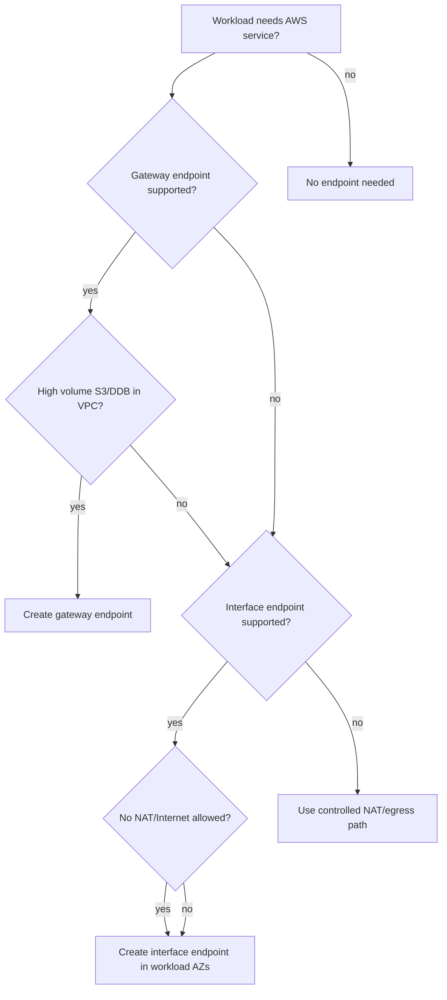

The flow says “create interface” in many cases, but production teams should still review cost, sharing, and operational dependency.

---

## 27. Endpoint Observability

For endpoint-heavy architectures, monitor:

```text
NAT Gateway bytes drop after gateway endpoint deployment
VPC Flow Logs to endpoint ENI IPs
CloudTrail API calls with sourceVpce/sourceVpc context where available
Endpoint CloudWatch metrics where service exposes them
DNS query logs for service hostnames
AccessDenied spikes after endpoint policy changes
endpoint ENI health/status
cross-AZ traffic pattern if endpoints missing in some AZs
```

Useful questions:

```text
Which apps are still using NAT for AWS API calls?
Which AWS service hostnames are most queried?
Which endpoint policies denied calls recently?
Which endpoints have no traffic and can be removed?
Which endpoints are single-AZ for multi-AZ workloads?
```

---

## 28. Endpoint IaC Design

Endpoint configuration should be Infrastructure as Code.

Module inputs:

```hcl
vpc_id
subnet_ids_by_az
route_table_ids
service_name
endpoint_type
private_dns_enabled
security_group_rules
endpoint_policy_json
tags
```

Module outputs:

```hcl
endpoint_id
endpoint_dns_names
endpoint_network_interface_ids
security_group_id
prefix_list_id_if_gateway
```

Guardrails:

```text
interface endpoint must be multi-AZ for prod critical services
private DNS enabled by default for AWS services unless exception documented
gateway endpoint must associate all intended private route tables
endpoint policy cannot default to wildcard in regulated environments unless exception approved
endpoint SG inbound should reference app SG where possible
```

---

## 29. Hands-On Lab: S3 Gateway Endpoint

Goal:

```text
Private EC2 accesses S3 without using NAT Gateway.
```

Topology:

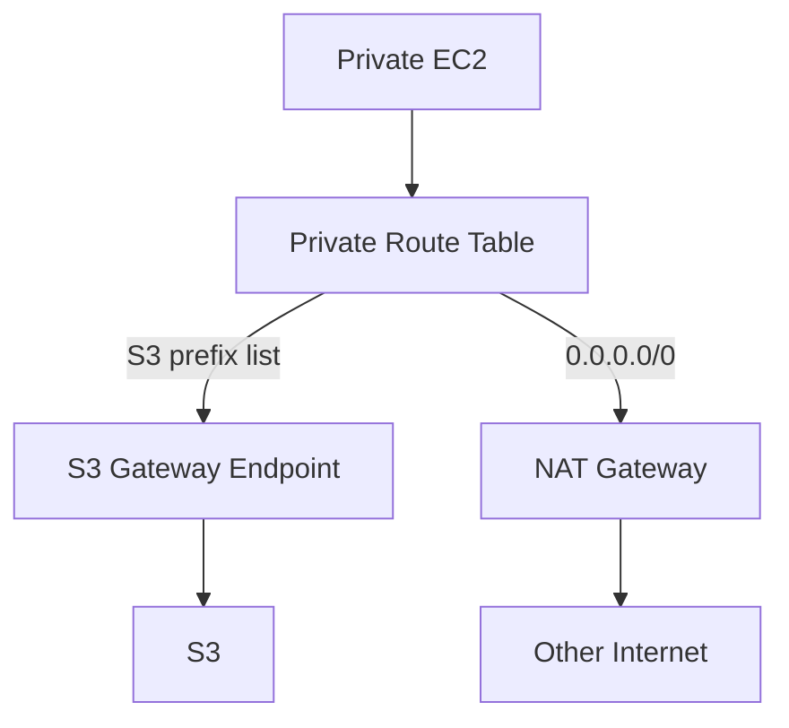

Steps:

```text
1. Create S3 bucket for test.
2. Create S3 gateway endpoint in VPC.
3. Associate endpoint with private subnet route table.
4. Attach endpoint policy allowing test bucket access.
5. Add/adjust bucket policy if testing sourceVpce condition.
6. From EC2, run AWS CLI S3 commands.
7. Confirm route table has prefix list route to endpoint.
8. Observe NAT bytes before/after heavy S3 transfer.
```

Validation:

```bash
aws s3 ls s3://your-test-bucket
aws s3 cp test.bin s3://your-test-bucket/test.bin
```

Debug if failed:

```text
AccessDenied -> IAM/endpoint policy/bucket policy.
Timeout -> route table/NACL/DNS/network path.
Still using NAT -> route table not associated or endpoint not matching path.
```

---

## 30. Hands-On Lab: Secrets Manager Interface Endpoint

Goal:

```text
Private EC2 retrieves secret without NAT/Internet route.
```

Topology:

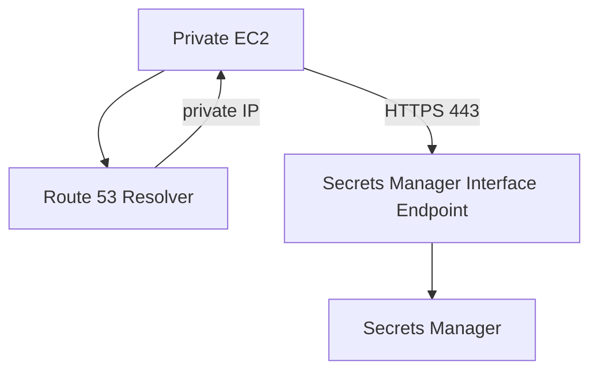

Steps:

```text
1. Create interface endpoint for Secrets Manager in app VPC.
2. Select subnets in all workload AZs.
3. Enable private DNS.
4. Attach endpoint SG allowing inbound 443 from EC2/app SG.
5. Give EC2 IAM role permission to read a test secret.
6. Optionally restrict endpoint policy to test secret ARN.
7. Remove/avoid NAT path for test subnet if safe.
8. Retrieve secret from EC2.
```

Validation:

```bash
# DNS should resolve to private endpoint IP from inside VPC
dig +short secretsmanager.ap-southeast-1.amazonaws.com

# API call
aws secretsmanager get-secret-value --secret-id your-secret-name
```

Expected failure interpretation:

```text
DNS public IP -> private DNS issue.
TCP timeout -> endpoint SG/NACL/subnet issue.
AccessDenied -> IAM/endpoint policy/secret policy/KMS policy issue.
KMS AccessDenied -> secret retrieval reached service but decrypt path denied.
```

---

## 31. Endpoint Decision Framework

When deciding endpoint strategy, ask in this order:

```text
1. What exact service/API does workload call?
2. Is the call runtime-critical, deployment-critical, or optional telemetry?
3. Does service support gateway endpoint, interface endpoint, or both?
4. Is traffic high-volume data plane or low-volume control/API plane?
5. Does the workload live in one VPC, many VPCs, or hybrid/on-prem?
6. Is private DNS required to avoid app config changes?
7. What endpoint policy/resource policy/IAM combination is required?
8. What AZs need local endpoint ENIs?
9. What is the NAT cost avoided vs endpoint cost added?
10. What breaks if endpoint is unavailable?
```

Output should be a decision record:

```text
We use S3 gateway endpoint for in-VPC object access because traffic is high-volume and route-table scoped access is sufficient.
We use Secrets Manager interface endpoint because private runtime cannot depend on NAT and SDK calls must use standard regional hostname through Private DNS.
We keep NAT for vendor API X because it has no PrivateLink support and requires IPv4 source allowlist.
```

---

## 32. Anti-Patterns

### Anti-Pattern 1 — “We Have Endpoints, So We Can Delete NAT”

Maybe. But only if all runtime/deployment/telemetry dependencies are covered.

NAT removal requires dependency proof, not endpoint existence.

### Anti-Pattern 2 — Single-AZ Interface Endpoint for Multi-AZ App

This creates hidden AZ dependency and possibly cross-AZ path.

### Anti-Pattern 3 — Default Allow-All Endpoint Policies in Regulated Systems

Endpoint policies are not your only control, but leaving them wide open wastes a useful guardrail.

### Anti-Pattern 4 — Centralized Endpoints Without DNS Architecture

Routing to endpoint VPC is not enough. Workload must resolve service names to endpoint private addresses correctly.

### Anti-Pattern 5 — Treating `AccessDenied` as Network Failure

If AWS API returns `AccessDenied`, packet path reached the service. Debug policy layers.

### Anti-Pattern 6 — S3 Interface Endpoint for All VPC S3 Traffic Without Cost Review

S3 gateway endpoint may be more appropriate for in-VPC high-volume access. Interface endpoint S3 has specific use cases.

---

## 33. Review Questions

1. Apa perbedaan mekanisme data path gateway endpoint dan interface endpoint?
2. Kenapa route table association penting untuk gateway endpoint?
3. Kenapa Private DNS penting untuk interface endpoint AWS services?
4. Apa yang terjadi jika DNS resolve ke endpoint private IP tetapi TCP timeout?
5. Kenapa endpoint policy tidak menggantikan IAM policy atau S3 bucket policy?
6. Kapan S3 gateway endpoint lebih tepat daripada S3 interface endpoint?
7. Kenapa centralized endpoint architecture terutama menjadi DNS problem?
8. Bagaimana Anda membuktikan aplikasi masih menggunakan NAT untuk AWS service traffic?
9. Apa risiko membuat interface endpoint hanya di satu AZ?
10. Apa dependency tersembunyi yang sering lupa saat private subnet menarik image dari ECR?

---

## 34. Key Takeaways

```text
VPC endpoint is not just security decoration. It is a data path primitive.
```

Yang harus melekat:

```text
1. Gateway endpoint bekerja lewat route table dan prefix list.
2. Interface endpoint bekerja lewat endpoint ENI, Security Group, PrivateLink, dan DNS.
3. Private DNS membuat aplikasi tetap memakai hostname standar tetapi resolve ke private endpoint IP.
4. Endpoint policy adalah guardrail tambahan, bukan pengganti IAM/resource policy.
5. S3/DynamoDB gateway endpoints sangat penting untuk private high-volume service access.
6. Interface endpoints penting untuk AWS API access tanpa NAT/Internet.
7. Endpoint design harus mengikuti dependency graph, bukan daftar service populer.
8. Centralized endpoints butuh DNS/routing/cost/blast-radius design yang eksplisit.
9. Debugging harus memisahkan DNS, TCP path, TLS, dan authorization.
```

Jika Anda mengingat satu kalimat:

> Gateway endpoint adalah route decision; interface endpoint adalah DNS-to-private-ENI decision.

---

## 35. Source Anchors

Materi ini disusun berdasarkan dokumentasi resmi AWS tentang:

- AWS PrivateLink concepts.
- Interface VPC endpoints.
- Gateway endpoints.
- S3 gateway/interface endpoint behavior.
- DynamoDB gateway endpoint behavior.
- Endpoint policies.
- Private DNS for interface endpoints.
- Centralized access to VPC private endpoints.

Referensi utama:

```text
https://docs.aws.amazon.com/vpc/latest/privatelink/concepts.html
https://docs.aws.amazon.com/vpc/latest/privatelink/interface-endpoints.html
https://docs.aws.amazon.com/vpc/latest/privatelink/create-interface-endpoint.html
https://docs.aws.amazon.com/vpc/latest/privatelink/gateway-endpoints.html
https://docs.aws.amazon.com/vpc/latest/privatelink/vpc-endpoints-s3.html
https://docs.aws.amazon.com/vpc/latest/privatelink/vpc-endpoints-ddb.html
https://docs.aws.amazon.com/vpc/latest/privatelink/vpc-endpoints-access.html
https://docs.aws.amazon.com/whitepapers/latest/building-scalable-secure-multi-vpc-network-infrastructure/centralized-access-to-vpc-private-endpoints.html
```
