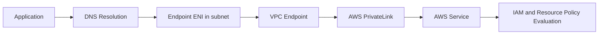
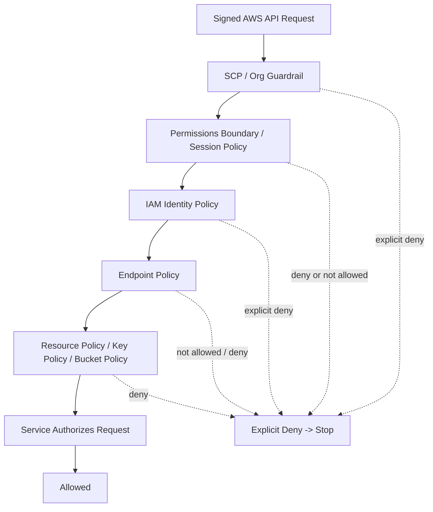
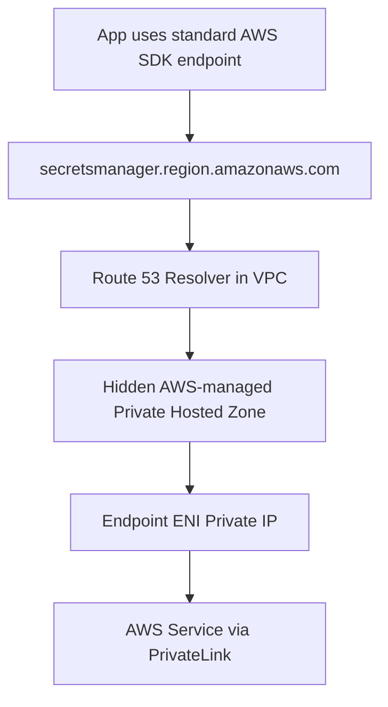
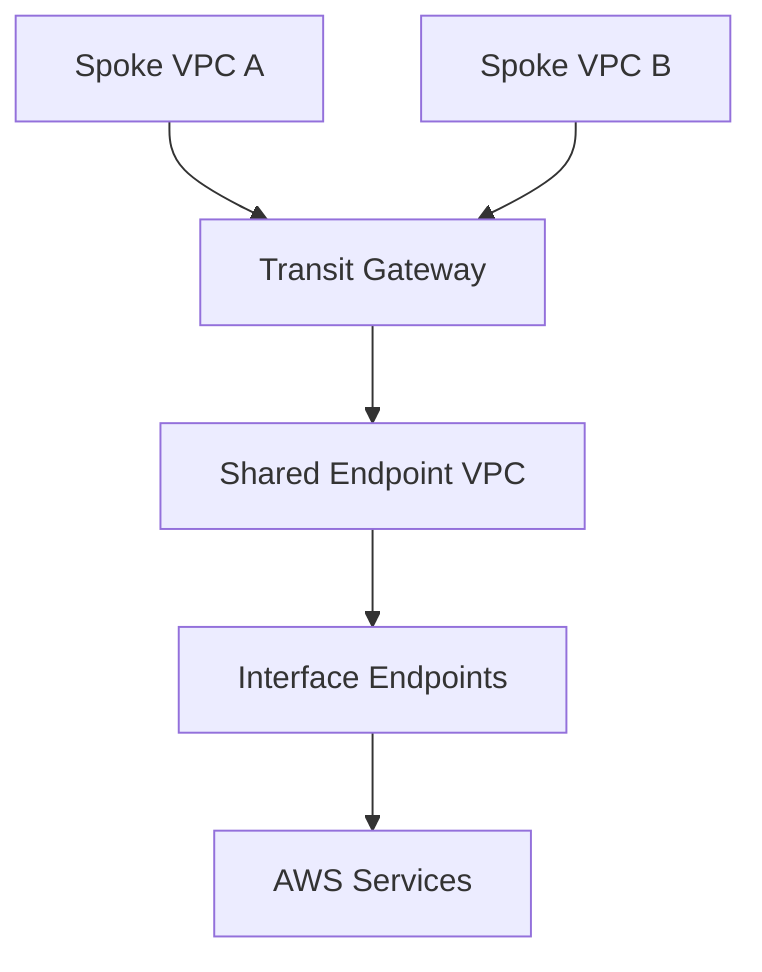
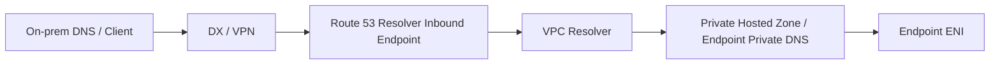
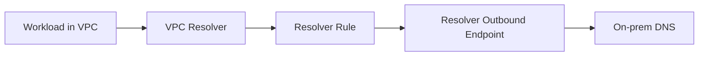
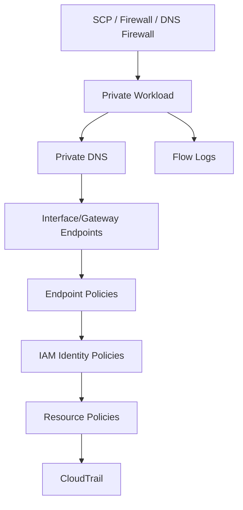

# Part 019 — Endpoint Policies and Private DNS

Part sebelumnya menjelaskan dua primitive utama VPC endpoint:

```text
Gateway endpoint   -> route-table decision
Interface endpoint -> DNS-to-private-ENI decision
```

Part ini memperdalam dua area yang sering menyebabkan bug produksi:

```text
1. Endpoint policy
2. Private DNS
```

Keduanya sering terlihat seperti detail konfigurasi. Di sistem produksi, keduanya adalah mekanisme kontrol yang menentukan:

```text
apakah aplikasi memakai private path atau masih keluar via NAT
apakah request boleh melewati endpoint
apakah service melihat request dari VPC endpoint tertentu
apakah guardrail organisasi benar-benar enforceable
apakah debugging network timeout salah diarahkan ke IAM problem
apakah AccessDenied salah diarahkan ke routing problem
```

Mental model paling penting:

> VPC endpoint tidak otomatis berarti private access yang aman. Endpoint hanya menyediakan path. Policy dan DNS menentukan siapa yang bisa memakai path itu dan apakah aplikasi benar-benar memilih path itu.

---

## 1. Masalah Nyata yang Ingin Diselesaikan

Bayangkan workload private subnet memanggil AWS API:

```text
app -> sts.amazonaws.com
app -> kms.region.amazonaws.com
app -> ecr.api.region.amazonaws.com
app -> s3.region.amazonaws.com
app -> secretsmanager.region.amazonaws.com
```

Pertanyaan production engineer bukan hanya:

```text
Apakah ada endpoint?
```

Pertanyaan yang benar:

```text
1. Hostname apa yang dipakai aplikasi?
2. Hostname itu resolve ke IP mana dari dalam VPC?
3. Packet masuk ke endpoint ENI atau ke NAT Gateway?
4. Endpoint policy mengizinkan principal/action/resource itu?
5. IAM identity policy mengizinkan action itu?
6. Resource policy mengizinkan caller dari VPC endpoint itu?
7. SCP/permissions boundary/session policy menolak request itu?
8. Service yang dituju mendukung endpoint policy/PrivateLink behavior yang diharapkan?
9. Apakah DNS behavior sama dari EC2, container, Lambda, on-prem, dan peered VPC?
```

Jika jawaban Anda berhenti di “sudah ada endpoint”, desainnya belum cukup matang.

---

## 2. Request Path Melalui Interface Endpoint

Untuk interface endpoint AWS service, path konseptualnya seperti ini:



Yang sering disalahpahami:

```text
Private DNS memutuskan apakah hostname standar AWS service resolve ke endpoint ENI.
Security Group endpoint ENI memutuskan apakah TCP dari workload boleh masuk ke endpoint ENI.
Endpoint policy memutuskan apakah principal tertentu boleh menggunakan endpoint untuk action/resource tertentu.
IAM/resource policy memutuskan apakah AWS API request itu valid dari sisi authorization service.
```

Jadi ada beberapa lapisan kegagalan:

```text
DNS failure       -> hostname tidak resolve ke IP endpoint
TCP failure       -> SG/NACL/route/endpoint ENI/AZ issue
TLS failure       -> wrong hostname, proxy, inspection, custom endpoint mistake
Auth failure      -> AccessDenied dari IAM/resource/SCP/endpoint policy
Service failure   -> quota, throttling, service-side validation
```

Jangan mencampur semuanya menjadi “network error”.

---

## 3. Endpoint Policy: Apa Sebenarnya?

Endpoint policy adalah policy berbasis resource yang ditempel pada VPC endpoint.

Ia menjawab pertanyaan:

```text
Request seperti apa yang boleh melewati endpoint ini menuju service tujuan?
```

Contoh sederhana:

```json
{
  "Statement": [
    {
      "Effect": "Allow",
      "Principal": "*",
      "Action": [
        "s3:GetObject"
      ],
      "Resource": [
        "arn:aws:s3:::example-prod-artifacts/*"
      ]
    }
  ]
}
```

Tetapi jangan salah:

```text
Endpoint policy tidak memberikan akses sendirian.
Endpoint policy tidak menggantikan IAM identity policy.
Endpoint policy tidak menggantikan bucket policy/KMS key policy/Secrets Manager resource policy.
Endpoint policy tidak override explicit deny.
Endpoint policy tidak tersedia sama untuk semua service.
```

Anggap endpoint policy sebagai gerbang tambahan di path:

```text
principal must be allowed by identity/resource policy
AND
request must be allowed by endpoint policy
AND
not denied by SCP/boundary/session/resource/etc
```

---

## 4. Default Endpoint Policy adalah Full Access

Jika Anda membuat endpoint tanpa custom endpoint policy, default policy biasanya memberi akses penuh ke endpoint:

```json
{
  "Statement": [
    {
      "Effect": "Allow",
      "Principal": "*",
      "Action": "*",
      "Resource": "*"
    }
  ]
}
```

Artinya:

```text
Endpoint ada != endpoint membatasi akses.
```

Endpoint dengan default policy terutama menyediakan private path. Ia belum menjadi least-privilege guardrail.

Production implication:

```text
Kalau security requirement Anda adalah “workload private subnet hanya boleh membaca S3 bucket X melalui endpoint Y”, maka endpoint policy saja tidak cukup. Anda juga perlu bucket policy/resource policy/identity policy condition yang mengikat source endpoint/source VPC/source org sesuai kebutuhan.
```

---

## 5. Policy Evaluation Stack untuk Request via Endpoint

Untuk AWS API call via endpoint, evaluasi konseptualnya seperti ini:



Real IAM evaluation punya detail formal yang lebih kompleks, tetapi mental model operational-nya:

```text
Any explicit deny wins.
Every required allow must exist.
Endpoint policy is only one layer.
```

Ketika aplikasi mendapat `AccessDenied`, packet sudah mencapai service endpoint. Itu bukan bukti routing gagal.

---

## 6. Endpoint Policy vs Resource Policy

Perbedaan praktis:

| Layer | Ditempel di | Menjawab |
|---|---|---|
| Identity policy | IAM user/role | Principal ini boleh melakukan action apa? |
| Endpoint policy | VPC endpoint | Request apa yang boleh melewati endpoint ini? |
| Resource policy | Resource service | Siapa boleh mengakses resource ini, dari kondisi apa? |
| SCP | AWS Organizations account boundary | Account/OU ini maksimum boleh apa? |
| Permissions boundary | IAM principal boundary | Principal ini maksimum boleh apa walau policy mengizinkan? |

Contoh requirement:

```text
EC2 role AppRole hanya boleh membaca bucket prod-artifacts melalui VPC endpoint vpce-abc.
```

Anda biasanya butuh kombinasi:

```text
1. IAM role AppRole allows s3:GetObject on bucket/object.
2. Endpoint policy allows AppRole or allowed principal set to use endpoint for s3:GetObject.
3. Bucket policy denies access unless aws:SourceVpce == vpce-abc or another approved condition.
4. Optional SCP denies risky S3 actions or public access organization-wide.
```

Kenapa bucket policy penting?

Karena tanpa bucket policy, role yang punya permission bisa saja mengakses bucket lewat path lain:

```text
private subnet -> NAT Gateway -> S3 public endpoint
developer laptop -> internet -> S3 public endpoint
another VPC -> other endpoint -> S3
```

Endpoint policy membatasi endpoint. Resource policy membatasi resource.

---

## 7. Menggunakan `aws:SourceVpce` dan `aws:SourceVpc`

Condition key umum untuk resource policy:

```text
aws:SourceVpce -> request harus berasal dari VPC endpoint tertentu
aws:SourceVpc  -> request harus berasal dari VPC tertentu
```

Contoh bucket policy pattern:

```json
{
  "Version": "2012-10-17",
  "Statement": [
    {
      "Sid": "DenyAccessUnlessFromApprovedEndpoint",
      "Effect": "Deny",
      "Principal": "*",
      "Action": "s3:*",
      "Resource": [
        "arn:aws:s3:::example-prod-artifacts",
        "arn:aws:s3:::example-prod-artifacts/*"
      ],
      "Condition": {
        "StringNotEquals": {
          "aws:SourceVpce": "vpce-0123456789abcdef0"
        }
      }
    }
  ]
}
```

Kuat, tetapi berbahaya jika tidak dipahami.

Konsekuensi:

```text
1. Akses dari AWS Console atau laptop bisa ikut terblokir.
2. Cross-account automation bisa gagal jika tidak lewat endpoint yang sama.
3. Backup/replication/service integration tertentu mungkin tidak membawa condition yang Anda harapkan.
4. Break-glass path harus dirancang sebelum policy diterapkan.
```

Rule of thumb:

```text
Use explicit deny carefully.
Test with non-production bucket/resource first.
Have a rollback principal/path that is not accidentally denied.
```

---

## 8. Endpoint Policy untuk Gateway Endpoint

Gateway endpoint umum dipakai untuk:

```text
S3
DynamoDB
```

Gateway endpoint policy attached ke endpoint. Untuk gateway endpoint, ada detail penting:

```text
Principal di endpoint policy gateway endpoint harus menggunakan "*".
Jika ingin membatasi principal, gunakan condition seperti aws:PrincipalArn.
```

Contoh gateway endpoint policy untuk membatasi role tertentu:

```json
{
  "Version": "2012-10-17",
  "Statement": [
    {
      "Effect": "Allow",
      "Principal": "*",
      "Action": [
        "s3:GetObject",
        "s3:ListBucket"
      ],
      "Resource": [
        "arn:aws:s3:::example-prod-artifacts",
        "arn:aws:s3:::example-prod-artifacts/*"
      ],
      "Condition": {
        "StringEquals": {
          "aws:PrincipalArn": "arn:aws:iam::111122223333:role/prod-app-role"
        }
      }
    }
  ]
}
```

Jangan menaruh asumsi bahwa `Principal` langsung bekerja seperti bucket policy biasa pada semua endpoint type.

---

## 9. Endpoint Policy untuk Interface Endpoint

Interface endpoint policy mirip resource policy yang membatasi penggunaan endpoint menuju AWS service.

Contoh untuk Secrets Manager:

```json
{
  "Version": "2012-10-17",
  "Statement": [
    {
      "Effect": "Allow",
      "Principal": "*",
      "Action": [
        "secretsmanager:GetSecretValue",
        "secretsmanager:DescribeSecret"
      ],
      "Resource": [
        "arn:aws:secretsmanager:ap-southeast-1:111122223333:secret:prod/payments/*"
      ]
    }
  ]
}
```

Namun availability fitur berbeda antar service. Selalu cek dokumentasi service endpoint terkait.

Pattern production:

```text
Do not assume every interface endpoint supports endpoint policies.
Do not assume every action/resource condition is interpreted identically by every service.
Do not treat endpoint policy as your only authorization boundary.
```

---

## 10. Private DNS: Apa Sebenarnya Diubah?

Tanpa Private DNS, aplikasi biasanya resolve public regional endpoint:

```text
secretsmanager.ap-southeast-1.amazonaws.com -> public AWS service IPs
```

Dengan interface endpoint dan Private DNS enabled:

```text
secretsmanager.ap-southeast-1.amazonaws.com -> private IP endpoint ENI di VPC
```

Aplikasi tidak perlu mengubah URL.



Inilah alasan Private DNS sangat penting:

```text
AWS SDK default endpoint tetap sama.
Kode aplikasi tidak berubah.
DNS dari dalam VPC memilih private path.
```

---

## 11. Private DNS Prerequisites

Untuk Private DNS interface endpoint AWS service, VPC harus punya DNS support yang benar:

```text
enableDnsSupport   = true
enableDnsHostnames = true
```

Jika salah satu mati, gejala yang muncul bisa membingungkan:

```text
endpoint created successfully
private DNS option enabled or expected
application still resolves public IP
traffic still goes to NAT
```

Checklist:

```bash
aws ec2 describe-vpcs \
  --vpc-ids vpc-xxxxxxxx \
  --query 'Vpcs[*].{VpcId:VpcId}'

aws ec2 describe-vpc-attribute \
  --vpc-id vpc-xxxxxxxx \
  --attribute enableDnsSupport

aws ec2 describe-vpc-attribute \
  --vpc-id vpc-xxxxxxxx \
  --attribute enableDnsHostnames
```

Atau di Terraform:

```hcl
resource "aws_vpc" "main" {
  cidr_block           = "10.40.0.0/16"
  enable_dns_support   = true
  enable_dns_hostnames = true
}
```

---

## 12. Regional vs Zonal Endpoint DNS Names

Interface endpoint biasanya punya DNS entries seperti:

```text
vpce-abc123.service.region.vpce.amazonaws.com
vpce-abc123-az1.service.region.vpce.amazonaws.com
vpce-abc123-az2.service.region.vpce.amazonaws.com
service.region.amazonaws.com   # hidden PHZ mapping if private DNS enabled
```

Mental model:

```text
Regional endpoint DNS name -> dapat resolve ke endpoint ENI di beberapa AZ
Zonal endpoint DNS name    -> menunjuk endpoint ENI di AZ tertentu
Public service DNS name    -> bisa di-override oleh hidden private hosted zone
```

Kapan memakai zonal DNS name?

```text
rarely in app code
sometimes for deterministic testing
sometimes for controlled diagnosis
usually avoid hardcoding unless you know failure/cost trade-offs
```

Kebanyakan aplikasi production sebaiknya memakai standard service hostname dan biarkan Private DNS bekerja.

---

## 13. Hidden AWS-Managed Private Hosted Zone

Private DNS untuk interface endpoint bukan berarti AWS mengubah public DNS global.

Yang terjadi:

```text
AWS membuat hidden, AWS-managed Private Hosted Zone yang diasosiasikan dengan VPC endpoint VPC.
Zone ini membuat service public hostname resolve ke endpoint ENI private IP dari dalam VPC.
```

Konsekuensi penting:

```text
1. PHZ itu tidak Anda kelola langsung seperti Route 53 hosted zone biasa.
2. Scope-nya adalah VPC tempat endpoint dibuat.
3. VPC lain tidak otomatis mendapatkan resolusi private ini hanya karena routing terhubung.
4. On-prem tidak otomatis bisa resolve private endpoint DNS tanpa Resolver endpoint/rule.
5. Centralized endpoint architecture terutama adalah DNS architecture problem.
```

Ini menjelaskan kenapa centralized endpoint VPC sering gagal:

```text
Spoke VPC routes to endpoint VPC
BUT spoke resolver still resolves AWS service hostname to public IP
=> traffic goes to NAT/IGW or fails, not endpoint
```

---

## 14. Private DNS dan Centralized Endpoint VPC

Arsitektur centralized endpoint sering terlihat menarik:



Tetapi routing saja tidak cukup.

Ada dua masalah:

```text
1. DNS in spoke VPC must resolve service hostname to endpoint private IP in endpoint VPC.
2. Route tables/NACL/SG/TGW must allow traffic from spoke CIDRs to endpoint ENIs.
```

Jika memakai AWS-managed private DNS bawaan endpoint:

```text
Hanya endpoint VPC yang mendapatkan hidden PHZ mapping.
Spoke VPC tidak otomatis mendapatkan mapping tersebut.
```

Solusi umum:

```text
1. Buat Route 53 private hosted zone sendiri untuk service domain yang dibutuhkan.
2. Associate PHZ ke spoke VPC.
3. Buat records yang mengarah ke endpoint DNS/IP sesuai desain.
4. Atau gunakan Route 53 Resolver inbound/outbound endpoint + forwarding rules.
5. Pastikan behavior tidak konflik dengan service private DNS bawaan.
```

Trade-off:

```text
Centralized endpoints mengurangi duplikasi endpoint, tetapi menambah kompleksitas DNS, routing, blast radius, dan cross-AZ/cross-VPC data processing.
Distributed endpoints lebih mahal secara jumlah endpoint, tetapi lebih sederhana, AZ-local, dan blast radius lebih kecil.
```

---

## 15. Private DNS dan Hybrid/on-prem

On-prem client tidak bisa langsung memakai Route 53 Resolver VPC dari luar VPC.

Untuk hybrid resolution, pattern umum:



Atau untuk outbound forwarding dari VPC ke on-prem:



Hybrid DNS failure sering muncul sebagai:

```text
works from EC2
fails from on-prem
works from one VPC
fails from another VPC
works with endpoint-specific vpce DNS name
fails with standard AWS service hostname
```

Diagnosis harus membandingkan resolver path, bukan hanya packet path.

---

## 16. DNS Resolution Test Matrix

Untuk endpoint private DNS, jangan hanya test dari satu host.

Buat matrix:

| Source | Query | Expected Result |
|---|---|---|
| EC2 same VPC | `service.region.amazonaws.com` | endpoint private IP |
| ECS task same VPC | same | endpoint private IP |
| Lambda in VPC | same | endpoint private IP |
| Spoke VPC | same | depends on centralized DNS design |
| On-prem | same | depends on Resolver inbound/rules |
| Developer laptop | same | public service IP unless routed through corporate DNS/VPN design |
| EC2 with custom DNS | same | depends on forwarding to Route 53 Resolver |

Useful commands:

```bash
# Linux
getent hosts secretsmanager.ap-southeast-1.amazonaws.com
nslookup secretsmanager.ap-southeast-1.amazonaws.com
dig secretsmanager.ap-southeast-1.amazonaws.com

# Check route actually used after DNS resolution
curl -v https://secretsmanager.ap-southeast-1.amazonaws.com/

# AWS endpoint DNS entries
aws ec2 describe-vpc-endpoints \
  --vpc-endpoint-ids vpce-xxxxxxxx \
  --query 'VpcEndpoints[*].DnsEntries'
```

Interpretation:

```text
DNS returns public IP -> Private DNS not active for that resolver/source.
DNS returns endpoint private IP but TCP timeout -> route/SG/NACL/endpoint ENI problem.
TCP works but AccessDenied -> IAM/resource/endpoint policy problem.
```

---

## 17. Security Group on Endpoint ENI Is Not Endpoint Policy

Interface endpoint has endpoint network interfaces. Those ENIs have Security Groups.

This controls TCP reachability:

```text
source workload -> endpoint ENI:443
```

Endpoint policy controls AWS API authorization through endpoint:

```text
principal/action/resource allowed through this endpoint?
```

Common bug:

```text
Engineer updates endpoint policy but app still times out.
```

Likely reason:

```text
Endpoint ENI SG does not allow inbound 443 from workload SG/CIDR.
```

Another bug:

```text
Engineer opens endpoint ENI SG but app still gets AccessDenied.
```

Likely reason:

```text
IAM/resource/endpoint policy denies the API request.
```

Keep the layers separate.

---

## 18. Endpoint Policy Cannot Protect Against All Exfiltration by Itself

Suppose endpoint policy allows only bucket A.

Good.

But if workload still has NAT route and IAM allows bucket B, then traffic to bucket B could use public S3 endpoint through NAT, depending on DNS/route/service behavior.

So anti-exfiltration design must compose:

```text
1. private subnet route design
2. NAT egress controls
3. gateway/interface endpoints
4. endpoint policies
5. resource policies with aws:SourceVpce/aws:SourceVpc
6. SCP guardrails
7. DNS firewall / egress proxy / Network Firewall when needed
8. observability proving actual paths
```

Endpoint policy is one gate, not the whole prison wall.

---

## 19. Practical S3 Pattern: Endpoint + Bucket Guardrail

Goal:

```text
Only production workloads in VPC endpoint vpce-prod-s3 may read/write prod bucket.
```

Endpoint policy:

```json
{
  "Version": "2012-10-17",
  "Statement": [
    {
      "Effect": "Allow",
      "Principal": "*",
      "Action": [
        "s3:GetObject",
        "s3:PutObject",
        "s3:ListBucket"
      ],
      "Resource": [
        "arn:aws:s3:::prod-app-bucket",
        "arn:aws:s3:::prod-app-bucket/*"
      ]
    }
  ]
}
```

Bucket policy guardrail:

```json
{
  "Version": "2012-10-17",
  "Statement": [
    {
      "Sid": "DenyUnlessFromProdEndpoint",
      "Effect": "Deny",
      "Principal": "*",
      "Action": "s3:*",
      "Resource": [
        "arn:aws:s3:::prod-app-bucket",
        "arn:aws:s3:::prod-app-bucket/*"
      ],
      "Condition": {
        "StringNotEquals": {
          "aws:SourceVpce": "vpce-prod-s3"
        }
      }
    }
  ]
}
```

IAM role policy:

```json
{
  "Version": "2012-10-17",
  "Statement": [
    {
      "Effect": "Allow",
      "Action": [
        "s3:GetObject",
        "s3:PutObject",
        "s3:ListBucket"
      ],
      "Resource": [
        "arn:aws:s3:::prod-app-bucket",
        "arn:aws:s3:::prod-app-bucket/*"
      ]
    }
  ]
}
```

Design review questions:

```text
How will deployment pipelines access the bucket?
How will break-glass admins access the bucket?
Will replication/inventory/log delivery need exceptions?
Will console usage break?
Does every production subnet route S3 prefix list to the endpoint?
Can a workload bypass through another endpoint or NAT?
```

---

## 20. Practical DynamoDB Pattern

DynamoDB gateway endpoint can remove NAT dependency for private subnet access to DynamoDB.

Goal:

```text
Private workloads may access only selected DynamoDB tables through endpoint.
```

Endpoint policy:

```json
{
  "Version": "2012-10-17",
  "Statement": [
    {
      "Effect": "Allow",
      "Principal": "*",
      "Action": [
        "dynamodb:GetItem",
        "dynamodb:PutItem",
        "dynamodb:UpdateItem",
        "dynamodb:Query",
        "dynamodb:BatchGetItem",
        "dynamodb:BatchWriteItem"
      ],
      "Resource": [
        "arn:aws:dynamodb:ap-southeast-1:111122223333:table/prod-orders",
        "arn:aws:dynamodb:ap-southeast-1:111122223333:table/prod-orders/index/*"
      ]
    }
  ]
}
```

Do not forget indexes.

If application queries GSI and policy only permits table ARN, behavior may fail depending on required action/resource evaluation.

---

## 21. Practical KMS Pattern

KMS is a common endpoint dependency because many services use KMS indirectly.

Examples:

```text
Secrets Manager decrypts secret value using KMS.
S3 object is encrypted with SSE-KMS.
EBS/EFS/RDS service operations may involve KMS.
Application directly calls kms:Decrypt.
```

A private subnet that has Secrets Manager endpoint but no KMS endpoint may still fail or use NAT depending on the call path.

Policy shape usually involves:

```text
1. KMS interface endpoint
2. endpoint policy allowing expected KMS actions
3. IAM identity policy for kms:Decrypt/Encrypt/GenerateDataKey
4. KMS key policy allowing the principal and/or service
5. encryption context restrictions if applicable
```

Example endpoint policy concept:

```json
{
  "Version": "2012-10-17",
  "Statement": [
    {
      "Effect": "Allow",
      "Principal": "*",
      "Action": [
        "kms:Decrypt",
        "kms:Encrypt",
        "kms:GenerateDataKey",
        "kms:DescribeKey"
      ],
      "Resource": [
        "arn:aws:kms:ap-southeast-1:111122223333:key/11111111-2222-3333-4444-555555555555"
      ]
    }
  ]
}
```

Debugging KMS through endpoints is often authorization-heavy:

```text
Network success + KMS AccessDenied = key policy / IAM / grant / encryption context issue.
```

---

## 22. Practical STS Pattern

STS matters because AWS SDK credential flows often call STS:

```text
AssumeRole
GetCallerIdentity
AssumeRoleWithWebIdentity
```

Private workloads using role assumption may need STS interface endpoint.

Pitfall:

```text
The app itself does not call STS in business code, but SDK/provider chain does.
```

Operational checklist:

```text
1. Confirm region-specific STS endpoint usage.
2. Enable Private DNS for STS endpoint.
3. Ensure endpoint SG permits workload SG/CIDR.
4. Check endpoint policy permits required STS actions.
5. Check IAM trust policy allows role assumption.
6. Check SDK config does not force global endpoint unexpectedly.
```

---

## 23. Practical ECR Pull Pattern

A private ECS/EKS/EC2 environment pulling from ECR often needs more than one endpoint:

```text
ecr.api
 ecr.dkr
s3 gateway endpoint for image layers
logs endpoint if sending logs privately
sts endpoint if credential flow requires it
kms endpoint if encryption path requires it
secretsmanager/ssm endpoints if task secrets/config are fetched
```

Bug pattern:

```text
"We created ECR endpoint but image pull still fails."
```

The likely issue:

```text
One of the dependency endpoints is missing, DNS not private, endpoint SG blocks, or S3 layer access still needs route.
```

Endpoint policies must follow the dependency graph, not the service name in the error message.

---

## 24. Private DNS Conflict Cases

Private DNS is powerful because it makes standard hostname resolve privately.

It is dangerous because DNS is global-looking but context-specific.

Conflict examples:

```text
1. You already have a private hosted zone for amazonaws.com or service.region.amazonaws.com.
2. Custom DNS server does not forward AWS service domains to Route 53 Resolver.
3. Central endpoint VPC manually creates PHZ that conflicts with hidden PHZ.
4. Split-horizon DNS gives different answers to EC2 and on-prem.
5. Container runtime uses resolver config different from host expectation.
6. Corporate DNS intercepts or rewrites public cloud domains.
```

Rule:

```text
When debugging endpoint path, capture DNS answer from the same runtime namespace that makes the request.
```

For containers, test inside the container/task/pod, not only on the EC2 host.

---

## 25. DNS TTL, Caching, and Endpoint Changes

Endpoint ENI IPs are stable for the lifetime of the endpoint, but DNS clients still cache.

After changing endpoint/private DNS/DNS rules:

```text
some runtimes keep cached DNS answers
some SDKs reuse connections
some HTTP pools keep old connections
some service meshes/proxies cache DNS independently
```

Operational approach:

```text
1. Inspect DNS TTL.
2. Restart or drain long-lived clients if needed.
3. Flush node/container/proxy DNS cache where applicable.
4. Watch Flow Logs/NAT metrics to confirm path changed.
5. Do not declare migration complete based on endpoint creation alone.
```

---

## 26. Endpoint Policy Deployment Strategy

Endpoint policies are production-impacting. Treat them like firewall changes.

Safe rollout:

```text
1. Inventory actual API calls first.
2. Enable endpoint with broad policy.
3. Confirm traffic path uses endpoint.
4. Observe CloudTrail/API actions/resources.
5. Build candidate least-privilege policy.
6. Test in non-prod with representative workload.
7. Deploy policy in observe window.
8. Monitor AccessDenied, application errors, CloudTrail, Flow Logs.
9. Keep rollback policy ready.
```

Do not start with the tightest policy in a system whose AWS API call graph you have not measured.

---

## 27. CloudTrail Correlation

VPC Flow Logs prove packet direction and endpoint ENI reachability.

CloudTrail proves API action and authorization result.

For endpoint debugging, correlate:

```text
Flow Logs:
  srcaddr/dstaddr/srcport/dstport/action/interface-id

CloudTrail:
  eventSource/eventName/userIdentity/errorCode/sourceIPAddress/vpcEndpointId
```

Useful questions:

```text
Did CloudTrail event include vpcEndpointId?
Was sourceIPAddress the endpoint/private path representation expected?
Was errorCode AccessDenied or throttling or validation?
Did action/resource match endpoint policy?
Did request hit expected region?
```

If CloudTrail has no event, request may not have reached AWS service authorization layer.

If CloudTrail has event with `AccessDenied`, network path likely worked.

---

## 28. Endpoint Policy Anti-Patterns

### Anti-Pattern 1 — Endpoint Exists, Therefore Secure

Endpoint without restrictive policy/resource guardrails mainly changes path. It does not magically enforce least privilege.

### Anti-Pattern 2 — Only Endpoint Policy, No Resource Policy

Endpoint policy restricts the endpoint. Resource may still be accessible through another path if identity permissions allow it.

### Anti-Pattern 3 — Deny Unless `aws:SourceVpce` Without Break Glass

This can lock out console/admin/automation paths.

### Anti-Pattern 4 — Centralized Endpoint Without Centralized DNS Design

Routing to endpoint VPC does not make standard service hostname resolve to endpoint IP from spoke VPC.

### Anti-Pattern 5 — Treating AccessDenied as Packet Loss

`AccessDenied` means packet reached service-level authorization.

### Anti-Pattern 6 — Wildcard Endpoint Policy in Regulated Environment

`Action: *`, `Resource: *` may be acceptable for initial connectivity but is rarely acceptable as final control in regulated workloads.

### Anti-Pattern 7 — Testing DNS from Bastion Only

The application runtime may have different resolver behavior.

---

## 29. Runbook: App Should Use Endpoint But Still Uses NAT

Symptoms:

```text
NAT Gateway bytes increase when app calls AWS service.
Flow Logs show app -> NAT Gateway path.
DNS from app resolves service hostname to public IP.
```

Steps:

```text
1. Confirm endpoint exists in same region as service call.
2. Confirm Private DNS is enabled for interface endpoint.
3. Confirm VPC enableDnsSupport and enableDnsHostnames are true.
4. Query DNS from the actual application environment.
5. Check custom DNS forwarding to Route 53 Resolver.
6. Check conflicting PHZ or corporate DNS overrides.
7. Check SDK endpoint override or hardcoded URL.
8. Confirm route table still has NAT but DNS now points to endpoint private IP.
9. Observe Flow Logs after TTL/cache expiry or app restart.
```

Expected resolution:

```text
service.region.amazonaws.com -> private endpoint ENI IP
Flow Logs show src workload -> dst endpoint ENI:443
NAT Gateway bytes for that service path drop
CloudTrail event includes expected endpoint context where service records it
```

---

## 30. Runbook: DNS Resolves Endpoint IP But TCP Times Out

Symptoms:

```text
nslookup returns private endpoint IP
curl/connect times out
no AccessDenied
no CloudTrail service event
```

Steps:

```text
1. Identify endpoint ENI IP and ENI ID.
2. Check endpoint ENI Security Group inbound 443 from workload SG/CIDR.
3. Check workload SG outbound 443 to endpoint SG/CIDR.
4. Check subnet NACL both directions including ephemeral ports.
5. Check route table to endpoint IP range uses local route or expected TGW/peering path.
6. If cross-VPC centralized endpoint, check TGW/peering routes both directions.
7. Check endpoint state is available.
8. Check AZ/subnet endpoint placement.
9. Use VPC Reachability Analyzer where applicable.
10. Check Flow Logs on workload ENI and endpoint ENI.
```

Interpretation:

```text
REJECT on workload ENI egress -> workload SG/NACL issue
REJECT on endpoint ENI ingress -> endpoint SG/NACL issue
No log at endpoint ENI -> route/DNS/wrong source path issue
ACCEPT both sides but timeout -> service/proxy/TLS/client issue or asymmetric path to inspect deeper
```

---

## 31. Runbook: TCP Works But AccessDenied

Symptoms:

```text
DNS resolves private endpoint IP
TCP/TLS succeeds
AWS API returns AccessDenied
CloudTrail has event
```

Steps:

```text
1. Read CloudTrail errorCode and errorMessage.
2. Check eventName/action and resource ARN.
3. Check IAM identity policy allows action/resource.
4. Check SCP/permission boundary/session policy.
5. Check endpoint policy allows action/resource/principal.
6. Check resource policy/key policy/bucket policy.
7. Check condition keys: aws:SourceVpce, aws:SourceVpc, aws:PrincipalArn, aws:PrincipalOrgID.
8. Confirm request uses expected role, account, session name, and region.
9. Confirm endpoint policy propagation completed.
10. Test minimal AWS CLI command from same runtime identity.
```

Avoid random SG/NACL changes when the service already returned authorization errors.

---

## 32. Design Pattern: Regulated Private Service Access

Goal:

```text
No private workload should call critical AWS services over public internet/NAT.
Only approved resources/actions are allowed.
Traffic path must be observable and auditable.
```

Architecture:



Controls:

```text
1. Endpoint deployed per workload VPC or via governed centralized pattern.
2. Private DNS enabled and tested from actual runtime.
3. Endpoint SG only allows approved source SGs/CIDRs.
4. Endpoint policy least-privilege by action/resource where supported.
5. Resource policy denies access unless from approved endpoint/VPC/org.
6. NAT egress restricted or monitored.
7. CloudTrail validates vpcEndpointId/source context.
8. Flow Logs validate packet path.
9. DNS Firewall/Network Firewall controls unmanaged egress where needed.
```

---

## 33. Terraform Shape: Interface Endpoint with Private DNS

Minimal example:

```hcl
resource "aws_security_group" "vpce" {
  name   = "prod-secretsmanager-vpce"
  vpc_id = aws_vpc.main.id

  ingress {
    from_port       = 443
    to_port         = 443
    protocol        = "tcp"
    security_groups = [aws_security_group.app.id]
  }

  egress {
    from_port   = 0
    to_port     = 0
    protocol    = "-1"
    cidr_blocks = ["0.0.0.0/0"]
  }
}

resource "aws_vpc_endpoint" "secretsmanager" {
  vpc_id              = aws_vpc.main.id
  service_name        = "com.amazonaws.ap-southeast-1.secretsmanager"
  vpc_endpoint_type   = "Interface"
  subnet_ids          = [aws_subnet.private_a.id, aws_subnet.private_b.id]
  security_group_ids  = [aws_security_group.vpce.id]
  private_dns_enabled = true

  policy = jsonencode({
    Version = "2012-10-17"
    Statement = [
      {
        Effect    = "Allow"
        Principal = "*"
        Action = [
          "secretsmanager:GetSecretValue",
          "secretsmanager:DescribeSecret"
        ]
        Resource = [
          "arn:aws:secretsmanager:ap-southeast-1:111122223333:secret:prod/payments/*"
        ]
      }
    ]
  })
}
```

Production hardening:

```text
Use endpoint SG source SG reference where possible.
Tag endpoints with owner/service/environment/data-classification.
Use one endpoint per service per VPC/AZ strategy.
Monitor endpoint bytes/CloudTrail/Flow Logs.
Keep endpoint policies version-controlled and reviewed like IAM.
```

---

## 34. Terraform Shape: Gateway Endpoint with Route Tables

```hcl
resource "aws_vpc_endpoint" "s3" {
  vpc_id            = aws_vpc.main.id
  service_name      = "com.amazonaws.ap-southeast-1.s3"
  vpc_endpoint_type = "Gateway"

  route_table_ids = [
    aws_route_table.private_a.id,
    aws_route_table.private_b.id,
    aws_route_table.private_c.id
  ]

  policy = jsonencode({
    Version = "2012-10-17"
    Statement = [
      {
        Effect    = "Allow"
        Principal = "*"
        Action = [
          "s3:GetObject",
          "s3:ListBucket"
        ]
        Resource = [
          "arn:aws:s3:::prod-artifacts",
          "arn:aws:s3:::prod-artifacts/*"
        ]
      }
    ]
  })
}
```

Review:

```text
Every private route table that should use S3 endpoint must be associated.
Route table coverage is the common gap.
Do not assume VPC-level creation covers all subnet route tables unless explicitly attached.
```

---

## 35. Endpoint Policy Review Checklist

Before approving endpoint policy:

```text
[ ] Does the target service support endpoint policies?
[ ] Is default full-access policy intentionally avoided for regulated paths?
[ ] Are actions limited to actual required API calls?
[ ] Are resources scoped where service supports resource-level permissions?
[ ] Is the principal strategy valid for endpoint type?
[ ] Are gateway endpoint principal limitations handled with aws:PrincipalArn if needed?
[ ] Are dependent services/endpoints considered?
[ ] Are resource policies aligned with endpoint policy?
[ ] Are explicit denies tested for admin/automation/break-glass impact?
[ ] Are CloudTrail and Flow Logs available to verify behavior?
[ ] Is rollback policy prepared?
```

---

## 36. Private DNS Review Checklist

Before approving Private DNS design:

```text
[ ] VPC enableDnsSupport = true.
[ ] VPC enableDnsHostnames = true.
[ ] Private DNS enabled for relevant interface endpoints.
[ ] DNS tested from actual application runtime.
[ ] No conflicting PHZ/custom DNS override.
[ ] Centralized endpoint DNS design documented if endpoints are shared.
[ ] Hybrid resolver path documented if on-prem needs access.
[ ] TTL/cache behavior considered during migration.
[ ] SDK endpoint overrides reviewed.
[ ] Flow Logs/NAT metrics confirm path migration.
```

---

## 37. Key Mental Models

```text
Endpoint policy is not IAM replacement.
Private DNS is not route table replacement.
Endpoint SG is not endpoint policy.
Resource policy is not endpoint policy.
AccessDenied is not packet loss.
DNS answer must be tested from the caller runtime.
Centralized endpoint architecture is mostly DNS architecture.
```

The one-line memory:

> Endpoint policy controls permission through the door; Private DNS decides whether the application walks to that door.

---

## 38. Review Questions

1. Kenapa endpoint policy tidak cukup untuk menjamin S3 bucket hanya diakses dari endpoint tertentu?
2. Apa perbedaan `aws:SourceVpce` dan endpoint policy?
3. Kenapa AccessDenied biasanya bukan masalah route table?
4. Kenapa centralized endpoint VPC sering gagal walau routing sudah benar?
5. Apa fungsi hidden AWS-managed Private Hosted Zone saat Private DNS enabled?
6. Kenapa test DNS harus dilakukan dari container/task/pod, bukan hanya bastion?
7. Apa risiko explicit deny pada bucket policy dengan `aws:SourceVpce`?
8. Kapan resource policy lebih tepat daripada endpoint policy?
9. Apa tanda bahwa aplikasi masih memakai NAT untuk AWS service access?
10. Bagaimana membedakan TCP timeout ke endpoint dari authorization failure?

---

## 39. Source Anchors

Materi ini disusun berdasarkan dokumentasi resmi AWS tentang:

- Endpoint policies.
- Interface endpoint Private DNS.
- AWS PrivateLink access to AWS services.
- Gateway endpoint policy behavior.
- Route 53 Resolver and Private Hosted Zone behavior.
- Centralized access to VPC private endpoints.
- IAM/resource policy evaluation concepts.

Referensi utama:

```text
https://docs.aws.amazon.com/vpc/latest/privatelink/vpc-endpoints-access.html
https://docs.aws.amazon.com/vpc/latest/privatelink/interface-endpoints.html
https://docs.aws.amazon.com/vpc/latest/privatelink/create-interface-endpoint.html
https://docs.aws.amazon.com/vpc/latest/privatelink/privatelink-access-aws-services.html
https://docs.aws.amazon.com/vpc/latest/privatelink/gateway-endpoints.html
https://docs.aws.amazon.com/vpc/latest/privatelink/vpc-endpoints-s3.html
https://docs.aws.amazon.com/Route53/latest/DeveloperGuide/resolver.html
https://docs.aws.amazon.com/whitepapers/latest/building-scalable-secure-multi-vpc-network-infrastructure/centralized-access-to-vpc-private-endpoints.html
```
