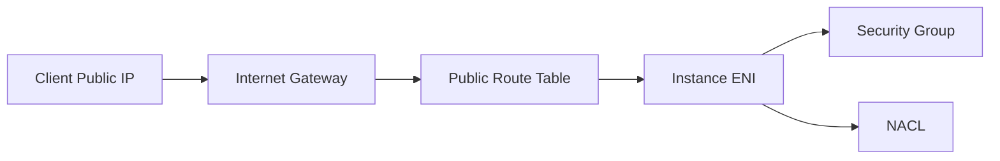
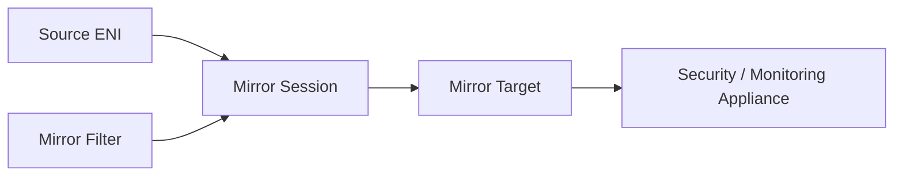
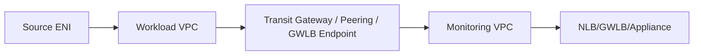

# Part 020 — VPC Flow Logs and Traffic Mirroring

Network engineering without observability is guesswork.

Di AWS, dua alat dasar untuk melihat traffic VPC adalah:

```text
VPC Flow Logs        -> metadata flow-level: siapa bicara ke siapa, port apa, action ACCEPT/REJECT, berapa packet/bytes
VPC Traffic Mirroring -> copy packet-level traffic dari ENI ke monitoring appliance
```

Keduanya bukan pengganti satu sama lain.

```text
Flow Logs menjawab: apakah ada flow, arahnya ke mana, diterima/ditolak, volumenya berapa?
Traffic Mirroring menjawab: apa isi packet/protocol behavior yang sebenarnya terjadi?
```

Part ini menutup fondasi VPC dasar dengan observability, karena semua desain sebelumnya—subnet, route, SG, NACL, endpoint, NAT, IPv6—harus bisa dibuktikan dari data.

---

## 1. Mental Model: Flow Logs adalah X-Ray Metadata, Bukan Packet Capture

VPC Flow Logs menangkap informasi IP traffic menuju dan dari network interface.

Ia bukan tcpdump.

Flow log record biasanya merepresentasikan flow berdasarkan 5-tuple:

```text
source address
source port
destination address
destination port
protocol
```

Dengan metadata tambahan:

```text
interface-id
account-id
vpc-id/subnet-id/instance-id jika custom field
packets
bytes
start/end timestamp
action ACCEPT/REJECT
log-status OK/NODATA/SKIPDATA
traffic-path
flow-direction
pkt-srcaddr/pkt-dstaddr
```

Yang tidak terlihat:

```text
HTTP URL
TLS SNI secara langsung
request body
DNS query detail ke AmazonProvidedDNS
application error message
IAM AccessDenied cause
TCP retransmission detail lengkap
```

Flow Logs memberi peta jalan. Jika butuh isi packet, gunakan Traffic Mirroring atau capture di host/appliance.

---

## 2. Flow Logs Collection Scope

Anda bisa membuat flow log pada beberapa scope:

```text
VPC      -> semua ENI di VPC, high coverage, high volume
Subnet   -> ENI di subnet tertentu, bagus untuk subnet class
ENI      -> granular, bagus untuk forensic/debugging target tertentu
```

Decision model:

| Scope | Kapan Dipakai | Risiko |
|---|---|---|
| VPC | Baseline observability, security detection, regulated environment | volume/cost tinggi |
| Subnet | Public/private/db subnet monitoring | bisa miss ENI di subnet lain |
| ENI | Incident response, high-signal debugging | coverage sempit |

Production baseline yang masuk akal:

```text
1. Enable VPC/subnet-level flow logs untuk critical environments.
2. Publish ke S3 dalam format queryable.
3. Gunakan CloudWatch Logs untuk near-real-time operational debugging bila perlu.
4. Gunakan ENI-level logs temporary untuk incident deep dive.
```

---

## 3. Flow Logs Delivery Destinations

Flow Logs bisa dikirim ke:

```text
CloudWatch Logs
Amazon S3
Amazon Data Firehose
```

Pilihan praktis:

| Destination | Cocok Untuk | Trade-off |
|---|---|---|
| CloudWatch Logs | ad-hoc debugging, alarms, Logs Insights | biaya ingestion/query bisa tinggi untuk volume besar |
| S3 | long-term retention, Athena query, forensic archive | tidak se-real-time CloudWatch |
| Firehose | pipeline ke SIEM/data lake/third-party | butuh pipeline design |

Pattern yang sering matang:

```text
CloudWatch Logs -> short retention for ops
S3 Parquet      -> long retention and analytics
Firehose/SIEM   -> security detection pipeline
```

Jangan simpan semua flow logs di CloudWatch tanpa cost model.

---

## 4. Default Format vs Custom Format

Default format berisi version 2 fields.

Untuk production, custom format sering lebih berguna karena bisa menambahkan field seperti:

```text
vpc-id
subnet-id
instance-id
pkt-srcaddr
pkt-dstaddr
flow-direction
traffic-path
region
az-id
sublocation-type
sublocation-id
tcp-flags
type
```

Contoh custom format:

```text
${version} ${account-id} ${region} ${az-id} ${vpc-id} ${subnet-id} ${instance-id} ${interface-id} ${srcaddr} ${dstaddr} ${srcport} ${dstport} ${protocol} ${packets} ${bytes} ${start} ${end} ${action} ${log-status} ${flow-direction} ${traffic-path} ${pkt-srcaddr} ${pkt-dstaddr} ${tcp-flags} ${type}
```

Kenapa `pkt-srcaddr` dan `pkt-dstaddr` penting?

Karena `srcaddr`/`dstaddr` bisa merepresentasikan primary private IP ENI dalam beberapa skenario intermediate/NAT/preserved client IP. Packet-level fields membantu melihat address asli yang relevan.

---

## 5. Membaca Flow Log Record

Contoh default-like record:

```text
2 111122223333 eni-abc123 10.0.12.34 10.0.21.50 49152 443 6 10 8400 1783350000 1783350060 ACCEPT OK
```

Interpretasi:

```text
version       = 2
account       = 111122223333
interface-id  = eni-abc123
srcaddr       = 10.0.12.34
 dstaddr      = 10.0.21.50
srcport       = 49152
dstport       = 443
protocol      = 6 TCP
packets       = 10
bytes         = 8400
start/end     = aggregation window
action        = ACCEPT
log-status    = OK
```

`ACCEPT` bukan berarti aplikasi sukses.

Ia hanya berarti flow tidak ditolak oleh SG/NACL pada titik logging.

Aplikasi masih bisa gagal karena:

```text
TLS handshake error
HTTP 500
IAM AccessDenied
DNS wrong target
server closed connection
app timeout after accepting connection
```

`REJECT` berarti security layer menolak flow.

Biasanya karena:

```text
Security Group
Network ACL
```

Tetapi Anda tetap perlu melihat arah dan interface mana yang merekam reject.

---

## 6. ACCEPT/REJECT dan Statefulness

Security Group bersifat stateful.

NACL bersifat stateless.

Ini memengaruhi pembacaan Flow Logs.

Contoh:

```text
Client -> Server:443 allowed by SG inbound
Server -> Client:ephemeral response allowed automatically by SG statefulness
```

NACL tetap butuh dua arah:

```text
inbound 443
outbound ephemeral
```

Jika response ditolak oleh NACL, Flow Logs bisa menunjukkan reject pada arah return.

Debug pattern:

```text
1. Cari flow client -> server dstport 443.
2. Cari reverse flow server -> client dstport ephemeral/source 443.
3. Bandingkan action pada kedua arah.
4. Jika forward ACCEPT tapi reverse REJECT, pikirkan NACL/stateless return path.
```

---

## 7. Aggregation Interval dan Delay

Flow Logs bukan real-time packet stream.

Flow direkam dalam aggregation interval dan dipublish setelah processing.

Implikasi:

```text
Jangan berharap flow log muncul detik yang sama.
Jangan menggunakan Flow Logs sebagai satu-satunya detector untuk sub-second issue.
Untuk incident, kombinasikan dengan app logs, ALB/NLB logs, CloudTrail, metric, dan packet capture jika perlu.
```

Nitro-based instance punya aggregation interval 1 menit atau kurang, terlepas dari maximum aggregation interval yang Anda pilih.

---

## 8. NODATA dan SKIPDATA

`log-status` penting.

```text
OK       -> log record valid
NODATA   -> tidak ada traffic selama aggregation interval
SKIPDATA -> ada flow yang tidak tertangkap karena internal capacity/processing constraint
```

Interpretasi:

```text
NODATA tidak sama dengan network blocked.
SKIPDATA tidak boleh diabaikan dalam forensic-sensitive workload.
```

Jika Anda melihat SKIPDATA saat volume tinggi:

```text
1. Kurangi scope jika perlu.
2. Gunakan subnet/ENI-specific logs untuk investigation.
3. Pastikan downstream destination tidak menjadi bottleneck.
4. Jangan membuat kesimpulan absolut dari dataset yang kehilangan record.
```

---

## 9. Traffic yang Tidak Ditangkap Flow Logs

Flow Logs tidak menangkap semua traffic.

Contoh penting yang sering mengejutkan:

```text
Traffic instance ke Amazon DNS server
Traffic ke instance metadata 169.254.169.254
Traffic ke Amazon Time Sync 169.254.169.123
DHCP traffic
ARP traffic
Traffic ke reserved IP default VPC router
Traffic mirrored source traffic
Beberapa traffic antara endpoint ENI dan NLB ENI
```

Konsekuensi:

```text
Jika DNS ke AmazonProvidedDNS tidak muncul di Flow Logs, itu expected.
Jika IMDS call tidak muncul, itu expected.
Jika Anda butuh DNS query visibility, gunakan Route 53 Resolver query logging/DNS Firewall telemetry.
Jika Anda butuh packet payload, gunakan Traffic Mirroring atau host capture.
```

---

## 10. Flow Logs untuk Debugging Public Ingress

Scenario:

```text
Internet client cannot reach public ALB or EC2.
```

For EC2 public instance:



Flow Logs checklist:

```text
1. Identify ENI of target instance or load balancer nodes if visible via logs.
2. Filter dstaddr = private IP of ENI or pkt-dstaddr if needed.
3. Filter dstport = service port.
4. Check action.
5. Check reverse flow to client ephemeral port.
6. Confirm route table has IGW route for public subnet.
7. Confirm NACL allows inbound service port and outbound ephemeral.
8. Confirm SG allows inbound from source.
```

If no inbound flow appears:

```text
DNS/public IP wrong
client never reached AWS
route/IGW/public IP association issue
load balancer path, not instance path
upstream firewall blocked
```

If inbound `REJECT` appears:

```text
SG/NACL issue at target boundary.
```

If inbound `ACCEPT` but app fails:

```text
Application/listener/TLS/backend issue.
```

---

## 11. Flow Logs untuk Debugging Private East-West Traffic

Scenario:

```text
Service A in private subnet cannot call Service B in private subnet.
```

Expected path inside same VPC:

```text
A ENI -> local VPC route -> B ENI
```

Query strategy:

```text
Filter A ENI egress:
  srcaddr = A private IP
  dstaddr = B private IP
  dstport = target port

Filter B ENI ingress:
  srcaddr = A private IP
  dstaddr = B private IP
  dstport = target port
```

Interpretation matrix:

| A ENI | B ENI | Meaning |
|---|---|---|
| no flow | no flow | app did not send / DNS resolved elsewhere / wrong IP |
| ACCEPT | no flow | routing/asymmetric/filter before B or wrong ENI/log scope |
| ACCEPT | REJECT | B side SG/NACL likely denies |
| REJECT | no flow | A side SG/NACL likely denies egress |
| ACCEPT | ACCEPT | network likely passes; inspect app/TLS/auth/listener |

Do not debug database credentials before proving TCP path.

Do not edit route tables if Flow Logs show packet reaches target and target rejects.

---

## 12. Flow Logs untuk NAT Gateway Egress

Scenario:

```text
Private workload accesses internet or AWS public endpoint through NAT Gateway.
```

You want to answer:

```text
Which source workloads create NAT cost?
Which destinations consume most egress?
Which traffic should move to VPC endpoints?
Is there suspicious exfiltration?
```

Useful fields:

```text
srcaddr
pkt-srcaddr
dstaddr
pkt-dstaddr
dstport
bytes
packets
traffic-path
interface-id
subnet-id
```

Operational pattern:

```text
1. Enable VPC/subnet flow logs with packet address fields.
2. Aggregate bytes by srcaddr/dstaddr/dstport.
3. Identify high-volume AWS service/public IP destinations.
4. Move S3/DynamoDB to gateway endpoint where appropriate.
5. Move AWS APIs to interface endpoints where appropriate.
6. Restrict/inspect remaining egress.
```

Example Athena-style query concept:

```sql
SELECT
  srcaddr,
  dstaddr,
  dstport,
  protocol,
  SUM(bytes) AS total_bytes,
  COUNT(*) AS records
FROM vpc_flow_logs
WHERE action = 'ACCEPT'
  AND start_time >= TIMESTAMP '2026-07-06 00:00:00'
GROUP BY srcaddr, dstaddr, dstport, protocol
ORDER BY total_bytes DESC
LIMIT 100;
```

---

## 13. Flow Logs untuk VPC Endpoint Validation

After creating VPC endpoint, prove traffic moved.

For interface endpoint:

```text
1. Resolve service hostname from workload.
2. Identify endpoint ENI private IPs.
3. Query Flow Logs for workload -> endpoint ENI:443.
4. Check NAT Gateway bytes drop for that service path.
5. Correlate CloudTrail event with VPC endpoint context where available.
```

For gateway endpoint:

```text
1. Confirm route table has prefix list target for S3/DynamoDB.
2. Query flows from workload to service prefix/list destination.
3. Confirm NAT is not used for that service path.
4. Check bucket/table policy effects separately.
```

Remember:

```text
Endpoint policy denial may show network ACCEPT and CloudTrail AccessDenied.
```

---

## 14. Flow Logs for IPv6

IPv6 shows up with IPv6 addresses in src/dst fields.

Common IPv6 debugging questions:

```text
Did the client actually use AAAA record?
Does route table include ::/0 to IGW or egress-only IGW?
Do SG/NACL rules include IPv6 ranges separately?
Is return path allowed by NACL?
Is app binding/listening on IPv6?
```

Flow Logs help prove:

```text
source IPv6
destination IPv6
protocol/port
action
bytes/packets
```

But they do not tell you why DNS preferred IPv6 over IPv4. For that, inspect resolver/client behavior.

---

## 15. Flow Direction and Traffic Path

Custom fields like `flow-direction` and `traffic-path` help classify flows.

Use them to answer:

```text
Is this ingress or egress relative to the ENI?
Did traffic go through internet gateway, NAT gateway, transit gateway, or local path?
Which flows are leaving VPC boundaries?
```

Caution:

```text
Do not rely on one field alone for compliance conclusions.
Correlate with route tables, ENI metadata, NAT/TGW/endpoint IDs, CloudTrail, and resource tags.
```

Good detection is contextual, not just field matching.

---

## 16. Enriching Flow Logs with Inventory

Raw IPs are hard to operate.

Build enrichment:

```text
ENI ID -> instance/ECS task/EKS pod/Lambda ENI/endpoint ENI/load balancer ENI
subnet ID -> subnet class/environment/AZ
security group -> app boundary
route table -> route intent
account ID -> workload owner
IP/CIDR -> internal service registry
endpoint ENI -> AWS service endpoint
```

Without enrichment, every incident starts with:

```text
Whose IP is 10.42.17.93?
```

With enrichment, you can answer:

```text
payments-api task in prod private app subnet ap-southeast-1a called secretsmanager endpoint on 443 and was accepted.
```

This is the difference between logs and observability.

---

## 17. CloudWatch Logs Insights Examples

Find rejects to port 443:

```sql
fields @timestamp, interfaceId, srcAddr, dstAddr, srcPort, dstPort, action, logStatus
| filter dstPort = 443 and action = 'REJECT'
| sort @timestamp desc
| limit 100
```

Top talkers by bytes:

```sql
fields srcAddr, dstAddr, dstPort, bytes
| stats sum(bytes) as totalBytes by srcAddr, dstAddr, dstPort
| sort totalBytes desc
| limit 50
```

Traffic from one workload to endpoint ENI:

```sql
fields @timestamp, srcAddr, dstAddr, srcPort, dstPort, action, bytes
| filter srcAddr = '10.40.12.34'
| filter dstAddr in ['10.40.100.10', '10.40.101.10']
| filter dstPort = 443
| sort @timestamp desc
```

Rejected ephemeral return path:

```sql
fields @timestamp, srcAddr, dstAddr, srcPort, dstPort, action
| filter action = 'REJECT'
| filter dstPort >= 1024
| sort @timestamp desc
| limit 100
```

---

## 18. Athena/S3 Lake Pattern

For serious environments, put Flow Logs into S3 and query with Athena.

Recommended properties:

```text
Parquet format
hourly partitioning
Hive-compatible prefixes
lifecycle retention policy
central logging account
bucket policy with least privilege
KMS encryption
partition projection where useful
```

Data model idea:

```text
s3://org-network-logs/AWSLogs/<account-id>/vpcflowlogs/<region>/year=<yyyy>/month=<mm>/day=<dd>/hour=<hh>/
```

Use cases:

```text
NAT cost attribution
exfiltration detection
incident timeline reconstruction
least-privilege SG/NACL review
endpoint migration validation
traffic baseline per service
regulatory evidence
```

---

## 19. Flow Logs Cost Model

Flow Logs can become expensive due to:

```text
ingestion volume
CloudWatch storage
S3 storage
Athena query scan size
Firehose/SIEM downstream cost
high cardinality queries
keeping all traffic forever
```

Cost controls:

```text
1. Use S3/Parquet for high-volume long-term analytics.
2. Keep CloudWatch retention short unless justified.
3. Use lifecycle policies.
4. Partition by account/region/date/hour.
5. Use custom fields intentionally.
6. Use subnet/ENI logs for temporary deep debugging.
7. Aggregate detections instead of querying raw logs constantly.
```

Do not enable all logs everywhere with no retention policy and call it observability.

---

## 20. Traffic Mirroring: When Flow Logs Are Not Enough

Flow Logs show metadata.

Traffic Mirroring copies packets from an ENI to a monitoring appliance.

Use it when you need:

```text
payload/protocol inspection
TLS handshake details
packet retransmission behavior
malware/network threat inspection
IDS/IPS appliance feed
deep troubleshooting of weird TCP/application behavior
```

Do not use it by default for every workload.

It can carry sensitive data and high volume. Treat it as privileged telemetry.

---

## 21. Traffic Mirroring Concepts

Core objects:

```text
Source  -> ENI whose traffic is copied
Target  -> destination for mirrored packets
Filter  -> rules selecting traffic to mirror
Session -> binds source, target, filter, priority, packet length
```

Diagram:



Traffic Mirroring copies inbound and outbound traffic from source ENI based on filter rules. Mirrored traffic is encapsulated before being sent to target.

---

## 22. Traffic Mirror Targets

Possible target shapes include:

```text
Network interface of monitoring appliance
Network Load Balancer with UDP listener
Gateway Load Balancer with UDP listener
```

Use cases:

| Target | Kapan Cocok |
|---|---|
| Single appliance ENI | lab, narrow debugging, low volume |
| NLB UDP | scale-out fleet of packet appliances |
| GWLB UDP | appliance insertion/security architecture integration |

Production usually avoids single appliance unless scope is tiny.

---

## 23. Encapsulation and Appliance Expectations

Mirrored traffic is not delivered as naked original packet only. It is encapsulated, commonly requiring appliance/tooling that understands the mirror encapsulation format.

Implication:

```text
Your appliance must support the mirrored traffic format.
Security tools must parse encapsulated packets.
Packet length/truncation settings affect what payload is visible.
```

If analyst says “packets look wrong”, verify:

```text
mirror encapsulation support
MTU/jumbo frame handling
packet truncation length
UDP listener configuration
appliance capture interface
source/target route path
```

---

## 24. Traffic Mirror Filters

Never mirror everything by default.

Filters should be scoped:

```text
source/destination CIDR
protocol
port range
inbound/outbound direction
accept/reject rule ordering
```

Examples:

```text
Mirror only app -> database TCP 5432.
Mirror only suspicious egress destination CIDR.
Mirror only inbound HTTPS to a test host during incident window.
Mirror only DNS to custom resolver.
```

Why tight filters matter:

```text
cost
appliance capacity
privacy
signal/noise
blast radius of telemetry exposure
```

---

## 25. Traffic Mirroring vs Host tcpdump

Host tcpdump:

```text
runs inside instance OS
can capture before/after local firewall depending interface
requires host access
can be tampered with by compromised host/root
cheap for ad-hoc debugging
```

Traffic Mirroring:

```text
copies from ENI outside guest userspace
centralized target
good for security appliances
requires supported instance/ENI setup
more operational overhead
sensitive/high-volume telemetry
```

Decision:

```text
For one-off developer debugging, host tcpdump may be enough.
For security monitoring and compromised-host assumptions, Traffic Mirroring is stronger.
```

---

## 26. Traffic Mirroring Security Risks

Mirrored packets may contain sensitive data:

```text
headers
metadata
internal service names
unencrypted payloads
credentials if protocols are insecure
PII/payment/regulatory data
```

Controls:

```text
1. Limit who can create mirror sessions.
2. Use change approval for production mirroring.
3. Filter narrowly.
4. Encrypt/log/monitor access to appliances.
5. Isolate monitoring VPC/account.
6. Apply retention and data handling policy.
7. Audit mirror session creation/modification.
```

In regulated environments, packet capture is evidence and liability.

---

## 27. Traffic Mirroring Cross-VPC Design

Mirror source and target can be same VPC or connected VPCs depending supported connectivity.

Common pattern:



Design questions:

```text
Is mirrored traffic allowed by route/security controls?
Can monitoring target handle aggregate throughput?
Is target in same region?
What happens if appliance fails?
Does mirroring path compete with production traffic capacity?
Who owns monitoring account and data?
```

---

## 28. Debugging with Flow Logs + Traffic Mirroring Together

Use Flow Logs first to narrow.

Then mirror only the suspicious flow.

Example:

```text
Problem: intermittent TLS handshake failures from app to internal API.
```

Flow Logs:

```text
app -> api:443 ACCEPT
bytes sometimes small
no REJECT
```

Next step:

```text
Traffic Mirroring on app ENI or API ENI for tcp/443 between two CIDRs.
```

Inspect:

```text
SYN/SYN-ACK/ACK timing
TLS ClientHello/ServerHello
RST/FIN behavior
retransmissions
MTU/path fragmentation symptoms
proxy behavior
```

Flow Logs tell you where to look. Mirroring tells you what happened.

---

## 29. Incident Runbook: Unknown Egress Spike

Symptoms:

```text
NAT Gateway cost spike
DataTransfer-Out increased
Security alert for unusual external traffic
```

Steps:

```text
1. Query Flow Logs by bytes grouped by srcaddr,dstaddr,dstport.
2. Map srcaddr to ENI/instance/task/pod owner.
3. Map dstaddr to AWS service/public ASN/domain if possible.
4. Check whether destination should use VPC endpoint.
5. Check CloudTrail for related API activity.
6. Check application deploys/config changes around spike time.
7. Temporarily add Traffic Mirroring if payload/protocol inspection is needed and approved.
8. Apply containment: SG egress restriction, NACL, Network Firewall, route change, app config rollback.
9. Preserve logs and mirror captures according to incident policy.
```

Do not start by deleting NAT route unless you understand dependencies. You may break production recovery paths.

---

## 30. Incident Runbook: Database Connectivity Failure

Symptoms:

```text
App cannot connect to database.
Error: connection timeout.
```

Flow Logs sequence:

```text
1. Query app ENI -> DB ENI dstport 5432/3306/etc.
2. Query DB ENI ingress from app IP.
3. Query DB ENI -> app ENI reverse flow.
4. Look for REJECT on either direction.
5. If ACCEPT both directions, inspect DB listener/app credentials/TLS.
```

Interpretation:

```text
No flow from app -> app didn't send, DNS wrong, connection pool not attempting.
REJECT at app egress -> app SG/NACL.
REJECT at DB ingress -> DB SG/NACL.
Forward ACCEPT, reverse REJECT -> NACL ephemeral issue.
Both ACCEPT -> not basic network filtering.
```

Traffic Mirroring if still unclear:

```text
Capture app<->DB TCP handshake and TLS startup only, narrow filter, limited window.
```

---

## 31. Incident Runbook: Endpoint Access Failure

Symptoms:

```text
Private workload cannot call Secrets Manager/S3/KMS/ECR.
```

Use layers:

```text
DNS -> Flow Logs -> CloudTrail -> Service-specific logs
```

Steps:

```text
1. Resolve hostname from runtime.
2. If interface endpoint, identify endpoint ENI IP.
3. Query Flow Logs workload -> endpoint ENI:443.
4. If gateway endpoint, check route table prefix list and NAT avoidance.
5. If Flow Logs show REJECT, fix SG/NACL.
6. If Flow Logs show ACCEPT and CloudTrail has AccessDenied, fix policy.
7. If no CloudTrail event, request likely did not reach service auth layer.
8. If intermittent, inspect DNS cache, endpoint AZ placement, app retries, service throttling.
```

This prevents the classic loop:

```text
Network team edits SG.
App team edits IAM.
Platform team edits endpoint.
Nobody proves packet path.
```

---

## 32. Building a Network Observability Baseline

Minimum production baseline:

```text
1. VPC/subnet Flow Logs enabled for prod VPCs.
2. Central S3 log archive with encryption and retention.
3. Query model via Athena or SIEM.
4. ENI/subnet/account/tag enrichment pipeline.
5. NAT egress dashboard.
6. REJECT dashboard for critical subnets.
7. Endpoint adoption dashboard.
8. Runbook templates for timeout/reject/AccessDenied.
9. Traffic Mirroring approved process for incidents.
10. IAM guardrails around log deletion and mirror session creation.
```

Better baseline:

```text
Route 53 Resolver query logs
ALB/NLB logs where applicable
CloudFront logs for edge paths
CloudTrail organization trail
GuardDuty/VPC DNS findings
Network Firewall logs if used
Transit Gateway Flow Logs in multi-VPC architecture
```

VPC Flow Logs are one layer of network observability, not the whole platform.

---

## 33. Detection Ideas with Flow Logs

Examples:

```text
Outbound traffic to unexpected ports from private app subnets.
Inbound traffic to database subnet from non-app subnet.
High bytes to internet via NAT from a single workload.
Rejected traffic spikes after SG/NACL deployment.
Traffic to metadata IP will not appear in Flow Logs; use other telemetry.
Private workloads still using NAT for AWS service endpoints.
Cross-AZ chatter for latency/cost investigation.
Unexpected east-west traffic between bounded domains.
```

Detection design principles:

```text
1. Tag-enriched detections beat raw CIDR detections.
2. Baseline by subnet class and workload type.
3. Alert on meaningful deviation, not every reject.
4. Distinguish scanning/noise from production regression.
5. Validate with owners before auto-remediation unless high-confidence.
```

---

## 34. Anti-Patterns

### Anti-Pattern 1 — Enabling Flow Logs but Never Querying Them

Logs without dashboards, runbooks, or ownership are storage cost, not observability.

### Anti-Pattern 2 — Treating ACCEPT as Application Success

ACCEPT only proves network filtering allowed the flow.

### Anti-Pattern 3 — Ignoring Reverse Flow

Many NACL bugs appear on return path.

### Anti-Pattern 4 — Debugging DNS with Flow Logs Only

AmazonProvidedDNS traffic is not captured by VPC Flow Logs. Use Resolver query logs for DNS visibility.

### Anti-Pattern 5 — Mirroring All Production Traffic Forever

Traffic Mirroring can expose sensitive data and overload appliances.

### Anti-Pattern 6 — No ENI Enrichment

Raw IP logs without ownership mapping slow incident response.

### Anti-Pattern 7 — Using CloudWatch Logs for Massive Long-Term Flow Retention Without Cost Review

High-volume Flow Logs can become expensive quickly.

---

## 35. Practical CLI: Create Flow Log to S3

Example:

```bash
aws ec2 create-flow-logs \
  --resource-type VPC \
  --resource-ids vpc-0123456789abcdef0 \
  --traffic-type ALL \
  --log-destination-type s3 \
  --log-destination arn:aws:s3:::org-network-flow-logs/prod/ \
  --log-format '${version} ${account-id} ${region} ${az-id} ${vpc-id} ${subnet-id} ${instance-id} ${interface-id} ${srcaddr} ${dstaddr} ${srcport} ${dstport} ${protocol} ${packets} ${bytes} ${start} ${end} ${action} ${log-status} ${flow-direction} ${traffic-path} ${pkt-srcaddr} ${pkt-dstaddr} ${tcp-flags} ${type}'
```

For production, prefer IaC.

---

## 36. Terraform Shape: Flow Logs to S3

```hcl
resource "aws_flow_log" "prod_vpc" {
  log_destination      = aws_s3_bucket.flow_logs.arn
  log_destination_type = "s3"
  traffic_type         = "ALL"
  vpc_id               = aws_vpc.prod.id

  log_format = join(" ", [
    "$${version}",
    "$${account-id}",
    "$${region}",
    "$${az-id}",
    "$${vpc-id}",
    "$${subnet-id}",
    "$${instance-id}",
    "$${interface-id}",
    "$${srcaddr}",
    "$${dstaddr}",
    "$${srcport}",
    "$${dstport}",
    "$${protocol}",
    "$${packets}",
    "$${bytes}",
    "$${start}",
    "$${end}",
    "$${action}",
    "$${log-status}",
    "$${flow-direction}",
    "$${traffic-path}",
    "$${pkt-srcaddr}",
    "$${pkt-dstaddr}",
    "$${tcp-flags}",
    "$${type}"
  ])

  tags = {
    Environment = "prod"
    Purpose     = "network-observability"
  }
}
```

---

## 37. Terraform Shape: Traffic Mirroring Concept

Simplified shape:

```hcl
resource "aws_ec2_traffic_mirror_target" "nids" {
  network_load_balancer_arn = aws_lb.nids.arn

  tags = {
    Name = "prod-nids-mirror-target"
  }
}

resource "aws_ec2_traffic_mirror_filter" "https_only" {
  description = "Mirror selected HTTPS traffic for incident analysis"
}

resource "aws_ec2_traffic_mirror_filter_rule" "egress_https" {
  traffic_mirror_filter_id = aws_ec2_traffic_mirror_filter.https_only.id
  rule_number              = 100
  rule_action              = "accept"
  traffic_direction        = "egress"
  protocol                 = 6
  destination_port_range {
    from_port = 443
    to_port   = 443
  }
  source_cidr_block      = "10.40.0.0/16"
  destination_cidr_block = "10.50.0.0/16"
}

resource "aws_ec2_traffic_mirror_session" "app_to_nids" {
  network_interface_id     = aws_instance.app.primary_network_interface_id
  traffic_mirror_target_id = aws_ec2_traffic_mirror_target.nids.id
  traffic_mirror_filter_id = aws_ec2_traffic_mirror_filter.https_only.id
  session_number           = 1
  packet_length            = 128

  tags = {
    Purpose = "temporary-incident-analysis"
  }
}
```

In production, add approvals, expiration, audit, and explicit ownership.

---

## 38. Observability Decision Table

| Question | Best First Tool | Why |
|---|---|---|
| Is traffic reaching ENI? | Flow Logs | flow metadata by ENI |
| Is SG/NACL rejecting? | Flow Logs | action ACCEPT/REJECT |
| What DNS answer did app get? | Resolver query logs / runtime dig | Flow Logs excludes Amazon DNS traffic |
| Did AWS API authorize? | CloudTrail | API action/error/vpcEndpointId |
| Why TLS handshake fails? | Traffic Mirroring / host capture | packet detail needed |
| Which workload caused NAT cost? | Flow Logs + NAT metrics | bytes by source/destination |
| Is endpoint path used? | DNS + Flow Logs + CloudTrail | prove resolution/path/API context |
| What HTTP path was requested? | ALB/CloudFront/app logs | Flow Logs has no URL |
| Is packet payload malicious? | Traffic Mirroring + IDS | payload inspection |

---

## 39. Review Questions

1. Kenapa VPC Flow Logs bukan pengganti packet capture?
2. Apa arti `ACCEPT` dan apa yang tidak dibuktikannya?
3. Kenapa reverse flow penting saat debugging NACL?
4. Traffic apa saja yang tidak muncul di Flow Logs dan kenapa itu penting?
5. Kapan memakai VPC-level logs, subnet-level logs, atau ENI-level logs?
6. Kenapa `pkt-srcaddr` dan `pkt-dstaddr` berguna?
7. Bagaimana membuktikan private workload sudah memakai interface endpoint, bukan NAT?
8. Kapan Traffic Mirroring lebih tepat daripada Flow Logs?
9. Apa risiko security/privacy dari Traffic Mirroring?
10. Bagaimana membangun enrichment agar Flow Logs berguna saat incident?

---

## 40. Key Takeaways

```text
Flow Logs show flow metadata, not packet payload.
Traffic Mirroring copies packets for deep inspection.
ACCEPT does not mean application success.
REJECT needs direction and ENI context.
Reverse path matters, especially with NACL.
DNS visibility requires DNS-specific logging.
Endpoint debugging requires DNS + Flow Logs + CloudTrail.
Raw IP logs must be enriched with inventory to become operationally useful.
Traffic Mirroring is powerful but sensitive and should be tightly governed.
```

If you remember one sentence:

> Flow Logs tell you whether the road was open; Traffic Mirroring lets you inspect the vehicle.

---

## 41. Source Anchors

Materi ini disusun berdasarkan dokumentasi resmi AWS tentang:

- VPC Flow Logs.
- Flow log records, fields, examples, and limitations.
- Publishing Flow Logs to CloudWatch Logs, S3, and Firehose.
- VPC Traffic Mirroring.
- Traffic mirror source, filter, target, and session.
- Traffic Mirroring targets and cross-VPC considerations.

Referensi utama:

```text
https://docs.aws.amazon.com/vpc/latest/userguide/flow-logs.html
https://docs.aws.amazon.com/vpc/latest/userguide/flow-log-records.html
https://docs.aws.amazon.com/vpc/latest/userguide/flow-logs-records-examples.html
https://docs.aws.amazon.com/vpc/latest/userguide/flow-logs-limitations.html
https://docs.aws.amazon.com/vpc/latest/userguide/flow-logs-s3-create-flow-log.html
https://docs.aws.amazon.com/vpc/latest/mirroring/what-is-traffic-mirroring.html
https://docs.aws.amazon.com/vpc/latest/mirroring/traffic-mirroring-how-it-works.html
https://docs.aws.amazon.com/vpc/latest/mirroring/traffic-mirroring-network-limitations.html
```
