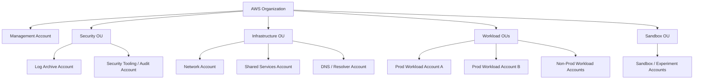
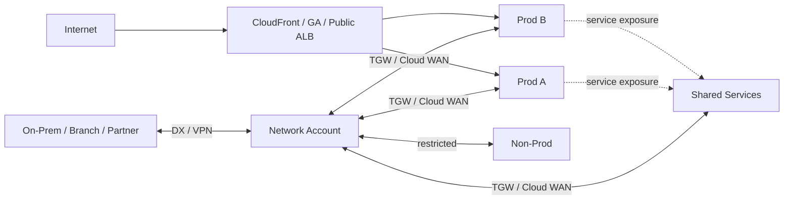
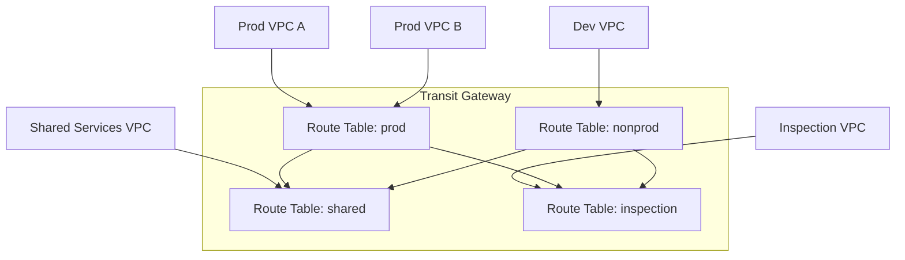
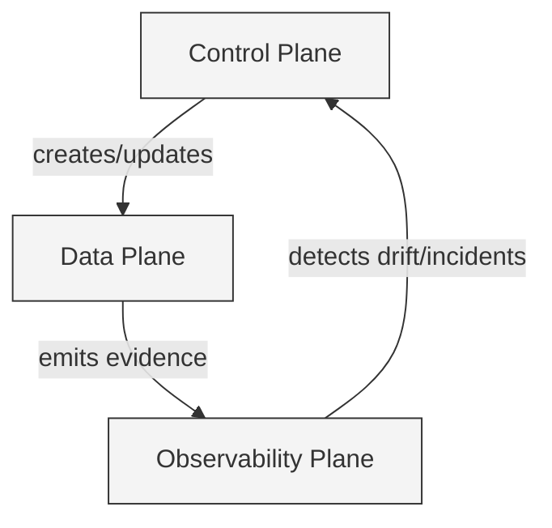
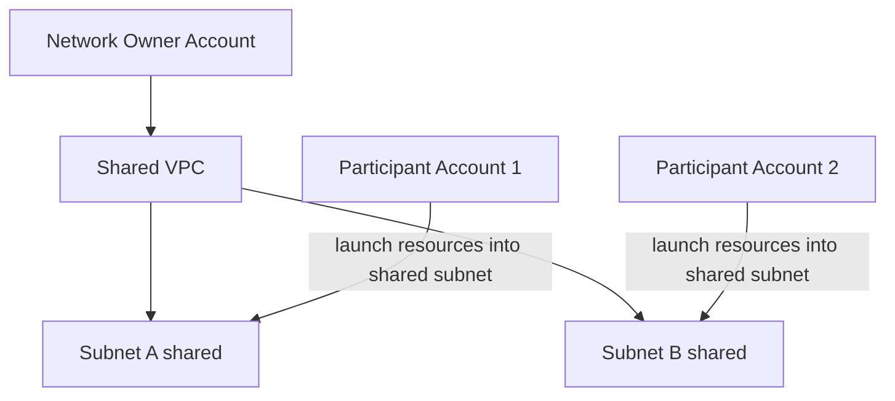
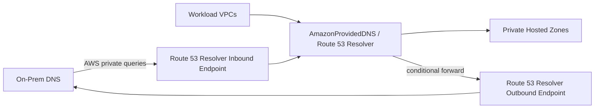
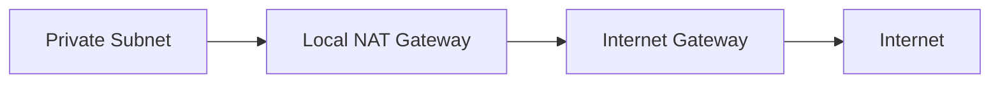
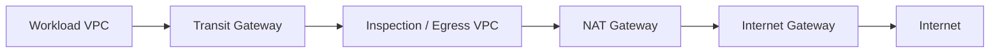
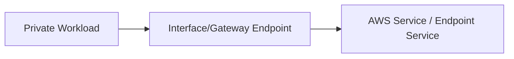
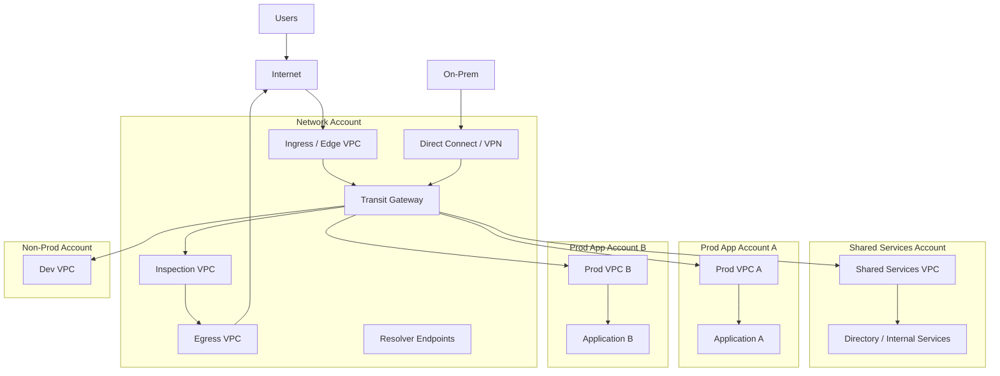

# Part 021 — Multi-Account Networking Foundation

VPC yang rapi belum tentu menghasilkan platform yang rapi.

Di organisasi nyata, problem networking jarang berhenti di satu VPC. Begitu ada banyak team, environment, produk, data sensitivity, region, vendor, on-prem, audit, dan incident boundary, pertanyaannya berubah:

```text
Bukan lagi: bagaimana membuat VPC?
Tetapi: siapa boleh menghubungkan apa, melalui path mana, dengan policy siapa, dan failure-nya berhenti di mana?
```

Multi-account networking adalah disiplin untuk menjawab pertanyaan itu.

Tujuannya bukan membuat topologi kelihatan canggih. Tujuannya adalah membuat connectivity menjadi:

```text
explicit
owned
auditable
segmented
repeatable
recoverable
cost-visible
safe under partial failure
```

Part ini adalah fondasi sebelum kita masuk ke VPC Peering, Transit Gateway, Cloud WAN, Direct Connect, VPN, PrivateLink, dan VPC sharing.

---

## 1. Core Thesis: Account Boundary Bukan Network Boundary

Kesalahan umum:

```text
"Sudah beda AWS account, berarti aman."
```

Tidak cukup.

AWS account adalah boundary untuk ownership, billing, IAM, service quota, dan blast-radius administratif. Tetapi traffic network tetap bisa melewati banyak mekanisme:

```text
VPC peering
Transit Gateway
PrivateLink
VPC Lattice
VPN
Direct Connect
Route 53 Resolver forwarding
shared VPC/subnet
public internet path
CloudFront/ALB/API Gateway entrypoint
```

Jadi account boundary harus diterjemahkan menjadi network boundary yang konkret:

```text
route table
security group
NACL
endpoint policy
resource policy
firewall policy
DNS rule
SCP/IAM guardrail
inspection path
logging path
```

Mental model-nya:

```text
Account = administrative cell
VPC     = network cell
Subnet  = placement + routing cell
Route   = reachability statement
Policy  = permission statement
DNS     = naming authority
Logs    = evidence stream
```

Top 1% engineer tidak menilai desain dari diagramnya saja. Mereka bertanya:

```text
Kalau account A compromise, account mana yang ikut reachable?
Kalau route salah propagate, environment mana yang bocor?
Kalau DNS forwarding salah, service mana resolve ke target salah?
Kalau NAT/inspection VPC mati, traffic mana yang terhenti?
Kalau app team membuat VPC sendiri, siapa mencegah CIDR overlap?
Kalau vendor minta koneksi, apakah kita expose network atau hanya service?
```

---

## 2. Kenapa Multi-Account Ada: Bukan Karena AWS Suka Banyak Account

Multi-account biasanya muncul karena kombinasi alasan berikut.

### 2.1 Separation of duty

Network platform team tidak boleh otomatis punya akses ke data aplikasi.

Application team tidak boleh bebas mengubah global routing.

Security team harus bisa melihat evidence tanpa menjadi operator workload.

```text
Network account  -> owns connectivity primitives
Security account -> owns detection, logs, inspection governance
Workload account -> owns application runtime
Shared account   -> owns common internal services
```

### 2.2 Blast-radius control

Satu account untuk semua workload mencampur:

```text
prod and non-prod
regulated and non-regulated
internet-facing and internal
team A and team B
experiments and critical services
```

Akibatnya satu kesalahan IAM, route, endpoint, atau security group bisa berdampak terlalu luas.

### 2.3 Billing and quota isolation

NAT Gateway, inter-AZ transfer, TGW data processing, endpoint hourly cost, CloudFront transfer, Direct Connect, dan logging cost harus bisa dikaitkan ke owner.

### 2.4 Compliance and audit

Auditor biasanya tidak puas dengan jawaban:

```text
"Network-nya shared, tapi trust us."
```

Mereka butuh evidence:

```text
who can create routes
who can attach VPC to core network
which accounts have internet egress
which accounts can receive inbound traffic
where logs go
which policy blocks bypass
```

### 2.5 Platform scalability

Tanpa account model, setiap team akan membuat versi sendiri dari:

```text
CIDR plan
VPC module
NAT pattern
DNS pattern
endpoint pattern
inspection pattern
logging pattern
```

Hasil akhirnya bukan cloud. Hasilnya datacenter spaghetti dalam bentuk API.

---

## 3. Reference Account Taxonomy

Ini bukan satu-satunya model, tetapi cukup matang untuk organisasi menengah sampai besar.



Penamaan bisa berbeda, tetapi responsibility harus jelas.

| Account | Primary Ownership | Networking Responsibility |
|---|---|---|
| Management account | Organization administration | Minimal workload. Jangan menjadi tempat network runtime. |
| Network account | Platform/network team | Transit Gateway, Cloud WAN, centralized egress, ingress, inspection, Direct Connect/VPN attachment, shared network automation. |
| Shared services account | Platform/shared infra team | Directory, internal tools, metadata service, artifact service, central CI runners jika perlu. |
| DNS account | Network/platform team | Public hosted zones, private hosted zone strategy, Resolver forwarding rules, DNS Firewall baseline. Bisa digabung dengan network account jika kecil. |
| Log archive account | Security/platform | Central immutable logs: VPC Flow Logs, CloudTrail, DNS query logs, firewall logs. |
| Security tooling account | Security engineering | SIEM integration, GuardDuty/Security Hub/Macie-style aggregation, inspection analytics. |
| Workload account | Application team | VPC/workload resources sesuai platform guardrail. |
| Sandbox account | Developers/experiments | Isolated, quota-limited, no default production connectivity. |

Prinsip:

```text
Account yang mengelola routing global tidak sama dengan account yang menyimpan data bisnis sensitif.
```

---

## 4. Network Account: The Chokepoint yang Harus Sengaja Dibangun

Network account adalah tempat untuk menaruh primitive yang memengaruhi connectivity lintas account.

Contoh resource yang sering dikelola di network account:

```text
Transit Gateway
Cloud WAN core network
Direct Connect Gateway association
Site-to-Site VPN attachment
centralized ingress VPC
centralized egress VPC
inspection VPC
shared interface endpoints
Route 53 Resolver inbound/outbound endpoints
Network Firewall
Gateway Load Balancer appliances
IPAM administration
network automation pipeline
```

Network account bukan berarti semua traffic harus dipaksa lewat satu VPC. Itu anti-pattern jika dilakukan buta.

Makna yang benar:

```text
Network account owns the policy and shared control points.
Workload accounts own their local workload and local blast radius.
```

---

## 5. Multi-Account Network = Graph, Bukan Tree

Organizational hierarchy biasanya tree:

```text
Org -> OU -> Account
```

Network reachability bukan tree. Ia graph.



Karena network adalah graph, governance harus menjawab:

```text
node mana boleh attach?
edge mana boleh dibuat?
route mana boleh dipropagate?
DNS name mana boleh resolve ke mana?
traffic mana wajib inspect?
traffic mana dilarang transitive?
```

---

## 6. Routing Domain: Unit Segmentation yang Sering Dilupakan

Di AWS, segmentation bukan hanya akun dan VPC. Segmentation sebenarnya hidup di route domain.

Route domain adalah kumpulan route table dan propagation rule yang menentukan reachability.

Contoh route domain:

```text
prod-core
nonprod-core
shared-services
internet-egress
inspection
partner
regulated
sandbox
```

Transit Gateway route table atau Cloud WAN segment dapat menjadi route domain.

Pattern sederhananya:



Prinsip penting:

```text
Jangan membuat semua attachment propagate ke semua route table.
```

Itu mengubah TGW menjadi flat LAN raksasa.

---

## 7. Golden Invariants untuk Multi-Account Networking

Invariant adalah aturan yang harus tetap benar walaupun jumlah account, team, dan workload bertambah.

### Invariant 1 — Tidak ada CIDR overlap tanpa desain explicit

CIDR overlap membatasi VPC Peering, Transit Gateway, VPN, Direct Connect, DNS, observability, dan incident response.

Gunakan IPAM atau minimal registry yang enforced by automation.

```text
BAD:
Team bebas memilih 10.0.0.0/16.

GOOD:
Account/VPC creation meminta CIDR dari pool terkontrol.
```

### Invariant 2 — Semua inter-account connectivity punya owner

Jangan ada koneksi orphan:

```text
pcx-... created 2 years ago, nobody knows why
TGW attachment without business owner
resolver rule forwarding to unknown DNS server
public hosted zone delegated but no owner
```

Minimal metadata:

```yaml
owner: platform-network
business_service: payments
source_account: prod-payments
connected_to: shared-services
approved_by: security-architecture
data_classification: confidential
expiry_review: 2026-12-31
```

### Invariant 3 — Internet egress harus diketahui

Pertanyaan audit:

```text
Dari account mana workload bisa keluar ke internet?
Melalui NAT mana?
Apakah diinspect?
Apakah DNS-nya difilter?
Apakah egress domain allowlist/blocklist diterapkan?
```

Jika jawabannya “tergantung VPC masing-masing”, desain belum matang.

### Invariant 4 — Ingress publik harus sempit

Public ingress sebaiknya hanya melalui entrypoint yang terkontrol:

```text
CloudFront + WAF
Global Accelerator + NLB/ALB
public ALB with WAF
API Gateway + WAF
```

Bukan:

```text
random public EC2
random public RDS
random public OpenSearch
```

### Invariant 5 — DNS authority harus jelas

Network failure sering terlihat seperti app failure karena DNS salah.

Harus jelas:

```text
public zone dikelola account mana?
private zone dikelola account mana?
zone mana associate ke VPC mana?
resolver forwarding rule dibuat siapa?
on-prem domain diarahkan ke mana?
AWS private domain diarahkan ke mana?
```

### Invariant 6 — Prod dan non-prod tidak otomatis transitive

Non-prod sering punya kontrol lebih longgar.

Jangan membuat:

```text
nonprod -> shared -> prod
```

kecuali route, SG, DNS, dan auth layer memang mendukung boundary itu.

### Invariant 7 — Shared services bukan dump semua dependency

Shared services account sering menjadi “mini-monolith platform”.

Setiap service shared harus punya:

```text
consumer model
network exposure model
auth model
logging model
rate limit model
backup/failover model
owner
```

### Invariant 8 — Semua shared network primitive harus IaC-managed

Manual network change adalah sumber outage yang sulit direkonstruksi.

Minimal semua resource berikut harus dikelola IaC:

```text
VPC CIDR
subnet
route table
TGW attachment
TGW route table association/propagation
peering route
resolver rule association
endpoint
security group baseline
NACL baseline
NAT route
egress inspection route
CloudFront/WAF entrypoint
```

---

## 8. Centralized vs Decentralized Networking

Tidak ada jawaban tunggal. Yang ada adalah trade-off.

### 8.1 Fully decentralized

Setiap workload account punya VPC, NAT, endpoints, routes sendiri.

```text
+ autonomy tinggi
+ blast radius lokal
+ sederhana untuk team kecil
- policy drift
- cost duplication
- sulit audit
- sulit hybrid connectivity
- sulit enforce inspection
```

Cocok untuk:

```text
startup kecil
isolated workloads
sandbox/experiment
highly autonomous product units dengan guardrail kuat
```

### 8.2 Fully centralized

Semua ingress, egress, inspection, endpoints, DNS, hybrid connectivity melalui network account.

```text
+ governance kuat
+ audit mudah
+ consistent egress/inspection
+ hybrid simpler
- central bottleneck
- routing complexity tinggi
- blast radius network account besar
- potential cross-AZ/cross-region cost
- platform team bisa jadi blocker
```

Cocok untuk:

```text
regulated enterprise
hybrid-heavy organization
strict egress control
central security inspection requirement
```

### 8.3 Federated platform model

Network account mengontrol global primitive dan guardrail. Workload account tetap memiliki local VPC sesuai module standar.

```text
+ scalable ownership
+ consistent baseline
+ local autonomy
+ governance tetap kuat
- butuh automation matang
- butuh contract jelas
- butuh observability lintas account
```

Ini biasanya pilihan paling sehat untuk organisasi besar.

---

## 9. Three Planes of Multi-Account Networking

Untuk desain serius, pisahkan tiga plane.



### 9.1 Control plane

Siapa boleh membuat dan mengubah network?

```text
AWS Organizations
IAM roles
SCP
RAM share
CloudFormation/Terraform pipelines
approval workflow
config rules
service control guardrails
```

### 9.2 Data plane

Traffic benar-benar lewat mana?

```text
VPC route table
TGW route table
Cloud WAN segment
NAT Gateway
Network Firewall
GWLB appliance
PrivateLink endpoint
CloudFront edge
Global Accelerator edge
Direct Connect/VPN
```

### 9.3 Observability plane

Bagaimana membuktikan apa yang terjadi?

```text
VPC Flow Logs
TGW Flow Logs
Route 53 Resolver query logs
Network Firewall logs
WAF logs
CloudFront logs
ELB access logs
CloudTrail
AWS Config
Reachability Analyzer
Network Access Analyzer
CloudWatch metrics
```

Desain buruk biasanya mencampur tiga plane ini dalam satu pikiran:

```text
"Karena IaC bilang route ada, berarti traffic pasti lewat sana."
```

Tidak cukup. Control plane intent harus diverifikasi dengan data plane evidence.

---

## 10. Shared VPC vs Separate VPC per Account

AWS memungkinkan subnet sharing melalui Resource Access Manager, sehingga satu VPC/subnet dapat digunakan oleh beberapa account. Ini berguna, tapi jangan otomatis menjadi default.

### 10.1 Shared VPC mental model



Network owner owns:

```text
VPC
subnet
route table
NACL
gateway
network-level structure
```

Participant account owns resources it launches:

```text
EC2
ECS/EKS worker/node resources if applicable
ENI created by participant-owned resources
security groups depending on service/resource model
```

### 10.2 When shared VPC makes sense

```text
central network team must own subnet/routing strictly
many small workload accounts use common network zones
legacy migration wants fewer VPCs
platform wants standardized subnet placement
```

### 10.3 When separate VPC per account is better

```text
application needs route autonomy
blast radius must be account-local
team needs isolated VPC-level quotas/settings
security boundary should be stronger
multi-region/cell architecture needs repeated units
```

### 10.4 Hidden risk

Shared VPC can blur responsibility:

```text
App team: network team owns route.
Network team: app team owns SG.
Security team: nobody knows why this traffic exists.
```

So if shared VPC is used, define a responsibility matrix.

| Concern | Network Owner | Participant Account | Security Team |
|---|---:|---:|---:|
| CIDR/subnet | Owns | Consumes | Audits |
| Route table | Owns | Requests changes | Audits |
| NACL | Owns | Requests exceptions | Audits |
| SG | Provides baseline / guardrail | Owns app-specific rules | Audits risky rules |
| Flow Logs | Owns destination/policy | Consumes evidence | Monitors |
| Incident isolation | Executes network containment | Executes app containment | Coordinates |

---

## 11. Multi-Account DNS Foundation

DNS adalah control plane kedua.

Banyak architecture review fokus pada route, tetapi lupa bahwa route hanya bekerja jika name resolution mengarah ke IP yang benar.

### 11.1 DNS authority map

Buat inventory seperti ini:

| Zone / Domain | Type | Owner Account | Associated VPCs | Forwarding Rule | Purpose |
|---|---|---|---|---|---|
| `example.com` | public hosted zone | dns-prod | public internet | none | public app names |
| `corp.example.com` | private hosted zone | dns-shared | prod/shared VPCs | none | internal services |
| `onprem.corp` | forwarded | dns-shared/network | prod/nonprod/shared | outbound resolver to on-prem | legacy systems |
| `aws.internal` | private hosted zone | dns-shared | workload VPCs | none | internal AWS service names |

### 11.2 Resolver architecture



### 11.3 DNS invariants

```text
Do not create duplicate private zones with different records unless intentionally split-horizon.
Do not forward all DNS to on-prem by default without understanding AWS private names.
Do not depend on public DNS for private service discovery if private DNS is required.
Log resolver queries for sensitive environments.
Document PHZ association ownership.
```

---

## 12. Egress Foundation

Egress is where governance dreams go to die.

Jika setiap account membuat NAT Gateway sendiri, semua workload bisa keluar ke internet kecuali ada guardrail tambahan.

Ada tiga common model.

### 12.1 Local egress per workload VPC



Good:

```text
simple
AZ-local
low central blast radius
team autonomy
```

Bad:

```text
difficult central inspection
cost duplication
harder egress allowlist
harder audit
```

### 12.2 Centralized egress VPC



Good:

```text
central inspection
consistent egress policy
central NAT/domain filtering
clear audit path
```

Bad:

```text
route complexity
TGW data processing cost
cross-AZ cost risk
central blast radius
must design appliance scaling and failover
```

### 12.3 No-internet private service access

Use VPC endpoints/PrivateLink for AWS services and internal SaaS/provider connectivity.



Good:

```text
least public exposure
smaller egress surface
works for regulated workloads
```

Bad:

```text
endpoint sprawl
Private DNS complexity
policy evaluation complexity
not every external dependency supports PrivateLink
```

Top-tier network platform often combines all three:

```text
local egress for low-risk/simple accounts
central egress for regulated/prod accounts
VPC endpoints for AWS service access
```

---

## 13. Ingress Foundation

Ingress is not “open port 443”.

Ingress is a chain:

```text
DNS -> edge -> L7/L4 entrypoint -> policy -> route -> target -> app authorization
```

Common ingress models:

| Model | Typical Services | Fit |
|---|---|---|
| CDN-first public web | Route 53, CloudFront, WAF, ALB/S3/API Gateway | Web/API with cache/security/edge requirements |
| Anycast static ingress | Global Accelerator, NLB/ALB | TCP/UDP/static IP/low-latency multi-region apps |
| Regional public ALB | Route 53, ALB, WAF | Simpler regional HTTP apps |
| Private ingress | PrivateLink, internal ALB/NLB, VPC Lattice | Internal services / partner / SaaS-style exposure |
| Hybrid ingress | Direct Connect/VPN + internal LB | On-prem to AWS private apps |

Ingress invariant:

```text
Public inbound should be rare, named, logged, protected, and owned.
```

---

## 14. Shared Services: Connectivity Contract

Shared services are tempting because everyone needs them:

```text
Active Directory / LDAP
internal DNS
certificate authority
artifact registry
CI/CD runners
observability endpoints
metadata/config service
bastion or SSM access pattern
central API gateways
```

But shared service connectivity must have a contract.

Example contract:

```yaml
service: internal-artifact-registry
producer_account: shared-services-prod
producer_vpc: shared-prod-vpc
exposure_model: PrivateLink
consumer_accounts:
  - prod-apps-ou
  - nonprod-apps-ou
ports:
  - 443
identity_required: true
network_policy:
  allowed_sources:
    - prod workload endpoint SG
    - nonprod workload endpoint SG
logs:
  - NLB access logs
  - VPC Flow Logs
  - application audit logs
availability:
  azs: 3
  failover: multi-AZ NLB targets
review_cycle: quarterly
```

Without a contract, shared services become invisible dependencies.

---

## 15. Resource Sharing with RAM: Powerful but Easy to Abuse

AWS Resource Access Manager enables sharing supported resources across accounts or within AWS Organizations.

Common networking uses:

```text
share Transit Gateway for VPC attachments
share subnets for VPC sharing
share Route 53 Resolver rules
share IPAM pools
share prefix lists
```

Principle:

```text
Sharing a resource shares operational coupling.
```

Before sharing a resource, answer:

```text
Who owns lifecycle?
Who approves participant accounts?
Who pays?
Who can detach/delete?
What happens during incident containment?
How is drift detected?
What logs prove usage?
```

---

## 16. Multi-Account CIDR Strategy

Without CIDR governance, you will eventually pay with migrations.

A practical hierarchy:

```text
Enterprise private range
  Region pool
    Environment pool
      Business unit / product pool
        VPC allocation
          Subnet allocation
```

Example:

```text
10.0.0.0/8 enterprise
10.32.0.0/11 ap-southeast-1
10.32.0.0/13 prod
10.40.0.0/13 nonprod
10.48.0.0/14 shared
10.52.0.0/14 network
```

VPC allocation example:

```text
prod payments account       -> 10.32.0.0/16
prod case-management account -> 10.33.0.0/16
prod analytics account       -> 10.34.0.0/16
nonprod payments account     -> 10.40.0.0/16
shared services              -> 10.48.0.0/16
network inspection           -> 10.52.0.0/16
```

Subnet allocation inside VPC:

```text
/20 per AZ per subnet class for large platforms
/24 or /23 for smaller specialized subnet classes
reserve future subnet classes from day one
```

CIDR design must include:

```text
AWS workload ranges
on-prem ranges
partner/vendor ranges
future region ranges
IPv6 plan
overlap exception process
```

---

## 17. Environment Segmentation Model

Do not rely on naming.

```text
prod-vpc
nonprod-vpc
```

Names do not isolate traffic. Routes do.

A useful segmentation table:

| Source | Destination | Default Decision | Allowed Mechanism |
|---|---|---|---|
| prod workload | prod shared services | allow specific | TGW route + SG + auth |
| nonprod workload | nonprod shared services | allow specific | TGW route + SG + auth |
| nonprod workload | prod workload | deny default | exception only, preferably service-level not network-wide |
| sandbox | prod/nonprod | deny | no route |
| prod workload | internet | controlled | endpoint or inspected egress |
| on-prem | prod workload | allow specific | DX/VPN + TGW + firewall + SG |
| partner | internal services | service-specific | PrivateLink preferred |

This table is more valuable than a beautiful architecture diagram.

---

## 18. Connectivity Pattern Decision Matrix

| Requirement | Prefer | Avoid |
|---|---|---|
| Two VPCs, simple direct private routing, low scale | VPC Peering | TGW if unnecessary |
| Many VPCs need controlled routing | Transit Gateway / Cloud WAN | Peering mesh |
| Consumer should access only one service, not network | PrivateLink / VPC Lattice | VPC Peering / TGW full routing |
| Cross-account application service mesh-like access | VPC Lattice | Manual peering per service |
| Centralized hybrid connectivity | TGW + DX/VPN | Per-VPC VPN sprawl |
| Centralized global network policy | Cloud WAN | Many independent TGWs without governance |
| Shared subnet ownership | VPC Sharing | Duplicating VPCs if network must be centrally owned |
| AWS service access without internet | VPC Endpoints | NAT to public service endpoint by default |
| Public web acceleration/security | CloudFront + WAF | Direct public EC2 |
| Static anycast IP / TCP acceleration | Global Accelerator | DNS-only failover for low-latency TCP requirement |

---

## 19. Platform API: Treat Networking as Product

For a large organization, network team should not ask every app team to understand every AWS networking primitive.

Expose a platform API or module catalog:

```text
create workload VPC
attach workload VPC to route domain
request private service exposure
request shared service consumer access
request private hosted zone association
request egress exception
request partner connectivity
request public ingress
```

Behind each request, platform automation creates:

```text
CIDR allocation
VPC/subnet/route tables
TGW attachment
route table association/propagation
security group baseline
endpoint baseline
resolver rule association
flow logs
tags/metadata
cost allocation
Config rules
```

This is how you avoid tribal knowledge.

---

## 20. Example: Enterprise Multi-Account Baseline



But never accept this diagram alone. Ask:

```text
Which route table is ProdVpcA associated with?
Which routes does it receive?
Does DevVpc receive routes to ProdVpcA?
Does SharedVPC receive return routes to every workload?
Is inspection symmetric?
Where do DNS queries go?
Where are flow/firewall/DNS logs stored?
Can workload teams create public IGW route?
Can they create peering that bypasses TGW?
```

---

## 21. Failure Modes

### 21.1 Accidental full mesh through TGW

Symptom:

```text
Dev can reach prod private IP.
```

Likely cause:

```text
All TGW attachments propagate to one shared route table.
```

Fix:

```text
separate TGW route tables per environment
explicit propagation
Network Access Analyzer policy
SCP guardrails for attachment creation
```

### 21.2 DNS route bypass

Symptom:

```text
App calls prod-looking name but reaches nonprod/internal endpoint.
```

Likely cause:

```text
duplicate private hosted zone
wrong VPC association
resolver forwarding rule precedence surprise
```

Fix:

```text
central PHZ inventory
query logging
domain ownership model
review PHZ associations in IaC
```

### 21.3 Central egress outage

Symptom:

```text
Many workloads cannot call external APIs.
```

Likely cause:

```text
inspection appliance/NAT path failure
route table blackhole
AZ-local path not preserved
```

Fix:

```text
multi-AZ inspection
per-AZ TGW attachment subnet design
health-based appliance routing if applicable
break-glass local egress plan for critical workloads
```

### 21.4 Orphan peering bypasses inspection

Symptom:

```text
Two accounts communicate outside approved TGW path.
```

Likely cause:

```text
manual VPC peering created by application admin
```

Fix:

```text
SCP deny ec2:CreateVpcPeeringConnection except platform role
AWS Config rule / inventory
CloudTrail alert
route table drift detection
```

### 21.5 CIDR overlap blocks acquisition/migration

Symptom:

```text
New business unit cannot connect to core network.
```

Likely cause:

```text
both sides use 10.0.0.0/16 or broad overlapping RFC1918 ranges
```

Fix:

```text
IPAM
NAT translation design
PrivateLink service-level exposure
long-term renumbering plan
```

---

## 22. Governance Controls That Actually Matter

### 22.1 Prevent bypass creation

Use SCP/IAM guardrails for actions like:

```text
ec2:CreateVpcPeeringConnection
ec2:AcceptVpcPeeringConnection
ec2:CreateTransitGatewayVpcAttachment
ec2:CreateInternetGateway
ec2:AttachInternetGateway
ec2:CreateNatGateway
ec2:CreateRoute
ec2:ReplaceRoute
ec2:AssociateRouteTable
route53:CreateHostedZone
route53resolver:CreateResolverRule
ram:CreateResourceShare
```

Do not blindly deny all. Build exception roles and pipelines.

### 22.2 Enforce logging baseline

Every production VPC should have:

```text
VPC Flow Logs
Route 53 Resolver query logs where relevant
ELB/ALB/NLB access logs where relevant
CloudFront logs for public edge
WAF logs for protected web entrypoints
Network Firewall logs for inspection paths
CloudTrail and Config
```

### 22.3 Enforce tagging and metadata

Tags are not just billing labels. They are incident response metadata.

Minimum network tags:

```yaml
environment: prod | nonprod | sandbox
owner: team/platform
business_service: name
network_domain: prod-core | shared | inspection | sandbox
data_classification: public | internal | confidential | restricted
connectivity_approved_by: person/team
created_by_pipeline: true
```

### 22.4 Drift detection

Network drift is dangerous because it changes reachability silently.

Detect:

```text
route table route changed outside pipeline
new peering created
new IGW route added
new resolver forwarding rule created
new public subnet created
new wildcard SG ingress added
NACL changed
new endpoint policy changed to allow all
```

---

## 23. Design Review Checklist

Use this before approving a new multi-account network design.

### Account and ownership

```text
Which accounts exist and why?
Who owns network account?
Who owns DNS?
Who owns shared services?
Who approves connectivity changes?
Who can break-glass during incident?
```

### IP and topology

```text
Are VPC CIDRs non-overlapping?
Are future regions reserved?
Are subnet classes sized for growth?
Are route domains documented?
Are prod/nonprod/sandbox separated by route, not name?
```

### Connectivity

```text
Which VPCs can talk to which VPCs?
Is connectivity network-wide or service-specific?
Is PrivateLink better than routing?
Is TGW/Cloud WAN justified?
Is VPC Peering becoming a mesh?
```

### Ingress and egress

```text
Where does public traffic enter?
Is WAF/CloudFront/GA/ALB required?
Where does internet egress happen?
Is egress inspected?
Are AWS service calls using endpoints?
```

### DNS

```text
Where are public hosted zones?
Where are private hosted zones?
How are VPC associations controlled?
How does on-prem DNS interact?
Are resolver query logs enabled?
```

### Security and governance

```text
What SCP prevents bypass?
What IAM role can mutate routes?
Are endpoint policies least privilege?
Are SG/NACL baselines defined?
Are firewall policies central or local?
```

### Observability and operations

```text
Can we prove packet path?
Where are Flow Logs stored?
Can security query logs across accounts?
Is there a runbook for reachability failure?
Is cost attribution available?
```

---

## 24. Implementation Blueprint

A practical build order:

```text
1. Define account taxonomy and OUs.
2. Define IPAM pool hierarchy.
3. Define network account and DNS/shared-services accounts.
4. Create VPC module standard.
5. Create logging baseline.
6. Create central route domains.
7. Create egress/ingress baseline.
8. Create resolver baseline.
9. Add workload VPC attachment workflow.
10. Add connectivity request workflow.
11. Add drift detection and policy guardrails.
12. Add periodic reachability review.
```

Do not start with “deploy TGW”.

Start with ownership and invariants. TGW is only a router.

---

## 25. Minimal Platform Contract Example

```yaml
network_contract_version: 1
account:
  id: "123456789012"
  name: prod-payments
  environment: prod
  owner: payments-platform
vpc:
  cidr_source: ipam
  region: ap-southeast-1
  subnet_classes:
    - private-app
    - private-data
    - endpoint
connectivity:
  route_domain: prod-core
  allowed_destinations:
    - shared-services:443
    - inspection-egress:0.0.0.0/0
  denied_destinations:
    - nonprod-core
    - sandbox
internet:
  ingress: none
  egress: centralized-inspected
dns:
  private_zones:
    - corp.example.com
  resolver_rules:
    - onprem.corp
observability:
  flow_logs: required
  resolver_query_logs: required
  logs_destination: log-archive
change_control:
  route_changes: platform-pipeline-only
  peering: denied
  tgw_attachment: platform-approved
```

A contract like this is more useful than a 60-page network diagram.

---

## 26. What Excellent Looks Like

A mature multi-account networking platform has these properties:

```text
A new workload account can be created without inventing networking from scratch.
CIDR allocation is automated and non-overlapping.
Every connectivity path has owner, purpose, and review cycle.
Prod/non-prod/sandbox are segmented by route domain and policy.
Public ingress is narrow and protected.
Internet egress is known and measurable.
DNS ownership is explicit.
Shared services expose contracts, not tribal routes.
Bypass mechanisms are blocked or alerted.
Packet path can be proven from logs and analyzers.
Cost is attributable to account/service/path.
Incident containment can remove routes or attachments safely.
```

That is the difference between “we use AWS networking” and “we operate a cloud network platform”.

---

## 27. Key Takeaways

Multi-account networking is not primarily about AWS account count. It is about **ownership and controlled reachability**.

Remember these mental anchors:

```text
Account boundary is administrative, not automatically network-isolating.
Route domains are the real segmentation primitive.
DNS is part of the network control plane.
Shared services require contracts.
Centralization improves governance but can create bottlenecks.
Decentralization improves autonomy but can create drift.
The right model is usually federated: central guardrails, local workload ownership.
```

In the next part, we zoom into the simplest direct VPC-to-VPC connectivity primitive: **VPC Peering**.

We will treat it not as a checkbox, but as a design tool with strict scaling limits, route semantics, DNS behavior, and failure modes.

---

## References

- AWS Prescriptive Guidance — Infrastructure OU: Network account
- AWS Prescriptive Guidance — Infrastructure OU: Shared Services account
- AWS Prescriptive Guidance — Transitioning to multiple AWS accounts
- AWS Prescriptive Guidance — Network connectivity for a multi-account architecture
- AWS Transit Gateway documentation — shared transit gateways and AWS RAM
- AWS Resource Access Manager documentation — sharing resources across AWS Organizations
- AWS VPC documentation — VPC, route tables, endpoints, DNS, and flow logs
