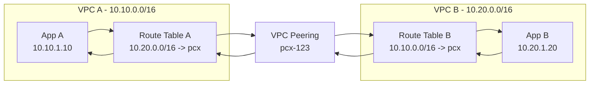
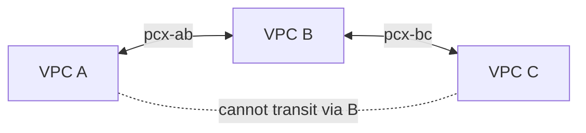
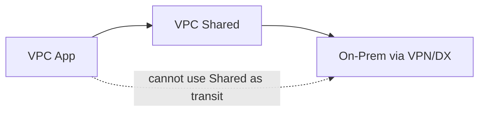
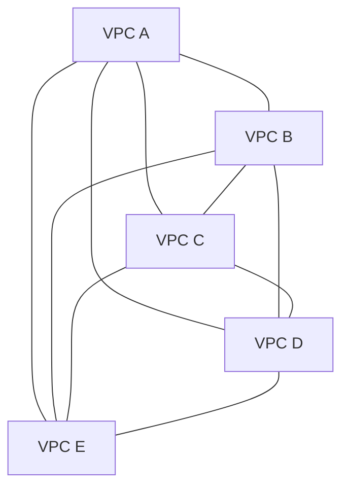
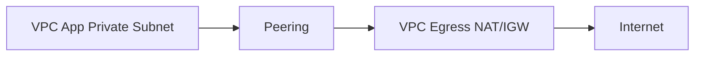
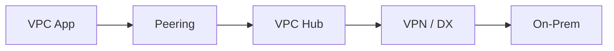
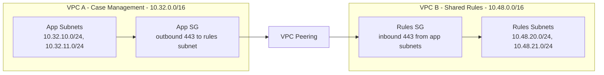
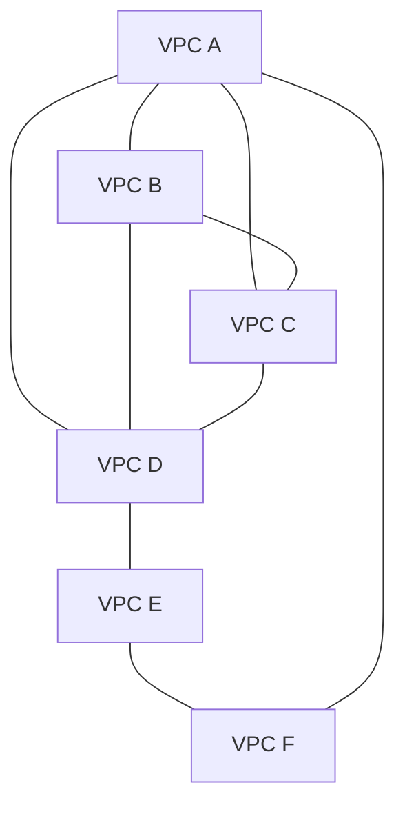

# Part 022 — VPC Peering Design

VPC Peering adalah koneksi private antara dua VPC.

Secara mental, peering terlihat sederhana:

```text
VPC A <---- peering ----> VPC B
```

Tetapi banyak outage dan desain kusut lahir dari asumsi yang salah:

```text
"Kalau A bisa bicara ke B, B pasti bisa bicara ke semua yang A bisa akses."
"Peering bisa jadi hub."
"DNS otomatis resolve private IP."
"Route balik pasti benar."
"Nanti kalau VPC tambah, tinggal tambah peering."
```

Tidak begitu.

VPC Peering adalah **direct, non-transitive, route-table-driven connectivity** antar dua VPC non-overlapping.

Ia kuat untuk kasus kecil dan jelas. Ia buruk untuk network besar yang butuh routing domain, central inspection, atau service-only exposure.

Part ini membedah VPC Peering sebagai primitive desain, bukan sekadar fitur console.

---

## 1. Core Mental Model

VPC Peering menambahkan path private antar dua VPC.

Tetapi peering connection sendiri belum membuat traffic mengalir.

Agar traffic bisa lewat:

```text
1. VPC peering connection harus active.
2. Route table di VPC A harus punya route ke CIDR VPC B via pcx-*.
3. Route table di VPC B harus punya route balik ke CIDR VPC A via pcx-*.
4. Security Group harus mengizinkan traffic.
5. NACL harus mengizinkan traffic dua arah.
6. DNS harus resolve ke IP yang memang reachable via peering.
7. Workload harus listen pada port/protocol yang benar.
```

Diagram minimal:



Key idea:

```text
Peering is not magic adjacency.
Peering is a target you can route to.
```

---

## 2. What VPC Peering Is Good At

VPC Peering cocok untuk:

```text
2 VPCs that need broad private IP routing
small number of VPCs
clear ownership between two accounts/teams
low routing complexity
non-overlapping CIDR
no need for transitive routing
no central inspection requirement
same-region or cross-region direct path
```

Contoh sehat:

```text
Prod app VPC -> shared database VPC
App VPC -> internal tooling VPC
Two tightly coupled service VPCs owned by same platform
Temporary migration connectivity between old and new VPC
Cross-account VPC pair for one producer/consumer relationship
```

VPC Peering tidak cocok untuk:

```text
many VPCs all needing each other
hub-and-spoke routing
central egress through another VPC
accessing on-prem through peer VPC
central S3 gateway endpoint sharing through peer VPC
connecting overlapping CIDRs
service-only exposure where consumer should not see producer network
```

---

## 3. Peering Lifecycle

Peering lifecycle:

```text
request -> accept -> active -> route configuration -> security/DNS validation -> operation -> review/delete
```

Cross-account peering requires accepter ownership action.

Same-account peering is operationally easier, but still needs explicit routing.

Cross-region peering adds:

```text
inter-region data transfer consideration
MTU consideration
higher latency
regional failure thinking
DNS behavior review
```

Lifecycle anti-pattern:

```text
create peering
forget routes
open SG too broadly
never document owner
leave stale pcx after migration
```

Healthy lifecycle:

```text
connectivity request
CIDR overlap check
route impact review
security review
IaC change
flow log validation
owner metadata
automated drift detection
periodic recertification
```

---

## 4. Non-Transitive Means Non-Transitive

This is the most important rule.

If VPC A peers with B, and B peers with C, A cannot reach C through B.



VPC Peering is not a router.

It does not perform transit.

You cannot use a peer VPC as a path to:

```text
another peered VPC
internet gateway
NAT gateway
VPN
Direct Connect
gateway endpoint
other edge connection
```

This invalid pattern appears often:



If you need this, use Transit Gateway, Cloud WAN, or deliberate service-level exposure.

---

## 5. Route Table Design

Peering routes are static routes to peer CIDR blocks.

Example:

VPC A:

```text
VPC A CIDR: 10.10.0.0/16
VPC B CIDR: 10.20.0.0/16
```

Route table in VPC A private subnets:

```text
10.10.0.0/16  local
10.20.0.0/16  pcx-abc
0.0.0.0/0     nat-aaa
```

Route table in VPC B private subnets:

```text
10.20.0.0/16  local
10.10.0.0/16  pcx-abc
0.0.0.0/0     nat-bbb
```

### 5.1 Route symmetry

Peering needs return route.

One-way route creates common symptoms:

```text
TCP SYN leaves A
B receives SYN
B response cannot return via correct route
client sees timeout
server logs may show partial connection or nothing depending on layer
```

### 5.2 Route scope

You do not have to route entire peer CIDR everywhere.

You can add routes only in selected subnet route tables.

Example:

```text
App private subnet can reach shared service VPC.
Data subnet cannot reach shared service VPC.
Public subnet does not need peering route.
```

This is segmentation by route association.

### 5.3 Specific route design

If the peer VPC has multiple CIDR blocks, be explicit.

```text
10.20.0.0/16 -> pcx
10.21.0.0/16 -> pcx
```

Avoid using broad ranges that accidentally include unintended destinations.

### 5.4 Route conflict and longest prefix

VPC route tables use longest prefix match.

If you have:

```text
10.20.0.0/16 -> pcx-shared
10.20.10.0/24 -> eni-appliance
```

Traffic to `10.20.10.5` follows `/24`, not `/16`.

This can be useful for controlled inspection, but dangerous if undocumented.

---

## 6. Overlapping CIDR: Hard Stop

VPC Peering does not allow matching or overlapping IPv4/IPv6 CIDR blocks.

This includes cases where VPCs have multiple CIDR blocks and only one overlaps.

Example:

```text
VPC A: 10.0.0.0/16
VPC B: 10.0.0.0/24
```

Cannot peer.

Example with multiple CIDRs:

```text
VPC A: 10.10.0.0/16, 10.30.0.0/16
VPC B: 10.20.0.0/16, 10.30.5.0/24
```

Still blocked because one associated block overlaps.

Implication:

```text
Peering punishes bad IP planning.
```

If overlap exists, options include:

```text
renumber one side
use PrivateLink for service-specific exposure
use NAT translation pattern
place integration through proxy/API layer
use application-level integration instead of network-level routing
```

Do not hand-wave overlap. It will surface during migration, acquisition, vendor integration, and hybrid connectivity.

---

## 7. DNS Behavior

Peering does not automatically make all DNS work the way humans expect.

There are several cases.

### 7.1 Private IP direct access

If client calls private IP directly:

```text
10.20.1.20:443
```

DNS is irrelevant. Route/security must work.

### 7.2 EC2 public DNS hostname resolving to private IP

For EC2 public IPv4 DNS hostnames, peering DNS options can allow a public hostname from the peer VPC to resolve to private IP when queried across peering.

Without correct DNS option, it may resolve to public IP, causing traffic to go through internet/NAT path or fail due to policy.

### 7.3 Private hosted zones

Private hosted zones are associated with VPCs.

If VPC A needs to resolve records in a private hosted zone used by VPC B, the zone must be associated appropriately or DNS forwarding/Resolver architecture must handle it.

Peering alone does not mean:

```text
all private hosted zone records in B are visible to A
```

### 7.4 AmazonProvidedDNS in peer VPC

You cannot treat the Amazon DNS server in another VPC as a directly queryable DNS server through peering.

Use Route 53 Resolver patterns for hybrid/multi-VPC DNS when needed.

---

## 8. Security Group and NACL Design

Peering route permits reachability. It does not permit traffic.

Security controls still apply.

### 8.1 Security Group model

For EC2-style workloads:

```text
Inbound on destination SG must allow source.
Outbound on source SG must allow destination.
Return traffic is stateful.
```

Prefer narrow rules:

```text
allow TCP 443 from peer CIDR or peer SG if supported for your scenario
```

Avoid lazy rules:

```text
allow all from 10.0.0.0/8
allow all from peer VPC entire CIDR when only one service is needed
```

### 8.2 Peer security group references

Security group referencing across VPC Peering has specific regional/account support rules. Treat it as a design capability to verify, not an assumption.

If unsupported or operationally awkward, use CIDR-based rules with strict subnet/service ranges.

### 8.3 NACL model

NACL is stateless.

For TCP from A to B:

On B subnet NACL:

```text
allow inbound destination port 443 from A source range
allow outbound ephemeral return ports to A source range
```

On A subnet NACL:

```text
allow outbound destination port 443 to B destination range
allow inbound ephemeral return ports from B destination range
```

Many peering failures are actually NACL return-path failures.

---

## 9. Cross-Account Peering Ownership

Cross-account VPC Peering creates a joint dependency.

Requester owns one side. Accepter owns the other. Both sides must configure routes/security/DNS as needed.

The connection can exist, but traffic still fails if either side does not configure its route table.

Operational contract should include:

```yaml
connection_name: prod-payments-to-shared-ledger
requester_account: prod-payments
accepter_account: shared-services
requester_vpc_cidr: 10.32.0.0/16
accepter_vpc_cidr: 10.48.0.0/16
allowed_flows:
  - source: payments-private-app-subnets
    destination: ledger-api-subnets
    protocol: tcp
    port: 443
route_tables:
  requester:
    - private-app-rt
  accepter:
    - ledger-service-rt
dns:
  private_zone_association_required: true
logging:
  flow_logs: both-vpcs
review_cycle: quarterly
owner:
  business: payments-platform
  technical: cloud-networking
```

Without this, cross-account peering becomes invisible coupling.

---

## 10. Scaling Problem: Peering Mesh Grows Quadratically

For `N` VPCs requiring full mesh peering:

```text
connections = N * (N - 1) / 2
```

Examples:

```text
3 VPCs  -> 3 peering connections
5 VPCs  -> 10 peering connections
10 VPCs -> 45 peering connections
20 VPCs -> 190 peering connections
```

And connection count is only the start.

Each peering requires:

```text
request/accept lifecycle
routes on both sides
SG/NACL updates
DNS settings
logging validation
owner metadata
periodic review
```

Mermaid view:



If your diagram looks like this, move to Transit Gateway, Cloud WAN, or service-level connectivity.

---

## 11. VPC Peering vs Transit Gateway vs PrivateLink

| Requirement | VPC Peering | Transit Gateway | PrivateLink |
|---|---|---|---|
| Direct private routing between two VPCs | Excellent | Good but heavier | Not for full routing |
| Many VPCs | Poor | Excellent | Good for service exposure |
| Transitive routing | No | Yes | No, service-specific |
| Overlapping CIDR | No | Generally no for routing | Can help because consumer sees endpoint IP, not provider CIDR broadly |
| Consumer should access only one service | Too broad | Too broad unless heavily controlled | Excellent |
| Central inspection | Awkward/not suitable | Strong pattern | Provider-side or consumer-side specific |
| Hybrid routing | Cannot transit via peer | Strong | Service-specific |
| Operational simplicity for two VPCs | Excellent | Overkill sometimes | Good if service-only |
| Route table complexity at scale | High | Medium/centralized | Low for consumers, provider complexity |

Rule of thumb:

```text
Use VPC Peering for simple direct network trust.
Use Transit Gateway/Cloud WAN for many networks and route domains.
Use PrivateLink/VPC Lattice when you want to expose a service, not a network.
```

---

## 12. Service Exposure Anti-Pattern

Suppose VPC B hosts one internal API.

Bad pattern:

```text
Peer VPC A to VPC B.
Route entire 10.20.0.0/16.
Allow broad SG from VPC A CIDR.
```

This exposes network reachability far beyond the service.

Better pattern:

```text
PrivateLink endpoint service backed by NLB
or VPC Lattice service network
or internal ALB through controlled routing if network trust is acceptable
```

If the consumer should only access `api.internal:443`, peering may be too broad.

VPC Peering answers:

```text
Can these networks route to each other?
```

PrivateLink answers:

```text
Can this consumer reach this provider service privately?
```

Those are different questions.

---

## 13. Central Egress Anti-Pattern

You cannot use VPC Peering to let one VPC use another VPC's NAT Gateway or Internet Gateway for internet access.

Invalid expectation:



This is edge-to-edge routing through peering. Not supported.

Use:

```text
Transit Gateway + centralized egress VPC
Cloud WAN segment + egress
local NAT Gateway
service endpoints/PrivateLink instead of internet egress
```

---

## 14. Hybrid Transit Anti-Pattern

You cannot use peering to access on-prem through a peer VPC's VPN or Direct Connect.

Invalid expectation:



Use Transit Gateway or Direct Connect Gateway patterns.

If only a specific on-prem-facing service is needed, consider application proxy or PrivateLink-like architecture depending on direction and constraints.

---

## 15. Gateway Endpoint Sharing Anti-Pattern

A gateway endpoint for S3/DynamoDB in VPC B cannot be used by VPC A through peering.

Invalid expectation:

```text
VPC A -> peering -> VPC B -> S3 gateway endpoint
```

Use:

```text
gateway endpoint in each VPC that needs it
interface endpoint centralization pattern through TGW if appropriate
private NAT/proxy pattern only with clear justification
```

For S3, gateway endpoint per VPC is usually simple and cost-effective.

---

## 16. Cross-Region Peering

Cross-region VPC Peering can connect VPCs in different AWS Regions.

Use cases:

```text
regional service dependency
migration
shared control plane service
low-volume cross-region admin traffic
legacy architecture needing private IP reachability
```

Be careful with:

```text
latency
inter-region data transfer cost
MTU differences
failure isolation
DNS behavior
data residency requirements
```

Cross-region peering should not casually create tight runtime coupling between regions.

If service A in Region 1 cannot work when Region 2 is unreachable, you may have accidentally destroyed regional independence.

---

## 17. Observability for Peering

To debug peering, collect evidence in order.

### 17.1 Control plane

```text
Is peering connection active?
Are requester/accepter correct?
Are routes present in the exact subnet route tables?
Are DNS peering options enabled if needed?
Are private hosted zones associated if needed?
```

### 17.2 Data plane

```text
Does source subnet route destination CIDR to pcx?
Does destination subnet route source CIDR back to pcx?
Does SG allow source/destination?
Does NACL allow request and response?
Is workload listening?
Is host firewall blocking?
```

### 17.3 Evidence

Use:

```text
VPC Flow Logs on source ENI
VPC Flow Logs on destination ENI
Reachability Analyzer
CloudTrail for route/peering changes
DNS query logs if name resolution suspected
application logs for accepted connection
```

Flow Logs patterns:

| Observation | Possible Meaning |
|---|---|
| No flow at source ENI | Client did not send, DNS wrong, local firewall/app issue |
| ACCEPT at source, no flow at dest | Route/NACL/peering path issue or wrong destination IP |
| REJECT at dest | Destination SG/NACL rejected |
| ACCEPT both sides, app timeout | Application listener/TLS/protocol/auth issue |
| Public IP in flow when private expected | DNS resolved public address or route target wrong |

---

## 18. Debugging Runbook

When `curl https://service.internal` from VPC A to VPC B times out:

### Step 1 — Resolve name

```bash
nslookup service.internal
```

Ask:

```text
Did it resolve to private IP in VPC B?
Did it resolve to public IP?
Did it resolve to stale IP?
Did it fail NXDOMAIN/SERVFAIL?
```

### Step 2 — Check source subnet route table

```text
destination private IP belongs to 10.20.0.0/16
source subnet route table has 10.20.0.0/16 -> pcx-...
```

### Step 3 — Check destination subnet route table

```text
destination subnet route table has 10.10.0.0/16 -> pcx-...
```

### Step 4 — Check SG

Source side:

```text
outbound to 10.20.0.0/16 tcp/443 allowed
```

Destination side:

```text
inbound from 10.10.0.0/16 tcp/443 allowed
```

### Step 5 — Check NACL

Both sides must allow:

```text
request port
response ephemeral ports
```

### Step 6 — Check workload

```text
service listens on expected port
binds to correct interface
TLS certificate/SNI is correct
host firewall allows traffic
```

### Step 7 — Check Flow Logs

Validate whether packets reached destination ENI and whether they were ACCEPT/REJECT.

### Step 8 — Use Reachability Analyzer

Model path from source ENI to destination ENI/port.

Do not jump to application debugging before proving network path.

---

## 19. Route Granularity Patterns

### 19.1 Full VPC access

```text
VPC A route: 10.20.0.0/16 -> pcx
VPC B route: 10.10.0.0/16 -> pcx
```

Simple, but broad.

### 19.2 Subnet-class access

```text
VPC A route: 10.20.10.0/24 -> pcx   # only service subnet
VPC B route: 10.10.40.0/24 -> pcx   # only app subnet
```

More controlled, but requires IP plan discipline.

### 19.3 Blackhole-by-removal

There is no explicit deny route in VPC route table.

To deny, remove route or use security controls.

```text
No route = no reachability.
Route + SG deny = route exists but traffic blocked.
```

For incident containment, removing route can be faster and broader than changing many SGs, but it is also more disruptive.

---

## 20. Production Peering Contract

Every peering should have a contract.

Minimum fields:

```yaml
peering:
  name: prod-case-mgmt-to-shared-rules-engine
  requester:
    account: prod-case-mgmt
    vpc: vpc-aaa
    cidrs:
      - 10.32.0.0/16
  accepter:
    account: shared-platform
    vpc: vpc-bbb
    cidrs:
      - 10.48.0.0/16
  purpose: case-management calls rules-engine API
  allowed_flows:
    - source_subnets: app-private
      destination_subnets: rules-engine-private
      protocol: tcp
      port: 443
  routes:
    requester_route_tables:
      - app-private-a
      - app-private-b
      - app-private-c
    accepter_route_tables:
      - rules-private-a
      - rules-private-b
      - rules-private-c
  dns:
    private_zone: rules.internal
    association: requester-vpc-associated
  security:
    requester_sg: outbound-443-only
    accepter_sg: inbound-from-case-mgmt-only
  observability:
    flow_logs: both-sides
    dns_query_logs: requester
  review:
    owner: platform-network
    business_owner: case-management
    next_review: 2026-10-01
```

If you cannot fill this contract, you probably should not create the peering yet.

---

## 21. IaC Structure

A clean peering module should separate:

```text
connection creation
acceptance
route creation on requester side
route creation on accepter side
DNS option setting
SG rule creation if owned centrally
metadata tags
```

Do not hide too much magic.

Example conceptual module inputs:

```hcl
module "vpc_peering_case_to_rules" {
  source = "./modules/vpc-peering"

  name = "prod-case-to-shared-rules"

  requester = {
    account_id = "111111111111"
    region     = "ap-southeast-1"
    vpc_id     = "vpc-aaa"
    cidrs      = ["10.32.0.0/16"]
    route_table_ids = [
      "rtb-app-a",
      "rtb-app-b",
      "rtb-app-c"
    ]
  }

  accepter = {
    account_id = "222222222222"
    region     = "ap-southeast-1"
    vpc_id     = "vpc-bbb"
    cidrs      = ["10.48.0.0/16"]
    route_table_ids = [
      "rtb-rules-a",
      "rtb-rules-b",
      "rtb-rules-c"
    ]
  }

  enable_dns_resolution = true

  tags = {
    owner           = "platform-network"
    environment     = "prod"
    business_service = "case-management"
    connectivity_type = "vpc-peering"
  }
}
```

The exact Terraform/CloudFormation implementation varies. The design principle does not.

---

## 22. Security Review Questions

Before approving peering:

```text
Why is network-level routing required instead of service-level exposure?
What exact flows are needed?
Are CIDRs non-overlapping?
Are route tables scoped to required subnets only?
Are SG rules narrow?
Are NACLs intentionally configured?
Does DNS resolve to private IPs?
Does peering bypass central inspection?
Does peering bypass environment segmentation?
Can either account use this path to reach something unintended?
Who can modify routes later?
How will this be removed safely?
```

This catches most bad peerings.

---

## 23. Cost Considerations

VPC Peering itself is often perceived as “simple and cheap”, but cost still appears through data transfer.

Evaluate:

```text
same-AZ vs cross-AZ path where applicable
cross-region data transfer
volume of east-west traffic
duplicate data movement due to chatty services
whether caching/eventing would reduce synchronous calls
```

Networking architecture can hide application architecture problems.

If two services across VPCs exchange huge volumes synchronously, ask:

```text
Should these services be colocated?
Should the boundary be asynchronous?
Should data be replicated regionally?
Should we expose a smaller API instead of broad network access?
```

---

## 24. When to Retire Peering

Peering starts healthy, then becomes technical debt.

Retire or redesign when:

```text
number of peerings grows faster than VPC count
route table updates become risky
many teams request transitive behavior
central egress/inspection is required
prod/nonprod segmentation becomes hard to prove
CIDR planning starts blocking new peerings
security team cannot inventory effective reachability
DNS associations become confusing
```

Migration paths:

```text
VPC Peering -> Transit Gateway for network routing
VPC Peering -> Cloud WAN for global network segmentation
VPC Peering -> PrivateLink for producer/consumer service exposure
VPC Peering -> VPC Lattice for service-to-service model
VPC Peering -> API Gateway/CloudFront for app-layer boundary
```

---

## 25. Example: Good Peering Use Case

Scenario:

```text
A regulated case-management app in VPC A needs to call a rules engine in shared services VPC B over HTTPS.
No other VPCs need this path.
Traffic volume is moderate.
Both VPCs have non-overlapping CIDR.
Both teams agree on narrow route and SG rules.
```

Design:



Routes:

```text
VPC A app route tables:
10.48.20.0/23 -> pcx

VPC B rules route tables:
10.32.10.0/23 -> pcx
```

Why this is good:

```text
small relationship
route-scoped
SG-scoped
purpose clear
no transitive expectation
no central inspection bypass if explicitly approved
can be replaced later by PrivateLink if service exposure needs tighter boundary
```

---

## 26. Example: Bad Peering Use Case

Scenario:

```text
12 workload VPCs need to talk to shared services and each other.
Some also need on-prem.
Security wants central inspection.
Teams ask to add peering whenever something breaks.
```

Bad design:



Symptoms:

```text
route tables become fragile
ownership unclear
non-transitive surprises
inspection bypasses
DNS inconsistency
manual changes
hard audit
```

Better:

```text
Transit Gateway route domains for network-level connectivity
PrivateLink/VPC Lattice for service-specific exposure
central DNS/Resolver design
central inspection/egress if required
```

---

## 27. Peering Decision Checklist

Use VPC Peering only if most answers are yes:

```text
Do exactly two VPCs need direct private routing?
Are CIDRs non-overlapping now and in future secondary CIDRs?
Is broad network reachability acceptable, or can routes be narrowly scoped?
Is non-transitive behavior acceptable?
Is there no need to use the peer's IGW/NAT/VPN/DX/gateway endpoint?
Is route ownership clear on both sides?
Is DNS behavior understood?
Are SG/NACL rules explicit?
Can Flow Logs prove the path?
Is there a retirement path if this relationship grows?
```

Use another primitive if:

```text
many VPCs are involved -> Transit Gateway / Cloud WAN
only one service should be exposed -> PrivateLink / VPC Lattice
centralized ingress/egress required -> TGW + edge/egress architecture
hybrid transit required -> TGW/DX/VPN pattern
overlapping CIDR exists -> PrivateLink/NAT/proxy/renumbering
```

---

## 28. Key Takeaways

VPC Peering is simple only when the relationship is simple.

Remember:

```text
Peering is direct routing, not transitive routing.
A peering connection alone does not create reachability; routes/security/DNS must align.
Overlapping CIDR blocks are a hard design blocker.
Peering cannot be used for edge-to-edge routing through another VPC.
DNS behavior must be explicitly designed.
Peering meshes do not scale operationally.
Use PrivateLink/VPC Lattice when exposing a service is safer than exposing a network.
Use Transit Gateway/Cloud WAN when many networks need governed route domains.
```

The next part moves from pairwise connectivity to centralized routing: **AWS Transit Gateway Core Model**.

Transit Gateway is where route domain thinking becomes concrete.

---

## References

- Amazon VPC Peering Guide — How VPC peering connections work
- Amazon VPC Peering Guide — VPC peering limitations
- Amazon VPC Peering Guide — Enable DNS resolution for a VPC peering connection
- Amazon VPC Peering Guide — VPC peering configurations with full and partial routes
- AWS VPC Connectivity Options whitepaper — Amazon VPC-to-Amazon VPC connectivity options
- Amazon VPC User Guide — Route tables and route priority
- Amazon VPC User Guide — Security groups, NACLs, Flow Logs, and Reachability Analyzer
