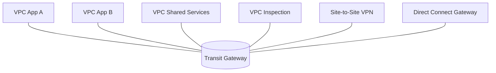
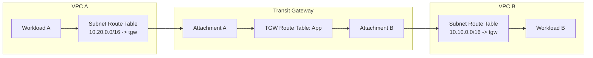
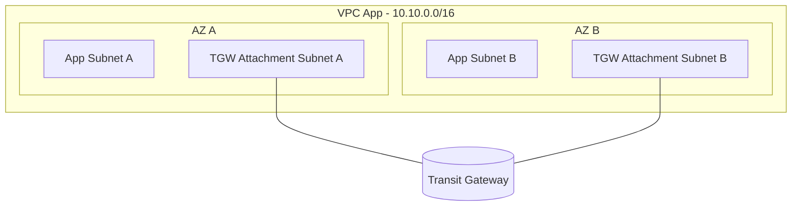
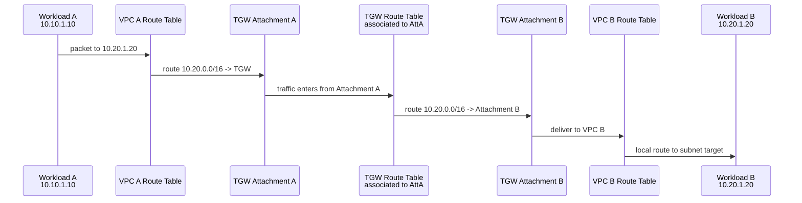
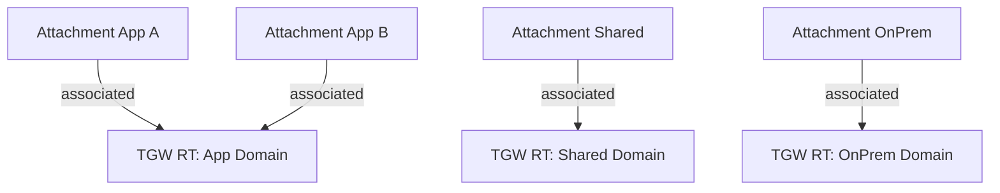
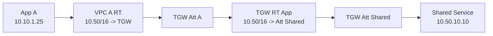
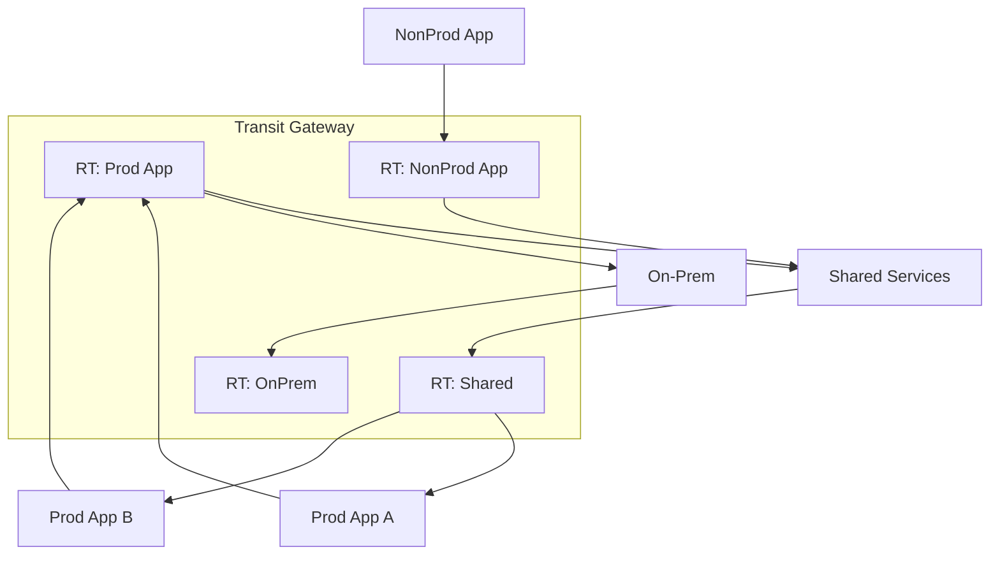
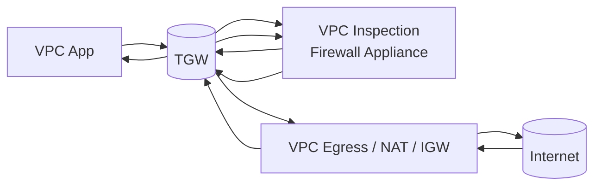

# Part 023 — AWS Transit Gateway Core Model

Transit Gateway sering dijelaskan sebagai **hub** untuk menghubungkan banyak VPC dan network eksternal.

Itu benar, tetapi terlalu dangkal.

Mental model yang lebih akurat:

> AWS Transit Gateway adalah regional routing fabric yang menerima traffic dari attachment, memilih route table berdasarkan attachment asal, lalu meneruskan packet ke attachment target berdasarkan route di route table tersebut.

Dengan kata lain, Transit Gateway bukan sekadar "kabel penghubung".
Ia adalah **router managed regional** dengan beberapa route table internal, association, propagation, attachment, dan aturan forwarding sendiri.

Kesalahan umum saat belajar TGW:

```text
"Kalau VPC sudah attach ke TGW, semua VPC otomatis bisa saling akses."
"Propagation berarti semua route pasti benar."
"Route table VPC dan route table TGW itu sama."
"TGW bisa menyelesaikan overlapping CIDR."
"Central firewall tinggal pasang di tengah lalu semua traffic lewat sana."
```

Tidak selalu.

Transit Gateway memberi primitive yang kuat, tetapi ia tidak menggantikan desain routing. Engineer tetap harus menentukan **siapa boleh bicara ke siapa**, **route table mana yang dipakai traffic masuk**, **attachment mana yang mempublikasikan CIDR**, dan **di mana inspection harus dipaksakan**.

Part ini membahas core model-nya dulu. Pattern advanced seperti inspection VPC, egress VPC, shared services, dan segmented domains akan dibahas di Part 024.

---

## 1. Kenapa Transit Gateway Ada?

Sebelum Transit Gateway, multi-VPC connectivity sering memakai VPC Peering.

Untuk 3 VPC, masih masuk akal:

```text
A <-> B
A <-> C
B <-> C
```

Untuk 20 VPC, full mesh menjadi masalah:

```text
jumlah peering ≈ n(n - 1) / 2
20 VPC ≈ 190 peering
50 VPC ≈ 1225 peering
100 VPC ≈ 4950 peering
```

Masalahnya bukan hanya jumlah connection.
Masalah sebenarnya:

- route table tersebar di banyak VPC,
- tidak ada central route domain,
- tidak transitive,
- sulit memaksa inspection,
- sulit memodelkan segmentation,
- sulit audit siapa bisa bicara ke siapa,
- perubahan satu VPC bisa memerlukan banyak update di tempat lain.

Transit Gateway menyederhanakan topology menjadi hub-and-spoke:



Tetapi hub-and-spoke visual ini masih menyembunyikan bagian penting: **route table internal TGW**.

Kalau ingin desain TGW dengan benar, jangan berpikir:

```text
VPC connected to TGW
```

Pikirkan:

```text
Attachment connected to TGW.
Attachment associated to exactly one TGW route table.
Attachment may propagate routes into one or more TGW route tables.
TGW route table decides next attachment.
VPC route table decides whether packet even reaches TGW.
```

---

## 2. Primitive Utama Transit Gateway

Transit Gateway punya beberapa primitive inti:

| Primitive | Fungsi |
|---|---|
| Transit Gateway | Regional routing fabric. |
| Attachment | Koneksi dari TGW ke VPC, VPN, Direct Connect Gateway, peering TGW, Connect, atau appliance-related path. |
| TGW Route Table | Tabel route internal TGW untuk menentukan next attachment. |
| Association | Menentukan route table TGW yang dipakai untuk traffic **yang masuk dari attachment tertentu**. |
| Propagation | Menambahkan route dari attachment ke route table TGW secara dinamis/terkontrol. |
| Static Route | Route manual di TGW route table ke attachment tertentu. |
| Blackhole Route | Route yang sengaja menjatuhkan traffic untuk prefix tertentu. |
| VPC Route Table | Route table di subnet VPC; menentukan apakah traffic dikirim ke TGW attachment. |
| Attachment Subnet | Subnet di VPC yang dipilih untuk membuat TGW ENI per AZ. |

Diagram sederhana:



Perhatikan ada **dua level routing**:

1. VPC route table mengirim packet ke TGW.
2. TGW route table mengirim packet ke attachment target.

Kalau salah satu level routing tidak lengkap, traffic gagal.

---

## 3. Attachment: Port Masuk ke TGW

Attachment adalah koneksi antara TGW dan resource/network lain.

Jenis attachment yang umum:

| Attachment Type | Contoh penggunaan |
|---|---|
| VPC attachment | Menghubungkan VPC workload/shared services/inspection ke TGW. |
| VPN attachment | Site-to-Site VPN dari on-prem/branch ke TGW. |
| Direct Connect Gateway attachment | Private WAN/on-prem via Direct Connect. |
| Transit Gateway peering attachment | Menghubungkan TGW antar-region atau antar-account. |
| Connect attachment | SD-WAN/router virtual via GRE/BGP. |

Pada VPC attachment, AWS membuat network interface TGW di subnet yang dipilih.
Karena itu subnet attachment penting.

Contoh:



Attachment subnet bukan harus subnet workload.
Banyak platform team membuat subnet khusus:

```text
app-private-a
app-private-b
app-private-c

tgw-attachment-a
tgw-attachment-b
tgw-attachment-c
```

Alasannya:

- isolation lebih jelas,
- route table attachment bisa dikontrol khusus,
- tidak mencampur route workload dan route TGW ENI,
- mengurangi perubahan tidak sengaja pada subnet aplikasi,
- memberi ruang untuk guardrail NACL bila diperlukan.

### 3.1 Invariant VPC Attachment

Untuk VPC attachment yang sehat:

```text
Invariant 1: attachment dibuat di AZ yang ingin dipakai sebagai path.
Invariant 2: subnet route table workload punya route ke destination remote via TGW.
Invariant 3: TGW route table associated dengan attachment asal punya route ke attachment target.
Invariant 4: target VPC punya route balik ke source CIDR via TGW.
Invariant 5: SG/NACL mengizinkan dua arah sesuai statefulness masing-masing.
Invariant 6: CIDR tidak overlap.
```

Kalau salah satu invariant gagal, status attachment bisa tetap available, tetapi traffic tetap tidak jalan.

Ini penting: **attachment available bukan bukti reachability end-to-end**.

---

## 4. Route Table TGW Bukan Route Table VPC

Route table VPC hidup di dalam VPC dan diasosiasikan ke subnet.

Route table TGW hidup di dalam Transit Gateway dan diasosiasikan ke attachment.

Perbedaan:

| Aspek | VPC Route Table | TGW Route Table |
|---|---|---|
| Scope | VPC/subnet/gateway | Transit Gateway |
| Association | Subnet/gateway | Attachment |
| Target | IGW, NAT, TGW, VPCE, ENI, peering, local, dll | TGW attachment |
| Local route | Ada untuk VPC CIDR | Tidak sama seperti VPC local route |
| Propagation | Dari VPN/VGW pada beberapa konteks | Attachment dapat propagate route ke TGW route table |
| Fungsi | Mengirim traffic keluar subnet | Mengirim traffic antar attachment |

Kesalahan produksi yang sering terjadi:

```text
Engineer menambahkan route di TGW route table,
tetapi lupa menambahkan route di subnet route table VPC.
```

Akibatnya workload tidak pernah mengirim packet ke TGW.

Kesalahan sebaliknya:

```text
Engineer menambahkan route di VPC route table ke TGW,
tetapi attachment asal associated ke TGW route table yang tidak punya route ke target.
```

Akibatnya packet masuk TGW, lalu drop karena tidak ada next hop.

Model benar:



Return path harus valid juga.

---

## 5. Association: Route Table yang Dipakai Traffic Masuk

Association menjawab pertanyaan:

> Ketika traffic masuk ke TGW dari attachment ini, route table TGW mana yang dipakai untuk lookup?

Satu attachment hanya bisa associated ke satu TGW route table pada satu waktu.

Contoh:

```text
Attachment app-a  associated -> tgw-rt-app
Attachment app-b  associated -> tgw-rt-app
Attachment shared associated -> tgw-rt-shared
Attachment vpn    associated -> tgw-rt-onprem
```

Kalau traffic datang dari `app-a`, TGW lookup route di `tgw-rt-app`.
Kalau traffic datang dari `vpn`, TGW lookup route di `tgw-rt-onprem`.

Itu artinya routing TGW bisa bersifat **source-domain aware**.
Bukan source IP policy firewall, tetapi route table yang dipilih berdasarkan attachment asal.

Diagram:



Association adalah alat segmentation.

Contoh aturan bisnis:

```text
App VPC boleh akses Shared Services dan On-Prem.
App VPC tidak boleh akses App VPC lain.
Shared Services boleh menerima dari App, tetapi tidak initiate ke semua App.
On-Prem boleh akses beberapa App tertentu saja.
```

Ini tidak bisa diekspresikan dengan satu default route table flat tanpa menjadi terlalu permisif.

---

## 6. Propagation: Route yang Dipublikasikan Attachment

Propagation menjawab pertanyaan:

> Prefix dari attachment ini dimasukkan ke TGW route table mana?

Contoh:

```text
Attachment app-a CIDR 10.10.0.0/16 propagate ke tgw-rt-shared
Attachment shared CIDR 10.50.0.0/16 propagate ke tgw-rt-app
Attachment vpn prefix 172.16.0.0/12 propagate ke tgw-rt-app
```

Association dan propagation sering tertukar.

Ingat:

```text
Association = route table yang dipakai traffic masuk dari attachment.
Propagation = route yang diumumkan attachment ke route table tertentu.
```

Analog sederhana:

```text
Association = pintu mana yang digunakan orang ketika masuk gedung.
Propagation = alamat ruangan mana yang ditempel di papan petunjuk gedung.
```

Sebuah attachment bisa:

- associated ke satu route table,
- propagate ke beberapa route table.

Diagram:

```mermaid
flowchart LR
  A[Attachment App A\nCIDR 10.10.0.0/16]
  B[Attachment App B\nCIDR 10.20.0.0/16]
  S[Attachment Shared\nCIDR 10.50.0.0/16]

  RTA[TGW RT App]
  RTS[TGW RT Shared]

  A -->|associated| RTA
  B -->|associated| RTA
  S -->|associated| RTS

  A -.propagates 10.10/16.-> RTS
  B -.propagates 10.20/16.-> RTS
  S -.propagates 10.50/16.-> RTA
```

Traffic dari App A masuk TGW dan memakai `TGW RT App`.
Di `TGW RT App`, ada route ke Shared karena Shared mempropagasikan CIDR-nya ke App RT.

Traffic dari Shared masuk TGW dan memakai `TGW RT Shared`.
Di `TGW RT Shared`, ada route ke App A dan App B karena App VPC mempropagasikan CIDR-nya ke Shared RT.

Hasilnya:

```text
App A -> Shared: allowed
App B -> Shared: allowed
Shared -> App A/App B: allowed
App A -> App B: not allowed unless App B route exists in App RT
```

Kalau `App A` dan `App B` sama-sama propagate ke `TGW RT App`, maka App-to-App bisa terjadi.

Propagation bukan sekadar convenience. Ia adalah mekanisme exposure.

---

## 7. Static Route dan Blackhole Route

TGW route table bisa berisi route propagated dan route static.

Static route digunakan ketika engineer ingin menentukan next attachment secara manual:

```text
0.0.0.0/0       -> inspection-vpc-attachment
10.80.0.0/16    -> shared-services-attachment
172.16.0.0/12   -> vpn-attachment
```

Blackhole route digunakan untuk sengaja drop prefix tertentu.

Contoh:

```text
10.99.0.0/16 -> blackhole
```

Kegunaan blackhole route:

- mencegah traffic ke prefix yang tidak boleh diakses,
- menutup route yang terlalu broad,
- membuat guardrail eksplisit,
- menghindari leakage route saat propagation terlalu luas,
- memaksa fail-closed pada domain tertentu.

Contoh situasi:

```text
TGW RT App punya propagated route 10.0.0.0/8 dari on-prem.
Tetapi 10.90.0.0/16 adalah security enclave yang tidak boleh diakses.
Tambahkan blackhole 10.90.0.0/16.
```

Karena routing memakai longest prefix match, route lebih spesifik dapat menang atas route lebih broad.

Namun jangan memakai blackhole sebagai pengganti desain route domain.
Kalau terlalu banyak blackhole, sering berarti propagation domain terlalu longgar.

---

## 8. Packet Path End-to-End

Misalnya:

```text
VPC App A: 10.10.0.0/16
VPC Shared: 10.50.0.0/16
TGW route table app-rt
TGW route table shared-rt
```

Tujuan: App A mengakses DNS resolver/shared service di `10.50.10.10`.

### 8.1 Outbound dari App A

```text
Source: 10.10.1.25
Destination: 10.50.10.10
```

Langkah:

```text
1. Instance App A membuat packet ke 10.50.10.10.
2. Subnet route table App A lookup 10.50.0.0/16.
3. Route table VPC A punya route 10.50.0.0/16 -> tgw-attachment.
4. Packet dikirim ke TGW melalui VPC attachment A.
5. TGW melihat attachment asal = app-a.
6. Attachment app-a associated ke app-rt.
7. TGW lookup 10.50.10.10 di app-rt.
8. app-rt punya route 10.50.0.0/16 -> shared-attachment.
9. Packet diteruskan ke VPC Shared.
10. VPC Shared local route mengirim ke subnet target.
11. SG/NACL/host firewall menentukan apakah request diterima.
```

Diagram:



### 8.2 Return Path

Return packet:

```text
Source: 10.50.10.10
Destination: 10.10.1.25
```

Langkah:

```text
1. Shared service membalas ke 10.10.1.25.
2. Subnet route table Shared lookup 10.10.0.0/16.
3. Route table Shared punya route 10.10.0.0/16 -> TGW.
4. Packet masuk TGW dari shared-attachment.
5. shared-attachment associated ke shared-rt.
6. shared-rt punya route 10.10.0.0/16 -> app-a attachment.
7. Packet kembali ke VPC App A.
8. Local route VPC A mengirim ke subnet App.
```

Route forward dan return bisa memakai TGW route table berbeda.
Itu normal.

Tetapi harus simetris secara reachability.

```text
Forward lookup uses source attachment association.
Return lookup uses destination side attachment association.
```

---

## 9. The Two-Route-Table Debugging Model

Kalau koneksi via TGW gagal, jangan langsung melihat Security Group.
Gunakan model dua route table.

Untuk traffic `A -> B`, cek:

```text
A subnet route table:
  destination B CIDR -> tgw

TGW route table associated with A attachment:
  destination B CIDR -> B attachment

B subnet route table for return:
  destination A CIDR -> tgw

TGW route table associated with B attachment:
  destination A CIDR -> A attachment
```

Ini bentuk checklist:

```text
[ ] VPC A subnet route to B via TGW exists.
[ ] Attachment A is available.
[ ] Attachment A association points to expected TGW RT.
[ ] TGW RT for A has route to B prefix via B attachment.
[ ] VPC B subnet route back to A via TGW exists.
[ ] Attachment B association points to expected TGW RT.
[ ] TGW RT for B has route to A prefix via A attachment.
[ ] Security Group allows required protocol/port.
[ ] NACL allows request and response.
[ ] DNS resolves to private IP in expected CIDR.
[ ] No blackhole or more specific route overrides expected route.
```

Rule of thumb:

> Kalau packet tidak terlihat di target Flow Logs, cari routing. Kalau terlihat `REJECT`, cari SG/NACL. Kalau terlihat `ACCEPT` tapi app gagal, cari listener/TLS/app timeout.

---

## 10. Default Route Table: Kenyamanan yang Bisa Berbahaya

Transit Gateway dapat memiliki default association route table dan default propagation route table.

Saat awal belajar, default membuat lab cepat jalan.

Dalam produksi besar, default bisa membuat blast radius terlalu luas.

Contoh risiko:

```text
Setiap attachment baru otomatis associated ke default TGW RT.
Setiap attachment baru otomatis propagate ke default TGW RT.
Default RT berisi semua CIDR semua VPC.
Akibatnya VPC baru langsung bisa bicara ke banyak network.
```

Ini nyaman, tetapi biasanya terlalu permisif.

Untuk production, lebih aman:

```text
disable default association for controlled TGW designs
or
use default only for non-sensitive sandbox domain
```

Kemudian buat route table eksplisit:

```text
tgw-rt-app-prod
tgw-rt-app-nonprod
tgw-rt-shared-services
tgw-rt-inspection
tgw-rt-onprem
tgw-rt-egress
```

Setiap attachment harus punya lifecycle:

```text
1. create attachment
2. associate to intended route table
3. enable propagation only to intended route tables
4. add VPC routes
5. validate reachability
6. record network contract
```

Jangan biarkan attachment production bergantung pada kebetulan default.

---

## 11. TGW Route Domain sebagai Security Boundary Parsial

TGW route table bisa membatasi reachability.

Tetapi jangan menyebutnya security boundary penuh.

Kenapa?

- Ia bekerja di routing layer, bukan identity layer.
- Ia tidak inspect payload.
- Ia tidak mengerti HTTP method, user, token, atau tenant.
- Ia tidak menggantikan SG, NACL, WAF, IAM, endpoint policy, atau firewall.
- Salah route propagation bisa membuka path luas.

Namun routing domain tetap sangat kuat sebagai **network reachability boundary**.

Contoh segmentation:

```text
prod app VPCs:
  associated -> prod-app-rt
  can reach -> shared-prod, onprem-prod, inspection-egress
  cannot reach -> nonprod app VPCs

nonprod app VPCs:
  associated -> nonprod-app-rt
  can reach -> shared-nonprod, internet-egress-nonprod
  cannot reach -> prod app VPCs

security inspection VPC:
  associated -> inspection-rt
  can reach -> egress/onprem based on inspection pattern
```

Diagram:



Kalau route tidak ada, traffic tidak punya path.
Itu lebih baik daripada mengandalkan semua host menolak sendiri.

---

## 12. Appliance Mode: Saat Traffic Harus Melewati Stateful Appliance

Network appliance seperti firewall sering stateful.
Ia harus melihat dua arah flow:

```text
client -> server
server -> client
```

Kalau request lewat firewall appliance A tetapi response lewat firewall appliance B, state tidak cocok.
Akibatnya packet response bisa di-drop.

Pada TGW + inspection VPC, appliance mode membantu mempertahankan flow symmetry untuk VPC attachment appliance.

Mental model:

```text
Without appliance mode:
  TGW may choose different AZ attachment path for return traffic based on internal behavior/path.

With appliance mode:
  TGW maintains flow affinity through same appliance attachment/AZ path for stateful inspection use case.
```

Contoh inspection path:



Appliance mode bukan tombol ajaib.
Masih perlu:

- route table TGW yang memaksa traffic ke inspection attachment,
- route table VPC inspection yang mengirim traffic ke firewall endpoint/ENI/GWLB,
- return route yang simetris,
- SG/NACL/firewall policy benar,
- multi-AZ design yang sadar failure domain.

Kalau rute salah, appliance mode tidak menyelamatkan desain.

---

## 13. TGW dengan VPC Attachment Subnet dan AZ Locality

Saat membuat VPC attachment, engineer memilih subnet di satu atau lebih AZ.

AWS membuat attachment ENI di subnet-subnet itu.

Implikasinya:

- Traffic dari subnet workload ke TGW harus bisa mencapai attachment path.
- Multi-AZ attachment memberi resilience lebih baik.
- Kalau satu AZ attachment tidak tersedia, traffic perlu path alternatif.
- Desain route table di VPC harus tidak bergantung pada subnet tunggal secara rapuh.

Pattern umum:

```text
VPC App
  app-private-a
  app-private-b
  app-private-c
  tgw-attach-a
  tgw-attach-b
  tgw-attach-c
```

Route table workload:

```text
local            -> local
10.50.0.0/16     -> tgw-123
172.16.0.0/12    -> tgw-123
```

Route table attachment subnet juga perlu hati-hati.
Jangan letakkan route yang membuat loop atau mengganggu return dari appliance.

Pada desain sederhana app-to-shared, route table subnet attachment biasanya mirip private route table.
Pada desain inspection, route table subnet appliance/attachment bisa berbeda drastis.

---

## 14. CIDR Overlap: TGW Tidak Menyelesaikan Alamat yang Sama

Transit Gateway melakukan routing berbasis destination prefix.
Kalau dua VPC punya CIDR overlap, routing menjadi ambigu.

Contoh:

```text
VPC A: 10.10.0.0/16
VPC B: 10.10.0.0/16
```

Dari sudut router:

```text
10.10.1.25 itu milik siapa?
```

TGW bukan NAT otomatis.
Ia tidak menerjemahkan alamat.

Solusi tergantung kasus:

- renumber CIDR,
- gunakan secondary CIDR non-overlap untuk migration,
- expose service via PrivateLink,
- gunakan NAT/translation appliance,
- segment by DNS + endpoint abstraction,
- hindari full network connectivity.

Prinsipnya:

> Kalau problem-nya adalah service access, jangan langsung memaksakan network reachability penuh.

Untuk overlap, PrivateLink sering lebih baik daripada TGW karena consumer tidak perlu route ke CIDR provider.

---

## 15. TGW vs VPC Peering vs PrivateLink

TGW bukan pengganti semua konektivitas.

| Kebutuhan | Pilihan sering tepat |
|---|---|
| Sedikit VPC, direct bidirectional, sederhana | VPC Peering |
| Banyak VPC/account dengan route domain | Transit Gateway |
| Service provider/consumer private access | PrivateLink |
| Cross-account service-to-service dengan auth/network service abstraction | VPC Lattice |
| Global WAN managed policy | Cloud WAN |
| On-prem private connectivity | Direct Connect/VPN + TGW/DXGW |

Kesalahan umum:

```text
Menggunakan TGW untuk expose satu service ke banyak consumer.
```

Kalau consumer hanya perlu akses service tertentu, PrivateLink bisa lebih aman:

- tidak expose seluruh VPC CIDR,
- menghindari overlap problem,
- provider bisa membatasi endpoint service,
- consumer melihat endpoint ENI di VPC mereka sendiri.

TGW cocok saat yang dibutuhkan memang **network domain connectivity**.

---

## 16. Route Scale dan Operational Complexity

Transit Gateway mengurangi jumlah connection, tetapi tidak menghilangkan kompleksitas routing.

Kompleksitas berpindah dari:

```text
many peering connections
```

ke:

```text
route domain design
association/propagation policy
shared ownership model
change governance
observability
```

Untuk setiap attachment, minimal catat:

```yaml
attachmentName: app-prod-payments
account: workload-prod-payments
vpcCidr:
  - 10.42.0.0/16
associatedRouteTable: tgw-rt-prod-app
propagatesTo:
  - tgw-rt-shared-prod
  - tgw-rt-onprem-prod
allowedDestinations:
  - shared-services-prod
  - onprem-payment-network
forbiddenDestinations:
  - nonprod
  - unrelated-prod-apps
owner: payments-platform
changeApproval: network-platform
```

Tanpa inventory seperti ini, TGW menjadi "black box route soup".

---

## 17. Minimal Hands-On Lab: Three VPC TGW

Tujuan lab:

```text
App A can reach Shared.
App B can reach Shared.
App A cannot reach App B.
Shared can reach App A and App B.
```

CIDR:

```text
VPC App A: 10.10.0.0/16
VPC App B: 10.20.0.0/16
VPC Shared: 10.50.0.0/16
```

TGW route tables:

```text
tgw-rt-app
tgw-rt-shared
```

Associations:

```text
att-app-a  -> tgw-rt-app
att-app-b  -> tgw-rt-app
att-shared -> tgw-rt-shared
```

Propagations:

```text
att-shared propagates to tgw-rt-app
att-app-a  propagates to tgw-rt-shared
att-app-b  propagates to tgw-rt-shared
```

Do **not** propagate app attachments to `tgw-rt-app`.

Resulting routes:

```text
tgw-rt-app:
  10.50.0.0/16 -> att-shared

tgw-rt-shared:
  10.10.0.0/16 -> att-app-a
  10.20.0.0/16 -> att-app-b
```

VPC route tables:

```text
VPC App A private route table:
  10.50.0.0/16 -> TGW

VPC App B private route table:
  10.50.0.0/16 -> TGW

VPC Shared private route table:
  10.10.0.0/16 -> TGW
  10.20.0.0/16 -> TGW
```

Expected behavior:

```text
App A -> Shared: works
App B -> Shared: works
Shared -> App A: works
Shared -> App B: works
App A -> App B: fails due no route in tgw-rt-app
```

This is the first moment TGW becomes interesting: **segmentation by route table**.

---

## 18. Observability for TGW

Untuk debugging TGW, gunakan beberapa sumber bukti:

| Bukti | Pertanyaan yang dijawab |
|---|---|
| VPC route table | Apakah packet dikirim ke TGW? |
| TGW route table | Kalau packet masuk dari attachment X, next hop ke mana? |
| TGW route table search | Route mana yang match prefix tertentu? |
| VPC Flow Logs source | Apakah workload mengirim packet? |
| VPC Flow Logs target | Apakah target menerima packet? |
| Reachability Analyzer | Apakah path konfigurasi memungkinkan? |
| CloudWatch metrics | Ada drop/bytes/packet anomaly? |
| Firewall/appliance logs | Apakah inspection drop? |
| DNS logs | Apakah nama resolve ke IP yang benar? |

Debug flow:

```text
1. Resolve hostname to IP.
2. Map IP to expected CIDR/VPC/attachment.
3. Check source subnet route table.
4. Check source TGW attachment association.
5. Search source-associated TGW route table for destination IP.
6. Check target VPC route back.
7. Check target TGW attachment association and return route.
8. Check SG/NACL.
9. Check application listener.
```

Jangan mulai dari packet capture jika route domain belum jelas.

---

## 19. Failure Modes

### 19.1 Attachment Available, Route Missing

Gejala:

```text
TGW attachment status available.
Ping/TCP fails.
No Flow Log on target.
```

Kemungkinan:

- VPC source route missing,
- TGW source route table missing destination,
- target return route missing,
- wrong association.

### 19.2 Wrong Association

Gejala:

```text
Route exists in a TGW route table, but traffic still fails.
```

Pertanyaan:

```text
Is that the route table associated with the source attachment?
```

Route di table lain tidak berguna untuk traffic yang masuk dari attachment ini.

### 19.3 Over-Propagation

Gejala:

```text
VPCs can reach networks they should not.
```

Kemungkinan:

- attachment propagated to too many route tables,
- default propagation enabled,
- broad on-prem route leaked,
- static route too broad.

### 19.4 Asymmetric Inspection

Gejala:

```text
SYN reaches server, SYN-ACK dropped.
Firewall sees only one direction or wrong state.
```

Kemungkinan:

- appliance mode not enabled when required,
- route back bypasses inspection,
- multi-AZ path mismatch,
- GWLB/firewall route table wrong.

### 19.5 DNS Resolves to Wrong Address

Gejala:

```text
Route looks correct, but client connects to public IP or different VPC IP.
```

Kemungkinan:

- private hosted zone association missing,
- Resolver rule wrong,
- split-horizon conflict,
- endpoint private DNS not enabled,
- stale cache.

---

## 20. Production Design Invariants

Untuk desain TGW production, pakai invariant berikut.

### 20.1 No Accidental Full Mesh

```text
Do not let all attachments propagate to one shared route table unless full mesh is intended.
```

Full mesh harus keputusan eksplisit, bukan efek default.

### 20.2 Every Attachment Has an Owner

```text
Every attachment must map to account, VPC, CIDR, environment, owner, route domain, and allowed destinations.
```

Attachment tanpa ownership adalah future incident.

### 20.3 Association Is Source-Domain Policy

```text
The associated TGW route table defines what traffic from this attachment can reach.
```

Review association seperti review firewall policy.

### 20.4 Propagation Is Exposure

```text
Propagation publishes reachability.
```

Jangan propagate prefix ke route table yang tidak butuh akses.

### 20.5 Broad Routes Need Explicit Justification

Route seperti ini harus dicurigai:

```text
0.0.0.0/0
10.0.0.0/8
172.16.0.0/12
192.168.0.0/16
```

Bisa valid, terutama on-prem atau egress.
Tetapi harus jelas kenapa.

### 20.6 TGW Does Not Replace Endpoint-Level Authorization

Routing allowed tidak berarti application allowed.

Tetap perlu:

- SG least privilege,
- app auth,
- IAM/resource policy,
- endpoint policy,
- TLS/mTLS bila relevan,
- WAF/firewall untuk traffic yang perlu inspection.

---

## 21. Anti-Patterns

### Anti-Pattern 1 — One TGW Route Table for Everything

```text
all attachments associated to default RT
all attachments propagated to default RT
```

Akibat:

- accidental full mesh,
- sulit audit,
- blast radius besar,
- environment boundary kabur.

### Anti-Pattern 2 — Treating TGW as Magic Peering

```text
VPC attach to TGW, but VPC route table not updated.
```

TGW tidak menarik traffic dari subnet secara otomatis.
Subnet route table tetap harus mengarah ke TGW.

### Anti-Pattern 3 — Central Firewall Without Symmetric Routing

```text
Forward path via firewall.
Return path direct.
```

Stateful firewall akan drop atau observability menjadi kacau.

### Anti-Pattern 4 — CIDR Governance After TGW

```text
Build many VPCs first.
Think about IPAM later.
```

TGW memperbesar konsekuensi CIDR collision.
IPAM harus lebih awal daripada network scale.

### Anti-Pattern 5 — Using TGW for Single-Service Exposure

Kalau satu provider ingin expose satu service ke banyak consumer, PrivateLink/VPC Lattice sering lebih baik.
TGW membuka network domain, bukan hanya satu service.

---

## 22. Review Questions

Gunakan pertanyaan ini untuk menguji pemahaman:

1. Apa perbedaan association dan propagation?
2. Jika route ada di TGW route table A, tetapi attachment source associated ke TGW route table B, apakah route itu dipakai?
3. Kenapa VPC route table masih perlu route ke TGW?
4. Kenapa return path bisa memakai TGW route table berbeda?
5. Apa risiko default association/default propagation?
6. Kapan blackhole route lebih tepat daripada menghapus route?
7. Kenapa TGW tidak menyelesaikan overlapping CIDR?
8. Kapan PrivateLink lebih tepat daripada TGW?
9. Apa kegunaan appliance mode?
10. Bukti apa yang Anda cari jika target Flow Logs tidak melihat packet sama sekali?

---

## 23. Key Takeaways

Transit Gateway adalah routing fabric regional, bukan magic mesh.

Core model-nya:

```text
attachment -> association -> TGW route table lookup -> target attachment
```

VPC route table tetap menentukan apakah packet mencapai TGW.
TGW route table menentukan attachment target setelah packet masuk TGW.
Association menentukan route table yang dipakai traffic dari attachment asal.
Propagation menentukan prefix mana yang muncul di route table tertentu.

Untuk production, jangan gunakan TGW hanya sebagai "hub" visual.
Gunakan sebagai **route-domain engine**.

Desain yang baik menjawab:

```text
Who can talk to whom?
Which route table enforces that?
Which attachment publishes which prefix?
Where is inspection required?
What is the return path?
What happens when a new VPC is attached?
```

Kalau pertanyaan itu tidak bisa dijawab dari diagram dan IaC, desain TGW belum siap production.

---

## References

- AWS Documentation — What is AWS Transit Gateway: `https://docs.aws.amazon.com/vpc/latest/tgw/what-is-transit-gateway.html`
- AWS Documentation — How AWS Transit Gateway works: `https://docs.aws.amazon.com/vpc/latest/tgw/how-transit-gateways-work.html`
- AWS Documentation — Transit gateway route tables: `https://docs.aws.amazon.com/vpc/latest/tgw/tgw-route-tables.html`
- AWS Documentation — Amazon VPC attachments in AWS Transit Gateway: `https://docs.aws.amazon.com/vpc/latest/tgw/tgw-vpc-attachments.html`
- AWS Documentation — Associate a transit gateway route table: `https://docs.aws.amazon.com/vpc/latest/tgw/associate-tgw-route-table.html`
- AWS Documentation — Enable route propagation to a transit gateway route table: `https://docs.aws.amazon.com/vpc/latest/tgw/enable-tgw-route-propagation.html`
