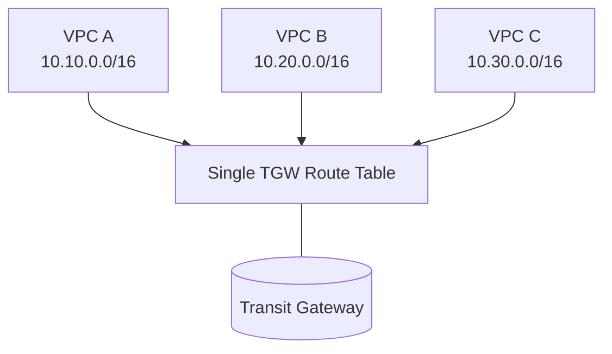
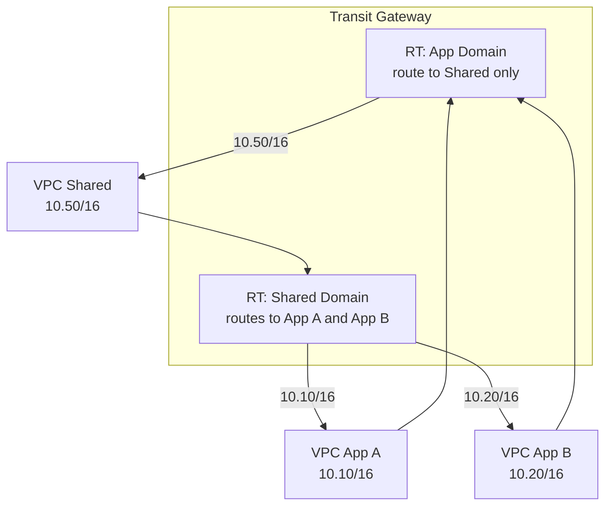
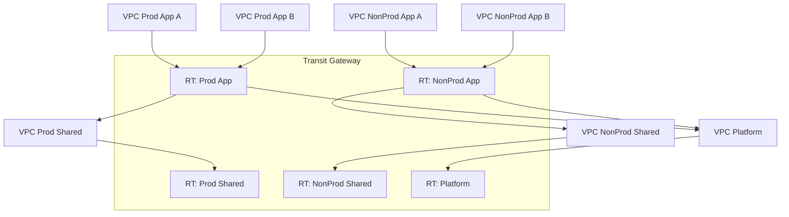
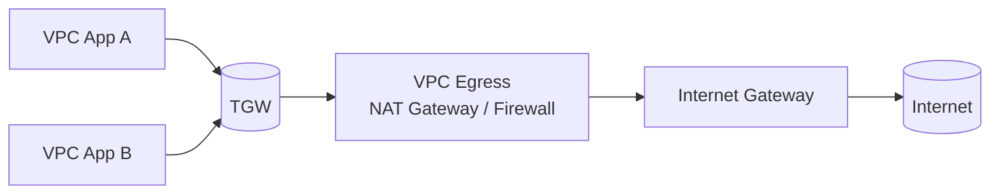
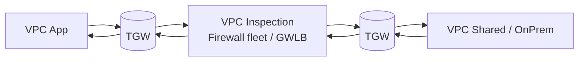
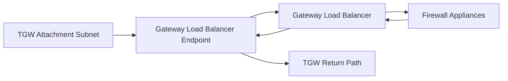
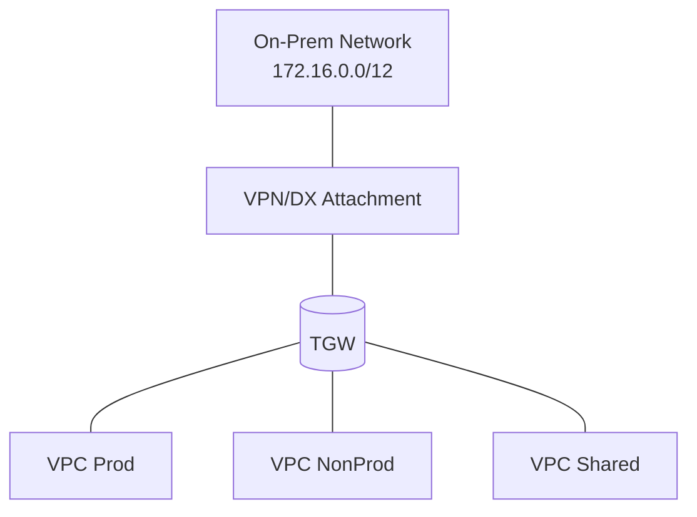
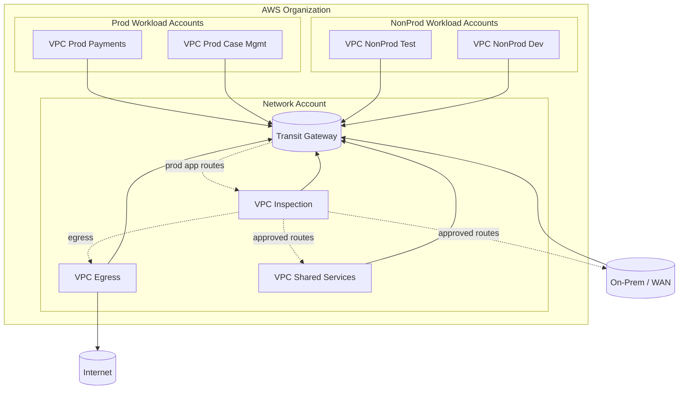

# Part 024 — Transit Gateway Routing Patterns

Part 023 membahas core model Transit Gateway:

```text
attachment -> associated TGW route table -> route lookup -> target attachment
```

Part ini membahas **pattern produksi**.

Karena di dunia nyata, masalahnya jarang sekadar:

```text
VPC A harus bisa bicara ke VPC B.
```

Masalah yang sebenarnya:

```text
Prod apps boleh akses shared services, tetapi tidak boleh lateral ke prod apps lain.
Nonprod tidak boleh menyentuh prod.
On-prem boleh akses subset CIDR tertentu.
Outbound internet harus lewat inspection.
East-west antar-domain harus lewat firewall.
Security team perlu bukti jalur traffic.
Setiap route baru harus punya owner dan alasan.
```

Transit Gateway memberi toolset untuk membangun ini, tetapi tidak otomatis membuat desain aman.
Kita harus menyusun **route domain**.

---

## 1. Prinsip Dasar Route Domain

Route domain adalah kumpulan attachment yang memakai route table tertentu sebagai policy reachability.

Dalam TGW:

```text
Route domain ≈ TGW route table + set of associated attachments + set of propagated/static routes
```

Contoh domain:

```text
prod-app-domain
nonprod-app-domain
shared-services-domain
onprem-domain
inspection-domain
egress-domain
```

Setiap domain harus menjawab:

```text
1. Attachment mana yang masuk domain ini?
2. Destination mana yang boleh dicapai dari domain ini?
3. Prefix mana yang dipublikasikan ke domain ini?
4. Apakah traffic harus melewati firewall/inspection?
5. Apakah return path simetris?
6. Apa yang terjadi jika attachment baru ditambahkan?
```

Kalau desain hanya punya satu TGW route table besar, domain boundary hilang.

---

## 2. Pattern 1 — Simple Hub-and-Spoke Full Mesh

Ini pattern paling sederhana.

Semua VPC attach ke TGW.
Semua attachment associated ke route table yang sama.
Semua attachment propagate ke route table yang sama.



Routes:

```text
tgw-rt-main:
  10.10.0.0/16 -> att-a
  10.20.0.0/16 -> att-b
  10.30.0.0/16 -> att-c
```

Result:

```text
A can reach B
B can reach C
C can reach A
Everyone can reach everyone, subject to SG/NACL/app policy
```

### When It Is Acceptable

Gunakan hanya jika:

- environment kecil,
- semua VPC memang satu trust zone,
- tidak ada compliance segmentation,
- tidak ada central inspection requirement,
- semua owner memahami full-mesh implication.

Contoh:

```text
sandbox network
single-team dev environment
small internal lab
temporary migration bridge
```

### Production Risk

Risiko terbesar:

```text
new attachment joins full mesh accidentally
```

Jika default propagation aktif, VPC baru bisa langsung reachable dari semua domain.

Untuk production regulated environment, full mesh harus dianggap exception.

---

## 3. Pattern 2 — App-to-Shared Services, No App-to-App

Ini salah satu pattern paling umum.

Kebutuhan:

```text
App VPCs need shared services: DNS, AD, logging, monitoring, package repo, CI runner, secrets broker.
App VPCs should not talk to each other directly.
Shared services may need to respond to apps.
```

CIDR:

```text
App A: 10.10.0.0/16
App B: 10.20.0.0/16
Shared: 10.50.0.0/16
```

TGW route tables:

```text
tgw-rt-app
tgw-rt-shared
```

Associations:

```text
att-app-a  -> tgw-rt-app
att-app-b  -> tgw-rt-app
att-shared -> tgw-rt-shared
```

Propagations:

```text
att-shared -> tgw-rt-app
att-app-a  -> tgw-rt-shared
att-app-b  -> tgw-rt-shared
```

Do not propagate App A/App B into `tgw-rt-app`.

Diagram:



Expected reachability:

| Source | Destination | Result |
|---|---|---|
| App A | Shared | allowed |
| App B | Shared | allowed |
| Shared | App A | allowed if needed |
| Shared | App B | allowed if needed |
| App A | App B | no TGW route |
| App B | App A | no TGW route |

### Why This Pattern Works

App VPC traffic enters TGW from app attachment.
App attachment uses `tgw-rt-app`.
`tgw-rt-app` only knows Shared.
Therefore App-to-App has no TGW next hop.

Shared traffic enters from shared attachment.
Shared attachment uses `tgw-rt-shared`.
`tgw-rt-shared` knows App A and App B.
Therefore Shared can return traffic or initiate approved flows.

### Failure Mode

Jika engineer tanpa sengaja menyalakan propagation App A ke `tgw-rt-app`, route table app akan berisi:

```text
10.10.0.0/16 -> att-app-a
10.20.0.0/16 -> att-app-b
10.50.0.0/16 -> att-shared
```

Maka App A bisa reach App B.
SG mungkin masih menolak, tetapi network boundary sudah bocor.

---

## 4. Pattern 3 — Environment Segmentation: Prod vs Nonprod

Kebutuhan:

```text
Prod and nonprod must be isolated.
Both may use their own shared services.
Some central platform services may be shared with strict rules.
```

Route tables:

```text
tgw-rt-prod-app
tgw-rt-nonprod-app
tgw-rt-prod-shared
tgw-rt-nonprod-shared
tgw-rt-platform
```

Diagram:



Rules:

```text
Prod App -> Prod Shared: allowed
NonProd App -> NonProd Shared: allowed
Prod App -> Platform: maybe allowed
NonProd App -> Platform: maybe allowed
NonProd -> Prod: denied by no route
Prod -> NonProd: denied by no route unless explicit migration path
```

### Shared Platform Problem

Kadang ada platform VPC yang melayani prod dan nonprod:

```text
artifact repository
license server
central observability collector
corporate DNS forwarder
```

Hati-hati. Jika platform VPC bisa initiate ke prod dan nonprod, platform VPC menjadi bridge.

Mitigasi:

- batasi SG inbound dari prefix tertentu,
- gunakan service-specific endpoints,
- pertimbangkan PrivateLink untuk service exposure,
- pisahkan prod platform dan nonprod platform,
- jangan biarkan platform VPC punya broad route balik tanpa alasan.

Prinsip:

> Shared service bukan berarti shared network trust.

---

## 5. Pattern 4 — Centralized Egress via TGW

Kebutuhan:

```text
Private workload VPCs need outbound internet.
Internet egress must be centralized for control, logging, allowlist, cost visibility, or firewall inspection.
```

Komponen:

```text
App VPCs
Transit Gateway
Egress VPC
NAT Gateway / firewall / proxy
Internet Gateway
```

High-level path:

```text
App private subnet -> TGW -> Egress VPC -> NAT/Firewall -> IGW -> Internet
```

Diagram:



TGW route tables:

```text
tgw-rt-app:
  0.0.0.0/0 -> att-egress
  shared prefixes -> att-shared if needed

tgw-rt-egress:
  app prefixes -> att-app-a / att-app-b / ...
```

VPC App route table:

```text
0.0.0.0/0 -> TGW
```

Egress VPC route table depends on architecture.

### 5.1 NAT-only Centralized Egress

Simpler but less inspectable.

```text
App -> TGW -> NAT Gateway -> IGW -> Internet
```

Pros:

- simple,
- managed NAT,
- fewer moving parts.

Cons:

- NAT Gateway is not L7 firewall,
- limited filtering,
- potential inter-AZ/data processing cost,
- route symmetry still matters,
- central egress can become shared bottleneck/cost center.

### 5.2 Firewall/Proxy Centralized Egress

```text
App -> TGW -> Firewall/GWLB/Proxy -> NAT/IGW -> Internet
```

Pros:

- domain/IP allowlist,
- IDS/IPS,
- TLS inspection if legally/operationally permitted,
- central logs,
- security team control.

Cons:

- more routing complexity,
- appliance scaling,
- stateful symmetry requirements,
- failure mode more complex,
- can add latency.

### 5.3 Important Egress Invariant

For each app VPC:

```text
private subnet route 0.0.0.0/0 -> TGW
TGW app RT route 0.0.0.0/0 -> egress attachment
Egress VPC route to internet via firewall/NAT/IGW
Return path from egress to app prefix via TGW
TGW egress RT route app prefix -> app attachment
```

If return path missing, outbound sessions fail.

### 5.4 Cost Trap

Centralized egress can introduce:

- TGW data processing charge,
- NAT Gateway data processing charge,
- cross-AZ data transfer if app and egress path not AZ-aware,
- firewall appliance/GWLB charge,
- internet data transfer out.

A decentralized NAT per VPC can sometimes be cheaper or more resilient for high-volume workloads.

Do not choose centralized egress only because it looks architecturally clean.
Measure traffic volume.

---

## 6. Pattern 5 — Centralized Inspection VPC for East-West Traffic

Kebutuhan:

```text
Traffic between route domains must pass through firewall.
Example: App -> OnPrem, App -> Shared, Prod -> Partner, or selected App -> App.
```

Inspection VPC sits as service insertion point.

Diagram:



In reality it is one TGW, but the diagram shows two passes through TGW conceptually.

### 6.1 Route Table Concept

Route tables:

```text
tgw-rt-app
tgw-rt-inspection
tgw-rt-shared
```

Goal:

```text
App traffic to Shared goes to Inspection.
Inspection then forwards to Shared.
Shared return traffic goes to Inspection.
Inspection then forwards to App.
```

Example routes:

```text
tgw-rt-app:
  10.50.0.0/16 -> att-inspection

tgw-rt-shared:
  10.10.0.0/16 -> att-inspection

tgw-rt-inspection:
  10.50.0.0/16 -> att-shared
  10.10.0.0/16 -> att-app
```

Associations:

```text
att-app        -> tgw-rt-app
att-shared     -> tgw-rt-shared
att-inspection -> tgw-rt-inspection
```

This forces both directions through inspection.

### 6.2 VPC Inspection Internal Routing

Inside inspection VPC, packet must go through appliance.

Common architecture with Gateway Load Balancer:



The exact route tables in inspection VPC are easy to get wrong.
You need route tables for:

- TGW attachment subnets,
- firewall/GWLB endpoint subnets,
- appliance subnets,
- sometimes public/NAT subnets if egress inspection also exists.

### 6.3 Symmetry Requirement

Stateful firewall requires both directions.

Bad path:

```text
App -> Firewall -> Shared
Shared -> App direct
```

Good path:

```text
App -> Firewall -> Shared
Shared -> Firewall -> App
```

TGW appliance mode may be required for stateful appliances on VPC attachments.
But appliance mode does not replace correct route design.

### 6.4 Common Failure Modes

| Failure | Symptom |
|---|---|
| App RT points direct to Shared | Firewall sees no traffic. |
| Shared RT return bypasses inspection | One-way traffic or firewall state drop. |
| Inspection RT missing target route | Packet enters inspection then dies. |
| Inspection VPC subnet route wrong | Packet reaches VPC but not appliance. |
| Appliance mode missing | Flow asymmetry in multi-AZ stateful inspection. |
| Firewall allows request but blocks response | SYN/SYN-ACK mismatch, timeout. |

---

## 7. Pattern 6 — On-Premises Segmentation via TGW

Kebutuhan:

```text
AWS VPCs connect to on-prem via Direct Connect/VPN.
Not every VPC should access every on-prem prefix.
Not every on-prem network should access every VPC.
```

Components:

```text
Transit Gateway
VPN or Direct Connect Gateway attachment
TGW route tables by domain
BGP/static routes
On-prem router/firewall policy
```

Diagram:



Bad design:

```text
on-prem attachment propagates all 172.16.0.0/12 to all AWS route tables
all VPCs propagate to on-prem route table
```

Better:

```text
prod-app RT receives only required on-prem prefixes
nonprod-app RT receives only nonprod/corp prefixes
onprem RT receives only approved AWS VPC prefixes
blackhole sensitive prefixes if needed
```

### 7.1 Broad On-Prem Routes

On-prem often advertises broad routes:

```text
10.0.0.0/8
172.16.0.0/12
192.168.0.0/16
```

These are dangerous in cloud route tables because many AWS VPCs also use RFC1918.

If on-prem advertises `10.0.0.0/8`, and your AWS VPCs are inside `10.0.0.0/8`, route specificity matters.

Example:

```text
tgw-rt-app:
  10.50.0.0/16 -> shared
  10.0.0.0/8   -> onprem
```

Traffic to `10.50.1.10` uses `/16` shared route because more specific.
Traffic to unknown `10.80.1.10` goes on-prem.

This may be intended or dangerous.

### 7.2 On-Prem Return Path

AWS route tables can be perfect while on-prem return path is wrong.

Always validate:

```text
On-prem router/firewall has route back to AWS VPC CIDR via DX/VPN/TGW.
Security policy allows return.
NAT is not hiding source unexpectedly.
BGP route preference does not choose backup path unexpectedly.
```

Cloud engineer often stops at TGW. Hybrid debugging requires both sides.

---

## 8. Pattern 7 — Shared Services with Selective Consumer Exposure

Sometimes shared services should not be reachable as full VPC network.

Example:

```text
Shared VPC contains:
- DNS resolver
- AD/domain controllers
- observability collectors
- CI runners
- internal admin tools
- secrets broker
- package repository
```

Not every app needs every shared service.

TGW route table can expose the shared CIDR broadly, but SG/app policy must still narrow ports.

Better options:

### Option A — TGW + SG Port-Level Control

```text
App VPC route to shared CIDR via TGW
Shared SG allows only required source CIDRs/SGs/ports
```

Good for infrastructure primitives like DNS/AD where network-level access is natural.

### Option B — PrivateLink for Specific Services

```text
Provider exposes service behind NLB endpoint service
Consumer creates interface endpoint
No broad route to provider VPC CIDR
```

Good when consumer only needs one service.

### Option C — VPC Lattice

Good when service-to-service connectivity needs app-network abstraction, auth policy, cross-account service network, and monitoring.

### Decision Rule

```text
Need network domain access? Use TGW.
Need service-only access? Prefer PrivateLink or Lattice.
Need DNS/AD style infra dependency? TGW may be appropriate.
Need many application services with policy? Consider Lattice.
```

---

## 9. Pattern 8 — Blackhole Guardrails

Blackhole routes are not a complete security strategy, but useful guardrails.

Example:

```text
tgw-rt-nonprod:
  10.0.0.0/8      -> onprem
  10.40.0.0/14    -> blackhole    # prod cloud range
```

Use cases:

- prevent nonprod from reaching prod aggregate,
- block sensitive enclave,
- override broad on-prem/corporate routes,
- fail closed during migration,
- intentionally sink deprecated CIDR.

But blackhole routes can create confusion if not documented.

Every blackhole should have metadata:

```yaml
prefix: 10.40.0.0/14
routeTable: tgw-rt-nonprod
reason: prevent nonprod access to prod cloud range
owner: network-security
reviewDate: 2026-10-01
```

If blackhole list grows long, rethink route propagation boundaries.

---

## 10. Pattern 9 — Multi-Account Attachment Governance

In AWS Organizations, TGW usually lives in a network account.
Workload VPCs live in application accounts.
Attachment can be shared via AWS Resource Access Manager depending on setup.

Governance workflow:

```text
1. Workload team requests TGW attachment.
2. Network platform validates CIDR/IPAM/environment.
3. Attachment is created or accepted.
4. Attachment associated to approved route table.
5. Propagation enabled only to approved route tables.
6. VPC subnet route tables updated by IaC.
7. Reachability tests executed.
8. Inventory updated.
```

Never allow this pattern:

```text
workload account attaches VPC
attachment auto-associated/propagated to default RT
no central review
```

That defeats the purpose of network account control.

### Attachment Contract

Each attachment should be represented as data:

```yaml
name: app-prod-risk-engine
accountId: "111122223333"
environment: prod
vpcId: vpc-abc123
cidrs:
  - 10.44.0.0/16
associatedRouteTable: tgw-rt-prod-app
propagations:
  - tgw-rt-prod-shared
  - tgw-rt-prod-onprem
staticRoutesRequired:
  - destination: 0.0.0.0/0
    nextHop: inspection-egress
allowedFlows:
  - source: app-prod-risk-engine
    destination: shared-prod-dns
    ports: [53]
  - source: app-prod-risk-engine
    destination: onprem-risk-db
    ports: [1521]
owner: risk-platform
approver: network-platform
```

Without contract, route tables become tribal knowledge.

---

## 11. Pattern 10 — Route Domain as Product Interface

A mature platform team should expose networking as product interfaces, not one-off route changes.

Examples:

```text
prod-app-standard-domain:
  can reach prod shared services
  can reach approved on-prem prod prefixes
  egress via inspection
  no app-to-app lateral movement

nonprod-app-standard-domain:
  can reach nonprod shared services
  can reach corporate nonprod prefixes
  egress via nonprod egress
  no prod routes

shared-service-provider-domain:
  can receive from app domains
  can initiate only approved management flows
```

Application teams choose from known domains.
They do not design TGW route tables from scratch every time.

This gives:

- consistency,
- faster onboarding,
- fewer security reviews,
- better auditability,
- easier drift detection.

---

## 12. Route Propagation Strategy

Do not enable propagation casually.

Think in terms of route publication:

```text
Which domains need to know this prefix?
```

### Strategy A — Propagate to Consumer Domains

If Shared is consumed by App, propagate Shared to App RT.

```text
shared -> app RT
```

This allows App to reach Shared.

### Strategy B — Propagate Consumers to Provider Return Domain

If Shared needs return to App, propagate App to Shared RT.

```text
app-a -> shared RT
app-b -> shared RT
```

This allows Shared to return/initiate.

### Strategy C — Do Not Propagate Peer Consumers to Same Consumer RT

If App A and App B should not talk, do not propagate App A/App B to App RT.

```text
app-a -/-> app RT
app-b -/-> app RT
```

### Strategy D — Static Routes for Forced Service Insertion

If traffic must go through inspection, use static route to inspection attachment instead of direct propagated route.

```text
tgw-rt-app:
  10.50.0.0/16 -> att-inspection
```

Then inspection RT decides final target:

```text
tgw-rt-inspection:
  10.50.0.0/16 -> att-shared
```

### Strategy E — Blackhole for Explicit Deny

Use blackhole when a broad route exists but a more specific prefix must be denied.

---

## 13. Static vs Propagated Route Decision

| Case | Prefer |
|---|---|
| Many VPC CIDRs need to be advertised to shared/on-prem | Propagation |
| Centralized egress default route | Static route |
| Forced inspection path | Static route to inspection |
| Blocking sensitive more-specific prefix | Blackhole static route |
| BGP-learned hybrid prefixes | Propagation from VPN/DX path, filtered by design |
| Stable shared service CIDR | Either; often propagation if attachment owns CIDR |
| Migration exception | Static route with expiry metadata |

Static routes give control.
Propagation reduces toil.

Production designs usually combine both:

```text
propagation for ownership of local VPC prefixes
static routes for policy path decisions
blackhole routes for explicit guardrail
```

---

## 14. Building a TGW Route Matrix

Before configuring TGW, draw a route matrix.

Example:

| Source Domain | Allowed Destination Domain | Inspection? | Route Table Behavior |
|---|---|---|---|
| prod-app | prod-shared | maybe | route shared directly or via inspection |
| prod-app | onprem-prod | yes | route onprem prefixes to inspection |
| prod-app | internet | yes | `0.0.0.0/0 -> egress/inspection` |
| prod-app | prod-app | no by default | no app prefixes in prod-app RT |
| nonprod-app | prod-* | no | no route / blackhole prod aggregate |
| nonprod-app | internet | maybe | nonprod egress path |
| shared | prod-app | selected | app prefixes in shared RT |
| onprem | prod-app | selected | prod prefixes in onprem RT |

This matrix becomes IaC input.

Do not start with console clicks.
Start with route intent.

---

## 15. Example Production Route Tables

### 15.1 `tgw-rt-prod-app`

Purpose:

```text
Routes used by traffic entering TGW from prod app VPCs.
```

Routes:

```text
10.50.0.0/16       -> att-prod-shared
172.20.0.0/16      -> att-inspection       # on-prem sensitive via firewall
172.21.0.0/16      -> att-inspection
0.0.0.0/0          -> att-egress-inspection
10.60.0.0/14       -> blackhole            # nonprod cloud aggregate
```

No routes to other prod app CIDRs unless approved.

### 15.2 `tgw-rt-prod-shared`

Purpose:

```text
Routes used by traffic entering TGW from prod shared services.
```

Routes:

```text
10.40.0.0/16 -> att-prod-app-payments
10.41.0.0/16 -> att-prod-app-case-mgmt
10.42.0.0/16 -> att-prod-app-reporting
172.20.0.0/16 -> att-inspection
```

### 15.3 `tgw-rt-inspection`

Purpose:

```text
Routes used by traffic exiting inspection VPC back toward final domains.
```

Routes:

```text
10.50.0.0/16 -> att-prod-shared
10.40.0.0/16 -> att-prod-app-payments
10.41.0.0/16 -> att-prod-app-case-mgmt
172.20.0.0/16 -> att-onprem-prod
0.0.0.0/0 -> att-egress-vpc
```

### 15.4 `tgw-rt-onprem-prod`

Purpose:

```text
Routes used by traffic entering TGW from on-prem prod network.
```

Routes:

```text
10.40.0.0/16 -> att-inspection
10.41.0.0/16 -> att-inspection
10.50.0.0/16 -> att-inspection
10.60.0.0/14 -> blackhole
```

This ensures on-prem-to-cloud also goes through inspection.

---

## 16. Debugging by Pattern

### 16.1 App Cannot Reach Shared

Expected path:

```text
App subnet RT -> TGW
TGW app RT -> shared or inspection
Shared return RT -> TGW
TGW shared/inspection RT -> app
```

Check:

```text
[ ] App VPC route to shared CIDR via TGW
[ ] App attachment association correct
[ ] App TGW RT contains shared route
[ ] If inspection used, inspection RT contains shared route
[ ] Shared VPC route back to app CIDR via TGW
[ ] Shared attachment association correct
[ ] Shared TGW RT contains app route or route to inspection
[ ] SG/NACL/firewall allow
```

### 16.2 App Unexpectedly Reaches Another App

Check:

```text
[ ] Are app prefixes propagated into app route table?
[ ] Is there broad aggregate route covering app CIDRs?
[ ] Is there on-prem/corporate route hairpinning traffic back?
[ ] Is destination actually behind shared service/proxy?
[ ] Is DNS resolving to unexpected IP?
```

### 16.3 Internet Egress Fails

Check:

```text
[ ] App subnet route 0.0.0.0/0 -> TGW
[ ] App TGW RT 0.0.0.0/0 -> egress/inspection attachment
[ ] Egress VPC route to NAT/firewall/IGW correct
[ ] Return route to app prefix via TGW
[ ] NAT/firewall capacity and policy
[ ] DNS resolves public destination
[ ] NACL ephemeral ports
```

### 16.4 Firewall Sees Only One Direction

Check:

```text
[ ] Return TGW route table points to inspection
[ ] Appliance mode enabled if required
[ ] Inspection VPC route tables force both directions through appliance
[ ] Multi-AZ flow affinity preserved
[ ] No more-specific route bypasses inspection
```

---

## 17. IaC Structure for TGW Patterns

A maintainable TGW design should be data-driven.

Example logical structure:

```yaml
routeTables:
  prod-app:
    associations:
      - app-prod-payments
      - app-prod-case-mgmt
    propagations:
      - shared-prod
    staticRoutes:
      - destination: 0.0.0.0/0
        target: inspection-egress
      - destination: 172.20.0.0/16
        target: inspection
    blackholes:
      - 10.60.0.0/14

  prod-shared:
    associations:
      - shared-prod
    propagations:
      - app-prod-payments
      - app-prod-case-mgmt
    staticRoutes:
      - destination: 172.20.0.0/16
        target: inspection
```

Then generate:

- TGW route tables,
- associations,
- propagations,
- static routes,
- blackholes,
- VPC route table entries,
- documentation,
- tests.

IaC should prevent:

```text
attachment without association
attachment with default route table accidentally
prod/nonprod cross-propagation
blackhole without reason
0.0.0.0/0 without approved target
```

---

## 18. Reachability Tests as Contract Tests

For each route domain, define expected reachability.

Example:

```yaml
tests:
  - name: app-to-shared-dns
    source: app-prod-payments
    destination: shared-prod-dns
    port: 53
    protocol: udp
    expected: reachable

  - name: app-to-app-denied
    source: app-prod-payments
    destination: app-prod-case-mgmt
    port: 443
    protocol: tcp
    expected: not_reachable

  - name: nonprod-to-prod-denied
    source: app-nonprod-test
    destination: app-prod-payments
    port: 443
    protocol: tcp
    expected: not_reachable
```

These tests can be implemented using combinations of:

- Reachability Analyzer,
- synthetic probes,
- SSM Run Command from test instances,
- application health checks,
- firewall log assertions,
- Flow Logs queries.

The important part is not the tool.
The important part is that reachability is tested as a contract.

---

## 19. Diagram: Enterprise TGW Pattern



This diagram is intentionally high-level.
The real design is in route tables.

A diagram without route table matrix is decoration.

---

## 20. Decision Checklist

Before choosing a TGW pattern, answer:

```text
1. Is this network-domain connectivity or service-only access?
2. Are CIDRs non-overlapping?
3. Which environments must be isolated?
4. Which shared services are required?
5. Is app-to-app lateral movement allowed?
6. Is on-prem access required?
7. Is centralized egress required?
8. Is inspection required for east-west, north-south, or both?
9. Are appliances stateful?
10. Does return path pass through the same inspection domain?
11. What are the route tables and associations?
12. Which attachments propagate to which route tables?
13. What broad routes exist?
14. Which blackholes are needed?
15. What tests prove intended reachability and intended non-reachability?
```

If you cannot answer these, do not build the TGW yet.

---

## 21. Common Design Smells

### Smell 1 — “We Have One Main TGW Route Table”

Maybe acceptable for small labs.
Dangerous for enterprise.

### Smell 2 — “Security Groups Will Handle Segmentation”

SGs are necessary, but allowing routes everywhere increases blast radius.
Prefer defense-in-depth:

```text
no route + SG + app auth + logs
```

not:

```text
route everywhere + hope SG is perfect
```

### Smell 3 — “Central Inspection Is Required” but Routes Bypass It

If any more-specific direct route bypasses firewall, inspection is not guaranteed.

### Smell 4 — “All On-Prem Prefixes to All VPCs”

This often leaks too much corporate network into cloud.
Filter by domain.

### Smell 5 — “No Negative Tests”

Testing only allowed paths is insufficient.
You must test denied paths too.

```text
App A can reach Shared: good.
App A cannot reach App B: equally important.
Nonprod cannot reach Prod: critical.
```

---

## 22. Production Runbook: Adding a New VPC Attachment

Use this sequence.

### Step 1 — Classify the VPC

```text
environment: prod / nonprod / sandbox
function: app / shared / inspection / egress / data / security
connectivity: shared, onprem, internet, app-to-app?
compliance: restricted / normal
```

### Step 2 — Validate CIDR

```text
non-overlap with existing VPCs
non-overlap with on-prem advertised routes
registered in IPAM
future expansion reserved
```

### Step 3 — Choose Route Domain

```text
associated TGW RT = based on source domain
propagations = based on who needs to reach this VPC
static routes = based on forced paths
blackholes = based on denied aggregates
```

### Step 4 — Create/Accept Attachment

Use dedicated attachment subnets where possible.

### Step 5 — Associate Explicitly

Do not rely on default association.

### Step 6 — Propagate Intentionally

Enable only required propagation.

### Step 7 — Update VPC Route Tables

Add routes from workload subnets to remote prefixes via TGW.

### Step 8 — Validate Positive and Negative Paths

```text
expected allowed flows work
expected denied flows fail
Flow Logs/Reachability evidence captured
```

### Step 9 — Update Inventory

Document owner, route domain, CIDR, allowed flows, and expiry for temporary exceptions.

---

## 23. Key Takeaways

Transit Gateway routing patterns are about **policy expressed as reachability**.

The most important production leap is moving from:

```text
connect these VPCs
```

to:

```text
model route domains and allowed flows
```

Core rules:

```text
Association decides which TGW route table traffic from an attachment uses.
Propagation publishes attachment prefixes into chosen route tables.
Static routes express deliberate next-hop policy.
Blackholes express explicit deny for specific prefixes.
VPC route tables still decide whether packet reaches TGW.
Return path must be designed, not assumed.
Inspection requires symmetric routing.
Centralization improves control but can increase cost and blast radius.
```

A good TGW design has:

- clear route domains,
- no accidental full mesh,
- explicit association/propagation,
- documented broad routes,
- tested denied paths,
- IaC-backed route intent,
- observable packet paths,
- clear ownership.

If Part 023 taught what TGW is, Part 024 should make clear what TGW becomes in production:

> a route-domain engine for multi-account network architecture.

---

## References

- AWS Documentation — What is AWS Transit Gateway: `https://docs.aws.amazon.com/vpc/latest/tgw/what-is-transit-gateway.html`
- AWS Documentation — How AWS Transit Gateway works: `https://docs.aws.amazon.com/vpc/latest/tgw/how-transit-gateways-work.html`
- AWS Documentation — Transit gateway route tables: `https://docs.aws.amazon.com/vpc/latest/tgw/tgw-route-tables.html`
- AWS Documentation — Amazon VPC attachments in AWS Transit Gateway: `https://docs.aws.amazon.com/vpc/latest/tgw/tgw-vpc-attachments.html`
- AWS Documentation — Transit gateway scenarios and routing examples: `https://docs.aws.amazon.com/vpc/latest/tgw/transit-gateway-scenarios.html`
- AWS Architecture Blog — Centralized inspection architecture patterns with AWS Transit Gateway and Gateway Load Balancer: `https://aws.amazon.com/blogs/architecture/centralized-inspection-architecture-with-aws-gateway-load-balancer-and-aws-transit-gateway/`
