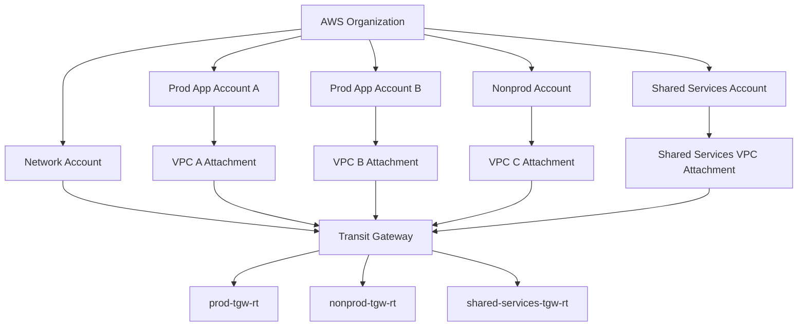
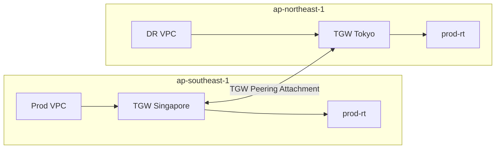
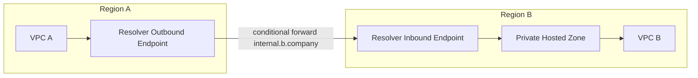
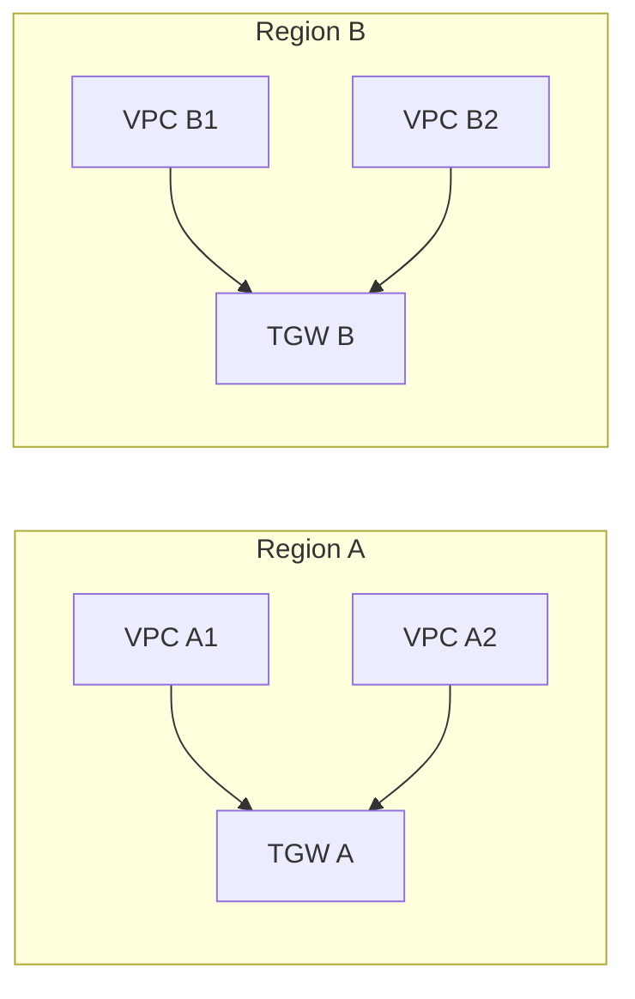
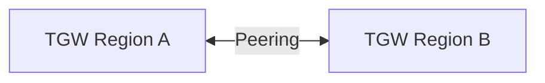
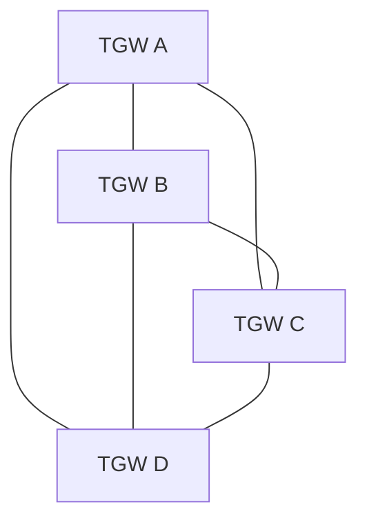
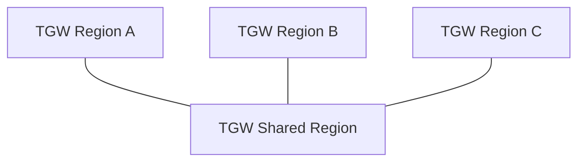
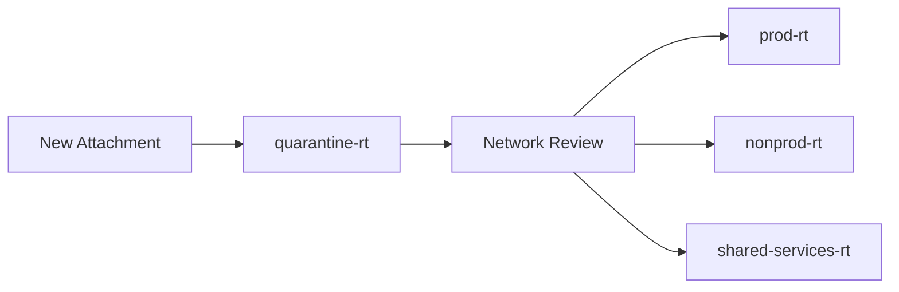

# Part 025 — TGW Cross-Region and Multi-Account

Di Part 023 kita membangun model inti Transit Gateway:

```text
source attachment -> associated TGW route table -> longest-prefix route lookup -> target attachment
```

Di Part 024 kita memakai model itu untuk route-domain pattern:

```text
prod
nonprod
shared-services
onprem
egress
inspection
```

Sekarang masalahnya naik level.

Bukan lagi:

```text
Bagaimana satu Region menghubungkan banyak VPC?
```

Tetapi:

```text
Bagaimana banyak account, banyak Region, banyak owner, dan banyak route-domain tetap bisa berkomunikasi tanpa membuat jaringan menjadi spaghetti global?
```

Transit Gateway bisa di-share lintas account dengan AWS Resource Access Manager. Transit Gateway juga bisa di-peer dengan Transit Gateway lain, baik intra-Region maupun inter-Region. Tetapi dua kemampuan itu tidak otomatis membuat desain menjadi aman, sederhana, atau scalable.

Part ini membahas **cross-region dan multi-account Transit Gateway sebagai sistem produksi**.

---

## 1. Problem yang Sebenarnya

Multi-account dan multi-region networking biasanya muncul karena empat alasan:

```text
1. Organizational boundary
   Setiap team/domain punya account sendiri.

2. Fault isolation
   Kegagalan satu account atau satu Region tidak boleh menjatuhkan semuanya.

3. Compliance boundary
   Prod, nonprod, regulated workloads, dan shared services harus dipisah.

4. Geographic placement
   Workload dekat dengan user, data residency, latency, atau DR.
```

Kesalahan umum adalah menganggap Transit Gateway sebagai switch besar:

```text
Semua account attach ke TGW.
Semua Region peer ke semua Region.
Semua route propagate ke semua route table.
Selesai.
```

Itu bukan desain enterprise. Itu hanya memperbesar blast radius.

Desain yang benar dimulai dari pertanyaan:

```text
Siapa boleh menjangkau siapa?
Dari Region mana ke Region mana?
Untuk prefix apa?
Melalui inspection atau tidak?
Siapa owner route tersebut?
Bagaimana rollback bila route salah dipropagate?
```

Transit Gateway cross-region/multi-account adalah **reachability governance problem**, bukan sekadar connectivity problem.

---

## 2. Primitive Utama

Ada beberapa primitive yang harus dibedakan.

| Primitive | Fungsi | Scope | Catatan Produksi |
|---|---|---|---|
| Transit Gateway | Regional hub routing | Region | Tidak global. Satu TGW ada di satu Region. |
| TGW route table | Route-domain di dalam TGW | Region | Association menentukan ingress policy. Propagation/static route menentukan reachability. |
| VPC attachment | Menghubungkan VPC ke TGW | Region | VPC dan TGW harus compatible secara Region attachment. |
| Peering attachment | Menghubungkan dua TGW | Intra/inter-Region | Membutuhkan static route ke peering attachment. |
| AWS RAM share | Share TGW ke account lain | Account/Organization | Memisahkan owner TGW dan owner VPC workload. |
| Direct Connect/VPN attachment | Hybrid connectivity | Region/TGW | Sering dimiliki network account. |
| Route 53 Resolver | DNS path | VPC/Region | Tidak otomatis solved oleh TGW peering lintas Region. |

Mental model:

```text
TGW bukan satu global router.
TGW adalah router regional.
Cross-region networking terjadi karena router regional saling di-peer.
Multi-account networking terjadi karena router regional di-share/di-attach lintas account.
```

---

## 3. Multi-Account TGW Ownership Model

Dalam organisasi yang sehat, Transit Gateway biasanya dimiliki oleh **network account**, bukan workload account.



Pembagian tanggung jawab:

| Owner | Tanggung Jawab |
|---|---|
| Network/platform team | TGW, TGW route table, association, propagation, peering, hybrid connectivity, global route policy. |
| Workload team | VPC CIDR, subnet route to TGW, SG/NACL, application endpoint exposure, dependency declaration. |
| Security team | Inspection domain, deny routes, Network Firewall/GWLB policy, evidence dan audit. |
| DNS/platform team | Private hosted zones, Resolver rules, DNS forwarding, split-horizon behavior. |
| FinOps | Attachment count, data processing, cross-AZ/cross-region transfer, centralized egress cost. |

Invariant penting:

```text
Workload team boleh memiliki VPC.
Tetapi workload team tidak otomatis boleh menentukan global reachability.
```

Jika workload account bebas attach dan propagate route tanpa review, TGW berubah menjadi lateral movement fabric.

---

## 4. AWS RAM Sharing: Apa yang Di-Share?

AWS Resource Access Manager dipakai untuk share Transit Gateway ke account lain.

Flow-nya:

```text
1. Network account membuat TGW.
2. Network account membuat resource share via AWS RAM.
3. Share diberikan ke account, OU, atau organisasi.
4. Workload account melihat shared TGW.
5. Workload account membuat VPC attachment ke TGW tersebut.
6. TGW owner menerima attachment jika auto-accept tidak digunakan.
7. TGW owner mengatur association dan propagation.
```

Yang sering disalahpahami:

```text
Share TGW tidak berarti share kontrol route table sepenuhnya.
```

Account workload bisa membuat attachment terhadap shared TGW, tetapi desain produksi biasanya tetap mengharuskan network account mengontrol:

```text
- route table association
- route table propagation
- static routes
- blackhole routes
- peering route
- inspection route
- acceptance workflow
```

### 4.1 Contract Attachment

Setiap VPC attachment harus punya contract.

Contoh contract:

```yaml
attachmentName: prod-payment-vpc-ap-southeast-1
environment: prod
ownerTeam: payments
accountId: "111122223333"
region: ap-southeast-1
vpcCidr:
  - 10.40.0.0/16
associatedRouteTable: prod-ingress-rt
propagateTo:
  - shared-services-rt
  - inspection-rt
allowedDestinations:
  - shared-dns
  - shared-observability
  - payment-db-replica
forbiddenDestinations:
  - nonprod
  - unrelated-prod-apps
inspectionRequired: true
changeTicket: NET-18422
```

Tanpa contract, TGW state akan menjadi kumpulan attachment dan route yang tidak ada yang berani hapus.

---

## 5. Cross-Region TGW Peering

Transit Gateway peering menghubungkan dua TGW.



Peering attachment bisa:

```text
- intra-Region
- inter-Region
- same account
- cross account
```

Tetapi routing antar TGW peering tidak otomatis seperti full dynamic mesh. Untuk membuat traffic lewat peering attachment, kita menambahkan route static ke TGW route table yang menunjuk ke peering attachment.

Contoh:

```text
TGW Singapore prod-rt:
  destination: 10.80.0.0/16
  target: tgw-peering-to-tokyo

TGW Tokyo prod-rt:
  destination: 10.40.0.0/16
  target: tgw-peering-to-singapore
```

Packet path:

```text
EC2 Singapore VPC
-> subnet route table: 10.80.0.0/16 to TGW Singapore
-> TGW Singapore attachment route table
-> static route to TGW peering attachment
-> TGW Tokyo
-> TGW Tokyo route table
-> VPC Tokyo attachment
-> subnet route table/local route
-> target instance/service
```

Peering bukan magic. Setiap sisi harus punya route yang benar.

---

## 6. Peering Static Route Design

Karena peering route static, desain prefix menjadi penting.

Ada tiga gaya umum.

### 6.1 Specific Prefix Per VPC

```text
10.40.0.0/16 -> peering-to-region-b
10.41.0.0/16 -> peering-to-region-b
10.42.0.0/16 -> peering-to-region-b
```

Kelebihan:

```text
- explicit
- mudah audit per VPC
- blast radius kecil
- tidak accidentally expose semua Region
```

Kekurangan:

```text
- route table lebih panjang
- perlu automation kuat
- perubahan CIDR butuh update banyak tempat
```

Gunakan untuk:

```text
regulated workload
prod critical path
limited inter-region dependencies
```

### 6.2 Regional Aggregate Prefix

```text
10.40.0.0/12 -> peering-to-region-b
```

Kelebihan:

```text
- route table lebih sederhana
- cocok bila IPAM sudah disiplin per Region
- scale lebih baik
```

Kekurangan:

```text
- overexposure bila governance lemah
- sulit isolate VPC tertentu jika aggregate terlalu besar
- butuh blackhole atau route-domain tambahan untuk exception
```

Gunakan jika:

```text
Setiap Region punya allocated CIDR block yang rapi dari IPAM.
Route-domain policy tetap membatasi association/propagation.
```

### 6.3 Service Prefix Only

```text
10.90.10.0/24 -> peering-to-shared-dns-region-b
10.90.20.0/24 -> peering-to-observability-region-b
```

Kelebihan:

```text
- minimal reachability
- cocok untuk shared global service
- mudah reasoning security
```

Kekurangan:

```text
- membutuhkan service-level network contract
- tidak cocok untuk broad DR replication jika prefix banyak
```

Gunakan untuk:

```text
centralized DNS
observability
identity bridge
license server
artifact mirror
```

---

## 7. DNS Limitation Cross-Region TGW Peering

Salah satu jebakan besar:

```text
TGW peering menghubungkan IP routing.
TGW peering tidak otomatis menyelesaikan DNS architecture.
```

Terutama untuk private DNS lintas Region, Anda harus mendesain Route 53 Resolver, private hosted zone association, forwarding rule, dan split-horizon behavior secara eksplisit.

Anti-pattern:

```text
Aplikasi di Region A mengakses db.internal.company.local di Region B.
Ping IP berhasil.
Nama DNS gagal.
Tim mengira TGW peering rusak.
Padahal routing IP jalan, DNS authority yang belum dihubungkan.
```

Runbook DNS cross-region:

```bash
# Dari instance source
getent hosts service.internal.example.com

# Lihat resolver yang dipakai
cat /etc/resolv.conf

# Query eksplisit ke VPC resolver lokal
dig service.internal.example.com

# Query dengan trace untuk public path bila relevan
dig +trace service.internal.example.com

# Validasi apakah PHZ terkait ke VPC source
# Validasi apakah Resolver rule forwarding ada
# Validasi inbound/outbound resolver endpoint SG/NACL/route
```

Desain yang lebih aman:



Jangan campur dua hal ini:

```text
Reachability IP: route table, TGW, SG, NACL.
Reachability nama: resolver, PHZ, forwarding, DNS TTL/cache.
```

---

## 8. Multi-Region Topology Patterns

### 8.1 Independent Regional Hubs

Setiap Region punya TGW sendiri. Tidak ada peering default.



Cocok untuk:

```text
- workloads independen per Region
- latency-sensitive local traffic
- strict data residency
- minimal cross-region dependency
```

Keuntungan:

```text
- blast radius kecil
- route table sederhana
- compliance mudah
```

Kekurangan:

```text
- shared global services perlu mekanisme lain
- DR/failover route harus dibuat saat perlu atau pre-provisioned terbatas
```

### 8.2 Pairwise Regional Peering

Dua Region yang punya hubungan kuat di-peer.



Cocok untuk:

```text
- active/passive DR
- regional pair architecture
- replication antar dua Region
```

Rule:

```text
Jangan peer semua Region hanya karena bisa.
Peer Region karena ada use case dan owner traffic.
```

### 8.3 Regional Mesh

Banyak TGW saling peering.



Ini jarang cocok kecuali organisasi punya automation dan governance sangat matang.

Risiko:

```text
- route explosion
- asymmetric routing
- sulit audit
- sulit incident response
- perubahan kecil berdampak global
```

Kalau Anda mulai butuh global segmentation yang konsisten lintas banyak Region, evaluasi AWS Cloud WAN pada part berikutnya.

### 8.4 Central Shared Region

Satu Region menjadi shared service hub.



Cocok untuk:

```text
- centralized identity/DNS/observability
- artifact repository global
- license servers
```

Risiko:

```text
- shared Region menjadi dependency global
- latency ke shared services bisa tinggi
- failover shared services harus jelas
```

---

## 9. Cross-Account + Cross-Region Flow

Contoh realistis:

```text
Account A, Region Singapore: payment-prod VPC 10.40.0.0/16
Account B, Region Tokyo: payment-dr VPC 10.80.0.0/16
Network account Singapore: TGW-SIN
Network account Tokyo: TGW-TYO
```

Flow provisioning:

```text
1. Network account SIN membuat TGW-SIN.
2. Network account TYO membuat TGW-TYO.
3. Kedua TGW memakai ASN unik.
4. Network account share TGW ke workload account via AWS RAM.
5. Workload account membuat VPC attachment.
6. Network account menerima attachment.
7. Network account mengasosiasikan attachment ke route table yang benar.
8. Network account membuat peering TGW-SIN <-> TGW-TYO.
9. Accepter menerima peering.
10. Network account menambah static route di TGW route tables.
11. Workload subnet route table menambahkan route ke remote CIDR via local TGW.
12. SG/NACL di kedua sisi mengizinkan traffic yang perlu.
13. DNS Resolver/PHZ disiapkan jika pakai nama private.
14. Reachability Analyzer/test synthetic membuktikan path.
```

Bentuk routing minimal:

```text
VPC payment-prod subnet route table:
  10.80.0.0/16 -> tgw-sin

TGW-SIN prod route table:
  10.80.0.0/16 -> tgw-peering-sin-tyo

TGW-TYO prod route table:
  10.40.0.0/16 -> tgw-peering-tyo-sin

VPC payment-dr subnet route table:
  10.40.0.0/16 -> tgw-tyo
```

Jika salah satu route hilang, path satu arah gagal.
Jika return path hilang, TCP terlihat timeout.
Jika SG/NACL salah, route terlihat benar tetapi connection gagal.
Jika DNS salah, IP test berhasil tetapi hostname gagal.

---

## 10. Association dan Propagation di Shared TGW

Ketika TGW di-share, jangan biarkan default route table association/propagation menjadi policy produksi tanpa disadari.

Rekomendasi:

```text
Disable default route table association jika memungkinkan secara proses.
Disable default route table propagation jika route-domain harus eksplisit.
Setiap attachment baru harus masuk quarantine/default-isolated route table.
Baru setelah review, pindahkan association/propagation ke route-domain benar.
```

Pattern:



Quarantine route table:

```text
- tidak punya propagated routes
- hanya punya route ke observability/jump diagnostics bila perlu
- bisa punya blackhole default route
```

Tujuannya sederhana:

```text
Attachment baru tidak boleh langsung reachable global hanya karena dibuat.
```

---

## 11. Cross-Region Inspection

Pertanyaan penting:

```text
Traffic antar Region harus lewat inspection atau boleh direct peering?
```

Ada tiga pilihan.

### 11.1 Direct Peering Without Inspection

```text
VPC A -> TGW A -> TGW peering -> TGW B -> VPC B
```

Cocok untuk:

```text
- trusted replication
- encrypted app-level traffic
- low-latency DR
- limited known ports
```

Risiko:

```text
- east-west visibility lebih sedikit
- policy bergantung pada SG/NACL/app-layer
```

### 11.2 Regional Inspection Before Peering

```text
VPC A -> TGW A -> inspection VPC A -> TGW A -> peering -> TGW B -> VPC B
```

Cocok untuk:

```text
- compliance wajib inspection sebelum keluar Region/domain
- centralized firewall regional
```

Risiko:

```text
- route table lebih kompleks
- appliance mode/stateful routing harus benar
- latency dan biaya naik
```

### 11.3 Inspection in Shared Security Region

```text
VPC A -> TGW A -> peering -> TGW Security -> firewall -> peering -> TGW B -> VPC B
```

Biasanya tidak disarankan kecuali ada alasan kuat, karena shared security Region bisa menjadi bottleneck/failure domain global.

Rule praktis:

```text
Inspect di boundary domain terdekat.
Jangan memaksa semua traffic global berputar ke satu Region kecuali itu memang requirement eksplisit.
```

---

## 12. Route Summarization dan IPAM

Cross-region TGW menjadi jauh lebih sederhana jika IPAM rapi.

Contoh alokasi:

```text
10.0.0.0/8      Global private allocation
10.16.0.0/12    ap-southeast-1
10.32.0.0/12    ap-northeast-1
10.48.0.0/12    eu-west-1
10.64.0.0/12    us-east-1
```

Kemudian per environment:

```text
ap-southeast-1:
  10.16.0.0/14   prod
  10.20.0.0/14   nonprod
  10.24.0.0/15   shared
  10.26.0.0/15   security
```

Manfaat:

```text
- static peering route bisa berupa aggregate
- route table tidak meledak
- konflik CIDR bisa dicegah sejak request VPC
- blackhole dapat dipakai untuk deny sub-range tertentu
```

Tanpa IPAM:

```text
Region A punya 10.10.0.0/16
Region B punya 10.10.0.0/16
Peering tidak bisa menyelesaikan overlap.
Setiap integrasi menjadi exception NAT/PrivateLink/proxy.
```

Top 1% engineer tidak hanya bisa membuat route.
Mereka memastikan route yang akan dibuat lima tahun lagi masih bisa masuk akal.

---

## 13. Peering and Failure Model

Failure mode cross-region TGW:

| Failure | Gejala | Diagnosis |
|---|---|---|
| Peering attachment pending acceptance | Route target belum usable | Cek attachment state di kedua Region/account. |
| Static route missing one side | One-way timeout | Bandingkan TGW route table dua arah. |
| VPC subnet route missing | Traffic tidak pernah masuk TGW | Cek route table subnet source/destination. |
| Wrong association | Attachment memakai route-domain salah | Cek association attachment ke TGW route table. |
| Overbroad propagation | VPC reachable dari domain yang salah | Export TGW route table dan audit propagated routes. |
| DNS unresolved | IP path OK, hostname gagal | Cek PHZ association/Resolver forwarding. |
| SG/NACL deny | Route OK, TCP gagal | Cek Flow Logs ACCEPT/REJECT dan target SG. |
| Asymmetric inspection | SYN lewat firewall A, return lewat direct path | Cek appliance mode dan route symmetry. |
| Region opt-in/account sharing issue | Peering/share tidak terlihat | Cek account Region enablement dan RAM invitation. |

Production debugging selalu mulai dari packet path:

```text
source subnet route table
-> source VPC attachment
-> source TGW route table association
-> source TGW route lookup
-> peering attachment state
-> target TGW route lookup
-> target VPC attachment
-> target subnet/local route
-> SG/NACL
-> DNS if hostname used
```

---

## 14. Change Management untuk Global Route

Route cross-region adalah high-risk change.

Minimal checklist:

```text
1. Apakah CIDR source dan destination unik?
2. Apakah route domain sudah benar?
3. Apakah route dua arah diperlukan?
4. Apakah traffic harus melewati inspection?
5. Apakah DNS path sudah didesain?
6. Apakah SG/NACL target sudah spesifik?
7. Apakah ada test host atau synthetic check?
8. Apakah rollback cukup dengan delete route?
9. Apakah ada monitoring flow log/metric setelah deploy?
10. Apakah owner route dicatat?
```

Contoh IaC object:

```hcl
module "tgw_inter_region_route_payment_dr" {
  source = "./modules/tgw-static-route"

  source_region              = "ap-southeast-1"
  source_tgw_route_table     = "prod-rt"
  destination_cidr           = "10.80.0.0/16"
  target_peering_attachment  = "tgw-attach-sin-tyo"

  owner        = "payments"
  environment  = "prod"
  change_id    = "NET-18422"
  expires      = null
  reason       = "Payment DR database replication"
}
```

Jangan membuat route global manual via console lalu berharap orang berikutnya memahami niatnya.

---

## 15. Anti-Patterns

### Anti-Pattern 1 — One TGW Route Table for Everything

```text
Semua attachment associated ke default route table.
Semua attachment propagate ke default route table.
```

Akibat:

```text
Setiap VPC bisa bicara ke semua VPC kecuali SG/NACL mencegah.
```

Ini bukan segmentation. Ini flat network dengan firewall lokal.

### Anti-Pattern 2 — Full Mesh Region Peering Tanpa Use Case

```text
A peer B, C, D
B peer C, D
C peer D
```

Akibat:

```text
Route table sulit dibaca.
Incident global sulit diisolasi.
Cost dan blast radius membesar.
```

### Anti-Pattern 3 — DNS Dianggap Otomatis

```text
IP route dibuat.
Aplikasi pakai hostname private.
Hostname tidak resolve.
```

Routing dan DNS adalah dua control plane berbeda.

### Anti-Pattern 4 — Cross-Region Shared Services Tanpa SLO

Jika semua Region bergantung ke satu shared service Region, shared service itu harus punya SLO, DR, dan ownership setara layanan produksi global.

### Anti-Pattern 5 — Route Overlap Diselesaikan dengan “Nanti Saja”

Overlapping CIDR adalah hutang arsitektur yang mahal.
Jangan tunggu merger, DR, atau hybrid integration baru memikirkan IPAM.

---

## 16. Design Review Questions

Saat review desain multi-account/multi-region TGW, gunakan pertanyaan ini:

```text
1. Berapa TGW per Region dan siapa owner-nya?
2. Apakah TGW di-share via RAM ke account/OU mana saja?
3. Apakah attachment auto-accept aktif? Jika iya, apa guardrail-nya?
4. Apakah default association/propagation dinonaktifkan atau dikontrol?
5. Route-domain apa saja yang ada?
6. Attachment mana associated ke route table mana?
7. Attachment mana propagate ke route table mana?
8. Peering antar Region mana saja dan untuk use case apa?
9. Peering route memakai aggregate atau specific prefix?
10. Apakah DNS lintas Region butuh Resolver forwarding?
11. Apakah traffic harus melewati inspection?
12. Bagaimana rollback route global?
13. Bagaimana mendeteksi route yang tidak punya owner?
14. Bagaimana membuktikan nonprod tidak bisa reach prod?
15. Apa plan saat Region shared services gagal?
```

---

## 17. Mini Lab: Two Regions, Two Accounts, One Controlled Path

Tujuan lab:

```text
Membuat koneksi terbatas dari prod VPC Region A ke DR VPC Region B melalui TGW peering.
```

Komponen:

```text
Network Account A: TGW-A
Network Account B: TGW-B
Workload Account A: VPC-A 10.40.0.0/16
Workload Account B: VPC-B 10.80.0.0/16
```

Langkah konseptual:

```text
1. Buat TGW-A dan TGW-B dengan ASN berbeda.
2. Share TGW-A ke Workload Account A via RAM.
3. Share TGW-B ke Workload Account B via RAM.
4. Buat VPC attachment dari masing-masing workload account.
5. Accept attachment di network account.
6. Buat route table prod pada masing-masing TGW.
7. Associate VPC attachment ke prod route table.
8. Buat peering TGW-A ke TGW-B.
9. Accept peering.
10. Tambahkan static route remote CIDR di kedua TGW route table.
11. Tambahkan route remote CIDR di subnet route table masing-masing VPC.
12. Tambahkan SG rule spesifik untuk test port.
13. Test TCP dan Flow Logs.
14. Hapus SG rule lalu buktikan route masih ada tapi access tertolak.
15. Hapus static route lalu buktikan reachability hilang.
```

Expected learning:

```text
- TGW peering butuh static route.
- VPC subnet route dan TGW route table sama-sama dibutuhkan.
- RAM sharing memisahkan resource owner dan attachment owner.
- Route benar tidak berarti DNS benar.
- Route benar tidak berarti SG/NACL mengizinkan.
```

---

## 18. Ringkasan

Transit Gateway cross-region dan multi-account bukan tentang membuat semua network saling terhubung.

Desain yang benar adalah:

```text
connect only what must connect
name every route-domain
own every attachment
summarize prefixes intentionally
route cross-region explicitly
solve DNS separately
inspect where required
prove non-reachability as seriously as reachability
```

Ingat invariant ini:

```text
A route is a permission to attempt communication.
A route is not authorization.
A route is not DNS.
A route is not encryption policy.
A route is not ownership.
```

Kalau Anda bisa membaca TGW cross-region topology dan langsung menjawab:

```text
- siapa bisa reach siapa
- dari route table mana
- lewat peering mana
- apakah route symmetric
- apakah DNS resolve
- apakah inspection dilalui
- siapa owner setiap prefix
```

maka Anda sudah berpikir seperti network platform engineer, bukan hanya user AWS console.

---

## Sources

- AWS Transit Gateway peering attachments: https://docs.aws.amazon.com/vpc/latest/tgw/tgw-peering.html
- AWS Transit Gateway route tables: https://docs.aws.amazon.com/vpc/latest/tgw/tgw-route-tables.html
- AWS Transit Gateway shared transit gateways and AWS RAM: https://docs.aws.amazon.com/vpc/latest/tgw/working-with-transit-gateways.html
- AWS RAM resource sharing: https://docs.aws.amazon.com/ram/latest/userguide/getting-started-sharing.html
- AWS Transit Gateway VPC attachments: https://docs.aws.amazon.com/vpc/latest/tgw/tgw-vpc-attachments.html
