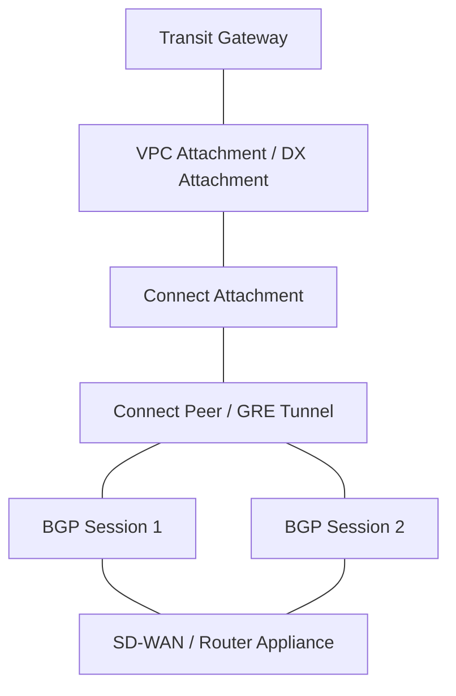
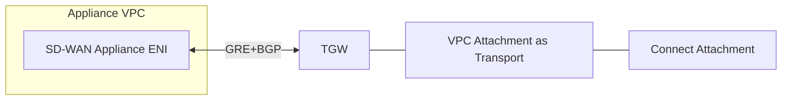
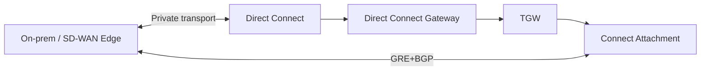
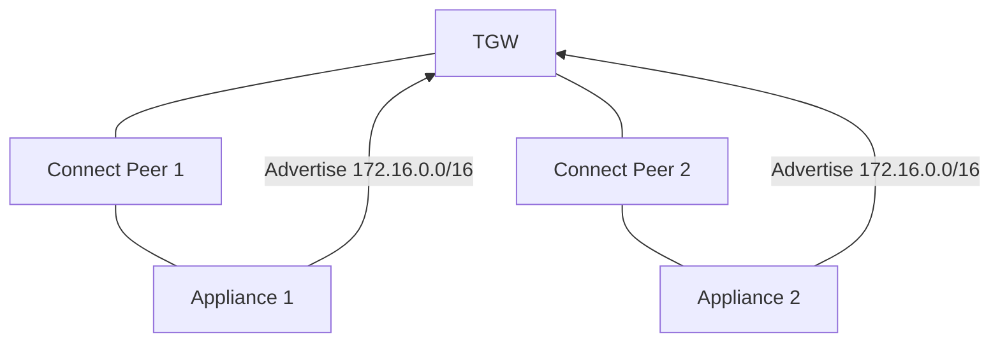
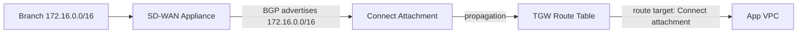
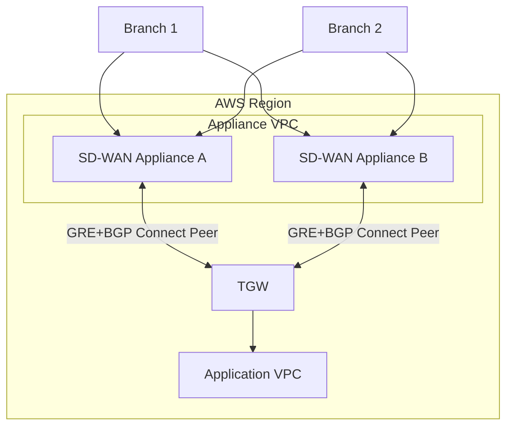
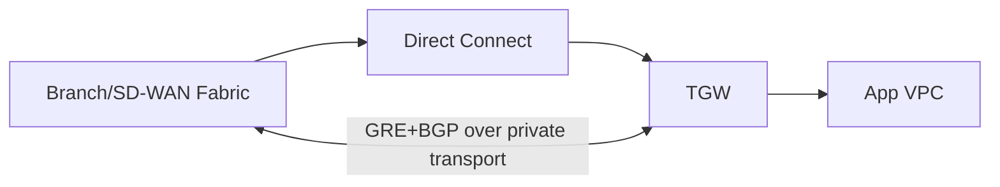
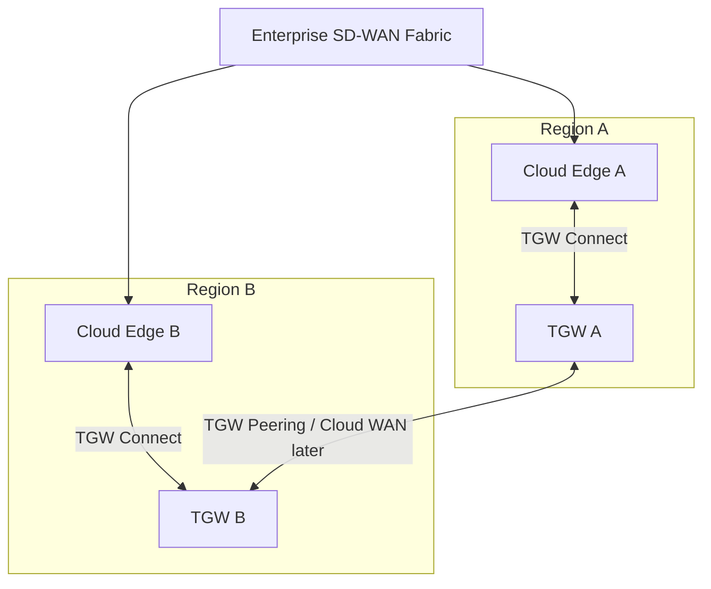
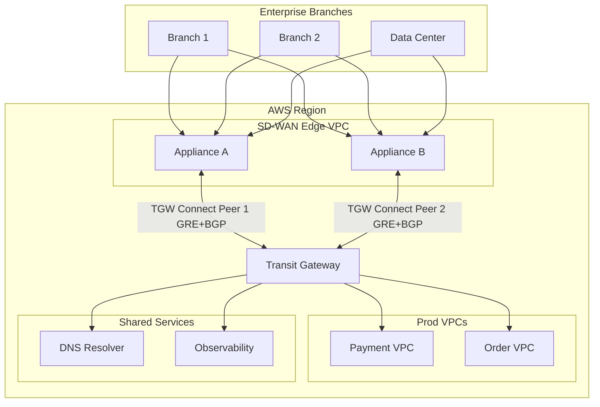

# Part 026 — Transit Gateway Connect and SD-WAN

Transit Gateway biasa cukup ketika attachment Anda adalah:

```text
VPC
VPN
Direct Connect gateway
peering
```

Tetapi enterprise network sering punya komponen lain:

```text
SD-WAN appliance
virtual router
third-party firewall/router
branch network fabric
cloud network virtual appliance
```

Di sini Transit Gateway Connect masuk.

Transit Gateway Connect memungkinkan third-party appliance membangun GRE tunnel ke Transit Gateway dan bertukar route dengan BGP. Ini bukan sekadar “VPN alternatif”. Ini adalah pattern untuk membawa routing dinamis dari SD-WAN/router appliance ke AWS Transit Gateway.

Part ini membahas TGW Connect dari first principles.

---

## 1. Masalah yang Diselesaikan TGW Connect

Sebelum Connect, integrasi SD-WAN ke AWS biasanya memakai:

```text
1. Site-to-Site VPN ke Transit Gateway
2. Direct Connect + virtual interface
3. Appliance di VPC + custom routing
4. Manual route propagation/static routing
```

Masing-masing punya batas:

```text
VPN:
  - enkripsi built-in, tetapi throughput/tunnel dan operational model terbatas
  - cocok untuk branch, backup, atau encrypted overlay

Direct Connect:
  - private dedicated connectivity, tetapi tidak dengan sendirinya memberi SD-WAN appliance control model

Appliance custom routing:
  - fleksibel, tetapi sering menjadi snowflake
  - route update manual atau proprietary
```

TGW Connect memberi model:

```text
third-party appliance --GRE + BGP--> Transit Gateway
```

Hasilnya:

```text
- appliance dapat advertise prefix secara dinamis
- TGW dapat menerima route dari appliance
- SD-WAN bisa menjadi bagian dari AWS hub routing
- branch/cloud appliance integration lebih natural
```

---

## 2. Komponen Inti

Transit Gateway Connect memiliki beberapa komponen yang harus dipahami sebagai layer terpisah.



| Komponen | Arti |
|---|---|
| Transit Gateway | Routing hub regional. |
| Transport attachment | Existing VPC attachment atau Direct Connect attachment yang menjadi underlying transport. |
| Connect attachment | Attachment khusus di atas transport attachment. |
| Connect peer | GRE tunnel antara TGW dan appliance. |
| BGP sessions | Dua BGP session per Connect peer untuk routing plane redundancy. |
| Appliance | SD-WAN/router/firewall virtual appliance yang mendukung GRE dan BGP. |

Mental model:

```text
Transport attachment membawa packet outer.
Connect attachment mengenali GRE packet yang cocok.
Connect peer adalah tunnel.
BGP menentukan route yang dipropagate.
```

---

## 3. Transport Attachment

TGW Connect tidak berdiri sendiri.
Ia memakai **existing VPC attachment** atau **Direct Connect attachment** sebagai transport.

Dua model umum:

### 3.1 Appliance di VPC



Cocok untuk:

```text
- SD-WAN appliance running on EC2
- firewall/router appliance cloud-native
- centralized branch termination in AWS
```

### 3.2 Appliance via Direct Connect



Cocok untuk:

```text
- high-throughput private SD-WAN underlay
- enterprise WAN integration
- branch aggregation through Direct Connect
```

Key idea:

```text
GRE/BGP rides over the transport.
Transport gives reachability for outer GRE endpoints.
BGP gives route exchange for inner networks.
```

---

## 4. GRE Tunnel Anatomy

GRE tunnel punya dua address domain:

```text
Outer addresses:
  Dipakai untuk GRE packet source/destination.
  Ini peer IP appliance dan transit gateway address.

Inside/BGP addresses:
  Dipakai untuk BGP peering di dalam tunnel.
```

Contoh:

```text
Appliance GRE outer IP:      10.100.10.10
Transit Gateway GRE address: 192.0.2.1
Inside BGP CIDR:             169.254.6.0/29
Appliance BGP IP:            169.254.6.1
TGW BGP IPs:                 AWS-assigned within the peer context
```

AWS mengharuskan inside IPv4 BGP CIDR memakai `/29` dari `169.254.0.0/16` dengan beberapa reserved ranges. IPv6 inside CIDR bisa memakai `/125` dari `fd00::/8` untuk kebutuhan IPv6 prefix exchange melalui MP-BGP.

Yang penting:

```text
BGP address harus unik antar tunnel pada TGW.
Transit gateway address berasal dari TGW CIDR block.
Peer IP dan TGW address bersama-sama mengidentifikasi GRE tunnel.
```

---

## 5. BGP Sessions: Redundancy, Not ECMP Inside One Peer

Setiap Connect peer punya dua BGP peering sessions yang terminate ke AWS-managed infrastructure.

Tujuannya:

```text
- routing plane redundancy
- maintenance resilience
- route information accumulation
```

Tetapi jangan salah:

```text
Dua BGP session dalam satu Connect peer bukan berarti ECMP data path dua jalur independen untuk peer itu.
```

Untuk high availability appliance-side atau load sharing, biasanya Anda membuat beberapa Connect peer/appliance dan mengiklankan prefix dengan atribut BGP yang konsisten.



Untuk ECMP, route harus dipresentasikan dengan atribut yang membuat TGW dapat memilih semua path yang tersedia.

Operational rule:

```text
Dua BGP session per Connect peer adalah baseline.
Beberapa Connect peer/appliance adalah HA/scale pattern.
```

---

## 6. BGP Mode: eBGP, iBGP, MP-BGP

TGW Connect mendukung:

```text
eBGP
  Appliance dan TGW berada di ASN berbeda.
  Biasanya lebih jelas untuk enterprise boundary.

iBGP
  Appliance dan TGW berada di ASN sama.
  Ada consideration khusus untuk route installation.

MP-BGP
  Dipakai untuk multiple address family, termasuk exchange IPv6 prefixes.
```

Praktik umum:

```text
Gunakan ASN yang eksplisit dan unik per routing domain.
Dokumentasikan ASN sebagai bagian dari network registry.
Jangan membiarkan ASN default menjadi desain tidak sengaja.
```

Contoh registry:

```yaml
asnRegistry:
  tgw-ap-southeast-1: 64512
  tgw-ap-northeast-1: 64513
  sdwan-cloud-edge-a: 65010
  sdwan-cloud-edge-b: 65011
```

ASN bukan angka dekoratif. ASN mempengaruhi route preference, AS-PATH, dan reasoning saat failover.

---

## 7. Route Propagation Model

Dengan Connect attachment, route dari BGP dipropagate ke TGW route table.

Simplified flow:

```text
Branch prefix 172.16.0.0/16
-> advertised by SD-WAN appliance via BGP
-> received by Connect peer
-> propagated from Connect attachment
-> appears in selected TGW route table
-> VPC attachments associated to that route table can route to branch prefix
```

Diagram:



Governance problem:

```text
Jika appliance advertise terlalu banyak prefix,
TGW route table bisa menerima reachability lebih luas dari yang diinginkan.
```

Kontrol dilakukan di beberapa tempat:

```text
- route filtering di appliance/SD-WAN controller
- TGW route table propagation selection
- separate route tables per route-domain
- blackhole/static routes untuk guardrail tertentu
- monitoring exported TGW route table
```

---

## 8. SD-WAN Integration Pattern

### 8.1 Cloud Edge Appliance Pair



Cocok untuk:

```text
- SD-WAN vendor appliance deployed in AWS
- branch-to-cloud private reachability
- centralized policy from SD-WAN controller
```

### 8.2 Direct Connect Underlay + TGW Connect



Cocok untuk:

```text
- high-throughput branch aggregation
- predictable private network underlay
- enterprise WAN architecture
```

### 8.3 Multi-Region SD-WAN Edge



Cocok untuk:

```text
- regional branch ingress
- local breakout to nearest AWS Region
- DR/failover between cloud edges
```

---

## 9. MTU and Fragmentation

GRE menambah overhead.

Rule dasar:

```text
GRE tunnel MTU harus lebih kecil dari external interface MTU.
```

Jika external interface MTU 1500:

```text
GRE header:       4 bytes
Outer IP header: 20 bytes
Recommended tunnel MTU: 1500 - 4 - 20 = 1476
```

Gejala MTU problem:

```text
- ping kecil berhasil, transfer besar gagal
- TLS handshake kadang berhasil, request besar timeout
- gRPC streaming putus
- database replication tidak stabil
- packet retransmission tinggi
```

Debugging:

```bash
# Test path MTU dengan DF bit dari Linux
ping -M do -s 1472 <remote-ip>   # 1472 + 28 ICMP/IP = 1500
ping -M do -s 1448 <remote-ip>

# TCP MSS clamp di appliance jika dibutuhkan
# Periksa vendor appliance setting untuk tunnel MTU/MSS
```

Top 1% network engineer tidak berhenti di "route sudah ada".
Mereka bertanya:

```text
Apakah packet size produksi bisa lewat tanpa fragmentasi buruk?
```

---

## 10. Security Model

TGW Connect memakai GRE dan BGP. Itu berarti security harus dipikirkan pada beberapa layer:

```text
Transport reachability:
  Apakah appliance bisa reach TGW GRE address?

Appliance hardening:
  Siapa bisa mengubah BGP advertisement?
  Siapa bisa login ke SD-WAN controller?

Route policy:
  Prefix apa yang boleh di-advertise?
  Prefix apa yang boleh diterima TGW route table?

Network filtering:
  SG/NACL untuk appliance VPC.
  Firewall policy untuk branch-to-cloud traffic.

Encryption requirement:
  GRE sendiri bukan policy enkripsi aplikasi.
  Jika requirement enkripsi end-to-end ada, gunakan transport/app-layer/security overlay yang sesuai.
```

Jangan menyamakan:

```text
private path == encrypted application traffic
GRE tunnel == encrypted tunnel
BGP route accepted == service authorized
```

Route memberi kemungkinan packet bergerak. Authorization tetap harus didesain di layer lain.

---

## 11. Failure Modes

| Failure | Gejala | Kemungkinan Penyebab |
|---|---|---|
| Connect peer down | Prefix branch hilang dari TGW route table | GRE/BGP tidak established, appliance down, transport route salah. |
| One BGP session down | Masih jalan tetapi reduced redundancy | Salah satu endpoint/session bermasalah. |
| Prefix tidak muncul | VPC tidak bisa reach branch | Appliance tidak advertise, propagation route table salah, route filter vendor. |
| Prefix terlalu luas muncul | VPC bisa reach network yang tidak seharusnya | SD-WAN route leak, propagation salah. |
| ECMP tidak seimbang | Traffic hanya lewat satu appliance | AS-PATH/ASN tidak konsisten, prefix berbeda, route preference. |
| Ping kecil OK, traffic besar gagal | MTU/MSS problem | GRE overhead tidak diperhitungkan. |
| Return path hilang | SYN keluar, SYN-ACK tidak balik | Branch/SD-WAN route back ke AWS CIDR belum ada. |
| Appliance SG/NACL deny | GRE/BGP tidak established | Rule tidak mengizinkan protocol/path yang diperlukan. |
| Static route dicoba pada Connect | Tidak sesuai model | Connect memakai dynamic route propagation; static route pada Connect peer bukan model utama. |

Debug urutan:

```text
1. Apakah transport attachment sehat?
2. Apakah appliance bisa reach TGW GRE outer address?
3. Apakah GRE tunnel established?
4. Apakah dua BGP sessions established?
5. Apakah prefix di-advertise dari appliance?
6. Apakah prefix muncul sebagai propagated route di TGW route table?
7. Apakah VPC attachment associated ke route table yang melihat prefix?
8. Apakah subnet route table VPC mengarah ke TGW untuk branch prefix?
9. Apakah return route branch ke VPC CIDR ada?
10. Apakah SG/NACL/firewall mengizinkan traffic application port?
11. Apakah MTU/MSS aman untuk payload nyata?
```

---

## 12. Observability

TGW Connect observability harus menggabungkan beberapa sumber:

```text
AWS side:
  - Transit Gateway attachment state
  - Transit Gateway route table propagated routes
  - CloudWatch metrics/logs yang relevan
  - VPC Flow Logs di appliance VPC
  - Network Manager untuk global network view

Appliance side:
  - GRE tunnel state
  - BGP neighbor state
  - advertised/received routes
  - packet drops
  - CPU/memory/throughput
  - tunnel MTU/MSS counters

Synthetic tests:
  - TCP connect dari VPC ke branch
  - TCP connect dari branch ke VPC
  - path MTU test
  - route withdrawal/failover drill
```

Minimal command set di appliance tergantung vendor, tetapi konsepnya sama:

```text
show interface tunnel
show bgp summary
show bgp advertised-routes
show bgp received-routes
show route <prefix>
show counters drops
```

Dari AWS side, yang paling penting adalah membuktikan:

```text
Prefix branch muncul di TGW route table yang benar.
App VPC route table punya next hop ke TGW.
Flow Logs menunjukkan packet masuk/keluar appliance path sesuai ekspektasi.
```

---

## 13. Route Leak Prevention

TGW Connect membawa dynamic routing. Dynamic routing berarti route bisa berubah tanpa manusia menambahkan static route satu per satu.

Itu powerful, tapi berbahaya.

Route leak examples:

```text
SD-WAN appliance accidentally advertises 0.0.0.0/0.
Branch advertises overlapping AWS CIDR.
Nonprod branch prefix masuk ke prod route-domain.
Appliance advertises summarized /8 instead of intended /16.
```

Guardrail:

```text
1. Prefix allowlist di SD-WAN controller/appliance.
2. Separate Connect attachment per trust domain jika perlu.
3. TGW route table propagation hanya ke domain yang butuh.
4. Blackhole route untuk prefix terlarang.
5. Export TGW route table secara berkala dan diff terhadap intended state.
6. Alert jika default route atau aggregate besar muncul tidak terencana.
7. IaC policy test sebelum deployment.
```

Contoh intended route registry:

```yaml
acceptedBranchPrefixes:
  prod:
    - 172.16.0.0/16
    - 172.17.0.0/16
  nonprod:
    - 172.30.0.0/16
forbidden:
  - 0.0.0.0/0
  - 10.0.0.0/8
  - 169.254.0.0/16
```

Automated check:

```text
actual propagated routes - intended allowed routes = violation
```

---

## 14. Connect vs VPN vs Direct Connect vs Peering

| Need | Better Fit | Reason |
|---|---|---|
| Encrypted tunnel over internet | Site-to-Site VPN | IPSec managed tunnel pattern. |
| Private dedicated high-throughput transport | Direct Connect | Dedicated private connectivity. |
| SD-WAN appliance dynamic routing into TGW | TGW Connect | GRE + BGP integration with appliance. |
| VPC-to-VPC regional hub | TGW VPC attachment | Native VPC routing. |
| TGW-to-TGW regional linkage | TGW peering | Static route between TGWs. |
| Service exposure without network mesh | PrivateLink | Consumer/provider service boundary. |

Important framing:

```text
TGW Connect does not replace every hybrid connectivity option.
It solves the appliance/SD-WAN dynamic routing integration problem.
```

A mature design often combines:

```text
Direct Connect as underlay
TGW Connect as routing integration
Site-to-Site VPN as backup/encrypted path
TGW route tables as segmentation layer
Network Firewall/GWLB as inspection layer
```

---

## 15. Production Reference Pattern



Route-domain design:

```text
branch-prod-rt:
  sees branch prod prefixes from Connect
  sees prod app VPC prefixes needed by branch

prod-app-rt:
  sees selected branch prefixes
  sees shared services
  does not see all branch networks

shared-services-rt:
  sees selected branch resolver/monitoring prefixes
```

This avoids the common mistake:

```text
All branch routes propagated to all app VPCs.
All app VPC routes propagated to branch.
```

---

## 16. Deployment Checklist

Before deploying TGW Connect:

```text
1. Appliance supports GRE and BGP mode required.
2. Transport attachment exists and route to TGW CIDR block works.
3. TGW CIDR block allocated for Connect addresses.
4. Inside BGP CIDR ranges are unique.
5. ASN registry is documented.
6. Two BGP sessions per Connect peer are configured.
7. Multiple Connect peers/appliances exist if HA required.
8. Route advertisement allowlist exists.
9. TGW route table propagation target is explicit.
10. Subnet route tables in app VPCs point branch prefixes to TGW.
11. Branch/SD-WAN return routes to AWS CIDRs exist.
12. MTU/MSS is configured and tested.
13. Monitoring covers BGP state, tunnel state, route table diff, and packet drops.
14. Failover drill is planned.
15. Rollback means route withdrawal, propagation removal, or attachment isolation.
```

---

## 17. Mini Lab: One Appliance, One Branch Prefix

Goal:

```text
Advertise a branch prefix through TGW Connect and make one app VPC reach it.
```

Lab topology:

```text
TGW
Appliance VPC
Connect attachment over VPC transport attachment
Connect peer GRE tunnel
App VPC
Branch prefix simulated behind appliance: 172.16.10.0/24
```

Steps:

```text
1. Create TGW and attach appliance VPC.
2. Add TGW CIDR block for Connect.
3. Create Connect attachment using appliance VPC attachment as transport.
4. Create Connect peer with inside BGP CIDR.
5. Configure appliance GRE tunnel outer addresses.
6. Configure two BGP sessions.
7. Advertise 172.16.10.0/24 from appliance.
8. Enable propagation from Connect attachment to selected TGW route table.
9. Associate app VPC attachment to route table that sees branch prefix.
10. Add app subnet route: 172.16.10.0/24 -> TGW.
11. Add return route in appliance/branch side for app VPC CIDR.
12. Test TCP to branch simulator.
13. Withdraw route and observe loss of reachability.
14. Restore route and test failover by disabling one BGP session.
```

Expected learning:

```text
- GRE/BGP state is prerequisite for dynamic route propagation.
- Two BGP sessions protect routing plane, not poor route policy.
- Prefix visibility depends on TGW route table propagation and association.
- Return path must be designed explicitly.
- MTU can break real traffic even when route and BGP look healthy.
```

---

## 18. Anti-Patterns

### Anti-Pattern 1 — Treating Connect as Encrypted VPN

GRE is encapsulation, not a security policy. If encryption is required, design it explicitly.

### Anti-Pattern 2 — Accepting All SD-WAN Advertisements

Dynamic route exchange without prefix filtering is a route-leak incident waiting to happen.

### Anti-Pattern 3 — Single Appliance, No Failover Drill

If branch-to-cloud path is business-critical, one appliance is not a production architecture.

### Anti-Pattern 4 — Ignoring MTU

Many “random application timeout” incidents are packet size/path MTU incidents in disguise.

### Anti-Pattern 5 — Propagating Branch Prefixes Everywhere

Branch routes should be visible only to route-domains that need them.

---

## 19. Mental Model Recap

Transit Gateway Connect is best understood as:

```text
Transport reachability + GRE encapsulation + BGP route exchange + TGW route-domain governance
```

Not:

```text
magic SD-WAN button
VPN replacement in all cases
automatic secure connectivity
automatic global route policy
```

The production questions are:

```text
What transport carries the GRE packets?
Which appliance owns the BGP advertisements?
Which prefixes are allowed?
Which TGW route table receives them?
Which VPC attachments can use them?
Is the return path symmetric enough?
Is MTU safe?
What happens if one BGP session fails?
What happens if one appliance fails?
What happens if a bad prefix is advertised?
```

Jika Anda bisa menjawab semua itu, Anda tidak hanya tahu fitur TGW Connect. Anda memahami bagaimana dynamic routing menjadi bagian dari platform AWS yang defensible.

---

## Sources

- AWS Transit Gateway Connect attachments and Connect peers: https://docs.aws.amazon.com/vpc/latest/tgw/tgw-connect.html
- AWS Transit Gateway Connect peer creation: https://docs.aws.amazon.com/vpc/latest/tgw/create-tgw-connect-peer.html
- AWS Transit Gateway + SD-WAN solutions: https://docs.aws.amazon.com/whitepapers/latest/aws-vpc-connectivity-options/aws-transit-gateway-sd-wan.html
- Building scalable and secure multi-VPC network infrastructure — Transit Gateway: https://docs.aws.amazon.com/whitepapers/latest/building-scalable-secure-multi-vpc-network-infrastructure/transit-gateway.html
- AWS Transit Gateway quotas: https://docs.aws.amazon.com/vpc/latest/tgw/transit-gateway-quotas.html
