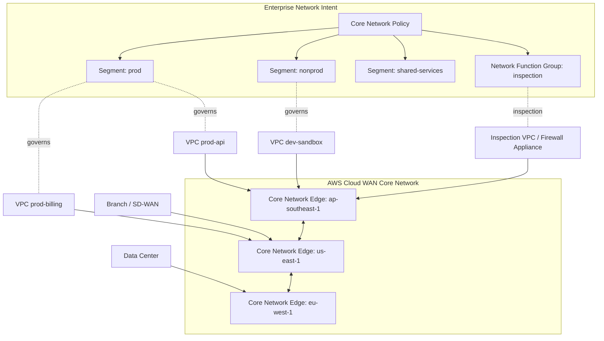
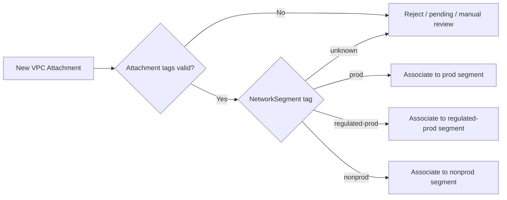
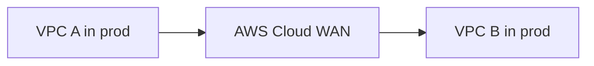
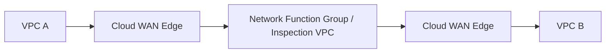
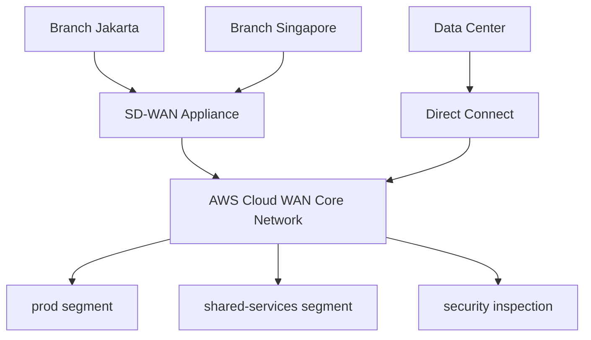
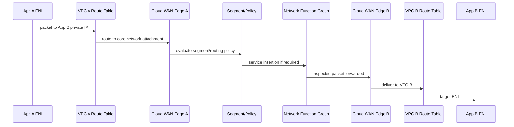
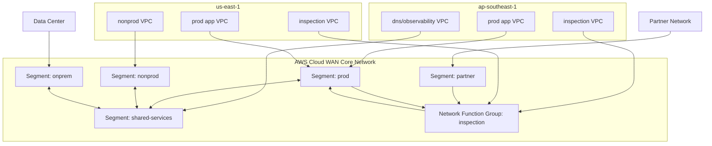

# Part 027 — AWS Cloud WAN Deep Dive

Di part sebelumnya kita sudah membangun mental model **Transit Gateway** sebagai hub regional: attachment masuk, route table mengontrol adjacency, propagation mengisi route, dan association menentukan domain routing dari traffic yang masuk.

Sekarang kita naik satu level.

**AWS Cloud WAN** bukan sekadar “Transit Gateway versi global”. Cara berpikir itu terlalu sempit. Cloud WAN lebih tepat dipahami sebagai **policy-driven global network fabric** untuk organisasi yang punya banyak Region, banyak account, branch office, data center, SD-WAN appliance, security inspection point, dan kebutuhan segmentasi yang harus dikelola konsisten.

Kalau Transit Gateway adalah router hub yang kamu susun manual per Region, Cloud WAN adalah **sistem kontrol jaringan global** yang mencoba menjadikan routing, segmentation, attachment admission, dan policy rollout sebagai objek yang bisa dikelola secara terpusat.

Tujuan part ini:

1. memahami apa yang sebenarnya dipecahkan oleh Cloud WAN;
2. membangun mental model Cloud WAN dari primitive-nya;
3. membedakan Cloud WAN vs Transit Gateway secara tajam;
4. mendesain segment, attachment policy, dan routing policy;
5. memahami service insertion dan network function group;
6. menghindari anti-pattern yang sering muncul saat Cloud WAN dipakai hanya sebagai “TGW replacement”.

---

## 1. Problem yang Diselesaikan Cloud WAN

Bayangkan organisasi ini:

- `prod` berjalan di 8 AWS accounts;
- `nonprod` berjalan di 20 AWS accounts;
- workload ada di `ap-southeast-1`, `ap-southeast-3`, `us-east-1`, dan `eu-west-1`;
- ada 2 data center;
- ada 40 branch office;
- sebagian branch memakai SD-WAN appliance;
- security team mewajibkan inspection untuk internet egress dan traffic prod-to-nonprod;
- platform team harus memastikan semua VPC baru masuk segment yang benar;
- audit butuh bukti policy routing, bukan screenshot route table manual.

Dengan Transit Gateway murni, kamu biasanya membuat:

- satu TGW per Region;
- TGW peering antar Region;
- route table per domain;
- AWS RAM share untuk multi-account;
- automation untuk attachment;
- automation untuk propagation;
- route validation;
- security inspection routing;
- documentation manual tentang “ini domain prod, ini domain nonprod, ini domain shared”.

Itu bisa bekerja. Tetapi scaling burden-nya meningkat cepat.

Masalah utama bukan “apakah packet bisa lewat”. Masalah utamanya adalah **governance of connectivity**.

Cloud WAN mencoba mengubah pertanyaan dari:

> “Route table mana yang harus saya edit di Region mana?”

menjadi:

> “Policy global apa yang menyatakan attachment ini masuk segment mana, boleh bicara dengan siapa, dan traffic tertentu harus melewati fungsi jaringan mana?”

Ini perubahan besar. Kamu berpindah dari **device-by-device route management** ke **intent-based network policy**.

---

## 2. Mental Model: Cloud WAN sebagai Global Routing Operating System

Gunakan analogi ini:

- **Global network** = inventory dan observability container untuk jaringan global.
- **Core network** = managed global network fabric yang membawa traffic.
- **Core network edge** = regional connection point tempat attachment masuk ke fabric.
- **Segment** = routing domain terisolasi, mirip VRF.
- **Attachment** = resource/koneksi yang ditempelkan ke core network.
- **Core network policy** = source of truth untuk segment, routing, attachment mapping, dan service insertion.
- **Attachment policy** = rule yang memasukkan attachment ke segment berdasarkan kondisi seperti tag/metadata.
- **Network function group** = domain khusus untuk appliance/security/network functions.
- **Service insertion** = steering traffic melalui network/security functions.

Bukan semua object ini identik dengan router fisik. Sebagian adalah control-plane abstraction. Tetapi sebagai mental model produksi, ini cukup akurat:



Yang perlu kamu perhatikan: Cloud WAN membuat **connectivity intent** terlihat sebagai policy. Di organisasi besar, ini sering lebih penting daripada jumlah route itu sendiri.

---

## 3. Core Primitive Cloud WAN

### 3.1 Global Network

Global network adalah container observability dan management. Ini bukan “router”. Ini adalah objek yang membantu kamu melihat dan mengelola jaringan global.

Dalam desain enterprise, global network biasanya merepresentasikan satu domain organisasi besar, misalnya:

- `global-network-corp-main`
- `global-network-regulated-prod`
- `global-network-lab`

Jangan membuat global network per aplikasi kecil. Itu membuat Cloud WAN kehilangan nilai. Cloud WAN bernilai ketika ada **banyak attachment dan policy yang perlu dikelola konsisten**.

### 3.2 Core Network

Core network adalah managed WAN fabric. Di sinilah segment, attachment, routing, dan policy diterapkan.

Satu core network biasanya cukup untuk satu global enterprise network, tetapi tidak selalu. Kamu bisa punya core network terpisah jika ada isolasi organisasi/regulasi yang sangat kuat, misalnya:

- regulated banking environment;
- acquisition company yang belum boleh terhubung penuh;
- sovereign/geo isolation;
- lab network dengan blast radius terpisah.

Tetapi default-nya: mulai dari satu core network, segmentasikan dengan policy, bukan langsung memecah menjadi banyak core network.

### 3.3 Home Region

Home Region adalah Region tempat data manajemen Cloud WAN diagregasi/disimpan untuk dashboard dan policy operation. Jangan samakan Home Region dengan “semua traffic lewat sini”. Traffic data plane tidak otomatis dipaksa melewati Home Region.

Kesalahan umum:

> “Kalau home Region di `us-west-2`, traffic Singapore ke Jakarta lewat Oregon?”

Tidak begitu. Home Region adalah konsep management/control visibility, bukan hairpin data-plane global.

### 3.4 Core Network Edge

Core network edge adalah titik regional managed oleh AWS tempat attachment tersambung ke core network.

Ketika kamu menambahkan Region ke core network, kamu pada dasarnya mengatakan:

> “Saya ingin network fabric ini hadir di Region tersebut.”

Semua attachment regional seperti VPC attachment akan terhubung ke edge di Region terkait.

### 3.5 Segment

Segment adalah routing domain. Anggap seperti VRF.

Contoh segment:

- `prod`
- `nonprod`
- `shared-services`
- `security`
- `onprem`
- `pci`
- `internet-egress`
- `partner`

Default yang baik:

> Segment harus merepresentasikan **trust boundary** atau **routing policy domain**, bukan nama tim atau nama aplikasi.

Salah:

- `team-andi`
- `team-budi`
- `app-mobile`
- `app-legacy`

Benar:

- `prod`
- `nonprod`
- `regulated-prod`
- `shared-dns`
- `inspection`
- `partner-isolated`

Mengapa? Karena segment adalah routing domain. Kalau kamu membuat segment dari struktur organisasi yang sering berubah, network policy akan ikut berubah setiap reorganisasi.

### 3.6 Attachment

Attachment adalah koneksi ke core network. Jenis attachment dapat mencakup VPC, Site-to-Site VPN, Connect/Connect peer, Direct Connect gateway, dan Transit Gateway route table attachment.

Attachment adalah object admission. Pertanyaan pentingnya:

1. attachment ini milik siapa?
2. environment-nya apa?
3. workload class-nya apa?
4. CIDR-nya apa?
5. harus masuk segment mana?
6. boleh propagate route apa?
7. apakah harus melewati inspection?

Di organisasi besar, attachment tidak boleh hanya dibuat manual oleh engineer aplikasi tanpa policy guardrail. Attachment adalah pintu masuk ke routing fabric enterprise.

### 3.7 Core Network Policy

Core network policy adalah pusat gravitasi Cloud WAN.

Isi policy dapat mencakup:

- core network configuration;
- edge locations;
- segments;
- segment actions;
- attachment policies;
- route policy/routing controls;
- service insertion/network function group;
- change set / policy versioning.

Mental model-nya mirip schema migration database:

1. kamu punya state sekarang;
2. kamu menulis policy version baru;
3. sistem menghasilkan perubahan;
4. kamu deploy policy;
5. network control plane menerapkan state baru.

Jangan perlakukan policy sebagai file konfigurasi kecil yang diedit ad-hoc. Perlakukan sebagai **network source of truth**.

---

## 4. Cloud WAN vs Transit Gateway

Cloud WAN dan Transit Gateway bukan selalu saling menggantikan. Mereka berada di layer abstraksi berbeda.

| Aspek | Transit Gateway | Cloud WAN |
|---|---|---|
| Unit desain utama | Regional hub router | Global policy-driven network fabric |
| Scope natural | Per Region | Multi-Region / global |
| Routing control | TGW route table manual/automated | Core network policy, segment, attachment policy |
| Multi-account | AWS RAM + automation | Policy-driven admission + RAM tetap bisa relevan |
| Segmentation | TGW route table | Segment |
| Global operation | TGW peering + static routes | Core network edge + policy |
| SD-WAN integration | TGW Connect | Cloud WAN Connect / attachment model |
| Inspection | Inspection VPC + GWLB + route table | Service insertion / network function group + policy |
| Best for | Regional hub-spoke, controlled scale | Global enterprise WAN governance |

### Rule praktis

Gunakan **Transit Gateway** ketika:

- jaringan masih dominan satu Region;
- attachment count moderate;
- route table logic mudah dipahami;
- kamu butuh kontrol eksplisit dan sederhana;
- team belum siap mengoperasikan policy lifecycle Cloud WAN.

Gunakan **Cloud WAN** ketika:

- multi-Region adalah keadaan normal;
- banyak account/VPC/branch/data center;
- segmentasi global harus konsisten;
- attachment onboarding harus policy-driven;
- network governance lebih penting daripada sekadar routing hub;
- kamu butuh global visibility dan centralized policy.

Jangan pakai Cloud WAN hanya karena “lebih baru”. Pakai Cloud WAN saat problem kamu benar-benar problem **WAN governance**, bukan hanya VPC interconnect.

---

## 5. Segment Design: Bagian Terpenting Cloud WAN

Segment design menentukan apakah Cloud WAN menjadi bersih atau menjadi route-table chaos dengan nama baru.

### 5.1 Segment bukan environment saja

Banyak desain mulai dari:

- `prod`
- `dev`
- `test`

Itu tidak salah. Tetapi belum cukup.

Pertanyaan yang lebih baik:

1. Apakah semua prod boleh saling bicara?
2. Apakah prod regulated boleh bicara dengan prod normal?
3. Apakah shared service harus visible ke semua segment?
4. Apakah on-prem masuk segment sendiri atau shared dengan prod?
5. Apakah partner network harus punya domain isolasi khusus?
6. Apakah inspection domain diperlakukan sebagai segment biasa atau network function group?

### 5.2 Segment berdasarkan trust boundary

Contoh awal yang lebih realistis:

| Segment | Intent |
|---|---|
| `prod` | Production workloads umum |
| `regulated-prod` | Workload dengan compliance khusus |
| `nonprod` | Dev/test/staging umum |
| `shared-services` | DNS, directory, artifact, observability, platform tools |
| `onprem` | Data center / corporate network |
| `partner` | Network pihak ketiga terbatas |
| `security-inspection` | Inspection VPC / firewall / network appliance |
| `internet-egress` | Centralized egress domain, bila dipisahkan |

Yang menentukan segment bukan label bisnis, tetapi pertanyaan:

> “Apakah dua attachment di domain ini boleh saling melihat route secara default?”

Kalau jawabannya tidak, pisahkan segment.

### 5.3 Segment sharing

Kadang segment tidak sepenuhnya terisolasi. Misalnya:

- `prod` perlu akses `shared-services`;
- `nonprod` perlu akses `shared-services`;
- `prod` tidak boleh akses `nonprod`;
- `onprem` boleh akses `prod` subset tertentu;
- `partner` hanya boleh akses service tertentu.

Maka desainnya bukan sekadar “semua segment isolated”. Kamu butuh segment action/routing policy yang eksplisit.

Prinsip:

> Default isolate. Share only what has a named business reason.

---

## 6. Attachment Admission: Jangan Manual Berdasarkan Ingatan

Cloud WAN menjadi kuat ketika attachment mapping dilakukan berdasarkan policy, bukan hafalan operator.

Misalnya VPC attachment memiliki tag:

```yaml
Environment: prod
NetworkSegment: regulated-prod
Application: payment-ledger
Owner: payments-platform
DataClass: pci
```

Attachment policy kemudian bisa memasukkan attachment ke segment yang benar.

### 6.1 Policy-driven admission

Contoh mental model:



Di production, jangan biarkan attachment tanpa metadata masuk ke fabric. Attachment tanpa metadata adalah route leak yang menunggu waktu.

### 6.2 Tag contract

Minimum tag contract:

| Tag | Fungsi |
|---|---|
| `Environment` | prod/nonprod/shared/security |
| `NetworkSegment` | segment target |
| `Owner` | team owning attachment |
| `CostCenter` | cost/accountability |
| `DataClass` | regulated/internal/public |
| `ChangeTicket` | traceability jika organisasi butuh approval |

Policy bukan pengganti governance. Policy adalah mekanisme untuk membuat governance bisa dieksekusi otomatis.

---

## 7. Routing Semantics di Cloud WAN

Di TGW, kamu banyak berpikir:

- attachment A associated ke route table X;
- attachment B propagated ke route table X;
- static route Y menuju attachment Z.

Di Cloud WAN, kamu berpikir:

- attachment masuk segment apa;
- segment ini share route ke segment mana;
- route tertentu diizinkan/dilarang;
- traffic tertentu harus melewati network function group;
- policy version mana yang aktif.

Routing tetap routing. Longest prefix, route visibility, dan symmetry tetap penting. Cloud WAN tidak menghapus hukum jaringan.

Cloud WAN hanya menaikkan level konfigurasi.

### 7.1 Route visibility

Pertanyaan utama:

> “Attachment mana melihat prefix mana?”

Bukan:

> “Attachment mana secara fisik tersambung ke core network?”

Tersambung belum berarti reachable. Reachability muncul dari segment/routing policy.

### 7.2 Symmetric path

Jika traffic melewati firewall stateful, path pergi dan balik harus konsisten. Kalau forward path lewat inspection tetapi return path tidak, hasilnya bisa:

- session drop;
- intermittent timeout;
- SYN terlihat tapi SYN-ACK hilang;
- Flow Logs tampak ACCEPT tetapi aplikasi tetap gagal;
- firewall state table tidak cocok.

Ini sama seperti TGW inspection pattern. Cloud WAN service insertion membantu, tetapi kamu tetap harus mendesain symmetry.

---

## 8. Service Insertion dan Network Function Group

Cloud WAN service insertion memungkinkan traffic diarahkan melalui network/security function seperti:

- AWS Network Firewall;
- Gateway Load Balancer appliance;
- third-party firewall;
- IDS/IPS;
- centralized egress VPC;
- on-prem security stack.

Network function group adalah grouping khusus untuk attachment yang menyediakan fungsi jaringan.

### 8.1 Mental model service insertion

Tanpa service insertion:



Dengan service insertion:



Yang berubah bukan hanya route. Yang berubah adalah **policy intent**:

> “Traffic class ini harus melewati fungsi jaringan ini sebelum mencapai destination.”

### 8.2 Use case service insertion

| Use Case | Contoh |
|---|---|
| East-west inspection | prod VPC A ke prod VPC B harus lewat firewall |
| Inter-segment inspection | nonprod ke shared-services harus diperiksa |
| Hybrid inspection | on-prem ke AWS workload lewat appliance |
| Internet egress inspection | VPC ke internet lewat egress/security VPC |
| Partner inspection | partner segment ke internal service lewat inspection |

### 8.3 Pitfall service insertion

Service insertion bukan magic.

Kamu tetap harus mempertimbangkan:

- appliance capacity;
- multi-AZ design;
- stateful session symmetry;
- fail-open vs fail-closed behavior;
- route convergence;
- logging correlation;
- MTU/path issues;
- cost per inspection hop;
- operational ownership firewall rules.

Anti-pattern paling umum:

> “Semua traffic harus lewat firewall.”

Kalimat itu terdengar aman, tetapi sering tidak operasional.

Pertanyaan yang lebih baik:

1. Traffic mana yang benar-benar butuh inspection?
2. Apakah inspection inline atau out-of-band?
3. Apakah firewall rule owner adalah security team atau app team?
4. Apakah ada bypass untuk AWS service endpoints?
5. Apakah DNS traffic juga harus dikontrol via DNS Firewall?
6. Apa failure behavior kalau inspection VPC down?

---

## 9. Direct Connect, VPN, Branch, dan Cloud WAN

Cloud WAN menarik untuk hybrid karena bukan hanya VPC-to-VPC fabric.

Kamu dapat memasukkan:

- VPC attachments;
- Site-to-Site VPN attachments;
- Connect attachments untuk SD-WAN/GRE/BGP model;
- Direct Connect gateway attachment;
- transit gateway route table attachment.

Dengan begitu, Cloud WAN bisa menjadi backbone routing enterprise.

### 9.1 Branch-to-cloud pattern



Keuntungan:

- branch tidak perlu tahu semua VPC CIDR;
- branch cukup propagate route ke fabric;
- segment menentukan reachability;
- central policy mengontrol domain komunikasi.

### 9.2 Jangan menjadikan Cloud WAN route dump

Kalau semua prefix on-prem, branch, dan VPC dipropagate ke semua segment, kamu hanya membuat global route dump.

Cloud WAN harus memperkecil blast radius routing, bukan memperbesar.

Prinsip:

> Propagate only what must be reachable. Summarize where safe. Isolate by default.

---

## 10. Cloud WAN Policy Lifecycle

Di organisasi mature, perubahan Cloud WAN policy harus diperlakukan seperti perubahan database schema atau firewall global.

Lifecycle minimal:

1. policy authoring di repository;
2. static validation;
3. semantic validation terhadap inventory attachment;
4. review oleh network/platform/security;
5. deployment ke staging/lab core network jika tersedia;
6. deploy policy version;
7. observe route changes;
8. run reachability tests;
9. rollback plan.

### 10.1 Policy diff bukan sekadar JSON diff

JSON diff bisa bilang:

```diff
- segment: nonprod
+ segment: prod
```

Tetapi semantic diff harus menjawab:

- attachment mana pindah segment?
- route mana menjadi visible?
- segment mana kehilangan reachability?
- traffic mana sekarang melewati inspection?
- apakah ada new route to on-prem?
- apakah ada default route yang bocor?

Network policy diff harus berorientasi dampak.

### 10.2 Pre-deploy invariant

Contoh invariant:

- `prod` tidak boleh menerima route dari `nonprod` kecuali `shared-services` tertentu;
- `partner` tidak boleh melihat RFC1918 internal summary kecuali prefix service tertentu;
- `regulated-prod` tidak boleh share route ke `nonprod`;
- all internet egress from regulated-prod must use inspection path;
- branch office tidak boleh melihat subnet database langsung;
- on-prem route summary tidak boleh lebih luas dari approved prefix set.

Tuliskan invariant ini sebagai test, bukan wiki.

---

## 11. Cloud WAN with IaC

Cloud WAN sebaiknya tidak dikelola klik manual jika sudah production.

Struktur repository yang masuk akal:

```text
network-cloudwan/
  policies/
    core-network-policy.json
    segment-contracts.yaml
    attachment-rules.yaml
  environments/
    prod/
      variables.tf
    staging/
      variables.tf
  tests/
    route-invariants.test.yaml
    attachment-policy.test.yaml
  docs/
    segment-catalog.md
    onboarding.md
```

### 11.1 Segment contract

Contoh segment contract:

```yaml
segments:
  prod:
    description: Production application workloads
    defaultIsolation: true
    sharedWith:
      - shared-services
    mustInspect:
      - destination: internet
      - destination: partner
  nonprod:
    description: Development and testing workloads
    defaultIsolation: true
    sharedWith:
      - shared-services
    deniedTo:
      - prod
  shared-services:
    description: DNS, directory, observability, artifact services
    reachableFrom:
      - prod
      - nonprod
      - onprem
```

Tujuannya bukan menjadikan YAML ini langsung valid AWS policy. Tujuannya membuat **business intent** eksplisit sebelum diterjemahkan ke Cloud WAN core network policy.

---

## 12. Observability dan Troubleshooting

Cloud WAN troubleshooting harus dilakukan dari dua arah:

1. **control-plane view**: attachment state, segment, policy version, route visibility;
2. **data-plane view**: Flow Logs, firewall logs, packet path, application timeout.

### 12.1 Debug checklist

Ketika workload A tidak bisa reach workload B:

1. Apakah A dan B attached ke core network yang sama?
2. Apakah attachment keduanya available?
3. Apakah keduanya masuk segment yang diharapkan?
4. Apakah segment route sharing mengizinkan prefix destination?
5. Apakah prefix source/destination tidak overlap?
6. Apakah VPC subnet route table mengarah ke Cloud WAN attachment/core network path?
7. Apakah Security Group mengizinkan traffic?
8. Apakah NACL return path terbuka?
9. Apakah service insertion mengubah path?
10. Apakah firewall menerima dan mengembalikan session secara simetris?
11. Apakah DNS resolve ke private IP yang benar?
12. Apakah route berubah baru-baru ini karena policy version deployment?

### 12.2 Debug dari packet path

Selalu gambar path:



Kalau kamu tidak bisa menjelaskan diagram ini untuk incident tertentu, kamu belum melakukan network debugging. Kamu baru melihat dashboard.

---

## 13. Cost Model

Cloud WAN cost harus dipikirkan sejak desain, bukan setelah bill muncul.

Cost drivers umum:

- attachment hourly cost;
- data processing;
- inter-Region data transfer;
- inspection appliance cost;
- NAT/egress cost jika centralized egress;
- logging volume;
- duplicated path karena hairpin;
- unnecessary route through inspection.

Prinsip:

> The cleanest topology is not always the cheapest topology. The cheapest topology is not always operable.

Trade-off nyata:

| Decision | Benefit | Cost/Risk |
|---|---|---|
| Centralized inspection | Governance kuat | Hairpin, latency, appliance cost |
| Regional inspection | Lower latency | More appliances, more policy surfaces |
| Single global segment | Simple awal | Route leak blast radius besar |
| Many micro-segments | Granular control | Policy complexity tinggi |
| Full route propagation | Easy reachability | Harder audit, bigger blast radius |
| Strict default isolation | Safer | More onboarding friction |

---

## 14. Anti-Patterns

### Anti-pattern 1: Cloud WAN dipakai untuk semua hal

Tidak semua koneksi butuh Cloud WAN. Untuk service-specific private exposure, PrivateLink bisa lebih tepat. Untuk app-to-app service networking dengan auth policy, VPC Lattice bisa lebih tepat. Untuk public web acceleration, CloudFront/Global Accelerator lebih tepat.

Cloud WAN adalah backbone/enterprise network fabric, bukan pengganti semua networking primitive.

### Anti-pattern 2: Segment dibuat terlalu banyak

Jika setiap aplikasi punya segment sendiri, kamu akhirnya membangun firewall policy matrix raksasa.

Segment harus stabil dan meaningful.

### Anti-pattern 3: Semua traffic di-share demi kenyamanan

Ini menghapus nilai segmentation. Lebih buruk lagi, karena Cloud WAN terlihat “terpusat”, route leak bisa lebih berbahaya.

### Anti-pattern 4: Mengabaikan VPC route table

Cloud WAN policy benar tidak cukup. Subnet route table di VPC tetap harus mengarah ke attachment yang benar. SG/NACL tetap berlaku. DNS tetap penting.

### Anti-pattern 5: Tidak ada ownership model

Cloud WAN menyentuh network team, security team, platform team, app team, dan compliance. Tanpa ownership, semua perubahan menjadi bottleneck atau chaos.

---

## 15. Production Design Pattern

### 15.1 Baseline global enterprise Cloud WAN



### 15.2 Policy intent

- `prod` can reach `shared-services`.
- `nonprod` can reach `shared-services`.
- `nonprod` cannot reach `prod`.
- `partner` can reach only approved prod service prefixes through inspection.
- `onprem` can reach shared services and approved prod prefixes.
- Regulated traffic uses inspection.
- Default route to internet is not propagated globally.

---

## 16. Migration from Transit Gateway to Cloud WAN

Jangan migrasi dengan big bang.

Urutan aman:

1. inventory TGW attachments dan route tables;
2. kelompokkan route tables menjadi candidate segments;
3. dokumentasikan route visibility matrix;
4. buat Cloud WAN core network paralel;
5. attach subset non-critical VPC;
6. validate DNS, SG/NACL, route, Flow Logs;
7. migrate shared services path;
8. migrate on-prem/branch carefully;
9. migrate prod per domain;
10. decommission TGW route table lama setelah traffic nol.

### 16.1 Route table to segment mapping

| Existing TGW Route Table | Candidate Cloud WAN Segment |
|---|---|
| `tgw-rt-prod` | `prod` |
| `tgw-rt-dev` | `nonprod` |
| `tgw-rt-shared` | `shared-services` |
| `tgw-rt-sec-egress` | `security-inspection` / NFG |
| `tgw-rt-onprem` | `onprem` |

Tapi jangan map 1:1 buta. Ini saat yang tepat untuk membersihkan route debt.

---

## 17. Design Review Checklist

Sebelum Cloud WAN production:

- [ ] Segment merepresentasikan trust boundary, bukan team sementara.
- [ ] Attachment admission berbasis tag/policy.
- [ ] Default segment behavior jelas.
- [ ] Route sharing antar-segment terdokumentasi.
- [ ] Service insertion path simetris.
- [ ] Inspection VPC multi-AZ.
- [ ] On-prem prefix tidak terlalu luas.
- [ ] Default route tidak bocor ke segment internal.
- [ ] Rollback policy version tersedia.
- [ ] Reachability tests otomatis.
- [ ] Flow Logs/firewall logs dapat dikorelasikan.
- [ ] Ownership network/security/app jelas.
- [ ] Cost model dihitung per attachment dan per GB.

---

## 18. Invariant yang Harus Kamu Ingat

1. Cloud WAN adalah policy-driven global network fabric, bukan sekadar router baru.
2. Segment adalah routing domain; desainnya harus mengikuti trust boundary.
3. Attachment adalah admission point; jangan biarkan attachment masuk tanpa metadata.
4. Core network policy adalah source of truth dan harus dikelola seperti kode.
5. Service insertion membantu inspection, tetapi tidak menghapus kebutuhan desain symmetry dan capacity.
6. Cloud WAN tidak menggantikan SG, NACL, VPC route table, DNS, atau IAM/resource policy.
7. Jika kamu tidak bisa menjelaskan route visibility matrix, kamu belum menguasai desain Cloud WAN.

---

## 19. Latihan Praktis

### Latihan 1 — Segment matrix

Buat matrix untuk organisasi berikut:

- prod app;
- nonprod app;
- shared DNS;
- shared observability;
- on-prem data center;
- partner network;
- regulated payment workload.

Tentukan:

- segment apa saja;
- route sharing antar segment;
- traffic mana wajib inspection;
- traffic mana ditolak total.

### Latihan 2 — Attachment admission rule

Buat tag contract dan pseudocode policy untuk memasukkan attachment ke segment:

- `Environment=prod` → `prod`
- `Environment=nonprod` → `nonprod`
- `DataClass=pci` → `regulated-prod`
- missing tag → reject/manual review

### Latihan 3 — Failure mode

Simulasikan firewall inspection VPC down di satu Region.

Jawab:

- traffic mana gagal?
- apakah fail closed atau fail open?
- apakah route otomatis pindah Region?
- apakah session state tetap valid?
- log mana yang membuktikan failure?

---

## 20. Referensi Resmi

- AWS Cloud WAN overview: `https://docs.aws.amazon.com/network-manager/latest/cloudwan/what-is-cloudwan.html`
- AWS Cloud WAN core network policy versions: `https://docs.aws.amazon.com/network-manager/latest/cloudwan/cloudwan-create-policy-version.html`
- AWS Cloud WAN segments: `https://docs.aws.amazon.com/network-manager/latest/cloudwan/cloudwan-policy-segments.html`
- AWS Cloud WAN attachment policies: `https://docs.aws.amazon.com/network-manager/latest/cloudwan/cloudwan-policy-attachments.html`
- AWS Cloud WAN attachments: `https://docs.aws.amazon.com/network-manager/latest/cloudwan/cloudwan-create-attachment.html`
- AWS Cloud WAN service insertion: `https://docs.aws.amazon.com/network-manager/latest/cloudwan/cloudwan-policy-service-insertion.html`

---

## Penutup

Cloud WAN berguna ketika masalahmu bukan lagi “bagaimana VPC A bicara dengan VPC B”, tetapi “bagaimana ribuan attachment lintas Region/account/site mengikuti policy jaringan global yang bisa diaudit, diubah, diuji, dan dioperasikan secara konsisten”.

Kalau Transit Gateway membuat kamu berpikir seperti network engineer regional, Cloud WAN memaksa kamu berpikir seperti platform engineer untuk global enterprise network.

Di part berikutnya kita masuk ke **VPC Sharing and Centralized Network Ownership**: bagaimana network account bisa mengelola VPC/subnet/routing secara terpusat sementara application account tetap bisa membuat resource sendiri tanpa diberi kuasa penuh atas jaringan.
