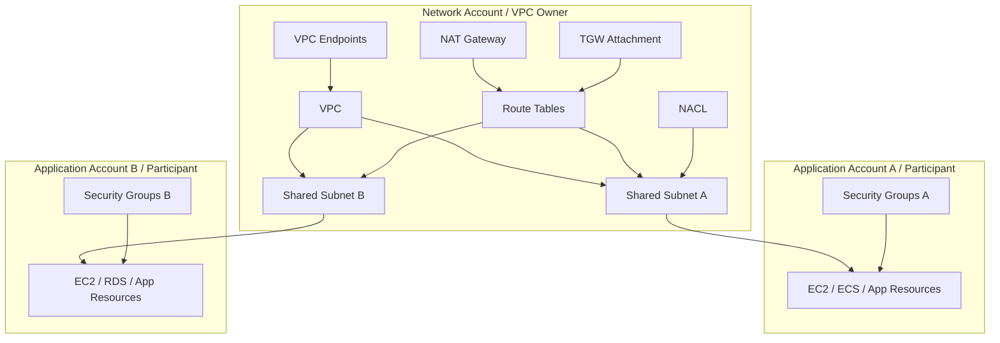
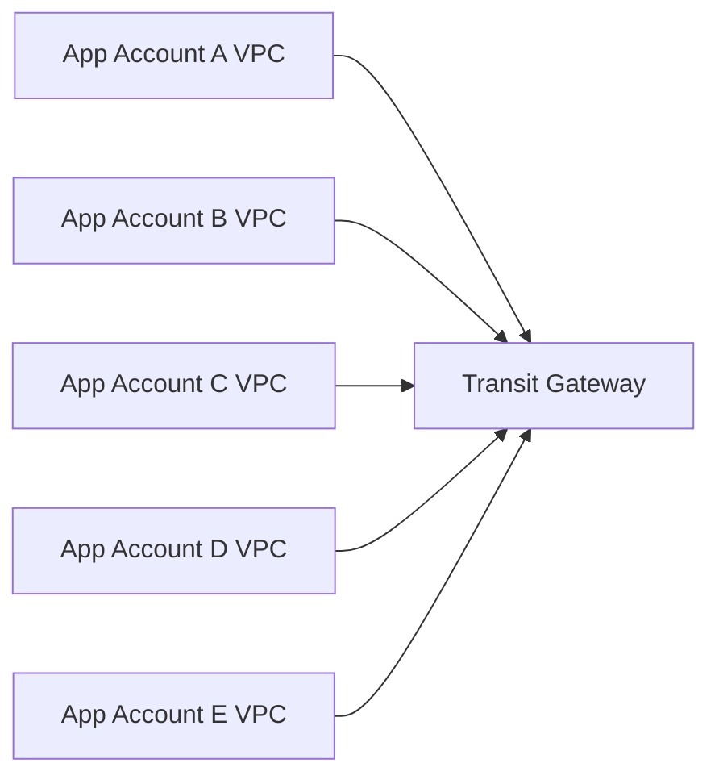
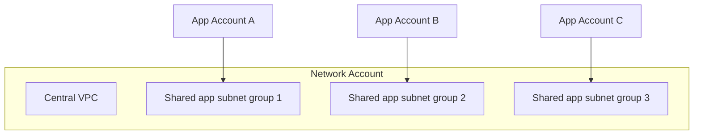
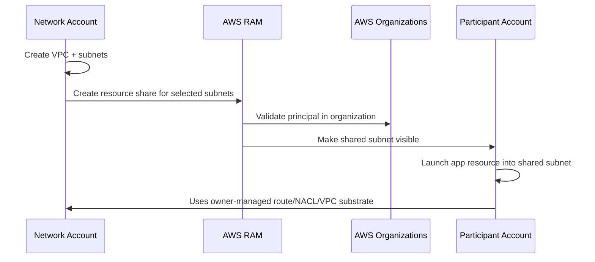
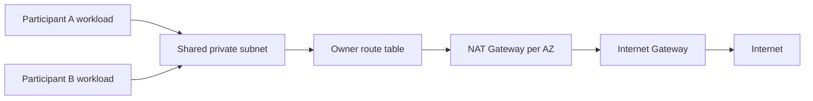
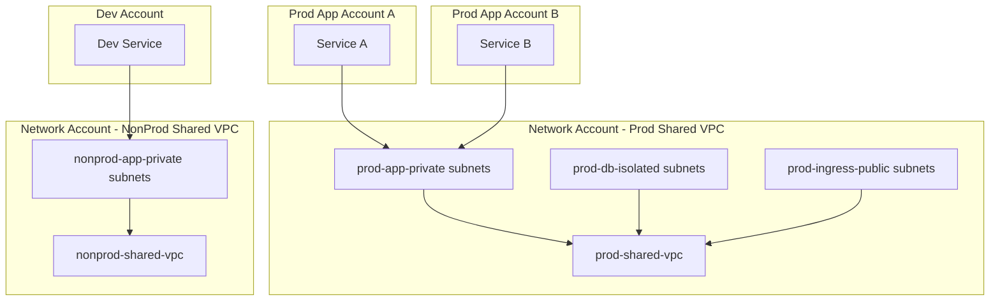

# Part 028 — VPC Sharing and Centralized Network Ownership

Multi-account AWS biasanya dimulai dengan niat baik:

- account per workload;
- account per environment;
- account per team;
- isolation lebih baik;
- billing lebih jelas;
- IAM boundary lebih rapi.

Lalu masalah network muncul.

Kalau setiap account membuat VPC sendiri, kamu mendapat:

- puluhan/ratusan VPC;
- CIDR planning tersebar;
- NAT Gateway berulang;
- endpoint berulang;
- route table berbeda-beda;
- DNS behavior tidak konsisten;
- security baseline sulit distandardisasi;
- Transit Gateway attachment membengkak;
- debugging lintas account makin berat.

**VPC sharing** menawarkan model berbeda:

> Satu account memiliki dan mengelola VPC/subnet/networking foundation. Account lain sebagai participant dapat menjalankan resource aplikasi di subnet yang dibagikan.

Ini bukan “semua account memakai credential yang sama”. Ini juga bukan “network team mengelola aplikasi”. Ini adalah pemisahan ownership:

- network owner mengelola network foundation;
- participant account mengelola workload/application resources;
- keduanya berbagi satu network plane yang sama dengan boundary permission yang eksplisit.

Part ini membahas VPC sharing sebagai mekanisme organisasi dan arsitektur, bukan sekadar fitur AWS RAM.

---

## 1. Mental Model: VPC Owner vs Participant

Dalam VPC sharing ada dua role utama:

### VPC owner

VPC owner adalah account yang memiliki VPC dan subnet.

VPC owner biasanya adalah:

- network account;
- platform networking account;
- shared infrastructure account;
- landing zone network account.

Owner mengelola:

- VPC;
- subnet;
- route table;
- network ACL;
- internet gateway;
- NAT Gateway;
- egress-only internet gateway;
- gateway endpoint;
- interface endpoint jika dipusatkan;
- Route 53 Resolver endpoint;
- Transit Gateway attachment;
- VPN/DX integration jika terkait VPC;
- subnet sharing via AWS RAM;
- subnet attributes;
- IP addressing.

### Participant

Participant adalah account yang menerima shared subnet dan dapat membuat resource aplikasi di subnet tersebut.

Participant mengelola:

- EC2 instance/application ENI yang mereka buat;
- security group milik account mereka;
- load balancer/resource aplikasi yang didukung di shared subnet;
- RDS/Redshift/Lambda/compute/resource lain yang didukung;
- IAM untuk workload mereka;
- application deployment;
- app-level observability;
- flow logs untuk ENI yang mereka miliki.

Diagram sederhana:



Kuncinya:

> Participant memakai subnet, tetapi tidak memiliki subnet.

Itu perbedaan besar.

---

## 2. Kenapa VPC Sharing Ada

VPC sharing memecahkan problem klasik multi-account: “bagaimana kita memberi tim aplikasi kemampuan deploy resource tanpa memberi mereka kuasa mengubah network foundation?”

Tanpa VPC sharing:



Dengan VPC sharing:



Kamu mengurangi jumlah VPC, route table pattern, NAT, endpoint, dan attachment. Tetapi kamu juga membuat shared fate yang lebih besar. Jadi ini bukan selalu lebih baik; ini trade-off.

---

## 3. Kapan VPC Sharing Cocok

VPC sharing cocok ketika:

- banyak account memiliki kebutuhan network yang sama;
- platform team ingin mengontrol subnet/routing/security baseline;
- workload antar-account memang boleh berada dalam VPC yang sama;
- IP plan perlu dikendalikan terpusat;
- NAT/endpoint/DNS/shared services ingin distandardisasi;
- application team tidak perlu mengubah route table/NACL/IGW/TGW;
- organisasi ingin mengurangi jumlah VPC/TGW attachment.

Contoh:

- beberapa microservice prod dalam domain trust yang sama;
- multiple app accounts milik satu product group;
- shared internal platform VPC;
- regulated environment dengan network guardrail kuat;
- centralized subnet pool untuk compute/application accounts.

## 4. Kapan VPC Sharing Tidak Cocok

VPC sharing tidak cocok ketika:

- setiap workload butuh route table berbeda drastis;
- workload harus punya VPC-level isolation kuat;
- participant harus mengelola IGW/NAT/TGW sendiri;
- blast radius subnet/VPC bersama terlalu besar;
- compliance menuntut VPC dedicated per tenant/customer;
- IP overlap antar workload tidak bisa dihindari;
- team ownership tidak jelas;
- kamu ingin menjadikan VPC sharing sebagai pengganti security architecture.

Jika isolasi adalah requirement utama, VPC per account + TGW/PrivateLink/VPC Lattice mungkin lebih tepat.

---

## 5. Owner/Participant Boundary Detail

Boundary permission adalah inti VPC sharing.

### 5.1 Owner controls network substrate

Owner bertanggung jawab atas network substrate:

| Resource | Owner Control |
|---|---|
| VPC | Create/manage/delete |
| Subnet | Create/share/unshare/manage attributes |
| Route table | Create/associate/update routes |
| NACL | Create/associate/update rules |
| IGW/EIGW | Create/attach/delete |
| NAT Gateway | Create/delete/manage |
| Gateway endpoint | Create/manage |
| Interface endpoint | Biasanya owner jika centralized |
| Resolver endpoint | Create/manage |
| TGW attachment | Attach/manage |
| VPC-level Flow Logs | Create/manage |

### 5.2 Participant controls application resources

Participant mengelola resource yang mereka buat:

| Resource | Participant Control |
|---|---|
| ENI milik participant | Create/modify/delete |
| EC2/ECS/EKS/RDS/etc. | Deploy/manage sesuai service support |
| Security group milik participant | Create/update/delete |
| Flow Logs untuk ENI milik participant | Create/manage |
| IAM workload | Manage di account sendiri |
| App logs/metrics | Manage di account sendiri |

Boundary ini penting saat incident.

Jika aplikasi tidak bisa egress internet:

- participant bisa cek SG, ENI, app config;
- owner harus cek route table, NAT Gateway, NACL, endpoint, subnet association.

Kalau tidak ada runbook ownership, incident akan berubah menjadi ping-pong antar team.

---

## 6. Security Group di Shared VPC

Security Group adalah area yang sering membingungkan.

Participant dapat membuat security group milik account mereka di shared VPC. Mereka dapat mengasosiasikan SG itu ke ENI/resource yang mereka miliki.

Tetapi default SG milik VPC owner tidak otomatis menjadi milik participant. Participant juga tidak bisa bebas memakai SG milik owner/participant lain kecuali aturan sharing/permission memungkinkan.

### 6.1 Cross-account SG reference

Dalam shared VPC, SG reference lintas account bisa menggunakan format:

```text
<account-id>/<security-group-id>
```

Contoh rule:

```text
allow tcp/443 from 123456789012/sg-0abc123def456
```

Artinya rule mengizinkan traffic dari resource yang memakai SG tersebut.

### 6.2 SG ownership problem

Misalnya:

- Account A memiliki `sg-frontend`;
- Account B memiliki `sg-backend`;
- Backend ingin menerima traffic dari frontend.

Opsi:

1. Account B membuat inbound rule yang reference `accountA/sg-frontend`.
2. Gunakan CIDR-based rule dari subnet frontend.
3. Gunakan shared owner-managed SG jika governance mengizinkan.
4. Gunakan service-level abstraction seperti PrivateLink/VPC Lattice jika coupling SG lintas account terlalu berat.

### 6.3 Anti-pattern: SG lintas account tanpa ownership

SG reference lintas account nyaman, tetapi bisa menjadi coupling tersembunyi.

Masalah:

- owner SG sumber mengubah meaning SG;
- SG dihapus;
- rule tidak lagi sesuai intent;
- security review sulit karena dependency lintas account;
- team tidak tahu siapa yang boleh mengubah apa.

Prinsip:

> SG reference lintas account harus punya owner, contract, dan review path.

---

## 7. Route Table di Shared VPC

Participant tidak mengelola route table shared subnet. Ini salah satu alasan utama memakai VPC sharing.

Konsekuensinya:

- application team tidak bisa menambahkan route sendiri ke TGW/NAT/endpoint;
- network team harus menyediakan subnet classes yang cukup;
- perubahan route berdampak ke banyak participant;
- route table menjadi platform contract.

### 7.1 Subnet class sebagai contract

Daripada memberi participant kemampuan mengubah route, owner menyediakan subnet classes:

| Subnet Class | Route Intent | Use Case |
|---|---|---|
| `public-ingress` | `0.0.0.0/0 -> IGW` | internet-facing ALB/NLB tertentu |
| `private-egress` | `0.0.0.0/0 -> NAT` | app outbound internet |
| `private-tgw` | corporate/on-prem prefix -> TGW | internal app/hybrid |
| `isolated` | local + endpoint routes only | database/internal workloads |
| `endpoint-heavy` | S3/DynamoDB gateway endpoint + interface endpoints | AWS service access without NAT |
| `inspection-routed` | default/internal route via firewall path | regulated workload |

Participant memilih subnet berdasarkan contract, bukan mengubah route.

### 7.2 Subnet naming

Nama subnet harus menyampaikan behavior, bukan sekadar nomor.

Kurang baik:

```text
subnet-a
subnet-b
subnet-c
```

Lebih baik:

```text
prod-app-private-egress-apse1-az1
prod-app-private-egress-apse1-az2
prod-db-isolated-apse1-az1
prod-ingress-public-apse1-az1
prod-regulated-inspection-apse1-az2
```

Nama tidak menggantikan IaC metadata, tetapi membantu manusia saat incident.

---

## 8. Shared Subnet Design

### 8.1 Jangan share semua subnet ke semua account

VPC sharing memungkinkan subnet dibagikan. Tetapi “bisa” bukan berarti “harus”.

Jika semua participant melihat semua subnet, kamu kehilangan governance.

Lebih baik:

- share subnet berdasarkan OU/account group;
- share hanya subnet class yang dibutuhkan;
- pisahkan prod/nonprod;
- pisahkan regulated/non-regulated;
- pisahkan ingress/app/data jika perlu;
- gunakan naming/tagging yang konsisten.

### 8.2 Account-to-subnet matrix

Contoh:

| Account / OU | Shared Subnets |
|---|---|
| `ou-prod-apps` | `prod-app-private-*`, `prod-ingress-public-*` |
| `ou-prod-data` | `prod-db-isolated-*` |
| `ou-nonprod` | `nonprod-app-private-*` |
| `ou-security` | `inspection-*`, `logging-*` |
| `ou-shared-services` | `shared-dns-*`, `shared-observability-*` |

Ini membuat VPC sharing menjadi controlled delegation, bukan free-for-all.

### 8.3 Subnet capacity

Shared subnet capacity harus dihitung lebih konservatif daripada subnet account-dedicated.

Karena banyak participant bisa membuat resource di subnet yang sama, risiko exhaustion lebih tinggi.

Checklist capacity:

- ukuran subnet cukup untuk peak ENI;
- ECS/EKS/Lambda/RDS/ALB ENI behavior dipahami;
- reserved IP dihitung;
- per-AZ distribution seimbang;
- participant quota tidak membuat surprise;
- IPAM memantau utilization;
- alarm untuk subnet free IP rendah;
- owner punya proses ekspansi CIDR/subnet.

---

## 9. VPC Sharing dan AWS RAM

VPC sharing dilakukan dengan AWS Resource Access Manager.

Workflow konseptual:

1. owner membuat VPC/subnet;
2. owner mengaktifkan resource sharing dengan AWS Organizations;
3. owner membuat resource share;
4. owner memilih subnet yang akan dishare;
5. owner memilih principal: account/OU/organization;
6. participant melihat shared subnet di account mereka;
7. participant membuat resource aplikasi di subnet tersebut.



Yang penting: participant tidak “menerima copy subnet”. Mereka menggunakan subnet yang tetap dimiliki owner.

---

## 10. Centralized Network Ownership Model

VPC sharing hanyalah mekanisme. Model operasionalnya harus lebih jelas.

### 10.1 Network owner responsibilities

Network owner harus menyediakan:

- VPC/subnet lifecycle;
- IPAM allocation;
- route table baseline;
- NACL baseline;
- NAT/egress pattern;
- VPC endpoint baseline;
- DNS/Resolver integration;
- TGW/Cloud WAN attachment;
- subnet sharing lifecycle;
- network observability;
- reachability contract;
- incident support for network substrate;
- change management for shared routes.

### 10.2 Participant responsibilities

Participant harus menyediakan:

- workload IAM;
- SG rules for their resources;
- app deployment;
- resource scaling plan;
- app-level metrics/logs;
- dependency declaration;
- subnet class selection;
- DNS name ownership if applicable;
- cost ownership for their resources;
- incident support for application layer.

### 10.3 Shared responsibilities

Area yang harus ada contract:

| Area | Owner | Participant | Shared Contract |
|---|---|---|---|
| Outbound internet | NAT/route | app dependency | allowed egress domains/IPs |
| East-west access | route/NACL | SG/app port | source/destination contract |
| DNS | Resolver/PHZ baseline | app records | naming/delegation |
| Observability | VPC/subnet flow logs | app logs/ENI flow logs | correlation IDs/time sync |
| Incident | network path | app behavior | escalation path |
| Capacity | subnet/IPAM | resource count forecast | utilization threshold |

---

## 11. DNS in Shared VPC

DNS adalah salah satu tempat boundary menjadi kabur.

Pertanyaan:

- siapa mengelola private hosted zone?
- apakah participant boleh membuat PHZ sendiri?
- apakah PHZ diasosiasikan ke shared VPC?
- apakah ada split-horizon DNS?
- apakah Resolver endpoints milik owner?
- bagaimana participant mendaftarkan internal service name?

### 11.1 Recommended pattern

Untuk environment mature:

- owner mengelola Resolver endpoints dan shared DNS baseline;
- shared services account mengelola parent private hosted zone, misalnya `internal.example.com`;
- participant mendapat delegated namespace, misalnya `payments.internal.example.com`;
- association PHZ ke VPC dikelola via automation;
- DNS changes punya ownership dan review.

### 11.2 Anti-pattern DNS

- setiap participant membuat PHZ dengan nama overlapping;
- tidak ada owner untuk internal domain;
- endpoint private DNS konflik dengan custom records;
- app memakai hardcoded IP karena DNS governance lambat;
- on-prem conditional forwarding tidak terdokumentasi.

---

## 12. VPC Endpoints in Shared VPC

VPC endpoints bisa dikelola owner atau participant tergantung jenis dan policy.

Namun untuk shared VPC, centralized endpoints sering masuk akal karena:

- mengurangi duplikasi interface endpoint;
- membuat Private DNS behavior konsisten;
- mengontrol endpoint policy;
- mengurangi NAT egress untuk AWS service;
- memusatkan observability.

Tetapi ada trade-off:

- endpoint SG harus mengizinkan source participant;
- endpoint policy harus cukup granular;
- cost endpoint ditagih ke owner account;
- participant mungkin butuh endpoint khusus;
- centralized endpoint bisa menjadi shared dependency.

### 12.1 Endpoint policy ownership

Misalnya S3 interface/gateway endpoint policy membatasi bucket tertentu.

Pertanyaan:

- apakah owner tahu semua bucket participant?
- apakah participant bisa request perubahan endpoint policy?
- apakah endpoint policy terlalu luas sehingga tidak berguna?
- apakah IAM/resource policy tetap membatasi akses?

Ingat invariant dari Part 019:

> Endpoint policy tidak menggantikan IAM policy dan resource policy.

---

## 13. NAT and Egress in Shared VPC

Shared VPC sering menghemat NAT Gateway karena NAT dikelola owner dan dipakai banyak participant.

Tetapi shared egress membuat pertanyaan baru:

- siapa membayar NAT data processing?
- bagaimana alokasi cost per participant?
- bagaimana membatasi egress aplikasi?
- bagaimana log egress dikorelasikan ke account/resource asal?
- bagaimana port exhaustion dideteksi?
- apakah participant boleh membuat public IP?

### 13.1 Production egress pattern



Network owner harus menyediakan:

- NAT per AZ;
- route table per AZ ke NAT AZ-local;
- CloudWatch metrics;
- Flow Logs;
- cost allocation tags jika memungkinkan;
- egress policy/governance;
- exception process.

Participant harus menyediakan:

- dependency list;
- timeout/retry discipline;
- outbound SG restriction jika diperlukan;
- application logs untuk external calls.

---

## 14. Load Balancers in Shared VPC

Load balancer di shared subnet bisa melibatkan banyak ownership boundary.

Pertanyaan desain:

- apakah internet-facing ALB boleh dibuat oleh participant?
- apakah public subnet dishare ke participant?
- siapa mengelola ACM certificate?
- siapa mengelola WAF association?
- apakah security team harus review listener/rule?
- apakah internal ALB antar participant diperbolehkan?

### 14.1 Safer default

Untuk regulated environment:

- public ingress subnet tidak dishare bebas;
- internet-facing ALB dibuat melalui platform pipeline;
- WAF mandatory;
- TLS policy standard;
- logs mandatory;
- SG rules validated;
- Route 53 record ownership jelas.

Untuk less regulated internal environment:

- participant boleh membuat internal ALB di shared app subnet;
- public ingress tetap controlled;
- SG dan target group ownership participant;
- observability policy enforced via IaC/Config/SCP.

---

## 15. Observability in Shared VPC

Shared VPC debugging sulit karena data tersebar lintas account.

### 15.1 Siapa bisa melihat apa?

- owner bisa melihat VPC/subnet/route/NACL;
- owner bisa melihat beberapa metadata ENI participant, tetapi tidak selalu dapat mengelola ENI participant;
- participant bisa melihat shared subnet dan resource miliknya;
- participant tidak mengelola route table/NACL;
- Flow Logs ownership bergantung scope dan siapa yang membuatnya.

### 15.2 Logging model

Minimal:

- owner mengaktifkan VPC/subnet-level Flow Logs untuk shared VPC/subnets;
- participant mengaktifkan ENI/resource-level logs untuk workload;
- logs dikirim ke central logging account;
- account ID/resource ID dipertahankan di log;
- runbook correlation jelas.

### 15.3 Debug checklist

Saat participant berkata “network down”:

1. Apa source account/resource/ENI?
2. Apa subnet shared yang dipakai?
3. Apa destination IP/FQDN/port?
4. DNS resolve ke apa dari workload?
5. SG participant mengizinkan outbound/inbound?
6. NACL owner mengizinkan path dan ephemeral return?
7. Route table owner menuju target yang benar?
8. NAT/TGW/endpoint sehat?
9. Flow Logs di ENI source menunjukkan ACCEPT/REJECT?
10. Flow Logs di subnet/target menunjukkan packet sampai?
11. Apakah ada recent owner route/NACL change?
12. Apakah ada recent participant SG/deploy change?

---

## 16. Governance with SCP, IAM, and IaC

VPC sharing perlu guardrail.

### 16.1 SCP examples as intent

SCP dapat digunakan untuk mencegah participant melakukan hal yang tidak seharusnya, misalnya:

- create VPC sendiri tanpa approval;
- attach internet gateway;
- create public subnet route;
- allocate public IP untuk workload tertentu;
- create unmanaged VPC endpoint;
- disable logging.

Namun SCP harus hati-hati. Jangan membuat platform terlalu kaku sehingga team membuat bypass.

### 16.2 IaC contract

Participant tidak seharusnya mencari subnet manual. Platform sebaiknya menyediakan data source/outputs:

```yaml
networkExports:
  vpcId: vpc-123
  subnets:
    appPrivate:
      az1: subnet-aaa
      az2: subnet-bbb
      az3: subnet-ccc
    dbIsolated:
      az1: subnet-ddd
      az2: subnet-eee
      az3: subnet-fff
  security:
    allowedEgressPrefixList: pl-123
  dns:
    internalZone: internal.example.com
```

Application IaC memakai contract ini, bukan hardcoded subnet ID random.

---

## 17. Cost Ownership

VPC sharing bisa menyamarkan biaya.

Owner mungkin membayar:

- NAT Gateway hourly/data processing;
- VPC endpoints;
- TGW attachment/data processing;
- Resolver endpoints;
- Flow Logs delivery/storage;
- public IPv4 charge untuk owner-managed resources;
- centralized firewall appliances.

Participant membayar:

- EC2/ECS/EKS/RDS/Lambda resource;
- load balancer yang mereka buat;
- data transfer tertentu tergantung path/resource;
- logs mereka sendiri.

Masalah:

> Participant dapat menyebabkan NAT/egress cost besar yang muncul di owner account.

Solusi:

- cost allocation model;
- egress logs per source ENI/account;
- app dependency review;
- endpoint-first design for AWS services;
- budgets/alerts per shared service;
- chargeback/showback model.

---

## 18. Failure Modes

### 18.1 Owner route change breaks many accounts

Satu perubahan route table bisa memutus banyak participant.

Mitigasi:

- route change review;
- blast radius analysis;
- staged subnet rollout;
- reachability tests;
- change windows untuk shared route;
- rollback IaC.

### 18.2 Subnet IP exhaustion

Banyak participant membuat ENI di subnet yang sama.

Gejala:

- ECS task gagal start;
- Lambda VPC scaling gagal;
- RDS/ALB provisioning gagal;
- EKS pod scheduling gagal jika memakai VPC CNI;
- error terlihat di participant, root cause ada di owner subnet capacity.

Mitigasi:

- larger subnet;
- per-AZ capacity alarms;
- IPAM;
- account-to-subnet quota;
- workload forecast;
- dedicated subnet for high-ENI service.

### 18.3 SG dependency broken

Participant B mereferensikan SG milik participant A. A mengubah/menghapus SG.

Mitigasi:

- SG contract registry;
- CI validation;
- avoid cross-account SG reference for unstable dependencies;
- prefer service boundary abstraction when possible.

### 18.4 DNS conflict

Participant membuat private zone yang konflik dengan central private zone.

Mitigasi:

- centralized DNS governance;
- namespace delegation;
- PHZ association pipeline;
- DNS query logging;
- no overlapping PHZ policy.

### 18.5 Public exposure drift

Participant membuat resource public di shared public subnet tanpa security baseline.

Mitigasi:

- restrict public subnet sharing;
- require platform ingress pipeline;
- AWS Config rules;
- SCP guardrail;
- WAF/Shield/logging mandatory;
- security group validation.

---

## 19. VPC Sharing vs Alternatives

### 19.1 VPC Sharing vs VPC per account + TGW

| Question | VPC Sharing | VPC per account + TGW |
|---|---|---|
| Network ownership | Centralized | Distributed with hub |
| VPC isolation | Lower | Higher |
| Number of VPCs | Lower | Higher |
| Routing flexibility per workload | Lower | Higher |
| Shared route blast radius | Higher | Lower per VPC |
| NAT/endpoint duplication | Lower | Higher |
| App team autonomy | Medium | Higher |
| Governance | Strong central | Needs automation |

### 19.2 VPC Sharing vs PrivateLink

Use VPC sharing when workloads are meant to live in common network plane.

Use PrivateLink when you need service exposure without broad network adjacency.

PrivateLink answer:

> “Consumer can access this service privately.”

VPC sharing answer:

> “Participant can deploy resources into this shared subnet/network.”

### 19.3 VPC Sharing vs VPC Lattice

Use VPC Lattice when service-to-service connectivity, auth policy, and application-level service network matter more than subnet sharing.

VPC sharing is network placement. VPC Lattice is application networking.

---

## 20. Reference Architecture

### 20.1 Shared VPC per trust zone

Satu pattern kuat adalah membuat shared VPC per trust zone, bukan satu shared VPC untuk semua.



Keuntungan:

- prod dan nonprod tidak berbagi VPC;
- network owner tetap centralized;
- participant tetap punya account isolation;
- route/NACL/NAT/endpoint baseline bisa berbeda per trust zone.

### 20.2 Shared VPC per platform domain

Untuk organisasi besar:

- `prod-shared-vpc-payments`
- `prod-shared-vpc-core-banking`
- `prod-shared-vpc-internal-tools`
- `nonprod-shared-vpc-general`

Ini menghindari satu mega-VPC untuk semua hal.

---

## 21. Implementation Walkthrough: Conceptual Steps

### Step 1 — Define network domains

Tentukan domain:

- prod app;
- prod data;
- nonprod;
- shared services;
- security;
- ingress;
- isolated regulated.

### Step 2 — Design VPC and subnet classes

Buat subnet per AZ:

```text
prod-app-private-az1
prod-app-private-az2
prod-app-private-az3
prod-db-isolated-az1
prod-db-isolated-az2
prod-db-isolated-az3
prod-ingress-public-az1
prod-ingress-public-az2
prod-ingress-public-az3
```

### Step 3 — Attach route tables

Set route intent:

- ingress subnet → IGW;
- app subnet → NAT/TGW/endpoints;
- db subnet → local + required internal routes only;
- regulated subnet → inspection path.

### Step 4 — Share selected subnet

Share subnet ke OU/account via AWS RAM.

Do not share everything.

### Step 5 — Publish network contract

Publish outputs:

- VPC ID;
- subnet IDs by class/AZ;
- allowed usage;
- DNS zone;
- endpoint availability;
- egress behavior;
- support contact;
- change calendar.

### Step 6 — Participant deploys workload

Participant creates:

- SG;
- app resource;
- IAM;
- app logs;
- optional ENI Flow Logs;
- service DNS record via approved process.

### Step 7 — Validate reachability

Run tests:

- app → AWS service endpoint;
- app → internal dependency;
- app → internet if allowed;
- app → on-prem if required;
- forbidden path fails.

---

## 22. Operational Runbook

### 22.1 Onboarding new participant

1. Identify OU/account.
2. Identify environment and trust zone.
3. Identify subnet class needed.
4. Validate capacity.
5. Share specific subnet set via RAM.
6. Publish IaC outputs.
7. Apply guardrails/SCP if needed.
8. Validate participant can deploy test ENI/resource.
9. Validate route/DNS/egress.
10. Record ownership.

### 22.2 Removing participant

1. Confirm resources removed from shared subnet.
2. Confirm no ENI remains.
3. Confirm no SG dependency remains.
4. Remove subnet share.
5. Remove DNS/delegation if any.
6. Remove cost allocation mapping.
7. Archive logs/ownership record.

### 22.3 Route change in shared VPC

1. Identify affected subnet classes.
2. Identify participant accounts using those subnets.
3. Compute reachability impact.
4. Notify owners.
5. Apply change in staging if possible.
6. Apply with IaC.
7. Run smoke tests.
8. Monitor Flow Logs/NAT/TGW metrics.
9. Rollback if invariant fails.

---

## 23. Design Review Checklist

- [ ] VPC owner and participant responsibilities are documented.
- [ ] Subnet sharing is scoped by OU/account, not global by convenience.
- [ ] Subnet classes have explicit route intent.
- [ ] Public subnets are not freely available unless intentionally allowed.
- [ ] SG cross-account reference policy exists.
- [ ] DNS ownership and PHZ association model are clear.
- [ ] Endpoint ownership and endpoint policy model are clear.
- [ ] NAT/egress cost ownership is defined.
- [ ] Flow Logs are centralized enough for incident response.
- [ ] Subnet IP utilization alarms exist.
- [ ] Route table changes have blast-radius review.
- [ ] Participant onboarding/offboarding is automated.
- [ ] Alternatives were considered: TGW, PrivateLink, VPC Lattice.

---

## 24. Invariant yang Harus Kamu Ingat

1. VPC sharing shares subnets, not ownership of the network.
2. Owner controls network substrate; participant controls workload resources.
3. Public/private/isolated behavior remains route-table driven and owner-controlled.
4. Shared VPC reduces duplication but increases shared fate.
5. SG ownership becomes a cross-account contract problem.
6. DNS and endpoint governance become more important, not less.
7. VPC sharing is not a substitute for service isolation; it is a placement and ownership model.
8. If application teams need route autonomy, shared VPC may be the wrong primitive.

---

## 25. Latihan Praktis

### Latihan 1 — Account-to-subnet matrix

Buat matrix untuk:

- `prod-payments-account`
- `prod-risk-account`
- `prod-observability-account`
- `nonprod-sandbox-account`
- `security-account`

Tentukan subnet class mana yang boleh mereka gunakan.

### Latihan 2 — Incident ownership

Skenario:

Participant A tidak bisa connect ke S3 melalui private route. Workload berada di shared private subnet.

Tentukan siapa mengecek:

- SG outbound;
- route table;
- gateway endpoint;
- endpoint policy;
- IAM policy;
- DNS;
- Flow Logs;
- application SDK config.

### Latihan 3 — Design alternative

Untuk 20 microservice account dalam satu product domain, bandingkan:

1. shared VPC;
2. VPC per account + TGW;
3. PrivateLink antar service;
4. VPC Lattice.

Tentukan mana yang paling cocok untuk:

- high autonomy;
- strict isolation;
- low network ops overhead;
- strong central governance.

---

## 26. Referensi Resmi

- VPC sharing overview: `https://docs.aws.amazon.com/vpc/latest/userguide/vpc-sharing.html`
- VPC sharing prerequisites: `https://docs.aws.amazon.com/vpc/latest/userguide/vpc-share-prerequisites.html`
- Responsibilities and permissions for owners and participants: `https://docs.aws.amazon.com/vpc/latest/userguide/vpc-share-limitations.html`
- Working with shared subnets: `https://docs.aws.amazon.com/vpc/latest/userguide/vpc-sharing-share-subnet-working-with.html`
- AWS RAM shareable resources: `https://docs.aws.amazon.com/ram/latest/userguide/shareable.html`

---

## Penutup

VPC sharing adalah alat untuk mengatur ownership jaringan dalam organisasi multi-account. Ia mengurangi duplikasi VPC, NAT, endpoint, route pattern, dan attachment. Tetapi ia juga menciptakan shared fate yang harus dikelola dengan kontrak yang jelas.

Gunakan VPC sharing ketika kamu ingin participant account bisa deploy workload tanpa diberi kekuasaan atas route table, subnet, NAT, gateway, dan network foundation. Jangan gunakan VPC sharing hanya untuk “menghemat VPC” jika trust boundary, route autonomy, atau tenant isolation sebenarnya membutuhkan VPC terpisah.

Di part berikutnya kita masuk ke **Amazon VPC IPAM**: cara mengelola IP address pool, allocation, compliance, dan CIDR growth agar multi-account/multi-Region network tidak hancur karena overlap dan spreadsheet manual.
