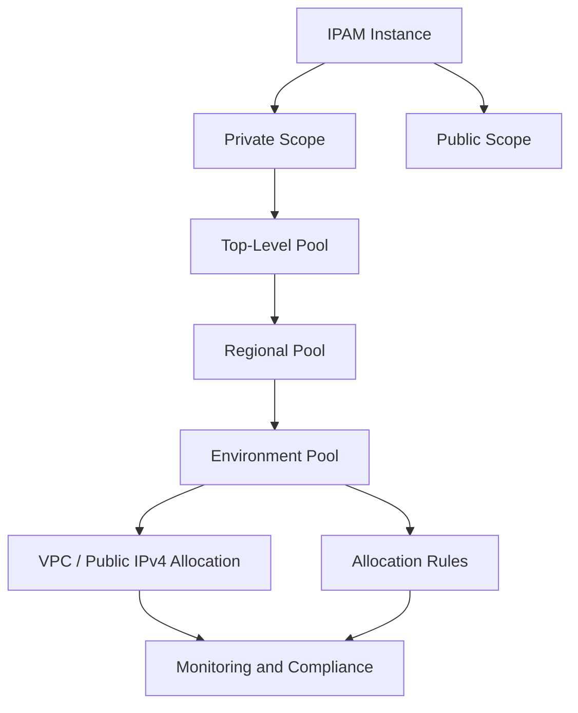
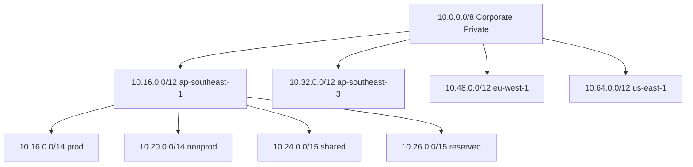
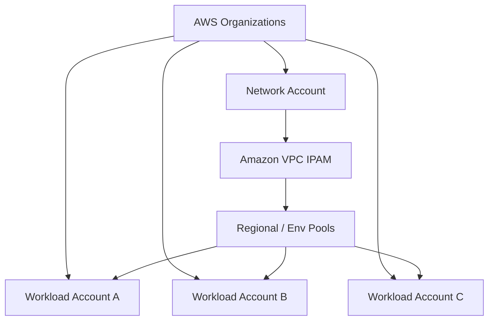
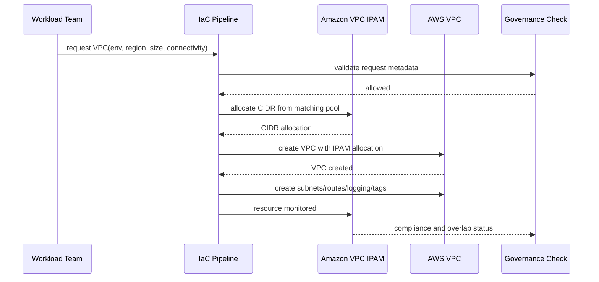

# Part 029 — Amazon VPC IPAM

Di environment kecil, IP address sering dianggap sebagai angka yang tinggal dipilih:

```txt
VPC A = 10.0.0.0/16
VPC B = 10.1.0.0/16
VPC C = 10.2.0.0/16
```

Di environment besar, pola itu rusak.

Bukan karena CIDR itu sulit secara matematika. CIDR itu sederhana. Yang sulit adalah **governance**:

- siapa yang boleh mengambil address space;
- dari pool mana sebuah VPC boleh dibuat;
- apakah prod dan non-prod boleh berada di routing domain yang sama;
- apakah Region baru boleh memakai block lama;
- apakah VPC baru overlap dengan VPC lama;
- apakah address on-prem sudah dicatat;
- apakah address partner/third-party boleh masuk IPAM;
- apakah VPC dibuat manual di console tetap bisa diaudit;
- apakah address space bisa dipertanggungjawabkan saat audit;
- apakah network team bisa menjawab “CIDR mana yang tersedia untuk account X di Region Y?” tanpa spreadsheet.

**Amazon VPC IP Address Manager (IPAM)** menyelesaikan kelas masalah ini: bukan packet forwarding, bukan firewall, bukan DNS, tetapi **address governance plane**.

IPAM tidak membuat aplikasi lebih cepat. IPAM membuat jaringan cloud tetap bisa tumbuh tanpa berubah menjadi kebun liar CIDR.

---

## 1. Masalah yang Sebenarnya: IP Address Bukan Sekadar Address

Dalam jaringan produksi, IP address adalah bagian dari contract.

Satu CIDR bisa berarti:

- environment: prod, staging, dev;
- owner: platform, payments, risk, analytics;
- connectivity domain: isolated, shared-services, hybrid, internet-facing;
- routing intent: boleh ke on-prem, tidak boleh ke on-prem;
- compliance class: regulated, public, internal, partner;
- locality: Region, AZ, country, latency boundary;
- growth budget: small workload atau long-lived platform.

Ketika address dikelola manual, informasi itu biasanya tersebar:

- di spreadsheet;
- di Terraform variables;
- di ticket lama;
- di diagram yang sudah stale;
- di kepala network engineer senior;
- di naming convention yang tidak selalu dipatuhi.

Masalahnya bukan “tidak tahu cara subnetting”. Masalahnya adalah **tidak ada source of truth yang enforceable**.

IPAM harus dilihat sebagai source of truth untuk address space.

---

## 2. IPAM Mental Model

Amazon VPC IPAM punya beberapa primitive utama:



Berpikirnya begini:

- **IPAM** adalah container besar untuk manajemen address.
- **Scope** memisahkan address space yang tidak perlu saling dibandingkan.
- **Pool** adalah blok address yang bisa diwariskan dan dipecah.
- **Allocation** adalah pemakaian nyata dari pool.
- **Allocation rule** adalah constraint.
- **Compliance** adalah evaluasi apakah resource mengikuti constraint.

AWS mendeskripsikan IPAM sebagai fitur VPC untuk merencanakan, melacak, dan memantau IP address untuk workload AWS. Dalam IPAM, scope adalah container level tertinggi; IPAM default memiliki public scope dan private scope. Pool menyimpan CIDR yang bisa diprovision dan dialokasikan. Istilah pentingnya: **provision** berarti menambahkan CIDR ke pool, sedangkan **allocate** berarti mengasosiasikan CIDR dari pool ke resource seperti VPC atau public IPv4 pool.

Referensi resmi:

- https://docs.aws.amazon.com/vpc/latest/ipam/what-it-is-ipam.html
- https://docs.aws.amazon.com/vpc/latest/ipam/how-it-works-ipam.html
- https://docs.aws.amazon.com/vpc/latest/ipam/prov-cidr-ipam.html

---

## 3. IPAM Bukan Route Table

Kesalahan umum: menganggap IPAM “menghubungkan” network.

IPAM tidak:

- membuat route;
- membuat subnet;
- membuat TGW attachment;
- mengubah SG/NACL;
- membuka firewall;
- memperbaiki DNS;
- menjamin workload bisa reach workload lain.

IPAM hanya mengelola **address space**.

Routing tetap dikerjakan oleh:

- VPC route table;
- Transit Gateway route table;
- Cloud WAN core network policy;
- Direct Connect/VPN BGP;
- Route 53 Resolver untuk name resolution.

IPAM menjawab:

> “Address mana yang boleh dipakai?”

Route table menjawab:

> “Traffic ke address itu harus dikirim ke mana?”

Security control menjawab:

> “Traffic itu boleh lewat atau tidak?”

Jangan campur ketiganya.

---

## 4. Scope: Memisahkan Universe Address

Scope adalah container tertinggi dalam IPAM.

Secara default, AWS membuat:

- **private scope** untuk IP address yang tidak advertised ke internet;
- **public scope** untuk IP address yang dapat advertised ke internet dari AWS.

Mental model scope:

```txt
Scope = satu universe address yang overlap-nya bermakna.
```

Kalau dua network tidak akan pernah saling route, mereka bisa berada pada scope berbeda. Kalau dua network mungkin akan saling route sekarang atau nanti, sebaiknya berada pada scope yang sama supaya overlap bisa terdeteksi.

Contoh:

```txt
private-scope-global-corp
├── 10.0.0.0/8
│   ├── ap-southeast-1
│   ├── ap-southeast-3
│   ├── eu-west-1
│   └── us-east-1
└── 172.16.0.0/12
    └── partner-isolated
```

Scope jangan dibuat terlalu banyak hanya agar terlihat rapi. Terlalu banyak scope bisa menyembunyikan overlap yang sebenarnya penting.

Gunakan scope tambahan ketika:

- network benar-benar disconnected;
- address reuse disengaja;
- ada lab/sandbox terisolasi;
- ada merger/partner network yang belum bisa dinormalisasi;
- ada IPv4 public/BYOIP governance berbeda dari private IP.

---

## 5. Pool: Address Space yang Bisa Diwariskan

Pool adalah tempat kamu menaruh CIDR dan aturan alokasi.

Pola yang umum:



Hierarki pool harus mengikuti cara organisasi membuat keputusan.

Jangan desain pool berdasarkan diagram yang cantik. Desain berdasarkan pertanyaan operasional:

- Siapa yang approve alokasi?
- Apakah workload prod/non-prod boleh overlap?
- Apakah Region punya kapasitas sendiri?
- Apakah shared services perlu address khusus?
- Apakah regulated workload butuh pool sendiri?
- Apakah platform team atau workload team yang membuat VPC?
- Apakah VPC dibuat via IaC pipeline atau self-service?

Pool adalah policy boundary.

---

## 6. Operating Region

IPAM punya konsep operating Region: Region tempat IPAM dapat mengelola dan menemukan resource.

Ini penting karena banyak organisasi memulai dari satu Region, lalu tumbuh:

```txt
Hari 1:
- ap-southeast-1 only

Hari 180:
- ap-southeast-1
- ap-southeast-3
- us-east-1 untuk global SaaS integration

Hari 360:
- eu-west-1 karena data residency
- us-west-2 karena DR
```

Kalau IPAM tidak disiapkan dengan Region expansion, address planning akan tertinggal dari platform growth.

Prinsip:

- alokasikan regional pool lebih besar dari kebutuhan awal;
- jangan habiskan address space di Region pertama;
- simpan reserved pool untuk merger, migration, atau DR;
- pisahkan “currently used” dari “strategically reserved”.

---

## 7. Allocation Rules: Governance yang Bisa Diperiksa

Pool bisa punya allocation rules.

Aturan ini membantu memastikan allocation sesuai desain.

Contoh rule konseptual:

```txt
Pool: ap-southeast-1-prod
Allowed netmask length: /20 sampai /16
Required tag:
- Environment = prod
- Owner
- CostCenter
- DataClass
```

Tujuannya bukan birokrasi. Tujuannya agar setiap allocation punya konteks.

Tanpa metadata, CIDR cepat menjadi angka mati:

```txt
10.44.0.0/16 — punya siapa?
10.45.0.0/16 — masih dipakai?
10.46.0.0/20 — kenapa /20?
10.47.0.0/16 — boleh route ke on-prem?
```

Dengan rule dan tag:

```txt
10.44.0.0/16
- Owner: payments-platform
- Environment: prod
- Region: ap-southeast-1
- Connectivity: hybrid
- DataClass: regulated
- Ticket: NET-2481
```

Address governance harus membuat jawaban audit menjadi murah.

---

## 8. Compliance: IPAM sebagai Sistem Deteksi Drift

IPAM dapat memantau resource CIDR dan status compliance terhadap allocation rules.

Compliance menjawab:

- apakah resource CIDR dibuat dari pool yang benar;
- apakah netmask sesuai aturan;
- apakah tag wajib ada;
- apakah CIDR overlap dengan resource lain dalam scope;
- apakah resource termonitor atau tidak;
- apakah VPC manual muncul di luar pipeline.

Contoh status konseptual:

```txt
VPC: vpc-prod-payment-apse1
CIDR: 10.16.0.0/16
Pool: ap-southeast-1-prod
Compliance: compliant
Overlap: nonoverlapping
```

Contoh buruk:

```txt
VPC: vpc-temp-analytics
CIDR: 10.16.8.0/21
Pool: manually-created
Compliance: noncompliant
Overlap: overlapping
```

AWS IPAM dashboard dapat menunjukkan CIDR usage, overlapping CIDRs, monitored resources, dan compliance status. Overlapping CIDRs disebut AWS dapat menyebabkan routing yang salah.

Referensi:

- https://docs.aws.amazon.com/vpc/latest/ipam/monitor-cidr-usage-ipam.html
- https://docs.aws.amazon.com/vpc/latest/ipam/monitor-cidr-compliance-ipam.html

---

## 9. IPAM dan Overlap Detection

Overlap adalah salah satu bencana paling mahal dalam cloud networking.

Dua VPC dengan CIDR sama mungkin aman selama tidak pernah berkomunikasi. Tetapi begitu ada kebutuhan:

- peering;
- Transit Gateway;
- Direct Connect;
- VPN;
- shared services;
- logging centralization;
- database replication;
- incident response access;
- acquisition integration;
- partner integration;

maka overlap berubah dari “tidak masalah” menjadi “arsitektur harus dirework”.

IPAM membantu mendeteksi overlap dalam scope.

Tapi ada caveat:

> IPAM hanya bisa membantu jika semua address space yang relevan dicatat atau dimonitor.

Kalau on-prem tidak dimasukkan, partner range tidak dicatat, atau account tertentu tidak terintegrasi, IPAM tidak bisa memberi gambaran penuh.

IPAM bukan pengganti discipline.

---

## 10. Integrasi dengan AWS Organizations

Di organisasi AWS yang matang, IPAM sebaiknya diintegrasikan dengan AWS Organizations.

Model umum:



Prinsip ownership:

- IPAM dikelola oleh network/platform account;
- workload account tidak bebas memilih arbitrary CIDR;
- VPC creation harus mengambil allocation dari IPAM pool;
- noncompliant CIDR harus memicu review;
- SCP/IaC policy dapat mendorong enforcement.

Tanpa Organizations integration, IPAM masih berguna. Tetapi di multi-account besar, nilai tertingginya muncul saat IPAM menjadi shared governance layer.

---

## 11. IPAM dan IaC Pipeline

IPAM harus masuk ke provisioning workflow, bukan hanya dashboard observability.

Anti-pattern:

```hcl
cidr_block = "10.42.0.0/16"
```

Pattern yang lebih sehat:

```txt
1. Workload meminta VPC baru.
2. Pipeline menentukan environment, Region, connectivity class.
3. Pipeline memilih IPAM pool yang sesuai.
4. CIDR dialokasikan dari pool.
5. VPC dibuat dari allocation.
6. Allocation diberi tag owner/purpose/ticket.
7. Compliance dicek.
8. Route/DNS/security attachment dibuat sesuai network contract.
```

Pseudocode provisioning:

```txt
request = {
  workload: "case-management",
  environment: "prod",
  region: "ap-southeast-1",
  connectivity: "hybrid",
  size: "standard-vpc",
  owner: "regulatory-platform"
}

pool = selectPool(request.environment, request.region, request.connectivity)
cidr = allocateCidr(pool, sizeToNetmask(request.size))

createVpc(
  cidr = cidr,
  tags = {
    Owner = request.owner,
    Environment = request.environment,
    Connectivity = request.connectivity,
    AllocationSource = "ipam"
  }
)
```

Hal yang harus dicegah:

- developer memilih CIDR manual;
- pipeline menggunakan variable static yang mudah bentrok;
- VPC dibuat lebih dulu, IPAM dicatat belakangan;
- tag owner tidak wajib;
- pool prod/non-prod dicampur tanpa reason.

---

## 12. Pool Sizing Strategy

Pool sizing harus memperhitungkan growth, bukan hanya kebutuhan hari ini.

Misal kamu punya block besar:

```txt
Corporate AWS private: 10.0.0.0/8
```

Jangan langsung membuat semua VPC `/16` tanpa struktur.

Contoh strategi:

```txt
10.0.0.0/8 corporate AWS
├── 10.0.0.0/12 global/shared/reserved
├── 10.16.0.0/12 ap-southeast-1
├── 10.32.0.0/12 ap-southeast-3
├── 10.48.0.0/12 eu-west-1
├── 10.64.0.0/12 us-east-1
├── 10.80.0.0/12 us-west-2
└── 10.96.0.0/11 future/merger/reserved
```

Di dalam Region:

```txt
10.16.0.0/12 ap-southeast-1
├── 10.16.0.0/14 prod
├── 10.20.0.0/14 nonprod
├── 10.24.0.0/15 shared-services
├── 10.26.0.0/15 edge/ingress
├── 10.28.0.0/15 analytics
└── 10.30.0.0/15 reserved
```

Di dalam environment:

```txt
10.16.0.0/14 prod
├── /16 large platform VPCs
├── /18 medium workload VPCs
├── /20 small service VPCs
└── /22 tightly scoped utility VPCs
```

Rule of thumb:

- Jangan overfit terlalu kecil. Renumbering mahal.
- Jangan over-allocate terlalu besar. IPv4 private space tetap finite, terutama jika hybrid.
- Jangan pakai satu ukuran untuk semua workload.
- Sisakan ruang untuk subnet expansion, secondary CIDR, blue/green VPC migration.
- Desain agar route summarization tetap mungkin.

---

## 13. Route Summarization dan IPAM

IPAM bukan router, tapi struktur IPAM mempengaruhi routing.

Jika pool dibuat rapi, route summarization menjadi mungkin.

Contoh baik:

```txt
ap-southeast-1 prod = 10.16.0.0/14
```

On-prem atau core network bisa punya summary route:

```txt
10.16.0.0/14 -> AWS ap-southeast-1 prod
```

Contoh buruk:

```txt
prod VPCs:
10.1.0.0/16
10.27.0.0/16
10.4.128.0/17
10.88.0.0/16
10.3.16.0/20
```

Akibat:

- route table lebih banyak;
- BGP advertisement lebih kompleks;
- firewall policy makin verbose;
- incident debugging lebih sulit;
- migration antar-Region lebih rawan.

Desain address space harus mempertimbangkan route summarization sejak awal.

---

## 14. IPAM dan Hybrid Network

Hybrid network membuat IPAM jauh lebih penting.

Cloud-only environment bisa bertahan dengan CIDR tidak rapi lebih lama. Hybrid tidak.

Begitu AWS terkoneksi ke on-prem via Direct Connect, VPN, TGW, atau Cloud WAN, CIDR AWS harus hidup berdampingan dengan:

- data center legacy;
- branch office;
- corporate VPN;
- partner network;
- acquired company;
- lab network;
- SaaS private connectivity;
- OT/industrial network;
- regulated enclave.

IPAM harus mencatat minimal:

```txt
- AWS VPC CIDRs
- on-prem summarized ranges
- branch office ranges
- partner ranges
- reserved future cloud ranges
- forbidden ranges
- overlap exceptions
```

Kalau IPAM hanya mencatat AWS, kamu tetap berisiko overlap dengan on-prem.

Praktik sehat:

- buat manual allocation untuk non-AWS ranges;
- tag allocation sebagai `Source = on-prem` atau `Source = partner`;
- bedakan `routable-to-aws=true/false`;
- catat owner dan contact;
- review overlap sebelum onboarding account/partner baru.

---

## 15. IPAM dan BYOIP/Public IPv4

IPAM juga relevan untuk public address governance.

Public IPv4 makin mahal dan scarce. AWS punya mekanisme seperti BYOIP, public IPv4 pool, dan IPAM public scope.

Untuk organisasi besar, public IP harus dikelola seperti asset:

- siapa pemilik address;
- dipakai untuk apa;
- apakah masih aktif;
- apakah bisa direclaim;
- apakah harus static;
- apakah seharusnya diganti CloudFront/Global Accelerator/ALB;
- apakah public exposure masih valid.

Prinsip:

> Public IP harus punya expiry/review lifecycle.

Jangan biarkan public IPv4 menjadi default karena malas membuat private architecture.

---

## 16. IPAM dan IPv6

IPv6 mengubah mental model address scarcity.

Dengan IPv6, scarcity private address jauh berkurang, tetapi governance tetap perlu.

Masalah IPv6 bukan kekurangan address. Masalahnya:

- dual-stack migration;
- security group/NACL rule parity;
- route `::/0` exposure;
- egress-only internet gateway;
- DNS AAAA rollout;
- application binding;
- observability tooling;
- organizational readiness.

IPAM bisa membantu mengorganisasi IPv6 CIDR agar deployment dual-stack tidak liar.

Pola:

```txt
IPv4 IPAM: kapasitas dan overlap avoidance
IPv6 IPAM: governance dan rollout discipline
```

Jangan menunggu IPv4 habis untuk memikirkan IPv6. IPv6 harus masuk roadmap platform.

---

## 17. Allocation Size Decision

Ukuran VPC allocation harus mengikuti workload model.

Contoh kategori:

| Kategori | Ukuran Konseptual | Cocok Untuk |
|---|---:|---|
| Tiny utility | `/22` atau `/21` | Bastion replacement, isolated tooling, narrow service VPC. |
| Small workload | `/20` | Service kecil dengan sedikit subnet dan endpoint. |
| Standard workload | `/18` | Aplikasi umum multi-AZ dengan growth normal. |
| Large platform | `/16` | EKS besar, shared platform, data platform, multi-team. |
| Reserved block | lebih besar | Future expansion, migration, DR, acquisition. |

Jangan pilih `/16` hanya karena template.

Jangan pilih `/24` karena terlihat hemat tapi tidak memperhitungkan:

- AWS reserved IP per subnet;
- subnet per AZ;
- private endpoint ENI;
- load balancer ENI;
- EKS pod IP pressure;
- database subnet group;
- blue/green subnet;
- future dual-stack/secondary CIDR.

VPC sizing adalah risk decision.

---

## 18. IPAM sebagai Platform Contract

Platform team bisa menyediakan self-service API:

```txt
create-network-envelope(
  workload,
  environment,
  region,
  connectivityClass,
  sizeClass
)
```

Output:

```txt
VPC CIDR: 10.18.0.0/18
Subnet plan:
- public-ingress-a/b/c
- private-app-a/b/c
- isolated-data-a/b/c
- endpoint-a/b/c
Routing profile:
- internet-egress: centralized
- hybrid: allowed
- shared-services: allowed
DNS profile:
- private hosted zone association: yes
- resolver forwarding: corporate
```

IPAM menjadi bagian dari contract ini.

Developer tidak perlu tahu seluruh address plan corporate. Mereka cukup memilih ukuran dan connectivity class yang valid.

Network platform menjaga:

- pool selection;
- uniqueness;
- compliance;
- tags;
- lifecycle;
- auditability.

---

## 19. Common Anti-Patterns

### 19.1 Spreadsheet sebagai source of truth

Spreadsheet berguna sebagai visualisasi. Buruk sebagai enforcement system.

Gejala:

- CIDR di spreadsheet berbeda dari AWS;
- kolom owner kosong;
- manual update tertinggal;
- overlap ditemukan saat koneksi production dibutuhkan;
- tidak ada API untuk pipeline.

### 19.2 Semua VPC `/16`

Awalnya sederhana. Lama-lama boros.

Dampak:

- cepat menghabiskan address space;
- sulit memberi banyak VPC per Region;
- route summary mungkin terlalu besar;
- merger/hybrid jadi sulit.

### 19.3 Semua VPC terlalu kecil

Terlihat hemat. Tetapi mahal saat scale.

Dampak:

- subnet habis;
- endpoint ENI tidak cukup;
- EKS kehabisan pod IP;
- blue/green migration sulit;
- secondary CIDR menjadi patch permanen.

### 19.4 IPAM hanya setelah masalah terjadi

IPAM paling bernilai sebelum overlap.

Kalau baru diterapkan setelah ratusan VPC overlap, IPAM menjadi alat audit masalah, bukan alat pencegah.

### 19.5 Scope terlalu banyak

Scope yang terlalu banyak menyembunyikan overlap.

Buat scope berdasarkan isolation nyata, bukan organisasi chart.

### 19.6 Tidak mencatat on-prem

Hybrid network tanpa on-prem ranges di IPAM tetap buta.

### 19.7 Manual VPC creation tetap dibiarkan

Kalau console/IaC bypass tetap bisa memilih CIDR arbitrary, IPAM tidak menjadi governance plane.

---

## 20. Production Runbook: Alokasi VPC Baru

Checklist sebelum membuat VPC baru:

```txt
[ ] Workload owner jelas
[ ] Environment jelas
[ ] Region jelas
[ ] Connectivity class jelas
[ ] Data classification jelas
[ ] Size class disetujui
[ ] Pool IPAM benar
[ ] CIDR dialokasikan dari IPAM, bukan hardcoded
[ ] Tags wajib terpenuhi
[ ] Overlap status nonoverlapping
[ ] Compliance status compliant
[ ] On-prem route impact dicek
[ ] TGW/Cloud WAN segment ditentukan
[ ] DNS profile ditentukan
[ ] Egress profile ditentukan
[ ] Observability profile ditentukan
```

Setelah VPC dibuat:

```txt
[ ] Allocation muncul di IPAM
[ ] VPC route tables sesuai baseline
[ ] Flow Logs aktif
[ ] DNS attributes benar
[ ] Subnet tags benar
[ ] Endpoint/NAT strategy sesuai design
[ ] Reachability tests berjalan
[ ] Ownership metadata tersimpan
```

---

## 21. Production Runbook: Menangani Overlap Alert

Ketika IPAM mendeteksi overlap:

```txt
1. Identifikasi resource yang overlap.
2. Tentukan apakah dua CIDR berada dalam routing domain yang sama.
3. Tentukan apakah overlap disengaja karena disconnected scope.
4. Cek apakah salah satu resource manual/unmanaged.
5. Cek route table/TGW/Cloud WAN/peering yang mungkin menghubungkan keduanya.
6. Cek apakah overlap sudah menimbulkan asymmetric routing atau wrong destination.
7. Freeze koneksi baru yang bisa mengekspos overlap.
8. Pilih remediation:
   - renumber salah satu VPC;
   - isolate scope;
   - gunakan PrivateLink;
   - gunakan private NAT translation;
   - batasi route domain;
   - migrasi workload ke VPC baru.
9. Dokumentasikan exception atau cleanup.
```

Jangan langsung membuat route untuk “menguji”. Overlap bisa mengirim traffic ke tempat salah.

---

## 22. Production Runbook: Reclaim CIDR

CIDR yang tidak dipakai harus bisa dikembalikan.

Masalahnya: “VPC sudah delete” tidak selalu berarti address aman dipakai ulang.

Cek:

```txt
[ ] VPC sudah delete
[ ] Subnet tidak ada
[ ] ENI tidak tersisa
[ ] Peering/TGW attachment sudah hilang
[ ] Route table eksternal sudah dibersihkan
[ ] DNS records tidak menunjuk ke address lama
[ ] Firewall/on-prem route sudah dibersihkan
[ ] Flow/log/security references sudah tidak ada
[ ] Cooldown window terpenuhi
[ ] Allocation dilepas dari IPAM
```

Untuk regulated environment, reuse address harus hati-hati karena log historis masih mengandung IP lama.

---

## 23. IPAM dan Security

IPAM bukan security control langsung, tetapi memberi input ke security control.

Contoh:

- firewall rule berdasarkan pool prod;
- TGW route table berdasarkan segment CIDR;
- WAF/logging enrichment berdasarkan owner tag;
- SIEM lookup dari IP ke workload owner;
- incident response menemukan account dari source IP;
- policy mencegah prod VPC memakai nonprod pool.

Tanpa IPAM, security team sering bertanya:

```txt
IP 10.21.44.18 itu punya siapa?
```

Dengan IPAM/tagging yang benar, pertanyaan itu harus bisa dijawab otomatis.

---

## 24. IPAM dan Cost

IPAM bukan hanya compliance. Ia juga membantu cost control.

Cost risk yang terkait address management:

- NAT Gateway duplikasi karena VPC terlalu banyak;
- interface endpoint duplikasi karena topology tidak distandardisasi;
- Transit Gateway attachment terlalu banyak;
- Direct Connect route table makin kompleks;
- public IPv4 idle;
- VPC kecil-kecil tapi banyak shared infrastructure;
- renumbering project akibat overlap.

IPAM tidak otomatis mengurangi biaya, tapi memberi data untuk mengambil keputusan:

- VPC mana idle;
- pool mana hampir habis;
- public address mana tidak digunakan;
- Region mana boros alokasi;
- workload mana over-allocated.

---

## 25. Example: Enterprise IPAM Design

Contoh desain untuk organisasi multi-account:

```txt
IPAM: enterprise-global

Private scope: corp-private
├── Pool: aws-private-root 10.0.0.0/8
│   ├── Pool: ap-southeast-1 10.16.0.0/12
│   │   ├── Pool: apse1-prod 10.16.0.0/14
│   │   ├── Pool: apse1-nonprod 10.20.0.0/14
│   │   ├── Pool: apse1-shared 10.24.0.0/15
│   │   └── Pool: apse1-reserved 10.26.0.0/15
│   ├── Pool: ap-southeast-3 10.32.0.0/12
│   ├── Pool: eu-west-1 10.48.0.0/12
│   └── Pool: us-east-1 10.64.0.0/12
├── Pool: on-prem-records 172.16.0.0/12
└── Pool: partner-records 192.168.0.0/16

Public scope: corp-public
├── Pool: byoip-global
├── Pool: edge-public
└── Pool: legacy-public
```

Metadata wajib:

```yaml
Owner: team-or-platform
Environment: prod | nonprod | shared | sandbox
Region: aws-region
ConnectivityClass: isolated | shared | hybrid | internet-facing
DataClass: public | internal | confidential | regulated
Lifecycle: active | deprecated | reserved | quarantine
Ticket: change-or-request-id
```

---

## 26. Mermaid: VPC Creation with IPAM



---

## 27. Mental Model: IPAM as Registry, Not Magic

IPAM tidak menyelamatkan desain yang tidak punya policy.

Kalau organisasi belum sepakat tentang:

- pool hierarchy;
- environment separation;
- Region growth;
- subnet sizing;
- route domain;
- hybrid ownership;
- public IP lifecycle;
- exception process;

maka IPAM hanya menjadi dashboard yang menampilkan kekacauan dengan lebih rapi.

Urutan yang benar:

```txt
Network strategy -> IPAM hierarchy -> automation -> compliance -> remediation
```

Bukan:

```txt
Create IPAM -> hope CIDR chaos disappears
```

---

## 28. Engineering Heuristics

Pegang heuristic berikut:

1. **CIDR adalah contract, bukan angka.**
2. **Pool harus mengikuti routing/security domain, bukan struktur org semata.**
3. **Scope terlalu banyak bisa menyembunyikan overlap.**
4. **Semua VPC baru harus allocate dari IPAM, bukan hardcode.**
5. **On-prem dan partner ranges harus dicatat.**
6. **Route summarization dimulai dari IP plan.**
7. **Compliance tanpa remediation hanya report.**
8. **Public IP adalah asset mahal, bukan default.**
9. **IPv6 mengurangi scarcity, bukan governance.**
10. **Renumbering adalah tanda bahwa IPAM datang terlambat atau governance tidak ditegakkan.**

---

## 29. What Good Looks Like

IPAM yang sehat membuat pertanyaan ini mudah dijawab:

```txt
CIDR apa yang tersedia untuk prod di ap-southeast-1?
Siapa owner 10.24.32.0/20?
Apakah VPC baru overlap dengan on-prem?
Apakah pool us-east-1 masih cukup untuk 12 bulan?
Berapa public IPv4 idle?
VPC mana dibuat manual di luar policy?
Apakah regulated workload memakai pool yang benar?
Apakah semua VPC di TGW segment prod berasal dari prod pool?
```

Kalau jawaban masih membutuhkan chat ke lima orang dan membaca spreadsheet, IPAM belum menjadi operating system untuk address management.

---

## 30. Summary

Amazon VPC IPAM adalah address governance layer untuk AWS networking.

Ia penting bukan karena subnetting sulit, tetapi karena cloud membuat address allocation menjadi distributed problem lintas account, Region, team, environment, dan connectivity domain.

Yang harus kamu bawa dari part ini:

- IPAM mengelola address space, bukan traffic path.
- Scope memisahkan universe address.
- Pool adalah policy boundary.
- Allocation adalah penggunaan nyata.
- Compliance adalah drift detection.
- Overlap detection hanya berguna jika address space relevan dicatat.
- IPAM harus masuk IaC pipeline, bukan hanya dashboard.
- Hybrid dan multi-account membuat IPAM hampir wajib.
- Public IPv4 dan IPv6 juga perlu governance.
- Address plan yang baik membuat routing, security, audit, dan cost lebih sederhana.

Part berikutnya membahas masalah yang IPAM coba cegah, tetapi tetap sering terjadi di dunia nyata: **overlapping CIDR dan NAT patterns**.
