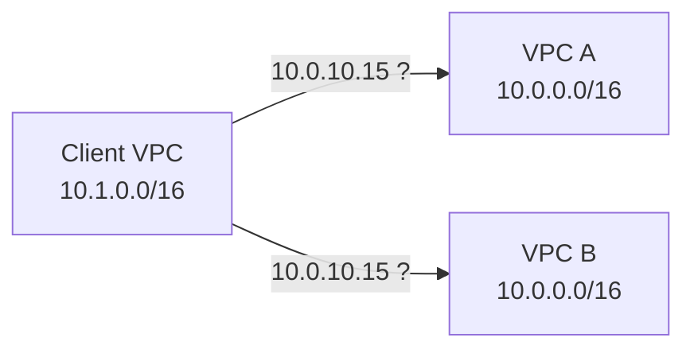
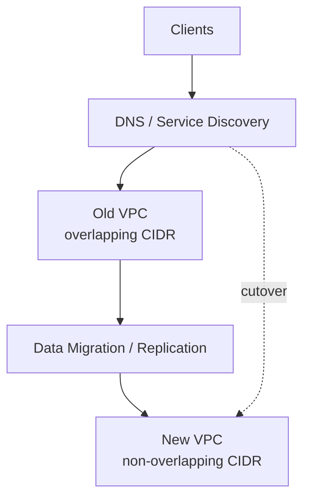
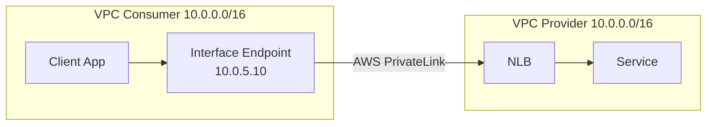
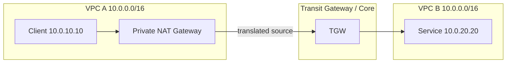
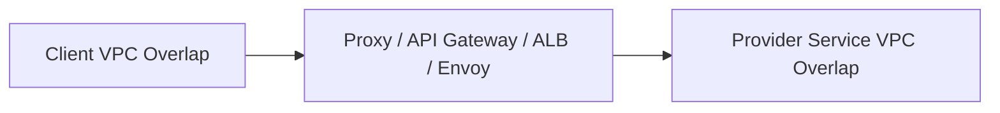
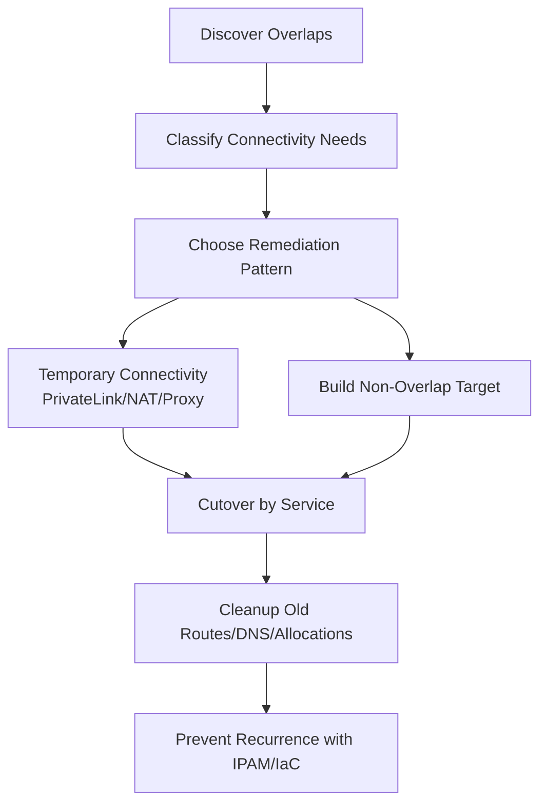

# Part 030 — Overlapping CIDR and NAT Patterns

Overlapping CIDR adalah salah satu masalah networking yang sering terlihat sederhana tetapi efeknya struktural.

Dua VPC sama-sama memakai:

```txt
10.0.0.0/16
```

Selama tidak pernah saling bicara, semua terlihat baik-baik saja.

Lalu datang kebutuhan:

- service A perlu call service B;
- audit platform perlu collect logs;
- SOC perlu reach workload;
- database replication perlu cross-VPC;
- merger company perlu masuk jaringan corporate;
- partner SaaS butuh private connectivity;
- on-prem perlu route ke AWS;
- centralized egress/inspection harus diterapkan;
- Transit Gateway harus menghubungkan semua account.

Tiba-tiba address yang sama menunjuk ke dua tempat berbeda.

Router tidak membaca intent bisnis. Router hanya membaca destination prefix.

Kalau destination `10.0.10.15` bisa berarti dua workload berbeda, network tidak punya jawaban yang benar tanpa translation, indirection, atau renumbering.

---

## 1. Mental Model: Overlap Bukan Masalah IP, Tapi Masalah Identitas Tujuan

CIDR overlap berarti satu address range digunakan oleh lebih dari satu network domain.

Masalahnya bukan angka yang sama. Masalahnya adalah **ambiguity**.



Dari sudut pandang client:

```txt
10.0.10.15 = siapa?
```

Kalau ada dua jawaban, routing table tidak cukup.

Network layer butuh destination yang unik di dalam routing domain.

---

## 2. Kapan Overlap Aman?

Overlap bisa aman kalau network benar-benar isolated.

Contoh:

```txt
Sandbox account A: 10.0.0.0/16
Sandbox account B: 10.0.0.0/16
```

Aman jika:

- tidak ada peering;
- tidak ada TGW/Cloud WAN connection;
- tidak ada shared DNS yang membuat traffic silang;
- tidak ada hybrid route;
- tidak ada shared services yang harus reach keduanya;
- tidak ada central incident access;
- tidak ada future integration requirement.

Masalahnya: “tidak akan pernah terhubung” sering berubah menjadi “harus terhubung minggu depan”.

Untuk workload serius, overlap adalah technical debt.

---

## 3. Kapan Overlap Menjadi Bahaya Produksi?

Overlap berbahaya ketika dua domain masuk ke routing atau naming universe yang sama.

Trigger umum:

| Trigger | Dampak |
|---|---|
| VPC Peering | Tidak bisa peering jika primary IPv4 CIDR overlap. |
| Transit Gateway | Route table tidak bisa membedakan destination yang sama. |
| Cloud WAN | Segment routing jadi ambigu. |
| Direct Connect/VPN | On-prem route advertisement bentrok. |
| Shared DNS | Nama bisa resolve ke IP yang unreachable/salah. |
| Centralized inspection | Appliance tidak tahu return path yang benar. |
| Incident response | Security tool bisa reach target salah. |
| Service discovery | Endpoint address bisa tidak unik. |
| Audit/log correlation | IP yang sama punya dua identitas. |

AWS mendokumentasikan bahwa dua VPC tidak dapat di-peering jika primary IPv4 CIDR block overlap. AWS IPAM juga menandai overlapping resource CIDRs karena overlap dapat menyebabkan routing yang salah.

Referensi:

- https://docs.aws.amazon.com/whitepapers/latest/aws-vpc-connectivity-options/vpc-peering.html
- https://docs.aws.amazon.com/vpc/latest/ipam/monitor-cidr-usage-ipam.html

---

## 4. Kenapa Longest Prefix Match Tidak Menyelamatkan Overlap

Route table memilih route paling spesifik.

Contoh:

```txt
10.0.0.0/16 -> VPC A
10.0.10.0/24 -> VPC B
```

Traffic ke `10.0.10.15` akan ke VPC B karena `/24` lebih spesifik.

Ini bisa dipakai untuk partial routing, tapi bukan solusi umum overlap.

Kenapa?

- hanya menyelesaikan subset address;
- butuh koordinasi host-level/subnet-level;
- rentan route leak;
- return path bisa salah;
- sulit dioperasikan lintas banyak VPC;
- tidak menyelesaikan address yang benar-benar sama di dua network;
- bisa membuat debugging sangat sulit.

Longest prefix match bukan identity system. Ia hanya tie-breaker route.

---

## 5. Pilihan Remediasi

Saat overlap terjadi, opsi utama:

```txt
1. Jangan hubungkan domain yang overlap.
2. Renumber salah satu network.
3. Gunakan PrivateLink/service-level connectivity.
4. Gunakan NAT/translation.
5. Gunakan proxy/application gateway.
6. Gunakan DNS indirection dengan endpoint unik.
7. Buat parallel VPC baru lalu migrasi.
```

Tidak ada opsi gratis.

Setiap opsi menukar satu jenis kompleksitas dengan kompleksitas lain.

---

## 6. Decision Matrix

| Opsi | Cocok Untuk | Tidak Cocok Untuk | Trade-off Utama |
|---|---|---|---|
| Isolate | Sandbox/lab/disconnected domain | Integrasi produksi | Murah tapi membatasi konektivitas. |
| Renumber | Long-term clean architecture | Legacy besar tanpa migration window | Benar secara struktural tapi mahal. |
| PrivateLink | Service-specific TCP access | Bidirectional full mesh | Aman, private, overlap-friendly, tapi unidirectional/service-level. |
| Private NAT Gateway | Overlap antar-network yang butuh IP translation | Complex many-to-many tanpa governance | Menyelesaikan ambiguity via translation, tapi menambah route/DNS/ops complexity. |
| Proxy/App Gateway | HTTP/API/database gateway | Low-level network transparency | Lebih eksplisit, observability bagus, tapi app-aware. |
| DNS indirection | Client bisa memakai nama, bukan IP | Hardcoded IP clients | Membantu migration, bukan solusi routing sendiri. |
| Parallel VPC migration | Workload cloud-native/IaC | Legacy mutable pets | Clean target, perlu orchestration. |

---

## 7. Renumbering: Solusi Paling Bersih, Paling Mahal

Renumbering berarti mengganti CIDR salah satu network agar unik.

Secara arsitektur, ini solusi paling bersih.

Setelah renumbering:

- route table sederhana;
- DNS lebih jujur;
- TGW/Cloud WAN lebih mudah;
- firewall policy lebih jelas;
- incident response lebih mudah;
- future integration lebih aman.

Tapi renumbering mahal karena IP address sering bocor ke banyak layer:

- database allowlist;
- firewall rules;
- partner ACL;
- app config;
- hardcoded IP;
- monitoring target;
- DNS records;
- TLS SAN/IP references;
- license binding;
- static routes;
- on-prem firewall;
- security tooling;
- documentation;
- disaster recovery runbook.

Renumbering adalah migration project, bukan network change kecil.

---

## 8. Renumbering Strategy

Jangan renumber in-place tanpa strategy.

Pola aman:



Langkah:

```txt
1. Buat target CIDR dari IPAM pool yang benar.
2. Buat VPC baru dengan subnet/routing/security baseline.
3. Bangun konektivitas baru ke shared services/hybrid.
4. Duplikasi endpoint/load balancer/service discovery.
5. Replikasi data bila perlu.
6. Uji traffic dari client representative.
7. Turunkan TTL DNS.
8. Cutover per service, bukan seluruh estate sekaligus.
9. Monitor error, latency, rejection, asymmetric traffic.
10. Freeze old VPC.
11. Decommission route, DNS, SG references, endpoints.
12. Release allocation setelah cooldown.
```

Prinsip:

> Migrasi address harus dilakukan melalui service boundary, bukan host-by-host manual chaos.

---

## 9. PrivateLink sebagai Escape Hatch untuk Overlap

AWS PrivateLink sering menjadi solusi paling elegan ketika dua VPC overlap tetapi hanya butuh akses ke service tertentu.

PrivateLink mengubah problem dari:

```txt
Client harus route ke seluruh VPC provider.
```

menjadi:

```txt
Client hanya connect ke endpoint ENI lokal di VPC client.
```



Consumer tidak perlu route ke provider CIDR.

Provider CIDR boleh overlap dengan consumer CIDR karena consumer melihat endpoint sebagai IP lokal di VPC-nya sendiri.

AWS Prescriptive Guidance menyebut PrivateLink sebagai pendekatan umum untuk integrasi third-party service karena memungkinkan overlapping CIDR dan memisahkan network communication path. PrivateLink cocok untuk private connectivity ke service tanpa mengekspos traffic ke public internet.

Referensi:

- https://docs.aws.amazon.com/prescriptive-guidance/latest/integrate-third-party-services/architecture-1.html
- https://docs.aws.amazon.com/whitepapers/latest/building-scalable-secure-multi-vpc-network-infrastructure/aws-privatelink.html

---

## 10. PrivateLink Limitations

PrivateLink bukan pengganti penuh routing.

Limitasi konseptual:

- service-level, bukan network-level;
- umumnya consumer menginisiasi koneksi ke provider;
- cocok untuk TCP service exposure, bukan arbitrary bidirectional mesh;
- provider biasanya butuh NLB atau supported endpoint service model;
- client melihat endpoint IP lokal, bukan real server IP;
- security/observability perlu disesuaikan;
- DNS private harus dikelola;
- setiap service yang diekspos menjadi product contract.

PrivateLink bagus ketika kamu bisa mengatakan:

```txt
Consumer perlu akses ke service X pada port Y.
```

PrivateLink buruk ketika requirement sebenarnya:

```txt
Semua host di VPC A harus bisa reach semua host di VPC B secara arbitrary.
```

Kalau requirement kedua muncul, pertanyaan yang lebih baik adalah: kenapa arsitektur butuh full mesh?

---

## 11. Private NAT Gateway untuk Overlapping Networks

AWS mendukung private NAT Gateway untuk komunikasi private antar network, termasuk scenario overlapping CIDR.

Public NAT Gateway umum dipakai untuk private subnet keluar ke internet. Private NAT Gateway tidak menggunakan Elastic IP untuk internet egress; ia dipakai untuk private connectivity melalui TGW/VGW/Direct Connect/VPN dan sejenisnya.

AWS mendokumentasikan private NAT Gateway dapat digunakan untuk komunikasi antar network yang punya overlapping CIDR ranges.

Referensi:

- https://docs.aws.amazon.com/vpc/latest/userguide/nat-gateway-scenarios.html

Mental model NAT overlap:

```txt
VPC A original: 10.0.0.0/16
VPC B original: 10.0.0.0/16

VPC A exposes translated range: 100.64.1.0/24
VPC B sees A as: 100.64.1.0/24
```

NAT membuat identity baru yang unik di routing domain.

---

## 12. NAT Translation Pattern

Contoh sederhana:



Tanpa NAT:

```txt
Source:      10.0.10.10
Destination: 10.0.20.20
```

Ambiguity: dua VPC menggunakan `10.0.0.0/16`.

Dengan NAT:

```txt
Source original:      10.0.10.10
Source translated:    100.64.1.10
Destination:          10.0.20.20
```

VPC B melihat source sebagai range unik.

Tetapi NAT tidak menghilangkan kompleksitas. Ia memindahkan kompleksitas ke:

- translation table;
- route table;
- DNS;
- observability;
- firewall policy;
- debugging;
- asymmetric return path prevention.

---

## 13. NAT Requires Directionality

NAT pattern harus jelas arah komunikasinya.

Pertanyaan wajib:

```txt
Siapa client?
Siapa server?
Siapa yang memulai koneksi?
Apakah return traffic mengikuti path yang sama?
Apakah kedua sisi perlu initiate koneksi?
Apakah port/protocol fixed?
Apakah DNS bisa menunjuk ke translated address?
Apakah logging perlu original source IP?
```

NAT yang tidak punya directionality berubah menjadi labirin.

Untuk bidirectional access, sering dibutuhkan:

- NAT di kedua sisi;
- prefix translation yang konsisten;
- DNS view berbeda;
- firewall rules untuk translated ranges;
- runbook sangat disiplin.

Semakin banyak arah dan service, semakin NAT kalah dari renumbering atau service-level architecture.

---

## 14. NAT and DNS

Routing saja tidak cukup. Client harus tahu destination yang benar.

Jika VPC B service asli:

```txt
service.internal -> 10.0.20.20
```

Tapi VPC A tidak bisa memakai `10.0.20.20` karena overlap, maka VPC A perlu nama yang resolve ke translated/reachable address.

Contoh:

```txt
From VPC B:
service.internal -> 10.0.20.20

From VPC A:
service.internal -> 100.64.20.20
```

Ini membutuhkan split-horizon DNS atau DNS indirection.

DNS harus dianggap bagian dari NAT design.

Tanpa DNS discipline, developer akan hardcode IP dan migration berikutnya menjadi lebih buruk.

---

## 15. Proxy Pattern

Proxy pattern memindahkan integrasi dari L3/L4 ke L7 atau service-aware gateway.

Contoh:



Proxy cocok jika:

- protocol HTTP/gRPC/database-aware;
- butuh authN/authZ tambahan;
- butuh observability L7;
- butuh rate limiting;
- butuh schema/version control;
- IP overlap membuat network-level connectivity terlalu mahal;
- consumer tidak perlu tahu internal provider address.

Proxy lebih eksplisit daripada NAT.

NAT membuat network seolah-olah langsung. Proxy mengatakan jujur:

> “Ini service boundary. Gunakan interface ini.”

Untuk platform besar, ini sering lebih sehat.

---

## 16. Service Discovery and DNS Indirection

Hardcoded IP adalah musuh migration.

Jika client memakai nama:

```txt
payments.internal.company
```

kamu bisa mengubah backing connectivity:

- direct VPC route;
- PrivateLink endpoint;
- proxy;
- new VPC after renumbering;
- blue/green service migration.

Jika client memakai IP:

```txt
10.0.20.20
```

kamu terikat pada address lama.

Untuk overlap remediation, DNS indirection adalah safety rail.

Pattern:

```txt
Client -> stable DNS name -> environment-specific target -> current connectivity mechanism
```

Jangan expose internal host IP sebagai contract jangka panjang.

---

## 17. Overlap with VPC Peering

VPC Peering adalah direct private connectivity antara dua VPC.

Tetapi AWS tidak mendukung peering untuk VPC dengan overlapping primary IPv4 CIDR.

Kalau kamu mencoba memakai peering sebagai quick fix untuk overlap, desainnya salah dari awal.

Alternatif:

- renumber salah satu VPC;
- gunakan PrivateLink untuk service-specific access;
- gunakan proxy;
- gunakan NAT/translation pattern;
- buat VPC baru non-overlap dan migrasi.

VPC Peering cocok untuk simple non-overlapping VPC integration. Ia bukan solusi overlap.

---

## 18. Overlap with Transit Gateway

Transit Gateway membuat routing domain hub-spoke.

Dalam TGW, destination CIDR harus punya makna jelas.

Jika dua attachment advertise destination yang sama:

```txt
Attachment A: 10.0.0.0/16
Attachment B: 10.0.0.0/16
```

TGW route table tidak bisa menjadikan keduanya destination yang sama secara bermakna untuk traffic dari attachment ketiga.

Kamu bisa segment route table agar keduanya tidak terlihat oleh domain yang sama, tetapi itu isolation, bukan connectivity.

Pattern aman:

```txt
- VPC overlap boleh attach ke TGW hanya jika segment-nya tidak saling melihat.
- Jangan propagate overlapping routes ke route table yang sama.
- Gunakan blackhole/static guardrail untuk mencegah accidental routing.
- Gunakan PrivateLink/NAT/proxy untuk integrasi spesifik.
```

Transit Gateway menyederhanakan banyak koneksi. Ia tidak menghapus kebutuhan uniqueness dalam routing domain.

---

## 19. Overlap with Cloud WAN

Cloud WAN memakai segment dan policy untuk global network.

Problem overlap tetap sama:

- jika dua attachment dalam segment yang sama punya destination overlap, route intent ambigu;
- jika segment berbeda dan isolated, overlap mungkin aman;
- service insertion/inspection menjadi sulit jika traffic perlu diterjemahkan;
- policy harus mencegah accidental segment sharing.

Cloud WAN membantu governance, tetapi tidak membuat IP yang sama menjadi dua tujuan berbeda dalam route domain yang sama.

---

## 20. Overlap with Hybrid Network

Hybrid overlap sering paling menyakitkan.

Contoh:

```txt
On-prem: 10.0.0.0/8
AWS VPC: 10.0.0.0/16
```

Ini sering terjadi karena on-prem lama memakai range besar.

Solusi:

- gunakan AWS range non-overlap seperti `172.16.0.0/12` subset yang belum dipakai;
- gunakan `100.64.0.0/10` untuk carrier-grade/private translation space jika sesuai kebijakan internal;
- gunakan NAT translation untuk akses spesifik;
- gunakan proxy/PrivateLink untuk service-level access;
- renumber secara bertahap;
- jangan advertise broad on-prem summary yang menelan AWS ranges.

Hybrid network membutuhkan registry address yang akurat. IPAM harus mencatat on-prem range, bukan hanya AWS VPC.

---

## 21. Using 100.64.0.0/10 Carefully

`100.64.0.0/10` sering dipakai sebagai translation/intermediate range karena tidak termasuk RFC1918 klasik, tetapi juga bukan public internet normal untuk organisasi.

Namun jangan otomatis memakainya tanpa governance.

Risiko:

- sudah dipakai operator/network lain;
- bentrok dengan SD-WAN/provider;
- security tools menganggapnya aneh;
- dokumentasi internal tidak siap;
- route filtering salah;
- audit bertanya kenapa bukan RFC1918.

Kalau memakai range ini untuk NAT/translation:

```txt
[ ] Catat di IPAM
[ ] Tandai sebagai translation range
[ ] Jangan pakai untuk workload native
[ ] Buat owner jelas
[ ] Buat route/firewall policy eksplisit
[ ] Dokumentasikan mapping
```

Translation range harus dikelola seperti address space produksi.

---

## 22. Observability in Overlap Scenarios

Overlap membuat observability lebih sulit karena IP tidak lagi globally unique.

Log seperti ini tidak cukup:

```txt
srcaddr=10.0.10.10 dstaddr=10.0.20.20 action=ACCEPT
```

Kamu perlu konteks:

- source VPC;
- source account;
- source ENI;
- source subnet;
- TGW attachment;
- NAT translated IP;
- original source, jika tersedia;
- DNS name used;
- flow direction;
- route table domain;
- service owner.

Gunakan enrichment pipeline:

```txt
Flow Log -> account/VPC/ENI enrichment -> IPAM lookup -> owner/environment -> SIEM
```

Tanpa enrichment, IP overlap membuat forensic ambiguous.

---

## 23. Security Implications

Overlap bisa melemahkan security posture.

Contoh buruk:

```txt
Firewall allow: 10.0.0.0/16 -> database
```

Jika ada dua network `10.0.0.0/16`, rule itu tidak jelas secara governance.

Security policy harus memakai:

- unique translated range;
- SG reference jika within same/VPC-supported pattern;
- endpoint policy;
- IAM/resource policy;
- service identity;
- mTLS identity;
- account/VPC condition keys;
- explicit owner metadata.

Jangan hanya mengandalkan CIDR allowlist di dunia overlap.

---

## 24. Cost Implications

Overlap remediation bisa mahal.

Biaya langsung:

- NAT Gateway hourly + data processing;
- interface endpoint hourly + data processing;
- Transit Gateway data processing;
- appliance/proxy cost;
- duplicate VPC during migration;
- logs/observability.

Biaya tidak langsung:

- engineering time;
- incident risk;
- migration window;
- partner coordination;
- audit remediation;
- temporary complexity yang menjadi permanen.

Sering kali IPAM dan address planning terlihat mahal di awal, tetapi jauh lebih murah dibanding overlap remediation setelah produksi.

---

## 25. Runbook: Menilai Overlap Baru

Ketika menemukan overlap, jangan langsung memilih solusi.

Tanyakan:

```txt
1. Apakah kedua network perlu saling berkomunikasi?
2. Apakah komunikasinya one-way atau bidirectional?
3. Apakah traffic service-specific atau arbitrary network-level?
4. Protocol apa yang digunakan?
5. Apakah client bisa memakai DNS name?
6. Apakah client hardcoded IP?
7. Apakah source IP asli dibutuhkan provider?
8. Apakah ada compliance requirement untuk traceability?
9. Apakah salah satu network bisa direnumber?
10. Apakah integration sementara atau jangka panjang?
11. Apakah traffic harus melewati inspection?
12. Apakah on-prem/partner juga terlibat?
13. Apakah ada future requirement full connectivity?
```

Jawaban menentukan pattern.

---

## 26. Runbook: Memilih Pattern

```txt
IF tidak perlu connectivity:
    isolate; catat exception di IPAM

ELSE IF long-term full network connectivity dibutuhkan:
    renumber / migrate to non-overlap

ELSE IF hanya consumer -> provider service TCP:
    PrivateLink

ELSE IF HTTP/API/gRPC dan butuh control L7:
    proxy / API gateway / service gateway

ELSE IF network-level access dibutuhkan tapi terbatas direction/protocol:
    private NAT gateway / translation

ELSE IF sementara untuk migration:
    DNS indirection + proxy/NAT + phased cutover

ELSE:
    challenge requirement; full mesh overlap usually indicates architecture debt
```

---

## 27. Example Scenario: Third-Party SaaS with Overlap

Kondisi:

```txt
Company VPC: 10.20.0.0/16
Vendor VPC: 10.20.0.0/16
Need: Company app calls vendor API privately
Protocol: HTTPS/TCP 443
Direction: company -> vendor only
```

Solusi yang sehat:

```txt
PrivateLink
```

Alasannya:

- tidak perlu route ke vendor CIDR;
- overlap tidak mengganggu;
- vendor expose service via endpoint service/NLB;
- company consume via interface endpoint;
- DNS private dapat dibuat agar app memakai nama stabil;
- security boundary jelas.

Jangan memaksa TGW/peering hanya karena “private connectivity”. PrivateLink lebih cocok untuk service provider/consumer pattern.

---

## 28. Example Scenario: Two Internal VPCs Need Database Replication

Kondisi:

```txt
VPC A: 10.0.0.0/16
VPC B: 10.0.0.0/16
Need: database replication bidirectional
Source IP matters
Long-term dependency
```

PrivateLink mungkin tidak cukup jika replication kompleks/bidirectional.

Pilihan:

1. Renumber/migrate salah satu side.
2. Buat new database environment di non-overlap VPC.
3. Gunakan temporary NAT/proxy untuk migration only.

Jangan menjadikan NAT bidirectional sebagai arsitektur permanen kecuali benar-benar punya governance kuat.

---

## 29. Example Scenario: On-Prem Broad 10.0.0.0/8

Kondisi:

```txt
On-prem advertises: 10.0.0.0/8
AWS VPC: 10.40.0.0/16
Need: hybrid connectivity
```

Masalah:

- on-prem broad summary mencakup AWS VPC range;
- route advertisement bisa salah;
- return path ambiguity;
- firewall rules broad.

Solusi:

- jangan pakai AWS range di bawah on-prem broad block jika bisa dihindari;
- alokasikan AWS dari range non-overlap;
- jika tidak bisa, gunakan NAT/translation atau route filtering sangat ketat;
- koordinasikan BGP advertisement;
- catat on-prem summary dan AWS exceptions di IPAM;
- rencanakan long-term address cleanup.

---

## 30. Migration Blueprint: From Overlap to Clean Connectivity



Detailed steps:

```txt
1. Inventory all overlapping CIDRs.
2. Enrich with account, owner, environment, criticality.
3. Identify actual connectivity requirements.
4. Stop creating new VPCs from overlapping ranges.
5. Add on-prem/partner ranges to IPAM.
6. Create clean pools for future allocations.
7. For urgent service access, use PrivateLink/proxy/NAT.
8. For long-term network connectivity, migrate to clean CIDR.
9. Remove temporary translation after cutover.
10. Enforce IPAM allocation in IaC.
```

Temporary solutions must have expiry.

Without expiry, temporary NAT becomes permanent architecture debt.

---

## 31. Testing Overlap Remediation

Do not rely on “ping works”.

Test:

```txt
[ ] DNS resolves to expected address from each side
[ ] TCP connect works on required port
[ ] TLS handshake works
[ ] Application request succeeds
[ ] Return traffic follows expected path
[ ] Flow Logs show expected translated/original IP
[ ] TGW route table contains expected route only
[ ] No broader overlapping route is propagated
[ ] Firewall sees expected source range
[ ] Logs can map traffic to owner/account
[ ] Failover path behaves correctly
[ ] Health checks do not mask wrong route
```

For NAT:

```txt
[ ] Translation range unique
[ ] Route to translated range exists
[ ] Reverse route exists
[ ] NACL ephemeral ports allowed
[ ] SG/firewall allow translated source
[ ] DNS points to translated destination if needed
[ ] Metrics checked for drops/port exhaustion
```

For PrivateLink:

```txt
[ ] Endpoint service accepted
[ ] Interface endpoint SG allows client
[ ] Provider NLB target healthy
[ ] Private DNS correct
[ ] Endpoint policy/resource policy correct
[ ] Consumer does not need provider CIDR route
```

---

## 32. Anti-Patterns

### 32.1 “Just add a more specific route”

This may work in one narrow path. It usually creates hidden asymmetry and future outages.

### 32.2 Full mesh via NAT

Many-to-many NAT across overlapping networks is operationally brutal.

If you need full mesh, renumber.

### 32.3 Hardcoded translated IPs

Translation already adds complexity. Hardcoding translated IPs locks it in.

Use DNS.

### 32.4 Ignoring return path

Most failed NAT designs forget return traffic.

Stateful flows need symmetric or at least valid reverse routing.

### 32.5 Treating PrivateLink as network access

PrivateLink exposes a service, not the whole provider VPC.

That is a feature, not a limitation, if the requirement is service access.

### 32.6 Not updating security policy

If source is translated, firewall rules must allow translated source, not original source.

### 32.7 No observability mapping

If logs show translated IP only, incident response needs mapping back to original owner.

### 32.8 Temporary architecture without expiry

Temporary NAT/proxy often becomes permanent. Put expiry and owner from day one.

---

## 33. Design Principle: Service Boundary Beats Network Boundary

Overlapping CIDR often reveals a deeper issue: teams are asking for network-level reachability when they only need service-level access.

Instead of:

```txt
Give VPC A access to VPC B.
```

Ask:

```txt
Which service in VPC B does VPC A need?
Which protocol?
Which identity?
Which port?
Which SLA?
Which data classification?
Which direction?
```

That question often points to:

- PrivateLink;
- API Gateway;
- ALB/NLB;
- VPC Lattice;
- service mesh;
- proxy;
- event-driven integration;
- data replication pipeline.

Top-tier engineers reduce network blast radius by narrowing connectivity intent.

---

## 34. Governance: Preventing Recurrence

After remediation, prevent the same problem.

Controls:

```txt
[ ] All new VPCs allocate CIDR from IPAM
[ ] Manual CIDR creation flagged as noncompliant
[ ] On-prem/partner ranges registered
[ ] Pool hierarchy reviewed per Region/environment
[ ] SCP/Config/IaC policy discourages arbitrary CIDR
[ ] Network review required for new hybrid/partner route
[ ] Temporary translation ranges tagged with expiry
[ ] Route table propagation reviewed
[ ] TGW/Cloud WAN segments tested for overlap
[ ] DNS zones reviewed for stale private records
```

Governance should be automated where possible.

Human review catches intent. Automation catches drift.

---

## 35. Engineering Heuristics

1. **Overlap is safe only inside true isolation.**
2. **If two networks must route to each other, destination CIDR must be unique or translated.**
3. **PrivateLink is often better than routing for service-provider access.**
4. **NAT solves ambiguity by creating another identity; it does not remove complexity.**
5. **Bidirectional NAT is a last resort, not a default architecture.**
6. **DNS is part of every overlap remediation.**
7. **Logs need VPC/account/translation context, not just IP.**
8. **Renumbering is expensive but often cheaper than permanent network contortions.**
9. **IPAM prevents future overlap only if allocation is enforced.**
10. **Ask for service intent before granting network reachability.**

---

## 36. Summary

Overlapping CIDR is not merely duplicate numbering. It is routing ambiguity.

AWS gives several ways to deal with it:

- avoid it through IPAM and disciplined allocation;
- isolate disconnected domains;
- renumber for clean long-term connectivity;
- expose service-specific access via PrivateLink;
- use private NAT Gateway for controlled translation;
- use proxy/application gateway when L7 control is better;
- use DNS indirection to avoid hardcoded IP dependency.

The best solution depends on intent.

If the need is service access, prefer service-level patterns like PrivateLink or proxy.

If the need is full long-term network connectivity, prefer renumbering or migration to clean CIDR.

If the need is temporary bridging, NAT can help, but it must be governed, observable, and eventually removed.

This closes Phase 3’s address/topology foundation. Next, the series moves into **hybrid connectivity**, starting with how to reason about AWS-to-on-prem networks before selecting VPN, Direct Connect, BGP, or enterprise reference architecture.
