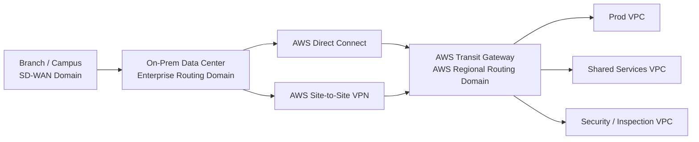
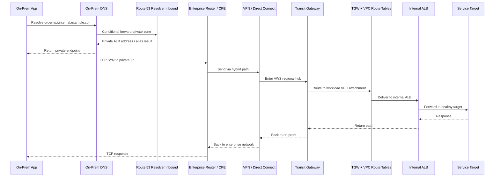
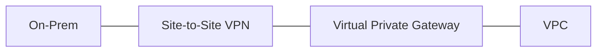
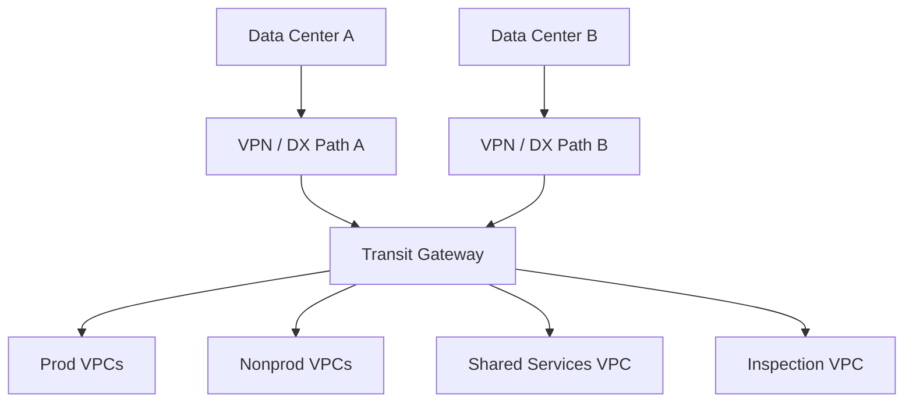
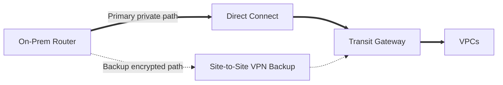
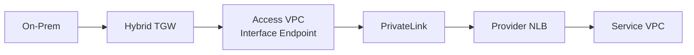
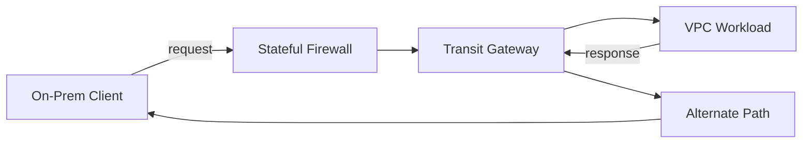
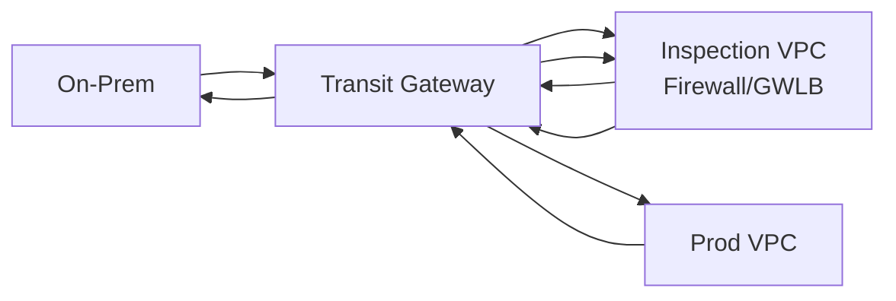
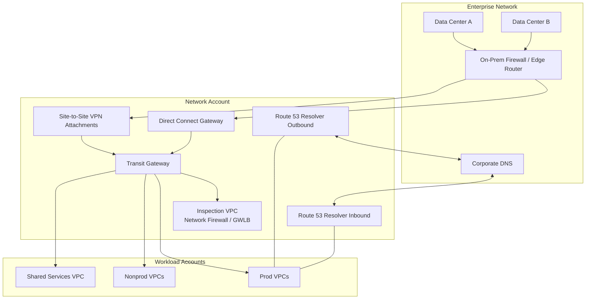

# Part 031 — Hybrid Connectivity Mental Model

Hybrid connectivity adalah titik ketika network cloud berhenti menjadi “VPC internal” dan mulai menjadi bagian dari jaringan perusahaan yang lebih besar.

Di sini traffic tidak lagi hanya bergerak:

```txt
subnet -> route table -> NAT -> internet
```

Tetapi mulai bergerak di antara domain yang dimiliki oleh tim, teknologi, dan failure mode yang berbeda:

```txt
branch office -> SD-WAN -> data center -> Direct Connect -> Transit Gateway -> VPC -> workload
partner network -> IPsec VPN -> inspection VPC -> private service
on-prem DNS -> Route 53 Resolver -> private hosted zone -> service endpoint
legacy app -> NAT translation -> AWS private API
```

Hybrid networking bukan sekadar “buat VPN” atau “pasang Direct Connect”. Itu adalah desain **routing authority**, **failure domain**, **traffic ownership**, **name resolution**, **encryption**, **observability**, dan **operational contract**.

Kalau salah, gejalanya jarang langsung terlihat sebagai “network design bad”. Biasanya terlihat sebagai:

- aplikasi kadang timeout;
- failover VPN tidak terjadi atau terlalu lambat;
- traffic prod lewat nonprod path;
- DNS resolve benar dari laptop, salah dari EC2;
- route on-prem bocor ke semua VPC;
- security appliance stateful melihat packet pergi tapi tidak melihat packet balik;
- biaya data transfer naik tanpa ada perubahan fitur;
- audit tidak bisa menjelaskan “jalur mana yang dilewati data customer”.

Bagian ini membangun mental model sebelum masuk ke Site-to-Site VPN, Direct Connect, hybrid DNS, dan reference architecture.

---

## 1. Prinsip Utama: Hybrid Connectivity Adalah Masalah Routing Domain

VPC adalah private routing domain. On-premises network adalah routing domain lain. Transit Gateway adalah regional transit hub. Direct Connect Gateway adalah abstraction untuk menghubungkan Direct Connect ke VPC/VGW/TGW sesuai pola. VPN adalah encrypted tunnel di atas underlay. SD-WAN adalah overlay routing domain milik enterprise/vendor.

Hybrid connectivity berarti kita membuat beberapa routing domain ini dapat saling bertukar reachability.



Pertanyaan desainnya bukan hanya:

> “Bisa connect atau tidak?”

Pertanyaan yang benar:

1. Prefix mana yang boleh diketahui oleh siapa?
2. Prefix mana yang boleh dirouting melalui path mana?
3. Siapa pemilik route advertisement?
4. Siapa yang boleh mengubah route?
5. Apa default path saat normal?
6. Apa backup path saat primary gagal?
7. Berapa lama convergence yang bisa diterima?
8. Apakah return path simetris?
9. Apakah traffic perlu inspection?
10. Apakah encryption dibutuhkan di overlay, underlay, atau application layer?
11. Apakah DNS mengikuti routing domain yang sama?
12. Bagaimana membuktikan jalur traffic saat audit/incident?

---

## 2. Hybrid Connectivity Tidak Sama dengan Internet Connectivity

Internet connectivity biasanya addressability publik:

```txt
client -> public DNS -> public endpoint -> edge/load balancer -> workload
```

Hybrid connectivity biasanya addressability privat:

```txt
client on-prem -> private DNS -> private route -> private endpoint/workload
```

Perbedaan penting:

| Dimensi | Internet Connectivity | Hybrid Connectivity |
|---|---|---|
| Addressing | Public IP / public DNS | Private CIDR / private DNS |
| Routing authority | Internet routing + AWS edge | Enterprise routing + AWS routing |
| Security boundary | Public endpoint hardening | Private path + segmentation + policy |
| Failure mode | Global ISP/edge/origin | CPE, BGP, tunnel, DX location, TGW, DNS forwarding |
| Debugging | HTTP/TLS/DNS mostly | DNS + BGP + route table + firewall + packet path |
| Blast radius | Public exposure risk | Route leak / lateral movement risk |
| Governance | Edge/security service policy | Network platform policy + enterprise network change control |

Hybrid networking lebih mirip “inter-domain routing” daripada “membuka port”.

---

## 3. AWS Hybrid Connectivity Building Blocks

Di AWS, hybrid connectivity biasanya menggunakan kombinasi beberapa primitive:

| Primitive | Fungsi | Cocok Untuk |
|---|---|---|
| AWS Site-to-Site VPN | IPsec tunnel antara customer gateway dan AWS gateway | Quick setup, backup path, encrypted over internet/private path |
| AWS Direct Connect | Dedicated private connectivity ke AWS location | Predictable bandwidth/latency, enterprise backbone, high throughput |
| Transit Gateway | Regional hub untuk VPC dan on-prem attachment | Banyak VPC/account, route segmentation, centralized routing |
| Direct Connect Gateway | Menghubungkan Direct Connect ke VPC/VGW/TGW secara lintas Region sesuai supported pattern | Reuse DX untuk multi-Region/global architecture |
| Cloud WAN | Managed global WAN untuk segment/policy/attachment secara global | Enterprise global network dengan governance/policy terpusat |
| TGW Connect | GRE+BGP attachment untuk SD-WAN/network appliance | SD-WAN integration dan dynamic routing appliance |
| Route 53 Resolver | Hybrid DNS forwarding antara VPC dan on-prem | Private hosted zone, split-horizon, conditional forwarding |
| Network Firewall / GWLB | Inspection path untuk north-south/east-west | Centralized security appliance/firewall insertion |
| PrivateLink | Service-specific private connectivity tanpa routing full CIDR | Partner/SaaS/service exposure, overlap mitigation |

Mental model:

```txt
Connectivity primitive != architecture.

VPN, Direct Connect, TGW, Cloud WAN, Resolver, Firewall, PrivateLink adalah alat.
Architecture adalah kombinasi yang punya contract:
- siapa bisa bicara ke siapa,
- lewat path mana,
- dengan policy apa,
- dalam failure condition apa,
- dan bagaimana dibuktikan.
```

---

## 4. Empat Plane dalam Hybrid Connectivity

Untuk menganalisis hybrid design, pisahkan menjadi empat plane.

### 4.1 Physical / Underlay Plane

Ini jalur fisik atau transport yang membawa packet.

Contoh:

- public internet untuk Site-to-Site VPN publik;
- private Direct Connect circuit;
- enterprise WAN/MPLS/SD-WAN;
- AWS backbone antar-region;
- ISP last-mile;
- DX location/provider path.

Pertanyaan:

- Berapa bandwidth aktual?
- Siapa yang mengelola circuit?
- Apakah path redundant secara fisik?
- Apakah dua link benar-benar diverse atau hanya logical diversity?
- Apakah maintenance provider bisa menjatuhkan dua path sekaligus?

### 4.2 Encryption / Tunnel Plane

Ini overlay security/encapsulation.

Contoh:

- IPsec tunnel untuk Site-to-Site VPN;
- GRE tunnel untuk TGW Connect;
- TLS/mTLS di application layer;
- MACsec pada Direct Connect dedicated connection tertentu jika digunakan;
- encrypted VPN over Direct Connect public/private transport.

Pertanyaan:

- Apakah data encrypted in transit di layer yang tepat?
- Siapa terminasi encryption?
- Bagaimana key rotation atau tunnel option dikelola?
- Apakah compliance butuh IPsec meskipun transport private?

### 4.3 Routing Plane

Ini control-plane reachability.

Contoh:

- static route;
- BGP route advertisement;
- TGW route table association/propagation;
- VGW route propagation;
- SD-WAN route policy;
- route filtering;
- prefix-list governance.

Pertanyaan:

- Prefix apa yang advertised?
- Apakah default route `0.0.0.0/0` boleh masuk/keluar?
- Route mana yang preferred saat ada multiple path?
- Apakah failover deterministic?
- Apakah route summarization menyembunyikan blast radius?

### 4.4 Name Resolution Plane

Ini DNS/service discovery.

Contoh:

- Route 53 private hosted zone;
- inbound Resolver endpoint;
- outbound Resolver endpoint;
- conditional forwarding;
- on-prem DNS;
- split-horizon DNS;
- endpoint private DNS;
- internal domain delegation.

Pertanyaan:

- Nama service resolve ke IP private dari sisi mana?
- Apakah on-prem bisa resolve private hosted zone?
- Apakah AWS workload bisa resolve internal on-prem domain?
- Apakah TTL cocok dengan failover target?
- Apakah DNS path redundant?

Kalau keempat plane ini tidak disejajarkan, koneksi bisa “terlihat ada” tetapi tidak reliable.

---

## 5. Hybrid Packet Path: Jangan Mulai dari Service, Mulai dari Packet

Misal aplikasi on-prem memanggil API internal di AWS:

```txt
app.corp.local -> order-api.internal.example.com -> 10.20.10.42:443
```

Packet path ideal:



Debugging harus membuktikan setiap hop:

1. DNS result benar?
2. Client route benar?
3. Firewall/CPE mengizinkan?
4. Tunnel/circuit up?
5. BGP/static route ada?
6. TGW route table mengarah ke attachment benar?
7. VPC route table punya return path?
8. SG target mengizinkan source CIDR?
9. NACL mengizinkan request dan response?
10. Load balancer target sehat?
11. Response kembali lewat path yang sama atau setidaknya stateful device melihat dua arah?

---

## 6. Routing Authority: Siapa yang Boleh Mengumumkan Prefix?

Hybrid network sering rusak bukan karena tidak ada route, tetapi karena terlalu banyak route.

Contoh buruk:

```txt
On-prem advertises 10.0.0.0/8 to AWS.
AWS VPCs also use 10.0.0.0/16, 10.1.0.0/16, 10.2.0.0/16.
Security team wants all 10/8 reachable.
Platform team wants only approved CIDR reachable.
Application team just wants database connection working.
```

Kalau semua prefix dibiarkan propagate, hasilnya:

- route leak;
- unintended reachability;
- asymmetric routing;
- impossible troubleshooting;
- lateral movement risk;
- accidental dependency antar-domain;
- sulit melakukan decommission.

Prinsip:

```txt
Setiap route advertisement adalah kontrak akses.
Jangan treat route sebagai plumbing teknis belaka.
```

Route contract minimal:

| Field | Contoh |
|---|---|
| Producer | Corporate WAN team |
| Consumer | AWS prod route domain |
| Prefix | `172.20.0.0/16` |
| Purpose | Access to legacy payment service |
| Direction | AWS -> on-prem and on-prem -> AWS |
| Path | TGW VPN primary, DX backup, or reverse |
| Inspection | Through security VPC? yes/no |
| Encryption | IPsec required? yes/no |
| Owner | network-platform@company |
| Expiry/review | quarterly |

---

## 7. Static Routing vs Dynamic Routing

Hybrid connectivity bisa memakai static route atau dynamic routing via BGP.

### Static routing

Static route cocok jika:

- prefix sedikit;
- topology sederhana;
- failover manual/terbatas dapat diterima;
- customer gateway tidak mendukung BGP;
- perubahan route jarang.

Kelemahan:

- perubahan manual;
- tidak ekspresif untuk policy;
- failover kurang fleksibel;
- mudah drift;
- sulit skala saat banyak CIDR.

### Dynamic routing / BGP

BGP cocok jika:

- banyak prefix;
- perlu route advertisement dinamis;
- perlu failover antar tunnel/circuit;
- ada multiple data center/path;
- perlu influence path dengan policy;
- enterprise sudah memakai BGP.

Kelemahan:

- lebih kompleks;
- butuh route filtering ketat;
- salah advertise bisa besar blast radius;
- convergence perlu dipahami;
- BGP “up” tidak selalu berarti application reachable.

### Decision rule

```txt
Kalau hybrid network hanya satu VPC dan satu CIDR kecil, static route bisa cukup.
Kalau network adalah enterprise multi-account/multi-region/multi-DC, BGP hampir selalu lebih sehat—dengan guardrail.
```

Guardrail BGP:

- prefix limit;
- maximum prefix protection;
- route map/filter;
- explicit allowed-prefix list;
- no default route unless intentional;
- no broad summary unless justified;
- BGP session monitoring;
- route table snapshot diff;
- change review for advertised prefixes.

---

## 8. Connectivity Pattern 1: VPC-Centric Hybrid

Pola paling sederhana:



Karakter:

- target AWS biasanya Virtual Private Gateway;
- cocok untuk satu atau sedikit VPC;
- tidak ideal untuk banyak VPC/account;
- route propagation ke VPC route table perlu dipahami;
- segmentation terbatas dibanding TGW.

Cocok untuk:

- proof-of-concept;
- single application migration;
- isolated hybrid integration;
- small environment.

Tidak cocok untuk:

- ratusan VPC;
- centralized inspection;
- multi-account route governance;
- shared hybrid connection;
- large enterprise landing zone.

---

## 9. Connectivity Pattern 2: TGW-Centric Hybrid

Pola enterprise umum:



Karakter:

- TGW menjadi hub regional;
- VPC dan hybrid attachment dikelola lewat route table TGW;
- segmentation bisa dibuat dengan multiple TGW route table;
- cocok untuk multi-account;
- centralized inspection/egress lebih mudah;
- dapat dipasangkan dengan Direct Connect Gateway.

Kunci desain:

- jangan gunakan satu TGW route table untuk semua kecuali memang full mesh diinginkan;
- pisahkan prod/nonprod/shared/on-prem/inspection domain;
- gunakan propagation dengan sengaja;
- static blackhole route bisa menjadi guardrail;
- validate reachability sebagai test, bukan asumsi.

---

## 10. Connectivity Pattern 3: Direct Connect First, VPN as Backup

Direct Connect memberi private connectivity yang lebih predictable dibanding internet VPN, tetapi Direct Connect sendiri bukan IPsec encryption by default untuk semua pola. Banyak enterprise memakai VPN sebagai backup atau encryption overlay.



Pertanyaan penting:

- Apakah VPN backup lewat internet atau lewat Direct Connect public/private connectivity?
- Apakah route preference membuat DX primary dan VPN secondary?
- Apakah failover sudah diuji dari sisi traffic aplikasi, bukan hanya BGP state?
- Apakah bandwidth VPN backup cukup saat DX gagal?
- Apakah DNS TTL/failover cocok dengan path failover?

Anti-pattern:

```txt
Membeli Direct Connect besar, tetapi backup VPN kecil tidak cukup untuk traffic critical saat failover.
```

Backup path harus diuji dengan load realistis.

---

## 11. Connectivity Pattern 4: Service-Specific Hybrid via PrivateLink

Kadang on-prem tidak butuh route ke seluruh VPC. On-prem hanya perlu mengakses satu service.

Dalam kasus seperti itu, full routing antar-CIDR bisa terlalu berbahaya.

Alternatif:

- publish service via NLB + endpoint service;
- expose via PrivateLink to consumer VPC;
- connect on-prem to consumer/access VPC;
- DNS mengarah ke endpoint private;
- tidak perlu route full provider VPC CIDR.



Cocok untuk:

- third-party/private SaaS;
- overlapping CIDR;
- service-specific exposure;
- reducing lateral movement;
- platform service published to many consumers.

Trade-off:

- hanya TCP-style service exposure tertentu;
- client source IP behavior perlu dipahami;
- per-endpoint cost;
- DNS/private naming perlu dikelola;
- tidak cocok untuk “akses seluruh network”.

---

## 12. Connectivity Pattern 5: Cloud WAN untuk Global Enterprise Network

Cloud WAN cocok ketika organisasi ingin network global berbasis segment dan policy, bukan sekadar banyak TGW lokal.

Mental model:

```txt
Transit Gateway = regional hub.
Cloud WAN = managed global WAN policy fabric.
```

Cocok jika:

- banyak Region;
- banyak branch/DC;
- perlu segmentation policy global;
- perlu managed global network view;
- network team ingin policy lifecycle yang lebih terpusat.

Tidak otomatis cocok jika:

- hanya satu Region;
- hanya beberapa VPC;
- route model sudah sederhana dengan TGW;
- tim belum siap operationally mengelola policy-based global network.

---

## 13. Latency, Bandwidth, Jitter, and Throughput: Jangan Disatukan

Hybrid design sering gagal karena semua metrik disebut “network slow”.

Pisahkan:

| Metrik | Artinya | Efek ke aplikasi |
|---|---|---|
| Latency | Waktu perjalanan packet | Request-response, database round-trip, synchronous call |
| Bandwidth | Kapasitas link | Bulk transfer, backup, replication |
| Throughput | Data efektif yang berhasil lewat | Kombinasi bandwidth, TCP window, packet loss, parallelism |
| Jitter | Variasi latency | Voice/video, streaming, latency-sensitive systems |
| Packet loss | Packet hilang/drop | Retransmission, TCP collapse, timeout |
| Convergence time | Waktu route pindah saat failure | Outage window saat failover |

Untuk software engineer, implikasinya:

- chatty protocol buruk melewati hybrid WAN;
- synchronous database query lintas WAN biasanya anti-pattern;
- bulk transfer butuh parallelism dan window tuning;
- retry policy harus memahami failover window;
- timeout terlalu pendek membuat transient convergence menjadi incident;
- timeout terlalu panjang membuat thread pool habis.

---

## 14. Hybrid Connectivity and Application Architecture

Hybrid network bukan pengganti desain aplikasi.

Jika aplikasi butuh 50 round-trip ke database on-prem untuk satu request web, Direct Connect tidak menyelamatkan desain itu.

Aturan praktis:

```txt
Cross-hybrid synchronous calls harus dianggap mahal, terbatas, dan failure-prone.
```

Lebih baik:

- cache read-heavy data di sisi AWS;
- gunakan async replication/eventing;
- bulk transfer terjadwal;
- API coarse-grained, bukan chatty RPC;
- explicit timeout/retry/circuit breaker;
- avoid distributed transaction across hybrid link;
- degrade gracefully saat on-prem unavailable;
- observability correlation ID lintas boundary.

Contoh buruk:

```txt
AWS service -> on-prem database -> AWS service -> on-prem file share -> AWS service
```

Contoh lebih sehat:

```txt
on-prem system -> publish event -> AWS ingestion -> local materialized view -> AWS service reads locally
```

---

## 15. Security Model: Private Connectivity Bukan Security Boundary yang Cukup

Private route bukan berarti aman.

Jika on-prem CIDR bisa route ke seluruh prod VPC, attacker yang masuk corporate network bisa mencoba lateral movement ke cloud workload.

Layer security tetap perlu:

- route segmentation;
- SG least privilege;
- NACL guardrail jika tepat;
- Network Firewall/GWLB inspection;
- DNS Firewall untuk egress/domain policy;
- IAM/resource policy untuk AWS API access;
- endpoint policy untuk PrivateLink/VPC endpoint;
- TLS/mTLS untuk application identity;
- logging dan anomaly detection.

Jangan gunakan desain:

```txt
on-prem 10.0.0.0/8 -> all AWS VPCs -> all ports
```

Gunakan desain:

```txt
on-prem app subnet A -> port 443 -> internal ALB X -> service Y
admin subnet B -> port 22/3389? ideally none -> access via SSM/Verified Access/bastion pattern
monitoring subnet C -> specific agents/ports -> shared services
```

Network access harus mengikuti intent aplikasi.

---

## 16. DNS Hybrid: Routing Tanpa DNS Hanya Setengah Solusi

Hybrid route bisa benar, tetapi aplikasi tetap gagal jika DNS salah.

Kasus umum:

```txt
On-prem client resolve service.internal.example.com -> public IP
AWS client resolve service.internal.example.com -> private IP
```

Atau:

```txt
AWS workload resolve db.corp.local -> NXDOMAIN
Laptop developer resolve db.corp.local -> 172.16.5.10
```

Desain hybrid DNS biasanya memerlukan:

- Route 53 private hosted zone untuk AWS private names;
- inbound Resolver endpoint agar on-prem DNS bisa query AWS private zones;
- outbound Resolver endpoint agar AWS workloads bisa query on-prem domains;
- conditional forwarding rules;
- DNS logging;
- split-horizon domain policy;
- TTL/failover strategy;
- HA endpoint placement di multiple AZ;
- firewall rules untuk UDP/TCP 53;
- clear ownership domain: siapa authoritative untuk zone apa.

DNS authority table:

| Domain | Authoritative Owner | Resolution Path |
|---|---|---|
| `corp.local` | On-prem DNS | AWS outbound Resolver -> on-prem DNS |
| `aws.internal.example.com` | Route 53 private hosted zone | On-prem DNS -> inbound Resolver |
| `service.prod.example.com` | Route 53 public/private split | Depends on client domain |
| AWS service private DNS | AWS PrivateLink/Resolver | VPC-local resolution |

---

## 17. Asymmetric Routing: Silent Killer untuk Stateful Devices

Asymmetric routing terjadi ketika request lewat path A, response lewat path B.



Jika ada stateful firewall/appliance di path request tetapi bukan di path response, firewall melihat half-flow. Hasilnya:

- connection reset;
- intermittent drop;
- logs hanya muncul di satu sisi;
- debugging sangat sulit;
- masalah sering dianggap aplikasi.

Pencegahan:

- pastikan route symmetry untuk traffic yang melewati stateful appliance;
- gunakan appliance mode pada TGW attachment jika relevan;
- hindari multiple equal paths tanpa memahami stateful behavior;
- dokumentasikan primary/secondary path per prefix;
- test failover dengan connection existing dan new connection.

---

## 18. Failure Domain: Apa Saja yang Bisa Gagal?

Hybrid architecture harus didesain dengan kegagalan eksplisit.

| Layer | Failure Mode | Mitigasi |
|---|---|---|
| Customer router | Hardware down, config error | Redundant CPE, change control, config backup |
| ISP / carrier | Link degradation/outage | Diverse provider/path, DX redundancy |
| VPN tunnel | IKE/IPsec failure, DPD timeout | Two tunnels, BGP, monitoring, tunnel option hygiene |
| Direct Connect | Circuit/location/provider failure | Multiple DX locations/connections/provider diversity |
| BGP | Session flap, route leak | Prefix filter, max-prefix, alarms, route policy |
| TGW | Misassociation, bad propagation | IaC, route table diff, access analyzer/reachability tests |
| VPC route table | Missing return route | Automated route validation |
| SG/NACL | Drop traffic | Flow Logs, standard rule library |
| DNS | Resolver endpoint down/misforward | Multi-AZ endpoints, query logs, conditional forwarding tests |
| Appliance | Stateful asymmetric drop | Symmetric path, appliance mode, HA appliance design |
| Application | Timeout/retry exhaustion | Backoff, circuit breaker, graceful degradation |

Rule:

```txt
Hybrid readiness = each failure mode has detection + expected traffic behavior + owner + rollback.
```

---

## 19. Redundancy: Dua Tunnel Tidak Selalu Berarti Resilient Design

AWS-managed Site-to-Site VPN provides redundant tunnels, tetapi enterprise design tetap harus memastikan customer side benar.

Checklist redundancy:

- dua tunnel terminasi di perangkat yang sama atau berbeda?
- dua customer gateway device atau satu?
- dua ISP atau satu?
- dua DX connection di lokasi berbeda atau sama?
- dua on-prem data center atau satu?
- BGP policy memungkinkan failover?
- route priority sesuai intent?
- firewall state tetap aman saat failover?
- application timeout cukup untuk convergence?
- monitoring membedakan tunnel down vs app down?

Contoh false redundancy:

```txt
Two VPN tunnels -> same CPE -> same ISP -> same physical circuit -> same power rack.
```

Ini hanya logical redundancy, bukan operational resilience.

---

## 20. Inspection Placement

Hybrid traffic sering harus melewati firewall/IDS/DLP/proxy.

Pola umum:

### 20.1 Distributed inspection

Setiap VPC punya firewall sendiri.

Kelebihan:

- local autonomy;
- blast radius kecil;
- route path pendek.

Kekurangan:

- policy drift;
- cost tinggi;
- sulit governance;
- operational overhead.

### 20.2 Centralized inspection VPC

Traffic diarahkan ke inspection VPC.



Kelebihan:

- policy terpusat;
- observability lebih konsisten;
- compliance lebih mudah;
- reusable security stack.

Kekurangan:

- route complexity;
- asymmetric risk;
- inspection VPC jadi critical dependency;
- throughput scaling harus dirancang;
- cost data processing meningkat.

Decision rule:

```txt
Centralized inspection bagus untuk governance, tetapi harus dibayar dengan routing discipline.
```

---

## 21. Observability: Apa yang Harus Direkam?

Minimal observability untuk hybrid:

| Area | Data |
|---|---|
| VPN | tunnel state, BGP state, tunnel bytes in/out, tunnel packet drop |
| Direct Connect | connection state, BGP peer state, light level/provider metrics jika tersedia |
| TGW | route tables, attachment state, bytes/packets per attachment, Network Manager view |
| VPC | Flow Logs, route table diff, SG/NACL changes |
| DNS | Resolver query logs, forwarding rule changes, endpoint ENI health |
| Firewall | allowed/denied sessions, asymmetric drops, policy hits |
| Application | latency by dependency, timeout rate, retry count, circuit breaker open |
| Change | config history, IaC deployment, route advertisement diff |

Hybrid incident tanpa observability biasanya berubah menjadi rapat panjang:

```txt
network says app problem
app says DNS problem
DNS says route problem
security says firewall clean
provider says circuit up
```

Solusinya adalah evidence chain.

---

## 22. Debugging Framework: DNS, Route, Policy, State, App

Gunakan urutan yang stabil.

### Step 1 — DNS

- Nama resolve ke IP apa?
- Dari sisi on-prem dan dari sisi AWS hasilnya sama atau sengaja beda?
- Resolver path lewat mana?
- TTL berapa?
- Ada conditional forward yang salah?

### Step 2 — Route

- Source tahu route ke destination?
- AWS route table punya route ke destination?
- TGW route table association benar?
- Propagation route ada?
- Return route ada?
- Ada more-specific route yang mengalahkan summary?

### Step 3 — Policy

- SG mengizinkan source CIDR/SG?
- NACL mengizinkan request dan ephemeral response?
- Firewall mengizinkan?
- Endpoint/resource policy mengizinkan?
- IAM/app authorization mengizinkan?

### Step 4 — State

- TCP handshake selesai?
- Firewall melihat dua arah?
- Tunnel up?
- BGP established?
- Health check target sehat?
- Load balancer idle timeout?

### Step 5 — App

- TLS handshake berhasil?
- Host header/SNI benar?
- App timeout cukup?
- Retry storm terjadi?
- Dependency down?

Urutan ini mencegah jumping ke kesimpulan.

---

## 23. Cost Model: Hybrid Network Punya Biaya Tersembunyi

Biaya hybrid bukan hanya “VPN murah, DX mahal”.

Perhatikan:

- Direct Connect port/hour;
- provider/cross-connect/last-mile cost;
- VPN connection cost;
- data transfer out;
- Transit Gateway attachment/hour;
- Transit Gateway data processing;
- inter-AZ transfer jika route melewati AZ lain;
- firewall appliance hourly + throughput + data processing;
- NAT gateway cost jika hybrid path keluar lewat NAT;
- Route 53 Resolver endpoint hourly;
- CloudWatch Logs ingestion/storage;
- redundant links yang idle tetapi wajib.

Cost smell:

```txt
Semua traffic VPC -> centralized inspection -> centralized egress -> on-prem -> internet
```

atau:

```txt
Private subnet -> NAT Gateway -> public AWS service
padahal bisa pakai VPC endpoint.
```

Hybrid design harus punya cost path diagram, bukan hanya architecture diagram.

---

## 24. Decision Matrix: VPN vs Direct Connect vs TGW vs Cloud WAN vs PrivateLink

| Need | Pilihan Biasanya | Catatan |
|---|---|---|
| Cepat connect satu site ke satu VPC | Site-to-Site VPN + VGW | Simple, tapi tidak ideal untuk skala besar |
| Banyak VPC/account butuh on-prem | Site-to-Site VPN/Direct Connect + TGW | TGW sebagai regional hub |
| Predictable bandwidth/latency | Direct Connect | Tetap desain redundancy/provider diversity |
| Encryption overlay mandatory | Site-to-Site VPN, VPN over DX, TLS/mTLS | DX private path tidak otomatis sama dengan app-layer encryption |
| Service-specific private access | PrivateLink | Hindari full network routing |
| Overlapping CIDR | PrivateLink, NAT translation, proxy, renumbering | Jangan paksa peering/TGW full route |
| SD-WAN integration | TGW Connect / vendor appliance | GRE+BGP model |
| Global enterprise WAN policy | Cloud WAN | Segment/policy global |
| Hybrid DNS | Route 53 Resolver | Inbound/outbound endpoints + rules |
| Centralized inspection | TGW + GWLB/Network Firewall | Jaga symmetric routing |

---

## 25. Reference Architecture: Minimal Enterprise Hybrid Baseline



Baseline rules:

1. Hybrid attachments terminate in network account.
2. TGW route tables separate prod, nonprod, shared, on-prem, and inspection domains.
3. Route propagation is explicit.
4. On-prem prefixes are filtered before AWS propagation.
5. AWS prefixes are summarized only when safe.
6. DNS forwarding is treated as production dependency.
7. Security inspection is symmetric.
8. Flow Logs and VPN/TGW/DX metrics are mandatory.
9. Application teams get a connectivity contract, not arbitrary route access.
10. Every hybrid route has owner, purpose, and review cycle.

---

## 26. Engineering Invariants

Hybrid network production invariants:

1. **No undocumented route.** Every advertised prefix has owner and purpose.
2. **No accidental transitivity.** TGW route table association/propagation must express domain boundaries.
3. **No broad access by default.** Route exists does not mean policy allows all ports.
4. **No DNS without ownership.** Every private zone has authoritative owner and forwarding rule.
5. **No stateful inspection without symmetry.** Request and response must cross the same stateful domain.
6. **No backup path without capacity proof.** Backup is real only if tested under expected load.
7. **No hybrid dependency without timeout contract.** Application timeout must fit network convergence and dependency behavior.
8. **No manual-only route governance at scale.** Route tables and prefix policy must be represented in IaC or controlled workflow.
9. **No connectivity debugging without evidence.** DNS, route, policy, state, and app telemetry must be observable.
10. **No CIDR allocation outside IPAM discipline.** Overlap today becomes outage tomorrow.

---

## 27. Practical Design Review Questions

Sebelum menyetujui hybrid connectivity design, tanya:

1. Apa exact source dan destination CIDR/service?
2. Apakah ini butuh full network reachability atau service-specific access?
3. Apakah CIDR overlap ada sekarang atau mungkin di masa depan?
4. Apakah traffic harus encrypted dengan IPsec atau cukup private path + TLS?
5. Siapa authoritative untuk route advertisement?
6. Apa primary path dan backup path?
7. Apa route preference saat kedua path sehat?
8. Berapa convergence target?
9. Apakah stateful inspection ada di path?
10. Apakah return path simetris?
11. Apakah DNS path redundant?
12. Apakah SG/NACL/firewall sudah mengikuti least privilege?
13. Apakah observability cukup untuk membuktikan packet path?
14. Apakah cost data transfer/TGW/inspection sudah dihitung?
15. Apa rollback plan jika route leak terjadi?

---

## 28. Common Anti-Patterns

### Anti-pattern 1 — “Just route everything”

```txt
on-prem 10.0.0.0/8 <-> AWS all VPCs
```

Masalah:

- lateral movement;
- route ambiguity;
- difficult audit;
- app teams depend on hidden paths;
- decommission sulit.

### Anti-pattern 2 — Backup path not tested

```txt
DX primary, VPN backup, but VPN bandwidth 1/20 of required traffic.
```

Saat DX gagal, backup “up” tetapi aplikasi tetap down.

### Anti-pattern 3 — DNS forgotten

Route benar, firewall benar, tetapi client resolve public IP atau NXDOMAIN.

### Anti-pattern 4 — Centralized firewall tanpa symmetric routing

Firewall melihat SYN, tidak melihat SYN-ACK. Connection drop dianggap random.

### Anti-pattern 5 — BGP without filtering

Enterprise advertises broad summary/default route, AWS route domain berubah menjadi unintended transit.

### Anti-pattern 6 — Treating network as app transparent

Aplikasi synchronous chatty dianggap bisa dipindah ke cloud tanpa redesign dependency path.

---

## 29. Small Lab: Draw Your Hybrid Contract

Ambil satu use case:

```txt
AWS prod service needs to call on-prem payment API on TCP/443.
```

Tulis contract:

```yaml
source:
  account: prod-app-account
  vpc: prod-payments-vpc
  cidr: 10.40.0.0/16
  source_subnets: app-private

destination:
  owner: corporate-payments-team
  domain: pay.corp.local
  cidr: 172.20.50.0/24
  port: 443

routing:
  aws_hub: transit-gateway-prod
  primary_path: direct-connect
  backup_path: site-to-site-vpn
  propagation: explicit
  return_path: same hybrid domain

security:
  sg: allow egress TCP/443 to payment CIDR
  firewall: allow app subnet to payment API only
  tls: required
  inspection: yes

dns:
  resolver: outbound Route 53 Resolver
  forward_domain: corp.local
  authoritative: on-prem DNS

operations:
  owner: network-platform
  app_owner: payments-platform
  monitoring: flow_logs + firewall_logs + dx/vpn metrics + app dependency latency
  review: quarterly
```

Jika contract ini tidak bisa ditulis, design belum cukup jelas.

---

## 30. Ringkasan

Hybrid connectivity adalah desain routing domain, bukan hanya koneksi fisik.

Hal yang perlu dipegang:

- VPN, Direct Connect, TGW, Cloud WAN, PrivateLink, Resolver adalah building blocks.
- Arsitektur ditentukan oleh route contract, segmentation, DNS, security, failure handling, dan observability.
- Static routing sederhana tetapi cepat tidak cukup untuk enterprise besar.
- BGP powerful tetapi harus dibatasi dengan prefix policy.
- DNS adalah bagian dari connectivity, bukan pekerjaan terpisah.
- Private route bukan berarti trust penuh.
- Stateful inspection membutuhkan symmetry.
- Backup path harus diuji dengan load dan failure nyata.
- Aplikasi hybrid harus dirancang untuk latency, timeout, retry, dan partial failure.

Part berikutnya akan masuk ke AWS Site-to-Site VPN secara detail: customer gateway, virtual private gateway, Transit Gateway VPN attachment, tunnel, IPsec, BGP, static routing, failover, dan runbook produksi.

---

## References

- https://docs.aws.amazon.com/whitepapers/latest/aws-vpc-connectivity-options/introduction.html
- https://docs.aws.amazon.com/whitepapers/latest/aws-vpc-connectivity-options/network-to-amazon-vpc-connectivity-options.html
- https://docs.aws.amazon.com/whitepapers/latest/building-scalable-secure-multi-vpc-network-infrastructure/hybrid-connectivity.html
- https://docs.aws.amazon.com/vpc/latest/tgw/what-is-transit-gateway.html
- https://docs.aws.amazon.com/whitepapers/latest/hybrid-connectivity/aws-hybrid-connectivity-services.html
- https://docs.aws.amazon.com/Route53/latest/DeveloperGuide/resolver.html
