# Part 032 — AWS Site-to-Site VPN

AWS Site-to-Site VPN adalah managed IPsec connectivity antara network kamu dan AWS.

Biasanya dipakai untuk:

- menghubungkan data center ke VPC;
- menghubungkan branch/campus ke AWS;
- backup path untuk Direct Connect;
- encrypted overlay di atas private/public transport;
- quick hybrid migration path;
- temporary connectivity saat menunggu Direct Connect;
- multi-account routing via Transit Gateway;
- Cloud WAN attachment use case tertentu.

Tetapi VPN bukan sekadar “tunnel up”. VPN production harus menjawab:

- tunnel mana primary?
- bagaimana failover terjadi?
- BGP atau static route?
- prefix apa yang boleh advertised?
- apakah customer gateway HA?
- apakah return path simetris?
- apakah bandwidth cukup?
- apakah tunnel options compatible dengan appliance?
- apakah observability cukup untuk tahu tunnel down sebelum aplikasi down?
- apakah backup path diuji, bukan hanya dikonfigurasi?

Part ini membedah Site-to-Site VPN dari mental model sampai runbook.

---

## 1. Core Model

AWS Site-to-Site VPN menghubungkan **Customer Gateway** di sisi customer dengan **target gateway** di sisi AWS.

Target gateway bisa berupa:

- Virtual Private Gateway untuk koneksi VPC-centric;
- Transit Gateway untuk koneksi multi-VPC/multi-account regional hub;
- Cloud WAN / VPN attachment pattern tertentu;
- not associated saat dibuat, lalu dikaitkan kemudian sesuai use case.

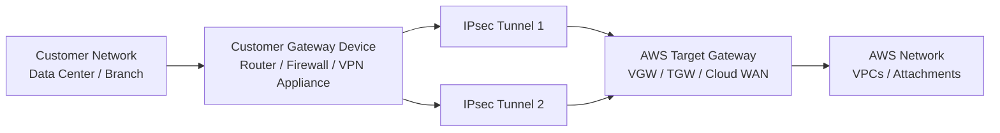

Mental model:

```txt
Customer Gateway = representasi device/network customer di AWS config.
Target Gateway = AWS-side VPN termination/routing domain.
VPN Connection = dua IPsec tunnel + route exchange model.
Tunnel = encrypted path dengan parameter IKE/IPsec tertentu.
Routing = static atau BGP.
```

VPN connection bukan hanya data path. Ia juga route exchange/control behavior.

---

## 2. Components

### 2.1 Customer Gateway

Customer Gateway di AWS adalah resource yang merepresentasikan perangkat atau software gateway di sisi customer.

Yang perlu disiapkan:

- public IP address customer gateway untuk public VPN;
- ASN customer jika memakai BGP;
- vendor/platform config;
- firewall rules untuk IKE/IPsec;
- routing policy;
- HA pair jika butuh resilience;
- monitoring di sisi customer.

Jangan salah kaprah:

```txt
Customer Gateway resource di AWS bukan perangkat fisik.
Itu representasi konfigurasi dari perangkat/perimeter network di sisi kamu.
```

### 2.2 Virtual Private Gateway

Virtual Private Gateway adalah AWS-side gateway yang di-attach ke satu VPC.

Cocok untuk:

- single VPC connectivity;
- arsitektur sederhana;
- migration awal;
- environment kecil.

Keterbatasan arsitektural:

- VPC-centric;
- tidak menjadi hub multi-VPC sebesar TGW;
- segmentation multi-domain tidak sekuat TGW;
- governance multi-account lebih sulit.

### 2.3 Transit Gateway VPN Attachment

Transit Gateway VPN attachment menghubungkan Site-to-Site VPN ke TGW.

Cocok untuk:

- banyak VPC;
- multi-account landing zone;
- shared hybrid connectivity;
- route segmentation dengan TGW route tables;
- centralized inspection;
- integration dengan Direct Connect Gateway.

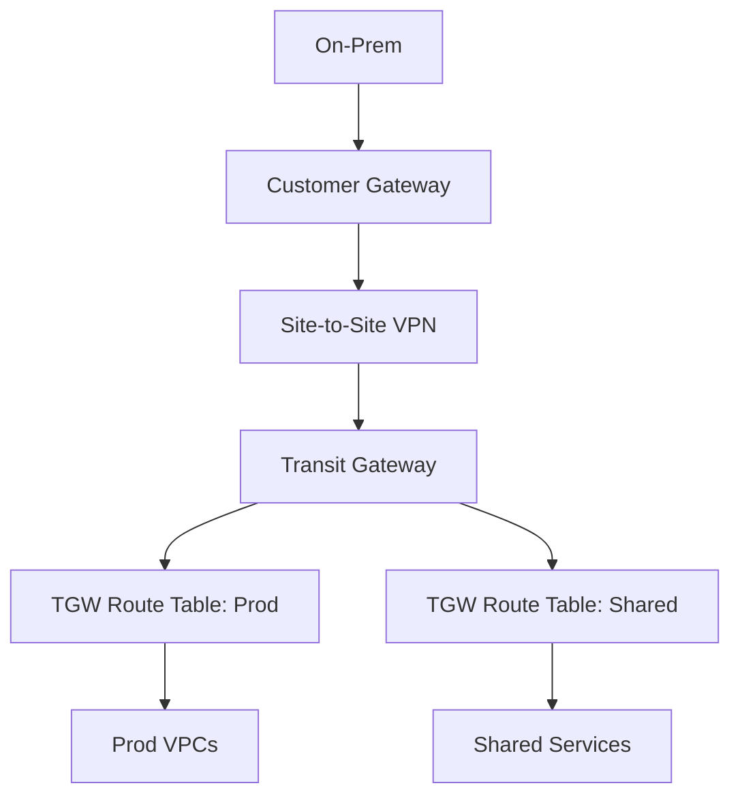

Kunci:

```txt
VPN attached to TGW tidak otomatis berarti semua VPC bisa bicara ke on-prem.
TGW route table association dan propagation tetap menentukan reachability.
```

---

## 3. Dua Tunnel: Availability Primitive, Bukan Full Architecture

Setiap Site-to-Site VPN connection menyediakan dua tunnel.

Tujuannya:

- redundancy;
- maintenance AWS-side;
- failover;
- optional active/active traffic behavior jika routing mendukung;
- mengurangi single tunnel failure.

Tetapi dua tunnel tidak menyelesaikan semua masalah HA.

Contoh desain lemah:

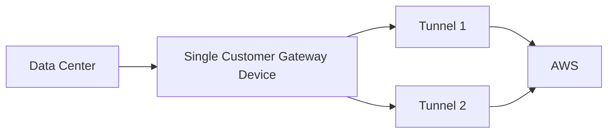

Jika CPE mati, dua tunnel sama-sama mati.

Desain lebih baik:

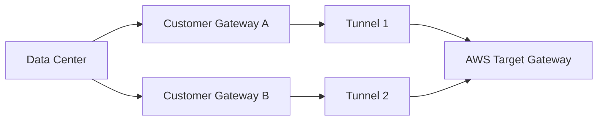

Lebih baik lagi jika:

- CPE berbeda power/rack;
- ISP berbeda;
- data center berbeda;
- path routing policy diuji;
- failover time masuk budget aplikasi.

---

## 4. IPsec and IKE Mental Model

Site-to-Site VPN memakai IPsec untuk membuat encrypted tunnel.

Secara konseptual:

1. Peers melakukan IKE negotiation.
2. Peers menyepakati cryptographic parameters.
3. Tunnel security association terbentuk.
4. Traffic private CIDR dienkripsi dan dikirim melalui tunnel.
5. Routing menentukan prefix mana yang masuk tunnel.

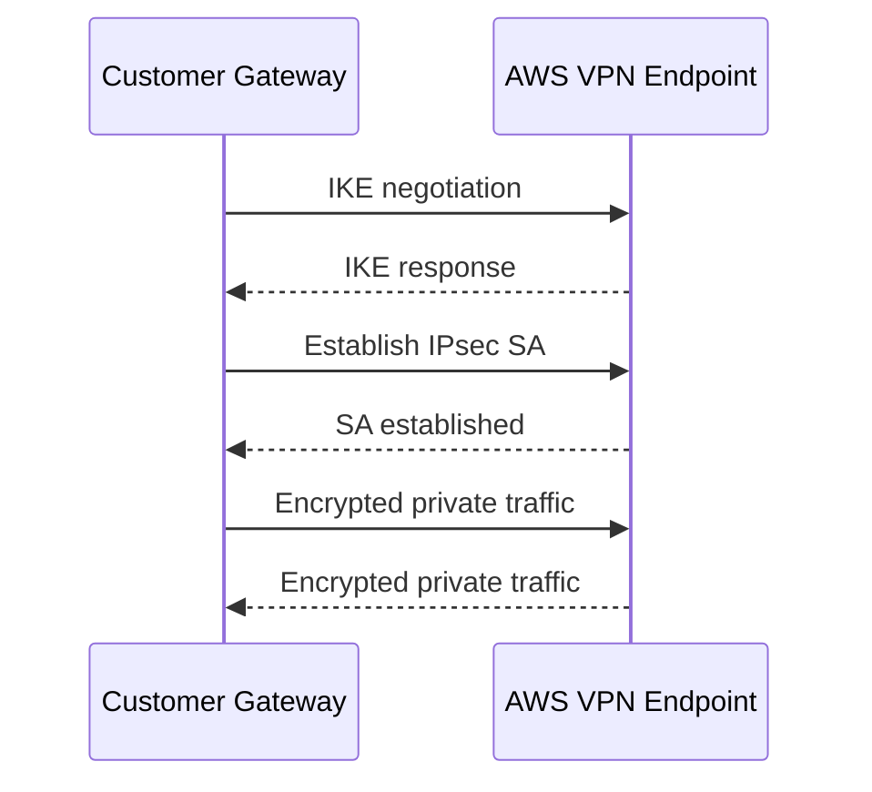

Tunnel option yang umumnya penting:

- IKE version;
- encryption algorithm;
- integrity algorithm;
- DH group;
- IKE lifetime;
- IPsec lifetime;
- rekey margin/time;
- DPD behavior;
- startup action;
- inside tunnel CIDR;
- pre-shared key or configured authentication material depending setup;
- BGP inside addresses if dynamic routing.

Prinsip:

```txt
Tunnel options harus distandarkan sebagai platform baseline.
Jangan biarkan tiap project memilih crypto/routing setting sendiri tanpa governance.
```

---

## 5. Routing Mode: Static vs Dynamic

Saat membuat VPN, routing bisa static atau dynamic.

### 5.1 Static routing

Static routing berarti kamu mendefinisikan route remote network secara eksplisit.

Cocok untuk:

- prefix sedikit;
- topology sederhana;
- perangkat tidak mendukung BGP;
- temporary connectivity;
- low-change environment.

Kelemahan:

- perubahan manual;
- failover kurang fleksibel;
- route drift;
- sulit scale;
- prefix ownership kurang ekspresif.

Contoh:

```txt
AWS route to 172.20.0.0/16 -> VPN connection
Customer route to 10.40.0.0/16 -> IPsec tunnel
```

### 5.2 Dynamic routing with BGP

Dynamic routing memakai BGP untuk pertukaran prefix.

Cocok untuk:

- enterprise network;
- multiple prefixes;
- multiple tunnels;
- failover otomatis;
- route preference;
- active/active pattern;
- TGW/VGW integration yang butuh route propagation.

Kelemahan:

- butuh ASN planning;
- route filtering wajib;
- salah advertise bisa fatal;
- convergence harus dipahami;
- BGP established tidak menjamin application healthy.

---

## 6. BGP in VPN: What Matters

BGP dalam Site-to-Site VPN bertugas mengiklankan reachability.

Yang penting:

- Customer ASN;
- AWS-side ASN;
- BGP peer IPs inside tunnel;
- advertised prefixes dari customer ke AWS;
- advertised prefixes dari AWS ke customer;
- route priority;
- failover behavior;
- route filtering;
- maximum prefix protection;
- local preference/AS path/weight di sisi customer jika digunakan.

BGP bukan firewall.

Jika prefix di-advertise, itu berarti network domain tahu cara menjangkaunya. Security tetap perlu SG/firewall/NACL/application authorization.

### Good BGP hygiene

```txt
Advertise only required prefixes.
Reject broad/unexpected prefixes.
Avoid 0.0.0.0/0 unless explicitly designed.
Monitor route count and route changes.
Version route policy in code/config backup.
```

---

## 7. VPN with Virtual Private Gateway

Pola VGW:

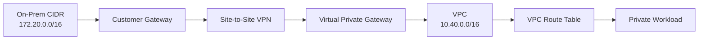

Checklist VPC-side:

- VGW attached ke VPC;
- VPN connection target ke VGW;
- VPC route table punya route ke on-prem CIDR via VGW;
- route propagation aktif jika digunakan;
- SG workload mengizinkan source on-prem;
- NACL mengizinkan request/response;
- on-prem route ke VPC CIDR via VPN;
- DNS path jika private names dipakai.

Common mistake:

```txt
VPN tunnel up, BGP up, tetapi VPC route table private subnet tidak punya route ke on-prem.
```

VPN “up” bukan berarti subnet tahu cara mengirim packet.

---

## 8. VPN with Transit Gateway

Pola TGW:

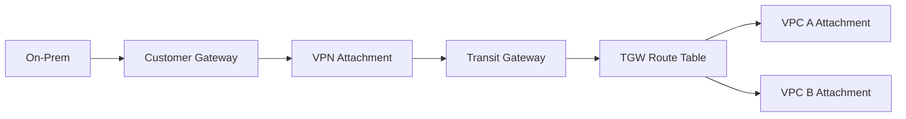

Checklist TGW-side:

- VPN attachment created;
- VPN attachment associated dengan TGW route table yang benar;
- on-prem prefixes propagated/static di TGW route table yang benar;
- VPC attachment propagated/static di route table yang dibaca VPN attachment;
- VPC route tables punya route ke on-prem CIDR via TGW;
- return route on-prem ke VPC CIDR via VPN;
- segmentation tidak accidentally full mesh;
- inspection route kalau traffic harus lewat firewall.

TGW adds power and risk.

Power:

- shared hybrid connection;
- segmentation;
- centralized inspection;
- multiple VPC/account.

Risk:

- misassociation;
- over-propagation;
- unintended transitivity;
- broad on-prem reachability;
- route table complexity.

---

## 9. Route Propagation and Association: The TGW Trap

Di TGW, dua konsep sering tertukar:

```txt
Association = route table mana yang digunakan attachment saat mengirim traffic masuk ke TGW.
Propagation = route attachment mana yang dimasukkan ke route table tertentu.
```

Misal:

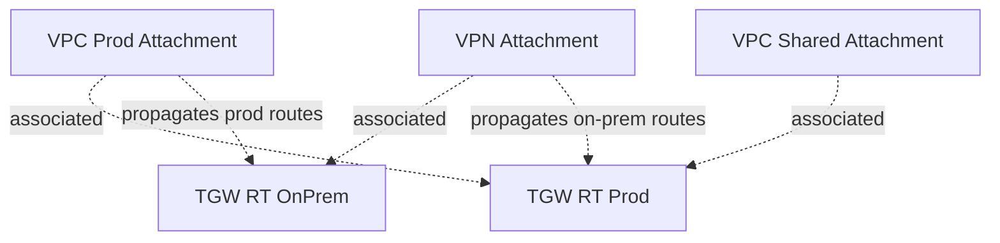

Traffic dari VPN masuk TGW memakai route table yang di-associate ke VPN attachment. Jika route table itu tidak punya route ke prod VPC, on-prem tidak bisa reach prod, walaupun prod route table punya route ke on-prem.

Return path juga harus ada.

Rule:

```txt
Untuk setiap desired flow, validate forward route dan return route di routing domain masing-masing.
```

---

## 10. Active/Passive vs Active/Active

### Active/passive

Satu tunnel/path utama, tunnel/path lain backup.

Kelebihan:

- lebih mudah reasoning;
- stateful firewall lebih mudah;
- traffic path deterministic;
- observability lebih sederhana.

Kekurangan:

- bandwidth backup idle;
- failover event lebih terasa;
- convergence harus benar.

### Active/active

Multiple tunnels/path membawa traffic bersamaan.

Kelebihan:

- aggregate capacity;
- better utilization;
- failure satu path mungkin lebih ringan.

Kekurangan:

- asymmetric risk;
- route policy lebih kompleks;
- ECMP behavior perlu dipahami;
- appliance stateful harus mendukung;
- troubleshooting lebih sulit.

Decision:

```txt
Gunakan active/passive jika determinism dan stateful inspection lebih penting.
Gunakan active/active jika capacity dan resilience dibutuhkan, dan network team mampu mengoperasikan route symmetry/ECMP/policy-nya.
```

---

## 11. VPN as Backup for Direct Connect

Pola umum:

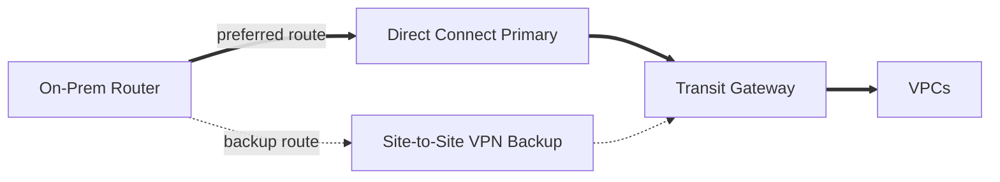

Masalah yang sering muncul:

- VPN backup tidak punya bandwidth cukup;
- BGP preference salah sehingga VPN dipakai primary;
- Direct Connect down tetapi route belum converge;
- firewall policy berbeda antara DX dan VPN;
- source NAT berbeda sehingga SG/firewall tidak match;
- DNS masih mengarah ke endpoint yang reachable hanya via primary path.

Checklist:

- define route preference explicitly;
- test forced DX failure;
- measure app error during convergence;
- verify backup bandwidth;
- verify encryption requirement;
- verify monitoring distinguishes DX vs VPN traffic;
- document expected degraded mode.

---

## 12. Private IP VPN over Direct Connect

Beberapa organisasi ingin IPsec encryption tetapi tidak ingin transport VPN berjalan lewat public internet. Dalam pola tertentu, VPN bisa dipakai bersama Direct Connect sehingga traffic IPsec memakai private/dedicated connectivity.

Conceptual model:


Kenapa dipakai:

- compliance butuh IPsec;
- private transport lebih predictable;
- ingin encryption overlay;
- mengurangi exposure ke public internet path.

Trade-off:

- lebih kompleks;
- routing dan BGP layer bertambah;
- troubleshooting butuh melihat DX dan VPN state;
- cost dan operational ownership bertambah.

---

## 13. Inside Tunnel CIDR

Setiap tunnel punya alamat inside untuk routing/BGP antara customer gateway dan AWS VPN endpoint.

Kesalahan umum:

- inside CIDR overlap dengan network internal;
- alamat inside reuse tidak terkontrol;
- dokumentasi tunnel IP hilang;
- BGP peer IP salah;
- firewall tidak mengizinkan control traffic.

Prinsip:

```txt
Inside tunnel addressing harus dikelola seperti infrastructure IP, bukan random wizard output.
```

Gunakan IPAM internal atau registry:

```yaml
vpn_tunnels:
  connection: prod-dc-a-to-tgw
  tunnel_1_inside: 169.254.x.x/30
  tunnel_2_inside: 169.254.y.y/30
  customer_asn: 65010
  aws_asn: 64512
  advertised_customer_prefixes:
    - 172.20.0.0/16
  advertised_aws_prefixes:
    - 10.40.0.0/16
```

---

## 14. Security Groups, NACLs, and VPN

VPN tidak bypass VPC security.

Traffic dari on-prem ke EC2 tetap harus lewat:

- VPC route table;
- subnet NACL;
- ENI Security Group;
- host firewall/app listener;
- load balancer rules jika lewat LB;
- application auth.

Contoh issue:

```txt
On-prem client 172.20.10.50 -> EC2 10.40.5.20:443
VPN tunnel up.
Route exists.
But EC2 SG allows only 10.40.0.0/16, not 172.20.0.0/16.
Result: timeout.
```

Debugging jangan berhenti di “tunnel up”.

---

## 15. NAT and VPN

VPN biasanya menghubungkan private CIDR. Jika CIDR overlap, routing ambiguity muncul.

Options:

- renumber one side;
- NAT translation di customer gateway/firewall;
- private NAT Gateway pattern di AWS;
- expose service via PrivateLink;
- proxy/jump service;
- avoid full connectivity.

Contoh NAT mapping:

```txt
On-prem real: 10.0.0.0/16
On-prem translated to AWS: 172.31.100.0/24
AWS VPC: 10.0.0.0/16
```

Caveat:

- logs melihat translated IP;
- SG/firewall harus pakai translated source;
- app allowlist perlu update;
- reverse flow mapping harus konsisten;
- troubleshooting lebih sulit;
- DNS harus return translated/reachable address sesuai source domain.

---

## 16. DNS with VPN

VPN hanya memberi packet path. DNS harus tetap dirancang.

Use case:

- on-prem client resolve AWS private hosted zone;
- AWS workload resolve on-prem internal domain;
- app memakai split-horizon names;
- private endpoint names harus resolve ke private IP.

Pattern:

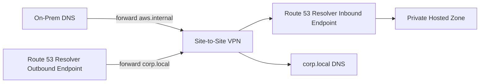

Checklist:

- allow UDP/TCP 53 through firewall;
- inbound/outbound endpoint ENIs in multiple AZ;
- conditional forwarding rules correct;
- private hosted zone associated to right VPC;
- Resolver rule shared if multi-account;
- DNS query logs enabled for critical zones;
- TTL appropriate for failover/change.

---

## 17. Firewall Rules for VPN

Firewall rules dibutuhkan di beberapa titik:

### Customer edge firewall

- allow IKE/IPsec control and data traffic to AWS VPN endpoints;
- allow BGP session if required;
- allow private CIDR flows sesuai policy;
- deny unexpected prefixes/ports;
- log drops.

### AWS-side VPC controls

- route table to target gateway/TGW;
- SG allow source CIDR;
- NACL allow request/response;
- Network Firewall/GWLB if inspection path;
- endpoint/resource policy if accessing AWS services privately.

### Enterprise internal firewall

- allow source app subnet to reach customer gateway;
- allow return flow;
- ensure no hidden NAT breaks policy;
- ensure routing to AWS CIDR points to VPN edge.

---

## 18. Monitoring Signals

Monitor at least:

| Signal | Meaning |
|---|---|
| Tunnel state | Tunnel up/down |
| BGP status | Route exchange state |
| TunnelDataIn / TunnelDataOut | Traffic volume per tunnel |
| Packet drops/errors | Transport/tunnel issues |
| Route table changes | Propagation/static route drift |
| BGP advertised route count | Route leak or missing route |
| Firewall allow/deny | Policy path |
| VPC Flow Logs | AWS ENI-level accepted/rejected metadata |
| Application dependency latency | User-visible impact |
| DNS query logs | Name resolution path |

Alerting principle:

```txt
Alert on loss of redundancy before total outage.
```

Bad alert:

```txt
Only alert when both tunnels are down.
```

Better:

```txt
Alert when one tunnel down for > N minutes.
Alert when BGP route count changes unexpectedly.
Alert when traffic shifts to backup path.
Alert when app dependency latency/error spikes after tunnel event.
```

---

## 19. Production Runbook: VPN Down

### Symptom

```txt
On-prem cannot reach AWS private service.
```

### Step 1 — Define scope

- One app or all apps?
- One VPC or all VPCs?
- One site or all sites?
- One tunnel or both tunnels?
- New connections only or existing too?
- DNS failure or TCP failure?

### Step 2 — Check tunnel state

- Tunnel 1 up/down?
- Tunnel 2 up/down?
- Since when?
- Any maintenance/change?
- Does customer gateway show same state?

### Step 3 — Check BGP/static routes

- BGP established?
- Expected prefixes received?
- Expected prefixes advertised?
- Route count changed?
- Static route exists?
- TGW/VGW route propagation changed?

### Step 4 — Check AWS route path

- TGW route table has route to on-prem?
- VPN attachment associated to correct route table?
- VPC attachment propagated to correct route table?
- VPC route table has route to on-prem via TGW/VGW?
- Return path exists?

### Step 5 — Check policy

- Security Group allows on-prem CIDR?
- NACL allows request/response?
- Firewall allows flow?
- Any recent rule change?
- Any NAT translation mismatch?

### Step 6 — Check DNS

- Name resolves correctly from on-prem?
- Name resolves correctly from AWS?
- Conditional forwarding working?
- Resolver endpoint reachable?

### Step 7 — Check application

- TLS handshake?
- Load balancer target healthy?
- App listener up?
- Timeout/retry changed?
- Dependency saturation after failover?

### Step 8 — Remediate

- Bring up backup tunnel/path;
- rollback route/firewall change;
- re-advertise missing prefix;
- force traffic to healthy path;
- disable bad propagation;
- fail over app if dependency unavailable;
- document root cause.

---

## 20. Production Runbook: Tunnel Up, App Timeout

This is the most common painful case.

Tunnel up means only the tunnel is up.

Checklist:

```txt
[ ] DNS result is expected private IP
[ ] Source route to destination exists
[ ] Destination route back to source exists
[ ] TGW/VGW route tables correct
[ ] SG allows source CIDR/port
[ ] NACL allows request + ephemeral response
[ ] Firewall sees both directions
[ ] No asymmetric routing
[ ] Load balancer target healthy
[ ] App binds correct interface/port
[ ] TLS/SNI/cert valid
[ ] Timeout/retry not too aggressive
```

Use packet-level thinking:

```txt
SYN leaves source?
SYN reaches AWS ENI?
SYN-ACK returns?
ACK completes?
TLS starts?
HTTP request leaves?
HTTP response returns?
```

VPC Flow Logs can confirm ENI-level accept/reject metadata, but cannot replace packet capture for full payload/TCP details.

---

## 21. Failover Testing

Do not call VPN resilient until tested.

Test cases:

1. Tunnel 1 down, Tunnel 2 remains up.
2. Tunnel 2 down, Tunnel 1 remains up.
3. Customer gateway primary fails.
4. ISP/provider path fails.
5. Direct Connect primary fails and VPN backup takes over.
6. BGP route withdrawn.
7. Wrong route accidentally advertised.
8. Security appliance fails.
9. DNS resolver endpoint AZ unavailable.
10. High throughput during failover.

Measure:

- tunnel state transition time;
- BGP convergence time;
- application error rate;
- p95/p99 latency;
- dropped connections;
- retry storm;
- backlog growth;
- manual operator action required;
- whether alerts fired correctly.

Failure test output should be a table:

| Scenario | Expected | Observed | Gap | Owner | Fix |
|---|---|---|---|---|---|
| Tunnel 1 down | traffic moves to tunnel 2 within X | Y | ... | Network | ... |

---

## 22. Configuration as Code

VPN configuration should not live only in console screenshots.

Represent:

- customer gateway resource;
- VPN connection;
- tunnel options where managed;
- TGW/VGW attachment;
- route table association;
- route propagation/static routes;
- VPC route table routes;
- security group rules;
- Resolver rules if DNS involved;
- alarms/dashboards;
- tags/ownership.

Example IaC design structure:

```txt
network/
  hybrid/
    customer-gateways/
      dc-a.yaml
      dc-b.yaml
    vpn-connections/
      prod-dc-a-to-tgw.yaml
    transit-gateway-routes/
      prod.yaml
      shared.yaml
      onprem.yaml
    resolver-rules/
      corp-local.yaml
    alarms/
      vpn-tunnels.yaml
```

Diff review should answer:

```txt
What new prefix becomes reachable?
From where?
To where?
Through which path?
With which policy?
```

---

## 23. Route Leak Prevention

Route leak examples:

- on-prem advertises `0.0.0.0/0` accidentally;
- AWS advertises all VPC CIDRs to network that should see only one service;
- prod route table receives nonprod prefix;
- partner VPN receives corporate internal routes;
- backup path becomes transit for unrelated traffic.

Prevention:

- prefix allowlist;
- max-prefix limit;
- route map/filter;
- TGW route table segmentation;
- no automatic propagation to all route tables;
- static blackhole for forbidden prefixes when useful;
- route diff alarm;
- periodic route audit;
- explicit partner/customer route contract.

Rule:

```txt
BGP should exchange only what the relationship explicitly permits.
```

---

## 24. VPN Performance Considerations

VPN performance is affected by:

- tunnel throughput characteristics;
- packet size/MTU;
- encryption overhead;
- customer gateway CPU;
- internet/provider path;
- packet loss;
- TCP window/parallelism;
- number of tunnels/connections;
- TGW ECMP if used/supported in design;
- application protocol behavior.

Software engineer implication:

- one large TCP stream may not saturate available aggregate capacity;
- bulk transfer should use parallelism/chunking;
- chatty synchronous RPC suffers from latency;
- retry storms after packet loss can make outage worse;
- queue/backpressure design matters.

Do not measure VPN using only ping.

Measure:

- realistic payload;
- realistic concurrency;
- p95/p99 latency;
- retransmissions;
- sustained throughput;
- application success rate;
- failover behavior under load.

---

## 25. Security Baseline

Minimum production baseline:

1. Use strong tunnel options compatible with AWS and device policy.
2. Prefer dynamic routing with strict filtering for enterprise use.
3. No broad prefix advertisement unless intentionally approved.
4. No default route propagation without architectural review.
5. SG rules scoped to required on-prem CIDRs and ports.
6. Firewall logs enabled for hybrid flows.
7. VPN resource tags identify owner, environment, site, purpose.
8. Tunnel state and BGP state alarms configured.
9. Config stored in version control or formal network config system.
10. Rotation/change process for authentication material.
11. Quarterly failover test.
12. Incident runbook tested.

---

## 26. Design Examples

### 26.1 Small single-VPC migration

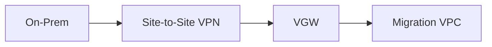

Use:

- VGW;
- static routes or BGP;
- simple route propagation;
- strict SG;
- limited prefix set.

Avoid turning this into enterprise hub by accident.

### 26.2 Multi-account landing zone

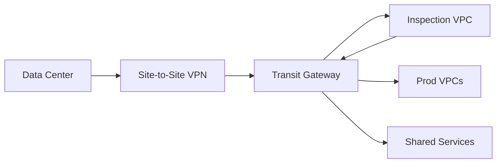

Use:

- TGW VPN attachment;
- multiple TGW route tables;
- explicit propagation;
- centralized inspection if required;
- route contracts.

### 26.3 Direct Connect primary, VPN backup

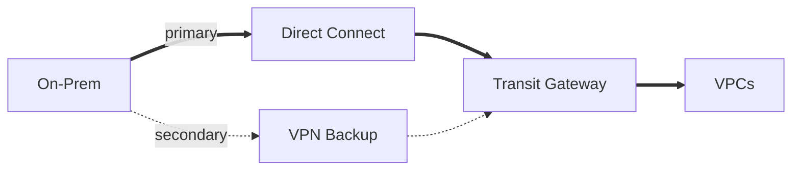

Use:

- BGP preference;
- backup capacity test;
- tunnel alarms;
- failover game day.

---

## 27. Troubleshooting Decision Tree

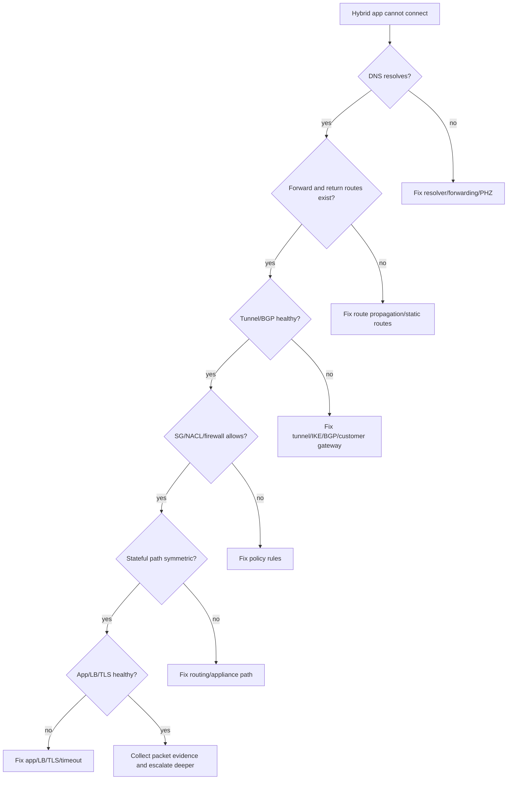

---

## 28. Checklist Before Go-Live

```txt
[ ] Customer gateway device HA reviewed
[ ] Two tunnels configured and monitored
[ ] BGP/static routing selected intentionally
[ ] Prefixes approved and documented
[ ] Route filters applied on customer side
[ ] TGW/VGW route propagation validated
[ ] VPC route tables updated
[ ] Return routes validated
[ ] SG/NACL rules scoped correctly
[ ] Firewall policy deployed and logged
[ ] DNS forwarding tested from both sides
[ ] Resolver endpoints deployed redundantly if used
[ ] Load test performed over VPN
[ ] Failover test performed
[ ] Backup path capacity verified
[ ] Alerts configured for tunnel/BGP/traffic shift
[ ] Runbook published
[ ] Owner tags applied
[ ] Change rollback plan documented
```

---

## 29. What Good Looks Like

A mature Site-to-Site VPN setup has these properties:

- Tunnel state and BGP state visible in dashboards.
- One tunnel failure triggers warning, not outage.
- Route advertisements are controlled by allowlist.
- TGW/VPC route tables are versioned and reviewed.
- App teams know source/destination/port contract.
- DNS path is tested from on-prem and AWS.
- Failover has measured convergence time.
- Backup bandwidth is sufficient for degraded operation.
- Logs can prove packet path.
- No one says “VPN is up, so it must be app problem” without evidence.

---

## 30. Ringkasan

AWS Site-to-Site VPN adalah salah satu primitive hybrid connectivity paling penting karena cepat, managed, encrypted, dan fleksibel.

Tetapi VPN production bukan hanya tunnel:

- Customer Gateway merepresentasikan sisi customer.
- Target gateway menentukan apakah desain VPC-centric, TGW-centric, atau Cloud WAN oriented.
- Dua tunnel memberi redundancy, tetapi customer-side HA tetap harus dirancang.
- Static routing sederhana; BGP lebih cocok untuk enterprise tetapi wajib route filtering.
- TGW association/propagation menentukan reachability aktual.
- VPN up tidak berarti route, DNS, SG, firewall, dan app sehat.
- Failover harus diuji dengan load realistis.
- Observability harus menangkap tunnel, BGP, route, DNS, flow, firewall, dan app metrics.

Part berikutnya akan membahas **AWS Direct Connect Foundations**: dedicated connectivity, connection, hosted connection, Direct Connect location, virtual interface, Direct Connect Gateway, dan kapan DX benar-benar layak dibanding VPN.

---

## References

- https://docs.aws.amazon.com/vpn/latest/s2svpn/VPC_VPN.html
- https://docs.aws.amazon.com/vpn/latest/s2svpn/SetUpVPNConnections.html
- https://docs.aws.amazon.com/vpn/latest/s2svpn/VPNRoutingTypes.html
- https://docs.aws.amazon.com/vpn/latest/s2svpn/tunnel-configure.html
- https://docs.aws.amazon.com/vpc/latest/tgw/tgw-vpn-attachments.html
- https://docs.aws.amazon.com/whitepapers/latest/aws-vpc-connectivity-options/aws-transit-gateway-vpn.html
- https://docs.aws.amazon.com/whitepapers/latest/aws-vpc-connectivity-options/aws-direct-connect-site-to-site-vpn.html
- https://docs.aws.amazon.com/whitepapers/latest/aws-vpc-connectivity-options/aws-direct-connect-aws-transit-gateway-vpn.html
