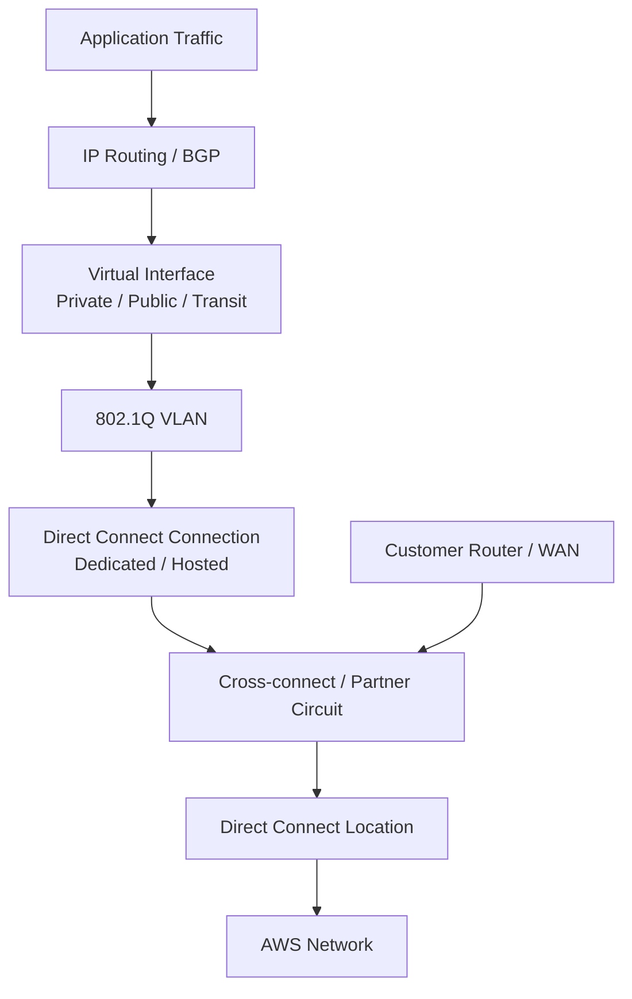
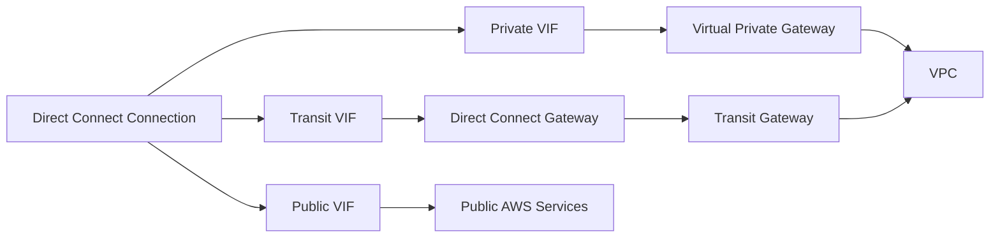
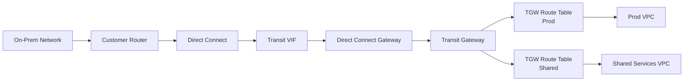
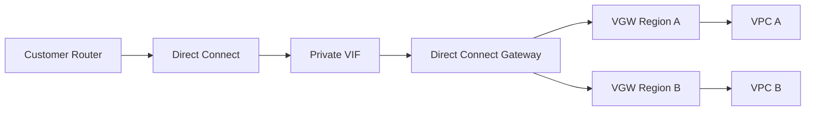
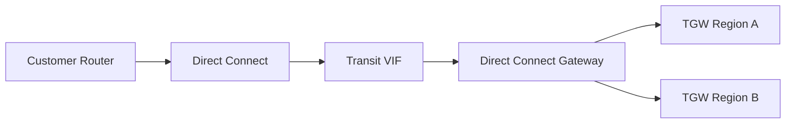
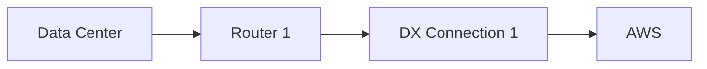
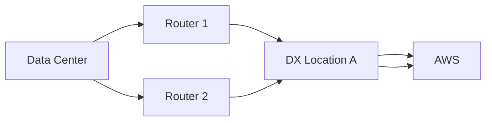
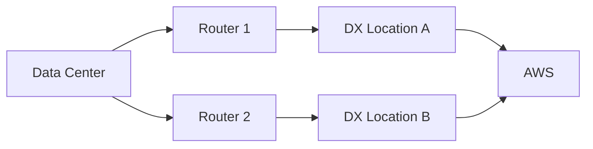
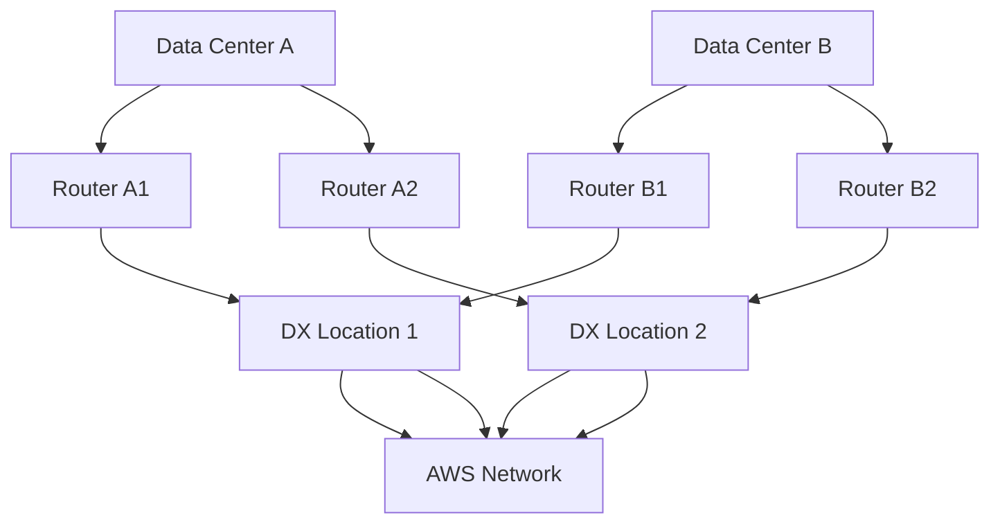
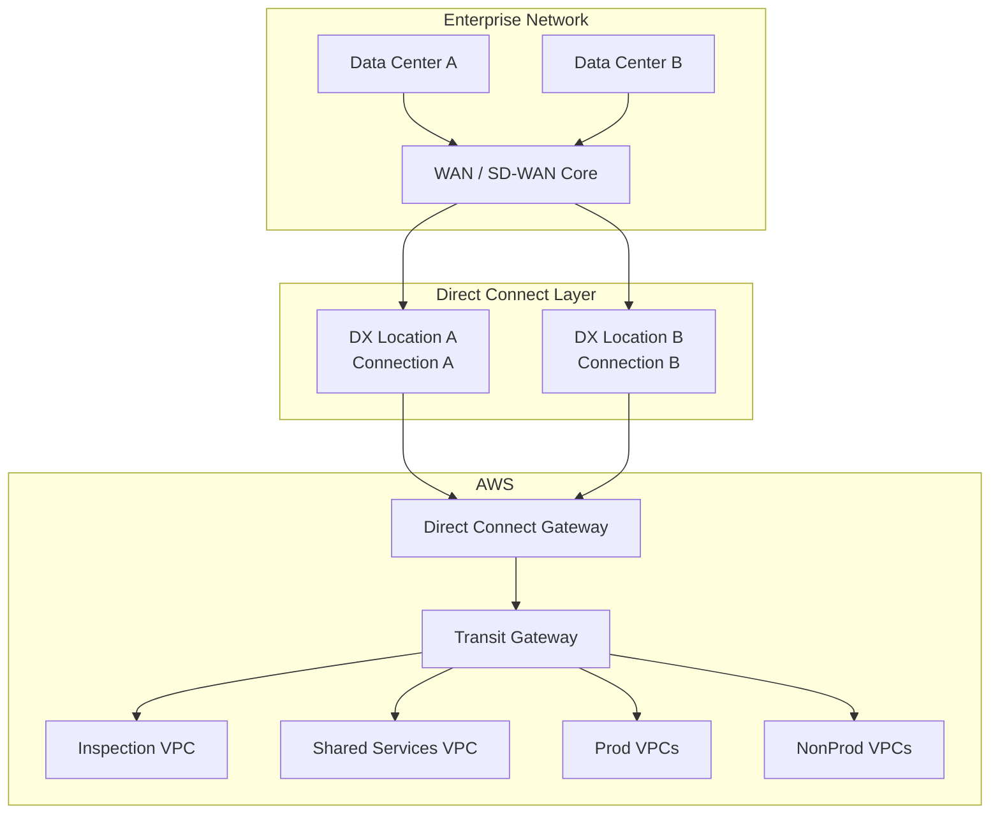

# Part 033 — AWS Direct Connect Foundations

AWS Direct Connect adalah private connectivity service untuk menghubungkan network kamu ke AWS melalui koneksi fisik/partner connectivity di Direct Connect location.

Kalimat singkatnya:

```txt
Site-to-Site VPN = encrypted overlay di atas internet/public transport.
Direct Connect = private underlay connectivity ke AWS edge/network.
```

Direct Connect bukan sekadar “jalur lebih cepat”. Direct Connect adalah keputusan arsitektur tentang:

- deterministic path;
- lower jitter;
- predictable throughput;
- private routing;
- enterprise WAN integration;
- hybrid data movement;
- regulatory boundary;
- backup path;
- routing authority;
- operational ownership antara cloud team, network team, telco/provider, dan security team.

Kalau Site-to-Site VPN terasa seperti membuat tunnel, Direct Connect terasa seperti menambahkan cabang baru ke backbone enterprise.

Bagian ini fokus pada fondasi. BGP detail, active/active, active/passive, route preference, dan failover akan dibahas di Part 034.

---

## 1. Problem yang Diselesaikan Direct Connect

Direct Connect dipakai ketika internet path tidak cukup baik untuk requirement produksi.

Contoh requirement nyata:

- aplikasi core banking butuh latency/jitter lebih stabil ke AWS;
- data warehouse on-prem mengirim batch besar ke S3 setiap malam;
- workload AWS harus query service legacy di data center;
- regulasi internal tidak mengizinkan traffic tertentu lewat public internet;
- VPN bandwidth menjadi bottleneck;
- branch network perlu connect ke AWS lewat WAN provider;
- hybrid DNS dan shared services butuh konektivitas yang predictable;
- disaster recovery butuh replication path yang lebih deterministic;
- enterprise sudah punya MPLS/SD-WAN dan ingin AWS menjadi network site.

Direct Connect tidak otomatis membuat arsitektur benar. Ia hanya memberi transport. Yang membuatnya benar adalah routing, redundancy, segmentation, security, observability, dan ownership.

---

## 2. Mental Model

Direct Connect terdiri dari beberapa layer.



Baca dari bawah:

```txt
Physical/partner circuit memberi link.
VLAN memisahkan virtual interface.
VIF menentukan target logical AWS.
BGP menentukan prefix mana lewat mana.
Application traffic hanya melihat IP reachability.
```

Kesalahan umum adalah menganggap Direct Connect sebagai “satu koneksi ke VPC”. Sebenarnya Direct Connect adalah physical/partner access ke AWS network. Setelah itu kamu membuat **virtual interface** untuk menentukan koneksi logis ke private VPC, public AWS service, atau Transit Gateway melalui Direct Connect gateway.

---

## 3. Komponen Utama

### 3.1 Direct Connect Location

Direct Connect location adalah tempat fisik/colocation tempat AWS memiliki network presence untuk Direct Connect.

Kamu tidak selalu harus memiliki data center di lokasi yang sama. Biasanya ada beberapa model:

- kamu colocated di fasilitas yang sama dengan Direct Connect location;
- telco/partner menyediakan last-mile dari data center kamu ke Direct Connect location;
- provider hosted connection menyediakan koneksi managed;
- enterprise WAN/SD-WAN provider membawa konektivitas ke AWS.

Desain location memengaruhi:

- latency;
- failure domain;
- provider dependency;
- physical diversity;
- SLA;
- operational escalation;
- cost;
- regulatory geography.

Jangan pilih location hanya karena “terdekat”. Pilih berdasarkan topology keseluruhan.

Checklist location:

```txt
[ ] Apakah location terhubung ke Region target dengan latency acceptable?
[ ] Apakah ada second location untuk high/maximum resiliency?
[ ] Apakah provider path benar-benar diverse?
[ ] Apakah customer router redundant?
[ ] Apakah cross-connect order dan LOA-CFA lifecycle jelas?
[ ] Apakah smart hands / remote hands tersedia?
[ ] Apakah escalation path provider diketahui?
```

---

### 3.2 Direct Connect Connection

Connection adalah koneksi fisik/logis dari customer/partner ke AWS Direct Connect endpoint.

Ada dua keluarga besar:

1. **Dedicated connection**
2. **Hosted connection**

#### Dedicated connection

Dedicated connection adalah physical Ethernet connection yang diasosiasikan dengan satu customer.

Cocok untuk:

- enterprise critical workload;
- bandwidth besar;
- kontrol lebih tinggi;
- kebutuhan LAG;
- kebutuhan MACsec pada supported dedicated connection;
- model resiliency formal.

Karakter:

- biasanya dipesan langsung melalui AWS console/API/CLI;
- perlu cross-connect dari customer/colocation/provider ke AWS port;
- bisa memiliki banyak virtual interface;
- bisa digabung dalam LAG jika syaratnya terpenuhi;
- operationally lebih dekat ke network engineering tradisional.

#### Hosted connection

Hosted connection disediakan melalui AWS Direct Connect Partner.

Cocok untuk:

- onboarding cepat;
- bandwidth lebih kecil atau intermediate;
- customer yang tidak punya colocation presence;
- cabang/region tertentu yang lebih mudah melalui provider;
- proof of concept yang tetap butuh private path.

Karakter:

- partner menyediakan kapasitas dan provisioning;
- bandwidth/upgrade/downgrade bergantung partner;
- operational dependency ke partner lebih besar;
- hosted connection umumnya memiliki batasan dibanding dedicated connection;
- cocok bila provider sudah menjadi WAN partner enterprise.

Prinsipnya:

```txt
Dedicated = lebih banyak kontrol, lebih banyak operational responsibility.
Hosted = lebih mudah dikonsumsi, lebih banyak dependency ke partner.
```

---

### 3.3 Cross-Connect, LOA-CFA, dan Physical Handoff

Dalam dedicated connection, setelah AWS menyetujui connection request, kamu mendapatkan dokumen seperti Letter of Authorization and Connecting Facility Assignment.

Di dunia nyata, ini berarti:

- AWS menyediakan informasi port/handoff;
- customer/colocation/provider melakukan cross-connect;
- fiber/copper/optics harus sesuai;
- link state harus naik;
- physical layer harus bersih sebelum BGP bisa dibahas.

Failure pada tahap ini sering bukan masalah AWS service, tetapi masalah physical chain:

```txt
Customer router port down
Provider cross-connect belum selesai
Optics mismatch
Wrong patch panel
Wrong LOA/CFA
VLAN tagging mismatch
LACP mismatch
Fiber polarity issue
Port admin down
```

Runbook awal Direct Connect selalu mulai dari layer bawah.

```txt
1. Is physical link up?
2. Is LAG up if used?
3. Is VLAN tagging correct?
4. Is BGP session established?
5. Are prefixes exchanged?
6. Is route installed in the correct table?
7. Is return path symmetric?
8. Is application policy/security allowing traffic?
```

---

### 3.4 Virtual Interface

Virtual interface atau VIF adalah logical interface di atas Direct Connect connection.

VIF menentukan apa yang kamu akses melalui Direct Connect.

Ada tiga tipe utama:

| VIF | Digunakan Untuk | Target Umum | Catatan |
|---|---|---|---|
| Private VIF | Private connectivity ke VPC | Virtual Private Gateway atau Direct Connect Gateway | VPC private CIDR reachability |
| Public VIF | Public AWS services | Public AWS service endpoints | Prefix public, policy ketat, bukan VPC-private path |
| Transit VIF | Multi-VPC via Transit Gateway | Direct Connect Gateway + Transit Gateway | Enterprise hub-scale pattern |

VIF bukan hanya label. VIF membawa:

- VLAN ID;
- BGP session;
- ASN;
- peer IP;
- advertised prefixes;
- target logical AWS resource;
- route policy;
- operational state.



---

## 4. Private VIF

Private VIF dipakai untuk private IP reachability ke VPC.

Ada dua common target:

- langsung ke Virtual Private Gateway;
- ke Direct Connect Gateway yang kemudian diasosiasikan dengan VGW.

Private VIF cocok bila:

- arsitektur relatif sederhana;
- VPC count kecil;
- connectivity target tidak membutuhkan TGW-scale segmentation;
- routing domain manageable;
- requirement multi-Region bisa dipenuhi via DX Gateway + VGW association.

Mental model private VIF:

```txt
Customer Router <--BGP over Private VIF--> AWS private routing domain --> VPC private CIDR
```

Private VIF bukan internet access. Ia adalah private route exchange.

---

## 5. Public VIF

Public VIF dipakai untuk mengakses public AWS service endpoints melalui Direct Connect, bukan internet provider kamu.

Contoh use case:

- S3 public endpoint access via Direct Connect;
- DynamoDB public endpoint access;
- public AWS APIs;
- public service endpoint dengan private transport preference.

Namun hati-hati:

```txt
Public VIF tidak sama dengan private VPC endpoint.
```

Public VIF tetap memakai public IP addressing dan public AWS prefixes. Traffic lewat Direct Connect, tetapi target service tetap public endpoint secara addressing.

Untuk workload modern, sering kali pilihan yang lebih baik adalah:

- Gateway VPC Endpoint untuk S3/DynamoDB dari VPC;
- Interface Endpoint/PrivateLink untuk AWS service tertentu;
- private API pattern;
- CloudFront private origin/security pattern untuk edge use case.

Public VIF masih relevan untuk enterprise hybrid access ke AWS public services dari on-prem network, tetapi harus dikendalikan ketat dengan route policy dan firewall policy.

---

## 6. Transit VIF

Transit VIF dipakai untuk menghubungkan Direct Connect ke Transit Gateway melalui Direct Connect Gateway.

Cocok untuk:

- multi-VPC routing;
- multi-account networking;
- shared services;
- enterprise hub-and-spoke;
- hybrid connectivity at scale;
- centralized inspection/egress architecture;
- regional hub design.

Pattern umum:



Transit VIF mengubah desain Direct Connect dari “connect to one VPC” menjadi “connect to network hub”.

Tapi konsekuensinya:

- routing policy harus lebih disiplin;
- TGW route tables menentukan segmentation;
- route leak lebih berbahaya;
- shared services path harus diuji;
- blackhole/static route guardrail perlu dipertimbangkan;
- on-prem route filtering harus formal.

---

## 7. Direct Connect Gateway

Direct Connect Gateway atau DXGW adalah global resource yang membantu menghubungkan Direct Connect VIF ke VPC/TGW dalam Region berbeda.

DXGW bukan router umum seperti Transit Gateway.

Mental model:

```txt
DXGW = bridge/control object untuk menghubungkan VIF dengan VGW/TGW associations.
TGW = regional transit router/hub dengan route tables dan segmentation.
```

DXGW sering muncul dalam dua pattern:

### 7.1 DXGW + VGW

Digunakan untuk private VIF menuju satu atau beberapa VPC via virtual private gateway associations.



### 7.2 DXGW + TGW

Digunakan untuk transit VIF menuju Transit Gateway.



Dalam production enterprise, DXGW + TGW adalah pattern paling umum untuk AWS landing zone multi-account.

---

## 8. Direct Connect vs Site-to-Site VPN

Jangan bandingkan sebagai “mana lebih bagus”. Bandingkan sebagai transport dengan failure/cost/security trade-off berbeda.

| Dimensi | Site-to-Site VPN | Direct Connect |
|---|---|---|
| Transport | Internet/public IP path | Private connectivity via DX location/partner |
| Encryption | IPsec by design | Tidak otomatis end-to-end encrypted; bisa pakai MACsec pada supported dedicated connection atau VPN overlay |
| Provisioning | Cepat | Lebih lama karena physical/partner process |
| Jitter | Bergantung internet path | Lebih predictable |
| Bandwidth | Terbatas oleh VPN/tunnel/device | Lebih cocok untuk throughput besar |
| Operational dependency | ISP + VPN device | DX location + partner/telco + customer router + AWS |
| Use case | Quick hybrid, backup, encrypted tunnel | Enterprise private backbone, high-volume hybrid |
| Failure mode | Tunnel/IKE/BGP/ISP | Physical link/cross-connect/BGP/provider/location |

Production pattern yang kuat sering menggabungkan keduanya:

```txt
Direct Connect = primary private transport.
Site-to-Site VPN = encrypted backup path atau encryption overlay.
```

---

## 9. Resiliency Models

Direct Connect harus didesain dengan asumsi physical failure akan terjadi.

Failure domain yang perlu dimodelkan:

- customer router port;
- customer router device;
- customer site;
- provider circuit;
- cross-connect;
- Direct Connect endpoint device;
- Direct Connect location;
- BGP session;
- VIF configuration;
- Region-level routing dependency;
- on-prem firewall policy;
- DNS dependency.

### 9.1 Single connection



Cocok untuk:

- dev/test;
- non-critical migration;
- low-risk workloads;
- temporary connectivity.

Tidak cocok untuk critical production.

### 9.2 Two connections, same location



Melindungi dari device/circuit tertentu, tetapi tidak dari complete location failure.

### 9.3 Two locations



Lebih kuat karena mengurangi dependency pada satu Direct Connect location.

### 9.4 Maximum resiliency

Untuk critical workload, model yang kuat biasanya memiliki:

- dua customer routers;
- dua atau lebih Direct Connect connections;
- dua Direct Connect locations;
- separate provider path;
- BGP policy yang jelas;
- VPN backup atau alternate path;
- failover test berkala;
- observability dari kedua sisi.



Prinsip production:

```txt
Jangan sebut redundant kalau kedua path melewati router, provider duct, colocation, atau routing policy yang sama.
```

---

## 10. Link Aggregation Group

LAG menggabungkan beberapa dedicated connections menjadi satu logical interface menggunakan LACP.

Kegunaan:

- meningkatkan aggregate bandwidth;
- menyederhanakan konfigurasi beberapa connection;
- memperlakukan beberapa link sebagai satu managed connection;
- mengatur minimum operational links.

Tapi LAG bukan pengganti site/location diversity.

Jika semua link dalam satu LAG terminate pada Direct Connect endpoint/location yang sama, maka LAG meningkatkan link-level capacity/resilience, bukan complete location resilience.

Gunakan LAG untuk:

- bandwidth scale;
- multiple physical links within same endpoint;
- operational grouping;
- capacity expansion.

Jangan gunakan LAG sebagai satu-satunya HA strategy untuk critical workloads.

---

## 11. Encryption Model

Direct Connect adalah private connectivity, bukan otomatis encrypted end-to-end di semua layer.

Pilihan encryption:

### 11.1 Application-layer encryption

Contoh:

- TLS dari client ke service;
- database TLS;
- mTLS service-to-service;
- application payload encryption.

Ini paling portable dan tetap bekerja walaupun transport berubah.

### 11.2 VPN over Direct Connect

Kamu bisa membuat encrypted overlay di atas Direct Connect.

Cocok ketika:

- policy mewajibkan IPsec;
- workload legacy tidak punya TLS kuat;
- compliance butuh network-layer encryption;
- Direct Connect dipakai sebagai private underlay tetapi encryption tetap wajib.

Konsekuensinya:

- overhead MTU;
- tunnel capacity;
- device CPU;
- route complexity;
- failover interaction.

### 11.3 MACsec

MACsec dapat mengenkripsi frame pada supported dedicated Direct Connect connection dan selected points of presence.

Cocok untuk:

- encryption dari corporate data center/colocation ke Direct Connect location;
- high-throughput link-layer encryption;
- dedicated connection environment.

Batas penting:

```txt
MACsec melindungi link tertentu, bukan otomatis semua path aplikasi sampai workload.
```

Tetap butuh model end-to-end security.

---

## 12. MTU and Jumbo Frames

Direct Connect dapat masuk ke pembahasan MTU karena hybrid traffic sering membawa payload besar: backup, replication, analytics, ML data movement.

Namun MTU harus end-to-end.

Prinsip:

```txt
Throughput besar tidak hanya ditentukan bandwidth link.
Throughput juga dipengaruhi MTU, TCP window, loss, latency, appliance, dan path symmetry.
```

Risiko:

- jumbo frames enabled di satu segment tetapi tidak di segment lain;
- VPN overlay menurunkan effective MTU;
- firewall silently drops fragments;
- PMTUD gagal karena ICMP diblokir;
- application melihat timeout, bukan error MTU eksplisit.

Checklist:

```txt
[ ] Test ping dengan DF bit / packet size sesuai platform.
[ ] Validasi MTU dari on-prem ke VPC target.
[ ] Validasi MTU pada VPN-over-DX jika ada.
[ ] Pastikan ICMP fragmentation-needed tidak diblokir secara membabi-buta.
[ ] Monitor retransmission/throughput, bukan hanya BGP up.
```

---

## 13. Cost Model

Direct Connect cost tidak hanya connection hour.

Pikirkan beberapa lapisan:

- Direct Connect port-hour atau hosted connection charge;
- data transfer out;
- cross-connect/colocation fee;
- provider last-mile circuit;
- router/firewall hardware;
- support contract;
- operations/smart hands;
- redundant paths;
- Transit Gateway data processing jika masuk TGW;
- inter-Region data transfer jika traffic crossing Region;
- monitoring/logging.

Cost trap:

```txt
Direct Connect terlihat mahal jika dilihat sebagai satu line item.
Tetapi bisa murah jika menggantikan internet egress besar, unstable VPN, atau operational incident cost.
```

Cost decision harus berbasis workload path:

| Traffic Pattern | Cost Concern |
|---|---|
| On-prem → AWS ingestion | Data transfer direction, service endpoint choice |
| AWS → on-prem replication | Data transfer out, DX data out rate |
| VPC → TGW → DX | TGW processing + DX |
| Cross-Region hybrid | Inter-Region + DX |
| Public AWS service via public VIF | Public service transfer semantics |
| Backup over DX + VPN | Appliance + tunnel overhead + DX |

---

## 14. Ownership Model

Direct Connect adalah cross-team system.

RACI sederhana:

| Area | Owner Utama | Supporting |
|---|---|---|
| DX connection order | Cloud/network platform | Finance/procurement |
| Cross-connect | Network/colocation/provider | Cloud platform |
| Customer router config | Network team | Security team |
| VIF/BGP parameters | Cloud + network | Platform team |
| TGW route tables | Cloud network platform | App teams |
| Prefix advertisement | Network architecture | Security/compliance |
| Firewall policy | Security/network | App owners |
| DNS forwarding | Platform/network | App owners |
| Monitoring | SRE/network ops | Cloud platform |
| Failover test | SRE/network/platform | Business owners |

Anti-pattern:

```txt
Cloud team membuat VIF, network team membuat BGP, security team membuat firewall,
tetapi tidak ada satu orang pun yang owns end-to-end packet path.
```

Production Direct Connect butuh packet-path owner.

---

## 15. Direct Connect Foundation Blueprint

Blueprint enterprise baseline:



Key decisions:

- Direct Connect connections terminate in different locations if critical;
- Transit VIF is used for TGW-scale connectivity;
- DXGW bridges DX to TGW;
- TGW route tables segment prod/nonprod/shared;
- inspection path is explicit, not accidental;
- DNS resolver endpoints are deployed in shared services VPC;
- route filters prevent prefix leaks;
- VPN backup exists for degraded mode;
- failover is tested.

---

## 16. Implementation Sequence

A practical sequence:

```txt
1. Define connectivity intent.
2. Define prefixes and routing domains.
3. Choose DX location/provider model.
4. Choose dedicated vs hosted connection.
5. Define resiliency target.
6. Order connection(s).
7. Complete cross-connect/partner provisioning.
8. Create DXGW if needed.
9. Create VIF(s).
10. Configure BGP on customer router.
11. Validate BGP session.
12. Validate route advertisements.
13. Validate AWS route table/TGW propagation.
14. Validate security/firewall policy.
15. Validate DNS path.
16. Run synthetic application tests.
17. Run failover tests.
18. Document runbook and owner map.
```

Do not start with “create VIF” before route domain is known. VIF without route strategy becomes future incident.

---

## 17. Readiness Checklist

### Business/architecture

```txt
[ ] Workloads that need Direct Connect are named.
[ ] Required bandwidth is estimated by traffic direction.
[ ] Latency/jitter objectives are defined.
[ ] Encryption requirement is explicit.
[ ] Regulatory boundary is understood.
[ ] RTO/RPO impact is understood.
```

### Network design

```txt
[ ] Prefixes are non-overlapping or overlap strategy exists.
[ ] AWS VPC/TGW route domains are documented.
[ ] On-prem route filters are defined.
[ ] Active/active or active/passive intent is chosen.
[ ] Backup path is defined.
[ ] DNS path is designed.
```

### Physical/provider

```txt
[ ] DX location selected.
[ ] Provider/cross-connect path selected.
[ ] Device diversity checked.
[ ] Location diversity checked.
[ ] LOA-CFA/cross-connect process owned.
[ ] Smart hands/escalation path known.
```

### AWS config

```txt
[ ] Connection created/accepted.
[ ] DXGW created if needed.
[ ] VIF type selected correctly.
[ ] VLAN/BGP parameters recorded.
[ ] TGW/VGW association configured.
[ ] Propagation/association verified.
```

### Operations

```txt
[ ] CloudWatch metrics monitored.
[ ] BGP state monitored on customer routers.
[ ] Provider circuit monitored.
[ ] Failover tested.
[ ] Runbook written.
[ ] Ownership table published.
```

---

## 18. Common Failure Modes

### 18.1 Link up, BGP down

Possible causes:

- wrong peer IP;
- wrong ASN;
- MD5/auth mismatch if configured;
- VLAN mismatch;
- ACL/firewall blocking TCP 179;
- wrong VIF config;
- customer router config bound to wrong subinterface.

### 18.2 BGP up, no application connectivity

Possible causes:

- prefix not advertised;
- route filtered;
- TGW route table association wrong;
- VPC route table missing route to TGW/VGW;
- security group/NACL/firewall denies traffic;
- DNS resolves to wrong endpoint;
- asymmetric return path;
- overlapping CIDR ambiguity.

### 18.3 One path never receives traffic

Possible causes:

- local preference/community policy;
- AS_PATH prepending;
- more-specific prefix on one path;
- route filtering;
- unequal prefix advertisement;
- route table preference;
- on-prem policy-based routing.

### 18.4 Failover works, failback breaks

Possible causes:

- stateful firewall sessions pinned to old path;
- asymmetric return traffic after failback;
- route flap dampening or convergence delay;
- DNS cache points to endpoint reachable only on one path;
- application connections not retrying.

### 18.5 Throughput lower than expected

Possible causes:

- single TCP flow limitation due to latency/window;
- MTU mismatch;
- packet loss/retransmission;
- firewall/router CPU;
- VPN overlay overhead;
- LAG hashing behavior;
- application not parallelizing;
- provider shaping.

---

## 19. Direct Connect Anti-Patterns

### Anti-pattern 1 — Single Direct Connect for critical production

Satu connection bukan HA. Ia hanya private path tunggal.

### Anti-pattern 2 — Redundant paper design, shared physical path

Dua circuits yang melewati duct/provider/location yang sama bukan true diversity.

### Anti-pattern 3 — All prefixes everywhere

Meng-advertise semua prefix ke semua route domain menciptakan blast radius besar.

### Anti-pattern 4 — No failover test

Failover yang belum pernah diuji adalah asumsi, bukan desain.

### Anti-pattern 5 — Treat Direct Connect as security boundary

Private path bukan authorization. Tetap butuh IAM, SG, NACL, firewall, endpoint policy, TLS, logging.

### Anti-pattern 6 — Using public VIF without route governance

Public VIF bisa membuka akses luas ke public AWS prefixes jika tidak difilter dengan baik.

### Anti-pattern 7 — Ignoring DNS

Connectivity IP up tetapi DNS forwarding salah tetap membuat aplikasi gagal.

---

## 20. Production Acceptance Criteria

Direct Connect layak disebut production-ready jika:

```txt
[ ] Semua critical workloads punya documented packet path.
[ ] Semua route domains punya prefix allowlist.
[ ] Redundancy diuji dengan planned failure.
[ ] CloudWatch + router telemetry menunjukkan link/BGP/traffic health.
[ ] Provider escalation path tercatat.
[ ] Security policy tidak bergantung pada “private link means trusted”.
[ ] DNS hybrid path diuji.
[ ] Capacity test dilakukan dengan traffic realistis.
[ ] Runbook bisa dijalankan oleh engineer on-call, bukan hanya network architect.
```

---

## 21. Minimal Lab Design

Walaupun Direct Connect fisik tidak selalu bisa dilab-kan murah, kamu bisa membuat simulation-level design.

Lab objective:

- memahami object model;
- menggambar route domain;
- membuat TGW/DXGW/VIF design plan;
- menulis BGP policy;
- membuat failure runbook.

Artifact lab:

```txt
/direct-connect-foundation
  topology.md
  prefixes.yml
  bgp-policy.md
  route-domain-matrix.md
  failover-runbook.md
  cost-model.xlsx-or-md
```

Contoh prefix file:

```yaml
on_prem:
  data_center_a:
    - 10.10.0.0/16
  data_center_b:
    - 10.20.0.0/16
aws:
  prod:
    - 10.100.0.0/16
  nonprod:
    - 10.110.0.0/16
  shared:
    - 10.120.0.0/16
advertisement_policy:
  on_prem_to_aws:
    prod: allow-prod-and-shared-only
    nonprod: allow-nonprod-and-shared-only
  aws_to_on_prem:
    shared: allow-dns-and-directory-only
```

The point is not Terraform first. The point is reachability contract first.

---

## 22. What Comes Next

Part 033 memberi fondasi objek dan topology.

Part 034 akan menjawab pertanyaan yang biasanya menentukan apakah Direct Connect berjalan stabil atau penuh incident:

- bagaimana BGP memilih path;
- bagaimana mendesain active/active;
- bagaimana mendesain active/passive;
- bagaimana menggunakan local preference communities;
- bagaimana prefix length dan AS_PATH memengaruhi traffic;
- bagaimana route filtering mencegah route leak;
- bagaimana failover harus diuji.

---

## 23. Sumber Resmi AWS

- AWS Direct Connect User Guide — What is Direct Connect?
- AWS Direct Connect dedicated and hosted connections
- AWS Direct Connect virtual interfaces and hosted virtual interfaces
- AWS Direct Connect gateways
- AWS Direct Connect Resiliency Toolkit
- Resilience in AWS Direct Connect
- Direct Connect link aggregation groups
- Encryption in AWS Direct Connect
- MAC Security in Direct Connect
