# Part 034 — Direct Connect Routing and BGP

Direct Connect foundation tanpa BGP literacy akan berhenti di “link up”.

Dalam hybrid production, yang menentukan traffic benar-benar lewat mana adalah:

- prefix yang di-advertise;
- prefix length;
- BGP attributes;
- AWS routing policy;
- customer router policy;
- VIF type;
- Direct Connect gateway association;
- Transit Gateway route table;
- VPC route table;
- firewall/security policy;
- failure state.

Direct Connect routing bukan soal menghafal BGP command. Yang penting adalah bisa menjawab:

```txt
Untuk setiap packet:
1. Siapa destination-nya?
2. Prefix mana yang match?
3. Route mana yang menang?
4. Next hop-nya ke mana?
5. Return path-nya lewat mana?
6. Apa yang terjadi saat link/path gagal?
```

Part ini membahas Direct Connect routing sebagai production system.

---

## 1. BGP Mental Model untuk Direct Connect

BGP pada Direct Connect adalah mekanisme exchange route antara customer router dan AWS.

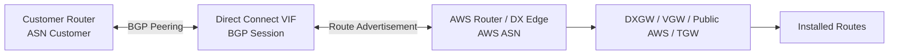

BGP menjawab dua pertanyaan:

1. Prefix apa yang reachable dari customer ke AWS?
2. Prefix apa yang reachable dari AWS ke customer?

BGP tidak menjawab:

- apakah security group membolehkan traffic;
- apakah firewall policy membolehkan traffic;
- apakah DNS resolve ke endpoint yang benar;
- apakah aplikasi listening;
- apakah stateful appliance menjaga symmetry.

Jadi BGP up bukan bukti aplikasi sehat.

---

## 2. Route Direction: Inbound vs Outbound

Dalam Direct Connect, biasakan membedakan dua arah:

### 2.1 On-prem → AWS

Customer router memilih route menuju prefix AWS.

Faktor umum:

- prefix AWS yang diterima dari AWS;
- local preference internal customer;
- AS_PATH;
- MED jika digunakan dalam domain tertentu;
- route-map/policy;
- static route override;
- SD-WAN policy;
- firewall/PBR.

### 2.2 AWS → On-prem

AWS memilih route menuju prefix customer.

Faktor umum:

- prefix yang customer advertise ke AWS;
- prefix length;
- BGP communities untuk local preference jika digunakan;
- AS_PATH prepending;
- route propagation/association pada TGW/VGW/DXGW;
- allowed prefixes pada association tertentu;
- route table conflict;
- static route/blackhole pada TGW.

Jangan pakai satu kebijakan untuk dua arah tanpa berpikir. Active/passive bisa berbeda arah jika policy tidak konsisten.

---

## 3. Prefix Length Is a Contract

Routing selalu mulai dari prefix match.

Prinsip paling penting:

```txt
More specific prefix wins before many other preference decisions.
```

Contoh:

```txt
Path A advertises 10.10.0.0/16
Path B advertises 10.10.20.0/24

Traffic to 10.10.20.15 will prefer Path B.
```

Ini bisa disengaja atau berbahaya.

Use case yang disengaja:

- steer traffic untuk branch tertentu;
- isolate migration subnet;
- temporary failover;
- carve out shared services path.

Risiko:

- accidental hijack;
- asymmetric path;
- route leak;
- blackhole subset;
- difficult debugging karena aggregate route terlihat benar.

Production rule:

```txt
Jangan advertise more-specific prefix tanpa change record dan owner.
```

---

## 4. VIF Type and Routing Scope

Routing behavior berbeda menurut VIF.

| VIF Type | Route Scope | Common Target | Risk Utama |
|---|---|---|---|
| Private VIF | VPC private routing | VGW/DXGW+VGW | Terlalu banyak VPC association tanpa filter |
| Transit VIF | TGW-scale routing | DXGW+TGW | Route leak antar segment |
| Public VIF | AWS public prefixes | Public AWS services | Public prefix exposure/filtering |

### 4.1 Private VIF routing

Private VIF cocok untuk private VPC connectivity.

Path sederhana:

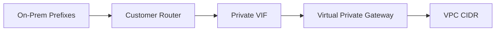

Risk:

- VPC route table lupa route balik ke VGW/TGW;
- propagated route tidak di-enable;
- overlap CIDR;
- security group/NACL deny;
- no segmentation if all VPCs share same domain.

### 4.2 Transit VIF routing

Transit VIF cocok untuk hub-and-spoke.

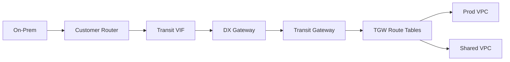

Risk:

- wrong TGW route table association;
- propagation into wrong segment;
- static route overrides dynamic route;
- blackhole route too broad;
- shared services reachable from unauthorized domain;
- on-prem aggregate route leaks into AWS.

### 4.3 Public VIF routing

Public VIF adalah route exchange ke public AWS service prefixes.

Risk:

- accepting more AWS public routes than needed;
- advertising public customer prefixes too broadly;
- firewall rules too permissive;
- assuming public VIF is private addressing;
- mixing internet and DX public path without clear policy.

Public VIF harus diperlakukan sebagai controlled public routing, bukan internal trust zone.

---

## 5. BGP Attributes yang Paling Relevan

BGP punya banyak attributes, tetapi untuk Direct Connect production, beberapa paling sering muncul.

### 5.1 Local Preference

Local preference biasanya digunakan di dalam satu AS untuk memilih outbound path.

Dalam konteks AWS Direct Connect, AWS mendukung BGP communities yang dapat dipakai untuk mengatur local preference di sisi AWS untuk route customer pada public/private/transit context tertentu sesuai dokumentasi Direct Connect.

Mental model:

```txt
Higher local preference = path lebih disukai dalam domain yang menggunakannya.
```

Use case:

- active/passive inbound from AWS to customer;
- prefer local DX location;
- steer route ke primary data center;
- maintain backup path without withdrawing route.

### 5.2 AS_PATH

AS_PATH menunjukkan jalur AS yang dilalui route. Secara umum, shorter AS_PATH lebih disukai jika faktor sebelumnya setara.

Use case:

- AS_PATH prepending untuk membuat path tampak kurang disukai;
- active/passive steering;
- backup path advertisement.

Caution:

```txt
AS_PATH prepending bukan magic. Jika local preference atau prefix length berbeda, AS_PATH mungkin bukan deciding factor.
```

### 5.3 MED

MED memberi hint kepada neighbor untuk memilih entry point tertentu.

Dalam enterprise, MED sering kurang deterministic lintas provider/domain karena policy bisa berbeda. Gunakan hanya jika kedua sisi sepakat.

### 5.4 Communities

BGP communities adalah tag yang dibawa bersama route untuk memberi sinyal policy.

Dalam Direct Connect, communities relevan untuk:

- local preference;
- route scope untuk public prefixes;
- traffic engineering;
- operational readability.

### 5.5 Prefix length

Prefix length bukan attribute BGP dalam arti yang sama, tetapi dalam route selection ia sangat dominan.

```txt
10.0.1.0/24 lebih spesifik daripada 10.0.0.0/16.
```

Jangan lupa: more-specific route sering mengalahkan desain preference yang kamu kira berlaku.

---

## 6. Active/Active Design

Active/active berarti beberapa path membawa traffic secara bersamaan.

Motivasi:

- menggunakan aggregate capacity;
- mengurangi idle expensive link;
- mempercepat failover karena semua path sudah aktif;
- memvalidasi kedua path setiap hari melalui real traffic.

Pattern:

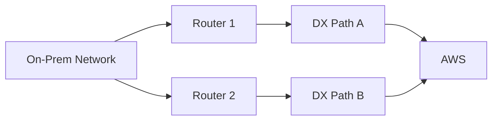

Syarat mental:

```txt
Active/active bukan sekadar dua BGP session up.
Active/active berarti policy memungkinkan traffic memakai lebih dari satu path secara sadar.
```

Design checks:

```txt
[ ] Prefix advertisement equivalent where ECMP/load-sharing expected.
[ ] Customer side supports desired load sharing.
[ ] AWS side route choice understood.
[ ] Stateful firewall path symmetry addressed.
[ ] Failure of one path does not overload remaining path.
[ ] Monitoring can detect imbalance.
```

### 6.1 Active/active with equal policy

Jika dua path advertise prefix yang sama dengan preference setara, traffic bisa dibagi sesuai ECMP/load-sharing capability pada domain terkait.

Risiko:

- hashing tidak merata untuk flow tertentu;
- single large flow tidak otomatis split;
- stateful firewalls bisa melihat asymmetric return path;
- troubleshooting lebih sulit karena path tidak tunggal.

### 6.2 Active/active by prefix split

Contoh:

```txt
Path A preferred for 10.10.0.0/17
Path B preferred for 10.10.128.0/17
Both paths also advertise 10.10.0.0/16 as backup aggregate.
```

Keuntungan:

- deterministic steering;
- easier capacity planning;
- still has backup aggregate.

Risiko:

- route table lebih kompleks;
- accidental more-specific leak;
- failover capacity harus cukup.

---

## 7. Active/Passive Design

Active/passive berarti satu path menjadi primary, path lain standby.

Motivasi:

- stateful firewall simplicity;
- deterministic route;
- easier audit;
- compliance requiring primary site;
- backup circuit cost model;
- app assumptions around source IP/path.

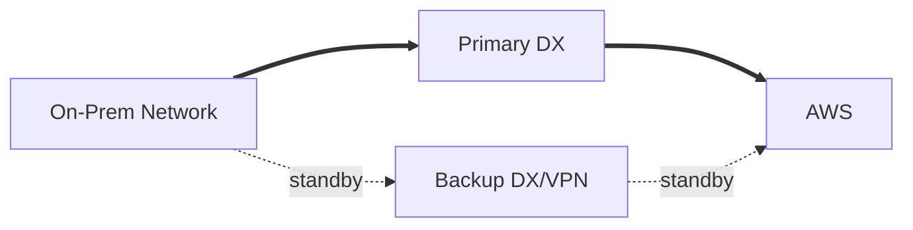

Path standby harus tetap diuji. Standby yang tidak diuji biasanya gagal saat dibutuhkan.

### 7.1 Techniques

Common techniques:

- local preference difference;
- AS_PATH prepending on backup;
- advertise less-specific aggregate on backup;
- conditional route advertisement;
- BFD/keepalive-driven withdrawal where supported by router design;
- static route priority in internal network;
- SD-WAN policy.

### 7.2 Failure behavior

Active/passive design harus menjawab:

```txt
What fails over?
- link physical down?
- BGP down?
- route withdrawn?
- application health degraded but BGP still up?
- firewall up but dropping packets?
- DNS target unhealthy?
```

BGP hanya mendeteksi routing adjacency/path issue. Ia tidak otomatis mendeteksi aplikasi rusak.

---

## 8. Direct Connect + VPN Backup

Common pattern:

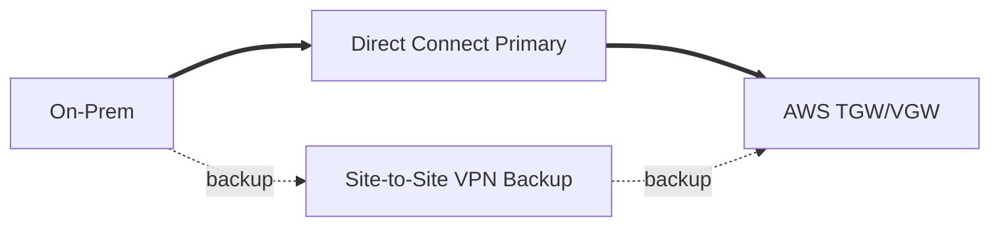

Use case:

- Direct Connect physical/location failure;
- provider maintenance;
- encrypted backup;
- temporary capacity during migration;
- additional resilience before second DX location is ready.

Routing principle:

```txt
DX prefix should be more preferred than VPN prefix during healthy state.
VPN route should become active when DX route is withdrawn or deprioritized.
```

Pitfalls:

- VPN tunnel bandwidth insufficient for failover load;
- MTU changes during failover;
- firewall state lost;
- asymmetric path between DX and VPN;
- AWS side route preference misunderstood;
- failover tested only with ping, not application traffic.

---

## 9. Route Filtering

Route filtering is not optional.

Every Direct Connect design should define:

- what customer prefixes can be advertised to AWS;
- what AWS prefixes can be accepted by customer;
- which prefixes belong to prod/nonprod/shared;
- whether default route is allowed;
- whether public prefixes are accepted;
- maximum prefix threshold;
- emergency blackhole route process;
- change approval for more-specific route.

Example allowlist:

```yaml
customer_to_aws:
  allowed:
    - 10.10.0.0/16   # data-center-a
    - 10.20.0.0/16   # data-center-b
    - 10.30.0.0/16   # shared-corp-services
  denied:
    - 0.0.0.0/0
    - 10.0.0.0/8
    - 172.16.0.0/12
    - 192.168.0.0/16
aws_to_customer:
  allowed:
    - 10.100.0.0/16  # aws-prod
    - 10.120.0.0/16  # aws-shared
  denied:
    - 0.0.0.0/0
```

Why deny broad RFC1918 aggregate?

Because advertising `10.0.0.0/8` can accidentally make AWS believe all corporate 10/8 is reachable through one path, even if actual ownership is fragmented.

---

## 10. TGW Route Tables and Direct Connect

When Direct Connect reaches AWS via Transit VIF + DXGW + TGW, BGP is only part of the path.

TGW route tables still decide attachment-to-attachment reachability.

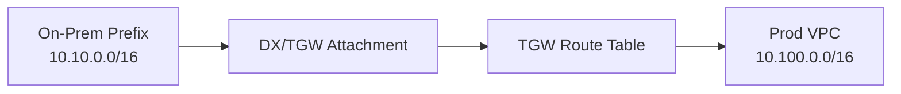

Checklist:

```txt
[ ] DX/TGW attachment associated with correct TGW route table.
[ ] On-prem routes propagated to intended route tables only.
[ ] VPC routes propagated/added back to DX side where intended.
[ ] Prod/nonprod route domains are separated.
[ ] Shared services route table has explicit allowed paths.
[ ] Blackhole routes exist where broad guardrails are needed.
[ ] VPC subnet route tables point to TGW for on-prem prefixes.
```

Common incident:

```txt
BGP shows on-prem route in AWS, but TGW route table does not propagate it to the VPC segment.
```

Or inverse:

```txt
VPC can send to on-prem, but on-prem never receives return route because AWS VPC prefix is not advertised back.
```

---

## 11. Asymmetric Routing

Asymmetric routing means request and response travel different paths.

Sometimes it is fine. With stateful firewalls, NAT, intrusion prevention, or connection tracking, it often breaks traffic.

Example:

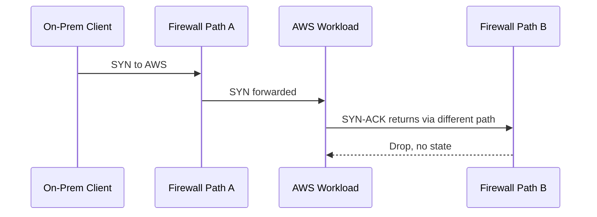

Symptoms:

- SYN retransmits;
- intermittent connectivity;
- one direction seen in logs;
- Flow Logs ACCEPT but app timeout;
- firewall logs drop return packets;
- works after route change, breaks after failover.

Mitigations:

- symmetric routing policy;
- appliance mode where relevant for TGW appliance insertion;
- path pinning by prefix;
- state synchronization between firewalls;
- active/passive instead of active/active for stateful zones;
- eliminate unnecessary middleboxes.

---

## 12. Failover Testing

Failover test must be designed before production.

Bad test:

```txt
Ping works after disabling link. Done.
```

Good test:

```txt
1. Establish baseline traffic and route state.
2. Record BGP routes from both sides.
3. Run representative application flows.
4. Fail primary path intentionally.
5. Measure convergence time.
6. Validate application retry/recovery.
7. Validate firewall/session behavior.
8. Validate DNS behavior if relevant.
9. Restore primary path.
10. Validate failback and path symmetry.
11. Compare metrics before/during/after.
```

Metrics:

- BGP session state;
- route count;
- traffic per connection/VIF;
- packet loss;
- latency;
- TCP retransmits;
- application error rate;
- firewall session/drop counters;
- TGW bytes in/out;
- VPN tunnel state if backup involved.

---

## 13. BGP Debugging Runbook

### 13.1 BGP session down

Check:

```txt
[ ] Physical connection/LAG status.
[ ] VLAN subinterface status.
[ ] Peer IP address.
[ ] Local/remote ASN.
[ ] BGP authentication if configured.
[ ] TCP/179 reachability.
[ ] ACL/firewall between router and DX edge.
[ ] VIF state in AWS.
[ ] Customer router logs.
```

### 13.2 BGP up, no prefixes received

Check:

```txt
[ ] AWS side route advertisement expected for VIF type.
[ ] Customer route policy is not filtering all prefixes.
[ ] Prefix limits not exceeded.
[ ] DXGW allowed prefixes/association config.
[ ] TGW route propagation status.
[ ] Public VIF prefix approval/scope if public.
```

### 13.3 Prefix received, traffic fails

Check:

```txt
[ ] Route installed in forwarding table, not only BGP table.
[ ] VPC subnet route table has return route.
[ ] TGW association/propagation correct.
[ ] SG/NACL/firewall allows traffic.
[ ] DNS resolves to reachable IP.
[ ] No overlapping CIDR ambiguity.
[ ] Return path uses expected route.
[ ] MTU/fragmentation not breaking flow.
```

### 13.4 Intermittent traffic

Check:

```txt
[ ] Equal-cost path hashing.
[ ] Stateful firewall symmetry.
[ ] Route flapping.
[ ] BGP timer instability.
[ ] Provider packet loss.
[ ] LAG member instability.
[ ] Application connection pool stale endpoints.
```

---

## 14. Route Change Safety

Direct Connect route changes can break many workloads at once.

Minimum change checklist:

```txt
[ ] Route diff prepared.
[ ] Prefix owner confirmed.
[ ] Blast radius identified.
[ ] Rollback route-map ready.
[ ] Monitoring dashboard open.
[ ] Application smoke tests ready.
[ ] Both AWS and customer route tables captured before change.
[ ] Maintenance window approved if needed.
[ ] Communication channel open with network/cloud/security/app owners.
```

Route changes should be treated like database schema migrations for enterprise network.

---

## 15. Production Patterns

### 15.1 Pattern A — Simple private VIF to one VPC

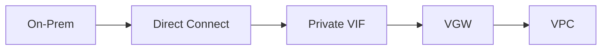

Use when:

- one VPC or simple environment;
- no multi-account hub;
- limited segmentation needs.

Avoid when:

- many VPCs;
- prod/nonprod shared routing complexity;
- centralized inspection required;
- cross-account landing zone scale.

### 15.2 Pattern B — Transit VIF to TGW

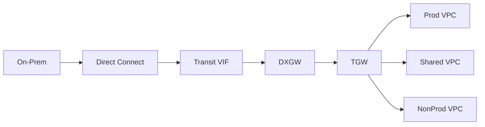

Use when:

- multi-account AWS;
- many VPCs;
- need route segmentation;
- hybrid shared services;
- central inspection.

### 15.3 Pattern C — Dual DX + VPN backup

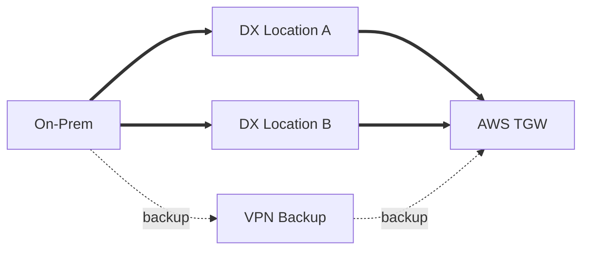

Use when:

- high availability;
- private primary path;
- internet/IPsec backup accepted;
- failover tested.

### 15.4 Pattern D — Prefix-split active/active

```txt
AWS to on-prem:
- DC-A advertises 10.10.0.0/17 high preference
- DC-B advertises 10.10.128.0/17 high preference
- both advertise 10.10.0.0/16 lower preference as backup
```

Use when:

- capacity sharing needed;
- deterministic routing preferred;
- ops team comfortable with route policy.

---

## 16. Security Considerations

Direct Connect routing is part of security architecture.

Questions:

```txt
[ ] Can on-prem reach all VPCs or only specific ones?
[ ] Can nonprod reach corporate prod services?
[ ] Can AWS workloads reach all RFC1918 corporate network?
[ ] Is default route from AWS to on-prem allowed?
[ ] Are DNS resolvers reachable only from approved segments?
[ ] Are public VIF routes filtered?
[ ] Are route changes audited?
[ ] Is route leak detection in place?
```

Security anti-pattern:

```txt
Because traffic enters via Direct Connect, allow it broadly.
```

Better model:

```txt
Direct Connect = transport trust improvement.
Security authorization still happens at identity, resource, network, and application layers.
```

---

## 17. Observability

You need visibility from both sides.

AWS side:

- Direct Connect connection state;
- virtual interface state;
- BGP status;
- CloudWatch metrics for connection/VIF;
- TGW route table state;
- VPC Flow Logs;
- Reachability Analyzer where applicable;
- CloudTrail changes for DX/TGW routes/config;
- Network Manager topology if used.

Customer side:

- interface up/down;
- optical levels/errors;
- BGP neighbor state;
- route received/advertised;
- firewall session/drop;
- packet loss/jitter;
- CPU/memory on router/firewall;
- provider circuit alarms.

Do not rely on one side only. AWS may show BGP up while firewall drops. Router may show route installed while TGW route table segment is wrong.

---

## 18. Capacity Engineering

Direct Connect capacity has two dimensions:

1. Link capacity.
2. Effective application throughput.

A 10 Gbps link does not guarantee a single application transfer gets 10 Gbps.

Factors:

- TCP window size;
- RTT;
- packet loss;
- MTU;
- single-flow vs multi-flow;
- LAG hashing;
- firewall/router throughput;
- encryption overlay CPU;
- storage/source/sink throughput;
- application protocol.

Capacity test should include:

```txt
[ ] Single-flow test.
[ ] Multi-flow test.
[ ] Bidirectional test.
[ ] During normal path.
[ ] During failover path.
[ ] With encryption if used.
[ ] With representative application payload.
```

---

## 19. Invariants for Top 1% Engineering Practice

### Invariant 1 — Every prefix has an owner

No anonymous prefix in production.

```txt
prefix -> owner -> purpose -> allowed paths -> rollback plan
```

### Invariant 2 — Every route domain has an explicit contract

Prod, nonprod, shared, partner, on-prem, and inspection are not “just connected”. They have contracts.

### Invariant 3 — Every backup path is tested

Untested backup path is not a backup path.

### Invariant 4 — BGP up is not enough

A route can be exchanged while security, DNS, MTU, or app state is broken.

### Invariant 5 — More-specific routes require discipline

More-specific route is a scalpel. Used carelessly, it becomes a hidden outage.

### Invariant 6 — Symmetry is a design choice

If middleboxes are stateful, symmetry must be explicit.

### Invariant 7 — Route changes need rollback

A route-map change can affect hundreds of services faster than most application deploys.

---

## 20. Example Route Policy Workbook

For every Direct Connect deployment, maintain a workbook like this.

| Prefix | Direction | Advertised From | Accepted By | Preference | Owner | Purpose |
|---|---|---|---|---|---|---|
| 10.10.0.0/16 | on-prem → AWS | DC-A/DC-B | TGW hybrid RT | primary/backup | Network | Corporate services |
| 10.100.0.0/16 | AWS → on-prem | AWS Prod TGW | Corporate WAN | primary DX | Cloud Platform | Prod AWS workloads |
| 10.120.0.0/16 | AWS → on-prem | Shared VPC | Corporate WAN | primary DX | Platform | DNS/directory/shared services |
| 10.110.0.0/16 | AWS → on-prem | NonProd TGW | Corporate WAN | restricted | Platform | Nonprod workloads |

Add columns for:

- route source;
- route table;
- AS_PATH;
- local preference/community;
- backup path;
- test command;
- rollback action.

---

## 21. Final Runbook: AWS Workload Cannot Reach On-Prem Service

Scenario:

```txt
EC2 in Prod VPC cannot reach 10.10.5.20:443 on-prem service via Direct Connect.
```

Steps:

```txt
1. DNS:
   - Does hostname resolve to 10.10.5.20?
   - Is split-horizon DNS returning expected record?

2. VPC route table:
   - Does EC2 subnet route 10.10.0.0/16 to TGW/VGW?

3. Security group:
   - Is outbound 443 allowed?
   - Is return traffic implicitly allowed by stateful SG?

4. NACL:
   - Is outbound 443 allowed?
   - Is inbound ephemeral return allowed?

5. TGW route table:
   - Does source attachment route table have 10.10.0.0/16 toward DX attachment?
   - Is attachment associated with expected route table?

6. Direct Connect/TGW/DXGW:
   - Is on-prem prefix propagated/installed?
   - Is VIF/BGP up?

7. Customer router:
   - Does router receive AWS VPC prefix?
   - Does router route return traffic to DX path?

8. Firewall:
   - Is inbound from AWS CIDR allowed?
   - Is stateful path symmetric?

9. MTU:
   - Does small TCP work but large payload fail?

10. Application:
   - Is service listening on 443?
   - Is source allowlist expecting AWS CIDR?
```

This runbook avoids the lazy conclusion “Direct Connect is down”. Most hybrid incidents are not full Direct Connect outages; they are route/security/DNS/symmetry mismatches.

---

## 22. Closing Model

Direct Connect routing is a layered decision system.

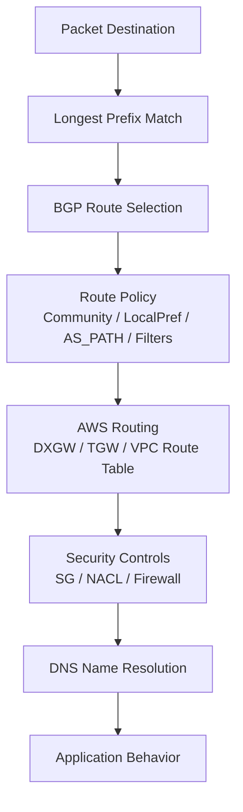

A top engineer does not ask, “Is Direct Connect up?” only.

They ask:

```txt
Which prefix?
Which route table?
Which attachment?
Which BGP policy?
Which return path?
Which security boundary?
Which DNS answer?
Which failure mode?
```

That is the difference between network configuration and network engineering.

---

## 23. What Comes Next

Part 035 will combine **Direct Connect + VPN Patterns**:

- encrypted private connectivity;
- VPN backup;
- DX primary with VPN failover;
- VPN over Direct Connect;
- route preference between DX and VPN;
- convergence and operational testing;
- disaster recovery design.

---

## 24. Sumber Resmi AWS

- AWS Direct Connect routing policies and BGP communities
- BGP-specific settings for AWS Direct Connect
- Direct Connect virtual interfaces and hosted virtual interfaces
- Direct Connect gateways
- AWS Direct Connect Resiliency Toolkit
- Active/Active and Active/Passive Configurations in AWS Direct Connect
- AWS Direct Connect quotas and resiliency documentation
