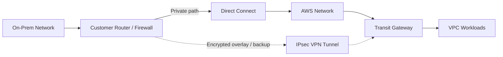
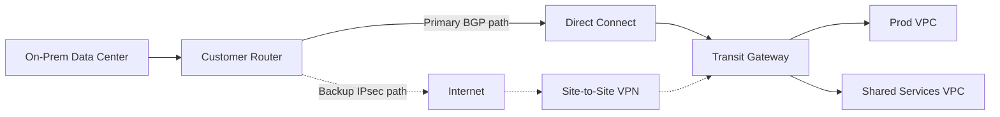
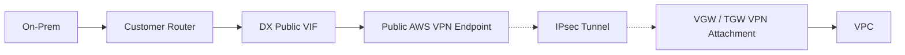
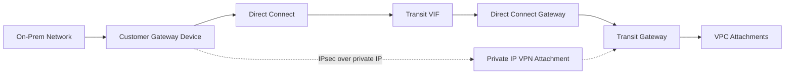
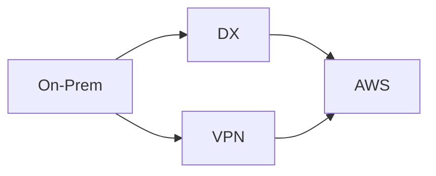
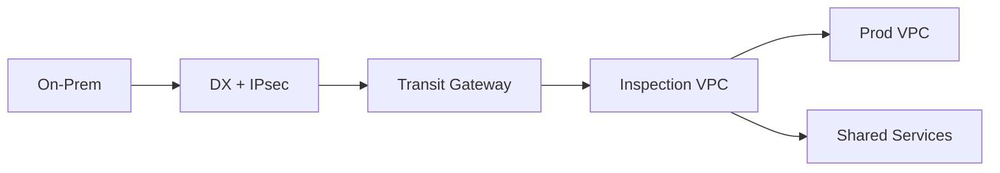

# Part 035 — Direct Connect + VPN Patterns

Direct Connect memberi private connectivity.
Site-to-Site VPN memberi encrypted tunnel.
Keduanya sering dipasang bersama karena enterprise network biasanya tidak hanya butuh **bandwidth**, tetapi juga butuh **confidentiality**, **fallback**, **route control**, dan **operational predictability**.

Masalahnya: banyak desain hybrid gagal bukan karena link tidak bisa dibuat, tetapi karena engineer mencampur tiga tujuan yang berbeda:

1. **Backup** — VPN lewat internet sebagai jalur cadangan saat Direct Connect gagal.
2. **Encryption overlay** — IPsec VPN berjalan di atas Direct Connect supaya traffic terenkripsi.
3. **Segmentation/control** — VPN/BGP policy dipakai untuk membatasi route domain tertentu.

Tiga tujuan itu tampak mirip di diagram, tetapi failure behavior-nya berbeda.

Part ini membahas Direct Connect + VPN sebagai production pattern, bukan sekadar wizard setup.

---

## 1. Prinsip Dasar

Direct Connect tidak otomatis berarti encrypted end-to-end.

Direct Connect adalah private network path dari network customer ke AWS edge/DX location. Jalur ini lebih predictable daripada public internet, tetapi traffic yang lewat Direct Connect **tidak dienkripsi secara default**. Untuk encryption, pilihan umum adalah:

- encryption di application layer, misalnya TLS/mTLS;
- MACsec untuk tipe dedicated connection tertentu yang mendukung;
- Site-to-Site VPN/IPsec sebagai overlay;
- service-specific encryption, misalnya database TLS, HTTPS, SSH, dan sebagainya.

Site-to-Site VPN memberi IPsec tunnel. Tiap VPN connection punya dua tunnel untuk high availability. VPN dapat berjalan lewat internet, atau dalam pattern tertentu dapat digunakan sebagai overlay melalui Direct Connect.



Mental model sederhana:

```txt
Direct Connect = transport path
VPN            = encrypted tunnel
BGP            = route exchange and preference
TGW/VGW        = AWS-side network hub
Policy         = who can reach what
```

Jangan mendesain dari nama layanan. Desain dari intent:

```txt
Apakah saya butuh private path?
Apakah saya butuh encryption?
Apakah saya butuh backup ketika private path gagal?
Apakah saya butuh deterministic failover?
Apakah saya butuh multi-VPC/multi-account routing?
Apakah saya butuh centralized inspection?
```

---

## 2. Pattern Map

Ada empat pattern utama.

| Pattern | Direct Connect | VPN | Tujuan utama | Kapan dipakai |
|---|---:|---:|---|---|
| DX primary + Internet VPN backup | Ya | Ya, via internet | Resilience/fallback | DX down masih perlu konektivitas terbatas |
| VPN over public VIF | Ya | Ya, endpoint public AWS reachable via public VIF | Encryption overlay dengan AWS public VPN endpoint | Butuh IPsec di atas DX tanpa private IP VPN architecture |
| Private IP VPN over DX | Ya | Ya, private IPsec over DX | Encrypted private connectivity tanpa public IP | Enterprise/high-security TGW-based hybrid |
| DX with MACsec + optional VPN backup | Ya | Opsional | Link-layer encryption + fallback | Dedicated DX tertentu, high-throughput encryption |

Yang sering membingungkan:

- **VPN backup** dan **VPN over DX** bukan hal yang sama.
- **Public VIF** tidak berarti traffic aplikasi menjadi public internet exposure; tetapi endpoint yang diakses adalah public AWS service prefix.
- **Private IP VPN over DX** adalah pattern berbeda yang menggunakan private IP address over Direct Connect, biasanya dengan Transit Gateway.
- **MACsec** mengenkripsi link layer tertentu, bukan otomatis menggantikan semua security control aplikasi.

---

## 3. Pattern A — Direct Connect Primary, Internet VPN Backup

Ini pattern paling mudah dipahami.

Direct Connect menjadi jalur utama. Site-to-Site VPN lewat internet menjadi backup.



### 3.1 Apa yang Pattern Ini Selesaikan

Pattern ini menyelesaikan masalah:

- Direct Connect physical/link failure;
- cross-connect/provider issue;
- DX location problem;
- planned maintenance;
- single path outage;
- kebutuhan fallback cost-efficient.

Namun pattern ini tidak membuat backup path setara dengan Direct Connect.

VPN lewat internet tetap punya karakter:

- latency lebih variabel;
- throughput lebih terbatas;
- bergantung pada public internet path;
- lebih sulit memberi deterministic performance;
- mungkin tidak cocok untuk replication/data transfer besar.

Jadi jangan tulis requirement seperti ini:

```txt
DX primary + VPN backup must provide same throughput and latency during failure.
```

Itu biasanya requirement palsu.

Requirement yang lebih realistis:

```txt
During DX failure, critical control-plane and reduced-volume application traffic must remain available over VPN backup.
Bulk replication may degrade or pause.
```

### 3.2 Routing Model

Dengan BGP, customer router dan AWS menerima route dari dua path:

- Direct Connect path;
- VPN path.

Failover dikontrol oleh:

- prefix specificity;
- local preference;
- AS path prepending;
- route filtering;
- TGW/VGW route priority;
- customer router policy;
- static routes jika tidak memakai BGP.

Target production:

```txt
Normal state:
  On-prem -> AWS prefix lewat DX
  AWS -> On-prem prefix lewat DX

Failure state:
  DX route withdrawn / deprioritized
  VPN route becomes active

Recovery state:
  DX route stable again
  traffic returns to DX intentionally, not flapping
```

### 3.3 Active/Passive vs Active/Active

Untuk backup VPN, active/passive lebih mudah dioperasikan.

```txt
Active/passive:
  DX carries traffic normally
  VPN installed but lower preference
  VPN used only on failure

Active/active:
  DX and VPN both carry traffic
  higher utilization
  more asymmetric routing risk
  harder troubleshooting
```

Untuk enterprise workload, active/active hanya masuk akal jika:

- traffic flows stateless atau appliance state-aware mendukungnya;
- path symmetry sudah diuji;
- monitoring bisa membedakan degradation per path;
- failback behavior jelas;
- firewall/session-state design siap.

Kalau firewall stateful ada di on-prem atau inspection VPC, asymmetric routing bisa menjadi outage diam-diam.

---

## 4. Pattern B — VPN over Public VIF

Pada pattern ini, customer menggunakan Direct Connect public virtual interface untuk mencapai public AWS VPN endpoint, lalu membangun IPsec tunnel.



Ini sering muncul saat organisasi ingin:

- traffic VPN tidak lewat internet umum;
- memanfaatkan Direct Connect sebagai transport ke public AWS endpoint;
- mendapat encryption IPsec di atas DX;
- tetap memakai public VPN endpoint model.

### 4.1 Yang Perlu Dipahami

Public VIF memberi akses ke public AWS service prefixes, bukan langsung ke private VPC CIDR.

VPN tunnel tetap terminasi di AWS VPN endpoint, lalu dari sana traffic masuk ke VGW/TGW target.

Artinya ada dua routing layer:

1. Routing ke public AWS VPN endpoint melalui public VIF.
2. Routing private workload prefix melalui IPsec tunnel.

Kesalahan umum:

```txt
Saya sudah punya public VIF, berarti private VPC CIDR reachable.
```

Tidak. Public VIF route domain berbeda dengan private workload route domain.

### 4.2 Operational Risk

Yang harus divalidasi:

- AWS public VPN endpoint prefix diterima lewat public VIF;
- customer router mengarahkan traffic endpoint VPN ke DX, bukan internet;
- IPsec tunnel up;
- BGP/static route di dalam tunnel benar;
- return path simetris;
- MTU/MSS tidak menyebabkan blackhole;
- failover ke internet path disadari atau dicegah sesuai policy.

---

## 5. Pattern C — Private IP VPN over Direct Connect

Private IP Site-to-Site VPN over Direct Connect memungkinkan IPsec VPN memakai private IP address melalui Direct Connect, tanpa public IP address untuk VPN tunnel endpoint.

Ini biasanya dipakai dengan Transit Gateway dan Direct Connect transit VIF/DX Gateway.



Tujuan pattern ini:

- traffic hybrid lewat private connectivity;
- encryption dilakukan via IPsec;
- tidak memakai public IP untuk tunnel endpoint;
- cocok untuk regulated/high-security environment;
- routing hub memakai TGW.

### 5.1 Cara Membacanya

Jangan bayangkan VPN sebagai jalur terpisah dari Direct Connect.

Pada private IP VPN over DX:

```txt
Direct Connect = underlay
IPsec VPN      = overlay
TGW            = routing hub
BGP            = route exchange di overlay
```

Traffic aplikasi tidak sekadar “lewat DX”. Traffic aplikasi masuk ke IPsec tunnel yang berjalan di atas private DX transport.

### 5.2 Keuntungan

- Encryption IPsec tanpa memakai public internet.
- Consistent DX transport dibanding internet VPN.
- TGW-based multi-VPC routing.
- Lebih sesuai untuk enterprise compliance yang tidak ingin tunnel endpoint public.
- Memisahkan transport availability dari encryption/session semantics.

### 5.3 Biaya Kompleksitas

Pattern ini lebih kompleks daripada DX primary + VPN backup.

Perlu jelas:

- Direct Connect physical redundancy;
- transit VIF/DXGW/TGW association;
- VPN attachment lifecycle;
- BGP session per tunnel;
- route table TGW;
- failover behavior;
- on-prem firewall/router capability;
- encryption throughput;
- monitoring tunnel and underlay separately.

Jika organisasi belum bisa mengoperasikan BGP dan TGW route table dengan disiplin, private IP VPN over DX bisa menjadi sistem yang “terlihat secure” tetapi sulit dipulihkan saat gagal.

---

## 6. Pattern D — MACsec + Direct Connect + Optional VPN Backup

MACsec mengenkripsi traffic pada layer 2 di Direct Connect dedicated connection tertentu yang mendukung.

Pattern ini berbeda dari IPsec:

| Aspek | MACsec | IPsec VPN |
|---|---|---|
| Layer | L2/link layer | L3/network layer |
| Scope | Link/connection | Tunnel between endpoints |
| Routing awareness | Tidak membawa route sendiri | Biasanya membawa BGP/static route |
| App visibility | Transparan | Tunnel overlay eksplisit |
| Use case | Encrypt DX link | Encrypt traffic path/logical tunnel |

MACsec cocok ketika:

- dedicated connection mendukung;
- high-throughput encryption dibutuhkan;
- organisasi ingin mengurangi overhead tunnel overlay;
- link-layer encryption cukup untuk requirement tertentu;
- aplikasi tetap memakai TLS/mTLS untuk end-to-end protection.

Namun MACsec tidak otomatis menggantikan:

- application-layer encryption;
- segmentation;
- firewall policy;
- TGW route-domain control;
- VPN backup lewat internet.

---

## 7. Route Preference Design

Direct Connect + VPN pattern tidak aman tanpa route preference yang eksplisit.

Routing policy harus menjawab:

```txt
Saat semua sehat, route mana aktif?
Saat DX gagal, route mana aktif?
Saat salah satu VPN tunnel gagal, route mana aktif?
Saat DX pulih, kapan traffic kembali?
Saat route flap, bagaimana mencegah oscillation?
```

### 7.1 Prefix Strategy

Gunakan prefix yang sederhana dan konsisten.

Buruk:

```txt
DX advertises 10.0.0.0/8
VPN advertises 10.12.0.0/16
Some VPC route tables use 10.12.4.0/22
TGW has static 10.12.4.0/24 to inspection
```

Ini bisa menciptakan longest-prefix surprises.

Lebih baik:

```txt
DX and VPN advertise same aggregate prefixes.
Preference is controlled by BGP policy, not accidental prefix specificity.
Exceptions are documented and tested.
```

### 7.2 Active/Passive with BGP

Common approach:

- DX route memiliki local preference lebih tinggi di customer network;
- AWS-side route preference mengikuti documented AWS route priority;
- VPN route tetap tersedia tetapi kurang preferred;
- AS path prepending dapat dipakai untuk menurunkan preference path tertentu;
- route filtering mencegah route leak.

### 7.3 Static Route Danger

Static route bisa sederhana, tetapi risk-nya:

- tidak otomatis withdraw saat path down kecuali target state dideteksi;
- failover bisa bergantung pada tracking yang berbeda antar vendor;
- mudah tertinggal saat CIDR berubah;
- tidak scalable untuk multi-prefix enterprise.

Static boleh, tapi production scale biasanya lebih cocok dengan BGP.

---

## 8. Failure Model

Desain harus diuji berdasarkan failure, bukan diagram sehat.

| Failure | Dampak | Yang harus terjadi |
|---|---|---|
| Single VPN tunnel down | Redundancy berkurang | Tunnel lain tetap membawa traffic |
| Both VPN tunnels down | Overlay gagal | DX non-VPN path atau backup lain sesuai desain |
| DX physical link down | Primary transport hilang | VPN internet backup aktif atau secondary DX aktif |
| DX BGP down | Route withdrawn | Backup route menjadi active |
| Customer router reboot | Path turun sementara | Redundant router mengambil alih |
| TGW route table salah | Blackhole/route leak | Analyzer/test menangkap sebelum prod |
| MTU issue | Large packet timeout | MSS clamp/PMTUD validation |
| Return path mismatch | Session drop | Symmetric route enforced |
| Flapping link | Intermittent outage | Dampening/hold timer/operational guardrail |

### 8.1 Healthy Diagram Tidak Cukup

Diagram seperti ini menipu:



Yang perlu ditulis adalah state machine:

```txt
STATE_NORMAL:
  active_path = DX
  backup_path = VPN

STATE_DX_DOWN:
  active_path = VPN
  degraded_mode = true
  bulk_jobs = paused_or_throttled

STATE_DX_RECOVERING:
  wait_for_stability_window
  shift_traffic_back_to_DX

STATE_VPN_DOWN_WHILE_DX_UP:
  alert_redundancy_degraded
  do_not_fail_application

STATE_ALL_HYBRID_DOWN:
  invoke DR / local fallback / queueing mode
```

---

## 9. Bandwidth, Throughput, MTU, and Fragmentation

VPN overlay adds overhead.

Direct Connect may support large bandwidth, but IPsec tunnel throughput depends on:

- customer gateway hardware/software;
- VPN tunnel limits;
- crypto algorithm;
- packet size;
- number of flows;
- ECMP availability;
- NAT/firewall traversal;
- TCP MSS.

### 9.1 MTU/MSS Rule of Thumb

If small packets work but large transfers hang, suspect MTU/MSS.

Symptoms:

- SSH works, SCP stalls;
- health checks pass, database replication fails;
- ping small succeeds, large packet fails;
- TLS handshake sometimes fails;
- intermittent gRPC timeout;
- only cross-region/on-prem path affected.

Runbook:

```bash
# Linux example: test path MTU with DF bit
ping -M do -s 1472 <destination>
ping -M do -s 1400 <destination>
ping -M do -s 1360 <destination>

# Trace path where possible
tracepath <destination>
```

Production fix often involves:

- TCP MSS clamping on customer gateway;
- avoiding oversized tunnel overhead assumptions;
- validating jumbo frame support end-to-end;
- ensuring PMTUD ICMP is not blocked by firewall/NACL.

---

## 10. Security Model

Direct Connect + VPN security is layered.

```txt
Physical/private path  -> Direct Connect
Tunnel encryption      -> IPsec VPN or MACsec depending design
Route boundary         -> TGW route table / BGP policy
Packet filtering       -> firewall / SG / NACL / Network Firewall
Identity/auth          -> IAM/app auth/user identity
Data protection        -> TLS/mTLS/app encryption
Audit                  -> Flow Logs / VPN logs / router logs / CloudTrail
```

Do not confuse encryption with authorization.

Encrypted packet can still be unauthorized.
Private path can still be over-permissive.
Reachability can still violate least privilege.

### 10.1 Segmentation Pattern

For regulated environments:



But only use inspection if routing symmetry is guaranteed.

Stateful appliances need both request and response path.

---

## 11. Observability

You need visibility at multiple layers.

| Layer | Signal |
|---|---|
| Direct Connect physical | connection state, light level/provider ticket, DX metrics |
| Direct Connect BGP | BGP session up/down, route received/advertised |
| VPN tunnel | tunnel state, tunnel data in/out, tunnel BGP |
| TGW | attachment state, route table, Network Manager events |
| VPC | route table, Flow Logs, Reachability Analyzer |
| App | latency, timeout, retry rate, connection pool error |
| Customer router | interface, IPsec SA, BGP table, CPU/crypto utilization |

### 11.1 Minimum Alerts

Alert on:

- DX connection down;
- DX BGP down;
- VPN tunnel down;
- both VPN tunnels down;
- traffic unexpectedly shifts to backup path;
- backup path has zero traffic during failover test;
- route count changes unexpectedly;
- high packet drops/fragmentation symptoms;
- firewall deny spike;
- application latency increase after path change.

### 11.2 Synthetic Test

Run periodic synthetic tests per route domain:

```txt
from on-prem subnet A -> prod VPC service
from on-prem subnet A -> shared DNS resolver
from prod VPC -> on-prem service
from shared services -> on-prem identity provider
from backup path during drill -> critical endpoint
```

Do not wait for real outage to learn your backup path cannot reach DNS.

---

## 12. IaC Design Contract

A production module for DX+VPN should expose intent, not raw knobs only.

Example contract:

```yaml
hybrid_connectivity:
  name: corp-aws-prod
  primary_transport: direct_connect
  backup_transport: internet_vpn
  encryption:
    mode: ipsec
    overlay: true
  aws_hub:
    type: transit_gateway
    route_domain: prod-shared
  advertised_on_prem_prefixes:
    - 10.40.0.0/16
    - 10.41.0.0/16
  advertised_aws_prefixes:
    - 10.100.0.0/16
    - 10.101.0.0/16
  failover:
    primary_preference: direct_connect
    degraded_mode_bandwidth_mbps: 500
  inspection:
    required: true
    appliance_mode: true
```

Avoid modules that only expose:

```yaml
dx_gateway_id: ...
vpn_connection_id: ...
static_routes: [...]
```

That describes resources, not operating intent.

---

## 13. Implementation Blueprint — DX Primary + VPN Backup

### Step 1 — Define Route Domains

Write the matrix:

| Source | Destination | Allowed? | Primary path | Backup path |
|---|---|---:|---|---|
| Corp users | Shared services | Yes | DX | VPN |
| Data center app | Prod app VPC | Yes | DX | VPN degraded |
| Prod VPC | On-prem DB | Yes | DX | VPN degraded |
| Nonprod | Prod | No | None | None |

### Step 2 — Build Primary DX

- create Direct Connect connection or hosted connection;
- create VIF based on target architecture;
- connect to VGW/TGW/DXGW path;
- establish BGP;
- advertise only approved prefixes;
- verify route table installation.

### Step 3 — Build VPN Backup

- create Site-to-Site VPN to TGW/VGW;
- configure two tunnels;
- configure BGP if possible;
- set preference lower than DX;
- verify both tunnel states;
- test tunnel failover.

### Step 4 — Enforce Route Preference

- customer side: prefer DX;
- AWS side: verify selected route;
- avoid more-specific backup prefixes unless intentional;
- document all route manipulation.

### Step 5 — Validate Symmetry

For every allowed flow:

```txt
request path  = expected primary path
response path = same stateful inspection domain
backup path   = known and tested
```

### Step 6 — Drill Failure

Test:

- single VPN tunnel down;
- primary DX BGP down;
- full DX link down;
- failback after recovery;
- application behavior during path change.

---

## 14. Implementation Blueprint — Private IP VPN over DX

### Step 1 — Confirm Architecture Fit

Use this pattern when:

- encryption over private connectivity is required;
- TGW is the central hub;
- on-prem supports BGP/IPsec appropriately;
- operations team can monitor underlay and overlay separately;
- public IP endpoint usage is disallowed or undesirable.

Do not use it just because it sounds more secure.

### Step 2 — Build Underlay

- Direct Connect connection;
- transit VIF;
- Direct Connect Gateway;
- TGW association;
- BGP between customer and AWS underlay as required.

### Step 3 — Build Overlay

- private IP Site-to-Site VPN connection;
- configure customer gateway;
- establish IPsec tunnel;
- establish BGP over tunnel;
- propagate route to TGW route table.

### Step 4 — Validate Separately

Underlay healthy does not mean overlay healthy.

Check:

```txt
DX connection up?
Transit VIF BGP up?
DXGW/TGW association active?
VPN tunnel up?
Tunnel BGP up?
TGW route installed?
VPC route table targets TGW?
Return path exists?
Security policy allows traffic?
```

---

## 15. Common Anti-Patterns

### Anti-Pattern 1 — Backup Exists but Is Never Tested

A VPN backup that has never carried production-like traffic is documentation, not resilience.

Test it.

### Anti-Pattern 2 — More Specific Routes Accidentally Override Primary

```txt
DX:  10.0.0.0/8
VPN: 10.20.30.0/24
```

The /24 wins regardless of intended “primary”.

### Anti-Pattern 3 — Backup Path Cannot Reach DNS/Identity

App traffic fails because:

- DNS resolver path missing;
- AD/LDAP path missing;
- NTP path missing;
- license server path missing;
- firewall policy only allowed app port, not dependencies.

### Anti-Pattern 4 — Encryption Assumed Because Path Is Private

Direct Connect private path is not the same as encryption.

### Anti-Pattern 5 — Active/Active Without Stateful Awareness

If request goes via DX and response returns via VPN, firewall may drop the session.

### Anti-Pattern 6 — Centralized Egress Forgotten During Failover

During DX outage, cloud workload may still need outbound on-prem or internet dependencies. The backup path must account for this.

---

## 16. Troubleshooting Runbook

When hybrid connectivity fails, debug from route to packet to policy.

### 16.1 Classify Failure

```txt
Is it all traffic or one prefix?
One direction or both directions?
One application or all ports?
One AZ/VPC/account or all VPCs?
Only large packets or all packets?
Only during failover or always?
```

### 16.2 Check Path State

```txt
DX connection state
DX BGP state
VIF route advertisements
VPN tunnel state
VPN BGP state
TGW attachment state
TGW route table selected route
VPC route table
SG/NACL/firewall
DNS resolution
Application logs
```

### 16.3 Common Symptoms

| Symptom | Likely area |
|---|---|
| Ping works, TCP fails | SG/NACL/firewall/MTU |
| Small TCP works, large transfer stalls | MTU/MSS/fragmentation |
| AWS to on-prem works, reverse fails | return route/security |
| Fails only after DX down | backup route/policy/dependency missing |
| Tunnel up, no app traffic | route propagation/security/DNS |
| BGP up, wrong path used | route preference/prefix specificity |
| Works from one VPC, not another | TGW route table association/propagation |

### 16.4 Route Verification Checklist

```txt
On-prem router:
  do we receive AWS prefix?
  what next hop is selected?
  is route installed in FIB?

AWS TGW:
  is on-prem prefix in correct route table?
  is attachment association correct?
  is propagation enabled where intended?

VPC:
  does subnet route table point to TGW/VGW?
  does return route exist?

Security:
  does SG/NACL/firewall allow source and destination?
```

---

## 17. Design Review Questions

Use these in architecture review.

```txt
1. What exact prefixes are advertised from on-prem to AWS?
2. What exact prefixes are advertised from AWS to on-prem?
3. Which path is preferred in normal condition?
4. Which path is preferred when DX fails?
5. Which applications are allowed to degrade during VPN failover?
6. What are the bandwidth assumptions during degraded mode?
7. Is traffic encrypted on DX? If yes, how?
8. Is route symmetry required? How is it guaranteed?
9. Are DNS and identity services reachable over backup path?
10. What monitoring proves both underlay and overlay are healthy?
11. How often is failover tested?
12. What is the rollback/failback procedure?
```

---

## 18. Compact Decision Guide

```txt
Need private predictable high-bandwidth path?
  -> Direct Connect

Need encryption over that path?
  -> TLS/mTLS, MACsec, or IPsec overlay

Need backup when DX fails?
  -> Internet Site-to-Site VPN or second DX

Need encrypted private VPN without public IP endpoint?
  -> Private IP VPN over Direct Connect with TGW

Need highest reliability?
  -> Redundant DX in separate locations + VPN as additional backup where appropriate

Need simple low-volume hybrid?
  -> Site-to-Site VPN may be enough
```

---

## 19. Production Invariants

A good DX+VPN design satisfies these invariants:

1. Every route has an owner.
2. Every advertised prefix is intentional.
3. Primary and backup path preference is explicit.
4. Failover is tested, not assumed.
5. DNS and identity dependencies are included in the path matrix.
6. Encryption requirement is mapped to a concrete mechanism.
7. MTU/MSS is validated under tunnel conditions.
8. Stateful inspection path is symmetric.
9. Backup capacity is documented as degraded or equivalent.
10. Monitoring distinguishes underlay failure from overlay failure.

---

## 20. What to Remember

Direct Connect + VPN is not one architecture.
It is a family of patterns.

The right question is not:

```txt
Should we add VPN to Direct Connect?
```

The better question is:

```txt
Are we adding VPN for backup, encryption overlay, private IP tunnel, route segmentation, or compliance evidence?
```

Once the intent is clear, the architecture becomes much easier to reason about.

---

## References

- AWS VPC Connectivity Options — AWS Direct Connect + AWS Site-to-Site VPN: https://docs.aws.amazon.com/whitepapers/latest/aws-vpc-connectivity-options/aws-direct-connect-site-to-site-vpn.html
- AWS Direct Connect — Encryption in transit: https://docs.aws.amazon.com/directconnect/latest/UserGuide/encryption-in-transit.html
- AWS Site-to-Site VPN — Concepts: https://docs.aws.amazon.com/vpn/latest/s2svpn/VPC_VPN.html
- AWS Site-to-Site VPN — Private IP VPN with Direct Connect: https://docs.aws.amazon.com/vpn/latest/s2svpn/private-ip-dx.html
- AWS Hybrid Connectivity Whitepaper — Reliability: https://docs.aws.amazon.com/whitepapers/latest/hybrid-connectivity/reliability.html
- AWS Direct Connect User Guide: https://docs.aws.amazon.com/directconnect/latest/UserGuide/Welcome.html
