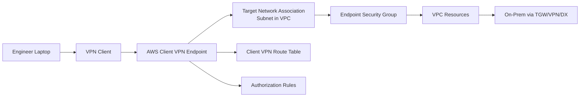
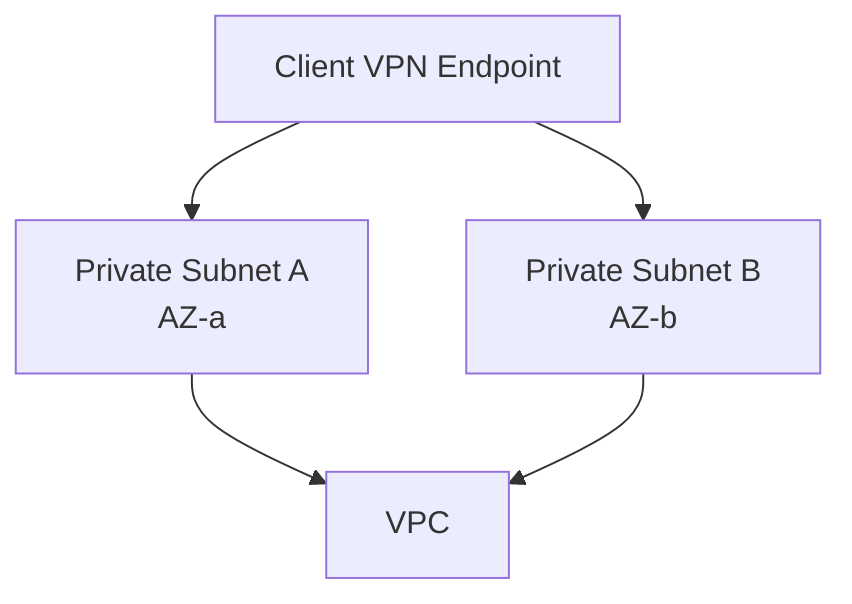
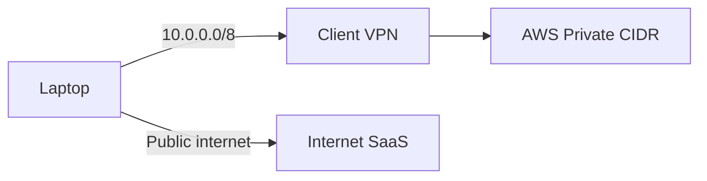
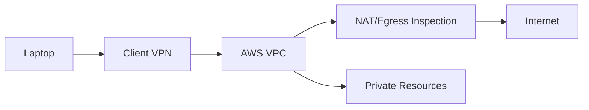
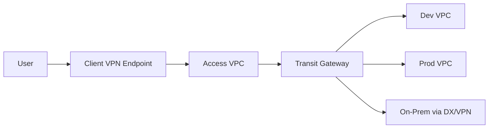
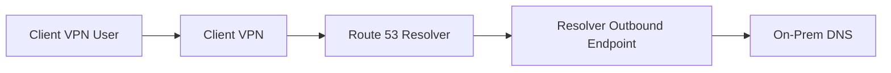

# Part 036 — AWS Client VPN and Remote Access

Remote access bukan sekadar “engineer bisa SSH ke private subnet”.

Remote access adalah control plane manusia menuju network internal. Karena manusia, laptop, credential, identity provider, endpoint, route table, dan security group semuanya ikut bermain, desainnya harus lebih ketat daripada koneksi antar-server.

AWS Client VPN adalah managed client-based VPN service berbasis OpenVPN yang memungkinkan user mengakses resource AWS dan on-premises network secara aman dari lokasi mana pun. Tetapi aman/tidaknya bukan otomatis dari nama service. Aman/tidaknya ditentukan oleh:

- authentication model;
- client CIDR;
- target network association;
- endpoint route table;
- authorization rules;
- security group;
- VPC route table;
- split tunnel/full tunnel decision;
- logging;
- lifecycle credential/certificate;
- operational runbook.

Part ini membahas Client VPN sebagai production remote access system.

---

## 1. Mental Model

Client VPN membuat endpoint VPN regional. User memakai client OpenVPN-compatible untuk connect. Setelah authenticated dan authorized, traffic user masuk ke VPC melalui subnet target network yang diasosiasikan ke endpoint.



Client VPN bukan magic tunnel langsung ke semua resource.

Akses berhasil hanya jika semua ini benar:

```txt
user authenticated
AND destination route exists in Client VPN endpoint route table
AND authorization rule allows destination for user/group
AND target network association exists and healthy
AND endpoint security group allows traffic
AND VPC route table has return path
AND destination SG/NACL/firewall allows traffic
AND DNS resolves to reachable IP
```

Jika salah satu layer gagal, user melihat “VPN connected, but cannot reach service”.

---

## 2. Komponen Utama

| Komponen | Fungsi |
|---|---|
| Client VPN endpoint | Managed VPN termination point |
| Client CIDR block | Pool IP yang diberikan ke connected clients |
| Target network association | Subnet tempat endpoint di-associate agar bisa route ke VPC |
| Client VPN route table | Route yang didorong/digunakan endpoint untuk destination tertentu |
| Authorization rules | Policy user/group boleh mengakses destination CIDR tertentu |
| Security group | SG yang mengontrol traffic dari endpoint ke resource |
| Authentication | Mutual certificate, Active Directory, SAML, atau kombinasi |
| Connection logging | Audit connect/disconnect dan troubleshooting |
| Split tunnel setting | Apakah hanya route tertentu masuk VPN atau semua traffic |

Satu komponen tidak menggantikan komponen lain.

Authorization rule bukan security group.
Route bukan authorization.
Authentication bukan reachability.
VPN connected bukan berarti app reachable.

---

## 3. Client CIDR Design

Client CIDR adalah IP pool untuk client yang connect.

Rules penting:

- harus cukup besar untuk jumlah concurrent user;
- tidak boleh overlap dengan VPC local CIDR associated subnet;
- tidak boleh overlap dengan route manual yang ditambahkan ke Client VPN endpoint route table;
- tidak bisa diubah setelah endpoint dibuat;
- sebagian IP dipakai oleh availability model endpoint, jadi jangan sizing terlalu pas;
- AWS mensyaratkan ukuran block IPv4 antara `/22` dan `/12` untuk client CIDR.

### 3.1 Sizing Praktis

Jangan gunakan `/24` karena bukan ukuran valid untuk Client VPN endpoint.

Untuk production:

```txt
small team / dev access:      /22
medium engineering org:       /21 or /20
large enterprise access:      /19 or larger, segmented by endpoint/domain
```

Namun jangan membuat satu mega endpoint untuk semua orang.
Lebih baik segmentasi berdasarkan risk domain:

```txt
cvpn-dev-admin
cvpn-prod-breakglass
cvpn-shared-services
cvpn-partner-restricted
```

### 3.2 Overlap Trap

Misal:

```txt
Client CIDR: 10.10.0.0/22
VPC CIDR:    10.10.0.0/16
```

Ini invalid/problematic karena overlap.

Lebih berbahaya:

```txt
Client CIDR: 172.20.0.0/22
Route to on-prem: 172.20.0.0/16
```

User bisa connect, tetapi routing menjadi ambiguous.

Gunakan IPAM untuk reserve client VPN ranges seperti production network lain.

---

## 4. Target Network Association

Client VPN endpoint membutuhkan target network association ke subnet dalam VPC supaya bisa mengirim traffic ke VPC.



Production rule:

- associate setidaknya dua subnet di AZ berbeda untuk AZ redundancy;
- subnet harus punya cukup IP available;
- target subnets harus berada di VPC yang sama untuk endpoint association set tersebut;
- subnet CIDR tidak boleh overlap dengan client CIDR;
- jangan gunakan subnet yang ownership/route/security-nya tidak jelas.

Setelah target network associated, route local VPC biasanya ditambahkan ke Client VPN endpoint route table. Tetapi additional CIDR, peered VPC, TGW destinations, on-prem destinations, dan internet egress path butuh route tambahan.

---

## 5. Route Table Model

Client VPN endpoint punya route table sendiri.

Route table ini menjawab:

```txt
Traffic client ke destination CIDR X harus dikirim ke target network association Y.
```

Contoh:

```txt
10.20.0.0/16  -> associated subnet in shared-services VPC
10.30.0.0/16  -> associated subnet in same VPC, then TGW to prod
172.16.0.0/12 -> associated subnet, then DX/VPN to on-prem
0.0.0.0/0     -> associated subnet, then NAT/IGW for full tunnel internet egress
```

### 5.1 Route Is Necessary but Not Sufficient

Menambahkan route tidak otomatis memberi izin user.

Perlu authorization rule.

```txt
Reachability = route + authorization + network return path + security policy
```

### 5.2 Return Path

Destination resource harus tahu cara membalas ke client CIDR.

Jika client CIDR adalah `10.200.0.0/22`, maka VPC/on-prem/TGW route harus punya return route ke `10.200.0.0/22` via Client VPN path/associated VPC.

Common failure:

```txt
Client -> EC2 request reaches EC2
EC2 -> Client response has no route back
User sees timeout
```

Di AWS, source IP behavior Client VPN melibatkan translation/endpoint behavior yang perlu dipahami dari dokumentasi dan Flow Logs; jangan mengasumsikan source selalu laptop LAN IP.

---

## 6. Authorization Rules

Authorization rules menentukan siapa boleh mengakses destination network tertentu.

Route table menjawab “ke mana traffic dikirim”.
Authorization rule menjawab “siapa boleh mengirim traffic ke sana”.

```txt
Route exists to 10.30.0.0/16
Authorization exists only for group prod-admins
=> only prod-admins can access 10.30.0.0/16
```

### 6.1 Authorization Granularity

Authorization rule berbasis CIDR dan group/user context yang didukung authentication mode.

Gunakan CIDR sempit:

```txt
Good:
  dev-engineers -> 10.40.10.0/24
  db-admins     -> 10.40.20.0/24
  sre-prod      -> 10.50.0.0/20

Bad:
  all-users     -> 10.0.0.0/8
```

VPN authorization bukan pengganti app authorization.
Namun ini adalah network blast-radius control.

### 6.2 Default Deny Thinking

Client VPN harus didesain default deny:

```txt
Authenticate user
Grant only required destination CIDRs
Deny by absence of rule
Restrict with SG/firewall again
Log all sessions
```

Jangan membuat “temporary all access” lalu lupa.

---

## 7. Authentication Model

Client VPN mendukung beberapa model authentication:

| Model | Cocok untuk | Catatan |
|---|---|---|
| Mutual certificate | Strong device/client certificate identity | Perlu lifecycle CA/cert revocation |
| Active Directory | Enterprise user/password/MFA via AD integration | Cocok untuk org dengan AWS Managed Microsoft AD/AD Connector |
| SAML federation | Centralized SSO/IdP | Cocok untuk Okta/Entra/IdP SAML compatible |
| Mutual + user-based | Device + user assurance | Lebih kuat, lebih kompleks operasional |

### 7.1 Mutual Authentication

Dengan mutual certificate, client dan server menggunakan certificate.

Kekuatan:

- device/client credential kuat;
- tidak bergantung penuh pada password;
- cocok untuk restricted admin endpoint.

Risiko operasional:

- certificate issuance harus terkontrol;
- revocation harus jelas;
- lost laptop procedure harus cepat;
- certificate sharing harus dicegah;
- expired certificate bisa menjadi incident.

### 7.2 SAML Federation

Dengan SAML, identity tetap di IdP pusat.

Kekuatan:

- user lifecycle mengikuti IdP;
- MFA/conditional access bisa terpusat;
- group-based authorization lebih natural;
- offboarding lebih cepat.

Risiko:

- IdP outage dapat memblokir new sessions;
- group mapping harus dipantau;
- session duration policy harus sesuai risk;
- break-glass strategy perlu disiapkan.

### 7.3 AD Authentication

AD cocok jika organisasi masih bergantung pada directory enterprise tradisional.

Kekuatan:

- integrasi user/group lama;
- MFA dapat digunakan jika dikonfigurasi melalui Directory Service path yang sesuai;
- familiar untuk network/security team.

Risiko:

- dependency ke AD/DNS sangat kritikal;
- latency ke directory mempengaruhi login;
- group sprawl bisa membuat authorization sulit diaudit.

---

## 8. Split Tunnel vs Full Tunnel

Ini keputusan besar.

### 8.1 Split Tunnel

Split tunnel berarti hanya traffic ke route tertentu yang masuk VPN. Traffic internet biasa tetap keluar dari network lokal user.



Kelebihan:

- mengurangi latency internet user;
- mengurangi AWS data transfer/egress;
- mengurangi load pada NAT/egress VPC;
- cocok untuk developer/admin access ke private resources.

Risiko:

- device bisa berbicara ke internet dan private network bersamaan;
- policy enforcement internet tidak central kecuali endpoint security mengontrolnya;
- route updates pada split tunnel dapat reset client connections;
- jika route terlalu luas, split tunnel menjadi hampir full tunnel tapi tanpa governance penuh.

### 8.2 Full Tunnel

Full tunnel mengirim semua traffic melalui VPN, biasanya route `0.0.0.0/0`.



Kelebihan:

- centralized egress inspection;
- internet traffic dapat diaudit/filter dari AWS/enterprise path;
- cocok untuk managed workstation use case tertentu.

Biaya/risiko:

- egress cost naik;
- latency semua internet traffic naik;
- NAT/egress VPC menjadi critical path;
- route `0.0.0.0/0` harus hati-hati;
- DNS behavior harus dirancang;
- outage Client VPN mengganggu semua akses internet user.

### 8.3 Decision Rule

```txt
Need access only to AWS/on-prem private CIDR?
  -> split tunnel

Need central internet inspection for remote users?
  -> full tunnel, but design egress capacity and policy

Need emergency prod access?
  -> split tunnel with narrow CIDRs and strong auth

Need employee general VPN replacement?
  -> evaluate Client VPN vs enterprise ZTNA/SASE, not just AWS networking
```

---

## 9. Multi-VPC and On-Prem Access

Client VPN endpoint biasanya associated ke satu VPC, tetapi destination bisa lebih luas jika routing benar.

Pattern:



Checklist:

1. Client VPN route to dev/prod/on-prem CIDR exists.
2. Authorization rule allows only intended user group per CIDR.
3. Access VPC subnet route table points destination to TGW.
4. TGW route table has route to destination attachment.
5. Destination route table has return path to client CIDR/access VPC path.
6. Security groups/firewalls allow traffic.
7. DNS resolves private names from client.

### 9.1 Avoid “All VPCs via 10.0.0.0/8” by Default

Using one broad route/authorization rule seems convenient:

```txt
route: 10.0.0.0/8
allow: all-authenticated-users
```

This destroys segmentation.

Prefer explicit route domains:

```txt
10.20.0.0/16 dev
10.30.0.0/16 staging
10.40.0.0/16 prod-app
10.50.0.0/20 prod-data-admin
172.16.0.0/16 on-prem-shared
```

Authorization follows groups.

---

## 10. DNS Design

Remote users rarely connect by IP. They connect by name.

Client VPN DNS needs explicit design.

Questions:

```txt
What DNS server should clients use after connecting?
Can clients resolve private hosted zones?
Can clients resolve on-prem internal names?
Is split-horizon DNS required?
Does full tunnel affect public DNS?
What happens if DNS resolver path is down?
```

### 10.1 Private Hosted Zones

If users need names like:

```txt
api.internal.example.com
rds.prod.example.internal
service.shared.corp
```

Then client DNS must resolve through VPC Resolver/Route 53 Resolver path that knows those zones.

### 10.2 Hybrid DNS

For on-prem names, common design:



For inbound on-prem to AWS private zones, use Resolver inbound endpoints, but that is separate from client remote access.

### 10.3 DNS Failure Mode

If VPN connects but internal names fail:

```txt
Check DNS server pushed to client
Check resolver endpoint SG
Check route to resolver IP
Check PHZ association
Check conditional forwarding rule
Check on-prem DNS ACL/firewall
Check split tunnel route includes DNS server CIDR
```

---

## 11. Security Group and Destination Controls

Client VPN endpoint can be associated with security groups. Treat endpoint SG as the first AWS-side network guardrail.

Common pattern:

```txt
Client VPN endpoint SG egress:
  allow TCP 443 to admin ALB SG
  allow TCP 22 to bastion/admin SG only if required
  allow TCP 5432 to db-admin proxy SG
  allow UDP/TCP 53 to resolver SG
  deny by absence
```

Destination resource SG should reference endpoint/access SG where possible.

Bad:

```txt
DB SG inbound: allow 10.0.0.0/8 port 5432
```

Better:

```txt
DB SG inbound: allow from db-admin-proxy SG
Admin proxy SG inbound: allow from Client VPN SG on approved port
```

For services that cannot reference SG across paths, use narrow CIDR and firewall policy.

---

## 12. Remote Access Architecture Patterns

### 12.1 Developer Access to Dev VPC

```txt
Authentication: SAML
Split tunnel: enabled
Routes: dev VPC CIDR only
Authorization: dev-engineers group
SG: allow required dev ports
Logging: enabled
```

Good for day-to-day non-production access.

### 12.2 Production Break-Glass Endpoint

```txt
Authentication: mutual cert + SAML/AD
Split tunnel: enabled
Routes: narrow prod admin CIDRs
Authorization: sre-prod-breakglass group
SG: only admin jump/proxy endpoints
Logging: enabled + alert on connection
Session process: ticket required
```

This endpoint should not be used for normal browsing or broad prod access.

### 12.3 Shared Services Access VPC

```txt
Client VPN endpoint in access/shared VPC
TGW routes to app VPCs and on-prem
Route table segmented by destination
Authorization by group
DNS resolver central
Inspection optional
```

Good for platform teams, but requires strong governance to avoid becoming “VPN to everything”.

### 12.4 Partner Restricted Access

```txt
Separate endpoint
Separate client CIDR
Mutual certificate per partner/device
Routes only to partner-facing service subnet
No route to broad RFC1918
Strict logging and expiration
```

Never mix partners into employee admin VPN.

---

## 13. Client VPN vs Bastion vs Verified Access vs SSM Session Manager

Client VPN is not always the best answer.

| Need | Better fit |
|---|---|
| Network-level access to many private protocols | Client VPN |
| Browser/app-level access with identity-aware policy | Verified Access / ZTNA-style access |
| Shell access to EC2 without inbound network path | Systems Manager Session Manager |
| One-off admin into Linux host | SSM or hardened bastion, not broad VPN |
| Service-to-service private connectivity | PrivateLink / VPC Lattice / TGW, not Client VPN |
| Employee full internet security gateway | SASE/SWG or full-tunnel architecture, not casual split VPN |

Client VPN grants network reachability. That is powerful and risky.

---

## 14. Observability and Audit

Enable connection logging unless you have a deliberate alternate audit path.

Track:

- username/principal;
- connection start/end;
- assigned client IP;
- endpoint ID;
- connection status;
- authentication failures;
- route/authorization changes;
- CloudTrail configuration changes;
- Flow Logs from access VPC;
- destination service logs.

### 14.1 Useful Questions During Incident

```txt
Who connected?
From where?
When did the session start?
Which client IP was assigned?
Which destination was accessed?
Was the user in the expected group?
Were route or authorization rules changed recently?
Did the endpoint SG change?
Was split tunnel enabled?
```

### 14.2 Alerting

Alert on:

- prod/break-glass endpoint connection;
- non-office-hour access to sensitive endpoint;
- repeated auth failures;
- authorization rule changes;
- route `0.0.0.0/0` added;
- broad CIDR authorization added;
- endpoint SG changed to broad egress;
- connection surge beyond expected baseline.

---

## 15. Cost Model

Cost drivers usually include:

- endpoint association hourly cost;
- active client connection duration;
- data transfer;
- NAT Gateway if full tunnel internet egress;
- cross-AZ/cross-region data path;
- logs storage/analytics;
- supporting infrastructure such as Resolver endpoints/TGW.

Common cost trap:

```txt
Enable full tunnel -> all user internet traffic exits through AWS NAT Gateway -> high data processing + egress cost.
```

Another cost trap:

```txt
Route client traffic through centralized VPC in another AZ/Region without realizing cross-AZ/Region transfer implications.
```

Design cost as path-dependent, not service-dependent.

---

## 16. Implementation Blueprint — Secure Split-Tunnel Admin Access

### Step 1 — Define Access Scope

```yaml
endpoint: cvpn-prod-admin
users:
  - sre-prod
  - platform-security
allowed_destinations:
  - 10.40.10.0/24 # admin proxy subnet
  - 10.40.20.0/24 # observability tools
forbidden:
  - 10.40.0.0/16 broad prod
  - 0.0.0.0/0 internet full tunnel
```

### Step 2 — Allocate Client CIDR

```txt
Client CIDR: 10.250.0.0/22
Reserved in IPAM as remote-access/prod-admin
No overlap with VPC, TGW, on-prem routes
```

### Step 3 — Configure Authentication

Prefer:

```txt
SAML + MFA
or
Mutual certificate + SAML for break-glass/high privilege
```

### Step 4 — Associate Target Networks

Associate private subnets in at least two AZs in access VPC.

### Step 5 — Add Routes

```txt
10.40.10.0/24 -> target subnet association
10.40.20.0/24 -> target subnet association
DNS resolver IPs -> target subnet association if outside those CIDRs
```

### Step 6 — Add Authorization Rules

```txt
sre-prod group -> 10.40.10.0/24
sre-prod group -> 10.40.20.0/24
platform-security -> observability/security tools only
```

### Step 7 — Restrict Security Groups

Endpoint SG egress only to required destination/ports.
Destination SG allows only from approved path.

### Step 8 — Validate

```txt
Connect as authorized user
Resolve private DNS
Reach allowed service
Fail to reach forbidden CIDR
Check Flow Logs
Check connection logs
Disconnect and verify session ended
```

---

## 17. Troubleshooting Runbook

### 17.1 User Cannot Connect

Check:

```txt
endpoint status
client configuration file
certificate validity
SAML/AD auth result
IdP group membership
client software version
network blocks UDP/TCP port used by VPN
connection logs
```

### 17.2 User Connects but Cannot Reach Service

Classify:

```txt
DNS failure or IP connectivity failure?
One service or all services?
One user or all users?
One group or all groups?
Works from VPC host but not VPN?
```

Then check:

```txt
Client VPN route table has destination route
Authorization rule allows user/group
Target network association exists
Endpoint SG egress allows port
Destination SG/NACL allows source/path
VPC route table has return path
TGW route table if cross-VPC/on-prem
DNS resolver path works
Flow Logs show ACCEPT/REJECT/NODATA
```

### 17.3 User Can Reach IP but Not DNS Name

Check:

```txt
DNS servers pushed to client
Private hosted zone association
Resolver inbound/outbound endpoints
Conditional forwarding rules
Split tunnel route includes DNS resolver IP
On-prem DNS firewall/ACL
Client OS DNS cache
```

### 17.4 Some Users Work, Some Do Not

Likely:

- group membership mismatch;
- SAML attribute mapping issue;
- certificate problem;
- per-user local routing conflict;
- corporate endpoint security interfering;
- stale client config.

### 17.5 Split Tunnel Route Changed and Users Dropped

Expected risk: split tunnel route table modifications can reset client connections. Plan changes during maintenance or communicate expected reconnect.

---

## 18. Governance and Lifecycle

Remote access rots quickly without lifecycle control.

Govern:

- endpoint ownership;
- allowed CIDR matrix;
- group ownership;
- certificate issuance/revocation;
- stale user removal;
- route/authorization review;
- connection log retention;
- break-glass approval process;
- periodic access test;
- endpoint decommission procedure.

### 18.1 Access Review Checklist

Monthly or quarterly:

```txt
List all Client VPN endpoints
List client CIDRs
List routes
List authorization rules
List groups/users with access
Find 0.0.0.0/0 routes
Find broad RFC1918 authorization
Find endpoints without logging
Find endpoints with stale certificates
Find inactive endpoints still billed
Validate prod endpoint alerts
```

---

## 19. Production Anti-Patterns

### Anti-Pattern 1 — One VPN to Everything

```txt
all-users -> 10.0.0.0/8
```

This is not remote access. This is network-level privilege sprawl.

### Anti-Pattern 2 — Authentication Without Authorization

User can login, then broad network route allows too much.

### Anti-Pattern 3 — Route Without Return Path

Endpoint route exists, but destination cannot respond to client CIDR/path.

### Anti-Pattern 4 — Full Tunnel by Accident

Someone adds `0.0.0.0/0` to “fix internet” and turns AWS into remote user egress for everything.

### Anti-Pattern 5 — Certificate Issuance Without Revocation

Mutual TLS is strong only if certificate lifecycle is strong.

### Anti-Pattern 6 — VPN Used Instead of Better Access Pattern

If the requirement is “access web app with identity-aware policy”, Client VPN may be too broad. Use app-level/zero-trust access where appropriate.

### Anti-Pattern 7 — No Logging on Admin Endpoint

A privileged VPN without logs is an incident waiting to become a forensic failure.

---

## 20. Secure Design Invariants

A production Client VPN design satisfies these invariants:

1. Client CIDR is reserved in IPAM and non-overlapping.
2. Authentication is tied to enterprise identity or strong certificate lifecycle.
3. Authorization rules are narrow and group-based.
4. Routes are explicit and match intended destinations.
5. Endpoint SG is restrictive.
6. Destination SG/firewall still enforces least privilege.
7. DNS path is designed and tested.
8. Full tunnel is used only intentionally.
9. Connection logging is enabled.
10. Prod/break-glass access is separately monitored.
11. Routes and authorization are reviewed periodically.
12. Client VPN is not used as a substitute for application authorization.

---

## 21. What to Remember

Client VPN is not a “remote office cable”.
It is a programmable network access boundary for humans.

The key invariant is:

```txt
Connect != Authorized != Routed != Reachable != Safe
```

A user can be connected but unauthorized.
A route can exist but return path can fail.
A port can be reachable but the access can still be too broad.

Good Client VPN design is boring in the best way: narrow CIDRs, explicit groups, restrictive security groups, clear DNS, strong logs, and regular access review.

In the next part, we move from VPN-style network access to **Verified Access and zero-trust access**, where the unit of control shifts from broad network reachability to identity-aware application access.

---

## References

- AWS Client VPN — What is AWS Client VPN: https://docs.aws.amazon.com/vpn/latest/clientvpn-admin/what-is.html
- AWS Client VPN — Client authentication: https://docs.aws.amazon.com/vpn/latest/clientvpn-admin/client-authentication.html
- AWS Client VPN — Mutual authentication: https://docs.aws.amazon.com/vpn/latest/clientvpn-admin/mutual.html
- AWS Client VPN — SAML federated authentication: https://docs.aws.amazon.com/vpn/latest/clientvpn-admin/federated-authentication.html
- AWS Client VPN — Active Directory authentication: https://docs.aws.amazon.com/vpn/latest/clientvpn-admin/ad.html
- AWS Client VPN — Target networks: https://docs.aws.amazon.com/vpn/latest/clientvpn-admin/cvpn-working-target.html
- AWS Client VPN — Split tunnel: https://docs.aws.amazon.com/vpn/latest/clientvpn-admin/split-tunnel-vpn.html
- AWS Client VPN — Rules and best practices: https://docs.aws.amazon.com/vpn/latest/clientvpn-admin/what-is-best-practices.html
- AWS VPN FAQs — Client VPN connectivity to other networks: https://aws.amazon.com/vpn/faqs/
