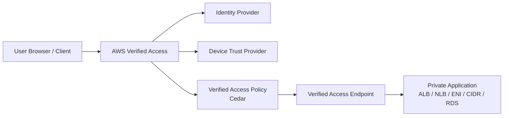
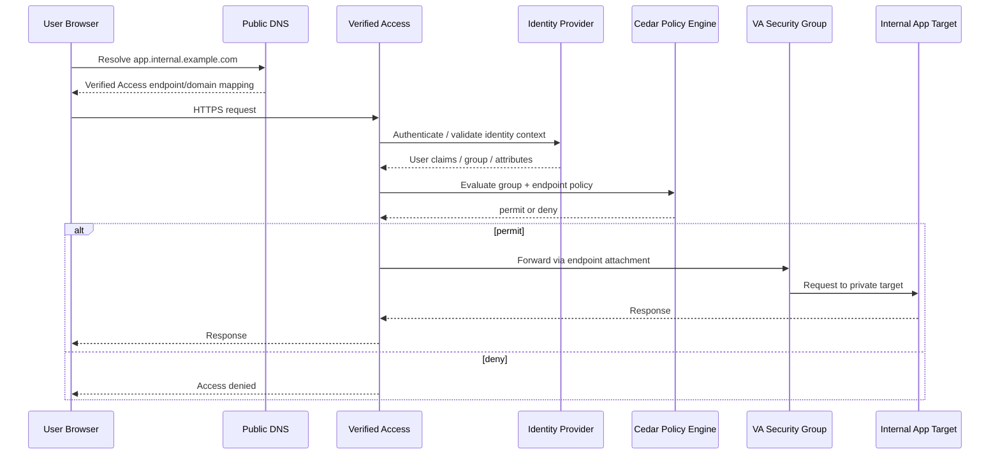
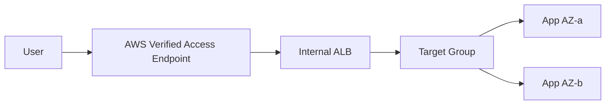
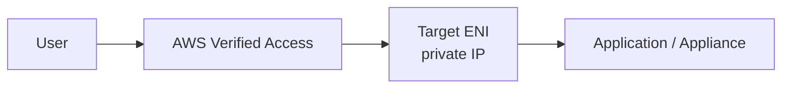
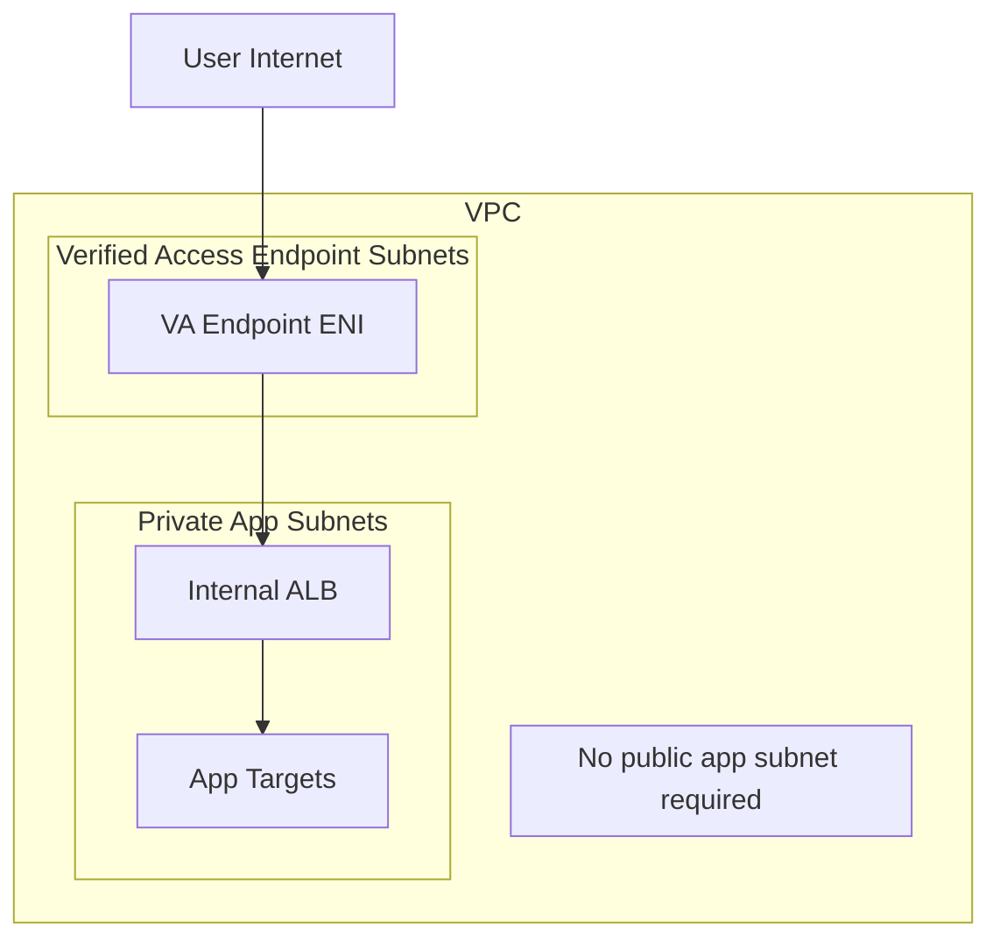
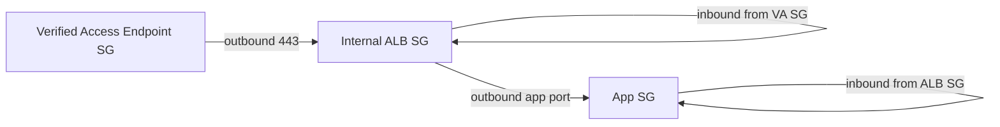
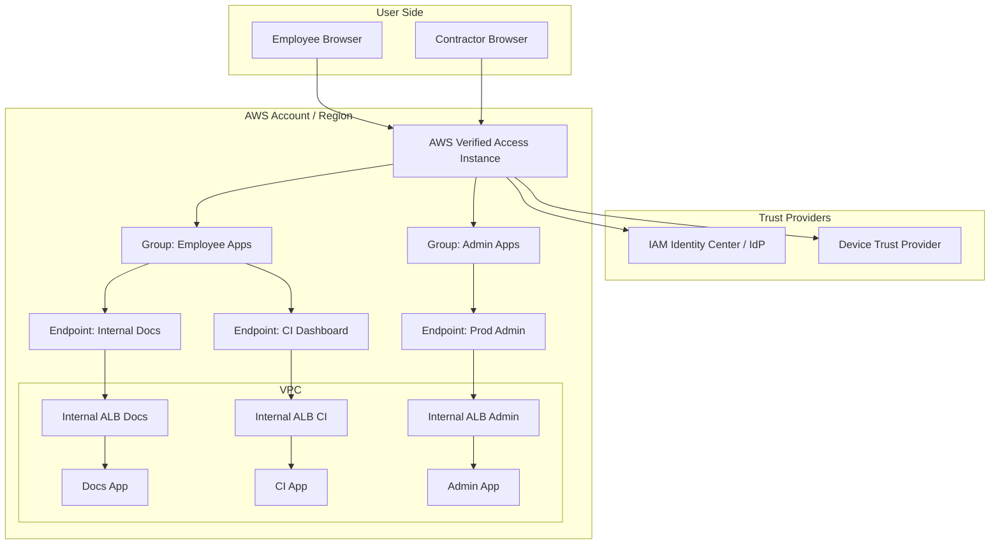

# Part 037 — AWS Verified Access and Zero Trust Access

VPN menjawab pertanyaan:

> “Bagaimana user masuk ke network internal?”

Zero trust access menjawab pertanyaan yang lebih tepat:

> “Apakah user ini, dari device ini, dengan context ini, boleh mengakses aplikasi ini, saat ini?”

Perbedaannya besar.

VPN memperluas network reachability user. Setelah tunnel aktif, user biasanya berada “di dalam” sebagian network. Dari sana, security group, route, DNS, endpoint, dan aplikasi harus menahan sendiri blast radius dari credential/device yang bermasalah.

AWS Verified Access membalik model itu. User tidak diberi akses network umum. User diberi akses ke aplikasi atau resource tertentu melalui policy yang mengevaluasi identity context dan, bila digunakan, device context.

AWS mendeskripsikan Verified Access sebagai layanan untuk memberi secure access ke aplikasi tanpa harus memakai VPN. Verified Access mengevaluasi setiap application request dan memastikan user hanya dapat mengakses aplikasi ketika memenuhi security requirements yang didefinisikan. Ini bukan “VPN baru”. Ini adalah application access control plane di depan private application.

---

## 1. Mental Model

Bayangkan internal application berada di private subnet. Dahulu, engineer biasanya membuat salah satu dari ini:

- bastion host;
- Client VPN;
- public ALB + auth;
- CloudFront + WAF + custom auth;
- private ALB hanya reachable dari corporate network;
- reverse proxy buatan sendiri.

Verified Access adalah managed access proxy + policy evaluator di depan application endpoint.



Request tidak hanya bertanya “apakah port 443 terbuka?”.

Request bertanya:

```txt
is user authenticated?
is identity trusted?
is device posture acceptable?
does group policy allow this class of app?
does endpoint policy allow this app specifically?
is endpoint reachable from Verified Access endpoint ENI?
does backend allow traffic from Verified Access security group?
```

Jika jawabannya ya, request diteruskan ke application target. Jika tidak, request ditolak sebelum user masuk ke private network.

---

## 2. Why This Exists

Remote access tradisional sering gagal karena unit aksesnya terlalu besar.

| Model | Unit akses | Masalah |
|---|---|---|
| Bastion | Host/jumpbox | SSH sprawl, credential forwarding, audit lemah, blast radius tinggi |
| VPN | Network/CIDR | User dapat network reachability lebih luas dari app yang dibutuhkan |
| Public ALB | Public endpoint | App exposure meningkat, auth harus dibangun/dioperasikan sendiri |
| Private ALB over corporate WAN | Network perimeter | Device compromised tetap dianggap “inside” |
| Verified Access | Application/resource endpoint | Akses diputuskan per request/per resource berdasarkan trust context |

Zero trust bukan berarti tidak percaya siapa pun secara absolut. Zero trust berarti tidak memakai lokasi network sebagai bukti utama kepercayaan.

Di cloud, “inside VPC” bukan security property yang cukup. VPC hanya isolation boundary. Authorization tetap harus eksplisit.

---

## 3. Core Components

AWS Verified Access punya beberapa primitive. Kalau salah satu tidak jelas, debugging akan kacau.

| Komponen | Fungsi |
|---|---|
| Verified Access instance | Container regional untuk trust providers dan endpoint groups |
| Trust provider | Sumber trust context: identity provider atau device provider |
| Verified Access group | Grouping endpoint dengan baseline policy bersama |
| Verified Access endpoint | Representasi aplikasi/resource yang diekspos via Verified Access |
| Group policy | Minimum policy yang berlaku ke semua endpoint dalam group |
| Endpoint policy | Policy tambahan untuk endpoint tertentu |
| Application domain | DNS name yang dipakai user untuk mengakses aplikasi HTTP/HTTPS |
| Endpoint domain | DNS name yang dibuat Verified Access untuk endpoint |
| Security group | Network guardrail untuk traffic dari Verified Access endpoint ke target |
| Logs | Audit decision, identity/device context, request metadata |

Pola umumnya:

```txt
instance
  -> trust provider(s)
  -> group(s)
       -> group policy
       -> endpoint(s)
            -> optional endpoint policy
            -> backend target
```

Group bukan sekadar folder. Group adalah policy boundary.

Endpoint bukan sekadar DNS record. Endpoint adalah access target dengan policy dan network attachment.

---

## 4. Request Flow

Untuk HTTP/HTTPS application, alur konseptualnya seperti ini:



Ada dua path yang harus dipisahkan:

1. **Access decision path**: identity, device, policy.
2. **Network forwarding path**: endpoint ENI/security group/backend reachability.

Salah satu kesalahan umum: ketika user gagal akses aplikasi, engineer langsung mengecek route table. Padahal bisa saja policy deny. Atau sebaliknya, policy permit tapi backend security group tidak menerima source dari Verified Access endpoint.

---

## 5. Trust Providers

Trust provider adalah sumber data yang dipakai Verified Access untuk mengevaluasi request.

AWS menyebut data dari trust provider sebagai **trust context**. Trust context bisa berisi identity attribute seperti email/group membership atau device attribute seperti patch level/antivirus state, tergantung provider.

Jenis besar:

| Jenis trust | Contoh konteks | Digunakan untuk |
|---|---|---|
| User identity | user id, email, group, verified email, directory membership | “Siapa user ini?” |
| Device posture | managed device, compliance status, OS patch, security agent status | “Apakah device ini layak dipercaya?” |

Verified Access mendukung AWS dan third-party trust providers. Untuk identity, IAM Identity Center dapat digunakan sebagai user-identity trust provider. Untuk setiap Verified Access instance, model yang perlu diingat adalah: satu identity trust provider dan bisa ada beberapa device trust provider.

### 5.1 Trust Context Is Not Authorization by Itself

Identity provider memberi klaim. Device provider memberi posture. Tetapi keputusan akses tetap di policy.

```txt
trust provider says: user belongs to group X
policy decides: group X may access app Y only if condition Z also true
```

Jangan menyamakan “user authenticated” dengan “user authorized”.

Authentication menjawab:

```txt
is this really Alice?
```

Authorization menjawab:

```txt
should Alice access this application now?
```

Trust context hanya input.

---

## 6. Verified Access Policy and Cedar

Verified Access policies ditulis dengan Cedar, policy language yang juga dipakai dalam ekosistem authorization AWS modern.

Policy mengevaluasi request berdasarkan context dari trust provider. Secara sederhana:

```cedar
permit(principal, action, resource)
when {
    context.identity.user.email.verified == true
};
```

Contoh di atas bukan template universal. Nama context mengikuti policy reference name trust provider yang dikonfigurasi. Di production, policy harus explicit terhadap provider context, group claim, dan requirement aplikasi.

### 6.1 Policy Layering

Ada dua tempat policy penting:

| Policy | Scope | Gunakan untuk |
|---|---|---|
| Group policy | Semua endpoint dalam group | Baseline requirement: corporate identity, managed device, MFA, employee group |
| Endpoint policy | Endpoint tertentu | App-specific requirement: finance group, admin path, special role |

Model yang sehat:

```txt
group policy = minimum bar
endpoint policy = additional narrowing
```

Jangan menaruh semua policy di endpoint jika requirementnya berlaku untuk banyak aplikasi. Itu membuat drift.

Jangan menaruh semua policy di group jika aplikasi punya risk profile berbeda. Itu membuat over-permissive access.

### 6.2 Policy Design Invariants

Policy production harus punya invariants:

```txt
Every app requires authenticated identity.
Sensitive apps require device posture.
Admin apps require narrower group.
Break-glass apps are separate group.
No endpoint policy weakens group policy.
Policy changes are code reviewed.
Deny cases are logged and testable.
```

Policy access bukan file konfigurasi biasa. Itu security boundary.

---

## 7. Endpoint Types

Verified Access endpoint merepresentasikan application/resource. AWS mendokumentasikan beberapa endpoint type:

- load balancer;
- network interface;
- network CIDR;
- Amazon RDS.

Masing-masing punya semantics berbeda.

| Endpoint type | Target | Cocok untuk | Catatan |
|---|---|---|---|
| Load balancer | Internal ALB/NLB | Web app, service behind LB, multi-AZ app | Load balancer harus internal dan berada di VPC yang sama dengan subnets endpoint |
| Network interface | ENI private IP | Single appliance/app instance | Lebih direct, lebih ketat, tetapi kurang elastis |
| Network CIDR | CIDR + port range | Fleet/resource ephemeral, SSH/RDP-style access via client model | Butuh desain port/range yang disiplin |
| RDS | RDS instance/cluster/proxy | Database access via Verified Access | Gunakan dengan kontrol identitas ketat dan audit kuat |

Untuk load balancer endpoint, requirement penting adalah internal ALB/NLB. User mengakses application domain publik, tetapi backend tetap private.



Untuk network interface endpoint, traffic diteruskan ke private IP ENI.



---

## 8. HTTP/HTTPS vs TCP Thinking

Verified Access historis paling mudah dipahami sebagai access layer untuk HTTP/HTTPS app. Namun desain modern juga mencakup non-HTTP/TCP-style access melalui endpoint types tertentu dan client/connectivity model.

Jangan menyamakan semua protocol.

| Protocol shape | Access behavior | Engineering implication |
|---|---|---|
| HTTP/HTTPS browser app | Browser redirects/auth challenge, headers, cookies, app domain | Cocok untuk internal web apps |
| TCP app | Client/tunnel model, destination/port specific | Cocok untuk database/admin/protocol non-web dengan guardrail kuat |
| RDS/database | Highly sensitive, stateful sessions | Butuh least privilege, session audit, narrow users/groups |

Untuk HTTP, aplikasi bisa menerima header seperti identity metadata dan original client information tergantung konfigurasi dan endpoint behavior.

Untuk TCP, jangan berharap semantics HTTP seperti header, path-based authorization, atau browser redirect.

---

## 9. Network Placement

Verified Access tetap punya network path. Ini bukan pure identity service yang menghapus routing.

Ketika endpoint dibuat, ada subnet dan security group yang relevan. Traffic dari Verified Access endpoint menuju backend harus diizinkan oleh network control.



Security group chain:

```txt
VA endpoint SG outbound -> internal ALB SG inbound
internal ALB SG outbound -> app target SG inbound
app target return traffic -> stateful SG return path
```

For HTTP apps behind ALB:

```txt
App target SG should allow inbound only from ALB SG.
ALB SG should allow inbound only from Verified Access endpoint SG.
Verified Access endpoint SG should allow outbound only to ALB listener port.
```

This gives a clean chain of custody.

---

## 10. DNS and Application Domain

Untuk HTTP/HTTPS, user mengakses domain aplikasi seperti:

```txt
hr.internal.example.com
admin.internal.example.com
case-management.internal.example.com
```

Domain itu perlu diarahkan ke Verified Access endpoint domain, biasanya melalui CNAME/alias-style pattern sesuai DNS provider dan certificate requirement.

Konsep penting:

| Name | Meaning |
|---|---|
| Application domain | Nama yang user ketik/buka |
| Endpoint domain | Nama yang dibuat Verified Access untuk endpoint |
| Certificate | Public TLS certificate yang cocok dengan application domain |
| Backend DNS | Nama internal yang digunakan endpoint/backend untuk mencapai target |

Jangan mencampur application domain dan backend domain.

```txt
external user-facing name:
  admin.example.com -> Verified Access endpoint

internal target:
  internal-admin-alb.us-east-1.elb.amazonaws.com
```

Jika app masih membuat absolute redirect ke internal hostname, user akan melihat nama yang tidak bisa diakses. Aplikasi harus tahu public-facing application domain.

---

## 11. Verified Access vs Client VPN

Ini pertanyaan desain paling sering.

| Kriteria | Client VPN | Verified Access |
|---|---|---|
| Unit akses | CIDR/network route | Application/resource endpoint |
| User experience | VPN client | Browser/app client depending endpoint |
| Best for | Network admin access, broad private network need | App-specific access, least privilege remote access |
| Blast radius | Bisa besar jika route/authorization longgar | Lebih kecil karena endpoint-specific |
| Policy | Auth + route + authorization rules | Identity/device context + Cedar policy |
| DNS | VPN DNS/split-tunnel complexity | App domain per endpoint |
| App exposure | Private via tunnel | Public-facing access layer to private app |
| Legacy protocols | Stronger general fit | Depends endpoint/protocol/client model |
| Governance | Network team heavy | Security/platform/app team shared |

Rule of thumb:

```txt
Need user to access many private CIDRs/tools temporarily?
  -> Client VPN may fit.

Need user to access a small set of internal apps with per-app policy?
  -> Verified Access should be considered first.

Need machine-to-machine private connectivity?
  -> Not Verified Access; consider PrivateLink, TGW, VPC Lattice, VPN/DX.
```

---

## 12. Verified Access vs Bastion

Bastion still appears because it is simple to understand. But it is rarely simple to operate securely.

| Bastion issue | Verified Access alternative |
|---|---|
| Shared jump host becomes high-value target | No generic jump host required for app access |
| SSH keys proliferate | Identity provider controls user identity |
| Hard to apply device posture | Trust provider can include device posture |
| Broad lateral movement after login | Endpoint-specific access |
| Audit often command/session level only if extra tooling exists | Access logs at policy/request boundary |
| Patching bastion is operational burden | Managed access layer |

Bastion may still be useful for emergency admin operations, but it should not be the default access path for internal business applications.

---

## 13. Verified Access vs ALB Authentication

Application Load Balancer supports authentication with OIDC/Cognito for HTTP apps. So why Verified Access?

ALB auth is application-entry authentication. Verified Access is centralized app access governance with trust providers, groups, and Cedar policies.

| Concern | ALB auth | Verified Access |
|---|---|---|
| Identity-aware access | Yes, for supported patterns | Yes |
| Device posture | Not the primary model | Core use case via device trust providers |
| Centralized app access governance | Limited | Stronger group/endpoint structure |
| Multi-app consistent policy | Needs duplication | Group policy + endpoint policy |
| Network/resource endpoint types | Load balancer focused | LB, ENI, CIDR, RDS endpoints |
| Zero-trust posture | Partial | Purpose-built |

ALB auth can be enough for simpler internal web apps. Verified Access becomes more valuable when access policy must be consistent across many private apps and include identity/device context.

---

## 14. Verified Access vs CloudFront + WAF

CloudFront + WAF is edge delivery and web protection. Verified Access is private application access.

| Need | Better fit |
|---|---|
| Global CDN cache | CloudFront |
| DDoS/web exploit filtering at edge | CloudFront + WAF + Shield |
| Public consumer app protection | CloudFront/WAF/API Gateway/ALB |
| Employee access to private apps without VPN | Verified Access |
| Identity/device posture policy | Verified Access |
| App-level zero trust for private apps | Verified Access |

They can coexist, but do not force CDN mental model onto employee private access.

---

## 15. Policy Examples

### 15.1 Baseline Employee Access

Conceptual policy:

```cedar
permit(principal, action, resource)
when {
    context.idp.user.email.verified == true &&
    context.idp.groups.contains("employees")
};
```

This says: authenticated and verified employee.

But production needs provider-specific context names and actual group claim format. Do not paste pseudocode without validating context schema.

### 15.2 Device-Managed Requirement

```cedar
permit(principal, action, resource)
when {
    context.idp.groups.contains("employees") &&
    context.device.compliance.status == "compliant"
};
```

This is the useful zero trust part: identity alone is not enough.

### 15.3 App-Specific Admin Access

Group policy:

```cedar
permit(principal, action, resource)
when {
    context.idp.groups.contains("employees") &&
    context.device.compliance.status == "compliant"
};
```

Endpoint policy:

```cedar
permit(principal, action, resource)
when {
    context.idp.groups.contains("platform-admins")
};
```

Interpretation:

```txt
All endpoints in group require employee + compliant device.
This endpoint additionally requires platform-admins.
```

### 15.4 Risk-Based Segmentation

| App class | Group policy | Endpoint policy |
|---|---|---|
| Internal docs | employee identity | optional department group |
| CI dashboard | employee + managed device | engineering group |
| Production admin | employee + managed device + MFA signal if available | platform-admins + break-glass path |
| Finance system | employee + compliant device | finance group + stronger audit |
| Regulated case system | employee + compliant device | case-role + region/business-unit constraints |

Do not put all internal apps under one giant group with one permissive policy.

---

## 16. Designing Groups

A group is a policy boundary. Design it like a network segment.

Bad group design:

```txt
verified-access-group-all-internal-apps
```

Why bad:

- every app inherits the same baseline;
- sensitive apps depend entirely on endpoint policy;
- policy review becomes noisy;
- blast radius of group policy mistake is large.

Better:

```txt
va-group-employee-low-risk
va-group-engineering-tools
va-group-production-admin
va-group-regulated-workflows
va-group-vendor-access
```

Each group should correspond to a shared risk profile, not an org chart alone.

### 16.1 Group Design Matrix

| Dimension | Question |
|---|---|
| Data sensitivity | Does this app expose confidential/regulated data? |
| Action criticality | Can user mutate production or compliance state? |
| Audience | Employee, contractor, vendor, break-glass admin? |
| Device requirement | Managed only, compliant only, browser enough? |
| Protocol | HTTP, TCP, database, admin protocol? |
| Audit need | Request-level, session-level, privileged action correlation? |
| Availability | Is access path production-critical? |

Group policy should reflect the strongest common denominator.

---

## 17. Endpoint Design

Endpoint should map to a user-intelligible application or resource boundary.

Good endpoint names:

```txt
va-endpoint-prod-case-management
va-endpoint-staging-observability
va-endpoint-prod-finance-admin
va-endpoint-dev-rds-readonly
```

Bad endpoint names:

```txt
endpoint-1
internal-lb
misc-tools
admin
```

Endpoint naming matters because logs, policy review, and incident response depend on it.

### 17.1 One Endpoint per App Boundary

Avoid bundling unrelated apps behind one endpoint simply because they share one ALB.

If one endpoint gives access to:

```txt
/admin
/finance
/hr
/debug
```

then one endpoint policy must reason about all of them. That is fragile.

Prefer separate application domains and endpoint boundaries when access requirements differ.

---

## 18. Security Group Pattern

For load balancer endpoint:



Rule shape:

```txt
sg-va-endpoint:
  outbound tcp/443 -> sg-internal-alb

sg-internal-alb:
  inbound tcp/443 <- sg-va-endpoint
  outbound app-port -> sg-app

sg-app:
  inbound app-port <- sg-internal-alb
```

Do not allow app target inbound from broad corporate CIDR unless necessary. That defeats the endpoint-specific access model.

---

## 19. Logging and Observability

Verified Access logging should answer:

```txt
who tried to access what?
what trust context was evaluated?
which policy allowed/denied?
which endpoint/group was involved?
from where?
when?
```

Useful log dimensions:

| Dimension | Why it matters |
|---|---|
| user identity | audit and incident response |
| trust provider context | explains policy decision |
| group/endpoint id/name | maps request to app boundary |
| decision | permit/deny debugging |
| source information | anomaly detection |
| request metadata | app behavior correlation |

AWS allows trust context inclusion in Verified Access logs. This is useful for policy design/debugging, but treat it as sensitive data. Identity/device attributes can be personally identifiable or security-sensitive.

### 19.1 Logging Invariants

```txt
Access logs are enabled before production traffic.
Deny decisions are kept long enough to troubleshoot onboarding.
Sensitive trust context fields are protected.
Logs are correlated with app logs via request id/header where possible.
Policy changes are correlated with access-denied spikes.
```

---

## 20. Failure Modes

### 20.1 User Authenticates but Gets Denied

Possible causes:

```txt
user not in expected IdP group
email not verified / claim missing
policy reference name mismatch
Cedar expression references wrong context path
device posture absent or non-compliant
endpoint policy stricter than expected
group policy denies before endpoint is considered
```

Debug order:

```txt
1. Confirm user identity in IdP.
2. Confirm claims emitted by provider.
3. Check trust context in logs if enabled.
4. Validate group policy.
5. Validate endpoint policy.
6. Test with known-good user/device.
```

### 20.2 Policy Permits but App Does Not Load

Possible causes:

```txt
backend target unhealthy
internal ALB SG does not allow VA endpoint SG
VA endpoint SG egress missing
wrong port/protocol
app redirects to private hostname
certificate/domain mismatch
NACL blocks ephemeral return traffic
route table missing local/target path in unusual topology
```

Debug order:

```txt
1. Check Verified Access decision logs.
2. Check endpoint health/status.
3. Check internal ALB target health.
4. Check SG chain.
5. Check app redirect/cookie/domain config.
6. Check VPC Flow Logs for VA endpoint ENI and backend ENI.
```

### 20.3 Works for Some Users, Not Others

Likely not a network issue.

Check:

```txt
group membership propagation
IdP claim mapping
device compliance difference
MFA/session age policy
conditional access rule at IdP
policy references group id vs group name mismatch
```

### 20.4 Works from Browser, Fails from API Client

Check:

```txt
protocol assumptions
redirect handling
cookie/session support
TLS SNI
custom headers
non-browser authentication flow
```

Verified Access is not automatically a drop-in replacement for every API client unless the client can follow the required authentication/access flow.

---

## 21. Production Rollout Strategy

Do not migrate all private apps at once.

### 21.1 Phase 1 — Inventory

Create an access inventory:

| App | Current access | Users | Protocol | Risk | Backend | Candidate? |
|---|---|---|---|---|---|---|
| Internal wiki | VPN | all employees | HTTPS | low | internal ALB | yes |
| CI dashboard | VPN | engineering | HTTPS | medium | internal ALB | yes |
| Prod DB | bastion | DBA/SRE | TCP | high | RDS | carefully |
| SSH fleet | bastion | SRE | SSH | high | EC2 CIDR | carefully |
| Legacy thick client | VPN | ops | custom TCP | medium | EC2 | maybe |

### 21.2 Phase 2 — Low-Risk HTTP App

Start with one low-risk internal HTTPS app behind internal ALB.

Acceptance criteria:

```txt
User can access without VPN.
Only intended group can access.
Unmanaged device is denied.
Backend is not public.
Logs show permit/deny decisions.
App does not leak internal hostname.
Rollback path exists.
```

### 21.3 Phase 3 — Policy-as-Code

Treat policies as code:

```txt
repo/
  verified-access/
    groups/
      employee-low-risk.cedar
      engineering-tools.cedar
    endpoints/
      ci-dashboard.cedar
      prod-admin.cedar
    tests/
      ci-dashboard.allow.json
      ci-dashboard.deny.json
```

Even if AWS console allows direct editing, production should use IaC and review.

### 21.4 Phase 4 — Migrate App Classes

Order:

```txt
low-risk HTTP internal apps
engineering dashboards
audited admin portals
select TCP apps
select database/admin access
```

Do not start with production database access unless your identity, device posture, logging, and rollback are mature.

---

## 22. Governance Model

Verified Access touches multiple teams.

| Concern | Owner |
|---|---|
| Trust provider config | Security/IAM platform |
| Device posture provider | Security endpoint team |
| Verified Access instance baseline | Network/platform team |
| Group policy | Security + platform |
| Endpoint policy | App owner + security reviewer |
| Backend SG | App/platform owner |
| DNS/certificate | Platform/network owner |
| Logs/SIEM | Security operations |

This is not a “network-only” service.

A good operating model requires contracts:

```txt
Application team declares app access requirement.
Security team defines identity/device baseline.
Platform team provisions endpoint and DNS.
Network team validates private backend path.
SOC consumes access logs.
```

---

## 23. Cost and Complexity

Verified Access can reduce operational burden from VPN/bastion, but it introduces new cost and complexity:

- endpoint management;
- policy lifecycle;
- certificate/domain management;
- trust provider integration;
- logging volume;
- user onboarding support;
- app compatibility testing;
- private backend SG/DNS changes.

The important trade-off:

```txt
VPN complexity is usually hidden in broad reachability.
Verified Access complexity is explicit in per-app policy.
```

Explicit complexity is usually better for regulated systems, but it must be engineered.

---

## 24. Anti-Patterns

### 24.1 “Verified Access but Backend Still Public”

If backend ALB remains internet-facing, Verified Access is just another front door, not the only front door.

Correct pattern:

```txt
backend load balancer = internal
security group = allow only from VA endpoint SG
public DNS = points to VA access path
```

### 24.2 One Giant Group for Everything

```txt
va-group-all-apps
```

This recreates VPN blast radius at policy layer.

### 24.3 Policy Only Checks Email Domain

```txt
email endsWith "@company.com"
```

This is weak. Use verified identity, group/role, and device posture when needed.

### 24.4 No Deny Testing

Access systems are not tested only by successful login.

You must test:

```txt
wrong group denied
unmanaged device denied
former employee denied
contractor denied from restricted app
break-glass only when intended
```

### 24.5 App Redirects to Internal DNS

User accesses:

```txt
https://admin.example.com
```

App responds:

```txt
Location: https://internal-admin-alb.local/login
```

This breaks user experience and may leak internals. Configure app external URL properly.

---

## 25. Regulatory and Audit Thinking

For regulatory systems, access evidence matters.

Verified Access can strengthen audit story because access decision occurs before app reachability. But evidence must be retained and correlated.

Useful audit assertions:

```txt
Only authenticated workforce identities can reach internal case management UI.
High-risk workflow tools require managed compliant devices.
Vendor access is isolated into separate endpoint groups.
Production admin access has separate policy and stronger review.
All allow/deny decisions are logged centrally.
Policy changes are version controlled and reviewed.
Backend apps are private and only accept traffic from Verified Access path.
```

A control is defensible only if it can be shown.

---

## 26. Reference Architecture — Private Workforce Apps



Policy model:

```txt
Employee Apps group:
  require employee identity + verified email

Admin Apps group:
  require employee identity + compliant managed device

Prod Admin endpoint:
  additionally require platform-admins group
```

Network model:

```txt
All backend ALBs are internal.
Each ALB allows inbound from corresponding Verified Access endpoint SG.
App targets allow inbound only from ALB SG.
No direct public route to applications.
```

---

## 27. Decision Checklist

Use Verified Access when:

```txt
you need private app access without broad VPN reachability
you need per-app identity/device-aware policy
you need centralized workforce access governance
you want to reduce bastion/VPN dependency for internal apps
you can put apps behind supported endpoint types
you can manage DNS/certificates/policies cleanly
```

Be cautious when:

```txt
app uses unusual protocol/client flow
users need broad network troubleshooting access
backend app assumes internal hostnames everywhere
identity/device provider data is immature
policy ownership is unclear
logging retention/security is not ready
```

Do not use Verified Access for:

```txt
machine-to-machine service networking
VPC-to-VPC routing
bulk hybrid connectivity
public CDN delivery
internal microservice mesh
```

For those, use PrivateLink, VPC Lattice, TGW, Cloud WAN, VPN, Direct Connect, CloudFront, or service mesh depending on the problem.

---

## 28. Implementation Blueprint

### 28.1 Prepare Identity and Device Context

```txt
1. Choose identity trust provider.
2. Decide group/claim source of truth.
3. Decide whether device posture is required.
4. Define policy reference names.
5. Validate sample context in logs/test environment.
```

### 28.2 Prepare Backend

```txt
1. Put app behind internal ALB/NLB or supported target.
2. Ensure app has stable health checks.
3. Configure app external URL to application domain.
4. Remove direct public exposure.
5. Prepare SG chain from VA endpoint to backend.
```

### 28.3 Create Access Boundary

```txt
1. Create Verified Access instance.
2. Attach trust provider.
3. Create group for app risk class.
4. Attach group policy.
5. Create endpoint.
6. Attach endpoint policy if needed.
7. Configure DNS and certificate.
8. Enable logs.
```

### 28.4 Test

```txt
positive: intended user + compliant device can access
negative: wrong group denied
negative: unmanaged device denied
negative: no backend public access
failure: unhealthy backend returns predictable error
observability: logs show enough data to debug
rollback: previous VPN/bastion path still available temporarily
```

---

## 29. Debugging Runbook

When user says “Verified Access is broken”, do not guess.

### Step 1 — Classify Failure

```txt
Cannot resolve domain?
Cannot authenticate?
Access denied?
Blank page / 502 / timeout?
Only some users?
Only some devices?
Only some paths?
```

### Step 2 — DNS and TLS

```txt
dig app.example.com
check CNAME/record to VA endpoint path
check certificate CN/SAN
check browser TLS error
check application domain configured on endpoint
```

### Step 3 — Identity/Policy

```txt
check user group in IdP
check session freshness/MFA if applicable
check trust context in logs
check Cedar policy reference paths
check group policy
check endpoint policy
```

### Step 4 — Network

```txt
check endpoint status
check backend ALB health
check VA endpoint SG outbound
check ALB SG inbound from VA SG
check app target SG inbound from ALB SG
check NACL if restrictive
check Flow Logs for reject/accept
```

### Step 5 — App Behavior

```txt
check redirects
check cookies domain/SameSite/Secure
check host header expectations
check X-Forwarded-* behavior
check absolute URLs generated by app
check websocket/long-lived connection support for chosen endpoint/protocol
```

---

## 30. Minimal Production Standard

A production-grade Verified Access deployment should have:

```txt
separate groups by risk class
identity trust provider configured centrally
device posture for sensitive apps
policies stored as code
negative access tests
internal-only backend targets
SG chain using SG references, not broad CIDR
DNS/cert ownership documented
access logs enabled
trust context logging decision documented
SIEM integration
rollback path
runbook for deny vs network failures
```

If you cannot meet these, do a smaller rollout first.

---

## 31. Mental Model Summary

Verified Access is not “VPN with a different UI”.

It is:

```txt
identity/device-aware access proxy
+ per-application/resource endpoint
+ Cedar policy evaluation
+ private backend forwarding
+ centralized logging/governance
```

The winning pattern is:

```txt
private app
+ internal backend
+ Verified Access endpoint
+ narrow SG chain
+ group baseline policy
+ endpoint-specific policy
+ strong logs
```

The losing pattern is:

```txt
public app still exposed
+ giant all-users group
+ weak policy
+ no deny tests
+ unclear ownership
```

Zero trust is not a slogan. It is a reduction of implicit trust from network location into explicit, auditable, per-request authorization.

---

## 32. What Comes Next

Client VPN gave us remote network access.

Verified Access gave us identity/device-aware application access.

But both depend on names resolving correctly. In hybrid and multi-account AWS, DNS becomes one of the most important control planes in the system.

Next part: **Hybrid DNS with Route 53 Resolver**.

---

## References

- AWS Verified Access — What is AWS Verified Access: https://docs.aws.amazon.com/verified-access/latest/ug/what-is-verified-access.html
- AWS Verified Access — How Verified Access works: https://docs.aws.amazon.com/verified-access/latest/ug/how-it-works.html
- AWS Verified Access — Trust providers: https://docs.aws.amazon.com/verified-access/latest/ug/trust-providers.html
- AWS Verified Access — User-identity trust providers: https://docs.aws.amazon.com/verified-access/latest/ug/user-trust.html
- AWS Verified Access — Verified Access groups: https://docs.aws.amazon.com/verified-access/latest/ug/verified-access-groups.html
- AWS Verified Access — Verified Access endpoints: https://docs.aws.amazon.com/verified-access/latest/ug/verified-access-endpoints.html
- AWS Verified Access — Load balancer endpoint: https://docs.aws.amazon.com/verified-access/latest/ug/create-load-balancer-endpoint.html
- AWS Verified Access — Network interface endpoint: https://docs.aws.amazon.com/verified-access/latest/ug/create-network-interface-endpoint.html
- AWS Verified Access — Policies: https://docs.aws.amazon.com/verified-access/latest/ug/auth-policies.html
- AWS Verified Access — Trust context in logs: https://docs.aws.amazon.com/verified-access/latest/ug/include-trust-context.html
