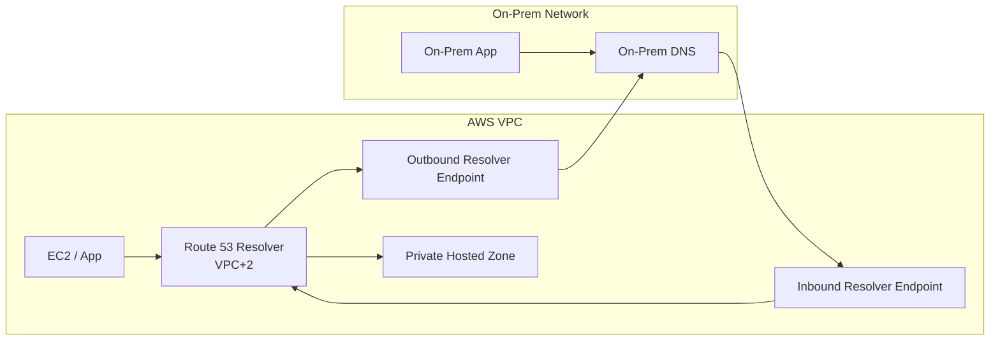
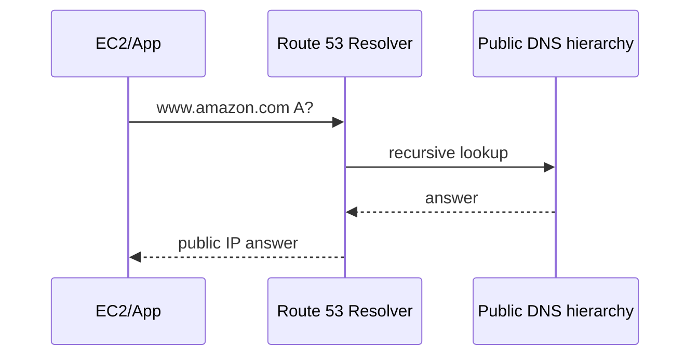
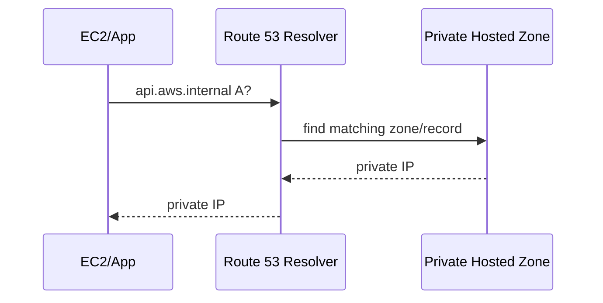
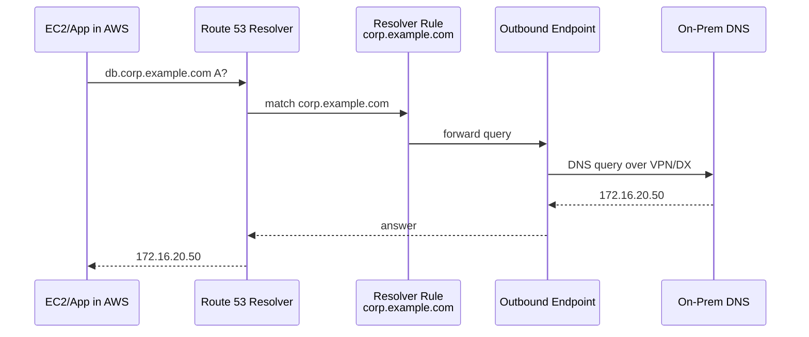
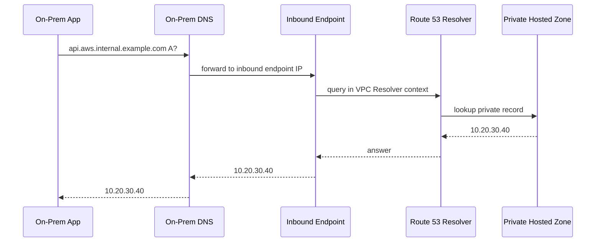
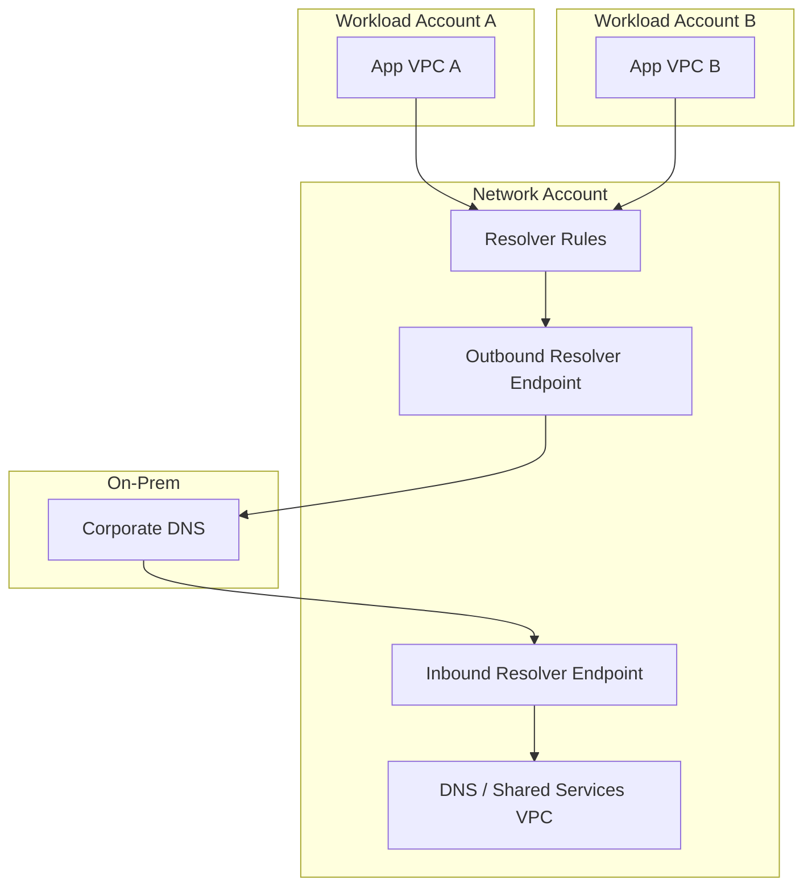
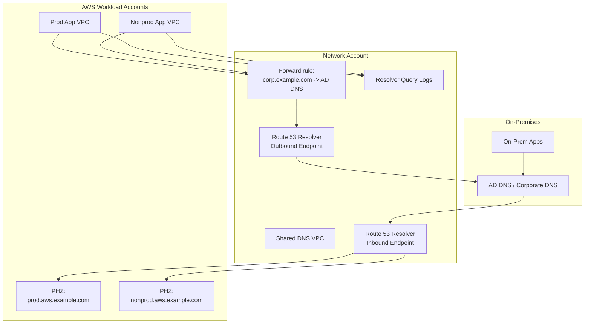

# Part 038 — Hybrid DNS with Route 53 Resolver

Network engineer sering mengejar route table lebih dulu.

Production incident sering berkata lain:

```txt
Route benar.
Security group benar.
VPN/DX up.
Application sehat.
Tapi nama yang di-resolve salah.
```

DNS adalah control plane yang mengubah nama menjadi alamat. Dalam hybrid AWS, DNS juga menjadi policy layer tersembunyi: apakah workload AWS harus bertanya ke Route 53 private hosted zone, on-prem DNS, public DNS, atau AWS-managed private zone dari VPC endpoint?

Jika DNS salah, packet berjalan ke tempat yang salah. Jika DNS loop, request tidak pernah selesai. Jika private hosted zone terlalu luas, public name bisa tertutup dan menghasilkan NXDOMAIN. Jika forwarding rule salah prioritas, query yang seharusnya lokal malah keluar ke on-prem.

Part ini membahas Route 53 Resolver sebagai mesin hybrid DNS AWS.

---

## 1. Mental Model

Di setiap VPC, workload biasanya mengirim DNS query ke Amazon-provided DNS resolver. Secara konseptual, alamatnya adalah VPC base address + 2, misalnya VPC `10.0.0.0/16` memakai `10.0.0.2`.

Route 53 Resolver menjawab query untuk:

- public DNS names;
- VPC-specific DNS names;
- private hosted zones yang associated dengan VPC;
- AWS-managed private hosted zones, misalnya interface endpoint dengan Private DNS;
- query yang perlu diteruskan via Resolver rules.

Untuk hybrid cloud, Resolver endpoint dan forwarding rules membuat query bisa bergerak dua arah:



Two directions:

| Direction | Mechanism | Example |
|---|---|---|
| AWS → on-prem DNS | Outbound endpoint + forwarding rule | EC2 resolves `db.corp.example.com` via on-prem DNS |
| on-prem → AWS private DNS | Inbound endpoint | On-prem resolves `api.aws.internal.example.com` in Route 53 PHZ |

Resolver is not just DNS plumbing. It is the DNS router for hybrid name resolution.

---

## 2. Why Hybrid DNS Is Hard

Hybrid DNS is hard because there are multiple authorities.

| Namespace | Typical authority |
|---|---|
| `example.com` public | Public Route 53 hosted zone or external registrar/DNS |
| `aws.example.internal` | Route 53 private hosted zone |
| `corp.example.internal` | On-prem DNS / Active Directory DNS |
| `vpce.amazonaws.com` service names | AWS-managed private hosted zone behavior |
| reverse lookup `in-addr.arpa` | Could be AWS or on-prem depending IP range |

The system must answer:

```txt
Who is authoritative for this name?
Which resolver should receive this query?
What if multiple rules/zones match?
What if no record exists in the matching private hosted zone?
How do on-prem users resolve AWS-private names?
How do AWS workloads resolve on-prem names?
How do we avoid forwarding loops?
```

DNS bugs are often deterministic but invisible. The wrong answer is cached, then every layer above DNS looks broken.

---

## 3. Core Components

| Component | Purpose |
|---|---|
| Route 53 Resolver | VPC DNS resolver, default DNS engine for VPC workloads |
| Private hosted zone | Authoritative private DNS zone associated with one or more VPCs |
| Inbound endpoint | Lets external/on-prem resolvers query AWS Resolver over private connectivity |
| Outbound endpoint | Lets AWS Resolver forward selected domains to external/on-prem resolvers |
| Resolver forwarding rule | Domain-based forwarding rule associated with VPCs |
| Resolver system rule | Rule to resolve selected domains locally instead of forwarding |
| Query logging | Logs DNS queries for observability/security |
| DNS Firewall | Domain-level filtering; covered deeper in later part |

This part focuses on hybrid resolution. DNS Firewall will be covered in Part 045.

---

## 4. The Default VPC DNS Path

Without custom Resolver endpoints/rules, an EC2 instance does something like:

```txt
app -> /etc/resolv.conf -> VPC Resolver -> answer
```

For public name:



For private hosted zone:



For interface VPC endpoint Private DNS:

```txt
logs.us-east-1.amazonaws.com -> private IP of endpoint ENI
```

This behavior depends on Private DNS being enabled on the endpoint and the VPC using Resolver path.

---

## 5. Private Hosted Zone Semantics

Private hosted zone is authoritative DNS visible only to associated VPCs.

Example:

```txt
zone: aws.internal.example.com
records:
  api.aws.internal.example.com -> 10.10.11.25
  admin.aws.internal.example.com -> internal ALB alias
```

Associated VPCs can resolve names in that zone. Non-associated VPCs cannot, unless you build DNS forwarding or use newer global/private DNS association features where applicable.

### 5.1 Most-Specific Zone Wins

If VPC has overlapping private zones:

```txt
example.com
accounting.example.com
```

Query:

```txt
db.accounting.example.com
```

Resolver chooses the most specific matching hosted zone: `accounting.example.com`.

### 5.2 NXDOMAIN Trap

If a private hosted zone matches but no record exists, Resolver returns NXDOMAIN. It does not fall through to public DNS.

Example:

```txt
PHZ: example.com associated with VPC
Query: www.example.com
Record missing in PHZ
Result: NXDOMAIN, even if public www.example.com exists
```

This is a common outage pattern.

Wrong design:

```txt
Create private hosted zone example.com for a few private records.
Forget to recreate public records needed by internal clients.
```

Better design:

```txt
Use subdomain for private namespace:
  aws.example.com
  internal.example.com
  corp.example.com
```

Or deliberately mirror required public records in private zone if split-horizon behavior is intended.

---

## 6. Outbound Resolver Endpoint

Outbound endpoint sends selected DNS queries from AWS VPC to external resolvers, usually on-prem.

Use case:

```txt
EC2 in AWS needs to resolve db.corp.example.com.
corp.example.com is hosted in on-prem Active Directory DNS.
```

Flow:



Important pieces:

```txt
outbound endpoint placed in VPC subnets
security group allows DNS outbound to on-prem DNS
network path via VPN/DX/TGW exists
resolver rule associated with source VPC
rule domain is specific enough
on-prem DNS can answer and return response
```

Outbound endpoint without forwarding rule does nothing useful.

Forwarding rule without VPC association does nothing for that VPC.

---

## 7. Inbound Resolver Endpoint

Inbound endpoint lets on-prem DNS forward queries to AWS Resolver.

Use case:

```txt
On-prem app needs to resolve api.aws.internal.example.com hosted in Route 53 private hosted zone.
```

Flow:



Important pieces:

```txt
inbound endpoint IPs are private IPs in VPC subnets
on-prem DNS must reach those IPs over VPN/DX
security group on inbound endpoint allows UDP/TCP 53 from on-prem DNS
private hosted zone is associated with the VPC context of resolver
on-prem conditional forwarder points correct domain to inbound endpoint IPs
```

Inbound endpoint does not magically make all AWS private zones visible everywhere. It gives on-prem DNS a target to ask.

---

## 8. Resolver Rules

Resolver rules determine where Resolver sends queries.

Types you should understand:

| Rule type | Meaning |
|---|---|
| Forward | Forward matching domain to target DNS servers via outbound endpoint |
| System | Resolve selected domain locally instead of forwarding |
| Recursive/default | Resolver recursively resolves names not handled by private zones/rules |

Forwarding rule example:

```txt
Domain: corp.example.com
Target IPs: 172.16.10.10, 172.16.10.11
Outbound endpoint: rslvr-out-abc
Associated VPCs: vpc-app-prod, vpc-app-dev
```

Then AWS workloads in those VPCs forward `*.corp.example.com` to on-prem DNS.

### 8.1 Rule Association Is Per VPC

A Resolver rule exists regionally. It only affects VPCs associated with it.

```txt
create rule != apply rule
apply rule = associate rule with VPC
```

This matters in multi-account environments. Sharing rule via RAM is not enough; participant accounts/VPCs still need correct association depending on sharing pattern and automation.

---

## 9. Precedence and Matching

DNS precedence is where many production bugs live.

Important behaviors:

1. Private hosted zones associated with a VPC can override public DNS for matching namespace.
2. If multiple private hosted zones match, the most specific zone wins.
3. If a matching private hosted zone has no matching record, Resolver returns NXDOMAIN rather than falling through to public DNS.
4. If a private hosted zone and Resolver rule exist for the same domain, the Resolver rule takes precedence and forwards the query.
5. Forwarding rules can be made more specific to avoid sending all namespace traffic away.

Example conflict:

```txt
PHZ: example.com
Forwarding rule: example.com -> on-prem DNS
```

Result:

```txt
Resolver rule wins.
Queries for example.com are forwarded to on-prem instead of resolved from PHZ.
```

Better:

```txt
PHZ: aws.example.com
Forwarding rule: corp.example.com -> on-prem
```

Even better: draw namespace ownership explicitly.

---

## 10. Namespace Design

Before building endpoints, design namespaces.

Bad namespace:

```txt
example.com used for public, AWS private, on-prem private, and AD
```

This causes split-horizon complexity and accidental NXDOMAIN.

Better namespace:

```txt
example.com                  public
aws.example.com              AWS private hosted zones
corp.example.com             on-prem corporate DNS
svc.aws.example.com          service discovery
vpce.aws.example.com         optional endpoint aliases
admin.aws.example.com        internal admin apps
```

For regulated systems:

```txt
case.prod.aws.example.com
case.nonprod.aws.example.com
enforcement.prod.aws.example.com
audit.prod.aws.example.com
```

Namespace should encode authority and environment.

### 10.1 Ownership Matrix

| Namespace | Authority | Resolver behavior |
|---|---|---|
| `example.com` | Public DNS | Public recursive unless PHZ intentionally shadows |
| `aws.example.com` | Route 53 PHZ | Associated VPCs resolve locally |
| `corp.example.com` | On-prem DNS | AWS forwards via outbound endpoint |
| `ad.corp.example.com` | AD DNS | AWS forwards via outbound endpoint |
| `prod.aws.example.com` | Route 53 PHZ prod | On-prem forwards via inbound endpoint |

Write this matrix before creating zones.

---

## 11. Centralized Hybrid DNS Pattern

In multi-account AWS, you rarely want every workload account to create its own inbound/outbound endpoints.

Common pattern:

```txt
Network account owns shared DNS resolver VPC.
Outbound endpoints live in DNS VPC.
Inbound endpoints live in DNS VPC.
Resolver rules are shared to workload accounts/VPCs.
Private hosted zones are associated/shared according to ownership.
On-prem DNS forwards AWS namespaces to inbound endpoint IPs.
Workload VPCs forward on-prem namespaces via shared rules.
```



Advantages:

- fewer resolver endpoints;
- consistent forwarding behavior;
- centralized DNS audit;
- easier on-prem allowlisting;
- platform team owns DNS contract.

Risks:

- DNS VPC becomes critical shared dependency;
- bad shared rule affects many VPCs;
- endpoint quota/throughput must be monitored;
- cross-account ownership must be automated.

---

## 12. Distributed Resolver Endpoint Pattern

Each workload/account owns its own Resolver endpoints and rules.

Advantages:

- local autonomy;
- smaller blast radius;
- different business units can have different DNS paths;
- no central DNS VPC bottleneck.

Risks:

- duplicated cost;
- inconsistent forwarding rules;
- route/security drift;
- on-prem DNS must know many inbound endpoint IPs;
- harder governance.

Use distributed only when autonomy or isolation is more important than central consistency.

---

## 13. Hybrid DNS With Transit Gateway / DX / VPN

Resolver endpoints use private IPs. Therefore, DNS path requires network path.

For inbound endpoint:

```txt
on-prem DNS -> VPN/DX/TGW -> inbound endpoint IP:53
```

For outbound endpoint:

```txt
outbound endpoint IP -> VPN/DX/TGW -> on-prem DNS:53
```

Route table considerations:

```txt
subnet route table for resolver endpoint subnets must route on-prem CIDR to TGW/VGW/DX path
on-prem routing must route AWS resolver endpoint subnet CIDRs back to AWS
security groups must allow UDP/TCP 53
NACLs must allow DNS and return ephemeral traffic if restrictive
firewalls must allow DNS path both ways
```

DNS depends on network, and network troubleshooting often depends on DNS. During incident, test by IP first.

---

## 14. Security Group for Resolver Endpoints

Inbound endpoint SG:

```txt
inbound UDP 53 from on-prem DNS resolver IPs
inbound TCP 53 from on-prem DNS resolver IPs
outbound ephemeral/response allowed if SG stateful default enough
```

Outbound endpoint SG:

```txt
outbound UDP 53 to on-prem DNS resolver IPs
outbound TCP 53 to on-prem DNS resolver IPs
inbound response allowed by stateful SG
```

Do not allow DNS from every on-prem CIDR unless necessary.

Use resolver IPs, not broad `10.0.0.0/8`, where feasible.

---

## 15. UDP and TCP 53

DNS uses UDP commonly, but TCP is required in real systems:

- large responses;
- DNSSEC-related responses;
- truncation fallback;
- zone-transfer-like patterns where applicable;
- some enterprise DNS behavior.

Allow both UDP and TCP 53 between resolvers.

A classic bug:

```txt
UDP 53 allowed
TCP 53 blocked
Small queries work
Large/complex queries fail intermittently
```

---

## 16. Loop Prevention

DNS loops happen when two resolvers forward a namespace to each other.

Example:

```txt
AWS rule: corp.example.com -> on-prem DNS
On-prem conditional forwarder: corp.example.com -> AWS inbound endpoint
```

Result:

```txt
AWS -> on-prem -> AWS -> on-prem -> timeout
```

Loop prevention checklist:

```txt
Every namespace has one clear authority.
Forward only toward authority.
Do not forward parent domains broadly unless intended.
Use more-specific rules for exceptions.
Use system rules when local AWS namespace must not be forwarded.
Monitor SERVFAIL/timeouts.
Document namespace authority matrix.
```

---

## 17. Split-Horizon DNS

Split-horizon means same DNS name may resolve differently depending on where query comes from.

Example:

```txt
api.example.com from internet -> public CloudFront/ALB IP
api.example.com from VPC -> private ALB IP
```

This can be valid, but it must be deliberate.

Risks:

- app behaves differently inside/outside;
- certificate still must match same name;
- debugging depends on resolver origin;
- private hosted zone can accidentally mask public records;
- users over VPN may get private answer and fail if route missing.

Use split-horizon only when the operational team can answer:

```txt
Where did this query originate?
Which resolver answered it?
Which zone/rule matched?
What answer should it have returned?
```

---

## 18. PrivateLink and Endpoint Private DNS

Interface VPC endpoint with Private DNS enabled can cause service names like:

```txt
secretsmanager.us-east-1.amazonaws.com
logs.us-east-1.amazonaws.com
sqs.us-east-1.amazonaws.com
```

to resolve to private endpoint ENI IPs inside the VPC.

This is implemented through AWS-managed private DNS behavior associated with the endpoint/VPC.

Implications:

```txt
If workload uses custom DNS that bypasses VPC Resolver, it may not get private endpoint answers.
If central DNS forwards amazonaws.com incorrectly, endpoint Private DNS may break.
If hybrid on-prem needs to resolve endpoint-private names, design forwarding carefully.
```

Do not create broad forwarding rule for `amazonaws.com` without deeply understanding service endpoint/private DNS impact.

---

## 19. Custom DNS Servers in VPC

Some enterprises put AD DNS/BIND/Infoblox appliances inside VPC and configure DHCP option sets to point workloads there.

This can work, but it changes the default query path.

If EC2 uses custom DNS directly:

```txt
EC2 -> Custom DNS -> ?
```

Then custom DNS must know how to resolve:

- Route 53 private hosted zones;
- interface endpoint Private DNS names;
- public DNS;
- on-prem DNS;
- reverse lookups.

AWS documentation highlights that custom DNS servers in a VPC must route private DNS queries to the Amazon-provided DNS server at VPC base + 2 if they need VPC private resolution.

Pattern:

```txt
EC2 -> custom DNS
custom DNS -> VPC Resolver for aws/private zones
custom DNS -> on-prem/public as needed
```

Anti-pattern:

```txt
EC2 -> custom DNS -> on-prem DNS for everything
```

This often breaks VPC endpoints and private hosted zones.

---

## 20. Multi-Account Private Hosted Zone Association

Private hosted zones can be associated with multiple VPCs. In multi-account environments, association requires explicit governance.

Design questions:

```txt
Who owns the zone?
Who can create records?
Who can associate VPCs?
How are records lifecycle-managed?
How are stale records detected?
How are prod/nonprod separated?
```

Bad model:

```txt
Every app team can write records in shared prod zone.
```

Better model:

```txt
Platform owns zone lifecycle.
App teams create records via controlled IaC modules.
Prod and nonprod zones are separate.
Record ownership is tagged/documented.
Deletion is automated with app lifecycle.
```

---

## 21. Resolver Rule Sharing

Resolver rules can be shared across accounts using AWS Resource Access Manager.

This is important because a central network/DNS account can define:

```txt
corp.example.com -> on-prem DNS
ad.example.com -> on-prem DNS
legacy.internal -> on-prem DNS
```

Then share those rules to workload accounts.

But sharing is not a substitute for design:

```txt
Does every VPC need every rule?
Do prod and nonprod use same on-prem DNS?
Are there regional differences?
Who approves new forwarding domains?
What happens if shared rule is deleted?
```

Treat DNS forwarding rules like routes. They change where traffic goes.

---

## 22. Query Logging

Route 53 Resolver query logging records DNS queries from VPC resources. It is essential for debugging and security.

Useful questions logs answer:

```txt
Which names are workloads resolving?
Which VPC generated query?
Did workload query expected domain?
Is app still using legacy hostname?
Are there suspicious domains?
Did outage coincide with NXDOMAIN/SERVFAIL spike?
```

Log destinations commonly include CloudWatch Logs, S3, or Firehose depending architecture.

### 22.1 What to Look For

| Symptom | DNS log clue |
|---|---|
| App timeout | repeated query for wrong hostname or SERVFAIL |
| Public path used instead of PrivateLink | service domain resolves public due to missing Private DNS path |
| Migration incomplete | queries still hit legacy domain |
| Data exfil attempt | random/generated external domains |
| Loop | repeated queries/timeouts/SERVFAIL for same namespace |
| Split horizon issue | query source gets answer inconsistent with intended zone |

Do not enable logs and never look at them. DNS logs are operational telemetry.

---

## 23. Troubleshooting Toolkit

From an EC2 instance:

```bash
cat /etc/resolv.conf
nslookup api.aws.example.com
dig api.aws.example.com
dig @10.0.0.2 api.aws.example.com
```

For query path:

```bash
dig +trace public.example.com
```

Note: `+trace` does not reflect private hosted zone resolution the same way public recursive tracing does. Use targeted queries to the resolver actually used by workload.

For comparing resolvers:

```bash
dig @10.0.0.2 db.corp.example.com
dig @172.16.10.10 db.corp.example.com
```

For TCP DNS test:

```bash
dig +tcp @10.0.0.2 large-record.example.com
```

For reverse lookup:

```bash
dig -x 10.20.30.40
```

---

## 24. Debugging Runbook — AWS Workload Cannot Resolve On-Prem Name

Symptom:

```txt
EC2 cannot resolve db.corp.example.com
```

Runbook:

```txt
1. Check EC2 resolver config: is it using VPC Resolver or custom DNS?
2. Query VPC Resolver directly.
3. Check Resolver forwarding rule for corp.example.com.
4. Check rule associated with this VPC.
5. Check outbound endpoint status.
6. Check outbound endpoint SG allows UDP/TCP 53 to on-prem DNS.
7. Check route from endpoint subnet to on-prem DNS via TGW/VPN/DX.
8. Check on-prem firewall allows resolver endpoint IPs.
9. Query on-prem DNS directly if possible.
10. Check Resolver query logs and on-prem DNS logs.
```

Most likely failures:

```txt
rule not associated with VPC
wrong domain suffix
outbound SG too strict
route to on-prem missing
on-prem firewall blocks endpoint subnet
custom DNS bypasses Resolver
```

---

## 25. Debugging Runbook — On-Prem Cannot Resolve AWS Private Name

Symptom:

```txt
On-prem app cannot resolve api.aws.example.com
```

Runbook:

```txt
1. Confirm record exists in Route 53 private hosted zone.
2. Confirm PHZ associated with VPC used by inbound endpoint resolver context.
3. Query the inbound endpoint IP from on-prem DNS server.
4. Check on-prem conditional forwarder for aws.example.com.
5. Check network route from on-prem DNS to inbound endpoint IPs.
6. Check inbound endpoint SG allows UDP/TCP 53 from on-prem DNS IPs.
7. Check NACL/firewall path.
8. Query from EC2 inside associated VPC to prove PHZ works.
9. Check query logs.
```

Most likely failures:

```txt
on-prem forwarder points wrong domain
inbound endpoint SG missing TCP/UDP 53
PHZ not associated with resolver VPC
on-prem route/firewall missing
record exists in different environment zone
```

---

## 26. Debugging Runbook — Private Zone Shadows Public DNS

Symptom:

```txt
Internal clients cannot resolve www.example.com, but internet clients can.
```

Check:

```txt
Is there a private hosted zone example.com associated with VPC?
Does it contain www.example.com?
If not, Resolver returns NXDOMAIN.
Was split-horizon intended?
Should private zone be a subdomain instead?
```

Fix options:

```txt
Add required record to PHZ.
Move private records under subdomain.
Remove overly broad PHZ.
Create explicit design for split horizon.
```

---

## 27. Debugging Runbook — Resolver Rule Beats PHZ

Symptom:

```txt
Private hosted zone record exists, but query goes to on-prem DNS.
```

Check:

```txt
Is there Resolver rule for same domain?
Is rule associated with VPC?
Does rule domain match or parent-match query?
Is there a more specific PHZ/rule?
```

If rule and PHZ are same domain, Resolver rule takes precedence.

Fix options:

```txt
Use more-specific forwarding rule only for on-prem subdomain.
Use different namespace for AWS private zone.
Remove conflicting rule association.
Use system rule for local exception where appropriate.
```

---

## 28. Reverse DNS

Reverse lookup maps IP to name:

```txt
10.0.1.5 -> 5.1.0.10.in-addr.arpa
```

Why it matters:

- Active Directory integrations;
- SSH/GSSAPI behavior;
- audit logs;
- legacy apps;
- security tools;
- database auth/plugins.

Route 53 Resolver can have auto-defined rules for reverse DNS queries when VPC DNS attributes are enabled. You can also create forwarding rules for reverse zones if on-prem owns certain ranges.

Design explicitly:

```txt
AWS VPC ranges -> AWS reverse behavior or PHZ where needed
On-prem ranges -> on-prem DNS
Shared/hybrid ranges -> documented authority
```

Do not ignore reverse DNS in enterprise migrations.

---

## 29. DNS and Application Migration

DNS is often used to migrate traffic.

Safe migration pattern:

```txt
1. Create new AWS private record.
2. Lower TTL before migration.
3. Validate both old and new answers from all resolver origins.
4. Switch record.
5. Monitor query logs and app metrics.
6. Keep old target alive for rollback window.
7. Remove stale records after evidence.
```

Bad pattern:

```txt
Change DNS and hope cache expires quickly.
```

TTL is not a magic switch. Clients, JVMs, OS resolvers, libraries, and corporate DNS may cache differently.

For Java systems, remember JVM DNS caching can outlive expected TTL depending runtime/security properties. Do not assume every service respects DNS TTL exactly.

---

## 30. DNS and Multi-Region

Private hosted zones are global Route 53 objects but VPC associations are regional resources. Resolver endpoints are regional. Hybrid forwarding is regional.

Multi-region design questions:

```txt
Does each region have its own inbound/outbound endpoints?
Do on-prem forwarders know regional endpoint IPs?
Are private records region-specific or global?
Does app fail over by DNS or by routing/load balancing layer?
What happens if one region's DNS resolver endpoint path fails?
```

Pattern:

```txt
aws.example.com
  prod.use1.aws.example.com
  prod.usw2.aws.example.com
  shared.aws.example.com
```

Or:

```txt
api.prod.aws.example.com -> weighted/failover private records
```

But do not create DNS failover without understanding application state, data replication, and client caching.

---

## 31. DNS and Security

DNS can leak intent.

Queries reveal:

```txt
which services exist
which apps are being used
which third-party APIs are called
which internal names are active
which malware domains may be contacted
```

Security controls:

- query logging;
- least-privilege resolver endpoint SGs;
- controlled forwarding rules;
- DNS Firewall for block/allow lists;
- avoid broad wildcard records;
- protect private zone write permissions;
- monitor high-cardinality random domains;
- alert on unexpected public resolution for private services.

DNS Firewall gets its own deeper treatment later, but DNS security starts with namespace and resolver design.

---

## 32. Cost and Scale

Resolver endpoints cost money and have scaling characteristics. The exact numbers can change, so always validate current service quotas/pricing.

Cost/scaling drivers:

```txt
number of inbound endpoints
number of outbound endpoints
number of endpoint IPs
query volume
query logging volume
cross-AZ/cross-region network path side effects
centralized vs distributed architecture
```

Centralize to reduce endpoint duplication, but do not centralize blindly if it creates a fragile bottleneck.

Monitor:

```txt
query volume per VPC
endpoint health
SERVFAIL/NXDOMAIN rate
latency to on-prem DNS
firewall drops
resolver rule changes
```

---

## 33. Production DNS Design Checklist

Before go-live:

```txt
namespace authority matrix exists
private hosted zones are not overly broad
split-horizon behavior is intentional
forwarding rules are specific
resolver rule associations are automated
inbound/outbound endpoints are multi-AZ
security groups allow UDP/TCP 53 only from needed resolvers
network route path to/from on-prem DNS works
on-prem conditional forwarders are configured
query logging enabled for critical VPCs
DNS loop test completed
NXDOMAIN shadowing test completed
PrivateLink private DNS test completed
runbooks exist
owners are known
```

If this checklist feels heavy, that is the point. Hybrid DNS is production infrastructure.

---

## 34. Reference Architecture — Enterprise Hybrid DNS



Ownership:

```txt
Network account owns resolver endpoints and shared rules.
Platform team owns AWS private zones.
Application teams own records through controlled IaC.
On-prem DNS team owns corporate namespace.
Security team owns query log detection and DNS firewall policy.
```

---

## 35. Anti-Patterns

### 35.1 Forwarding `example.com` Everywhere

```txt
Rule: example.com -> on-prem DNS
```

This captures too much. Use more specific subdomains.

### 35.2 Private Hosted Zone for Public Root Domain Without Mirroring

```txt
PHZ: example.com
Record: api.example.com
Missing: www.example.com
```

Internal users get NXDOMAIN for missing records that work publicly.

### 35.3 Custom DNS Bypasses Resolver

```txt
DHCP option set -> on-prem DNS only
```

Then VPC endpoint Private DNS and PHZ may break unless custom DNS forwards to VPC Resolver.

### 35.4 DNS Endpoints in One AZ Only

DNS becomes less resilient than the app it supports.

### 35.5 No TCP 53

Intermittent DNS failures appear only for large/truncated responses.

### 35.6 No Query Logs

You cannot debug what you cannot see.

### 35.7 Shared Rule With No Change Control

A DNS forwarding rule is effectively a route. Treat it with route-level review.

---

## 36. Practical Lab Blueprint

Build this lab:

```txt
VPC A: app VPC with EC2 test host
VPC DNS support/hostnames enabled
PHZ: aws.internal.example.com
Record: app.aws.internal.example.com -> private IP
Outbound endpoint in shared DNS VPC
Forwarding rule: corp.internal.example.com -> simulated on-prem DNS
Inbound endpoint in shared DNS VPC
Simulated on-prem DNS forwards aws.internal.example.com -> inbound endpoint IPs
Query logging enabled
```

Test cases:

```txt
EC2 resolves app.aws.internal.example.com locally
EC2 resolves db.corp.internal.example.com through outbound endpoint
Simulated on-prem resolves app.aws.internal.example.com through inbound endpoint
Wrong domain returns expected NXDOMAIN
TCP 53 works
Removing rule association breaks AWS -> on-prem resolution
Removing PHZ association breaks on-prem -> AWS resolution
Query logs capture expected queries
```

This lab teaches more than screenshots. It forces you to trace authority, association, forwarding, and network path.

---

## 37. Mental Model Summary

Hybrid DNS in AWS is a routing problem for names.

```txt
Private hosted zone = local/private authority
Inbound endpoint = outside asks AWS
Outbound endpoint = AWS asks outside
Forwarding rule = domain route
Resolver rule association = apply route to VPC
Query log = observability
Security group = resolver endpoint firewall
Namespace matrix = design contract
```

The most important invariant:

```txt
Every DNS namespace must have exactly one intended authority and a documented path to that authority from every client environment.
```

If authority is ambiguous, DNS will eventually fail in production.

---

## 38. What Comes Next

Hybrid connectivity pieces are now on the table:

- Site-to-Site VPN;
- Direct Connect;
- Client VPN;
- Verified Access;
- Route 53 Resolver hybrid DNS.

Next part combines them into an end-to-end enterprise pattern: **Enterprise Hybrid Reference Architecture**.

---

## References

- Amazon Route 53 Resolver — What is Route 53 VPC Resolver: https://docs.aws.amazon.com/Route53/latest/DeveloperGuide/resolver.html
- Amazon Route 53 Resolver — Resolving DNS queries between VPCs and your network: https://docs.aws.amazon.com/Route53/latest/DeveloperGuide/resolver-overview-DSN-queries-to-vpc.html
- Amazon Route 53 Resolver — Forwarding inbound DNS queries to your VPCs: https://docs.aws.amazon.com/Route53/latest/DeveloperGuide/resolver-forwarding-inbound-queries.html
- Amazon Route 53 Resolver — Managing forwarding rules: https://docs.aws.amazon.com/Route53/latest/DeveloperGuide/resolver-rules-managing.html
- Amazon Route 53 — Working with private hosted zones: https://docs.aws.amazon.com/Route53/latest/DeveloperGuide/hosted-zones-private.html
- Amazon Route 53 — Private hosted zone considerations: https://docs.aws.amazon.com/Route53/latest/DeveloperGuide/hosted-zone-private-considerations.html
- Amazon Route 53 Resolver — Best practices for VPC Resolver: https://docs.aws.amazon.com/Route53/latest/DeveloperGuide/best-practices-resolver.html
- AWS Prescriptive Guidance — Set up DNS resolution for hybrid networks in a multi-account AWS environment: https://docs.aws.amazon.com/prescriptive-guidance/latest/patterns/set-up-dns-resolution-for-hybrid-networks-in-a-multi-account-aws-environment.html
- AWS Whitepaper — Hybrid Cloud DNS Options for Amazon VPC: https://docs.aws.amazon.com/whitepapers/latest/hybrid-cloud-dns-options-for-vpc/route-53-resolver-endpoints-and-forwarding-rules.html
