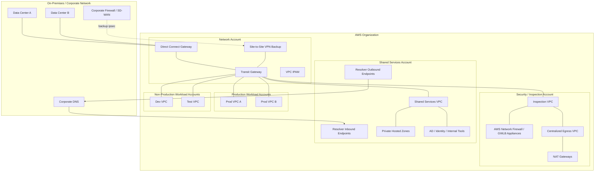
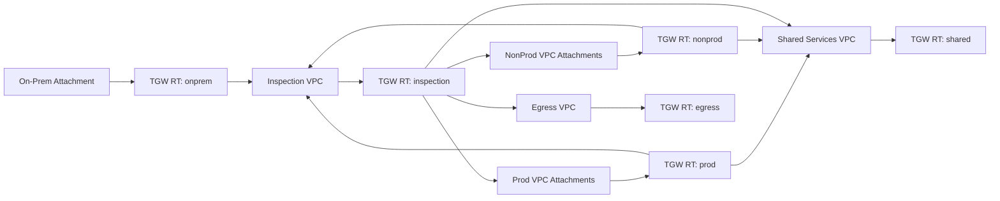
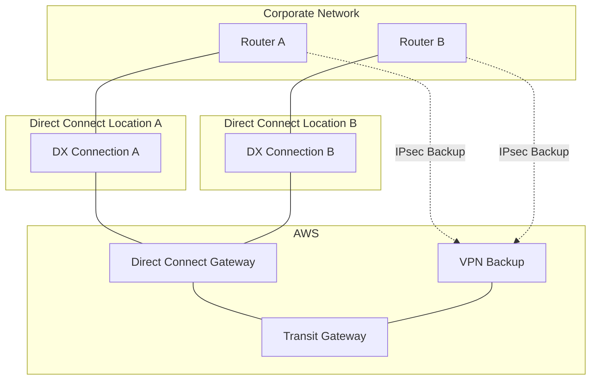
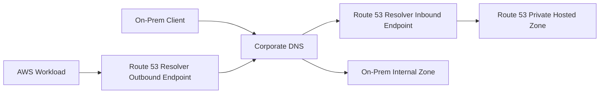
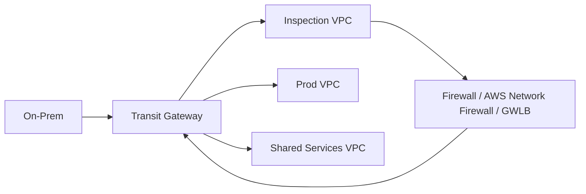
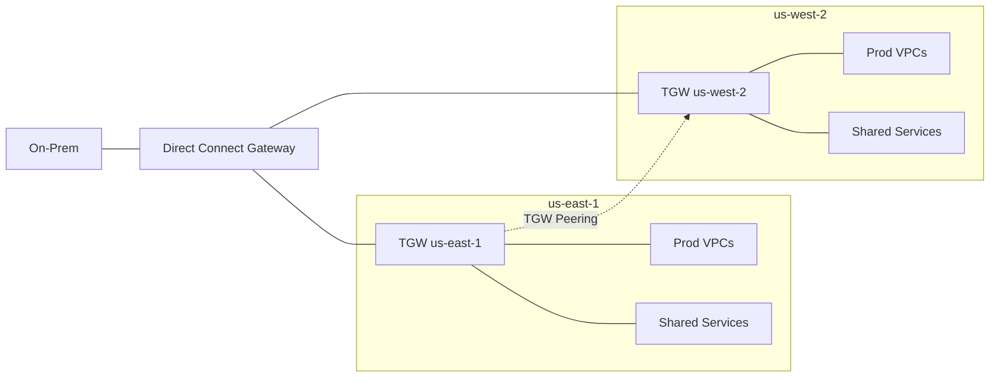

# Part 039 — Enterprise Hybrid Reference Architecture

Hybrid networking is where cloud networking stops being a set of AWS services and becomes an enterprise operating system.

A small AWS environment can survive with one VPC, one NAT Gateway, one public ALB, and a few security groups. An enterprise environment cannot. Once you connect AWS to data centers, branch offices, partner networks, regulated workloads, identity systems, logging platforms, central DNS, private applications, and multiple accounts, the network becomes a **control surface** for the whole company.

This part is a synthesis of the previous hybrid topics:

- Transit Gateway
- Transit Gateway route tables
- Direct Connect
- Direct Connect Gateway
- Site-to-Site VPN
- Route 53 Resolver
- private hosted zones
- shared services VPC
- inspection VPC
- centralized egress
- multi-account ownership
- observability and governance

The goal is not to memorize one diagram. The goal is to understand the **architecture invariants** behind an enterprise-grade AWS hybrid network.

A good hybrid design answers these questions clearly:

1. Who owns IP allocation?
2. Who owns routing authority?
3. Who owns DNS authority?
4. Which networks are allowed to talk?
5. Which traffic must be inspected?
6. Which traffic must never traverse the internet?
7. Which failure is tolerated without a manual change?
8. Which failure requires an explicit operator decision?
9. How do we prove the path traffic actually took?
10. How do we prevent future accounts from accidentally breaking the model?

If those questions are vague, the architecture is not finished.

---

## 1. The Reference Architecture in One Picture

A mature hybrid AWS network usually has a small number of central network accounts and many workload accounts.



This diagram is intentionally not service-complete. A real environment might add Cloud WAN, multiple Regions, Global Accelerator, CloudFront, WAF, Verified Access, PrivateLink endpoint services, VPC Lattice, EKS networking, partner circuits, firewall appliances, and dedicated logging accounts.

But the core enterprise shape remains stable:

```text
on-prem / users / branches
        |
connectivity layer: Direct Connect, VPN, SD-WAN, Cloud WAN
        |
transit layer: Transit Gateway or Cloud WAN core network
        |
segmentation layer: route tables, segments, blackhole routes, firewall insertion
        |
service layer: shared services, DNS, identity, observability, egress
        |
workload layer: application VPCs across accounts and Regions
```

The network becomes maintainable when each layer has a clear responsibility.

---

## 2. The Core Mental Model

Enterprise hybrid networking has five planes.

| Plane | Main Question | Typical AWS Components |
|---|---|---|
| Connectivity plane | How does traffic physically/logically enter AWS? | Direct Connect, Site-to-Site VPN, Client VPN, Verified Access, Cloud WAN, SD-WAN integration |
| Routing plane | Where is a destination reachable and through which next hop? | Transit Gateway, TGW route tables, Direct Connect Gateway, VPC route tables, BGP, static routes |
| DNS plane | How does a name become an address? | Route 53 Resolver, inbound/outbound endpoints, forwarding rules, private hosted zones, public hosted zones |
| Security/inspection plane | Which traffic is allowed and which traffic must be inspected? | Security Groups, NACLs, Network Firewall, Gateway Load Balancer, AWS WAF, DNS Firewall, Firewall Manager |
| Operations/governance plane | How do we observe, prove, enforce, and recover? | VPC Flow Logs, TGW Flow Logs, Reachability Analyzer, CloudTrail, AWS Config, IPAM, RAM, IaC, Network Manager |

Most architecture mistakes happen when these planes are mixed together.

Examples:

- Using DNS names to compensate for bad routing.
- Using Security Groups as if they were route controls.
- Using route tables as if they were authorization policies.
- Treating Direct Connect as automatically encrypted.
- Treating Transit Gateway as a firewall.
- Treating private connectivity as automatically least-privilege.
- Treating a DNS health check as equivalent to application failover correctness.

A network architecture is defensible when each plane remains explicit.

---

## 3. Design Invariants

The following invariants should hold in a serious enterprise design.

### Invariant 1 — IP space is centrally allocated

No workload team should invent VPC CIDRs manually.

Use a central IPAM process, ideally backed by Amazon VPC IPAM, to allocate CIDR ranges by:

- environment
- Region
- business unit
- workload type
- regulatory zone
- future expansion requirements
- hybrid/on-prem overlap constraints

Bad IP planning is one of the few cloud mistakes that becomes harder to fix as the company grows.

A poor `/24` VPC might look harmless when it hosts ten EC2 instances. It becomes painful when you add EKS, interface endpoints, blue/green environments, multi-AZ databases, ENI-heavy services, or cross-account shared subnets.

### Invariant 2 — Routing is segmented by intent

Transit Gateway route tables should not be one giant global route table unless your organization truly wants a flat network.

A better default is route-domain separation:

| Route Domain | Purpose |
|---|---|
| `prod` | Production workload-to-shared-services access |
| `nonprod` | Dev/test access without implicit prod reachability |
| `shared-services` | DNS, identity, tooling, artifact repositories, monitoring |
| `inspection` | North-south and/or east-west firewall insertion |
| `egress` | Controlled outbound internet path |
| `onprem` | Corporate/on-prem advertised prefixes |
| `partner` | Partner or third-party private connectivity |

Segmentation is not just security. It is also blast-radius control.

### Invariant 3 — DNS authority is explicit

For every internal domain, there must be a clear authority:

| Domain | Authoritative System | Example |
|---|---|---|
| Public company domain | Public Route 53 or external DNS | `example.com` |
| AWS private service zone | Route 53 private hosted zone | `svc.aws.internal.example.com` |
| Corporate internal domain | On-prem DNS / AD DNS | `corp.example.internal` |
| Reverse DNS for on-prem ranges | On-prem DNS | `10.in-addr.arpa` slice |
| Reverse DNS for AWS ranges | Route 53 Resolver / PHZ or corporate DNS, depending on policy | AWS VPC CIDRs |

If no one owns DNS authority, incidents become archaeological work.

### Invariant 4 — Private path does not mean trusted path

Direct Connect, VPN, TGW, VPC Peering, PrivateLink, and VPC Lattice are connectivity primitives. They are not automatically authorization boundaries.

You still need:

- Security Groups
- endpoint policies
- IAM/resource policies
- workload authentication
- TLS/mTLS where appropriate
- network inspection for required flows
- logs and audit trails

Private reachability reduces exposure. It does not replace identity or authorization.

### Invariant 5 — Every critical path has an observability contract

For each important path, define how to prove:

- source identity
- source IP
- destination IP/name
- route table decision
- firewall decision
- DNS answer
- TLS endpoint
- application response
- logs generated
- owner of each hop

Without this, production incidents devolve into guessing.

---

## 4. Account and Ownership Model

A mature AWS organization should avoid putting every network resource into application accounts.

A common ownership model:

| Account Type | Owns | Should Not Own |
|---|---|---|
| Network account | Transit Gateway, Direct Connect Gateway, VPN, Cloud WAN, IPAM, RAM sharing, global network inventory | Application runtime, business data |
| Security account | Inspection VPC, Network Firewall policy, Firewall Manager, security telemetry | App deployment pipelines |
| Shared services account | DNS endpoints, private hosted zones, directory integration, shared tooling, internal package mirrors | All workload VPCs |
| Workload account | Application VPC resources, ALB/NLB, app SGs, service endpoints, app logs | Enterprise routing policy |
| Logging/audit account | Central log buckets, CloudTrail organization trails, flow log storage | Runtime dependencies |

This is less about organizational purity and more about failure containment.

If a workload account can mutate central route tables, it can accidentally affect every other account. If every team owns its own hybrid DNS forwarding, resolution behavior becomes inconsistent. If firewall rules are decentralized without governance, one urgent exception becomes a permanent bypass.

### Ownership rule of thumb

```text
If a change can affect more than one workload, it should usually be owned by a platform/network/security account.

If a change affects only one workload's internal behavior, it can usually be owned by the workload account.
```

---

## 5. Connectivity Layer

The connectivity layer is the set of paths into AWS.

Typical enterprise options:

| Pattern | Primary Use |
|---|---|
| Direct Connect | Predictable private connectivity, high throughput, stable latency |
| Site-to-Site VPN | Encrypted IPsec connectivity over internet; backup or lower-volume primary path |
| Direct Connect + VPN | Dedicated transport plus IPsec encryption |
| Transit Gateway | Regional hub for VPCs and on-prem attachments |
| Cloud WAN | Global policy-driven network across Regions, branches, and segments |
| Client VPN | User device-to-VPC access through managed OpenVPN-based VPN |
| Verified Access | Identity-aware application access without full network VPN |
| PrivateLink | Service-specific private exposure without broad network routing |

The key architectural question is not “which service is best?”

The real question is:

```text
What kind of reachability do we want to create?
```

Broad network reachability and service-specific reachability are different products.

### Broad reachability

Use broad reachability when entire CIDR ranges need to communicate:

- on-prem app to AWS app
- AWS app to on-prem database
- corporate monitoring to AWS private endpoints
- domain controllers to AWS workloads
- centralized management plane to workload VPCs

Common primitives:

- Direct Connect
- Site-to-Site VPN
- Transit Gateway
- Cloud WAN
- VPC Peering

### Service-specific reachability

Use service-specific reachability when the consumer should access one service but should not route to the provider network.

Common primitives:

- AWS PrivateLink
- VPC Lattice
- API Gateway private API
- Verified Access for user-facing private apps

This distinction matters because broad routing creates a large blast radius. PrivateLink-style exposure creates a smaller, more intentional contract.

---

## 6. Transit Layer

The transit layer is usually either:

1. Transit Gateway per Region, with optional peering between Regions.
2. Cloud WAN for global segmentation and policy-driven connectivity.
3. A mixed model where Cloud WAN handles global core and TGW handles specific regional connectivity.

### Transit Gateway as the regional hub

A clean TGW design usually uses multiple TGW route tables.



This diagram hides the mechanics but shows the intent:

- Production does not automatically route to non-production.
- Non-production does not automatically route to production.
- Shared services are reachable where needed.
- On-prem traffic can be forced through inspection.
- Egress can be centralized.
- The inspection VPC becomes an explicit choke point, not an accident.

### TGW association vs propagation

Treat these as separate concepts:

| Concept | Meaning |
|---|---|
| Association | Which TGW route table is used when traffic enters from this attachment? |
| Propagation | Which route tables learn this attachment's prefixes? |

A clean design often disables default association/propagation and manages both explicitly.

Why?

Because “default propagation everywhere” is convenient until one new VPC accidentally becomes reachable from every other network.

---

## 7. Direct Connect and VPN Layer

### A robust Direct Connect shape

For enterprise use, avoid a single Direct Connect connection as the only private path.

A stronger shape uses:

- at least two Direct Connect locations when possible
- redundant customer routers
- redundant AWS Direct Connect connections
- private or transit VIFs depending on design
- Direct Connect Gateway for multi-Region/multi-VPC reachability
- Site-to-Site VPN backup or VPN-over-DX for encryption
- BGP route preference deliberately configured



### Route preference model

A common desired behavior:

```text
Normal state:
  traffic uses Direct Connect

DX impairment:
  traffic fails over to secondary DX

DX unavailable:
  traffic fails over to Site-to-Site VPN

Recovery:
  traffic returns to DX only after routes and application behavior are stable
```

Do not assume this happens by magic. BGP attributes, prefix advertisements, local preference, AS path, route filters, and customer router policy influence the result.

### Encryption decision

Direct Connect is private connectivity, not automatically encrypted application traffic.

Common encryption choices:

| Approach | Meaning |
|---|---|
| Application TLS | Encrypt at application protocol layer |
| IPsec over public internet VPN | VPN backup path; encrypted over internet |
| IPsec over Direct Connect public VIF | Dedicated transport to public AWS VPN endpoints |
| Private IP VPN over Direct Connect | IPsec over private Direct Connect path to TGW |
| MACsec on supported dedicated connections | Layer 2 encryption on supported DX connections |

The right answer depends on compliance, latency, MTU, operational skill, device support, and failure model.

---

## 8. DNS Layer

Hybrid DNS is often the most underestimated part of hybrid networking.

A request can have perfect routing and still fail because the name resolves to the wrong address.

### Bidirectional resolution

Most enterprises need two directions:

1. On-prem clients resolving AWS private names.
2. AWS workloads resolving on-prem private names.



### DNS authority contract

Every internal zone should have a declared owner.

Example:

| Zone | Authority | Access Pattern |
|---|---|---|
| `aws.internal.example.com` | Route 53 private hosted zone | On-prem forwards to Route 53 Resolver inbound endpoint |
| `corp.internal.example.com` | Corporate DNS | AWS forwards via Resolver outbound endpoint |
| `prod.aws.internal.example.com` | Route 53 PHZ in shared services account | Associated/shared to production VPCs |
| `dev.aws.internal.example.com` | Route 53 PHZ | Associated/shared only to non-prod VPCs |
| `s3.amazonaws.com` with PrivateLink private DNS | AWS-managed private DNS behavior | Resolved inside selected VPCs to endpoint ENIs |

### DNS anti-patterns

Avoid these:

- One giant private zone shared to every VPC without segmentation.
- Same domain name in multiple private hosted zones with unclear precedence.
- Forwarding `amazonaws.com` broadly to on-prem DNS.
- Creating recursive forwarding loops between on-prem and AWS.
- Treating low TTL as instant failover.
- Returning public IPs for private services because split-horizon DNS is missing.
- Hardcoding Resolver endpoint IPs in random places without owner documentation.

### DNS observability

Minimum DNS observability:

- Route 53 Resolver query logging for selected VPCs.
- Corporate DNS logs for conditional forwarders.
- Change tracking for hosted zone records.
- Resolver endpoint health and ENI status.
- Runbook for `dig`, `nslookup`, and source-specific queries.
- Inventory of forwarding rules and PHZ associations.

---

## 9. Security and Inspection Layer

Enterprise hybrid networking usually has three security zones:

1. **North-south**: internet/user/on-prem to AWS and AWS to internet/on-prem.
2. **East-west**: workload-to-workload inside AWS.
3. **Service-specific**: application to managed service or private service endpoint.

### Inspection VPC pattern

An inspection VPC centralizes firewall appliances or AWS Network Firewall.



The routing challenge is symmetry.

Stateful firewalls need both directions of a flow to traverse the same inspection path. If request goes through firewall but response bypasses it, the firewall sees half a conversation and drops or misclassifies traffic.

### Traffic classes

Classify traffic before writing routes:

| Traffic Class | Example | Typical Control |
|---|---|---|
| On-prem to workload | Corporate app calls AWS private API | TGW route + firewall + SG + app auth |
| Workload to on-prem | AWS service calls legacy database | TGW/DX route + SG + DNS + app auth |
| Workload to internet | App downloads package/update | Egress VPC + NAT + firewall/proxy |
| Workload to AWS service | App calls S3/KMS/Secrets Manager | VPC endpoint + endpoint policy + IAM |
| User to private app | Employee opens internal console | Verified Access or Client VPN + app auth |
| Partner to service | Partner consumes private API | PrivateLink/API Gateway/VPN depending on contract |

Not every flow deserves the same mechanism.

### Network security stack

| Layer | Tool | Role |
|---|---|---|
| Name resolution | DNS Firewall / Resolver query logs | Domain-level filtering and visibility |
| Subnet boundary | NACL | Stateless guardrail, explicit deny where justified |
| ENI/resource boundary | Security Group | Stateful resource-level allowlist |
| Routing boundary | TGW route tables / blackhole routes | Reachability segmentation |
| Inspection boundary | Network Firewall / GWLB appliances | Stateful inspection, IDS/IPS, egress control |
| Web layer | AWS WAF | HTTP-layer filtering |
| DDoS layer | AWS Shield | DDoS protection for supported resources |
| Identity layer | IAM, app identity, mTLS, Verified Access | Who is allowed, not just where packet came from |

Defense-in-depth is not stacking tools randomly. Each layer must answer a different question.

---

## 10. Shared Services Layer

A shared services VPC usually hosts infrastructure services that many workloads need but should not own individually.

Examples:

- Route 53 Resolver endpoints
- directory services / AD integration
- internal package mirrors
- CI/CD runners or deployment brokers
- monitoring collectors
- logging forwarders
- patch/update mirrors
- license servers
- internal APIs
- bastion replacement tooling, if still needed

### Shared services route model

A common pattern:

```text
prod workloads -> shared services
nonprod workloads -> shared services
on-prem -> shared services
shared services -> selected workloads only where needed
prod workloads -X-> nonprod workloads
nonprod workloads -X-> prod workloads
```

Shared services should not become a hidden universal bridge.

If shared services VPC has routes to everything and everything has routes to shared services, a compromised shared service can become a pivot point. That may be acceptable for some services but should be explicit.

---

## 11. Egress Architecture

Egress is not only “let private subnet reach internet.”

Enterprise egress asks:

- Which workloads may reach the internet?
- Through which IPs?
- With which logging?
- With which domain/IP filtering?
- With which proxy or firewall?
- How are package repositories controlled?
- How are data exfiltration attempts detected?
- Which AWS service traffic should avoid NAT by using VPC endpoints?

### Distributed egress

Each VPC has its own NAT Gateway per AZ.

Pros:

- simple route model
- AZ-local resilience
- less dependency on central VPC
- fewer TGW data processing paths

Cons:

- harder centralized inspection
- repeated NAT cost
- inconsistent egress controls if teams own rules

### Centralized egress

Workload VPCs route `0.0.0.0/0` or selected prefixes through TGW to egress/inspection VPC.

Pros:

- centralized firewall/proxy/logging
- consistent internet exit points
- easier compliance evidence

Cons:

- route complexity
- possible extra data processing cost
- stateful inspection symmetry requirements
- larger blast radius if egress VPC is impaired

### Hybrid egress

Many mature environments use both:

- centralized egress for regulated workloads
- distributed NAT for lower-risk workloads
- VPC endpoints for AWS service traffic
- explicit exceptions for high-throughput paths

The invariant is not “centralize everything.”

The invariant is:

```text
Every egress path must be intentional, observable, and owned.
```

---

## 12. Multi-Region Architecture

Multi-Region hybrid networking adds complexity in three dimensions:

1. Routing reachability
2. DNS failover/resolution
3. Operational ownership

### Regional TGW model

A common pattern:



Design questions:

- Should on-prem reach both Regions directly through DXGW?
- Should Regions talk to each other through TGW peering?
- Should DNS fail over between Regions?
- Should shared services be regional, global, or active/passive?
- Should inspection be regional or centralized?
- Which Region owns authoritative DNS for internal zones?

### Multi-Region anti-pattern

Avoid building an accidental global flat network where every Region can reach every other Region and every on-prem prefix without policy.

Multi-Region reachability should be justified by application recovery design, not created because route propagation made it easy.

---

## 13. Route Contracts

A production network should publish route contracts.

A route contract says:

```text
For this source domain, these destination prefixes are reachable through these controls.
Everything else is not reachable by default.
```

Example contract:

| Source | Destination | Path | Inspection | Notes |
|---|---|---|---|---|
| Prod VPCs | Shared services CIDRs | TGW | Optional or inline depending on service | DNS/identity/logging allowed |
| Prod VPCs | On-prem database prefixes | TGW → DX | Required for selected zones | Application-specific SG rules |
| Nonprod VPCs | Prod VPCs | None | N/A | Denied by missing route / blackhole |
| Prod VPCs | Internet | TGW → inspection/egress VPC → NAT | Required | Prefer VPC endpoints for AWS services |
| On-prem | Prod private APIs | DX/VPN → TGW → inspection → prod | Required | DNS via inbound Resolver |

### Why route contracts matter

They prevent “network folklore.”

Without route contracts, teams learn reachability by trial and error:

- “I think dev can reach prod.”
- “This used to work from on-prem.”
- “We added propagation for another app.”
- “Firewall team says they do not see the packets.”
- “DNS resolves but connection times out.”

The architecture should make reachability inspectable before traffic is sent.

---

## 14. DNS Contracts

A DNS contract says:

```text
For this source, this name should resolve to this class of address, using this resolver path, owned by this team.
```

Example:

| Source | Query | Expected Answer | Resolver Path | Owner |
|---|---|---|---|---|
| On-prem client | `api.prod.aws.internal.example.com` | Private AWS IP / ALB internal name | Corporate DNS → inbound Resolver → PHZ | Shared DNS team |
| AWS workload | `db.corp.internal.example.com` | On-prem private IP | VPC Resolver → outbound endpoint → corporate DNS | Corporate DNS team |
| AWS workload | `secretsmanager.<region>.amazonaws.com` | Interface endpoint private IP if endpoint private DNS enabled | VPC Resolver → AWS private DNS | Platform team |
| Internet user | `www.example.com` | CloudFront/ALB public target | Public recursive resolver → public hosted zone | Edge/platform team |

DNS contracts catch subtle errors:

- Same name resolving differently from different VPCs.
- Private app name resolving to public IP from AWS.
- On-prem forwarding to wrong inbound endpoint Region.
- Private hosted zone associated to wrong accounts.
- Endpoint private DNS not enabled.
- Corporate DNS caching stale records after migration.

---

## 15. Implementation Roadmap

A realistic implementation order:

### Step 1 — Define address model

- Create CIDR hierarchy.
- Identify overlap with on-prem and partners.
- Allocate regional ranges.
- Allocate workload class ranges.
- Define subnet sizing standards.
- Create IPAM pools/scopes where appropriate.

### Step 2 — Define account model

- Network account.
- Security account.
- Shared services account.
- Workload OU/account structure.
- Logging/audit account.
- Delegated administrators.

### Step 3 — Build baseline VPCs

- Shared services VPC.
- Inspection VPC.
- Egress VPC.
- Initial workload VPC templates.
- Flow logs from day one.

### Step 4 — Build transit layer

- Transit Gateway or Cloud WAN.
- Route tables/segments.
- Attachment association/propagation rules.
- Blackhole guardrails.
- RAM sharing model.

### Step 5 — Add hybrid connectivity

- Direct Connect physical/logical connectivity.
- Direct Connect Gateway.
- Transit VIF/private VIF as required.
- VPN backup.
- BGP filters and route preference.
- Failover tests.

### Step 6 — Add DNS

- Private hosted zone strategy.
- Resolver inbound/outbound endpoints.
- Forwarding rules.
- Cross-account association/sharing.
- Query logging.
- DNS runbooks.

### Step 7 — Add inspection and egress

- Firewall placement.
- Appliance mode/GWLB/Network Firewall design.
- Egress route model.
- NAT placement.
- Domain/IP filtering.
- Exception process.

### Step 8 — Publish contracts

- Route contracts.
- DNS contracts.
- Security contracts.
- Logging contracts.
- Ownership matrix.
- Change approval model.

### Step 9 — Test failure modes

- DX down.
- VPN tunnel down.
- TGW route missing.
- Firewall unhealthy.
- Resolver endpoint unreachable.
- PHZ association missing.
- NAT port exhaustion.
- On-prem route withdrawal.
- Asymmetric route.

### Step 10 — Automate guardrails

- IaC modules.
- Policy-as-code checks.
- AWS Config rules.
- Firewall Manager policies.
- IPAM compliance checks.
- Reachability tests.
- Continuous route/DNS inventory.

---

## 16. Failure Mode Catalogue

| Symptom | Likely Plane | Common Causes | First Checks |
|---|---|---|---|
| DNS name does not resolve | DNS | Missing PHZ association, wrong forwarding rule, resolver endpoint issue | `dig`, Resolver query logs, PHZ associations |
| DNS resolves to public IP instead of private IP | DNS | Split-horizon missing, endpoint private DNS disabled | Query from source VPC, check PHZ/endpoint DNS |
| Connection times out | Routing/security | Missing route, SG/NACL deny, firewall drop, return path broken | Route tables, Flow Logs, firewall logs |
| Connection refused | Application/listener | Host reachable but port closed/listener absent | Target listener, app logs, health checks |
| Works from one VPC but not another | Routing/DNS/security | Different TGW association, PHZ association, SG source rule | Compare route table/DNS/source SG |
| Works one direction only | Routing/security | Asymmetric route, stateless NACL, stateful firewall bypass | Flow Logs both ENIs, firewall session logs |
| Fails only during failover | Routing/control plane | BGP preference wrong, DNS TTL/caching, app connection reuse | BGP routes, route preference, client behavior |
| High latency | Path selection | Traffic hairpinning through remote Region/on-prem/inspection | Traceroute-like path, TGW metrics, app telemetry |
| NAT errors under load | Egress | Port exhaustion, centralized NAT bottleneck | NAT metrics, unique destination analysis |
| On-prem cannot reach AWS private service | DNS/routing/security | Corporate DNS not forwarding, inbound Resolver unreachable, SG missing | DNS path, DX/VPN route, SG, Flow Logs |

The table is deliberately symptom-first. In real incidents, you rarely start with a known root cause.

---

## 17. Debugging Method: Follow the Packet, Then Follow the Name

When debugging hybrid network problems, use this order.

### Layer 0 — Clarify the exact flow

Write it down:

```text
source identity:
source IP:
source VPC/subnet/account or on-prem segment:
destination name:
destination resolved IP:
destination port/protocol:
expected path:
time of test:
```

Without this, teams debug different problems while thinking they are debugging the same incident.

### Layer 1 — Prove DNS

From the source:

```bash
dig api.prod.aws.internal.example.com
```

Then ask:

- Which resolver answered?
- Is the answer private or public?
- Is TTL expected?
- Is the answer different from another source?
- Is the answer from PHZ, corporate DNS, endpoint private DNS, or public DNS?

### Layer 2 — Prove source route

Check:

- source subnet route table
- TGW attachment association
- TGW route table entry
- propagation/static route
- blackhole routes
- appliance/inspection route
- DX/VPN advertised routes

### Layer 3 — Prove destination return route

Return path matters as much as request path.

Check:

- destination subnet route table
- destination TGW route table association
- on-prem route advertisements
- firewall symmetry
- NAT/translation state

### Layer 4 — Prove security controls

Check:

- source SG outbound
- destination SG inbound
- endpoint SG if interface endpoint
- NACL both directions
- Network Firewall/GWLB logs
- on-prem firewall
- DNS Firewall if name resolution blocked

### Layer 5 — Prove application

Only after network path is proven:

- target listener
- TLS/SNI/certificate
- app authorization
- health checks
- ALB/NLB target health
- database listen address
- application logs

A common mistake is starting at Layer 5 because application logs are easier to access. For hybrid incidents, the network path must be proven first.

---

## 18. Reference Architecture Variants

### Variant A — Conservative Enterprise Hub-and-Spoke

Use when:

- centralized governance is required
- many workload accounts exist
- hybrid connectivity is critical
- regulated environment

Shape:

```text
DX/VPN -> TGW -> inspection -> workload/shared/egress
DNS centralized in shared services
IPAM central
egress controlled
no default full mesh
```

Trade-off:

- strong control
- more network team involvement
- higher route complexity

### Variant B — Product-Team VPCs with Central Connectivity

Use when:

- teams need autonomy
- platform team provides baseline connectivity
- not every flow requires central firewall

Shape:

```text
central TGW attachment templates
team-owned VPC internals
central DNS/egress optional by class
PrivateLink for selected shared services
```

Trade-off:

- better team velocity
- governance must be automated
- exceptions can sprawl if not reviewed

### Variant C — Service-Provider Model with PrivateLink

Use when:

- provider and consumer networks should not route broadly
- overlapping CIDR exists
- SaaS/private service exposure required

Shape:

```text
consumer VPC -> interface endpoint -> provider endpoint service -> NLB -> service
```

Trade-off:

- small blast radius
- less general routing
- requires service-by-service onboarding

### Variant D — Global Cloud WAN Model

Use when:

- many Regions/branches exist
- central network policy matters
- global segmentation is more important than per-Region TGW handcrafting

Shape:

```text
Cloud WAN core network
segments by environment/business/regulatory domain
attachments across VPCs/branches/SD-WAN
policy-driven routing
```

Trade-off:

- global policy consistency
- new operational model
- migration planning required

---

## 19. Governance as a Product

Enterprise networking fails when governance is only a ticket queue.

Good platform teams expose network capabilities as products:

| Product | Interface |
|---|---|
| New workload VPC | IaC module / service catalog |
| New CIDR allocation | IPAM request workflow |
| New TGW attachment | Automated account onboarding |
| New route contract | Pull request with policy validation |
| New DNS zone/record | Delegated workflow with ownership metadata |
| New firewall exception | Time-bound policy with approver and evidence |
| New VPC endpoint | Standard module with endpoint policy baseline |
| New hybrid route | Change record + BGP/route validation |

The best network architecture is not only technically correct. It is also operationally consumable.

---

## 20. Production Checklist

Before calling a hybrid network production-ready, verify the following.

### Addressing

- [ ] CIDRs allocated from central pool.
- [ ] No overlap with on-prem/partners unless intentionally handled.
- [ ] IPv6 strategy documented.
- [ ] Subnet sizing supports ENI-heavy services.

### Routing

- [ ] TGW route tables are segmented.
- [ ] Default association/propagation behavior is deliberate.
- [ ] Route contracts are published.
- [ ] Blackhole routes used where useful.
- [ ] Return paths are tested.
- [ ] Failover route preference is tested.

### Connectivity

- [ ] Direct Connect redundancy exists where required.
- [ ] VPN backup or encrypted overlay exists where required.
- [ ] BGP route filters are explicit.
- [ ] Customer router ownership and runbooks are documented.

### DNS

- [ ] Internal zone authority is documented.
- [ ] Resolver inbound/outbound endpoints are redundant.
- [ ] Forwarding rules are shared/associated intentionally.
- [ ] PHZ associations are governed.
- [ ] Query logging exists for critical VPCs.

### Security

- [ ] Firewall insertion path is symmetrical.
- [ ] SG/NACL standards exist.
- [ ] Egress control is intentional.
- [ ] AWS service access uses VPC endpoints where justified.
- [ ] Endpoint policies are not left as broad access where sensitive.

### Observability

- [ ] VPC Flow Logs enabled for key VPCs.
- [ ] TGW Flow Logs enabled where needed.
- [ ] Firewall logs centralized.
- [ ] DNS query logs centralized.
- [ ] Reachability tests exist.
- [ ] CloudTrail/Config capture network changes.

### Operations

- [ ] Owner matrix is clear.
- [ ] Emergency change process exists.
- [ ] IaC modules encode standards.
- [ ] Drift detection exists.
- [ ] Game days test DX/VPN/DNS/firewall failures.

---

## 21. The Final Mental Model

An enterprise hybrid network is not one big pipe.

It is a set of explicit contracts:

```text
address contract
+ routing contract
+ DNS contract
+ security contract
+ observability contract
+ ownership contract
= defensible hybrid architecture
```

If you can explain each contract, you can reason about the architecture.

If you cannot explain one of them, that missing contract is where the next outage will likely hide.

The job of a senior engineer is not to draw a beautiful network diagram. The job is to make the network's behavior predictable under change, failure, growth, and human error.

That is the difference between “connected” and “architected.”

---

## References

- AWS VPC Connectivity Options: Network-to-Amazon VPC connectivity options — https://docs.aws.amazon.com/whitepapers/latest/aws-vpc-connectivity-options/network-to-amazon-vpc-connectivity-options.html
- AWS Transit Gateway + AWS Site-to-Site VPN — https://docs.aws.amazon.com/whitepapers/latest/aws-vpc-connectivity-options/aws-transit-gateway-vpn.html
- AWS Direct Connect + AWS Transit Gateway + AWS Site-to-Site VPN — https://docs.aws.amazon.com/whitepapers/latest/aws-vpc-connectivity-options/aws-direct-connect-aws-transit-gateway-vpn.html
- What is Route 53 Resolver? — https://docs.aws.amazon.com/Route53/latest/DeveloperGuide/resolver.html
- AWS Prescriptive Guidance: Hybrid DNS resolution in a multi-account AWS environment — https://docs.aws.amazon.com/prescriptive-guidance/latest/patterns/set-up-dns-resolution-for-hybrid-networks-in-a-multi-account-aws-environment.html
- Amazon VPC IPAM — https://docs.aws.amazon.com/vpc/latest/ipam/what-it-is-ipam.html
