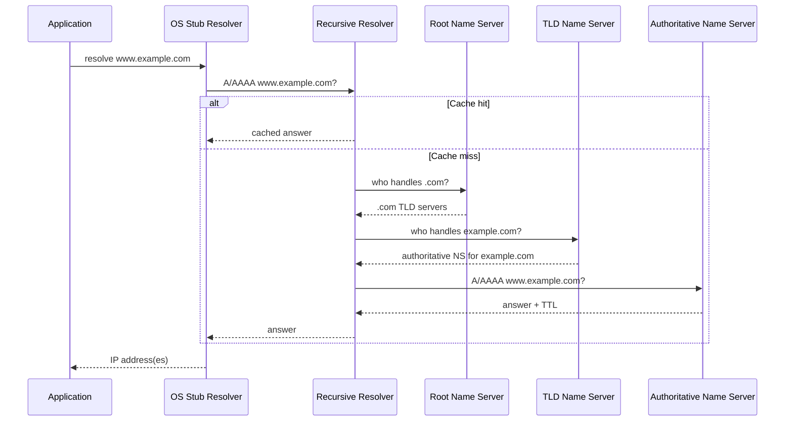
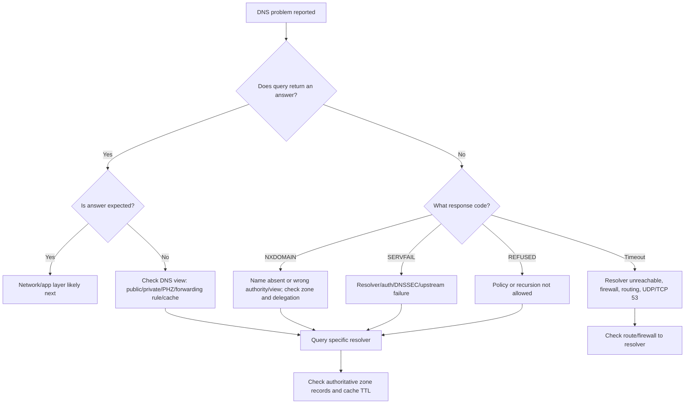

# Part 040 — DNS From First Principles

DNS is not just “name to IP.”

DNS is a distributed, cached, delegated, eventually visible naming system. It is one of the oldest production-scale distributed systems engineers interact with every day. It is also one of the most misunderstood.

In AWS, DNS sits in the critical path of almost everything:

- public websites
- CloudFront distributions
- ALB/NLB names
- private hosted zones
- service discovery
- VPC endpoints
- EKS ingress
- database endpoints
- hybrid resolution
- failover records
- Global Accelerator and Route 53 routing decisions
- internal service names

When DNS breaks, the network may look broken even when packets and routes are correct.

When DNS is misdesigned, applications become fragile even when infrastructure is healthy.

This part builds DNS from first principles. Route 53-specific features will come later. Here, the goal is to develop DNS literacy deep enough to debug production systems.

---

## 1. DNS Is a Distributed Cache with Delegated Authority

The simplest view:

```text
human name -> machine address
```

The production view:

```text
client asks a resolver
resolver may answer from cache
resolver may ask authoritative servers
authority is delegated through the DNS hierarchy
answers have TTLs
negative answers can be cached
multiple views can exist for the same name
clients and intermediate resolvers may behave differently
```

DNS is not a centralized database. It is a protocol and hierarchy for answering questions.

A DNS record does not become “updated everywhere” instantly. It becomes visible according to:

- authoritative server propagation
- recursive resolver cache state
- client resolver cache state
- record TTL
- negative cache TTL
- resolver implementation behavior
- split-horizon/private view rules
- local OS/application caching

That is why “I changed DNS but it still resolves old value” is not surprising. It is expected unless you control every cache in the chain.

---

## 2. DNS Actors

A DNS lookup usually involves these actors.

| Actor | Role |
|---|---|
| Application | Calls OS/library resolver to resolve a name |
| Stub resolver | Small resolver on the client/OS that sends query to recursive resolver |
| Recursive resolver | Resolver that performs lookup on behalf of client and caches answers |
| Root name servers | Point resolvers toward TLD name servers |
| TLD name servers | Point resolvers toward authoritative servers for a domain |
| Authoritative name servers | Serve DNS records for a zone |
| Zone owner | Person/system/team controlling records for a zone |

In AWS contexts:

| AWS Context | DNS Actor |
|---|---|
| EC2 instance resolving names in VPC | VPC Route 53 Resolver is commonly the recursive resolver path |
| Public hosted zone | Route 53 authoritative DNS for public records |
| Private hosted zone | Route 53 private authoritative view inside associated VPCs |
| Hybrid DNS | Route 53 Resolver inbound/outbound endpoints bridge AWS and external DNS systems |
| Interface VPC endpoint with private DNS | AWS-provided private name resolution for selected service names inside the VPC |

Keep the actor model clear. “DNS failed” is too vague. Which actor failed?

---

## 3. Resolution Flow

A public DNS lookup often looks like this:



The important point: the application rarely talks directly to the authoritative server. It asks a resolver, and the resolver may answer from cache.

This is why authoritative records and client-observed answers can differ temporarily.

---

## 4. Names, Labels, Domains, Zones

DNS names are hierarchical.

Example:

```text
api.prod.aws.internal.example.com.
```

Read right to left:

```text
.          root
com        top-level domain
example    second-level domain
internal   subdomain
aws        subdomain
prod       subdomain
api        host/service label
```

The final dot means fully qualified domain name. Many tools omit it visually, but DNS internally treats the root as part of the full name.

### Domain vs zone

A domain is a name in the hierarchy.

A zone is an administrative unit of authority.

Example:

```text
example.com
```

Could have one zone:

```text
example.com zone owns everything below example.com
```

Or delegate a subdomain:

```text
example.com zone delegates prod.example.com to another zone
prod.example.com zone owns records under prod.example.com
```

This distinction matters in enterprise AWS because you may delegate:

- `aws.example.com` to AWS Route 53 public hosted zone
- `internal.example.com` to corporate DNS
- `prod.aws.internal.example.com` to private hosted zone associated with production VPCs

A zone is about authority, not just naming style.

---

## 5. Delegation

Delegation is how DNS scales.

A parent zone does not need to know every record in every child zone. It only needs to know which name servers are authoritative for the child.

Example:

```text
example.com delegates aws.example.com
```

Parent zone contains NS records for child:

```text
aws.example.com. NS ns-123.awsdns-xx.net.
aws.example.com. NS ns-456.awsdns-yy.org.
```

Then the child zone owns:

```text
api.aws.example.com.
www.aws.example.com.
```

### Delegation failure modes

| Symptom | Cause |
|---|---|
| Domain works from one resolver but not another | Cache divergence or inconsistent delegation |
| `SERVFAIL` | DNSSEC issue, unreachable authoritative server, resolver failure |
| `NXDOMAIN` | Name truly absent from the authority view, or query went to wrong authority |
| Parent points to wrong name servers | Zone exists but internet cannot find it correctly |
| Glue record issue | Name server hostname depends on the zone it serves and resolver cannot bootstrap |

Delegation is DNS's routing table. If delegation is wrong, records below it do not matter.

---

## 6. Record Types Engineers Actually Need

### A record

Maps a name to IPv4 address.

```dns
api.example.com. 60 IN A 203.0.113.10
```

### AAAA record

Maps a name to IPv6 address.

```dns
api.example.com. 60 IN AAAA 2001:db8::10
```

### CNAME record

Aliases one name to another name.

```dns
www.example.com. 300 IN CNAME app.example.net.
```

Rules:

- CNAME points to another name, not directly to an IP.
- A name with CNAME generally should not have other record types at the same owner name, with important DNS-standard constraints.
- CNAME at zone apex is traditionally not allowed in standard DNS, which is why providers such as Route 53 provide alias-style behavior.

### Alias-style records

Route 53 alias records are not normal DNS record types. They are provider-side behavior that lets a hosted zone return records for AWS resources such as CloudFront, ALB, NLB, S3 website endpoints, and other supported targets.

The practical reason engineers care: alias records can be used at the zone apex where a CNAME would be problematic.

### NS record

Declares authoritative name servers for a zone or delegated child zone.

```dns
example.com. 172800 IN NS ns-123.awsdns-xx.net.
```

### SOA record

Start of Authority. Contains administrative metadata for a zone.

Important fields include:

- primary name server
- responsible mailbox
- serial number
- refresh
- retry
- expire
- minimum/negative TTL semantics depending on context

Most application engineers do not edit SOA often, but SOA appears in debugging and negative caching behavior.

### MX record

Mail exchanger record.

```dns
example.com. 300 IN MX 10 mail.example.com.
```

### TXT record

Arbitrary text data. Commonly used for:

- domain verification
- SPF
- DKIM
- DMARC
- ownership proof
- vendor integrations

### SRV record

Service discovery record containing service, protocol, priority, weight, port, and target.

Common in some enterprise and service-discovery systems.

### PTR record

Reverse DNS mapping from IP to name.

IPv4 reverse zones use `in-addr.arpa`.

IPv6 reverse zones use `ip6.arpa`.

Reverse DNS matters for:

- mail systems
- some audit tooling
- corporate networks
- troubleshooting
- identity assumptions in legacy systems

### CAA record

Certificate Authority Authorization. Indicates which certificate authorities are allowed to issue certificates for a domain.

Relevant for public certificate governance.

### DNSSEC records

Records such as DS, DNSKEY, RRSIG, and NSEC/NSEC3 support DNSSEC validation.

DNSSEC protects DNS data integrity, not secrecy. DNS queries and answers can still be visible unless using encrypted DNS transport mechanisms outside classic DNS behavior.

---

## 7. TTL: The Most Misunderstood Number in DNS

TTL means Time To Live.

It tells resolvers how long they may cache a record before asking again.

Example:

```dns
api.example.com. 300 IN A 203.0.113.10
```

A TTL of `300` means a resolver may cache that answer for up to 300 seconds.

### TTL is not propagation time

This is the key point:

```text
TTL controls cache lifetime after a resolver has seen an answer.
It does not force every resolver to refresh immediately when you change the record.
```

If a resolver cached an old answer with TTL 3600 one second before your change, it may continue returning that old answer for almost an hour.

### TTL is a trade-off

| Low TTL | High TTL |
|---|---|
| Faster change visibility after caches expire | Lower query volume |
| Useful before migration/failover | Better cache efficiency |
| More load on authoritative DNS/resolvers | Slower operational change visibility |
| Can create resolver/client churn | More stable under DNS provider issues |

Low TTL is not free. High TTL is not bad. The correct TTL depends on operational intent.

### TTL reduction before migration

A common migration pattern:

```text
T-48h: reduce TTL from 3600/86400 to 60/300
T-0: change record
T+1h: monitor
T+24h: raise TTL if stable
```

The important part is reducing TTL before the migration, not during the migration.

If you lower TTL at the same time as the cutover, resolvers that already cached the old high TTL can still hold old answers.

---

## 8. Negative Caching

DNS can cache absence.

If a resolver asks for a name and receives `NXDOMAIN`, that negative answer can be cached.

Example failure:

1. Client queries `api.new.example.com` before the record exists.
2. Resolver receives `NXDOMAIN`.
3. You create the record five seconds later.
4. Client still sees `NXDOMAIN` until negative cache expires.

This is common during rushed deployments.

### Production consequence

Do not let clients query a new name before the record exists if you need immediate cutover behavior.

Pre-create records where possible.

---

## 9. Common DNS Response Codes

| Code | Meaning | Production Interpretation |
|---|---|---|
| `NOERROR` | Query succeeded | May include answer or no answer depending on type/name |
| `NXDOMAIN` | Domain name does not exist in that authority view | Name absent or query went to wrong DNS view |
| `SERVFAIL` | Server failed to complete query | DNSSEC failure, upstream failure, resolver issue, authoritative unreachable |
| `REFUSED` | Server refuses to answer | Policy/ACL/recursion restriction |
| `NODATA` | Name exists but requested record type does not | Example: A exists? no; AAAA exists? maybe |

Do not treat all DNS failures the same. `NXDOMAIN` and `SERVFAIL` point to different classes of problem.

---

## 10. Public DNS vs Private DNS

Public DNS answers are visible to public recursive resolvers.

Private DNS answers are visible only from specific network contexts.

In AWS, private hosted zones allow names to resolve privately inside associated VPCs.

This enables split-horizon DNS:

```text
api.example.com from internet -> public IP / CloudFront / public ALB
api.example.com from VPC      -> private IP / internal ALB / private endpoint
```

Split-horizon DNS is powerful but dangerous if undocumented.

Failure cases:

- application works from EC2 but not laptop
- on-prem resolves public answer instead of private answer
- one VPC sees private answer, another sees public answer
- VPN clients use local DNS instead of VPC/corporate resolver
- private zone accidentally associated with wrong VPC

The same name can validly produce different answers depending on resolver context. That is a feature and a debugging trap.

---

## 11. DNS and Load Balancing

DNS can return multiple addresses.

But DNS is not the same as a load balancer.

### DNS-based distribution

DNS can distribute clients by returning different answers based on policy, health, weight, latency, geography, or resolver/source-related context depending on DNS provider features.

But clients and recursive resolvers can cache answers.

This means DNS is usually coarse-grained traffic steering, not per-request load balancing.

### Load balancer distribution

An ALB/NLB receives actual connections and makes target-level decisions based on health and load-balancing algorithm.

A typical production chain:

```text
DNS name -> ALB/NLB/CloudFront/Global Accelerator -> targets
```

DNS gets the client to an entry point. The entry point handles request/connection distribution.

### Failure implication

If one backend target is unhealthy, DNS usually should not be responsible for removing that individual target. The load balancer should.

If one Region or endpoint group is unhealthy, DNS or global traffic management may participate in steering away from the whole site/entry point.

---

## 12. DNS and AWS Entry Points

AWS creates many DNS names for managed resources.

Examples:

| Resource | DNS Behavior |
|---|---|
| ALB | DNS name resolves to AWS-managed load balancer addresses |
| NLB | DNS name resolves to load balancer addresses; can support static IP-related patterns depending on configuration |
| CloudFront | Distribution has a domain name; custom domains use DNS alias/CNAME-style mapping |
| API Gateway | Regional/edge/private endpoints with DNS integration patterns |
| RDS | Database endpoint DNS abstracts underlying host changes/failover |
| ElastiCache | Endpoint DNS abstracts node/cluster behavior |
| Interface VPC Endpoint | Private DNS can cause AWS service names to resolve to endpoint ENI private IPs inside VPC |
| Route 53 Private Hosted Zone | Private records visible only in associated VPC contexts |

The important habit:

```text
Do not assume a DNS name maps to one stable IP forever.
```

Many AWS managed names are intentionally abstractions over changing infrastructure.

Hardcoding resolved IPs from AWS DNS names is usually a bug.

---

## 13. Resolver Search Domains and Short Names

Applications often resolve names that are not fully qualified.

Example:

```text
api
```

The OS resolver may append search domains:

```text
api.prod.aws.internal.example.com
api.aws.internal.example.com
api.internal.example.com
```

This can cause surprising traffic and latency.

### Risks

- short name resolves differently in different environments
- failed lookups generate multiple DNS queries
- accidental match to wrong internal zone
- Kubernetes/service discovery search paths create unexpected behavior
- security issue if internal short name falls through to public DNS unexpectedly

For critical production configuration, prefer explicit fully qualified names.

---

## 14. Resolver Caching Layers

A DNS answer can be cached at several layers.

```text
authoritative DNS
  -> recursive resolver cache
  -> OS resolver cache
  -> language runtime cache
  -> application connection pool
```

Examples:

- JVM may cache DNS answers depending on security/networkaddress cache settings.
- Some HTTP clients keep long-lived connections even after DNS changes.
- Containers may use node-level DNS caches.
- Kubernetes CoreDNS may cache service lookups.
- Corporate resolvers may override or clamp TTLs.

DNS change does not necessarily mean application traffic moves immediately.

Applications often need connection draining, restart, cache flush, or connection pool expiry to observe DNS changes.

---

## 15. DNS Is Not Service Discovery by Itself

DNS can be part of service discovery, but it does not solve every service discovery problem.

DNS gives you a name and maybe one or more addresses.

It does not inherently give you:

- application-level readiness
- version compatibility
- per-request balancing
- caller identity
- authorization
- circuit breaking
- retries with budget
- request routing by header/user/tenant
- semantic health
- canary control
- observability correlation

For some systems, DNS is enough.

For high-change service-to-service environments, DNS may need to be combined with:

- load balancers
- service mesh
- VPC Lattice
- Cloud Map
- application-level discovery
- health-aware clients
- deployment controllers

DNS is a primitive, not a complete service platform.

---

## 16. DNS and Security

DNS is part of the security perimeter.

Attackers and misconfigured systems use DNS for:

- command-and-control lookup
- data exfiltration via query names
- typo-squatting
- domain generation algorithms
- phishing infrastructure
- resolving malicious package mirrors
- bypassing intended private endpoints

In AWS, relevant controls include:

- Route 53 Resolver query logging
- Route 53 Resolver DNS Firewall
- private hosted zones
- endpoint private DNS
- outbound resolver rules
- controlled egress
- WAF and CloudFront for public application layer
- IAM/resource policies for AWS service access

DNS security is not “block all unknown domains.” That may break systems quickly. Good DNS security starts with visibility, classification, and controlled exceptions.

---

## 17. Debugging DNS Correctly

When debugging DNS, always specify the source.

Bad question:

```text
What does api.example.com resolve to?
```

Better question:

```text
What does api.example.com resolve to from this EC2 instance, using this resolver, at this time?
```

DNS answers are source/context dependent.

### Basic commands

```bash
# Ask default resolver
dig api.example.com

# Ask a specific resolver
dig @10.0.0.2 api.example.com

# Query A record
dig api.example.com A

# Query AAAA record
dig api.example.com AAAA

# Trace delegation path for public DNS
dig +trace api.example.com

# Show short answer
dig +short api.example.com

# Show authoritative servers
dig example.com NS

# Query reverse DNS
dig -x 203.0.113.10
```

### What to capture

For every DNS incident, capture:

```text
source host:
source VPC/subnet/account/network:
resolver IP used:
query name:
query type:
answer:
TTL observed:
rcode:
time:
expected answer:
```

This prevents argument by screenshot.

---

## 18. DNS Troubleshooting Decision Tree



### Rule 1 — Query the resolver you think the client is using

Do not query from your laptop and assume an EC2 instance sees the same answer.

### Rule 2 — Query authoritative DNS when checking source of truth

Recursive resolver answers may be cached.

### Rule 3 — Check both A and AAAA

Dual-stack failures can look like random latency or partial connectivity.

### Rule 4 — Check CNAME chains

A name may resolve through several aliases before reaching an address.

### Rule 5 — Verify negative caching

If a name was queried before creation, cached `NXDOMAIN` may persist.

---

## 19. DNS Failure Patterns in AWS

| Symptom | Likely Cause | Check |
|---|---|---|
| EC2 cannot resolve public AWS service name | VPC DNS attributes, custom DNS, resolver path | VPC DNS settings, DHCP option set, resolver logs |
| EC2 resolves S3 to public IP despite endpoint | Gateway endpoint has no private DNS behavior like interface endpoint; route table matters | Route table endpoint prefix list |
| EC2 resolves Secrets Manager public IP instead of endpoint ENI | Interface endpoint private DNS disabled or wrong VPC | Endpoint DNS settings, PHZ conflict |
| On-prem cannot resolve private hosted zone | Missing forwarding to inbound Resolver endpoint | Corporate conditional forwarder, inbound endpoint SG/routing |
| AWS cannot resolve on-prem domain | Missing outbound Resolver rule or endpoint | Resolver rule association, outbound endpoint, on-prem DNS ACL |
| One VPC resolves private name, another does not | PHZ not associated/shared | PHZ VPC associations, Route 53 Profiles/RAM model if used |
| DNS query times out | Resolver endpoint unreachable or firewall blocks UDP/TCP 53 | SG/NACL/routes/firewall logs |
| DNS returns old value | Cache TTL, client/app cache | TTL observed, resolver source, app runtime cache |
| `SERVFAIL` for public domain | DNSSEC/authority/upstream failure | `dig +trace`, resolver logs |
| Random clients hit old service after cutover | DNS cache + persistent connections | Client resolver TTL, connection pooling, drain plan |

---

## 20. DNS and Failover

DNS-based failover is useful but frequently overestimated.

A DNS failover record can stop giving out an unhealthy target after health evaluation changes.

But existing clients may still:

- hold cached old answers
- keep existing TCP/TLS connections
- use local application caches
- retry the same IP
- be behind recursive resolvers with stale cache
- ignore TTL behavior imperfectly

DNS failover is better for coarse traffic steering than instant request-level failover.

### Better failover mental model

```text
DNS can influence where new resolution attempts go.
It usually cannot move already-established connections.
```

For critical workloads, combine DNS failover with:

- load balancer health checks
- application retry budgets
- connection draining
- idempotency
- regional readiness checks
- data replication correctness
- client behavior testing

A DNS failover that sends traffic to an unready secondary Region is not resilience. It is a faster outage.

---

## 21. DNS Performance and Latency

DNS latency affects user-perceived latency most when:

- clients frequently resolve names
- TTLs are very low
- recursive resolver is far away
- CNAME chains are long
- resolvers timeout before fallback
- IPv6/IPv4 fallback behavior is poor
- DNSSEC validation is slow or failing
- corporate DNS forwarding path hairpins through remote locations

### Reduce DNS latency by design

- Use reasonable TTLs.
- Avoid unnecessary CNAME chains.
- Keep hybrid forwarding paths local where possible.
- Ensure Resolver endpoints are placed redundantly.
- Avoid sending AWS-internal queries to on-prem unless required.
- Use CloudFront/Route 53/Global Accelerator entry patterns appropriately.
- Observe resolver query volume and failure rates.

---

## 22. DNS in Regulated Environments

Regulated systems care about DNS because names can encode control boundaries.

Examples:

| Requirement | DNS Design Implication |
|---|---|
| Production isolation | Separate private zones or controlled associations for prod/nonprod |
| Auditability | Change records, ownership metadata, query logs |
| Data residency | Avoid accidental cross-Region records or global failover without approval |
| Least privilege | Avoid wildcard records that expose broad internal surfaces |
| Incident response | Ability to block or redirect malicious domains quickly |
| Change control | DNS changes treated as production-impacting changes |

DNS records are infrastructure changes. They should be reviewed with the same seriousness as routes and firewall rules.

---

## 23. Design Heuristics

Use these as practical rules.

### Heuristic 1 — Public names should usually point to public entry points

Examples:

- CloudFront
- Global Accelerator
- public ALB/NLB where appropriate
- API Gateway public endpoint

Avoid exposing instance IPs directly.

### Heuristic 2 — Private names should usually point to stable private entry points

Examples:

- internal ALB
- NLB
- PrivateLink endpoint
- VPC Lattice service domain
- database endpoint

Avoid pointing private DNS directly at ephemeral instance IPs unless lifecycle is controlled.

### Heuristic 3 — Use separate zones for separate authority

If different teams own lifecycle and risk, consider separate zones or delegated subzones.

### Heuristic 4 — Use short TTLs only with a reason

Do not set every record to 30 seconds because it feels agile.

### Heuristic 5 — Avoid wildcard records unless you can explain the blast radius

Wildcard DNS can hide typos, route unexpected names, and make policy analysis harder.

### Heuristic 6 — Prefer source-specific testing

Always test DNS from the same network context as the application.

### Heuristic 7 — Document resolver path

For every important internal domain, document:

```text
source -> resolver -> forwarding rule/private zone -> authoritative source -> answer
```

---

## 24. Mini Lab: Read DNS Like a Packet Path

Suppose an EC2 instance in a production VPC calls:

```text
https://payments.corp.internal.example.com
```

The request fails with timeout.

Do not start with the application.

First, resolve the name:

```bash
dig payments.corp.internal.example.com A
```

Capture:

```text
answer: 10.40.12.25
TTL: 120
resolver: 169.254.169.253 or VPC base+2 equivalent
rcode: NOERROR
```

Then infer:

```text
The name resolves to on-prem private IP.
Therefore routing must exist from AWS VPC -> TGW -> DX/VPN -> on-prem.
Return route must exist from on-prem -> AWS source CIDR.
Firewall must allow source/destination/port both ways.
```

If DNS returns public IP instead:

```text
The problem may be DNS view/split-horizon/forwarding, not route/firewall.
```

If DNS returns NXDOMAIN:

```text
The query may not be forwarded to corporate DNS, or the name does not exist in the corporate zone.
```

If DNS times out:

```text
The Resolver outbound endpoint or corporate DNS path may be unreachable.
```

DNS is not separate from networking. DNS determines which network path the application will attempt.

---

## 25. DNS Invariants for AWS Architects

Keep these invariants in your head:

1. A name can resolve differently from different places.
2. Resolver cache state matters.
3. TTL is not instant propagation control.
4. Negative answers can be cached.
5. DNS failover affects new resolution attempts, not necessarily existing connections.
6. Public and private hosted zones can intentionally produce different answers.
7. Delegation errors break everything below the delegated name.
8. CNAME chains hide real targets.
9. AWS managed DNS names can change underlying IPs.
10. DNS debugging must specify source, resolver, query type, answer, TTL, and time.

If you internalize only one sentence:

```text
DNS is not where a name points globally; DNS is what a specific resolver answers for a specific query at a specific time.
```

That sentence prevents many bad assumptions.

---

## 26. What Comes Next

Now that DNS is grounded in first principles, the next parts can safely discuss Route 53 without treating it as magic.

Upcoming topics:

- public hosted zones
- alias records
- domain delegation
- routing policies
- health checks
- failover
- private hosted zones
- Resolver rules
- DNS Firewall
- Route 53 vs CloudFront vs Global Accelerator

Route 53 is easier once DNS itself is clear.

---

## References

- Amazon Route 53 concepts — https://docs.aws.amazon.com/Route53/latest/DeveloperGuide/route-53-concepts.html
- Best practices for Amazon Route 53 DNS — https://docs.aws.amazon.com/Route53/latest/DeveloperGuide/best-practices-dns.html
- What is Route 53 Resolver? — https://docs.aws.amazon.com/Route53/latest/DeveloperGuide/resolver.html
- Working with private hosted zones — https://docs.aws.amazon.com/Route53/latest/DeveloperGuide/hosted-zones-private.html
- Considerations when working with a private hosted zone — https://docs.aws.amazon.com/Route53/latest/DeveloperGuide/hosted-zone-private-considerations.html
- Route 53 ChangeResourceRecordSets API behavior — https://docs.aws.amazon.com/Route53/latest/APIReference/API_ChangeResourceRecordSets.html
