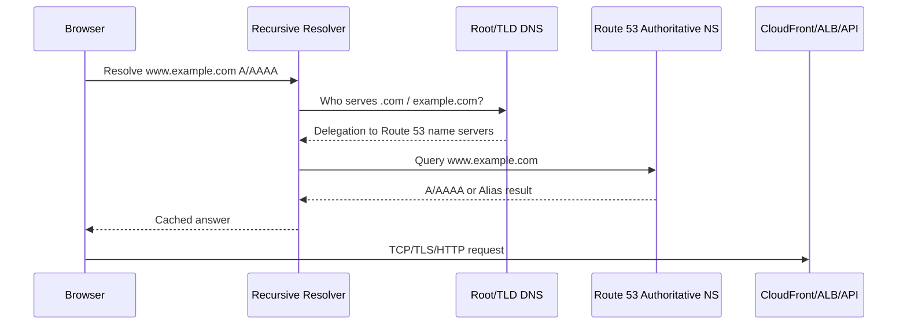
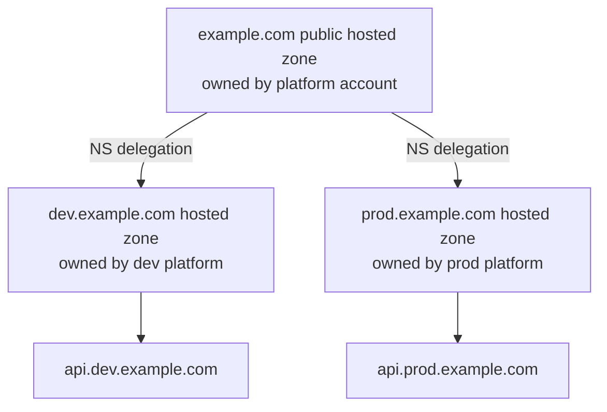
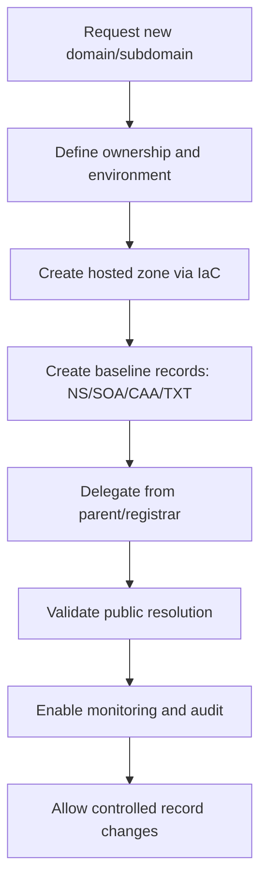
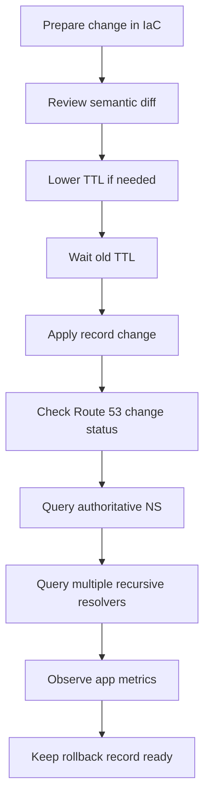
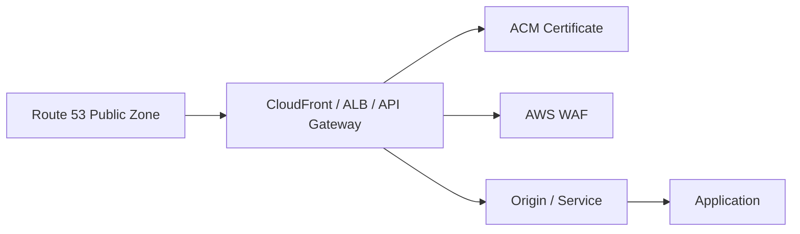

# Part 041 — Amazon Route 53 Public Hosted Zones

Public hosted zone adalah tempat kamu mendefinisikan bagaimana internet harus menemukan aplikasi kamu.

Bukan tempat request HTTP berjalan. Bukan load balancer. Bukan CDN. Bukan mekanisme failover instan. Route 53 public hosted zone adalah **authoritative DNS database** untuk domain publik. Ia menjawab pertanyaan seperti:

> "Untuk `api.example.com`, alamat mana yang harus saya hubungi?"

Jawaban itu bisa berupa IP, hostname AWS resource, alias ke CloudFront, alias ke ALB, MX untuk mail, TXT untuk verification, CAA untuk certificate authority policy, dan sebagainya.

Kesalahan umum engineer adalah memperlakukan DNS seperti service discovery realtime. DNS bukan message bus. DNS adalah sistem caching global dengan resolver yang berada di luar kontrol penuh kita. Route 53 bisa cepat menerima perubahan record, tetapi client dan recursive resolver tetap bisa menahan jawaban lama sampai TTL habis, bahkan kadang lebih lama karena implementasi resolver/client/library.

Mental model produksi:

```txt
Hosted zone adalah source of truth authoritative.
Resolver cache adalah realita yang dilihat user.
TTL adalah kontrak probabilistik, bukan tombol sinkronisasi global.
```

Part ini fokus pada public hosted zone. Private hosted zone sudah disentuh di Part 038 dan akan muncul lagi ketika kita membahas private application networking. Di sini kita bicara DNS yang terlihat dari internet.

---

## 1. Problem yang Diselesaikan Public Hosted Zone

Tanpa DNS, user perlu tahu IP address aplikasi. Itu tidak scalable karena:

1. IP resource cloud bisa berubah.
2. Satu aplikasi bisa punya banyak endpoint.
3. Endpoint bisa berpindah Region, load balancer, atau CDN.
4. Domain perlu subdomain, email routing, certificate validation, dan ownership verification.
5. Deployment butuh indirection agar perubahan backend tidak memaksa perubahan di client.

Public hosted zone menyelesaikan ini dengan memberikan lapisan **name-to-target mapping**.

Contoh domain:

```txt
example.com
├── example.com           -> CloudFront distribution
├── www.example.com       -> CloudFront distribution
├── api.example.com       -> regional ALB or API Gateway
├── assets.example.com    -> CloudFront distribution
├── status.example.com    -> SaaS status page
├── _acme-challenge       -> certificate validation
├── _amazonses            -> SES domain verification
├── mail.example.com      -> mail provider
└── TXT/SPF/DKIM/DMARC    -> email authentication
```

Yang penting: Route 53 tidak "mengirim" traffic ke target. Route 53 hanya menjawab DNS query. Setelah client menerima jawaban DNS, koneksi TCP/TLS/HTTP berjalan langsung ke endpoint hasil resolve.



DNS answer terjadi sebelum aplikasi menerima request. Maka debugging DNS harus dipisahkan dari debugging HTTP.

---

## 2. Hosted Zone: Container untuk Authoritative Records

Hosted zone adalah container records untuk domain tertentu.

Jika kamu membuat public hosted zone `example.com`, Route 53 akan menyediakan set authoritative name server, biasanya empat name server. Domain registrar harus diarahkan ke name server tersebut agar internet tahu bahwa Route 53 adalah authoritative DNS untuk domain itu.

Ada dua konsep yang sering tercampur:

| Konsep | Fungsi |
|---|---|
| Domain registration | Kepemilikan nama domain di registrar. |
| Hosted zone | Database DNS authoritative untuk domain. |
| Delegation | Mengarahkan domain/subdomain ke authoritative name server tertentu. |
| Record set | Instruksi DNS untuk nama tertentu. |

Kamu bisa membeli domain di Route 53 Registrar atau di registrar lain. Yang menentukan Route 53 dipakai sebagai DNS bukan tempat membeli domain, tetapi **NS delegation**.

Jika registrar masih menunjuk ke name server lama, hosted zone Route 53 kamu tidak akan dipakai oleh internet walaupun record-nya sudah benar.

---

## 3. Delegation: Jalur Kepercayaan DNS

DNS adalah hierarki.

Untuk domain `api.example.com`, resolver tidak langsung tahu Route 53. Ia mengikuti rantai:

```txt
.                root
└── com          TLD
    └── example.com     authoritative zone
        └── api.example.com record
```

Delegation berarti parent zone memberitahu resolver: "untuk child zone ini, tanya name server berikut."

Ada dua bentuk delegation yang umum:

### 3.1 Registered Domain Delegation

Domain `example.com` didaftarkan di registrar. Registrar menyimpan NS untuk domain tersebut di TLD `.com`.

```txt
example.com NS ns-123.awsdns-45.net
example.com NS ns-456.awsdns-67.org
example.com NS ns-789.awsdns-12.com
example.com NS ns-101.awsdns-34.co.uk
```

Saat kamu membuat public hosted zone `example.com`, kamu harus memastikan registrar memakai NS yang diberikan hosted zone tersebut.

### 3.2 Subdomain Delegation

Kamu bisa mendelegasikan `dev.example.com` ke hosted zone lain.

Parent zone `example.com` memiliki record:

```txt
dev.example.com NS ns-aaa.awsdns-xx.net
dev.example.com NS ns-bbb.awsdns-yy.org
```

Child hosted zone `dev.example.com` berisi record:

```txt
api.dev.example.com A/ALIAS ...
app.dev.example.com A/ALIAS ...
```

Ini berguna untuk multi-account atau team autonomy.



Subdomain delegation adalah boundary ownership yang sangat kuat. Ia lebih bersih daripada semua team menulis record di satu hosted zone root yang sama.

---

## 4. Record Types yang Paling Sering Dipakai

DNS record bukan semua sama. Masing-masing punya maksud berbeda.

| Record | Gunakan untuk | Catatan produksi |
|---|---|---|
| A | Name ke IPv4 address | Jarang dipakai langsung untuk dynamic AWS resource. |
| AAAA | Name ke IPv6 address | Wajib untuk dual-stack endpoint. |
| CNAME | Alias name ke name lain | Tidak bisa dipakai di zone apex. |
| NS | Delegation name server | Dipakai untuk domain/subdomain delegation. |
| SOA | Zone metadata | Dibuat otomatis oleh hosted zone. |
| MX | Mail exchanger | Untuk email routing. |
| TXT | Verification, SPF, DKIM, DMARC | Sering jadi sumber typo/quote bug. |
| CAA | CA yang boleh issue certificate | Guardrail supply-chain certificate. |
| SRV | Service discovery legacy/protocol tertentu | Lebih jarang untuk modern HTTP app. |

Untuk AWS application endpoint, record paling penting bukan A/CNAME biasa, tetapi **Alias record**.

---

## 5. Alias Record: Route 53 Extension yang Sangat Penting

Alias record adalah fitur Route 53 yang mirip CNAME dari sudut pemakai, tetapi berbeda secara DNS behavior dan integrasi AWS.

Alias record dapat menunjuk ke resource AWS tertentu seperti:

- CloudFront distribution
- Elastic Load Balancing load balancer
- API Gateway custom domain
- Global Accelerator
- S3 static website endpoint
- VPC interface endpoint
- record lain di hosted zone yang sama

Kenapa alias penting?

### 5.1 Alias Bisa Dipakai di Zone Apex

DNS standar tidak mengizinkan CNAME di apex domain.

Tidak valid:

```txt
example.com CNAME d111111abcdef8.cloudfront.net
```

Valid dengan Route 53 alias:

```txt
example.com A ALIAS d111111abcdef8.cloudfront.net
example.com AAAA ALIAS d111111abcdef8.cloudfront.net
```

Ini membuat domain root bisa diarahkan ke CloudFront/ALB/API Gateway tanpa melanggar DNS rules.

### 5.2 Alias Mengikuti Perubahan AWS Resource

Load balancer dan CloudFront tidak seharusnya diperlakukan sebagai satu IP statis. Alias memungkinkan Route 53 menjawab query dengan value yang benar untuk resource target.

Kalau ALB berubah IP internalnya, kamu tidak perlu update record manual.

### 5.3 Alias Tidak Selalu Punya TTL yang Kamu Atur

Jika alias menunjuk ke AWS resource, TTL mengikuti default resource target. Ini penting dalam failover expectation. Jangan menjanjikan "TTL 5 detik" jika alias target tidak memakai TTL record manual.

### 5.4 Alias Bukan Reverse Proxy

Alias tidak membuat Route 53 berada di data path.

```txt
Client -> Route 53 -> ALB   ❌ salah mental model
Client -> Route 53 DNS answer -> ALB   ✅ benar
```

Route 53 tidak melihat request HTTP, header, cookie, body, status code, atau latency actual client-to-origin setelah DNS selesai.

---

## 6. Apex Domain Pattern

Apex adalah nama domain tanpa subdomain.

```txt
example.com      apex
www.example.com  subdomain
api.example.com  subdomain
```

Untuk website modern, pattern umum:

```txt
example.com      A/AAAA ALIAS -> CloudFront
www.example.com  A/AAAA ALIAS -> CloudFront
```

CloudFront distribution punya alternate domain name/CNAME configuration dan certificate yang mencakup domain tersebut. Route 53 alias hanya mengarahkan DNS. CloudFront tetap harus dikonfigurasi untuk menerima Host header domain itu.

Anti-pattern:

```txt
example.com A -> single EC2 public IP
```

Ini rapuh karena:

- tidak multi-AZ secara natural,
- sulit rolling deploy,
- tidak ada managed TLS/load balancing,
- IP menjadi coupling kuat,
- tidak cocok untuk edge/cache/security pattern.

Better baseline:

```txt
example.com A/AAAA ALIAS -> CloudFront
CloudFront origin -> ALB/API Gateway/S3
```

Atau untuk non-cache regional API:

```txt
api.example.com A/AAAA ALIAS -> regional ALB/API Gateway
```

---

## 7. Public Hosted Zone Account Strategy

Untuk production, hosted zone tidak seharusnya dibuat sembarangan di workload account.

Ada beberapa model.

### 7.1 Centralized Public DNS Account

Satu account memegang root domain dan delegation.

```txt
network-dns-prod account
└── example.com public hosted zone
    ├── NS delegation to dev.example.com
    ├── NS delegation to prod.example.com
    └── corporate/security DNS records
```

Kelebihan:

- domain ownership jelas,
- audit lebih mudah,
- change control kuat,
- lebih kecil risiko accidental deletion,
- certificate/domain verification bisa dikelola platform.

Kekurangan:

- bottleneck jika semua perubahan harus lewat platform,
- butuh automation self-service,
- butuh guardrail agar team tidak menunggu manual ticket.

### 7.2 Delegated Subdomain per Environment

Root zone dikelola platform. Environment punya child zone.

```txt
example.com
├── dev.example.com   -> delegated to dev account
├── test.example.com  -> delegated to test account
└── prod.example.com  -> delegated to prod DNS account
```

Ini memberi autonomy sambil menjaga root domain.

### 7.3 Delegated Subdomain per Product

```txt
payments.example.com
claims.example.com
identity.example.com
```

Cocok untuk organisasi besar dengan product/team boundary jelas. Namun perlu naming governance agar tidak menjadi domain sprawl.

---

## 8. Hosted Zone Lifecycle sebagai Production Asset

Hosted zone adalah critical infrastructure. Perlakukan seperti database konfigurasi global.

Lifecycle aman:



Jangan menghapus hosted zone hanya karena "sepertinya tidak dipakai". Dampaknya bisa besar:

- domain tidak resolve,
- certificate validation gagal,
- email delivery rusak,
- SaaS ownership verification hilang,
- failover record hilang,
- subdomain delegation terputus.

Minimum sebelum delete:

1. Cari query logs jika tersedia.
2. Cek records dan dependency IaC.
3. Cek ACM certificates yang bergantung pada DNS validation.
4. Cek SES/domain verification.
5. Cek CNAME/TXT untuk SaaS integrations.
6. Cek NS delegation dari parent zone/registrar.
7. Tunggu TTL dan observasi.

---

## 9. Record Design untuk Application Entry Points

DNS record harus mengekspresikan **stability contract**, bukan detail internal.

Bad:

```txt
ip-10-20-3-45.ap-southeast-1.compute.internal
blue-alb-123456.ap-southeast-1.elb.amazonaws.com
```

Better:

```txt
api.example.com
app.example.com
assets.example.com
admin.example.com
```

Nama domain adalah API contract untuk client.

### 9.1 Stable Public Names

Gunakan nama yang mewakili capability:

```txt
api.example.com          public API
app.example.com          web app
assets.example.com       static assets
admin.example.com        admin portal
webhooks.example.com     inbound webhook endpoint
```

Jangan menaruh environment internal pada public production name kecuali memang diperlukan:

```txt
api-prod-blue-v2.example.com  ❌ terlalu implementation-specific
```

### 9.2 Deployment Names

Untuk deployment, boleh pakai nama internal atau temporary:

```txt
api-blue.example.com
api-green.example.com
canary-api.example.com
```

Tetapi client public tetap memakai:

```txt
api.example.com
```

Switching dilakukan via routing policy, alias target change, CloudFront origin switch, ALB weighted target group, atau deployment layer lain. Jangan semua strategi deployment ditempelkan ke DNS bila layer L7 lebih cocok.

---

## 10. TTL: Cache Contract, Bukan SLA Failover

TTL memberi tahu resolver berapa lama jawaban DNS boleh dicache.

Misal:

```txt
api.example.com A 203.0.113.10 TTL=300
```

Artinya resolver boleh menyimpan jawaban selama 300 detik.

Tetapi ada realita:

- client OS punya cache sendiri,
- browser punya cache sendiri,
- recursive resolver bisa punya policy sendiri,
- mobile carrier DNS bisa agresif cache,
- application runtime kadang cache DNS lebih lama dari TTL,
- long-lived TCP connection tidak terkena perubahan DNS sampai reconnect.

TTL rendah membantu migrasi/failover, tetapi tidak membuat failover instan.

### 10.1 TTL untuk Operational Change

Sebelum migrasi besar:

```txt
T-48h: turunkan TTL dari 3600 ke 60/120
T-0:   ubah target record
T+TTL: observasi residual traffic
T+24h: naikkan TTL lagi jika stabil
```

Kalau kamu lupa menurunkan TTL sebelum cutover, perubahan tetap bisa dilakukan, tetapi tail client yang memakai cached answer lama akan lebih panjang.

### 10.2 TTL untuk Stable Records

Untuk record yang jarang berubah:

```txt
MX, TXT, CAA, verification records: TTL medium/long boleh masuk akal
```

Untuk application record yang sering dipakai failover/cutover:

```txt
A/AAAA/CNAME/ALIAS application: TTL lebih pendek, tapi jangan ekstrem tanpa alasan
```

TTL terlalu rendah meningkatkan query volume dan biaya DNS. Lebih penting lagi, TTL terlalu rendah sering memberi ilusi bahwa DNS bisa menjadi control loop realtime.

---

## 11. DNSSEC untuk Public Hosted Zone

DNSSEC membantu resolver memvalidasi bahwa response DNS memang berasal dari authoritative source dan tidak dimodifikasi di tengah jalan.

Mental model:

```txt
DNS biasa: resolver menerima jawaban dari authoritative DNS.
DNSSEC: resolver juga bisa memverifikasi signature kriptografis jawaban.
```

Route 53 DNSSEC signing memakai konsep:

| Komponen | Fungsi |
|---|---|
| KSK | Key-signing key; di Route 53 berbasis customer managed KMS key. |
| ZSK | Zone-signing key; dikelola oleh Route 53. |
| DS record | Ditempatkan di parent zone/registrar untuk chain of trust. |
| RRSIG | Signature record untuk validasi. |

### 11.1 Kapan DNSSEC Relevan?

DNSSEC relevan untuk domain publik yang butuh protection terhadap spoofing/tampering DNS dan organisasi dengan compliance/security posture tinggi.

Namun DNSSEC menambah operational risk. Salah konfigurasi DS/KSK/signing bisa membuat domain tidak bisa divalidasi oleh resolver yang memeriksa DNSSEC.

Prinsipnya:

```txt
DNSSEC meningkatkan integrity.
DNSSEC juga meningkatkan konsekuensi kesalahan operasional.
```

### 11.2 DNSSEC Operational Checklist

Sebelum enable:

1. Pastikan hosted zone stabil.
2. Pastikan akses KMS key dan Route 53 permission benar.
3. Siapkan CloudWatch alarm untuk DNSSEC error.
4. Pahami proses DS record di registrar/parent zone.
5. Dokumentasikan rollback.
6. Uji dengan resolver yang melakukan DNSSEC validation.

Saat rotate/disable:

1. Jangan hapus DS record dan signing sembarangan.
2. Hormati TTL DS dan propagation time.
3. Validasi dari beberapa resolver publik.
4. Monitor SERVFAIL spike.

DNSSEC failure biasanya terlihat sebagai `SERVFAIL`, bukan `NXDOMAIN`. Ini sering membingungkan karena record sebenarnya ada, tetapi validator menolak jawaban.

---

## 12. CAA Record: Guardrail Certificate Issuance

CAA record menentukan certificate authority mana yang boleh menerbitkan certificate untuk domain.

Contoh:

```txt
example.com CAA 0 issue "amazon.com"
```

Dengan CAA, kamu bisa mengurangi risiko CA yang tidak diinginkan menerbitkan certificate untuk domain kamu. Ini bukan pengganti certificate transparency monitoring, tetapi guardrail penting.

Untuk organisasi besar, CAA harus dikelola oleh platform/security team karena salah konfigurasi bisa membuat certificate renewal gagal.

Pattern:

```txt
example.com CAA issue "amazon.com"
example.com CAA issue "letsencrypt.org"
example.com CAA iodef "mailto:security@example.com"
```

Gunakan hanya CA yang memang dipakai. Jangan copy-paste daftar panjang tanpa ownership.

---

## 13. TXT Records: Kecil tapi Sering Merusak Produksi

TXT record dipakai untuk:

- ACM DNS validation,
- SES verification,
- SPF,
- DKIM,
- DMARC,
- Google/Microsoft/SaaS verification,
- security tooling.

Kesalahan umum:

1. TXT value quote ganda salah.
2. Multiple TXT untuk SPF padahal SPF seharusnya satu policy per name.
3. Menimpa TXT verification record yang masih dipakai.
4. Menghapus `_acme-challenge` saat certificate automation masih berjalan.
5. Membuat TXT di hosted zone yang tidak authoritative.

Runbook:

```bash
# Check authoritative answer directly
nslookup -type=TXT _acme-challenge.example.com ns-123.awsdns-45.net

# Check public resolver view
nslookup -type=TXT _acme-challenge.example.com 8.8.8.8
```

Bedakan antara authoritative answer dan recursive resolver cache.

---

## 14. Route 53 Change Safety

Route 53 changes biasanya asynchronous. Change submitted lalu mencapai status propagated. Tetapi propagated di Route 53 authoritative fleet tidak sama dengan semua recursive resolver di dunia sudah membuang cache lama.

Safe change process:



Semantic diff lebih penting daripada line diff. Contoh perubahan kecil yang berisiko besar:

```diff
-api.example.com ALIAS old-prod-alb
+api.example.com ALIAS new-prod-alb
```

Pertanyaan review:

- Apakah target baru menerima Host header yang sama?
- Apakah certificate mencakup domain?
- Apakah security group target mengizinkan traffic?
- Apakah WAF/CloudFront/API Gateway custom domain sudah siap?
- Apakah health check valid?
- Apakah rollback target masih hidup?
- Apakah TTL lama sudah habis?

---

## 15. Public Zone + CloudFront Pattern

Pattern paling umum untuk web app global:

```txt
example.com      ALIAS -> CloudFront distribution
www.example.com  ALIAS -> CloudFront distribution
assets.example.com ALIAS -> CloudFront distribution
```

CloudFront config harus memiliki:

- alternate domain name/CNAME untuk domain tersebut,
- ACM certificate di Region yang sesuai untuk CloudFront certificate,
- origin config,
- cache behavior,
- viewer protocol policy,
- WAF jika diperlukan.

Route 53 hanya memetakan name ke CloudFront. Kalau CloudFront belum mengenali alternate domain, DNS benar tetap bisa menghasilkan HTTP/TLS error.

Debug sequence:

```txt
1. dig www.example.com
2. verify answer points to CloudFront
3. openssl s_client -servername www.example.com -connect www.example.com:443
4. curl -I https://www.example.com
5. check CloudFront distribution alternate domain names
6. check certificate SAN
```

---

## 16. Public Zone + ALB Pattern

Pattern regional API/web service:

```txt
api.example.com ALIAS -> internal? no, public ALB only for public zone public access
api.example.com ALIAS -> internet-facing ALB
```

ALB tetap harus:

- internet-facing jika diakses dari internet,
- berada di public subnets,
- punya listener 443,
- punya certificate yang cocok,
- target group healthy,
- SG mengizinkan inbound dari source yang benar.

Route 53 tidak memperbaiki ALB yang unhealthy.

Jika DNS resolve tetapi request gagal:

```txt
DNS layer     : dig returns ALB addresses
TCP layer     : connection refused/timeout?
TLS layer     : certificate mismatch?
HTTP layer    : 404/502/503/504?
App layer     : auth/business error?
```

Pisahkan layer. Jangan langsung menyalahkan DNS.

---

## 17. Public Zone + API Gateway Pattern

Untuk API Gateway custom domain:

```txt
api.example.com ALIAS -> API Gateway custom domain target
```

Pastikan:

- custom domain sudah dibuat,
- API mapping benar,
- certificate valid,
- endpoint type sesuai: regional atau edge-optimized,
- Route 53 alias menunjuk target yang tepat,
- stage/base path mapping tidak salah.

DNS benar tetapi API Gateway bisa mengembalikan 403/404 jika custom domain mapping salah.

---

## 18. Zone Apex Redirection: `example.com` ke `www.example.com`

DNS tidak melakukan HTTP redirect. DNS hanya resolve name.

Jika kamu ingin `example.com` redirect ke `www.example.com`, kamu butuh HTTP layer:

- CloudFront Function/Lambda@Edge,
- ALB redirect rule,
- S3 static website redirect endpoint,
- application-level redirect.

Route 53 alias dari `example.com` ke `www.example.com` bukan HTTP redirect. Client tetap akan mengirim Host `example.com` ke target.

Mental model:

```txt
DNS alias changes destination address, not browser URL.
HTTP redirect changes browser URL.
```

---

## 19. Split Ownership: DNS, Certificate, Edge, App

Public endpoint biasanya melibatkan banyak service:



Ownership bisa beda team:

| Asset | Typical owner |
|---|---|
| Root domain | Platform/security |
| Subdomain zone | Product/platform team |
| Certificate | Platform/app team depending model |
| CloudFront/ALB/API Gateway | App/platform team |
| WAF | Security/platform |
| Origin app | Product team |

Masalah produksi sering muncul karena ownership tidak jelas. DNS cutover dilakukan, tetapi certificate belum siap. Atau CloudFront sudah siap, tetapi WAF memblokir traffic. Atau ALB target group belum healthy.

Production contract harus menyatakan:

```txt
Domain owner guarantees name delegation.
Edge owner guarantees TLS and routing.
App owner guarantees health and response.
Security owner guarantees policy does not block expected traffic.
```

---

## 20. IaC Model untuk Public Hosted Zone

Jangan kelola DNS produksi manual di console kecuali emergency.

Minimal IaC structure:

```txt
infra/dns/
├── zones/
│   ├── example.com.yaml
│   ├── dev.example.com.yaml
│   └── prod.example.com.yaml
├── records/
│   ├── app.yaml
│   ├── api.yaml
│   ├── mail.yaml
│   └── verification.yaml
└── policies/
    ├── allowed-record-types.yaml
    └── domain-ownership.yaml
```

Contoh conceptual record spec:

```yaml
name: api.example.com
type: A
routing: alias
target:
  kind: alb
  environment: prod
  region: ap-southeast-1
safety:
  requiresCertificate: true
  requiresHealthCheck: true
  maxTtl: 300
owner:
  team: payments-platform
  slack: '#payments-platform'
```

Yang penting bukan formatnya. Yang penting adalah DNS record punya metadata ownership dan safety.

### 20.1 Guardrail yang Layak Ada

- Tidak boleh delete apex NS/SOA.
- Tidak boleh CNAME di apex.
- Tidak boleh wildcard tanpa review security.
- Tidak boleh public record menunjuk ke deprecated endpoint.
- Tidak boleh record production tanpa owner.
- Tidak boleh change ke CloudFront/ALB tanpa certificate validation.
- Tidak boleh delete TXT verification tanpa dependency check.
- Tidak boleh membuka subdomain delegation tanpa approval domain owner.

---

## 21. Wildcard Records

Wildcard DNS seperti:

```txt
*.example.com A/ALIAS -> target
```

Berguna untuk tenant routing, preview environment, atau catch-all app. Tetapi berisiko:

- subdomain typo tetap resolve,
- takeover detection lebih sulit,
- security monitoring lebih noisy,
- certificate wildcard memperluas blast radius,
- sulit membedakan intended vs accidental domain.

Gunakan wildcard jika application layer memang dirancang untuk memvalidasi Host header/tenant.

Bad:

```txt
*.example.com -> shared ALB
# app menerima Host apa saja tanpa tenant allowlist
```

Better:

```txt
*.tenant.example.com -> CloudFront/ALB
application validates tenant slug exists and is active
unknown tenant returns 404/403
```

---

## 22. Public DNS Debugging Runbook

Gunakan debugging berlapis.

### 22.1 Apakah Domain Didelegasikan ke Hosted Zone yang Benar?

```bash
dig NS example.com
```

Bandingkan dengan NS di hosted zone Route 53.

Jika berbeda, record di Route 53 tidak relevan untuk internet.

### 22.2 Apakah Authoritative Name Server Menjawab Record yang Benar?

```bash
dig @ns-123.awsdns-45.net api.example.com A
```

Jika authoritative salah, perbaiki hosted zone/record.

### 22.3 Apakah Recursive Resolver Masih Cache Jawaban Lama?

```bash
dig @8.8.8.8 api.example.com A
dig @1.1.1.1 api.example.com A
```

Bandingkan TTL tersisa.

### 22.4 Apakah DNS Jawaban Benar tapi App Gagal?

```bash
curl -Iv https://api.example.com
```

Pisahkan:

| Gejala | Kemungkinan |
|---|---|
| NXDOMAIN | Record tidak ada atau salah zone/delegation. |
| SERVFAIL | DNSSEC/broken delegation/resolver issue. |
| NOERROR no answer | Record type mismatch. |
| CNAME loop | Record chain salah. |
| TLS mismatch | Certificate/edge config salah. |
| 502/503 | Load balancer/origin/app issue. |
| Timeout | Network path/SG/NACL/origin unreachable. |

---

## 23. Common Failure Modes

### 23.1 Hosted Zone Duplikat

Dua hosted zone `example.com` dibuat di account berbeda. Record ditambahkan ke zone A, tetapi registrar menunjuk NS zone B.

Gejala:

```txt
Console terlihat benar, internet tetap salah.
```

Solusi:

- cek NS authoritative,
- hapus/migrasikan hosted zone duplikat,
- enforce ownership via Organizations/tagging.

### 23.2 Record di Private Zone, Bukan Public Zone

Engineer menambahkan `api.example.com` ke private hosted zone. Dari EC2 resolve, dari internet tidak.

Solusi:

- cek public hosted zone,
- cek resolver path,
- gunakan `dig @authoritative-ns` dari luar.

### 23.3 CNAME di Apex

DNS standar tidak memperbolehkan. Gunakan Route 53 alias.

### 23.4 DNS Correct, TLS Broken

DNS menunjuk ke CloudFront/ALB yang tidak punya certificate untuk Host header tersebut.

Solusi:

- cek certificate SAN,
- cek CloudFront alternate domain name,
- cek ALB listener certificate.

### 23.5 Long TTL Menunda Cutover

Record sudah berubah, sebagian user masih ke old endpoint.

Solusi:

- tunggu TTL,
- jangan shutdown old endpoint terlalu cepat,
- turunkan TTL sebelum migrasi berikutnya.

### 23.6 TXT Record Overwrite

SaaS verification/certificate validation rusak karena record TXT diganti, bukan ditambah value.

Solusi:

- gunakan IaC merge strategy,
- record ownership metadata,
- dependency scan sebelum delete.

---

## 24. Design Review Checklist

Sebelum membuat/mengubah public DNS production:

```txt
[ ] Hosted zone authoritative untuk domain?
[ ] Parent/registrar NS delegation benar?
[ ] Record name benar, termasuk trailing dot jika tooling butuh?
[ ] Record type benar?
[ ] Apex memakai alias, bukan CNAME?
[ ] Target resource sudah siap menerima Host header?
[ ] Certificate mencakup domain?
[ ] WAF/security policy sudah sesuai?
[ ] Health check/failover expectation realistis?
[ ] TTL cocok dengan change risk?
[ ] Rollback target masih aktif?
[ ] Owner record jelas?
[ ] Query/traffic observability tersedia?
[ ] Tidak menghapus TXT/CAA/MX penting?
[ ] DNSSEC/CAA impact dipahami?
```

---

## 25. Mental Model Akhir

Route 53 public hosted zone adalah authoritative map dari nama publik ke target. Ia sangat powerful karena berada di depan seluruh aplikasi, tetapi bukan data-plane proxy.

Pegang invariant berikut:

1. **Delegation decides authority.** Record benar di hosted zone salah tetap tidak dipakai.
2. **DNS answers are cached.** Perubahan tidak realtime untuk semua client.
3. **Alias solves AWS target indirection.** Terutama untuk apex dan managed resources.
4. **DNS does not fix application readiness.** TLS, Host header, WAF, health, dan app tetap harus benar.
5. **Hosted zone is production infrastructure.** Perlakukan seperti critical config database.
6. **Public DNS is an ownership boundary.** Domain naming harus dikontrol, bukan dibiarkan tumbuh liar.

Part berikutnya membahas Route 53 routing policies: simple, weighted, latency, failover, geolocation, geoproximity, IP-based, dan multivalue answer. Ingat: semua policy itu tetap bekerja di dunia DNS yang cache-oriented, bukan request router realtime.

---

## References

- AWS Documentation — Amazon Route 53 concepts: https://docs.aws.amazon.com/Route53/latest/DeveloperGuide/route-53-concepts.html
- AWS Documentation — Working with hosted zones: https://docs.aws.amazon.com/Route53/latest/DeveloperGuide/hosted-zones-working-with.html
- AWS Documentation — Choosing between alias and non-alias records: https://docs.aws.amazon.com/Route53/latest/DeveloperGuide/resource-record-sets-choosing-alias-non-alias.html
- AWS Documentation — Configuring DNSSEC signing in Amazon Route 53: https://docs.aws.amazon.com/Route53/latest/DeveloperGuide/dns-configuring-dnssec.html
