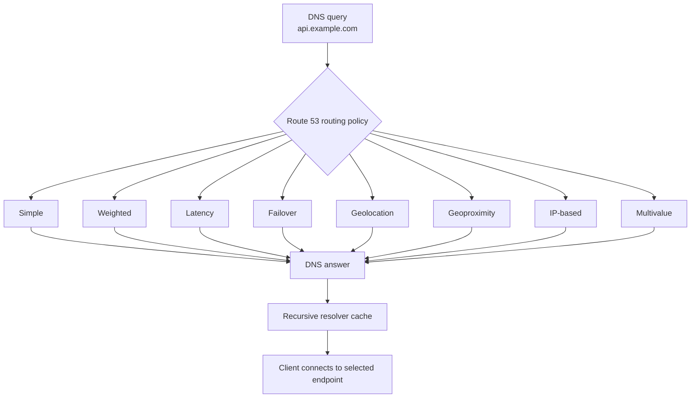
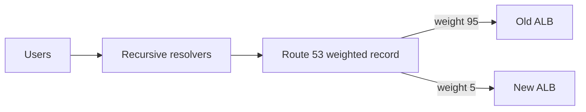
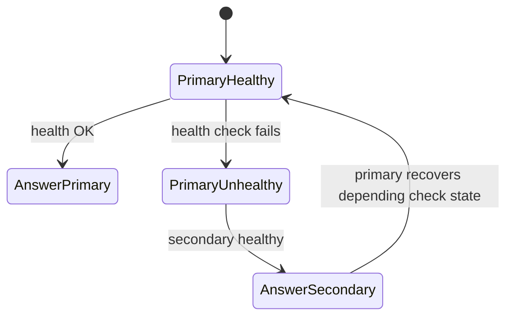
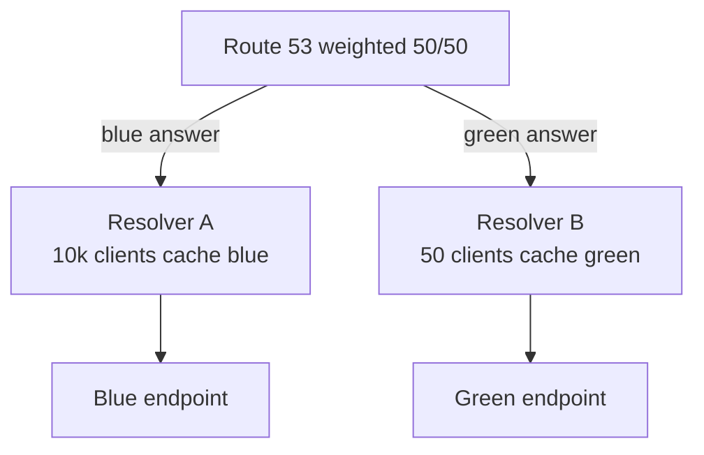
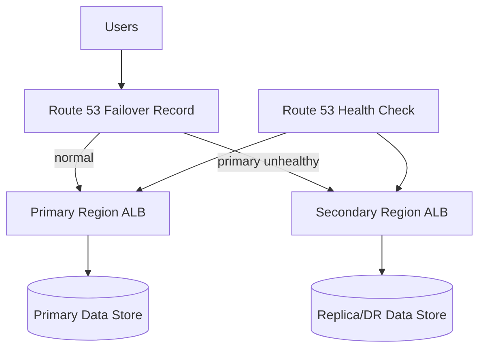

# Part 042 — Route 53 Routing Policies

Route 53 routing policy menentukan bagaimana authoritative DNS Route 53 menjawab query untuk sebuah record.

Kata "routing" di sini sering menyesatkan. Ini bukan routing seperti VPC route table. Ini bukan reverse proxy seperti CloudFront. Ini bukan load balancer seperti ALB. Ini adalah **DNS answer selection**.

Query masuk:

```txt
What is A api.example.com?
```

Route 53 memilih jawaban berdasarkan policy:

```txt
simple      -> satu jawaban standar
weighted    -> jawaban berdasarkan bobot
latency     -> jawaban berdasarkan latency terbaik menurut AWS measurement
failover    -> primary/secondary berdasarkan health
geolocation -> lokasi user
geoproximity -> lokasi user + resource + bias
IP-based    -> CIDR source resolver/client mapping
multivalue  -> beberapa jawaban sehat
```

Setelah jawaban diberikan, resolver bisa cache. Client lalu connect ke endpoint tersebut. Route 53 tidak melihat request HTTP berikutnya.

Mental model produksi:

```txt
Route 53 routing policy is a DNS decision.
DNS decision is cached.
Cached decision is not per-request global load balancing.
```

---

## 1. Diagram Besar Routing Policy



Semua policy berakhir pada DNS answer. Ini membedakannya dari:

| Service | Decision point | Data path? | Cocok untuk |
|---|---|---:|---|
| Route 53 | DNS query | Tidak | Global/regional name steering. |
| CloudFront | Edge request | Ya | CDN, HTTP caching, edge security. |
| Global Accelerator | Anycast network edge | Ya | TCP/UDP global acceleration/failover. |
| ALB | HTTP request | Ya | L7 host/path/header routing. |
| NLB | L4 connection | Ya | TCP/UDP/TLS low latency. |

Route 53 bagus untuk memilih endpoint coarse-grained. Ia buruk untuk keputusan yang butuh awareness per request, per header, per cookie, atau per live connection.

---

## 2. Record Set Identity: Name + Type + Policy

Dalam Route 53, kamu bisa punya beberapa record dengan name dan type yang sama jika policy mendukung multiple records, misalnya weighted/latency/failover. Masing-masing biasanya punya `set identifier`.

Contoh weighted:

```txt
api.example.com A ALIAS -> blue-alb    weight 90  set-id blue
api.example.com A ALIAS -> green-alb   weight 10  set-id green
```

Semua record tersebut mewakili logical DNS name yang sama, tetapi Route 53 memilih salah satu jawaban sesuai policy.

Satu kesalahan umum: engineer mengira membuat banyak record A dengan nama sama selalu berarti round-robin. Untuk simple routing, multiple values dalam satu record bisa dikembalikan, tetapi tidak health checked seperti multivalue dan bukan weighted routing.

---

## 3. Simple Routing Policy

Simple routing adalah standard DNS answer tanpa logic Route 53 khusus seperti weighted/latency.

Gunakan untuk:

- satu endpoint stabil,
- record verification,
- MX/TXT/CAA,
- subdomain yang tidak butuh traffic steering,
- internal sederhana di private zone.

Contoh:

```txt
www.example.com A/AAAA ALIAS -> CloudFront distribution
mail.example.com MX -> mail provider
_acme-challenge.example.com TXT -> certificate validation
```

### 3.1 Multiple Values dalam Simple Record

Untuk non-alias record, kamu bisa menaruh beberapa IP:

```txt
api.example.com A:
  203.0.113.10
  203.0.113.11
```

Route 53 dapat mengembalikan semua value dalam random order. Tetapi ini bukan health-based routing. Jika salah satu IP mati, resolver/client masih bisa menerima IP tersebut.

Production advice:

```txt
Jangan gunakan simple multi-value A record sebagai load balancer produksi.
```

Gunakan ALB/NLB/CloudFront/Global Accelerator atau multivalue answer dengan health check jika memang butuh DNS-level multi-answer.

---

## 4. Weighted Routing Policy

Weighted routing membagi jawaban berdasarkan bobot relatif.

Contoh:

```txt
api.example.com -> old-alb weight 90
api.example.com -> new-alb weight 10
```

Secara ekspektasi, sekitar 90% DNS answers mengarah ke old dan 10% ke new. Tetapi real traffic tidak selalu persis 90/10 karena:

- recursive resolver cache,
- resolver population tidak seragam,
- satu resolver bisa melayani ribuan user,
- client connection reuse,
- TTL,
- geographic traffic distribution.

Weighted policy adalah **DNS answer weighting**, bukan per-request traffic splitting.

### 4.1 Use Cases

Weighted routing cocok untuk:

1. Canary endpoint.
2. Gradual migration.
3. Blue/green cutover sederhana.
4. A/B traffic coarse-grained.
5. Controlled rollback by setting new endpoint weight to 0.

### 4.2 Canary Pattern



Rollout:

```txt
1%  -> smoke observation
5%  -> error budget check
10% -> latency and dependency check
25% -> business metric check
50% -> scale check
100% -> cutover
```

Rollback:

```txt
new weight = 0
old weight = 100
```

Tetapi rollback masih dipengaruhi TTL. Jangan matikan endpoint baru terlalu cepat karena resolver yang sudah menerima jawaban baru masih bisa mengirim traffic sampai cache habis.

### 4.3 Weight 0 Semantics

Weight 0 biasanya dipakai untuk standby/disabled candidate. Tetapi jangan mengasumsikan weight 0 selalu tidak pernah dipilih dalam semua kombinasi health/record state tanpa membaca policy behavior spesifik. Dalam desain produksi, lebih aman:

```txt
If endpoint must receive no traffic, remove it from active routing path or make it fail health intentionally only if semantics understood.
```

Gunakan weight 0 sebagai operational lever, bukan satu-satunya safety boundary.

### 4.4 Weighted vs ALB Weighted Target Groups

| Kebutuhan | Route 53 weighted | ALB weighted target group |
|---|---|---|
| Split antar-Region | Cocok | Tidak lintas Region secara langsung. |
| Split per HTTP request | Lemah karena DNS cache | Lebih cocok. |
| Header/cookie stickiness | Tidak | Bisa di L7/app layer. |
| Failover DNS-level | Bisa dengan health check | Di scope ALB target. |
| Granular canary | Kurang presisi | Lebih presisi. |

Jika kedua endpoint berada di balik ALB yang sama, gunakan ALB weighted target group. Jika endpoint berbeda Region/DNS target, Route 53 weighted bisa masuk akal.

---

## 5. Latency Routing Policy

Latency routing memilih endpoint di Region yang memberikan latency terbaik menurut data Route 53/AWS, bukan berdasarkan benchmark live dari setiap client ke endpoint kamu saat itu juga.

Contoh:

```txt
api.example.com latency ap-southeast-1 -> alb-sg
api.example.com latency ap-northeast-1 -> alb-tokyo
api.example.com latency eu-west-1      -> alb-ireland
```

User di Jakarta mungkin diarahkan ke Singapore. User di Jepang ke Tokyo. User di Eropa ke Ireland.

### 5.1 Use Cases

Cocok untuk:

- active-active regional app,
- read-heavy service dengan data replicated,
- public app dengan latency-sensitive entrypoint,
- API yang bisa melayani user dari beberapa Region.

Tidak cocok jika:

- hanya satu Region punya writable primary database,
- data residency harus strict country/legal boundary,
- authentication/session state tidak global,
- endpoint tidak feature-equivalent,
- rollback butuh precision tinggi.

### 5.2 Latency Routing Tidak Menghapus State Problem

Jika aplikasi multi-Region tetapi state hanya ada di satu Region, DNS latency routing bisa mengarahkan user ke Region "dekat" yang tidak punya data yang benar.

Pertanyaan desain:

```txt
Can every selected Region serve the request correctly?
```

Kalau jawabannya tidak, jangan pakai latency routing untuk endpoint itu. Pakai failover, geolocation, atau app-level routing yang sadar state.

### 5.3 Latency + Health Check

Latency record bisa dikombinasikan dengan health check. Jika Region terdekat unhealthy, Route 53 dapat memilih endpoint sehat lain sesuai policy.

Namun failover tetap DNS-cache-bound. Long-lived clients perlu retry/re-resolve.

---

## 6. Failover Routing Policy

Failover routing adalah active-passive DNS pattern.

```txt
api.example.com PRIMARY   -> primary-alb
api.example.com SECONDARY -> secondary-alb
```

Route 53 menjawab primary selama primary healthy. Jika primary unhealthy berdasarkan health check, Route 53 menjawab secondary.



### 6.1 Use Cases

- DR Region standby.
- Maintenance cutover.
- Active-passive API.
- Static disaster page fallback.
- Failover dari custom origin ke backup origin jika CloudFront origin failover tidak cukup.

### 6.2 Health Check Reality

Failover hanya sebaik health check-nya.

Bad health check:

```txt
GET /health returns 200 if process alive
```

Better health check:

```txt
GET /ready returns 200 only if app can serve critical dependency path
```

Tetapi jangan membuat health check terlalu berat sampai dependency kecil membuat seluruh Region dianggap mati.

Health check harus merepresentasikan **serving capability**, bukan semua hal yang mungkin rusak.

### 6.3 Failback Risk

Saat primary pulih, DNS bisa kembali menjawab primary. Jika aplikasi belum siap menerima traffic penuh, kamu bisa mengalami flapping.

Mitigasi:

- manual failback untuk high-critical workloads,
- health check dengan stabilization window,
- operational approval sebelum primary eligible lagi,
- weighted gradual return setelah failover.

Route 53 native failover sederhana: primary sehat -> primary dipilih. Jika kamu butuh controlled failback, desain di luar DNS juga diperlukan.

### 6.4 DNS Failover Bukan Connection Migration

Existing TCP connections ke old endpoint tidak pindah otomatis. DNS failover hanya memengaruhi resolve berikutnya.

Client harus:

- retry,
- reconnect,
- re-resolve DNS,
- tidak cache DNS selamanya.

Runtime seperti JVM punya DNS cache behavior yang harus dipahami. Aplikasi internal enterprise sering gagal failover karena client library cache DNS terlalu lama.

---

## 7. Geolocation Routing Policy

Geolocation routing memilih jawaban berdasarkan lokasi user.

Contoh:

```txt
api.example.com geolocation Indonesia -> alb-jakarta-or-singapore
api.example.com geolocation EU        -> alb-eu
api.example.com default               -> alb-global
```

Gunakan saat aturan lokasi penting:

- compliance/data residency,
- localized content,
- country-specific endpoint,
- licensing restriction,
- market-specific application.

### 7.1 Default Record Penting

Selalu pikirkan default. Tidak semua IP resolver/client bisa dipetakan ke lokasi yang kamu definisikan.

Tanpa default, sebagian query bisa tidak mendapatkan jawaban sesuai ekspektasi.

```txt
default -> safe global endpoint or friendly unavailable page
```

### 7.2 Geolocation vs Latency

| Kebutuhan | Policy |
|---|---|
| Pilih endpoint terdekat/latency rendah | Latency routing |
| Paksa user negara/region tertentu ke endpoint tertentu | Geolocation routing |
| Geser traffic berdasarkan kedekatan resource dengan bias | Geoproximity routing |

Geolocation adalah rule-based. Latency adalah performance-oriented.

---

## 8. Geoproximity Routing Policy

Geoproximity routing mempertimbangkan lokasi user dan lokasi resource, lalu memungkinkan bias untuk memperluas/mengecilkan area yang diarahkan ke resource tertentu.

Contoh:

```txt
Resource Singapore bias 0
Resource Tokyo     bias 20
```

Bias positif memperluas wilayah resource; bias negatif mengecilkan.

Use cases:

- regional capacity shifting,
- traffic shaping antar-Region yang lokasinya berdekatan,
- gradual regional preference tanpa hard country rule,
- balancing latency dan capacity.

### 8.1 Geoproximity Bukan Autoscaling

Jika Tokyo overloaded, menaikkan/mengurangi bias bisa membantu steering DNS, tetapi:

- resolver cache delay tetap ada,
- existing connections tetap ada,
- traffic movement tidak presisi,
- geoproximity tidak membaca CPU/queue length real-time kecuali kamu mengubah config sendiri.

Untuk load balancing real-time, gunakan ALB/NLB/Global Accelerator/CloudFront/app layer sesuai kasus.

---

## 9. IP-Based Routing Policy

IP-based routing memilih jawaban berdasarkan source IP range yang diasosiasikan dengan CIDR collections/locations.

Ini berguna ketika kamu mengenal network asal user, misalnya:

- corporate office ranges,
- partner network ranges,
- ISP-specific steering,
- enterprise customers dengan dedicated CIDR,
- migration batch berdasarkan customer IP.

Contoh conceptual:

```txt
CIDR collection:
  partner-a: 198.51.100.0/24 -> partner-a-endpoint
  partner-b: 203.0.113.0/24  -> partner-b-endpoint
  default                    -> public-endpoint
```

### 9.1 Caveat Source IP

DNS query biasanya datang dari recursive resolver, bukan selalu IP end-user langsung. EDNS Client Subnet dapat membantu beberapa skenario, tetapi tidak universal.

Pertanyaan desain:

```txt
Apakah Route 53 melihat IP yang cukup representatif untuk policy ini?
```

Jika user memakai public resolver, VPN, corporate DNS, mobile carrier DNS, atau proxy DNS, source yang terlihat bisa berbeda dari ekspektasi.

---

## 10. Multivalue Answer Routing Policy

Multivalue answer routing membuat Route 53 menjawab DNS query dengan beberapa records, dan dapat memakai health checks. Route 53 dapat mengembalikan hingga beberapa healthy records dalam response.

Gunakan untuk:

- simple DNS-level endpoint pool,
- lightweight high availability untuk beberapa IP,
- service yang client-nya bisa mencoba beberapa IP,
- non-AWS/static endpoints dengan health checks.

Jangan anggap ini pengganti load balancer penuh.

### 10.1 Client Behavior Matters

Jika DNS response mengandung beberapa IP, client yang menentukan IP mana yang dipakai. Beberapa client mencoba satu saja. Beberapa akan retry IP berikutnya. Beberapa cache urutan tertentu.

Multivalue membantu availability hanya jika client behavior mendukung retry/fallback.

### 10.2 Multivalue vs Simple Multiple Values

| Aspek | Simple multiple values | Multivalue answer |
|---|---|---|
| Health check aware | Tidak | Bisa. |
| Randomization | Bisa random order | Dirancang untuk multi healthy answer. |
| Production HA intent | Lemah | Lebih cocok, tapi tetap DNS-level. |
| Pengganti ELB | Tidak | Tetap tidak. |

---

## 11. Health Checks sebagai Input Routing

Banyak routing policy bisa dikombinasikan dengan health check.

Health check bisa memeriksa:

- endpoint HTTP/HTTPS/TCP,
- status code/string matching,
- CloudWatch alarm,
- calculated health check dari beberapa check.

Mental model:

```txt
Health check tidak membuktikan seluruh sistem sehat.
Health check hanya membuktikan kondisi yang kamu ukur sedang terpenuhi.
```

### 11.1 Health Check Scope

Design health check berdasarkan failure domain.

| Endpoint | Health check sebaiknya mengukur |
|---|---|
| ALB | ALB reachable + app readiness endpoint. |
| CloudFront | Biasanya origin/app health perlu dipikirkan terpisah; CloudFront sendiri global. |
| API Gateway | API mapping + backend readiness if possible. |
| Static disaster page | S3/CloudFront object availability. |
| On-prem endpoint | WAN path + service availability. |

### 11.2 Avoid Over-sensitive Checks

Jika `/ready` gagal karena dependency minor, Route 53 bisa mengalihkan seluruh traffic ke Region lain dan memperburuk keadaan.

Kategorikan dependency:

```txt
hard dependency: app cannot serve without it -> health check boleh fail
soft dependency: app degraded but usable -> jangan fail global health
```

### 11.3 Health Check Blast Radius

Satu health check yang salah bisa menjatuhkan routing global. Perlakukan health check sebagai production control plane.

Checklist:

```txt
[ ] health endpoint stable?
[ ] false positive/false negative dipahami?
[ ] timeout realistis?
[ ] threshold realistis?
[ ] health check source allowed by SG/WAF?
[ ] dependency behavior jelas?
[ ] alerting tersedia?
[ ] manual override path ada?
```

---

## 12. Choosing the Right Routing Policy

Gunakan decision table ini.

| Tujuan | Policy Awal | Catatan |
|---|---|---|
| Satu endpoint | Simple | Baseline. |
| Gradual migration/canary antar endpoint DNS | Weighted | Tidak presisi per request karena cache. |
| Active-passive DR | Failover | Butuh health check dan failback plan. |
| Pilih Region latency rendah | Latency | Semua Region harus bisa melayani request. |
| Country/legal routing | Geolocation | Sediakan default. |
| Location + adjustable bias | Geoproximity | Cocok untuk traffic shaping geografis. |
| Corporate/customer CIDR steering | IP-based | Validasi source IP/resolver behavior. |
| Return multiple healthy IPs | Multivalue | Client retry behavior penting. |

---

## 13. Policy Composition Pattern

Route 53 mendukung kombinasi/pola tertentu, tetapi jangan membangun logic pohon yang terlalu kompleks tanpa alasan.

Contoh desain multi-layer:

```txt
api.example.com latency routing
├── ap-southeast-1 weighted records
│   ├── blue weight 90
│   └── green weight 10
└── eu-west-1 weighted records
    ├── blue weight 100
    └── green weight 0
```

Complexity meningkat cepat. Lebih banyak policy berarti lebih banyak edge case:

- health check inheritance,
- alias evaluate target health,
- TTL behavior,
- set identifier confusion,
- rollback difficulty,
- IaC drift.

Prinsip:

```txt
Use DNS policy for coarse steering.
Use edge/load-balancer/application layer for fine steering.
```

---

## 14. Evaluate Target Health

Untuk alias record ke beberapa AWS resources, Route 53 dapat mengevaluasi target health. Ini berbeda dari health check eksplisit.

Pahami sebelum dipakai:

- Apa arti target healthy untuk resource itu?
- Apakah semua child target health memengaruhi alias?
- Apakah target punya internal health model yang sesuai?
- Apa yang terjadi jika resource tidak punya healthy target?

Alias health behavior sering menjadi sumber kejutan. Dokumentasikan dalam record metadata.

Contoh operational question:

```txt
If ALB has zero healthy targets, should DNS stop returning this alias?
```

Jika ya, evaluate target health mungkin cocok. Jika tidak, gunakan health check/traffic handling yang lebih eksplisit.

---

## 15. Routing Policy dan TTL Interaction

Misal weighted 50/50 dengan TTL 300 detik.

Resolver A query sekali, dapat endpoint blue, lalu melayani 10.000 client dari cache selama 300 detik. Resolver B query sekali, dapat green, melayani 50 client. Real traffic tidak 50/50.



DNS traffic distribution selalu dipengaruhi resolver population. Makin besar recursive resolver, makin kasar granularitas distribusi.

Untuk canary presisi, gunakan layer yang berada di data path seperti ALB/CloudFront/application gateway.

---

## 16. Routing Policy dan Client Runtime

Client runtime bisa cache DNS secara agresif.

Contoh issue:

```txt
Route 53 failover berhasil.
New DNS answer sudah secondary.
Tetapi Java service masih connect ke old IP karena JVM DNS cache belum refresh.
```

Hal yang perlu dicek di platform internal:

- JVM DNS cache TTL setting.
- Node.js resolver behavior.
- HTTP client connection pool lifetime.
- gRPC channel DNS refresh behavior.
- Kubernetes CoreDNS cache.
- service mesh DNS/proxy behavior.
- mobile app DNS behavior.

DNS failover harus diuji dari client nyata, bukan hanya dari `dig`.

---

## 17. Blue/Green Migration dengan Weighted Routing

Skenario:

```txt
old API: api-old.example.com / old ALB
new API: api-new.example.com / new ALB
public:  api.example.com weighted alias
```

Plan:

```txt
T-48h lower TTL if needed
T-24h ensure new ALB cert/Host/WAF/app ready
T-1h  create weighted green record weight 0
T-0   set green 1%, observe
T+    increase 5%, 10%, 25%, 50%, 100%
T+    keep old alive for at least old TTL + safety window
```

Rollback:

```txt
green weight -> 0
blue weight  -> 100
keep green alive until TTL tail drains
```

Metrics to watch:

- DNS query counts per record if available,
- ALB request count per target,
- 4xx/5xx,
- p95/p99 latency,
- business errors,
- dependency saturation,
- customer support signal.

---

## 18. Active-Passive DR dengan Failover Routing

Skenario:

```txt
primary: ap-southeast-1
secondary: ap-northeast-1
record: api.example.com failover primary/secondary
```

Architecture:



DNS failover is only one piece. DR also needs:

- data replication,
- write ownership model,
- session/auth continuity,
- secrets/config parity,
- dependency parity,
- observability in secondary,
- runbook for failback.

Failover policy that redirects traffic to a secondary app that cannot write/read correct data is worse than no failover.

---

## 19. Active-Active Multi-Region dengan Latency Routing

Skenario:

```txt
api.example.com latency -> Region A/B/C
```

Prerequisites:

```txt
[ ] Each Region can serve user request.
[ ] Data access model is global or partitioned correctly.
[ ] Authentication/session works cross-region.
[ ] Idempotency and conflict resolution designed.
[ ] Dependencies are regional or globally reachable.
[ ] Observability can compare regions.
[ ] Deployment versions compatible.
```

Jika salah satu tidak terpenuhi, latency routing bisa memperkenalkan correctness bug.

Common design:

```txt
Read path active-active.
Write path routed to home Region based on user/customer shard.
```

Dalam kasus seperti itu, DNS latency routing mungkin hanya cocok untuk read endpoint, bukan write endpoint.

---

## 20. Geolocation untuk Compliance

Misal user EU harus ke EU endpoint.

```txt
api.example.com geolocation EU -> eu-west-1 endpoint
api.example.com default        -> global endpoint
```

Pertanyaan compliance:

- Apakah geolocation DNS cukup untuk requirement legal?
- Bagaimana dengan VPN/public resolver yang berada di lokasi lain?
- Apakah application layer juga memvalidasi residency?
- Apakah data store mencegah cross-region data access?

DNS geolocation adalah steering layer, bukan compliance proof tunggal.

Gunakan app/data controls juga.

---

## 21. SaaS Tenant Routing Pattern

Untuk SaaS enterprise, bisa ada kebutuhan:

```txt
tenant-a.example.com -> dedicated endpoint A
tenant-b.example.com -> shared endpoint B
```

Pilihan:

1. Separate records per tenant.
2. Wildcard record + app-level tenant routing.
3. IP-based routing untuk corporate customer ranges.
4. Geolocation/geoproximity untuk regional tenant serving.

DNS-level per tenant bisa menjadi sulit saat tenant ribuan. Gunakan automation dan metadata ownership.

Tenant routing harus tetap divalidasi di application layer. Jangan mengandalkan DNS sebagai authorization.

---

## 22. Anti-Patterns

### 22.1 DNS sebagai Load Balancer Utama

```txt
api.example.com A -> ip1, ip2, ip3
```

Tanpa health-aware client dan observability, ini rapuh. Gunakan ELB/GA/CloudFront.

### 22.2 DNS sebagai Feature Flag Realtime

Weighted DNS bukan feature flag. Resolver cache membuat rollout tidak presisi.

### 22.3 Failover Tanpa Client Retry

DNS failover tidak membantu client yang tidak reconnect/re-resolve.

### 22.4 Health Check Terlalu Dangkal

`/health` selalu 200 walau database mati. Route 53 terus mengirim traffic ke endpoint rusak.

### 22.5 Health Check Terlalu Sensitif

Dependency minor gagal, seluruh Region dianggap mati, traffic berpindah dan overload Region lain.

### 22.6 Geolocation sebagai Satu-satunya Compliance Control

DNS location can be wrong enough. App/data policy tetap diperlukan.

### 22.7 Complex Nested Policies Tanpa Test Matrix

Semakin kompleks policy tree, semakin sulit rollback dan debugging.

---

## 23. Debugging Routing Policy

Saat DNS answer tidak sesuai ekspektasi:

### 23.1 Query Authoritative NS

```bash
dig @ns-123.awsdns-45.net api.example.com A
```

### 23.2 Query dengan Resolver Berbeda

```bash
dig @8.8.8.8 api.example.com A
dig @1.1.1.1 api.example.com A
```

### 23.3 Cek TTL Tersisa

```bash
dig api.example.com A
```

Perhatikan `ANSWER SECTION` TTL.

### 23.4 Cek Health Check Status

Jangan hanya cek record. Cek health check state dan endpoint readiness.

### 23.5 Cek Policy Metadata

- set identifier benar?
- Region untuk latency record benar?
- weight benar?
- failover primary/secondary benar?
- geolocation default ada?
- alias target benar?
- evaluate target health sesuai intent?

### 23.6 Cek Client Path

Jika `dig` sudah benar tetapi aplikasi masih salah:

- client DNS cache,
- connection pool,
- proxy,
- VPN DNS,
- corporate resolver,
- Kubernetes CoreDNS,
- service mesh.

---

## 24. Testing Matrix

Sebelum production, buat matrix.

| Test | Expected |
|---|---|
| Query authoritative NS | Record sesuai policy. |
| Query public resolver | Jawaban muncul setelah propagation/cache. |
| Primary health fail | Failover ke secondary setelah threshold. |
| Secondary unhealthy | Tidak menerima failover traffic jika tidak sehat. |
| Weighted 1% | Endpoint baru menerima sebagian traffic, tidak presisi. |
| TTL tail | Old endpoint masih menerima traffic sampai cache habis. |
| Client restart | Client resolve endpoint baru. |
| Long-lived client | Tidak pindah sampai reconnect. |
| DNSSEC enabled | Validating resolver tidak SERVFAIL. |
| Rollback | Old endpoint kembali menerima traffic. |

---

## 25. Operational Runbooks

### 25.1 Weighted Canary Runbook

```txt
1. Confirm both endpoints healthy.
2. Confirm cert and Host header config.
3. Lower TTL in advance if possible.
4. Set new endpoint weight 1.
5. Observe DNS, ALB/CloudFront/API metrics.
6. Increase gradually.
7. Rollback by setting new weight 0 if error budget burns.
8. Keep both endpoints alive during TTL tail.
```

### 25.2 Failover Runbook

```txt
1. Confirm primary user-impacting failure.
2. Confirm secondary is ready.
3. If automatic health check has not failed, decide manual override path.
4. Force primary unhealthy or update routing if runbook allows.
5. Observe DNS answers from multiple resolvers.
6. Observe secondary traffic and dependencies.
7. Prevent premature failback.
8. Plan controlled failback after root cause fixed.
```

### 25.3 Geolocation Change Runbook

```txt
1. Identify impacted countries/continents.
2. Validate default record.
3. Confirm target capacity.
4. Apply low-risk change during window.
5. Query from geographic probes if available.
6. Monitor regional traffic and legal/business metrics.
```

---

## 26. Design Heuristics

Use Route 53 routing policy when:

- decision can happen at DNS query time,
- coarse traffic steering is acceptable,
- TTL/cache delay is acceptable,
- endpoint target is independently ready,
- client retry/re-resolve behavior is understood.

Avoid Route 53 routing policy when:

- decision must be per HTTP request,
- routing depends on header/cookie/body/user identity,
- failover must preserve live connections,
- distribution percentages must be precise,
- endpoint health is complex and cannot be represented by DNS health check,
- regulatory correctness depends solely on DNS guess.

---

## 27. Mental Model Akhir

Route 53 routing policies adalah alat traffic steering yang kuat, tetapi batasnya jelas.

Pegang invariant berikut:

1. **Policy chooses DNS answers, not live requests.**
2. **TTL and resolver cache shape real traffic.**
3. **Weighted is approximate.**
4. **Latency requires every Region to be correct, not just fast.**
5. **Failover requires client retry and real secondary readiness.**
6. **Geolocation is steering, not complete compliance.**
7. **Health check quality determines failover quality.**
8. **DNS should remain coarse; fine-grained routing belongs in data path.**

Part berikutnya akan membahas Route 53 health checks dan failover lebih dalam: bagaimana mendesain health check yang tidak terlalu dangkal, tidak terlalu sensitif, dan tidak membuat failover palsu yang memperparah incident.

---

## References

- AWS Documentation — Choosing a routing policy: https://docs.aws.amazon.com/Route53/latest/DeveloperGuide/routing-policy.html
- AWS Documentation — Amazon Route 53 concepts: https://docs.aws.amazon.com/Route53/latest/DeveloperGuide/route-53-concepts.html
- AWS Documentation — Simple routing: https://docs.aws.amazon.com/Route53/latest/DeveloperGuide/routing-policy-simple.html
- AWS Documentation — Geoproximity routing: https://docs.aws.amazon.com/Route53/latest/DeveloperGuide/routing-policy-geoproximity.html
- AWS Documentation — Choosing between alias and non-alias records: https://docs.aws.amazon.com/Route53/latest/DeveloperGuide/resource-record-sets-choosing-alias-non-alias.html
