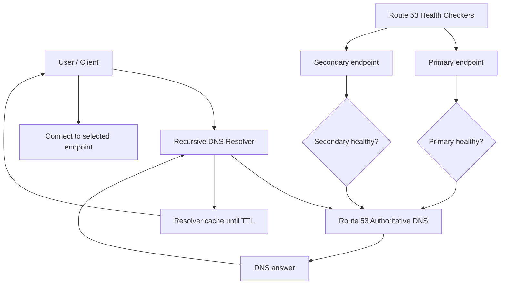
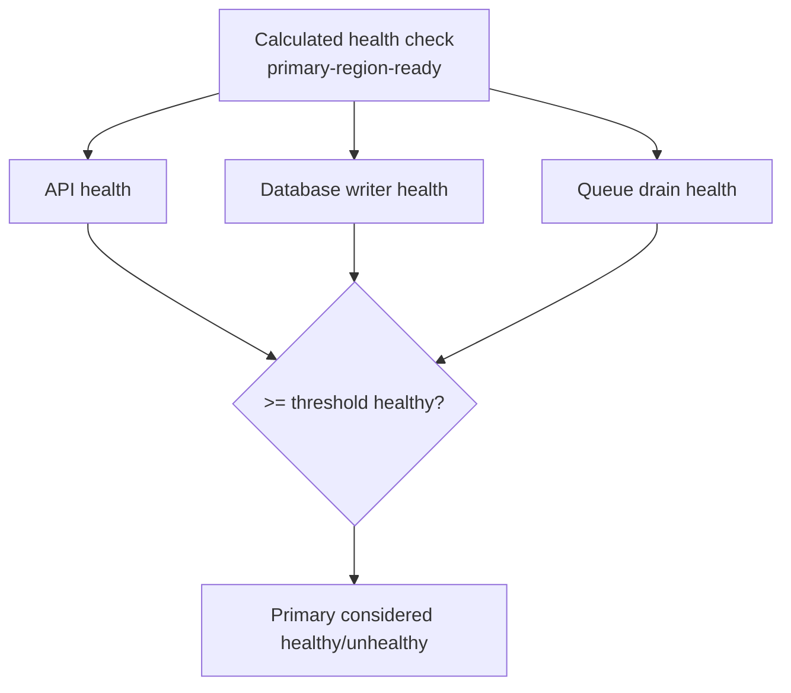
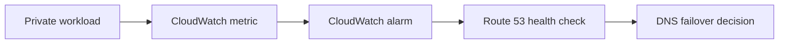
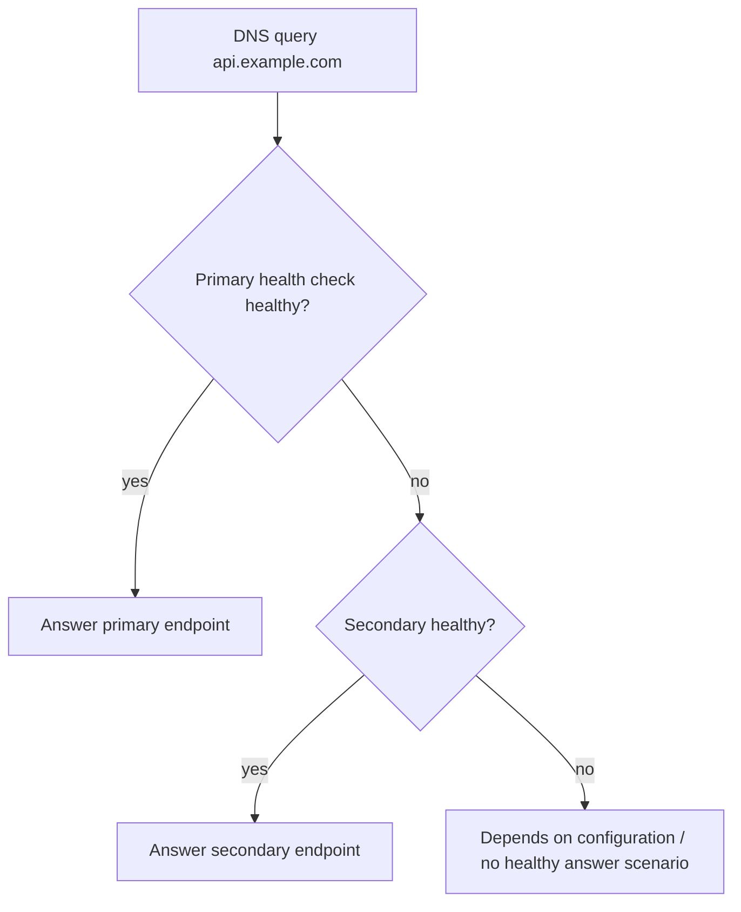
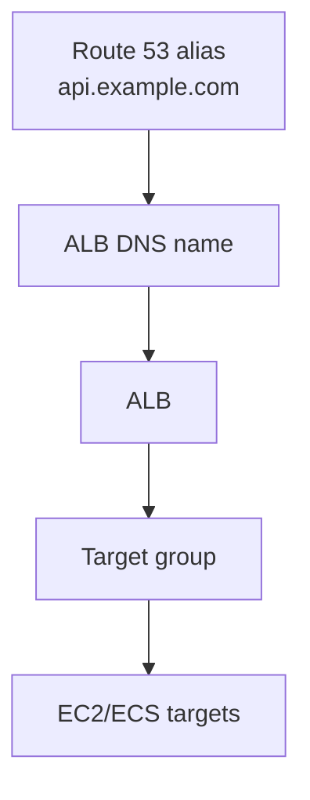
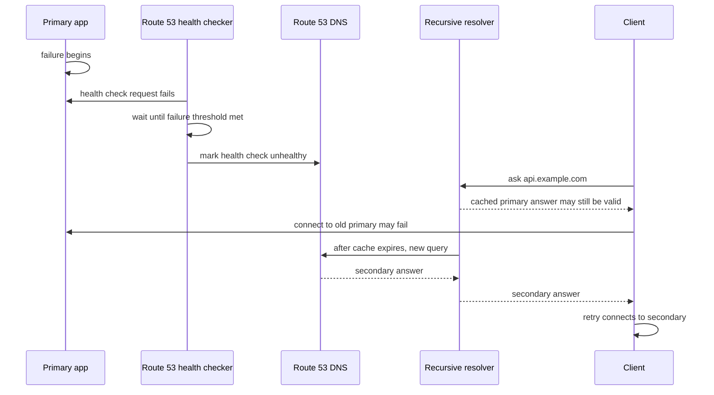
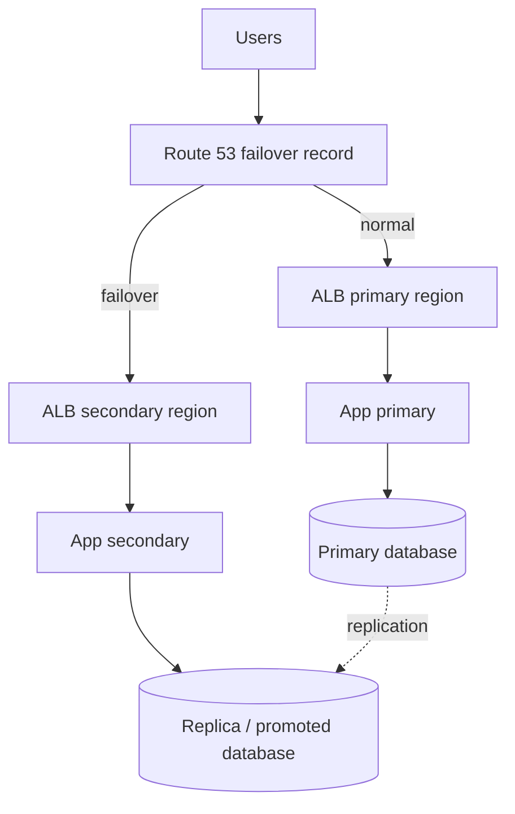
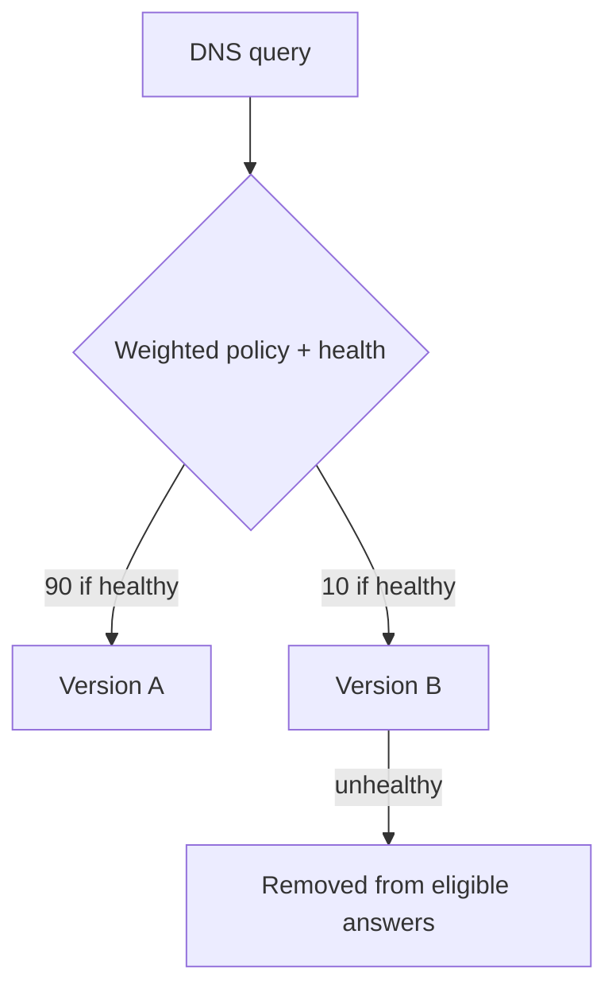
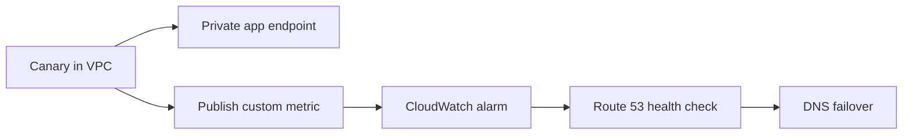

# Part 043 — Route 53 Health Checks and Failover

Route 53 health check sering disalahpahami sebagai load balancer global.

Bukan.

Route 53 health check adalah **signal**. Route 53 failover routing adalah **DNS answer selection** berdasarkan signal itu. Setelah DNS answer dikembalikan ke recursive resolver, resolver bisa cache sesuai TTL. Client lalu connect ke endpoint yang dipilih. Route 53 tidak berada di jalur data-plane HTTP/TCP setelah jawaban DNS diberikan.

Jadi mental model yang benar:

```txt
Health check says: "endpoint X appears healthy/unhealthy from the checker's point of view."
DNS failover says: "when answering future DNS queries, prefer healthy answer."
TTL says: "existing cached answer may continue to be used."
Client retry says: "real recovery depends on client/application behavior too."
```

Ini penting. Banyak desain DR gagal bukan karena Route 53 tidak bekerja, tetapi karena engineer memperlakukan DNS failover seperti switch instan.

---

## 1. Diagram Besar



Yang perlu diperhatikan:

1. Health check berjalan dari perspektif checker, bukan dari perspektif semua user.
2. DNS answer dipilih ketika query terjadi, bukan setiap HTTP request.
3. TTL, recursive resolver, OS cache, browser cache, dan application retry mempengaruhi recovery nyata.
4. Health check tidak menggantikan ALB/NLB target health check.
5. Health check tidak menggantikan synthetic monitoring end-to-end.

---

## 2. Komponen Mental Model

Route 53 failover punya beberapa objek konseptual:

| Komponen | Fungsi | Kesalahan umum |
|---|---|---|
| Health check | Menghasilkan status healthy/unhealthy | Menganggap ini traffic router |
| Record set | DNS record yang akan dijawab | Menganggap record update langsung mengubah semua client |
| Routing policy | Cara Route 53 memilih jawaban | Menganggap policy sama seperti load-balancing L7 |
| TTL | Batas cache yang disarankan ke resolver | Menganggap semua resolver patuh sempurna |
| Resolver cache | Menyimpan jawaban DNS | Lupa bahwa cache ada di luar AWS |
| Client retry | Menentukan perilaku setelah koneksi gagal | Mengabaikan timeout dan retry budget |

Route 53 failover efektif jika dipakai sebagai bagian dari desain recovery, bukan sebagai satu-satunya mekanisme recovery.

---

## 3. Jenis Health Check

Secara praktis, Route 53 health checks dapat dikelompokkan menjadi tiga tipe desain:

```txt
1. Endpoint health check
2. Calculated health check
3. CloudWatch alarm based health check
```

### 3.1 Endpoint Health Check

Endpoint health check memonitor endpoint yang bisa dicek oleh Route 53 health checkers.

Contoh:

```txt
https://api.example.com/health
TCP 203.0.113.10:443
HTTP www.example.com/status
```

Pola ini cocok untuk endpoint public atau endpoint yang sengaja dapat dijangkau oleh health checkers.

Hal yang dicek bukan sekadar "server hidup", tetapi harus mendekati definisi sehat menurut user.

Health endpoint yang buruk:

```http
GET /health
200 OK

{"status":"ok"}
```

Jika endpoint itu hanya mengembalikan 200 dari proses aplikasi, maka database mati, dependency penting gagal, cache corrupt, atau konfigurasi region salah mungkin tidak terdeteksi.

Health endpoint yang lebih baik:

```json
{
  "status": "ready",
  "checks": {
    "process": "ok",
    "database_read": "ok",
    "critical_dependency": "ok",
    "schema_version": "compatible",
    "region_role": "primary"
  }
}
```

Tapi hati-hati: health check terlalu dalam bisa menyebabkan false negative. Misalnya dependency analytics non-kritis gagal, lalu seluruh region dianggap unhealthy. Health endpoint untuk failover harus memeriksa **minimum viable service path**, bukan semua dependency.

### 3.2 Calculated Health Check

Calculated health check menggabungkan beberapa child health checks.

Gunanya untuk membuat quorum.

Contoh:

```txt
Primary region is healthy if at least 2 of 3 critical checks are healthy.
```

Diagram:



Calculated check berguna untuk menghindari keputusan failover dari satu sinyal rapuh.

Namun calculated check juga bisa berbahaya jika quorum logic tidak mencerminkan dependency real. Jangan membuat formula yang terlihat elegan tetapi tidak sesuai service semantics.

### 3.3 CloudWatch Alarm Based Health Check

Untuk resource private, internal, atau kondisi bisnis yang tidak bisa dicek langsung dari internet, Route 53 bisa memakai CloudWatch alarm sebagai sumber status.

Contoh sinyal:

```txt
ALB 5XXErrorRate > threshold
Application synthetic canary failed
Database replication lag > threshold
Queue age > threshold
Custom metric: region_readiness = 0
```

Ini sering lebih realistis untuk private workload.

Pattern:



Kelemahannya: alarm evaluation period menambah latency failover. Jika alarm butuh 3 datapoints x 60 detik, maka DNS failover tidak akan terjadi dalam 10 detik.

Jadi health check design harus eksplisit:

```txt
Detection time = metric period + evaluation periods + Route 53 decision + DNS cache + client retry
```

---

## 4. Health Check Bukan Readiness Check Internal Biasa

Di Kubernetes atau service runtime, readiness check sering menjawab pertanyaan:

```txt
Can this instance receive traffic from local load balancer?
```

Route 53 failover health check menjawab pertanyaan lebih besar:

```txt
Should this region/site still receive new DNS answers?
```

Itu level keputusan yang berbeda.

Instance-level readiness bisa berubah cepat. Region-level failover harus lebih konservatif karena konsekuensinya besar:

1. Traffic pindah lintas region.
2. Database writer mungkin berubah.
3. Cache warming berubah.
4. Compliance/data residency mungkin terpengaruh.
5. Cost bisa naik.
6. Failback bisa lebih rumit daripada failover.

Jangan memakai check yang terlalu sensitif untuk DNS failover global.

---

## 5. DNS Failover Record Pattern

Failover routing biasanya memakai dua record dengan nama dan tipe yang sama:

```txt
api.example.com A/AAAA/Alias primary
api.example.com A/AAAA/Alias secondary
```

Primary record diberi failover role `PRIMARY`.
Secondary record diberi failover role `SECONDARY`.

Route 53 menjawab primary jika primary sehat. Jika primary unhealthy, Route 53 menjawab secondary.

Diagram:



Hal yang harus diputuskan sejak desain:

| Pertanyaan | Kenapa penting |
|---|---|
| Apa definisi primary healthy? | Agar tidak failover karena noise kecil |
| Apa definisi secondary healthy? | Agar tidak failover ke site yang belum siap |
| Apa TTL record? | Menentukan cache window |
| Apakah failback otomatis? | Failback otomatis bisa menyebabkan flapping |
| Apakah data plane secondary read-only atau writable? | DNS failover tidak menyelesaikan konflik data |
| Apa yang terjadi jika keduanya unhealthy? | Fail-open/fail-closed harus eksplisit |

---

## 6. Alias Record dan Evaluate Target Health

Route 53 alias record sering dipakai untuk AWS resources seperti ALB, NLB, CloudFront, API Gateway, S3 website endpoint, dan lain-lain.

Untuk beberapa AWS target, Route 53 bisa mengevaluasi health target melalui fitur `Evaluate Target Health`.

Namun jangan mencampur mental model:

```txt
ALB target health     -> health target di balik load balancer
ALB DNS health        -> apakah ALB sebagai endpoint dianggap available
Route 53 health check -> signal DNS-level yang kamu definisikan
Evaluate target health -> Route 53 memakai health target AWS tertentu
```

Contoh pola:



Untuk aplikasi kritis, sering lebih baik punya synthetic health check yang mengecek URL aplikasi daripada hanya percaya bahwa load balancer ada.

Kenapa?

Karena load balancer bisa sehat secara infrastruktur tetapi aplikasi di belakangnya gagal secara domain.

---

## 7. Failure Detection Timeline

DNS failover tidak terjadi dalam satu langkah. Ada beberapa delay:



Recovery time nyata:

```txt
RTO_observed = detection_time + DNS_cache_time + client_retry_time + secondary_warmup_time
```

Jangan menjanjikan RTO 30 detik hanya karena TTL 30 detik.

TTL hanya salah satu variabel.

---

## 8. Health Endpoint Design

Health endpoint untuk Route 53 failover harus punya karakter berikut:

| Karakter | Penjelasan |
|---|---|
| Representative | Mewakili path penting user, bukan hanya process liveness |
| Stable | Tidak mudah gagal karena dependency non-kritis |
| Fast | Tidak membuat health checker timeout karena health check terlalu berat |
| Deterministic | Menghasilkan status konsisten saat kondisi sama |
| Dependency-aware | Mengecek dependency yang benar-benar menentukan kemampuan melayani traffic |
| Region-role-aware | Tahu apakah region ini boleh menerima traffic sebagai primary/secondary |
| Observable | Mengeluarkan metric/log saat berubah |

Contoh health endpoint untuk region aktif:

```txt
GET /health/region-ready
```

Semantik:

```txt
200 -> region boleh menerima traffic baru
503 -> region tidak boleh menerima traffic baru
```

Bukan:

```txt
200 -> JVM masih hidup
```

Untuk multi-region active-passive, health endpoint harus mengerti status role:

```json
{
  "status": "ready",
  "region": "ap-southeast-1",
  "role": "primary",
  "database": "writer-available",
  "replication": "within-threshold",
  "traffic_allowed": true
}
```

Untuk secondary passive:

```json
{
  "status": "standby",
  "region": "ap-southeast-3",
  "role": "secondary",
  "database": "replica-ready",
  "promotion_ready": true,
  "traffic_allowed": false
}
```

Pertanyaannya: apakah standby harus dianggap healthy?

Jawabannya tergantung failover model.

Jika secondary hanya bisa melayani setelah manual promotion, jangan biarkan Route 53 otomatis mengirim traffic ke sana sebelum promotion selesai.

---

## 9. Active-Passive Multi-Region Pattern

Pattern umum:

```txt
api.example.com
  PRIMARY   -> ALB primary region
  SECONDARY -> ALB secondary region
```

Diagram:



Keputusan yang harus jelas:

| Area | Pilihan desain |
|---|---|
| Database | synchronous, asynchronous, manual promote, automatic promote |
| DNS failover | automatic, manual, semi-automatic |
| Health source | endpoint, CloudWatch alarm, calculated check |
| Failback | automatic, manual after validation |
| Cache | low TTL, app retry, client reconnect strategy |
| Write safety | read-only degrade, full write, maintenance mode |

DNS hanya mengubah arah traffic baru. DNS tidak memindahkan database writer. DNS tidak menyelesaikan transaction in-flight. DNS tidak membersihkan cache client.

---

## 10. Weighted + Health Check Pattern

Weighted routing dengan health check sering dipakai untuk canary atau blue/green global.

Contoh:

```txt
api.example.com weighted 90 -> version A
api.example.com weighted 10 -> version B
```

Jika version B unhealthy, Route 53 bisa berhenti menjawab B untuk query baru.

Diagram:



Pattern ini cocok untuk:

1. Gradual regional traffic shift.
2. Blue/green cutover.
3. Canary endpoint test.
4. Controlled migration antar load balancer.

Tapi jangan lupa: weighted DNS bukan precise request-level percentage. Persentase berlaku pada DNS answer distribution, bukan HTTP request distribution. Recursive resolver caching bisa membuat distribusi traffic aktual berbeda.

---

## 11. Latency + Health Check Pattern

Latency routing memilih endpoint berdasarkan latency terbaik menurut AWS measurement dari lokasi user/resolver menuju AWS Region target.

Dengan health check, endpoint unhealthy tidak dipilih.

Pola:

```txt
api.example.com latency -> us-east-1
api.example.com latency -> eu-west-1
api.example.com latency -> ap-southeast-1
```

Jika `ap-southeast-1` unhealthy, user yang biasanya diarahkan ke region itu akan diarahkan ke eligible region lain.

Cocok untuk active-active read-heavy service.

Berbahaya untuk write-heavy service jika data consistency tidak siap.

Checklist sebelum latency-based active-active:

1. Apakah write conflict bisa terjadi?
2. Apakah user session regional atau global?
3. Apakah authentication token valid lintas region?
4. Apakah cache invalidation lintas region aman?
5. Apakah dependency downstream ada di semua region?
6. Apakah compliance membolehkan data user pindah region?

---

## 12. Geolocation/Geoproximity + Health Check Pattern

Geolocation/geoproximity bisa dipakai untuk compliance, data residency, atau user experience.

Contoh:

```txt
users from EU -> eu-west-1
users from Indonesia -> ap-southeast-3
others -> ap-southeast-1
```

Dengan health check, unhealthy region bisa dikeluarkan dari jawaban.

Namun untuk compliance, automatic fallback bisa bermasalah.

Misalnya:

```txt
EU users must not be routed outside EU.
```

Jika EU region unhealthy, failover ke non-EU region mungkin melanggar requirement.

Maka failover policy harus mempertimbangkan:

```txt
availability vs compliance vs data residency vs legal basis
```

Dalam sistem regulasi, finansial, kesehatan, dan government workload, fail-closed kadang lebih benar daripada fail-open.

---

## 13. Private Resource Health Check Problem

Route 53 endpoint health checkers tidak bisa begitu saja menjangkau private-only endpoint di subnet private.

Jangan membuka private admin endpoint ke internet hanya agar health check bisa bekerja.

Alternatif:

1. CloudWatch alarm based health check.
2. Synthetic canary yang berjalan di VPC dan publish custom metric.
3. ALB/NLB public health endpoint yang aman dan minimal.
4. Internal monitoring pipeline yang mengubah status health check secara terkontrol.
5. Manual failover record change untuk workload dengan RTO lebih longgar.

Pattern private synthetic:



Ini lebih aman daripada membuat internal service public.

---

## 14. Fail-Open vs Fail-Closed

Ketika health signal tidak tersedia, apa yang harus terjadi?

Dua filosofi:

```txt
Fail-open  -> tetap kirim traffic agar availability lebih tinggi
Fail-closed -> berhenti kirim traffic agar safety lebih tinggi
```

Contoh fail-open cocok:

1. Static marketing site.
2. Public content delivery.
3. Non-critical read-only API.

Contoh fail-closed cocok:

1. Payment authorization.
2. Regulatory enforcement action submission.
3. Medical order entry.
4. Admin mutation API.
5. Cross-border data-restricted system.

DNS failover bukan hanya masalah teknis. Ini keputusan product risk.

---

## 15. Flapping dan Hysteresis

Flapping terjadi ketika endpoint bolak-balik healthy/unhealthy.

Efek:

1. Resolver menerima jawaban berbeda dari waktu ke waktu.
2. Client tersebar ke primary/secondary secara tidak stabil.
3. Database/session/cache state bisa kacau.
4. Operator sulit memahami status nyata.

Pencegahan:

| Teknik | Efek |
|---|---|
| Failure threshold lebih konservatif | Mengurangi false failover |
| Calculated health check | Mengurangi ketergantungan pada satu sinyal |
| Manual failback | Menghindari bounce-back otomatis |
| Separate failover and failback criteria | Recovery harus lebih kuat daripada failure detection |
| Cooldown | Memberi waktu sistem stabil |
| Synthetic validation | Memastikan secondary benar-benar siap |

Rule produksi:

```txt
Automatic failover boleh cepat.
Automatic failback harus sangat hati-hati.
```

Dalam banyak sistem kritis, failback sebaiknya manual setelah post-failure validation.

---

## 16. Health Check Path Design untuk API

Contoh endpoint:

```http
GET /health/dns-failover
```

Semantik response:

```http
200 OK
Cache-Control: no-store
Content-Type: application/json

{
  "traffic_allowed": true,
  "region": "ap-southeast-1",
  "role": "primary",
  "version": "2026.07.06-1",
  "critical_dependencies": {
    "database": "ok",
    "identity_provider": "ok",
    "message_queue": "ok"
  }
}
```

Kapan return 503:

```txt
- Region sedang maintenance dan traffic baru harus dihentikan
- Database writer unavailable untuk write API
- Critical identity dependency unavailable
- Region sedang dalam split-brain risk
- Secondary belum dipromote tapi menerima failover traffic akan merusak data
```

Kapan tetap return 200:

```txt
- Metrics pipeline down tapi service masih bisa melayani user
- Non-critical analytics dependency gagal
- Background report generator down
- One replica unavailable tapi quorum cukup
```

Health endpoint harus punya definisi domain.

---

## 17. Static Website Failover Pattern

Untuk static site:

```txt
www.example.com primary   -> CloudFront distribution A / S3 origin A
www.example.com secondary -> CloudFront distribution B / S3 origin B
```

Jika primary origin/distribution gagal, Route 53 menjawab secondary.

Namun untuk CloudFront, sering lebih baik memakai CloudFront origin failover di dalam distribution jika failure-nya origin-level, bukan distribution-level.

Decision:

| Failure target | Better mechanism |
|---|---|
| S3 origin unavailable | CloudFront origin failover |
| One ALB origin unhealthy | CloudFront origin failover or ALB target health |
| Entire distribution config/domain issue | Route 53 failover |
| Entire Region app down | Route 53 failover / Global Accelerator / multi-region design |

Jangan naikkan level failover jika level bawah cukup.

---

## 18. Route 53 Failover vs Global Accelerator

Route 53 failover:

```txt
DNS-level answer selection
TTL and resolver cache involved
Good for broad endpoint/site/region failover
```

Global Accelerator:

```txt
Anycast static IPs
AWS edge network routes client traffic to healthy endpoints
Faster traffic steering semantics for supported L4 applications
```

CloudFront:

```txt
CDN and HTTP edge service
Cache, TLS, WAF, origin failover, edge logic
```

ALB/NLB:

```txt
Regional load balancing
Target health inside a Region/VPC boundary
```

Decision:

| Need | Use |
|---|---|
| Authoritative DNS policy | Route 53 |
| HTTP cache/security/edge delivery | CloudFront |
| Static IP + fast global routing for TCP/UDP | Global Accelerator |
| Regional HTTP routing | ALB |
| Regional TCP/UDP routing | NLB |
| Target-level health | ALB/NLB target group |

---

## 19. Observability

Health check observability minimal:

1. Health check status.
2. Status transition history.
3. CloudWatch metric/alarm.
4. DNS query volume.
5. Endpoint application logs for health path.
6. Synthetic canary result.
7. Resolver/client-side error rate.
8. Regional traffic distribution.

Dashboard produksi:

```txt
- Route 53 health check status per endpoint
- Primary and secondary DNS query count
- ALB request count by region
- ALB 5XX and target response time
- App business success rate
- Database writer/replica role
- Replication lag
- Client error rate
- Failover event annotation
```

Yang sering hilang: korelasi DNS decision dengan actual traffic. Kamu perlu tahu apakah traffic benar-benar pindah, bukan hanya health check berubah status.

---

## 20. Debugging Runbook

Saat failover tidak terjadi:

```txt
1. Apakah health check benar-benar unhealthy?
2. Apakah record failover terhubung ke health check yang benar?
3. Apakah record primary/secondary punya name + type yang sama?
4. Apakah secondary healthy?
5. Apakah resolver masih cache jawaban lama?
6. Apakah client memakai DNS cache internal?
7. Apakah TTL terlalu besar?
8. Apakah public resolver tertentu masih menjawab lama?
9. Apakah endpoint secondary reachable dari client?
10. Apakah aplikasi secondary siap secara data/state?
```

Command-level thinking:

```bash
# Cek authoritative answer langsung ke name server Route 53
 dig api.example.com @ns-123.awsdns-45.com

# Cek via recursive resolver publik
 dig api.example.com @8.8.8.8
 dig api.example.com @1.1.1.1

# Cek trace delegation
 dig +trace api.example.com

# Cek TTL yang sedang diberikan resolver
 dig api.example.com
```

Jika authoritative sudah menjawab secondary tetapi client masih ke primary, masalah kemungkinan ada di caching atau client behavior.

Jika authoritative masih menjawab primary, masalah ada di Route 53 health/routing config.

Jika DNS menjawab secondary tetapi request gagal, masalah bukan DNS; cek network path, TLS, app readiness, database, atau security layer.

---

## 21. Common Failure Modes

| Symptom | Kemungkinan penyebab | Cara berpikir |
|---|---|---|
| Failover lambat | TTL tinggi, resolver cache, health threshold, alarm period | Hitung end-to-end RTO, bukan hanya TTL |
| Secondary dijawab tapi app error | Secondary belum siap, DB belum promote, SG/WAF/TLS salah | DNS berhasil; data-plane gagal |
| Health check false negative | Endpoint health terlalu dalam, dependency non-kritis gagal | Health semantics salah |
| Health check false positive | Health path terlalu dangkal | Check tidak representative |
| Flapping | Threshold terlalu agresif, dependency unstable | Tambahkan hysteresis/quorum |
| Public health check gagal untuk private app | Endpoint tidak reachable dari health checker | Pakai CloudWatch metric/canary |
| Region sehat tapi failover terjadi | Checker path diblokir WAF/SG/rate limit | Exempt health path dengan hati-hati |
| Failback merusak data | Data replication/role belum aman | Manual failback + validation |

---

## 22. Production Design Checklist

Sebelum memakai Route 53 failover, jawab ini:

```txt
[ ] Apa endpoint primary?
[ ] Apa endpoint secondary?
[ ] Apa health definition primary?
[ ] Apa health definition secondary?
[ ] Apakah health check mengecek user-critical path?
[ ] Apakah health check terlalu sensitif?
[ ] Apa TTL record?
[ ] Berapa detection time health check/alarm?
[ ] Berapa client timeout + retry behavior?
[ ] Apakah secondary sudah warm?
[ ] Apakah database failover otomatis/manual?
[ ] Apakah failback otomatis atau manual?
[ ] Apakah ada compliance boundary untuk fallback region?
[ ] Apakah dashboard menunjukkan DNS health + actual traffic?
[ ] Apakah failover pernah diuji?
[ ] Apakah rollback plan jelas?
```

---

## 23. Mini Lab — Active-Passive DNS Failover

Target:

```txt
api.example.com -> primary ALB normally
api.example.com -> secondary ALB if primary unhealthy
```

Langkah konseptual:

```txt
1. Deploy app di Region A dan Region B.
2. Buat ALB di masing-masing region.
3. Buat endpoint /health/dns-failover.
4. Buat Route 53 health check untuk primary.
5. Buat Route 53 health check untuk secondary.
6. Buat failover alias record PRIMARY ke ALB A.
7. Buat failover alias record SECONDARY ke ALB B.
8. Set TTL rendah untuk record non-alias sesuai kebutuhan.
9. Simulasikan primary unhealthy.
10. Bandingkan authoritative DNS answer vs recursive resolver answer.
11. Ukur waktu sampai client berhasil connect ke secondary.
12. Pulihkan primary dan lakukan failback sesuai policy.
```

Eksperimen penting:

```txt
- Ubah TTL dari 300 ke 30 dan bandingkan observed behavior.
- Simulasikan health endpoint false negative.
- Simulasikan secondary healthy menurut DNS tetapi database belum promote.
- Coba failback otomatis dan lihat risiko flapping.
```

---

## 24. Invariant Produksi

Pegang invariant ini:

```txt
DNS failover changes future answers, not past connections.
Health check status is a signal, not a proof of user success.
TTL is a cache hint, not a global synchronization barrier.
Secondary must be ready before DNS sends traffic.
Failback is a data-safety operation, not just DNS reversal.
```

Kalau invariant ini dilanggar, desain failover akan terlihat bagus di diagram tetapi rapuh saat incident.

---

## 25. Referensi Resmi

- Amazon Route 53 Developer Guide — Health checks: `https://docs.aws.amazon.com/Route53/latest/DeveloperGuide/welcome-health-checks.html`
- Creating Amazon Route 53 health checks: `https://docs.aws.amazon.com/Route53/latest/DeveloperGuide/dns-failover.html`
- Types of Amazon Route 53 health checks: `https://docs.aws.amazon.com/Route53/latest/DeveloperGuide/health-checks-types.html`
- Configuring DNS failover: `https://docs.aws.amazon.com/Route53/latest/DeveloperGuide/dns-failover-configuring.html`
- Failover routing: `https://docs.aws.amazon.com/Route53/latest/DeveloperGuide/routing-policy-failover.html`
- Monitoring health checks using CloudWatch: `https://docs.aws.amazon.com/Route53/latest/DeveloperGuide/monitoring-health-checks.html`
