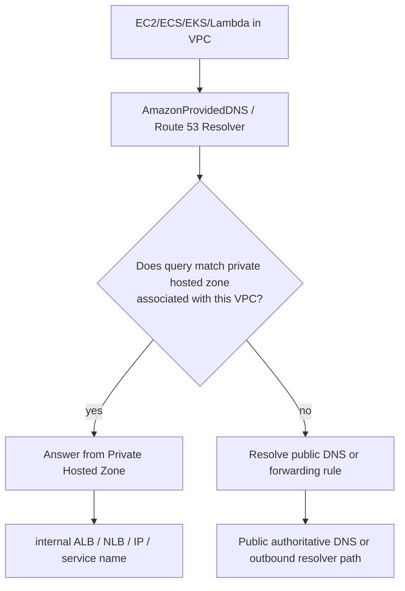
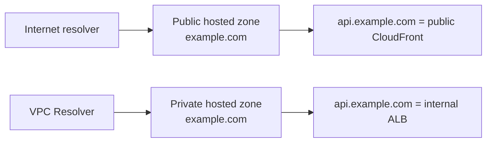
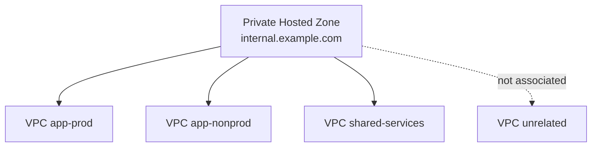
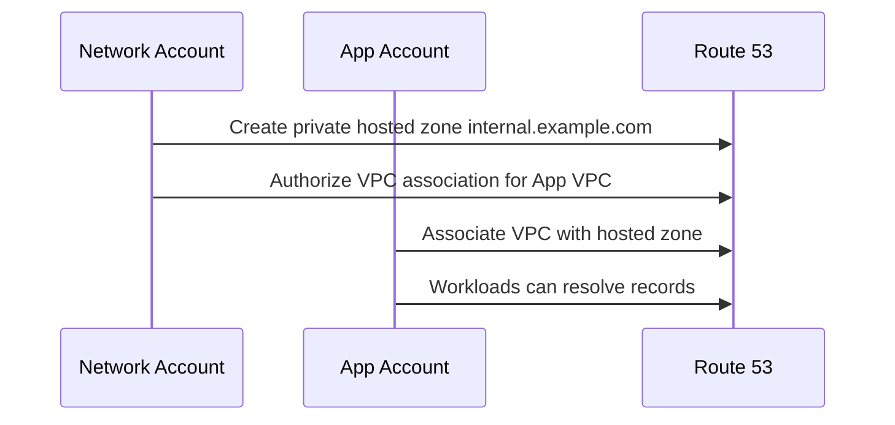
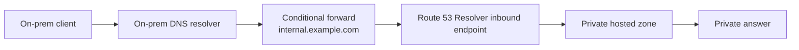
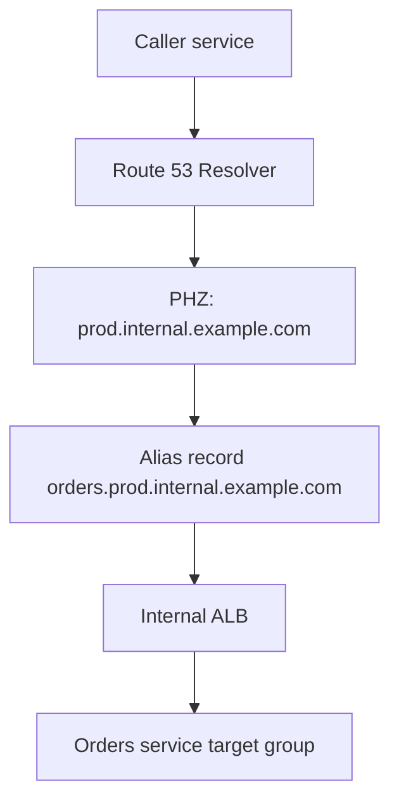
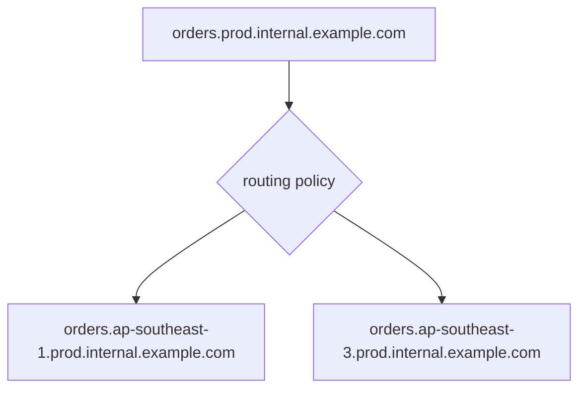

# Part 044 — Route 53 Private Hosted Zones

Private Hosted Zone adalah salah satu primitive paling penting untuk internal networking di AWS.

Tapi jangan mulai dari definisi layanan. Mulai dari masalahnya.

Dalam sistem produksi, service internal butuh nama stabil:

```txt
orders.internal.example.com
risk-engine.internal.example.com
postgres.customer-data.internal.example.com
```

IP bisa berubah. Load balancer bisa diganti. VPC bisa dipindah. Account bisa dipisah. Region bisa bertambah. Tetapi nama service harus tetap menjadi kontrak.

Private hosted zone memberi authoritative DNS internal untuk VPC yang diasosiasikan.

Mental model:

```txt
A public hosted zone answers internet-visible DNS queries.
A private hosted zone answers DNS queries only from associated VPCs.
```

Private hosted zone bukan routing engine. Private hosted zone bukan service mesh. Private hosted zone bukan IAM. Ia hanya menjawab pertanyaan nama menjadi record DNS untuk resolver di VPC tertentu.

---

## 1. Diagram Besar



Contoh query:

```txt
app subnet -> risk-engine.internal.example.com
```

Jika VPC app diasosiasikan dengan private hosted zone `internal.example.com`, Route 53 Resolver akan mencari record di zone itu.

---

## 2. Hosted Zone sebagai Authority Boundary

Public hosted zone:

```txt
example.com -> internet-facing records
www.example.com -> CloudFront
api.example.com -> public ALB / API Gateway
```

Private hosted zone:

```txt
internal.example.com -> private records
orders.internal.example.com -> internal ALB
postgres.internal.example.com -> RDS endpoint alias / CNAME
```

Split-horizon:

```txt
example.com public zone  -> public answers
example.com private zone -> private answers for associated VPCs
```

Diagram:



Split-horizon sangat kuat, tetapi juga berbahaya jika tidak didokumentasikan. Nama yang sama bisa berarti endpoint berbeda tergantung dari mana query berasal.

---

## 3. Syarat Resolusi Private Hosted Zone

Agar resource di VPC bisa resolve private hosted zone secara normal:

1. VPC harus diasosiasikan dengan private hosted zone.
2. DNS resolution VPC harus aktif.
3. DNS hostnames biasanya perlu aktif untuk banyak pola AWS DNS.
4. Workload harus memakai Route 53 Resolver/AmazonProvidedDNS atau DNS internal yang meneruskan query dengan benar.
5. Tidak ada custom DNS/firewall/forwarder yang memutus path resolusi.

Kesalahan umum:

```txt
Private hosted zone sudah dibuat, tetapi VPC belum diasosiasikan.
```

Atau:

```txt
Instance memakai custom DNS server yang tidak forward internal domain ke Route 53 Resolver.
```

Atau:

```txt
Private hosted zone ada di account network, workload ada di account app, tetapi cross-account association belum dibuat.
```

---

## 4. VPC Association Model

Private hosted zone menjadi visible untuk VPC yang diasosiasikan.



Jika `VPC app-prod` query `orders.internal.example.com`, bisa resolve.
Jika `VPC unrelated` query nama yang sama, tidak otomatis bisa resolve.

Association adalah visibility boundary.

Jangan menganggap semua VPC dalam account/organization otomatis melihat private hosted zone.

---

## 5. Cross-Account Association

Dalam organisasi serius, private hosted zone sering dimiliki account network/shared-services, sementara VPC workload berada di account aplikasi.

Pattern:

```txt
Network account owns PHZ: internal.example.com
App account owns VPC: app-prod-vpc
Network account authorizes association
App/account automation associates VPC
```

Diagram:



Boundary ownership:

| Owner | Tanggung jawab |
|---|---|
| Network/platform team | Zone naming, association policy, resolver architecture, governance |
| App team | Service records, lifecycle, health semantics, deployment updates |
| Security team | DNS logging, domain policy, exfiltration guardrail |

Di production, jangan biarkan association dibuat manual tanpa inventory. PHZ association adalah access surface.

---

## 6. Resolver Precedence dan NXDOMAIN Trap

Ini bagian yang sering menjebak.

Jika query dari VPC cocok dengan private hosted zone yang diasosiasikan, Route 53 Resolver akan memakai private hosted zone tersebut untuk nama domain itu.

Jika record tidak ada di private hosted zone, resolver bisa mengembalikan `NXDOMAIN` dan tidak otomatis mencari public record yang sama sebagai fallback.

Contoh:

```txt
Public zone example.com:
  www.example.com -> CloudFront

Private zone example.com:
  api.example.com -> internal ALB
```

Dari VPC yang diasosiasikan:

```txt
api.example.com -> internal ALB
www.example.com -> NXDOMAIN jika tidak ada di private zone
```

Ini mengejutkan banyak engineer. Mereka berharap `www.example.com` jatuh ke public zone. Tidak selalu begitu.

Solusi:

1. Jangan membuat private zone dengan nama root domain public kecuali butuh split-horizon penuh.
2. Gunakan subdomain khusus internal seperti `internal.example.com`.
3. Jika memakai split-horizon root, mirror record public yang dibutuhkan di private zone.
4. Dokumentasikan domain ownership.

Rule sederhana:

```txt
Prefer internal.example.com over private example.com unless split-horizon is intentionally required.
```

---

## 7. Naming Strategy

Nama internal adalah API. Desainnya harus stabil.

Bad naming:

```txt
ip-10-0-12-34.ap-southeast-1.compute.internal
alb-123456.ap-southeast-1.elb.amazonaws.com
orders-prod-alb-20260706.internal.example.com
```

Better naming:

```txt
orders.service.internal.example.com
orders-api.prod.internal.example.com
orders-api.ap-southeast-1.prod.internal.example.com
```

Pertimbangan:

| Dimensi | Contoh | Kapan dipakai |
|---|---|---|
| Environment | `prod.internal.example.com` | Isolasi prod/nonprod |
| Service | `orders.service.internal.example.com` | Service discovery manusia/aplikasi |
| Region | `orders.ap-southeast-1.prod.internal.example.com` | Multi-region explicit targeting |
| Role | `writer.db.internal.example.com` | Database writer/reader intent |
| Tenant | `tenant-a.internal.example.com` | Multi-tenant strict boundary, hati-hati scaling |

Jangan memasukkan detail deployment ephemeral ke nama kontrak jangka panjang.

---

## 8. Record Types dalam Private Hosted Zone

Common records:

| Record | Use case |
|---|---|
| A | IP private statis, endpoint sederhana |
| AAAA | IPv6 private/internal pattern |
| CNAME | Alias ke DNS name lain, bukan apex |
| Alias A/AAAA | Alias ke AWS resource seperti internal ALB/NLB jika supported |
| SRV | Service + port discovery untuk beberapa workload |
| TXT | Metadata ringan, verification internal, ownership marker |

Untuk internal ALB:

```txt
orders.internal.example.com -> Alias A to internal ALB DNS name
```

Untuk RDS:

```txt
orders-db.internal.example.com -> CNAME to RDS endpoint
```

Untuk blue/green internal:

```txt
orders.internal.example.com -> weighted alias to blue/green internal ALB
```

Tetap ingat: DNS record bukan deployment registry yang sempurna. Untuk high-churn service discovery, Cloud Map atau service mesh mungkin lebih cocok.

---

## 9. Private Hosted Zone vs Cloud Map

Private hosted zone cocok untuk nama stabil.

Cloud Map/service discovery cocok untuk resource dinamis yang berubah sering.

Decision:

| Need | Better fit |
|---|---|
| Stable internal service name to ALB/NLB | Private hosted zone |
| ECS services with dynamic task instances | Cloud Map / ECS service discovery |
| Human-readable platform endpoints | Private hosted zone |
| Frequent per-instance registration | Cloud Map |
| Simple database alias | Private hosted zone |
| Service mesh identity/routing | Service mesh / VPC Lattice / App Mesh-like model |

Jangan memaksa private hosted zone menjadi service registry kompleks jika workload berubah setiap menit.

---

## 10. Private Hosted Zone dan Interface Endpoint Private DNS

Interface VPC endpoint sering memakai Private DNS untuk membuat hostname AWS service resolve ke private IP endpoint ENI.

Contoh:

```txt
sqs.ap-southeast-1.amazonaws.com -> private endpoint IP inside VPC
```

Ini bukan record yang kamu tulis manual di private hosted zone biasa. AWS mengelola private DNS behavior untuk endpoint tersebut.

Namun konsepnya mirip: DNS answer berbeda tergantung VPC context.

Implication:

1. DNS adalah bagian dari network path.
2. Endpoint policy/security group saja tidak cukup jika DNS mengarah ke public path.
3. Centralized endpoint architecture membutuhkan DNS forwarding/desain khusus.

---

## 11. Hybrid Access ke Private Hosted Zone

On-prem tidak otomatis bisa resolve private hosted zone.

Untuk on-prem resolver:

```txt
on-prem DNS -> Route 53 Resolver inbound endpoint -> PHZ answer
```

Diagram:



Syarat:

1. Network path on-prem ke inbound resolver endpoint tersedia via VPN/DX/TGW.
2. Security group inbound resolver endpoint mengizinkan DNS dari on-prem resolver.
3. On-prem DNS conditional forwarder diarahkan ke IP inbound endpoint.
4. Private hosted zone diasosiasikan ke VPC tempat resolver endpoint berada atau resolusi PHZ tersedia sesuai desain.
5. Tidak ada loop forwarding.

Hybrid DNS akan dibahas lebih jauh di Part 045, tetapi PHZ harus dipahami sebagai source of authority untuk nama private.

---

## 12. Split-Horizon Design

Split-horizon berarti nama domain sama punya jawaban berbeda tergantung lokasi query.

Contoh:

```txt
api.example.com from internet -> CloudFront public API
api.example.com from VPC      -> internal ALB private API
```

Kapan bagus:

1. Internal user harus memakai private path.
2. Nama external dan internal ingin konsisten.
3. Migration dari public ke private path bertahap.
4. Hybrid workforce memakai nama yang sama.

Kapan buruk:

1. Debugging team tidak sadar jawaban berbeda.
2. Public record tidak dimirror sehingga NXDOMAIN muncul dari VPC.
3. TLS certificate/SAN tidak cocok dengan endpoint internal.
4. Internal endpoint punya behavior berbeda dari public endpoint.
5. Security policy mengandalkan "nama sama berarti sistem sama".

Split-horizon harus sengaja, bukan efek samping.

Checklist split-horizon:

```txt
[ ] Domain yang sama memang dibutuhkan internal dan external?
[ ] Record public penting sudah dimirror di PHZ jika perlu?
[ ] TLS certificate valid untuk kedua path?
[ ] Observability bisa membedakan internal vs external traffic?
[ ] Dokumentasi resolver behavior tersedia?
[ ] Incident runbook mencantumkan cara cek authoritative public vs private answer?
```

---

## 13. Internal ALB Pattern

Pola umum:

```txt
orders.prod.internal.example.com -> internal ALB
```

Diagram:



Benefit:

1. Caller tidak tahu DNS name ALB yang generated.
2. ALB bisa diganti tanpa mengubah client config.
3. Blue/green bisa dilakukan dengan weighted records.
4. Platform bisa menerapkan naming convention.

Anti-pattern:

```txt
Caller menyimpan internal ALB DNS name langsung di config.
```

Itu membuat replacement sulit dan mengikat aplikasi ke infrastructure detail.

---

## 14. Database Alias Pattern

Database endpoint sering panjang dan environment-specific.

Buat alias internal:

```txt
orders-writer.db.prod.internal.example.com -> RDS writer endpoint
orders-reader.db.prod.internal.example.com -> RDS reader endpoint
```

Keuntungan:

1. Application config lebih stabil.
2. Migration database lebih mudah.
3. Role writer/reader eksplisit.
4. Cutover bisa dikontrol via DNS.

Namun hati-hati dengan TTL dan connection pooling.

Database clients sering memegang connection lama. DNS update tidak memutus connection existing.

Cutover database butuh:

```txt
DNS change + connection drain + app restart/reconnect strategy + data validation
```

---

## 15. Multi-Region Private Naming

Desain nama multi-region harus jelas apakah caller ingin endpoint regional atau global.

Regional explicit:

```txt
orders.ap-southeast-1.prod.internal.example.com
orders.ap-southeast-3.prod.internal.example.com
```

Global logical:

```txt
orders.prod.internal.example.com
```

Pola:



Untuk internal systems, sering lebih aman membuat nama regional eksplisit terlebih dahulu. Nama global bisa menjadi facade, tetapi failover semantics harus jelas.

Jangan membuat nama global jika data consistency belum siap.

---

## 16. PHZ Governance

Private DNS bisa menjadi kekacauan jika setiap team membuat record bebas.

Gunakan prinsip:

```txt
DNS names are production contracts.
```

Governance minimal:

1. Zone ownership jelas.
2. Naming convention wajib.
3. Record owner/tag tersedia.
4. TTL policy per record type.
5. Change review untuk prod zone.
6. Cross-account association approval.
7. Query logging untuk domain sensitif.
8. IaC sebagai source of truth.
9. Cleanup lifecycle untuk record orphan.
10. Incident runbook untuk DNS rollback.

Contoh record metadata via IaC tag/comment system:

```yaml
record: orders.prod.internal.example.com
owner: team-orders
service: orders-api
environment: prod
target: internal-alb
rto_class: tier-1
change_policy: reviewed
```

---

## 17. IaC Structure

Struktur sederhana:

```txt
network-dns/
  zones/
    prod.internal.example.com/
      zone.tf
      associations.tf
      records-platform.tf
      records-orders.tf
      records-risk.tf
```

Atau delegation by module:

```txt
modules/private-service-record
  inputs:
    zone_id
    service_name
    environment
    target_dns_name
    target_zone_id
    ttl
```

Invariant IaC:

```txt
Manual DNS changes are emergency-only.
Emergency changes must be backported to IaC.
```

DNS drift menyebabkan incident yang sulit ditemukan karena resolver tetap menjawab sesuatu yang tampak valid.

---

## 18. Security Model

Private hosted zone tidak sama dengan access control.

Jika workload bisa resolve nama private, belum tentu boleh connect. Akses tetap dikendalikan oleh:

1. Route table.
2. Security Group.
3. NACL.
4. Endpoint policy.
5. IAM/resource policy.
6. TLS/mTLS.
7. App authorization.
8. Network Firewall/DNS Firewall jika ada.

DNS hanya memberi alamat.

Pattern aman:

```txt
DNS visibility + network reachability + identity authorization
```

Jangan menganggap "nama private" berarti aman.

Jika attacker di VPC bisa resolve internal admin endpoint dan SG terbuka, PHZ ikut memudahkan discovery.

---

## 19. Observability

Observability private DNS meliputi:

1. Route 53 Resolver query logging.
2. PHZ record inventory.
3. VPC association inventory.
4. DNS error rate dari aplikasi.
5. Resolver endpoint metrics untuk hybrid DNS.
6. Change audit via CloudTrail.
7. Synthetic DNS checks dari VPC penting.

Sinyal yang berguna:

```txt
- Which VPCs query admin.internal.example.com?
- Which records are queried but missing?
- Are clients still querying deprecated names?
- Did DNS query volume shift after deployment?
- Are on-prem queries reaching inbound resolver?
```

DNS query logs bisa menjadi alat security dan migration.

---

## 20. Debugging Runbook

Saat private DNS tidak resolve:

```txt
1. Dari resource di VPC, cek resolver yang dipakai.
2. Cek VPC associated dengan PHZ.
3. Cek nama zone paling spesifik yang cocok.
4. Cek record benar-benar ada di PHZ.
5. Cek DNS support/hostnames VPC.
6. Cek custom DNS forwarder.
7. Cek apakah query masuk ke public DNS, bukan Route 53 Resolver.
8. Cek cross-account association.
9. Cek split-horizon NXDOMAIN trap.
10. Cek Resolver query logs.
```

Command examples:

```bash
# Resolver default VPC biasanya base VPC CIDR + 2 atau 169.254.169.253
 dig orders.prod.internal.example.com

# Cek jawaban dan TTL
 dig orders.prod.internal.example.com +noall +answer

# Cek SOA untuk melihat authority yang menjawab
 dig internal.example.com SOA

# Cek dari environment berbeda
 dig orders.prod.internal.example.com @<on-prem-dns>
 dig orders.prod.internal.example.com @<vpc-resolver-endpoint-ip>
```

Interpretasi:

| Result | Meaning |
|---|---|
| `NOERROR` + answer benar | DNS path OK, cek network/app jika koneksi gagal |
| `NXDOMAIN` | Zone match tapi record tidak ada, atau tidak ada authority yang tahu nama itu |
| Timeout | Resolver/network/security path gagal |
| Public answer muncul dari VPC | PHZ tidak associated atau query keluar ke public resolver |
| Jawaban beda antar VPC | Association/split-horizon berbeda |

---

## 21. Common Failure Modes

| Symptom | Penyebab umum | Fix |
|---|---|---|
| Record ada tapi tidak resolve dari app VPC | VPC belum associated | Associate VPC ke PHZ |
| Public website tidak resolve dari VPC | Private zone root menutupi public zone | Mirror record atau ubah naming ke `internal.example.com` |
| On-prem tidak bisa resolve PHZ | Tidak ada Resolver inbound endpoint/conditional forwarder | Desain hybrid DNS path |
| Jawaban lama masih muncul | TTL/cache | Tunggu TTL, restart resolver/client jika perlu |
| App connect ke endpoint salah | Split-horizon tidak dipahami | Cek jawaban dari lokasi query |
| Prod dan nonprod saling resolve | Zone association terlalu luas | Pisahkan zone/env atau batasi association |
| Record orphan masih dipakai | Tidak ada lifecycle inventory | Query logs + IaC cleanup |
| Private DNS endpoint tidak bekerja | Custom DNS tidak forward ke Resolver | Perbaiki forwarding conditional |

---

## 22. Anti-Patterns

Anti-pattern 1: satu private zone besar untuk semua environment.

```txt
internal.example.com associated with prod, staging, dev, sandbox
```

Risiko: nama bocor lintas environment, kesalahan target, debugging sulit.

Better:

```txt
prod.internal.example.com
nonprod.internal.example.com
sandbox.internal.example.com
```

Anti-pattern 2: memakai root public domain untuk private zone tanpa mirror records.

```txt
Private zone: example.com
Only record: api.example.com
```

Lalu `www.example.com` dari VPC gagal.

Anti-pattern 3: DNS sebagai security boundary.

```txt
"User tidak tahu nama internal, jadi aman."
```

Salah. Security harus ada di network/identity/app layer.

Anti-pattern 4: manual console change untuk prod DNS.

DNS adalah control-plane kritis. Treat it like code.

Anti-pattern 5: memasukkan IP ephemeral instance langsung.

Gunakan ALB/NLB/service discovery jika lifecycle dinamis.

---

## 23. Mini Lab — Private Service Name untuk Internal ALB

Target:

```txt
orders.prod.internal.example.com -> internal ALB
```

Langkah konseptual:

```txt
1. Buat VPC prod dengan DNS support aktif.
2. Deploy internal ALB di private subnets.
3. Buat private hosted zone prod.internal.example.com.
4. Associate PHZ dengan VPC prod.
5. Buat alias record orders.prod.internal.example.com ke internal ALB.
6. Dari EC2/ECS task di VPC, jalankan dig/curl.
7. Cek Flow Logs/ALB logs untuk memastikan path internal.
8. Tambahkan VPC lain tanpa association dan buktikan nama tidak resolve.
9. Associate VPC kedua dan ulangi test.
10. Simulasikan rename target ALB tanpa mengubah client config.
```

Eksperimen tambahan:

```txt
- Buat private zone example.com dan lihat efek split-horizon.
- Hapus record www.example.com dari private zone lalu query dari VPC.
- Buat on-prem conditional forwarder via Resolver inbound endpoint.
- Aktifkan Resolver query logging dan lihat query aktual.
```

---

## 24. Production Checklist

```txt
[ ] Zone naming convention jelas?
[ ] Environment boundary jelas?
[ ] VPC association terinventarisasi?
[ ] Cross-account association otomatis dan audited?
[ ] Split-horizon disengaja, bukan kecelakaan?
[ ] Record public penting tidak tertutup oleh PHZ root?
[ ] TTL sesuai lifecycle dan RTO?
[ ] Internal ALB/NLB memakai alias record?
[ ] Database alias punya cutover plan?
[ ] Hybrid DNS path terdokumentasi?
[ ] Resolver query logging aktif untuk domain kritis?
[ ] DNS changes lewat IaC?
[ ] Record punya owner?
[ ] Cleanup record orphan rutin?
[ ] Runbook membedakan DNS failure dan network failure?
```

---

## 25. Invariant Produksi

Pegang invariant ini:

```txt
Private hosted zone controls name visibility, not network permission.
VPC association is the DNS visibility boundary.
Split-horizon changes meaning based on query origin.
NXDOMAIN in private DNS can shadow public DNS expectations.
DNS names are service contracts; treat them like API design.
```

Jika private DNS didesain asal-asalan, semua layer di atasnya terlihat flakey: service discovery, TLS, endpoint policy, hybrid routing, incident debugging, dan deployment rollback.

---

## 26. Referensi Resmi

- Working with private hosted zones: `https://docs.aws.amazon.com/Route53/latest/DeveloperGuide/hosted-zones-private.html`
- Creating a private hosted zone: `https://docs.aws.amazon.com/Route53/latest/DeveloperGuide/hosted-zone-private-creating.html`
- Considerations when working with a private hosted zone: `https://docs.aws.amazon.com/Route53/latest/DeveloperGuide/hosted-zone-private-considerations.html`
- Route 53 Resolver: `https://docs.aws.amazon.com/Route53/latest/DeveloperGuide/resolver.html`
- DNS security and split-horizon use cases for Route 53 Resolver: `https://docs.aws.amazon.com/Route53/latest/DeveloperGuide/gr-cloud-resolver-use-cases.html`
