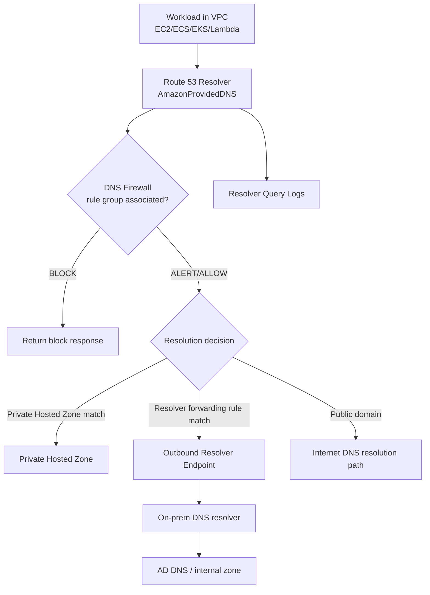
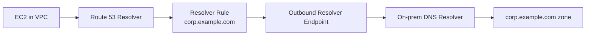
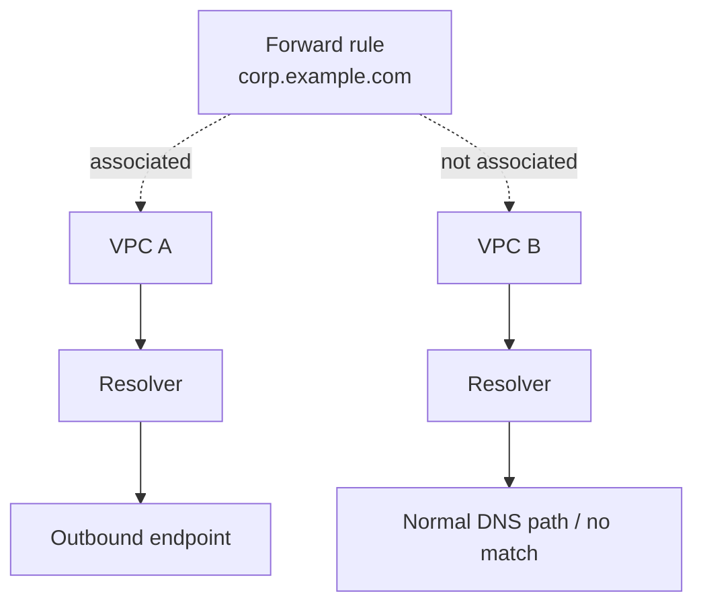
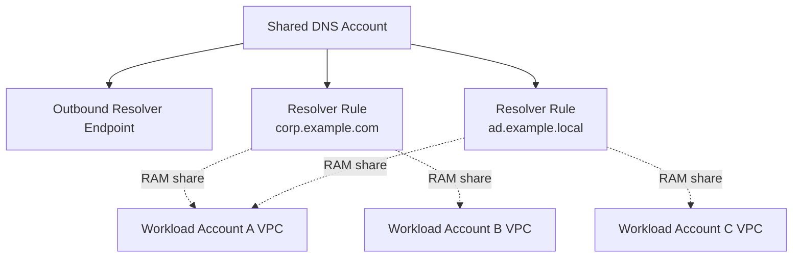
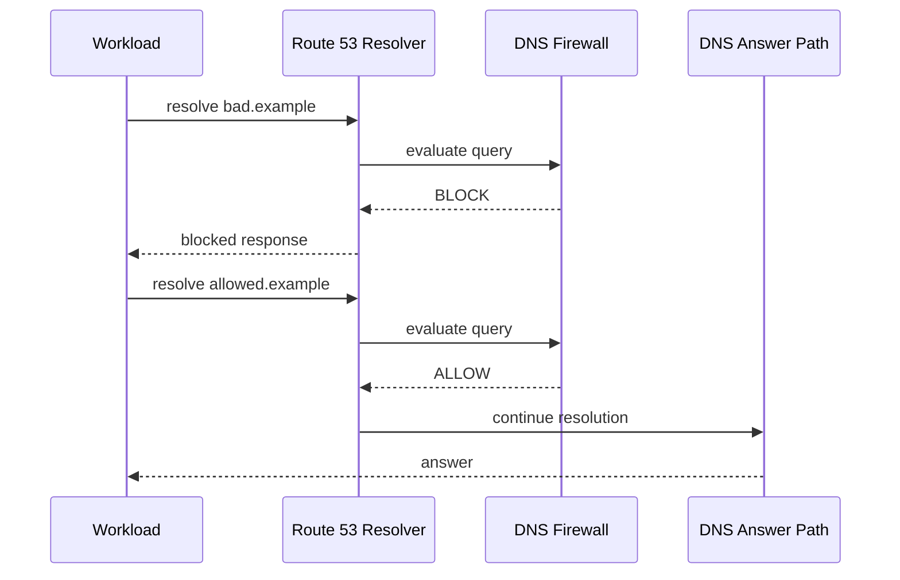
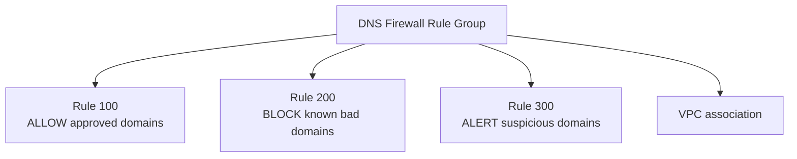
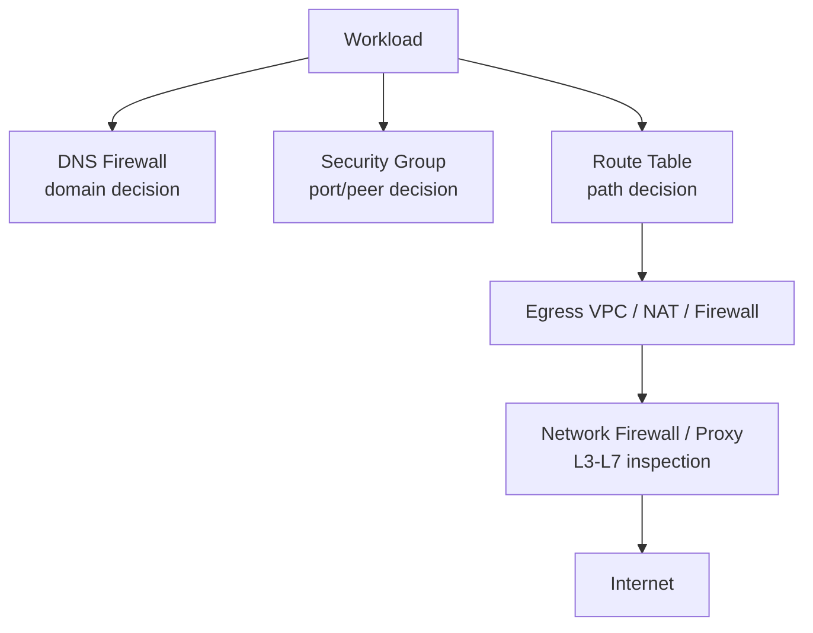
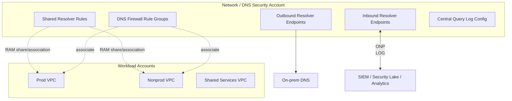

# Part 045 — Route 53 Resolver and DNS Firewall

Kita sudah membahas DNS dari first principles, public hosted zone, routing policy, health check, dan private hosted zone. Sekarang kita masuk ke bagian yang sering menentukan apakah DNS internal enterprise berjalan rapi atau menjadi sumber incident lintas account: **Route 53 Resolver dan DNS Firewall**.

Di AWS, DNS bukan hanya fitur tambahan. DNS adalah control surface untuk connectivity.

Banyak engineer mengira problem DNS hanya seputar record `A`, `CNAME`, atau `Alias`. Di sistem AWS produksi, problem DNS biasanya lebih dalam:

```txt
Who is allowed to resolve this name?
Where should this query be forwarded?
Which VPC owns the DNS authority?
Which account controls resolver rules?
Can workload exfiltrate data through DNS?
Can malware query command-and-control domains?
Why does one VPC get private answer while another gets public answer?
Why does on-prem resolve correctly but ECS task does not?
Why does query logging not show every repeated query?
```

Route 53 Resolver adalah komponen yang menjawab pertanyaan DNS untuk workload di VPC. DNS Firewall adalah policy layer untuk memfilter outbound DNS query dari VPC melalui Resolver.

Mental model paling penting:

```txt
Private Hosted Zone answers names.
Resolver decides how names are resolved.
Resolver rules decide where matching names are forwarded.
DNS Firewall decides whether outbound DNS queries are allowed, blocked, or alerted.
Query logging lets you see DNS behavior, but cache means you will not always see every lookup.
```

---

## 1. Diagram Besar



Alur query internal:

```txt
app.ec2 -> payments.corp.example.com
```

Kemungkinan jawabannya:

1. dijawab dari private hosted zone AWS,
2. diteruskan ke on-prem DNS melalui outbound endpoint,
3. dijawab dari public DNS,
4. diblok DNS Firewall,
5. gagal karena resolver rule/association salah,
6. gagal karena network path ke DNS target rusak,
7. terlihat tidak muncul di query logs karena cache.

---

## 2. Route 53 Resolver sebagai DNS Runtime di VPC

Di setiap VPC, workload biasanya memakai DNS server yang dikenal sebagai AmazonProvidedDNS. Dalam praktik, ini mengarah ke Route 53 Resolver di VPC.

Bentuk alamatnya sering terlihat seperti:

```txt
VPC CIDR base + 2
169.254.169.253
fd00:ec2::253 untuk IPv6 context tertentu
```

Tetapi jangan menghafal alamat sebagai inti. Yang penting adalah perannya:

```txt
Route 53 Resolver is the DNS runtime for VPC workloads.
```

Resolver dapat menjawab:

- public DNS names,
- AWS service DNS names,
- EC2 internal DNS names,
- private hosted zone records,
- VPC endpoint private DNS names,
- forwarded domains via resolver rules,
- conditional DNS names dari on-premises/private network.

Resolver juga menjadi enforcement point untuk DNS Firewall.

---

## 3. Resolver Tidak Sama dengan Hosted Zone

Ini kesalahan desain yang umum.

Private hosted zone adalah authority data:

```txt
internal.example.com -> record set
```

Resolver adalah execution path:

```txt
workload asks a DNS question -> resolver decides how to answer
```

Hosted zone menjawab **apa isi DNS**. Resolver menentukan **ke mana query berjalan**.

Analogi:

```txt
Hosted zone = database of DNS records.
Resolver = query engine + routing layer for DNS queries.
DNS Firewall = policy gate before/around DNS resolution.
```

---

## 4. Resolver Endpoint

Resolver endpoint digunakan untuk hybrid DNS atau centralized DNS antar network.

Ada dua jenis besar:

```txt
Inbound Resolver Endpoint
Outbound Resolver Endpoint
```

### 4.1 Inbound Resolver Endpoint

Inbound endpoint memungkinkan DNS resolver di luar VPC, misalnya on-premises DNS, mengirim query ke Route 53 Resolver di VPC.

Contoh:

```txt
on-prem app -> orders.internal.aws.example.com
on-prem DNS -> inbound resolver endpoint in AWS VPC
Route 53 Resolver -> private hosted zone answer
```

Diagram:


Inbound endpoint biasanya dipakai ketika on-prem perlu resolve private hosted zone AWS.

### 4.2 Outbound Resolver Endpoint

Outbound endpoint memungkinkan Route 53 Resolver di VPC meneruskan query domain tertentu ke DNS resolver lain, misalnya on-prem AD DNS.

Contoh:

```txt
EC2 -> db.corp.example.com
Route 53 Resolver -> outbound endpoint -> on-prem DNS
```

Diagram:



Outbound endpoint biasanya dipakai ketika workload AWS perlu resolve private DNS on-prem.

---

## 5. Resolver Rule

Resolver rule adalah conditional forwarding rule.

Rule menjawab pertanyaan:

```txt
For queries matching this domain suffix, where should Resolver send them?
```

Contoh:

```txt
corp.example.com -> forward to 10.10.10.10, 10.10.10.11
ad.example.local -> forward to 10.20.0.10
```

Resolver rule bisa diasosiasikan ke satu atau lebih VPC. Inilah sumber banyak incident: rule ada, endpoint ada, tetapi VPC workload tidak diasosiasikan dengan rule.

Model:



Hasil:

```txt
VPC A resolves corp.example.com correctly.
VPC B fails or resolves differently.
```

Ini bukan bug DNS. Ini association boundary.

---

## 6. Rule Ownership dan Sharing

Dalam multi-account AWS, biasanya ada beberapa pola:

### Pattern A — Resolver Rules per workload account

Setiap account membuat outbound endpoint dan rule sendiri.

Kelebihan:

- ownership jelas,
- blast radius kecil,
- team bebas mengubah sesuai kebutuhan.

Kekurangan:

- duplikasi endpoint,
- biaya lebih tinggi,
- inconsistent forwarding,
- sulit audit.

### Pattern B — Centralized DNS account

Network/shared-services account memiliki outbound endpoint dan resolver rule. Rule dibagikan ke workload accounts melalui AWS RAM.

Kelebihan:

- governance kuat,
- forwarding domain konsisten,
- observability terpusat,
- cocok untuk enterprise hybrid.

Kekurangan:

- perubahan menjadi platform workflow,
- butuh lifecycle management,
- salah rule bisa berdampak luas.

Diagram:



Production rule:

```txt
Treat resolver rule changes like routing changes.
They can redirect service discovery for entire environments.
```

---

## 7. Resolver Precedence: Yang Sering Membingungkan

DNS resolution di AWS tidak hanya “match domain lalu forward”. Ada precedence.

Secara mental, urutannya perlu dipahami sebagai beberapa authority yang bisa saling menutupi:

1. VPC-specific DNS behavior,
2. private hosted zone associations,
3. resolver rules,
4. VPC endpoint private DNS behavior,
5. public DNS resolution,
6. caching behavior.

Detail precedence harus selalu diverifikasi dengan dokumentasi untuk kasus spesifik, tetapi invariant desainnya sederhana:

```txt
Do not create overlapping DNS authorities unless you intentionally model precedence.
```

Contoh buruk:

```txt
Private hosted zone: example.com
Resolver forwarding rule: example.com -> on-prem DNS
Public hosted zone: example.com
VPC endpoint private DNS: service.amazonaws.com
```

Jika semua dibuat tanpa dokumen authority, hasilnya sulit diprediksi oleh engineer aplikasi.

Lebih baik:

```txt
example.com             -> public internet zone
aws.internal.example.com -> AWS private hosted zone
corp.example.com         -> forwarded to on-prem DNS
svc.example.com          -> service discovery zone with explicit ownership
```

---

## 8. DNS Firewall: Masalah yang Diselesaikan

DNS Firewall bukan firewall packet umum. Ia memfilter query DNS yang keluar dari VPC melalui Route 53 Resolver.

Masalah yang ingin dicegah:

```txt
Malware queries command-and-control domain.
Workload resolves known malicious domain.
Data exfiltration uses DNS tunneling.
Compromised container queries random DGA domains.
Application accidentally calls forbidden external domain.
Developer points app to shadow SaaS endpoint.
```

DNS Firewall bekerja pada nama domain, bukan IP traffic final.

Diagram:



DNS Firewall tidak menggantikan:

- Security Group,
- NACL,
- Network Firewall,
- AWS WAF,
- IAM,
- endpoint policy,
- egress proxy,
- application allowlist.

Ia adalah lapisan kontrol untuk nama DNS.

---

## 9. DNS Firewall Components

Komponen utama:

```txt
Domain List
Rule
Rule Group
VPC Association
Firewall behavior
Logging/metrics
```

### 9.1 Domain List

Domain list berisi domain yang ingin di-match.

Contoh:

```txt
bad.example
*.malware.example
exfil.example
```

Gunakan domain list untuk:

- blocklist threat intelligence,
- allowlist domain approved,
- denylist domain tidak boleh diakses,
- internal policy domain.

### 9.2 Rule

Rule menentukan action terhadap domain list atau advanced rule.

Contoh action mental:

```txt
ALLOW
BLOCK
ALERT
```

`ALERT` berguna untuk fase observasi. Jangan langsung block domain luas tanpa baseline.

### 9.3 Rule Group

Rule group adalah kumpulan rule. Rule group diasosiasikan ke VPC.

Diagram:



### 9.4 Priority

Rule dievaluasi berdasarkan priority. Karena itu rule group harus dirancang seperti firewall policy, bukan daftar acak.

Contoh struktur:

```txt
100  allow explicitly required AWS/internal domains
200  block known malware domains
300  block DGA/tunneling advanced patterns
400  alert suspicious public domains
900  default behavior
```

---

## 10. Allowlist vs Blocklist

Ada dua strategi ekstrem:

```txt
Blocklist model: allow most, block known bad.
Allowlist model: block most, allow known good.
```

### Blocklist model

Cocok untuk banyak workload umum.

Kelebihan:

- friction rendah,
- tidak mudah memutus dependency aplikasi,
- baik sebagai baseline threat control.

Kekurangan:

- unknown bad domain tetap bisa lolos,
- domain baru butuh update threat intel,
- tidak cukup untuk high-control environment.

### Allowlist model

Cocok untuk regulated workload, isolated subnet, build environment, payment/security workload.

Kelebihan:

- egress DNS sangat terkontrol,
- mengurangi shadow dependency,
- kuat untuk compliance.

Kekurangan:

- operasional lebih berat,
- dependency discovery wajib matang,
- update library bisa gagal karena domain baru.

Production recommendation:

```txt
Start with ALERT + query logging.
Build domain inventory.
Move critical subnet/VPC to targeted allowlist.
Keep broader blocklist for general workloads.
```

---

## 11. DNS Firewall Bukan Egress Firewall Sempurna

DNS Firewall memblok nama. Ia tidak menjamin traffic ke IP tertentu tidak terjadi.

Contoh bypass:

```txt
Application calls hardcoded IP address.
Application uses custom DNS resolver outside Route 53 Resolver.
Container uses DNS-over-HTTPS to external endpoint.
Malware brings its own resolver path.
```

Karena itu DNS Firewall harus digabung dengan:

- Route table egress control,
- NAT Gateway/egress VPC,
- Network Firewall atau proxy,
- Security Group outbound restriction,
- VPC endpoint strategy,
- AWS WAF untuk inbound web,
- logging dan anomaly detection.

Layering:



Invariant:

```txt
DNS Firewall controls resolution intent, not all possible network intent.
```

---

## 12. Resolver Query Logging

Query logging adalah alat observability DNS. Ia menjawab:

```txt
Who queried what name?
From which VPC?
From which resolver endpoint?
What was the response code?
Was it blocked/alerted?
Which rule/domain list matched?
```

Destination umum:

- CloudWatch Logs,
- S3,
- Kinesis Data Firehose.

Gunakan CloudWatch untuk debugging cepat, S3 untuk retention/analytics, Firehose untuk pipeline security.

Important nuance:

```txt
DNS resolver cache affects query logs.
Repeated queries answered from cache might not appear as repeated log events.
```

Jangan menyimpulkan “aplikasi tidak melakukan lookup” hanya karena tidak ada log untuk setiap request. Bisa saja resolver menjawab dari cache.

---

## 13. Query Log Field yang Berguna

Saat membangun runbook, cari field semacam:

```txt
timestamp
vpcId
queryName
queryType
rcode
answer
resolverEndpointId
srcAddr
srcPort
transport
firewallRuleAction
firewallRuleGroupId
firewallDomainListId
```

Tidak semua field relevan untuk semua format/fitur, tetapi mental model debuggingnya:

```txt
name + source + response + policy decision + time
```

Contoh pertanyaan investigasi:

```txt
Which workloads query random-looking domains?
Which VPCs query public DNS names that should be private?
Which query names are blocked most often?
Which domain list is causing false positives?
Which workloads still depend on legacy on-prem DNS zone?
```

---

## 14. DNS Exfiltration Mental Model

DNS tunneling menyalahgunakan query name sebagai channel data.

Contoh bentuk suspicious:

```txt
aGVsbG8td29ybGQ.user123.exfil.example.com
x9skd82ksla02kalsd9s0.example.net
<very-long-random-label>.<attacker-domain>
```

Masalahnya: banyak network mengizinkan DNS outbound karena dianggap harmless. Padahal DNS bisa membawa data dalam label query.

DNS Firewall advanced protection dapat membantu mendeteksi/memblok pola seperti DNS tunneling atau DGA. Namun jangan mengandalkan satu layer.

Defense model:

```txt
DNS Firewall blocks suspicious query pattern.
Query logs reveal behavior.
Network Firewall/proxy restricts direct external DNS/DoH.
IAM/endpoint policy reduces need for public egress.
Alerting catches abnormal query entropy/volume.
```

---

## 15. Reference Architecture: Central DNS Security Account

Untuk organisasi besar, pola yang sehat:



Ownership:

| Area | Owner | Notes |
|---|---|---|
| Resolver endpoint | Network platform | Treat as core infrastructure. |
| Forwarding rules | DNS/network platform | Requires change control. |
| Private hosted zone service records | Service/platform team | Depends on naming contract. |
| DNS Firewall baseline | Security platform | Standard control across VPCs. |
| DNS exceptions | App + security review | Must expire or be justified. |
| Query logs | Security/observability | Retention and analytics policy. |

---

## 16. Domain Naming Strategy

Jangan campur semua private DNS dalam satu domain besar tanpa ownership boundary.

Bad:

```txt
internal.example.com used by every team, every account, every region, every environment
```

Lebih baik:

```txt
prod.aws.example.com
nonprod.aws.example.com
shared.aws.example.com
corp.example.com       -> on-prem/enterprise DNS
svc.example.com        -> service discovery contract
```

Atau per Region:

```txt
us-east-1.prod.aws.example.com
ap-southeast-1.prod.aws.example.com
```

Aturan:

```txt
DNS namespace should reveal authority, not implementation detail.
```

Nama yang bagus memberi tahu siapa pemilik authority dan environment. Nama yang buruk memaksa engineer membuka 6 console untuk tahu asal jawabannya.

---

## 17. DNS Firewall Policy Design

Contoh baseline policy:

```txt
Rule Group: org-baseline-dns-security

Priority 100:
  ALLOW required internal domains
  *.amazonaws.com if needed by workload model
  approved SaaS domains

Priority 200:
  BLOCK known malware domains
  threat-intel-managed-domain-list

Priority 300:
  BLOCK DNS tunneling/DGA advanced rules

Priority 400:
  ALERT newly observed suspicious domains

Default:
  allow, or block depending VPC class
```

VPC class:

| VPC Class | Policy Model | Example |
|---|---|---|
| General app VPC | Blocklist + alert | Normal web apps. |
| Regulated prod VPC | Tight allowlist + blocklist | Payment, enforcement, identity. |
| Build/CI VPC | Allowlist curated package registries | Maven/NPM/container registries. |
| Isolated data VPC | Block most public DNS | Data processing, private endpoints. |
| Shared services VPC | Carefully curated mixed model | DNS, directory, observability. |

---

## 18. Resolver Rule Change Safety

Resolver rule changes can break many services instantly.

Treat these as production network changes:

1. define domain authority,
2. identify all associated VPCs,
3. inspect query logs for current usage,
4. test from representative subnets,
5. deploy to nonprod VPCs first,
6. monitor NXDOMAIN/SERVFAIL spikes,
7. rollback via association/rule target revert,
8. document owner and expiration if temporary.

Change template:

```yaml
changeType: resolver-rule-update
domainSuffix: corp.example.com
currentTargets:
  - 10.10.10.10
  - 10.10.10.11
newTargets:
  - 10.20.10.10
  - 10.20.10.11
affectedVpcs:
  - prod-app-a
  - prod-app-b
validationQueries:
  - ldap.corp.example.com
  - db01.corp.example.com
rollback: restore old target IPs
observability:
  - query log rcode spike
  - resolver endpoint metrics
  - app dependency alerts
```

---

## 19. Debugging: Name Does Not Resolve

Saat aplikasi berkata “DNS gagal”, jangan langsung ubah record. Jalankan packet-path DNS reasoning.

### Step 1 — Apa nama persisnya?

```bash
dig orders.internal.example.com
```

Cek:

```txt
query name
query type A/AAAA/CNAME/SRV/TXT
resolver server used
rcode
answer section
authority section
```

### Step 2 — Dari mana query dilakukan?

DNS private bergantung pada VPC association dan resolver path.

```txt
EC2 in VPC A may resolve.
ECS task in VPC B may fail.
Laptop on VPN may resolve differently.
On-prem host may hit a different DNS authority.
```

### Step 3 — Apakah workload memakai Route 53 Resolver?

Cek `/etc/resolv.conf`, container DNS config, DHCP option set, custom DNS forwarder.

Jika workload memakai custom DNS yang tidak forward ke AmazonProvidedDNS untuk AWS private zones, private hosted zone bisa gagal.

### Step 4 — Apakah ada private hosted zone match?

Cek:

```txt
zone domain
record exists
VPC association exists
same account/cross-account association complete
```

### Step 5 — Apakah ada resolver rule match?

Cek:

```txt
resolver rule suffix
rule associated to VPC
outbound endpoint healthy
target DNS IP reachable
security groups/NACL/route to target DNS
```

### Step 6 — Apakah DNS Firewall block?

Cek query log dan rule group association.

Gejala:

```txt
blocked response
sudden NXDOMAIN-like behavior depending block config
query log shows firewall action
```

### Step 7 — Apakah ini cache?

Gunakan query name unik jika perlu.

```bash
dig test-$(date +%s).debug.example.com
```

Cache bisa membuat hasil lama bertahan sampai TTL/negative TTL habis.

---

## 20. Debugging: Private Answer Tidak Muncul

Kasus:

```txt
api.example.com should resolve to internal ALB inside VPC.
Instead it resolves to public CloudFront.
```

Kemungkinan:

1. private hosted zone tidak associated dengan VPC,
2. workload memakai DNS resolver custom,
3. resolver rule forwarding mengambil precedence pada domain serupa,
4. record tidak ada di private hosted zone,
5. query type berbeda dari record yang tersedia,
6. DNS cache masih menyimpan jawaban lama,
7. split-horizon domain tidak didokumentasikan.

Runbook:

```bash
# lihat resolver yang dipakai
dig api.example.com

# query explicitly ke VPC resolver bila memungkinkan
dig @<vpc-resolver-ip> api.example.com

# cek authoritative/public answer dari luar
 dig api.example.com @8.8.8.8
```

Interpretasi:

```txt
Inside VPC private answer, outside public answer = split-horizon works.
Inside VPC public answer, outside public answer = private zone not applied.
Inside VPC SERVFAIL = forwarding/resolver/path issue.
Inside VPC NXDOMAIN = zone matched but record missing can be possible in some private-zone cases.
```

---

## 21. Debugging: On-Prem Cannot Resolve AWS Private Zone

Path:

```txt
on-prem host -> on-prem DNS -> inbound resolver endpoint -> Route 53 Resolver -> private hosted zone
```

Checkpoints:

| Layer | Check |
|---|---|
| On-prem DNS | Conditional forwarder exists for AWS private domain. |
| Network | Route from on-prem to inbound endpoint IPs. |
| Security | SG/NACL allows UDP/TCP 53 to endpoint. |
| AWS | Inbound endpoint exists in reachable subnets. |
| PHZ | Private hosted zone associated with endpoint VPC. |
| DNS | Query type and record exist. |
| Logs | Query appears in Resolver logs. |

Common mistake:

```txt
Inbound endpoint exists in DNS VPC, but private hosted zone is associated with workload VPC only.
```

Resolver answering through the inbound endpoint must be able to access the zone via VPC association model. Design DNS VPC intentionally.

---

## 22. Debugging: AWS Cannot Resolve On-Prem Domain

Path:

```txt
AWS workload -> Route 53 Resolver -> resolver rule -> outbound endpoint -> on-prem DNS
```

Checkpoints:

| Layer | Check |
|---|---|
| VPC | Resolver rule associated to workload VPC. |
| Rule | Domain suffix correct and specific enough. |
| Endpoint | Outbound endpoint ENIs healthy. |
| SG | Endpoint SG allows outbound UDP/TCP 53 to target DNS. |
| Route | Path from endpoint subnet to on-prem DNS exists. |
| On-prem firewall | Allows DNS from outbound endpoint IPs. |
| On-prem DNS | Accepts recursive/conditional query. |
| Logs | Query log shows forwarded query / failure. |

Common mistake:

```txt
Route from workload subnet to on-prem exists, but route from outbound endpoint subnet does not.
```

DNS forwarding traffic originates from outbound endpoint ENIs, not from the app instance.

---

## 23. DNS Firewall Rollout Strategy

Jangan langsung block seluruh organisasi.

Phased rollout:

### Phase 1 — Observe

- enable query logging,
- associate DNS Firewall in alert mode,
- collect 2–4 weeks baseline,
- classify domain usage.

### Phase 2 — Block known bad

- managed threat list,
- malware/C2 domains,
- obvious unwanted categories,
- monitor false positive.

### Phase 3 — Protect sensitive VPCs

- apply tighter policies to regulated/isolated VPCs,
- allowlist approved external domains,
- enforce package registry domain set for build systems.

### Phase 4 — Continuous governance

- exception workflow,
- domain owner metadata,
- expiry date for exceptions,
- query anomaly detection,
- periodic cleanup.

Exception record:

```yaml
domain: api.vendor.example
requestedBy: payments-team
businessJustification: payment gateway integration
environments:
  - prod
  - nonprod
approvedBy:
  - security
  - network-platform
expiresAt: 2026-10-01
loggingRequired: true
```

---

## 24. Metrics and Alerts

Useful alert classes:

```txt
Blocked query spike
SERVFAIL spike
NXDOMAIN spike
New high-volume domain
Long random-label query increase
DGA/tunneling rule hits
Outbound endpoint health issue
Resolver endpoint throughput/limit issue
Top talker workload by DNS volume
```

Do not alert only on raw query count. Some workloads legitimately perform many DNS lookups. Alert on changes in shape:

```txt
same workload suddenly queries 5000 unique domains
same workload starts querying high-entropy subdomains
a prod VPC starts querying non-approved SaaS domains
a resolver endpoint starts returning high SERVFAIL
```

---

## 25. IaC Design

Recommended module separation:

```txt
modules/dns/resolver-endpoint
modules/dns/resolver-rule
modules/dns/query-logging
modules/dns/firewall-rule-group
modules/dns/firewall-association
modules/dns/private-zone-association
```

Keep DNS authority in code:

```yaml
zones:
  awsInternal:
    name: aws.internal.example.com
    owner: network-platform
    type: private-hosted-zone
  corp:
    name: corp.example.com
    owner: enterprise-dns
    type: forwarded
    targets:
      - 10.10.10.10
      - 10.10.10.11
```

Anti-pattern:

```txt
Engineer manually creates resolver rule in console during incident.
No one knows which VPCs inherited it.
```

Better:

```txt
Emergency manual change allowed only with ticket, then immediately codified or reverted.
```

---

## 26. Common Anti-Patterns

### Anti-pattern 1 — One giant internal domain

```txt
internal.example.com owns everything.
```

Problem:

- unclear ownership,
- record collision,
- risky delegation,
- hard migration.

### Anti-pattern 2 — Forwarding root domain to on-prem

```txt
example.com -> on-prem DNS
```

If `example.com` also has public/private zones in AWS, this creates precedence confusion.

### Anti-pattern 3 — DNS Firewall as only egress control

Blocked DNS does not block hardcoded IP, DoH, or external resolver bypass.

### Anti-pattern 4 — Query logs disabled until incident

DNS incidents are almost impossible to reconstruct without query logs.

### Anti-pattern 5 — Shared resolver rule without owner

A rule shared to dozens of VPCs becomes invisible dependency unless ownership metadata exists.

### Anti-pattern 6 — No test query set

Every DNS change should have representative validation queries:

```txt
known public record
known private hosted zone record
known forwarded on-prem record
known blocked domain
known allowed vendor domain
```

---

## 27. Production Checklist

Before enabling Resolver/DNS Firewall at scale:

- [ ] DNS namespace ownership documented.
- [ ] Private hosted zones mapped to owning account/team.
- [ ] Resolver rules mapped to target DNS authorities.
- [ ] All rule associations are managed through IaC.
- [ ] Inbound/outbound endpoint subnets are multi-AZ.
- [ ] Endpoint security groups allow only required DNS traffic.
- [ ] On-prem firewalls allow resolver endpoint IPs.
- [ ] Query logging enabled for important VPCs.
- [ ] DNS Firewall baseline rule group defined.
- [ ] Alert mode tested before block mode.
- [ ] Exception workflow exists.
- [ ] Runbook exists for NXDOMAIN/SERVFAIL/block investigation.
- [ ] Synthetic DNS checks exist from representative VPCs.
- [ ] Resolver rule changes have rollback.

---

## 28. Mental Model Final

Route 53 Resolver dan DNS Firewall adalah bagian dari network control plane yang menentukan name resolution di runtime.

Ringkasnya:

```txt
Resolver is DNS execution.
Resolver rules are DNS routing.
Private hosted zones are DNS authority.
Inbound endpoints expose AWS private DNS to outside resolvers.
Outbound endpoints let AWS ask external resolvers.
DNS Firewall enforces domain-level policy.
Query logs reveal behavior, with cache caveats.
```

Jika VPC route table menentukan jalur packet, resolver rule menentukan jalur pertanyaan DNS. Jika Security Group membatasi koneksi, DNS Firewall membatasi nama yang boleh dicari. Jika Flow Logs membuktikan traffic IP, Query Logs membuktikan niat resolusi nama.

Top 1% engineer tidak hanya bertanya:

```txt
What is the DNS record?
```

Mereka bertanya:

```txt
Which resolver answered?
Which authority owned the name?
Was forwarding involved?
Was the query filtered?
Was this answer cached?
Which VPC/account/environment saw this answer?
Can this behavior be reproduced and governed?
```

Itulah cara berpikir DNS di AWS production networking.
