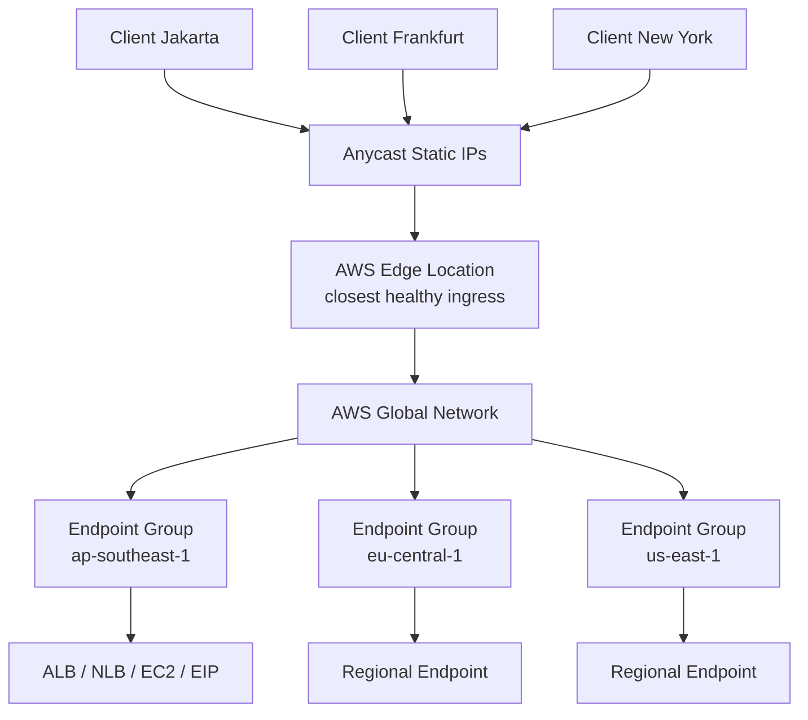
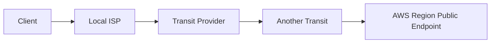
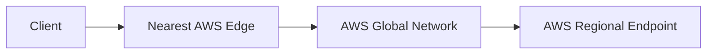
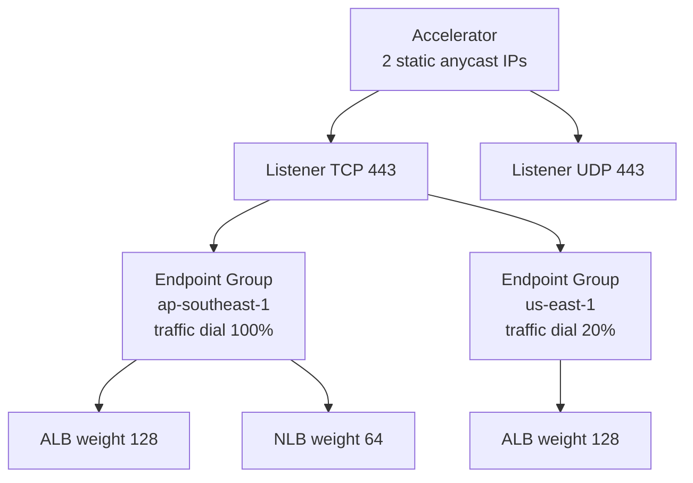
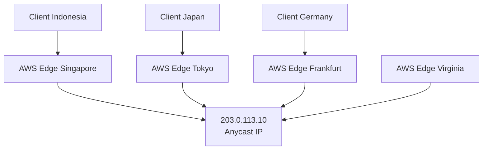
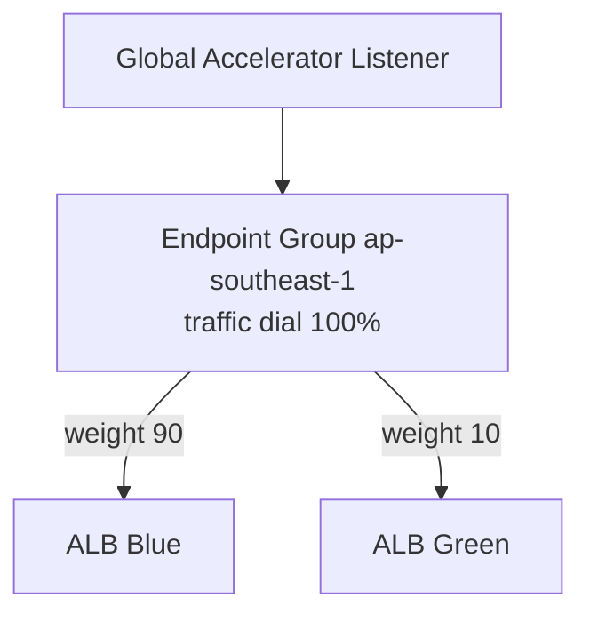
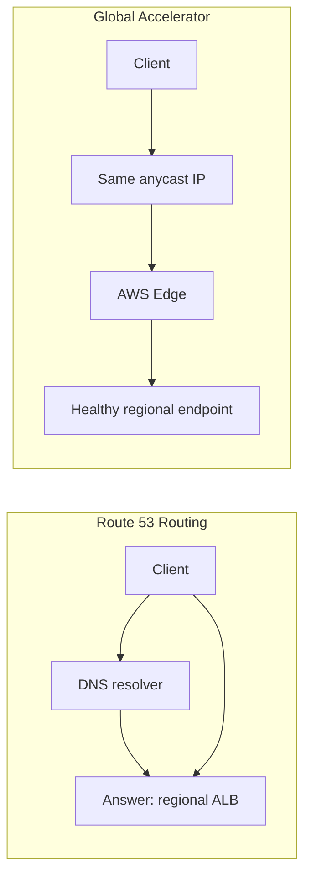
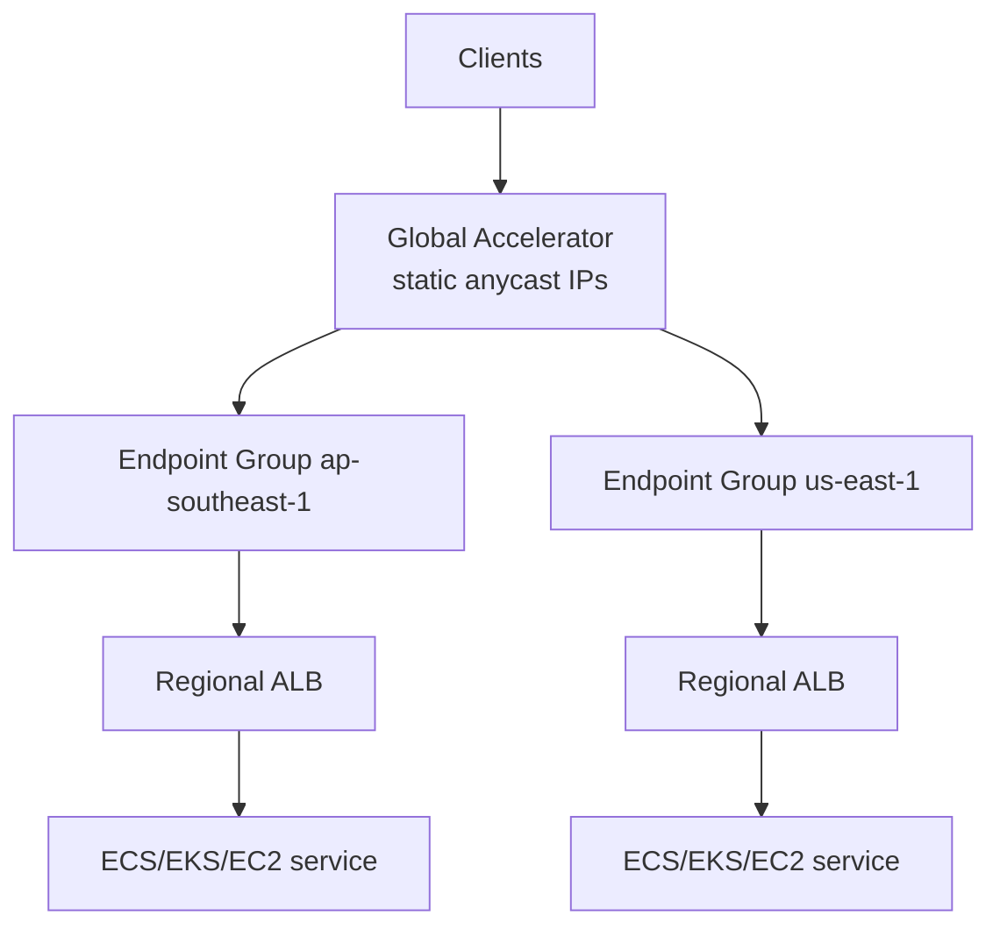
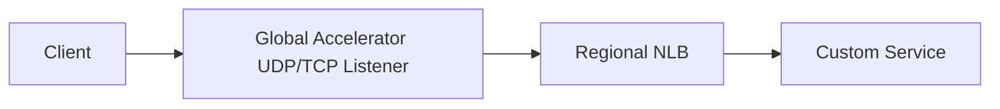
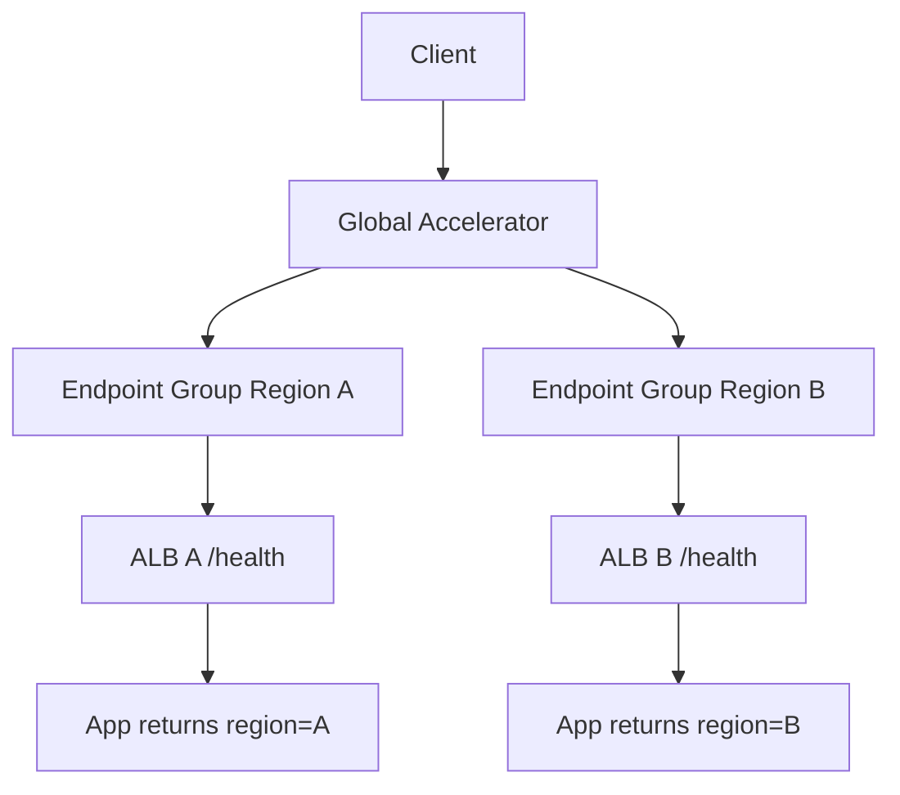

# Part 046 — AWS Global Accelerator Deep Dive

Sebelum membahas CloudFront, kita perlu memahami AWS Global Accelerator.

Banyak engineer melihat Global Accelerator sebagai “Route 53 latency routing versi lain” atau “CDN tanpa cache”. Keduanya kurang tepat.

Global Accelerator adalah layanan edge networking yang memberi **static anycast IP addresses** sebagai entry point global, lalu membawa traffic melewati AWS global network menuju endpoint regional yang sehat dan optimal.

Mental model singkat:

```txt
Route 53 steers by DNS answers.
CloudFront accelerates and caches HTTP content at edge.
Global Accelerator gives stable anycast IPs and steers TCP/UDP traffic over AWS global network.
```

Global Accelerator cocok ketika:

- aplikasi perlu static global IP,
- protocol bukan hanya HTTP caching use case,
- failover DNS TTL terlalu lambat atau tidak cukup deterministik,
- client sulit mengikuti DNS change,
- multi-region endpoint perlu health-based steering,
- latency path via public internet terlalu tidak stabil,
- perlu preserve client IP untuk endpoint tertentu,
- perlu regional traffic dial/weighted rollout tanpa mengubah client DNS.

---

## 1. Diagram Besar



Yang berubah dari internet biasa:

```txt
Client reaches nearby AWS edge by anycast.
AWS moves the traffic across its backbone as early as possible.
Global Accelerator chooses healthy regional endpoint group/endpoint.
```

---

## 2. Masalah yang Diselesaikan Global Accelerator

Tanpa Global Accelerator, path client ke region sering begini:



Kualitas path bergantung pada BGP internet, peering, congestion, dan routing policy antar ISP.

Dengan Global Accelerator:



Tujuannya bukan membuat jarak fisik hilang. Tujuannya adalah memindahkan sebanyak mungkin jalur ke network AWS yang lebih terkontrol.

---

## 3. Component Model

Global Accelerator punya beberapa komponen inti:

```txt
Accelerator
Static anycast IP addresses
Listener
Endpoint group
Endpoint
Traffic dial
Endpoint weight
Health check
Client affinity
```

Diagram:



---

## 4. Accelerator

Accelerator adalah top-level resource. Standard accelerator biasanya memberi dua static anycast IPv4 addresses. Client menggunakan IP ini atau DNS name accelerator.

Poin penting:

```txt
The IPs are global entry points, not regional load balancer IPs.
```

Keuntungan static IP:

- allowlist firewall partner lebih mudah,
- DNS record bisa stabil,
- client lama yang tidak refresh DNS tetap memakai IP sama,
- failover regional bisa terjadi tanpa mengganti IP client-facing,
- cocok untuk protocol/client yang sensitif terhadap DNS behavior.

Namun static IP bukan berarti endpoint di belakangnya statis. Endpoint regional bisa ALB/NLB/EC2/EIP, dan routing bisa berubah berdasarkan health dan policy.

---

## 5. Anycast Mental Model

Anycast berarti IP yang sama diiklankan dari banyak lokasi. Internet routing membawa client ke lokasi jaringan yang dianggap paling dekat/optimal menurut BGP.



Jangan samakan anycast dengan DNS latency routing.

DNS latency routing:

```txt
Resolver asks DNS -> receives regional answer -> client connects to that answer.
```

Anycast:

```txt
Client connects to same IP -> internet routes to nearest/optimal advertised edge -> service steers inside AWS.
```

Perbedaan praktis:

| Aspect | DNS Routing | Global Accelerator Anycast |
|---|---|---|
| Client-facing address | Bisa berubah sesuai DNS answer | Static anycast IPs. |
| Failover dependency | TTL, resolver cache, client DNS behavior | Service-level traffic steering behind same IP. |
| Protocol | DNS-agnostic but endpoint-specific | TCP/UDP listener model. |
| Path control | Client follows public internet to regional endpoint | Enters AWS edge earlier. |
| Firewall allowlist | Bisa banyak regional IP/hostname | Stable global IP. |

---

## 6. Listener

Listener menentukan protocol dan port yang diterima accelerator.

Contoh:

```txt
TCP 443 -> HTTPS/TLS application
TCP 80  -> HTTP redirect layer
UDP 443 -> QUIC-like UDP traffic if supported by endpoint pattern
TCP 5000-6000 -> custom app protocol
```

Global Accelerator berada di L4-ish traffic steering. Ia tidak membaca HTTP path seperti ALB, tidak melakukan cache seperti CloudFront, dan tidak menjalankan WAF seperti CloudFront/ALB integration.

Jika butuh path-based routing:

```txt
Global Accelerator -> ALB -> path/host routing -> target group
```

Jika butuh CDN/cache/WAF at edge:

```txt
CloudFront -> origin
```

---

## 7. Endpoint Group

Endpoint group biasanya merepresentasikan Region.

Contoh:

```txt
Endpoint group ap-southeast-1
Endpoint group us-east-1
Endpoint group eu-west-1
```

Global Accelerator mengarahkan traffic ke endpoint group berdasarkan:

- lokasi client,
- health endpoint group,
- traffic dial,
- endpoint health,
- endpoint weight,
- client affinity jika aktif.

Endpoint group bukan hanya container. Ia adalah policy boundary untuk regional traffic steering.

---

## 8. Traffic Dial

Traffic dial mengatur persentase traffic yang masuk ke endpoint group tertentu.

Contoh:

```txt
ap-southeast-1 traffic dial: 100%
us-east-1 traffic dial: 10%
```

Makna penting:

```txt
Traffic dial applies to traffic that Global Accelerator would already route to that endpoint group, not necessarily all global traffic.
```

Gunakan traffic dial untuk:

- regional canary,
- controlled ramp-up region baru,
- partial evacuation,
- reduce traffic to degraded region,
- maintenance operation.

Pattern:

```txt
New region launch:
  0% -> 5% -> 10% -> 25% -> 50% -> 100%
```

Jangan pakai traffic dial sebagai satu-satunya safety mechanism. Tetap butuh health check, app-level SLO, rollback, dan database/state strategy.

---

## 9. Endpoint

Endpoint bisa berupa beberapa jenis resource, tergantung mode dan requirement:

```txt
Application Load Balancer
Network Load Balancer
EC2 instance
Elastic IP address
```

Pemilihan endpoint:

| Endpoint | Cocok untuk | Notes |
|---|---|---|
| ALB | HTTP/HTTPS app, host/path routing | Combine L4 global steering + L7 regional routing. |
| NLB | TCP/UDP/TLS, high performance, static regional style | Good for non-HTTP services. |
| EC2 | Direct instance endpoint | Lebih jarang untuk production large systems. |
| EIP | Static public endpoint target | Useful for specific legacy/custom cases. |

Biasanya production web/API modern:

```txt
Global Accelerator -> ALB -> ECS/EKS/EC2 targets
```

Atau high-throughput TCP/UDP:

```txt
Global Accelerator -> NLB -> service targets
```

---

## 10. Endpoint Weight

Endpoint weight mengatur pembagian traffic antar endpoint dalam endpoint group.

Contoh:

```txt
Endpoint group ap-southeast-1:
  ALB blue  weight 90
  ALB green weight 10
```

Ini bisa digunakan untuk:

- blue/green regional rollout,
- weighted traffic split,
- gradual migration dari NLB lama ke NLB baru,
- endpoint draining.

Bedakan:

```txt
Traffic dial = controls traffic to endpoint group.
Endpoint weight = controls traffic among endpoints inside endpoint group.
```

Diagram:



---

## 11. Health Checks and Failover

Global Accelerator memonitor health endpoint. Jika endpoint unhealthy, traffic dapat dialihkan ke endpoint sehat.

Mental model:

```txt
No healthy endpoint in closest group? Try healthy endpoint elsewhere.
Endpoint weight zero? Do not normally receive traffic.
Traffic dial controls normal traffic, but failover semantics can still consider health in ways you must understand.
```

Health check harus memeriksa readiness aplikasi, bukan sekadar port terbuka.

Bad health check:

```txt
GET / returns 200 even when database dependency is dead.
```

Better:

```txt
GET /health/ready checks critical dependencies required to serve traffic.
GET /health/live checks process liveness separately.
```

Namun jangan membuat health check terlalu sensitif hingga flapping.

Good health check properties:

- fast,
- cheap,
- deterministic,
- representative enough,
- not dependent on optional downstream,
- does not mutate state,
- protected from public abuse where applicable.

---

## 12. Client Affinity

Client affinity membuat connections dari source IP yang sama cenderung diarahkan ke endpoint yang sama.

Gunakan ketika:

- aplikasi masih punya session affinity di regional layer,
- protocol long-lived butuh sticky behavior,
- client-side reconnect harus cenderung kembali ke endpoint sama.

Hati-hati:

```txt
Many users behind same NAT can share one source IP.
Client affinity can create imbalance.
```

Jika jutaan user mobile berada di balik carrier NAT, source-IP affinity bisa mengelompokkan banyak user ke endpoint yang sama. Jangan aktifkan hanya karena terdengar aman.

Prefer:

```txt
Stateless app + external session store + no global affinity dependency.
```

Gunakan affinity sebagai compatibility tool, bukan desain default.

---

## 13. Client IP Preservation

Client IP preservation penting untuk:

- application logging,
- fraud/risk scoring,
- rate limiting,
- geo logic,
- audit,
- security analysis.

Tetapi behavior bergantung pada jenis endpoint dan konfigurasi.

Jika client IP dipreserve, backend melihat source IP asli client. Jika tidak, backend mungkin melihat IP dari Global Accelerator/AWS path.

Design consequence:

```txt
Security Group and NACL rules must match actual source IP behavior.
```

Jika backend tiba-tiba melihat client public IP, SG yang hanya mengizinkan edge/service range bisa gagal. Jika tidak preserve, app-level logging perlu memakai header/proxy mechanism jika tersedia di downstream layer.

Jangan asumsikan. Test packet path.

---

## 14. Global Accelerator vs Route 53

Route 53 melakukan traffic steering melalui DNS response. Global Accelerator melakukan traffic steering di balik static anycast IP.

Route 53 cocok ketika:

- DNS-based policy cukup,
- endpoint bisa diekspos via domain berbeda,
- TTL/caching acceptable,
- cost/complexity perlu rendah,
- failover menit/sub-menit cukup sesuai SLO.

Global Accelerator cocok ketika:

- client-facing IP harus stabil,
- DNS cache behavior tidak bisa dipercaya,
- client tidak refresh DNS dengan baik,
- partner firewall allowlist butuh IP tetap,
- TCP/UDP acceleration/failover diperlukan,
- latency path public internet menjadi masalah,
- multi-region health steering harus di balik entry point sama.

Diagram:



Key invariant:

```txt
DNS failover changes where clients connect.
Global Accelerator changes where same connection entry point forwards traffic.
```

---

## 15. Global Accelerator vs CloudFront

CloudFront adalah CDN + edge HTTP reverse proxy. Global Accelerator adalah L4 global traffic accelerator.

CloudFront cocok untuk:

- HTTP/HTTPS web/API,
- caching static/dynamic content,
- WAF at edge,
- TLS at edge,
- origin shielding,
- signed URL/cookie,
- header/cookie/query cache control,
- edge functions.

Global Accelerator cocok untuk:

- TCP/UDP workloads,
- static anycast IP,
- non-cacheable app acceleration,
- fast regional failover behind same IP,
- ALB/NLB/EC2/EIP endpoints,
- preserve client IP needs.

Comparison:

| Requirement | Route 53 | CloudFront | Global Accelerator |
|---|---|---|---|
| Static anycast IP | No, not as primary feature | No stable dedicated IP by default pattern | Yes. |
| HTTP caching | No | Yes | No. |
| L7 HTTP routing at edge | No | Yes | No. |
| TCP/UDP generic acceleration | No | Limited to supported HTTP/WebSocket patterns | Yes. |
| DNS TTL dependency | Yes | DNS used but service behind distribution | Client uses accelerator DNS/IP, steering behind it. |
| WAF integration | With supported targets indirectly | Strong edge pattern | Not the main WAF layer. |
| Partner IP allowlist | Harder | Depends | Strong use case. |

Rule of thumb:

```txt
Use CloudFront when content/application is HTTP and benefits from edge proxy/cache/security.
Use Global Accelerator when you need global L4 entry, static IP, or deterministic failover for TCP/UDP apps.
Use Route 53 when DNS-level steering is sufficient.
```

---

## 16. Common Architectures

### 16.1 Multi-Region Public API



Use case:

- global SaaS API,
- lower latency ingress,
- failover between regions,
- stable partner IP allowlist.

Key design questions:

```txt
Is application active-active or active-passive?
Is database replicated and writable in both regions?
What happens to in-flight sessions on regional failure?
Does health check reflect app readiness?
```

### 16.2 Static IP for ALB

ALB does not give fixed static IPs as normal client-facing contract. Global Accelerator can front ALB with static IPs.

```txt
Partner firewall allowlists two accelerator IPs.
Global Accelerator routes to ALB.
ALB routes by host/path.
```

This is cleaner than trying to manually track ALB IPs.

### 16.3 UDP or Custom TCP Service



Use case:

- gaming,
- real-time protocol,
- custom binary protocol,
- low-latency TCP service,
- UDP-based service.

### 16.4 Regional Evacuation

Normal:

```txt
ap-southeast-1: 100%
us-east-1: backup/partial
```

During issue:

```txt
reduce traffic dial for degraded group
health check removes bad endpoints
increase traffic to healthy region
```

Important:

```txt
Traffic shifting is not disaster recovery by itself.
State, data, secrets, DNS, dependencies, quotas, and capacity must already be ready.
```

---

## 17. Failure Modes

### 17.1 Endpoint health check too shallow

Port 443 is open, but app cannot serve real request.

Consequence:

```txt
Global Accelerator keeps sending traffic to broken region.
```

Fix:

```txt
Health endpoint must represent serving readiness.
```

### 17.2 Health check too deep

Health endpoint depends on optional service. Optional service fails, entire region marked unhealthy.

Consequence:

```txt
False failover.
Traffic overloads other region.
```

Fix:

```txt
Separate critical from optional dependency.
```

### 17.3 Client affinity causes hot endpoint

Many clients behind same source IP are pinned.

Consequence:

```txt
Uneven load distribution.
One endpoint overloaded.
```

Fix:

```txt
Avoid affinity unless protocol/session requires it.
```

### 17.4 Backend security rule mismatch

Client IP preservation changes observed source IP.

Consequence:

```txt
ALB/NLB/backend rejects traffic.
```

Fix:

```txt
Validate actual source IP at backend for each endpoint type.
```

### 17.5 Regional capacity not ready

Failover sends traffic to standby region without enough capacity.

Consequence:

```txt
Failover succeeds at network layer but fails at application layer.
```

Fix:

```txt
Pre-scale or autoscale with tested warm capacity.
```

### 17.6 DNS still points around accelerator

Some clients use old regional ALB DNS directly.

Consequence:

```txt
Global Accelerator policy does not control all traffic.
```

Fix:

```txt
Enforce canonical entry point, deprecate direct endpoint exposure, restrict regional endpoint ingress where possible.
```

---

## 18. Security Model

Global Accelerator is not a replacement for security layers.

Still need:

- Security Groups on ALB/NLB/EC2,
- NACL where used,
- TLS policy at ALB/NLB/app,
- WAF if HTTP app needs L7 protection,
- Shield/DDoS posture,
- logging and monitoring,
- IAM least privilege for accelerator changes,
- origin/backend exposure control.

Architecture for HTTP API needing WAF:

```txt
CloudFront + WAF -> ALB
```

Or if static IP/GA is mandatory:

```txt
Global Accelerator -> ALB with WAF association where supported at ALB layer
```

But be precise: WAF enforcement location differs. Edge WAF at CloudFront and regional WAF at ALB are operationally different.

---

## 19. Observability

Observability questions:

```txt
Which endpoint group receives traffic?
Which endpoint is unhealthy?
What is processed bytes/packets trend?
Did traffic dial change?
Are clients concentrated in unexpected regions?
Did failover happen?
Are backend ALB/NLB metrics aligned with GA metrics?
```

Monitor layers together:

```txt
Global Accelerator metrics
ALB/NLB target health
application readiness metrics
regional error rate
latency by geography
connection count
endpoint group traffic distribution
```

Do not debug Global Accelerator in isolation. A “GA problem” is often:

- backend target unhealthy,
- ALB security group issue,
- health check path wrong,
- app returns 500,
- region capacity issue,
- endpoint weight/traffic dial misconfigured,
- client IP preservation mismatch.

---

## 20. Change Management

Changes that require care:

```txt
adding endpoint group
changing traffic dial
changing endpoint weight
changing health check config
switching client affinity
adding/removing endpoint
changing backend SG because of source IP behavior
```

Safe rollout pattern:

```yaml
change: add-new-region-to-global-accelerator
steps:
  - deploy regional endpoint
  - validate health check from GA
  - set traffic dial 0
  - run synthetic test via accelerator
  - set dial 5
  - monitor error/latency/capacity
  - ramp gradually
rollback:
  - set dial 0
  - remove endpoint if needed
observability:
  - GA endpoint health
  - ALB 5xx
  - app SLO
  - database replication lag
  - regional saturation
```

---

## 21. Multi-Region Reality: Network Is the Easy Part

Global Accelerator can steer traffic globally. It does not solve distributed system state.

Before active-active, answer:

```txt
Where is write authority?
How is data replicated?
What consistency model is acceptable?
Can user session move regions?
Are idempotency keys global?
Are background jobs regional-safe?
Are secrets/configs identical?
Are dependencies available in both regions?
Can one region handle all traffic?
```

Network failover without state readiness creates a worse incident: clients reach the healthy region, but application semantics break.

Global Accelerator solves entry and steering. You still own application correctness.

---

## 22. Cost Model

Cost usually includes:

- accelerator hourly charge,
- data transfer premium/traffic through accelerator,
- underlying ALB/NLB/EC2 data processing,
- inter-region effects if backend/state crosses Region,
- observability/logging cost.

Cost trap:

```txt
Using Global Accelerator for all traffic when CloudFront caching would reduce origin traffic.
```

Another trap:

```txt
Failover sends users to distant region that then calls back to primary-region data services.
```

That creates latency and possible data transfer cost. Design app/data locality, not just global ingress.

---

## 23. Global Accelerator Decision Checklist

Use Global Accelerator when several are true:

- [ ] Need static client-facing IPs.
- [ ] Need TCP/UDP global acceleration.
- [ ] Need reduce dependency on DNS TTL for failover.
- [ ] Need route over AWS global network earlier.
- [ ] Need multi-region health-based steering.
- [ ] Need partner/client firewall allowlist stability.
- [ ] Need regional traffic dial/weighted endpoint rollout.
- [ ] App is not primarily cacheable HTTP content.

Prefer Route 53 when:

- [ ] DNS steering is enough.
- [ ] TTL/caching behavior is acceptable.
- [ ] Static IP is not required.
- [ ] Simpler/cost-lower design is preferred.

Prefer CloudFront when:

- [ ] HTTP/HTTPS content/API benefits from edge cache/proxy.
- [ ] Need edge WAF and CDN capabilities.
- [ ] Need signed URLs/cookies or origin shielding.
- [ ] Need cache key/header/cookie/query policies.

---

## 24. Hands-On Lab: Global Accelerator in Front of Two ALBs

Goal:

```txt
One global entry point routes to two regional ALBs.
Traffic can be shifted by endpoint group dial.
Unhealthy region is avoided.
```

Architecture:



Steps:

1. Deploy simple HTTP app in two Regions.
2. Put each app behind an ALB.
3. Create accelerator.
4. Add TCP listener `443` or `80` for lab.
5. Create endpoint group per Region.
6. Add regional ALBs as endpoints.
7. Configure health check path `/health`.
8. Query accelerator DNS name repeatedly from different networks.
9. Set one region traffic dial lower.
10. Break `/health` in one region and observe failover.
11. Restore health and observe recovery.

Validation:

```bash
curl -i http://<accelerator-dns-name>/
curl -i http://<accelerator-dns-name>/health
```

Expected response body:

```json
{
  "region": "ap-southeast-1",
  "status": "ok"
}
```

Then after failover:

```json
{
  "region": "us-east-1",
  "status": "ok"
}
```

Production note:

```txt
Do not infer global traffic distribution from one laptop test.
Use metrics, multiple geographies, and synthetic checks.
```

---

## 25. Runbook: Users Report High Latency

Triage:

1. Is traffic going through Global Accelerator or bypassing it?
2. Which endpoint group receives traffic?
3. Are clients routed to expected nearby edge/region?
4. Are endpoint health checks passing?
5. Is backend ALB target latency high?
6. Is application latency high after ALB?
7. Is database/dependency cross-region?
8. Did traffic dial/weight change recently?
9. Is a region degraded but still healthy by shallow check?
10. Are clients behind NAT/source IP affinity causing imbalance?

Commands/tools:

```bash
curl -w "time_connect=%{time_connect} time_starttransfer=%{time_starttransfer} total=%{time_total}\n" \
  https://api.example.com/health
```

Compare:

```txt
accelerator endpoint
regional ALB direct endpoint
CloudWatch GA metrics
ALB target response time
app metrics
```

Interpretation:

| Symptom | Likely Area |
|---|---|
| Accelerator slower than regional direct from same location | Path/routing/client location issue. |
| Both accelerator and regional direct slow | Backend/app/dependency issue. |
| Only one geography slow | Edge/path/regional steering issue. |
| Error spike after traffic dial change | Capacity or state not ready in receiving region. |

---

## 26. Runbook: Failover Did Not Happen

Check:

```txt
Endpoint health status
Health check path and port
ALB target health
Security group allows health checker path
Endpoint weight > 0 where expected
Endpoint group has healthy alternative
Traffic dial semantics understood
Client is actually using accelerator IP/DNS
```

Common root causes:

- health check returns 200 while app is broken,
- endpoint is unhealthy but no healthy alternate exists,
- client bypasses accelerator and hits ALB DNS directly,
- traffic dial/weight misunderstood,
- app-level state prevents serving from failover region,
- regional endpoint security group blocks health check traffic.

---

## 27. Anti-Patterns

### Anti-pattern 1 — Using Global Accelerator as CDN

If your main need is cache, compression, edge HTTP policy, and WAF at edge, use CloudFront.

### Anti-pattern 2 — Expecting network failover to solve data failover

Global Accelerator can send users to Region B. It cannot make Region B have correct writable data.

### Anti-pattern 3 — Health check equals `/ping`

`/ping` that always returns 200 is not readiness. It is process existence.

### Anti-pattern 4 — Direct regional endpoint still public

If users can bypass accelerator, your traffic policy is incomplete.

### Anti-pattern 5 — Client affinity by default

Affinity can hide imbalance and overload endpoints.

### Anti-pattern 6 — No regional capacity test

Failover to an under-provisioned region is controlled failure, not resilience.

---

## 28. Final Mental Model

Global Accelerator is best understood as:

```txt
a stable global L4 entry point
using anycast IPs
that moves traffic onto AWS global network early
and steers it to healthy regional endpoints
using endpoint groups, weights, traffic dials, health checks, and affinity controls.
```

It is not DNS. It is not CDN cache. It is not service mesh. It is not database replication. It is not L7 application router.

Top 1% engineer uses it when the problem is specifically:

```txt
global entry stability + fast health-based regional steering + TCP/UDP path acceleration + static IP contract
```

And rejects it when the real problem is:

```txt
HTTP caching, WAF at edge, service discovery, app state replication, or internal service-to-service routing.
```

That distinction matters because the wrong global entry point creates expensive complexity. The right one gives you a simpler, more deterministic production boundary.
