# Part 047 — Route 53 vs Global Accelerator vs CloudFront

Pada titik ini kita sudah membahas DNS, Route 53 routing policies, Route 53 health checks, private DNS, Resolver DNS Firewall, dan Global Accelerator. Sekarang kita perlu menjawab pertanyaan yang lebih praktis:

> Untuk aplikasi global, kapan kita pakai Route 53, kapan pakai CloudFront, kapan pakai Global Accelerator, dan kapan menggabungkannya?

Jawaban yang salah biasanya dimulai dari nama layanan.

Jawaban yang benar dimulai dari **siapa yang mengontrol traffic pada layer apa**.

Route 53 mengontrol **nama menjadi jawaban DNS**. CloudFront mengontrol **HTTP request di edge**. Global Accelerator mengontrol **network entry point dan flow routing melalui AWS global network**.

Ketiganya sering muncul di diagram yang sama, tetapi mereka bukan barang yang setara.

---

## 1. Mental Model Utama

Bayangkan user membuka:

```text
https://api.example.com/v1/cases/123
```

Ada beberapa keputusan yang terjadi sebelum request sampai ke aplikasi:

1. `api.example.com` resolve ke apa?
2. Client connect ke IP mana?
3. Jalur internet mana yang dipakai sampai ke AWS?
4. Apakah request HTTP diterminasi di edge?
5. Apakah response bisa dicache?
6. Jika origin Region A gagal, siapa yang mengalihkan ke Region B?
7. Apakah pengalihan terjadi pada level DNS answer, HTTP edge, atau network flow?
8. Apakah client membutuhkan static IP?
9. Apakah protocol-nya HTTP, TCP, UDP, atau kombinasi?

Route 53, CloudFront, dan Global Accelerator menjawab pertanyaan yang berbeda.

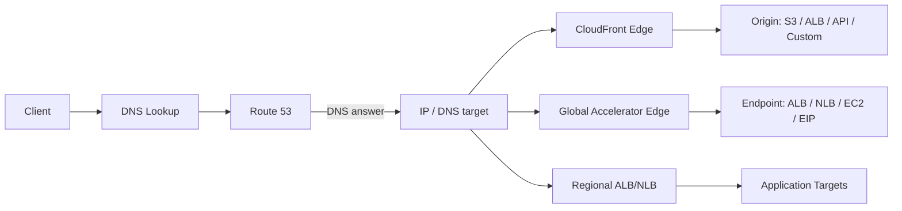

Kunci mental model:

| Layanan | Mengontrol | Layer utama | Ia melihat request? | Ia bisa cache? | Ia punya static anycast IP? |
|---|---|---:|---:|---:|---:|
| Route 53 | DNS answer | DNS / control traffic entry | Tidak | Tidak | Tidak sebagai service IP app; ia mengembalikan record/alias |
| CloudFront | HTTP(S) edge delivery | L7 | Ya | Ya | Umumnya domain distribution, bukan static dedicated app IP default |
| Global Accelerator | Anycast edge entry dan flow routing | L3/L4-ish edge networking | Tidak memahami HTTP semantics | Tidak | Ya, static anycast IP |

Route 53 menjawab: **nama ini sebaiknya mengarah ke mana?**

CloudFront menjawab: **HTTP request ini bisa dilayani, diamankan, dicache, dimutasi, atau diteruskan ke origin mana?**

Global Accelerator menjawab: **network flow ini sebaiknya masuk ke AWS edge terdekat dan diarahkan ke endpoint sehat mana melalui AWS global network?**

---

## 2. Service Boundary

### 2.1 Route 53: authoritative DNS and DNS-level traffic policy

Route 53 adalah authoritative DNS service. Dalam konteks public traffic, ia menyimpan hosted zone dan record, lalu menjawab DNS query dari recursive resolver.

Route 53 tidak berada di jalur TCP connection aplikasi. Setelah client menerima DNS answer, Route 53 tidak lagi mengontrol packet-by-packet behavior connection tersebut.

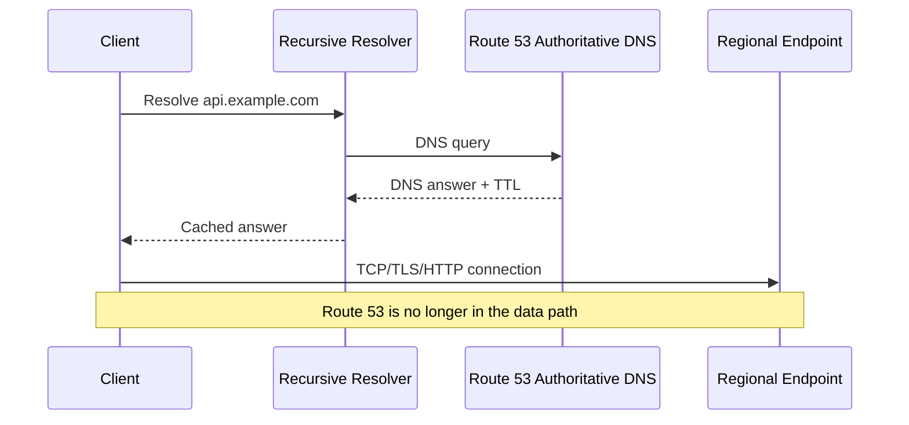

Route 53 kuat untuk:

- domain registration/delegation;
- authoritative public DNS;
- alias ke AWS resources;
- DNS failover;
- weighted rollout;
- latency/geolocation/geoproximity routing;
- multi-value records;
- health-check-driven DNS answer selection.

Route 53 lemah untuk:

- instant failover connection yang sudah berjalan;
- protocol-specific HTTP behavior;
- caching content;
- request transformation;
- static anycast IP aplikasi;
- controlling recursive resolver cache behavior di luar TTL semantics.

Route 53 adalah **routing hint via DNS**, bukan live traffic switch.

---

### 2.2 CloudFront: HTTP edge proxy, CDN, and application edge control

CloudFront adalah edge distribution. Client connect ke CloudFront edge, CloudFront menerima HTTP(S) request, lalu memutuskan apakah request bisa dilayani dari cache atau harus diteruskan ke origin.

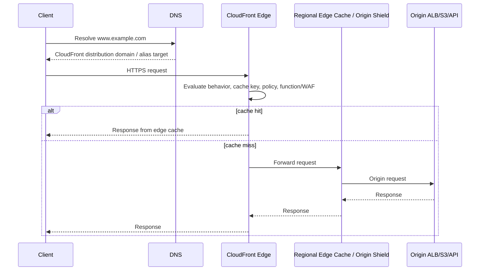

CloudFront kuat untuk:

- static and dynamic HTTP content delivery;
- cache acceleration;
- reducing origin load;
- TLS termination at edge;
- origin failover;
- AWS WAF integration;
- bot/threat filtering at edge;
- signed URL/cookie;
- origin access control for S3;
- header/cookie/query based caching;
- CloudFront Functions and Lambda@Edge;
- global HTTP application front door.

CloudFront lemah untuk:

- non-HTTP TCP/UDP acceleration;
- arbitrary L4 protocols;
- preserving raw TCP flow semantics;
- exposing two fixed static anycast IPv4 addresses as app entry point;
- replacing DNS for domain delegation.

CloudFront is not just “faster website”. It is a programmable HTTP edge boundary.

---

### 2.3 Global Accelerator: static anycast entry and regional endpoint steering

Global Accelerator provides static anycast IPs. Client connects to an IP advertised from AWS edge locations. Traffic enters the AWS global network near the client, then Global Accelerator routes it to a healthy configured endpoint.

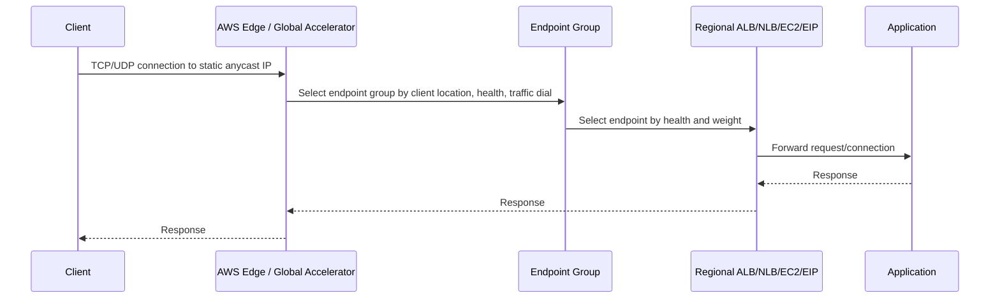

Global Accelerator kuat untuk:

- static anycast IPv4 entry point;
- TCP/UDP global acceleration;
- multi-Region failover without relying only on DNS TTL;
- traffic dial per endpoint group;
- endpoint weights within endpoint group;
- client affinity;
- fronting ALB/NLB/EC2/EIP endpoints;
- improving internet path by entering AWS network early;
- using one stable IP entry for allowlists.

Global Accelerator lemah untuk:

- caching;
- HTTP request mutation;
- content personalization at edge;
- S3 static website acceleration as CDN;
- replacing CloudFront for HTTP cache/WAF/content behavior;
- replacing Route 53 for domain/zone/delegation management.

Global Accelerator is a network front door, not an HTTP CDN.

---

## 3. The Three Questions That Decide Everything

Most decisions collapse into three questions:

### Question 1 — Is your traffic HTTP and cacheable or edge-transformable?

If yes, CloudFront is the likely front door.

Even dynamic APIs can benefit from CloudFront when you need:

- WAF at edge;
- global TLS termination;
- request normalization;
- compression;
- header policy;
- origin protection;
- selective cache;
- DDoS surface reduction;
- static frontend + API under same domain.

But if protocol is raw TCP, UDP, game protocol, MQTT over custom TCP, custom binary protocol, or non-HTTP streaming, CloudFront is usually not the right abstraction.

### Question 2 — Do clients need stable static IPs or low-latency TCP/UDP global routing?

If yes, Global Accelerator is the likely front door.

Use Global Accelerator when the client or partner says:

> “Give me fixed IPs to allowlist.”

or:

> “We need regional failover faster than DNS cache behavior allows.”

or:

> “This is not HTTP but still needs global acceleration.”

### Question 3 — Do you only need name-based routing and DNS-level steering?

If yes, Route 53 may be enough.

Use Route 53 when:

- endpoint is already good enough;
- protocol can be anything because DNS does not care;
- failover tolerance matches TTL/cache behavior;
- you want weighted rollout at DNS level;
- you want latency/geolocation based records;
- you are routing to AWS alias targets;
- you need public/private domain control.

Route 53 is the minimal global routing layer. That is a strength, not a weakness.

---

## 4. Decision Matrix

| Requirement | Prefer Route 53 | Prefer CloudFront | Prefer Global Accelerator |
|---|---:|---:|---:|
| Domain registration/delegation | ✅ | ❌ | ❌ |
| Authoritative DNS | ✅ | ❌ | ❌ |
| DNS failover | ✅ | ⚠️ via origin failover for HTTP | ⚠️ GA has endpoint health/failover, not DNS hosting |
| HTTP caching | ❌ | ✅ | ❌ |
| Static assets | ⚠️ DNS only | ✅ | ❌ |
| Dynamic HTTP API acceleration | ⚠️ DNS only | ✅ often | ✅ sometimes, especially multi-Region/static IP |
| TCP/UDP non-HTTP | ✅ DNS can point | ❌ | ✅ |
| Static anycast IPs | ❌ | ❌ default | ✅ |
| Edge request manipulation | ❌ | ✅ | ❌ |
| AWS WAF direct integration | ❌ | ✅ | ❌ direct app-layer WAF behavior |
| Client IP allowlisting by fixed entry IP | ❌ | ⚠️ not primary model | ✅ |
| Cache hit ratio optimization | ❌ | ✅ | ❌ |
| Regional traffic dial | ⚠️ weighted records | ❌ not same abstraction | ✅ |
| Endpoint weights within region | ⚠️ weighted records | ⚠️ origin/load balancer rules | ✅ |
| Fast endpoint failover without DNS cache dependence | ❌ limited by resolver cache | ✅ for HTTP origin failover patterns | ✅ |
| Origin protection | ❌ | ✅ | ⚠️ entry point only |
| Private app edge access | ❌ | ⚠️ depends pattern | ⚠️ public edge to endpoints |
| Lowest operational complexity | ✅ | ⚠️ | ⚠️ |

The common trap: choosing the service by performance claims.

Better: choose by **control surface**.

---

## 5. Control Surface Comparison

### 5.1 Route 53 controls answers, not sessions

Route 53 can change the answer a resolver gets.

But after a client has an IP, Route 53 does not know whether that client opened:

- one TCP connection;
- 100 HTTP keep-alive requests;
- WebSocket;
- DNS-cached connection pool;
- a mobile app session that reuses the endpoint for hours.

That means DNS failover is not an instant kill switch for all clients.

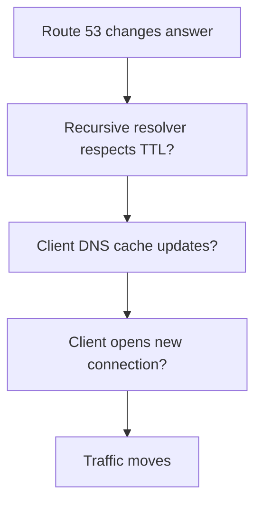

The path has several caches and client behaviors.

Use Route 53 failover when your application can tolerate this model.

Do not use Route 53 alone when your business requirement says:

> “Within seconds, existing client traffic must move away from unhealthy Region.”

That requirement usually points to Global Accelerator or an application-level reconnect/failover design.

---

### 5.2 CloudFront controls HTTP request lifecycle

CloudFront sees the HTTP request.

It can decide based on:

- host;
- path;
- method;
- headers;
- cookies;
- query strings;
- cache behavior order;
- cache policy;
- origin request policy;
- viewer protocol policy;
- function execution;
- WAF result;
- origin health/failover behavior.

CloudFront can reduce latency in two different ways:

1. **Serve from edge cache.**
2. **Optimize the path and connection management to origin for cache misses.**

Only the first one is “CDN caching”. The second one still matters for dynamic traffic, but it is not magic. If your origin is slow, unindexed, overloaded, or cross-Region, CloudFront will not fix application design.

---

### 5.3 Global Accelerator controls edge entry and endpoint choice

Global Accelerator does not parse HTTP routes. It receives a network flow at an AWS edge location and chooses a healthy endpoint according to:

- listener;
- endpoint group;
- AWS Region;
- endpoint health;
- traffic dial;
- endpoint weight;
- client affinity configuration;
- endpoint type and routing behavior.

The accelerator is valuable when the transport path itself matters.

Examples:

- real-time gaming;
- voice/video signaling over non-HTTP;
- financial trading gateway;
- partner API requiring static IP allowlisting;
- multi-Region TCP service;
- global API where fast failover matters more than cache;
- high-volume app with clients far from Region.

---

## 6. Protocol-Based Decision

### 6.1 HTTP static website

Recommended:

```text
Route 53 -> CloudFront -> S3 origin with OAC
```

Why:

- Route 53 owns the domain.
- CloudFront provides edge cache and HTTPS.
- S3 is protected by Origin Access Control.
- WAF can be added at CloudFront.
- Static assets can use immutable versioned names.

Do not use Global Accelerator here. It does not cache static objects.

---

### 6.2 HTTP dynamic website or API

Common recommended pattern:

```text
Route 53 -> CloudFront -> ALB/API Gateway/custom origin
```

Use when you need:

- WAF at edge;
- TLS termination close to user;
- cache for safe GET responses;
- origin shielding;
- header/query policy;
- edge redirects;
- static frontend and API under one host;
- CDN logs and edge observability.

Alternative:

```text
Route 53 -> Global Accelerator -> ALB/NLB -> Application
```

Use when you need:

- static anycast IP;
- protocol not purely HTTP;
- fast Region failover independent of DNS cache;
- global transport optimization;
- client affinity to endpoint;
- partner firewall allowlisting.

---

### 6.3 Public REST API with strict WAF requirement

Usually:

```text
Route 53 -> CloudFront + AWS WAF -> API Gateway / ALB
```

CloudFront is the natural place for WAF at global edge.

If using API Gateway regional endpoint, putting CloudFront in front can centralize edge behavior. If using API Gateway edge-optimized endpoint, understand the managed CloudFront behavior behind it and avoid double-fronting without reason.

---

### 6.4 TCP or UDP service

Usually:

```text
Route 53 -> Global Accelerator -> NLB -> Targets
```

or:

```text
Clients -> Global Accelerator static IPs -> NLB -> Targets
```

Route 53 can still publish the hostname, but Global Accelerator becomes the real global network entry.

CloudFront is not the abstraction for arbitrary TCP/UDP.

---

### 6.5 Partner allowlist API

A common business requirement:

> “Our partners require fixed IP addresses to allowlist.”

Possible pattern:

```text
api.example.com
  Route 53 alias/CNAME
    -> Global Accelerator
      -> Regional ALBs
        -> API service
```

Global Accelerator provides stable anycast IPs.

CloudFront distribution domains are not designed as “give every partner fixed origin IPs for allowlist” primitives.

---

### 6.6 Multi-Region active/passive app

Options:

#### DNS-level active/passive

```text
Route 53 failover record
  primary -> ALB in Region A
  secondary -> ALB in Region B
```

Good when:

- failover window can tolerate TTL/cache behavior;
- clients reconnect naturally;
- DR is manual or semi-automated;
- simplicity matters;
- cost/complexity must stay low.

#### Global Accelerator active/passive

```text
Global Accelerator
  endpoint group Region A traffic dial 100
  endpoint group Region B traffic dial 0 or standby
```

Good when:

- you need static entry IP;
- you want health-driven endpoint selection;
- you want faster regional traffic steering;
- you need traffic dials for controlled exposure;
- DNS caching should not be the main failover mechanism.

#### CloudFront origin failover

```text
CloudFront
  primary origin -> ALB/API/S3 Region A
  secondary origin -> ALB/API/S3 Region B
```

Good when:

- traffic is HTTP;
- failover can be expressed by origin response/health semantics;
- cache and origin behavior are central;
- edge security is needed.

The wrong question is:

> “Which one supports multi-Region?”

The right question is:

> “At which layer should multi-Region decision happen?”

---

## 7. Latency Model

### 7.1 Route 53 latency routing

Route 53 latency routing chooses records based on latency measurements between users and AWS Regions. It returns DNS answers. It does not place a proxy in the data path.

That means:

- no edge termination;
- no cache;
- no AWS global network ingress guarantee for every packet;
- no request inspection;
- no per-flow awareness.

Latency routing is useful, but it is still DNS.

### 7.2 CloudFront latency

CloudFront reduces perceived latency through:

- edge cache hit;
- TLS termination close to viewer;
- persistent optimized origin connections;
- regional edge caches;
- Origin Shield;
- reduced origin load;
- compression;
- fewer expensive round trips to origin for cacheable content.

For cacheable content, the best origin call is the one that never happens.

### 7.3 Global Accelerator latency

Global Accelerator improves latency by letting clients enter AWS network at an edge location and routing over AWS global infrastructure to the endpoint.

It does not cache. It does not make slow backend code fast. It improves the network path and failover behavior.

---

## 8. Failure Model

### 8.1 Route 53 failure model

Route 53 health checks can remove unhealthy records from DNS answers depending on routing policy.

But there are caveats:

- recursive resolvers cache answers;
- clients may cache answers;
- clients may keep existing connections;
- TTL is not a hard global deadline;
- health endpoint correctness matters;
- partial dependency failure can fool health checks;
- DNS failover cannot drain existing sessions.

Route 53 is good for **new resolution steering**.

### 8.2 CloudFront failure model

CloudFront can fail over to another origin for configured origin group conditions.

But:

- it only applies to HTTP behavior;
- cache can mask origin failure;
- stale cached content can be good or bad depending on business semantics;
- origin failover is not the same as database/application failover;
- request methods and status codes matter;
- bad cache key policy can amplify failure.

CloudFront is good for **edge-managed HTTP availability**.

### 8.3 Global Accelerator failure model

Global Accelerator monitors endpoint health and routes new flows to healthy endpoints according to accelerator configuration.

But:

- it does not solve backend state replication;
- it does not fix bad health checks;
- endpoint group/weight/traffic dial policy must match your DR intent;
- existing long-lived connections may behave according to transport/app reconnect logic;
- regional service quota and endpoint dependency still matter.

Global Accelerator is good for **network-level global entry resilience**.

---

## 9. Security Model

### 9.1 Route 53 security

Route 53 is not a firewall for application traffic.

It can help with:

- DNSSEC for public DNS integrity;
- domain ownership/delegation control;
- health-check-driven hiding of unhealthy targets;
- private hosted zones for internal naming;
- Resolver DNS Firewall for VPC outbound DNS control;
- query logging for DNS visibility.

But it does not inspect HTTP requests.

### 9.2 CloudFront security

CloudFront is often the strongest public HTTP security boundary because it can combine:

- AWS WAF;
- Shield Standard integration;
- TLS policies;
- geo restrictions;
- signed URLs/cookies;
- Origin Access Control for S3;
- origin custom headers;
- origin allowlisting;
- request normalization;
- bot mitigation integrations;
- hiding origin behind edge distribution.

For public HTTP workloads, CloudFront often belongs in the default architecture unless there is a specific reason not to use it.

### 9.3 Global Accelerator security

Global Accelerator provides a stable global entry and integrates with AWS edge protection characteristics, but it is not an application firewall.

For HTTP workloads behind Global Accelerator, you often still need:

- WAF on ALB or CloudFront depending pattern;
- SG restrictions;
- ALB listener rules;
- mTLS if applicable;
- application auth;
- DDoS posture review;
- origin/endpoint exposure control.

Global Accelerator is a network edge. Do not mistake that for L7 security.

---

## 10. Cost Model

Cost should not be the first design axis, but it often decides the final shape.

### Route 53 cost drivers

- hosted zones;
- DNS queries;
- health checks;
- traffic policy records;
- domain registration;
- Resolver endpoints/query logging/DNS Firewall if used.

Route 53 is usually cheap relative to data-transfer-heavy services, but health checks and query volume matter at scale.

### CloudFront cost drivers

- data transfer out;
- HTTP/HTTPS requests;
- invalidations beyond free tier;
- real-time logs;
- CloudFront Functions / Lambda@Edge;
- Origin Shield;
- field-level encryption or advanced features;
- WAF association/rules.

CloudFront can reduce origin egress/load, but wrong cache policy can make you pay for edge without getting cache benefit.

### Global Accelerator cost drivers

- accelerator hourly cost;
- data transfer premium;
- endpoint traffic;
- multi-Region duplication;
- health check/endpoint architecture indirectly.

Global Accelerator is rarely chosen as a cheap default. It is chosen when static anycast IP, fast global routing, or transport acceleration has concrete value.

---

## 11. Common Architecture Patterns

### Pattern A — Static frontend with API backend

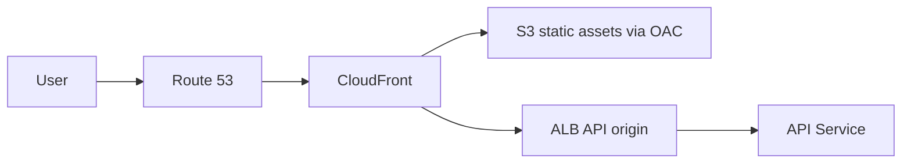

Use when:

- same domain hosts frontend and API;
- assets are cacheable;
- API needs WAF and HTTPS edge;
- you want origin protection;
- deploys use immutable asset names.

Key invariant:

> Cache static aggressively; cache dynamic intentionally or not at all.

---

### Pattern B — Global API with fixed partner IP allowlist

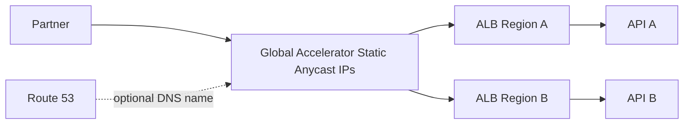

Use when:

- partners need fixed IPs;
- regions need controlled traffic dial;
- HTTP caching is not central;
- API is latency-sensitive;
- you can handle multi-Region data consistency.

Key invariant:

> Global Accelerator solves entry and routing, not state replication.

---

### Pattern C — DNS-only multi-Region failover

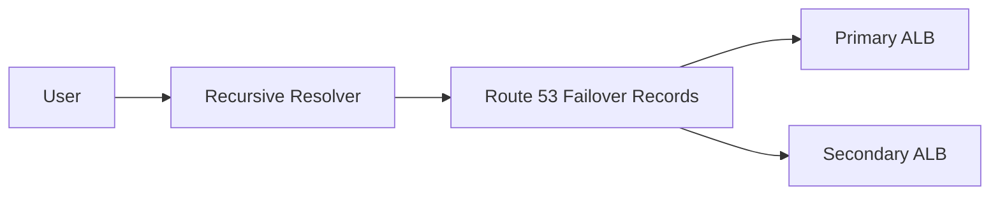

Use when:

- simple DR is acceptable;
- failover time can tolerate DNS semantics;
- app reconnect behavior is acceptable;
- lower cost and lower operational complexity are preferred.

Key invariant:

> DNS failover moves future resolutions, not all existing sessions.

---

### Pattern D — HTTP edge security in front of regional app

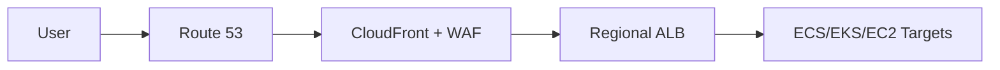

Use when:

- public HTTP app;
- WAF must be close to user;
- edge TLS desired;
- origin should not be directly exposed;
- some content is cacheable;
- logs at edge are valuable.

Key invariant:

> The ALB should accept traffic only from expected edge/network sources where possible; do not leave bypass paths open accidentally.

---

### Pattern E — Non-HTTP multiplayer/game/control-plane service

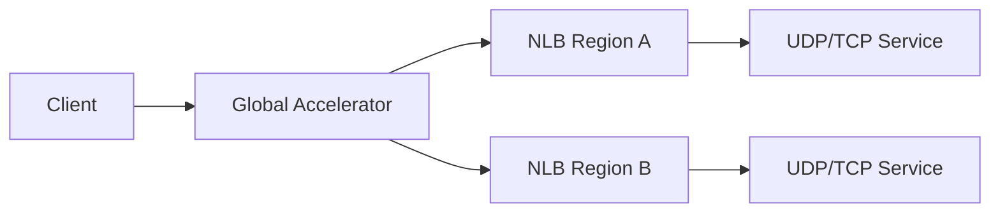

Use when:

- protocol is TCP/UDP;
- connection latency matters;
- static IP matters;
- CloudFront cannot model request semantics;
- NLB is the right regional entry.

Key invariant:

> Do not force non-HTTP protocols through HTTP edge abstractions.

---

## 12. Anti-Patterns

### Anti-pattern 1 — Using Route 53 as a real-time load balancer

Weighted records are useful. They are not per-request load balancing.

Recursive resolvers cache answers. Clients cache answers. Some clients reuse connections.

If you need per-request balancing, use ALB/CloudFront/application routing.

If you need global flow steering, use Global Accelerator.

### Anti-pattern 2 — Putting CloudFront in front of everything without cache policy discipline

CloudFront without cache design can become:

- more moving parts;
- harder debugging;
- unexpected header/cookie stripping;
- broken auth behavior;
- zero cache hit ratio;
- expensive pass-through proxy.

CloudFront is powerful because it is explicit. Treat cache key and origin request policy as application contracts.

### Anti-pattern 3 — Choosing Global Accelerator because “global sounds faster”

Global Accelerator is valuable, but not free and not universal.

If the workload is a static website, CloudFront is usually better.

If the workload only needs DNS-based DR, Route 53 may be enough.

If the workload is purely regional and clients are close enough, ALB/NLB + Route 53 may be simpler.

### Anti-pattern 4 — Stacking services without layer purpose

Bad:

```text
Route 53 -> CloudFront -> Global Accelerator -> ALB
```

Not impossible in every form, but often conceptually confused.

Better:

- Route 53 for naming.
- CloudFront for HTTP edge behavior.
- Global Accelerator for network entry and static anycast IP.

Use each where its layer has a reason.

### Anti-pattern 5 — Forgetting origin bypass

A common security mistake:

```text
Users should access only CloudFront
but ALB is still publicly reachable directly
```

If CloudFront is the security boundary, design origin protection:

- restrict ALB ingress where possible;
- use custom headers validated at origin;
- use WAF appropriately;
- keep app auth mandatory;
- monitor direct-origin traffic;
- avoid publishing origin DNS if not needed.

---

## 13. Engineering Decision Algorithm

Use this algorithm in architecture review.

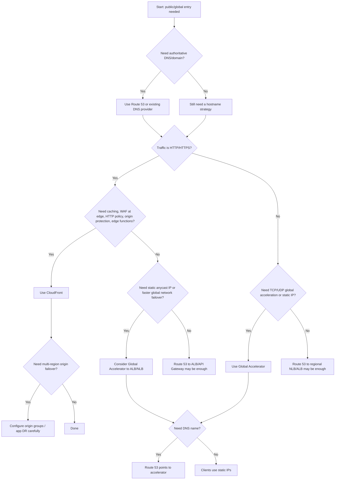

The final architecture can combine services, but each must have a crisp job.

---

## 14. Practical Review Checklist

Before approving a design, ask these questions.

### DNS

- Who owns the hosted zone?
- What is the TTL?
- Are records alias/CNAME/A/AAAA?
- Is failover DNS-level or app/network-level?
- Are health checks checking real user-critical dependencies?
- Are private and public zones overlapping?
- Is there a rollback plan for DNS mistakes?

### CloudFront

- What is cacheable?
- What is the cache key?
- Which headers/cookies/query strings reach origin?
- Is WAF attached at the right scope?
- Is origin protected from direct bypass?
- Are invalidations minimized by versioned assets?
- Are logs sufficient for incident response?
- Are error responses and origin failover defined?

### Global Accelerator

- Why do we need static anycast IP?
- Which endpoint types are used?
- What are endpoint groups per Region?
- What are traffic dials and endpoint weights?
- What health checks determine routing?
- Does client affinity matter?
- How will failover be tested?
- What app state assumptions exist across Regions?

### Application

- Are sessions stateless or sticky?
- Can client reconnect safely?
- Is data replicated across Regions?
- Are writes allowed in multiple Regions?
- Is DR manual, semi-auto, or automatic?
- Does routing policy match data consistency policy?

Routing users globally is not only networking. It is distributed systems design.

---

## 15. Case Study: Public Case Management Platform

Assume a regulatory case management platform has:

- public portal for external parties;
- internal API for officers;
- document download;
- real-time notification channel;
- active/passive DR;
- strong audit requirement;
- no tolerance for bypassing WAF on public app.

A clean design may be:

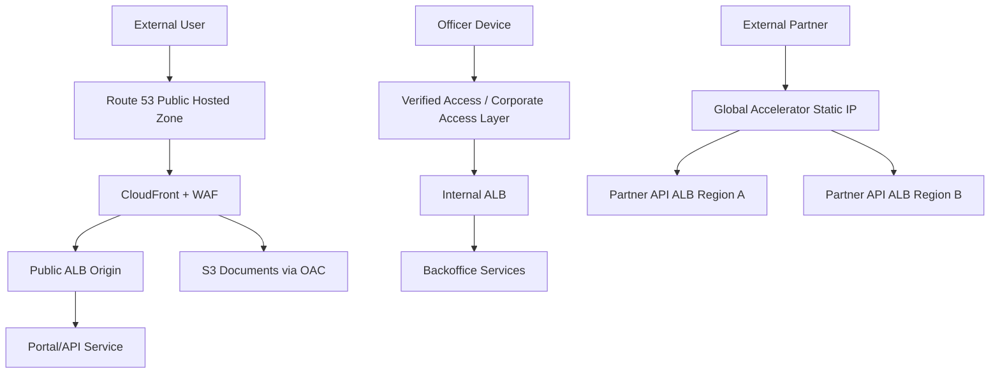

Why not one front door?

Because the traffic classes differ:

- public portal needs HTTP edge security and cache;
- internal officer app needs identity/device-aware access;
- partner API needs static IP and controlled global failover;
- document download benefits from CloudFront + S3;
- DNS owns names for all of them.

The best architecture is not the one with the fewest AWS icons. It is the one where every traffic class has the right boundary.

---

## 16. Final Mental Model

Route 53, CloudFront, and Global Accelerator form a stack of possible global entry decisions:

```text
Name decision       -> Route 53
HTTP edge decision  -> CloudFront
Network entry flow  -> Global Accelerator
Regional balancing  -> ALB/NLB
Target selection    -> target group / service mesh / app
Business routing    -> application logic
```

Do not collapse these into one vague phrase like “global routing”.

A top-tier engineer separates:

- DNS resolution;
- edge termination;
- cache behavior;
- network path selection;
- health detection;
- session stickiness;
- regional failover;
- data consistency;
- rollback control.

When those boundaries are explicit, the right service choice becomes obvious.

---

## 17. References

- AWS Decision Guide: Choosing an AWS networking and content delivery service.
- Amazon Route 53 Developer Guide: Routing policies and routing traffic to AWS Global Accelerator.
- AWS Global Accelerator Developer Guide: How AWS Global Accelerator works, endpoint groups, traffic dials, endpoint weights, DNS addressing.
- Amazon CloudFront Developer Guide: What is CloudFront, origins, cache behaviors, custom origin request/response behavior, Origin Shield.
- AWS Fault Isolation Boundaries whitepaper: points of presence and global edge service guidance.
