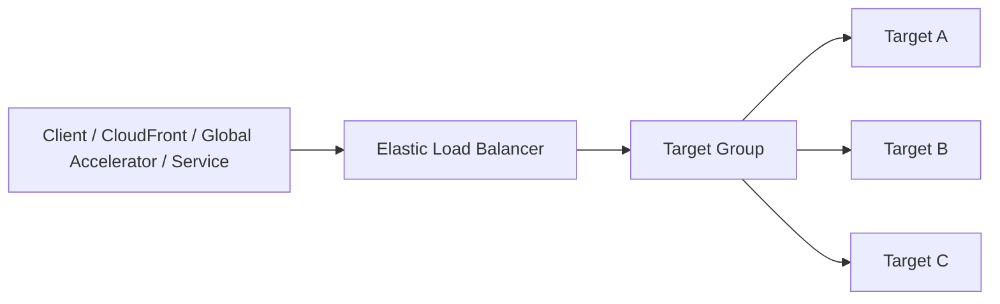
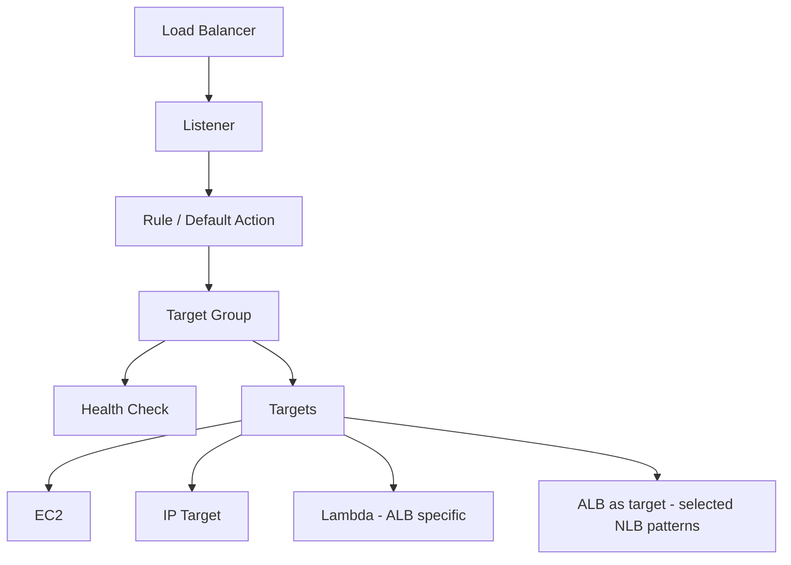
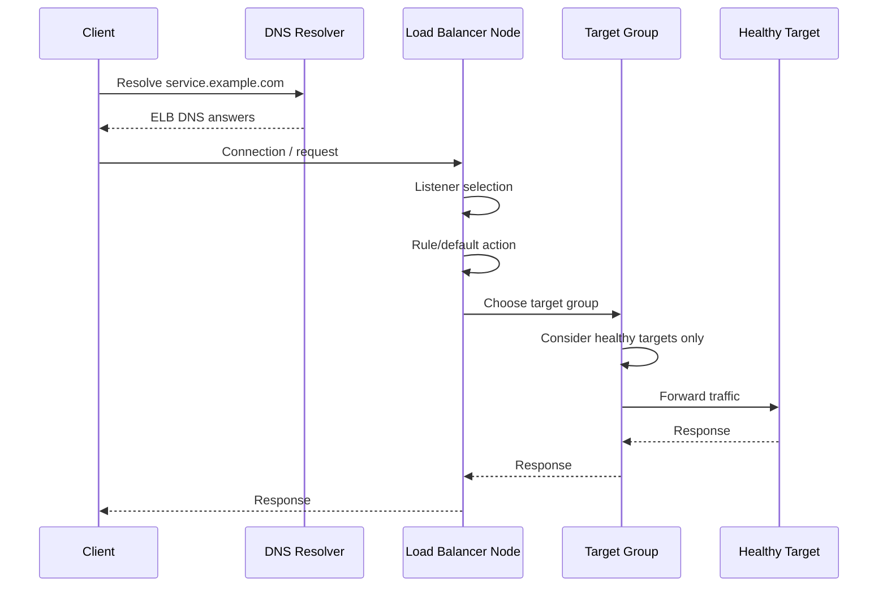
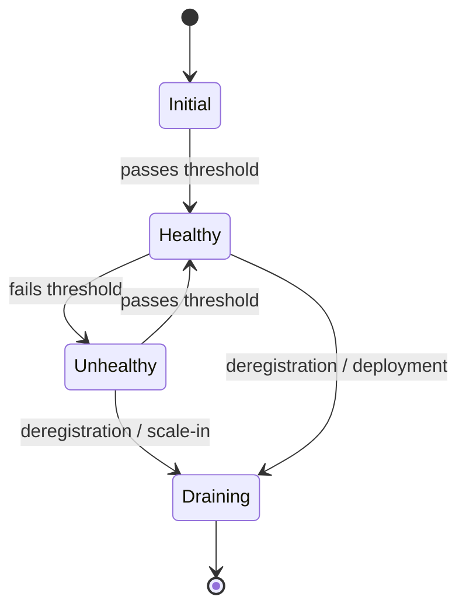
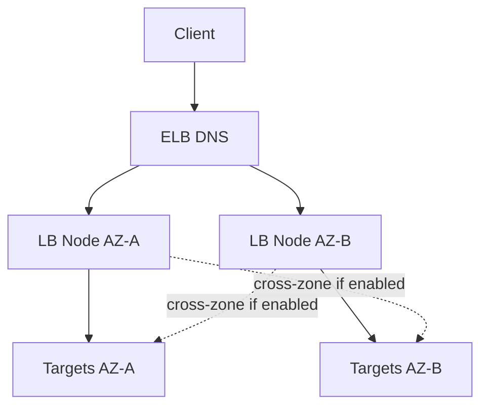
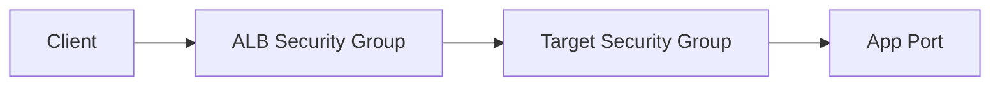
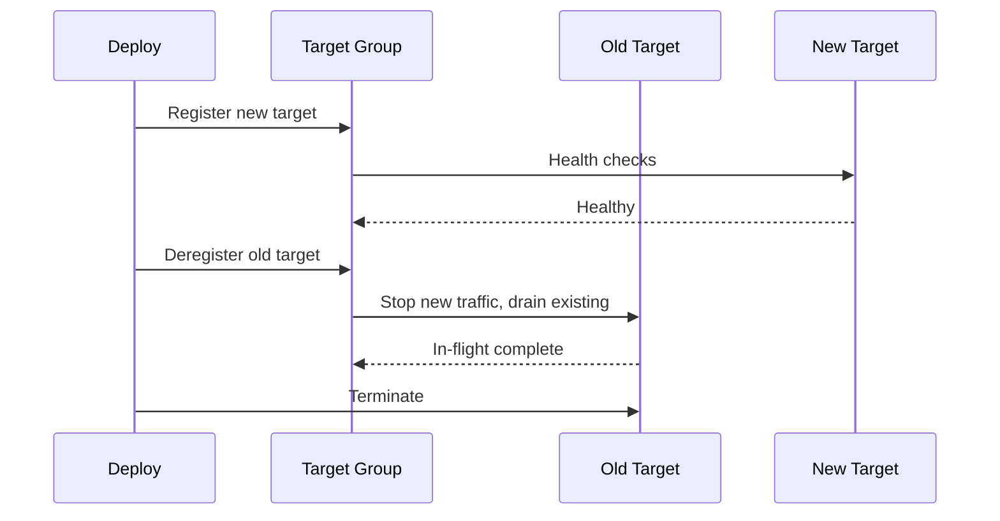
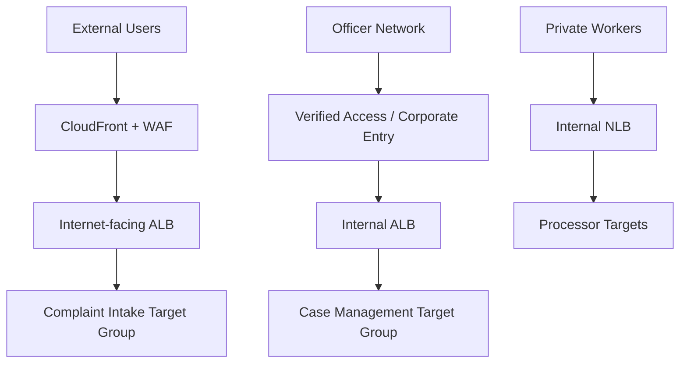

# Part 048 — Elastic Load Balancing Mental Model

Elastic Load Balancing sering terlihat sederhana:

> “Taruh load balancer di depan service.”

Di sistem produksi, kalimat itu terlalu dangkal.

Load balancer adalah **traffic control point**. Ia bukan hanya membagi request. Ia memutuskan boundary TLS, health semantics, connection lifecycle, zonal resilience, observability, security exposure, cost profile, and failure blast radius.

Part ini membangun mental model umum sebelum kita membahas ALB, NLB, dan Gateway Load Balancer satu per satu.

---

## 1. Load Balancer sebagai Contract, bukan Hanya Distributor

Load balancer punya dua sisi:

```text
client side  ->  load balancer  ->  target side
```

Di sisi client, load balancer adalah endpoint stabil.

Di sisi target, load balancer adalah traffic scheduler.



Load balancer menyembunyikan perubahan target:

- instance scaling;
- container replacement;
- pod churn;
- deployment;
- AZ failure;
- unhealthy target;
- target port changes;
- service migration.

Dari sisi client, alamat tetap relatif stabil.

Dari sisi platform, target bisa berubah terus.

Inilah kontrak utama ELB:

> Clients should know the service entry point, not the lifecycle of every backend instance.

---

## 2. ELB Family

AWS modern ELB family biasanya dibaca sebagai tiga jenis utama:

| Type | Layer mental model | Primary use case |
|---|---:|---|
| Application Load Balancer | L7 HTTP/HTTPS/gRPC/WebSocket | Web apps, APIs, host/path routing, auth/WAF integration |
| Network Load Balancer | L4 TCP/UDP/TLS | High-performance TCP/UDP, static IP, source IP preservation, PrivateLink provider |
| Gateway Load Balancer | L3/L4 transparent appliance insertion | Firewalls, IDS/IPS, network inspection appliances |

Classic Load Balancer exists mostly for legacy workloads. Untuk desain baru, pilih ALB/NLB/GWLB sesuai layer.

---

## 3. Core Objects

ELB mental model dibangun dari beberapa objek:



### 3.1 Load balancer

Load balancer adalah public/internal endpoint yang menerima traffic.

Ia punya:

- scheme: internet-facing atau internal;
- subnets/AZs;
- security groups for ALB/GWLB style patterns where applicable;
- IP address type;
- DNS name;
- attributes;
- logs/metrics;
- listener configuration.

### 3.2 Listener

Listener adalah port/protocol tempat load balancer menerima traffic.

Contoh:

```text
HTTPS :443
HTTP  :80
TCP   :443
UDP   :53
TLS   :443
```

Listener menjawab:

> “Traffic di port/protocol ini diproses bagaimana?”

### 3.3 Listener rule

Rule menentukan forwarding behavior.

Untuk ALB, rule bisa berdasarkan:

- host header;
- path pattern;
- HTTP method;
- source IP;
- header;
- query string;
- default action;
- redirect/fixed response/auth/forward.

Untuk NLB, rule model jauh lebih sederhana karena NLB bekerja pada transport layer.

### 3.4 Target group

Target group adalah kumpulan backend target yang menerima traffic.

Ia punya:

- protocol;
- port;
- target type;
- health check;
- deregistration delay;
- stickiness attributes where applicable;
- slow start where applicable;
- load balancing algorithm where applicable.

Target group adalah boundary health dan deployment yang sangat penting.

### 3.5 Target

Target adalah backend konkret.

Target bisa berupa:

- EC2 instance;
- IP address;
- Lambda function for ALB;
- ALB as target for selected NLB use cases;
- appliance endpoint depending GWLB model.

Target type memengaruhi routing, scaling, security, and observability.

---

## 4. Request Path: Generic ELB



The target does not receive traffic just because it exists. It receives traffic when:

1. it is registered;
2. target group health check marks it healthy;
3. listener/rule sends traffic to that target group;
4. network controls allow the path;
5. protocol/port match;
6. application responds correctly.

---

## 5. Layer Matters

The biggest ELB design mistakes happen when engineers choose the wrong layer.

### 5.1 L7 thinking: ALB

ALB understands HTTP semantics.

It can reason about:

- host;
- path;
- headers;
- query string;
- HTTP methods;
- response status;
- redirects;
- authentication actions;
- gRPC over HTTP/2;
- WebSocket upgrade;
- HTTP health endpoint.

ALB is a good application router.

### 5.2 L4 thinking: NLB

NLB mostly sees flows, not HTTP routes.

It is useful when you need:

- TCP/UDP/TLS;
- high throughput;
- very low latency;
- source IP preservation;
- static IP per AZ / Elastic IP;
- PrivateLink endpoint service provider;
- TLS passthrough-ish designs;
- non-HTTP protocols.

NLB is a good transport entry point.

### 5.3 Transparent appliance thinking: GWLB

GWLB exists for a different problem:

> “How do I insert a fleet of network appliances into the traffic path without making every workload know about them?”

It uses a transparent bump-in-the-wire pattern with GENEVE encapsulation.

Use GWLB for:

- firewall appliances;
- IDS/IPS;
- deep packet inspection;
- centralized inspection VPC;
- third-party security appliances.

GWLB is not a general web/API load balancer.

---

## 6. Health Checks Are Routing Policy

Health checks are not monitoring only. They are routing policy.

If a target fails health checks, it is removed from load balancing rotation.

That means health check design directly affects availability.



A good health check answers:

> “Can this target safely handle user traffic now?”

A bad health check answers:

> “Is the process alive?”

Those are not the same.

### 6.1 Health check should be cheap but meaningful

Bad:

```text
GET /health -> returns 200 if process is alive
```

Better:

```text
GET /ready -> returns 200 only if app can serve traffic
```

But do not make health checks too expensive.

Avoid health check logic that performs full database writes, external API calls, or heavy dependency fanout every few seconds. That can create self-inflicted outages.

### 6.2 Liveness vs readiness

For load balancers, readiness is usually more important than liveness.

- Liveness: process exists.
- Readiness: process can receive traffic.

During deployment, a target may be live but not ready:

- cache warming;
- DB migration lock;
- connection pool initialization;
- dependency discovery;
- configuration load;
- JIT/warmup;
- graceful startup.

Do not send user traffic just because the process started.

### 6.3 Dependency-aware health checks

Health checks should include dependencies only when dependency failure means the target cannot serve meaningful traffic.

If every target checks the same shared database and marks itself unhealthy during DB outage, the load balancer will have no healthy targets. That may be correct, but know the behavior.

Sometimes the better model is:

- target stays healthy;
- app returns graceful degraded response;
- circuit breaker handles dependency;
- observability alerts humans;
- load balancer does not churn all targets.

Health checks are not a substitute for application resilience.

---

## 7. Zonal Model

ELB is regional, but it operates through nodes/subnets in Availability Zones.

A typical internet-facing ALB uses subnets in multiple AZs.



Important questions:

- Which AZs are enabled on the load balancer?
- Are targets registered in each AZ?
- Is cross-zone load balancing enabled?
- What happens if one AZ has no healthy targets?
- Are NAT, routing, and backend dependencies AZ-aligned?
- Are clients hitting LB nodes in an AZ that has no usable targets?

Zonal design is where many “ELB is down” incidents are actually target/subnet/routing mistakes.

---

## 8. Cross-Zone Load Balancing

Cross-zone load balancing lets load balancer nodes distribute traffic across targets in enabled AZs, not only local-AZ targets.

This can improve balancing when target count is uneven.

But it has trade-offs:

- possible cross-AZ data transfer cost depending service/config;
- different behavior across ALB/NLB/GWLB defaults and attributes;
- can mask zonal imbalance;
- can increase dependency on inter-AZ paths;
- may affect failure containment.

Think of cross-zone as a policy:

> Should traffic entering AZ-A be allowed to reach targets in AZ-B?

There is no universal answer.

For application HA, cross-zone often simplifies behavior.

For strict zonal isolation and cost control, you may choose differently, especially with NLB patterns.

---

## 9. Connection Lifecycle

Load balancers manage connections, not only requests.

Key concepts:

- TCP handshake;
- TLS handshake;
- HTTP keep-alive;
- idle timeout;
- deregistration delay;
- target draining;
- WebSocket long-lived connections;
- HTTP/2 multiplexing;
- UDP flow tracking;
- client reconnect behavior.

### 9.1 Idle timeout

If idle timeout is too short:

- clients see connection resets;
- long polling breaks;
- WebSocket disconnects;
- gRPC streams fail;
- uploads/downloads may be interrupted depending behavior.

If idle timeout is too long:

- dead connections accumulate;
- resource usage increases;
- deploy draining takes longer;
- failover may feel slow.

Set idle timeout based on protocol, not default habit.

### 9.2 Deregistration delay

When target is removed, load balancer can keep existing in-flight requests for a delay before stopping traffic completely.

Deployment correctness depends on this.

A good deployment choreography:

1. mark target draining;
2. stop new traffic;
3. allow in-flight requests to finish;
4. app stops accepting new work;
5. terminate after graceful window;
6. verify no long-lived sessions break unexpectedly.

Bad deployment:

```text
kill process immediately -> load balancer still has client connections -> 5xx spike
```

### 9.3 Keep-alive and load distribution

With HTTP keep-alive or HTTP/2, load distribution is not always per request in the naive sense.

A small number of long-lived client connections can create uneven target load.

For high-volume services, inspect:

- connection count;
- request count;
- target response time;
- target connection errors;
- load balancer 5xx vs target 5xx;
- client-side retry behavior.

---

## 10. TLS Boundary

TLS placement is one of the most important ELB design choices.

Options:

### 10.1 TLS termination at load balancer

```text
Client --HTTPS--> ALB --HTTP--> Target
```

Pros:

- centralized certificate management with ACM;
- listener rules can inspect HTTP;
- WAF/auth integration easier;
- simpler target configuration;
- offload TLS work from app.

Cons:

- traffic inside VPC is plaintext unless re-encrypted;
- app cannot see raw TLS client certificate unless propagated intentionally;
- compliance may require end-to-end encryption.

### 10.2 TLS termination and re-encryption

```text
Client --HTTPS--> ALB --HTTPS--> Target
```

Pros:

- L7 features remain available;
- target-side encryption;
- better compliance posture.

Cons:

- certificate/trust management on targets;
- more operational overhead;
- health checks must align with HTTPS.

### 10.3 TLS passthrough / transport-level TLS

```text
Client --TLS--> NLB --TLS--> Target
```

Pros:

- app controls TLS;
- useful for mTLS or non-HTTP TLS protocols;
- source IP preservation possible with NLB.

Cons:

- load balancer cannot inspect HTTP paths;
- no L7 routing;
- WAF at ALB/CloudFront layer not available on that raw flow.

The TLS boundary decides what the load balancer can understand.

---

## 11. Security Group and NACL Path

ELB connectivity failures often come from security path mistakes.

For ALB:



Typical rule:

```text
ALB SG inbound: 443 from allowed clients / CloudFront / internet as needed
Target SG inbound: app port from ALB SG
```

This SG reference pattern is stronger than allowing broad CIDRs.

For NLB, source IP preservation and SG support differ by configuration and type. Think carefully about whether target sees original client IP or load balancer node IP, and adjust SG/NACL accordingly.

NACL reminders:

- stateless;
- allow return ephemeral ports;
- subnet-level;
- easy to break health checks;
- useful as coarse guardrail, not primary app policy.

---

## 12. Public vs Internal Load Balancers

### Internet-facing

Use when clients from internet must connect directly or through another public edge service.

Examples:

- public web app;
- public API;
- CloudFront origin ALB;
- Global Accelerator endpoint;
- partner-facing endpoint.

### Internal

Use when only VPC/hybrid/internal clients should connect.

Examples:

- service-to-service entry;
- internal admin app;
- private API behind Verified Access;
- ECS/EKS internal ingress;
- shared service in central VPC;
- PrivateLink provider behind NLB.

Do not use internet-facing load balancer because it is easier. Scheme is a security boundary.

---

## 13. DNS and ELB

ELB gives a DNS name. You usually create Route 53 alias records to point friendly domains to it.

Important:

- do not hardcode resolved ELB IPs;
- ELB DNS can return changing addresses;
- use alias records for AWS targets where appropriate;
- public vs private hosted zone must match visibility;
- dual-stack requires IPv6-aware design;
- DNS is not target health at application layer unless integrated through service behavior.

For Global Accelerator, clients may use static IPs or a DNS name pointing to accelerator.

For CloudFront, Route 53 alias typically points to the distribution.

For ELB, Route 53 alias points to the regional load balancer DNS target.

---

## 14. Observability Model

At ELB boundary, errors must be attributed correctly.

### 14.1 Load balancer error vs target error

A 5xx seen by client can originate from:

- load balancer itself;
- target application;
- target connection failure;
- timeout;
- TLS negotiation;
- malformed request;
- deployment/drain;
- security group/NACL/routing break;
- overloaded target.

Separate metrics:

```text
ELB 5xx       -> generated by load balancer
Target 5xx    -> generated by backend target
Target latency -> backend processing/response time
Healthy hosts -> routing pool health
Rejected connections -> capacity/security/transport issues
```

### 14.2 Logs

ALB/NLB/GWLB observability differs, but generally inspect:

- access logs;
- connection logs where available/applicable;
- CloudWatch metrics;
- target group health;
- VPC Flow Logs;
- application logs;
- WAF logs if attached;
- CloudFront/Global Accelerator logs if upstream.

The correct incident question is not:

> “Is the load balancer broken?”

It is:

> “At which hop does the expected state diverge from actual state?”

---

## 15. Failure Modes Catalog

### 15.1 No traffic reaches load balancer

Likely causes:

- DNS wrong;
- security group inbound blocked;
- NACL blocked;
- wrong scheme internal vs internet-facing;
- listener not configured;
- TLS/certificate mismatch;
- client firewall;
- Route 53 record points to old resource.

### 15.2 Load balancer receives traffic, targets see nothing

Likely causes:

- listener rule mismatch;
- default action wrong;
- target group empty;
- no healthy targets;
- target port mismatch;
- target SG blocks load balancer;
- NACL blocks ephemeral return;
- target in disabled AZ;
- routing path broken.

### 15.3 Targets unhealthy

Likely causes:

- health path wrong;
- health port wrong;
- app returns non-success status;
- SG/NACL blocks health check;
- target overloaded;
- dependency check too strict;
- startup time longer than health grace assumptions;
- TLS health check mismatch;
- host header expectation mismatch.

### 15.4 Intermittent 502/503/504

Likely causes:

- deployment kills targets too early;
- target timeout;
- idle timeout mismatch;
- connection pool exhaustion;
- target closes connection unexpectedly;
- app thread pool saturated;
- backend dependency slow;
- cross-zone imbalance;
- client retry storm;
- target group deregistration delay wrong.

### 15.5 Uneven load

Likely causes:

- long-lived connections;
- HTTP/2 multiplexing;
- uneven target registration;
- cross-zone disabled;
- sticky sessions;
- slow targets accumulating work;
- client connection pooling behavior;
- target weights/algorithm config.

---

## 16. Deployment Patterns

### 16.1 Rolling deployment with target draining



Key invariant:

> Never remove capacity before replacement capacity is healthy.

### 16.2 Blue/green with weighted target groups

At L7, ALB can forward to multiple target groups with weights.

Example:

```text
blue target group  = 90%
green target group = 10%
```

Use for controlled rollout.

But remember:

- sticky sessions can affect distribution;
- error budget should gate rollout;
- rollback must be faster than deploy;
- metrics must separate blue vs green;
- schema/data compatibility matters.

### 16.3 Canary via CloudFront/Route 53 vs ALB

Different layer, different meaning:

- Route 53 weighted: DNS answer distribution.
- CloudFront function/header logic: edge request selection.
- ALB weighted target group: request routing at regional load balancer.
- App feature flag: business behavior routing.

Do not confuse them.

---

## 17. Load Balancer Placement in AWS Architectures

### 17.1 CloudFront -> ALB

```text
Users -> Route 53 -> CloudFront -> ALB -> Targets
```

Use when:

- public HTTP;
- edge WAF/cache/TLS required;
- ALB handles app routing;
- origin should be protected.

### 17.2 Global Accelerator -> ALB/NLB

```text
Users -> Global Accelerator -> ALB/NLB -> Targets
```

Use when:

- static IPs;
- global network acceleration;
- TCP/UDP or HTTP without cache needs;
- regional failover by endpoint health.

### 17.3 Internal ALB for service entry

```text
Service A -> internal ALB -> Service B targets
```

Use when:

- HTTP service-to-service;
- host/path routing internal;
- shared backend service;
- no need for public exposure.

But for many microservices, VPC Lattice, service mesh, Cloud Map, or native ECS/EKS service discovery may be a better abstraction. Load balancer per microservice can become expensive and operationally heavy.

### 17.4 NLB for PrivateLink provider

```text
Consumer VPC -> Interface Endpoint -> Endpoint Service -> NLB -> Provider Service
```

NLB is central to many PrivateLink provider patterns.

It exposes a private service without requiring VPC peering or routing between consumer and provider VPCs.

---

## 18. Performance and Scaling Mental Model

ELB is managed and scalable, but design still matters.

Watch:

- sudden traffic spikes;
- long-lived connections;
- TLS handshake rate;
- new connection count;
- active connection count;
- target response time;
- backend capacity;
- security group/NACL limits;
- subnet IP capacity for LB-related resources and targets;
- application thread/connection pools.

Load balancer scalability does not imply target scalability.

A common failure:

```text
ELB can accept traffic
but targets cannot process it
```

The metric that matters is end-to-end successful useful work, not just accepted connections.

---

## 19. Invariants for Production ELB Design

Use these as review rules.

### Invariant 1 — Every load balancer must have a clear layer reason

ALB for HTTP application routing.

NLB for transport/static IP/source IP/high performance/PrivateLink.

GWLB for appliance insertion.

If you cannot state the layer reason, the design is probably accidental.

### Invariant 2 — Health check must match traffic readiness

A target is healthy only if it can safely receive user traffic.

### Invariant 3 — Load balancer security is two-sided

You must control:

- who can reach the load balancer;
- what the load balancer can reach.

### Invariant 4 — Deployment must respect connection lifecycle

Deregistration delay, graceful shutdown, health grace, idle timeout, and app shutdown must align.

### Invariant 5 — Zonal behavior must be intentional

Enabled AZs, target registration, cross-zone behavior, and route dependencies must be designed together.

### Invariant 6 — Observability must separate LB vs target failure

Do not treat every 5xx as an application bug or every timeout as ELB fault. Attribute by hop.

---

## 20. Runbook: Debugging an ELB Path

Use this order.

### Step 1 — Resolve DNS

Check:

```text
service.example.com -> expected ELB/CloudFront/GA target?
```

If DNS is wrong, do not debug target groups yet.

### Step 2 — Verify listener

Check:

- protocol;
- port;
- certificate;
- default action;
- listener rules;
- redirect loops;
- host/path match.

### Step 3 — Verify target group

Check:

- correct target group;
- target type;
- port;
- protocol;
- health check config;
- registered targets;
- target AZs.

### Step 4 — Verify target health reason

Do not just read “unhealthy”. Read the reason.

Common health reason categories:

- timeout;
- connection refused;
- response code mismatch;
- TLS failure;
- target not registered in enabled AZ;
- app not ready.

### Step 5 — Verify network controls

Check:

- load balancer SG inbound;
- target SG inbound from LB SG or correct source;
- NACL both directions;
- route table;
- subnet association;
- internal/internet-facing scheme;
- VPC Flow Logs.

### Step 6 — Verify application behavior

Check:

- app logs;
- access logs;
- dependency latency;
- thread/connection pool;
- CPU/memory;
- deployment timing;
- graceful shutdown.

### Step 7 — Verify upstream edge

If there is CloudFront or Global Accelerator upstream, check:

- origin configuration;
- health checks;
- WAF blocks;
- header forwarding;
- TLS policy;
- timeout settings;
- cache/error behavior.

---

## 21. Case Study: Regulatory Workflow API

Assume we have:

- public complaint intake API;
- internal enforcement case API;
- document processing worker callbacks;
- officer dashboard;
- audit-critical request logging;
- multi-AZ active deployment.

Possible design:



Why multiple load balancers?

Because the traffic contracts differ:

- public intake needs WAF and public HTTP rules;
- officer dashboard needs identity-aware internal access;
- worker callback may need transport-level stable endpoint;
- target groups separate health and deployment blast radius;
- logs/auditing differ by entry point.

A single giant ALB with many rules might work technically, but can become an ownership and blast-radius problem.

---

## 22. Final Mental Model

Elastic Load Balancing is not a box labeled “scale”.

It is a set of contracts:

```text
DNS contract        -> how clients find the entry point
Listener contract   -> which protocol/port is accepted
Routing contract    -> which request/flow goes to which group
Health contract     -> which targets are allowed to receive traffic
Security contract   -> who can talk to whom
Lifecycle contract  -> how deploys/draining behave
Zonal contract      -> how AZ failures are contained
Observability       -> how we prove where failure occurs
```

Once those contracts are explicit, ALB/NLB/GWLB selection becomes straightforward.

The next parts go deeper:

- Part 049: Application Load Balancer Deep Dive.
- Part 050: Network Load Balancer Deep Dive.
- Part 051: Gateway Load Balancer and Appliance Insertion.

---

## 23. References

- Elastic Load Balancing documentation: load balancer types, listeners, target groups, health checks.
- Application Load Balancer User Guide: listeners, rules, target groups, health checks.
- Network Load Balancer User Guide: TCP/UDP/TLS listeners, target groups, source IP, static IP patterns.
- Gateway Load Balancer User Guide: appliance insertion and GENEVE-based forwarding.
- Amazon Route 53, CloudFront, and Global Accelerator documentation for upstream front-door integrations.
