# Part 049 — Application Load Balancer Deep Dive

Application Load Balancer sering dipilih karena “support HTTP”. Itu benar, tapi belum cukup.

ALB adalah **managed L7 reverse proxy**. Ia menerima HTTP/HTTPS di sisi client, mengevaluasi request content, memilih target group, membuka koneksi ke target, dan memberi kita control point untuk TLS, routing, auth, observability, dan deployment.

Mental model yang salah:

> ALB = load balancer web app.

Mental model yang lebih berguna:

> ALB = programmable HTTP entry contract untuk service yang identitas traffic-nya bisa dibaca dari request.

Kalau keputusan routing membutuhkan host, path, header, method, query string, gRPC service/method, cookie, authentication context, atau TLS boundary, ALB biasanya kandidat utama.

---

## 1. Posisi ALB dalam Arsitektur AWS

ALB berada di layer aplikasi.

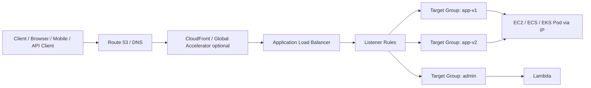

ALB tidak sekadar meneruskan TCP stream. Ia memahami HTTP.

Karena itu ALB bisa melakukan:

- host-based routing;
- path-based routing;
- header-based routing;
- HTTP method routing;
- query string routing;
- redirect;
- fixed response;
- weighted forwarding;
- TLS termination;
- OIDC/Cognito authentication;
- mTLS client certificate handling;
- request logging;
- WebSocket forwarding;
- HTTP/2 dan gRPC traffic handling.

Namun kemampuan itu juga berarti ALB punya batas:

- bukan pilihan tepat untuk protocol non-HTTP;
- bukan transparent pass-through proxy untuk arbitrary TCP;
- tidak mempertahankan source IP sebagai packet source ke target seperti NLB;
- memperkenalkan HTTP semantics seperti headers, idle timeout, desync protection, dan status code dari load balancer.

---

## 2. Kapan ALB adalah Pilihan yang Benar

Pakai ALB ketika traffic contract berbentuk aplikasi web/API.

| Requirement | ALB cocok? | Reasoning |
|---|---:|---|
| HTTP/HTTPS API | Ya | ALB memahami HTTP request dan bisa routing berdasarkan content. |
| Host/path routing multi-service | Ya | Native listener rule. |
| TLS termination terpusat | Ya | Integrasi ACM dan listener HTTPS. |
| WebSocket | Ya | ALB mendukung WebSocket pada listener HTTP/HTTPS. |
| gRPC | Ya | ALB dapat digunakan untuk gRPC dengan konfigurasi protocol version target group. |
| OIDC/Cognito auth di edge aplikasi | Ya | Listener action dapat authenticate sebelum forward. |
| Static IP publik | Tidak ideal | Gunakan Global Accelerator di depan ALB atau NLB bila static IP wajib. |
| TCP custom protocol | Tidak | Gunakan NLB. |
| UDP | Tidak | Gunakan NLB. |
| Preserve original source IP sebagai packet source | Tidak | ALB menambahkan `X-Forwarded-For`; target melihat IP ALB sebagai peer. |
| PrivateLink provider endpoint | Tidak langsung | Umumnya NLB dipakai sebagai endpoint service front. |
| Appliance insertion transparent | Tidak | Gunakan Gateway Load Balancer. |

Rule of thumb:

> Kalau kamu perlu membaca HTTP request untuk membuat keputusan routing, mulai dari ALB.

---

## 3. Object Model ALB

ALB bukan satu object saja.

Ia terdiri dari beberapa contract:

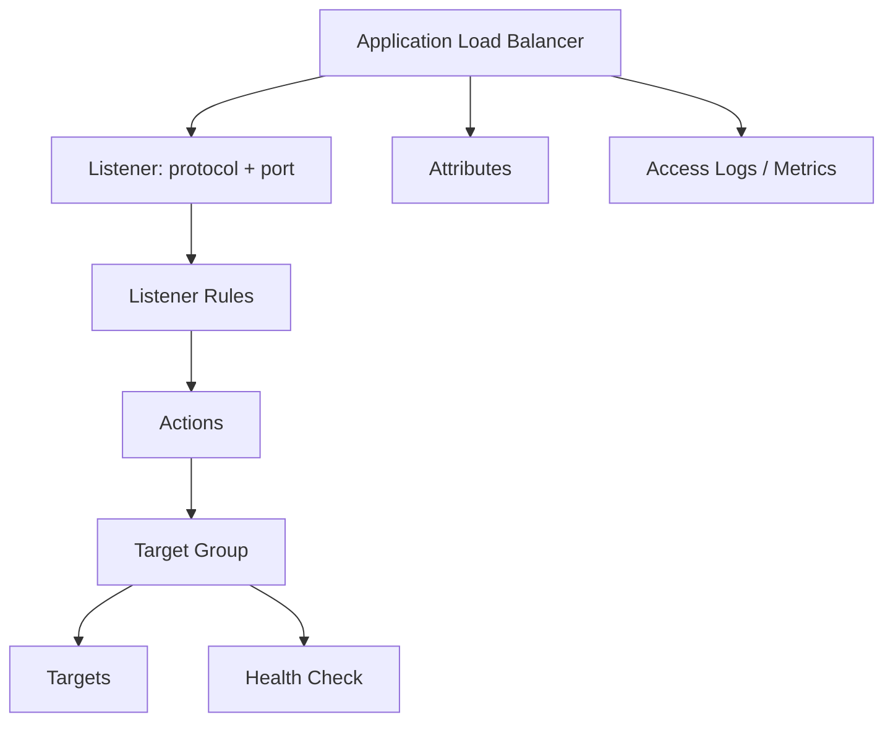

Terminologi yang harus presisi:

| Object | Makna |
|---|---|
| Load balancer | Endpoint managed yang menerima traffic. |
| Listener | Protocol + port yang diterima ALB, misalnya HTTPS:443. |
| Rule | Evaluasi condition/action berdasarkan prioritas. |
| Condition | Host/path/header/method/query/source IP/gRPC condition. |
| Action | Forward, redirect, fixed response, authenticate. |
| Target group | Set target dengan health check dan protocol contract. |
| Target | EC2 instance, IP, Lambda, atau target lain sesuai tipe target. |
| Health check | Definisi “target layak menerima traffic”. |
| Attribute | Behavior seperti idle timeout, deletion protection, access logs. |

ALB yang sehat secara arsitektur biasanya tidak punya rule sembarangan. Rule adalah API contract.

---

## 4. Request Path di ALB

Request ALB biasanya berjalan seperti ini:

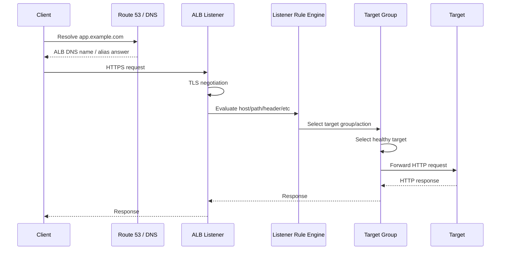

Beberapa hal penting:

- DNS hanya membawa client ke ALB.
- Listener menerima koneksi.
- Rule menentukan action.
- Target group menentukan target yang eligible.
- Health check memengaruhi target eligibility.
- Security Group/NACL/routing tetap harus benar.
- Target tetap harus memahami header forwarding dari ALB.

Kalau request gagal, jangan langsung menyalahkan app.

Pertanyaan debugging pertama:

```text
Apakah failure terjadi sebelum ALB, di ALB, antara ALB-target, atau di aplikasi?
```

---

## 5. Internet-Facing vs Internal ALB

ALB punya scheme:

| Scheme | Makna |
|---|---|
| Internet-facing | ALB memiliki public-facing entry dan dipakai dari internet. |
| Internal | ALB hanya punya private IP dan dipakai dari dalam VPC/network terhubung. |

Internet-facing ALB umum untuk public API/web app.

Internal ALB umum untuk:

- service internal antar VPC via routing/TGW;
- private app di balik Verified Access;
- admin dashboard;
- backend API yang hanya dipanggil CloudFront origin dengan protection tertentu;
- service mesh-like ingress untuk workload internal.

Desain yang rapi sering punya beberapa ALB berdasarkan entry contract:

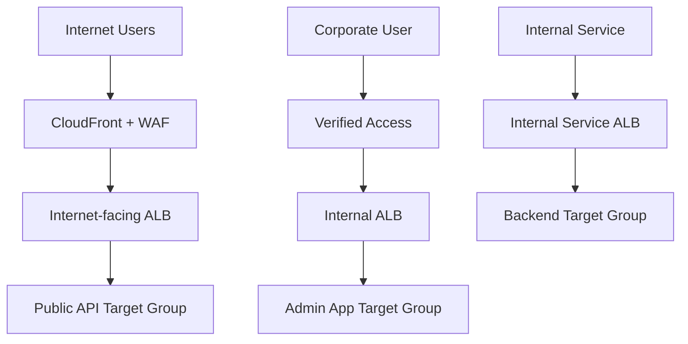

Jangan memaksa semua entry point masuk satu ALB kalau ownership, security, logging, dan blast radius berbeda.

---

## 6. Subnet dan Availability Zone Placement

ALB ditempatkan pada subnet di beberapa AZ.

Prinsipnya:

- pilih minimal dua AZ untuk high availability;
- internet-facing ALB ditempatkan pada subnet dengan route ke Internet Gateway;
- internal ALB ditempatkan pada subnet private/internal sesuai access path;
- target tidak harus berada di subnet yang sama, tetapi network path harus valid;
- Security Group target harus mengizinkan traffic dari Security Group ALB, bukan dari seluruh CIDR.

Pattern umum:

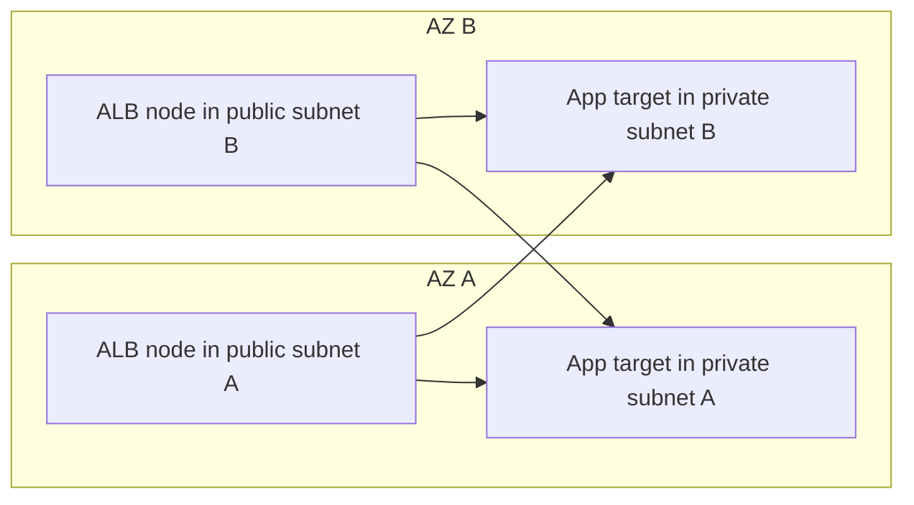

Dengan cross-zone routing aktif, ALB dapat mengirim traffic ke target sehat lintas AZ.

Desain produksi harus eksplisit:

- apakah traffic lintas AZ diterima dari sisi cost/latency?
- apakah service masih benar jika satu AZ kehilangan target?
- apakah target group memiliki minimum healthy target per AZ?
- apakah deployment per AZ aman?

---

## 7. Security Group Pattern untuk ALB

ALB punya Security Group.

Target juga punya Security Group.

Pattern paling aman:

```text
Client/Edge allowed -> ALB SG
ALB SG allowed -> Target SG
```

Contoh:

| Resource | Inbound rule |
|---|---|
| Public ALB SG | `443` from CloudFront managed prefix list atau internet sesuai kebutuhan. |
| App Target SG | `8080` from ALB SG only. |
| Admin ALB SG | `443` from Verified Access / corporate range. |
| Admin Target SG | `8080` from Admin ALB SG only. |

Anti-pattern:

```text
Target SG allows 0.0.0.0/0:8080 because "it is behind ALB".
```

Kalau target terbuka langsung, ALB bukan lagi enforcement point.

---

## 8. Listener: Protocol, Port, and TLS Boundary

Listener adalah pintu masuk ALB.

Contoh umum:

```text
HTTP  :80  -> redirect to HTTPS
HTTPS :443 -> authenticate/route/forward
```

Listener HTTPS memerlukan certificate, biasanya dari ACM.

TLS boundary punya beberapa pilihan:

| Pattern | Client -> ALB | ALB -> Target | Kapan dipakai |
|---|---|---|---|
| TLS termination | HTTPS | HTTP | Banyak web app internal. Simple dan murah operasional. |
| TLS re-encryption | HTTPS | HTTPS | Compliance/internal encryption requirement. |
| mTLS at ALB | mTLS | HTTP/HTTPS | Client identity diverifikasi di ALB atau diteruskan ke target. |
| TCP TLS passthrough | Tidak di ALB | Tidak cocok | Gunakan NLB TCP bila target harus terminate TLS langsung tanpa L7 inspection. |

ALB adalah reverse proxy HTTP. Bila listener HTTPS terminate TLS, target tidak melihat TLS session asli dari client.

Target harus memakai header seperti:

- `X-Forwarded-For`;
- `X-Forwarded-Proto`;
- `X-Forwarded-Port`;
- `Host`;
- header mTLS bila passthrough/verify mode mengirim certificate info.

Jangan pakai `request.remoteAddr` di aplikasi sebagai identitas user tanpa memahami bahwa peer target adalah ALB.

---

## 9. Listener Rules: Priority Matters

ALB listener rules dievaluasi berdasarkan priority.

Rule rendah secara nomor dievaluasi lebih dulu.

Struktur rule:

```text
IF conditions match
THEN actions execute
ELSE continue to next rule
```

Contoh:

| Priority | Condition | Action |
|---:|---|---|
| 10 | host = `api.example.com`, path = `/v2/*` | forward to `api-v2-tg` |
| 20 | host = `api.example.com`, path = `/v1/*` | forward to `api-v1-tg` |
| 30 | host = `admin.example.com` | authenticate, then forward to `admin-tg` |
| default | any | fixed response 404 |

Rule default adalah guardrail.

Lebih baik default response explicit `404`/`403` daripada accidentally route ke monolith lama.

---

## 10. Rule Conditions

ALB routing bisa memakai beberapa condition.

| Condition | Use case |
|---|---|
| Host header | Multi-domain routing. |
| Path pattern | API versioning, app segmentation. |
| HTTP header | Canary, tenant routing, feature flag, internal marker. |
| HTTP method | Pisahkan read/write path jika memang perlu. |
| Query string | Legacy routing, controlled experiment. |
| Source IP | Guardrail coarse-grained; bukan primary auth. |
| gRPC request | Routing berdasarkan service/method pada gRPC workloads. |

Penting:

> Rule condition adalah routing mechanism, bukan full authorization model.

Contoh buruk:

```text
source-ip = corporate CIDR -> admin app
```

Ini mungkin guardrail tambahan, tapi tidak cukup sebagai autentikasi user.

Contoh lebih baik:

```text
source-ip guardrail + OIDC authentication + application authorization
```

---

## 11. Rule Actions

Action utama ALB:

| Action | Fungsi |
|---|---|
| Forward | Kirim request ke satu atau beberapa target group. |
| Redirect | Redirect HTTP ke HTTPS atau path/domain baru. |
| Fixed response | Return status/body statis dari ALB. |
| Authenticate | Authenticate via Cognito atau OIDC sebelum forward. |

Weighted forward bisa dipakai untuk deployment:

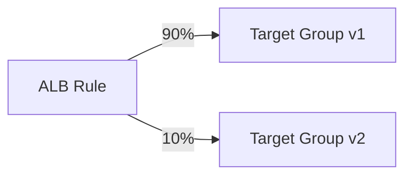

Namun jangan mengira weighted forward adalah deployment platform lengkap.

Hal yang tetap harus diurus:

- observability per version;
- rollback rule update;
- session stickiness effect;
- long-lived connections;
- migration compatibility;
- database/schema compatibility;
- cache behavior di depan ALB.

---

## 12. Target Group sebagai Health dan Deployment Boundary

Target group adalah boundary penting.

Ia menentukan:

- protocol ke target;
- port ke target;
- target type;
- health check;
- deregistration delay;
- stickiness;
- load balancing algorithm/behavior tertentu;
- target health status;
- deployment unit.

Target group bukan hanya daftar server.

Ia adalah definisi:

```text
Request seperti apa yang boleh dikirim ke kelompok backend ini, dan kapan backend dianggap aman menerima traffic?
```

Target group yang terlalu besar mencampur failure domain.

Contoh buruk:

```text
one-target-group-for-all-apps
```

Efeknya:

- health check sulit representatif;
- satu service lambat memengaruhi interpretasi semua target;
- deployment tidak terisolasi;
- rollback lebih berisiko;
- ownership kabur.

---

## 13. Target Types

ALB target group mendukung beberapa target type.

| Target type | Use case |
|---|---|
| Instance | EC2 instance by instance ID; traffic ke primary private IP/port. |
| IP | IP address target; umum untuk ECS awsvpc, EKS pods/services, cross-VPC private IP dengan routing valid. |
| Lambda | ALB sebagai HTTP front door untuk Lambda. |

Instance target cocok untuk EC2 fleet sederhana.

IP target cocok untuk containerized workloads karena task/pod punya IP sendiri.

Lambda target cocok untuk event/API yang tidak membutuhkan full API Gateway feature set.

Decision point:

```text
Apakah backend lifecycle melekat ke instance atau ke workload IP?
```

Kalau workload ephemeral, IP target biasanya lebih natural.

---

## 14. Health Check Design

Health check adalah kontrak produksi.

Bukan sekadar endpoint `/health`.

Health check harus menjawab pertanyaan:

> Apakah target ini aman menerima request sekarang?

Bukan:

> Apakah prosesnya masih hidup?

Level health check:

| Endpoint | Makna | Risiko |
|---|---|---|
| `/ping` | Process alive | Bisa sehat padahal dependency critical mati. |
| `/ready` | Ready menerima traffic | Lebih cocok untuk ALB. |
| `/health/deep` | Cek dependency | Bisa menyebabkan cascading unhealthy kalau dependency shared flapping. |
| `/startup` | Initial boot health | Cocok untuk warmup, bukan runtime traffic. |

Prinsip:

- health check harus cepat;
- jangan mengakses dependency berat setiap beberapa detik;
- bedakan liveness dan readiness;
- jangan return healthy sebelum cache/config/model siap;
- health check harus stabil saat deploy;
- failure health check harus lebih konservatif daripada false-healthy.

Contoh health endpoint bagus:

```text
GET /ready
- app boot complete
- config loaded
- listener active
- DB connection pool initialized but not necessarily query-heavy every check
- migration compatibility verified
- returns 200 only if safe to receive normal traffic
```

---

## 15. Health Check Failure Modes

Target unhealthy tidak selalu berarti app down.

Kemungkinan:

| Symptom | Kemungkinan |
|---|---|
| All targets unhealthy | SG target tidak allow ALB SG, wrong path/port/protocol, app not listening, NACL return path block. |
| Only one AZ unhealthy | subnet route/NACL/AZ-specific deployment issue. |
| Flapping | timeout terlalu agresif, app overload, slow dependency, GC pause, CPU steal. |
| 502 from ALB | target closed connection, bad response, TLS/backend mismatch. |
| 503 from ALB | no healthy targets atau capacity/routing issue. |
| 504 from ALB | target tidak respond sebelum timeout. |

Runbook singkat:

```text
1. Check target health reason.
2. Confirm target process listening on target port.
3. Test from same VPC/AZ if possible.
4. Validate target SG allows ALB SG.
5. Validate NACL ephemeral return traffic.
6. Validate health path/protocol/status matcher.
7. Check app logs for health check request.
8. Check ALB metrics: TargetResponseTime, HTTPCode_Target_*, HTTPCode_ELB_*.
```

---

## 16. HTTP Headers and Client Identity

ALB modifies/provides headers relevant to backend.

Common headers:

| Header | Meaning |
|---|---|
| `X-Forwarded-For` | Client IP chain. |
| `X-Forwarded-Proto` | Original client protocol, often `https`. |
| `X-Forwarded-Port` | Original listener port. |
| `Host` | Original host header unless modified by upstream. |

Aplikasi harus dikonfigurasi agar percaya proxy yang tepat.

Contoh bug umum:

```text
App generates http:// redirect because it sees backend connection as HTTP.
```

Fix mental model:

```text
External scheme = X-Forwarded-Proto
Backend scheme  = ALB -> target protocol
```

Di Spring Boot, Express, ASP.NET, Rails, dan framework lain, setting trusted proxy/forwarded headers harus eksplisit.

Security warning:

> Jangan percaya `X-Forwarded-For` dari internet kecuali header tersebut datang melalui proxy yang kamu kontrol.

Biasanya ALB berada sebagai first trusted proxy, atau CloudFront/WAF berada sebelum ALB dengan header policy yang dikontrol.

---

## 17. TLS Termination and Certificate Strategy

ALB HTTPS listener memakai certificate.

Pattern:

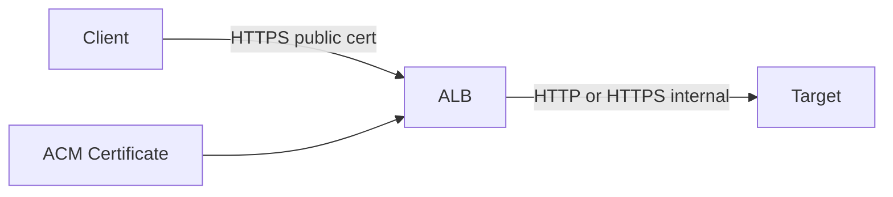

Keputusan penting:

| Decision | Pertanyaan |
|---|---|
| Certificate scope | Apakah satu wildcard cukup atau perlu cert per domain? |
| SNI | Apakah banyak hostname share listener? |
| TLS policy | Minimum TLS version/cipher apa yang diizinkan? |
| Backend encryption | Apakah ALB -> target harus HTTPS? |
| Rotation | Apakah ACM-managed atau imported? |
| Ownership | Siapa pemilik domain/cert/listener? |

TLS termination di ALB menyederhanakan backend.

TLS re-encryption menambah compliance comfort, tetapi jangan menipu diri: kalau target tidak memvalidasi certificate backend dengan benar, tambahan TLS tidak selalu setara dengan strong service identity.

---

## 18. Mutual TLS on ALB

ALB mendukung mutual TLS dalam dua mode besar:

| Mode | ALB behavior | Target responsibility |
|---|---|---|
| Passthrough | ALB menerima client cert dan mengirim certificate chain ke target via headers. | Target memverifikasi/menafsirkan certificate. |
| Verify | ALB memverifikasi X.509 client certificate saat TLS negotiation memakai trust store. | Target memakai hasil/header identity sesuai desain. |

mTLS berguna untuk:

- device identity;
- B2B private API;
- regulated machine-to-machine traffic;
- internal admin endpoint;
- migration dari custom NGINX mTLS ke managed entry point.

Namun mTLS bukan pengganti authorization domain.

Certificate membuktikan identitas cryptographic client.

Aplikasi tetap perlu menjawab:

```text
Client identity ini boleh melakukan aksi apa terhadap resource apa?
```

---

## 19. ALB Authentication: Cognito and OIDC

ALB dapat melakukan authentication action sebelum forward.

Pattern:

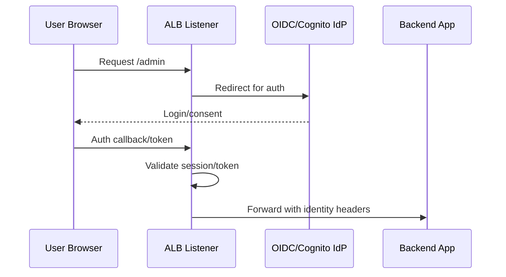

Cocok untuk:

- internal dashboards;
- admin panels;
- low-code/backoffice apps;
- temporary migration path;
- apps yang belum punya auth integration matang.

Tetapi ada batas penting:

- ALB authentication adalah authentication layer, bukan business authorization engine;
- backend harus hanya menerima traffic dari ALB;
- identity headers harus diperlakukan sebagai trusted only if request came from ALB;
- jangan expose target langsung;
- jangan menerima header identity dari client langsung.

Security invariant:

```text
If the app trusts ALB identity headers, the app must be reachable only through that ALB path.
```

---

## 20. WebSocket Through ALB

ALB mendukung WebSocket pada listener HTTP/HTTPS.

Namun WebSocket mengubah failure model:

- koneksi long-lived;
- deployment draining lebih sensitif;
- idle timeout penting;
- target scale-in harus graceful;
- client reconnect behavior penting;
- sticky/session state harus dipikirkan.

Pattern bagus:

```text
WebSocket connection state kept in external store or broker,
not only in local process memory,
unless reconnection loss is acceptable.
```

Checklist:

- idle timeout sesuai heartbeat interval;
- deregistration delay cukup untuk graceful drain;
- target health tidak mematikan node yang masih draining terlalu agresif;
- client punya reconnect + jitter;
- observability menghitung active connection, close code, reconnect rate.

---

## 21. gRPC Through ALB

gRPC memakai HTTP/2.

ALB dapat dipakai untuk routing gRPC traffic ketika target group protocol version dikonfigurasi sesuai.

Perhatikan:

- health check gRPC berbeda dari HTTP biasa;
- path/method semantics berbeda;
- long-lived streaming butuh timeout/drain planning;
- error code gRPC harus dibaca berbeda dari HTTP status biasa;
- client-side load balancing dan retries bisa berinteraksi dengan ALB behavior.

Pattern:

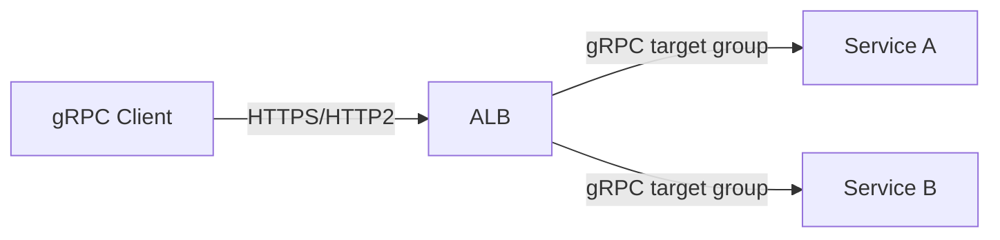

Rule routing untuk gRPC harus diperlakukan seperti API contract, bukan sekadar path string.

---

## 22. Sticky Sessions

ALB target group dapat memakai stickiness.

Stickiness berguna untuk:

- legacy session state;
- cache locality;
- short migration window;
- debugging controlled target.

Tetapi stickiness adalah smell jika dipakai untuk menutupi state management buruk.

Risiko:

- uneven load;
- target failure memaksa session rebalance;
- blue/green weighted deployment jadi kurang prediktif;
- scaling out tidak langsung membantu sticky users;
- user-specific failure sulit terlihat sebagai global metric.

Preferensi untuk sistem modern:

```text
Keep request handlers stateless.
Put session state in durable/shared store.
Use stickiness only when the trade-off is explicit.
```

---

## 23. Deregistration Delay and Draining

Saat target deregister atau unhealthy, ALB tidak seharusnya langsung memutus semua request.

Deregistration delay memberi waktu in-flight request selesai.

Deployment aman butuh koordinasi:

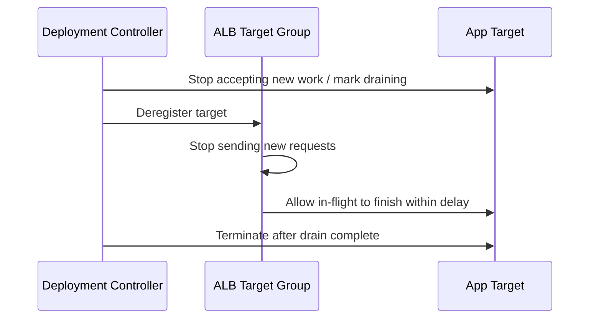

Checklist:

- aplikasi punya graceful shutdown;
- readiness berubah sebelum process kill;
- deregistration delay sesuai p95/p99 request duration;
- long polling/WebSocket/gRPC streaming punya policy khusus;
- deployment controller tidak mematikan target terlalu cepat.

---

## 24. Idle Timeout

ALB idle timeout adalah batas koneksi idle.

Kalau backend atau client keep-alive tidak diselaraskan, muncul error yang terlihat random.

Gejala umum:

- intermittent 502;
- client mendapat connection reset;
- WebSocket disconnect;
- long request terputus;
- proxy upstream/downstream saling menunggu.

Prinsip:

```text
Client timeout > ALB idle timeout > backend server keep-alive timeout
```

Tidak selalu angka persisnya seperti itu untuk semua stack, tapi urutannya harus disengaja.

Untuk long-lived connection:

- gunakan heartbeat;
- set timeout sesuai protocol;
- monitor disconnect reason;
- hindari request synchronous sangat lama bila bisa diganti job async.

---

## 25. ALB Access Logs

Access log ALB adalah sumber kebenaran untuk request-level forensic.

Gunakan untuk menjawab:

- request sampai ke ALB atau tidak?
- rule/target group mana yang dipakai?
- status code dari ALB atau dari target?
- target response time berapa?
- TLS/cipher apa?
- user-agent/client IP apa?
- apakah WAF/CloudFront ada di depan?

Perbedaan penting:

| Metric/log | Makna |
|---|---|
| `HTTPCode_ELB_5XX` | Error di load balancer layer. |
| `HTTPCode_Target_5XX` | Target mengembalikan 5xx. |
| `TargetResponseTime` | Waktu respons target dilihat ALB. |
| `RequestCount` | Request yang diterima ALB. |
| `TargetConnectionErrorCount` | ALB gagal connect ke target. |

Kalau 5xx meningkat, selalu pisahkan:

```text
ELB generated error atau target generated error?
```

Itu menentukan tim mana dan layer mana yang harus debugging.

---

## 26. Common Status Codes dari Perspektif ALB

| Code | Kemungkinan sumber | Interpretasi awal |
|---:|---|---|
| 301/302 | ALB redirect atau app redirect | Cek listener rule dan app. |
| 400 | Client/request malformed atau desync defense | Cek header/request size/protocol. |
| 401/302 | Auth action | Cek OIDC/Cognito flow. |
| 403 | WAF/fixed response/app | Cek WAF logs/rule/default action. |
| 404 | default fixed response atau app | Cek rule matching. |
| 502 | Bad gateway | Target close/reset, TLS mismatch, invalid response. |
| 503 | No healthy targets atau capacity/routing issue | Cek target health. |
| 504 | Gateway timeout | Target too slow or unreachable before timeout. |

Runbook cepat:

```text
1. Is code counted as ELB or Target metric?
2. Does access log include target IP/port?
3. Does target log see the request?
4. Does target health show healthy?
5. Does SG allow ALB SG to target port?
6. Is protocol between ALB and target correct?
7. Are timeout and keep-alive aligned?
```

---

## 27. WAF with ALB

AWS WAF bisa dipasang ke ALB.

Pattern:

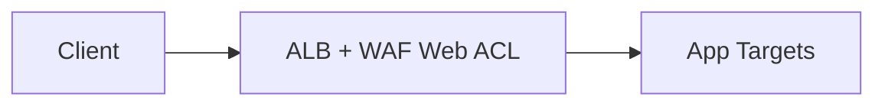

Atau lebih sering untuk public internet:

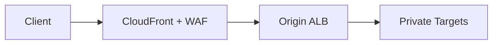

Pilih lokasi WAF berdasarkan edge boundary:

| WAF location | Benefit | Trade-off |
|---|---|---|
| CloudFront | Filter lebih dekat ke user, global edge. | Butuh CloudFront sebagai front door. |
| ALB | Langsung melindungi ALB entry. | Regional, tidak memberi CDN/edge caching. |

Jika CloudFront di depan ALB, lindungi ALB agar tidak bisa di-bypass langsung.

Strategi:

- ALB SG hanya allow CloudFront managed prefix list;
- custom origin header diverifikasi aplikasi/ALB rule bila relevan;
- WAF di CloudFront sebagai primary public filter;
- access logs di dua layer dikorelasikan.

---

## 28. CloudFront + ALB Origin Pattern

CloudFront di depan ALB umum untuk:

- global latency improvement;
- caching static/dynamic partial content;
- WAF at edge;
- TLS/client-facing edge;
- origin shielding;
- path-based routing before origin;
- protect ALB from direct public exposure.

Pattern:

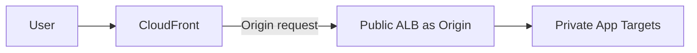

Tapi ini menambah dua proxy layer.

Aplikasi harus paham forwarded headers:

```text
Client -> CloudFront -> ALB -> Target
```

`X-Forwarded-For` menjadi chain, bukan satu IP.

Debugging harus melihat:

- CloudFront standard/real-time logs;
- ALB access logs;
- app logs;
- trace ID/correlation ID;
- WAF logs.

---

## 29. ALB for Microservices

ALB cocok untuk ingress microservices berbasis HTTP.

Pattern sederhana:

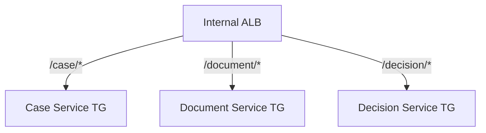

Namun jangan jadikan ALB sebagai service mesh penuh.

ALB bagus untuk:

- ingress HTTP routing;
- coarse service boundary;
- TLS/auth edge;
- deployment target group;
- centralized logs.

ALB kurang cocok untuk:

- per-request dynamic policy antar service kompleks;
- identity propagation mendalam;
- retries/hedging/circuit breaking granular;
- transparent mTLS service-to-service mesh;
- high-cardinality per-tenant routing explosion.

Untuk service-to-service lintas VPC/account, evaluasi VPC Lattice, PrivateLink, Cloud Map, atau service mesh tergantung kebutuhan.

---

## 30. Multi-Tenant Routing Anti-Pattern

ALB rule limit dan manageability bisa menjadi problem jika setiap tenant jadi rule.

Bad idea:

```text
tenant-a.example.com -> target-a
tenant-b.example.com -> target-b
...
tenant-5000.example.com -> target-5000
```

Kecuali jumlah tenant kecil dan benar-benar butuh isolation per target.

Alternatif:

- wildcard host ke shared routing service;
- tenant routing di application layer;
- CloudFront function/Lambda@Edge untuk normalization;
- API Gateway custom domain strategy;
- separate ALB per high-value tenant only;
- service discovery/tenant registry di app.

Rule explosion menciptakan:

- deployment drift;
- quota pressure;
- slow governance;
- debugging sulit;
- ownership kabur;
- blast radius dari listener update.

---

## 31. Blue/Green and Canary with ALB

ALB mendukung weighted target groups.

Contoh:

```text
forward:
  app-blue: 95
  app-green: 5
```

Flow:

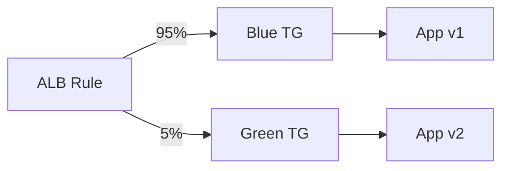

Checklist canary:

- metric per target group;
- logs include version;
- rollback action pre-defined;
- sticky sessions effect dipahami;
- schema backward compatible;
- downstream dependency compatible;
- autoscaling green siap menerima traffic;
- health check green representatif;
- observability melihat error budget, bukan hanya average latency.

Jangan canary hanya berdasarkan `HTTP 200`.

Canary harus melihat:

- p95/p99 latency;
- target 5xx;
- domain error;
- queue depth;
- DB error;
- retry rate;
- CPU/memory saturation;
- business KPI bila relevan.

---

## 32. ALB with ECS/EKS

Untuk ECS `awsvpc` atau EKS, target type IP umum dipakai.

Mental model:

```text
ALB target group -> workload IP:port
```

Bukan:

```text
ALB -> node -> random container magic
```

Untuk EKS dengan AWS Load Balancer Controller:

- Kubernetes Ingress/Service menghasilkan ALB/target group;
- annotations menjadi ALB configuration contract;
- perubahan manifest bisa mengubah AWS resource;
- ownership lintas platform/app team harus jelas.

Risiko:

- annotation sprawl;
- security group auto-management tidak dipahami;
- target group health tidak sama dengan Kubernetes readiness;
- pod termination tidak sinkron dengan target deregistration;
- rule conflict antar Ingress.

Production invariant:

```text
Kubernetes readiness, ALB target health, and pod termination lifecycle must agree.
```

---

## 33. ALB with Lambda Targets

ALB bisa invoke Lambda target.

Kapan berguna:

- simple HTTP endpoint tanpa API Gateway feature kompleks;
- migration dari ALB-based app ke serverless endpoint;
- internal webhook handler;
- small admin operation.

Trade-off:

- API Gateway punya fitur API management lebih kaya;
- payload/response mapping perlu dipahami;
- cold start tetap relevan;
- auth/rate limiting mungkin lebih natural di API Gateway/WAF;
- observability berbeda dari EC2/container target.

Gunakan ALB + Lambda bila ALB memang sudah menjadi front door dan kebutuhan API management sederhana.

---

## 34. ALB and Autoscaling

ALB metrics sering dipakai untuk autoscaling.

Contoh metric:

- RequestCountPerTarget;
- TargetResponseTime;
- HTTPCode_Target_5XX;
- TargetConnectionErrorCount;
- ActiveConnectionCount.

Scaling berdasarkan CPU saja sering terlambat untuk web/API.

Better signal:

```text
desired capacity = function(request_rate_per_target, latency, queue_depth, saturation)
```

Untuk service synchronous:

- RequestCountPerTarget sering lebih dekat ke load;
- p95 latency menunjukkan overload lebih awal;
- 5xx menunjukkan failure sudah terjadi;
- queue/threadpool saturation sering terbaik tapi app-specific.

ALB memberi sinyal entry layer, bukan seluruh kebenaran sistem.

---

## 35. ALB Cost Model

ALB cost biasanya dari:

- load balancer hours;
- Load Balancer Capacity Units atau dimensi kapasitas setara;
- data processing;
- rule evaluations/connection/request dimensions bergantung pricing saat itu;
- WAF bila dipakai;
- cross-zone/inter-AZ data transfer dalam pola tertentu;
- CloudFront/origin traffic bila berada di belakang edge.

Cost trap:

- terlalu banyak ALB untuk service kecil;
- rule explosion;
- high request rate tanpa caching;
- sending static assets through ALB instead of CloudFront/S3;
- chatty internal calls lewat public front door;
- cross-AZ target routing yang tidak disadari;
- duplicate logging tanpa lifecycle policy.

Cost optimization bukan berarti “satu ALB untuk semua”.

Optimization berarti memilih granularity yang tepat antara:

- isolation;
- ownership;
- operational simplicity;
- traffic volume;
- security boundary;
- failure blast radius.

---

## 36. Production ALB Design Checklist

Sebelum deploy ALB produksi, jawab ini:

### Entry Contract

- Domain apa yang masuk ke ALB?
- Apakah ALB internet-facing atau internal?
- Apakah CloudFront/Global Accelerator di depan?
- Apakah direct ALB access perlu dibatasi?

### TLS

- Certificate dari mana?
- Minimum TLS version/cipher policy apa?
- Apakah backend HTTP atau HTTPS?
- Apakah mTLS dibutuhkan?

### Routing

- Rule priority eksplisit?
- Default rule aman?
- Rule explosion dihindari?
- Weighted deployment punya rollback?

### Target

- Target type instance/IP/Lambda?
- Health check representatif?
- Deregistration delay sesuai?
- Target SG hanya allow ALB SG?

### Observability

- Access logs aktif?
- Metrics dashboard dibuat?
- Trace/correlation ID diteruskan?
- WAF logs dikorelasikan bila ada?

### Resilience

- Minimal dua AZ?
- Failure satu AZ dites?
- Scaling target cukup?
- Timeout/keep-alive diselaraskan?

### Security

- WAF perlu?
- Auth di ALB atau app?
- Identity headers trusted only through ALB?
- Target tidak exposed langsung?

---

## 37. Debugging Playbook: Request Fails Behind ALB

Gunakan urutan ini.

### Step 1 — DNS

```bash
nslookup app.example.com
```

Pastikan domain resolve ke ALB/CloudFront/GA sesuai desain.

### Step 2 — TLS

```bash
openssl s_client -connect app.example.com:443 -servername app.example.com
```

Cek certificate, SNI, TLS policy.

### Step 3 — HTTP response from ALB

```bash
curl -vk https://app.example.com/health
```

Perhatikan:

- status code;
- redirect loop;
- response header;
- ALB generated error;
- WAF block.

### Step 4 — Rule matching

Cek listener rules:

- host cocok?
- path cocok?
- priority benar?
- default rule terkena?
- authenticate action redirect?

### Step 5 — Target health

Cek target group health:

- healthy/unhealthy;
- reason code;
- port/protocol;
- health path;
- matcher.

### Step 6 — Network target path

Cek:

- target SG allows ALB SG;
- NACL inbound/outbound;
- target listening port;
- app bound ke `0.0.0.0` atau private IP, bukan localhost;
- route table tidak menghalangi.

### Step 7 — App logs

Apakah request terlihat di app?

- tidak terlihat: masalah sebelum target;
- terlihat dan error: masalah aplikasi/domain;
- terlihat lambat: timeout/capacity/dependency.

---

## 38. Regulatory Case Management Example

Bayangkan platform enforcement lifecycle:

- public complaint intake;
- internal case officer dashboard;
- evidence upload service;
- decision review workflow;
- audit export API;
- integration callback from external agency.

Desain ALB yang rapi:

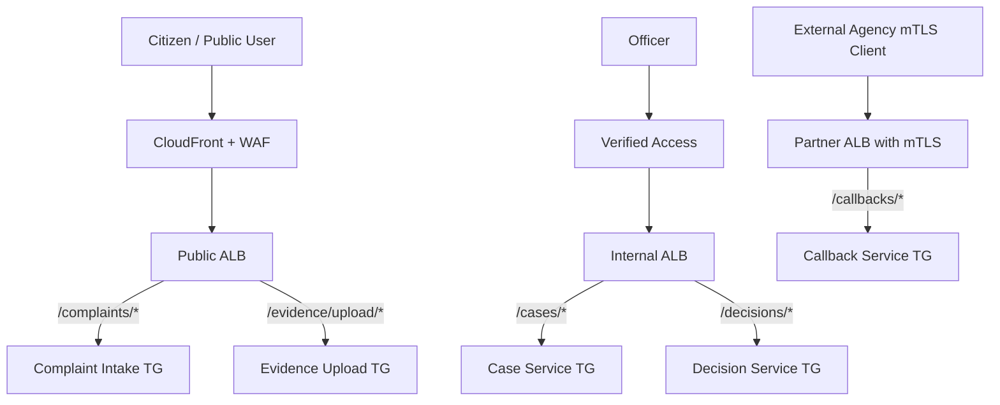

Kenapa dipisah?

- public intake punya threat model berbeda;
- officer dashboard butuh identity-aware access;
- partner callback butuh mTLS/contract khusus;
- evidence upload punya size/timeout/security policy berbeda;
- logs dan audit retention bisa beda;
- deployment blast radius diperkecil.

Satu ALB bisa terlihat hemat, tapi bisa membuat boundary audit kabur.

---

## 39. Anti-Patterns

### Anti-pattern 1 — ALB sebagai authorization layer penuh

ALB bisa authenticate, tapi authorization domain tetap milik aplikasi/policy engine.

### Anti-pattern 2 — Target terbuka langsung

Jika target bisa diakses tanpa ALB, header identity, WAF, auth action, dan routing guardrail bisa dibypass.

### Anti-pattern 3 — Health check terlalu dangkal

`/ping` selalu 200 saat threadpool penuh menghasilkan false healthy.

### Anti-pattern 4 — Health check terlalu berat

Health check yang query dependency berat bisa memperburuk outage.

### Anti-pattern 5 — Rule explosion

Ribuan rule tenant/version/domain membuat ALB sulit dikelola.

### Anti-pattern 6 — No access logs

Tanpa access logs, debugging 502/504 menjadi tebak-tebakan.

### Anti-pattern 7 — Ignoring timeout alignment

Banyak intermittent error berasal dari idle timeout/keep-alive yang tidak selaras.

### Anti-pattern 8 — Trusting forwarded headers from anywhere

Forwarded headers hanya dipercaya jika request path benar-benar melewati trusted proxy.

---

## 40. Final Mental Model

Application Load Balancer adalah HTTP control point.

Ia harus didesain sebagai kontrak:

```text
Domain contract       -> hostname apa yang diterima
TLS contract          -> certificate, policy, mTLS
Routing contract      -> rule priority and action
Auth contract         -> anonymous/authenticated/mTLS/OIDC
Health contract       -> readiness target menerima traffic
Deployment contract   -> blue/green/canary/drain
Security contract     -> only ALB can reach target
Observability contract-> logs/metrics/traces prove path
```

Kalau contract itu jelas, ALB menjadi komponen yang kuat.

Kalau contract itu implicit, ALB berubah menjadi tempat policy acak yang sulit di-debug.

Part berikutnya membahas NLB: lebih rendah layer-nya, lebih sedikit membaca isi request, tetapi sangat penting untuk TCP/UDP/TLS, source IP, static IP, PrivateLink, dan low-latency transport use cases.

---

## 41. References

- AWS Elastic Load Balancing documentation: Application Load Balancer concepts, listeners, listener rules, target groups, health checks, access logs, and attributes.
- AWS Application Load Balancer listener documentation: WebSocket behavior, HTTPS listener configuration, and TLS policies.
- AWS Application Load Balancer listener rules documentation: priority-based rule evaluation, conditions, and actions.
- AWS Application Load Balancer target group documentation: target types, health checks, protocol versions, and target health.
- AWS Application Load Balancer mutual TLS documentation: passthrough and verify modes.
- AWS WAF documentation for ALB association and logging.
