# Part 050 — Network Load Balancer Deep Dive

Network Load Balancer sering dijelaskan sebagai “load balancer layer 4”. Itu benar, tapi belum cukup operasional.

NLB adalah **transport-level entry point** untuk TCP, UDP, TCP_UDP, TLS, dan use case yang membutuhkan static IP, very high throughput, low latency, source IP preservation, atau AWS PrivateLink provider endpoint.

Mental model ALB:

```text
Read HTTP request -> evaluate rule -> forward to target group.
```

Mental model NLB:

```text
Accept network flow -> choose target -> forward transport connection/packet with minimal L7 interpretation.
```

NLB bukan “ALB yang lebih cepat”. Ia memecahkan kelas masalah berbeda.

---

## 1. Posisi NLB dalam Arsitektur AWS

NLB berada di layer transport.

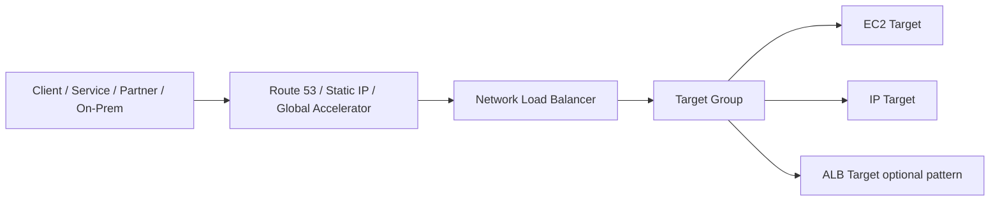

Ia cocok untuk:

- TCP services;
- UDP services;
- TLS listener dengan L4 semantics;
- source IP visibility;
- static IP per AZ atau Elastic IP untuk internet-facing NLB;
- PrivateLink endpoint service provider;
- high connection rate transport workloads;
- protocols yang tidak bisa dipahami ALB.

Ia kurang cocok untuk:

- host/path HTTP routing;
- OIDC/Cognito authentication;
- WAF directly on load balancer;
- request-level HTTP observability;
- header manipulation;
- redirect/fixed response;
- application-layer authorization.

---

## 2. ALB vs NLB: Jangan Salah Pilih Layer

| Requirement | ALB | NLB |
|---|---:|---:|
| HTTP host/path routing | Strong | No |
| TCP custom protocol | No | Strong |
| UDP | No | Strong |
| TLS termination | Strong | Strong, but L4-style |
| Static IP | Not native | Strong |
| Source IP preservation | Via header | Native/attribute-dependent at packet/connection level |
| WebSocket | Strong | TCP pass-through possible, but no HTTP routing |
| gRPC routing | Strong | Pass-through possible, no gRPC-aware routing |
| OIDC/Cognito auth | Strong | No |
| WAF association | Strong | Not direct like ALB/CloudFront |
| PrivateLink provider | No typical | Strong |
| Layer 7 logs | Strong | Limited compared to ALB |
| Protocol transparency | Lower | Higher |

Decision shortcut:

```text
Need to inspect HTTP? ALB.
Need to transport TCP/UDP/TLS with stable IP or PrivateLink? NLB.
Need appliance insertion? GWLB.
```

---

## 3. NLB Object Model

NLB object model mirip ELB family, tetapi semantics-nya berbeda.

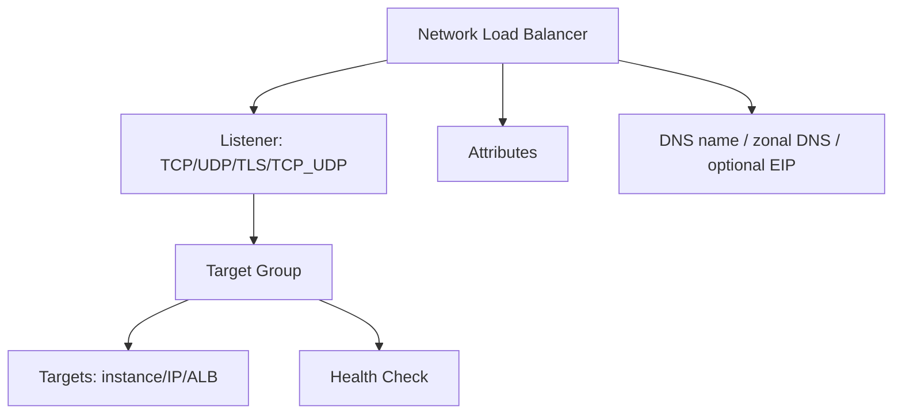

Komponen utama:

| Object | Makna |
|---|---|
| NLB | Managed transport-level load balancer. |
| Listener | Protocol + port yang diterima. |
| Target group | Backend set dan health contract. |
| Target | Instance, IP, atau ALB sebagai target type tertentu. |
| Health check | TCP/HTTP/HTTPS health depending target group config. |
| Availability Zone mapping | Subnet per AZ tempat NLB punya node/IP. |
| Static IP/EIP | IP tetap per enabled subnet/AZ untuk internet-facing NLB. |

NLB tidak punya listener rule engine seperti ALB.

Biasanya satu listener forward ke satu target group.

---

## 4. Listener Protocols

NLB listener protocol umum:

| Protocol | Use case |
|---|---|
| TCP | Generic TCP, TLS passthrough, database-like protocol, brokers. |
| TLS | TLS termination at NLB, then TCP/TLS to target depending config. |
| UDP | DNS-like/custom UDP workloads, game/streaming protocols. |
| TCP_UDP | Same port for TCP and UDP. |

Pilih listener berdasarkan siapa yang harus terminate TLS dan apakah protocol perlu dibaca.

### TLS passthrough

Gunakan TCP listener bila target harus terminate TLS sendiri.

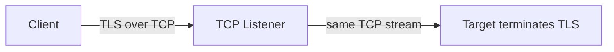

Kelebihan:

- target mengontrol certificate/mTLS/custom TLS;
- NLB tidak perlu tahu HTTP;
- cocok untuk non-HTTP TLS protocol.

Trade-off:

- NLB tidak melihat HTTP;
- tidak ada host/path routing;
- target mengelola certificate;
- observability layer aplikasi pindah ke target.

### TLS termination at NLB

Gunakan TLS listener bila NLB terminate TLS.

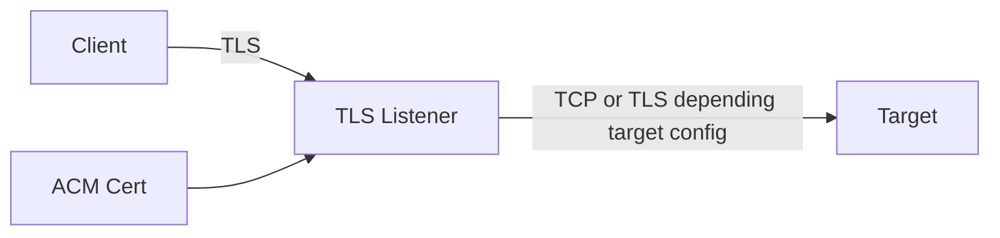

Kelebihan:

- certificate termination terpusat;
- target bisa lebih sederhana;
- tetap transport-level.

Trade-off:

- tidak menjadi ALB; NLB tidak routing by HTTP header/path;
- target identity/authorization tetap harus didesain;
- TLS policy dan backend protocol harus eksplisit.

---

## 5. Static IP and DNS Model

NLB punya DNS name.

Namun keunggulan besar NLB adalah static IP per Availability Zone mapping.

Untuk internet-facing NLB, kamu bisa menetapkan Elastic IP per subnet/AZ.

Pattern:

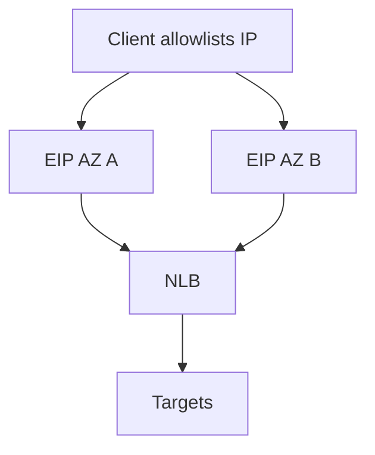

Kapan static IP penting:

- partner allowlist hanya mendukung IP, bukan DNS;
- legacy firewall rules;
- B2B integration;
- protocol client tidak fleksibel dengan DNS;
- migration dari fixed data center VIP;
- PrivateLink/endpoint patterns.

Tetapi static IP bukan pengganti DNS.

Masih lebih baik expose DNS name untuk client modern, lalu gunakan static IP hanya ketika external contract memaksa.

---

## 6. Zonal Behavior

NLB punya node/IP per enabled AZ.

Pertanyaan desain penting:

```text
Apakah client boleh masuk ke IP AZ A lalu target berada di AZ B?
```

Cross-zone load balancing menentukan apakah NLB bisa menyebar traffic lintas AZ.

Tanpa cross-zone, traffic yang masuk ke NLB node di AZ tertentu cenderung diarahkan ke target di AZ yang sama.

Dengan cross-zone, NLB bisa menyebar ke healthy targets lintas enabled AZ.

Trade-off:

| Mode | Benefit | Risk/cost |
|---|---|---|
| Cross-zone off | Zonal isolation lebih jelas, potentially lower inter-AZ data movement. | Uneven target per AZ bisa menyebabkan imbalance. |
| Cross-zone on | Load distribution lebih rata. | Inter-AZ dependency/cost dan failure semantics berubah. |

Desain produksi harus sadar:

- target count per AZ;
- client DNS caching;
- zonal failure behavior;
- Route 53/Global Accelerator fronting;
- fail-away dari unhealthy AZ;
- inter-AZ cost.

---

## 7. Source IP Preservation

Salah satu alasan utama memilih NLB adalah source IP preservation.

Dengan source IP preservation, target melihat IP client asli sebagai source.

Berguna untuk:

- allowlist/audit di aplikasi;
- IP-based rate limiting;
- fraud detection;
- legacy protocol yang butuh client IP;
- partner connectivity;
- logging transport-level.

Namun behavior tergantung target type/protocol/attribute.

Jangan desain audit penting tanpa memverifikasi mode target group.

Checklist:

```text
1. Protocol listener apa?
2. Target type apa: instance, IP, ALB?
3. preserve_client_ip.enabled bagaimana?
4. Apakah target berada di same VPC, peered VPC, atau on-prem path?
5. Apakah Proxy Protocol v2 dibutuhkan?
6. Apakah SG target mengizinkan client CIDR atau NLB SG/path?
```

Jika source IP tidak preserved, target melihat IP NLB/node sebagai peer, dan source detail dapat disuplai melalui Proxy Protocol v2 untuk use case tertentu.

---

## 8. Proxy Protocol v2

Proxy Protocol v2 adalah cara membawa metadata koneksi asli ke target.

Dipakai ketika:

- source IP preservation tidak tersedia/cocok;
- target butuh source/destination metadata;
- NLB berada dalam pola PrivateLink;
- target ingin mengetahui VPCE/source info tertentu;
- protocol backend bisa membaca Proxy Protocol header.

Flow:

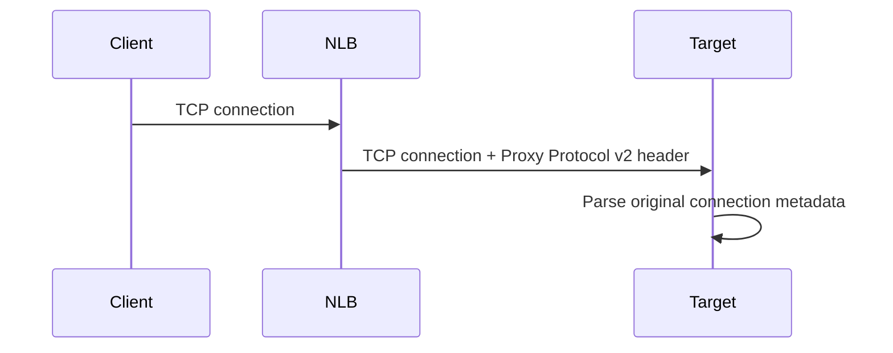

Peringatan:

> Mengaktifkan Proxy Protocol ke target yang tidak memahami Proxy Protocol akan merusak traffic.

Karena target menerima bytes tambahan sebelum payload protocol asli.

Selalu validasi:

- NGINX/HAProxy/app support;
- listener/backend protocol;
- health check compatibility;
- rollout per target group;
- log parsing.

---

## 9. Target Types

NLB target group umum mendukung:

| Target type | Use case |
|---|---|
| Instance | EC2 fleet dengan node-level port. |
| IP | IP address target, container, appliance, cross-VPC private IP dengan routing valid. |
| ALB | NLB di depan ALB untuk static IP/PrivateLink + ALB L7 routing pattern tertentu. |

### Instance target

Simple untuk EC2.

Traffic diarahkan ke instance ID dan port.

### IP target

Cocok untuk:

- ECS awsvpc;
- EKS pod/service IP patterns;
- appliances;
- targets di peered/routed network bila support dan path valid.

### ALB as target

Pattern ini berguna ketika kamu butuh NLB property di depan ALB.

Contoh:

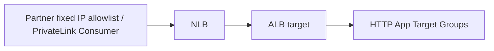

Benefit:

- NLB gives static IP or PrivateLink provider front;
- ALB still handles HTTP routing;
- useful for B2B private SaaS/API patterns.

Trade-off:

- dua load balancer layer;
- cost tambahan;
- debugging lebih kompleks;
- header/source IP behavior harus dipahami;
- health checks dua layer.

---

## 10. Health Checks in NLB

NLB health check menentukan target eligible.

Health check bisa TCP/HTTP/HTTPS tergantung target group.

| Health check type | Meaning |
|---|---|
| TCP | Target port accepts connection. |
| HTTP | Target responds with expected HTTP status. |
| HTTPS | Same as HTTP over TLS. |

Untuk TCP protocol, TCP health check sering terlalu dangkal.

Contoh:

```text
Port open, but app internally not ready.
```

Kalau backend punya HTTP management endpoint, HTTP health check sering lebih representatif.

Namun untuk non-HTTP protocol, TCP mungkin satu-satunya opsi praktis.

Design guidance:

- health check harus mewakili readiness menerima traffic;
- jangan terlalu berat;
- interval/threshold tidak terlalu agresif;
- target harus fail closed saat tidak siap;
- health check harus kompatibel dengan Proxy Protocol bila digunakan;
- hindari port health check yang berbeda dari service readiness tanpa alasan jelas.

---

## 11. UDP and Stateless-Looking Workloads

UDP terlihat stateless, tapi aplikasi sering punya state.

Use case:

- DNS-like service;
- media/streaming;
- telemetry ingestion;
- game server;
- custom protocol.

Pertanyaan penting:

- apakah packet dari client yang sama harus ke target sama?
- apakah aplikasi punya session affinity sendiri?
- bagaimana retry/retransmission?
- bagaimana health check merepresentasikan UDP service?
- apakah target bisa scale horizontally tanpa shared state?

NLB bisa meneruskan UDP, tetapi tidak menyelesaikan application-level reliability.

UDP production checklist:

```text
- idempotency or replay handling
- packet loss tolerance
- application-level timeout
- client retry jitter
- per-target load visibility
- security group/NACL UDP rules
- flow logs interpretation
```

---

## 12. NLB and TLS/mTLS

Ada tiga pola besar:

### Pattern A — TCP TLS passthrough

```text
Client TLS -> NLB TCP -> Target TLS termination
```

Cocok jika:

- target butuh mTLS sendiri;
- certificate per target/service;
- protocol TLS bukan HTTP;
- ALB L7 tidak diperlukan.

### Pattern B — TLS termination at NLB

```text
Client TLS -> NLB TLS termination -> Target TCP/TLS
```

Cocok jika:

- ingin centralized cert;
- protocol transport sederhana;
- tidak butuh HTTP routing;
- target bisa menerima decrypted TCP atau re-encrypted path.

### Pattern C — NLB in front of ALB

```text
Client/PrivateLink -> NLB -> ALB -> HTTP targets
```

Cocok jika:

- static IP atau PrivateLink wajib;
- tetap butuh ALB host/path routing;
- B2B/private SaaS.

Jangan pakai NLB TLS hanya karena “lebih cepat”. Pilih berdasarkan trust boundary.

---

## 13. PrivateLink Provider Pattern

NLB sangat penting untuk AWS PrivateLink provider.

Provider membuat endpoint service yang biasanya mengarah ke NLB.

Consumer membuat interface endpoint di VPC mereka.

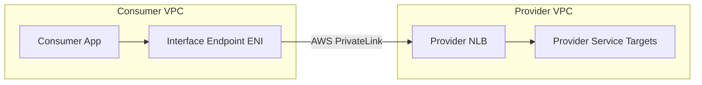

Benefit:

- consumer tidak perlu internet;
- provider tidak mengekspos public endpoint;
- no route table connectivity/full mesh;
- overlapping CIDR lebih mudah dihindari;
- provider controls endpoint acceptance and permissions.

Limitasi mental model:

- PrivateLink adalah service-specific connectivity, bukan network-level connectivity;
- consumer hanya reach service endpoint, bukan seluruh VPC provider;
- DNS/private hosted zone design tetap penting;
- source IP behavior berbeda dari direct routing;
- observability harus mencakup endpoint/NLB/service logs.

---

## 14. NLB with ALB Target for Private SaaS

Skenario:

- SaaS provider ingin expose HTTP API private ke banyak customer AWS;
- customer ingin akses via Interface Endpoint;
- provider butuh host/path routing dan WAF/auth di HTTP layer.

Pattern:

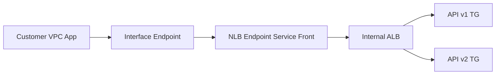

NLB memberikan PrivateLink front.

ALB memberikan L7 routing.

Trade-off:

- extra hop;
- layered health checks;
- client IP/header semantics harus dipahami;
- cost dua LB;
- security group chain lebih kompleks;
- troubleshooting butuh korelasi logs.

Tetapi untuk regulated private API, pattern ini sering sangat berguna.

---

## 15. NLB Security Group Model

Historically, NLB security posture sering dianggap berbeda dari ALB. Saat ini desain harus selalu dicek terhadap fitur region/account terbaru, tetapi prinsip tetap:

- protect NLB listener exposure;
- restrict targets carefully;
- understand whether source IP is client IP or NLB path;
- use SG references where supported and appropriate;
- avoid opening target ports broadly.

Pattern target SG tergantung source IP preservation.

Jika target melihat client IP:

```text
Target SG may need to allow client CIDRs.
```

Jika target melihat NLB/security group path:

```text
Target SG can allow from NLB SG or known NLB path.
```

Untuk internal NLB, jangan default allow seluruh VPC hanya karena “internal”. Internal berarti private addressability, bukan authorization.

---

## 16. NACL and Ephemeral Ports

NLB traffic tetap melewati subnet/NACL.

Untuk TCP:

- listener port inbound harus allowed;
- return traffic ephemeral ports harus allowed;
- health check source/path harus allowed;
- if source IP preserved, NACL sees client source/destination accordingly.

Untuk UDP:

- inbound UDP port allowed;
- response UDP path allowed;
- ephemeral semantics tergantung protocol.

NACL bug sering muncul sebagai:

```text
works from one subnet/AZ, fails from another
```

atau:

```text
health check passes, real client traffic fails
```

Karena health check dan real traffic tidak selalu punya source/destination/port pattern sama.

---

## 17. Connection Scaling and Port Allocation

NLB sangat scalable, tetapi bukan berarti tidak punya limits.

Jika client IP preservation disabled, NLB melakukan source NAT-like behavior dan ada limit koneksi per kombinasi NLB IP dan target IP:port.

Gejala port allocation issue:

- intermittent connection failure;
- errors saat spike;
- target sehat tapi connect gagal;
- connection reset/timeout meningkat;
- metrics/logs menunjukkan allocation/connection problem.

Mitigasi umum:

- tambah target;
- sebar target lintas AZ;
- enable source IP preservation bila cocok;
- gunakan lebih banyak backend ports/targets bila design mendukung;
- kurangi connection churn;
- pakai keep-alive/pooling;
- lakukan load test realistis.

Lesson:

> High throughput design bukan hanya bandwidth, tapi juga connection lifecycle.

---

## 18. Long-Lived TCP Connections

NLB sering dipakai untuk long-lived TCP:

- brokers;
- streaming;
- protocol persistent;
- IoT gateway;
- database proxy-like front;
- WebSocket via TCP pass-through.

Pertimbangan:

- connection draining saat target deregister;
- idle timeout;
- keepalive;
- target scale-in behavior;
- client reconnect jitter;
- state locality;
- failover storm.

Jika target mati, connection state hilang.

NLB tidak membuat TCP session magically portable ke target lain.

Aplikasi/client harus siap reconnect.

---

## 19. NLB and Databases: Hati-Hati

NLB kadang dipakai di depan database/proxy/custom stateful service.

Ini bisa valid, tetapi raw database protocol punya state kompleks.

Risiko:

- transaction/session state;
- connection pinning;
- TLS identity;
- failover semantics;
- client driver behavior;
- health check terlalu dangkal;
- read/write split tidak dipahami.

Untuk database managed AWS, gunakan endpoint native service bila tersedia.

Gunakan NLB di depan database-like service hanya jika kamu benar-benar mengontrol protocol dan failure behavior.

---

## 20. Observability NLB

NLB observability tidak sekaya ALB untuk HTTP.

Sumber observability:

- CloudWatch metrics;
- target health;
- VPC Flow Logs;
- NLB access logs untuk TLS use cases tertentu sesuai fitur;
- target application logs;
- packet capture/Traffic Mirroring;
- PrivateLink endpoint metrics/logs bila relevan;
- client-side connection metrics.

Metric penting:

| Metric family | Pertanyaan |
|---|---|
| ActiveFlowCount | Berapa flow aktif? |
| NewFlowCount | Berapa flow baru? |
| ProcessedBytes | Throughput data. |
| TCP_Client_Reset_Count | Client reset meningkat? |
| TCP_Target_Reset_Count | Target reset meningkat? |
| TCP_ELB_Reset_Count | NLB reset? |
| UnHealthyHostCount | Target health. |
| HealthyHostCount | Capacity eligible. |

Untuk HTTP app di belakang NLB, NLB tidak tahu status code HTTP kalau pass-through.

Maka aplikasi/ALB di belakangnya harus menyediakan L7 logs.

---

## 21. Debugging Playbook: TCP Connection Fails

Gunakan urutan ini.

### Step 1 — DNS/IP

```bash
dig service.example.com
```

Cek resolve ke NLB DNS/static IP sesuai.

### Step 2 — Port reachability

```bash
nc -vz service.example.com 443
```

atau:

```bash
telnet service.example.com 443
```

Untuk TLS:

```bash
openssl s_client -connect service.example.com:443 -servername service.example.com
```

### Step 3 — Target health

Cek target group:

- healthy target count;
- unhealthy reason;
- health check protocol/port;
- target registration status.

### Step 4 — Security path

Cek:

- NLB scheme internal/internet-facing;
- listener protocol/port;
- target SG/NACL;
- source IP preservation effect;
- route table path;
- on-prem firewall/path bila hybrid.

### Step 5 — Flow Logs

Cari:

- accepted/rejected traffic;
- source/destination IP;
- target port;
- AZ/subnet ENI;
- asymmetric path.

### Step 6 — Target logs/packet capture

Apakah target melihat SYN?

Jika tidak:

```text
problem before target: NLB/listener/routing/security/NACL
```

Jika ya tapi app tidak respond:

```text
problem at target process/protocol/TLS/app capacity
```

---

## 22. Debugging Playbook: Target Healthy but Client Fails

Ini kasus klasik.

Kemungkinan:

| Root cause | Why health still passes |
|---|---|
| Health check TCP shallow | Port open, protocol broken. |
| Client source CIDR blocked | Health check source berbeda dari client source. |
| TLS SNI mismatch | Health check tidak memakai same SNI/path. |
| Proxy Protocol enabled | Health check/app tidak membaca header dengan benar. |
| UDP behavior | Health check TCP/HTTP tidak mewakili UDP app. |
| Cross-zone imbalance | Client masuk AZ dengan target/path berbeda. |
| Port exhaustion | Health ok, new connections fail under load. |

Runbook:

```text
1. Reproduce from same source network as failing client.
2. Compare health check path with real traffic path.
3. Validate SG/NACL with actual client CIDR.
4. Check flow logs for REJECT or missing return path.
5. Check target packet capture for SYN/SYN-ACK/application payload.
6. Confirm Proxy Protocol expectation.
7. Load test connection rate.
```

---

## 23. Hybrid NLB Pattern

NLB sering dipakai untuk expose service internal ke on-prem via Direct Connect/VPN/TGW.

Pattern:

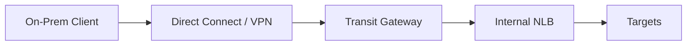

Pertanyaan desain:

- apakah on-prem resolve private DNS ke NLB?
- apakah source IP preserved dari on-prem ke target?
- apakah target SG allow on-prem CIDR?
- apakah route return path simetris?
- apakah health check path berbeda dari on-prem path?
- apakah firewall on-prem allow NLB IPs?
- apakah overlapping CIDR terjadi?

Hybrid failure sering bukan NLB issue, melainkan route/firewall/DNS symmetry issue.

---

## 24. Global Accelerator + NLB

Global Accelerator bisa berada di depan NLB.

Pattern:

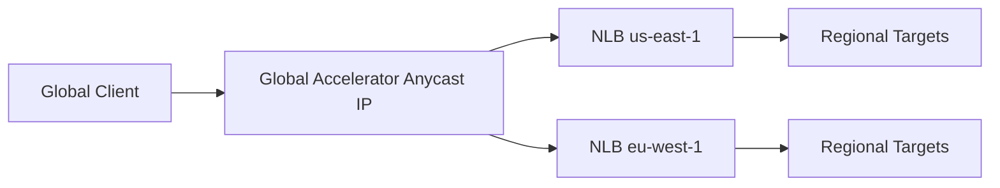

Benefit:

- static anycast IP global;
- traffic over AWS global network;
- regional failover;
- endpoint health-based routing;
- non-HTTP protocols where CloudFront tidak cocok.

CloudFront vs GA:

- CloudFront untuk HTTP caching/proxy/security at edge;
- GA untuk network acceleration/static anycast for TCP/UDP-like workloads.

---

## 25. Route 53 + NLB

Route 53 bisa alias ke NLB.

Pattern:

```text
service.example.com -> alias -> NLB DNS name
```

Gunakan Route 53 untuk:

- friendly DNS;
- weighted routing;
- failover DNS;
- latency routing;
- internal private hosted zone;
- hybrid DNS forwarding.

Namun ingat:

- DNS TTL/cache tidak realtime;
- client bisa cache IP;
- static IP NLB tidak berarti client tidak perlu retry;
- failover DNS bukan connection migration.

---

## 26. NLB Cost Model

Cost biasanya dipengaruhi:

- load balancer hours;
- Load Balancer Capacity Units/dimensi kapasitas;
- processed bytes;
- active/new flows;
- cross-zone/inter-AZ traffic;
- PrivateLink endpoint service/endpoint costs;
- data transfer out;
- logs storage;
- Global Accelerator/Route 53 bila dipakai.

Cost traps:

- using NLB + ALB everywhere without need;
- cross-zone enabled without traffic/cost awareness;
- high connection churn instead of pooling;
- PrivateLink per-customer endpoint sprawl without governance;
- duplicate NLB per microservice when shared internal ALB/Lattice would fit better;
- static IP requirement accepted without challenging partner contract.

---

## 27. Production NLB Design Checklist

### Protocol

- TCP, UDP, TCP_UDP, or TLS?
- Who terminates TLS?
- Is protocol compatible with load balancing target changes?
- Does app support reconnect?

### Target

- Instance/IP/ALB target?
- Health check deep enough?
- Target registration automated?
- Target SG/NACL correct with source IP behavior?

### IP/DNS

- Need static IP/EIP?
- Need Route 53 alias?
- Need Global Accelerator?
- Need PrivateLink endpoint service?

### Resilience

- Multiple AZ enabled?
- Cross-zone on/off intentionally?
- Enough target capacity per AZ?
- Failover tested?
- Client retry/backoff configured?

### Security

- Internal or internet-facing?
- Allowed source CIDR/Security Group clear?
- Target not overexposed?
- TLS/mTLS boundary explicit?
- Proxy Protocol trusted/parsing correct?

### Observability

- CloudWatch dashboard?
- VPC Flow Logs enabled where needed?
- Target application logs include connection/client metadata?
- PrivateLink consumer/provider metrics monitored?
- Synthetic checks from real client networks?

---

## 28. Regulatory Platform Example

Bayangkan regulatory enforcement platform punya beberapa non-HTTP integration:

- agency sends signed TCP feed;
- evidence ingestion appliance sends UDP telemetry;
- partner wants private AWS endpoint with allowlisted access;
- internal processor needs stable endpoint for legacy batch system.

Architecture:

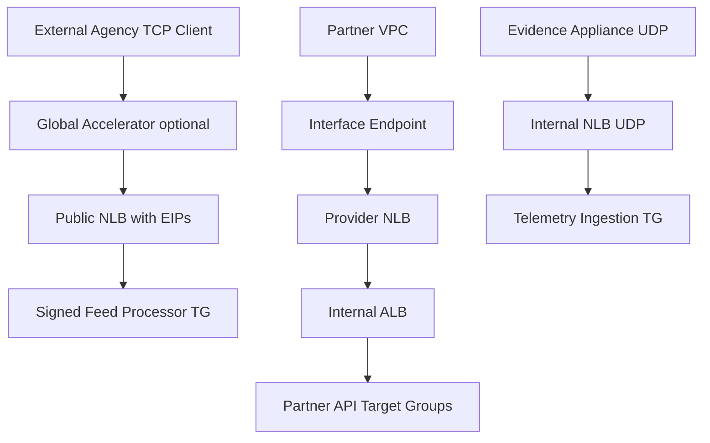

Why NLB?

- partner needs static/private endpoint;
- protocol is not always HTTP;
- source IP/audit may matter;
- PrivateLink provider requires NLB-style service exposure;
- traffic contract belongs to transport boundary.

But HTTP case APIs still benefit from ALB behind NLB when path/auth/routing matters.

---

## 29. Anti-Patterns

### Anti-pattern 1 — Using NLB for HTTP because “faster”

If you need HTTP routing, auth, WAF, logs, and redirects, ALB is usually better.

### Anti-pattern 2 — Assuming source IP is always preserved

It depends on protocol, target type, attributes, and pattern. Verify.

### Anti-pattern 3 — TCP health check for complex app readiness

Port open does not mean app safe.

### Anti-pattern 4 — Enabling Proxy Protocol without target support

This breaks protocol parsing.

### Anti-pattern 5 — Putting NLB before every internal service

This creates cost and operational sprawl. Consider ALB, VPC Lattice, Cloud Map, or service mesh where appropriate.

### Anti-pattern 6 — Ignoring client reconnect behavior

NLB does not preserve dead TCP sessions. Client retry/backoff matters.

### Anti-pattern 7 — Treating PrivateLink as VPC peering

PrivateLink exposes a service, not an entire routable network.

### Anti-pattern 8 — No packet-level observability plan

For L4 issues, you often need Flow Logs, target logs, and packet capture discipline.

---

## 30. Final Mental Model

Network Load Balancer is a transport contract.

```text
Protocol contract     -> TCP/UDP/TLS/TCP_UDP
IP contract           -> DNS/static IP/EIP/PrivateLink
Flow contract         -> connection/packet forwarding behavior
Source identity       -> preserved IP or Proxy Protocol metadata
Health contract       -> transport/app readiness target eligibility
Zonal contract        -> per-AZ IP, cross-zone, failover
Security contract     -> client/NLB/target SG and route behavior
Observability         -> metrics + flow logs + target logs
```

ALB asks:

```text
What does this HTTP request mean?
```

NLB asks:

```text
Where should this network flow go?
```

That difference is the whole design.

Part berikutnya membahas Gateway Load Balancer: bukan untuk app ingress biasa, tetapi untuk transparent appliance insertion, firewall/inspection VPC, GENEVE encapsulation, dan centralized network security architecture.

---

## 31. References

- AWS Elastic Load Balancing documentation: Network Load Balancer concepts, listeners, target groups, health checks, attributes, and metrics.
- AWS Network Load Balancer User Guide: TCP, UDP, TCP_UDP, TLS listeners, target types, static IP, zonal behavior, and target health.
- AWS Network Load Balancer target group documentation: client IP preservation, connection scaling, health check behavior, and Proxy Protocol v2.
- AWS PrivateLink documentation: endpoint service provider model using Network Load Balancer.
- AWS Global Accelerator documentation for NLB endpoint patterns.
- Amazon Route 53 documentation for alias records to ELB load balancers.
