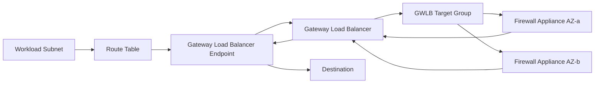
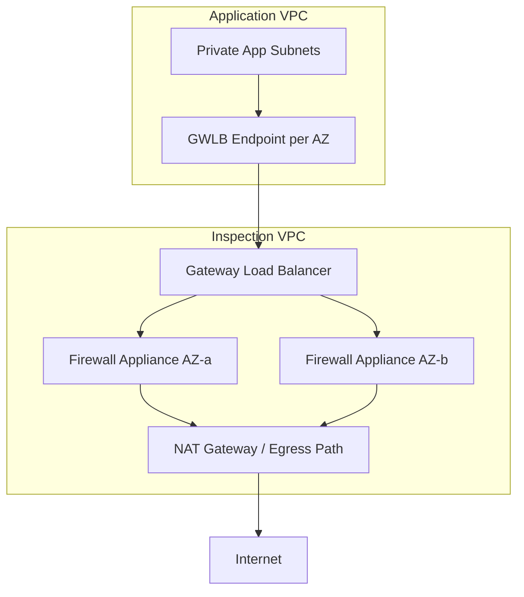
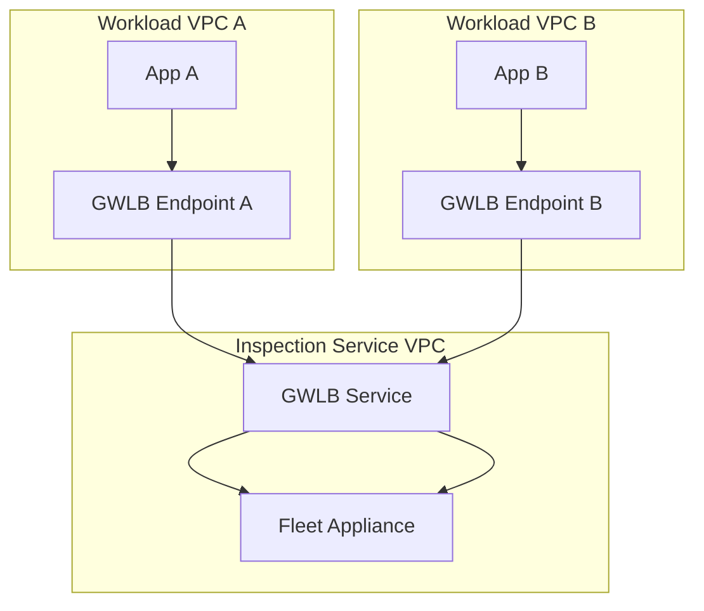
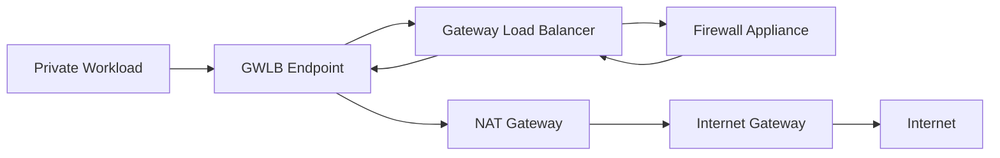
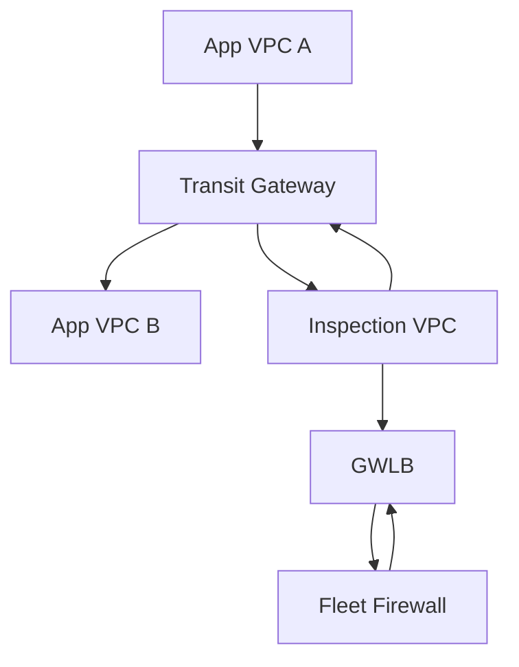
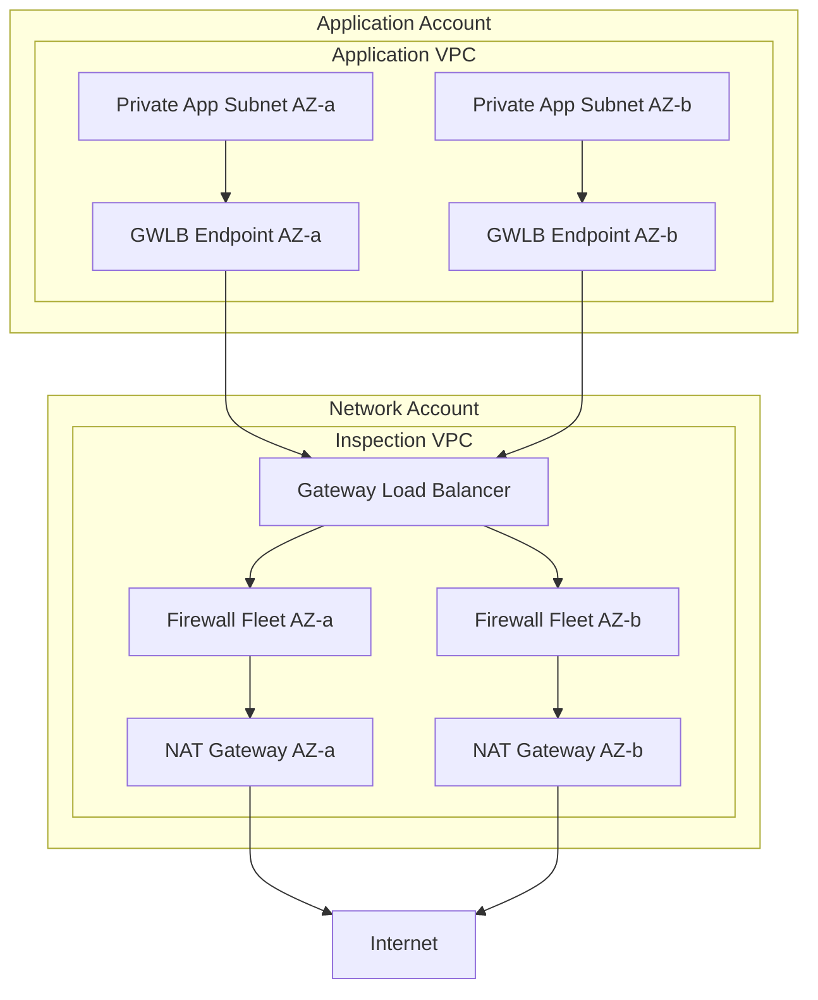

# Part 051 — Gateway Load Balancer and Appliance Insertion

Gateway Load Balancer adalah load balancer yang paling sering disalahpahami karena namanya mirip ALB/NLB, tetapi problem yang diselesaikan berbeda.

ALB menjawab:

```text
Bagaimana request HTTP diarahkan ke target aplikasi yang tepat?
```

NLB menjawab:

```text
Bagaimana flow TCP/UDP/TLS diarahkan ke target transport yang tepat?
```

Gateway Load Balancer menjawab:

```text
Bagaimana traffic IP dipaksa melewati fleet appliance jaringan secara transparan,
scale-out, highly available, dan tetap mempertahankan flow affinity?
```

Appliance di sini bisa berarti:

- firewall generasi baru;
- IDS/IPS;
- packet inspection appliance;
- egress inspection appliance;
- east-west inspection appliance;
- network security vendor appliance;
- transparent proxy yang memang mendukung mode ini;
- custom packet processor yang memahami GENEVE.

GWLB bukan pengganti ALB/NLB. GWLB adalah **service insertion primitive**.

---

## 1. Masalah yang Diselesaikan GWLB

Sebelum GWLB, desain firewall scale-out di AWS sering memakai kombinasi:

- EC2 appliance fleet;
- route table steering;
- source/destination check disabled;
- Auto Scaling Group;
- Lambda untuk route update;
- vendor-specific clustering;
- ECMP via Transit Gateway;
- manual failover;
- custom health automation.

Masalahnya:

1. Failover sulit.
2. Stateful flow mudah pecah.
3. Route table update bersifat control-plane operation.
4. Appliance scale-out membutuhkan mekanisme distribusi traffic.
5. Traffic symmetry harus dijaga manual.
6. Banyak desain gagal saat partial AZ failure.

GWLB memindahkan sebagian besar problem distribusi dan failover appliance ke managed data plane AWS.

Mental model:

```text
Route table steers traffic to GWLB endpoint.
GWLB endpoint sends traffic to Gateway Load Balancer.
Gateway Load Balancer selects healthy appliance target.
Traffic is encapsulated using GENEVE.
Appliance inspects/forwards traffic.
GWLB decapsulates and returns traffic to normal path.
```

---

## 2. Komponen Utama GWLB



Komponen penting:

| Komponen | Fungsi |
|---|---|
| Gateway Load Balancer | Mendistribusikan IP packets ke appliance fleet. |
| GWLB target group | Kumpulan appliance target. |
| Appliance target | EC2/vendor appliance yang mendukung GENEVE. |
| GWLB endpoint service | PrivateLink service yang mengekspos GWLB ke consumer VPC. |
| Gateway Load Balancer endpoint | Endpoint di consumer/inspection path yang menjadi target route table. |
| Route table | Mekanisme steering traffic ke endpoint. |
| GENEVE | Encapsulation protocol antara GWLB dan appliance. |

Perhatikan: yang membuat traffic melewati GWLB bukan security group, bukan DNS, bukan listener rule HTTP. Yang membuatnya lewat adalah **route table**.

---

## 3. GWLB Bekerja di Layer Berbeda

Gateway Load Balancer beroperasi pada level paket IP.

Ia tidak membaca:

- HTTP host header;
- path;
- cookie;
- JWT;
- OIDC session;
- gRPC method;
- application-specific semantics.

Ia membaca flow network untuk menentukan target appliance dan mempertahankan affinity.

```text
Input  : original IP packet
Wrap   : GENEVE encapsulation
Target : appliance
Output : inspected packet path
```

Implikasi:

- security decision detail tetap di appliance;
- GWLB bukan policy engine firewall;
- GWLB bukan WAF;
- GWLB tidak menggantikan Network Firewall;
- GWLB tidak menggantikan NACL/SG;
- GWLB adalah load balancer untuk appliance fleet.

---

## 4. GENEVE Encapsulation

GWLB mengirim traffic ke appliance menggunakan GENEVE.

Konseptualnya:

```text
Original packet:
  src=10.10.1.25 dst=198.51.100.10 proto=TCP dport=443

Encapsulated packet to appliance:
  outer src=<GWLB IP>
  outer dst=<Appliance IP>
  UDP/6081
  GENEVE header
  inner original packet
```

Appliance harus mampu:

1. menerima traffic GENEVE UDP/6081;
2. melakukan decapsulation;
3. membaca original packet;
4. membuat allow/drop/inspect decision;
5. mengembalikan packet dengan encapsulation sesuai ekspektasi GWLB.

Jika appliance tidak mendukung GENEVE, ia bukan target GWLB yang valid secara praktis.

---

## 5. Kenapa GWLB Bukan Sekadar NLB ke Firewall

NLB bisa mengirim TCP/UDP traffic ke target. Tetapi firewall appliance transparent biasanya perlu melihat paket asli dan menjaga inspection path untuk banyak protokol.

NLB mental model:

```text
Client flow -> NLB -> selected target
```

GWLB mental model:

```text
Original IP traffic -> route steering -> GWLBE -> GWLB -> appliance -> GWLB -> onward route
```

Perbedaan utama:

| Dimensi | NLB | GWLB |
|---|---|---|
| Layer utama | L4 | L3/IP packet forwarding |
| Use case | Expose service | Insert appliance |
| Target | App/service target | Security/network appliance |
| Encapsulation | Tidak memakai GENEVE | Memakai GENEVE |
| Route steering | Optional | Fundamental |
| Transparent inspection | Bukan target utama | Target utama |
| PrivateLink provider | Bisa | Bisa, khusus appliance service insertion |

---

## 6. GWLB Endpoint sebagai Data-Plane Hook

Gateway Load Balancer endpoint adalah entry point di VPC consumer yang menjadi target route table.

Contoh route egress workload:

```text
Workload subnet route table:
10.0.0.0/16       local
0.0.0.0/0         vpce-gwlb-egress-az-a
```

Dengan route ini, packet dari workload menuju internet tidak langsung ke NAT Gateway/IGW. Ia masuk ke GWLBE terlebih dahulu.

Lalu path bisa menjadi:

```text
EC2 private subnet
  -> route table 0.0.0.0/0 to GWLBE
  -> Gateway Load Balancer
  -> firewall appliance
  -> Gateway Load Balancer
  -> GWLBE
  -> route to NAT Gateway
  -> Internet Gateway
  -> Internet
```

Ini menunjukkan satu prinsip penting:

> GWLB tidak membuat kebijakan egress dengan sendirinya. Ia membuat traffic melewati appliance yang membuat keputusan egress.

---

## 7. Centralized Inspection VPC Pattern

Pattern paling umum:



Kelebihan:

- firewall dikelola di account/VPC khusus;
- workload VPC tidak perlu punya appliance sendiri;
- kebijakan security bisa distandarkan;
- traffic egress dari banyak VPC bisa diinspeksi terpusat;
- vendor appliance bisa di-scale via ASG;
- platform team bisa memiliki lifecycle appliance.

Risiko:

- centralized inspection menjadi dependency kritikal;
- route table kompleks;
- cross-AZ data processing bisa mahal jika salah desain;
- asymmetric routing mudah terjadi;
- debugging perlu memahami beberapa VPC sekaligus;
- blast radius firewall policy bisa lintas banyak aplikasi.

---

## 8. Distributed Inspection Pattern

Alternatif: setiap workload VPC punya GWLB endpoint dan mungkin appliance local/per-domain.



Distributed endpoint, centralized appliance service.

Gunakan jika:

- banyak VPC perlu inspection yang sama;
- policy team ingin control appliance fleet;
- app team tetap memiliki route table di VPC masing-masing;
- appliance vendor mendukung GWLB endpoint service model.

---

## 9. North-South vs East-West Inspection

### North-south

Traffic dari atau ke internet/on-prem.

Contoh:

```text
Internet -> public ALB -> protected app
Private app -> inspected egress -> internet
On-prem -> inspected ingress -> workload
```

### East-west

Traffic antar internal workloads.

Contoh:

```text
App VPC A -> App VPC B
Prod shared service -> workload account
Microservice domain A -> domain B
```

East-west inspection lebih sulit karena:

- route symmetry harus dijaga dua arah;
- traffic bisa masuk dari TGW, peering, PrivateLink, atau local VPC;
- inspection bisa menambah latency signifikan;
- stateful firewall perlu melihat both directions;
- dependency graph service menjadi lebih sulit dibaca.

Rule praktis:

> Jangan menerapkan east-west inspection global tanpa service taxonomy dan route-domain design yang matang.

---

## 10. Route Table Steering

GWLB pattern selalu kembali ke route table.

Contoh egress inspection per AZ:

```text
Private subnet AZ-a route table:
10.0.0.0/16        local
0.0.0.0/0          vpce-gwlb-egress-az-a

Private subnet AZ-b route table:
10.0.0.0/16        local
0.0.0.0/0          vpce-gwlb-egress-az-b
```

Setelah inspection, route di inspection VPC dapat mengarah ke NAT Gateway:

```text
Inspection subnet route table:
10.0.0.0/8         tgw-xxx or local return path
0.0.0.0/0          nat-az-a
```

Jangan mencampur endpoint lintas AZ tanpa alasan kuat. Untuk stateful appliance, AZ affinity adalah bagian dari reliability model.

---

## 11. Appliance Mode dan Stateful Inspection

Jika menggunakan Transit Gateway untuk mengarahkan traffic ke inspection VPC, stateful appliance membutuhkan jalur simetris.

Problem:

```text
Request path  : Workload A -> TGW -> Inspection AZ-a -> Firewall A -> Workload B
Response path : Workload B -> TGW -> Inspection AZ-b -> Firewall B -> Workload A
```

Firewall B tidak melihat request awal. Ia bisa drop response karena tidak punya state.

Untuk desain berbasis TGW, appliance mode pada VPC attachment inspection sering menjadi komponen penting agar flow tetap sticky ke AZ yang sama.

Mental model:

```text
Stateful inspection requires both directions of a flow to meet the same state owner.
```

State owner bisa:

- firewall appliance tertentu;
- appliance cluster tertentu;
- AZ-local appliance group;
- session table vendor-managed.

Yang tidak boleh: request dan response diproses oleh node yang tidak berbagi state.

---

## 12. Health Checks dan Flow Behavior

GWLB melakukan health check ke target appliance. Target unhealthy tidak menerima new flow.

Namun untuk existing flow, perilaku desain harus dipahami hati-hati:

- new flows diarahkan ke healthy target;
- existing flow affinity bisa tetap menjaga flow ke target yang sama;
- appliance failure bisa memutus flow aktif;
- deregistration membutuhkan draining semantics;
- health endpoint appliance harus mencerminkan kemampuan forwarding, bukan hanya proses HTTP hidup.

Health check buruk:

```text
GET /health -> 200 OK jika management plane hidup
```

Health check lebih baik:

```text
200 OK hanya jika:
- packet engine running;
- GENEVE listener available;
- policy loaded;
- route to next hop valid;
- license/state engine healthy;
- CPU/memory tidak dalam fail-closed threshold.
```

---

## 13. Fail-Open vs Fail-Closed

Pertanyaan arsitektur besar:

```text
Jika inspection layer gagal, traffic harus tetap lewat atau harus berhenti?
```

### Fail-open

Traffic tetap lewat agar aplikasi tidak down.

Cocok untuk:

- low-risk internal inspection;
- availability lebih penting dari strict inspection;
- temporary degraded mode;
- observability-only appliance.

Risiko:

- security control bisa terlewati;
- audit perlu explicit exception;
- sulit diterima untuk regulated egress.

### Fail-closed

Traffic berhenti jika tidak bisa diinspeksi.

Cocok untuk:

- high-risk egress;
- compliance requirement;
- regulated workload;
- sensitive data boundary.

Risiko:

- firewall outage menjadi application outage;
- blast radius policy mistake besar;
- incident response harus matang.

Prinsip produksi:

> Fail mode adalah business decision, bukan hanya network decision.

---

## 14. MTU, Encapsulation, dan Packet Drop yang Sulit Dilihat

GENEVE menambah overhead. Jika packet mendekati MTU path maksimum, encapsulation bisa membuat packet terlalu besar.

Gejala:

- aplikasi intermittently timeout;
- small request berhasil, large response gagal;
- TLS handshake gagal pada certificate chain besar;
- upload/download besar gagal;
- Flow Logs terlihat ACCEPT, tetapi aplikasi tetap timeout;
- packet capture menunjukkan retransmission.

Checklist:

```text
- Apakah appliance mendukung MTU yang cukup?
- Apakah path melakukan fragmentation?
- Apakah DF bit menyebabkan silent drop?
- Apakah PMTUD berfungsi di semua hop?
- Apakah vendor appliance merekomendasikan MSS clamping?
- Apakah traffic melewati VPN/DX/TGW yang menambah overhead lain?
```

Rule praktis:

> Untuk inspection path, MTU bukan detail kecil. Ia adalah bagian dari correctness.

---

## 15. Cross-Zone Load Balancing

GWLB dapat memakai cross-zone load balancing, tetapi jangan aktifkan hanya karena terdengar lebih resilient.

Pertanyaan sebelum mengaktifkan:

1. Apakah appliance stateful?
2. Apakah return path tetap simetris?
3. Apakah cross-AZ charge dapat diterima?
4. Apakah target capacity per AZ tidak seimbang?
5. Apakah failure mode AZ-local sudah diuji?
6. Apakah route table consumer mengarah ke endpoint AZ-local?

Default terbaik untuk banyak desain security appliance:

```text
Keep the flow AZ-local unless you intentionally design otherwise.
```

---

## 16. Security Groups, NACL, dan Appliance Policy

GWLB bukan pengganti security group.

Layer policy tetap:

```text
Security Group      -> resource/ENI stateful allow boundary
NACL                -> subnet stateless guardrail
Route Table         -> path steering
GWLB                -> appliance fleet distribution
Appliance Policy    -> packet/content/security decision
IAM/Endpoint Policy -> control and access authorization
```

Jangan memindahkan semua kontrol ke firewall appliance.

Anti-pattern:

```text
SG allow all internal.
NACL allow all.
All enforcement hanya di appliance.
```

Masalah:

- lateral movement jika route bypass terjadi;
- debugging sulit;
- least privilege hilang;
- incident blast radius besar;
- audit harus membaca policy vendor saja.

Desain lebih baik:

```text
SG tetap least privilege.
NACL guardrail sederhana.
Route table memastikan path inspection.
Appliance menerapkan advanced inspection.
```

---

## 17. Appliance Insertion for Centralized Egress

Pattern egress umum:



Policy responsibilities:

| Layer | Responsibility |
|---|---|
| Workload SG | App boleh keluar ke mana secara basic. |
| Route table | Semua default egress lewat inspection. |
| Firewall appliance | URL/category/FQDN/IP/protocol decision. |
| NAT Gateway | IPv4 source translation ke internet. |
| DNS Firewall | Domain-level exfiltration guardrail. |
| Flow Logs | Metadata proof. |
| Appliance logs | Security decision proof. |

---

## 18. Appliance Insertion for Ingress

Ingress inspection lebih tricky karena traffic sering sudah melewati CloudFront/WAF/ALB.

Possible path:

```text
Internet
  -> CloudFront/WAF
  -> public ALB
  -> GWLB inspection path
  -> private app
```

Tetapi banyak desain lebih baik memakai:

```text
Internet
  -> CloudFront/WAF
  -> ALB
  -> app SG least privilege
```

Tanpa GWLB, jika inspection yang dibutuhkan adalah HTTP-layer protection, WAF + ALB observability sering lebih tepat.

Gunakan GWLB ingress jika:

- butuh network-layer appliance vendor;
- appliance melakukan protocol inspection non-HTTP;
- regulatory boundary mengharuskan centralized network firewall;
- traffic dari on-prem/partner harus melewati appliance sebelum app;
- L3/L4 threat detection dibutuhkan di jalur ingress.

---

## 19. Appliance Insertion for East-West via Transit Gateway

Pattern:



Routing policy:

```text
VPC A attachment route table:
  VPC B CIDR -> Inspection VPC attachment

Inspection attachment route table:
  VPC A CIDR -> VPC A attachment
  VPC B CIDR -> VPC B attachment
```

Failure mode:

- response bypasses inspection;
- TGW route table wrong association;
- propagated route leaks around inspection;
- appliance health check green but policy drops;
- appliance mode not configured when stateful inspection requires symmetry;
- CIDR overlap makes routing impossible without translation.

---

## 20. GWLB vs AWS Network Firewall

| Question | GWLB | AWS Network Firewall |
|---|---|---|
| Need third-party appliance? | Strong fit | Not the goal |
| Need managed AWS firewall engine? | No | Strong fit |
| Need vendor-specific IDS/IPS/URL filtering? | Strong fit | Depends on feature fit |
| Need Suricata-compatible rules managed by AWS service? | No | Strong fit |
| Need appliance marketplace integration? | Strong fit | No |
| Need lower operational vendor dependency? | Depends | Strong fit |
| Need custom packet processor? | Possible | No |

Decision rule:

```text
Use AWS Network Firewall when AWS-native managed firewall semantics fit.
Use GWLB when you need to insert and scale an appliance fleet.
```

---

## 21. GWLB vs Transit Gateway ECMP

Transit Gateway ECMP can distribute traffic across VPN/Connect attachments or appliances in some designs. GWLB is more appliance-insertion-specific.

GWLB gives:

- target health integration;
- GENEVE-based transparent packet delivery;
- endpoint service consumption;
- simpler appliance fleet scaling;
- service provider/consumer model;
- flow stickiness semantics.

TGW ECMP gives:

- dynamic routing distribution;
- BGP integration;
- SD-WAN style connectivity;
- route-domain integration.

Do not choose based on “which one can balance traffic”. Choose based on **control model**:

```text
Route-domain balancing?       -> TGW/BGP/Connect model
Transparent appliance service? -> GWLB model
```

---

## 22. Multi-Account Ownership Model

Recommended account separation:

```text
Network account:
  - TGW / Cloud WAN core
  - inspection VPC
  - GWLB service
  - shared egress

Security tooling account:
  - firewall manager/log analytics/SIEM integration
  - security policy repository

Workload accounts:
  - app VPC route tables or shared VPC subnets
  - GWLB endpoints if distributed
```

Contract between platform and app teams:

```yaml
inspection_contract:
  default_egress: required
  inspection_endpoint_per_az: required
  route_bypass: prohibited
  log_retention_days: 365
  fail_mode: fail_closed_for_regulated
  exception_process: security_approval
  ownership:
    app_route_table: platform
    firewall_policy: security
    app_sg: application_team
```

---

## 23. IaC Structure

A production module should not expose raw route magic as copy-paste.

Better module boundaries:

```text
modules/
  gwlb-service/
    creates GWLB, target group, listener, endpoint service
  appliance-fleet/
    creates ASG/launch template/vendor appliance bootstrap
  gwlb-endpoint-consumer/
    creates GWLBE per subnet/AZ
  inspected-route-domain/
    associates route table entries to endpoint IDs
  inspection-observability/
    enables Flow Logs, appliance log sinks, alarms
```

Important outputs:

```yaml
gwlb_service_name: com.amazonaws.vpce.region.vpce-svc-...
gwlb_arn: arn:aws:elasticloadbalancing:...
target_group_arn: arn:aws:elasticloadbalancing:...
endpoint_ids_by_az:
  ap-southeast-1a: vpce-...
  ap-southeast-1b: vpce-...
inspection_route_tables:
  app_private_a: rtb-...
```

---

## 24. Observability Model

GWLB troubleshooting needs multiple telemetry sources.

| Source | Tells You |
|---|---|
| VPC Flow Logs workload ENI | Did workload send packet? Was SG/NACL allowing? |
| VPC Flow Logs GWLBE subnet | Did route steering reach endpoint path? |
| Appliance logs | Did policy allow/drop? Was threat detected? |
| Appliance packet capture | Did GENEVE arrive? Was decapsulation successful? |
| ELB metrics | Target health, processed bytes, active flow signals. |
| NAT Gateway metrics | Was egress after inspection successful? |
| TGW route table | Was inter-VPC routing correct? |
| Reachability Analyzer | Static path validation for supported resource paths. |

Observability principle:

```text
Flow Logs prove network metadata.
Appliance logs prove security decision.
Packet capture proves packet-level mechanics.
Route tables prove intended path.
```

---

## 25. Debugging Runbook: Workload Cannot Reach Internet Through GWLB

### Step 1 — Prove DNS is not the problem

```bash
nslookup example.com
```

If DNS fails, GWLB is likely irrelevant.

### Step 2 — Prove route table steering

Check workload subnet route table:

```text
0.0.0.0/0 -> vpce-gwlb-...
```

If route points to NAT directly, inspection is bypassed.

### Step 3 — Prove endpoint exists in same AZ

Check:

```text
workload subnet AZ == selected GWLBE AZ
```

Cross-AZ design may work but complicates failure/cost.

### Step 4 — Prove appliance target health

Check GWLB target group target health.

If unhealthy:

- GENEVE listener down;
- health port wrong;
- SG/NACL blocks health check;
- appliance bootstrap failed;
- license/policy engine unavailable.

### Step 5 — Prove appliance policy decision

Look for:

```text
src workload IP
dst resolved IP
port 443
action allow/drop/reset
policy rule ID
```

### Step 6 — Prove post-inspection route

After appliance permits traffic, where does it go?

- NAT Gateway route correct?
- TGW return route correct?
- IGW path exists?
- NACL allows ephemeral response?

### Step 7 — Check MTU symptoms

Test small vs large payload:

```bash
curl -v https://example.com/
curl -v https://large-object.example/file
```

If small works and large fails, inspect MTU/MSS/fragmentation.

---

## 26. Debugging Runbook: Intermittent Drops

Intermittent GWLB issues usually come from:

- asymmetric routing;
- cross-AZ steering;
- unhealthy appliance flapping;
- long-lived TCP idle timeout;
- appliance CPU saturation;
- state table exhaustion;
- MTU issues;
- policy reload resets;
- NAT port exhaustion after inspection;
- DNS resolving to variable destination IPs while policy is IP-based.

Checklist:

```text
[ ] Are request and response inspected by same state owner?
[ ] Are targets flapping in target group health?
[ ] Is appliance CPU/memory/session table near limit?
[ ] Are long-lived connections exceeding idle timeout?
[ ] Are route tables stable?
[ ] Are all AZs configured symmetrically?
[ ] Are Flow Logs showing REJECT or only ACCEPT?
[ ] Are appliance logs showing drop/reset?
[ ] Is NAT Gateway showing ErrorPortAllocation?
```

---

## 27. Common Anti-Patterns

### Anti-pattern 1 — One appliance instance as “temporary firewall”

```text
All egress -> one EC2 firewall
```

This creates a hidden single point of failure.

### Anti-pattern 2 — Route table update as failover mechanism

```text
If firewall fails, Lambda rewrites default route.
```

This moves failover into control plane and is slow/risky compared with data-plane target health.

### Anti-pattern 3 — Cross-AZ inspection without accounting for state/cost

```text
AZ-a workload -> AZ-b endpoint/appliance -> AZ-a NAT
```

This can create cost, latency, and stateful failover issues.

### Anti-pattern 4 — Appliance health check that only checks management UI

Firewall UI up does not mean packet engine forwarding correctly.

### Anti-pattern 5 — No bypass detection

If someone changes route table from:

```text
0.0.0.0/0 -> GWLBE
```

to:

```text
0.0.0.0/0 -> NAT Gateway
```

inspection is bypassed. This must be caught by config rules, IaC drift detection, or Network Access Analyzer-style checks.

---

## 28. Design Checklist

Before using GWLB in production, answer:

```text
[ ] What traffic must be inspected?
[ ] Is this north-south, east-west, or egress?
[ ] Is the appliance stateless or stateful?
[ ] What is the required fail mode?
[ ] Does appliance support GENEVE correctly?
[ ] What health check proves forwarding health?
[ ] Is route symmetry guaranteed?
[ ] Is endpoint deployed per AZ?
[ ] Is cross-zone load balancing intentional?
[ ] Is MTU/MSS tested?
[ ] Are logs centralized?
[ ] Are route-table bypasses detectable?
[ ] Is policy change audited?
[ ] Is appliance scale tested under realistic traffic?
[ ] Is rollback path documented?
```

---

## 29. Production Reference: Inspected Egress



Properties:

- endpoint per AZ;
- appliance target per AZ;
- NAT per AZ;
- logs from workload, endpoint subnet, firewall, and NAT;
- fail mode documented;
- route bypass monitored;
- policy changes reviewed;
- exception path explicit.

---

## 30. Invariants

Keep these invariants in your head:

1. GWLB inserts appliances; it does not replace application load balancing.
2. Traffic goes through GWLB because route tables point to GWLB endpoints.
3. Appliance must support GENEVE and understand encapsulated traffic.
4. Stateful inspection requires symmetric routing or shared state.
5. Health checks must test forwarding readiness, not only management-plane liveness.
6. MTU and idle timeout issues are common and subtle.
7. Fail-open/fail-closed is a business/security decision.
8. Centralized inspection simplifies governance but increases blast radius.
9. GWLB endpoint is powered by PrivateLink-style service consumption semantics.
10. Observability must include route, flow, appliance decision, and packet-level evidence.

---

## 31. What You Should Be Able to Do Now

After this part, you should be able to:

- explain why GWLB exists;
- design centralized egress inspection;
- explain GENEVE encapsulation at a practical level;
- distinguish GWLB from ALB, NLB, Network Firewall, and TGW ECMP;
- reason about route-table steering;
- identify asymmetric routing risks;
- define fail-open/fail-closed behavior;
- design health checks that reflect forwarding readiness;
- debug workload egress through GWLB;
- design observability for appliance insertion.

The next part moves from appliance insertion to **load balancer security and TLS patterns**: where TLS terminates, when to re-encrypt, how SNI/certificates/mTLS behave, and how to avoid fake “end-to-end encryption” assumptions.
