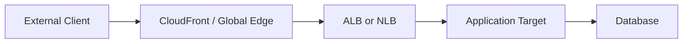
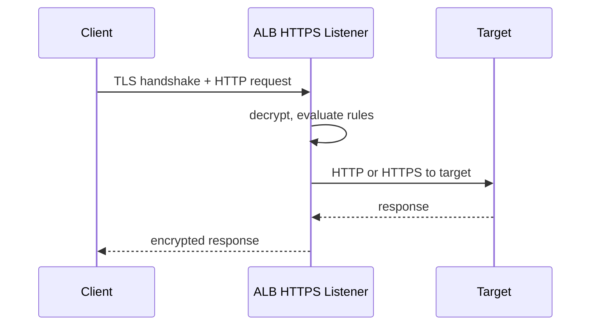
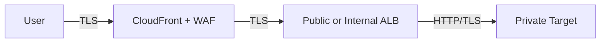
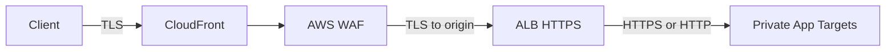
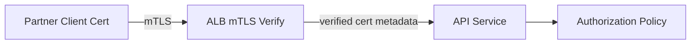
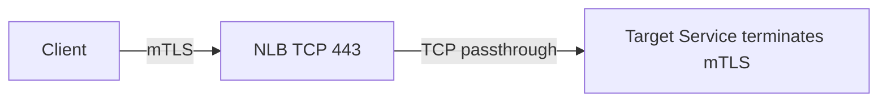

# Part 052 — Load Balancer Security and TLS Patterns

TLS di load balancer sering dijelaskan terlalu sederhana:

```text
Pasang certificate di ALB, selesai.
```

Untuk sistem produksi, itu belum cukup.

Pertanyaan yang benar:

```text
Di mana trust boundary berada?
Di mana TLS terminates?
Apakah traffic re-encrypted ke target?
Siapa yang memverifikasi client identity?
Apakah certificate rotation aman?
Apakah logs cukup untuk audit?
Apakah header identity dapat dipercaya?
Apakah app mengira end-to-end encrypted padahal tidak?
```

Load balancer security bukan hanya “HTTPS enabled”. Ia adalah desain **cryptographic boundary + network boundary + identity boundary + operational boundary**.

---

## 1. Empat Pola TLS Utama

Ada empat pola yang paling sering muncul.

### 1. TLS termination at load balancer

```text
Client --TLS--> ALB/NLB --plain HTTP/TCP--> Target
```

Kelebihan:

- certificate dikelola di load balancer;
- target lebih sederhana;
- central security policy;
- request-level observability mudah pada ALB;
- WAF/auth/header injection lebih mudah.

Kekurangan:

- traffic dari LB ke target tidak encrypted;
- tidak cocok jika network internal dianggap untrusted;
- compliance tertentu mungkin menolak plaintext hop.

### 2. TLS termination + re-encryption

```text
Client --TLS--> ALB/NLB --TLS--> Target
```

Kelebihan:

- TLS tetap ada setelah load balancer;
- load balancer bisa membaca HTTP jika terminates di depan;
- target bisa punya server certificate sendiri;
- cocok untuk defense-in-depth.

Kekurangan:

- dua TLS sessions;
- certificate lifecycle di target perlu dikelola;
- hostname/SNI/back-end cert validation perlu dipahami;
- debugging lebih kompleks.

### 3. TLS passthrough

```text
Client --TLS end-to-end--> Target
        NLB TCP listener only forwards bytes
```

Kelebihan:

- load balancer tidak melihat payload;
- true end-to-end TLS ke target;
- target bisa melakukan mTLS sendiri;
- cocok untuk protocols/custom TLS.

Kekurangan:

- no HTTP routing at LB;
- no WAF at LB;
- no load-balancer-level certificate management;
- target harus menangani certificate, SNI, mTLS, cipher policy;
- observability HTTP hilang di LB.

### 4. Edge TLS + origin TLS

```text
Viewer --TLS--> CloudFront --TLS--> ALB/API/S3/custom origin
```

Kelebihan:

- global TLS at edge;
- origin protected by TLS;
- WAF/Shield/CloudFront controls available;
- origin exposure dapat dibatasi.

Kekurangan:

- dua certificate contexts;
- viewer TLS policy dan origin TLS policy berbeda;
- header forwarding/cache behavior harus hati-hati;
- origin harus memverifikasi request dari trusted edge path.

---

## 2. Trust Boundary Mental Model

Jangan mulai dari layanan. Mulai dari boundary.



Pertanyaan boundary:

| Boundary | Pertanyaan |
|---|---|
| Client → Edge/LB | Apakah public trust? Certificate public? TLS policy modern? |
| Edge → LB | Apakah origin TLS divalidasi? Apakah origin private/protected? |
| LB → App | Plaintext atau TLS? Apakah SG membatasi hanya dari LB? |
| App → DB | Apakah TLS database enforced? |
| Internal service → Internal service | Apakah mTLS/service identity dibutuhkan? |

TLS tidak otomatis membuat sistem aman jika boundary lain bocor.

Contoh buruk:

```text
Client -> HTTPS ALB -> HTTP target
Target SG allows 0.0.0.0/0:8080
```

Meskipun client melihat HTTPS, backend terbuka.

---

## 3. Certificate Management with ACM

Untuk ALB/NLB HTTPS/TLS listener, certificate biasanya dikelola via AWS Certificate Manager.

Prinsip:

- public certificate untuk public domain;
- private certificate untuk internal domain via Private CA;
- certificate harus cocok dengan hostname yang digunakan client;
- wildcard membantu, tapi jangan membuat ownership domain kabur;
- DNS validation lebih automation-friendly daripada email validation;
- rotation harus diuji sebelum expiry;
- certificate inventory harus observable.

Certificate mismatch symptoms:

```text
curl: SSL: no alternative certificate subject name matches target host name
browser NET::ERR_CERT_COMMON_NAME_INVALID
Java SSLHandshakeException: No subject alternative DNS name matching ...
```

Checklist certificate:

```text
[ ] SAN mencakup hostname yang dipakai client
[ ] Certificate chain lengkap
[ ] Expiry dimonitor
[ ] Domain validation automation aman
[ ] Certificate region benar untuk service
[ ] SNI behavior dipahami
[ ] Default certificate bukan fallback berbahaya
```

---

## 4. SNI and Multiple Certificates

SNI memungkinkan satu listener HTTPS/TLS melayani banyak hostname dengan certificate berbeda.

```text
ClientHello includes server_name=api.example.com
Load balancer selects matching certificate
TLS handshake continues
```

Tanpa SNI atau jika client lama tidak mengirim SNI, load balancer memakai default certificate.

Risk:

```text
Default certificate accidentally belongs to unrelated domain.
Client without SNI sees confusing certificate.
Monitoring only checks one hostname.
```

Production rules:

1. Default certificate harus aman dan intentional.
2. Monitor semua hostname penting, bukan hanya listener.
3. Hindari listener yang memuat terlalu banyak domain unrelated.
4. Certificate ownership harus jelas.
5. Rotation harus mempertahankan overlap waktu.

---

## 5. TLS Security Policy

TLS security policy menentukan protocol dan cipher yang dinegosiasikan.

Trade-off:

```text
Stricter policy -> stronger crypto, but older clients may fail.
Looser policy   -> compatibility, but larger security exposure.
```

Decision framework:

| Workload | Policy Direction |
|---|---|
| Public modern API | TLS 1.2/1.3-oriented modern policy. |
| Internal service | Strict unless legacy clients exist. |
| Legacy partner integration | Isolate listener/domain; do not weaken global listener. |
| Regulated workload | Use approved policy and document exceptions. |
| Mobile client with old OS | Measure client population before tightening. |

Never weaken one global listener because one legacy client exists. Create a separate controlled compatibility boundary.

---

## 6. ALB TLS Termination

ALB HTTPS listener terminates TLS and then evaluates HTTP-level routing.



ALB can then use:

- host-based routing;
- path-based routing;
- header/query routing;
- redirects;
- fixed responses;
- authentication actions;
- WAF integration;
- HTTP access logs;
- mTLS features.

If you need ALB features, TLS usually terminates at ALB.

---

## 7. ALB to Target: HTTP vs HTTPS

ALB target group protocol can be HTTP or HTTPS.

### HTTP target group

```text
Client --HTTPS--> ALB --HTTP--> Target
```

Good when:

- target subnets are private;
- SG only allows ALB SG;
- internal plaintext hop acceptable;
- simplicity matters.

### HTTPS target group

```text
Client --HTTPS--> ALB --HTTPS--> Target
```

Good when:

- internal encryption required;
- compliance requires encrypted hop;
- target/app wants TLS context;
- zero-trust internal posture.

But avoid claiming “end-to-end TLS from client” if ALB terminates and starts a separate TLS session. That is **two-hop TLS**, not the same session.

---

## 8. NLB TLS Termination vs TCP Passthrough

NLB supports TLS listener and TCP listener.

### NLB TLS listener

```text
Client --TLS--> NLB --TCP/TLS depending target group--> Target
```

NLB terminates client TLS when using TLS listener.

Good for:

- L4 service needing central certificate;
- static IP + TLS termination;
- lower-level protocols where ALB is not appropriate;
- preserving transport-level entry point.

### NLB TCP listener on port 443

```text
Client --TLS--> Target
       NLB forwards TCP bytes only
```

Good for:

- true TLS passthrough;
- target-managed mTLS;
- custom TLS protocols;
- preserving client certificate negotiation to target.

Important rule:

> If NLB must not decrypt traffic, use TCP listener, not TLS listener.

---

## 9. Mutual TLS Patterns

mTLS asks both sides to prove identity:

```text
Server proves identity with server certificate.
Client proves identity with client certificate.
```

### Pattern A — ALB mTLS verify

```text
Client cert -> ALB validates cert -> forwards identity headers -> target
```

Good when:

- you want centralized client certificate validation;
- application should receive verified identity metadata;
- trust store can be managed at ALB layer;
- HTTP workloads fit ALB.

Risks:

- app must trust headers only from ALB;
- target must not be reachable directly;
- header spoofing must be prevented by SG/path design;
- authorization still belongs in app/policy layer.

### Pattern B — ALB mTLS passthrough mode

```text
ALB accepts client cert chain and forwards certificate information to target headers.
Target performs verification/authorization.
```

Good when:

- app needs certificate chain;
- verification logic is app-specific;
- gradual migration to centralized verification.

### Pattern C — NLB TCP passthrough mTLS

```text
Client --mTLS session--> Target
       NLB only forwards TCP
```

Good when:

- target must negotiate client cert directly;
- non-HTTP protocol;
- full TLS session must terminate at target;
- NLB TLS listener would break client cert flow.

NLB TLS listener is not the right tool for mTLS authentication at the load balancer.

---

## 10. Header Trust and Spoofing

When TLS or mTLS terminates at ALB, the target often receives headers such as:

```text
X-Forwarded-For
X-Forwarded-Proto
X-Forwarded-Port
client certificate related headers for mTLS modes
```

These headers are only trustworthy if:

1. only ALB can reach the target;
2. target strips or ignores untrusted incoming versions;
3. app knows which proxy headers are authoritative;
4. edge chain is documented;
5. direct target access is impossible.

Bad design:

```text
Target accepts X-Forwarded-Proto: https from any client.
Target is publicly reachable.
App uses that header to mark request secure.
```

Good design:

```text
Target SG allows only ALB SG.
App trusts forwarding headers only from ALB path.
Direct internet access blocked.
```

---

## 11. Security Groups around Load Balancers

For ALB:

```text
ALB SG:
  inbound 443 from allowed client CIDR / CloudFront prefix / internet
  outbound target-port to target SG

Target SG:
  inbound app-port from ALB SG only
```

For internal ALB:

```text
ALB SG inbound 443 from caller SG/CIDR
Target SG inbound app-port from ALB SG
```

For NLB:

- modern NLB can have security groups in supported configurations;
- target security group design must account for source IP preservation behavior;
- for client IP preserved flows, target may see original client IP;
- for some modes, target may see load balancer node IP.

Practical invariant:

```text
Do not design target SG rules without confirming what source IP the target sees.
```

---

## 12. CloudFront + ALB Origin TLS

Common public pattern:



Security goals:

- user gets TLS at edge;
- origin communication encrypted;
- WAF at CloudFront;
- origin not directly usable by random clients;
- headers/cookies/query forwarding intentional;
- cache behavior does not leak personalized data.

Origin protection options:

- restrict ALB SG to CloudFront origin-facing prefix list where applicable;
- use custom header secret from CloudFront to origin;
- use AWS WAF on CloudFront and/or ALB depending pattern;
- validate Host header;
- avoid exposing alternate DNS names that bypass CloudFront.

Anti-pattern:

```text
CloudFront is configured, but ALB public DNS is still open to the world.
```

---

## 13. WAF Placement

WAF is HTTP-layer protection. It applies where HTTP semantics exist.

Common placements:

```text
CloudFront + WAF -> global edge filtering
ALB + WAF        -> regional app entry filtering
API Gateway WAF  -> API-specific filtering
```

WAF does not attach to NLB/GWLB as L4/L3 services.

Decision:

| Need | Better Placement |
|---|---|
| Global HTTP protection | CloudFront WAF |
| Regional ALB-only app | ALB WAF |
| API Gateway public API | API Gateway WAF |
| TCP service | Network firewall/security appliance, not WAF |
| Transparent packet inspection | GWLB/appliance or Network Firewall |

---

## 14. Certificate Rotation Without Outage

Rotation failure often happens because teams treat certificate as static config.

Safe rotation pattern:

```text
1. Issue new certificate before old expiry.
2. Attach new certificate to listener certificate list.
3. Keep old certificate during overlap.
4. Validate all hostnames with SNI.
5. Switch default certificate if needed.
6. Monitor handshake errors.
7. Remove old certificate after safe window.
```

For target certificates:

```text
1. Deploy new cert to targets.
2. Ensure target process reloads it correctly.
3. Validate from ALB/NLB path.
4. Rotate one target group/AZ at a time if possible.
5. Keep rollback cert/key available through secret manager.
```

Never discover certificate expiry from customer outage.

---

## 15. Internal PKI and Private CA

Internal workloads often need private certificates.

Use cases:

- internal ALB hostname;
- service-to-service TLS;
- mTLS client certificates;
- hybrid service certificates;
- device/workload certificates;
- non-public domains.

Pitfalls:

- clients do not trust private CA chain;
- Java truststore not updated;
- container image lacks CA bundle;
- rotation breaks pinned certificates;
- wildcard cert overused across teams;
- private key distribution not controlled;
- revocation behavior not understood.

For Java services, explicitly test:

```text
javax.net.ssl.SSLHandshakeException
PKIX path building failed
unable to find valid certification path to requested target
```

This is usually trust chain/config, not “network”.

---

## 16. ALPN, HTTP/2, gRPC, and TLS

ALPN allows client and server to negotiate application protocol during TLS handshake.

Relevant for:

- HTTP/2;
- gRPC;
- modern clients;
- NLB TLS listener ALPN policy;
- ALB HTTP/2/gRPC support path.

Failure symptoms:

```text
gRPC client fails but curl HTTPS works.
HTTP/2 downgrade breaks behavior.
Client expects h2 but server negotiates http/1.1.
```

Debug:

```bash
openssl s_client -connect api.example.com:443 -servername api.example.com -alpn h2
curl -v --http2 https://api.example.com
```

---

## 17. TLS Debugging Toolkit

Use CLI tools before guessing.

### Check certificate chain

```bash
openssl s_client -connect api.example.com:443 -servername api.example.com -showcerts
```

Check:

```text
- subject
- SAN
- issuer
- expiry
- chain completeness
- selected protocol
- selected cipher
- verification result
```

### Check hostname validation

```bash
curl -v https://api.example.com/health
```

### Force TLS version

```bash
curl -v --tlsv1.2 https://api.example.com
curl -v --tlsv1.3 https://api.example.com
```

### Test mTLS

```bash
curl -v \
  --cert client.crt \
  --key client.key \
  https://api.example.com/secure
```

### Check backend from private network

```bash
curl -vk https://target.internal:8443/health
```

---

## 18. Load Balancer Access Logs and TLS Evidence

Logs should answer:

```text
Who connected?
Which host/path?
Which TLS protocol/cipher?
Which target?
What status?
How long?
Was request blocked upstream?
```

For ALB, access logs are valuable because ALB understands HTTP.

For NLB, logs/metrics are more transport-centric.

For CloudFront, standard/real-time logs can show viewer/origin behavior.

Security audit needs correlation:

```text
CloudFront request ID
ALB trace/access log
Target app request ID
WAF log
mTLS client identity if applicable
```

Do not rely on one log source for end-to-end security story.

---

## 19. Common Failure Modes

### Failure 1 — “HTTPS works externally but app generates HTTP links”

Cause:

```text
ALB terminates TLS, target receives HTTP, app does not trust/use X-Forwarded-Proto.
```

Fix:

- configure framework proxy awareness;
- trust headers only from ALB;
- redirect at ALB or app consistently.

### Failure 2 — Certificate mismatch after adding new domain

Cause:

```text
DNS points to ALB but listener certificate list lacks SAN for hostname.
```

Fix:

- issue/attach cert with SAN;
- validate SNI;
- monitor all hostnames.

### Failure 3 — mTLS headers can be spoofed

Cause:

```text
Target reachable directly.
App trusts client-cert headers from any source.
```

Fix:

- target SG only from ALB;
- strip inbound untrusted headers;
- enforce network path.

### Failure 4 — NLB TLS listener expected to support mTLS

Cause:

```text
TLS terminates at NLB. Client certificate auth is not performed by NLB as mTLS auth boundary.
```

Fix:

- use NLB TCP passthrough and implement mTLS on target;
- or use ALB mTLS for HTTP workloads.

### Failure 5 — “End-to-end encryption” claimed incorrectly

Cause:

```text
Client TLS terminates at ALB, then separate HTTPS to target.
```

Fix wording:

```text
Encrypted in transit on both hops, with TLS termination and re-encryption at ALB.
```

Not:

```text
Same end-to-end TLS session from client to target.
```

---

## 20. Security Pattern Decision Matrix

| Requirement | Recommended Pattern |
|---|---|
| Public HTTP app with WAF/cache | CloudFront + WAF + ALB HTTPS |
| Regional HTTP app | ALB HTTPS + WAF |
| Need path/host routing | ALB TLS termination |
| Need static IP + TLS | NLB TLS listener |
| Need true TLS passthrough | NLB TCP listener |
| Need HTTP mTLS at edge of app | ALB mTLS verify/passthrough |
| Need non-HTTP mTLS | NLB TCP passthrough to target |
| Need internal encrypted hop | ALB/NLB to HTTPS/TLS target |
| Need transparent L3 inspection | GWLB/appliance or Network Firewall |
| Need central certificate rotation | Terminate at LB with ACM |
| Need app-owned private key | Passthrough or backend TLS ownership |

---

## 21. Production Blueprint: Public API



Recommended controls:

```yaml
viewer_tls:
  min_version: modern
  cert: ACM us-east-1 for CloudFront
origin_tls:
  enabled: true
  hostname_validation: true
alb:
  listener: 443
  cert: ACM regional
  security_policy: modern
  waf: optional_if_waf_at_cloudfront
app_target:
  sg_inbound: only_from_alb_sg
  proxy_headers: trusted_only_from_alb
observability:
  cloudfront_logs: enabled
  waf_logs: enabled
  alb_access_logs: enabled
  app_request_id: propagated
```

---

## 22. Production Blueprint: Partner mTLS API



Controls:

```yaml
mtls:
  mode: verify
  trust_store: partner_ca_bundle
  revocation: configured_if_required
app:
  trust_headers_only_from_alb: true
  authorization_uses_cert_subject_or_san: true
network:
  target_sg: only_alb_sg
logging:
  alb_logs: enabled
  app_authz_logs: enabled
  cert_identity_logged: normalized
```

Common mistake:

```text
mTLS authenticates the client certificate.
It does not decide what the client is allowed to do.
```

Authentication is not authorization.

---

## 23. Production Blueprint: Non-HTTP mTLS Service



Controls:

```yaml
nlb:
  listener: TCP:443
  tls_termination: false
service:
  cert_management: app_owned
  client_ca_validation: service_owned
  authorization: service_owned
network:
  target_sg: allow_expected_client_or_nlb_path
observability:
  nlb_metrics: enabled
  service_tls_logs: enabled
```

Use this when the load balancer must not see or terminate TLS.

---

## 24. Threat Model Checklist

```text
[ ] Can anyone bypass CloudFront and hit origin directly?
[ ] Can anyone bypass ALB and hit target directly?
[ ] Are proxy headers trusted only from trusted network path?
[ ] Are old TLS versions disabled where possible?
[ ] Are certificates monitored before expiry?
[ ] Is default certificate intentional?
[ ] Are private keys protected?
[ ] Is mTLS identity mapped to authorization policy?
[ ] Are WAF logs correlated with app logs?
[ ] Are backend TLS failures observable?
[ ] Are legacy clients isolated?
[ ] Is certificate rotation rehearsed?
[ ] Is direct IP access blocked or harmless?
[ ] Are DNS records aligned with certificate SANs?
```

---

## 25. What to Document in an Engineering Handbook

For every load-balanced service, document:

```yaml
service: payments-api
front_door: cloudfront
regional_entry: alb
viewer_tls:
  certificate: public_acm
  min_tls: tls12_or_better
origin_tls:
  cloudfront_to_alb: enabled
  alb_to_target: enabled
mtls:
  enabled: true
  boundary: alb
  trust_store_owner: security-platform
waf:
  location: cloudfront
  managed_rules: enabled
network_controls:
  target_sg: only_from_alb
  origin_bypass_protection: cloudfront_only
logging:
  cloudfront: s3
  waf: firehose
  alb: s3
  app: centralized
rotation:
  cert_expiry_alarm: 45_days
  owner: platform-networking
exceptions:
  legacy_tls: none
```

This makes security review concrete.

---

## 26. Invariants

Keep these invariants:

1. HTTPS at the client does not prove encryption all the way to the target.
2. TLS termination creates a trust boundary.
3. Re-encryption creates a new TLS session, not one continuous session.
4. mTLS authenticates a certificate; authorization still needs policy.
5. Headers from a proxy are trustworthy only if direct access is impossible.
6. NLB TCP listener preserves end-to-end TLS; NLB TLS listener terminates it.
7. ALB is the natural place for HTTP security controls; NLB is not HTTP-aware.
8. WAF protects HTTP surfaces, not arbitrary TCP services.
9. Certificate rotation is an operational process, not a one-time config.
10. The target SG is part of TLS security because it prevents bypass.

---

## 27. What You Should Be Able to Do Now

After this part, you should be able to:

- choose between TLS termination, passthrough, and re-encryption;
- explain ALB vs NLB TLS behavior;
- design mTLS for HTTP and non-HTTP workloads;
- avoid false end-to-end encryption claims;
- protect targets from direct bypass;
- reason about SNI and certificate lists;
- build safe certificate rotation workflows;
- debug TLS handshake/certificate issues;
- place WAF at the right layer;
- document TLS/security posture in a reviewable way.

The next part covers **load balancer failure and debugging**: 502, 503, 504, target health, idle timeout, deregistration delay, cross-zone behavior, connection draining, and production runbooks.
