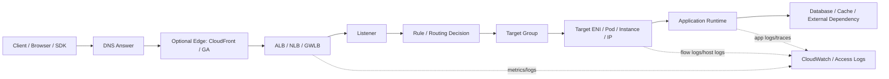
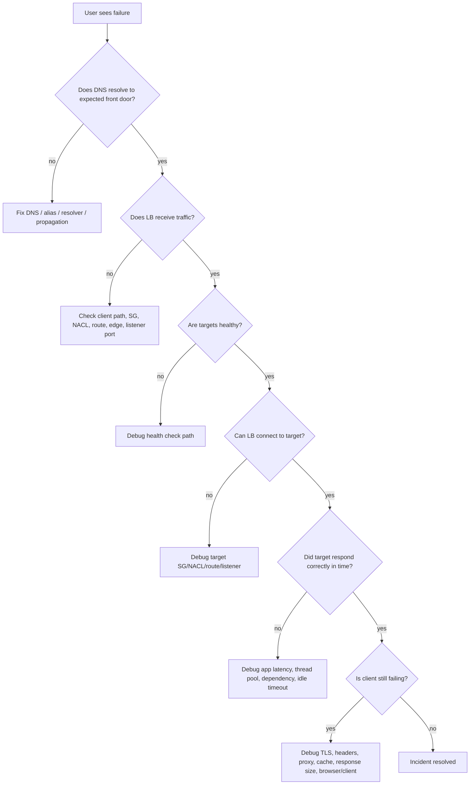
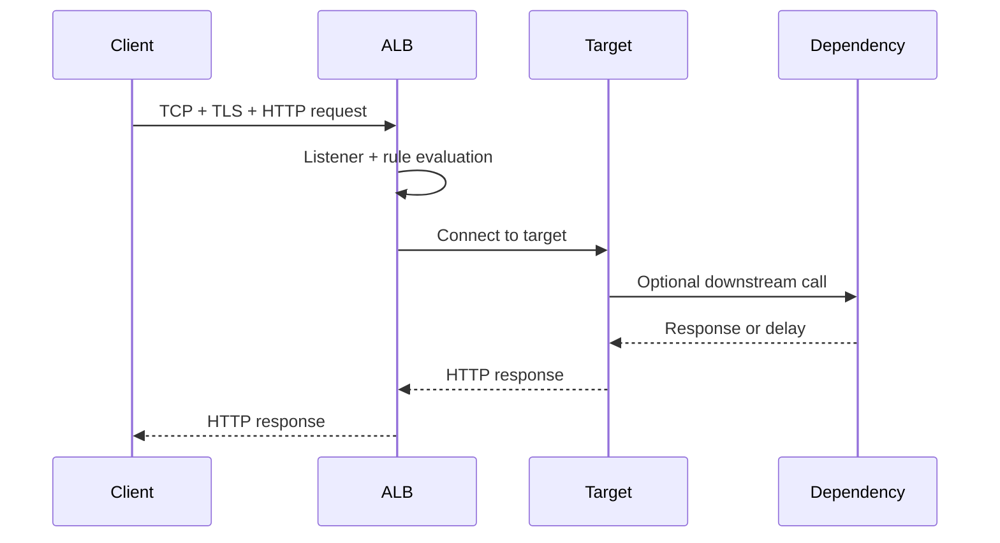
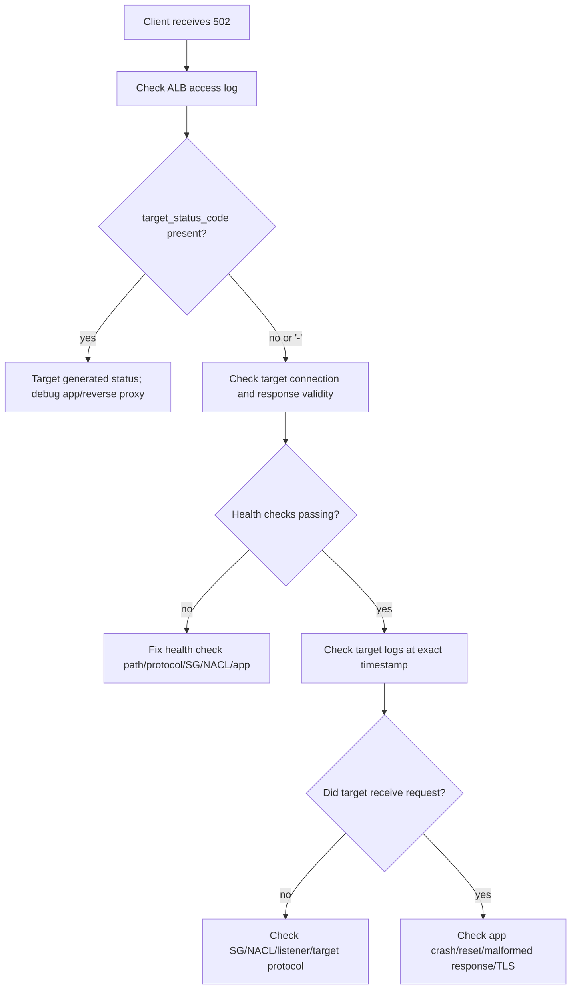
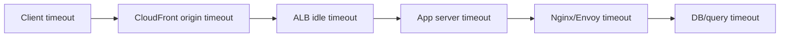
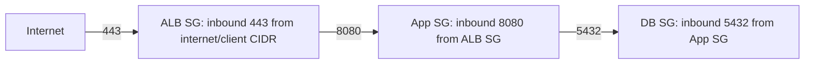
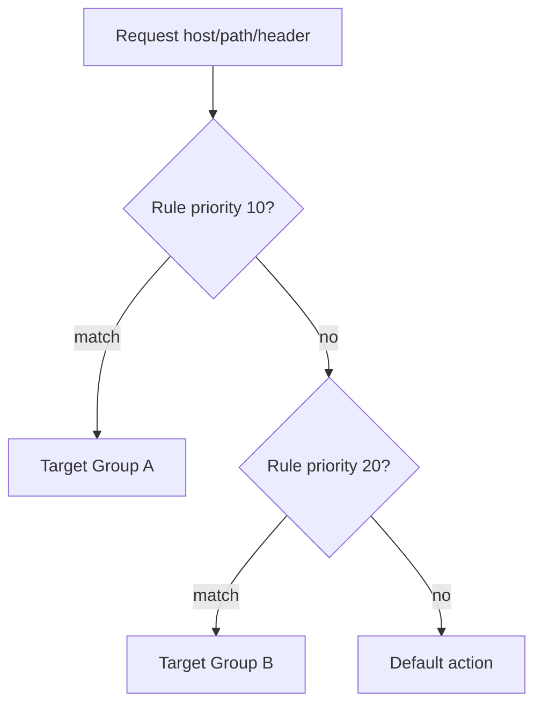
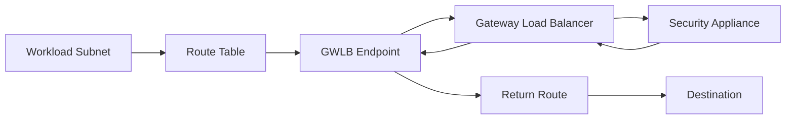

# Part 053 — Load Balancer Failure and Debugging

Load balancer debugging is not about memorizing HTTP status codes. It is about proving where the request died.

A load balancer sits between two independently failing worlds:

1. the client side, where DNS, TLS, internet routing, edge proxies, corporate networks, and browsers can fail; and
2. the target side, where subnets, route tables, security groups, NACLs, target health, application threads, kernel queues, certificates, and dependency latency can fail.

Most production mistakes happen because engineers treat an ALB/NLB/GWLB error as if it belongs to one layer. It rarely does. A single `504` can be caused by application latency, target connection timeout, security group drift, NACL return-path denial, idle timeout mismatch, packet loss, bad target registration, or a dependency behind the target that is slow enough to make the load balancer look guilty.

The right mental model is:

> A load balancer is a junction. Debug the junction by proving each segment of the path independently.



This part is a production runbook. The goal is not to explain every ELB feature again. Parts 048–052 already built the model. Here we focus on **how failures present, how to isolate them, and how to avoid false conclusions**.

---

## 1. The Debugging Invariant

Every load balancer incident should be reduced to these questions:

1. Did the client reach the load balancer?
2. Did the load balancer choose a listener and rule?
3. Did the chosen target group have healthy targets?
4. Did the load balancer connect to a target?
5. Did the target accept the connection?
6. Did the target return a response before timeout?
7. Did the response survive the path back to the client?
8. Did any middle layer mutate, reset, block, or cache the result?

Do not start with “why is ALB broken?” Start with a path proof.



The invariant is simple:

> A load balancer error is only meaningful after you know which side generated it.

For ALB, this means looking at CloudWatch metrics and access logs to separate `elb_status_code` from `target_status_code`. For NLB, this means combining target health, TCP metrics, VPC Flow Logs, target host logs, and packet-level symptoms. For GWLB, this means proving route-table steering, endpoint behavior, GENEVE delivery, appliance health, and return symmetry.

---

## 2. Signals You Need Before Touching Config

Before changing anything, gather these signals:

| Signal | Why It Matters |
|---|---|
| Exact timestamp with timezone | Required to align LB logs, target logs, app traces, Flow Logs, and client reports. |
| Client IP / region / ASN / network | Separates global path problems from workload problems. |
| URL, method, host, path, headers if safe | ALB rule and CloudFront behavior selection often depend on host/path/header. |
| HTTP status from client | Symptom, not root cause. |
| `elb_status_code` and `target_status_code` | Separates ALB-generated error from target-generated error. |
| Target group health reason | Indicates if failure is before or after routing to a target. |
| Load balancer metrics | Reveals surge, reset, timeout, TLS negotiation, unhealthy host, target response time. |
| VPC Flow Logs | Proves accept/reject at ENI/subnet boundary. |
| Application logs/traces | Proves whether app received request and where it waited. |
| Recent deploy/network/IaC change | Most incidents are change-induced. |

Debugging without timestamps creates ghost stories. Debugging without `elb_status_code` vs `target_status_code` creates blame loops.

---

## 3. ALB Failure Taxonomy

Application Load Balancer is an L7 proxy. It terminates client-side HTTP/HTTPS, evaluates listener rules, opens or reuses connections to targets, waits for responses, and emits HTTP status codes.

That means ALB can fail at multiple points:



A production ALB incident usually lands in one of these buckets:

| Symptom | Likely Boundary |
|---|---|
| DNS resolves wrong / stale target | Route 53 / client resolver / alias record |
| TCP connect to ALB fails | SG/NACL/route/client network/public exposure |
| TLS handshake fails | Certificate/SNI/security policy/client compatibility |
| 404 from ALB | Listener rule/default action/path/host mismatch |
| 301/302 loop | Redirect rule/app redirect/proxy headers |
| 400 from ALB | Malformed request/header issue/size limits/protocol issue |
| 401/403 | ALB auth/WAF/app auth/origin policy |
| 502 | Bad gateway: target closed, invalid response, TLS to target issue, Lambda target error, connection reset |
| 503 | No healthy targets, target group unavailable, capacity/registration issue |
| 504 | Target did not respond before timeout or connection could not complete in time |
| Intermittent errors | target imbalance, unhealthy subset, cross-zone, deploy rollout, connection reuse, keepalive mismatch |

The table is not a replacement for diagnosis. It is a hypothesis generator.

---

## 4. ALB 502: Bad Gateway

A `502` means the ALB could not successfully act as a gateway to the target. It does not automatically mean the target application returned `502`.

The first question:

> Is the `502` generated by the load balancer or by the target?

Use access logs:

```text
elb_status_code=502
target_status_code=-
```

This usually means the ALB failed before receiving a valid response from the target.

```text
elb_status_code=502
target_status_code=502
```

This usually means the target returned `502`, and ALB forwarded it.

Common ALB-generated `502` causes:

1. target closes the TCP connection unexpectedly;
2. target resets the connection;
3. target returns malformed HTTP response;
4. ALB expects HTTPS to target but target is speaking HTTP, or vice versa;
5. TLS handshake between ALB and target fails;
6. target certificate/protocol/cipher mismatch on HTTPS target group;
7. Lambda target integration error;
8. target is overloaded and crashes/terminates connection;
9. keep-alive/idle timeout mismatch causes stale pooled connection behavior.

### 4.1 Debugging ALB 502

Use this order:



Commands from a debug host in the same VPC/subnet context:

```bash
# HTTP target group health path
curl -v http://TARGET_PRIVATE_IP:TARGET_PORT/health

# HTTPS target group health path
curl -vk https://TARGET_PRIVATE_IP:TARGET_PORT/health

# See response headers and protocol behavior
curl -v --http1.1 http://TARGET_PRIVATE_IP:TARGET_PORT/

# Test host header if app depends on it
curl -v -H 'Host: app.example.com' http://TARGET_PRIVATE_IP:TARGET_PORT/
```

For HTTPS target groups, test the SNI/certificate path:

```bash
openssl s_client -connect TARGET_PRIVATE_IP:443 -servername app.example.com -showcerts
```

Watch for:

- target speaks HTTP while target group protocol is HTTPS;
- target requires SNI but ALB connection does not match expectation;
- reverse proxy returns invalid chunked response;
- app closes connection before response body finishes;
- target process restarts during deployment;
- container/pod is registered before actually ready;
- target has high CPU/GC pause/event loop stall.

### 4.2 502 and Deployment Race Conditions

A classic production failure:

1. new target is registered;
2. health endpoint returns `200` too early;
3. real request path still cannot serve traffic;
4. ALB routes traffic to it;
5. users see `502`/`504` intermittently;
6. health checks continue passing because `/health` is shallow.

A production health check is not “process is alive.” It should prove the target can serve the traffic class it is about to receive.

Good target readiness usually includes:

- HTTP server is bound to the correct port;
- app has loaded config/secrets;
- database connection pool is initialized, or app intentionally degrades;
- migration gate is passed;
- dependency clients are ready;
- warmup completed if cold start matters;
- target can handle request under expected headers/path.

Do not make health checks expensive. But do not make them meaningless.

---

## 5. ALB 503: Service Unavailable

A `503` from ALB often means there are no healthy targets available for the selected target group, or the request could not be routed to a usable backend.

Common causes:

1. all targets unhealthy;
2. no targets registered;
3. listener rule forwards to wrong or empty target group;
4. target group health check misconfigured;
5. target registered in wrong port;
6. target security group blocks health check;
7. NACL blocks health check return path;
8. deployment drained old targets before new targets became healthy;
9. ECS/EKS readiness and target registration are out of sync;
10. weighted target group rollout sends traffic to an empty/unhealthy group.

### 5.1 Debugging ALB 503

Start with target group health:

```bash
aws elbv2 describe-target-health \
  --target-group-arn arn:aws:elasticloadbalancing:REGION:ACCOUNT:targetgroup/NAME/ID
```

Then inspect listener rules:

```bash
aws elbv2 describe-rules \
  --listener-arn arn:aws:elasticloadbalancing:REGION:ACCOUNT:listener/app/NAME/...
```

Verify:

- request host/path really matches the intended rule;
- target group attached to rule is expected;
- target group has registered targets;
- health check protocol/port/path/status matcher are correct;
- target security group allows inbound from ALB security group;
- NACL allows health check request and response;
- target is listening on the registered port;
- autoscaling lifecycle hooks are not terminating healthy capacity too aggressively.

### 5.2 Health Check Reason Codes as Clues

Health reason codes are not noise. They are the fastest pointer to the failing boundary.

| Reason Class | Interpretation |
|---|---|
| Timeout | ALB could not get response before health timeout. Check app latency, SG, NACL, route, wrong port. |
| Connection failed | Target not listening, SG/NACL denies, wrong target port, process down. |
| HTTP code mismatch | App responded, but not with expected status. Check path/auth/redirect. |
| Target not registered / unused | Registration, AZ, rule, or target group lifecycle issue. |

A health check that receives `301` but expects `200` is still unhealthy. A health check endpoint behind auth can make all targets unhealthy. A health check path that redirects from HTTP to HTTPS can break if the target group expects HTTP and matcher is too narrow.

---

## 6. ALB 504: Gateway Timeout

A `504` means the ALB did not receive a timely response from the target or could not complete the connection in the required time window.

Common causes:

1. application request takes longer than ALB idle timeout;
2. target connects but stalls before headers;
3. target starts response but pauses longer than timeout;
4. target dependency is slow;
5. backend connection pool exhaustion;
6. target thread pool/event loop saturation;
7. security group/NACL/route prevents target connection or return path;
8. target CPU/memory/GC saturation;
9. long-running request is implemented over synchronous HTTP when it should be async/job-based;
10. idle timeout mismatch across CloudFront → ALB → target → app server.

### 6.1 The Timeout Chain

Timeouts are a chain, not a single setting.



If the database can take 90 seconds, the app server waits 90 seconds, but ALB idle timeout is 60 seconds, the user sees a load balancer timeout. The root cause is still request design or dependency latency.

Production rule:

> Timeouts should become shorter as you move inward only when the inner layer can fail fast and return a controlled error. Otherwise, you create ambiguous outer-layer failures.

### 6.2 Debugging ALB 504

Check ALB metrics:

- `HTTPCode_ELB_5XX_Count`
- `HTTPCode_Target_5XX_Count`
- `TargetResponseTime`
- `TargetConnectionErrorCount`
- `HealthyHostCount`
- `UnHealthyHostCount`

Correlate with target metrics:

- CPU
- memory
- network packets dropped
- open file descriptors
- thread pool saturation
- event loop lag
- GC pause
- database pool wait time
- p95/p99 latency
- dependency error/timeout

Then reproduce inside the VPC:

```bash
time curl -v http://TARGET_PRIVATE_IP:PORT/problem-path
```

If direct target call is slow, ALB is not the root cause. If direct target call is fast but ALB path is slow, inspect connection reuse, headers, host-based routing, TLS, WAF, CloudFront, and target group distribution.

---

## 7. Target Health Is Not Application Health

Target health checks answer one narrow question:

> Can the load balancer reach the configured health endpoint and receive an acceptable response within the configured threshold?

They do not automatically prove:

- all routes work;
- all dependencies are healthy;
- auth works;
- writes work;
- p99 latency is acceptable;
- the service can survive traffic spike;
- all AZs have symmetric behavior;
- all versions deployed are compatible.

A service can be “healthy” to ALB and broken for users.

### 7.1 Health Check Design Patterns

| Pattern | Use Case | Risk |
|---|---|---|
| Shallow `/health` | Process readiness only | Can route traffic to app with broken dependencies. |
| Deep `/ready` | Deployment readiness | Can amplify dependency outage if too strict. |
| Synthetic user path | Critical journey validation | More expensive, needs isolation from normal user state. |
| Dependency-aware degraded check | Apps that can serve partial mode | Requires careful semantic design. |
| Build/version check | Rollout safety | Does not prove runtime health. |

A good production setup often uses multiple health concepts:

- ALB health check: lightweight readiness for traffic routing;
- service readiness: app-level lifecycle gate;
- synthetic canary: critical user journey;
- SLO metrics: real traffic success/latency;
- deployment controller: prevents bad versions from taking traffic.

### 7.2 Health Check Anti-Patterns

Avoid these:

```text
/health returns 200 before app is ready
/health checks only process uptime
/health requires external dependency that fails frequently
/health requires authentication token that rotates
/health redirects from HTTP to HTTPS unintentionally
/health is cached by reverse proxy
/health hits database with expensive query every few seconds
/health returns 200 even after app enters shutdown/draining
```

Health checks are part of your control plane. Treat them as API contracts.

---

## 8. Security Group and NACL Failures

Most load balancer network failures are not exotic. They are policy mismatch.

### 8.1 ALB Security Group Pattern

Typical ALB pattern:



Correct intent:

- ALB SG allows inbound from client CIDR or internet on listener port.
- ALB SG allows outbound to target port.
- Target SG allows inbound from ALB SG on target port.
- Target SG allows outbound response traffic automatically because SG is stateful.

Common mistake:

```text
Target SG allows inbound from client CIDR instead of ALB SG.
```

The target does not see the original TCP connection from the client in normal ALB mode. It sees traffic from ALB nodes. For app identity, use headers like `X-Forwarded-For`; for network allowlist, allow the ALB security group.

### 8.2 NACL Return-Path Failures

NACLs are stateless. If you use restrictive NACLs, you need both directions.

For ALB → target health check/request:

| Direction | Rule Needed |
|---|---|
| ALB subnet outbound | To target subnet on target port |
| Target subnet inbound | From ALB subnet on target port |
| Target subnet outbound | To ALB subnet ephemeral port range |
| ALB subnet inbound | From target subnet ephemeral port range |

Because NACLs are subnet-level and stateless, ephemeral return-path mistakes create confusing timeouts.

Debug with Flow Logs:

```sql
filter action = 'REJECT'
filter srcaddr = '<alb-node-or-subnet-range>' or dstaddr = '<target-ip>'
```

Do not overfit NACLs unless you have a strong governance reason. Security Groups are usually the correct workload boundary.

---

## 9. Listener and Rule Failures

ALB listener rules are deterministic. Humans are not.

A common incident:

```text
api.example.com/v1/orders should route to orders-v2 target group.
But a broader /v1/* rule with higher priority catches it first.
```

Always inspect rule priority as an ordered decision list.



Debug checklist:

- Is the `Host` header what you think it is?
- Is CloudFront forwarding the original Host header or origin Host?
- Is HTTP redirected to HTTPS before rule evaluation you expected?
- Is path normalized by client/proxy/app?
- Are query/header conditions case-sensitive where relevant?
- Is the default action masking unmatched traffic?
- Are weighted target groups sending some traffic to a bad group?

Use ALB access logs to confirm which target group was selected when available. If logs are not enabled, enable them before the next incident.

---

## 10. TLS and Certificate Failures

TLS failures are often misclassified as “network down.” They are handshake contract failures.

### 10.1 Client → ALB TLS

Check:

- certificate covers requested hostname;
- SNI is sent by client;
- listener has correct certificate selection;
- security policy supports client TLS version/ciphers;
- certificate not expired;
- ACM certificate is in correct Region for ALB;
- DNS points to the intended load balancer;
- CloudFront, if present, has its own certificate in the required Region for CloudFront.

Test:

```bash
openssl s_client -connect app.example.com:443 -servername app.example.com -showcerts
```

### 10.2 ALB → Target TLS

For HTTPS target groups:

- target must speak TLS on the target port;
- certificate/SNI expectations must be compatible;
- backend proxy should produce valid HTTP after TLS;
- health check protocol must match target behavior;
- app should not require client certificate unless ALB target-side TLS supports your architecture.

Many teams accidentally set target group protocol to HTTPS because “the service is secure,” while the container only listens on HTTP behind the ALB. The result is often `502` or failed health checks.

A reasonable internal pattern:

```text
Internet/Client -> HTTPS ALB listener -> HTTP target group inside trusted VPC
```

A stricter pattern:

```text
Internet/Client -> HTTPS ALB listener -> HTTPS target group -> app proxy
```

Choose intentionally. Do not mix accidentally.

---

## 11. Redirect Loops and Header Trust

When ALB terminates TLS and forwards HTTP to targets, the app must understand the original scheme.

ALB commonly forwards:

```text
X-Forwarded-For: <client-ip>, <proxy-chain>
X-Forwarded-Proto: https
X-Forwarded-Port: 443
```

If the app ignores `X-Forwarded-Proto`, it may think the request is HTTP and redirect to HTTPS. The client retries HTTPS to ALB, ALB forwards HTTP to target, target redirects again.

Result:

```text
ERR_TOO_MANY_REDIRECTS
```

Fix options:

- configure framework proxy headers correctly;
- terminate TLS at target too;
- move redirects to ALB listener rule;
- ensure CloudFront → ALB protocol policy and app redirect logic agree.

Header trust must be explicit. Do not trust arbitrary `X-Forwarded-*` from the public internet unless the load balancer/proxy boundary sanitizes or app is configured to trust only known proxies.

---

## 12. NLB Failure Taxonomy

Network Load Balancer is L4. It does not understand HTTP application semantics the way ALB does.

NLB issues often look like:

- TCP connection refused;
- TCP timeout;
- connection reset;
- TLS handshake failure;
- UDP no response;
- intermittent target imbalance;
- health check mismatch;
- client IP preservation routing issue;
- PrivateLink consumer cannot connect;
- targets unhealthy despite app being up.

Because NLB is less application-aware, your debugging must lean more on:

- target health;
- Flow Logs;
- target host metrics;
- packet capture if needed;
- client-side TCP/TLS traces;
- application listener logs.

### 12.1 NLB Health Check Failures

Check:

- target is registered with correct port;
- target is in an enabled AZ;
- target SG allows health check traffic;
- NACL allows both directions;
- health check protocol matches target behavior;
- for TLS health checks, target TLS behavior is compatible;
- target responds before timeout;
- target is not overloaded.

Debug from VPC:

```bash
nc -vz TARGET_PRIVATE_IP TARGET_PORT
curl -v http://TARGET_PRIVATE_IP:TARGET_PORT/health
openssl s_client -connect TARGET_PRIVATE_IP:443 -servername app.example.com
```

### 12.2 Client IP Preservation and Return Routing

When client IP preservation is enabled, targets see the original client IP as source. This is useful for allowlisting and logs, but it changes routing requirements.

Potential failure:

```text
Target sees source IP as external client.
Target response route goes to NAT/TGW/local route instead of back through expected path.
```

This can produce asymmetric routing or dropped responses.

When client IP preservation is enabled, ask:

- Does the target route table know how to return to client CIDRs?
- Are NACLs allowing client CIDR ephemeral return path?
- Are target firewalls allowing original client source?
- Is the target OS reverse path filtering configured in a way that drops packets?
- Is traffic crossing TGW/inspection where symmetry matters?

### 12.3 NLB TLS Listener vs TCP Listener

Use NLB TLS listener when:

- NLB should terminate TLS;
- you want ACM certificate at NLB;
- target can receive plaintext or re-encrypted flow depending design;
- L7 inspection is not needed.

Use NLB TCP listener when:

- target must terminate TLS;
- mTLS must be handled by target;
- protocol is not HTTP but rides on TCP;
- you need full end-to-end TLS transparency.

TLS failures with NLB are often wrong listener type, wrong certificate/SNI assumption, or target expecting mTLS while NLB terminated the client certificate boundary.

---

## 13. GWLB Failure Taxonomy

Gateway Load Balancer failures are different. GWLB is often invisible to application teams because it is inserted through route tables and endpoints.

GWLB incidents usually involve:

1. traffic not steered to GWLB endpoint;
2. return path bypasses inspection;
3. appliance unhealthy;
4. appliance drops packet by policy;
5. GENEVE path/MTU issue;
6. cross-zone and appliance state asymmetry;
7. route table points to wrong endpoint;
8. fail-open/fail-closed behavior misunderstood;
9. inspection VPC route propagation drift;
10. appliance scaling lag.

Debug path:



Questions:

- Which subnet route table should steer traffic?
- Is the specific destination route pointing to GWLB endpoint?
- Is the return path also steered as expected?
- Is appliance target healthy?
- Does appliance policy allow the traffic?
- Are packets too large after GENEVE encapsulation?
- Is appliance stateful and receiving both directions?

For GWLB, Flow Logs alone may not reveal appliance internal decisions. You often need appliance logs plus VPC route proof.

---

## 14. Cross-Zone Load Balancing Failure Modes

Cross-zone behavior affects both availability and data path.

If cross-zone is disabled or traffic is zonal, clients hitting a load balancer node in one AZ may only be served by targets in that AZ. If that AZ has unhealthy or insufficient targets, users can see failures even though other AZs have healthy capacity.

Failure examples:

```text
AZ-a has ALB node receiving traffic.
AZ-a target group has zero healthy targets.
AZ-b has healthy targets.
Cross-zone disabled or constrained path.
Some users fail, others succeed.
```

Debug checklist:

- Are all enabled AZs configured on the load balancer?
- Are subnets selected for each AZ?
- Are targets registered in each AZ?
- Is cross-zone enabled or disabled for the relevant load balancer/target group type?
- Are target health metrics grouped by AZ?
- Are Route 53/Global Accelerator/CloudFront sending traffic unevenly?
- Are zonal shifts or ARC controls active?

Design rule:

> Either build every enabled AZ to be independently capable, or explicitly accept cross-zone dependency and cost behavior.

---

## 15. Idle Timeout, Keepalive, and Connection Reuse

Load balancer incidents often come from connection lifecycle mismatches.

Example:

```text
ALB idle timeout = 60s
Target keepalive timeout = 5s
ALB reuses a connection target already closed
Intermittent 502 appears under low traffic
```

Or:

```text
Client long-polls for 120s
ALB idle timeout = 60s
ALB closes connection
Client reports timeout
```

Tune the chain:

| Layer | Setting Concept |
|---|---|
| Client | request timeout, socket timeout, retry budget |
| CloudFront | origin connection/read/response timeout depending config |
| ALB | idle timeout, HTTP client keepalive duration |
| Reverse proxy | keepalive timeout, proxy read timeout |
| App server | request timeout, graceful shutdown timeout |
| Dependency client | connect/read timeout |

Do not just increase every timeout. That hides saturation and increases resource holding time. Use longer timeouts only for intentionally long-lived protocols such as WebSocket/streaming/long-polling, and design backpressure carefully.

---

## 16. Access Logs: How to Read Them Like Evidence

ALB access logs are one of the best incident tools. They reveal:

- client IP/port;
- target IP/port;
- request processing time;
- target processing time;
- response processing time;
- ELB status code;
- target status code;
- request line;
- user agent;
- chosen certificate;
- TLS protocol/cipher;
- target group ARN;
- trace ID.

The three timing fields are especially useful:

```text
request_processing_time target_processing_time response_processing_time
```

Interpretation examples:

| Pattern | Likely Meaning |
|---|---|
| high request processing time | slow client upload, WAF/auth/ALB processing, request body handling |
| high target processing time | app/dependency latency |
| high response processing time | slow client download, response transfer bottleneck |
| target status `-` | target did not produce a valid response |
| elb 5xx, target `-` | generated by ALB before valid target response |
| elb 200, target 500 | target produced 500 but ALB status can reflect forwarded response depending context; verify fields carefully |

For NLB, access logs are more limited and TLS-focused depending listener. You often need Flow Logs, target logs, and application telemetry.

---

## 17. CloudWatch Metrics That Actually Matter

### 17.1 ALB Metrics

| Metric | Use |
|---|---|
| `RequestCount` | Traffic volume baseline. |
| `HTTPCode_ELB_4XX_Count` | ALB-generated client errors. |
| `HTTPCode_ELB_5XX_Count` | ALB-generated server-side errors. |
| `HTTPCode_Target_4XX_Count` | Target-generated client errors. |
| `HTTPCode_Target_5XX_Count` | Target-generated server errors. |
| `TargetResponseTime` | Target latency as seen by ALB. |
| `TargetConnectionErrorCount` | ALB could not connect to target. |
| `RejectedConnectionCount` | Load balancer rejected connections. |
| `HealthyHostCount` | Healthy targets. |
| `UnHealthyHostCount` | Unhealthy targets. |
|

Use dimensions carefully. Aggregate metrics hide AZ-specific or target-group-specific failures.

### 17.2 NLB Metrics

| Metric | Use |
|---|---|
| `ActiveFlowCount` | Active TCP/UDP flows. |
| `NewFlowCount` | New connection/flow rate. |
| `TCP_Client_Reset_Count` | Client-side resets. |
| `TCP_Target_Reset_Count` | Target-side resets. |
| `TCP_ELB_Reset_Count` | NLB-generated resets. |
| `UnHealthyHostCount` | Target health. |
| `PortAllocationErrorCount` | Indicates port allocation pressure in relevant NLB modes. |

Reset metrics help locate who closed the connection. That is often more valuable than the error message.

---

## 18. VPC Flow Logs for Load Balancer Debugging

Flow Logs answer: did packets flow at ENI level, and were they accepted or rejected?

For load balancer debugging, use Flow Logs to prove:

- ALB/NLB subnets can reach target subnets;
- target ENIs receive traffic;
- NACL/SG rejects are occurring;
- return path exists;
- wrong source/destination/port is being used;
- traffic is landing in unexpected AZ/subnet;
- health checks are reaching target.

Example Athena-style questions:

```sql
-- rejected traffic to target port
SELECT srcaddr, dstaddr, dstport, action, count(*)
FROM vpc_flow_logs
WHERE dstaddr = '10.20.3.45'
  AND dstport = 8080
  AND action = 'REJECT'
GROUP BY srcaddr, dstaddr, dstport, action;
```

```sql
-- accepted health check traffic pattern
SELECT srcaddr, dstaddr, dstport, action, packets, bytes
FROM vpc_flow_logs
WHERE dstaddr = '10.20.3.45'
  AND dstport = 8080
ORDER BY start DESC
LIMIT 50;
```

Limitations:

- Flow Logs are metadata, not packet payload.
- They do not show HTTP status.
- They may aggregate flows across windows.
- They do not prove application accepted a request, only network-level flow behavior.
- `ACCEPT` does not mean the app worked.

---

## 19. Packet Capture: When Logs Are Not Enough

Use packet capture sparingly. It is useful when you need to prove:

- TCP handshake behavior;
- reset source;
- retransmissions;
- TLS handshake failure;
- protocol mismatch;
- MTU/path fragmentation issue;
- malformed response;
- appliance/GWLB behavior.

On a target host:

```bash
sudo tcpdump -nn -i eth0 host <client-or-lb-ip> and port <port>
```

For TLS handshake:

```bash
sudo tcpdump -nn -i eth0 tcp port 443 -w tls-debug.pcap
```

Do not capture sensitive payloads unless you have authorization and data-handling controls. Packet capture is a scalpel, not default observability.

---

## 20. Kubernetes/ECS Target Failure Patterns

Even though this series is not repeating container orchestration, load balancers often front ECS/EKS workloads.

Common ECS/EKS patterns:

| Failure | Cause |
|---|---|
| target registered too early | readiness probe and target registration not aligned |
| target remains registered after shutdown | drain/grace period too short |
| pod IP target unhealthy | security group for pods, CNI, NACL, node routing |
| ALB rule points to old target group | ingress/controller drift |
| intermittent 503 during rollout | zero healthy targets during replacement |
| 502 after deploy | app not ready despite health check success |
| 504 under load | pod CPU throttling, thread pool saturation, downstream dependency |

Production rule:

> The deployment controller, container readiness, target group health, and app readiness endpoint must agree on what “ready” means.

---

## 21. PrivateLink and NLB Provider Debugging

When NLB is used as a PrivateLink provider front door, debugging has two sides:

- provider VPC: endpoint service, NLB, target group, targets;
- consumer VPC: interface endpoint ENIs, endpoint SG, private DNS, client route/DNS.

Failure questions:

- Is endpoint connection accepted?
- Is Private DNS enabled and verified if required?
- Does consumer resolve service name to endpoint ENI private IPs?
- Does endpoint SG allow client inbound?
- Does NLB target group have healthy targets?
- Does target allow traffic from NLB path?
- Is source IP expectation correct? PrivateLink changes source visibility patterns.
- Are AZ mappings aligned between provider and consumer?

PrivateLink failures often look like “service is down” to consumer teams while provider targets are healthy. You need both sides of the path.

---

## 22. A Production Incident Runbook

Use this as a standard runbook.

### Step 1 — Classify the Failure

```text
Who reports it?
Which hostname?
Which path?
Which client region/network?
Which status/error?
When exactly?
All users or subset?
Recent change?
```

### Step 2 — Resolve the Front Door

```bash
dig +short app.example.com
curl -vk https://app.example.com/health
```

Confirm expected front door:

- Route 53 alias;
- CloudFront distribution;
- Global Accelerator static IP;
- ALB/NLB DNS name;
- private DNS endpoint.

### Step 3 — Check LB Metrics

Look for:

- ALB-generated vs target-generated 5xx;
- healthy host count drop;
- target response time spike;
- target connection errors;
- reset counts;
- rejected connections;
- zonal imbalance.

### Step 4 — Check Logs

For ALB:

- access logs;
- WAF logs if attached;
- target app logs;
- Flow Logs.

For NLB:

- target logs;
- Flow Logs;
- packet capture if needed;
- TLS logs where available.

### Step 5 — Prove Target Path

From inside VPC:

```bash
curl -v http://TARGET_IP:PORT/health
curl -v -H 'Host: app.example.com' http://TARGET_IP:PORT/problem-path
```

### Step 6 — Inspect Network Policy

Check:

- ALB/NLB SG;
- target SG;
- NACLs;
- route tables;
- endpoint routes;
- TGW route tables if cross-VPC;
- inspection/firewall policy.

### Step 7 — Inspect Runtime

Check:

- app process alive;
- error logs;
- dependency latency;
- thread/event loop saturation;
- CPU/memory/GC;
- container restarts;
- deploy timeline;
- autoscaling activity.

### Step 8 — Mitigate Before Root Cause If Needed

Mitigations:

- roll back deployment;
- remove bad targets;
- increase capacity;
- shift traffic away from broken AZ/target group;
- adjust health check temporarily;
- disable bad rule;
- drain problematic targets;
- bypass broken edge layer if safe;
- lower traffic dial/weight for bad group.

Do not make permanent architecture changes during incident unless the failure mode is fully understood.

---

## 23. Load Balancer Anti-Patterns

### Anti-Pattern 1 — One Health Check for Everything

A shallow health check hides broken dependencies. A too-deep health check turns dependency brownouts into full traffic evacuation.

Use layered health semantics.

### Anti-Pattern 2 — Treating 5xx as All the Same

`502`, `503`, and `504` point to different boundaries. Always separate ALB-generated from target-generated status.

### Anti-Pattern 3 — Target SG Allows Client CIDR Instead of LB SG

For ALB, target should usually trust ALB SG, not arbitrary client CIDRs.

### Anti-Pattern 4 — Enabling Restrictive NACLs Without Return Path Design

Stateless NACLs require ephemeral return rules. Many teams break health checks this way.

### Anti-Pattern 5 — Ignoring AZ Symmetry

A multi-AZ load balancer does not automatically mean every AZ has healthy, routable, equivalent backend capacity.

### Anti-Pattern 6 — Using DNS Failover for Second-Level App Recovery

DNS caching makes failover approximate. Use health checks, load balancer routing, Global Accelerator, CloudFront origin failover, or application-level resilience where appropriate.

### Anti-Pattern 7 — Blind Timeout Increase

Increasing ALB timeout may reduce visible `504`, but can amplify resource exhaustion. Fix the slow path.

### Anti-Pattern 8 — No Access Logs Until After Incident

Logs enabled after the incident do not explain the incident. Enable observability before you need it.

---

## 24. Failure Mode Matrix

| Symptom | First Check | Likely Root Boundary | Fast Mitigation |
|---|---|---|---|
| ALB 502, target `-` | Access logs + target logs | Target connection/invalid response/TLS mismatch | Remove bad targets, fix target protocol, rollback |
| ALB 502, target 502 | Target app logs | App/reverse proxy/dependency | Rollback/fix app/dependency |
| ALB 503 | Target health | Empty/unhealthy target group | Register healthy targets, rollback rollout |
| ALB 504 | Target response time | App/dependency timeout | Scale, rollback, async path, tune timeout carefully |
| Health checks fail | Target health reason | SG/NACL/path/protocol/app readiness | Fix health endpoint/path/network |
| Intermittent by AZ | Metrics by AZ | Zonal target/route/capacity issue | Shift/drain AZ, restore capacity |
| TCP reset to NLB | Reset metrics + packet capture | Client/target/NLB connection lifecycle | Align timeout/protocol, fix target |
| PrivateLink consumer cannot connect | DNS + endpoint SG + provider TG | Consumer endpoint/provider NLB boundary | Accept endpoint, fix SG/DNS/target |
| GWLB traffic bypass | Route table proof | Missing route/return symmetry | Fix route steering |
| Redirect loop | Headers + app config | Proxy header/scheme mismatch | Configure `X-Forwarded-Proto`, move redirect |

---

## 25. Engineering Checklist Before Production

Before declaring a load-balanced service production-ready, verify:

```text
[ ] ALB/NLB/GWLB scheme is intentional: internet-facing or internal.
[ ] Enabled AZs match capacity and routing design.
[ ] Each enabled AZ has healthy target capacity or cross-zone behavior is intentional.
[ ] Target SG allows traffic from LB SG or intended source.
[ ] NACL rules support both request and return path if restrictive.
[ ] Health check path is meaningful and cheap.
[ ] Deployment readiness and target health are aligned.
[ ] Deregistration delay and graceful shutdown are aligned.
[ ] TLS certificate lifecycle is automated/monitored.
[ ] Access logs are enabled where useful.
[ ] CloudWatch alarms distinguish LB 5xx vs target 5xx.
[ ] Flow Logs are available for critical subnets/ENIs.
[ ] Timeout chain is documented.
[ ] Runbook includes commands and dashboards.
[ ] Synthetic canary covers critical path.
[ ] Rollback and traffic-shift procedure is tested.
```

---

## 26. Minimal Dashboards

A useful dashboard for ALB should show:

- request count;
- `HTTPCode_ELB_5XX_Count`;
- `HTTPCode_Target_5XX_Count`;
- `HTTPCode_ELB_4XX_Count`;
- `HTTPCode_Target_4XX_Count`;
- `TargetResponseTime` p50/p90/p99 if available via derived metrics/logs;
- `TargetConnectionErrorCount`;
- healthy/unhealthy host count by target group/AZ;
- target CPU/memory/app latency;
- deploy markers;
- WAF blocked count if attached.

A useful dashboard for NLB should show:

- active/new flow count;
- reset counts by source;
- unhealthy host count;
- processed bytes;
- TLS negotiation errors if using TLS listener;
- target host connection metrics;
- Flow Log reject count for target subnets;
- deploy markers.

Dashboards should answer: **is the load balancer failing, or is it reporting a target failure?**

---

## 27. Mental Model Recap

Load balancer debugging is evidence-driven path reduction.

Remember these invariants:

1. DNS tells clients where to go; it does not prove the path works.
2. Listener rules decide target group selection; priority matters.
3. Target health is a routing signal, not complete application truth.
4. Security Groups are stateful; NACLs are stateless.
5. ALB errors must be separated into load-balancer-generated vs target-generated.
6. NLB debugging is more TCP/Flow Log oriented because NLB is L4.
7. GWLB debugging is route symmetry + appliance health + GENEVE path.
8. Timeouts are chains.
9. Intermittent failures often mean subset failure: AZ, target group, version, path, client population, or connection reuse.
10. Observability must exist before incidents.

A strong engineer does not ask, “why did the load balancer return 502?”

A strong engineer asks:

> Which boundary generated the failure, and what evidence proves it?

---

## References

- AWS Documentation — Troubleshoot your Application Load Balancers: https://docs.aws.amazon.com/elasticloadbalancing/latest/application/load-balancer-troubleshooting.html
- AWS Documentation — Troubleshoot your Network Load Balancer: https://docs.aws.amazon.com/elasticloadbalancing/latest/network/load-balancer-troubleshooting.html
- AWS Documentation — Application Load Balancer access logs: https://docs.aws.amazon.com/elasticloadbalancing/latest/application/load-balancer-access-logs.html
- AWS Documentation — CloudWatch metrics for Application Load Balancers: https://docs.aws.amazon.com/elasticloadbalancing/latest/application/load-balancer-cloudwatch-metrics.html
- AWS Documentation — CloudWatch metrics for Network Load Balancers: https://docs.aws.amazon.com/elasticloadbalancing/latest/network/load-balancer-cloudwatch-metrics.html
- AWS Documentation — VPC Flow Logs: https://docs.aws.amazon.com/vpc/latest/userguide/flow-logs.html
