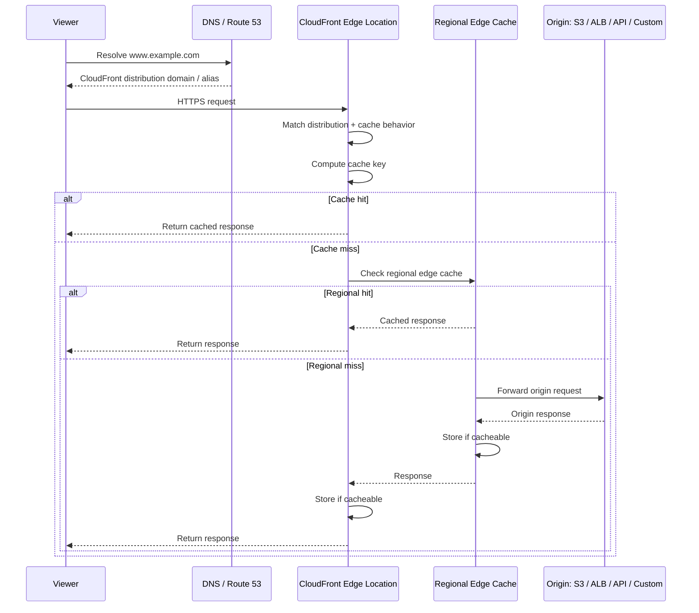
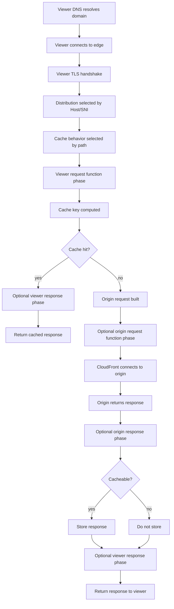
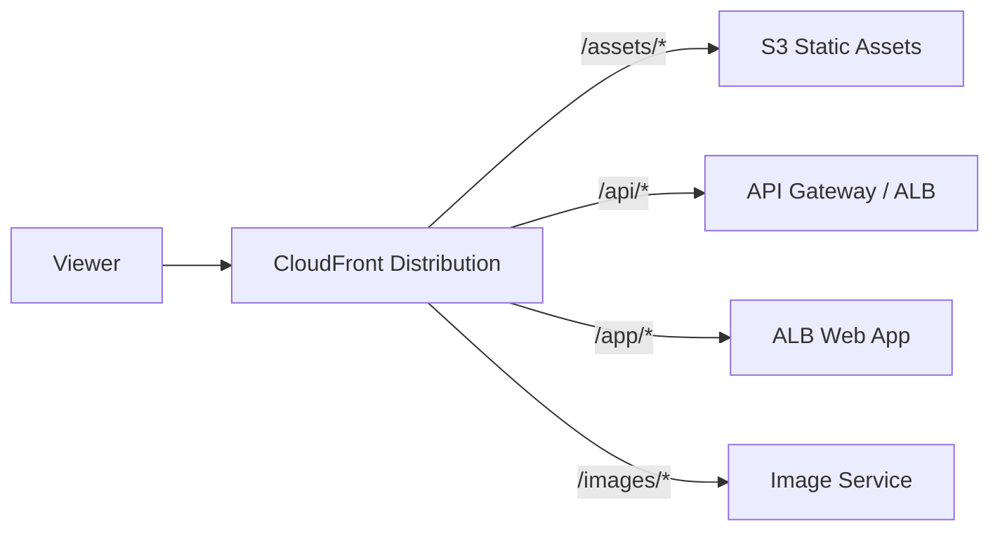
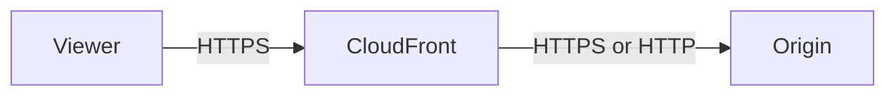
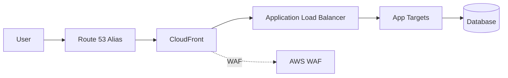

# Part 054 — CloudFront Mental Model

CloudFront is often introduced as “a CDN.” That definition is correct but too small.

In production architecture, CloudFront is a **global edge proxy, cache, TLS boundary, request router, origin shield, and security enforcement point**. It can reduce latency, absorb traffic spikes, protect origins, normalize URLs, route traffic by path, terminate viewer TLS, enforce geo/security policies, run lightweight code at the edge, and shift the load profile of your entire application.

But the most important thing to understand is this:

> CloudFront does not make a bad origin good. It changes the shape of traffic that reaches the origin.

A strong CloudFront design starts by asking:

1. Which requests should be cacheable?
2. Which request attributes define a unique response?
3. Which headers/cookies/query strings must reach the origin?
4. Which traffic should never hit the origin?
5. Which failures should be cached, retried, hidden, or surfaced?
6. Which layer owns authentication, authorization, rate limiting, and bot mitigation?
7. Which deployment strategy prevents stale content from becoming an outage?

This part builds the mental model. Later parts go deep into cache keys, origins, security, edge compute, invalidation, observability, and cost.

---

## 1. CloudFront as a Request Machine

A viewer request enters a global network. CloudFront chooses a nearby edge location, evaluates distribution configuration, finds the matching cache behavior, checks cache state, maybe runs edge logic, maybe forwards to origin, maybe caches the response, then returns to the viewer.



This request machine has three major decisions:

1. **Routing decision**: which behavior and which origin?
2. **Cache decision**: is there already a valid object for this cache key?
3. **Forwarding decision**: if not cached, what request should be sent to origin?

Most CloudFront architecture failures happen because teams blur these decisions together.

---

## 2. CloudFront Is Not Just Static Assets

CloudFront can serve:

- static websites;
- images, CSS, JS, fonts;
- video and large media;
- APIs;
- dynamic HTML;
- file downloads;
- software packages;
- private content;
- ALB-backed web apps;
- API Gateway-backed APIs;
- S3-backed content;
- custom origins;
- multi-origin applications.

The difference is not “static vs dynamic.” The real difference is:

> How much of the response can be reused across viewers and time?

A dynamic API can still benefit from CloudFront if:

- TLS is terminated closer to users;
- AWS global network improves path quality;
- WAF/rate limiting runs at edge;
- OPTIONS/CORS/preflight responses are cached;
- public reference data is cached;
- errors are shaped consistently;
- origins are shielded from bots and spikes;
- path-based routing unifies multiple origins.

CloudFront is not only a cache. But cache is the lever that can create the biggest performance and cost change.

---

## 3. Core Components

### 3.1 Distribution

A distribution is the top-level CloudFront configuration that tells CloudFront how to serve content.

It defines:

- alternate domain names/CNAMEs;
- viewer certificate;
- default root object;
- origins;
- default cache behavior;
- additional cache behaviors;
- logging;
- geo restrictions;
- custom error responses;
- WAF association;
- price class;
- HTTP version;
- IPv6;
- security policy;
- function associations;
- origin failover/origin groups.

Think of a distribution as a global edge application config.

### 3.2 Origin

An origin is where CloudFront fetches content on cache miss.

Common origins:

| Origin Type | Typical Use |
|---|---|
| S3 bucket / S3 static website endpoint | Static assets, downloads, websites. |
| ALB | Web app, dynamic origin, microservice front door. |
| API Gateway | API front door, serverless APIs. |
| EC2/custom origin | Legacy/custom HTTP server. |
| Media services | Streaming/media workflows. |
|

An origin is not automatically public-safe. You must decide whether origin should be reachable directly or only through CloudFront.

### 3.3 Cache Behavior

A cache behavior maps request path patterns to cache/origin rules.

A distribution has:

- one default cache behavior;
- zero or more ordered cache behaviors.

Example:

```text
/assets/*      -> S3 static assets origin, long TTL
/api/*         -> ALB/API origin, low or no cache, forward auth headers
/images/*      -> image origin, cache by query width/format
*              -> web app origin, default behavior
```

Cache behavior is the heart of CloudFront design. It decides:

- path pattern matching;
- target origin or origin group;
- viewer protocol policy;
- allowed HTTP methods;
- cached HTTP methods;
- cache policy;
- origin request policy;
- response headers policy;
- compression;
- edge function associations;
- signed URL/cookie requirement if configured.

### 3.4 Cache Policy

A cache policy controls the cache key and TTL behavior.

It answers:

> What request attributes make this response unique?

Attributes can include:

- path;
- query strings;
- headers;
- cookies;
- accepted compression variants;
- TTL values.

Bad cache key design can cause either:

- cache poisoning / wrong response reuse; or
- cache fragmentation / terrible hit ratio.

### 3.5 Origin Request Policy

An origin request policy controls what CloudFront sends to the origin when it needs to fetch.

It answers:

> What does the origin need to compute the response?

This is separate from the cache key. A header can be forwarded to origin without being part of the cache key, but you must be careful. If the origin varies response by a forwarded value that is not in the cache key, CloudFront can cache and serve the wrong variant.

### 3.6 Response Headers Policy

A response headers policy lets CloudFront add or override response headers, commonly for:

- security headers;
- CORS;
- custom headers;
- remove headers;
- server-timing.

This is useful because some cross-cutting HTTP behavior belongs at the edge rather than every origin service.

---

## 4. The CloudFront Request Lifecycle

CloudFront request lifecycle can be viewed as a pipeline.



Important distinction:

- viewer request/response phases are around the viewer-facing side;
- origin request/response phases happen only when CloudFront goes to origin;
- cache hits do not invoke origin phases.

This matters for edge compute. If logic must run on every request, viewer phase is relevant. If logic should run only on origin fetch, origin phase is relevant.

---

## 5. Cache Hit, Miss, Refresh, and Error

A CloudFront response should be interpreted by cache state.

| State | Meaning |
|---|---|
| Hit | Edge had a fresh cached object. Origin not contacted. |
| Miss | Edge did not have usable object. Origin contacted. |
| RefreshHit | Cached object existed but needed revalidation. |
| Error | CloudFront/origin error path. |
| LimitExceeded / CapacityExceeded | Edge or service limit behavior depending context. |

You will often see this through response headers such as `X-Cache` and logs.

Do not treat every origin request as bad. Some content should miss frequently. The issue is when content that should be cacheable has poor hit ratio due to bad cache key or low TTL.

---

## 6. Cache Key as a Correctness Boundary

The cache key is the identity of a response.

Simplified:

```text
cache_key = distribution + behavior + path + selected query strings + selected headers + selected cookies + encoding variant
```

If the cache key is too small, users can receive wrong content.

Example:

```text
Origin varies response by Authorization header.
Authorization is not part of cache key.
CloudFront caches response for User A.
User B receives User A's response.
```

If the cache key is too large, cache hit ratio collapses.

Example:

```text
Cache key includes every query string.
Marketing appends utm_source, utm_campaign, fbclid, gclid.
Same asset becomes thousands of unique cache objects.
Origin receives avoidable traffic.
```

The engineering problem is not “cache everything.” It is to define response identity precisely.

---

## 7. Origin Request as a Dependency Contract

The origin request is the contract between CloudFront and your origin.

You must decide:

- which headers the origin needs;
- whether Host header should be origin host or viewer host;
- which cookies are necessary;
- which query strings are necessary;
- whether CloudFront should compress;
- whether origin expects HTTP or HTTPS;
- how origin validates requests came through CloudFront;
- how origin handles forwarded client IP/protocol headers.

A common mistake:

```text
Forward all headers/cookies/query strings just to be safe.
```

This is rarely safe. It often destroys caching, increases origin load, and makes behavior harder to reason about.

A better approach:

```text
Forward only what the origin needs.
Include in the cache key only what changes the response.
```

---

## 8. Path-Based Multi-Origin Architecture

CloudFront can unify multiple backends behind one public domain.



This lets users see one domain:

```text
https://www.example.com/assets/app.js
https://www.example.com/api/orders
https://www.example.com/app/dashboard
https://www.example.com/images/product.jpg?w=800
```

But internally, each path can have different:

- origin;
- TTL;
- cache key;
- allowed methods;
- origin request policy;
- response headers;
- edge functions;
- auth model;
- WAF rules if scoped by path labels/custom logic.

This is powerful, but rule ordering matters. More specific path patterns must be evaluated correctly.

---

## 9. Viewer Protocol vs Origin Protocol

CloudFront has two separate protocol boundaries:

1. viewer → CloudFront;
2. CloudFront → origin.



Viewer protocol policy answers:

- allow HTTP and HTTPS?
- redirect HTTP to HTTPS?
- HTTPS only?

Origin protocol policy answers:

- connect to origin via HTTP only?
- HTTPS only?
- match viewer?

A common secure baseline:

```text
Viewer: redirect HTTP to HTTPS or HTTPS only
Origin: HTTPS only
```

For S3 REST origins with origin access control, the model differs from public S3 website endpoints. For ALB/custom origins, you must manage certificates, Host headers, security groups, and origin access protection intentionally.

---

## 10. CloudFront and TLS

CloudFront terminates viewer TLS at the edge.

Key design points:

- custom domain requires alternate domain name on distribution;
- viewer certificate must cover that domain;
- CloudFront has certificate Region requirements for ACM viewer certificates;
- minimum TLS version/security policy controls client compatibility;
- origin TLS is a separate connection;
- origin certificate must match expected hostname if using HTTPS;
- SNI/Host behavior matters for custom origins.

TLS failure boundaries:

| Failure | Likely Boundary |
|---|---|
| Browser certificate error | Viewer certificate/SAN/domain mismatch. |
| TLS version unsupported | Security policy/client compatibility. |
| CloudFront 502 with SSL negotiation error | Origin TLS/certificate/SNI mismatch. |
| Works via origin but not CloudFront | Alternate domain/cert/origin policy/header mismatch. |

CloudFront makes TLS global. But it also means certificate management becomes part of edge deployment discipline.

---

## 11. CloudFront Is a Security Boundary, Not a Complete Security System

CloudFront can help with:

- TLS termination;
- AWS WAF integration;
- Shield Standard integration by default for AWS edge services;
- geo restriction;
- signed URLs/cookies;
- origin access control for S3;
- custom headers to origin;
- origin shielding by blocking direct origin access;
- bot/rate controls through WAF;
- response security headers;
- request normalization with edge functions.

But CloudFront does not automatically solve:

- application authorization;
- tenant isolation;
- broken object-level authorization;
- insecure origin if public direct access remains;
- bad cache key with private content;
- leaked signed URL with long expiry;
- poor secret/header validation at origin;
- dependency failures;
- unsafe CORS design.

Security invariant:

> If origin must only be reachable through CloudFront, enforce that at the origin boundary. Do not rely on convention.

---

## 12. Origin Protection Patterns

### 12.1 S3 Origin

For private S3 content, prefer modern origin access control style patterns rather than public buckets.

Intent:

```text
Viewer -> CloudFront -> S3
No direct public S3 object access
```

Control points:

- S3 bucket policy allows CloudFront distribution/service principal as intended;
- public access block remains enabled where appropriate;
- signed URLs/cookies if content is private per user/license;
- cache behavior does not leak private variants.

### 12.2 ALB Origin

For ALB origin:

```text
Viewer -> CloudFront -> ALB -> App
```

Origin protection options:

- ALB security group allows only CloudFront origin-facing prefix list or controlled source ranges where applicable;
- custom origin header secret checked by app/ALB/WAF where appropriate;
- WAF at CloudFront and/or ALB depending inspection needs;
- origin certificate and Host header design;
- no public direct hostname advertised for ALB.

Be careful: if users can bypass CloudFront and hit ALB directly, they can bypass edge cache, WAF placement, signed URL logic, geo restrictions, and rate controls unless duplicated at origin.

---

## 13. Dynamic Content Through CloudFront

CloudFront for dynamic content is valid when designed carefully.

Examples:

| Dynamic Pattern | CloudFront Benefit |
|---|---|
| API with auth | TLS at edge, WAF, global network, DDoS absorption, request normalization. |
| Dynamic HTML | Faster TLS/connect, partial caching, compression, edge redirects. |
| GraphQL | WAF/rate limit, POST not cached by default, edge security. |
| Product catalog | Cache public reads, bypass or vary private/user-specific data. |
| Search | Cache popular anonymous queries, protect origin from spikes. |

Do not cache private dynamic responses unless cache key and authorization model are formally correct.

Rule:

```text
Public/shared response -> cache candidate
User-specific response -> do not cache unless identity is safely in cache key and policy is sound
Tenant-specific response -> cache only if tenant boundary is part of cache identity and access model is safe
Mutation response -> usually not cached
```

---

## 14. HTTP Methods and Caching

CloudFront can allow different HTTP methods.

Common patterns:

| Behavior | Allowed Methods | Cached Methods |
|---|---|---|
| Static assets | GET, HEAD | GET, HEAD |
| CORS static/API preflight | GET, HEAD, OPTIONS | GET, HEAD, OPTIONS if configured safely |
| API | GET, HEAD, OPTIONS, PUT, POST, PATCH, DELETE | Usually GET/HEAD, maybe OPTIONS |
| Web app | GET, HEAD, OPTIONS, POST | Usually GET/HEAD only or disabled caching |

POST/PUT/PATCH/DELETE are generally forwarded to origin and not cached like static GET. But their presence changes origin exposure and WAF/security posture.

CORS preflight caching is often a quick win. OPTIONS requests can be numerous and repetitive.

---

## 15. Error Handling Mental Model

CloudFront can receive errors from:

- viewer/client connection;
- CloudFront distribution config;
- WAF;
- origin DNS/connect/TLS;
- origin HTTP response;
- origin timeout;
- cache behavior mismatch;
- signed URL/cookie policy;
- geo restriction.

Errors can also be cached depending configuration and status.

Important question:

> Should this error be cached, hidden behind a custom page, retried through origin failover, or surfaced immediately?

Examples:

| Error | Possible Strategy |
|---|---|
| origin temporary 500 | short error TTL, origin failover, alert. |
| 404 for versioned static asset | longer cache may be acceptable, but deployment must avoid missing assets. |
| auth 403 | do not hide as generic origin error unless security wants it. |
| maintenance page | custom error response or controlled origin response. |
| API validation 400 | should not be transformed by CloudFront. |

CloudFront error handling is part of user experience and incident containment.

---

## 16. TTL Is a Contract With Time

TTL defines how long CloudFront may consider an object fresh.

Long TTL benefits:

- high cache hit ratio;
- lower origin load;
- lower latency;
- better spike absorption;
- lower data transfer from origin.

Long TTL risks:

- stale content;
- harder rollback if content is mutable;
- bad response can persist;
- invalidation dependence;
- user sees old app shell with new API assumptions.

Short TTL benefits:

- freshness;
- safer mutable content;
- easier operational change.

Short TTL risks:

- lower hit ratio;
- higher origin load;
- more latency;
- traffic spikes reach origin.

Production rule:

> Prefer immutable versioned assets with long TTL over mutable assets with frequent invalidation.

Example:

```text
Good:
/app.8f3a1c.js -> Cache-Control: public, max-age=31536000, immutable
/index.html   -> Cache-Control: no-cache or short TTL

Risky:
/app.js       -> long TTL but content changes in place
```

---

## 17. Cache Invalidation Is Not a Deployment Strategy

Invalidation is useful, but if every deployment depends on invalidating many mutable paths, the system is fragile.

Better strategy:

1. static assets are content-hashed;
2. HTML/app shell references new hashes;
3. old assets remain available during rollback window;
4. index/app shell has short TTL or revalidation;
5. invalidation is reserved for emergencies or small known paths.

Bad strategy:

```text
overwrite app.js
invalidate /*
hope every edge updates before users load mixed version
```

This can work at small scale. It becomes dangerous for globally distributed production systems.

---

## 18. CloudFront + Route 53 + ALB Mental Model

A common architecture:



Each layer has a job:

| Layer | Job |
|---|---|
| Route 53 | DNS answer and optional health/routing policy. |
| CloudFront | Edge proxy/cache/TLS/security/performance. |
| ALB | Regional L7 routing to app targets. |
| App | Business logic. |
| DB | State. |

Do not make every layer do every job.

For example:

- Use Route 53 for domain delegation and coarse routing.
- Use CloudFront for edge security/cache/global delivery.
- Use ALB for regional app routing and target health.
- Use app for authorization and business semantics.

---

## 19. CloudFront vs Global Accelerator vs Route 53 Revisited

From Part 047:

| Need | Best Fit |
|---|---|
| DNS routing and domain control | Route 53 |
| HTTP/S caching and edge security | CloudFront |
| Static anycast IP and TCP/UDP acceleration | Global Accelerator |
| Private regional L7 app routing | ALB |
| L4 static IP regional routing | NLB |

CloudFront is the right front door when the protocol is HTTP/S and you benefit from edge semantics. It is not the right primitive for generic TCP/UDP acceleration.

---

## 20. Cache Correctness Examples

### 20.1 Static Assets

```text
Path: /assets/app.abc123.js
Response varies by: path only, maybe Accept-Encoding
Cache key: path + compression
TTL: long
Origin request: minimal
```

This is ideal CloudFront content.

### 20.2 Public Product Page

```text
Path: /products/123
Response varies by: path, maybe locale/currency
Cache key: path + selected locale/currency signal
TTL: medium/short depending freshness
Origin request: only required headers/cookies/query
```

Be careful with personalization cookies. If the origin varies by `Cookie`, either avoid caching or include the correct cookie subset in cache key.

### 20.3 Authenticated Dashboard

```text
Path: /dashboard
Response varies by: user identity/session
Cache key: unsafe if shared without identity
TTL: no cache or private origin-side behavior
Origin request: Authorization/Cookie required
```

CloudFront can still protect and accelerate connection setup, but shared edge caching is usually inappropriate.

### 20.4 API GET With Bearer Token

```text
Path: /api/profile
Response varies by: Authorization header
Cache: usually disabled
Forward: Authorization header required
```

Never cache user-specific API responses unless the authorization and cache key design are formally proven.

---

## 21. Origin Load Shaping

CloudFront changes origin traffic in several ways:

1. cache hits eliminate origin requests;
2. regional edge caches reduce repeated misses across edge locations;
3. Origin Shield can further centralize miss traffic;
4. collapsed forwarding can reduce duplicate concurrent origin fetches for same object under some patterns;
5. request policies reduce header/cookie/query bloat;
6. edge functions can reject/redirect before origin;
7. WAF can block malicious traffic before origin;
8. error caching can reduce repeated origin error pressure.

This is why CloudFront is both performance and resilience infrastructure.

But origin can also be overloaded by bad CloudFront config:

- TTL too low;
- cache key too fragmented;
- all cookies forwarded;
- all query strings forwarded;
- cache disabled accidentally;
- uncacheable `Cache-Control` from origin;
- authorization header forwarded and included unnecessarily;
- high-cardinality headers in cache key;
- bot traffic allowed through;
- invalidation storms after deploy.

---

## 22. CloudFront Observability Mental Model

You need visibility at both edge and origin.

CloudFront side:

- standard logs;
- real-time logs if needed;
- CloudWatch metrics;
- cache hit rate;
- origin latency;
- 4xx/5xx error rate;
- WAF logs;
- function logs/metrics;
- invalidation/deployment events.

Origin side:

- ALB access logs;
- app logs/traces;
- target metrics;
- database/cache metrics;
- VPC Flow Logs;
- deployment markers.

The question is always:

> Was this served at edge, or did it reach origin?

For any user-reported issue, capture:

- `x-amz-cf-id` if available;
- `x-cache` response header;
- timestamp;
- edge result type/log row;
- Host/path/query;
- viewer country/region;
- origin log correlation if request was forwarded.

---

## 23. CloudFront Failure Classes

| Symptom | Likely Boundary |
|---|---|
| DNS not resolving | Route 53/delegation/alternate domain setup. |
| Certificate error | Viewer certificate/domain/SNI/security policy. |
| 403 from CloudFront | signed URL/cookie, WAF, geo restriction, S3 OAC/OAI/bucket policy, method not allowed. |
| 404 | wrong behavior/origin path/object missing/default root assumption. |
| 502 | origin DNS/TLS/connect failure, Lambda@Edge/function issue, protocol mismatch. |
| 503 | origin unavailable, capacity, edge/origin limit, WAF/challenge depending config. |
| 504 | origin timeout/read/connect issue. |
| Stale content | TTL/invalidation/versioning/cache-control issue. |
| Wrong user content | cache key/auth/cookie/header correctness failure. |
| Low cache hit ratio | cache key fragmentation, low TTL, uncacheable headers, cookies/query forwarding. |
| Origin overload after CloudFront | cache disabled or high-cardinality cache key. |

CloudFront failures require checking both distribution config and origin behavior.

---

## 24. Design Framework

For each path pattern, define a behavior contract.

```yaml
path: /assets/*
origin: s3-static-assets
viewer_protocol: redirect-to-https
allowed_methods: [GET, HEAD]
cache_key:
  include_query_strings: none
  include_headers: [Accept-Encoding]
  include_cookies: none
origin_request:
  forward_headers: minimal
  forward_cookies: none
  forward_query_strings: none
ttl:
  default: long
  max: long
security:
  public_shared_content: true
  signed_url_required: false
```

For API:

```yaml
path: /api/*
origin: regional-alb-or-api-gateway
viewer_protocol: https-only
allowed_methods: [GET, HEAD, OPTIONS, POST, PUT, PATCH, DELETE]
cache_key:
  include_query_strings: selected
  include_headers: selected
  include_cookies: none-or-selected
origin_request:
  forward_headers: [Authorization, Content-Type, Origin, X-Request-ID]
  forward_cookies: selected-if-needed
  forward_query_strings: selected
security:
  waf: true
  auth_at_origin: true
  cache_private_user_data: false
```

This is the level of explicitness required for production CloudFront.

---

## 25. Common CloudFront Anti-Patterns

### Anti-Pattern 1 — Forward Everything

Forwarding all headers/cookies/query strings makes CloudFront behave like a distant proxy with low cache value.

### Anti-Pattern 2 — Cache User-Specific Content Accidentally

This is a severe correctness/security issue. Cache keys must include every response-varying identity dimension or caching must be disabled.

### Anti-Pattern 3 — Mutable Static Assets With Long TTL

`/app.js` overwritten in place with long TTL causes mixed-version clients and difficult rollback.

### Anti-Pattern 4 — Origin Still Publicly Reachable

If ALB/S3 can be hit directly, CloudFront security controls can be bypassed.

### Anti-Pattern 5 — One Behavior for Everything

Static assets, APIs, app shell, images, and downloads have different cache/security semantics.

### Anti-Pattern 6 — Treating Invalidation as Normal Deploy

Invalidation should not compensate for bad asset versioning.

### Anti-Pattern 7 — Ignoring Error Caching

CloudFront can cache errors. This can either protect origin or prolong incident symptoms.

### Anti-Pattern 8 — Confusing Route 53 Failover With CloudFront Origin Failover

DNS failover and origin failover have different timing, cache, and scope semantics.

---

## 26. Production Checklist

Before using CloudFront as a production front door:

```text
[ ] Every path pattern has an explicit cache behavior.
[ ] Cache key includes exactly the dimensions that change response content.
[ ] Origin request policy forwards only what origin needs.
[ ] Private/user-specific content is not cached accidentally.
[ ] Static assets are immutable/versioned.
[ ] HTML/app shell TTL is intentionally short or revalidated.
[ ] Origin is protected from direct public bypass.
[ ] Viewer TLS certificate covers all alternate domain names.
[ ] Origin TLS/Host/SNI behavior is tested.
[ ] WAF placement and rule scope are intentional.
[ ] Error caching TTLs are explicit.
[ ] Logs/metrics are enabled according to operational need.
[ ] Deployment/invalidation/rollback process is documented.
[ ] Synthetic canaries test through CloudFront, not only origin.
[ ] Security headers/CORS are managed consistently.
[ ] Cost model is reviewed: request count, data transfer, logs, functions, invalidations.
```

---

## 27. Mental Model Recap

CloudFront is a global request-processing system.

Remember these invariants:

1. Distribution config is global edge application configuration.
2. Cache behavior selects origin and caching semantics by path.
3. Cache key defines response identity.
4. Origin request policy defines what the origin is allowed to see.
5. Viewer protocol and origin protocol are separate boundaries.
6. TTL is an operational contract with time.
7. Invalidation is a recovery/deployment tool, not a substitute for immutable assets.
8. Security at edge must be backed by origin protection.
9. Dynamic content can benefit from CloudFront, but private content must not be cached casually.
10. CloudFront debugging starts by asking whether the request hit cache or origin.

The next part goes deeper into the most important CloudFront design surface:

> Cache key and origin request policy.

That is where performance, correctness, cost, and security meet.

---

## References

- AWS Documentation — What is Amazon CloudFront?: https://docs.aws.amazon.com/AmazonCloudFront/latest/DeveloperGuide/Introduction.html
- AWS Documentation — How CloudFront delivers content: https://docs.aws.amazon.com/AmazonCloudFront/latest/DeveloperGuide/HowCloudFrontWorks.html
- AWS Documentation — Distribution settings reference: https://docs.aws.amazon.com/AmazonCloudFront/latest/DeveloperGuide/distribution-web-values-specify.html
- AWS Documentation — Cache behavior settings: https://docs.aws.amazon.com/AmazonCloudFront/latest/DeveloperGuide/DownloadDistValuesCacheBehavior.html
- AWS Documentation — Caching and availability: https://docs.aws.amazon.com/AmazonCloudFront/latest/DeveloperGuide/ConfiguringCaching.html
- AWS Documentation — CloudFront Functions: https://docs.aws.amazon.com/AmazonCloudFront/latest/DeveloperGuide/cloudfront-functions.html
