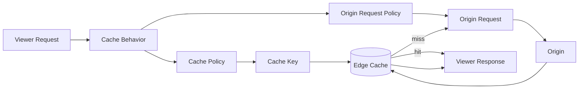
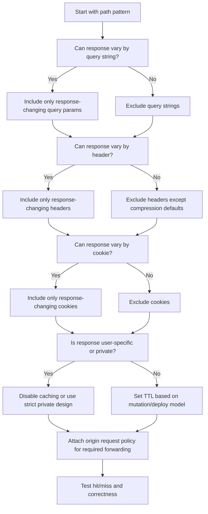

# Part 055 — Cache Key and Origin Request Policy

A CloudFront distribution is easy to create. A correct CloudFront cache design is not.

Most CloudFront incidents are not caused by CloudFront being unavailable. They are caused by one of these mistakes:

1. The cache key is too small, so different users receive the same response.
2. The cache key is too large, so nothing is cached effectively.
3. The origin needs a header/cookie/query string that CloudFront does not forward.
4. CloudFront forwards everything, turning the CDN into an expensive pass-through proxy.
5. TTLs do not match deployment and rollback semantics.
6. Error caching extends an origin incident.
7. Cache behavior order sends a path to the wrong origin or wrong policy.

This part focuses on the two configuration surfaces where these failures are born:

- **Cache policy**: defines the cache key and TTL behavior.
- **Origin request policy**: defines what viewer request values CloudFront forwards to the origin but does not necessarily use as cache identity.

The core invariant is simple:

> Cache key decides whether two viewer requests are allowed to share one cached response. Origin request policy decides what the origin is allowed to see.

Do not blur those two responsibilities.

---

## 1. The Cache Identity Problem

CloudFront does not cache “a URL.” CloudFront caches a response under a computed identity.

At minimum, that identity includes the distribution and object path. Depending on your cache policy, it can also include selected query strings, headers, cookies, compression variants, and sometimes request normalization decisions.

The question is not:

> Should I cache `/api/products`?

The better question is:

> Which request attributes can change the bytes of the response for `/api/products`?

If two requests can legitimately receive different response bodies, they must either:

1. Have different cache keys, or
2. Not be cached at CloudFront.

Example:

```text
GET /products?category=books&sort=popular
GET /products?category=books&sort=price
```

If `sort` changes the response, `sort` must be part of the cache key.

Another example:

```text
GET /dashboard
Cookie: session=alice

GET /dashboard
Cookie: session=bob
```

If `/dashboard` is user-specific, the cache key must include the identity dimension, or caching must be disabled. In most systems, the safer answer is: do not cache authenticated personalized HTML at CloudFront unless the design is deliberately built for it.

---

## 2. Cache Policy vs Origin Request Policy

CloudFront separates cache identity from origin forwarding.



### Cache policy answers

```text
Which values should create separate cached objects?
```

It controls:

- minimum TTL
- default TTL
- maximum TTL
- whether selected headers are in the cache key
- whether selected cookies are in the cache key
- whether selected query strings are in the cache key
- compression-related cache variants

### Origin request policy answers

```text
Which values should CloudFront forward to the origin even if they do not define cache identity?
```

It controls forwarding of:

- headers
- cookies
- query strings

A key AWS behavior to internalize:

> Values included in the cache key are automatically included in origin requests. Origin request policy adds extra forwarded values that are not part of cache identity.

So if a header is in the cache key, you do not need to separately forward it in the origin request policy. But if the origin needs a header for logging, tracing, auth, CORS, or feature logic without changing the cached response, that header belongs in the origin request policy, not necessarily in the cache key.

---

## 3. The Two Dangerous Extremes

### Extreme 1 — Cache key too small

```yaml
cache_key:
  path: /profile
  headers: []
  cookies: []
  query_strings: []
```

If `/profile` depends on session, authorization, locale, or tenant, this can leak data.

Failure mode:

```text
Alice requests /profile
CloudFront caches Alice's profile under /profile
Bob requests /profile
CloudFront returns Alice's profile to Bob
```

This is a correctness and security incident.

### Extreme 2 — Cache key too large

```yaml
cache_key:
  headers: all
  cookies: all
  query_strings: all
```

This avoids many correctness bugs, but often destroys caching.

Failure mode:

```text
Request A has tracking query utm_campaign=x
Request B has tracking query utm_campaign=y
Request C has cookie analytics_id=abc
Request D has cookie analytics_id=def

CloudFront treats them as separate cache objects.
```

The origin still receives nearly all traffic, but now the system has extra edge complexity and cache fragmentation.

A good cache key is deliberately small but semantically complete.

---

## 4. The Cache Key Design Algorithm

Use this algorithm for every cache behavior.



A path behavior should have a written contract like this:

```yaml
path_pattern: /assets/*
response_varies_by:
  query_strings: []
  headers: [Accept-Encoding]
  cookies: []
cache_key:
  include_query_strings: none
  include_headers: managed_compression_only
  include_cookies: none
origin_request:
  forward_headers: [Host]
  forward_cookies: none
  forward_query_strings: none
ttl:
  min: 3600
  default: 86400
  max: 31536000
safety:
  asset_names_are_content_hashed: true
```

If you cannot write that contract, the behavior is not production-ready.

---

## 5. Path Pattern Is the First Partition

Before query strings, headers, and cookies, CloudFront uses cache behavior path patterns to decide which behavior applies.

Common behavior split:

```yaml
behaviors:
  - path: /assets/*
    type: immutable_static
  - path: /images/*
    type: transformable_public_media
  - path: /api/public/*
    type: cacheable_public_api
  - path: /api/private/*
    type: dynamic_private_api
  - path: /admin/*
    type: no_cache_private_html
  - path: /*
    type: app_shell
```

Path patterns are not just routing. They are policy boundaries:

- cache key policy
- origin request policy
- allowed methods
- viewer protocol policy
- response headers policy
- compression
- edge function association
- WAF assumptions
- origin selection

If a behavior is too broad, you will eventually mix incompatible cache semantics.

Bad:

```yaml
path: /*
cache_policy: cache_everything
origin_request_policy: forward_all
```

Good:

```yaml
/assets/*      -> long TTL, no cookies, no query strings
/api/public/*  -> short TTL, selected query strings
/api/private/* -> caching disabled, selected auth headers forwarded
/*             -> short HTML TTL or revalidation
```

---

## 6. Query Strings

Query strings are a common source of cache fragmentation.

Example request:

```text
GET /search?q=redis&page=2&utm_source=newsletter&debug=false
```

Not every query parameter is equal.

| Query Parameter | Response-changing? | Cache Key? | Notes |
|---|---:|---:|---|
| `q` | Yes | Yes | Search term changes result. |
| `page` | Yes | Yes | Pagination changes result. |
| `sort` | Usually yes | Yes if used | Sorting changes ordering/body. |
| `utm_source` | No | No | Marketing attribution should not fragment cache. |
| `debug` | Should not be public | Usually no | Avoid debug params on public CDN paths. |
| `session` | Dangerous | No / do not cache | Identity in query string is risky. |

### Query string forwarding options

You generally choose one of these patterns:

```yaml
query_strings: none
```

Use for static assets when query strings should not affect the object.

```yaml
query_strings:
  include:
    - q
    - page
    - sort
```

Use for public APIs/pages where only selected query params change the response.

```yaml
query_strings: all
```

Use rarely. It is safer for correctness but often poor for cache ratio.

### Normalize query strings before caching

If your app treats these as equivalent:

```text
/search?q=aws&page=1
/search?page=1&q=aws
```

make sure your cache design does not accidentally fragment. CloudFront itself has defined behavior around query strings, but application-level canonicalization is still valuable.

Common normalization tactics:

- redirect to canonical query ordering
- remove marketing/tracking parameters at the edge
- reject unsupported query parameters
- map empty/default values to a canonical URL
- use versioned asset filenames instead of query-string cache busting where possible

---

## 7. Headers

Headers are powerful and dangerous in cache keys.

Some headers genuinely change response content:

- `Accept-Encoding`
- `Accept-Language`
- `Origin` for CORS-sensitive responses
- `CloudFront-Viewer-Country` for localized content
- `Authorization` if the response varies by token, which usually means do not cache publicly
- custom tenant/version headers if your architecture uses them

Many headers should not be in the cache key:

- `User-Agent` raw value
- `Referer`
- `X-Forwarded-For`
- `X-Request-ID`
- tracing headers
- analytics headers
- random client hints unless intentionally designed

Raw `User-Agent` is a classic cache killer. There are too many variants. If you need device-specific content, derive a small stable category at the edge:

```text
mobile | tablet | desktop
```

Then vary cache by that derived header, not the raw `User-Agent`.

### Header decision table

| Header | Include in cache key? | Forward to origin? | Reason |
|---|---:|---:|---|
| `Accept-Encoding` | Usually managed | Yes | Compression variant. |
| `Accept-Language` | Sometimes | Sometimes | Only if response language varies. |
| `Origin` | Sometimes | Yes for CORS origins | CORS response may vary. |
| `Authorization` | Rarely | Yes for private API | Usually disable caching. |
| `Host` | Special | Yes | Origin routing/TLS may depend on it. |
| `X-Request-ID` | No | Yes | Trace only, not response identity. |
| `CloudFront-Viewer-Country` | Sometimes | Sometimes | Geo-specific content. |
| `User-Agent` | Avoid raw | Maybe | Use derived category. |

---

## 8. Cookies

Cookies are the most dangerous cache-key dimension because they often contain identity, session, A/B experiment state, tracking data, and random values.

By default, for many cacheable paths, the best cookie policy is:

```yaml
cookies: none
```

For public static assets, cookies should almost never be part of cache identity.

Bad:

```text
GET /assets/app.9f3a.js
Cookie: session=abc; analytics_id=123; ab_bucket=B
```

If CloudFront caches by all cookies, this asset becomes fragmented by every session and analytics cookie.

Good:

```yaml
/assets/*:
  cache_key:
    cookies: none
  origin_request:
    cookies: none
```

### When cookies may belong in the cache key

Cookies may be valid cache dimensions for:

- public A/B variants
- locale selection
- currency selection
- theme selection
- anonymous personalization buckets

Even then, include only the specific cookie:

```yaml
cookies:
  include:
    - locale
    - currency
    - ab_bucket
```

Never casually include all cookies.

### Session cookies and private content

If a response depends on `session`, `id_token`, `access_token`, or equivalent identity state, do not make it publicly cacheable by accident.

Safer pattern:

```yaml
/api/private/*:
  cache_policy: CachingDisabled
  origin_request_policy:
    headers:
      include:
        - Authorization
    cookies:
      include:
        - session
```

CloudFront can still help with TLS termination, WAF, connection reuse, and global ingress even when caching is disabled.

---

## 9. TTLs Are Correctness Contracts

TTL is not just performance tuning. TTL is a statement about how long stale data is acceptable.

CloudFront cache policy has:

- **minimum TTL**
- **default TTL**
- **maximum TTL**

The origin may send cache headers such as:

```http
Cache-Control: public, max-age=3600, stale-while-revalidate=60
ETag: "abc123"
Last-Modified: Mon, 06 Jul 2026 01:00:00 GMT
```

CloudFront evaluates origin cache headers within the boundaries configured by policy.

### Practical TTL classes

| Content Type | Suggested Strategy | Reason |
|---|---|---|
| Hashed static asset | Long TTL | Filename changes when content changes. |
| HTML app shell | Short TTL / revalidate | Must pick up deploy changes. |
| Public product catalog | Short-medium TTL | Usually tolerates brief staleness. |
| Search result | Short TTL or no cache | Query diversity and freshness. |
| Private user API | No cache | Identity-specific. |
| Error response | Explicit low TTL | Avoid incident amplification. |

### Immutable asset pattern

Best production static asset pattern:

```text
/app.4fd2a92.js
/styles.18cd01.css
/logo.71ab90.svg
```

Headers:

```http
Cache-Control: public, max-age=31536000, immutable
```

Deploy creates new filenames. Rollback points HTML to old known-good filenames. Invalidation is not the primary deployment mechanism.

### Mutable asset anti-pattern

```text
/app.js
/styles.css
```

Headers:

```http
Cache-Control: public, max-age=31536000
```

When overwritten in place, viewers can hold stale versions for a long time. This creates mixed deployments:

```text
HTML version: new
JS version: old
API contract: new
Client behavior: broken
```

---

## 10. Cache-Control Headers and CloudFront Policy

A cache policy is the boundary. Origin headers are the content owner’s intent.

A strong architecture defines both.

Example for immutable assets:

```http
Cache-Control: public, max-age=31536000, immutable
```

CloudFront cache policy:

```yaml
min_ttl: 3600
default_ttl: 86400
max_ttl: 31536000
```

Example for HTML:

```http
Cache-Control: public, max-age=60, stale-while-revalidate=30
```

CloudFront cache policy:

```yaml
min_ttl: 0
default_ttl: 60
max_ttl: 300
```

Example for private API:

```http
Cache-Control: private, no-store
```

CloudFront behavior:

```yaml
cache_policy: CachingDisabled
```

Do not rely on only one side if different teams own origin and edge. The origin and CloudFront policy must be reviewed together.

---

## 11. Managed Cache Policies vs Custom Cache Policies

AWS provides managed cache policies. They are useful baselines, but production teams often need custom policies for explicit contracts.

Typical managed-style choices:

| Use Case | Policy Style |
|---|---|
| Static optimized assets | Optimized caching, minimal key. |
| Dynamic requests | Caching disabled. |
| Origin cache-control aware | Respect origin headers within policy bounds. |
| Amplify/web framework | Framework-specific managed policy. |

Custom policy is justified when:

- only selected query params should vary response
- only selected cookies define variants
- selected headers define localization/device behavior
- TTL contract differs by path
- security review requires explicit policy names
- multi-team platform wants reusable policy modules

Policy names should encode intent:

```text
cf-cache-static-hashed-assets-v1
cf-cache-public-api-search-v1
cf-cache-html-short-ttl-v1
cf-cache-private-disabled-v1
cf-origin-api-auth-cors-trace-v1
```

Do not name policies after implementation only:

```text
policy-1
all-headers
new-cache-policy
```

That becomes unreviewable at scale.

---

## 12. Origin Request Policy as a Least-Privilege Boundary

Treat origin request policy like an API contract.

The origin should receive only the request attributes it needs.

### Example: public static S3 origin

```yaml
origin_request_policy:
  headers: none
  cookies: none
  query_strings: none
```

### Example: API origin with CORS and tracing

```yaml
origin_request_policy:
  headers:
    include:
      - Origin
      - Access-Control-Request-Method
      - Access-Control-Request-Headers
      - Authorization
      - Content-Type
      - X-Request-ID
      - X-Correlation-ID
  cookies:
    include:
      - session
  query_strings:
    include:
      - q
      - page
      - sort
```

### Example: custom origin needing host-based routing

```yaml
origin_request_policy:
  headers:
    include:
      - Host
```

Be careful with `Host`. It affects origin virtual host routing and TLS certificate matching. If CloudFront connects to a custom origin over HTTPS, the origin certificate must match the domain name CloudFront uses for the origin. If Host/SNI/origin domain are inconsistent, 502 failures are common.

---

## 13. CORS and Cache Keys

CORS often fails because engineers forward `Origin` but do not reason about caching.

Suppose the origin returns:

```http
Access-Control-Allow-Origin: https://app.example.com
```

If the response varies by request `Origin`, and CloudFront caches the response without `Origin` in the cache key, another viewer origin may receive the wrong CORS header.

Possible designs:

### Design A — Single allowed origin

If there is exactly one allowed origin, the origin can always return the same `Access-Control-Allow-Origin`. `Origin` may need forwarding for logic, but not necessarily cache identity.

### Design B — Multiple specific allowed origins

If response changes based on viewer `Origin`, include `Origin` in the cache key or avoid caching the CORS-sensitive response.

### Design C — Public wildcard response

For truly public resources:

```http
Access-Control-Allow-Origin: *
```

Then `Origin` does not change the response body/header semantics.

### CORS preflight

For `OPTIONS` requests, check:

- allowed methods include `OPTIONS`
- cached methods include `OPTIONS` if safe
- `Origin` is forwarded if origin needs it
- `Access-Control-Request-Method` is forwarded
- `Access-Control-Request-Headers` is forwarded
- cache key includes dimensions that change preflight response

CORS bugs are usually cache identity bugs disguised as browser errors.

---

## 14. Authorization Header and Caching

`Authorization` deserves special treatment.

Requests with `Authorization` usually imply user-specific or permission-specific responses. Caching such responses at a shared edge is dangerous unless you are deliberately building a token-aware cache.

Common safe pattern:

```yaml
/api/private/*:
  cache_policy: CachingDisabled
  origin_request_policy:
    headers:
      include:
        - Authorization
```

For public APIs that accept optional authorization but return the same public content, split paths or normalize behavior:

```yaml
/api/public/*:
  cache_policy: PublicApiSelectedQueryParams
  origin_request_policy:
    headers:
      exclude:
        - Authorization
```

Do not let optional identity headers silently make public cache behavior unsafe.

If the origin response changes based on permissions, the response is not globally shareable.

---

## 15. Compression and Cache Variants

CloudFront can cache compressed variants. Compression intersects with cache key because a Brotli-capable viewer and a gzip-only viewer may need different response encodings.

A common optimized static policy includes normalized `Accept-Encoding` behavior for gzip/Brotli. Do not include raw `Accept-Encoding` yourself unless you understand the implications.

Good mental model:

```text
Object identity: /assets/app.js
Representation variants:
  - gzip
  - br
  - uncompressed fallback
```

The content is logically the same, but the representation differs.

Compression is usually good for:

- HTML
- CSS
- JavaScript
- JSON
- SVG
- text assets

Compression is usually wasteful for already compressed formats:

- JPEG
- PNG
- WebP
- AVIF
- MP4
- ZIP
- gzip files

---

## 16. Error Caching

CloudFront can cache error responses. This can be helpful or harmful.

Helpful:

```text
Origin returns 404 for missing immutable asset.
CloudFront caches 404 briefly.
Origin is protected from repeated miss storms.
```

Harmful:

```text
Origin has transient 500 for 30 seconds.
CloudFront caches 500 for 5 minutes.
Incident continues from viewer perspective after origin recovered.
```

Set error caching intentionally by path.

| Error | Suggested Thinking |
|---|---|
| 404 on immutable asset | Can cache moderately. |
| 403 from protected origin | Cache carefully; can hide permission fixes. |
| 500/502/503/504 | Usually low TTL. |
| API errors | Very low or no error caching. |

Error caching TTL is part of incident recovery time.

---

## 17. Stale Content and Revalidation

CloudFront can revalidate cached objects with the origin using validators such as `ETag` and `Last-Modified`, depending on origin headers and request flow.

The production question is:

> Is stale content safer than origin overload?

For static assets, stale is often fine if assets are immutable.

For product prices, compliance notices, regulatory status, account balances, or permission-sensitive state, stale content may be unacceptable.

Classify content:

```yaml
content_freshness:
  immutable_asset:
    stale_allowed: yes
    ttl: long
  public_catalog:
    stale_allowed: briefly
    ttl: minutes
  legal_notice:
    stale_allowed: maybe_no
    ttl: carefully_reviewed
  user_balance:
    stale_allowed: no
    cache: disabled
```

A CDN is not just a performance tool. It is a data freshness policy engine.

---

## 18. Cache Hit Ratio Engineering

Cache hit ratio is not a vanity metric. It changes origin scale, latency, cost, and incident behavior.

But a high hit ratio is not always good if achieved by caching the wrong content.

### Hit ratio levers

1. Reduce cache key dimensions.
2. Remove non-response-changing query parameters.
3. Exclude tracking cookies.
4. Use hashed immutable asset names.
5. Increase TTL where safe.
6. Split behaviors by content class.
7. Normalize URLs.
8. Avoid raw `User-Agent` in key.
9. Cache common public API responses.
10. Use origin shield where origin fan-out is expensive.

### Cache fragmentation example

Without normalization:

```text
/product/123?utm_source=a
/product/123?utm_source=b
/product/123?utm_source=c
/product/123?ref=x
/product/123?ref=y
```

All may become separate cache entries.

With normalization:

```text
/product/123
```

One cached object serves all variants if marketing parameters do not change response.

---

## 19. Observability for Cache Policy

When debugging CloudFront caching, ask five questions:

1. Which cache behavior matched?
2. Which cache policy was attached?
3. Which origin request policy was attached?
4. Was the result a hit, miss, refresh hit, error, or redirect?
5. Which request dimensions were included in the cache key?

Useful signals:

- CloudFront standard logs
- CloudFront real-time logs
- `X-Cache` response header
- `Age` response header
- CloudWatch cache hit rate metrics
- origin access logs
- ALB/API Gateway/S3 logs
- synthetic probes with controlled headers/cookies/query strings

Example test matrix:

```bash
curl -I 'https://www.example.com/search?q=aws&page=1&utm_source=a'
curl -I 'https://www.example.com/search?q=aws&page=1&utm_source=b'
curl -I 'https://www.example.com/search?q=aws&page=2&utm_source=a'
```

Expected behavior:

- first and second should share cache if `utm_source` is ignored
- first and third should not share cache if `page` changes response

Do not rely on intuition. Prove cache identity with controlled requests.

---

## 20. Policy Design by Content Type

### Hashed static assets

```yaml
path: /assets/*
allowed_methods: [GET, HEAD]
cache_policy:
  query_strings: none
  headers: compression_only
  cookies: none
  ttl: long
origin_request_policy:
  query_strings: none
  headers: minimal
  cookies: none
origin_headers:
  Cache-Control: public, max-age=31536000, immutable
```

### App shell HTML

```yaml
path: /*
allowed_methods: [GET, HEAD]
cache_policy:
  query_strings: selected_if_routes_use_them
  headers: maybe_accept_language
  cookies: none_or_selected_public_variant
  ttl: short
origin_headers:
  Cache-Control: public, max-age=60, stale-while-revalidate=30
```

### Public API

```yaml
path: /api/public/*
allowed_methods: [GET, HEAD, OPTIONS]
cache_policy:
  query_strings:
    include: [category, page, sort]
  headers:
    include: [Origin] # only if CORS response varies by origin
  cookies: none
  ttl: 30-300
origin_request_policy:
  headers:
    include: [Origin, Access-Control-Request-Method, Access-Control-Request-Headers, X-Request-ID]
```

### Private API

```yaml
path: /api/private/*
allowed_methods: [GET, HEAD, OPTIONS, POST, PUT, PATCH, DELETE]
cache_policy: CachingDisabled
origin_request_policy:
  headers:
    include: [Authorization, Content-Type, Origin, X-Request-ID, X-Correlation-ID]
  cookies:
    include: [session]
  query_strings: all_or_selected
```

### Downloads

```yaml
path: /downloads/*
allowed_methods: [GET, HEAD]
cache_policy:
  query_strings: none
  headers: compression_if_text
  cookies: none
  ttl: medium_or_long
origin_request_policy: minimal
security:
  signed_urls_or_cookies: if_private
```

---

## 21. Cache Behavior Ordering

CloudFront behavior matching makes ordering matter. More specific path patterns must be evaluated before generic ones.

Bad:

```yaml
behaviors:
  - path: /*
    policy: static_cache
  - path: /api/private/*
    policy: no_cache
```

If the default behavior catches everything, private API may inherit unsafe caching.

Good:

```yaml
behaviors:
  - path: /api/private/*
    policy: no_cache
  - path: /api/public/*
    policy: public_api_cache
  - path: /assets/*
    policy: static_assets
  - path: /*
    policy: app_shell
```

Governance rule:

> Every new CloudFront behavior must declare data classification, cache key dimensions, forwarded dimensions, and allowed methods.

---

## 22. Cache Policy and Security Review

Security review should ask these questions:

1. Can two authenticated users share this cached response?
2. Does the response contain tenant-specific data?
3. Does authorization affect response shape?
4. Are cookies included in the cache key? Which ones?
5. Are tokens forwarded to origin? Are they logged by accident?
6. Does CORS response vary by `Origin`?
7. Can direct origin access bypass CloudFront policy?
8. Are error responses cached too long?
9. Are redirects cacheable? Are they user-specific?
10. Are signed URLs/cookies used for private downloads?

Cache correctness is security correctness.

---

## 23. Cache Policy and Cost Review

CloudFront cost is affected by:

- request volume
- data transfer
- cache hit ratio
- origin fetch volume
- invalidation volume
- real-time log volume
- function invocations
- origin shield usage

A poor cache key can increase origin cost while still charging edge request cost.

Cost anti-pattern:

```yaml
cache_policy:
  headers: all
  cookies: all
  query_strings: all
```

This often produces:

```text
low hit ratio + high CloudFront requests + high origin requests + complex debugging
```

A cost-efficient design is usually:

```text
cache aggressively where safe
cache briefly where freshness matters
do not cache where identity matters
strip/ignore dimensions that do not change response
```

---

## 24. Deployment and Rollback Implications

Cache policy must be compatible with deployment strategy.

### Static asset deploy

```text
Build app.123.js
Upload app.123.js
Upload index.html referencing app.123.js
Cache app.123.js long
Cache index.html short
```

Rollback:

```text
Point index.html back to app.122.js
No need to purge long-lived assets
```

### API deploy

If API behavior changes but cached public API responses remain old, clients may observe mixed contract states.

Mitigations:

- version API paths
- reduce TTL during risky deploy
- invalidate selected paths
- include API version in URL or response dimension
- do blue/green with behavior/origin routing

### Config deploy

Changing cache policy is a global distribution configuration change. It is not the same as changing application code. Roll it out with review, canaries, and rollback plan.

---

## 25. Practical Implementation Blueprint

A practical CloudFront policy module could expose high-level profiles:

```typescript
export type CacheProfile =
  | 'static-hashed'
  | 'html-short'
  | 'public-api-selected-query'
  | 'private-api-no-cache'
  | 'download-private'
  | 'image-public';
```

Each profile should map to explicit CloudFront policies:

```yaml
static-hashed:
  cache_policy: cf-cache-static-hashed-v1
  origin_request_policy: cf-origin-minimal-v1
  response_headers_policy: cf-security-static-v1

private-api-no-cache:
  cache_policy: cf-cache-disabled-v1
  origin_request_policy: cf-origin-auth-cors-trace-v1
  response_headers_policy: cf-security-api-v1
```

The platform should not let every team invent CloudFront policy from scratch.

Instead, teams choose from reviewed profiles and justify exceptions.

---

## 26. Debugging Runbook

When CloudFront returns stale, wrong, or unexpected content:

```text
1. Identify exact URL, method, headers, cookies, query string.
2. Determine matched cache behavior.
3. Read attached cache policy.
4. Read attached origin request policy.
5. Check X-Cache and Age response headers.
6. Repeat with controlled query/header/cookie variants.
7. Compare CloudFront response with direct origin response if safe.
8. Check origin Cache-Control/ETag/Last-Modified.
9. Check error caching TTLs.
10. Inspect CloudFront logs and origin logs using request ID/timestamp.
11. If wrong object is cached, invalidate specific path only after root cause is understood.
12. Fix cache policy or origin headers; do not use invalidation as permanent fix.
```

### Example: wrong language cached

Symptom:

```text
English user receives Indonesian page.
```

Check:

- Does origin vary response by `Accept-Language`?
- Is `Accept-Language` in cache key?
- Is locale encoded in URL instead, such as `/en/` and `/id/`?
- Is there a locale cookie?
- Is CloudFront Function rewriting path by geography?

Better design:

```text
/en/docs
/id/docs
```

Path-based locale is often simpler and more cacheable than raw `Accept-Language` variance.

### Example: API receives no Authorization header

Symptom:

```text
Origin returns 401 through CloudFront, but direct origin works.
```

Check:

- Is `Authorization` forwarded in origin request policy?
- Is caching disabled for private API?
- Is an edge function stripping headers?
- Is behavior path matching the intended `/api/private/*` rule?

### Example: low hit ratio on static assets

Symptom:

```text
Origin receives most /assets/* requests.
```

Check:

- Are cookies included in cache key?
- Are tracking query strings included?
- Are assets content-hashed?
- Are TTLs too low?
- Are response headers `Cache-Control: no-cache`?
- Are requests using unique signed URLs unnecessarily?

---

## 27. Strong Defaults

For a production platform, use these defaults unless proven otherwise:

```yaml
static_assets:
  include_cookies: false
  include_query_strings: false
  include_headers: compression_only
  ttl: long
  filenames: content_hashed

html:
  include_cookies: false_unless_public_variant
  include_query_strings: selected_only
  ttl: short
  invalidation: allowed_but_not_primary_deploy_strategy

public_api_get:
  include_query_strings: selected_response_changing_only
  include_headers: selected_response_changing_only
  include_cookies: avoid
  ttl: short_to_medium

private_api:
  caching: disabled
  forward_auth: true
  forward_session_cookie: if_used
  forward_trace_headers: true

cors:
  forward_origin: true_if_origin_logic_needed
  cache_by_origin: true_if_response_varies_by_origin
```

---

## 28. Anti-Patterns

### Anti-Pattern 1 — Forward All Headers to Fix One Missing Header

Forward the one missing header. Do not destroy cache ratio by forwarding all headers.

### Anti-Pattern 2 — Include All Cookies for Convenience

Cookies are usually identity and randomness. Include only named public-variant cookies.

### Anti-Pattern 3 — Cache Authenticated HTML by Accident

Do not put `/app/*`, `/dashboard/*`, and `/assets/*` under the same behavior.

### Anti-Pattern 4 — Use Query Strings for Cache Busting and Include All Query Strings

Prefer content-hashed filenames for static assets.

### Anti-Pattern 5 — Treat TTL as Pure Performance

TTL is a correctness, security, rollback, and incident-recovery contract.

### Anti-Pattern 6 — Assume CORS Is Only an Origin Problem

CORS is also a cache-key problem if CORS response varies by request origin.

### Anti-Pattern 7 — Debug CloudFront Without Knowing Matched Behavior

CloudFront distribution config is path-driven. Always identify the matched behavior first.

---

## 29. Mental Model Recap

CloudFront cache design is the art of separating:

```text
request attributes that change the response
from
request attributes the origin merely wants to observe
```

Remember:

1. Cache key defines response identity.
2. Origin request policy defines origin visibility.
3. Values in cache key are automatically forwarded to origin.
4. Extra forwarded values do not need to fragment cache.
5. Cookies and raw headers are dangerous cache dimensions.
6. TTL is a business and operational contract.
7. Cache behavior path patterns are policy boundaries.
8. CORS, authorization, localization, and personalization are cache correctness problems.
9. Hit ratio is good only when correctness is preserved.
10. Every behavior needs a written cache contract.

The next part moves one layer downstream:

> CloudFront origins: S3, ALB, API Gateway, EC2/custom origins, VPC origins, and origin groups.

A strong cache key protects viewers from wrong responses. A strong origin design protects CloudFront from fragile backends.

---

## References

- AWS Documentation — Understand the cache key: https://docs.aws.amazon.com/AmazonCloudFront/latest/DeveloperGuide/understanding-the-cache-key.html
- AWS Documentation — Control the cache key with a policy: https://docs.aws.amazon.com/AmazonCloudFront/latest/DeveloperGuide/controlling-the-cache-key.html
- AWS Documentation — Control origin requests with a policy: https://docs.aws.amazon.com/AmazonCloudFront/latest/DeveloperGuide/controlling-origin-requests.html
- AWS Documentation — Understand how origin request policies and cache policies work together: https://docs.aws.amazon.com/AmazonCloudFront/latest/DeveloperGuide/understanding-how-origin-request-policies-and-cache-policies-work-together.html
- AWS Documentation — Use managed cache policies: https://docs.aws.amazon.com/AmazonCloudFront/latest/DeveloperGuide/using-managed-cache-policies.html
- AWS Documentation — Cache content based on cookies: https://docs.aws.amazon.com/AmazonCloudFront/latest/DeveloperGuide/Cookies.html
- AWS Documentation — HTTP headers and CloudFront behavior: https://docs.aws.amazon.com/AmazonCloudFront/latest/DeveloperGuide/header-caching.html
